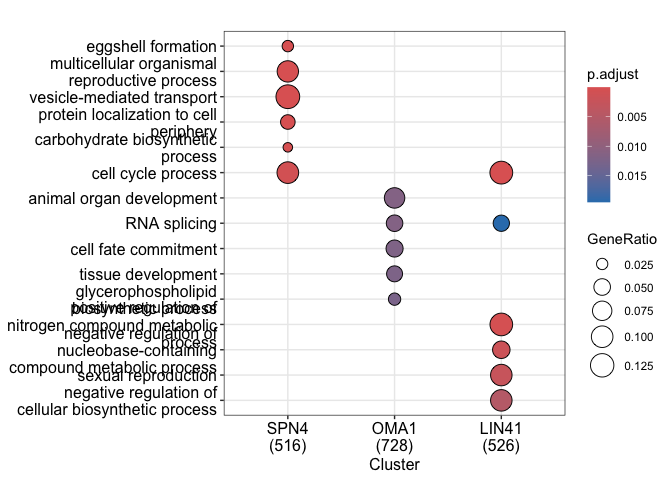
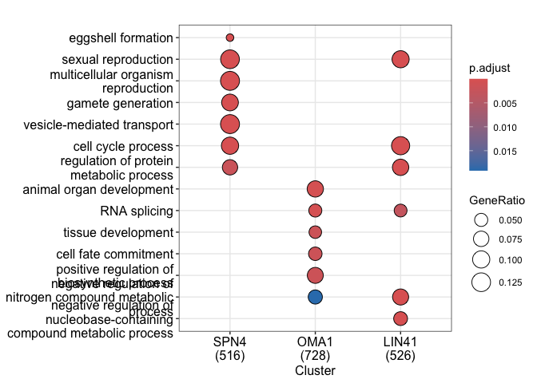
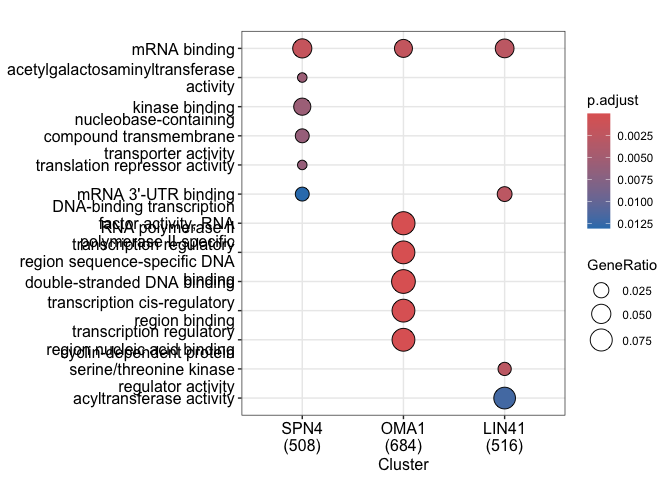
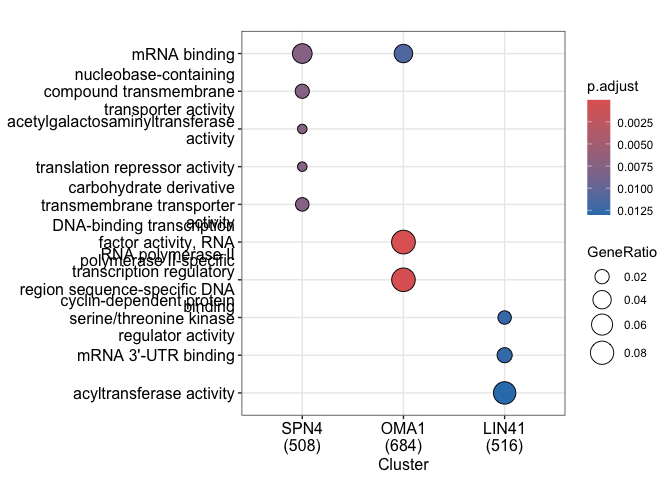
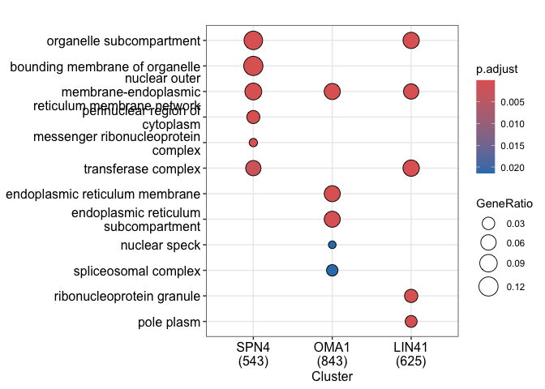
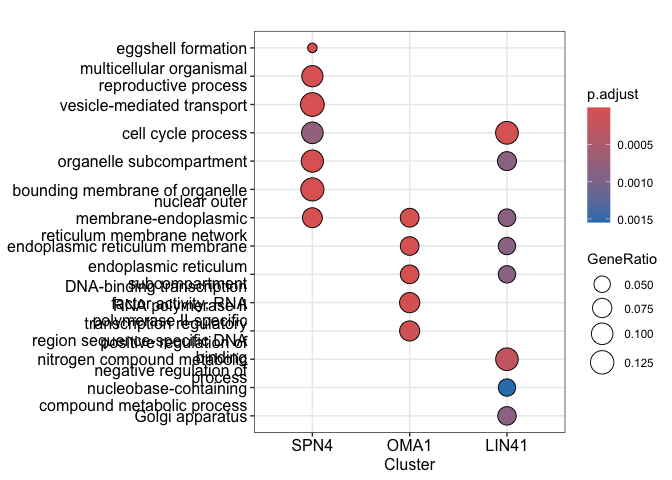
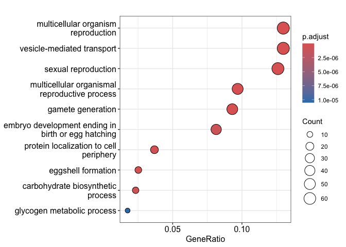

250714_GOontology_SPN4_mRNAs
================
Erin Osborne Nishimura
2025-07-14

## Goal of the project

The goal of this project is to determine which GO Ontology categories are enriched in the set
of SPN-4 associated mRNAs and other categories of mRNAs. We have SPN-4,
LIN-41, and OMA-1 associated mRNA categories. What GO ontology
categories are over-represented in these?

Note - what is the best background data? I tried two different
“universe” or background datasets. 1) all present genes or 2) all Worm
Base genes (default for Cluster Profiler). In the end, we chose the Worm
Base geneset as a “universe” as this best addressed the question: what
gene categories are enriched in the SPN-4, OMA-1, and LIN-41 associated
mRNAs?

## Load modules

Load the following modules:

- clusterProfiler
- enrichplot
- ggplot2

``` r
# Optional installation for cluster profiler:
#if (!require("BiocManager", quietly = TRUE))
#    install.packages("BiocManager")

#BiocManager::install("clusterProfiler")

# Load libraries:
library(clusterProfiler)
library(enrichplot)
library(ggplot2)
```

## Initiate Cluster Profiler

Select org.Ce.eg.db from [Bioconductor Release (3.21), Bioconductor
Annotation
Packages](https://bioconductor.org/packages/3.21/data/annotation/).

``` r
# BiocManager::install("org.Ce.eg.db")
library(org.Ce.eg.db)
organism = "org.Ce.eg.db"
```

## Import datasets

These datasets are lists that were generated in a previous analysis
located in 02_SPN4_LIN41_OMA1_Comparison_Fig_1_S1/04_output_data located
within this same github repository

``` r
# set wd:
setwd("~/Dropbox/github/SPN4_maternal_mRNA/03_GO_Ontology_Fig_S1")
getwd()
```

    ## [1] "/Users/erinnishimura/Library/CloudStorage/Dropbox/github/SPN4_maternal_mRNA/03_GO_Ontology_Fig_S1"

``` r
# import the data files
SPN4_list <- read.table(file = "01_input/20250711_SPN4_list.txt", quote = "")
SPN4_list2 <- sort(SPN4_list$V1, decreasing = TRUE)

OMA1_list <- read.table(file = "01_input/20250711_OMA1_list.txt", quote = "")
OMA1_list2 <- sort(OMA1_list$V1, decreasing = TRUE)

LIN41_list <- read.table(file = "01_input/20250711_LIN41_list.txt", quote = "")
LIN41_list2 <- sort(LIN41_list$V1, decreasing = TRUE)

Present_list <- read.table(file = "01_input/20250715_Presentlist.txt", quote = "")
Present_list2 <- sort(Present_list$V1, decreasing = TRUE)

# merge datasets into a list of vectors:
RBP_list_of_vectors <- list(SPN4 = SPN4_list2, OMA1 = OMA1_list2, LIN41 = LIN41_list2)
```

## Biological Processes

### Compare the clusters

``` r
# Compare the clusters 
compareRBPclusters_BP <- compareCluster(geneCluster = RBP_list_of_vectors, fun = 'enrichGO', OrgDb = 'org.Ce.eg.db', ont = "BP", keyType="WORMBASE", pAdjustMethod = "BH", qvalueCutoff = 0.02)

#universe =  Present_list2,
compareRBPclusters_BP <- setReadable(compareRBPclusters_BP, OrgDb = 'org.Ce.eg.db', keyType="WORMBASE")

## S4 method for signature 'enrichResult'
compareRBPclusters_BP_simple <- simplify( compareRBPclusters_BP,
          cutoff = 0.6,
          by = "p.adjust",
          select_fun = min,
          measure = "Wang",
          semData = NULL)

compareRBPclusters_BP
```

    ## #
    ## # Result of Comparing 3 gene clusters 
    ## #
    ## #.. @fun      enrichGO 
    ## #.. @geneClusters    List of 3
    ##  $ SPN4 : chr [1:728] "WBGene00235348" "WBGene00235346" "WBGene00219908" "WBGene00219803" ...
    ##  $ OMA1 : chr [1:1350] "WBGene00269427" "WBGene00255736" "WBGene00249815" "WBGene00235351" ...
    ##  $ LIN41: chr [1:900] "WBGene00270322" "WBGene00255594" "WBGene00235356" "WBGene00235128" ...
    ## #...Result   'data.frame':   321 obs. of  10 variables:
    ##  $ Cluster    : Factor w/ 3 levels "SPN4","OMA1",..: 1 1 1 1 1 1 1 1 1 1 ...
    ##  $ ID         : chr  "GO:0030703" "GO:0019953" "GO:0032504" "GO:0007276" ...
    ##  $ Description: chr  "eggshell formation" "sexual reproduction" "multicellular organism reproduction" "gamete generation" ...
    ##  $ GeneRatio  : chr  "13/516" "65/516" "67/516" "48/516" ...
    ##  $ BgRatio    : chr  "17/9723" "459/9723" "485/9723" "279/9723" ...
    ##  $ pvalue     : num  4.48e-14 1.63e-13 2.21e-13 2.39e-13 2.44e-13 ...
    ##  $ p.adjust   : num  7.45e-11 7.45e-11 7.45e-11 7.45e-11 7.45e-11 ...
    ##  $ qvalue     : num  5.7e-11 5.7e-11 5.7e-11 5.7e-11 5.7e-11 ...
    ##  $ geneID     : chr  "cyp-31A3/egg-4/egg-5/egg-2/cpg-2/egg-1/cyp-31A2/cbd-1/egg-3/rab-11.1/emb-8/chs-1/cpg-1" "zipt-7.1/cosa-1/cyp-31A3/egg-4/egg-5/egg-2/rmh-1/cdk-2/ubxn-3/atg-18/kca-1/cpg-2/egg-1/gck-3/pzf-1/cyp-31A2/cbd"| __truncated__ "zipt-7.1/cutc-1/cyp-31A3/egg-4/egg-5/egg-2/rmh-1/ubxn-3/atg-18/kca-1/cpg-2/egg-1/eipr-1/gck-3/cyp-31A2/cbd-1/eg"| __truncated__ "zipt-7.1/cyp-31A3/egg-4/egg-5/egg-2/ubxn-3/atg-18/kca-1/cpg-2/egg-1/gck-3/cyp-31A2/cbd-1/egg-3/elli-1/uba-1/tra"| __truncated__ ...
    ##  $ Count      : int  13 65 67 48 67 50 31 37 41 33 ...
    ## #.. number of enriched terms found for each gene cluster:
    ## #..   SPN4: 181 
    ## #..   OMA1: 45 
    ## #..   LIN41: 95 
    ## #
    ## #...Citation
    ## T Wu, E Hu, S Xu, M Chen, P Guo, Z Dai, T Feng, L Zhou, 
    ## W Tang, L Zhan, X Fu, S Liu, X Bo, and G Yu. 
    ## clusterProfiler 4.0: A universal enrichment tool for interpreting omics data. 
    ## The Innovation. 2021, 2(3):100141

``` r
compareRBPclusters_BP_simple
```

    ## #
    ## # Result of Comparing 3 gene clusters 
    ## #
    ## #.. @fun      enrichGO 
    ## #.. @geneClusters    List of 3
    ##  $ SPN4 : chr [1:728] "WBGene00235348" "WBGene00235346" "WBGene00219908" "WBGene00219803" ...
    ##  $ OMA1 : chr [1:1350] "WBGene00269427" "WBGene00255736" "WBGene00249815" "WBGene00235351" ...
    ##  $ LIN41: chr [1:900] "WBGene00270322" "WBGene00255594" "WBGene00235356" "WBGene00235128" ...
    ## #...Result   'data.frame':   83 obs. of  10 variables:
    ##  $ Cluster    : Factor w/ 3 levels "SPN4","OMA1",..: 1 1 1 1 1 1 1 1 1 1 ...
    ##  $ ID         : chr  "GO:0030703" "GO:0019953" "GO:0032504" "GO:0007276" ...
    ##  $ Description: chr  "eggshell formation" "sexual reproduction" "multicellular organism reproduction" "gamete generation" ...
    ##  $ GeneRatio  : chr  "13/516" "65/516" "67/516" "48/516" ...
    ##  $ BgRatio    : chr  "17/9723" "459/9723" "485/9723" "279/9723" ...
    ##  $ pvalue     : num  4.48e-14 1.63e-13 2.21e-13 2.39e-13 2.44e-13 ...
    ##  $ p.adjust   : num  7.45e-11 7.45e-11 7.45e-11 7.45e-11 7.45e-11 ...
    ##  $ qvalue     : num  5.7e-11 5.7e-11 5.7e-11 5.7e-11 5.7e-11 ...
    ##  $ geneID     : chr  "cyp-31A3/egg-4/egg-5/egg-2/cpg-2/egg-1/cyp-31A2/cbd-1/egg-3/rab-11.1/emb-8/chs-1/cpg-1" "zipt-7.1/cosa-1/cyp-31A3/egg-4/egg-5/egg-2/rmh-1/cdk-2/ubxn-3/atg-18/kca-1/cpg-2/egg-1/gck-3/pzf-1/cyp-31A2/cbd"| __truncated__ "zipt-7.1/cutc-1/cyp-31A3/egg-4/egg-5/egg-2/rmh-1/ubxn-3/atg-18/kca-1/cpg-2/egg-1/eipr-1/gck-3/cyp-31A2/cbd-1/eg"| __truncated__ "zipt-7.1/cyp-31A3/egg-4/egg-5/egg-2/ubxn-3/atg-18/kca-1/cpg-2/egg-1/gck-3/cyp-31A2/cbd-1/egg-3/elli-1/uba-1/tra"| __truncated__ ...
    ##  $ Count      : int  13 65 67 48 67 50 19 42 12 9 ...
    ## #.. number of enriched terms found for each gene cluster:
    ## #..   SPN4: 45 
    ## #..   OMA1: 15 
    ## #..   LIN41: 23 
    ## #
    ## #...Citation
    ## T Wu, E Hu, S Xu, M Chen, P Guo, Z Dai, T Feng, L Zhou, 
    ## W Tang, L Zhan, X Fu, S Liu, X Bo, and G Yu. 
    ## clusterProfiler 4.0: A universal enrichment tool for interpreting omics data. 
    ## The Innovation. 2021, 2(3):100141

``` r
# Plot the clusters
dotplot(compareRBPclusters_BP)
```

<!-- -->

``` r
dotplot(compareRBPclusters_BP_simple)
```

<!-- -->

``` r
help(dotplot)
```

    ## Help on topic 'dotplot' was found in the following packages:
    ## 
    ##   Package               Library
    ##   enrichplot            /Library/Frameworks/R.framework/Versions/4.3-x86_64/Resources/library
    ##   graphics              /Library/Frameworks/R.framework/Versions/4.3-x86_64/Resources/library
    ##   lattice               /Library/Frameworks/R.framework/Versions/4.3-x86_64/Resources/library
    ##   clusterProfiler       /Library/Frameworks/R.framework/Versions/4.3-x86_64/Resources/library
    ## 
    ## 
    ## Using the first match ...

### Save the plot

Print Biological Processes plot to a file. Use this in Supplemental
Figure.

``` r
# Save the plot 
setwd("~/Dropbox/github/SPN4_maternal_mRNA/03_GO_Ontology_Fig_S1")

pdf("03_output/SPN4_OMA1_LIN41_dotPlot_BP.pdf", height = 10, width = 10)
cluster.p1 <- dotplot(compareRBPclusters_BP_simple, 
              title = "GO Enrichment (Biological Process)")
cluster.p1 + theme(
  axis.text.y = element_text(size = 15),
  axis.text.x = element_text(size = 15),
  legend.text = element_text(size = 15)
  )

dev.off()
```

    ## quartz_off_screen 
    ##                 2

## Identify key genes

Determine the genes that are in each GO ontology category

Use these gene names in the Supplemental Figure

    ##  [1] "eggshell formation"                                                     
    ##  [2] "sexual reproduction"                                                    
    ##  [3] "multicellular organism reproduction"                                    
    ##  [4] "gamete generation"                                                      
    ##  [5] "vesicle-mediated transport"                                             
    ##  [6] "multicellular organismal reproductive process"                          
    ##  [7] "protein localization to cell periphery"                                 
    ##  [8] "embryo development ending in birth or egg hatching"                     
    ##  [9] "carbohydrate biosynthetic process"                                      
    ## [10] "glycogen metabolic process"                                             
    ## [11] "energy reserve metabolic process"                                       
    ## [12] "cell cycle process"                                                     
    ## [13] "localization within membrane"                                           
    ## [14] "carbohydrate derivative metabolic process"                              
    ## [15] "response to topologically incorrect protein"                            
    ## [16] "epithelium development"                                                 
    ## [17] "ubiquitin-dependent protein catabolic process"                          
    ## [18] "response to endoplasmic reticulum stress"                               
    ## [19] "intracellular pH reduction"                                             
    ## [20] "organophosphate metabolic process"                                      
    ## [21] "protein transport"                                                      
    ## [22] "glycolipid biosynthetic process"                                        
    ## [23] "larval development"                                                     
    ## [24] "regulation of cellular component organization"                          
    ## [25] "post-translational protein modification"                                
    ## [26] "regulation of protein metabolic process"                                
    ## [27] "negative regulation of translation"                                     
    ## [28] "cell migration"                                                         
    ## [29] "negative regulation of amide metabolic process"                         
    ## [30] "negative regulation of macromolecule biosynthetic process"              
    ## [31] "carbohydrate derivative transport"                                      
    ## [32] "membrane organization"                                                  
    ## [33] "small GTPase mediated signal transduction"                              
    ## [34] "import into cell"                                                       
    ## [35] "receptor localization to synapse"                                       
    ## [36] "regulation of microtubule-based process"                                
    ## [37] "post-transcriptional regulation of gene expression"                     
    ## [38] "nucleobase-containing small molecule metabolic process"                 
    ## [39] "regulation of programmed cell death"                                    
    ## [40] "establishment of vesicle localization"                                  
    ## [41] "protein folding"                                                        
    ## [42] "protein maturation"                                                     
    ## [43] "regulation of protein phosphorylation"                                  
    ## [44] "maintenance of protein location"                                        
    ## [45] "regulation of synapse structure or activity"                            
    ## [46] "animal organ development"                                               
    ## [47] "RNA splicing"                                                           
    ## [48] "tissue development"                                                     
    ## [49] "cell fate commitment"                                                   
    ## [50] "positive regulation of biosynthetic process"                            
    ## [51] "positive regulation of cellular biosynthetic process"                   
    ## [52] "positive regulation of DNA-templated transcription"                     
    ## [53] "positive regulation of RNA biosynthetic process"                        
    ## [54] "sex differentiation"                                                    
    ## [55] "glycerophospholipid biosynthetic process"                               
    ## [56] "protein N-linked glycosylation"                                         
    ## [57] "positive regulation of developmental process"                           
    ## [58] "regulation of cell differentiation"                                     
    ## [59] "negative regulation of nitrogen compound metabolic process"             
    ## [60] "regulation of vulval development"                                       
    ## [61] "cell cycle process"                                                     
    ## [62] "regulation of protein metabolic process"                                
    ## [63] "negative regulation of nitrogen compound metabolic process"             
    ## [64] "sexual reproduction"                                                    
    ## [65] "negative regulation of nucleobase-containing compound metabolic process"
    ## [66] "negative regulation of cellular biosynthetic process"                   
    ## [67] "cell division"                                                          
    ## [68] "developmental process involved in reproduction"                         
    ## [69] "regulation of transferase activity"                                     
    ## [70] "RNA splicing"                                                           
    ## [71] "regulation of translation"                                              
    ## [72] "peptidyl-cysteine modification"                                         
    ## [73] "regulation of amide metabolic process"                                  
    ## [74] "nuclear division"                                                       
    ## [75] "positive regulation of oocyte development"                              
    ## [76] "post-transcriptional regulation of gene expression"                     
    ## [77] "cell maturation"                                                        
    ## [78] "phosphatidylinositol metabolic process"                                 
    ## [79] "organic anion transport"                                                
    ## [80] "mannosylation"                                                          
    ## [81] "regulation of proteasomal protein catabolic process"                    
    ## [82] "embryonic pattern specification"                                        
    ## [83] "positive regulation of developmental process"

    ## [1] "eggshell formation"

    ## [1] "cyp-31A3/egg-4/egg-5/egg-2/cpg-2/egg-1/cyp-31A2/cbd-1/egg-3/rab-11.1/emb-8/chs-1/cpg-1"

    ## [1] 13

    ## [1] "sexual reproduction"

    ## [1] "zipt-7.1/cosa-1/cyp-31A3/egg-4/egg-5/egg-2/rmh-1/cdk-2/ubxn-3/atg-18/kca-1/cpg-2/egg-1/gck-3/pzf-1/cyp-31A2/cbd-1/egg-3/elli-1/zhp-2/uba-1/tra-1/syp-3/syp-2/sqv-8/spo-11/spe-5/sos-1/rme-2/rad-54.L/rab-11.1/rab-7/rab-6.1/puf-7/puf-6/puf-5/plp-1/pkc-3/oma-2/oma-1/nos-2/nos-1/nhr-23/mpk-1/mog-2/lip-1/lin-41/let-60/ima-2/hpl-1/gsk-3/glh-2/fog-1/emb-30/emb-8/cpb-1/cmd-1/chs-1/cgh-1/cep-1/cpg-1/atx-2/apx-1/aph-1/apc-10"

    ## [1] 65

    ## [1] "multicellular organism reproduction"

    ## [1] "zipt-7.1/cutc-1/cyp-31A3/egg-4/egg-5/egg-2/rmh-1/ubxn-3/atg-18/kca-1/cpg-2/egg-1/eipr-1/gck-3/cyp-31A2/cbd-1/egg-3/elli-1/scpl-1/unc-16/uba-1/tra-1/sqv-8/sqv-7/sqv-5/sqv-4/sqv-3/sqv-2/sqv-1/spe-5/sos-1/sek-1/rme-2/rab-11.1/rab-7/puf-7/puf-6/puf-5/plp-1/oma-2/oma-1/nos-2/nos-1/nhr-23/mpk-1/lip-1/lin-59/lin-41/let-60/hpl-1/hlh-3/gsk-3/glh-2/fox-1/fog-1/emb-8/daf-31/dab-1/cyd-1/cpb-1/chs-1/cgh-1/cpg-1/ced-3/atx-2/apx-1/aph-1"

    ## [1] 67

    ## [1] "gamete generation"

    ## [1] "zipt-7.1/cyp-31A3/egg-4/egg-5/egg-2/ubxn-3/atg-18/kca-1/cpg-2/egg-1/gck-3/cyp-31A2/cbd-1/egg-3/elli-1/uba-1/tra-1/sqv-8/spe-5/sos-1/rme-2/rab-11.1/rab-7/puf-7/puf-6/puf-5/plp-1/oma-2/oma-1/nos-2/nos-1/nhr-23/mpk-1/lip-1/lin-41/let-60/hpl-1/gsk-3/glh-2/fog-1/emb-8/cpb-1/chs-1/cgh-1/cpg-1/atx-2/apx-1/aph-1"

    ## [1] 48

    ## [1] "vesicle-mediated transport"

    ## [1] "vps-20/Y54E10BR.2/copb-1/vps-24/eat-17/syx-18/ddl-1/F41H10.4/atg-18/F07F6.4/copd-1/tsg-101/mppe-1/vps-51/vps-15/csnk-1/snx-6/rga-1/golg-5/chc-1/T19A6.1/R186.3/M01F1.9/strl-1/rer-1/cope-1/piki-1/ndk-1/vps-36/F11A10.6/ctns-1/C31E10.6/C31E10.5/vps-52/vps-54/vps-35/unc-108/unc-16/unc-11/tfg-1/vps-16/snx-3/itsn-1/snt-2/rme-2/rme-1/rab-14/rab-11.1/rab-7/rab-6.2/rab-6.1/rab-5/ptr-2/pkc-1/num-1/nsf-1/mig-2/lst-4/ile-1/gsk-3/epn-1/dyn-1/dab-1/cogc-2/cmd-1/ced-6/arl-8"

    ## [1] 67

    ## [1] "cell cycle process"

    ## [1] "szy-4/cosa-1/cyp-31A3/egg-4/T12C9.7/egg-5/rmh-1/cdk-2/cec-4/kca-1/spdl-1/cpg-2/csnk-1/tcc-1/ani-3/mlc-5/chkr-1/pzf-1/lpin-1/cyp-31A2/cpar-1/egg-3/zhp-2/cdc-48.1/syp-3/syp-2/spo-11/rho-1/rad-54.L/rab-11.1/ptr-2/ppk-1/plk-3/oma-2/oma-1/mom-2/mog-2/mab-10/lin-23/ima-2/hpr-17/gsk-3/emb-30/dsh-1/cyd-1/coh-1/cmd-1/chk-2/cep-1/cpg-1/ced-6/atx-2"

    ## [1] 52

## Save the datasets

Save the datasets so that readers can have access to the sets of genes
within each category.

``` r
# output the list 
setwd("~/Dropbox/github/SPN4_maternal_mRNA/03_GO_Ontology_Fig_S1")

write.csv(compareRBPclusters_BP_simple@compareClusterResult, file = "03_output/SPN4_assocRNAs_GO_Ontology.csv",
          quote = FALSE)
```

## Molecular Function

### Compare the clusters

<!-- --><!-- -->

### Save the plot

Print the Molecular Function to a file

``` r
# Save the plot 
setwd("~/Dropbox/github/SPN4_maternal_mRNA/03_GO_Ontology_Fig_S1")

pdf("03_output/SPN4_OMA1_LIN41_dotPlot_MF.pdf", height = 5, width = 10)
cluster.p1 <- dotplot(compareRBPclusters_MF_simple,
              title = "GO Enrichment (Molecular Function)")
cluster.p1 + theme(
  axis.text.y = element_text(size = 15),
  axis.text.x = element_text(size = 15),
  legend.text = element_text(size = 15)
  )

dev.off()
```

    ## quartz_off_screen 
    ##                 2

## Cellular Components

### Compare the clusters

<!-- -->

### Save the plot

Print Cellular Components to a file

``` r
# Save the plot 
setwd("~/Dropbox/github/SPN4_maternal_mRNA/03_GO_Ontology_Fig_S1")

pdf("03_output/SPN4_OMA1_LIN41_dotPlot_CC.pdf", height = 5, width = 10)
cluster.p1 <- dotplot(compareRBPclusters_CC_simple,
              title = "GO Enrichment (Cellular Component)")
cluster.p1 + theme(
  axis.text.y = element_text(size = 15),
  axis.text.x = element_text(size = 15),
  legend.text = element_text(size = 15)
  )

dev.off()
```

    ## quartz_off_screen 
    ##                 2

## ALL Categories

### Compare the clusters

All category ontologies

<!-- -->
\### Save the plot

Print All categories plot to a file

``` r
# Save the plot 
setwd("~/Dropbox/github/SPN4_maternal_mRNA/03_GO_Ontology_Fig_S1")

pdf("03_output/SPN4_OMA1_LIN41_dotPlot_ALL.pdf", height = 5, width = 10)
cluster.p1 <- dotplot(compareRBPclusters_ALL_simple,
              title = "GO Enrichment (ALL Ontologies)")
cluster.p1 + theme(
  axis.text.y = element_text(size = 15),
  axis.text.x = element_text(size = 15),
  legend.text = element_text(size = 15)
  )

dev.off()
```

    ## quartz_off_screen 
    ##                 2

## SPN-4 on its own

I wanted to analyze the SPN-4 set of associated mRNAs in isolation away
from the other RBPs.

``` r
ego_SPN4 <- enrichGO(gene = RBP_list_of_vectors$SPN4,
                universe = names(Present_list2),
                keyType ="WORMBASE", 
                OrgDb = org.Ce.eg.db,
                ont = "BP",
                pAdjustMethod = "BH",
                readable = TRUE)

ego_SPN4_simple <- simplify(ego_SPN4,
          cutoff = 0.55,
          by = "p.adjust",
          select_fun = min,
          measure = "Wang",
          semData = NULL)

# Print
dotplot(ego_SPN4_simple)
```

<!-- -->

## Save the plot

Print SPN-4 only plot to a file

    ## quartz_off_screen 
    ##                 2

## Session Info

``` r
sessionInfo()
```

    ## R version 4.3.1 (2023-06-16)
    ## Platform: x86_64-apple-darwin20 (64-bit)
    ## Running under: macOS 15.4.1
    ## 
    ## Matrix products: default
    ## BLAS:   /Library/Frameworks/R.framework/Versions/4.3-x86_64/Resources/lib/libRblas.0.dylib 
    ## LAPACK: /Library/Frameworks/R.framework/Versions/4.3-x86_64/Resources/lib/libRlapack.dylib;  LAPACK version 3.11.0
    ## 
    ## locale:
    ## [1] en_US.UTF-8/en_US.UTF-8/en_US.UTF-8/C/en_US.UTF-8/en_US.UTF-8
    ## 
    ## time zone: America/Denver
    ## tzcode source: internal
    ## 
    ## attached base packages:
    ## [1] stats4    stats     graphics  grDevices utils     datasets  methods  
    ## [8] base     
    ## 
    ## other attached packages:
    ## [1] org.Ce.eg.db_3.18.0    AnnotationDbi_1.64.1   IRanges_2.36.0        
    ## [4] S4Vectors_0.40.2       Biobase_2.62.0         BiocGenerics_0.48.1   
    ## [7] ggplot2_3.5.2          enrichplot_1.22.0      clusterProfiler_4.10.1
    ## 
    ## loaded via a namespace (and not attached):
    ##   [1] DBI_1.2.3               bitops_1.0-9            gson_0.1.0             
    ##   [4] shadowtext_0.1.5        gridExtra_2.3           rlang_1.1.6            
    ##   [7] magrittr_2.0.3          DOSE_3.28.2             compiler_4.3.1         
    ##  [10] RSQLite_2.4.1           png_0.1-8               vctrs_0.6.5            
    ##  [13] reshape2_1.4.4          stringr_1.5.1           pkgconfig_2.0.3        
    ##  [16] crayon_1.5.3            fastmap_1.2.0           XVector_0.42.0         
    ##  [19] labeling_0.4.3          ggraph_2.2.1            HDO.db_0.99.1          
    ##  [22] rmarkdown_2.29          purrr_1.1.0             bit_4.6.0              
    ##  [25] xfun_0.52               zlibbioc_1.48.2         cachem_1.1.0           
    ##  [28] aplot_0.2.8             jsonlite_2.0.0          GenomeInfoDb_1.38.8    
    ##  [31] blob_1.2.4              BiocParallel_1.36.0     tweenr_2.0.3           
    ##  [34] parallel_4.3.1          R6_2.6.1                stringi_1.8.7          
    ##  [37] RColorBrewer_1.1-3      GOSemSim_2.28.1         Rcpp_1.1.0             
    ##  [40] knitr_1.50              Matrix_1.6-4            splines_4.3.1          
    ##  [43] igraph_2.1.4            tidyselect_1.2.1        qvalue_2.34.0          
    ##  [46] rstudioapi_0.17.1       yaml_2.3.10             viridis_0.6.5          
    ##  [49] codetools_0.2-20        lattice_0.22-7          tibble_3.3.0           
    ##  [52] plyr_1.8.9              S7_0.2.0                treeio_1.26.0          
    ##  [55] withr_3.0.2             KEGGREST_1.42.0         evaluate_1.0.4         
    ##  [58] gridGraphics_0.5-1      scatterpie_0.2.5        polyclip_1.10-7        
    ##  [61] Biostrings_2.70.3       pillar_1.11.0           ggtree_3.10.1          
    ##  [64] ggfun_0.2.0             generics_0.1.4          RCurl_1.98-1.17        
    ##  [67] scales_1.4.0            tidytree_0.4.6          glue_1.8.0             
    ##  [70] lazyeval_0.2.2          tools_4.3.1             data.table_1.17.8      
    ##  [73] fgsea_1.28.0            fs_1.6.6                graphlayouts_1.2.2     
    ##  [76] fastmatch_1.1-6         tidygraph_1.3.1         cowplot_1.2.0          
    ##  [79] grid_4.3.1              tidyr_1.3.1             ape_5.8-1              
    ##  [82] colorspace_2.1-1        nlme_3.1-168            GenomeInfoDbData_1.2.11
    ##  [85] patchwork_1.3.1         ggforce_0.5.0           cli_3.6.5              
    ##  [88] viridisLite_0.4.2       dplyr_1.1.4             gtable_0.3.6           
    ##  [91] yulab.utils_0.2.0       digest_0.6.37           ggrepel_0.9.6          
    ##  [94] ggplotify_0.1.2         farver_2.1.2            memoise_2.0.1          
    ##  [97] htmltools_0.5.8.1       lifecycle_1.0.4         httr_1.4.7             
    ## [100] GO.db_3.18.0            bit64_4.6.0-1           MASS_7.3-60
