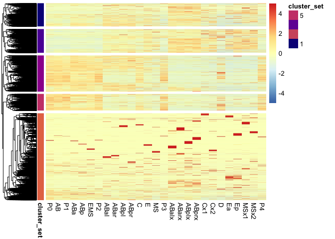
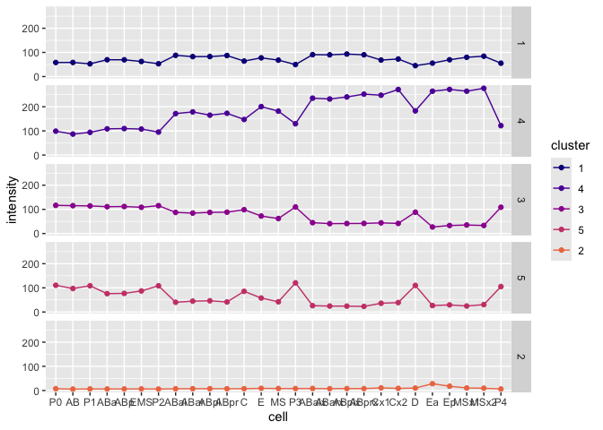
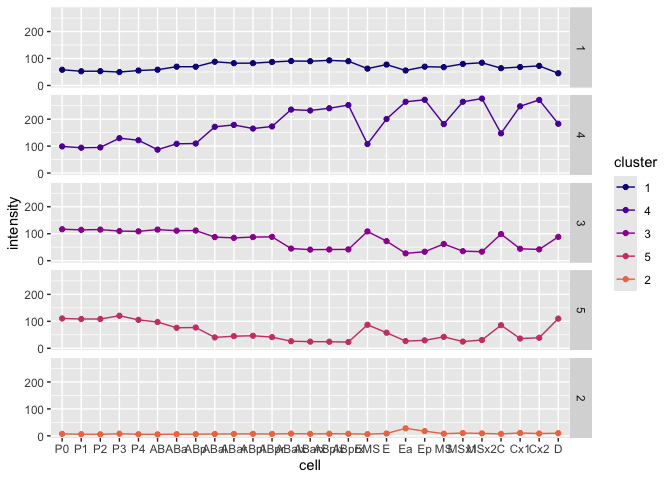
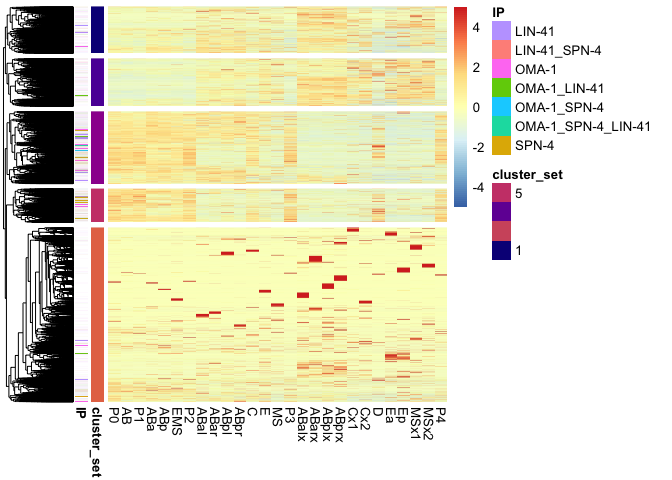
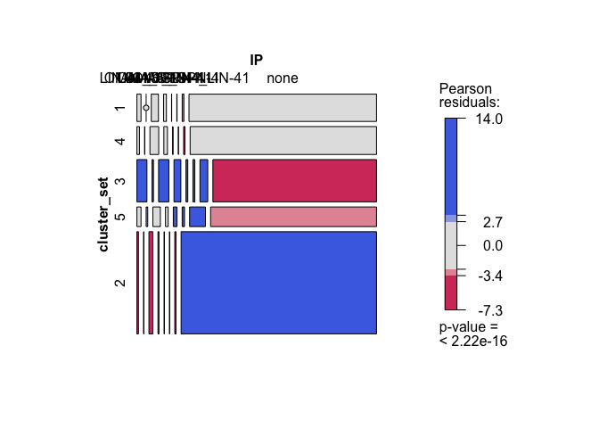
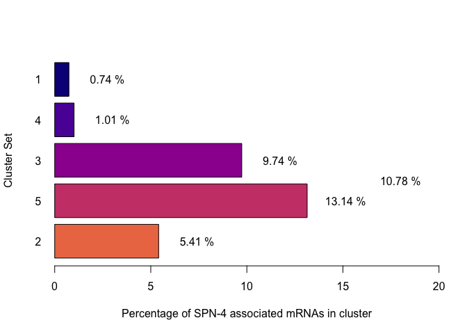
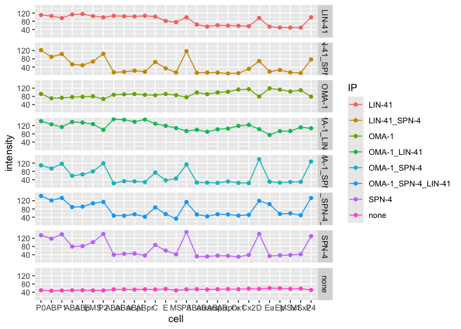
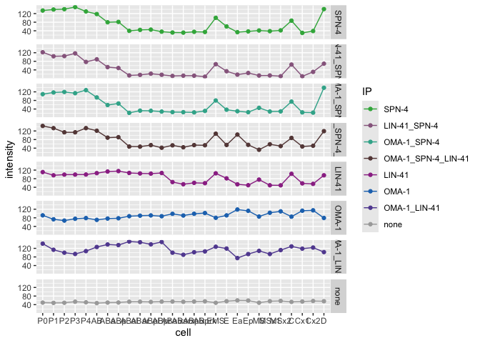
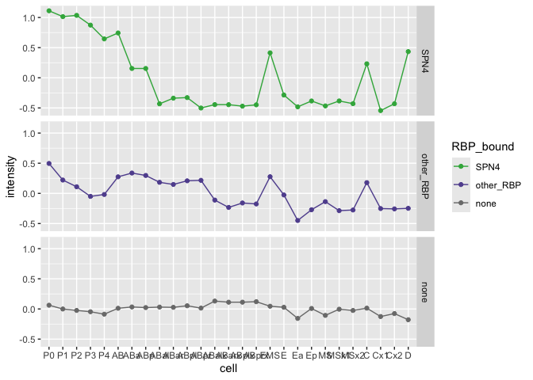

260106_Parsing_scRNA-seq_Tintori
================

- [Transcriptional dynamics of SPN-4 associated mRNAs through early
  embryonic
  development](#transcriptional-dynamics-of-spn-4-associated-mrnas-through-early-embryonic-development)
  - [Load Packages](#load-packages)
  - [Data Import and Munging](#data-import-and-munging)
    - [Import Metadata from Tintori et al
      data](#import-metadata-from-tintori-et-al-data)
    - [Import Tintori et al Normalized RNA-seq
      data](#import-tintori-et-al-normalized-rna-seq-data)
    - [Join the metadata and RNA-seq
      data](#join-the-metadata-and-rna-seq-data)
    - [Filter the data](#filter-the-data)
    - [Import Wormbase identifiers](#import-wormbase-identifiers)
    - [Merge the tintori data with the Wormbase Gene
      identifiers](#merge-the-tintori-data-with-the-wormbase-gene-identifiers)
    - [Import the time-and-anterior-to-posterior cell
      order](#import-the-time-and-anterior-to-posterior-cell-order)
  - [Heatmaps](#heatmaps)
    - [Re-organize datasets by preferred cell type
      order](#re-organize-datasets-by-preferred-cell-type-order)
      - [Optimize for preferred heatmap type (not included in
        paper)](#optimize-for-preferred-heatmap-type-not-included-in-paper)
    - [Split genes into clusters based on
      heatmap](#split-genes-into-clusters-based-on-heatmap)
    - [Save lineplot split by
      clusters](#save-lineplot-split-by-clusters)
  - [Quick experimentation into a different ordering of the
    cells](#quick-experimentation-into-a-different-ordering-of-the-cells)
    - [import the gene lists of SPN-4, OMA-1, and LIN-41
      targets](#import-the-gene-lists-of-spn-4-oma-1-and-lin-41-targets)
    - [Make an annotated heatmap](#make-an-annotated-heatmap)
    - [Save the heatmap](#save-the-heatmap)
  - [Mosaic plots](#mosaic-plots)
    - [Save the barplot (% SPN-4 associated mRNAs in each
      clusteer)](#save-the-barplot--spn-4-associated-mrnas-in-each-clusteer)
    - [Save the mosaic plot](#save-the-mosaic-plot)
  - [Lineplots, split by cluster set](#lineplots-split-by-cluster-set)
    - [Save the lineplot](#save-the-lineplot)
  - [Playing around with a different cell
    order](#playing-around-with-a-different-cell-order)
  - [Additional plots](#additional-plots)
    - [Calculate the clusters that are represented in SPN-4-bound versus
      un-bound
      categories](#calculate-the-clusters-that-are-represented-in-spn-4-bound-versus-un-bound-categories)
    - [Save SPN-4 bound v. unbound stacked, proportional
      barplot](#save-spn-4-bound-v-unbound-stacked-proportional-barplot)
    - [What is the variance of gene expression over developmental
      time?](#what-is-the-variance-of-gene-expression-over-developmental-time)
    - [Output the mean by lineage -
      z-scored](#output-the-mean-by-lineage---z-scored)
    - [Agilent-style transparent
      multi-lineplots](#agilent-style-transparent-multi-lineplots)
    - [Export the alpha-tinted
      multi-lineplot](#export-the-alpha-tinted-multi-lineplot)
  - [Export data tables](#export-data-tables)
    - [Export annotations data tables](#export-annotations-data-tables)
    - [Export changing wide mat](#export-changing-wide-mat)
  - [Session info](#session-info)

# Transcriptional dynamics of SPN-4 associated mRNAs through early embryonic development

This analysis utilizes a single-cell resolution RNA-seq dataset that
assesses expression patterns through the first five cell divisions in
*C. elegans* (Tintori et al., 2016). The goal of this study is to test
the hypothesis that SPN-4 may be involved in clearing maternal mRNAs out
of early embryos. If this is the case, we would expect to see that SPN-4
associated mRNAs are enriched in clusters of maternal transcripts that
undergo decline in early embryos.

Reference:

Tintori SC, Osborne Nishimura E, Golden P, Lieb JD, Goldstein B. [A
Transcriptional Lineage of the Early C. elegans
Embryo](https://pubmed.ncbi.nlm.nih.gov/27554860). Dev Cell. 2016 Aug
22;38(4):430-44. doi: 10.1016/j.devcel.2016.07.025. PMID: 27554860;
PMCID: PMC4999266.

## Load Packages

The following packages are required:

- corrplot
- RColorBrewer
- pheatmap
- tidyverse
- hrbrthemes
- viridis
- vcd

``` r
library(corrplot)
library(RColorBrewer)
library(pheatmap)
library(tidyverse)
library(hrbrthemes)
library(viridis)
library(vcd)
```

Set Working Directory:

    ## [1] "/Users/erinnishimura/Library/CloudStorage/Dropbox/github/SPN4_maternal_mRNA/04_Tintori_et_al_Comparison_Fig_2_S2/02_scripts"

## Data Import and Munging

### Import Metadata from Tintori et al data

This metadata describes each sample in Tintori et al.,

``` r
###########  READ IN THE DATA  #####################

# Import the metadata from Tintori et al.
metadata_tintori <- read.table(file = "../01_input/fromTintori/metadata_parsed_50306.txt", header = FALSE, fill = TRUE)

# Annotate & Resort the metadata
colnames(metadata_tintori) <- c("sample", "cellID", "stage", "rep")

# Re-order by sample name
metadata_tintori <- metadata_tintori[order(metadata_tintori$sample),]
dim(metadata_tintori)
```

    ## [1] 219   4

``` r
#head(metadata_tintori)
```

### Import Tintori et al Normalized RNA-seq data

Import the scRNA-seq data from Tintori et al., 2016. This is Table S2 of
that paper.

``` r
# Import the normalized RNA-seq data from Tintori et al.
tintori <- read.table(file = "../01_input/fromTintori/TableS2_RPKMs.txt", header = TRUE)
dim(tintori)
```

    ## [1] 31383   220

``` r
# Transform the RNA-seq data long-wise using tidyverse
tintori_long <- pivot_longer(tintori, cols = 2:220, names_to ="sample", values_to = "rpkm")
dim(tintori_long)
```

    ## [1] 6872877       3

``` r
head(tintori_long)
```

    ## # A tibble: 6 × 3
    ##   transcript sample  rpkm
    ##   <chr>      <chr>  <dbl>
    ## 1 2L52.1     st411   0   
    ## 2 2L52.1     st413   0   
    ## 3 2L52.1     st415   0   
    ## 4 2L52.1     st441   0   
    ## 5 2L52.1     st449   3.21
    ## 6 2L52.1     st451   0

### Join the metadata and RNA-seq data

``` r
# Join the Noramlized RNA-seq data to the metadata into tintori_merged
tintori_merged <- left_join(tintori_long, metadata_tintori)

# Remove tossed cellIDs
dim(tintori_merged)
```

    ## [1] 6872877       6

``` r
head(tintori_merged)
```

    ## # A tibble: 6 × 6
    ##   transcript sample  rpkm cellID stage  rep  
    ##   <chr>      <chr>  <dbl> <chr>  <chr>  <chr>
    ## 1 2L52.1     st411   0    P0     1-cell r1   
    ## 2 2L52.1     st413   0    P0     1-cell r2   
    ## 3 2L52.1     st415   0    tossed 1-cell r3   
    ## 4 2L52.1     st441   0    P0     1-cell r4   
    ## 5 2L52.1     st449   3.21 P0     1-cell r5   
    ## 6 2L52.1     st451   0    P0     1-cell r6

### Filter the data

Remove tossed samples from the dataset

``` r
# How many samples should be tossed?
length(which(metadata_tintori$cellID == "tossed"))
```

    ## [1] 54

``` r
# 54

# How many entries in the merged set?
length(which(tintori_merged$cellID == "tossed"))
```

    ## [1] 1694682

``` r
# 1,694682

# Remove "tossed" entries
tintori_retained_merged <- tintori_merged[which( !tintori_merged$cellID == "tossed"),]
#dim(tintori_retained_merged)
#head(tintori_retained_merged)

# Reduce the data structue down into a nested data frame:
tintori_nest_by_transcript <- tintori_retained_merged |>
  group_by(transcript) |>
  nest() 
```

### Import Wormbase identifiers

These Wormbase identifiers were downloaded from SimpleMine on March 7,
2025 using the following settings:

<figure>

<figcaption aria-hidden="true">SimpleMineSettings</figcaption>
</figure>

``` r
# Import the list that I downloaded from simplemine. There is a screenshot in the same folder that shows what I selected
wormbaseIDs <- read.table(file = "../01_input/fromSimpleMine/simplemine_results_WBGene_publicName.txt", header = TRUE, fill = TRUE)
#head(wormbaseIDs)
```

### Merge the tintori data with the Wormbase Gene identifiers

``` r
# Merge the annotation genenames to the tintori nested data frame:          
tintori_nest_by_transcript <- left_join(tintori_nest_by_transcript, wormbaseIDs, join_by( transcript == Public_Name ), keep = TRUE) %>%
  select( c("transcript", "WormBase_Gene_ID", "Public_Name", "data"))
  
dim(tintori_nest_by_transcript)
```

    ## [1] 31383     4

``` r
#head(tintori_nest_by_transcript)
```

### Import the time-and-anterior-to-posterior cell order

This is a file I just typed up with the blastomeres listed by
developmental time and anterior-to-posterior orientation.

``` r
# Order the cell types by stage and anterior-> posterior like so:
cellType_sorted <- read.table(file = "../01_input/cellTypes_sorted.txt", header = TRUE)
#cellType_sorted
```

------------------------------------------------------------------------

## Heatmaps

Preprocessing the data for heatmaps by making the pre-processed heatmap
matrix.

- Filter for total RPKM \> 5
- Filter for variance \> 10
- Select only the most relevant columns

<!-- -->

    ## [1] 14776     5

    ## [1] 12783     6

    ## [1] 1993    6

### Re-organize datasets by preferred cell type order

Merge pre-processed, heatmap-ready matrix with the preferred cell order
information.

    ##  [1] "AB"    "ABa"   "ABal"  "ABalx" "ABar"  "ABarx" "ABp"   "ABpl"  "ABplx"
    ## [10] "ABpr"  "ABprx" "C"     "Cx1"   "Cx2"   "D"     "E"     "EMS"   "Ea"   
    ## [19] "Ep"    "MS"    "MSx1"  "MSx2"  "P0"    "P1"    "P2"    "P3"    "P4"

    ##  chr [1:27] "P0" "AB" "P1" "ABa" "ABp" "EMS" "P2" "ABal" "ABar" "ABpl" ...

#### Optimize for preferred heatmap type (not included in paper)

I tested the following settings for heatmaps:

- Complete looks good
- Euclidean also looks good
- “ward.D”, “ward.D2”, “single”, “complete”, “average” (= UPGMA),
  “mcquitty” (= WPGMA), “median” (= WPGMC) or “centroid” (= UPGMC).

Processing:

- Use Canaberra complete to draw a heatmap and to split it into clusters
- Cut the heatmap into 5 clusters
- Annotate the cluster names back onto the original heatmap

``` r
# Canabarra, complete looks best
# Euclidean also looks good
# "ward.D", "ward.D2", "single", "complete", "average" (= UPGMA), "mcquitty" (= WPGMA), "median" (= WPGMC) or "centroid" (= UPGMC).
#wardD - looks good
#wardD2 - looks good
#single- nope

# OF all these, the canberra complete looks the best at separataing out the "decay" group. Euclidean Complete is also very good.

# Here is my favorite heatmap: cannaberra + complete. this one is great for separating out the zygotically transcribed (global) and maternal decay (global) genes:
set.seed(2025)
heatmap_caco5 <- pheatmap(changing_wide_mat, 
         cluster_cols = FALSE,
         scale = "row", 
         show_rownames = FALSE,
         clustering_distance_rows = "canberra", 
         clustering_method = "complete", 
         cutree_rows = 5)
```

<!-- -->

``` r
#heatmap_caco5
# I split it into five clusters. I want to annotate the cluster number onto the plot so we can ensure that the cluster numbers match. 
# I want what looks like the 2nd and 3rd clusters as the "maternal transcripts undergoing decay groups"

# obtain the cluster information and add it into the matrix
cluster_set = cutree(heatmap_caco5$tree_row, 5)
clustered_changing_wide_mat <- cbind(changing_wide_mat, 
                     cluster = cluster_set )

# add cluster data into its own data frame
ann = data.frame(cluster_set)
rownames(ann) = rownames(clustered_changing_wide_mat)

head(ann)
```

    ##         cluster_set
    ## 2L52.1            1
    ## 2RSSE.1           2
    ## 2RSSE.6           2
    ## 42461             3
    ## 42614             3
    ## 6R55.2            1

``` r
# Colors of the annotations
vcolors = plasma(7)[1:5]
#vcolors[1]

my_colour = list(cluster_set = c( "1" = vcolors[1], "2" = vcolors[5], "3" = vcolors[3], "4" = vcolors[2], "5" = vcolors[4]))

# Make an annotated heatmap using canaberra + complete:
#set.seed(2025)
heatmap_caco5_ann <- pheatmap(changing_wide_mat, 
         cluster_cols = FALSE,
         scale = "row", 
         annotation_colors = my_colour,
         show_rownames = FALSE,
         clustering_distance_rows = "canberra", 
         clustering_method = "complete", 
         cutree_rows = 5,
         annotation_row=ann)
```

<!-- -->

``` r
#heatmap_caco5_ann
```

------------------------------------------------------------------------

### Split genes into clusters based on heatmap

Take the clusters generated in heatmap_caco5_ann heatmap and split them
into clusters of gene lists.

For each cluster, generate lineplots of merged transcript abundance
values across cell-type

This will be a supplemental figure

    ##    1    2    3    4    5 
    ## 1591 5958 2463 1627 1144

    ## [1]  5 28

<!-- -->

### Save lineplot split by clusters

Supplemental Figure

``` r
today <- format(Sys.Date(), "%y%m%d")
filename2 <- paste("../03_outputPlots/", today, "_cluster_lineplots.pdf", sep = "")
pdf(filename2, width = 6, height = 6)

lineplot_clusters

dev.off()
```

    ## quartz_off_screen 
    ##                 2

------------------------------------------------------------------------

## Quick experimentation into a different ordering of the cells

It came up in discussion - what would the lineplot look like if it were
split more by lineage?

This looks nice and we will include it as a supplemental figure

``` r
# Try a different ordering of cell
#head(meanbycluster)

length(colnames(meanbycluster))
```

    ## [1] 28

``` r
testOrder <- c(1, 2, 4, 8, 16, 28, 3, 5, 6, 9, 10, 11, 12, 17, 18, 19, 20, 7, 14, 24, 25, 15, 26, 27, 13, 21, 22, 23)
length(testOrder)
```

    ## [1] 28

``` r
# re-arrange changing_wide_mat columns by the best order 
meanbycluster_reordered <- meanbycluster[ , testOrder]

head(meanbycluster_reordered)
```

    ##   cluster         P0         P1         P2         P3         P4         AB
    ## 1       1  58.254284  52.694567  53.005779  49.744101  55.400993  58.408998
    ## 2       2   7.359928   6.305161   5.858863   7.971257   6.097396   5.599532
    ## 3       3 116.634707 114.346262 115.334638 109.868852 108.779984 115.371842
    ## 4       4  98.867328  93.996396  95.060229 129.462849 121.714814  86.827219
    ## 5       5 110.626997 108.571201 108.620829 120.684615 105.401384  97.293502
    ##          ABa       ABp       ABal       ABar       ABpl       ABpr      ABalx
    ## 1  69.654901  69.46551  87.923706  82.662289  82.758969  87.077893  90.673486
    ## 2   6.256803   6.30786   7.000541   7.266835   7.423593   7.124471   8.284367
    ## 3 111.085353 111.77228  87.441951  84.546619  87.471753  88.342119  44.945287
    ## 4 108.547870 109.59143 171.613372 178.658617 165.069684 172.920379 235.515808
    ## 5  76.028762  77.02434  40.277121  44.871388  46.450935  41.424857  26.090820
    ##        ABarx      ABplx      ABprx        EMS          E        Ea        Ep
    ## 1  89.981106  93.135893  90.097648  62.467795  77.538435  55.56791  69.65401
    ## 2   7.511074   7.858231   7.770515   6.460422   8.858477  27.97222  17.63481
    ## 3  40.929405  41.397314  41.802456 108.549186  72.365687  27.04617  33.17239
    ## 4 232.114549 240.481268 252.286695 107.643115 200.560820 264.40306 271.88463
    ## 5  24.572538  24.302427  23.066108  87.169369  57.773191  26.62203  29.34532
    ##           MS      MSx1       MSx2         C       Cx1        Cx2          D
    ## 1  68.023288  79.86260  84.282174  64.12212  68.34862  72.672988  45.244476
    ## 2   8.136114  10.37803   9.277815   7.35365  10.75207   8.704621   9.857223
    ## 3  61.961540  35.21143  33.308613  98.69178  44.07437  41.774101  88.334934
    ## 4 181.743453 264.45454 276.412145 147.24492 247.71028 271.498133 182.945880
    ## 5  42.306633  24.83300  30.552340  85.62389  36.06638  38.982450 110.088460

``` r
# convert the meanbycluster into longform data to plot using ggplot2:
longer_means_by_cluster_reordered <- pivot_longer(meanbycluster_reordered, cols = 2:28, names_to ="cell",
             values_to = "intensity")

# Set cell ID and cluster as ordered factors
longer_means_by_cluster_reordered$cell <- factor(longer_means_by_cluster_reordered$cell, levels = colnames(meanbycluster)[testOrder])
longer_means_by_cluster_reordered$cluster <- factor(longer_means_by_cluster_reordered$cluster, levels = c(1,4,3,5,2))

# create lineplots of the trend over cell type for each cluster
vcolors = plasma(7)[1:5]
#vcolors
lineplot_clusters2 <- ggplot(longer_means_by_cluster_reordered, aes(x=cell, y=intensity, group=cluster, colour=cluster)) + 
  geom_line()+
  geom_point() +
  scale_color_manual(values = vcolors) +
  facet_grid(rows = vars(cluster))

lineplot_clusters2
```

<!-- -->

``` r
# Save plot
today <- format(Sys.Date(), "%y%m%d")
filename2 <- paste("../03_outputPlots/", today, "_cluster_lineplots_test_new_order.pdf", sep = "")
pdf(filename2, width = 6, height = 6)

lineplot_clusters2

dev.off()
```

    ## quartz_off_screen 
    ##                 2

### import the gene lists of SPN-4, OMA-1, and LIN-41 targets

The next goal will be to assess which clusters contain SPN-4, OMA-1, and
LIN-41 associated mRNAs and to what degree. The predition is that if
SPN-4 is associated with mRNA decay, then the clusters that are driven
by decay of maternal mRNAs will have a higher propensity of SPN-4
associated mRNAs.

These lists of sets are from [a previous analysis within this same
github
repository](https://github.com/erinosb/SPN4_maternal_mRNA/tree/main/02_SPN4_LIN41_OMA1_Comparison_Fig_1_S1/04_output_data)

``` r
# import the gene lists
OMA1_1 <- read.table(file = "../01_input/lists_from_02/20250711_OMA1_ONLY_list.txt")
SPN4_2 <- read.table(file = "../01_input/lists_from_02/20250711_SPN4_ONLY_list.txt")
LIN41_3 <- read.table(file = "../01_input/lists_from_02/20250711_LIN41_ONLY_list.txt")
OMA1LIN41_4 <- read.table(file = "../01_input/lists_from_02/20250711_OMA1_LIN41_list.txt")
OMA1SPN4_5 <- read.table(file = "../01_input/lists_from_02/20250711_OMA1_SPN4_list.txt")
LIN41SPN4_6 <- read.table(file = "../01_input/lists_from_02/20250711_LIN41_and_SPN4_list.txt")
ALL_7 <- read.table(file = "../01_input/lists_from_02/20250711_OMA1_SPN4_LIN41_list.txt")
```

Merge the datasets

``` r
# eda
#str(OMA1_1)
#str(SPN4_2)
#str(LIN41_3)
#str(OMA1LIN41_4)
#str(OMA1SPN4_5)
#str(LIN41SPN4_6)
#str(ALL_7)

# Annotate the dataframes:
OMA1_1 <- OMA1_1 %>% 
  mutate(IP = "OMA-1")

SPN4_2 <- SPN4_2 %>% 
  mutate(IP = "SPN-4")

LIN41_3 <- LIN41_3 %>% 
  mutate(IP = "LIN-41")

OMA1LIN41_4 <- OMA1LIN41_4 %>% 
  mutate(IP = "OMA-1_LIN-41")

OMA1SPN4_5 <- OMA1SPN4_5 %>% 
  mutate(IP = "OMA-1_SPN-4")

LIN41SPN4_6 <- LIN41SPN4_6 %>% 
  mutate(IP = "LIN-41_SPN-4")

ALL_7 <- ALL_7 %>% 
  mutate(IP = "OMA-1_SPN-4_LIN-41")

# merge the gene lists
IP_lookup <- rbind(OMA1_1, SPN4_2, LIN41_3, OMA1LIN41_4, OMA1SPN4_5, LIN41SPN4_6, ALL_7)

#IP_lookup
colnames(IP_lookup) <- c("WormBase_Gene_ID", "IP") 
dim(IP_lookup)
```

    ## [1] 2354    2

``` r
head(IP_lookup)
```

    ##   WormBase_Gene_ID    IP
    ## 1   WBGene00019815 OMA-1
    ## 2   WBGene00021450 OMA-1
    ## 3   WBGene00021449 OMA-1
    ## 4   WBGene00015257 OMA-1
    ## 5   WBGene00044776 OMA-1
    ## 6   WBGene00021736 OMA-1

``` r
#IP_lookup_right_join
# Add in the RBP Bound state:
IP_RBP_lookup <- IP_lookup %>%
  mutate(RBP_assoc = case_when(
    IP == "SPN-4" ~ "SPN4",
    IP == "LIN-41" ~ "other_RBP",
    IP == "OMA-1" ~ "other_RBP",
    IP == "OMA-1_LIN-41" ~ "other_RBP",
    IP == "OMA-1_SPN-4" ~ "SPN4",
    IP == "LIN-41_SPN-4" ~ "SPN4",
    IP == "OMA-1_SPN-4_LIN-41" ~ "SPN4",
    IP == "none" ~ "none"
  ))

# Change categorical data to factors
IP_RBP_lookup$IP <- as.factor(IP_RBP_lookup$IP)
IP_RBP_lookup$RBP_assoc <- as.factor(IP_RBP_lookup$RBP_assoc)

# Look at the data structure
dim(IP_RBP_lookup)
```

    ## [1] 2354    3

``` r
str(IP_RBP_lookup)
```

    ## 'data.frame':    2354 obs. of  3 variables:
    ##  $ WormBase_Gene_ID: chr  "WBGene00019815" "WBGene00021450" "WBGene00021449" "WBGene00015257" ...
    ##  $ IP              : Factor w/ 7 levels "LIN-41","LIN-41_SPN-4",..: 3 3 3 3 3 3 3 3 3 3 ...
    ##  $ RBP_assoc       : Factor w/ 2 levels "other_RBP","SPN4": 1 1 1 1 1 1 1 1 1 1 ...

``` r
# I would like to merge this information with the previous ann2 information. In this way, I can add in the IP and RBP_lookup information into the annotation labels for the changing_wide_mat heatmap:
IP_lookup_annotated <- left_join(IP_RBP_lookup, wormbaseIDs)

ann_df <- rownames_to_column(ann, var = "Sequence_Name")

# Join on 'sequence_name'
merged_cluster_IP <- left_join(ann_df, IP_lookup_annotated)

# Double check that all the clusters are preserved:
table(ann_df$cluster_set)
```

    ## 
    ##    1    2    3    4    5 
    ## 1591 5958 2463 1627 1144

``` r
table(merged_cluster_IP$cluster_set)
```

    ## 
    ##    1    2    3    4    5 
    ## 1591 5958 2463 1627 1144

``` r
# Note that only half of the IP genes are preserved. This is because many of them are either not present in the Tintori dataset or because they are not changing
sum(table(merged_cluster_IP$IP))
```

    ## [1] 1201

``` r
sum(table(IP_lookup_annotated$IP))
```

    ## [1] 2354

``` r
# Just curious - how many IP genes are unchanging?
length(intersect(IP_lookup_annotated$WormBase_Gene_ID, unchanging$WormBase_Gene_ID))
```

    ## [1] 63

``` r
# This means that
63/2354 
```

    ## [1] 0.02676296

``` r
# of the IP'd genes are unchanging and 
1201/2354
```

    ## [1] 0.5101954

``` r
# of the IP'd genes are below-threshold, low expression in the Tintori dataset

# Combind the cluster categories and the IP categories
merged_cluster_IP <- left_join(ann_df, IP_lookup_annotated)

# Create a new ann2 annotation table that combines the cluster and IP categories
ann2 <- merged_cluster_IP[,c(2,4)]
rownames(ann2) <- merged_cluster_IP$Sequence_Name
colnames(ann2) <- c("cluster_set", "IP")
str(ann2)
```

    ## 'data.frame':    12783 obs. of  2 variables:
    ##  $ cluster_set: int  1 2 2 3 3 1 2 2 4 2 ...
    ##  $ IP         : Factor w/ 7 levels "LIN-41","LIN-41_SPN-4",..: NA NA NA NA NA NA NA NA 3 NA ...

``` r
table(ann2$cluster_set)
```

    ## 
    ##    1    2    3    4    5 
    ## 1591 5958 2463 1627 1144

``` r
table(ann2$IP)
```

    ## 
    ##             LIN-41       LIN-41_SPN-4              OMA-1       OMA-1_LIN-41 
    ##                240                 35                406                178 
    ##        OMA-1_SPN-4 OMA-1_SPN-4_LIN-41              SPN-4 
    ##                 54                 46                242

### Make an annotated heatmap

This is the heatmap that will be used in the paper as a supplemental
figure. Tintori et al data plotted as a heatmap, with cell-types sorted
by stage and anterior-to-posterior orientation, colored for the
different clusters, and annotated for the SPN-4, OMA-1, and LIN-41
associated mRNAs.

<!-- -->

### Save the heatmap

This will be used as a Supplemental Figure.

Note, the .pdf and .jpg output was too big for github. Had to export
things manually.

``` r
# Save the heatmap:
today <- format(Sys.Date(), "%y%m%d")
filename4 <- paste("../03_outputPlots/", today, "_heatmap_clusters_and_IP.pdf", sep = "")
pdf(filename4, width = 6, height = 8)

heatmap_caco5_ip
    
dev.off()
```

    ## quartz_off_screen 
    ##                 2

``` r
# This didn't work. Had to use Export -> Export as Jpeg
#filename5 <- paste("../03_outputPlots/", today, "_heatmap_clusters_and_IP.jpg", sep = "")
#jpeg(filename5, width = 6, height = 8)

#heatmap_caco5_ip

#dev.off()
```

## Mosaic plots

Make mosaicplots split by RNA cohort. These will illustrate whether
there is a relationship between the cluster set category (from Tintori
data: maternal decay pattern, zygotic transcriptional activation, cell
specific transcriptional activation) versus the IP category (from this
paper’s IP-seq: SPN-4 bound, etc).

Next, plot what percentage of the mRNA transcripts in the maternally
decay clusters (Clusters 3 & 5) that are associated with SPN-4 binding?
This will determine what percentage of total maternal decay SPN-4
controls.

Then, try to determine how this percentage changes if the actual
expression level of a given transcript is taken into account. What
percentage of the total transcripts in the transcriptome are associated
with SPN-4?

Please note that the SPN-4 assocation in this case will be independent
of LIN-41 and OMA-1 association.

``` r
# copy the ann2 annotated metadata information into a new dataframe
ann3 <- ann2
#ann3
# setann the cluster column as factors
ann3$cluster_set <- factor(ann3$cluster_set, levels = c(1, 4, 3, 5, 2))

# change "NA" to "none"
ann3$IP <- factor(ann3$IP, levels = c(levels(ann3$IP), "none"))
ann3[which(is.na(ann3$IP)), 2] <- "none"

str(ann3)
```

    ## 'data.frame':    12783 obs. of  2 variables:
    ##  $ cluster_set: Factor w/ 5 levels "1","4","3","5",..: 1 5 5 3 3 1 5 5 2 5 ...
    ##  $ IP         : Factor w/ 8 levels "LIN-41","LIN-41_SPN-4",..: 8 8 8 8 8 8 8 8 3 8 ...

``` r
# create a tabulation of the information in ann3
ann3tabs <- xtabs(~ cluster_set + IP, data = ann3)

# Build a mosaic plot of the tabulation
mosaicplot1 <- mosaic(ann3tabs, gp = shading_max, 
                      split_horizontal = TRUE)
```

<!-- -->

``` r
#########################

# First - ask the question: what percentage of each cluster set is predicted to be associated with SPN-4 (independent of other binding)?
# Create a barplot tabulating the % of SPN-4 associated genes within each cluster
tabs_dataframe <- as.data.frame(mosaicplot1)

# Calculate SPN-4 associated gene as a percentage of each cluster set - without FPKM taken into account
SPN4_Percentage_plot <- tabs_dataframe |>
  pivot_wider(names_from = IP, values_from = Freq) |>
  rowwise(cluster_set) |>
  mutate(SPN_percent = sum(c(`SPN-4`, `OMA-1_SPN-4`, `LIN-41_SPN-4`, `OMA-1_SPN-4_LIN-41`))/sum(c_across(`OMA-1`:`none`))*100)

# Create labels of percentage values
textSPN <- paste(round(SPN4_Percentage_plot$SPN_percent, 2), " %", sep = "")

# Set colors
vcolors = plasma(7)[1:5]
#vcolors[1]

# Create a barplot - what percentages of genes in each cluster category (Tintori data) are associated with SPN-4? This is independent of LIN-41 and OMA-1 binding. This percentage is independent of expression level of the gene. It just reflects how many genes in a category are associated with SPN-4. 
bp1 <- barplot(rev(SPN4_Percentage_plot$SPN_percent), xlim = c(0, 20),
        names.arg = rev(SPN4_Percentage_plot$cluster_set),
        ylab = "Cluster Set", 
        xlab = "Percentage of SPN-4 associated mRNAs in cluster", 
        col = rev(vcolors), 
        horiz = TRUE,
        las = 1)
# Add text
text(x = SPN4_Percentage_plot$SPN_percent + 2, y = rev(bp1), labels = textSPN)

# Calculate the combined percentage of SPN-4 in Cluster 3 and Cluster 5 - 
# tabulate the total number of SPN-4 associated genes per cluster and the total number of genes per cluster  
SPN4_Percentage_plot_2 <- tabs_dataframe |>
  pivot_wider(names_from = IP, values_from = Freq) |>
  rowwise(cluster_set) |>
  mutate(SPN_tot = sum(c(`SPN-4`, `OMA-1_SPN-4`, `LIN-41_SPN-4`, `OMA-1_SPN-4_LIN-41`))) |>
  mutate(all_tot = sum(c(`OMA-1`, `SPN-4`, `LIN-41`, `OMA-1_LIN-41`, `OMA-1_SPN-4`, `LIN-41_SPN-4`, `OMA-1_SPN-4_LIN-41`, `none`)))

# calculate the percentage of SPN-4 genes in Cluster 3 and 5
totalSPN4_3_and_5 <- (SPN4_Percentage_plot_2$SPN_tot[3] + SPN4_Percentage_plot_2$SPN_tot[4]) / (SPN4_Percentage_plot_2$all_tot[3] + SPN4_Percentage_plot_2$all_tot[4] )*100

totalSPN4_3_and_5 <- paste(round(totalSPN4_3_and_5, 2), " %", sep = "")

text(x = 18, y = 2.5, labels = totalSPN4_3_and_5)
```

<!-- -->

``` r
######## FPKM taken into account ###########
# Calculate the percentage of SPN-4 associated transcripts in Cluster 3 and 5 as a percentage of the total mRNA content in the embryo at the time...

# Create a new ann2 annotation table that combines the cluster and IP categories
table(rownames(ann2) == rownames(changing_wide_mat))
```

    ## 
    ##  TRUE 
    ## 12783

``` r
head(changing_wide_mat)
```

    ##             P0      AB     P1     ABa     ABp     EMS     P2    ABal   ABar
    ## 2L52.1   0.642   2.716  2.168   2.934   0.810   0.500 22.378   0.072  0.000
    ## 2RSSE.1  0.418   3.976  0.624   4.418   0.000   1.712  0.000   0.000  0.000
    ## 2RSSE.6  0.000   0.000 16.726   0.000   0.000   0.000  0.000   0.000  0.000
    ## 42461   91.402 113.248 96.400 127.334 156.842 132.292 71.118 111.236 59.438
    ## 42614   20.698  40.948 22.402  52.396  44.376  29.734 23.880  58.160 28.472
    ## 6R55.2   0.000   0.000  0.000   0.000   0.000   0.000  0.000   0.000  0.000
    ##            ABpl   ABpr      C      E     MS     P3  ABalx     ABarx    ABplx
    ## 2L52.1    0.000  0.210  0.142  0.000 52.306  2.268 10.636  6.147500  0.00000
    ## 2RSSE.1   0.000  0.000  0.000  8.626  0.210  6.386  1.551  0.000000  0.00000
    ## 2RSSE.6   0.000  0.000  0.000  0.000  0.000  0.000  0.000  0.000000  0.00000
    ## 42461   104.948 90.356 27.478 34.680 83.206 43.656 19.863 51.653333 70.58636
    ## 42614    40.006 55.842  3.234 30.658 59.772 23.228 27.975 10.244167 17.07727
    ## 6R55.2   17.000  0.000  1.228  0.000  0.000  0.000 17.000  4.929167 35.51273
    ##            ABprx    Cx1         Cx2         D      Ea       Ep   MSx1
    ## 2L52.1  21.29917  0.000  0.00000000  0.125000  0.0000 31.40833 18.578
    ## 2RSSE.1  0.00000  0.000  0.00000000  4.538333  0.6550  0.00000  3.612
    ## 2RSSE.6  0.00000  0.000  0.00000000  0.000000  0.0000  0.00000  0.000
    ## 42461   24.03083 49.968 18.94166667  3.900000 47.3100 82.07667 76.584
    ## 42614    2.74250  0.000  0.04833333 32.975000  0.0375  0.00000  0.000
    ## 6R55.2  45.19250  4.686 22.52500000  0.000000  0.0000  0.00000  8.038
    ##               MSx2         P4
    ## 2L52.1   0.0000000 33.8900000
    ## 2RSSE.1  0.0000000  0.0000000
    ## 2RSSE.6  0.0000000  0.0000000
    ## 42461   22.3242857 44.3083333
    ## 42614    4.8200000  0.1783333
    ## 6R55.2   0.4885714  0.0000000

``` r
head(changing_wide_mat[, 1])
```

    ##  2L52.1 2RSSE.1 2RSSE.6   42461   42614  6R55.2 
    ##   0.642   0.418   0.000  91.402  20.698   0.000

``` r
ann4 <- cbind(ann2, changing_wide_mat[, 1])
colnames(ann4) <- c("cluster_set", "IP", "P0_fpkm")
head(ann4)
```

    ##         cluster_set   IP P0_fpkm
    ## 2L52.1            1 <NA>   0.642
    ## 2RSSE.1           2 <NA>   0.418
    ## 2RSSE.6           2 <NA>   0.000
    ## 42461             3 <NA>  91.402
    ## 42614             3 <NA>  20.698
    ## 6R55.2            1 <NA>   0.000

``` r
# Calculate total fpkm for Cluster 3
ann4_cluster3 <- ann4 %>%
  filter ( cluster_set == 3)
dim(ann4_cluster3)
```

    ## [1] 2463    3

``` r
ann4_cluster3_spn4 <- ann4 %>%
  filter ( cluster_set == 3) %>%
  filter ( IP == "SPN-4" |  IP == "OMA-1_SPN-4_LIN-41" | IP == "OMA-1_SPN-4" | IP == "LIN-41_SPN-4")
dim(ann4_cluster3_spn4)
```

    ## [1] 156   3

``` r
156/2463
```

    ## [1] 0.06333739

``` r
# calculate percentage of total molecules: 
percent_cluster3_adj_fpkm <- (sum(ann4_cluster3_spn4$P0_fpkm) / sum(ann4_cluster3$P0_fpkm)) *100

####################################
# Calculate total fpkm for Cluster 5
ann4_cluster5 <- ann4 %>%
  filter ( cluster_set == 5)
dim(ann4)
```

    ## [1] 12783     3

``` r
dim(ann4_cluster5)
```

    ## [1] 1144    3

``` r
ann4_cluster5_spn4 <- ann4 %>%
  filter ( cluster_set == 5) %>%
  filter ( IP == "SPN-4" |  IP == "OMA-1_SPN-4_LIN-41" | IP == "OMA-1_SPN-4" | IP == "LIN-41_SPN-4")
dim(ann4_cluster5_spn4)
```

    ## [1] 132   3

``` r
132/1144
```

    ## [1] 0.1153846

``` r
# calculate percentage of total molecules: 
percent_cluster3_adj_fpkm <- (sum(ann4_cluster5_spn4$P0_fpkm) / sum(ann4_cluster5$P0_fpkm) ) * 100

ann4_fpkm_sum <- ann4 %>%
  group_by(cluster_set) %>%
  summarise(tot_sum = sum(P0_fpkm))
  
ann4_fpkm_spn4_sum <- ann4 %>%
  filter ( IP == "SPN-4" |  IP == "OMA-1_SPN-4_LIN-41" | IP == "OMA-1_SPN-4" | IP == "LIN-41_SPN-4") %>%
  group_by(cluster_set) %>%
  summarise(spn4_sum = sum(P0_fpkm)) 

merge_fpkm_adj_values <- left_join(ann4_fpkm_sum, ann4_fpkm_spn4_sum)

merge_fpkm_adj_values
```

    ## # A tibble: 5 × 3
    ##   cluster_set tot_sum spn4_sum
    ##         <int>   <dbl>    <dbl>
    ## 1           1  92683.     687.
    ## 2           2  43850.    2372.
    ## 3           3 287271.   27967.
    ## 4           4 160857.    1622.
    ## 5           5 126557.   16629.

``` r
merge_fpkm_adj_values <- merge_fpkm_adj_values %>%
  mutate(percent = (spn4_sum / tot_sum )*100)

# Barplot that takes fpkm into account when calculating what percentage of transcripts within each cluster category (Tintori data) associate with SPN-4
bp2 <- barplot(rev(merge_fpkm_adj_values[c(1,4,3,5,2),]$percent),
        xlim = c(0,20),
        names.arg = rev(c("1", "4", "3", "5", "2")),
        ylab = "Cluster Set", 
        xlab = "Percentage of SPN-4 associated mRNAs in cluster", 
        col = rev(vcolors), 
        horiz = TRUE,
        las = 1)
               
# Add text
textSPN_fpkm <- paste(round(merge_fpkm_adj_values[c(1,4,3,5,2),]$percent, 2), " %", sep = "")
text(x = merge_fpkm_adj_values[c(1,4,3,5,2),]$percent + 2, y = rev(bp2), labels = textSPN_fpkm)

####################################
# Calculate total fpkm for both Cluster 3 & Cluster 5

# Calculate total fpkm for Cluster 3 & 5
ann4_cluster35 <- ann4 %>%
  filter ( cluster_set == 5 | cluster_set == 3)

dim(ann4_cluster35)
```

    ## [1] 3607    3

``` r
# Calculate the total fpkm for SPN-4 associated transcripts within Cluster 3 & 5:
ann4_cluster35_spn4 <- ann4_cluster35 %>%
  filter ( IP == "SPN-4" |  IP == "OMA-1_SPN-4_LIN-41" | IP == "OMA-1_SPN-4" | IP == "LIN-41_SPN-4")
dim(ann4_cluster35_spn4)
```

    ## [1] 288   3

``` r
head(ann4_cluster35_spn4)
```

    ##          cluster_set                 IP P0_fpkm
    ## B0024.13           3              SPN-4 269.388
    ## B0035.3            5              SPN-4 506.012
    ## B0238.10           3 OMA-1_SPN-4_LIN-41 127.546
    ## B0238.9            5        OMA-1_SPN-4 137.706
    ## B0334.15           3 OMA-1_SPN-4_LIN-41  24.458
    ## B0334.5            5              SPN-4  61.036

``` r
288/3607
```

    ## [1] 0.07984475

``` r
# calculate percentage of total molecules:
cluster3_and_5_percentage_by_fpkm <- (sum(ann4_cluster35_spn4$P0_fpkm) / sum(ann4_cluster35$P0_fpkm) ) * 100
text_3_and_5_by_fpkm <- paste(round(cluster3_and_5_percentage_by_fpkm, 2), " %", sep = "")

text(x = 18, y = 2.5, labels = text_3_and_5_by_fpkm)
```

<!-- -->

### Save the barplot (% SPN-4 associated mRNAs in each clusteer)

This will be a Supplementary Figure

``` r
today <- format(Sys.Date(), "%y%m%d")
filename4 <- paste("../03_outputPlots/", today, "_SPN4_percentage_barplot.pdf", sep = "")

#--> Note: this didn't look right. Had to save with Export -> Save As PDF

pdf(filename4, width = 5, height = 5)

bp1 <- barplot(rev(SPN4_Percentage_plot$SPN_percent), xlim = c(0, 20),
        names.arg = rev(SPN4_Percentage_plot$cluster_set),
        xlab = "Cluster Set", 
        ylab = "Percentage of SPN-4 associated mRNAs in cluster", 
        col = rev(vcolors), 
        horiz = TRUE,
        las = 1)
               
# Add text
text(x = SPN4_Percentage_plot$SPN_percent + 2, y = rev(bp1), labels = textSPN)

text(x = 18, y = 2.5, labels = totalSPN4_3_and_5)

dev.off()
```

    ## quartz_off_screen 
    ##                 2

``` r
#### Also save a barplot with the fpkm adjusted percentages:

today <- format(Sys.Date(), "%y%m%d")
filename4 <- paste("../03_outputPlots/", today, "_SPN4_percentage_barplot_fpkmAdj.pdf", sep = "")

#--> Note: this didn't look right. Had to save with Export -> Save As PDF

pdf(filename4, width = 5, height = 5)

bp2 <- barplot(rev(merge_fpkm_adj_values[c(1,4,3,5,2),]$percent),
        xlim = c(0,20),
        names.arg = rev(c("1", "4", "3", "5", "2")),
        ylab = "Cluster Set", 
        xlab = "Percentage of total mRNA molecules in cluster that are SPN-4 associated (fpkm-adjusted)", 
        col = rev(vcolors), 
        horiz = TRUE,
        las = 1)


# Add text
text(x = merge_fpkm_adj_values[c(1,4,3,5,2),]$percent + 2, y = rev(bp2), labels = textSPN_fpkm)

text(x = 18, y = 2.5, labels = text_3_and_5_by_fpkm)

dev.off()
```

    ## quartz_off_screen 
    ##                 2

### Save the mosaic plot

Supplemental Figure.

``` r
today <- format(Sys.Date(), "%y%m%d")
filename3 <- paste("../03_outputPlots/", today, "_mosaicplot.pdf", sep = "")

#--> Note: this didn't look right. Had to save with Export -> Save As PDF

pdf(filename3, width = 8, height = 8)

mosaic(ann3tabs, gp = shading_max, 
       split_horizontal = TRUE)

dev.off()
```

    ## quartz_off_screen 
    ##                 2

## Lineplots, split by cluster set

Create lineplots of abundance in the Tintori dataset, split out by
cluster or by RBP Association

Supplemental Figure

``` r
############ CREATE LINEPLOTS group_by IP #############

# start with clustered_changing_wide_df and annotate with ann2 using left_join
#head(clustered_changing_wide_df)
#head(ann2)

clustered_changing_wide_ann2 <- left_join(rownames_to_column(clustered_changing_wide_df), rownames_to_column(ann3))
clustered_changing_wide_ann2 <- column_to_rownames(clustered_changing_wide_ann2) 
clustered_changing_wide_ann2 <- clustered_changing_wide_ann2 %>%
  select(!(cluster:cluster_set))


#head(clustered_changing_wide_ann2)
# Create a dataframe that is grouped by the cluster and calculate the mean values of each cell ID across the cluster:

mean_by_IP <- clustered_changing_wide_ann2 %>% 
  group_by(IP) %>%
  summarise_all("mean")

# eda 
#dim(mean_by_IP)
#mean_by_IP
mean_by_IP <- as.data.frame(mean_by_IP)

# convert the meanbycluster into longform data to plot using ggplot2:
longer_means_by_IP <- pivot_longer(mean_by_IP, cols = 2:28, names_to = "cell",
                                        values_to = "intensity")

# Set cell ID as an ordered factor
longer_means_by_IP$cell <- factor(longer_means_by_IP$cell, levels = colnames(changing_wide_mat))
longer_means_by_IP
```

    ## # A tibble: 216 × 3
    ##    IP     cell  intensity
    ##    <fct>  <fct>     <dbl>
    ##  1 LIN-41 P0        111. 
    ##  2 LIN-41 AB        106. 
    ##  3 LIN-41 P1         95.8
    ##  4 LIN-41 ABa       113. 
    ##  5 LIN-41 ABp       115. 
    ##  6 LIN-41 EMS       105. 
    ##  7 LIN-41 P2         98.9
    ##  8 LIN-41 ABal      107. 
    ##  9 LIN-41 ABar      104. 
    ## 10 LIN-41 ABpl      104. 
    ## # ℹ 206 more rows

``` r
# create lineplots of the trend over cell type for each cluster
lineplot_IP <- ggplot(longer_means_by_IP, aes(x=cell, y=intensity, group=IP, colour=IP)) + 
  geom_line()+
  geom_point() +
  facet_grid(rows = vars(IP))

lineplot_IP
```

<!-- -->

### Save the lineplot

``` r
# Save theis plot to annotate the heatmap:
# 
# today <- format(Sys.Date(), "%y%m%d")
# filename5 <- paste("../03_outputPlots/", today, "_IP_lineplots.pdf", sep = "")
# pdf(filename5, width = 6, height = 6)
# 
# lineplot_IP

dev.off()
```

    ## null device 
    ##           1

------------------------------------------------------------------------

## Playing around with a different cell order

``` r
#clustered_changing_wide_df
#clustered_changing_wide_ann2
#mean_by_IP

lineageOrder <- c("IP", "P0", "P1", "P2", "P3", "P4", "AB", "ABa", "ABp", "ABal", "ABar", "ABpl", "ABpr", "ABalx", "ABarx", "ABplx", "ABprx", "EMS", "E", "Ea", "Ep", "MS", "MSx1", "MSx2", "C", "Cx1", "Cx2", "D")


dim(mean_by_IP)
```

    ## [1]  8 28

``` r
length(lineageOrder)
```

    ## [1] 28

``` r
colnames(mean_by_IP[, testOrder])
```

    ##  [1] "IP"    "P0"    "P1"    "P2"    "P3"    "P4"    "AB"    "ABa"   "ABp"  
    ## [10] "ABal"  "ABar"  "ABpl"  "ABpr"  "ABalx" "ABarx" "ABplx" "ABprx" "EMS"  
    ## [19] "E"     "Ea"    "Ep"    "MS"    "MSx1"  "MSx2"  "C"     "Cx1"   "Cx2"  
    ## [28] "D"

``` r
# mean_by_IP[, testOrder]

# convert the meanbycluster into longform data to plot using ggplot2:
longer_means_by_IP_2 <- pivot_longer(mean_by_IP[ , testOrder], cols = 2:28, names_to = "cell",
                                        values_to = "intensity")


# Set cell ID as an ordered factor
longer_means_by_IP_2$cell <- factor(longer_means_by_IP_2$cell, levels = colnames(mean_by_IP)[testOrder])

# Set IP order
longer_means_by_IP_2$IP <- factor(longer_means_by_IP_2$IP, levels = c("SPN-4", "LIN-41_SPN-4", "OMA-1_SPN-4", "OMA-1_SPN-4_LIN-41", "LIN-41", "OMA-1", "OMA-1_LIN-41", "none"))

# Set colors
vcolors = c("#3ab04a", "#97688d", "#39af99", "#664746", "#9c3393", "#2075bc", "#624da0", "darkgrey")

# Set 

# create lineplots of the trend over cell type for each cluster
lineplot_IP_2 <- ggplot(longer_means_by_IP_2, aes(x=cell, y=intensity, group=IP, colour=IP)) + 
  scale_color_manual(values = vcolors)+
  geom_line()+
  geom_point() +
  facet_grid(rows = vars(IP))

lineplot_IP_2
```

<!-- -->

``` r
today <- format(Sys.Date(), "%y%m%d")
filename5 <- paste("../03_outputPlots/", today, "_IP_lineplots_new_order.pdf", sep = "")
pdf(filename5, width = 6, height = 6)

lineplot_IP_2

dev.off()
```

    ## quartz_off_screen 
    ##                 2

## Additional plots

These plots were developed as part of the first set of revisions to
address reviewer’s comments.

### Calculate the clusters that are represented in SPN-4-bound versus un-bound categories

``` r
# Start with ann3tabs: Cluster set v. IP status
str(ann3tabs)
```

    ##  'xtabs' int [1:5, 1:8] 32 20 121 23 44 0 2 17 9 7 ...
    ##  - attr(*, "dimnames")=List of 2
    ##   ..$ cluster_set: chr [1:5] "1" "4" "3" "5" ...
    ##   ..$ IP         : chr [1:8] "LIN-41" "LIN-41_SPN-4" "OMA-1" "OMA-1_LIN-41" ...
    ##  - attr(*, "call")= language xtabs(formula = ~cluster_set + IP, data = ann3)

``` r
# Convert to data frame
ann3_tabs_df <- as.data.frame(ann3tabs)

# Compress information down to SPN4-bound vesus un-bound
ann3_tabs_long_spn4bound <- ann3_tabs_df %>%
  mutate(SPN4bound = case_when(
    IP == "SPN-4" ~ TRUE,
    IP == "LIN-41" ~ FALSE,
    IP == "OMA-1" ~ FALSE,
    IP == "OMA-1_LIN-41" ~ FALSE,
    IP == "OMA-1_SPN-4" ~ TRUE,
    IP == "LIN-41_SPN-4" ~ TRUE,
    IP == "OMA-1_SPN-4_LIN-41" ~ TRUE,
    IP == "none" ~ FALSE
  ))


# Set the order of categories
ann3_tabs_long_spn4bound$cluster_set <- factor(ann3_tabs_long_spn4bound$cluster_set, levels = c(1,4,3,5,2))
#ann3_tabs_long_spn4bound
# Set the colors
vcolors = plasma(7)[1:5]

# Plot the stacked proportional barplots:
sbp1 <- ggplot(ann3_tabs_long_spn4bound, aes(fill = cluster_set, y=Freq, x = SPN4bound))+
  geom_bar(position="fill", stat="identity") +
  scale_fill_manual(values = vcolors)

sbp1
```

<!-- -->

``` r
#Check numbers
ann3_tabs_long_spn4bound %>%
  group_by(SPN4bound) %>%
  summarize(sum = sum(Freq))
```

    ## # A tibble: 2 × 2
    ##   SPN4bound   sum
    ##   <lgl>     <int>
    ## 1 FALSE     12406
    ## 2 TRUE        377

### Save SPN-4 bound v. unbound stacked, proportional barplot

    ## quartz_off_screen 
    ##                 2

### What is the variance of gene expression over developmental time?

In response to a reviewer comment that we did not include individual
lineplots for genes or a measure of the data’s spread.

- How can we illustrate the range of the data?
- First pass - try to plot standard deviation. This was tricky because
  the y-coordinates became so large that the trends were not as visible.
  Most of the issue had to do with the fact that some genes are highly
  expressed and some genes were lowly expressed.
  - To improve this plot, we would need to z-scale it, then apply
    standard deviation. It would also be necessary to re-do the
    faceting. Maybe if we reduced the number of plots down from each
    possible IP combination to SPN-4 associated v. SPN-4 unassociated?
- Second pass - try to make a transparent all line plot. This was tricky
  because, again, the range of expression levels was so drastically
  different from gene-to-gene.
  - To improve this plot, we would need to z-scale.

``` r
############ CREATE LINEPLOTS group_by IP #############

# start with clustered_changing_wide_df and annotate with ann2 using left_join
#head(clustered_changing_wide_df)
#head(ann2)

#head(ann3)
#head(clustered_changing_wide_df)

# Merge the annotations of cluster categories to each gene
clustered_changing_wide_ann2 <- left_join(rownames_to_column(clustered_changing_wide_df), rownames_to_column(ann3))
```

    ## Joining with `by = join_by(rowname)`

``` r
# move the gene names into rownames
clustered_changing_wide_ann2 <- column_to_rownames(clustered_changing_wide_ann2) 
#clustered_changing_wide_ann2

# Remove the cluster categories - we don't need those
clustered_changing_wide_ann2 <- clustered_changing_wide_ann2 %>%
  select(!(cluster:cluster_set))
#clustered_changing_wide_ann2

#head(clustered_changing_wide_ann2)
# Create a dataframe that is grouped by the cluster and calculate the mean values of each cell ID across the cluster:
#as.matrix(clustered_changing_wide_ann2)
#str(clustered_changing_wide_ann2)
changing_matrix <- as.matrix(clustered_changing_wide_ann2[,1:27])

# Z-scale and add the annotations back

scaled_changing_mat_inv <- scale(t(changing_matrix))
scaled_changing_matrix <- as.data.frame(t(scaled_changing_mat_inv))

clustered_scaled_wide_ann2 <- cbind(scaled_changing_matrix, IP = clustered_changing_wide_ann2$IP)
#str(clustered_scaled_wide_ann2)

# Split into SPN-4 association:
#clustered_scaled_wide_ann2
# Compress information down to SPN4-bound vesus un-bound
ann3_tabs_long_spn4bound <- clustered_scaled_wide_ann2 %>%
  mutate(RBP_bound = case_when(
    IP == "SPN-4" ~ "SPN4",
    IP == "LIN-41" ~ "other_RBP",
    IP == "OMA-1" ~ "other_RBP",
    IP == "OMA-1_LIN-41" ~ "other_RBP",
    IP == "OMA-1_SPN-4" ~ "SPN4",
    IP == "LIN-41_SPN-4" ~ "SPN4",
    IP == "OMA-1_SPN-4_LIN-41" ~ "SPN4",
    IP == "none" ~ "none"
  )) %>%
  select(!(IP))

#ann3_tabs_long_spn4bound
dim(ann3_tabs_long_spn4bound)
```

    ## [1] 12783    28

``` r
table(ann3_tabs_long_spn4bound$RBP_bound)
```

    ## 
    ##      none other_RBP      SPN4 
    ##     11582       824       377

``` r
table(clustered_scaled_wide_ann2$IP)
```

    ## 
    ##             LIN-41       LIN-41_SPN-4              OMA-1       OMA-1_LIN-41 
    ##                240                 35                406                178 
    ##        OMA-1_SPN-4 OMA-1_SPN-4_LIN-41              SPN-4               none 
    ##                 54                 46                242              11582

``` r
mean_by_RBP <- as.data.frame(ann3_tabs_long_spn4bound) %>%
  group_by(RBP_bound) %>%
  summarise_all(mean)

# convert the meanbycluster into longform data to plot using ggplot2:
mean_by_RBP <- as.data.frame(mean_by_RBP)
longer_means_by_RBP <- pivot_longer(mean_by_RBP, cols = 2:28, names_to = "cell",
                                        values_to = "intensity")

# Set cell ID as an ordered factor; set RBP order

longer_means_by_RBP$cell <- factor(longer_means_by_RBP$cell, levels = lineageOrder[2:28])
longer_means_by_RBP$RBP_bound <- factor(longer_means_by_RBP$RBP_bound , levels = c("SPN4", "other_RBP", "none"))

# create lineplots of the trend over cell type for each cluster
# Set color palette
lineplotpalette <- c("#3ab04a", "#61529e", "#7b7b7b")

lineplot_RBP <- ggplot(longer_means_by_RBP, aes(x=cell, y=intensity, group=RBP_bound, colour=RBP_bound)) + 
  geom_line()+
  geom_point() +
  facet_grid(rows = vars(RBP_bound)) +
  scale_color_manual(values=lineplotpalette)

lineplot_RBP
```

<!-- -->

``` r
# Tabulate the number of genes in each category:
table(ann3_tabs_long_spn4bound$RBP_bound)
```

    ## 
    ##      none other_RBP      SPN4 
    ##     11582       824       377

### Output the mean by lineage - z-scored

    ## quartz_off_screen 
    ##                 2

### Agilent-style transparent multi-lineplots

The reviewer asked to see all the genes mapped to get a sense of the
range of the data. I will create an “Agilent” style plot in which each
gene is represented by a slightly transparent lineplot and all lineplots
are layered on top of one another.

To normalize this type of plot, I will need to

- filter for changing genes
- z-score scale across the row

This normalization approach is typical for gene expression datasets and
is necessary before doing any heatmap or lineplot analysis. The reason
this is necessary is because there is a 5-fold order of magnitude
difference between highly expressed and lowly expressed genes. This
normalization allows you to plot highly expressed and lowly expressed
genes together without the highly expressed genes swamping out the
signal of the lowly expressed genes. This also helps to focus the
analysis onto dynamics by emphasizing the changing genes. If unchanging
genes are included, they will be artifically made into “dynamic” genes
through the z-scoring process and this will introduce an artifactual
dynamic signal.

``` r
# Start with annotated tabs by SPN4-assoc, RBP-Assoc, or none categorized, z-scaled data
#ann3_tabs_long_spn4bound
#str(ann3_tabs_long_spn4bound)

# change rownames to a column
ann3_tabs_long_spn4bound_trans <- ann3_tabs_long_spn4bound %>%
  rownames_to_column(var = "gene")

# pivot data longer
longer_changing_ann2 <- ann3_tabs_long_spn4bound_trans %>%
  pivot_longer(cols = c(2:28), names_to = "cell", values_to = "intensity")

# Set factor order
longer_changing_ann2$cell <- factor(longer_changing_ann2$cell, levels = lineageOrder[2:28])
longer_changing_ann2$gene <- factor(longer_changing_ann2$gene)

# Plot
ggplot(longer_changing_ann2, aes(x = cell, y = intensity, group = gene))+
  geom_line(aes(colour = gene), show.legend = FALSE, alpha = 0.2) +
  facet_grid(rows = vars(RBP_bound))
```

<!-- -->

### Export the alpha-tinted multi-lineplot

``` r
# Save the lineplot:

today <- format(Sys.Date(), "%y%m%d")
filename5 <- paste("../03_outputPlots/", today, "_multiLineplots_SPN4Only_zscored.pdf", sep = "")
pdf(filename5, width = 6, height = 4)

ggplot(longer_changing_ann2, aes(x = cell, y = intensity, group = gene))+
  geom_line(aes(colour = gene), show.legend = FALSE, alpha = 0.2) +
  facet_grid(rows = vars(RBP_bound))

dev.off()
```

    ## quartz_off_screen 
    ##                 2

## Export data tables

### Export annotations data tables

Export a data table that tabulates each gene in our IP dataset for its
cluster category, RBP category, and other identifying factors

``` r
# Add more wormbaseIDs to the merged cluster IP dataframe
merged_cluster_IP_withIDs <- left_join(merged_cluster_IP[, c(1,2,4,5)], wormbaseIDs)

# Rearrange the columns
merged_cluster_IP_withIDs <- merged_cluster_IP_withIDs %>%
  select(Sequence_Name, WormBase_Gene_ID, Public_Name, Other_Name, cluster_set, RBP_assoc)

# Save the dataframe
today <- format(Sys.Date(), "%y%m%d")
filename4 <- paste("../04_outputData/", today, "_annotated_IP_and_cluster_info.txt", sep = "")
write.table(merged_cluster_IP_withIDs, file = filename4, quote = FALSE, sep = "\t", row.names = FALSE)
```

### Export changing wide mat

Export the data table used to generate the annotated heatmap in
Supplemental Figures. This is data from the Tintori et al paper. It has
been filtered for: \* Filter for total RPKM \> 5 \* Filter for variance
\> 10 \* Select only the most relevant columns

``` r
#head(changing_wide_df)

# Save the dataframe
today <- format(Sys.Date(), "%y%m%d")
filename5 <- paste("../04_outputData/", today, "_tintori_changing_wide_matrix.txt", sep = "")
write.table(changing_wide_df, file = filename5, quote = FALSE, sep = "\t", row.names = TRUE)
```

## Session info

``` r
sessionInfo()
```

    ## R version 4.3.1 (2023-06-16)
    ## Platform: x86_64-apple-darwin20 (64-bit)
    ## Running under: macOS 26.2
    ## 
    ## Matrix products: default
    ## BLAS:   /Library/Frameworks/R.framework/Versions/4.3-x86_64/Resources/lib/libRblas.0.dylib 
    ## LAPACK: /Library/Frameworks/R.framework/Versions/4.3-x86_64/Resources/lib/libRlapack.dylib;  LAPACK version 3.11.0
    ## 
    ## locale:
    ## [1] en_US.UTF-8/en_US.UTF-8/en_US.UTF-8/C/en_US.UTF-8/en_US.UTF-8
    ## 
    ## time zone: America/Denver
    ## tzcode source: internal
    ## 
    ## attached base packages:
    ## [1] grid      stats     graphics  grDevices utils     datasets  methods  
    ## [8] base     
    ## 
    ## other attached packages:
    ##  [1] vcd_1.4-13         viridis_0.6.5      viridisLite_0.4.2  hrbrthemes_0.8.7  
    ##  [5] lubridate_1.9.4    forcats_1.0.0      stringr_1.5.1      dplyr_1.1.4       
    ##  [9] purrr_1.1.0        readr_2.1.5        tidyr_1.3.1        tibble_3.3.0      
    ## [13] ggplot2_3.5.2      tidyverse_2.0.0    pheatmap_1.0.13    RColorBrewer_1.1-3
    ## [17] corrplot_0.95     
    ## 
    ## loaded via a namespace (and not attached):
    ##  [1] utf8_1.2.6              generics_0.1.4          fontLiberation_0.1.0   
    ##  [4] lattice_0.22-7          stringi_1.8.7           extrafontdb_1.0        
    ##  [7] hms_1.1.3               digest_0.6.37           magrittr_2.0.3         
    ## [10] evaluate_1.0.4          timechange_0.3.0        fastmap_1.2.0          
    ## [13] gridExtra_2.3           scales_1.4.0            fontBitstreamVera_0.1.1
    ## [16] cli_3.6.5               rlang_1.1.6             fontquiver_0.2.1       
    ## [19] withr_3.0.2             yaml_2.3.10             gdtools_0.4.2          
    ## [22] tools_4.3.1             tzdb_0.5.0              colorspace_2.1-1       
    ## [25] vctrs_0.6.5             R6_2.6.1                zoo_1.8-14             
    ## [28] lifecycle_1.0.4         MASS_7.3-60             pkgconfig_2.0.3        
    ## [31] pillar_1.11.0           gtable_0.3.6            glue_1.8.0             
    ## [34] Rcpp_1.1.0              systemfonts_1.2.3       lmtest_0.9-40          
    ## [37] xfun_0.52               tidyselect_1.2.1        rstudioapi_0.17.1      
    ## [40] knitr_1.50              farver_2.1.2            extrafont_0.19         
    ## [43] htmltools_0.5.8.1       labeling_0.4.3          rmarkdown_2.29         
    ## [46] Rttf2pt1_1.3.12         compiler_4.3.1
