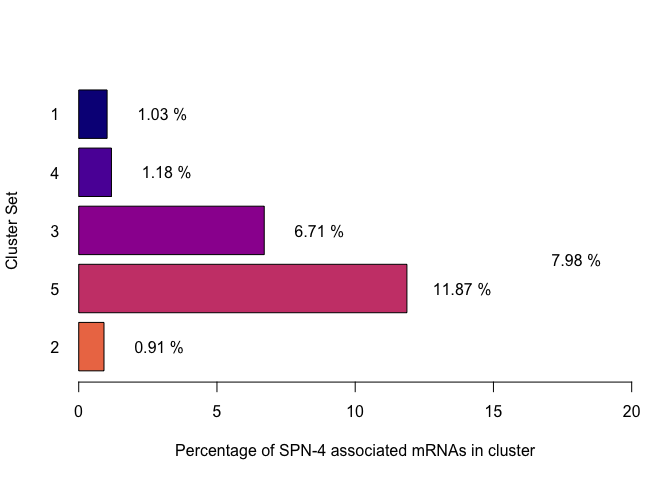
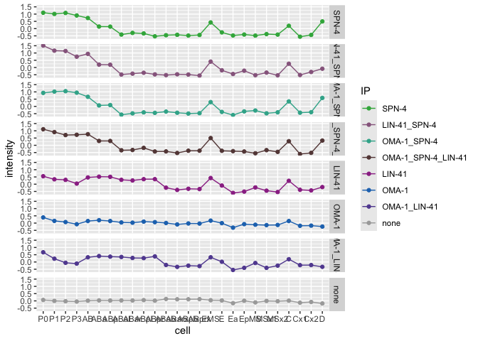

260106_Parsing_scRNA-seq_Tintori
================

- [Transcriptional dynamics of SPN-4 associated mRNAs through early
  embryonic
  development](#transcriptional-dynamics-of-spn-4-associated-mrnas-through-early-embryonic-development)
  - [Load Packages](#load-packages)
  - [Data Import and Munging](#data-import-and-munging)
    - [Import Metadata from Tintori et al
      data](#import-metadata-from-tintori-et-al-data)
    - [Import Tintori et al Normalized RNA-seq
      data](#import-tintori-et-al-normalized-rna-seq-data)
    - [Join the metadata and RNA-seq
      data](#join-the-metadata-and-rna-seq-data)
    - [Filter the data](#filter-the-data)
    - [Import Wormbase identifiers](#import-wormbase-identifiers)
    - [Merge the tintori data with the Wormbase Gene
      identifiers](#merge-the-tintori-data-with-the-wormbase-gene-identifiers)
    - [Import the time-and-anterior-to-posterior cell
      order](#import-the-time-and-anterior-to-posterior-cell-order)
  - [Heatmaps](#heatmaps)
    - [Re-organize datasets by preferred cell type
      order](#re-organize-datasets-by-preferred-cell-type-order)
      - [Optimize for preferred heatmap type (not included in
        paper)](#optimize-for-preferred-heatmap-type-not-included-in-paper)
    - [Split genes into clusters based on
      heatmap](#split-genes-into-clusters-based-on-heatmap)
    - [Save lineplot split by
      clusters](#save-lineplot-split-by-clusters)
  - [Quick experimentation into a different ordering of the
    cells](#quick-experimentation-into-a-different-ordering-of-the-cells)
    - [import the gene lists of SPN-4, OMA-1, and LIN-41
      targets](#import-the-gene-lists-of-spn-4-oma-1-and-lin-41-targets)
    - [Make an annotated heatmap](#make-an-annotated-heatmap)
    - [Save the heatmap](#save-the-heatmap)
  - [Mosaic plots](#mosaic-plots)
    - [Save the barplot (% SPN-4 associated mRNAs in each
      clusteer)](#save-the-barplot--spn-4-associated-mrnas-in-each-clusteer)
    - [Save the mosaic plot](#save-the-mosaic-plot)
  - [Lineplots, split by cluster set](#lineplots-split-by-cluster-set)
  - [Playing around with a different cell
    order](#playing-around-with-a-different-cell-order)
  - [Additional plots](#additional-plots)
    - [Calculate the clusters that are represented in SPN-4-bound versus
      un-bound
      categories](#calculate-the-clusters-that-are-represented-in-spn-4-bound-versus-un-bound-categories)
    - [Save SPN-4 bound v. unbound stacked, proportional
      barplot](#save-spn-4-bound-v-unbound-stacked-proportional-barplot)
    - [What is the variance of gene expression over developmental
      time?](#what-is-the-variance-of-gene-expression-over-developmental-time)
    - [Output the mean by lineage -
      z-scored](#output-the-mean-by-lineage---z-scored)
    - [z-scored lineplots - all RBP
      categories](#z-scored-lineplots---all-rbp-categories)
    - [Save the z-scored lineplots](#save-the-z-scored-lineplots)
    - [Agilent-style transparent
      multi-lineplots](#agilent-style-transparent-multi-lineplots)
    - [Export the alpha-tinted
      multi-lineplot](#export-the-alpha-tinted-multi-lineplot)
  - [Export data tables](#export-data-tables)
    - [Export annotations data tables](#export-annotations-data-tables)
    - [Export changing wide mat](#export-changing-wide-mat)
  - [Session info](#session-info)

# Transcriptional dynamics of SPN-4 associated mRNAs through early embryonic development

This analysis utilizes a single-cell resolution RNA-seq dataset that
assesses expression patterns through the first five cell divisions in
*C. elegans* (Tintori et al., 2016). The goal of this study is to test
the hypothesis that SPN-4 may be involved in clearing maternal mRNAs out
of early embryos. If this is the case, we would expect to see that SPN-4
associated mRNAs are enriched in clusters of maternal transcripts that
undergo decline in early embryos.

Reference:

Tintori SC, Osborne Nishimura E, Golden P, Lieb JD, Goldstein B. [A
Transcriptional Lineage of the Early C. elegans
Embryo](https://pubmed.ncbi.nlm.nih.gov/27554860). Dev Cell. 2016 Aug
22;38(4):430-44. doi: 10.1016/j.devcel.2016.07.025. PMID: 27554860;
PMCID: PMC4999266.

## Load Packages

The following packages are required:

- corrplot
- RColorBrewer
- pheatmap
- tidyverse
- hrbrthemes
- viridis
- vcd

``` r
library(corrplot)
library(RColorBrewer)
library(pheatmap)
library(tidyverse)
library(hrbrthemes)
library(viridis)
library(vcd)
```

Set Working Directory:

    ## [1] "/Users/erinnishimura/Library/CloudStorage/Dropbox/github/SPN4_maternal_mRNA/03_Tintori_scRNAseq_analysis/02_scripts"

## Data Import and Munging

### Import Metadata from Tintori et al data

This metadata describes each sample in Tintori et al.,

``` r
###########  READ IN THE DATA  #####################

# Import the metadata from Tintori et al.
metadata_tintori <- read.table(file = "../01_input/fromTintori/metadata_parsed_50306.txt", header = FALSE, fill = TRUE)

# Annotate & Resort the metadata
colnames(metadata_tintori) <- c("sample", "cellID", "stage", "rep")

# Re-order by sample name
metadata_tintori <- metadata_tintori[order(metadata_tintori$sample),]
dim(metadata_tintori)
```

    ## [1] 219   4

``` r
#head(metadata_tintori)
```

### Import Tintori et al Normalized RNA-seq data

Import the scRNA-seq data from Tintori et al., 2016. This is Table S2 of
that paper.

``` r
# Import the normalized RNA-seq data from Tintori et al.
tintori <- read.table(file = "../01_input/fromTintori/TableS2_RPKMs.txt", header = TRUE)
dim(tintori)
```

    ## [1] 31383   220

``` r
# Transform the RNA-seq data long-wise using tidyverse
tintori_long <- pivot_longer(tintori, cols = 2:220, names_to ="sample", values_to = "rpkm")
dim(tintori_long)
```

    ## [1] 6872877       3

``` r
head(tintori_long)
```

    ## # A tibble: 6 × 3
    ##   transcript sample  rpkm
    ##   <chr>      <chr>  <dbl>
    ## 1 2L52.1     st411   0   
    ## 2 2L52.1     st413   0   
    ## 3 2L52.1     st415   0   
    ## 4 2L52.1     st441   0   
    ## 5 2L52.1     st449   3.21
    ## 6 2L52.1     st451   0

### Join the metadata and RNA-seq data

``` r
# Join the Noramlized RNA-seq data to the metadata into tintori_merged
tintori_merged <- left_join(tintori_long, metadata_tintori)

# Remove tossed cellIDs
dim(tintori_merged)
```

    ## [1] 6872877       6

``` r
head(tintori_merged)
```

    ## # A tibble: 6 × 6
    ##   transcript sample  rpkm cellID stage  rep  
    ##   <chr>      <chr>  <dbl> <chr>  <chr>  <chr>
    ## 1 2L52.1     st411   0    P0     1-cell r1   
    ## 2 2L52.1     st413   0    P0     1-cell r2   
    ## 3 2L52.1     st415   0    tossed 1-cell r3   
    ## 4 2L52.1     st441   0    P0     1-cell r4   
    ## 5 2L52.1     st449   3.21 P0     1-cell r5   
    ## 6 2L52.1     st451   0    P0     1-cell r6

### Filter the data

Remove tossed samples from the dataset

``` r
# How many samples should be tossed?
length(which(metadata_tintori$cellID == "tossed"))
```

    ## [1] 54

``` r
# 54

# How many entries in the merged set?
length(which(tintori_merged$cellID == "tossed"))
```

    ## [1] 1694682

``` r
# 1,694682

# Remove "tossed" entries
tintori_retained_merged <- tintori_merged[which( !tintori_merged$cellID == "tossed"),]
#dim(tintori_retained_merged)
#head(tintori_retained_merged)

# Reduce the data structue down into a nested data frame:
tintori_nest_by_transcript <- tintori_retained_merged |>
  group_by(transcript) |>
  nest() 
```

### Import Wormbase identifiers

These Wormbase identifiers were downloaded from SimpleMine on March 7,
2025 using the following settings:

<figure>

<figcaption aria-hidden="true">SimpleMineSettings</figcaption>
</figure>

``` r
# Import the list that I downloaded from simplemine. There is a screenshot in the same folder that shows what I selected
wormbaseIDs <- read.table(file = "../01_input/fromSimpleMine/simplemine_results_WBGene_publicName.txt", header = TRUE, fill = TRUE)
#head(wormbaseIDs)
```

### Merge the tintori data with the Wormbase Gene identifiers

``` r
# Merge the annotation genenames to the tintori nested data frame:          
tintori_nest_by_transcript <- left_join(tintori_nest_by_transcript, wormbaseIDs, join_by( transcript == Public_Name ), keep = TRUE) %>%
  select( c("transcript", "WormBase_Gene_ID", "Public_Name", "data"))
  
dim(tintori_nest_by_transcript)
```

    ## [1] 31383     4

``` r
#head(tintori_nest_by_transcript)
```

### Import the time-and-anterior-to-posterior cell order

This is a file I just typed up with the blastomeres listed by
developmental time and anterior-to-posterior orientation.

``` r
# Order the cell types by stage and anterior-> posterior like so:
cellType_sorted <- read.table(file = "../01_input/cellTypes_sorted.txt", header = TRUE)
#cellType_sorted
```

------------------------------------------------------------------------

## Heatmaps

Preprocessing the data for heatmaps by making the pre-processed heatmap
matrix.

- Filter for total RPKM \> 5
- Filter for variance \> 10
- Select only the most relevant columns

``` r
#### Make a giant heatmap ####

# Filter for present genes greater than 5 summed across 
tintori_nest_present <- tintori_nest_by_transcript |>
  rowwise() |>
  mutate(total_rpkm = sum(data$rpkm)) |>
  filter(total_rpkm > 5)

# I have 14,776 genes that passed the filter
dim(tintori_nest_present)
```

    ## [1] 14776     5

``` r
#head(tintori_nest_present)

# Filter for changing genes that have a variance over 10 
changing <- tintori_nest_present |>
  rowwise() |>
  mutate(var = 100*var(data$rpkm)/total_rpkm) |>
  filter(var > 10)  

unchanging <- tintori_nest_present |>
  rowwise() |>
  mutate(var = 100*var(data$rpkm)/total_rpkm) |>
  filter(var <= 10)  

# I have 12,783 changing genes
dim(changing)
```

    ## [1] 12783     6

``` r
# I have 1,993 unchanging genes
dim(unchanging)
```

    ## [1] 1993    6

``` r
# Unnest the changing datastructure and convert into a matrix for heatmap plotting
# Unnest
changing_unnested <- changing |>
  select(transcript, data) |>
  unnest(data) |>
  select(transcript, cellID, rpkm, rep, stage) |>
  mutate( cell_combo = paste(cellID, rep, sep = "_"))
#changing_unnested

# Here is a dataframe that has each column as a cell type + replicate and each row as a gene and each value as rpkm
changing_unnested_wide <- changing_unnested |>
  filter(stage != "16-cell") |>
  select(transcript, rpkm, cell_combo) |>
  pivot_wider(names_from = cell_combo, values_from = rpkm)
#changing_unnested_wide

# Here is a dataframe that merges each column as a cell type (replicates merged), each row is a gene, and each value is the mean rpkm
changing_wide_df <- changing_unnested |>
  group_by(transcript, cellID) |>
  summarise(mean_rpkm = mean(rpkm)) |>
  pivot_wider(names_from = cellID, values_from = mean_rpkm)
#changing_wide_df
#dim(changing_wide_df)
#str(changing_wide_df) #it's a tibble data frame

# change to a data frame
changing_wide_df <- as.data.frame(changing_wide_df)
#changing_wide_df

# create rownames
rownames(changing_wide_df) <- changing_wide_df$transcript

# Remove transcript column
changing_wide_df <- changing_wide_df[ 2:dim(changing_wide_df)[2]]
changing_wide_df <- as.data.frame(changing_wide_df)
#str(changing_wide_df)
#dim(changing_wide_df)

# Change to a matrix:
changing_wide_mat <- as.matrix(changing_wide_df)
#changing_wide_mat
```

### Re-organize datasets by preferred cell type order

Merge pre-processed, heatmap-ready matrix with the preferred cell order
information.

    ##  [1] "AB"    "ABa"   "ABal"  "ABalx" "ABar"  "ABarx" "ABp"   "ABpl"  "ABplx"
    ## [10] "ABpr"  "ABprx" "C"     "Cx1"   "Cx2"   "D"     "E"     "EMS"   "Ea"   
    ## [19] "Ep"    "MS"    "MSx1"  "MSx2"  "P0"    "P1"    "P2"    "P3"    "P4"

    ##  chr [1:27] "P0" "AB" "P1" "ABa" "ABp" "EMS" "P2" "ABal" "ABar" "ABpl" ...

#### Optimize for preferred heatmap type (not included in paper)

I tested the following settings for heatmaps:

- Complete looks good
- Euclidean also looks good
- “ward.D”, “ward.D2”, “single”, “complete”, “average” (= UPGMA),
  “mcquitty” (= WPGMA), “median” (= WPGMC) or “centroid” (= UPGMC).

Processing:

- Use Canaberra complete to draw a heatmap and to split it into clusters
- Cut the heatmap into 5 clusters
- Annotate the cluster names back onto the original heatmap

``` r
# Canabarra, complete looks best
# Euclidean also looks good
# "ward.D", "ward.D2", "single", "complete", "average" (= UPGMA), "mcquitty" (= WPGMA), "median" (= WPGMC) or "centroid" (= UPGMC).
#wardD - looks good
#wardD2 - looks good
#single- nope

# OF all these, the canberra complete looks the best at separataing out the "decay" group. Euclidean Complete is also very good.

# Here is my favorite heatmap: cannaberra + complete. this one is great for separating out the zygotically transcribed (global) and maternal decay (global) genes:
set.seed(2025)
heatmap_caco5 <- pheatmap(changing_wide_mat, 
         cluster_cols = FALSE,
         scale = "row", 
         show_rownames = FALSE,
         clustering_distance_rows = "canberra", 
         clustering_method = "complete", 
         cutree_rows = 5)
```

<!-- -->

``` r
#heatmap_caco5
# I split it into five clusters. I want to annotate the cluster number onto the plot so we can ensure that the cluster numbers match. 
# I want what looks like the 2nd and 3rd clusters as the "maternal transcripts undergoing decay groups"

# obtain the cluster information and add it into the matrix
cluster_set = cutree(heatmap_caco5$tree_row, 5)
clustered_changing_wide_mat <- cbind(changing_wide_mat, 
                     cluster = cluster_set )

# add cluster data into its own data frame
ann = data.frame(cluster_set)
rownames(ann) = rownames(clustered_changing_wide_mat)

head(ann)
```

    ##         cluster_set
    ## 2L52.1            1
    ## 2RSSE.1           2
    ## 2RSSE.6           2
    ## 42461             3
    ## 42614             3
    ## 6R55.2            1

``` r
# Colors of the annotations
vcolors = plasma(7)[1:5]
#vcolors[1]

my_colour = list(cluster_set = c( "1" = vcolors[1], "2" = vcolors[5], "3" = vcolors[3], "4" = vcolors[2], "5" = vcolors[4]))

# Make an annotated heatmap using canaberra + complete:
#set.seed(2025)
heatmap_caco5_ann <- pheatmap(changing_wide_mat, 
         cluster_cols = FALSE,
         scale = "row", 
         annotation_colors = my_colour,
         show_rownames = FALSE,
         clustering_distance_rows = "canberra", 
         clustering_method = "complete", 
         cutree_rows = 5,
         annotation_row=ann)
```

<!-- -->

``` r
#heatmap_caco5_ann
```

------------------------------------------------------------------------

### Split genes into clusters based on heatmap

Take the clusters generated in heatmap_caco5_ann heatmap and split them
into clusters of gene lists.

For each cluster, generate lineplots of merged transcript abundance
values across cell-type

This will be a supplemental figure

    ##    1    2    3    4    5 
    ## 1591 5958 2463 1627 1144

    ## [1]  5 28

<!-- -->

### Save lineplot split by clusters

Supplemental Figure

``` r
today <- format(Sys.Date(), "%y%m%d")
filename2 <- paste("../03_outputPlots/", today, "_cluster_lineplots.pdf", sep = "")
pdf(filename2, width = 6, height = 6)

lineplot_clusters

dev.off()
```

    ## quartz_off_screen 
    ##                 2

------------------------------------------------------------------------

## Quick experimentation into a different ordering of the cells

It came up in discussion - what would the lineplot look like if it were
split more by lineage?

This looks nice and we will include it as a supplemental figure

``` r
# Try a different ordering of cell
#head(meanbycluster)

length(colnames(meanbycluster))
```

    ## [1] 28

``` r
testOrder <- c(1, 2, 4, 8, 16, 28, 3, 5, 6, 9, 10, 11, 12, 17, 18, 19, 20, 7, 14, 24, 25, 15, 26, 27, 13, 21, 22, 23)
length(testOrder)
```

    ## [1] 28

``` r
# re-arrange changing_wide_mat columns by the best order 
meanbycluster_reordered <- meanbycluster[ , testOrder]

head(meanbycluster_reordered)
```

    ##   cluster         P0         P1         P2         P3         P4         AB
    ## 1       1  58.254284  52.694567  53.005779  49.744101  55.400993  58.408998
    ## 2       2   7.359928   6.305161   5.858863   7.971257   6.097396   5.599532
    ## 3       3 116.634707 114.346262 115.334638 109.868852 108.779984 115.371842
    ## 4       4  98.867328  93.996396  95.060229 129.462849 121.714814  86.827219
    ## 5       5 110.626997 108.571201 108.620829 120.684615 105.401384  97.293502
    ##          ABa       ABp       ABal       ABar       ABpl       ABpr      ABalx
    ## 1  69.654901  69.46551  87.923706  82.662289  82.758969  87.077893  90.673486
    ## 2   6.256803   6.30786   7.000541   7.266835   7.423593   7.124471   8.284367
    ## 3 111.085353 111.77228  87.441951  84.546619  87.471753  88.342119  44.945287
    ## 4 108.547870 109.59143 171.613372 178.658617 165.069684 172.920379 235.515808
    ## 5  76.028762  77.02434  40.277121  44.871388  46.450935  41.424857  26.090820
    ##        ABarx      ABplx      ABprx        EMS          E        Ea        Ep
    ## 1  89.981106  93.135893  90.097648  62.467795  77.538435  55.56791  69.65401
    ## 2   7.511074   7.858231   7.770515   6.460422   8.858477  27.97222  17.63481
    ## 3  40.929405  41.397314  41.802456 108.549186  72.365687  27.04617  33.17239
    ## 4 232.114549 240.481268 252.286695 107.643115 200.560820 264.40306 271.88463
    ## 5  24.572538  24.302427  23.066108  87.169369  57.773191  26.62203  29.34532
    ##           MS      MSx1       MSx2         C       Cx1        Cx2          D
    ## 1  68.023288  79.86260  84.282174  64.12212  68.34862  72.672988  45.244476
    ## 2   8.136114  10.37803   9.277815   7.35365  10.75207   8.704621   9.857223
    ## 3  61.961540  35.21143  33.308613  98.69178  44.07437  41.774101  88.334934
    ## 4 181.743453 264.45454 276.412145 147.24492 247.71028 271.498133 182.945880
    ## 5  42.306633  24.83300  30.552340  85.62389  36.06638  38.982450 110.088460

``` r
# convert the meanbycluster into longform data to plot using ggplot2:
longer_means_by_cluster_reordered <- pivot_longer(meanbycluster_reordered, cols = 2:28, names_to ="cell",
             values_to = "intensity")

# Set cell ID and cluster as ordered factors
longer_means_by_cluster_reordered$cell <- factor(longer_means_by_cluster_reordered$cell, levels = colnames(meanbycluster)[testOrder])
longer_means_by_cluster_reordered$cluster <- factor(longer_means_by_cluster_reordered$cluster, levels = c(1,4,3,5,2))

# create lineplots of the trend over cell type for each cluster
vcolors = plasma(7)[1:5]
#vcolors
lineplot_clusters2 <- ggplot(longer_means_by_cluster_reordered, aes(x=cell, y=intensity, group=cluster, colour=cluster)) + 
  geom_line()+
  geom_point() +
  scale_color_manual(values = vcolors) +
  facet_grid(rows = vars(cluster))

lineplot_clusters2
```

<!-- -->

``` r
# Save plot
today <- format(Sys.Date(), "%y%m%d")
filename2 <- paste("../03_outputPlots/", today, "_cluster_lineplots_test_new_order.pdf", sep = "")
pdf(filename2, width = 6, height = 6)

lineplot_clusters2

dev.off()
```

    ## quartz_off_screen 
    ##                 2

### import the gene lists of SPN-4, OMA-1, and LIN-41 targets

The next goal will be to assess which clusters contain SPN-4, OMA-1, and
LIN-41 associated mRNAs and to what degree. The predition is that if
SPN-4 is associated with mRNA decay, then the clusters that are driven
by decay of maternal mRNAs will have a higher propensity of SPN-4
associated mRNAs.

These lists of sets are from [a previous analysis within this same
github
repository](https://github.com/erinosb/SPN4_maternal_mRNA/tree/main/02_SPN4_LIN41_OMA1_Comparison_Fig_1_S1/04_output_data)

``` r
# import the gene lists
OMA1_1 <- read.table(file = "../01_input/lists_from_02/20250711_OMA1_ONLY_list.txt")
SPN4_2 <- read.table(file = "../01_input/lists_from_02/20250711_SPN4_ONLY_list.txt")
LIN41_3 <- read.table(file = "../01_input/lists_from_02/20250711_LIN41_ONLY_list.txt")
OMA1LIN41_4 <- read.table(file = "../01_input/lists_from_02/20250711_OMA1_LIN41_list.txt")
OMA1SPN4_5 <- read.table(file = "../01_input/lists_from_02/20250711_OMA1_SPN4_list.txt")
LIN41SPN4_6 <- read.table(file = "../01_input/lists_from_02/20250711_LIN41_and_SPN4_list.txt")
ALL_7 <- read.table(file = "../01_input/lists_from_02/20250711_OMA1_SPN4_LIN41_list.txt")
```

Merge the datasets

``` r
# eda
#str(OMA1_1)
#str(SPN4_2)
#str(LIN41_3)
#str(OMA1LIN41_4)
#str(OMA1SPN4_5)
#str(LIN41SPN4_6)
#str(ALL_7)

# Annotate the dataframes:
OMA1_1 <- OMA1_1 %>% 
  mutate(IP = "OMA-1")

SPN4_2 <- SPN4_2 %>% 
  mutate(IP = "SPN-4")

LIN41_3 <- LIN41_3 %>% 
  mutate(IP = "LIN-41")

OMA1LIN41_4 <- OMA1LIN41_4 %>% 
  mutate(IP = "OMA-1_LIN-41")

OMA1SPN4_5 <- OMA1SPN4_5 %>% 
  mutate(IP = "OMA-1_SPN-4")

LIN41SPN4_6 <- LIN41SPN4_6 %>% 
  mutate(IP = "LIN-41_SPN-4")

ALL_7 <- ALL_7 %>% 
  mutate(IP = "OMA-1_SPN-4_LIN-41")

# merge the gene lists
IP_lookup <- rbind(OMA1_1, SPN4_2, LIN41_3, OMA1LIN41_4, OMA1SPN4_5, LIN41SPN4_6, ALL_7)

#IP_lookup
colnames(IP_lookup) <- c("WormBase_Gene_ID", "IP") 
dim(IP_lookup)
```

    ## [1] 2354    2

``` r
head(IP_lookup)
```

    ##   WormBase_Gene_ID    IP
    ## 1   WBGene00019815 OMA-1
    ## 2   WBGene00021450 OMA-1
    ## 3   WBGene00021449 OMA-1
    ## 4   WBGene00015257 OMA-1
    ## 5   WBGene00044776 OMA-1
    ## 6   WBGene00021736 OMA-1

``` r
#IP_lookup_right_join
# Add in the RBP Bound state:
IP_RBP_lookup <- IP_lookup %>%
  mutate(RBP_assoc = case_when(
    IP == "SPN-4" ~ "SPN4",
    IP == "LIN-41" ~ "other_RBP",
    IP == "OMA-1" ~ "other_RBP",
    IP == "OMA-1_LIN-41" ~ "other_RBP",
    IP == "OMA-1_SPN-4" ~ "SPN4",
    IP == "LIN-41_SPN-4" ~ "SPN4",
    IP == "OMA-1_SPN-4_LIN-41" ~ "SPN4",
    IP == "none" ~ "none"
  ))

# Change categorical data to factors
IP_RBP_lookup$IP <- as.factor(IP_RBP_lookup$IP)
IP_RBP_lookup$RBP_assoc <- as.factor(IP_RBP_lookup$RBP_assoc)

# Look at the data structure
dim(IP_RBP_lookup)
```

    ## [1] 2354    3

``` r
str(IP_RBP_lookup)
```

    ## 'data.frame':    2354 obs. of  3 variables:
    ##  $ WormBase_Gene_ID: chr  "WBGene00019815" "WBGene00021450" "WBGene00021449" "WBGene00015257" ...
    ##  $ IP              : Factor w/ 7 levels "LIN-41","LIN-41_SPN-4",..: 3 3 3 3 3 3 3 3 3 3 ...
    ##  $ RBP_assoc       : Factor w/ 2 levels "other_RBP","SPN4": 1 1 1 1 1 1 1 1 1 1 ...

``` r
# I would like to merge this information with the previous ann2 information. In this way, I can add in the IP and RBP_lookup information into the annotation labels for the changing_wide_mat heatmap:
IP_lookup_annotated <- left_join(IP_RBP_lookup, wormbaseIDs)

ann_df <- rownames_to_column(ann, var = "Sequence_Name")

# Join on 'sequence_name'
merged_cluster_IP <- left_join(ann_df, IP_lookup_annotated)

# Double check that all the clusters are preserved:
table(ann_df$cluster_set)
```

    ## 
    ##    1    2    3    4    5 
    ## 1591 5958 2463 1627 1144

``` r
table(merged_cluster_IP$cluster_set)
```

    ## 
    ##    1    2    3    4    5 
    ## 1591 5958 2463 1627 1144

``` r
# Note that only half of the IP genes are preserved. This is because many of them are either not present in the Tintori dataset or because they are not changing
sum(table(merged_cluster_IP$IP))
```

    ## [1] 1201

``` r
sum(table(IP_lookup_annotated$IP))
```

    ## [1] 2354

``` r
# Just curious - how many IP genes are unchanging?
length(intersect(IP_lookup_annotated$WormBase_Gene_ID, unchanging$WormBase_Gene_ID))
```

    ## [1] 63

``` r
# This means that
63/2354 
```

    ## [1] 0.02676296

``` r
# of the IP'd genes are unchanging and 
1201/2354
```

    ## [1] 0.5101954

``` r
# of the IP'd genes are below-threshold, low expression in the Tintori dataset

# Combind the cluster categories and the IP categories
merged_cluster_IP <- left_join(ann_df, IP_lookup_annotated)

# Create a new ann2 annotation table that combines the cluster and IP categories
ann2 <- merged_cluster_IP[,c(2,4)]
rownames(ann2) <- merged_cluster_IP$Sequence_Name
colnames(ann2) <- c("cluster_set", "IP")
str(ann2)
```

    ## 'data.frame':    12783 obs. of  2 variables:
    ##  $ cluster_set: int  1 2 2 3 3 1 2 2 4 2 ...
    ##  $ IP         : Factor w/ 7 levels "LIN-41","LIN-41_SPN-4",..: NA NA NA NA NA NA NA NA 3 NA ...

``` r
table(ann2$cluster_set)
```

    ## 
    ##    1    2    3    4    5 
    ## 1591 5958 2463 1627 1144

``` r
table(ann2$IP)
```

    ## 
    ##             LIN-41       LIN-41_SPN-4              OMA-1       OMA-1_LIN-41 
    ##                240                 35                406                178 
    ##        OMA-1_SPN-4 OMA-1_SPN-4_LIN-41              SPN-4 
    ##                 54                 46                242

### Make an annotated heatmap

This is the heatmap that will be used in the paper as a supplemental
figure. Tintori et al data plotted as a heatmap, with cell-types sorted
by stage and anterior-to-posterior orientation, colored for the
different clusters, and annotated for the SPN-4, OMA-1, and LIN-41
associated mRNAs.

<!-- -->

### Save the heatmap

This will be used as a Supplemental Figure.

Note, the .pdf and .jpg output was too big for github. Had to export
things manually.

``` r
# Save the heatmap:
today <- format(Sys.Date(), "%y%m%d")
filename4 <- paste("../03_outputPlots/", today, "_heatmap_clusters_and_IP.pdf", sep = "")
pdf(filename4, width = 6, height = 8)

heatmap_caco5_ip
    
dev.off()
```

    ## quartz_off_screen 
    ##                 2

``` r
# This didn't work. Had to use Export -> Export as Jpeg
#filename5 <- paste("../03_outputPlots/", today, "_heatmap_clusters_and_IP.jpg", sep = "")
#jpeg(filename5, width = 6, height = 8)

#heatmap_caco5_ip

#dev.off()
```

## Mosaic plots

Make mosaicplots split by RNA cohort. These will illustrate whether
there is a relationship between the cluster set category (from Tintori
data: maternal decay pattern, zygotic transcriptional activation, cell
specific transcriptional activation) versus the IP category (from this
paper’s IP-seq: SPN-4 bound, etc).

Next, plot what percentage of the mRNA transcripts in the maternally
decay clusters (Clusters 3 & 5) that are associated with SPN-4 binding?
This will determine what percentage of total maternal decay SPN-4
controls.

Then, try to determine how this percentage changes if the actual
expression level of a given transcript is taken into account. What
percentage of the total transcripts in the transcriptome are associated
with SPN-4?

Please note that the SPN-4 assocation in this case will be independent
of LIN-41 and OMA-1 association.

``` r
# copy the ann2 annotated metadata information into a new dataframe
ann3 <- ann2
#ann3
# setann the cluster column as factors
ann3$cluster_set <- factor(ann3$cluster_set, levels = c(1, 4, 3, 5, 2))

# change "NA" to "none"
ann3$IP <- factor(ann3$IP, levels = c(levels(ann3$IP), "none"))
ann3[which(is.na(ann3$IP)), 2] <- "none"

str(ann3)
```

    ## 'data.frame':    12783 obs. of  2 variables:
    ##  $ cluster_set: Factor w/ 5 levels "1","4","3","5",..: 1 5 5 3 3 1 5 5 2 5 ...
    ##  $ IP         : Factor w/ 8 levels "LIN-41","LIN-41_SPN-4",..: 8 8 8 8 8 8 8 8 3 8 ...

``` r
# create a tabulation of the information in ann3
ann3tabs <- xtabs(~ cluster_set + IP, data = ann3)

# Build a mosaic plot of the tabulation
mosaicplot1 <- mosaic(ann3tabs, gp = shading_max, 
                      split_horizontal = TRUE)
```

<!-- -->

``` r
#########################

# First - ask the question: what percentage of each cluster set is predicted to be associated with SPN-4 (independent of other binding)?
# Create a barplot tabulating the % of SPN-4 associated genes within each cluster
tabs_dataframe <- as.data.frame(mosaicplot1)

# Calculate SPN-4 associated gene as a percentage of each cluster set - without FPKM taken into account
SPN4_Percentage_plot <- tabs_dataframe |>
  pivot_wider(names_from = IP, values_from = Freq) |>
  rowwise(cluster_set) |>
  mutate(SPN_percent = sum(c(`SPN-4`, `OMA-1_SPN-4`, `LIN-41_SPN-4`, `OMA-1_SPN-4_LIN-41`))/sum(c_across(`OMA-1`:`none`))*100)

# Create labels of percentage values
textSPN <- paste(round(SPN4_Percentage_plot$SPN_percent, 2), " %", sep = "")

# Set colors
vcolors = plasma(7)[1:5]
#vcolors[1]

# Create a barplot - what percentages of genes in each cluster category (Tintori data) are associated with SPN-4? This is independent of LIN-41 and OMA-1 binding. This percentage is independent of expression level of the gene. It just reflects how many genes in a category are associated with SPN-4. 
bp1 <- barplot(rev(SPN4_Percentage_plot$SPN_percent), xlim = c(0, 20),
        names.arg = rev(SPN4_Percentage_plot$cluster_set),
        ylab = "Cluster Set", 
        xlab = "Percentage of SPN-4 associated mRNAs in cluster", 
        col = rev(vcolors), 
        horiz = TRUE,
        las = 1)
# Add text
text(x = SPN4_Percentage_plot$SPN_percent + 2, y = rev(bp1), labels = textSPN)

# Calculate the combined percentage of SPN-4 in Cluster 3 and Cluster 5 - 
# tabulate the total number of SPN-4 associated genes per cluster and the total number of genes per cluster  
SPN4_Percentage_plot_2 <- tabs_dataframe |>
  pivot_wider(names_from = IP, values_from = Freq) |>
  rowwise(cluster_set) |>
  mutate(SPN_tot = sum(c(`SPN-4`, `OMA-1_SPN-4`, `LIN-41_SPN-4`, `OMA-1_SPN-4_LIN-41`))) |>
  mutate(all_tot = sum(c(`OMA-1`, `SPN-4`, `LIN-41`, `OMA-1_LIN-41`, `OMA-1_SPN-4`, `LIN-41_SPN-4`, `OMA-1_SPN-4_LIN-41`, `none`)))

# calculate the percentage of SPN-4 genes in Cluster 3 and 5
totalSPN4_3_and_5 <- (SPN4_Percentage_plot_2$SPN_tot[3] + SPN4_Percentage_plot_2$SPN_tot[4]) / (SPN4_Percentage_plot_2$all_tot[3] + SPN4_Percentage_plot_2$all_tot[4] )*100

totalSPN4_3_and_5 <- paste(round(totalSPN4_3_and_5, 2), " %", sep = "")

text(x = 18, y = 2.5, labels = totalSPN4_3_and_5)
```

<!-- -->

``` r
######## FPKM taken into account ###########
# Calculate the percentage of SPN-4 associated transcripts in Cluster 3 and 5 as a percentage of the total mRNA content in the embryo at the time...

# Create a new ann2 annotation table that combines the cluster and IP categories
table(rownames(ann2) == rownames(changing_wide_mat))
```

    ## 
    ##  TRUE 
    ## 12783

``` r
head(changing_wide_mat)
```

    ##             P0      AB     P1     ABa     ABp     EMS     P2    ABal   ABar
    ## 2L52.1   0.642   2.716  2.168   2.934   0.810   0.500 22.378   0.072  0.000
    ## 2RSSE.1  0.418   3.976  0.624   4.418   0.000   1.712  0.000   0.000  0.000
    ## 2RSSE.6  0.000   0.000 16.726   0.000   0.000   0.000  0.000   0.000  0.000
    ## 42461   91.402 113.248 96.400 127.334 156.842 132.292 71.118 111.236 59.438
    ## 42614   20.698  40.948 22.402  52.396  44.376  29.734 23.880  58.160 28.472
    ## 6R55.2   0.000   0.000  0.000   0.000   0.000   0.000  0.000   0.000  0.000
    ##            ABpl   ABpr      C      E     MS     P3  ABalx     ABarx    ABplx
    ## 2L52.1    0.000  0.210  0.142  0.000 52.306  2.268 10.636  6.147500  0.00000
    ## 2RSSE.1   0.000  0.000  0.000  8.626  0.210  6.386  1.551  0.000000  0.00000
    ## 2RSSE.6   0.000  0.000  0.000  0.000  0.000  0.000  0.000  0.000000  0.00000
    ## 42461   104.948 90.356 27.478 34.680 83.206 43.656 19.863 51.653333 70.58636
    ## 42614    40.006 55.842  3.234 30.658 59.772 23.228 27.975 10.244167 17.07727
    ## 6R55.2   17.000  0.000  1.228  0.000  0.000  0.000 17.000  4.929167 35.51273
    ##            ABprx    Cx1         Cx2         D      Ea       Ep   MSx1
    ## 2L52.1  21.29917  0.000  0.00000000  0.125000  0.0000 31.40833 18.578
    ## 2RSSE.1  0.00000  0.000  0.00000000  4.538333  0.6550  0.00000  3.612
    ## 2RSSE.6  0.00000  0.000  0.00000000  0.000000  0.0000  0.00000  0.000
    ## 42461   24.03083 49.968 18.94166667  3.900000 47.3100 82.07667 76.584
    ## 42614    2.74250  0.000  0.04833333 32.975000  0.0375  0.00000  0.000
    ## 6R55.2  45.19250  4.686 22.52500000  0.000000  0.0000  0.00000  8.038
    ##               MSx2         P4
    ## 2L52.1   0.0000000 33.8900000
    ## 2RSSE.1  0.0000000  0.0000000
    ## 2RSSE.6  0.0000000  0.0000000
    ## 42461   22.3242857 44.3083333
    ## 42614    4.8200000  0.1783333
    ## 6R55.2   0.4885714  0.0000000

``` r
head(changing_wide_mat[, 1])
```

    ##  2L52.1 2RSSE.1 2RSSE.6   42461   42614  6R55.2 
    ##   0.642   0.418   0.000  91.402  20.698   0.000

``` r
ann4 <- cbind(ann2, changing_wide_mat[, 1])
colnames(ann4) <- c("cluster_set", "IP", "P0_fpkm")
head(ann4)
```

    ##         cluster_set   IP P0_fpkm
    ## 2L52.1            1 <NA>   0.642
    ## 2RSSE.1           2 <NA>   0.418
    ## 2RSSE.6           2 <NA>   0.000
    ## 42461             3 <NA>  91.402
    ## 42614             3 <NA>  20.698
    ## 6R55.2            1 <NA>   0.000

``` r
# Calculate total fpkm for Cluster 3
ann4_cluster3 <- ann4 %>%
  filter ( cluster_set == 3)
dim(ann4_cluster3)
```

    ## [1] 2463    3

``` r
ann4_cluster3_spn4 <- ann4 %>%
  filter ( cluster_set == 3) %>%
  filter ( IP == "SPN-4" |  IP == "OMA-1_SPN-4_LIN-41" | IP == "OMA-1_SPN-4" | IP == "LIN-41_SPN-4")
dim(ann4_cluster3_spn4)
```

    ## [1] 156   3

``` r
156/2463
```

    ## [1] 0.06333739

``` r
# calculate percentage of total molecules: 
percent_cluster3_adj_fpkm <- (sum(ann4_cluster3_spn4$P0_fpkm) / sum(ann4_cluster3$P0_fpkm)) *100

####################################
# Calculate total fpkm for Cluster 5
ann4_cluster5 <- ann4 %>%
  filter ( cluster_set == 5)
dim(ann4)
```

    ## [1] 12783     3

``` r
dim(ann4_cluster5)
```

    ## [1] 1144    3

``` r
ann4_cluster5_spn4 <- ann4 %>%
  filter ( cluster_set == 5) %>%
  filter ( IP == "SPN-4" |  IP == "OMA-1_SPN-4_LIN-41" | IP == "OMA-1_SPN-4" | IP == "LIN-41_SPN-4")
dim(ann4_cluster5_spn4)
```

    ## [1] 132   3

``` r
132/1144
```

    ## [1] 0.1153846

``` r
# calculate percentage of total molecules: 
percent_cluster3_adj_fpkm <- (sum(ann4_cluster5_spn4$P0_fpkm) / sum(ann4_cluster5$P0_fpkm) ) * 100

ann4_fpkm_sum <- ann4 %>%
  group_by(cluster_set) %>%
  summarise(tot_sum = sum(P0_fpkm))
  
ann4_fpkm_spn4_sum <- ann4 %>%
  filter ( IP == "SPN-4" |  IP == "OMA-1_SPN-4_LIN-41" | IP == "OMA-1_SPN-4" | IP == "LIN-41_SPN-4") %>%
  group_by(cluster_set) %>%
  summarise(spn4_sum = sum(P0_fpkm)) 

merge_fpkm_adj_values <- left_join(ann4_fpkm_sum, ann4_fpkm_spn4_sum)

merge_fpkm_adj_values
```

    ## # A tibble: 5 × 3
    ##   cluster_set tot_sum spn4_sum
    ##         <int>   <dbl>    <dbl>
    ## 1           1  92683.     687.
    ## 2           2  43850.    2372.
    ## 3           3 287271.   27967.
    ## 4           4 160857.    1622.
    ## 5           5 126557.   16629.

``` r
merge_fpkm_adj_values <- merge_fpkm_adj_values %>%
  mutate(percent = (spn4_sum / tot_sum )*100)

# Barplot that takes fpkm into account when calculating what percentage of transcripts within each cluster category (Tintori data) associate with SPN-4
bp2 <- barplot(rev(merge_fpkm_adj_values[c(1,4,3,5,2),]$percent),
        xlim = c(0,20),
        names.arg = rev(c("1", "4", "3", "5", "2")),
        ylab = "Cluster Set", 
        xlab = "Percentage of SPN-4 associated mRNAs in cluster", 
        col = rev(vcolors), 
        horiz = TRUE,
        las = 1)
               
# Add text
textSPN_fpkm <- paste(round(merge_fpkm_adj_values[c(1,4,3,5,2),]$percent, 2), " %", sep = "")
text(x = merge_fpkm_adj_values[c(1,4,3,5,2),]$percent + 2, y = rev(bp2), labels = textSPN_fpkm)

####################################
# Calculate total fpkm for both Cluster 3 & Cluster 5

# Calculate total fpkm for Cluster 3 & 5
ann4_cluster35 <- ann4 %>%
  filter ( cluster_set == 5 | cluster_set == 3)

dim(ann4_cluster35)
```

    ## [1] 3607    3

``` r
# Calculate the total fpkm for SPN-4 associated transcripts within Cluster 3 & 5:
ann4_cluster35_spn4 <- ann4_cluster35 %>%
  filter ( IP == "SPN-4" |  IP == "OMA-1_SPN-4_LIN-41" | IP == "OMA-1_SPN-4" | IP == "LIN-41_SPN-4")
dim(ann4_cluster35_spn4)
```

    ## [1] 288   3

``` r
head(ann4_cluster35_spn4)
```

    ##          cluster_set                 IP P0_fpkm
    ## B0024.13           3              SPN-4 269.388
    ## B0035.3            5              SPN-4 506.012
    ## B0238.10           3 OMA-1_SPN-4_LIN-41 127.546
    ## B0238.9            5        OMA-1_SPN-4 137.706
    ## B0334.15           3 OMA-1_SPN-4_LIN-41  24.458
    ## B0334.5            5              SPN-4  61.036

``` r
288/3607
```

    ## [1] 0.07984475

``` r
# calculate percentage of total molecules:
cluster3_and_5_percentage_by_fpkm <- (sum(ann4_cluster35_spn4$P0_fpkm) / sum(ann4_cluster35$P0_fpkm) ) * 100
text_3_and_5_by_fpkm <- paste(round(cluster3_and_5_percentage_by_fpkm, 2), " %", sep = "")

text(x = 18, y = 2.5, labels = text_3_and_5_by_fpkm)
```

<!-- -->

### Save the barplot (% SPN-4 associated mRNAs in each clusteer)

This will be a Supplementary Figure

``` r
today <- format(Sys.Date(), "%y%m%d")
filename4 <- paste("../03_outputPlots/", today, "_SPN4_percentage_barplot.pdf", sep = "")

#--> Note: this didn't look right. Had to save with Export -> Save As PDF

pdf(filename4, width = 5, height = 5)

bp1 <- barplot(rev(SPN4_Percentage_plot$SPN_percent), xlim = c(0, 20),
        names.arg = rev(SPN4_Percentage_plot$cluster_set),
        xlab = "Cluster Set", 
        ylab = "Percentage of SPN-4 associated mRNAs in cluster", 
        col = rev(vcolors), 
        horiz = TRUE,
        las = 1)
               
# Add text
text(x = SPN4_Percentage_plot$SPN_percent + 2, y = rev(bp1), labels = textSPN)

text(x = 18, y = 2.5, labels = totalSPN4_3_and_5)

dev.off()
```

    ## quartz_off_screen 
    ##                 2

``` r
#### Also save a barplot with the fpkm adjusted percentages:

today <- format(Sys.Date(), "%y%m%d")
filename4 <- paste("../03_outputPlots/", today, "_SPN4_percentage_barplot_fpkmAdj.pdf", sep = "")

#--> Note: this didn't look right. Had to save with Export -> Save As PDF

pdf(filename4, width = 5, height = 5)

bp2 <- barplot(rev(merge_fpkm_adj_values[c(1,4,3,5,2),]$percent),
        xlim = c(0,20),
        names.arg = rev(c("1", "4", "3", "5", "2")),
        ylab = "Cluster Set", 
        xlab = "Percentage of total mRNA molecules in cluster that are SPN-4 associated (fpkm-adjusted)", 
        col = rev(vcolors), 
        horiz = TRUE,
        las = 1)


# Add text
text(x = merge_fpkm_adj_values[c(1,4,3,5,2),]$percent + 2, y = rev(bp2), labels = textSPN_fpkm)

text(x = 18, y = 2.5, labels = text_3_and_5_by_fpkm)

dev.off()
```

    ## quartz_off_screen 
    ##                 2

### Save the mosaic plot

Supplemental Figure.

``` r
today <- format(Sys.Date(), "%y%m%d")
filename3 <- paste("../03_outputPlots/", today, "_mosaicplot.pdf", sep = "")

#--> Note: this didn't look right. Had to save with Export -> Save As PDF

pdf(filename3, width = 8, height = 8)

mosaic(ann3tabs, gp = shading_max, 
       split_horizontal = TRUE)

dev.off()
```

    ## quartz_off_screen 
    ##                 2

## Lineplots, split by cluster set

Merge datasets for upcoming lineplots of abundance in the Tintori
dataset, split out by cluster or by RBP Association

``` r
############ CREATE LINEPLOTS group_by IP #############

# start with clustered_changing_wide_df and annotate with ann2 using left_join
#head(clustered_changing_wide_df)
#head(ann2)

clustered_changing_wide_ann2 <- left_join(rownames_to_column(clustered_changing_wide_df), rownames_to_column(ann3))
clustered_changing_wide_ann2 <- column_to_rownames(clustered_changing_wide_ann2) 
clustered_changing_wide_ann2 <- clustered_changing_wide_ann2 %>%
  select(!(cluster:cluster_set))
```

------------------------------------------------------------------------

## Playing around with a different cell order

``` r
#clustered_changing_wide_df
#clustered_changing_wide_ann2
#mean_by_IP

lineageOrder <- c("IP", "P0", "P1", "P2", "P3", "P4", "AB", "ABa", "ABp", "ABal", "ABar", "ABpl", "ABpr", "ABalx", "ABarx", "ABplx", "ABprx", "EMS", "E", "Ea", "Ep", "MS", "MSx1", "MSx2", "C", "Cx1", "Cx2", "D")
```

## Additional plots

These plots were developed as part of the first set of revisions to
address reviewer’s comments.

### Calculate the clusters that are represented in SPN-4-bound versus un-bound categories

``` r
# Start with ann3tabs: Cluster set v. IP status
str(ann3tabs)
```

    ##  'xtabs' int [1:5, 1:8] 32 20 121 23 44 0 2 17 9 7 ...
    ##  - attr(*, "dimnames")=List of 2
    ##   ..$ cluster_set: chr [1:5] "1" "4" "3" "5" ...
    ##   ..$ IP         : chr [1:8] "LIN-41" "LIN-41_SPN-4" "OMA-1" "OMA-1_LIN-41" ...
    ##  - attr(*, "call")= language xtabs(formula = ~cluster_set + IP, data = ann3)

``` r
# Convert to data frame
ann3_tabs_df <- as.data.frame(ann3tabs)

# Compress information down to SPN4-bound vesus un-bound
ann3_tabs_long_spn4bound <- ann3_tabs_df %>%
  mutate(SPN4bound = case_when(
    IP == "SPN-4" ~ TRUE,
    IP == "LIN-41" ~ FALSE,
    IP == "OMA-1" ~ FALSE,
    IP == "OMA-1_LIN-41" ~ FALSE,
    IP == "OMA-1_SPN-4" ~ TRUE,
    IP == "LIN-41_SPN-4" ~ TRUE,
    IP == "OMA-1_SPN-4_LIN-41" ~ TRUE,
    IP == "none" ~ FALSE
  ))


# Set the order of categories
ann3_tabs_long_spn4bound$cluster_set <- factor(ann3_tabs_long_spn4bound$cluster_set, levels = c(1,4,3,5,2))
#ann3_tabs_long_spn4bound
# Set the colors
vcolors = plasma(7)[1:5]

# Plot the stacked proportional barplots:
sbp1 <- ggplot(ann3_tabs_long_spn4bound, aes(fill = cluster_set, y=Freq, x = SPN4bound))+
  geom_bar(position="fill", stat="identity") +
  scale_fill_manual(values = vcolors)

sbp1
```

<!-- -->

``` r
#Check numbers
ann3_tabs_long_spn4bound %>%
  group_by(SPN4bound) %>%
  summarize(sum = sum(Freq))
```

    ## # A tibble: 2 × 2
    ##   SPN4bound   sum
    ##   <lgl>     <int>
    ## 1 FALSE     12406
    ## 2 TRUE        377

### Save SPN-4 bound v. unbound stacked, proportional barplot

    ## quartz_off_screen 
    ##                 2

### What is the variance of gene expression over developmental time?

In response to a reviewer comment that we did not include individual
lineplots for genes or a measure of the data’s spread.

- How can we illustrate the range of the data?
- First pass - try to plot standard deviation. This was tricky because
  the y-coordinates became so large that the trends were not as visible.
  Most of the issue had to do with the fact that some genes are highly
  expressed and some genes were lowly expressed.
  - To improve this plot, we would need to z-scale it, then apply
    standard deviation. It would also be necessary to re-do the
    faceting. Maybe if we reduced the number of plots down from each
    possible IP combination to SPN-4 associated v. SPN-4 unassociated?
- Second pass - try to make a transparent all line plot. This was tricky
  because, again, the range of expression levels was so drastically
  different from gene-to-gene.
  - To improve this plot, we would need to z-scale.

``` r
############ CREATE LINEPLOTS group_by IP #############

# start with clustered_changing_wide_df and annotate with ann2 using left_join
#head(clustered_changing_wide_df)
#head(ann2)

#head(ann3)
#head(clustered_changing_wide_df)

# Merge the annotations of cluster categories to each gene
clustered_changing_wide_ann2 <- left_join(rownames_to_column(clustered_changing_wide_df), rownames_to_column(ann3))
```

    ## Joining with `by = join_by(rowname)`

``` r
# move the gene names into rownames
clustered_changing_wide_ann2 <- column_to_rownames(clustered_changing_wide_ann2) 
#clustered_changing_wide_ann2

# Remove the cluster categories - we don't need those
clustered_changing_wide_ann2 <- clustered_changing_wide_ann2 %>%
  select(!(cluster:cluster_set))
#clustered_changing_wide_ann2

#head(clustered_changing_wide_ann2)
# Create a dataframe that is grouped by the cluster and calculate the mean values of each cell ID across the cluster:
#as.matrix(clustered_changing_wide_ann2)
#str(clustered_changing_wide_ann2)
changing_matrix <- as.matrix(clustered_changing_wide_ann2[,1:27])

# Z-scale and add the annotations back

scaled_changing_mat_inv <- scale(t(changing_matrix))
scaled_changing_matrix <- as.data.frame(t(scaled_changing_mat_inv))

clustered_scaled_wide_ann2 <- cbind(scaled_changing_matrix, IP = clustered_changing_wide_ann2$IP)
#str(clustered_scaled_wide_ann2)

# Split into SPN-4 association:
#clustered_scaled_wide_ann2
# Compress information down to SPN4-bound vesus un-bound
ann3_tabs_long_spn4bound <- clustered_scaled_wide_ann2 %>%
  mutate(RBP_bound = case_when(
    IP == "SPN-4" ~ "SPN4",
    IP == "LIN-41" ~ "other_RBP",
    IP == "OMA-1" ~ "other_RBP",
    IP == "OMA-1_LIN-41" ~ "other_RBP",
    IP == "OMA-1_SPN-4" ~ "SPN4",
    IP == "LIN-41_SPN-4" ~ "SPN4",
    IP == "OMA-1_SPN-4_LIN-41" ~ "SPN4",
    IP == "none" ~ "none"
  )) %>%
  select(!(IP))

#ann3_tabs_long_spn4bound
dim(ann3_tabs_long_spn4bound)
```

    ## [1] 12783    28

``` r
table(ann3_tabs_long_spn4bound$RBP_bound)
```

    ## 
    ##      none other_RBP      SPN4 
    ##     11582       824       377

``` r
table(clustered_scaled_wide_ann2$IP)
```

    ## 
    ##             LIN-41       LIN-41_SPN-4              OMA-1       OMA-1_LIN-41 
    ##                240                 35                406                178 
    ##        OMA-1_SPN-4 OMA-1_SPN-4_LIN-41              SPN-4               none 
    ##                 54                 46                242              11582

``` r
mean_by_RBP <- as.data.frame(ann3_tabs_long_spn4bound) %>%
  group_by(RBP_bound) %>%
  summarise_all(mean)

# convert the meanbycluster into longform data to plot using ggplot2:
mean_by_RBP <- as.data.frame(mean_by_RBP)
longer_means_by_RBP <- pivot_longer(mean_by_RBP, cols = 2:28, names_to = "cell",
                                        values_to = "intensity")

# Set cell ID as an ordered factor; set RBP order

longer_means_by_RBP$cell <- factor(longer_means_by_RBP$cell, levels = lineageOrder[2:28])
longer_means_by_RBP$RBP_bound <- factor(longer_means_by_RBP$RBP_bound , levels = c("SPN4", "other_RBP", "none"))

# create lineplots of the trend over cell type for each cluster
# Set color palette
lineplotpalette <- c("#3ab04a", "#61529e", "#7b7b7b")

lineplot_RBP <- ggplot(longer_means_by_RBP, aes(x=cell, y=intensity, group=RBP_bound, colour=RBP_bound)) + 
  geom_line()+
  geom_point() +
  facet_grid(rows = vars(RBP_bound)) +
  scale_color_manual(values=lineplotpalette)

lineplot_RBP
```

<!-- -->

``` r
# Tabulate the number of genes in each category:
table(ann3_tabs_long_spn4bound$RBP_bound)
```

    ## 
    ##      none other_RBP      SPN4 
    ##     11582       824       377

### Output the mean by lineage - z-scored

    ## quartz_off_screen 
    ##                 2

### z-scored lineplots - all RBP categories

    ##                        P0            AB            P1           ABa
    ## 2L52.1      -0.5270882856 -0.3732763780 -0.4139171328 -0.3571090705
    ## 2RSSE.1     -0.4052185348  1.1249392369 -0.3166259263  1.3150262901
    ## 2RSSE.6     -0.1924500897 -0.1924500897  5.0037023330 -0.1924500897
    ## 42461        0.5711419191  1.1210000121  0.6969402689  1.4755409394
    ## 42614       -0.1318914166  0.8829348437 -0.0464956661  1.4566499562
    ## 6R55.2      -0.4933696936 -0.4933696936 -0.4933696936 -0.4933696936
    ## AC8.5       -0.2377586139 -0.2377586139 -0.2377586139 -0.2377586139
    ## AC8.7       -0.1924500897 -0.1924500897 -0.1924500897 -0.1924500897
    ## AH10.2      -0.3899594981 -0.3899594981 -0.3899594981 -0.3891954169
    ## AH9.1        0.1616016445 -0.3631302560 -0.2553595399 -0.3631302560
    ## AH9.3        0.0053950127 -0.3066593290 -0.4958639256  0.0977765997
    ## AH9.6       -0.1924500897 -0.1924500897 -0.1924500897 -0.1924500897
    ## B0001.11    -0.1924500897 -0.1924500897 -0.1924500897 -0.1924500897
    ## B0001.2      1.6829018454  0.7256154269  2.5680402722 -0.5041995245
    ## B0001.3     -0.1108700297  1.3497214301  0.4694692545  0.5451754212
    ## B0001.4      1.0763099430  0.6038867304  0.4630470406  0.5693994746
    ## B0001.5      0.0706363029  0.9305427783  0.1826666758  0.8879056410
    ## B0001.6     -0.4009849903 -0.2968231074 -0.2615120366 -0.1778744730
    ## B0001.7     -0.2623246408  0.2639016853  0.0661956776  0.9338665665
    ## B0001.8     -0.1737908841 -0.0233813422 -0.0512712052  0.8159241259
    ## B0019.2      0.8781949485  1.0160160094  1.0638433286  0.0532281242
    ## B0024.10     0.8150109103  1.4537421205  1.7795673859  2.5435298770
    ## B0024.11     0.3129332313  0.1656077349  0.1326206708 -0.0389873184
    ## B0024.13     2.9628347069  1.4960039950  1.4282265470  1.2929747210
    ## B0024.3      1.6320548778  1.1302921569  2.8903864183 -0.3925063773
    ## B0025.4      0.8820123594  0.3004697177  0.0102889154  0.7395497656
    ## B0025.5     -0.2117671656 -0.2117671656 -0.2117671656 -0.2117671656
    ## B0034.14    -0.1924500897 -0.1924500897 -0.1924500897 -0.1924500897
    ## B0034.5     -0.3046588174 -0.4036755534 -0.4036755534 -0.4036755534
    ## B0035.1     -0.1027859635 -0.5415599704 -0.3623147037  0.6048105341
    ## B0035.11     0.1050193664 -0.0879189057 -0.1666268036  0.4887754790
    ## B0035.12     0.8535106249  0.4837074513  1.7831011171  0.5648872011
    ## B0035.15     1.8438058316  0.8580942266  1.6869174369  0.7530682706
    ## B0035.16     0.8741368747  0.0324612263  0.1875086164  0.4246776587
    ## B0035.18     0.2733373298 -1.1165339917  0.0743200235 -0.6206842955
    ## B0035.19    -0.1924500897 -0.1924500897 -0.1924500897 -0.1924500897
    ## B0035.3      1.4428364224  1.2941105405  1.2258183437  1.0054096636
    ## B0035.6     -0.3903120298  0.2225527084  0.6097039077  0.6229956002
    ## B0041.1     -0.4181483879 -0.4181483879 -0.4181483879 -0.4181483879
    ## B0041.3      1.1461656731  0.1770738304  0.0926765159  1.8768383138
    ## B0041.5      1.1726622482  1.1401650156  1.0428258867  1.4052539440
    ## B0041.8      0.6950307555  0.1526254351  0.1297619467  0.0662652845
    ## B0198.2     -0.2123603835 -0.0742423987 -0.2123603835 -0.2123603835
    ## B0205.1     -0.6604141404  0.9858728927 -0.4733710933  0.2970042521
    ## B0205.11     0.8070428821  0.6204956211  0.5484759640  0.5669865953
    ## B0205.12     0.1294672134 -0.2773407394 -0.2177501327 -0.1449514756
    ## B0205.14    -0.1924500897 -0.1924500897 -0.1924500897  5.0037023330
    ## B0205.5     -0.1272119036 -0.1950425883 -0.1950425883 -0.1950425883
    ## B0205.6      1.2167213890  1.0094475054 -0.3196639508 -0.0041939165
    ## B0205.8      0.1642105413 -0.9497785805 -0.8773835226 -0.4127129962
    ## B0205.9      0.6810417466  0.8106378900  0.6904447751  1.7268241595
    ## B0207.2     -0.0802302416 -0.2529391547 -0.0537155189  1.3192386162
    ## B0207.5     -0.2460777765 -0.0462945818 -0.2543041434 -0.2543041434
    ## B0207.6      2.1690482463  1.6529871950  1.7683251359  1.6805660572
    ## B0212.3     -0.8997354248  0.4430845773 -0.8629020217  1.0193158268
    ## B0212.4      2.2620037060 -0.4889363632 -0.4889363632  2.7169268915
    ## B0218.5     -0.2471323406 -0.2471323406 -0.2471323406 -0.1538133547
    ## B0222.5     -0.3450222048 -0.3450222048 -0.3450222048 -0.3450222048
    ## B0222.9     -0.2760655295 -0.2760655295 -0.2760655295 -0.2760655295
    ## B0228.1     -0.1934454338 -0.1934454338 -0.1934454338 -0.1934454338
    ## B0228.6      0.1574692606 -0.0311115574 -0.2082530594 -0.3370181193
    ## B0228.7      0.6124801155 -0.3905280695 -0.3554227830 -0.1809933908
    ## B0238.1     -0.4405247415 -0.4444125657 -0.2487936243 -0.3906651020
    ## B0238.10     1.6865479190  0.9610343763  1.4965046074  0.5251855754
    ## B0238.11    -0.5468309028 -0.9188471817 -0.4085821989 -0.1770461288
    ## B0238.15    -0.3454262301 -0.0785714472 -0.4911004420 -0.5134480278
    ## B0238.9      0.8763956343  1.4008083467  1.4342349766  0.7882236736
    ## B0250.12    -0.2905970326 -0.2905970326 -0.2905970326 -0.2905970326
    ## B0250.14     0.2982995926 -0.3222598113  0.5331788201 -0.3222598113
    ## B0250.4     -0.3773840418 -0.3885820263 -0.3885820263 -0.3885820263
    ## B0250.5      0.0212771119 -0.1256842911 -0.0301423105  0.1180139006
    ## B0250.8     -0.1924500897 -0.1924500897 -0.1924500897 -0.1924500897
    ## B0252.3     -0.2893434678 -0.3233890583 -0.2781600072 -0.3233890583
    ## B0261.1     -0.3986916681  1.5491464675  0.6629326211  1.1042982983
    ## B0261.4      0.1693698858 -0.3088504436  0.0652391943 -0.5040633828
    ## B0261.5     -0.1927471289 -0.1927471289 -0.1927471289 -0.1927471289
    ## B0261.6     -0.4524087022 -0.4524087022 -0.4524087022 -0.4524087022
    ## B0261.7      1.2830004862  0.6968369874  1.3327402953  1.0514342259
    ## B0261.8     -0.0170093803 -0.7277004643 -0.0175506530  0.2983902348
    ## B0261.9     -0.3374273822 -0.1065791956 -0.3374273822 -0.1652862775
    ## B0272.3     -0.5829720995 -0.8280236479 -0.5744676785  0.2467583965
    ## B0273.1     -0.4189377782 -0.4189377782 -0.4189377782 -0.4189377782
    ## B0273.3      1.3302814288  0.5940130206  0.7455818284 -0.4939381731
    ## B0280.11    -0.1941460663 -0.1941460663 -0.1941460663 -0.1941460663
    ## B0280.9      1.1984999282  0.2636002273  0.5600611766 -0.0272898138
    ## B0281.4     -0.4201506346 -0.4201506346 -0.4201506346 -0.4201506346
    ## B0281.5     -0.9399688688 -0.9355725783 -1.0409260041 -0.8615445979
    ## B0281.6     -0.5795541682 -0.5795541682 -0.5795541682 -0.5795541682
    ## B0285.11    -0.2071987776 -0.2071987776 -0.2071987776 -0.2071987776
    ## B0285.12    -0.6719615075 -0.3920361172 -0.7574420797 -0.7574420797
    ## B0285.3      0.2190485328 -0.3404562871 -0.1746433927  0.2180854376
    ## B0285.4      1.0272832126  0.3036873473 -0.1795707773  0.6814911571
    ## B0286.1     -0.1330384977 -0.2020040080 -0.2020040080 -0.2020040080
    ## B0286.3      0.5882052705  0.4418079049 -0.2357054848 -0.3733481907
    ## B0294.1     -0.2775577897 -0.2775577897 -0.2775577897 -0.2775577897
    ## B0294.3     -0.3353520098 -0.3353520098 -0.3353520098  0.0353178326
    ## B0302.2     -0.2132607737 -0.2132607737 -0.2132607737 -0.2132607737
    ## B0302.7     -0.1924500897 -0.1924500897 -0.1924500897 -0.1924500897
    ## B0303.11    -0.2856941297 -0.2856941297 -0.2856941297 -0.2856941297
    ## B0303.14    -0.8489716280 -0.9681880965 -1.0134571088 -0.8715657874
    ## B0303.15     1.1916413048  0.1690200252  0.6608922871 -0.1385571976
    ## B0303.2     -0.2060206347 -0.3885448674 -0.2646266583 -0.3334377109
    ## B0303.3     -0.7071770575  0.1504195054 -0.5944848757  1.4795182051
    ## B0303.4      0.7773123511  1.1477941562  0.5991976891  1.4175161579
    ## B0303.7     -0.2842008336  0.0754024797 -0.0127351829  0.3920299183
    ## B0304.2      0.0881426296 -0.2159373283  0.7461323146 -0.7071664970
    ## B0304.4      0.4589938108  1.2910452774  1.0907683379  0.3439192158
    ## B0310.1     -0.5522248517 -0.5522248517 -0.5522248517 -0.3258212953
    ## B0310.2     -0.7603061642 -0.9267691045 -0.8357928587 -0.8967136906
    ## B0310.3     -0.3330815221 -0.3330815221 -0.3330815221 -0.3330815221
    ## B0310.8     -0.1973954564 -0.1973954564 -0.1973954564 -0.1973954564
    ## B0331.2     -0.2722447493 -0.2747758129 -0.2747758129 -0.2747758129
    ## B0334.10     0.9405746946 -0.0637893467 -0.1830425950  0.3532973912
    ## B0334.15     0.0034760394  0.5970380732 -0.0996977368  0.5279901325
    ## B0334.17     2.0475598128  0.1887575024 -0.2051512182  0.7044573595
    ## B0334.3     -0.0652234266  0.2400448906  0.5524330077  1.4084647561
    ## B0334.4      0.7375150537 -0.0280183676  0.1435098568  0.1079013132
    ## B0334.5      0.8292667923 -0.1024657060  1.8402936084 -0.5087398974
    ## B0334.6     -0.2610816974 -0.2610816974 -0.2610816974 -0.2610816974
    ## B0336.11    -0.2974333477 -0.2273857050 -0.2974333477 -0.2974333477
    ## B0336.13     0.3067490641 -0.2815630904 -0.3598387419 -0.1205248325
    ## B0336.16    -0.2323662785 -0.2323662785 -0.2323662785 -0.2323662785
    ## B0336.3      0.1824586864  0.8306425691 -0.0484546434  1.6737812027
    ## B0336.5      0.1423193914  0.5617899061  0.5802218852  0.8086013015
    ## B0336.7      0.4239505922  1.1183687961  0.2431384715  0.3042396803
    ## B0348.2     -0.1924500897 -0.1924500897 -0.1924500897 -0.1924500897
    ## B0350.70    -0.1924500897 -0.1924500897 -0.1924500897 -0.1924500897
    ## B0361.11    -0.1052449060 -0.1959078737 -0.1959078737 -0.1959078737
    ## B0361.2      0.0168347677 -0.0119521155 -0.2116236349  1.0504544229
    ## B0361.3      0.5633431193  1.0982003827  1.0706093980  0.7878404260
    ## B0361.6      0.3744000729  0.8181230331  1.1898074641  0.3813715434
    ## B0361.8      0.8078339410  1.0243549401  0.9611393884  1.3115577324
    ## B0361.9     -0.2837943304  0.4156822038  0.6956823311  2.1818080741
    ## B0365.1      2.4844415563  2.0940275584  2.1653405530  0.9301797694
    ## B0365.2     -0.2006878331 -0.2006878331 -0.2006878331 -0.2006878331
    ## B0379.1      2.3178341294  1.5575242909 -0.3287999721 -0.3287999721
    ## B0391.10    -0.3004699611 -0.3004699611 -0.3004699611 -0.3004699611
    ## B0391.8     -0.1281287757  0.2601659218 -0.3688919787  0.7427168521
    ## B0393.3     -0.4148966660 -0.5306886088 -0.2626245113  0.1719535305
    ## B0393.6      0.8706882839  1.4323759142  1.0836291887  0.7922148079
    ## B0393.9      2.9274661011 -0.5167289164  1.0570981968  0.9092183291
    ## B0395.3      0.1543422807  0.4742772305  0.3515954077 -0.4257145414
    ## B0399.t3    -0.1924500897 -0.1924500897 -0.1924500897 -0.1924500897
    ## B0403.5     -0.2149573282 -0.2223515008 -0.2223515008 -0.2223515008
    ## B0403.9     -0.2708131853 -0.2708131853 -0.2708131853 -0.2708131853
    ## B0410.3     -0.5687487427 -0.7569152106 -0.7569152106 -0.5576190970
    ## B0412.3      0.0867247297  0.5756984394  0.1783964284  0.8757623488
    ## B0412.6     -0.2334761341 -0.2334761341 -0.2334761341 -0.2334761341
    ## B0412.7     -0.2610913650 -0.1792962669 -0.2610913650 -0.2094730992
    ## B0416.3     -0.1073616412 -0.2537228125 -0.0557257048 -0.1821447214
    ## B0416.4      0.1551311207  0.1992349227 -0.6759861684 -0.5444364233
    ## B0416.5     -0.2031541848 -0.4470285171 -1.1213277462 -0.2200230292
    ## B0432.1     -0.1152705083 -0.1004096414 -0.3833376833 -0.3833376833
    ## B0432.10     1.0839124063  0.3119635823  1.0371893867  0.6049071030
    ## B0432.13     0.5071244248  0.3494661377 -0.6788751734  0.3450733482
    ## B0432.14     1.0358737229 -0.0269462874 -0.0970709285 -0.2471123902
    ## B0432.6      0.5596258167  0.6621314831  0.2326740185 -0.6338084430
    ## B0432.7     -0.3860136556 -0.3965945616  1.9213292337 -0.2350593975
    ## B0432.8      2.5473478582  0.4627548709  2.0243803831  0.0696802914
    ## B0432.9      0.0211638785 -0.5090930611 -0.5003212341 -0.1718163146
    ## B0454.6     -0.1092690342 -0.2788196803 -0.4210863145 -0.4210863145
    ## B0454.8     -0.2513489062 -0.2513489062 -0.2513489062 -0.2513489062
    ## B0454.9      0.0603501780  0.0537591099  1.3457819026 -1.0309919366
    ## B0457.19    -0.1924500897 -0.1924500897 -0.1924500897 -0.1924500897
    ## B0457.2     -0.1953970275 -0.1953970275 -0.1953970275 -0.1953970275
    ## B0457.6      0.1263334919 -0.2890140215 -0.2890140215 -0.1641123826
    ## B0462.1     -0.3619919763 -0.3556089853 -0.3619919763 -0.3619919763
    ## B0462.4     -0.2905302272 -0.2905302272 -0.2905302272 -0.2905302272
    ## B0464.2     -1.0267445490 -0.4923578595 -0.9518119494 -0.6011907784
    ## B0464.6      0.3516890007  1.0471295828  0.1207181351  1.2928062550
    ## B0464.9     -0.4301332712 -0.1855764067 -0.1914816755 -0.1885093568
    ## B0491.1     -0.2312689131 -0.2926114801  0.0642347382 -0.3351078368
    ## B0491.5     -0.7876490679 -0.7104642269 -0.7122706388 -0.5831907240
    ## B0491.6      0.0847288916  1.2545862535  1.0345713900  1.2583693970
    ## B0491.7      0.7139175522 -0.3619905419 -0.6193444287  0.2158567266
    ## B0495.16    -0.2595324206 -0.2595324206 -0.2595324206 -0.2595324206
    ## B0495.2     -0.4951367026  0.6081397328  0.2650276960  0.6780384404
    ## B0495.5      0.1121511054  0.2893367004 -0.2322011306 -0.5686644265
    ## B0495.6      0.4408259991 -0.7595938513  0.9348982841  0.1872258186
    ## B0495.7     -1.1093945723  1.7316730014 -1.4673412525  0.1638967621
    ## B0495.8     -0.3558556627 -0.3269321718 -0.1413533888 -0.2108932322
    ## B0495.9     -0.8242509594 -0.1466095629  0.0112643748 -0.0990164811
    ## B0507.1     -0.3156720252 -0.3156720252  1.4384749214  0.6242668300
    ## B0507.2     -0.2396741069  1.0568868574  0.0169377801 -0.2269180609
    ## B0511.11    -0.4849004834  0.9467452893  0.0553210529  2.0989719128
    ## B0511.12     0.7267315491  1.5343463701  1.3473734045 -0.2960376700
    ## B0511.13     1.4717845326  0.4285283294  0.1893223144  0.6436932968
    ## B0511.6     -0.6114365904 -0.6822933838 -0.8500756147 -0.0147696980
    ## B0511.7     -0.0901614519 -0.8532330755  0.0468174021  0.1495375022
    ## B0513.2     -1.0602751084 -1.7625494727 -0.9325360306 -0.8587146841
    ## B0513.4     -0.2160029120 -0.2160029120 -0.2160029120 -0.2160029120
    ## B0513.5     -0.2259623192 -0.2259623192 -0.2259623192 -0.2259623192
    ## B0513.6     -0.4465952010 -0.4465952010 -0.4465952010 -0.4465952010
    ## B0546.2     -0.8251095910 -0.3230003263  0.1154315666  0.2021307575
    ## B0546.3      0.1850355181 -0.2096526087 -0.2096526087 -0.2096526087
    ## B0546.4      0.1843466998 -0.1056746775  0.3270812713  0.3375073563
    ## B0554.1     -0.1924500897 -0.1924500897 -0.1924500897 -0.1924500897
    ## B0554.2     -0.1924500897 -0.1924500897 -0.1924500897 -0.1924500897
    ## B0554.3     -0.1924500897 -0.1924500897 -0.1924500897 -0.1924500897
    ## B0554.4     -0.2628876784 -0.2628876784 -0.2628876784 -0.2628876784
    ## B0554.5     -0.1924500897 -0.1924500897 -0.1924500897 -0.1924500897
    ## B0563.1     -0.5431194222 -0.5431194222 -0.4755173314 -0.5431194222
    ## B0563.10    -0.2162910474 -0.2162910474 -0.2162910474 -0.2162910474
    ## B0563.6      1.5800168337  1.2981796959 -0.3488060781 -0.3488060781
    ## B0563.7     -0.2196802645 -0.2196802645 -0.2196802645 -0.2196802645
    ## B0563.8     -0.4440262282 -0.4440262282 -0.4440262282 -0.4440262282
    ## B0563.9     -0.2248283082 -0.2248283082 -0.2248283082 -0.2248283082
    ## B0564.11     0.4227151255 -0.3102843435 -1.0116548442  1.8339054731
    ## B0564.2      0.5102773458  0.4325391558  0.1289825395  0.2673848433
    ## B0564.7      1.8656710255  1.3428137976  2.0547652045 -0.5929115705
    ## BE0003N10.1  1.3750623059  1.5284231795  1.4250907074  0.0356114132
    ## BE0003N10.3  1.5343662831  0.2152685124 -0.1340815821 -0.3589506084
    ## BE10.3      -0.2681532603 -0.4580333503 -0.2371073424 -0.4580333503
    ## BE10.4       1.3323313841  0.1126162983  0.0314951050  0.3228691872
    ## BE10.5      -0.5316843728 -0.5316843728 -0.5316843728 -0.5316843728
    ## C01A2.1     -0.5222730255 -0.5222730255 -0.5222730255 -0.5222730255
    ## C01A2.2     -0.2579395724  0.0101056722 -0.2307334335  2.3429673049
    ## C01A2.3      2.6878283502  1.6993958760 -0.0576301323  0.5656883082
    ## C01A2.4      0.3386176719 -0.4741930208 -0.4575018742 -0.1230369747
    ## C01A2.5     -0.2544671005 -0.0389807703 -0.2778211033  0.4631228676
    ## C01A2.8     -0.2803697501 -0.2803697501 -0.2803697501 -0.2803697501
    ## C01A2.9     -0.1706897826 -0.3521390170 -0.3521390170 -0.3521390170
    ## C01B10.11   -0.1924500897 -0.1924500897 -0.1924500897 -0.1924500897
    ## C01B10.3     4.9340025182  0.5694045688 -0.2403610516 -0.0214531207
    ## C01B10.4    -0.2217755108 -0.2217755108 -0.2217755108 -0.2217755108
    ## C01B10.8     1.1731347134  0.7985829463  0.9066649923  1.1492561218
    ## C01B10.9     1.4974189375  0.9973895463  0.1804981292  0.9567698513
    ## C01B12.2     3.1261775420  0.5898669589  0.6257028842 -0.0755096921
    ## C01B12.8     0.9037217509  0.5225271102  1.3128300694  0.7917260347
    ## C01B12.9     0.2985016041 -0.2231906748 -0.6332225011 -0.5759953148
    ## C01B9.1     -0.2706694891 -0.2706694891 -0.2706694891 -0.2706694891
    ## C01B9.3     -0.2622491862 -0.2622491862 -0.2622491862  2.0973183882
    ## C01B9.4     -0.2562497444 -0.2562497444 -0.2562497444 -0.2562497444
    ## C01B9.5     -0.1924500897 -0.1924500897 -0.1924500897 -0.1924500897
    ## C01C10.2    -0.2136921803 -0.2136921803 -0.2136921803 -0.2136921803
    ## C01F1.1     -0.8850807829  0.0644073962 -0.4412245659 -0.0305476997
    ## C01F1.3     -0.1955212552 -0.1955212552 -0.1955212552 -0.1955212552
    ## C01F1.4      0.4516907315  0.3105707870  4.7934199336 -0.2507017196
    ## C01F1.6      1.0394922737  1.2634858601  1.7272345160 -0.4606953980
    ## C01F6.2      2.6585764028  0.2328322270 -0.3590518027 -0.3590518027
    ## C01F6.9      0.4507981343 -0.4251265661  0.0718248991 -0.1996548409
    ## C01G10.10    0.0249148084  0.4797415030  0.3619474038 -0.0179078576
    ## C01G10.14   -0.1924500897 -0.1924500897 -0.1924500897 -0.1924500897
    ## C01G10.15   -0.0874671109 -0.0709530291 -0.3121765811 -0.2166308222
    ## C01G10.19   -0.1924500897 -0.1924500897 -0.1924500897 -0.1924500897
    ## C01G10.6    -0.1239254542 -0.2804223751 -0.2804223751 -0.2208704495
    ## C01G10.7     2.4524477541  1.2386313455  1.2200466750  0.6262377980
    ## C01G10.8    -0.7933718205 -0.7725409488 -0.7678828581 -0.0685234389
    ## C01G10.9    -0.1553050524 -0.4441969824 -0.4410180683  0.2700206816
    ## C01G12.1    -0.3211205114  0.2813345748  0.4397328783  2.5490025958
    ## C01G12.3    -0.7595977688 -0.7789798088 -0.7981793437 -0.6083740555
    ## C01G12.5    -0.1924500897 -0.1924500897 -0.1924500897 -0.1924500897
    ## C01G12.7    -0.1942548287 -0.1942548287 -0.1942548287 -0.1942548287
    ## C01G12.9    -0.2471795508 -0.2471795508 -0.2471795508 -0.2471795508
    ## C01G5.5      0.7134811570  0.4605792038  0.4881675450  1.5986379932
    ## C01G5.6     -0.0495543951 -0.6918937494 -0.5237228864 -1.0162011353
    ## C01G5.9      0.4357552408  0.9773035547 -0.2635091270 -0.2635091270
    ## C01G6.2     -0.6675618961 -0.6570589125 -0.6675618961 -0.2281710211
    ## C01G6.3     -0.8675352931 -0.8158931904 -1.1729292274 -0.7641608832
    ## C01G6.4      0.9219994560  0.1550357537  0.2021068890 -0.3552552213
    ## C01G6.5     -0.0742522222  0.4769381631 -0.0742905259  0.5835756914
    ## C01G6.9     -0.3477272419 -0.2950747562 -0.3477272419 -0.3477272419
    ## C01G8.1      0.5110818775  0.7372691233  1.0946000759  0.5747266003
    ## C01G8.6      1.8312019414  1.4140973254  1.2221474363 -0.1405472045
    ## C01H6.10    -0.1924500897 -0.1924500897 -0.1924500897 -0.1924500897
    ## C01H6.2     -0.2470236387 -0.2421167368 -0.2470236387 -0.2470236387
    ## C01H6.3     -0.2434893257  4.3319621932 -0.2934618618 -0.2934618618
    ## C01H6.8      1.5215565072  0.0616830760 -0.6091536498 -0.6091536498
    ## C01H6.9     -0.5306424672  0.1793355954 -0.7998815553  0.1356581931
    ## C02B10.2     0.6489863930 -0.1227150880  0.4576302113  0.1776530462
    ## C02B10.4    -0.9645114663 -1.0915487924 -1.1375010213 -0.7724577972
    ## C02B10.5    -0.2284562294  0.5445434282  0.2563645247  1.5362551349
    ## C02B4.4     -0.3498634085 -0.3498634085 -0.3498634085 -0.3498634085
    ## C02B4.t1    -0.3882179529 -0.3882179529 -0.3882179529 -0.3882179529
    ## C02B8.3     -0.3251845864 -0.3251845864 -0.3251845864 -0.3251845864
    ## C02B8.6      2.5698493498  0.5409254471 -0.0379818293 -0.9345503698
    ## C02C2.4     -0.2946568386 -0.2946568386 -0.2946568386 -0.2946568386
    ## C02C2.5     -0.1117380923  0.3639037872  0.0679488399 -0.0301994844
    ## C02C6.3      0.6382073774 -0.1983040245  0.4807169694  1.1656523839
    ## C02C6.5     -0.1924500897 -0.1924500897 -0.1924500897 -0.1924500897
    ## C02D4.11    -0.3564509723 -0.3564509723 -0.3564509723 -0.3564509723
    ## C02D4.5     -0.1993664117 -0.1993664117 -0.1993664117 -0.1993664117
    ## C02D4.9     -0.3801382064 -0.3801382064 -0.3801382064 -0.3801382064
    ## C02D4.t1    -0.1924500897 -0.1924500897 -0.1924500897 -0.1924500897
    ## C02D5.2      1.0910488302 -0.0422082697 -0.4802056259  1.0145214111
    ## C02D5.4      0.0666372346 -0.1082401149 -0.3344983474  0.4292445073
    ## C02F12.10   -0.2125876065 -0.2125876065 -0.2125876065 -0.2125876065
    ## C02F12.8     0.4160453712  1.0386854829  0.8319345074  0.9196376069
    ## C02F4.9     -0.1924500897 -0.1924500897 -0.1924500897 -0.1924500897
    ## C02F5.10    -0.3825547375 -0.3344483162 -0.2977168122 -0.3972473391
    ## C02F5.12    -0.5516881563  0.0328958504  0.2745433123  0.7973623551
    ## C02F5.13     2.0104900267  1.6352444981  0.4639676378  1.5192038685
    ## C02F5.14    -0.1994681595 -0.0138080544 -0.1994681595 -0.1994681595
    ## C02F5.2     -0.2252587987 -0.2252587987 -0.2252587987 -0.2252587987
    ## C02F5.3     -0.5436582100 -0.5628601796 -0.2331841468  0.2677643355
    ## C02F5.5     -0.1983256087 -0.1983256087 -0.1983256087 -0.1983256087
    ## C02F5.6     -0.6766243064  0.0275748509 -0.5608309599  0.7014537126
    ## C02F5.7      0.5216815094  0.9649304995  0.0680722002  0.5967938237
    ## C02G6.3     -0.1931743189 -0.1931743189 -0.1931743189 -0.1931743189
    ## C02H6.1     -0.1941713145 -0.1941713145 -0.1941713145 -0.1941713145
    ## C03A3.2      1.0568294652  1.6496503268  1.2090223993  0.6078463175
    ## C03A7.12    -0.2586878518 -0.2586878518 -0.2586878518 -0.2586878518
    ## C03B1.1     -0.1930063738 -0.1930063738 -0.1930063738 -0.1930063738
    ## C03B1.10    -0.3271671787 -0.3271671787 -0.3271671787 -0.3271671787
    ## C03B1.13    -0.2566382101 -0.2566382101 -0.2566382101 -0.2566382101
    ## C03B1.14    -0.2145981381 -0.2145981381 -0.2145981381 -0.2145981381
    ## C03B1.2     -0.2742148996 -0.2742148996 -0.2742148996 -0.2742148996
    ## C03B1.5     -0.2614179286 -0.2742143821 -0.2742143821 -0.2742143821
    ## C03B1.7     -0.2074076939 -0.1960585006 -0.2956271961  0.1893460623
    ## C03B8.2     -0.2093261510 -0.2761451462 -0.2761451462 -0.2761451462
    ## C03B8.3     -0.2656279342  1.2828211657 -0.2656279342 -0.2656279342
    ## C03B8.5     -0.4968050170 -0.2052520283 -0.2670966016  0.2120936642
    ## C03C10.4     0.3066992662  0.1012690576 -0.4760128517  0.6207573690
    ## C03C10.7    -0.2282327963 -0.2684266413 -0.2803149617 -0.2486127740
    ## C03C10.9    -0.2061109839 -0.2061109839 -0.2061109839  0.1615981227
    ## C03C11.1    -0.1980555327 -0.1980555327 -0.1980555327 -0.1980555327
    ## C03F11.1    -0.1966697245  5.0031481481 -0.1966697245 -0.1966697245
    ## C03F11.2    -0.1940533211 -0.1940533211 -0.1940533211 -0.1940533211
    ## C03H12.1     0.6770253330 -0.3260125092  2.0846953915 -0.6402171344
    ## C03H5.2      2.4569608397  0.4597416743  2.2090736404  0.2918916075
    ## C03H5.3     -1.0609835097  0.1624676916  0.5191417423 -0.0884057933
    ## C03H5.5      0.5852418837 -0.6168234082 -0.6222650005 -0.2151987896
    ## C03H5.7     -0.5882319499 -0.5882319499 -0.5882319499 -0.5882319499
    ## C04A11.2    -0.0060073817 -0.3676830300 -0.4060801022 -0.0886134899
    ## C04A2.11     0.3323239798 -0.2813340382 -0.2813340382 -0.2813340382
    ## C04A2.9     -0.1924500897 -0.1924500897 -0.1924500897 -0.1924500897
    ## C04B4.2      1.7193752689  1.1890857668  1.3369853950  1.1642723380
    ## C04C3.3      1.1281981402  0.7893849477  0.8992087714  0.6715587174
    ## C04E12.5    -0.1924500897 -0.1924500897 -0.1924500897 -0.1924500897
    ## C04E6.11     2.2540567028  1.4756449222  2.1702378064  0.3568057603
    ## C04E7.3     -0.2457011299 -0.2457011299 -0.2457011299 -0.2457011299
    ## C04E7.4     -0.3147956717 -0.3147956717 -0.3147956717 -0.3147956717
    ## C04E7.5     -0.2249528787 -0.2249528787 -0.2249528787 -0.2249528787
    ## C04E7.7     -0.4465276630 -0.4465276630 -0.4465276630 -0.4465276630
    ## C04F12.1     0.6765261418  0.8231873199  0.9507958374  0.5850290625
    ## C04F12.5     0.2622262450 -0.1908389882 -0.2367503316 -0.0068499668
    ## C04F12.7    -0.2053215953 -0.2053215953 -0.2053215953 -0.2053215953
    ## C04F5.8     -0.0365217255 -0.4807543222 -0.1478886739 -0.7733366128
    ## C04F5.9      1.2043998451  0.6930919965  0.8434425763  1.2759539747
    ## C04G2.10    -0.3617226056 -0.4388793637 -0.4388793637 -0.4388793637
    ## C04G2.11    -0.1924500897 -0.1924500897 -0.1924500897 -0.1924500897
    ## C04G2.2     -0.2480439672 -0.2480439672 -0.2480439672 -0.2480439672
    ## C04G2.8     -0.2196542889 -0.2196542889 -0.2196542889 -0.2196542889
    ## C04G6.10    -0.2379567873 -0.2379567873 -0.2379567873 -0.2379567873
    ## C04G6.2     -0.1924500897 -0.1924500897 -0.1924500897 -0.1924500897
    ## C04G6.4      1.3310573659  1.2078616977  0.4947784913  0.1137350745
    ## C04H5.1     -0.1476848152 -0.2853621917 -0.2853621917  0.1338416824
    ## C05A9.2     -0.1924500897 -0.1924500897 -0.1924500897 -0.1924500897
    ## C05B5.1     -0.1924500897 -0.1924500897 -0.1924500897 -0.1924500897
    ## C05B5.11    -0.3833292810 -0.3833292810 -0.3833292810 -0.3833292810
    ## C05B5.14    -0.0696354844 -0.3830507686 -0.1836853020  0.1584641509
    ## C05B5.4     -0.3534032215 -0.3667118074  1.4478306963  0.2527612752
    ## C05C10.2    -0.9868717232 -0.9964592918 -1.1824250617  0.1916828996
    ## C05C10.3     0.8444953931  1.0229771361  0.6237818280  0.9948791233
    ## C05C10.5     0.3358151475  0.5173934262  0.9040221045  0.5555087745
    ## C05C10.7     0.5822453241  0.2386489131  0.0604241151  0.5831957357
    ## C05C10.8    -0.2924765817 -0.2924765817 -0.2924765817 -0.2924765817
    ## C05C12.1    -0.2850026004 -0.2850026004 -0.2850026004 -0.2850026004
    ## C05C8.1      2.1168030660  0.6868245495  2.2070004322  1.6076767303
    ## C05C8.10    -0.2484393408 -0.2484393408 -0.2484393408 -0.2484393408
    ## C05C8.2      0.6274391658  0.1667944723  0.5756885137  0.4811693488
    ## C05C8.5      1.9836905381  2.0606205476 -0.2942487181  1.5168166152
    ## C05C8.6      1.0070799426  0.7107819176  2.2044595801 -0.6111678280
    ## C05C8.7     -0.0770002966 -0.2483600083 -0.0875635665 -0.2577495815
    ## C05C9.3     -0.2586470929 -0.2586470929 -0.2586470929 -0.2586470929
    ## C05D10.1    -0.1114604407 -0.1121939929 -0.4257264489  0.4747089337
    ## C05D10.2     2.8854129447  3.9654744850 -0.0152786483 -0.2884521081
    ## C05D10.4    -0.5014089848 -0.0459108473  0.1370454683  1.1355768770
    ## C05D11.1    -0.5751991743 -0.0301349662 -0.3528480334  0.0028007082
    ## C05D11.10    0.7740144698 -0.4840976205 -0.2604906864 -0.2461173058
    ## C05D11.13   -0.0287271341  0.7370072572  1.4073596137 -0.6786846278
    ## C05D11.5    -0.0738927259  0.2132649860 -0.0945051424  1.5900485359
    ## C05D11.7    -1.0127036704 -0.7318301949 -0.7558601195 -0.5318610819
    ## C05D11.8    -0.6207183085  0.2313839481  1.4844366464 -0.6448281786
    ## C05D11.9     0.7152054784  1.1555657837  1.1051025755  0.6542367477
    ## C05D12.4    -0.7685186554 -0.7690406532 -0.7685186554 -0.7681706568
    ## C05D12.5    -0.9038058909 -0.9284782959 -0.8561887555 -0.7773219278
    ## C05D2.10    -0.6786346322  0.1077214310 -0.1425837174  0.2132567440
    ## C05D2.11    -0.1109968582 -0.2930776886 -0.5028844636  0.1689524186
    ## C05D2.15    -0.2754737085 -0.2754737085 -0.2754737085 -0.2754737085
    ## C05D2.6      0.8703114920  0.7711227207  0.5218972218  1.5028553666
    ## C05D2.8     -0.2060686385 -0.0986818606 -0.2060686385 -0.2060686385
    ## C05D9.7      0.8747152110  0.5189168055  0.2518161779  0.5409093776
    ## C05D9.9     -0.1924500897 -0.1924500897 -0.1924500897 -0.1924500897
    ## C05E11.3     2.5721025058  1.3381878980  0.6164852173  2.5484061322
    ## C05E11.7    -0.2119073274 -0.2203871546 -0.2203871546 -0.2124726492
    ## C05E4.12    -0.2516707625 -0.2516707625 -0.2516707625 -0.2516707625
    ## C05E7.2     -0.1946474847 -0.1946474847 -0.1946474847 -0.1946474847
    ## C05G5.1     -0.3605075458 -0.3605075458 -0.3605075458 -0.1339391272
    ## C05G5.10    -0.1924500897 -0.1924500897 -0.1924500897 -0.1924500897
    ## C05G5.2     -0.2685965736  0.3508795700 -0.6933620197  1.9370632807
    ## C05G5.3     -0.4808056712 -0.1370536442 -0.5013644741 -0.5013644741
    ## C05G5.4     -0.9822414340 -0.2572434524 -0.2914875099 -0.2097374047
    ## C05G5.5     -0.2419502351 -0.2474792240 -0.2474792240 -0.2474792240
    ## C05G5.7     -0.2599834529 -0.2599834529 -0.2599834529 -0.2599834529
    ## C05G5.9     -0.1924500897 -0.1924500897 -0.1924500897 -0.1924500897
    ## C05H8.3     -0.3943128585 -0.3943128585  0.8593696771 -0.3943128585
    ## C06A1.2     -0.2666380766 -0.2666380766 -0.2666380766 -0.2666380766
    ## C06A1.3     -0.3500759596 -0.3500759596 -0.3500759596 -0.2519988065
    ## C06A1.4      1.2522382310  2.6358369906  2.5865416434  0.4100560320
    ## C06A1.6     -0.3984598552 -0.3984598552 -0.3984598552  0.8023309631
    ## C06A1.8      0.4090515443  1.0649557905  1.1762239036 -0.1764741003
    ## C06A12.3     4.9288548393  0.4342500252 -0.0292819630 -0.2467507042
    ## C06A5.1     -0.0142792404 -0.1454576362 -0.2355273094  1.4748726893
    ## C06A5.12    -0.0239811609 -0.3373256134  0.8408046038  1.5210278656
    ## C06A5.2     -0.3019926322  0.0286945326 -0.5082018984  1.1838767897
    ## C06A5.3      1.3647800539  1.4805102914  2.7643022510  0.1118203510
    ## C06A5.6      1.0794931318  1.6556243891  2.4509843686 -0.1897407951
    ## C06A5.8      1.7307420991  0.4824021780  1.2107392993  1.1541366718
    ## C06A6.2     -0.4392381969  0.1867239898 -0.2152961917 -0.1524153010
    ## C06A6.4     -0.3600158781 -0.1068381425  0.2001502224  1.6259087499
    ## C06A6.5      2.5169627033  0.6347558443  0.7261931438 -0.4154733116
    ## C06A6.7     -0.2651568268 -0.2651568268 -0.2651568268  1.4136787751
    ## C06A8.1     -0.3194401602  0.5972956804  0.1372988240  0.3874201244
    ## C06A8.2     -0.5835470083  0.7223276755  0.7126493975  0.4271293694
    ## C06A8.3     -0.7243819745 -0.6277349902 -0.7151787887 -0.6716937362
    ## C06B3.6      1.6802414864  0.4305419900  0.1814738293  0.3332497397
    ## C06B8.3     -0.1956659239 -0.1956659239 -0.1956659239 -0.1956659239
    ## C06C3.10    -0.1924500897 -0.1924500897 -0.1924500897 -0.1924500897
    ## C06C3.11    -0.2146333860 -0.2146333860 -0.2146333860 -0.2146333860
    ## C06C3.5     -0.1992426363 -0.1992426363 -0.1992426363 -0.1992426363
    ## C06C3.7     -0.4933884132 -0.4933884132 -0.4933884132 -0.4933884132
    ## C06C3.8     -0.2256711034 -0.2256711034 -0.2256711034 -0.2256711034
    ## C06C3.9     -0.1924500897 -0.1924500897 -0.1924500897 -0.1924500897
    ## C06C6.1     -0.2068994373 -0.2068994373 -0.2068994373 -0.2068994373
    ## C06C6.10    -0.5252366151 -0.5252366151 -0.5252366151 -0.5252366151
    ## C06C6.6     -0.2337198082 -0.2337198082 -0.2337198082 -0.2337198082
    ## C06C6.7     -0.1934040643 -0.1934040643 -0.1934040643 -0.1934040643
    ## C06E1.1     -0.3466654350 -0.6522498017 -0.7607293193 -0.7136306155
    ## C06E1.9      0.2042474809  1.0527284541  1.1636810402  0.7834018288
    ## C06E2.5     -0.1669306115 -0.4467769316 -0.4672137319 -0.3611461392
    ## C06E2.9     -0.2356229190 -0.2356229190 -0.0348994508 -0.2356229190
    ## C06E7.4      0.0918513206  0.1537002943  0.8482245495  1.8275945369
    ## C06G1.1     -0.3206908772 -0.3206908772 -0.3206908772 -0.3206908772
    ## C06G1.12    -0.3486591415  1.2231914821  0.3726229628  0.6234839714
    ## C06G1.16    -0.1924500897 -0.1924500897 -0.1924500897 -0.1924500897
    ## C06G1.5     -0.3234974407 -0.3234974407 -0.3234974407 -0.3234974407
    ## C06G3.5      3.1509308708  0.0922037397 -0.1215184735 -0.2708267276
    ## C06G3.6     -0.2938363617 -0.3419351337 -0.6584955119  0.0797379570
    ## C06G3.8      0.7671851168  0.0641004026 -0.1428204460  0.3269023145
    ## C06G3.9      0.1016078507  0.9318666631  0.9166858586 -0.5747813263
    ## C06G4.1      0.6462622490  1.1602848295  0.7607759007  0.7712279639
    ## C06G4.4      0.1083209900 -0.2176940755 -0.3072078372 -0.3072078372
    ## C06G8.3     -0.2231776505 -0.2231776505 -0.2231776505 -0.2231776505
    ## C06H2.2      0.7201205944  1.8873933309  1.5638006885  0.5962283645
    ## C06H2.3      1.6742077718  1.6979895857  0.3030976930  0.0777476895
    ## C06H2.6      1.0671149876  0.2698435281  0.0392158052  0.2499037657
    ## C06H2.7      0.7765996269  0.9210367921  0.6826455308  1.0621677614
    ## C06H5.6      0.4365211586 -0.2302030219 -0.3276085697 -0.3276085697
    ## C06H5.7     -0.2695629024 -0.2753657830 -0.2410136158 -0.2753657830
    ## C06H5.8      0.2449672348 -0.2961504489 -0.4004103848 -0.4004103848
    ## C07A12.7    -0.6690428543 -0.8439618274 -0.5759061730  0.4492110722
    ## C07A9.14    -0.4709111981 -0.5062545502 -0.5507816079 -0.0027277389
    ## C07A9.15    -0.2482994243 -0.2482994243 -0.2482994243 -0.2482994243
    ## C07A9.2     -0.1478836186 -1.1784965177 -1.0499569297 -0.4427908354
    ## C07A9.9      3.7463147440  0.2939755676  0.5151815085 -0.2278959960
    ## C07B5.9     -0.3899409217 -0.3899409217 -0.3899409217 -0.3899409217
    ## C07C7.1      0.1274663632 -0.2048376473 -0.2048376473 -0.2048376473
    ## C07D10.5    -0.6542215855 -0.8626874818 -1.0193862102 -0.3667193562
    ## C07D10.6    -0.3026879501 -0.3026879501 -0.3026879501 -0.3026879501
    ## C07D8.6      0.4520413511 -0.9054526914  1.0424388254 -0.0593267731
    ## C07E3.10     0.7980762026 -0.2346972865 -0.3160892428 -0.4291336264
    ## C07E3.3     -0.3651153606  0.3253802623 -0.3651153606 -0.3651153606
    ## C07E3.6      1.5148859585  0.6242620901  1.4388651323  0.3587496295
    ## C07E3.8     -0.4449294861 -0.4449294861 -0.4449294861 -0.4449294861
    ## C07E3.9     -0.2070108149 -0.2532757920 -0.2552071572 -0.0108016616
    ## C07F11.2    -0.2163669209 -0.2163669209  0.1586785247 -0.0015085242
    ## C07G1.14    -0.1924500897 -0.1924500897 -0.1924500897 -0.1924500897
    ## C07G1.7     -0.1924500897 -0.1924500897 -0.1924500897 -0.1924500897
    ## C07H4.1     -0.2437936111 -0.2437936111 -0.2437936111 -0.2437936111
    ## C07H6.10     0.0336360030  1.0415095391  1.3898750606  1.1931783713
    ## C07H6.15     1.2720975115 -0.0889442577  0.6828559224 -0.2677472851
    ## C07H6.2      2.1229601508  0.3663107103  0.1913534669 -0.0577042052
    ## C07H6.4     -0.5252889941  0.0524332127 -0.0417633341  0.2668674149
    ## C07H6.9      4.1935990286  0.0921020582  0.1476939985 -0.4260487748
    ## C08A9.10    -0.2467528050 -0.2467528050 -0.2467528050 -0.2467528050
    ## C08A9.11    -0.2638087321 -0.2638087321 -0.2638087321 -0.2638087321
    ## C08A9.2     -0.1924500897 -0.1924500897 -0.1924500897 -0.1924500897
    ## C08A9.3     -0.1979052740 -0.1979052740 -0.1979052740 -0.1979052740
    ## C08A9.6      0.7940330074 -0.0471524959  0.4285502061  1.3133444528
    ## C08A9.8     -0.4429738751 -0.4429738751 -0.4429738751 -0.4122394869
    ## C08B11.12   -0.3737591363 -0.3737591363 -0.3737591363 -0.3737591363
    ## C08B11.13   -0.2637783413 -0.2637783413 -0.2637783413 -0.2637783413
    ## C08B11.3    -0.4942729847 -0.2302544788 -0.6615753232  0.1905759878
    ## C08B11.6     0.0975826387 -0.1114387751 -0.2844425208  0.3572563223
    ## C08B11.8     0.9405385279  1.1941545134  0.3126983502  0.6965737556
    ## C08B11.9     0.0772193213 -0.4824305395  0.0145740174 -0.0814451563
    ## C08B6.10    -0.3104043442 -0.3104043442 -0.3104043442 -0.3104043442
    ## C08B6.15     0.1000450434 -0.2942196120 -0.2942196120 -0.2942196120
    ## C08B6.6     -0.2776086303 -0.2776086303 -0.2776086303 -0.2776086303
    ## C08B6.7      0.6154457842  0.9823946096  0.4317207805  1.4809037353
    ## C08B6.8      0.7524302992 -0.6373123981 -0.5874968599  0.4693946646
    ## C08C3.4      1.1153412255  1.1633528322  1.1977629167  0.7561903838
    ## C08D8.1     -0.1972558811 -0.1972558811 -0.1972558811 -0.1972558811
    ## C08D8.3     -0.2000037897 -0.2000037897 -0.2000037897 -0.2000037897
    ## C08E3.15    -0.1924500897 -0.1924500897 -0.1924500897 -0.1924500897
    ## C08E8.10    -0.1924500897 -0.1924500897 -0.1924500897 -0.1924500897
    ## C08F1.10    -0.7617196067 -0.7617196067 -0.7617196067 -0.7617196067
    ## C08F1.6     -0.8581078792 -0.8583266244 -0.8578438763 -0.8583266244
    ## C08F1.8     -0.5094288330 -0.5094288330 -0.5094288330 -0.5094288330
    ## C08F11.10   -0.1924500897 -0.1924500897 -0.1924500897 -0.1924500897
    ## C08F11.12   -0.1924500897 -0.1924500897 -0.1924500897 -0.1924500897
    ## C08F11.16   -0.1924500897 -0.1924500897 -0.1924500897 -0.1924500897
    ## C08F11.17   -0.1924500897 -0.1924500897 -0.1924500897 -0.1924500897
    ## C08F8.11    -0.1924500897 -0.1924500897 -0.1924500897 -0.1924500897
    ## C08F8.14    -0.1924500897 -0.1924500897 -0.1924500897 -0.1924500897
    ## C08F8.2      1.4689033605  1.2830680009  1.0568449064  1.3126338940
    ## C08F8.3      0.0774985400  0.0294484188  0.6452971847  0.3441227826
    ## C08F8.6     -0.4700865881 -0.4700865881 -0.4700865881 -0.4700865881
    ## C08F8.9      0.0838295235 -0.4859714795  0.7520864473 -0.3746327755
    ## C08G5.3     -0.1951073099 -0.1951073099 -0.1951073099 -0.1951073099
    ## C08G9.1      0.4191444698 -0.3024162787 -0.3024162787 -0.3024162787
    ## C08H9.10    -0.1924500897 -0.1924500897 -0.1924500897 -0.1924500897
    ## C08H9.15    -0.1924500897 -0.1924500897 -0.1924500897 -0.1924500897
    ## C08H9.16     0.8358912665 -0.2765356764  0.5721249345 -0.2444938368
    ## C08H9.2      0.3100026833  1.5408262060  1.5641410736  0.5889463647
    ## C08H9.3      1.2978613656  1.5934504384  0.8288086402  1.7683158176
    ## C09B7.2      1.7042129139  0.6727930238 -0.5408310024  0.7548533474
    ## C09B7.3     -0.1924500897 -0.1924500897 -0.1924500897 -0.1924500897
    ## C09B8.4      0.4459226257 -0.6229331151 -0.6865595060 -0.6136343068
    ## C09B8.5     -0.6329805811 -0.6144189910 -0.8939066214 -0.5519696737
    ## C09D4.1     -0.0731557835 -0.0273880143 -0.0836169879 -0.2549192098
    ## C09D4.2     -0.4755318903 -0.3942736240 -0.3517195911 -0.5255792828
    ## C09D4.3     -0.2693504119 -0.2693504119 -0.2693504119 -0.2329943746
    ## C09D4.4      0.8170241368  0.8142721331  0.4840715711  1.7692174232
    ## C09D8.7     -0.1924500897 -0.1924500897 -0.1924500897 -0.1924500897
    ## C09D8.8     -0.2765316752 -0.2765316752 -0.2765316752 -0.2765316752
    ## C09E7.4      0.8555011681  0.2632717488 -0.3067280164  2.1306749584
    ## C09E7.6      1.2379140902  0.5965112788 -0.4226474208 -0.3672033471
    ## C09E7.7     -0.0873374468 -0.5134424816 -0.0180714939 -0.0204599750
    ## C09E7.8     -0.3980140184  0.2391121879 -0.0300650773 -0.1300591750
    ## C09E8.1     -0.1047772326  0.2167940436 -0.6306981702 -0.5579003947
    ## C09E9.1      0.6021287898 -0.1423775150  1.1206655191  0.1776270009
    ## C09F5.1      0.3957497021  0.9681180460  0.8952340984  0.8776502090
    ## C09F5.3     -0.2069631506 -0.2069631506 -0.2069631506 -0.1462672458
    ## C09F9.2     -0.1927730689 -0.1927730689 -0.1927730689 -0.1927730689
    ## C09G1.2     -0.1930977678 -0.1930977678 -0.1930977678 -0.1930977678
    ## C09G1.3     -0.3473014957 -0.3523960321 -0.3523960321 -0.3523960321
    ## C09G1.4      0.4264667573 -0.3383456167 -0.6460087762  1.1313108883
    ## C09G1.5     -0.6664933469 -0.7381146529 -0.7140096613 -0.4903448201
    ## C09G1.6     -0.1991163514 -0.1991163514 -0.1991163514 -0.1991163514
    ## C09G12.17   -0.1980059012 -0.1980059012 -0.1980059012 -0.1980059012
    ## C09G4.2      1.2270251038 -0.1124232796 -0.2560986515 -0.4141219952
    ## C09G4.4      0.6090292470  0.1492408077  0.2595646818  0.5662034839
    ## C09G5.7     -0.3388863077  0.1981316075  1.1983163300 -0.3534484980
    ## C09G5.8     -0.2667470922 -0.3405963707 -0.3405963707 -0.3405963707
    ## C09G9.1      0.9490535963  0.9801537772  0.8348648725  0.6880905861
    ## C09G9.2      0.2478567848  0.6389392122 -0.0255563704  0.8710570192
    ## C09G9.3     -0.1948552868 -0.1948552868 -0.1948552868 -0.1948552868
    ## C09G9.5     -0.1531859906 -0.2160069597 -0.2160069597 -0.2160069597
    ## C09H10.10    0.1134649608  0.3458575480  0.9073976127  0.3937828675
    ## C09H10.18   -0.1975801662 -0.1975801662 -0.1975801662 -0.1975801662
    ## C09H10.5    -0.1316232632 -0.0897412350 -0.4832412034 -0.4832412034
    ## C09H10.7    -0.2473433198 -0.2473433198 -0.2343307388 -0.1119668193
    ## C09H10.9    -0.2164620385 -0.2164620385 -0.2164620385 -0.2164620385
    ## C10A4.1      3.3834832245  1.1441081202 -0.3877373444 -0.3877373444
    ## C10B5.1      1.2398734180 -0.0645426813  0.4227083892  2.0036468282
    ## C10C5.1     -0.2448603077 -0.2164295970 -0.3019622598  0.7820608126
    ## C10C5.10    -0.2712110011 -0.2712110011 -0.2712110011 -0.2712110011
    ## C10C5.2     -0.0615069733 -0.2454375004 -0.2454375004 -0.2454375004
    ## C10C5.3     -0.2705125889 -0.2705125889 -0.2705125889 -0.2705125889
    ## C10C5.4     -0.2692236283 -0.2692236283 -0.2692236283 -0.2692236283
    ## C10C5.5     -0.2743548982 -0.2743548982 -0.2743548982 -0.2743548982
    ## C10C5.9     -0.1924500897 -0.1924500897 -0.1924500897 -0.1924500897
    ## C10C6.6      0.6279360554  1.4593074220  0.3985665637  0.5929919757
    ## C10C6.7      0.6070528506 -0.2314177167 -0.2945458096  0.0183429175
    ## C10E2.1     -0.5416830816 -0.5416830816 -0.5416830816  0.8858144958
    ## C10E2.2      1.1208775197 -0.4271083337  0.9806923968  1.1807443759
    ## C10E2.4     -0.2140874483 -0.2272234013 -0.2272234013  0.1937283855
    ## C10E2.5     -0.2127719387 -0.2127719387 -0.2127719387 -0.0614116248
    ## C10E2.6      0.3134612716 -0.0311246966 -0.9700527056  0.4675725840
    ## C10E2.7      1.5085117019 -0.2487142376 -0.2487142376 -0.2487142376
    ## C10E2.8     -0.1924500897 -0.1924500897 -0.1924500897 -0.1924500897
    ## C10F3.4     -0.6541889834 -0.0719092792 -0.4188547348  0.7407557518
    ## C10G11.1    -0.2771285212 -0.2771285212 -0.2771285212  3.2641981959
    ## C10G11.10   -0.4854504955 -0.4854504955 -0.4854504955 -0.4854504955
    ## C10G11.14   -0.2054964641 -0.2054964641 -0.2054964641 -0.2054964641
    ## C10G11.15   -0.2991356597 -0.2991356597 -0.2991356597 -0.2991356597
    ## C10G11.6     0.7206003674 -0.2894513276 -0.2894513276 -0.1959905799
    ## C10G11.7    -1.0649844794 -0.9840880068 -0.9414959652 -0.7979275848
    ## C10G8.8     -0.2084227036 -0.2084227036 -0.2084227036 -0.2084227036
    ## C10H11.11   -0.1924500897 -0.1924500897 -0.1924500897 -0.1924500897
    ## C10H11.8    -0.1958929411  0.1617173155  0.7563915636  0.0538764409
    ## C11D2.4      1.7745539271  0.7539187088  0.6547114165  0.6206856320
    ## C11D2.7      0.5352699999 -0.5669045785 -0.9507326984  0.4263259981
    ## C11E4.1     -0.2249544943 -0.2249544943 -0.2249544943 -0.2249544943
    ## C11E4.2     -0.1924500897 -0.1924500897 -0.1924500897 -0.1924500897
    ## C11E4.6     -0.2193433538 -0.2193433538 -0.2193433538 -0.2193433538
    ## C11G10.9     0.3309531309 -0.4436605888 -0.4436605888  0.4963427211
    ## C11H1.2      0.2984468492 -0.1839614047 -0.4241668467 -0.0701113200
    ## C11H1.3      0.3149884490 -0.0313304820 -0.5373641578  0.5147385842
    ## C11H1.5      0.1352782314 -0.2829086392 -0.2829086392 -0.2829086392
    ## C11H1.7      0.4636544356  0.1422894664 -0.3519494385 -0.3910127047
    ## C11H1.8     -0.5564240873 -0.5789933862 -0.6662103383 -0.2943907006
    ## C11H1.9     -0.1269825459 -0.4174328538 -0.4174328538 -0.4174328538
    ## C12C8.2     -0.2107040421 -0.2107040421 -0.2107040421 -0.2107040421
    ## C12D12.3    -0.1924500897 -0.1924500897 -0.1924500897 -0.1924500897
    ## C12D8.1      0.1796372593  0.2993406146  2.0113928918 -0.4128224864
    ## C12D8.3     -0.2771034890 -0.2771034890 -0.2771034890 -0.2771034890
    ## C13A10.1    -0.2751930475 -0.2751930475 -0.2751930475 -0.2751930475
    ## C13A10.2     0.0306026095 -0.4752532940 -0.2410003093 -0.4752532940
    ## C13B4.1      1.9100408783  2.8290822322  2.1009311663  0.2195833182
    ## C13B9.2     -0.3285455441 -0.1885292883 -0.1806697479 -0.3694442633
    ## C13B9.3      1.1420055459  1.2929929089  1.2617885515  1.2318541389
    ## C13C12.2    -0.5168492632 -0.5590111912 -0.5590111912 -0.5293872126
    ## C13C12.6    -0.1924500897 -0.1924500897 -0.1924500897 -0.1924500897
    ## C13C4.11    -0.1924500897 -0.1924500897 -0.1924500897 -0.1924500897
    ## C13C4.12    -0.1924500897 -0.1924500897 -0.1924500897 -0.1924500897
    ## C13C4.4      0.6219944973  0.8352424075  0.3982846310  0.2038095768
    ## C13C4.6     -0.2541746914 -0.2541746914 -0.2541746914 -0.2541746914
    ## C13C4.7     -0.1924500897 -0.1924500897 -0.1924500897 -0.1924500897
    ## C13E3.1      0.3978255579 -0.5942004603 -0.5834355703  0.2342820365
    ## C13F10.1    -0.3163066817 -0.3163066817 -0.3163066817 -0.3163066817
    ## C13F10.2    -0.0881133181 -0.2437492699 -0.0112494833 -0.1441339767
    ## C13F10.4    -0.4428901347 -0.0160367383 -0.8406886980  1.3616676539
    ## C13F10.5    -0.6297601497 -0.3926607148 -0.9748388955 -0.0074333841
    ## C13F10.6     0.2723363877  0.3330447014 -0.9715658992 -0.0707664401
    ## C13F10.7    -0.4696684056 -0.6852645257 -0.5686796016 -0.6956743684
    ## C13G5.2      1.0928654289  0.7111268364  1.6953388932  1.0712036688
    ## C14A11.5    -0.1924500897 -0.1924500897 -0.1924500897 -0.1924500897
    ## C14A11.9     1.0797086118  0.5140773111  1.5473177800  1.1188049573
    ## C14A4.11     0.4816436108  0.2280465102 -0.1738020926  0.4736099118
    ## C14A4.14     0.4110503015  0.0979233752  0.8328204950  0.2532790199
    ## C14A4.3      1.7735698668  1.2625496299  2.2929837036 -0.2625962031
    ## C14A6.6     -0.1924500897 -0.1924500897 -0.1924500897 -0.1924500897
    ## C14B1.10     0.1637163704  1.3542684890  0.1151018227 -0.4948998051
    ## C14B1.12     1.8148491329  0.5200363531  1.8428013620 -0.0439741006
    ## C14B1.2      2.4258470852  1.0953884667  1.7272413438 -0.1940945752
    ## C14B1.3      0.0100772423  0.9782221447  0.3917207091 -0.5036963570
    ## C14B1.6      0.7564158120  0.8552329560  0.6369239573  0.8415637257
    ## C14B1.7      0.6615950122  0.8670414396  1.4332172863  0.2366436148
    ## C14B1.8      0.0569692437  0.6115608017 -0.0703258103  1.2396088731
    ## C14B1.9      2.4744151336  1.3417000435  1.7650090855  0.0461229578
    ## C14B9.10    -0.3692783264 -1.0156768055 -0.4327770785 -0.5978038148
    ## C14B9.12    -0.1924500897 -0.1924500897 -0.1924500897 -0.1924500897
    ## C14B9.2     -0.5087603425  0.2419701329 -0.4230952011  0.1563518799
    ## C14B9.3      1.4017054539 -0.3571886162 -0.1268467435  0.5738867696
    ## C14B9.8      2.1880069718  1.2096103311  2.8335643098 -0.0037739715
    ## C14C10.2     1.5711298438 -0.0030473879  0.3244777429  0.6037966587
    ## C14C10.4     2.2004306281  1.3423429286  2.3582871935  1.0123883903
    ## C14C10.5    -0.0654634448  1.7506818772  1.3265466221  1.4993083915
    ## C14C10.6     1.8413081118  1.2079192992  1.2825787569  1.9862729593
    ## C14C11.1     0.0485435393  1.6539580818  0.2128670424 -0.3883483143
    ## C14C11.2     1.5958776216  2.0661960050  2.6409872708  0.0823537120
    ## C14C11.7     2.1378006769  0.8879104570  1.7351456165  0.1927991363
    ## C14C6.2     -0.2478877976 -0.2478877976 -0.2478877976 -0.2478877976
    ## C14C6.5     -0.1924500897 -0.1924500897 -0.1924500897 -0.1924500897
    ## C14E2.1     -0.5185606335 -0.5185606335 -0.5185606335 -0.5185606335
    ## C14E2.2     -0.2249043936 -0.2249043936 -0.2249043936 -0.2249043936
    ## C14F11.1     0.5005905054  0.7573740209  0.5257204015  1.5534047533
    ## C14F11.17   -0.1924500897 -0.1924500897 -0.1924500897 -0.1924500897
    ## C14F11.18   -0.1924500897 -0.1924500897 -0.1924500897 -0.1924500897
    ## C14F11.19   -0.1924500897 -0.1924500897 -0.1924500897 -0.1924500897
    ## C14F11.2     0.1835064218 -0.1600689312 -0.1335979289  0.0285141398
    ## C14F11.23   -0.1924500897 -0.1924500897 -0.1924500897 -0.1924500897
    ## C14F11.26   -0.1924500897 -0.1924500897 -0.1924500897 -0.1924500897
    ## C14F11.34   -0.1924500897 -0.1924500897 -0.1924500897 -0.1924500897
    ## C14F11.7    -0.1924500897  5.0037023330 -0.1924500897 -0.1924500897
    ## C14H10.1    -0.1910606381 -0.2136756126 -0.2136756126 -0.2136756126
    ## C14H10.2     0.0483620902  0.0394110798  0.7061121721 -0.4925773059
    ## C14H10.3    -0.2898584382 -0.1168439404  0.0334054919 -0.4289782829
    ## C15A11.4    -0.2191640737 -0.2191640737 -0.2191640737 -0.2191640737
    ## C15B12.3    -0.2815810052 -0.2815810052 -0.2815810052 -0.2815810052
    ## C15B12.6     0.0218826239  0.1496704021  0.1310839152 -0.1937478908
    ## C15C6.1      1.2695132894 -0.2044930326 -0.4683095918  0.7549335946
    ## C15C6.3     -0.7043828773 -0.6737055555 -0.6625173558 -0.2164330058
    ## C15C6.4      1.6953906966  0.2588709040  0.7333799979  1.3980522060
    ## C15C7.4     -0.1924500897 -0.1924500897 -0.1924500897 -0.1924500897
    ## C15C7.5     -0.1501832360  0.0555223235 -0.1557868145  0.8354741730
    ## C15C7.6     -0.3537994453 -0.2550630426  0.3042735892 -0.3537994453
    ## C15C7.7      0.1243963779  0.5575871057  0.4106182413  0.9987386471
    ## C15C8.4      2.4346081818  1.6299256085  2.0495811698  0.5864519890
    ## C15C8.5     -0.2143773447 -0.2143773447 -0.2143773447 -0.2143773447
    ## C15C8.7      1.4031376094  0.1601291430  0.1190136132 -0.1204539137
    ## C15F1.1     -0.3009591359 -0.3009591359 -0.3009591359 -0.1718205634
    ## C15F1.2     -0.6976129790 -0.6709681844 -0.5553444427 -0.4788323262
    ## C15F1.5     -0.7530945560 -0.8497595473 -0.7729801845 -0.6632241985
    ## C15F1.8     -0.0249273819 -0.3996376449 -0.3996376449 -0.3996376449
    ## C15H11.10   -0.2123879825 -0.2123879825  0.3336616266 -0.2123879825
    ## C15H11.11    0.1482806979 -0.1081946600 -0.5251913084  1.8440670677
    ## C15H11.8     0.8196361600  0.1398810428  0.4028074570 -0.2384220677
    ## C15H9.4     -0.2524455588  0.4107801811 -0.5356778151 -0.6420368159
    ## C15H9.5      0.0404695041  0.4147322660 -0.6955391674 -0.4720112655
    ## C15H9.7     -0.2798964192 -0.2798964192 -0.2798964192 -0.2798964192
    ## C16A11.10    1.3550009414  0.6812786080  0.3078367800 -0.3444613656
    ## C16A11.2     0.7186936741  0.6373267811  1.1859430569  0.3269629388
    ## C16A11.3     3.9250385906 -0.4952189735 -0.3879243153  0.0229012839
    ## C16A11.4     0.9167687932  1.0889577026  1.4121656459  0.9883871892
    ## C16A11.7    -0.2397008859 -0.2397008859 -0.2397008859 -0.2397008859
    ## C16A3.1      0.2645345357  0.8549773458  0.1188738632  1.0559399944
    ## C16A3.10     1.0274692234 -0.3872055309  0.7337487557  0.4730710079
    ## C16A3.11    -0.3754033155 -0.5666375632 -0.5339172538 -0.2879163904
    ## C16A3.2      2.7684503242  2.3026627210  1.1320753167 -0.0950250186
    ## C16A3.4     -0.5973194253 -0.6701102343 -0.5346925882 -0.2338866095
    ## C16A3.5     -0.5505346244 -1.5132458218 -0.7932195109 -0.0426120987
    ## C16A3.6      0.0061398762 -0.8213654691 -0.4914811094  0.5635620079
    ## C16B8.4      0.0503604130  0.3282559563 -0.3214716519  0.5544864126
    ## C16C10.1     3.2737664186  0.2510539858  1.3847543055 -0.3440170656
    ## C16C10.13   -0.3111659903  1.0068081225 -0.3199559314  0.5037132572
    ## C16C10.2     0.3262149624 -0.3166680896  0.0488102371  0.5459191711
    ## C16C10.3     1.4174195908  1.9193619825  1.9151381177  1.5821890689
    ## C16C10.4    -0.1754050372 -0.8375527089 -0.9006025027 -0.1668867794
    ## C16C10.8     0.6384270554 -0.6572710811 -0.3181744377  0.0868197340
    ## C16C2.10    -0.1952650882 -0.1952650882 -0.1952650882 -0.1952650882
    ## C16C2.4      0.5260123496  0.0900030117  0.0891887619  0.9441939025
    ## C16C2.9     -0.2096293983 -0.2096293983 -0.2096293983 -0.2096293983
    ## C16C4.17    -0.6996282868 -0.6996282868 -0.6996282868 -0.6996282868
    ## C16C4.18    -0.4428719126 -0.4428719126 -0.4428719126 -0.4428719126
    ## C16C8.11     0.3818965561  0.0057614837  0.1008699235  0.6197296558
    ## C16C8.12     0.8765315500  2.2799360391  0.4119381686  0.2108768522
    ## C16C8.13    -0.1948625227 -0.1948625227 -0.1317709551 -0.1948625227
    ## C16C8.14    -0.2878382735  0.4372925313  2.2150229745  0.2353385459
    ## C16C8.16     0.3321316725  0.4178456743 -0.2095042507  1.0148234914
    ## C16C8.20    -0.0390356198  0.0490632754  0.7093888675  2.3442713339
    ## C16C8.4      0.9171559046  0.1654920883  0.5364483393  0.4058439296
    ## C16C8.5      2.0710425757  0.6693196060  0.8904831137  1.2282394858
    ## C16D2.1     -0.1924500897 -0.1924500897 -0.1924500897 -0.1924500897
    ## C16D6.2     -0.0507774478 -0.3628453103 -0.3628453103 -0.3628453103
    ## C16D9.10    -0.3922185900 -0.3922185900 -0.3922185900 -0.3922185900
    ## C16D9.11    -0.4398372324 -0.4398372324 -0.4398372324 -0.0567787733
    ## C16D9.4     -0.2110819418 -0.2110819418 -0.2110819418 -0.2110819418
    ## C16D9.5     -0.2501584661 -0.2501584661 -0.2501584661 -0.2501584661
    ## C16D9.6      0.5612852829  0.3172215376  0.6612881092  1.6639004246
    ## C16E9.2      0.1680846157  0.4598598193  0.1304209263  1.0872775328
    ## C16H3.3     -0.6100811454  0.2386356769 -0.5023208402 -0.4313159879
    ## C17B7.10    -0.2191371729 -0.2191371729 -0.2191371729 -0.2191371729
    ## C17B7.12    -0.1934136686 -0.1934136686 -0.1934136686 -0.1934136686
    ## C17C3.1      1.5663042647  0.7554514681  1.2029107635  0.8777289869
    ## C17C3.15    -0.4073409084 -0.4073409084 -0.4073409084 -0.4073409084
    ## C17C3.22    -0.2775423340 -0.2775423340 -0.2775423340 -0.2775423340
    ## C17C3.6     -0.1924500897 -0.1924500897 -0.1924500897 -0.1924500897
    ## C17D12.1    -0.0449445731  1.1588145872  0.6212995309  0.5468499996
    ## C17D12.14   -0.1924500897 -0.1924500897 -0.1924500897 -0.1924500897
    ## C17D12.7    -0.5562124627  0.2687207716  1.0801550984 -0.2454376151
    ## C17D12.8    -0.5810688429 -0.6390510997 -0.6390510997 -0.6390510997
    ## C17E4.10    -0.2882320267 -0.2260498417 -0.4719048452  0.4685185964
    ## C17E4.11     0.1918916518 -0.1411619665  0.7921068536  0.6663729709
    ## C17E4.12    -0.2370435022 -0.2370435022 -0.2370435022 -0.2370435022
    ## C17E4.2     -0.7484233370 -0.7551180074 -0.7993515202 -0.7993515202
    ## C17E4.3      2.2217271883  1.6367891071  1.3491345354  1.0752270631
    ## C17E4.4      3.4143973434  1.3256925452  1.1500761733 -0.2533978477
    ## C17E4.6     -1.4233772479 -0.0634101059  0.0412562677 -0.5996513418
    ## C17E7.12    -0.2996627211 -0.7576855461 -0.7514366675 -0.6135333338
    ## C17E7.4     -0.2308011848  0.1781546831  0.0148635229  0.5247641935
    ## C17E7.9     -0.0041381751 -0.1167714651 -0.4750005569  0.2252118758
    ## C17F4.2     -0.2586759021 -0.2717101848  0.0082033468 -0.2717101848
    ## C17F4.8     -0.2568383159 -0.3171394944 -0.2959311749 -0.3154243766
    ## C17G1.11    -0.2735620376 -0.2735620376 -0.2735620376 -0.2735620376
    ## C17G1.13    -0.1924500897 -0.1924500897 -0.1924500897 -0.1924500897
    ## C17G1.2     -0.2498747556 -0.2498747556 -0.2498747556 -0.2498747556
    ## C17G1.5     -0.2577005543 -0.2573918715 -0.2833212225 -0.2833212225
    ## C17G1.7     -0.2675618836 -0.3253552672 -0.3281493493 -0.3281493493
    ## C17G10.1     1.5174971920  1.2733643411  0.5378110191  1.6741358392
    ## C17G10.2     1.3452992927  1.8790306072  0.9516149833  0.5187479575
    ## C17G10.6    -0.3932575430 -0.4139166997 -0.4182759713  0.0369836110
    ## C17G10.7    -0.3180670690  0.3752076437 -0.3180670690 -0.3180670690
    ## C17G10.9     0.1642580516  0.0077064477 -0.5748501353  0.1382006125
    ## C17H11.2     0.8358960497  1.0373394864  0.5773758560  1.7047087971
    ## C17H11.6    -0.4487321928 -0.1803670982  0.1805206231 -0.5211670193
    ## C17H12.13    0.6854042194 -0.1936550470  0.1183952214 -0.2175543950
    ## C17H12.2     1.9654410465  0.9428536895  1.5124076746  0.4416154788
    ## C17H12.33   -0.1924500897 -0.1924500897 -0.1924500897 -0.1924500897
    ## C18A11.t1   -0.1634514062 -0.1945480572 -0.1945480572 -0.1945480572
    ## C18A3.1      1.9359788423  1.4467477804 -0.2282343411 -0.3174222420
    ## C18A3.10    -0.3286001333 -0.3286001333 -0.3286001333 -0.3286001333
    ## C18A3.2      0.8026828866 -0.2586043588 -0.0888430003  0.1559729491
    ## C18A3.3      0.3778244464  0.0479863649  0.7223048727 -0.0464365750
    ## C18A3.4      0.8490143265  0.4053256159 -0.1938240760 -0.6878347827
    ## C18A3.9     -0.6357015958 -0.6178213027 -0.5534522477 -0.6362662366
    ## C18B10.6    -0.3588564276 -0.3819456575 -0.3819456575  0.1000013646
    ## C18B12.4     0.3262201523  0.8379372450  0.8054436438  1.1875976430
    ## C18B12.6     0.7242283241  2.1549657638  0.7677570713  0.2302079146
    ## C18B2.4      1.2161109344  0.7010160183  1.3887433981  2.1627870098
    ## C18B2.5     -0.1924500897 -0.1924500897 -0.1924500897 -0.1924500897
    ## C18C4.5      0.7929738653  1.0750783887 -0.3635966347  3.2239486476
    ## C18D1.12    -0.2447330273 -0.2447330273 -0.2447330273 -0.2447330273
    ## C18D11.1    -0.1991846363 -0.2240357333 -0.2240357333 -0.0842108860
    ## C18D11.3     0.0834277313  0.9604520369  1.4374269374 -0.0753030338
    ## C18D4.11    -0.2362706834 -0.2362706834 -0.2362706834 -0.2362706834
    ## C18D4.6     -0.4934431492 -0.4570145741 -0.2817545169  0.7797103698
    ## C18D4.8     -0.2494081594 -0.2494081594 -0.2494081594 -0.2494081594
    ## C18E3.1      1.2552202609 -0.1661507715 -0.0676899007 -0.1535275829
    ## C18E3.2     -0.3395859578 -0.1181703352 -0.7831641071  0.0354983034
    ## C18E3.3      0.5320591845  0.7793481120  0.2215429743 -0.2234834252
    ## C18E3.4     -0.3889317188 -0.3889317188 -0.3889317188 -0.3889317188
    ## C18E3.5      0.3069518189 -0.2508569835 -0.1102599113  0.5417587265
    ## C18E3.9      0.5181313506  1.1824754103  0.8140853987  1.1815952253
    ## C18E9.10     1.2305816078  0.0415289759 -0.1551833451  0.6966591660
    ## C18E9.2      0.1908830202  0.6310045485  0.7697971055  0.9564658407
    ## C18E9.4     -0.1398998214 -0.8841709167 -0.7560553899 -0.4737003365
    ## C18E9.5      0.9463233645 -0.3235546999  0.0777872812 -0.4632679838
    ## C18E9.9     -0.2455783859 -0.2455783859 -0.2455783859 -0.2455783859
    ## C18F10.7    -0.8810322860  0.8695643981  1.1847741293  1.0370675341
    ## C18F3.10    -0.1924500897 -0.1924500897 -0.1924500897 -0.1924500897
    ## C18F3.9     -0.1924500897 -0.1924500897 -0.1924500897 -0.1924500897
    ## C18G1.6      5.0037023330 -0.1924500897 -0.1924500897 -0.1924500897
    ## C18G1.9     -0.2066885084 -0.2066885084 -0.2066885084 -0.2066885084
    ## C18H2.2      0.0606411187  1.2909296128  1.3933647346 -0.2487983118
    ## C18H2.3     -0.1927121564 -0.1927121564 -0.1927121564 -0.1927121564
    ## C18H9.3      0.3245140120 -0.0751778353  0.2372573411 -0.1277194866
    ## C18H9.5     -0.1973263138 -0.1973263138 -0.1973263138 -0.1973263138
    ## C23F12.4     0.1261435002  0.0360443392 -0.8513534882 -0.6638740636
    ## C23G10.1    -0.2329486612 -0.2329486612 -0.2329486612  0.0699353882
    ## C23G10.11   -0.1960624931 -0.1960624931 -0.1960624931 -0.1960624931
    ## C23G10.2    -0.2010463907 -0.6206291512 -0.8911377745 -0.6168238783
    ## C23G10.5    -0.1924500897 -0.1924500897 -0.1924500897 -0.1924500897
    ## C23G10.7     1.2952780898  0.5051072348  1.5947296894 -0.2165146933
    ## C23G10.8    -0.7957759012 -0.0190056750 -0.1551995871 -0.3644169809
    ## C23H3.2     -0.2745875935 -0.3060482440 -0.3060482440 -0.3060482440
    ## C23H3.3     -0.7658545365 -0.5072375773 -0.4276370725 -0.2429893057
    ## C23H3.5      1.7634321706  1.5671077893  1.0989496495  1.1097911335
    ## C23H3.9     -0.2057648479 -0.2057648479 -0.2057648479 -0.2057648479
    ## C23H4.4     -0.2924461732 -0.2924461732 -0.2924461732 -0.2746560441
    ## C23H4.6     -0.5469360486 -0.7092987283 -0.6231502701 -0.7158180711
    ## C23H5.12    -0.1721131141 -0.1932619134 -0.1932619134 -0.1932619134
    ## C24A1.2      2.4456332515  1.2700580423  1.9723397797 -0.4936876949
    ## C24A11.1     2.7737650305  4.0547598538 -0.2731409954 -0.2731409954
    ## C24A3.2     -0.1924500897 -0.1924500897 -0.1924500897 -0.1924500897
    ## C24B5.1     -0.2918131829  0.2023235267 -0.1199148787  3.2403282109
    ## C24B5.4     -0.1924500897 -0.1924500897 -0.1924500897 -0.1924500897
    ## C24D10.1    -0.2461288711 -0.2461288711 -0.2461288711 -0.2461288711
    ## C24D10.2    -0.1924500897 -0.1924500897 -0.1924500897 -0.1924500897
    ## C24D10.4     1.5850780977  1.2026862270  1.1360433241  0.3980129524
    ## C24D10.5     0.2860093408  0.5077455538 -0.2281649613  0.5633760011
    ## C24D10.6     1.8896175591  0.4193499994  1.1376218090  0.7399310369
    ## C24F3.2      1.5757888164  1.2358382927  1.7620213923  0.3996208626
    ## C24F3.7     -0.2105122812 -0.2105122812 -0.2105122812 -0.2105122812
    ## C24G6.2      0.5132068431  0.4236022180  0.2443929680  0.4732393125
    ## C24G6.8     -0.6154679194 -0.6301650472  0.2203087513 -0.1775914902
    ## C24H10.1     0.0418842444 -0.3590796659 -0.5556991916 -0.5475370764
    ## C24H10.2     0.7684641346  0.9988140879  0.5970731441  0.0472707112
    ## C24H10.3    -0.1924500897 -0.1924500897 -0.1924500897 -0.1924500897
    ## C24H10.4    -0.2004231382 -0.0959486424 -0.2004231382 -0.2004231382
    ## C24H11.10   -0.3529473759 -0.3529473759 -0.3529473759 -0.3529473759
    ## C24H11.5    -0.0745610384 -0.3466253212 -0.2779912812 -0.2090416823
    ## C24H12.1    -0.5354354156 -0.5626729782 -0.5013760137 -0.5626729782
    ## C24H12.11   -0.4232528907 -0.4232528907 -0.4232528907 -0.4232528907
    ## C24H12.2    -0.2320332640 -0.2320332640 -0.2320332640 -0.2320332640
    ## C24H12.3    -0.4274223152 -0.4274223152 -0.4274223152 -0.4274223152
    ## C24H12.4    -0.0858688094 -0.4794302698 -0.1880493291 -0.7886863991
    ## C24H12.5    -0.3590329432  0.0658708547 -0.6163993140 -0.3931593457
    ## C24H12.6    -0.2037842407 -0.2037842407 -0.2037842407 -0.2037842407
    ## C24H12.7    -0.5346281672 -0.5346281672 -0.5346281672 -0.5108264830
    ## C24H12.8    -0.4147937232 -0.4147937232 -0.4147937232 -0.4147937232
    ## C24H12.9    -0.4213023923 -0.4765501054 -0.4765501054 -0.4765501054
    ## C25A1.1     -0.2032159040 -0.7069849019 -0.4687596327 -1.3455727620
    ## C25A1.12     0.1558703417 -0.2163607168  0.0360642953  0.4915530732
    ## C25A1.13     1.9070382676  0.4706323980  1.5595440641  0.6075814112
    ## C25A1.16    -0.4082644122 -0.9080986723 -0.7776515174 -0.6515529717
    ## C25A1.18    -0.1924500897 -0.1924500897 -0.1924500897 -0.1924500897
    ## C25A1.4     -1.0887906739 -0.6097599804 -0.7982082035  0.0600044164
    ## C25A1.5      1.3913676491  0.9513521390  1.0677628484  1.2119609254
    ## C25A11.2     0.4868321500  0.6369625480  0.7007910935  1.8531330434
    ## C25A8.1     -0.1924500897 -0.1924500897 -0.1924500897 -0.1924500897
    ## C25B8.8     -0.2567303015 -0.2567303015 -0.2567303015 -0.2567303015
    ## C25D7.10     4.4214447674  0.4994274924  1.1346938065 -0.4345956561
    ## C25D7.15     0.0579127860 -0.2895142000 -0.3678950708 -0.4556749325
    ## C25D7.16    -0.3949336824 -0.2220958328 -0.3949336824 -0.3949336824
    ## C25D7.5     -0.3911659208 -0.3911659208 -0.3911659208 -0.3911659208
    ## C25E10.8    -0.2096763326 -0.2096763326 -0.2096763326 -0.2096763326
    ## C25F6.1      0.5315081760 -0.2781439311 -0.5237980206 -0.2129108983
    ## C25F6.17    -0.1924500897 -0.1924500897 -0.1924500897 -0.1924500897
    ## C25F6.23    -0.2962438881 -0.2962438881 -0.2962438881 -0.2962438881
    ## C25F6.7      0.8576182289 -0.3285369298 -0.3285369298 -0.3285369298
    ## C25F9.t3    -0.1924500897 -0.1924500897 -0.1924500897 -0.1924500897
    ## C25G4.10    -0.4236698394 -0.5774977915 -0.5295668069 -0.4911413358
    ## C25G4.2     -0.1240258185 -0.4723877888 -0.0653827477 -0.4809297606
    ## C25G4.3      1.5880589330  1.2470893170  0.9248850077  0.8736083793
    ## C25G4.6     -0.2878495901 -0.2878495901 -0.2878495901 -0.2878495901
    ## C25G4.7     -0.1956160849 -0.1956160849 -0.1956160849 -0.1956160849
    ## C25G6.4      0.0920364482 -0.2544999312 -0.8425514656 -0.2351450581
    ## C25H3.10     4.9980704863 -0.2017199021 -0.2017199021 -0.2017199021
    ## C25H3.12    -0.4177658051 -0.2790830874 -0.5175487152 -0.5175487152
    ## C25H3.14     2.1669730704  1.4018304088  0.8066980325  0.2308411988
    ## C25H3.16    -0.1924500897 -0.1924500897 -0.1924500897 -0.1924500897
    ## C25H3.17     0.9569115307 -0.1991608955 -0.5206552196  0.1591200976
    ## C25H3.18    -0.1437883923  0.4394554973 -0.2105820414 -0.4314812990
    ## C25H3.20    -0.1924500897 -0.1924500897 -0.1924500897 -0.1924500897
    ## C25H3.3      0.9219205718  0.3418775785  2.4913013817  1.0279520072
    ## C25H3.4      0.7375914558  1.0968564712  1.0467172442  1.7621135733
    ## C25H3.7      1.0005358007  0.6112793915 -0.3504387573  0.6896390540
    ## C25H3.8      1.1912734208  0.6329704319  0.1833703986  1.9061009834
    ## C25H3.9     -0.6947617154 -1.2424275122 -0.8595584826 -0.8152331965
    ## C26B2.2     -0.1924500897 -0.1924500897 -0.1924500897 -0.1924500897
    ## C26B2.7      2.5655907613  1.5858510518  1.9093365714  0.6144817611
    ## C26B2.8     -0.2663677067 -0.2663677067 -0.2663677067 -0.2663677067
    ## C26B9.1     -0.6658468966 -0.5974552887 -0.3345548450 -0.7703735790
    ## C26B9.3     -0.3481347490 -0.3413284131  0.5692620922 -0.3675814229
    ## C26B9.6      0.7842171990 -0.1597431457  0.5219706299 -0.2303969543
    ## C26C6.10    -0.2336871185 -0.2336871185 -0.2336871185 -0.2336871185
    ## C26C6.6     -0.2662555109 -0.2662555109 -0.2662555109 -0.2662555109
    ## C26C6.8     -0.2086485095 -0.2817191738 -0.2817191738  0.0166952873
    ## C26C6.9     -0.2837235400 -0.2837235400 -0.2837235400 -0.2837235400
    ## C26D10.3    -0.2307523285  0.2062841284  0.0947350001  0.1642496485
    ## C26E6.12     1.7842659836  0.4472645394  0.6369470195  0.1127443249
    ## C26E6.3      1.8228484763  1.1418567057  1.5391247604 -0.3121416318
    ## C26E6.6      0.8845586657  0.7390628160  1.2323615733  0.2479059534
    ## C26F1.1     -0.2313880653 -0.2313880653 -0.2313880653 -0.2313880653
    ## C26F1.3     -0.0424957472 -0.3644941751  0.0430761849 -0.2295680197
    ## C26F1.6     -0.3437420301 -0.3437420301 -0.3437420301 -0.3437420301
    ## C26H9A.2     0.3658806415 -0.5134237637 -0.5971275760 -0.4152168155
    ## C27A12.2     0.3480167706  0.5912916534 -0.5419317121  1.0647416448
    ## C27A12.4    -0.1968735657 -0.1968735657 -0.1968735657 -0.1968735657
    ## C27A12.6    -0.2326772235 -0.4952074901 -1.1870801456 -0.4762410425
    ## C27A12.7    -0.8300690017 -0.3744298836 -0.5800084193 -0.2494358155
    ## C27A12.9     0.1138501475  0.6474393969 -0.5876399085  1.1562444462
    ## C27A2.5     -0.2698889759 -0.2698889759 -0.2698889759 -0.2698889759
    ## C27A2.7     -0.2006196538 -0.2006196538 -0.2006196538 -0.2006196538
    ## C27A2.8     -0.1957552568 -0.1957552568 -0.1957552568 -0.1957552568
    ## C27A7.1     -0.3819731583 -0.3819731583 -0.3819731583 -0.3819731583
    ## C27A7.5     -0.2157214850  0.2654603937  0.2649639644  0.2131225564
    ## C27A7.6      0.5828261958  0.5898691161 -0.1664496461  0.9725723168
    ## C27B7.2      1.3505439802 -0.0079932382  0.1214739110 -0.3629036408
    ## C27B7.5      0.2144825221  0.3899924873  0.4096819410  0.8759699318
    ## C27C12.1     0.8322150763 -0.0233961130  0.4724917263  0.0989839958
    ## C27C12.3     0.9102045524  1.1452461305  1.9343202578  0.3646171114
    ## C27C12.4    -0.2213803984  0.8228336111  1.8489962422  0.7791609215
    ## C27C7.1      0.5323644897  1.0286190124  1.8300522850 -0.0426711166
    ## C27C7.5     -0.2001558797 -0.2001558797 -0.2001558797 -0.2001558797
    ## C27C7.7     -0.3641742929 -0.3641742929 -0.3641742929 -0.3641742929
    ## C27D6.12    -0.2766091633 -0.2766091633 -0.2766091633 -0.2766091633
    ## C27D6.14    -0.1950547106 -0.1950547106 -0.1950547106 -0.1950547106
    ## C27D6.4      2.0500699699  0.5062620232  1.1909517236 -0.0768658369
    ## C27D8.2     -0.2353670315 -0.1346286984 -0.2353670315 -0.2353670315
    ## C27D8.3      0.7631297615 -0.4699536051  0.0052270275 -0.4606159944
    ## C27D8.4      1.0153996804  1.5806525544  0.6723302641  1.3595546033
    ## C27D9.1      0.6937255908  0.7622021551  1.9798727353 -0.2919765323
    ## C27F2.1     -0.2737865878  1.2514562508 -0.4532269218 -0.3572106027
    ## C27F2.10     0.2368243137  0.1839230586 -0.9777565588  0.9921198491
    ## C27F2.4      0.9553408913 -0.3239708389  0.4007932030  0.2993896718
    ## C27F2.7      2.1433503644  0.8077334681  3.3880834733 -0.2389916641
    ## C27F2.8      0.2443039138  2.1155954787  2.3171602177  0.7801874095
    ## C27F2.9      2.0001607024  1.8947514807  1.8286980383  1.1242130735
    ## C27H5.11    -0.2170279801 -0.2170279801 -0.2170279801 -0.2170279801
    ## C27H5.2     -0.3658535994 -0.4511835292 -0.3675739609 -0.4511835292
    ## C27H6.12    -0.1992838819 -0.1992838819 -0.1992838819 -0.1992838819
    ## C27H6.3     -0.0185095975  0.6932882668  0.3617504780  0.5906886654
    ## C27H6.5     -0.2491315530 -0.2491315530 -0.2491315530 -0.2491315530
    ## C27H6.8      0.3019223244 -0.4097940299 -0.0829759365  1.0566699507
    ## C27H6.9      0.7354751398  0.3931743846  0.6848270769  0.8901478437
    ## C28A5.1      0.5404675589  0.9432248643  1.2145551818  0.5815384926
    ## C28A5.2      0.1584186517  0.8138325295 -0.0176439551 -0.1356275814
    ## C28A5.6     -0.4877309534 -0.4588895141 -0.5596193171 -0.2972483130
    ## C28C12.1    -0.3199837951 -0.3199837951 -0.3199837951 -0.3199837951
    ## C28C12.12    0.6242232204  0.7339085056  0.2104202283  0.8329161481
    ## C28D4.10    -0.0387664576 -0.2687901154 -0.2321345291 -0.2585423171
    ## C28D4.7     -0.2049694205 -0.2049694205  0.1309869893 -0.2049694205
    ## C28F5.1     -0.1924500897 -0.1924500897 -0.1924500897 -0.1924500897
    ## C28G1.4     -0.5584339539 -0.5943827929 -0.4911317977 -0.6229195001
    ## C28G1.9     -0.1924500897 -0.1924500897 -0.1924500897 -0.1924500897
    ## C28H8.1     -0.1203595406 -0.2905336108 -0.1956448987 -0.0436161349
    ## C28H8.11    -0.1955828559 -0.1955828559 -0.1955828559 -0.1955828559
    ## C28H8.3      0.4742476893 -0.2691178388  0.0514716637 -0.3961605431
    ## C28H8.4     -0.0659298358 -0.8299353269 -0.9746217527  0.1365736309
    ## C28H8.5     -0.2927723362 -0.2927723362 -0.2927723362 -0.2927723362
    ## C28H8.7     -0.1924500897 -0.1924500897 -0.1924500897 -0.1924500897
    ## C28H8.9      0.3619625316  0.0543138423 -0.4846775399  0.4626165923
    ## C29A12.1     0.1845749381  0.5701296540  0.3782673285  0.3782673285
    ## C29A12.2    -0.3037551985 -0.3037551985 -0.3037551985 -0.3037551985
    ## C29E4.10    -0.3065956056 -0.3065956056 -0.3065956056 -0.3065956056
    ## C29E4.12     0.8297718907  0.1069385771  0.5884428136 -0.6435887627
    ## C29E4.13     0.0353972205  0.5362920364  0.5292472857  0.8773101504
    ## C29E4.14    -0.3434094286 -0.3434094286 -0.3434094286 -0.3434094286
    ## C29E4.15     1.6729356517  1.2006718938  1.1611741609  0.4105273433
    ## C29E4.17     0.9107451436 -0.0501819887 -0.3292522272 -0.3292522272
    ## C29E4.9      3.5312911521  0.0187838707  1.8682946875  0.5497568099
    ## C29E6.13    -0.1924500897 -0.1924500897 -0.1924500897 -0.1924500897
    ## C29F5.1     -0.1928054389 -0.1928054389 -0.1835584494  5.0036944215
    ## C29F5.3     -0.3365312045 -0.3365312045 -0.3365312045 -0.3365312045
    ## C29F7.2     -0.2600854781 -0.2600854781 -0.2600854781 -0.2600854781
    ## C29F7.3     -0.8592313924 -0.9551464745  0.1546750749 -0.2029052506
    ## C29F7.6     -0.4095147575 -0.4059222741 -0.4240343781 -0.4101135048
    ## C29F9.1     -0.2292747103  0.7390217531 -0.3278240088 -0.2901239416
    ## C29G2.1     -0.4956117002 -0.5003946037 -0.5003946037 -0.5003946037
    ## C29G2.2     -0.4116343018 -0.4116343018 -0.4116343018 -0.4116343018
    ## C29G2.3     -0.2402285368 -0.2402285368 -0.2402285368 -0.2402285368
    ## C29G2.6     -0.3082675986 -0.3082675986 -0.3082675986 -0.3082675986
    ## C29H12.2    -0.3945061967  0.0459241989 -0.1664372089  0.3548927706
    ## C29H12.5     1.2830309189  1.2268179383  1.4589268641  0.0575188288
    ## C29H12.6    -0.2079902968 -0.2079902968 -0.2079902968 -0.1122793118
    ## C30A5.3     -0.3348888379 -0.6404095043 -0.9775692991 -0.1421700262
    ## C30B5.2      0.7393642324  0.1842549717  0.1178848147  0.7282632266
    ## C30B5.4     -0.3085211082 -0.2880896058 -0.4605633272 -0.3996547753
    ## C30C11.1     2.3822142221  0.1651646819  0.6139066448  0.5284404113
    ## C30C11.4     0.7565924700  1.1132809540  1.8428785076 -0.0843572113
    ## C30E1.2     -0.4051993452 -0.3527699289 -0.4736577304 -0.4736577304
    ## C30E1.3     -0.2111610876 -0.2111610876 -0.2111610876 -0.2111610876
    ## C30E1.4     -0.3452480920 -0.3452480920 -0.3452480920 -0.3452480920
    ## C30E1.6     -0.1924500897 -0.1924500897 -0.1924500897 -0.1924500897
    ## C30E1.8     -0.1924500897 -0.1924500897 -0.1924500897 -0.1924500897
    ## C30E1.9     -0.2306858430 -0.2306858430 -0.2306858430 -0.2306858430
    ## C30F12.1     0.3076389015 -0.0841408286 -0.5925010315  0.0177045658
    ## C30F12.2     2.5728598110  1.9812462216  0.8666975434 -0.5106571714
    ## C30F12.3     0.4965499067 -0.2248410532  0.2302420290  2.0498252497
    ## C30F12.4     0.2299108427  1.1710788389  0.8872608561  0.4683176796
    ## C30F12.5     1.1897417475  4.7772810985 -0.2689040549 -0.2689040549
    ## C30F12.7    -0.3487685670 -0.3487685670 -0.3487685670  2.8543367259
    ## C30F2.2     -0.4582238328 -0.4582238328 -0.4582238328  0.4596719911
    ## C30F2.5     -0.1926901424 -0.1926901424 -0.1926901424 -0.1926901424
    ## C30F2.6     -0.2575529372 -0.2575529372 -0.2575529372 -0.2575529372
    ## C30F8.5      0.9734967712 -0.2336204940 -0.2336204940 -0.2336204940
    ## C30F8.6     -0.1924500897 -0.1924500897 -0.1924500897 -0.1924500897
    ## C30G12.6     0.8673531383  0.5566329504  2.7999745143  0.6311353513
    ## C30G4.2     -0.2023146952 -0.2023146952 -0.2023146952 -0.2023146952
    ## C30G4.4     -0.4099915236 -0.4099915236 -0.4099915236 -0.4099915236
    ## C30G4.6     -0.4432702543 -0.4432702543 -0.4432702543 -0.4432702543
    ## C30G7.2     -0.2976133873 -0.2976133873 -0.2976133873 -0.2976133873
    ## C30G7.3     -0.4804414705 -0.4804414705 -0.4804414705 -0.4804414705
    ## C30H6.7     -0.5265975694 -1.0524475816 -0.3516998818  0.1325991205
    ## C30H6.8      1.5064337768  0.5910346240 -0.0626935036  1.6986421309
    ## C30H6.9      1.1445061798  1.1240619945  0.6082652546  0.8191419985
    ## C30H7.2      0.4361471064 -0.5103505003 -1.1953224805  0.5959536407
    ## C31B8.1     -0.2589414807 -0.2589414807 -0.2589414807 -0.2589414807
    ## C31B8.12    -0.2971731806 -0.2971731806 -0.2971731806 -0.2971731806
    ## C31B8.16    -0.2715755527 -0.2715755527 -0.2715755527  2.6502927258
    ## C31B8.9     -0.2032479668 -0.2032479668 -0.2032479668 -0.2032479668
    ## C31C9.2     -0.8749514715 -0.8889900828 -0.8823863201 -0.8366653708
    ## C31C9.7      3.8991917762 -0.3301001970 -0.3301001970 -0.3301001970
    ## C31E10.3    -0.3084517879 -0.3084517879 -0.3084517879  0.4901070503
    ## C31E10.5    -0.1858296338 -0.3756945322 -0.3442737342 -0.1492637698
    ## C31E10.6     0.4801063470  0.1275014832  1.6259283511 -0.6523419817
    ## C31E10.7    -0.5423588337 -0.6729105856  0.3016920707 -0.5204331556
    ## C31G12.1     0.0846991988 -0.6384252250 -0.5412182855 -0.8285942593
    ## C31H1.1      0.1379608110 -0.2052301505 -0.2052301505 -0.2052301505
    ## C31H1.8      1.0525580542  1.1465329168  1.4122237021  0.4492384569
    ## C31H2.4     -0.2782627461 -0.2610619397 -0.2782627461 -0.2782627461
    ## C31H5.4     -0.2572255779 -0.2908302900 -0.2807212626 -0.2807772905
    ## C31H5.5     -0.2971802555 -0.2971802555 -0.0731796556 -0.1388662611
    ## C31H5.6     -0.2009519845 -0.2009519845 -0.2009519845 -0.2009519845
    ## C31H5.7      0.3247244758 -0.5484840103 -0.5484840103 -0.5484840103
    ## C32A3.2      0.4082105688  0.1632340742 -0.1281072263 -0.3323016162
    ## C32A3.3      0.6352429294  0.5367100407  0.7809465570  1.0925003723
    ## C32B5.15    -0.4725631283 -0.4725631283 -0.4725631283 -0.4725631283
    ## C32B5.6     -0.4153269455 -0.4153269455 -0.4153269455 -0.4153269455
    ## C32C4.1     -0.1924500897 -0.1924500897 -0.1924500897 -0.1924500897
    ## C32D5.1     -0.1985201482 -0.1985201482 -0.1985201482 -0.1985201482
    ## C32D5.10     1.8036800272  1.2264531572  0.7475339397  1.4047066179
    ## C32D5.11     0.3500889046  1.0536990814  0.5653571380  1.1480916492
    ## C32D5.12    -0.1850322354  0.0247389152 -0.2087248936 -0.2087248936
    ## C32D5.3      0.5117128337  0.3560924961  1.4913605358  0.0731342996
    ## C32D5.4     -0.2584071427 -0.2584071427 -0.2584071427 -0.2584071427
    ## C32D5.7     -0.0927633111  1.0188948441  3.3012780884  0.7641686915
    ## C32D5.8     -0.0208085661 -0.4626529352 -0.1184772892  0.0351326672
    ## C32E8.1      0.8723543526  1.4180537879 -0.3591565353 -0.3591565353
    ## C32E8.11     0.6605547314  0.4978061374  0.4529060735  1.5773303420
    ## C32E8.3      0.6347258931  0.6215200705  0.0806948899  1.3964564375
    ## C32E8.4     -0.2035366182 -0.2035366182 -0.2035366182 -0.2035366182
    ## C32E8.5     -0.0747492113 -0.3246166195 -0.1505340025  0.1650261469
    ## C32E8.9     -0.0922271226 -0.3491245724  1.5958083744 -0.3435398452
    ## C32F10.8     1.9406060227  0.9965688904  0.8112063164  0.1182237564
    ## C33A11.1    -0.4691269141  0.4904287337 -0.5287575084 -0.0482343021
    ## C33A11.2     1.7708167104  2.7616126109  1.8746790993  0.8668292510
    ## C33A11.t1   -0.2665596609 -0.2665596609 -0.2665596609 -0.2665596609
    ## C33A12.1    -0.4001333487 -1.0129082176 -0.4175216212 -0.2870105556
    ## C33A12.12   -0.7772029271 -0.8562258772 -0.7645792609 -0.9035396182
    ## C33A12.19   -0.3965876904 -0.3965876904 -0.3965876904 -0.3965876904
    ## C33A12.3     1.2215258208  0.8369218238  0.4017522091  1.5135470338
    ## C33A12.4    -0.2261805337 -0.2261805337 -0.2261805337 -0.2261805337
    ## C33A12.7     0.2568097660  0.7552160894  0.2859433137  1.2134501042
    ## C33B4.4      0.4356568678  0.3232317298 -0.0667130419  0.3975434054
    ## C33C12.10    0.2349119026 -1.0683699299  0.4927499099 -1.0425582246
    ## C33C12.4    -0.3434998763 -0.3434998763 -0.3434998763 -0.3434998763
    ## C33C12.8    -0.2083181328 -0.2083181328 -0.0163542600 -0.2083181328
    ## C33C12.9    -0.0605037607 -0.2544576929 -0.3606969488  1.1743098857
    ## C33D12.2    -0.1924500897  5.0037023330 -0.1924500897 -0.1924500897
    ## C33D9.10    -0.3123749383 -0.3123749383 -0.3123749383 -0.3123749383
    ## C33D9.13    -0.2192286952 -0.2002526427 -0.3139937184  0.5468429942
    ## C33D9.3      2.4150082544 -0.2879080390  3.6243000246 -0.3440725335
    ## C33D9.5     -0.2913626890 -0.2913626890 -0.2913626890 -0.2913626890
    ## C33D9.6      0.2007708729  0.8714854235 -0.2663275020 -0.4064928624
    ## C33D9.8     -0.0480532020 -0.1986188065 -0.1986188065 -0.1986188065
    ## C33E10.1    -0.5993561485 -0.5993561485 -0.5993561485 -0.5369349238
    ## C33E10.10   -0.4365608917 -0.4365608917 -0.4365608917 -0.4365608917
    ## C33E10.3    -0.2486024730 -0.2487346255 -0.2487346255 -0.2426729137
    ## C33E10.8    -0.3482697765 -0.3021611502 -0.3969049029 -0.3969049029
    ## C33E10.9    -0.4052263351 -0.4052263351 -0.4052263351 -0.4052263351
    ## C33F10.14   -0.1979217961 -0.0947879960  0.0963345725  0.1831286052
    ## C33F10.4     0.4219798930  0.4685699011 -0.2803313547  0.7195286155
    ## C33G3.13    -0.2325201583 -0.2325201583 -0.2325201583  0.9376378513
    ## C33G3.4     -0.2204512872 -0.2508040357 -0.3489187323 -0.3789211605
    ## C33G3.6      0.7044325751 -0.2799748812 -0.3752526127  0.2954354837
    ## C33G3.8     -0.3026672628 -0.3026672628 -0.3026672628 -0.3026672628
    ## C33H5.13     2.0464025056 -0.4015458941 -0.4015458941 -0.2041307006
    ## C33H5.17     0.8210580522  0.5247904926  0.0462285109  0.1564010534
    ## C33H5.18     1.0193339473  1.5989063842  1.0357441977  1.5671115241
    ## C33H5.8      1.1745459690 -0.0600927524  0.5282387784  0.1937025275
    ## C34B2.10     0.1966412845 -0.3095893791 -0.0423404730 -0.2779556494
    ## C34B2.11     0.6361608922 -0.1910311939 -0.3244065330 -0.3244065330
    ## C34B2.5      0.4596444037 -0.0508889720  0.6960469041  0.0516859736
    ## C34B2.6     -1.1576962178 -0.2557267622 -0.6053374014 -0.5291768681
    ## C34B2.8     -0.7137904568 -1.3776307829 -0.6912206187 -0.7063384399
    ## C34B2.9     -0.2597745185  1.8207941478 -0.3211999958  2.5780825320
    ## C34B4.2      0.9583719928  1.8585760423  2.4510385192  0.0942176704
    ## C34B4.3     -0.3140026357 -0.3140026357 -0.3140026357  1.5165103056
    ## C34B7.1     -0.4024768116 -0.1589090940  2.4551538327  0.1858902092
    ## C34B7.2      0.1843522230  0.4061905931  0.1412330866  0.7861473270
    ## C34C12.2    -0.1014086935  0.6559341278  0.5577648174  0.0777974124
    ## C34C12.4    -0.2743520142 -0.1991782455 -0.5396280062 -0.4439650150
    ## C34C12.5    -0.3513351892 -0.3655258839  0.1505881580 -0.2714400519
    ## C34C12.7    -0.2001958493 -0.1106407830 -0.2001958493 -0.2001958493
    ## C34C12.8     1.6139537963  0.4786269139  0.5246639909  0.9550781600
    ## C34C6.2      2.8099491227  0.6595005673 -0.5371652013 -0.1719065631
    ## C34C6.4      0.0253839762  2.6428618955  0.3647841142  2.5765855304
    ## C34C6.7     -0.2179300839 -0.2179300839 -0.2179300839 -0.2179300839
    ## C34D1.1     -0.2192800940 -0.2192800940  0.5306017615 -0.2192800940
    ## C34D10.1     0.0705108407 -0.5687156093 -0.4374051473 -0.2229004686
    ## C34D4.10     1.0350682322  2.3908727879 -0.3720748781  3.5218767029
    ## C34D4.13     1.5733552371  0.8213876138  0.3452768524  1.6117093715
    ## C34D4.4      0.8928845304  0.7051752655  0.7290228591  0.6480644366
    ## C34E10.10    0.3641861714 -0.6363236070 -0.2804268223  0.1278061794
    ## C34E10.11    1.6394441444  1.0930709163  0.2615133163  0.1921092465
    ## C34E10.8     0.2820491481  0.6627929631  1.2507947051  0.8452158666
    ## C34E10.9    -0.2300050960 -0.2300050960 -0.2300050960 -0.2300050960
    ## C34E11.2    -0.3495464811 -0.3495464811 -0.3495464811 -0.3495464811
    ## C34E7.4     -0.6758377908 -0.2278306751  0.3271174972 -0.6758377908
    ## C34F11.15   -0.1924500897 -0.1924500897 -0.1924500897 -0.1924500897
    ## C34F11.3     0.3659293415  1.2514045336 -0.0577333921  1.7757701846
    ## C34F6.10     1.7437869264  2.2826386359  3.2643449435 -0.4433170708
    ## C34F6.15    -0.3766890681 -0.3766890681  3.6174339794  0.4223014792
    ## C34F6.5      0.1466925556 -0.3942252876 -0.4538942690 -0.4538942690
    ## C34F6.7     -0.2142460473 -0.2894321565 -0.0694203453  1.5470810015
    ## C34F6.9      1.1852812749  0.1056449004 -0.6728552298  0.5187792978
    ## C34G6.1      0.8174184474 -0.0224324262  2.2620402692 -0.5565937351
    ## C34G6.5      1.2120391588  1.0281816209  0.1074367132  0.4569520630
    ## C34H4.5      0.5241254374 -0.0446259444 -0.2783447026  0.5514640994
    ## C35A5.6      0.7353109910 -0.0769642529  0.1563488491 -0.0240367436
    ## C35A5.8     -0.5289151303  0.1815927042 -0.8657817783 -0.6510303506
    ## C35B1.2     -0.1593074279 -0.2485807888  0.6187895493  0.2879293570
    ## C35B1.5     -0.5829332128 -0.5426254668 -0.4111886537 -0.4017367099
    ## C35B1.7     -0.2326716021 -0.2326716021 -0.2326716021 -0.2326716021
    ## C35B1.8     -0.1924500897 -0.1924500897 -0.1924500897 -0.1924500897
    ## C35B8.3      1.0298783436  1.0464767726 -0.0715196338 -0.1902906146
    ## C35B8.4     -0.1924500897 -0.1924500897 -0.1924500897 -0.1924500897
    ## C35C5.3     -0.0675664496 -0.2771160371 -0.8806625054  0.3909791880
    ## C35C5.6     -0.1913077055  0.6585820571  1.9281282215  0.0169650603
    ## C35C5.9     -0.2750385600 -0.2750385600 -0.2750385600 -0.2750385600
    ## C35D10.1     1.9234661747  1.0963532581  1.0424906721  0.3956224951
    ## C35D10.10    2.0656021943  0.9598902626  1.2411605447  0.9971277224
    ## C35D10.12   -0.2400276722 -0.3084921638 -0.3084921638  0.2439902848
    ## C35D10.13   -0.5490623979 -1.2187822088 -1.0031519427 -0.7884354266
    ## C35D10.17   -0.1536865785 -0.3985047410 -0.4254275594 -0.0487324579
    ## C35D10.18   -0.2192654445 -0.2192654445 -0.2192654445 -0.2192654445
    ## C35D10.5     1.4940966654  0.8921379151  0.1363771116  0.5270770052
    ## C35D10.6     0.4819751557  0.3382173006  0.1179669798  0.2514827796
    ## C35D10.7    -0.4621039284 -0.2434758264  0.2132107402  0.1872427181
    ## C35D10.8    -0.3902811231 -0.3136644214 -0.3282694802 -0.3902811231
    ## C35D6.12    -0.1924500897 -0.1924500897 -0.1924500897 -0.1924500897
    ## C35D6.13    -0.1924500897 -0.1924500897 -0.1924500897 -0.1924500897
    ## C35D6.3     -0.6811963367 -0.6811963367 -0.6811963367 -0.6811963367
    ## C35D6.4     -0.9505332911 -0.9505332911 -0.9505332911 -0.6751518572
    ## C35D6.5     -0.1924500897 -0.1924500897 -0.1924500897 -0.1924500897
    ## C35D6.7     -0.1924500897 -0.1924500897 -0.1924500897 -0.1924500897
    ## C35E7.10    -0.2762716517 -0.2762716517 -0.2762716517 -0.2762716517
    ## C35E7.11    -0.8092264662 -0.7364474547 -0.8238472497 -0.8378182207
    ## C35E7.2     -0.3640722779 -0.3640722779 -0.3640722779 -0.3640722779
    ## C35E7.3     -0.7875249392 -0.7548498338 -0.8464599968 -0.9054172522
    ## C35E7.4     -0.1253018948 -0.3577210397 -0.3852227263 -0.3663900496
    ## C35E7.5     -0.8813084375 -0.8875329921 -0.8236680499 -0.7407161605
    ## C35E7.6     -0.2990216651 -0.2990216651 -0.2990216651 -0.1066548781
    ## C35E7.8      0.6911538690  0.7777707094 -0.4112117799  1.2853934831
    ## C35E7.9     -0.2415062075 -0.2130950668 -0.2492945897 -0.2492945897
    ## C36A4.10    -0.5955112262 -0.5955112262 -0.5955112262 -0.5955112262
    ## C36A4.11     1.1776353247  0.3333334147  1.1714043143  0.0321679117
    ## C36A4.14    -0.9518146047 -0.9512181538 -0.9518146047 -0.8579729847
    ## C36A4.4      2.1282713397  1.3520343971  1.2500722753  0.4426655650
    ## C36A4.5      0.1183844485  1.5481451787  0.6769356221 -0.0488009368
    ## C36B1.11     0.6229771930  0.2197024371  0.7614541585 -0.0330373448
    ## C36B1.14     0.0396972006 -0.7723661349 -0.1472982246 -0.3062503798
    ## C36B1.16    -0.1924500897 -0.1924500897 -0.1924500897 -0.1924500897
    ## C36B1.9     -0.3579812876 -0.1998814792 -0.6757109026  0.3942678009
    ## C36B7.2      0.1313435349 -0.2111973975 -0.2111973975 -0.2111973975
    ## C36B7.6      1.2923733752  0.3787937197  0.3814412413 -0.4032718406
    ## C36C9.1      0.3948913822  0.9493471744  1.5747967771  0.2072124969
    ## C36C9.5     -0.1924500897 -0.1924500897 -0.1924500897 -0.1924500897
    ## C36E6.1     -0.9140115665 -0.7389060252  0.4589505743  0.0224663383
    ## C36E6.2      1.0869003496 -0.2839787485 -0.1790551584 -0.5223362946
    ## C36E6.8     -0.2768709701 -0.1072287957 -0.2768709701 -0.2768709701
    ## C36E8.1     -0.8452785946 -0.3974585706 -0.4068177872 -0.1038522648
    ## C36E8.4      3.4097727204  0.0365618796 -0.3682234213 -0.0711901558
    ## C36E8.6     -0.1924500897 -0.1924500897 -0.1924500897 -0.1924500897
    ## C36F7.2      1.5389699992  1.5691057215  0.9674141592  0.6870653902
    ## C37A2.6     -0.1433667578 -0.4807754964 -0.4971466706 -0.1677493576
    ## C37A2.7     -0.7540535187 -1.0997173510 -0.9909970021 -0.7519749085
    ## C37A2.8     -0.7830037402  0.0938245899 -0.1994685128  0.2335707981
    ## C37A2.9     -0.2202256873 -0.2202256873 -0.2202256873 -0.2202256873
    ## C37A5.7      0.0814019483  0.9623628529 -0.0051084527  0.4324615569
    ## C37C3.1      0.3532398468 -0.1691846897 -0.0619496939  0.5741697780
    ## C37C3.2     -0.1957990440 -0.5445680498 -0.8488513820  0.3666269736
    ## C37C3.9      0.3587388130  0.8283035901  0.4626398879  0.9139954627
    ## C37E2.1     -0.7044672329 -0.6592134619 -1.1280463521  0.8134694461
    ## C37E2.2      0.9057794471  0.5520877342  0.0547087628 -0.4560915459
    ## C37E2.7     -0.1924500897 -0.1924500897 -0.1924500897 -0.1924500897
    ## C37E2.9     -0.1924500897 -0.1924500897 -0.1924500897 -0.1924500897
    ## C37H5.13     0.7790023962  0.0862548605  0.6052069029  1.6098625742
    ## C37H5.14    -0.1934452471 -0.1934452471 -0.1934452471 -0.1934452471
    ## C37H5.2     -0.3359586182  0.9344786967  0.3839455390  1.7704964277
    ## C37H5.3      0.0424044244  1.2438272084  0.5559799860  1.5081938692
    ## C37H5.5     -0.3256875466  0.1696212692 -0.4630376919  0.7879325597
    ## C37H5.6     -0.2958765106  0.0381258845 -0.0628674092 -0.0779583611
    ## C38C10.2    -0.6362835463 -0.3651890161 -1.1521171666 -0.1045526233
    ## C38C10.6    -0.2187712737 -0.2187712737 -0.2187712737 -0.2187712737
    ## C38C3.10     5.0037023330 -0.1924500897 -0.1924500897 -0.1924500897
    ## C38C3.3     -0.1924500897 -0.1924500897 -0.1924500897 -0.1924500897
    ## C38C3.4     -0.1924500897 -0.1924500897 -0.1924500897  5.0037023330
    ## C38C6.3     -0.6662464672 -0.5956520169 -0.6662464672 -0.6383754115
    ## C38C6.5     -0.1939783243 -0.1939783243 -0.1939783243 -0.1939783243
    ## C38C6.8     -0.4568512503 -0.3622038815  0.0035168727 -0.2571785116
    ## C38D4.1     -0.3171121436  0.7319876274  1.0209498103  0.2984710868
    ## C38D4.4      1.4844581335  1.4721152606  1.8174663500  1.1627018794
    ## C38D4.7     -0.2073871110  0.0766941014 -0.2073871110 -0.2073871110
    ## C38D4.9      2.0729793448  0.6160544527  0.1297753297  0.3344103566
    ## C38D9.2     -0.3444392034 -0.3444392034 -0.3444392034 -0.3444392034
    ## C38D9.5     -0.2991536337 -0.3067835851 -0.3067835851 -0.3067835851
    ## C38D9.8     -0.9965694349 -0.9980253608 -0.9988081166 -0.9194210202
    ## C38H2.2     -0.0439705442 -0.1372772708 -0.3476127731 -0.3476127731
    ## C39B10.3    -0.2297335592 -0.2297335592 -0.2297335592 -0.2297335592
    ## C39B10.5    -0.1924500897 -0.1924500897 -0.1924500897 -0.1924500897
    ## C39B10.7    -0.3100211027 -0.3100211027 -0.3100211027 -0.3100211027
    ## C39B5.2     -0.6199299752 -0.6518085054 -0.6549757584 -0.4919266040
    ## C39B5.5     -0.2789084146 -0.2789084146 -0.2789084146  1.7349482052
    ## C39B5.6      0.4852629488  0.4023198567 -0.5180858893  0.8103936914
    ## C39D10.6    -0.1939041002 -0.1939041002 -0.1939041002 -0.1939041002
    ## C39D10.8    -0.2202048922 -0.2202048922 -0.2202048922 -0.2202048922
    ## C39E9.10     0.5046619409 -0.3275582848  0.8314307648  0.6662105729
    ## C39E9.11    -2.2114399178 -0.8749048193 -0.3313841229 -0.3340201948
    ## C39E9.12    -0.3548853939  0.6795013857  0.4892909602  0.6396696247
    ## C39E9.8     -0.1924500897 -0.1924500897 -0.1924500897 -0.1924500897
    ## C39F7.5      0.0762429087  1.3897390591  1.2381170152  1.5464151711
    ## C40A11.10   -0.5473005485 -0.5473005485 -0.5473005485 -0.5473005485
    ## C40A11.2    -0.2358863270 -0.5198306359 -0.5159465560 -0.5198306359
    ## C40A11.3    -0.5475142493 -0.5475142493 -0.5475142493 -0.5475142493
    ## C40A11.4    -0.5094287525 -0.5094287525 -0.5094287525 -0.5094287525
    ## C40A11.6    -0.4367667868 -0.4367667868 -0.4367667868 -0.4367667868
    ## C40A11.7    -0.7451924070 -0.6905090774 -0.7451924070 -0.7451924070
    ## C40C9.7     -0.2213813749 -0.2213813749 -0.2213813749 -0.2213813749
    ## C40H1.6      1.3257872064 -0.0628395301  1.0619898061 -0.7146917632
    ## C40H5.2     -0.6032768307 -0.6032768307 -0.6032768307 -0.6032768307
    ## C41C4.1      0.7916444163  1.2399036630 -0.6188378503  1.3259408221
    ## C41D11.3     0.1674228354  0.7018784190  0.6471825668  0.0217834186
    ## C41D11.5     0.2230842031  0.0045049690 -0.0142896934  0.4673891918
    ## C41D11.9     0.7598824536  0.1583371398 -0.1372961619  0.4993139998
    ## C41D7.1     -0.2112837387 -0.2112837387 -0.2112837387 -0.2112837387
    ## C41G11.1    -0.1924500897 -0.1924500897 -0.1924500897 -0.1924500897
    ## C41G7.3      1.3609080908  0.8896674857  0.9817261286  0.6867636547
    ## C41G7.6     -0.1924500897 -0.1924500897 -0.1924500897 -0.1924500897
    ## C41G7.9     -0.0116138337 -1.0071446395 -0.9981416224  0.0560778653
    ## C41H7.1     -0.1924500897 -0.1924500897 -0.1924500897 -0.1924500897
    ## C41H7.3     -0.9799376134 -0.4173655157 -0.2531875728 -0.4388576512
    ## C41H7.4     -0.4394280553 -0.1083900421 -0.5164533507 -0.4418278848
    ## C41H7.5      0.0721476170 -0.4799530277 -0.0361431981  0.6306362031
    ## C41H7.6     -1.1931796958 -0.7975153283 -0.2022790697 -0.1539701462
    ## C42C1.10     1.5057557267  1.3502868919  1.1725693443  0.4572766267
    ## C42C1.11     1.3190013219  1.5749210687  2.5788668539  0.4346615180
    ## C42C1.12     2.5584739923  0.4238481306  0.3619974072  1.3194643401
    ## C42C1.13     0.2411402893  0.7510147670  0.3230158676  0.4353104974
    ## C42C1.3     -0.2671834055  0.0626927431 -0.2671834055 -0.2671834055
    ## C42C1.4      1.5460702939  1.2299356967  0.6532685399  0.1839504470
    ## C42C1.8      0.8922239691  1.0979334336  0.4055392427  1.2371282771
    ## C42C1.9      0.7063344006  0.7490737995  3.6167495947 -0.4228129437
    ## C42D8.1     -0.1924500897 -0.1924500897 -0.1924500897 -0.1924500897
    ## C43D7.1     -0.3307406487 -0.3307406487 -0.3307406487 -0.3307406487
    ## C43D7.10    -0.5441162456 -0.5441162456 -0.5441162456 -0.5441162456
    ## C43D7.11    -0.7036527297 -0.7036527297 -0.7036527297 -0.7036527297
    ## C43D7.3     -0.2875837752 -0.2875837752 -0.2875837752 -0.2875837752
    ## C43D7.4     -0.2638089063 -0.2638089063 -0.2638089063 -0.2638089063
    ## C43D7.7     -0.1924500897 -0.1924500897 -0.1924500897 -0.1924500897
    ## C43D7.8     -0.5703918412 -0.5703918412 -0.5703918412 -0.5703918412
    ## C43E11.12    0.0310847210 -0.4515360260 -0.1465232009  0.3195084996
    ## C43E11.5    -0.1924500897 -0.1924500897 -0.1924500897 -0.1924500897
    ## C43E11.9     1.8209566644 -0.3275812114  1.0219661534 -0.4730757645
    ## C43G2.4     -0.2223298831 -0.2223298831 -0.2223298831 -0.2223298831
    ## C43H6.1      0.0698708290 -0.2919869706  0.3808004939 -0.4148634398
    ## C43H6.3      0.5361926271 -0.0114622576 -0.3549322557  0.5612966560
    ## C43H6.4     -0.2091306352 -0.3089083931 -0.4114133469 -0.3490953505
    ## C43H6.6     -0.1929243143 -0.1929243143 -0.1929243143 -0.1929243143
    ## C43H6.7     -0.6191496965  0.6227377221 -0.2307631515 -0.3109112687
    ## C43H8.1      0.5185557980 -0.9796817143 -0.8125394534  0.4126133188
    ## C43H8.2      1.7318649108  0.6943164328 -0.3305454755  1.0999317933
    ## C44B12.1     4.0755274062  2.7435928171 -0.2213018254 -0.2749090999
    ## C44B12.5    -0.2449907324  0.2530638416 -0.2449907324 -0.2449907324
    ## C44B12.6    -0.1953962978  5.0031515568 -0.1953962978 -0.1953962978
    ## C44B7.1      1.7107553176  0.2748320760  0.5273228027  0.4645534196
    ## C44B7.10     1.1692576316  0.9629533818  0.7943497053  1.1828334342
    ## C44B7.11     0.4033751250  0.3829078319  0.0789355184 -0.4007914213
    ## C44B7.12     0.6212517343  0.7985177131 -0.2003559392  1.3703113814
    ## C44B7.2      1.1684246597  0.7417993233  1.5134217695  0.6058349823
    ## C44B7.5      1.3229747299 -0.3246010256 -0.3246010256  0.9008590260
    ## C44B7.7      1.7591653996  0.0512444364 -0.2348386319  0.0681470515
    ## C44B9.2     -0.2217063634  0.1075931043 -0.2217063634  0.1155692160
    ## C44B9.3      0.1391267223 -0.3493262678 -0.8342805749 -0.1720903472
    ## C44C1.1     -0.3114375850 -0.3114375850 -0.3114375850 -0.3114375850
    ## C44C1.2      0.2853155003  0.5435460702  0.4687804465  0.3787551102
    ## C44C1.6     -0.1924500897 -0.1924500897 -0.1924500897 -0.1924500897
    ## C44C10.4     0.7989859255  0.5825083278  0.3940115050  1.5050772990
    ## C44C10.5    -0.2276183452 -0.2276183452 -0.2276183452 -0.2276183452
    ## C44C10.7    -0.2806819679 -0.2806819679 -0.2806819679 -0.2806819679
    ## C44C11.t2   -0.1924500897 -0.1924500897 -0.1924500897 -0.1924500897
    ## C44E4.1     -0.3991160524  0.0563199950 -0.6064223765  0.1722520701
    ## C44E4.10    -0.1924500897 -0.1924500897 -0.1924500897 -0.1924500897
    ## C44E4.3      0.7711745986  0.2527001678 -0.0087732358  1.4860629479
    ## C44E4.4     -1.3279382939 -1.0507247821 -1.0242268580 -0.8716946796
    ## C44E4.5     -0.2521872648  1.3064133663  0.8285275965 -0.2172868956
    ## C44H4.1     -0.2262874678 -0.2262874678 -0.2262874678 -0.2006521043
    ## C44H4.4      0.3531358349 -0.1193450687  0.6349540798  0.8206413849
    ## C44H9.4     -0.1342768436 -0.3163200359  0.6105248709 -0.3163200359
    ## C44H9.5      4.9999840419 -0.0699801560 -0.2034002665 -0.2034002665
    ## C45B2.19    -0.2745800189 -0.2745800189 -0.2745800189 -0.2745800189
    ## C45B2.6      0.4343315550  0.7150927474  0.2557687364  1.6272416675
    ## C45B2.8     -0.1924500897 -0.1924500897 -0.1924500897 -0.1924500897
    ## C45E1.4     -0.2602186056 -0.2602186056 -0.2602186056 -0.2602186056
    ## C45E1.5     -0.1959382891 -0.1959382891  5.0029281915 -0.1959382891
    ## C45E5.2      4.9774822221 -0.2118894355 -0.2118894355 -0.2118894355
    ## C45E5.3     -0.1975631742 -0.1975631742 -0.0629459956 -0.1975631742
    ## C45E5.4     -0.3105857526 -0.3105857526 -0.3105857526 -0.3105857526
    ## C45G3.5      0.0948055542  0.2892285062 -0.2047313481  0.4834306305
    ## C45G7.4     -0.2541754078 -0.0840556758 -0.1569199454 -0.3039740930
    ## C45G7.8     -0.1924500897 -0.1924500897 -0.1924500897 -0.1924500897
    ## C45G9.11     0.0465331716 -0.2187806730 -0.2187806730 -0.2187806730
    ## C45G9.13    -0.1924500897 -0.1924500897 -0.1924500897 -0.1924500897
    ## C45G9.15    -0.0170341720 -0.2852455735 -0.2852455735 -0.2852455735
    ## C45G9.2      0.6579288665  1.4421233839  1.2306126244  0.3785027578
    ## C45G9.5      2.2139526507  0.3665099099  1.0973966215  0.5848296575
    ## C45G9.7      0.2415845902 -0.5176292955 -0.4373874129 -0.1445668007
    ## C45H4.13    -0.2193778831 -0.2193778831 -0.2193778831 -0.2193778831
    ## C45H4.14    -0.3466118035 -0.5613153953 -0.4817340179  0.0774122157
    ## C45H4.18    -0.3454403342 -0.3454403342 -0.3454403342 -0.3454403342
    ## C46A5.2     -0.2012910853 -0.2012910853 -0.2012910853 -0.2012910853
    ## C46A5.5      0.9284341316  0.4312567563  0.5844447318 -0.4719463457
    ## C46A5.6      0.4963515388  0.2907423749  0.9840077536  0.3213029424
    ## C46A5.8     -0.0803314974 -0.2017248092  0.5389441734 -0.1597040474
    ## C46C11.1     0.0178165525  1.0337498043 -0.2396708119  1.7544969317
    ## C46C11.2     0.6425201034  0.1542217001 -0.1359655313  1.0712240891
    ## C46C11.3    -0.1924500897 -0.1924500897 -0.1924500897 -0.1924500897
    ## C46C11.4    -0.5530000164 -0.5530000164 -0.5122562741 -0.0475198663
    ## C46C2.2     -0.3371213067 -0.4695772142 -1.1565342830  0.7402660258
    ## C46C2.7      2.9439304950  1.2209527163  1.3640741142  0.6758294605
    ## C46C2.8     -0.2275486762 -0.2275486762 -0.2275486762 -0.2275486762
    ## C46E1.3     -0.2750046411 -0.2781056990 -0.2659400104 -0.2781056990
    ## C46E10.8    -0.1418203110 -0.2950991265 -0.3351737617 -0.3351737617
    ## C46E10.9    -0.4282588642 -0.4282588642 -0.4282588642 -0.4089189656
    ## C46F11.3     0.5865853762  0.5920088120  1.0282659322 -0.4949592306
    ## C46F11.4    -0.6491254442 -0.0142859928 -0.4759211660 -0.3338235199
    ## C46F11.5     0.5138802766  0.8390234146  1.3623628999  0.0688386912
    ## C46F11.6     1.9359881667  1.3649676873 -0.0166074734  1.3053230975
    ## C46F2.1      2.0960658391 -0.2783351681 -0.4154956884 -0.4154956884
    ## C46F4.4     -0.1924500897 -0.1924500897 -0.1924500897 -0.1924500897
    ## C46G7.5     -0.5009283257 -0.5009283257 -0.5009283257 -0.5009283257
    ## C46H11.10   -0.2315193664  0.9053255349 -0.2315193664 -0.2315193664
    ## C46H11.2    -0.4179717290 -0.4836531698 -0.5079327014 -0.3274970853
    ## C46H3.2      1.6634019375  1.9460383640  0.0674431154  0.2987377750
    ## C47A10.13   -0.2718600766 -0.2718600766 -0.2718600766 -0.2718600766
    ## C47A4.1      1.9505498480  0.9292316856  1.0587879193  0.4389643809
    ## C47B2.2      2.2033207080  0.8596730609  0.8419921673  0.8303608800
    ## C47B2.9      1.6201545731  0.6750084145  1.0570040105  0.0476450953
    ## C47D12.2     0.4530177971  1.1443247268  1.2713891910  0.1777063341
    ## C47D12.4    -0.5227350645 -0.5229659248 -0.5229659248 -0.5179268018
    ## C47D12.5    -0.3083220077 -0.3579040171 -0.3579040171 -0.3579040171
    ## C47D12.8     0.3598459986  2.3205606062  0.4286648321  0.5108837165
    ## C47E12.14   -0.2896284994 -0.2896284994 -0.2896284994 -0.2896284994
    ## C47E12.2     1.8283566372  1.3111457886  1.0315156003  0.4664182266
    ## C47E12.3     2.4396461584  2.0532858570  2.5754094793  0.5350469999
    ## C47E12.6    -0.1924500897 -0.1924500897 -0.1924500897 -0.1924500897
    ## C47E12.7     0.5096730042  0.3593084870  1.3795001058 -0.4603362818
    ## C47E8.10    -0.2043446761 -0.2043446761 -0.2043446761 -0.2043446761
    ## C47E8.11     0.0954641545  0.1372182094 -0.2307032552 -0.2307032552
    ## C47E8.12    -0.2518381391 -0.2518381391 -0.2518381391 -0.2518381391
    ## C47E8.3      0.3083865660 -0.5304753435 -0.6740643190  4.5828036473
    ## C47E8.4     -0.3563542784 -0.7449599382 -0.4675457556  0.7798173425
    ## C47E8.t1    -0.1924500897 -0.1924500897 -0.1924500897 -0.1924500897
    ## C47F8.1     -0.5631012880 -0.7231137231 -0.6689679262 -0.6558038808
    ## C47F8.5     -0.2056932526 -0.2056932526 -0.2056932526 -0.2056932526
    ## C47F8.6     -0.2687940711 -0.2687940711 -0.2687940711 -0.2687940711
    ## C47G2.13     0.1339396846 -0.2644368800 -0.2644368800 -0.2644368800
    ## C47G2.16    -0.1924500897 -0.1924500897 -0.1924500897 -0.1924500897
    ## C47G2.3      0.8370939278  0.0850891689  0.2442108028 -0.2238325217
    ## C47G2.4      0.6340973176  0.6722254402  1.6352056441 -0.0885123080
    ## C47G2.6     -0.2249436987 -0.3922462942 -0.3922462942  1.5532115899
    ## C47G2.7     -0.2008122960 -0.2008122960 -0.2008122960 -0.2008122960
    ## C47G2.8     -0.1924500897 -0.1924500897 -0.1924500897 -0.1924500897
    ## C48A7.2      1.3714292454  1.4876768879  1.8039632569  0.6186639625
    ## C48B4.10     1.4739854862  1.3484438696  0.2486144221  0.4043128328
    ## C48B4.11     1.4524011921  1.3632530741  1.7167239255  0.2552118691
    ## C48B4.3     -0.1946893816 -0.1946893816 -0.1946893816 -0.1946893816
    ## C48B4.6      1.8170870718  0.0480720406  0.0300581136  0.1443043345
    ## C48B4.7      1.8910782138  1.1288067788 -0.0865754157  1.1761708034
    ## C48B4.8      1.3230825060  0.7532855718  0.2424632310  0.0775204827
    ## C48B4.9      1.4750485010  0.3829022203  0.5793545612  0.1206373599
    ## C48B6.10     0.4050470211 -0.6378149865 -0.4242704483  0.0478527678
    ## C48B6.2      0.3896022091 -0.5169008084 -0.1001704180 -0.3574201042
    ## C48B6.3      0.0904028475  0.0368733879 -0.9989126745  0.4052027737
    ## C48B6.9      0.5937409312 -0.6043359005 -0.3595744904  0.6368552644
    ## C48C5.t1    -0.2050740685 -0.2050740685 -0.2050740685 -0.2050740685
    ## C48D1.1     -0.7218629775 -0.7274489394 -0.7222225888 -0.7274489394
    ## C48D1.5      0.0947981060  0.6075544822  0.5085375233 -0.0440500375
    ## C48E7.1     -0.1383212657 -0.3151374946 -0.3832903807  0.3182554117
    ## C48E7.11     1.3989651444  0.8677109423  0.9860244099  0.4943882489
    ## C48E7.2      0.0307158490  0.1354771888  0.2175224217  0.0118557536
    ## C48G7.4     -0.2052573176 -0.2052573176 -0.2052573176 -0.2052573176
    ## C49A1.1     -0.2128707934 -0.2128707934 -0.2128707934 -0.2128707934
    ## C49A1.10    -0.1924500897 -0.1924500897 -0.1924500897 -0.1924500897
    ## C49A1.2     -0.3288597049 -0.3288597049 -0.3288597049 -0.3288597049
    ## C49A1.5     -0.1924500897 -0.1924500897 -0.1924500897 -0.1924500897
    ## C49A9.10     3.1580612962  0.5587329376  1.8793212482  1.1295463458
    ## C49A9.7      0.8309959298  0.7187425518 -0.2659362029 -0.2659362029
    ## C49C3.15    -0.1855720501 -0.0314040847  0.5331752330  0.0391886153
    ## C49C3.2     -0.1924500897 -0.1924500897 -0.1924500897 -0.1924500897
    ## C49C3.5      0.4796400963  0.0666791700  1.1926467727  0.9050927232
    ## C49C3.6      0.8756698638  0.2769266572  0.8840688797  0.4332344001
    ## C49C3.7     -0.0389562713  0.0276810166  1.0293982125  0.3517478583
    ## C49C3.8      1.1536590980  1.0642107714  0.5858457464  0.3671775214
    ## C49C3.9     -0.1930872953 -0.1930872953 -0.1930872953 -0.1930872953
    ## C49C8.3      1.1926828295  0.2460584025 -0.5013317293  0.7049154308
    ## C49D10.10   -0.2356634141 -0.0167584730 -0.2176093984  0.0633562220
    ## C49F5.3      0.9862359178  0.3818417455  0.1002667697  0.8619020281
    ## C49F5.5     -0.2209425262 -0.2209425262 -0.2209425262 -0.2209425262
    ## C49F5.6      1.0577870902  1.0546287667  0.4905998551  1.6812282390
    ## C49F8.2     -0.3099899929 -0.3099899929 -0.3099899929 -0.3099899929
    ## C49G7.10    -0.1946896277 -0.1946896277 -0.1946896277 -0.1946896277
    ## C49G7.12    -0.2054611764 -0.2054611764 -0.2054611764 -0.2054611764
    ## C49G7.7     -0.2634060352 -0.2634060352 -0.2634060352 -0.2634060352
    ## C49G9.1      0.0449093797 -0.2333481337 -0.2333481337 -0.2333481337
    ## C49G9.2     -0.1924500897 -0.1924500897 -0.1924500897 -0.1924500897
    ## C49H3.3     -1.2207249830 -1.6332691078 -0.8685834866 -0.8114728986
    ## C49H3.4      1.3623893829  0.2377482638  0.7239463683  1.1157777931
    ## C49H3.6      0.5954497439 -0.0665400131  0.1105637400 -0.6147019210
    ## C49H3.9      0.9838225669  0.1017167085 -0.0341967253  0.4384457650
    ## C50A2.2      0.2254220206 -0.1024087576 -0.1753113093 -0.0613433963
    ## C50A2.3     -0.1990248579 -0.2150599862 -0.2150599862 -0.2150599862
    ## C50A2.4     -0.2860936393 -0.2860936393 -0.2860936393 -0.2860936393
    ## C50B6.3      0.5113648653  0.8088330488  0.2090975593  1.1906470987
    ## C50B6.9      0.2196801695  0.5640728186  0.3039254301 -0.4651522721
    ## C50B8.1      1.5689073560  0.3950629402  0.6477922677  0.5587957877
    ## C50B8.3      0.5198569053  0.0193490497  0.7590728158  0.3858112234
    ## C50C3.1      0.5580869145  0.7518041100  1.2013364638  0.0349215789
    ## C50C3.13    -0.5361590783 -0.5361590783 -0.5361590783 -0.5361590783
    ## C50C3.14    -0.3682408950  0.4835233982 -0.3682408950  0.5591716168
    ## C50C3.5      0.0988241688 -0.3006494158 -0.3006494158 -0.3006494158
    ## C50D2.10    -0.4098701606 -0.4098701606 -0.4098701606 -0.4098701606
    ## C50D2.5     -0.6776621568 -1.1983096519 -0.6601784210 -0.6700493983
    ## C50D2.7      2.3065190228  2.1054284689  0.7772201156 -0.4015767165
    ## C50D2.8     -0.7249570684 -0.7606417574 -0.8004973841 -0.7768620706
    ## C50D2.9      2.8895405806  2.4644888991  0.8754073085  0.4480813653
    ## C50E10.1    -0.0284535420 -0.2562969805 -0.2562969805 -0.2562969805
    ## C50E10.12   -0.1924500897 -0.1924500897 -0.1924500897 -0.1924500897
    ## C50E3.11     3.5989129853  0.5997612309  0.0625777965 -0.0621284156
    ## C50E3.12     0.5665715413  1.1805954300 -0.0032517675  1.7398148840
    ## C50E3.13     0.3924429946  0.8354257923  0.4752399922  1.0802804669
    ## C50E3.5      2.2170844477  1.6078487921  0.6545418650  1.8479212515
    ## C50E3.6     -0.2074588941 -0.2074588941 -0.2074588941 -0.2074588941
    ## C50F2.1     -0.4863930441 -0.4863930441 -0.4863930441 -0.3318893265
    ## C50F2.2     -0.1785126199  0.3260503436  0.3558904636  0.6510845477
    ## C50F2.3     -0.9999327778 -0.4627921944 -0.9379524101 -0.3116387592
    ## C50F2.4     -0.3228009526 -0.3228009526 -0.3228009526 -0.3228009526
    ## C50F2.7     -0.3970002678 -0.3970002678 -0.3970002678 -0.3970002678
    ## C50F2.8     -0.5895039296 -0.5895039296 -0.5895039296 -0.5895039296
    ## C50F4.12     0.9660299912  0.2732163755  1.3938962699 -0.4024020545
    ## C50F4.14     0.7645515547  0.6146795738  0.2794390690  0.6153662010
    ## C50F4.16     1.2304161094  1.1216801765  1.8966517285 -0.1233379627
    ## C50F4.4      1.7330278971 -0.0603804436  0.3038700673  0.0562172025
    ## C50F4.6     -1.0037344359 -1.2229548429 -1.0773454210 -1.1370548444
    ## C50F4.9     -0.2879694061 -0.2879694061 -0.2879694061 -0.2879694061
    ## C50F7.1     -0.5064644114  0.0135379600 -0.4742094446 -0.5258609794
    ## C50F7.4      2.8022561758  1.8732167437  1.8253373258  0.5725239126
    ## C50F7.6      0.0796222879  0.6459547048 -0.2414499637  0.6698274469
    ## C50F7.9     -0.1824552337 -0.2557551073  0.0039196387 -0.2557551073
    ## C50H2.5     -0.1939296349 -0.1939296349 -0.1939296349 -0.1939296349
    ## C51E3.6     -0.1934552885 -0.1934552885 -0.1934552885 -0.1934552885
    ## C51F7.3     -0.3206473926 -0.3206473926 -0.3206473926 -0.3206473926
    ## C52A10.2    -0.8060579959 -0.8121495446 -0.8121495446 -0.6989021152
    ## C52A10.3     0.3754204660  0.3909649688  0.2920195943 -0.5666189962
    ## C52B11.5    -0.1924500897 -0.1924500897 -0.1924500897 -0.1924500897
    ## C52B9.15    -0.2311294727 -0.2311294727 -0.2311294727 -0.2311294727
    ## C52B9.4      0.2582822191  0.2035656472  0.2861876708  0.6271403098
    ## C52B9.8     -0.7525576728 -0.0337119973 -0.9872802090 -0.4335627867
    ## C52D10.1    -0.2618703192 -0.2618703192 -0.2618703192 -0.2618703192
    ## C52D10.10   -0.6634751125 -0.6634751125 -0.6634751125 -0.6171267234
    ## C52D10.12    0.4562145836 -0.1177365489  1.3345392138 -0.5853736789
    ## C52E12.1     1.3836352437  1.8873958945  1.4438847293  0.7876265767
    ## C52E12.4     0.8318513593  1.1848971604  1.1297994453 -0.0727247830
    ## C52E12.6    -0.2170607596 -0.2160194709 -0.2193326620 -0.2157354831
    ## C52E12.t1   -0.3357621434 -0.3357621434 -0.3357621434 -0.3357621434
    ## C52E2.2     -0.2016634409 -0.2016634409 -0.2016634409 -0.2016634409
    ## C52E2.3     -0.2015521097 -0.2015521097 -0.2015521097 -0.2015521097
    ## C52E4.13    -0.1924500897 -0.1924500897 -0.1924500897 -0.1924500897
    ## C52E4.5      1.2540901201  2.8702440897 -0.2921268009  1.1453836208
    ## C52E4.7     -0.2557162519 -0.2853989356  4.6677614817 -0.2853989356
    ## C52E4.8     -0.2532025692 -0.2532025692 -0.2532025692 -0.2532025692
    ## C52G5.2     -0.2147140935 -0.2147140935 -0.2147140935 -0.2147140935
    ## C52G5.4     -0.2100208211 -0.2100208211 -0.2100208211 -0.2100208211
    ## C52G5.t1    -0.1995222733 -0.1995222733 -0.1995222733 -0.1995222733
    ## C53A3.1     -0.7286808944 -0.7271446750 -0.7286808944 -0.7286808944
    ## C53A3.2     -0.2964222572 -0.2964222572 -0.2964222572 -0.2964222572
    ## C53A5.13    -0.2936751729 -0.2936751729 -0.1987487884  0.3883884792
    ## C53A5.16     2.7199171555  1.2856589076  0.0420173535  1.7622006421
    ## C53A5.17     0.4392698010  1.0173823566  0.8625590225  0.1263427292
    ## C53A5.2      0.4915715789  0.6076386119 -0.4112960145 -0.5244613717
    ## C53A5.6      0.5156461512  0.2509858547  0.8554793036 -0.0338933479
    ## C53B4.2     -0.2124782432 -0.2124782432 -0.2124782432 -0.2124782432
    ## C53B4.3      0.2540559488 -0.3416305152 -0.2963172313  0.5247737732
    ## C53B4.4      0.8794879930  2.0420216234  1.5626919239 -0.3603476522
    ## C53B4.6      1.1549406025 -0.1190308119  0.0809479663  0.4288447669
    ## C53B7.8     -0.3356192100 -0.3356192100 -0.3356192100 -0.3356192100
    ## C53C11.1    -0.2917772769 -0.3521791532 -0.3521791532  0.0626430714
    ## C53C7.3     -0.3899322499 -0.3899322499 -0.3899322499 -0.3899322499
    ## C53C9.2     -0.2756159774 -0.2756159774 -0.2756159774 -0.2756159774
    ## C53D5.1      1.7541022651  0.8703944451  0.7239644270  0.8748932861
    ## C53D5.2      0.0749473402  0.3132082080 -0.3596755027  2.0842181231
    ## C53D5.5     -0.4823839633 -0.2477883214 -0.4955414755 -0.4955414755
    ## C53D6.11    -0.2440728034 -0.2440728034 -0.2440728034 -0.2440728034
    ## C53D6.4      1.6410245163  0.9001255540  0.5595927662  0.6444158079
    ## C53D6.5     -0.1933851768 -0.1933851768 -0.1933851768 -0.1933851768
    ## C53D6.6     -0.0514772428 -0.3608926469  0.7540096042  0.2203079052
    ## C53D6.7     -0.2020512724 -0.2020512724 -0.2020512724 -0.2020512724
    ## C53D6.8     -0.3042095136 -0.3042095136 -0.3042095136  0.1157324672
    ## C53H9.2     -0.2509385154 -0.3902978875 -0.1377394647  0.3881804027
    ## C53H9.3      0.2156002709 -0.1135871210  0.6078930103 -0.2202519121
    ## C54A12.2    -0.2809152937 -0.2809152937 -0.2809152937 -0.2809152937
    ## C54C6.6      1.1102328724  0.5770478392 -0.0477791854  0.7076487448
    ## C54D1.7     -0.3356959406 -0.3356959406 -0.3356959406 -0.3356959406
    ## C54D10.10   -0.1875893413  0.3767149574 -0.5384265148 -0.5384265148
    ## C54D10.14   -0.1924500897 -0.1924500897 -0.1924500897 -0.1924500897
    ## C54E10.6    -0.2510025043 -0.2510025043 -0.2510025043 -0.2510025043
    ## C54E4.2     -0.1622019518 -0.2772870015 -0.2772870015 -0.2772870015
    ## C54E4.4     -0.1924500897 -0.1924500897 -0.1924500897 -0.1924500897
    ## C54F6.12     0.6929664996 -0.2771061626 -0.2771061626 -0.2771061626
    ## C54G4.2     -0.2045186793 -0.2045186793 -0.2045186793 -0.2045186793
    ## C54G4.5     -0.2168664002 -0.2472226252 -0.2472226252 -0.2395049409
    ## C54G4.7      0.7638391980  0.7496590398  0.4451128744  3.2324956505
    ## C54G4.9      0.7241835134  0.5549572747 -0.1398993519  0.8955403799
    ## C54G6.1      0.2060837919  1.8348767997  0.5584722814  0.5314564530
    ## C54G7.14    -0.2144373548 -0.2144373548 -0.2144373548 -0.2144373548
    ## C54H2.10    -0.2028317313 -0.2028317313 -0.2028317313 -0.2028317313
    ## C55A1.6     -0.1951857393 -0.1951857393 -0.1951857393 -0.1951857393
    ## C55A1.7     -0.2201628577 -0.2201628577 -0.2201628577 -0.2201628577
    ## C55A6.1      0.8053725169  0.3437553434  1.0933920511  0.5238327557
    ## C55A6.10     0.3014921041  0.0816283680 -0.3484184715  1.8212642043
    ## C55A6.11    -0.1924500897 -0.1924500897 -0.1924500897 -0.1924500897
    ## C55A6.12    -0.2435005191  1.3133258628  4.7741871149 -0.2435005191
    ## C55A6.3     -0.1993258247 -0.0568311925 -0.1993258247 -0.1610772656
    ## C55A6.4     -0.1942769995 -0.1942769995 -0.1942769995 -0.1942769995
    ## C55A6.6     -0.3111418712 -0.2377917385 -0.3111418712 -0.3111418712
    ## C55A6.9     -0.9197096930 -0.6455714161 -0.4249300262 -0.4077631147
    ## C55B6.1      1.1521136824  0.9185758339  0.2160649101  2.0513105617
    ## C55B7.11     2.3854264305  1.6290557195  1.3451913551  1.2674057218
    ## C55C3.3     -0.3372832495 -0.3372832495 -0.2485613128 -0.3372832495
    ## C55C3.4     -0.1924500897 -0.1924500897 -0.1924500897 -0.1924500897
    ## C55C3.5      1.8104281539  1.9622734504  0.1346526075  1.7473646786
    ## C55C3.7     -0.2495685692 -0.2495685692 -0.2495685692 -0.2495685692
    ## C55C3.72    -0.1924500897 -0.1924500897 -0.1924500897 -0.1924500897
    ## C55H1.4     -0.1924500897 -0.1924500897 -0.1924500897 -0.1924500897
    ## C56A3.4      1.3025348529  1.0068136360  0.6946180486  0.9745706281
    ## C56A3.5      0.1967030469 -0.3446186589  0.2081041403  0.3460776312
    ## C56A3.6      1.0201673644  0.9965884476  1.1211712821 -0.2790536240
    ## C56A3.8     -0.3145682502 -0.1522134251 -0.3591790818  0.4350764539
    ## C56C10.10    4.6032510793  0.4017737322  0.5747903215  0.1472559187
    ## C56C10.11    1.5921894414  1.7263347533  0.7121961953  0.8713819654
    ## C56C10.15   -0.2770993121 -0.2770993121 -0.2770993121 -0.2770993121
    ## C56C10.4    -0.1954912672 -0.1954912672 -0.1830295780 -0.1954912672
    ## C56C10.7     0.2348882221  0.6236460247  0.7241759149  1.8187844504
    ## C56C10.9     1.1572913478  0.6109416877  0.3688147399  0.7517817061
    ## C56E6.11    -0.1924500897 -0.1924500897 -0.1924500897 -0.1924500897
    ## C56E6.2      0.3965498164  0.4775757374 -0.3331967949  0.0411334835
    ## C56E6.4     -0.2921093133 -0.2921093133 -0.2921093133 -0.2921093133
    ## C56E6.6     -0.2793086189 -0.2793086189 -0.2793086189 -0.2793086189
    ## C56E6.9      1.4448967571  0.3003213536  1.2536991555 -0.3217777825
    ## C56G2.1      1.4851374305  0.8659776228  0.6186601174  0.0731759347
    ## C56G2.15     0.6971842004  1.4802804752  1.0107375517  0.8010818421
    ## C56G2.3     -0.3676701454 -0.3676701454 -0.3451459891 -0.3676701454
    ## C56G2.4     -0.3147372596 -0.1604501533 -0.5315675955 -0.4075166201
    ## C56G2.5      0.1503392351  0.2166249785  0.3649466993 -0.6179689630
    ## C56G2.7     -1.2200673793 -0.4320752191  0.4045352682 -0.3089566177
    ## C56G2.9      0.6388102912 -0.2371166253  0.0120176296 -0.2371166253
    ## C56G3.1     -0.2368453805 -0.2368453805  0.6422188435 -0.2183616553
    ## C56G7.3      0.1697612623 -0.2431687385  0.3716258344  1.7298052624
    ## C56G7.4     -0.1924500897 -0.1924500897 -0.1924500897 -0.1924500897
    ## CC8.2        1.9054081672  0.6203980945  2.2280935018 -0.1342436777
    ## CC8.3       -0.1924500897 -0.1924500897 -0.1924500897 -0.1924500897
    ## CD4.1       -0.1914010125 -0.1931455866 -0.1931455866 -0.1931455866
    ## CD4.10      -0.3383659557 -0.3383659557 -0.3383659557 -0.3383659557
    ## CD4.13      -0.2479622149 -0.2479622149 -0.2479622149 -0.2479622149
    ## CD4.15      -0.2764460892 -0.2764460892 -0.2764460892 -0.2764460892
    ## CD4.3        1.4978112130  0.5592037753  0.4202360483  0.6357911008
    ## CD4.7        0.0796157593  0.3117603132  0.4521798471  0.2393726953
    ## CD4.8        0.1557646007 -0.4272575029 -0.2743403431  0.1285015626
    ## CE7X_3.1    -0.2140643762 -0.2140643762  0.0295159767 -0.2140643762
    ## CE7X_3.2    -0.2003073975 -0.2003073975 -0.2003073975 -0.2003073975
    ## D1005.1      2.0045607005  0.7032534768  2.2054254619 -0.0406982772
    ## D1005.2     -0.1924500897 -0.1924500897 -0.1924500897 -0.1924500897
    ## D1005.4     -0.2805638183 -0.2805638183 -0.2805638183 -0.2805638183
    ## D1005.5     -0.3543716748 -0.3543716748 -0.3543716748 -0.3543716748
    ## D1005.t1    -0.8181003767 -0.8142182717 -0.8181003767 -0.4390124007
    ## D1007.10     1.0345034344  1.5609271488  0.1191291237  1.4066641290
    ## D1007.15     0.5270804283 -0.0493680309 -0.5011301462  1.0330539974
    ## D1007.18     0.4088073470 -0.2176853665 -0.2176853665 -0.1515140747
    ## D1007.19     0.3869203614 -0.2630013821  4.8549273683 -0.3007176145
    ## D1007.20    -0.2090459077 -0.2090459077 -0.2090459077 -0.2090459077
    ## D1007.4      2.4169797213  0.9049741727  0.6742629078  0.8447645748
    ## D1007.5      2.2760868268  2.0899926180  1.3725240489  0.5204046181
    ## D1007.8      0.8117667384 -0.0836721370 -0.1729899643  0.9582248882
    ## D1009.3     -0.3994895522 -0.3994895522 -0.3994895522 -0.3003318772
    ## D1014.2      0.6049429771  0.5249131852  2.1940216138 -0.0190531499
    ## D1014.4      0.5136542830 -0.1217313634  0.3153263804 -0.0921955915
    ## D1022.15    -0.1924500897 -0.1924500897 -0.1924500897 -0.1924500897
    ## D1022.2     -0.4319826737 -0.2993842548 -0.4319826737 -0.4319826737
    ## D1022.3     -0.3006133024 -0.3006133024 -0.2664818550 -0.3006133024
    ## D1022.4     -0.8044567293 -0.6927946610 -1.0597271950 -0.3503471657
    ## D1022.5     -0.2739838184 -0.2739838184 -0.2739838184 -0.2739838184
    ## D1025.1      0.8250660831 -0.1777615006  0.0645586984 -0.3204630654
    ## D1025.10    -0.3265430581 -0.2983037632  0.5740614837 -0.2963957027
    ## D1025.2     -0.3256413674 -0.3256413674 -0.3256413674 -0.3256413674
    ## D1037.1     -0.5114609545  0.9923743755  0.4033658009  0.2911736915
    ## D1037.5     -0.0864466121 -0.4260572304 -0.4122782793 -0.4082256466
    ## D1043.1      0.2310210523  0.9613342183  0.3630330204  0.9430247323
    ## D1044.1     -0.2974889413 -0.1472820986 -0.0777180376  1.9592207250
    ## D1044.2      0.6067862600 -0.5735468041 -0.5341872884 -0.1152572702
    ## D1044.6      0.7251446545  1.5834684606  1.7986669732  0.3128436067
    ## D1046.2      0.5978122461  0.8087895787  0.3821682120  1.3080630028
    ## D1046.3      2.3855310854  0.8529104211  2.7078986942  0.2351046243
    ## D1046.5     -0.2770624547 -0.4218165253 -0.4574030159 -0.0582813487
    ## D1046.6     -0.1924500897 -0.1924500897 -0.1924500897 -0.1924500897
    ## D1054.1      0.5737893328  0.1133865729 -0.4401074671  0.1071697920
    ## D1054.14    -0.3632623572 -0.6770656774 -0.6287241509  0.4752705469
    ## D1054.17    -0.7572991956 -0.7572991956 -0.7572991956 -0.7263333467
    ## D1054.18    -0.2966044737 -0.2966044737 -0.2966044737 -0.2966044737
    ## D1054.3     -0.5894363977 -0.8786200832 -0.9114027442 -0.2056645813
    ## D1065.2     -0.1927701038 -0.1927701038 -0.1927701038 -0.1927701038
    ## D1069.3      0.7973013425  0.2610024724  0.8409810799  0.9465535861
    ## D1069.4      1.0490252152 -0.2090719189  0.3733804580 -0.2712001725
    ## D1081.6     -0.9183697231 -1.0110457339 -0.8965225025 -0.9139757882
    ## D1081.7      1.2389259697  1.3864416063  1.1508819231 -0.0448775652
    ## D1081.8     -1.2739176032 -0.6665101757 -1.0658588218 -0.1752016184
    ## D1081.9      1.2868360357  0.5493036933  0.4680811414 -0.2781331169
    ## D1086.11    -0.2429217630 -0.2429217630 -0.2429217630 -0.2429217630
    ## D1086.18    -0.3538537512 -0.4041023047 -0.4041023047 -0.4041023047
    ## D1086.19    -0.7942524787 -0.8811446276 -0.9344578176 -0.8593739762
    ## D1086.2     -0.5737189352 -0.5737189352 -0.5737189352  0.2708643399
    ## D1086.3     -0.3686451271 -0.3686451271 -0.3686451271 -0.3686451271
    ## D1086.5     -0.3788421888 -0.3788421888 -0.3788421888 -0.3788421888
    ## D1086.7     -0.3075606625 -0.3075606625 -0.3075606625 -0.3075606625
    ## D1086.8     -0.3773184157 -0.4095183642 -0.4095183642 -0.3650517687
    ## D2005.3     -0.5913256609 -1.3435772508 -0.5046696736 -0.2664415099
    ## D2005.4     -0.3070310019  0.7191909762 -0.0103219001  0.2673459737
    ## D2005.6     -0.0215710056 -0.2008099932 -0.2008099932 -0.2008099932
    ## D2005.7      0.8493730174 -0.3316817417 -0.0415694492  0.7590296954
    ## D2007.1      1.0241776113  0.0650898547  1.3088705779 -0.5280891594
    ## D2007.2      0.1948953913  4.9887097814 -0.2073442069 -0.2073442069
    ## D2007.3     -0.1924500897  5.0037023330 -0.1924500897 -0.1924500897
    ## D2007.4      0.6899238058 -0.4298012529  0.5317456486 -0.3477500902
    ## D2013.11    -0.2539341645 -0.2539341645 -0.2539341645 -0.2539341645
    ## D2013.3      1.1394647613  0.9019797295  1.8662855675  0.6076329309
    ## D2013.6      1.0297870113  0.7422177083  0.7771261211  1.0577937608
    ## D2023.1     -0.1929597996 -0.1929597996 -0.1929597996 -0.1929597996
    ## D2023.4      1.1072180052  0.7128200871  0.6040129571  0.2660852691
    ## D2023.5      3.2823022378  1.3757767255  2.4232629365  0.6993800144
    ## D2023.6      1.7636469429  1.9376758511  2.4492113219  0.1439359870
    ## D2023.8      0.4300450382 -0.2066838474 -0.0353615707 -0.2555844443
    ## D2024.1     -0.1938031556 -0.1938031556 -0.1938031556 -0.1938031556
    ## D2024.10    -0.3815516236 -0.3815516236 -0.3815516236 -0.3815516236
    ## D2024.2     -0.1924500897 -0.1924500897 -0.1924500897 -0.1924500897
    ## D2024.5      0.6814617535  0.1720726439  0.2015790304  0.9005845820
    ## D2030.1      0.9245217134  0.5171481133 -0.8884250405  0.5309028968
    ## D2030.11     0.5608734365 -0.3857090380 -0.6008494146  0.1680619394
    ## D2030.12    -0.6470927109 -0.4562806278 -0.6503758356 -0.4482291553
    ## D2030.2      1.3058009943  1.1265731124 -0.0097686129  2.1393198279
    ## D2030.3      0.9119714244  0.5666909785  1.1349830950 -0.0225494402
    ## D2030.4     -0.2576986209 -0.7556440337 -0.8696968862 -0.4316405208
    ## D2030.7      0.2124274067  0.8011490229  0.3544638395  0.7390129919
    ## D2030.8      0.1315238682  0.3260275366  0.4336317416  0.9417669077
    ## D2045.2     -0.7032710868 -0.5080178521 -0.0486953186  0.5729541030
    ## D2045.7     -0.4943668744 -0.4658378150  0.0344644721 -0.1233499350
    ## D2045.9     -0.4639638076 -0.4285867306 -0.5264712782 -0.5366302362
    ## D2062.13    -0.2315702364 -0.2315702364 -0.2315702364 -0.2315702364
    ## D2062.7     -0.2162148542 -0.2162148542 -0.2162148542 -0.2162148542
    ## D2063.3      1.4864910669  1.3599474727  1.5038740430  0.2889661081
    ## D2063.4     -0.6638712288 -0.7049769086 -0.3810641515 -0.7049769086
    ## D2085.3      0.7755712961  1.1443768598  1.0337553404  1.3032903480
    ## D2085.4     -0.4172992099 -0.0150342664 -0.0261186510 -0.0449200121
    ## D2085.5     -0.3184614357  0.8765240581  0.9626659948  1.0103396817
    ## D2085.6      0.9426164178  0.9917001134  1.5174105198 -0.1750731047
    ## D2089.2     -0.1924500897 -0.1924500897 -0.1924500897 -0.1924500897
    ## D2089.3      0.1876024876 -0.8097307618  1.0370389343  0.3781867056
    ## D2092.4     -0.3982040006  0.1826806413  1.6636173106 -0.3421723929
    ## D2092.5      0.8937654880  0.7012249465  0.0273606914  0.9881838759
    ## D2092.6     -0.1787084685 -0.2311489877  1.0398780968  0.2368826463
    ## D2092.8     -0.1924500897 -0.1924500897 -0.1924500897 -0.1924500897
    ## D2096.1     -0.7630342423 -0.7559417284 -0.5340248494 -0.7630342423
    ## D2096.10    -0.3144597232 -0.3268207400  1.3344999143 -0.0213350664
    ## D2096.12     1.1564093627  1.9329582655  0.4530568413  1.4691115833
    ## D2096.5      1.2705775201 -0.1574333681  0.1916440113  2.2848402326
    ## D2096.6     -0.1957750539 -0.1957750539 -0.1957750539 -0.1957750539
    ## D2096.7      1.3897664847  0.3388927357  0.0184743846 -0.3220526490
    ## D2096.8     -1.2374772705 -1.3929379681 -1.0858976874 -0.9143092030
    ## DC2.3        1.5595398022  0.6790458086  0.3409120343  0.0653631092
    ## DC2.5       -0.3036957727 -0.3036957727 -0.3036957727 -0.2703217623
    ## DC2.8        2.9435526917  1.0575791450  2.1515695955  0.3940703280
    ## DH11.2       1.5100601447  0.0926487576  0.2989368675  1.5767663933
    ## DH11.5      -0.2571214621 -0.2571214621 -0.2571214621 -0.2571214621
    ## DL2.2       -0.2380939689 -0.2380939689 -0.2380939689 -0.2380939689
    ## DY3.8        0.2723086346 -0.2078738447 -1.3818903727  0.6693290862
    ## E01A2.1      0.4505288194  0.2821819758  0.0003715268  0.2414285685
    ## E01A2.10    -0.3439050478 -0.3439050478 -0.3408720594 -0.3439050478
    ## E01A2.2     -1.0457668019  0.0108739148 -0.6978856899 -0.0726702244
    ## E01A2.5      0.3978187058 -0.4720023808 -0.1046265220  0.5407659762
    ## E01A2.6     -0.2902691315 -0.0353958660  0.4323756228  1.1626574627
    ## E01A2.8     -0.2953588037 -0.2855623846 -0.2953588037 -0.2953588037
    ## E01B7.1     -0.1493040397  0.0498409822  0.1301138469  0.6550186788
    ## E01B7.2      0.3205561827 -0.1739760309  0.0180308607 -0.1315088834
    ## E01G4.3     -0.1732664025 -0.0359631623  0.1030232227 -0.0415955853
    ## E01G4.5     -0.9351724606 -0.9181667469 -0.9453500527 -0.7525755707
    ## E01G4.7     -1.0995390071 -1.0993411294 -1.1009004056 -1.0998635265
    ## E01G6.2     -0.1924500897 -0.1924500897 -0.1924500897 -0.1924500897
    ## E02A10.3    -0.1924500897 -0.1924500897 -0.1924500897 -0.1924500897
    ## E02C12.16   -0.1924500897 -0.1924500897 -0.1924500897 -0.1924500897
    ## E02D9.1     -0.8311536706 -1.1358003083 -1.0618987694 -0.5278865870
    ## E02H1.1     -0.4936954007 -0.1157694123  0.1514704801  0.3682453738
    ## E02H1.2      2.8652587425  1.6325280048  2.9222708603  0.6472974761
    ## E02H1.5      2.2370360526  0.8573957148  1.3424502182  0.7566692819
    ## E02H1.6      0.6540938761 -0.3471064083  0.6070878923 -0.0913721194
    ## E02H1.8      3.4509760652  0.4088016017  1.1129933596  0.2164289667
    ## E02H4.2     -0.3273154718 -0.3273154718 -0.3273154718 -0.3273154718
    ## E02H4.6      0.5109275241  0.5896473634 -0.2255620309  0.5192585654
    ## E02H9.1     -0.2761280979 -0.2761280979 -0.2761280979  3.0864096097
    ## E02H9.3      0.4854832132  0.6372105147 -0.1778211474 -0.0416474814
    ## E03A3.10    -0.3877796005 -0.3877796005 -0.3877796005 -0.3877796005
    ## E03A3.5     -0.4492120557 -0.3779343862 -0.4520297674 -0.3821087739
    ## E03H12.7    -0.1924500897 -0.1924500897 -0.1924500897  5.0037023330
    ## E03H4.11    -0.1924500897 -0.1924500897 -0.1924500897 -0.1924500897
    ## E03H4.2     -0.1995989874 -0.1995989874 -0.1995989874  5.0003897481
    ## E03H4.8     -0.2185485554 -0.2185485554 -0.2185485554  0.3656627589
    ## E03H4.9     -0.2669716767 -0.2669716767 -0.2669716767 -0.2669716767
    ## E04A4.3     -0.4721204205 -0.4721204205 -0.4721204205 -0.4721204205
    ## E04A4.5      0.4174339326  0.1668569347  0.5650162920  0.8856050026
    ## E04A4.6     -0.2232340599 -0.2232340599 -0.2232340599 -0.2232340599
    ## E04D5.1      0.5745390896  0.8048559220  0.6165214035  1.2542027150
    ## E04D5.5     -0.2872963022 -0.2872963022 -0.2872963022 -0.2872963022
    ## E04F6.2     -0.8233343075 -0.8233343075 -0.8233343075 -0.8233343075
    ## EEED8.10     0.9771639430  1.6447666064  0.6199458431  0.4559467314
    ## EEED8.12    -1.0462049167 -1.0503061707 -1.0482506496 -1.0307885081
    ## EEED8.13     0.7204235555 -0.0421633775  0.3940369748 -0.3826487305
    ## EEED8.14     0.9020384374  0.5327137409  1.0053135106  0.1327068663
    ## EEED8.15    -0.4283079176 -0.9544599721 -0.5355349468 -0.5937420104
    ## EEED8.16     1.7808840203  1.2011831171  1.9233845438  0.2021029676
    ## EEED8.18     0.1088281372 -0.2291577268 -0.2291577268 -0.2064162186
    ## EEED8.2     -0.4512413955 -0.2738416639 -0.1390218992 -0.4337558943
    ## EEED8.3     -0.9861803724 -0.8629698707 -0.8473649789 -0.4275729459
    ## EEED8.4     -1.0820023694 -1.0555378475 -1.0789693984 -1.0265951662
    ## EGAP2.1      0.1062503467  0.0771087793 -0.1884202315  0.1247117584
    ## EGAP2.2     -0.3302309409 -0.3302309409 -0.3302309409 -0.3302309409
    ## E_BE45912.2  1.0865234664  1.2072030831  0.1579580918  1.2662972307
    ## F01D4.5     -0.4432515688 -0.8270791289 -0.5279612522  0.0195404675
    ## F01D5.10    -0.3531843992 -0.3531843992 -0.3531843992 -0.3531843992
    ## F01D5.8     -0.1924500897 -0.1924500897 -0.1924500897 -0.1924500897
    ## F01F1.1     -0.2121847253 -0.1107892800 -0.6500286938 -0.0565347013
    ## F01F1.11    -0.7978211522  0.2102724771  0.2725810555  0.2652187516
    ## F01F1.15     0.9055614559 -0.1598389085 -0.2677580677  1.2301598620
    ## F01F1.2      1.4673617195  0.7634535555  1.4427353982  1.0010661627
    ## F01F1.3      1.1281685091  0.1176492667  0.8422121692  1.8315650355
    ## F01F1.9     -0.6252159274 -0.5358596790 -0.5532050062  1.6197649975
    ## F01G4.3      0.2231995352  1.5183143818  0.4286523399  1.7571019668
    ## F01G4.4      0.7674945454  1.4634785523  2.2079942461 -0.6288314158
    ## F01G4.5      1.1153902570 -0.0039331750 -0.1715633956 -0.3108617479
    ## F01G4.6     -1.4738228960 -0.6808053286 -0.7612556457 -0.2749057356
    ## F02A9.1     -0.1976902608 -0.2177384335 -0.2177384335 -0.2177384335
    ## F02A9.4      0.7252339803  0.3239454832  0.4100053254  0.3463083797
    ## F02A9.7     -0.2015340752 -0.2015340752 -0.2015340752 -0.2015340752
    ## F02C12.3    -0.2375584261 -0.2375584261 -0.2375584261 -0.2375584261
    ## F02C12.7    -0.1924500897 -0.1924500897 -0.1924500897 -0.1924500897
    ## F02C9.2     -0.1928665810 -0.1928665810 -0.1928665810 -0.1928665810
    ## F02D10.6     2.5592605439 -0.0431116624  0.8751547577 -0.3534170818
    ## F02D8.4     -0.3438425514 -0.3438425514 -0.3438425514 -0.3438425514
    ## F02E11.2    -0.2295137656 -0.2295137656 -0.2295137656 -0.2295137656
    ## F02E11.3     0.6089072364  1.4282070206  1.4902936313 -0.5214342936
    ## F02E11.4    -0.2161430075 -0.2161430075 -0.2161430075 -0.2161430075
    ## F02E11.7     4.9834650727 -0.2096412154 -0.2096412154 -0.2096412154
    ## F02E8.4      1.5302155102  1.3076942563  1.5489412259  1.2716832646
    ## F02E9.1      0.8325561582  0.6615240804 -0.0163545465 -0.0204832970
    ## F02E9.10    -0.8966994871 -0.4502511479  0.1633994065  0.0661411483
    ## F02E9.3     -0.4216535844 -0.4216535844  0.2055568245 -0.4216535844
    ## F02E9.5      0.6099769867  0.7872847389  1.4451030046  0.4108542476
    ## F02E9.7      1.4553589533  0.3201091085  1.4302214110 -0.3179381272
    ## F02E9.9     -0.7258485361 -0.2322162744 -0.6642801882  0.2192994164
    ## F02H6.1     -0.1969535893 -0.3178830692 -0.3178830692 -0.3178830692
    ## F02H6.2     -0.0263449248  0.1738666363 -0.0136034828  0.3197328396
    ## F02H6.3      0.5884005801  0.3482171718 -0.5281564196  0.4466228591
    ## F02H6.4      0.3252833141  0.5716123489  0.9115843598  0.1963579318
    ## F02H6.6     -0.1924500897 -0.1924500897 -0.1924500897 -0.1924500897
    ## F07A11.1     4.8906577943 -0.2681968381 -0.2681968381 -0.2681968381
    ## F07A11.2     1.9963987659  1.4434777103  2.2667879661  0.0617965459
    ## F07A11.4    -0.2308125126 -0.3362811935 -0.4094796064 -0.3410036718
    ## F07A11.5    -0.2881729513 -0.3041579544 -0.3041579544  0.1352049419
    ## F07A11.9    -0.1924500897 -0.1924500897 -0.1924500897 -0.1924500897
    ## F07A5.2      0.8692878774 -0.0935595483  0.1939686997 -0.2647737800
    ## F07A5.4     -0.2224483354  0.5293413888 -0.2224483354 -0.2224483354
    ## F07C3.13    -0.2766867268 -0.2766867268 -0.2766867268 -0.2766867268
    ## F07C3.3      1.2364556307 -0.2496047876 -0.2496047876 -0.2496047876
    ## F07C6.3     -0.2557086986 -0.2557086986 -0.2557086986 -0.2557086986
    ## F07C6.4      0.2780597182  1.1626910970  1.2162126820  0.7593380122
    ## F07E5.4     -0.1924500897 -0.1924500897 -0.1924500897 -0.1924500897
    ## F07E5.5      0.2609886076 -0.1997359291 -0.1463677706  1.0854186876
    ## F07F6.2     -0.3376645585 -0.3376645585 -0.3376645585 -0.3376645585
    ## F07F6.4      0.4909950144  0.3380623871  1.3817033159  0.1432097615
    ## F07F6.7      0.3044210071 -0.1186788165 -0.2441974299 -0.2441974299
    ## F07F6.8     -0.6194572118 -1.2078461342 -0.7994779279 -0.7951326963
    ## F07G6.2     -0.4273756712 -0.4273756712 -0.4273756712 -0.4273756712
    ## F07G6.3     -0.2004390664 -0.2004390664 -0.2004390664 -0.2004390664
    ## F07G6.9     -0.2060438602 -0.2060438602 -0.2060438602 -0.2060438602
    ## F07H5.10     1.9716631078  1.0022884526  0.9349648098  0.7071614594
    ## F07H5.13    -0.2973062979 -0.4107202485 -0.4135472095 -0.3959951985
    ## F07H5.3     -0.2967704317 -0.1885923456  0.0782227324 -0.2967704317
    ## F07H5.4     -0.2631215446  0.0221566115 -0.3034113980 -0.3034113980
    ## F07H5.5     -0.8209878795 -0.6553899423 -0.7758405915 -0.4931587580
    ## F07H5.6     -0.1924500897 -0.1924500897 -0.1924500897 -0.1924500897
    ## F07H5.7     -0.2526535222 -0.2526535222 -0.2526535222 -0.2526535222
    ## F08A8.2     -0.1937980181 -0.1937980181 -0.1937980181 -0.1937980181
    ## F08A8.4     -0.1945461357 -0.1945461357 -0.1397713343 -0.1945461357
    ## F08A8.5     -0.1962352490 -0.1962352490 -0.1962352490 -0.1211261294
    ## F08A8.8     -0.1924500897 -0.1924500897  5.0037023330 -0.1924500897
    ## F08B12.1     0.5807430394  0.5191282106 -0.2825810143  0.1766643952
    ## F08B12.4     0.9401677830 -0.1852250895  0.5658392446  1.8260385361
    ## F08B4.3      0.8582309042 -0.0384812998 -0.4394328631  0.1836387697
    ## F08B4.4      0.2231489080 -0.2584286325 -0.1836529773  1.0880911881
    ## F08B4.7     -0.6971061559 -0.8550043248 -1.1242494942 -0.5277355044
    ## F08B6.1      0.9683086514 -0.1162283163  0.4679235587 -0.4942440301
    ## F08B6.3      1.5693314473  0.1425511981 -0.1259407855  1.4275464543
    ## F08B6.6     -0.2775546692 -0.2775546692 -0.2775546692 -0.2775546692
    ## F08C6.2     -0.1887883724 -0.3085088411 -1.2533568875 -0.4358548174
    ## F08C6.5     -0.2019143944 -0.2019143944 -0.2019143944 -0.2019143944
    ## F08D12.1     1.0153892313  1.0072017538  1.1103352417  0.7783833052
    ## F08D12.4    -0.2461223945 -0.2461223945 -0.2461223945 -0.2461223945
    ## F08F1.3     -0.7745086073 -0.7745086073 -0.7745086073 -0.6724151724
    ## F08F1.4      0.1083740250 -0.4558795301 -0.3443305973 -0.4471261933
    ## F08F1.9     -0.1964821295 -0.1964821295 -0.1964821295 -0.1964821295
    ## F08F3.6      0.8709568617  0.7278530604  1.2181984118  0.9539212837
    ## F08F3.9     -0.0687070451  0.7630362608 -0.2990913414 -0.2456949811
    ## F08F8.10     0.6439379782  0.5621165180  1.3576377813 -0.1082492714
    ## F08F8.2      1.1896879923  1.4900561494  1.6889976637  0.6915425386
    ## F08F8.4      0.7747226826  0.2928026000  0.2558313623  0.7460884591
    ## F08F8.7      0.8191512638 -0.5323866424 -0.5387225847  0.1436477831
    ## F08F8.9     -1.2771837624  0.0315666970  0.1258109110 -0.3772188123
    ## F08G12.1    -0.6040378930 -0.1022004345 -0.4936681427  0.3333659016
    ## F08G12.2    -0.9599047336 -0.8888750258 -0.8064579231 -0.5562765252
    ## F08G12.3     1.3450815801  0.2864872156  1.2361866263 -0.4432782417
    ## F08G12.5     4.3320459707  0.5550497146  0.2763810884 -0.1766909680
    ## F08G2.11    -0.7918468848 -0.7918468848 -0.7918468848 -0.5344457656
    ## F08G2.4      0.7561383071  0.3998856251  0.1696494385  0.6899141375
    ## F08G2.5     -0.3059275390 -0.3059275390 -0.3059275390 -0.3059275390
    ## F08G2.7     -0.2322399737  1.2266250958  0.0109042046  0.1747887460
    ## F08G2.8     -0.8387810446 -0.8387810446 -0.8387810446 -0.2462841643
    ## F08G5.1      1.5595572121  0.9745734530  1.1418781422  0.2932854524
    ## F08G5.3     -0.2986190420 -0.2986190420 -0.2986190420 -0.2986190420
    ## F08H9.2     -0.2646297696 -0.2646297696 -0.2646297696 -0.2646297696
    ## F08H9.3     -1.0392534588 -1.0392534588 -1.0392534588 -0.3977147240
    ## F08H9.4     -0.7394869082 -0.7394869082 -0.7394869082  0.8037984574
    ## F09A5.1     -0.2555694975 -0.2555694975 -0.2555694975 -0.2555694975
    ## F09A5.10    -0.2747593971 -0.2747593971 -0.2747593971 -0.2747593971
    ## F09A5.2     -0.2917319802 -0.1643029898 -0.2917319802 -0.2917319802
    ## F09A5.4     -0.4535442987 -0.8018015328 -0.4482173604 -0.2744346484
    ## F09B12.3    -0.2217783748 -0.2217783748 -0.2217783748 -0.2217783748
    ## F09B12.7    -0.3908449345 -0.3908449345 -0.3908449345 -0.2910118271
    ## F09B9.4     -0.0643271786 -0.1975093496 -0.1975093496 -0.1975093496
    ## F09B9.5     -0.2548129880 -0.5304221831 -0.2720518643 -0.5127576555
    ## F09C12.6    -0.1970929707 -0.1970929707 -0.1970929707 -0.1970929707
    ## F09C8.1     -0.2381465817 -0.2381465817 -0.2381465817 -0.2381465817
    ## F09C8.2     -0.5956248891 -0.6263556783 -0.3458315016 -0.6703373582
    ## F09D1.1     -0.4689424920  0.3372538800 -0.3679982179  0.9378373954
    ## F09E10.6    -0.3743148280 -0.3743148280 -0.3743148280 -0.3743148280
    ## F09E5.11     0.1448119320 -0.8263454799 -0.2555596475  0.3082053731
    ## F09E5.12     4.9497418959 -0.2196676277 -0.2196676277 -0.2196676277
    ## F09E5.14    -0.2081923609 -0.2081923609 -0.2081923609 -0.2081923609
    ## F09E5.16    -0.6259419493 -0.6525519149 -0.6525519149 -0.5801914821
    ## F09E5.2      0.8702132266  0.9545524806 -0.2376010996  1.5547794693
    ## F09E5.3      1.9307653793 -0.2236590622  0.6356977377 -0.4936995390
    ## F09E5.7      0.5778363402  0.5487065305  0.3708418870 -0.3895366642
    ## F09E5.8      0.5962394069  0.3908692989  0.6406781263  0.6102650371
    ## F09E8.2      0.5687445541  0.4985547735  0.8733521797  0.5862765932
    ## F09E8.8     -0.3098424601 -0.3098424601 -0.3098424601  2.1965323132
    ## F09F3.17    -0.2261827415 -0.2261827415 -0.2261827415 -0.2261827415
    ## F09F7.1     -0.1924500897 -0.1924500897 -0.1924500897 -0.1924500897
    ## F09F7.3      0.0888917729  0.6405620847  0.9508766351  0.2754499252
    ## F09F7.4      0.6966988091  1.1107913569 -0.1086361361  1.5575206502
    ## F09F7.6     -0.3088344645 -0.3061478333 -0.3102022041 -0.3102022041
    ## F09F7.7     -0.2788699996 -0.2930113069 -0.6187307955 -0.6090489876
    ## F09G2.1      0.9196648667 -0.1582322870 -0.0922031223  1.6975347633
    ## F09G2.2      0.6087439307  0.8152430930  0.3167720019 -0.0587719645
    ## F09G2.3      0.0272149903  0.0101066420 -0.1178171444 -0.2935665409
    ## F09G2.8      0.3232252078  0.3539169423 -0.5124446779  0.6935117039
    ## F09G2.9     -0.4264450137 -0.8435886452 -1.5521690655 -0.5072421453
    ## F09G8.3      0.4448192834  0.0680025777  0.0203048577  0.0519618015
    ## F09G8.7      2.0486071865  0.1885689776  0.0487057773 -0.3255083577
    ## F10A3.17     0.6468648663  0.3177273417 -0.1363804720  0.0153287003
    ## F10B5.2      0.1394981897  0.6627554591  0.0096305318  1.4886632748
    ## F10B5.3     -0.2439548770 -0.2439548770 -0.2439548770 -0.2439548770
    ## F10B5.8      0.2431468860  1.6821622328  1.6351355875  0.1828571326
    ## F10C1.8     -0.1971076258 -0.1971076258 -0.1971076258 -0.1971076258
    ## F10C2.11    -0.2522865739 -0.2522865739 -0.2522865739 -0.2522865739
    ## F10C2.3     -0.1945224744 -0.1945224744 -0.1945224744 -0.1945224744
    ## F10C2.4     -0.4886025537  0.6105781011  0.3098360950  1.3722601597
    ## F10C2.5      0.5283686341  0.4806072720  0.3379146577  0.5940220234
    ## F10C2.7     -0.2259674126  0.5380196710 -0.2259674126 -0.2259674126
    ## F10C2.9     -0.2861622345 -0.2861622345 -0.2861622345 -0.2861622345
    ## F10C5.2     -0.0753216814  0.3314899482  0.2021934736  0.8708833769
    ## F10D11.2     0.8171497555  1.5007005648  0.7996509028  0.9787365024
    ## F10D11.4    -0.1924500897 -0.1924500897 -0.1924500897 -0.1924500897
    ## F10D11.5    -0.2679077385 -0.2679077385 -0.2679077385 -0.2679077385
    ## F10D11.6     5.0034643726 -0.1952562446 -0.1952562446 -0.1952562446
    ## F10D2.10    -0.2446047198 -0.6419165731 -0.6521302454  0.3685560752
    ## F10D2.12    -0.2241466916 -0.2241466916 -0.2241466916 -0.2241466916
    ## F10D2.8     -0.2328375597 -0.2328375597 -0.2328375597 -0.2328375597
    ## F10D7.2      0.3305500068  0.3030780788 -0.3055449701  0.6891600735
    ## F10D7.3     -0.2611658063 -0.2539932178 -0.2445426399 -0.2308747030
    ## F10D7.4     -0.2732387266 -0.2732387266  4.0489080811 -0.2732387266
    ## F10D7.5      0.5553483052  0.0668694216 -0.7720522571  0.7632317101
    ## F10E7.1     -0.6582725612 -0.6582725612 -0.6582725612 -0.6582725612
    ## F10E7.11    -0.5539723192 -0.3835759016  0.0917975435 -0.5250302525
    ## F10E7.2     -0.0445897385 -0.7032855207 -0.5645306695 -0.6235144733
    ## F10E7.3     -0.1924500897 -0.1924500897 -0.1924500897 -0.1924500897
    ## F10E7.5     -0.4248898664 -1.0277421644 -0.7812234303 -0.4208119620
    ## F10E7.6      0.6281437098  0.1699187556 -0.1091796394 -0.2822046312
    ## F10E9.10     0.3754803082 -0.4963747464 -0.4963747464 -0.4963747464
    ## F10E9.11    -0.4296183831 -0.6363292650 -0.4265372309 -0.4594940824
    ## F10E9.17    -0.2162351556 -0.2162351556 -0.2162351556 -0.2162351556
    ## F10E9.18    -0.1924500897 -0.1924500897 -0.1924500897 -0.1924500897
    ## F10E9.2      0.2214427631 -0.4219937710  1.1057409377 -0.1498144229
    ## F10E9.3      0.2191443138  0.2644797255  0.4897670927  1.0958561864
    ## F10E9.4      1.4948910941  0.3236296839  0.6461452356  1.3315465610
    ## F10E9.5      0.2908994419 -0.0075003170  0.2339092716  0.3184793648
    ## F10E9.7      0.4687131592 -0.0241759555 -0.7732405372 -0.1835422292
    ## F10G2.1      0.1375888217 -0.2079234724 -0.2079234724 -0.2079234724
    ## F10G2.4     -0.8525575338 -0.8693963375 -1.0442927813 -0.8280968011
    ## F10G7.10    -0.8067289059  0.2834902360 -0.3238472302  0.5298549728
    ## F10G7.12     4.9977999180 -0.2019345672 -0.2019345672 -0.2019345672
    ## F10G7.5     -0.2664417404 -0.0318853010  0.2096667828  1.5283746521
    ## F10G7.9      0.3609140848  0.8616928323  0.7928326073  1.9132274923
    ## F10G8.6     -0.1442697230 -0.0960961899  0.0768449693  0.0745640255
    ## F10G8.8     -0.3333349094  0.2703616707  1.0041912752  3.0160823050
    ## F10G8.9      0.1365747791  0.9011623501 -0.0245756756 -0.1575657316
    ## F11A10.5     1.2123155094  0.7988329919  0.5331934618  0.3265608047
    ## F11A10.6     0.8314803980  1.0427232740  1.0987814492  0.1102286836
    ## F11A10.7     1.4434666158  0.6196295920  0.3203692163 -0.6654120012
    ## F11A10.9    -0.2885484344 -0.2885484344 -0.2885484344 -0.2885484344
    ## F11A3.2      1.7723979517  1.8453725048  1.5992663471 -0.3617418091
    ## F11A5.14    -0.3967970024 -0.3967970024 -0.3967970024  0.0704786510
    ## F11A5.15    -0.3229473182 -0.3229473182 -0.3229473182 -0.3229473182
    ## F11A5.18    -0.1973279545 -0.0689790484 -0.1973279545 -0.1973279545
    ## F11A5.9      1.4076951517  1.2207635382 -0.4142132369  0.9631420816
    ## F11C1.1     -0.1995352431 -0.5314396436 -0.7681216512 -0.4239709581
    ## F11C1.5      0.1847279541 -0.0797276953 -0.6809486348 -0.1114121800
    ## F11C1.7     -0.5929079467  0.1375066799 -0.1282251729 -0.2277731269
    ## F11C3.1     -0.3081491780 -0.3284106910 -0.3284106910 -0.3284106910
    ## F11C7.6     -0.1115554941 -0.2189193303 -0.2536004320 -0.2536004320
    ## F11D11.12   -0.5460457702 -0.5460457702 -0.5460457702 -0.5460457702
    ## F11D11.15   -0.2737860638 -0.2737860638 -0.2737860638  4.4479626831
    ## F11D11.6    -0.1924500897 -0.1924500897 -0.1924500897 -0.1924500897
    ## F11D5.1      0.7932847383 -0.1232090033 -0.0153063710  0.8278950166
    ## F11E6.1     -0.2552968163 -0.2552968163 -0.2552968163 -0.2552968163
    ## F11E6.19    -0.1924500897 -0.1924500897 -0.1924500897 -0.1924500897
    ## F11E6.21    -0.1924500897 -0.1924500897 -0.1924500897 -0.1924500897
    ## F11E6.3     -0.1924500897 -0.1924500897 -0.1924500897 -0.1924500897
    ## F11E6.4     -0.1924500897 -0.1924500897 -0.1924500897 -0.1924500897
    ## F11E6.7      0.0607010357  0.2668475403 -0.1242369809 -0.1293623655
    ## F11E6.8     -0.1937768565 -0.1937768565 -0.1937768565 -0.1937768565
    ## F11E6.9     -0.2922407984 -0.2922407984 -0.2922407984 -0.2922407984
    ## F11F1.1     -0.1958716040 -0.1958716040 -0.1958716040 -0.1958716040
    ## F11F1.8     -0.1929798854 -0.1929798854 -0.1929798854 -0.1929798854
    ## F11G11.13   -0.2679845616 -0.2679845616 -0.2679845616 -0.2679845616
    ## F11G11.4    -0.3178153155 -0.3178153155 -0.3178153155  1.9810645049
    ## F11G11.5     1.1611833583  0.9432052665  0.0286329821  1.0205263667
    ## F11H8.8     -0.1924500897 -0.1924500897 -0.1924500897 -0.1924500897
    ## F12A10.7    -0.2767344468 -0.2767344468 -0.2767344468 -0.2767344468
    ## F12A10.8     1.3960656053  0.7524170443  2.9293305359 -0.4980832937
    ## F12B6.2     -0.4290925005 -0.4290925005 -0.4290925005 -0.4290925005
    ## F12D9.15    -0.1924500897 -0.1924500897 -0.1924500897 -0.1924500897
    ## F12D9.16    -0.1924500897 -0.1924500897 -0.1924500897 -0.1924500897
    ## F12D9.2     -0.2766639550 -0.2766639550 -0.2766639550 -0.2766639550
    ## F12D9.6     -0.1924500897 -0.1924500897 -0.1924500897 -0.1924500897
    ## F12D9.8     -0.1924500897 -0.1924500897 -0.1924500897 -0.1924500897
    ## F12D9.t1    -0.1924500897 -0.1924500897 -0.1924500897 -0.1924500897
    ## F12D9.t2    -0.3259971099 -0.3259971099 -0.3259971099 -0.3259971099
    ## F12E12.1    -0.5460924640 -0.7056999362 -0.4921598622 -0.7602061966
    ## F12E12.11   -0.3379537759  1.8850224039  1.1441187362  1.3090586365
    ## F12E12.12   -0.2796851289 -0.2796851289 -0.2796851289 -0.2796851289
    ## F12E12.2    -0.2395913061 -0.2395913061 -0.2395913061 -0.2395913061
    ## F12F6.1     -0.0015622654  0.4340757724 -0.3656069528  1.0415931048
    ## F12F6.12    -0.3133371606 -0.3133371606 -0.3133371606 -0.3133371606
    ## F12F6.15    -0.3473101295 -0.3473101295 -0.3473101295 -0.3473101295
    ## F12F6.19    -0.2366300271 -0.2366300271 -0.2366300271 -0.2366300271
    ## F12F6.2     -0.2072204310 -0.2072204310 -0.2072204310 -0.2072204310
    ## F12F6.7      0.1957246109  0.9109470132  0.0083050375  0.1481221405
    ## F12F6.8     -0.5688475951 -0.6488366905 -0.7417511761 -0.4859343951
    ## F13A2.10    -0.1924500897 -0.1924500897 -0.1924500897 -0.1924500897
    ## F13A2.4     -0.1928627709 -0.2409710112 -0.2254131739 -0.1733594302
    ## F13A7.11     0.1281451251 -0.2690061133 -0.1328987681 -0.2702799761
    ## F13A7.12    -0.2148054181 -0.2148054181 -0.2148054181 -0.2148054181
    ## F13A7.14     0.2040106023 -0.2693132356 -0.6246462343  0.3882939883
    ## F13B12.1    -1.3395710255 -0.8465873304 -0.7572225355 -0.2551802826
    ## F13B12.12   -0.1945302670 -0.1945302670 -0.1945302670 -0.1945302670
    ## F13B12.2    -0.1966756544 -0.1966756544 -0.1966756544 -0.1966756544
    ## F13B12.6     0.6959505373  0.3322423759  0.2497405246  0.4504450283
    ## F13B6.1     -0.2359936565  0.0733300576 -0.1583030492 -0.0345735636
    ## F13B9.1     -0.2665519496 -0.6349327856 -0.1695011646 -0.0161236349
    ## F13B9.2     -0.2297154681 -0.2297154681 -0.2297154681 -0.2297154681
    ## F13B9.9     -0.1955328035 -0.1955328035 -0.1955328035 -0.1955328035
    ## F13C5.1      3.5360045426  0.4155368446 -0.0002782069 -0.3958589493
    ## F13C5.2     -0.3708061296 -0.3712697452 -0.3970804934 -0.3923052521
    ## F13D11.4    -0.1924500897 -0.1924500897 -0.1924500897 -0.1924500897
    ## F13D12.10   -0.4290162198 -0.4290162198 -0.4290162198 -0.2452964732
    ## F13D12.3    -0.4908004327 -0.3261528462 -0.4840215021 -0.4908004327
    ## F13D12.5     0.3352178321  0.3315107467  0.1236084350  0.2031274538
    ## F13D12.8    -0.0686708957 -0.2909814132 -0.2909814132 -0.2909814132
    ## F13D12.9    -0.1924500897 -0.1924500897 -0.1924500897 -0.1924500897
    ## F13D2.1     -0.1967696179 -0.1521638672 -0.1967696179 -0.1967696179
    ## F13E6.1     -0.5914164535 -0.5743003091 -1.0733653046 -0.6070984584
    ## F13E6.3      1.2989869838 -0.0944762931 -0.0154924754  1.0379267224
    ## F13E6.4     -0.4141048337 -0.4141048337 -0.4141048337 -0.4141048337
    ## F13E6.5      0.1958961529  0.1702920214 -0.0269173284  0.4743770438
    ## F13E9.1      2.0022288035  0.9361465487  1.2467647066  0.7559880171
    ## F13E9.11    -0.5400609519 -0.5267971237 -0.4506140593 -0.5407745123
    ## F13E9.12    -0.2650266040 -0.2650266040 -0.2650266040 -0.2650266040
    ## F13E9.13    -0.3192931032 -0.3192931032 -0.3192931032 -0.3192931032
    ## F13G11.144  -0.3332395347 -0.3332395347 -0.3332395347 -0.3332395347
    ## F13G11.2    -0.1924500897 -0.1924500897 -0.1924500897 -0.1924500897
    ## F13G11.3    -0.1924500897 -0.1924500897 -0.1924500897 -0.1924500897
    ## F13G3.10    -0.3883948093 -0.8133617501 -0.0201123692 -0.6942242103
    ## F13G3.11     1.5840825320  0.3762441346  1.5976076613  0.0740905273
    ## F13G3.12    -0.2160632501 -0.2160632501 -0.2160632501 -0.2160632501
    ## F13G3.3     -0.1924500897 -0.1924500897 -0.1924500897 -0.1924500897
    ## F13G3.6     -0.1798842409 -0.3035126681 -0.2850542571 -0.0260784581
    ## F13G3.7      0.4960867910  0.3662032725 -0.1483214492  1.1168611632
    ## F13H10.3     1.7686406828  0.7623248800 -0.0326950872  1.7680791524
    ## F13H10.4     1.5249547360  1.8579120228  0.6996377926  2.4694808163
    ## F13H10.6     0.0107428914 -0.2447179906 -0.2447179906 -0.2447179906
    ## F13H10.8     1.2787190871 -0.3145438859  0.2636679589  0.8780025215
    ## F13H10.9    -0.1676385519 -0.3893327682 -0.3893327682 -0.3893327682
    ## F13H6.1     -0.1850076467 -0.1979726676 -0.1979726676 -0.1979726676
    ## F13H6.17    -0.1924500897 -0.1924500897 -0.1924500897 -0.1924500897
    ## F13H6.3      1.4437070995  0.9251844846  0.6582176513  1.2987246674
    ## F13H6.4     -0.2334656076 -0.1207719013 -0.3146144574 -0.3127381835
    ## F13H6.5      0.1431852865  0.0588600480 -0.4246562280 -0.4246562280
    ## F13H8.11    -0.2604948091 -0.2604948091 -0.2604948091 -0.2604948091
    ## F13H8.2      1.0371220392  0.4140611302  1.8002346048 -1.0144657677
    ## F13H8.5     -0.2362249328 -0.2362249328 -0.2362249328 -0.2362249328
    ## F13H8.6     -0.1924500897 -0.1924500897 -0.1924500897 -0.1924500897
    ## F13H8.8     -0.4081390355 -0.3362366598 -0.3240917145 -0.0096128636
    ## F13H8.9      1.4154807144  0.3605012971 -0.3895499444  0.3735426822
    ## F14B4.1     -0.3640928734 -0.3257084694 -0.1769689038  1.8388520473
    ## F14B4.2      1.6491680536  1.2058078963  1.6625504584  0.0872890994
    ## F14B4.3      1.2574349492  1.3395012354  1.2567746457  0.5765205965
    ## F14B6.2     -0.1458066975 -0.0716636534 -0.7339413851 -0.6968698630
    ## F14B6.3     -0.9095719310 -0.9823165680 -0.9504631264 -0.8215359287
    ## F14B6.4     -0.2431526568 -0.2431526568 -0.2431526568 -0.2431526568
    ## F14B6.8     -0.1924500897 -0.1924500897 -0.1924500897 -0.1924500897
    ## F14B8.2     -0.0834568175 -0.5906524678 -0.1931363752  0.1238887156
    ## F14B8.5     -0.1924500897 -0.1924500897 -0.1924500897 -0.1924500897
    ## F14B8.6     -0.1924500897 -0.1924500897 -0.1924500897 -0.1924500897
    ## F14D2.11     1.9029780933  0.9081276185 -0.0117484166  0.5471960881
    ## F14D2.14    -0.2672369096  0.2898544993 -0.2672369096  0.4940032589
    ## F14D2.15     0.9896358065  0.1896051301  0.8682466805 -0.0599086468
    ## F14D2.16    -0.5065491710 -0.5065491710 -0.5065491710 -0.5065491710
    ## F14D2.17    -0.2490106892 -0.2490106892 -0.2490106892 -0.2490106892
    ## F14D2.2     -0.2673498391  0.3517558150 -0.2673498391 -0.2673498391
    ## F14D2.5     -0.4344975561 -0.4344975561 -0.3659224547 -0.4140225258
    ## F14D2.6     -0.2210380646 -0.2210380646 -0.2210380646 -0.2210380646
    ## F14D2.7     -0.2045455707 -0.2045455707 -0.2045455707 -0.2045455707
    ## F14D2.8     -0.2175725244 -0.2800610246 -0.2574957329  0.6271794218
    ## F14D7.12    -0.2821686948 -0.2821686948 -0.2821686948 -0.2821686948
    ## F14D7.17    -0.1924500897 -0.1924500897 -0.1924500897 -0.1924500897
    ## F14D7.2      0.8496066911  1.1429814596  0.9039023254  1.1688907815
    ## F14D7.3     -0.1924500897 -0.1924500897 -0.1924500897 -0.1924500897
    ## F14D7.4     -0.2001955043 -0.2001955043 -0.2001955043 -0.2001955043
    ## F14D7.5     -0.2754529504 -0.2754529504 -0.2754529504 -0.2754529504
    ## F14D7.6     -0.4772276419 -0.4772276419 -0.4772276419 -0.4772276419
    ## F14D7.9     -0.1924500897 -0.1924500897 -0.1924500897 -0.1924500897
    ## F14E5.2      0.0322063434 -0.0680904371 -0.5016247965 -0.3719917163
    ## F14F11.1     0.2838324419  0.5249822564  0.6415846261 -0.1558323476
    ## F14F11.2    -0.1924500897 -0.1924500897 -0.1924500897 -0.1924500897
    ## F14F3.4     -0.1924500897 -0.1924500897 -0.1924500897 -0.1924500897
    ## F14F7.4     -0.2126857730 -0.2126857730 -0.2126857730 -0.2126857730
    ## F14F9.2     -0.1924500897 -0.1924500897 -0.1924500897 -0.1924500897
    ## F14F9.4     -0.0689497070 -0.3979771537 -0.4680977571  0.7990175056
    ## F14F9.5     -0.1924500897 -0.1924500897 -0.1924500897 -0.1924500897
    ## F14H12.6    -0.2898251960 -0.2898251960 -0.2898251960 -0.2898251960
    ## F14H12.7    -0.3085796423 -0.3085796423 -0.3085796423 -0.3085796423
    ## F14H12.9    -0.1940802293 -0.1940802293 -0.1940802293 -0.1940802293
    ## F14H3.3      0.3488150843  0.1816305130 -0.5629849992  0.7397738073
    ## F14H3.4      0.8643856386  1.1791015849 -0.0263402293  1.7680966483
    ## F14H3.5      0.1401946308  1.1846585993  0.9318929316  0.8452246449
    ## F14H3.6      0.8221303157  0.8001667128 -0.3859649428  1.1963789755
    ## F14H3.9     -0.1924500897 -0.1924500897 -0.1924500897 -0.1924500897
    ## F14H8.2     -0.1929253948 -0.1929253948 -0.1929253948 -0.1929253948
    ## F15A2.11    -0.1924500897 -0.1924500897 -0.1924500897 -0.1924500897
    ## F15A4.10    -0.2042820339 -1.0215656548 -0.3497550332 -0.4764427075
    ## F15A4.2     -0.3180268889 -0.6388941205 -1.0494034247 -0.5237978294
    ## F15A4.8     -0.1926675306 -0.1926675306 -0.1926675306 -0.1926675306
    ## F15A8.15    -0.3065707403 -0.3065707403 -0.3065707403 -0.3065707403
    ## F15B10.1     1.7686694766  0.4853551942  0.7130645432 -0.3083377680
    ## F15B10.3    -0.4370938755 -0.4508434593 -0.4645810904 -0.4553795072
    ## F15B9.10    -0.1594878446  0.2213215569  0.6155182205  0.0621295488
    ## F15B9.11    -0.2137837120 -0.2137837120 -0.2137837120 -0.2137837120
    ## F15C11.2    -0.6027846713 -0.0611277909 -0.5352933875 -0.0162742885
    ## F15C11.6    -0.2609371957 -0.2609371957 -0.2609371957 -0.2609371957
    ## F15D3.6      0.0768052195 -0.0535781290  0.0902810824 -0.1718857044
    ## F15D3.7      0.4251172747  0.9422397039  1.5295108142 -0.1099326823
    ## F15D3.8      0.4234465385  0.9291549843 -0.3027507895 -0.3027507895
    ## F15D4.2     -0.2963019589 -0.7115587886 -0.5371312455  0.1927345858
    ## F15D4.5     -0.2945485197 -0.2945485197 -0.2945485197 -0.2945485197
    ## F15D4.6     -0.1868640219 -0.2171151306 -0.2171151306 -0.2171151306
    ## F15E11.12   -0.1924500897 -0.1924500897 -0.1924500897 -0.1924500897
    ## F15E11.5    -0.2263931259 -0.2263931259 -0.2263931259 -0.2263931259
    ## F15E6.4     -0.1924500897 -0.1924500897 -0.1924500897 -0.1924500897
    ## F15E6.6     -0.4094094328 -0.4094094328 -0.4094094328 -0.4094094328
    ## F15E6.9     -0.1933957229 -0.1933957229 -0.1933957229 -0.1933957229
    ## F15G9.1     -0.1924500897  5.0037023330 -0.1924500897 -0.1924500897
    ## F16A11.1     0.4349981401  1.3576544249  0.2303682507  1.4845074510
    ## F16A11.2     1.3588802493  0.3218177041  2.0692210536 -0.6281223795
    ## F16A11.5    -0.2079155753 -0.2079155753 -0.2079155753 -0.2079155753
    ## F16B12.4     0.7829593032 -0.6353349469 -0.6898969443 -0.8134755003
    ## F16B12.5    -0.2742718702  0.7598130306 -0.2742718702 -0.2742718702
    ## F16B12.6    -0.5950982827 -0.2772310524 -0.7874272496 -0.1603880801
    ## F16B12.7    -0.2588014834 -0.2647663782 -0.2647663782 -0.2647663782
    ## F16B4.2      0.3381165701 -0.3304947505 -0.3304947505  3.7059817441
    ## F16B4.4     -0.1924500897 -0.1924500897 -0.1924500897 -0.1924500897
    ## F16C3.1      0.2113513083  0.3974573636  0.8815259635  0.2209941091
    ## F16D3.4      1.3353260460  1.3513266119  1.9820381810 -0.2123897022
    ## F16D3.6     -0.0603433181 -0.1878749817 -0.0345141205 -0.2476050013
    ## F16D3.8     -0.2390776622 -0.2390776622 -0.2390776622 -0.2390776622
    ## F16F9.1     -0.1748170373 -0.1800214576 -0.2209133314 -0.2209133314
    ## F16F9.4     -0.1924500897 -0.1924500897 -0.1924500897  5.0037023330
    ## F16G10.6    -0.1941665923 -0.1941665923 -0.1941665923 -0.1941665923
    ## F16H11.1    -0.0614003168 -0.4521374076 -0.2195489095  0.3087716639
    ## F16H11.3     3.2705679131  2.8239084017  0.9392215479 -0.5688687466
    ## F16H6.11    -0.1979413437 -0.1979413437 -0.1979413437 -0.1979413437
    ## F16H6.7     -0.1924500897 -0.1924500897 -0.1924500897 -0.1924500897
    ## F16H6.9      0.7523374616 -0.3337471672 -0.3337471672  0.2438028528
    ## F17A2.13    -0.4328269974 -0.7275362092 -0.9126071131 -0.8779693291
    ## F17A2.3     -0.3826435906 -0.3826435906 -0.3826435906 -0.3826435906
    ## F17A2.4     -0.1924500897 -0.1924500897 -0.1924500897 -0.1924500897
    ## F17A9.2      0.4483522863  0.0127615368  0.2614048589 -0.2233609570
    ## F17A9.3      0.6524738104 -0.1446946497 -0.2828792070 -0.3096035789
    ## F17A9.4     -0.2796011367  0.0618548769 -0.0841889418 -0.6074525037
    ## F17A9.5     -0.1943013866 -0.1943013866 -0.1943013866 -0.1943013866
    ## F17C11.1    -0.2374555501 -0.2540339392 -0.2540339392 -0.2540339392
    ## F17C11.10   -1.0215133655 -0.1972226344  0.0033534911  0.3117217512
    ## F17C11.11   -0.2907501389 -0.2907501389 -0.2907501389 -0.2907501389
    ## F17C11.12   -0.2585156592 -0.2585156592 -0.2585156592 -0.2585156592
    ## F17C11.13    0.2275885791 -0.2776520828 -0.0500000404 -0.0044696319
    ## F17C11.14   -0.3645143597 -0.3645143597 -0.3645143597 -0.3645143597
    ## F17C11.15   -0.2359456395 -0.2359456395 -0.2359456395 -0.2359456395
    ## F17C11.17   -0.3854167533 -0.3854167533 -0.3570090184 -0.3589284599
    ## F17C11.2    -0.2011932743 -0.2011932743 -0.2011932743 -0.1957361000
    ## F17C11.21   -0.2694328389 -0.2694328389 -0.2694328389 -0.2694328389
    ## F17C11.4     0.8996417532  0.3240763236 -0.2985382712 -0.5897104627
    ## F17C11.7     1.7293800009  1.6559570525  1.7394832221  1.0661524167
    ## F17C8.7     -0.1924500897 -0.1924500897 -0.1924500897 -0.1924500897
    ## F17C8.9     -0.1961714377 -0.2666606817  1.9178591929 -0.2666606817
    ## F17E5.2      1.4125474451  0.6152844272 -0.6180992436  1.1505817397
    ## F17E9.14    -0.1949732803 -0.1949732803 -0.1949732803 -0.1949732803
    ## F17H10.1     0.1830423470  0.1422074774  1.3918546966 -0.2722038193
    ## F17H10.2    -0.3764136462 -0.3547793653 -0.1495052584 -0.3930166989
    ## F17H10.3    -0.5568218077 -0.1142585540 -0.3614729544 -0.3421513320
    ## F17H10.4    -0.1924500897 -0.1924500897 -0.1924500897 -0.1924500897
    ## F18A1.6      0.5325637350  0.4087937058  1.1472689754 -0.2770832364
    ## F18A1.7      1.0560915376  0.5663135578  0.4884918223  1.0643134669
    ## F18A1.8      1.0818011871  0.7812549200  0.6934947648  0.6956188617
    ## F18A11.2    -0.3099492935 -0.4436170837 -0.1827445613 -0.3757549748
    ## F18A11.3    -0.1061852120 -0.5815744999 -0.2641777102 -0.4962251812
    ## F18A11.5    -0.3154740731 -0.3154740731 -0.3154740731 -0.3154740731
    ## F18A11.6    -0.2797272802  0.1671201832  0.5888990652  2.9321847110
    ## F18A11.8    -0.1924500897 -0.1924500897 -0.1924500897 -0.1924500897
    ## F18A12.2    -0.2072789971 -0.2072789971 -0.2072789971 -0.2072789971
    ## F18A12.5    -0.2004824984 -0.2004824984 -0.2004824984 -0.2004824984
    ## F18A12.7    -0.3529596189 -0.3529596189  0.2816555414 -0.3529596189
    ## F18C12.3     0.6287880872  0.6727574003  1.1155128433  0.3731536087
    ## F18C12.4     0.0483053848 -0.6294368030 -0.5659493442 -0.6294368030
    ## F18C5.10     0.0030311381 -0.3819487086 -0.7765735331 -0.0755437774
    ## F18C5.4     -0.1994262888 -0.1994262888 -0.1994262888 -0.1994262888
    ## F18C5.9     -0.1924500897 -0.1924500897 -0.1924500897 -0.1924500897
    ## F18E3.11    -0.2400264227 -0.2400264227 -0.2400264227 -0.2400264227
    ## F18E3.12    -0.3141431860 -0.3141431860 -0.3141431860 -0.3141431860
    ## F18E3.13    -0.3874024395 -0.3874024395 -0.3874024395 -0.3874024395
    ## F18E9.1     -0.1629293316 -0.2807621517 -0.3560890687 -0.3560890687
    ## F18E9.4     -0.1975647351 -0.1975647351 -0.1975647351 -0.1975647351
    ## F18E9.7     -0.1949558749 -0.1949558749 -0.1949558749 -0.1949558749
    ## F18E9.8     -0.2784373546 -0.2784373546 -0.2784373546 -0.2784373546
    ## F18F11.1    -0.2337930444 -0.2337930444 -0.2337930444 -0.2337930444
    ## F18F11.5     0.4966055071  0.8675117481 -0.5552587545  3.7565687926
    ## F18F11.6    -0.1924500897 -0.1924500897 -0.1924500897  5.0037023330
    ## F18G5.6      0.0224278768 -0.2824131460 -0.3426133184  0.0606035959
    ## F18H3.1     -0.7610514911 -0.6493953522 -0.4773494537  0.1683402418
    ## F18H3.4      0.6406065962  0.5683405077 -0.0305592919  1.4020401853
    ## F19B10.1    -0.4260847082 -0.5193718982 -0.3750880485 -0.4281853151
    ## F19B10.10   -0.8169505777 -0.0723104420  0.3711369949  0.8436353438
    ## F19B10.2    -0.2238955326 -0.1014919800 -0.1951812525  0.1959089238
    ## F19B10.5    -0.0878121441 -0.0142016715  0.0982751306 -0.2648698675
    ## F19B2.12    -0.2396708059 -0.2160431558 -0.3090293917 -0.3776257952
    ## F19B2.5     -0.1968223988 -0.1968223988 -0.1968223988 -0.1968223988
    ## F19B6.1     -0.6437128156 -0.5480859634 -0.9622092829 -0.0484780335
    ## F19C6.2      0.9836029381 -0.0590434500 -0.9215519881  0.6839156463
    ## F19C6.5     -0.1929870181 -0.1929870181 -0.1929870181 -0.1929870181
    ## F19C7.3      0.3554238153 -0.6261468617 -0.7313603122 -0.6863410954
    ## F19F10.1    -0.8017030351 -0.8054137668 -0.8054137668 -0.8054137668
    ## F19F10.10   -0.9375602325  0.4837599906  0.4046029652  0.1367191274
    ## F19F10.11    0.4935485522  0.9702537108  2.0024869635 -0.2279731096
    ## F19F10.12   -1.5962733989 -0.6273358018  0.4275763444 -0.1181311323
    ## F19F10.5    -0.5194086465 -0.5194086465 -0.5194086465 -0.5194086465
    ## F19F10.9    -1.2428788511 -0.0934881904 -0.2493989675 -0.1803879340
    ## F19G12.t1   -0.3815329126 -0.3815329126 -0.3815329126 -0.3815329126
    ## F19H6.4     -0.4236916597 -0.3073027323 -0.7961591084 -0.2999426199
    ## F19H6.6     -0.2582241642 -0.2582241642 -0.2582241642 -0.2582241642
    ## F19H8.2     -0.4248152515 -0.4248152515 -0.4248152515 -0.4248152515
    ## F19H8.t1    -0.1924500897 -0.1924500897 -0.1924500897 -0.1924500897
    ## F20A1.2      0.3824619525  2.8200854925  1.6157666895  2.6218591057
    ## F20A1.9     -0.7593521155 -0.0642697265  0.7224104115 -0.2737191505
    ## F20B10.3    -0.1924500897 -0.1924500897 -0.1924500897 -0.1924500897
    ## F20B6.7     -0.3680039080 -0.3680039080 -0.3680039080 -0.3680039080
    ## F20B6.9     -0.5869425242 -0.6396977315 -0.6016768887 -0.6909073761
    ## F20C5.3      1.9035258217  3.1371269613  0.0964786711 -0.4752671612
    ## F20C5.6      0.0197908397 -0.0948437845 -0.3135696023  1.3209307599
    ## F20C5.7     -0.2271021790 -0.2271021790 -0.2271021790 -0.2271021790
    ## F20D1.1     -0.1868059793 -0.3057617662 -0.0596284919  0.0278487441
    ## F20D1.20    -0.3451992503 -0.3451992503 -0.3451992503 -0.3451992503
    ## F20D1.3      0.2407101315  0.8299330399  1.0404729871 -0.6134519346
    ## F20D1.7     -0.4187233115 -0.4187233115 -0.4187233115 -0.4187233115
    ## F20D1.9      0.9238434764  1.0039827992 -0.7486562376  1.0169712010
    ## F20D12.2    -0.7096129528  0.1959254182 -0.4948631745  0.2234535413
    ## F20D6.10    -0.3545837979 -0.4605858705 -0.4605858705  2.3828481052
    ## F20D6.11     0.0577816109  0.2949291938  1.3973132550 -0.3385265492
    ## F20D6.2     -0.1924500897 -0.1924500897 -0.1924500897 -0.1924500897
    ## F20E11.17   -0.2119635926 -0.2119635926 -0.2119635926 -0.2119635926
    ## F20G2.2     -0.1788171525 -0.3608168094 -0.2470506215  0.1634874173
    ## F20G2.3      2.7196383563 -0.2866240475  4.0791627697 -0.2866240475
    ## F20G2.5     -0.4653855042 -0.4653855042 -0.4653855042 -0.4653855042
    ## F20G2.7      0.8164086127 -0.3365214426 -0.3365214426 -0.3365214426
    ## F20G4.2     -0.2381688084 -0.2240416536 -0.0898336821 -0.0215524335
    ## F20H11.1     0.1523371496 -0.5400086123  0.3372697555  0.4202360959
    ## F20H11.4    -0.1746150296 -0.2141474038 -0.0769708838 -0.2474593630
    ## F20H11.6    -0.2339650081 -0.4582423582  0.9260032159  0.1417536395
    ## F21A10.2     0.5256748231  0.5943929620  0.3035432351  0.5328482468
    ## F21A3.4     -0.1904401362 -0.2670774103 -0.2670774103 -0.2627225779
    ## F21A3.5      0.4939368512  0.6787926410  0.6670973266 -0.0894324118
    ## F21A9.1     -0.1977709335 -0.1977709335 -0.1977709335 -0.1977709335
    ## F21A9.2      0.6694112241  0.1892307050 -0.3907768168 -0.3282269860
    ## F21C10.10    0.7776088414  0.1249062018 -0.7371997482  0.3460884483
    ## F21C3.6     -0.2196662662  1.0009712312  0.3368512228 -0.3217858547
    ## F21D12.3    -0.2187008594 -0.2187008594 -0.2187008594 -0.2187008594
    ## F21D5.1      1.2020603986  0.9761463358  1.1123646300  1.1376750320
    ## F21D5.2     -0.4029927343 -0.6185708277 -0.8384377772 -0.1680115804
    ## F21D5.3      0.5048624423 -0.1914134040 -0.2280595011 -0.2280595011
    ## F21D5.4      1.8034397989  0.3626812980 -0.3816869596 -0.2672960288
    ## F21D5.5      0.3525205274  0.4989378517 -0.8991945742 -0.1670542608
    ## F21D5.6      0.6130953124 -0.3331051733 -0.8612494798  0.7837661571
    ## F21D5.7      0.8219692404  0.4049347794  0.2020124930  1.7844051803
    ## F21D5.8      1.7565355681 -0.1309263473  1.6963195733  0.6657256362
    ## F21D5.9     -0.2114642342 -0.2114642342 -0.2114642342  0.1470884812
    ## F21D9.1     -0.5245188330 -0.5245188330 -0.5245188330 -0.5245188330
    ## F21D9.2     -0.5875577139 -0.5875577139 -0.5875577139 -0.5875577139
    ## F21D9.3     -0.1924500897 -0.1924500897 -0.1924500897 -0.1924500897
    ## F21D9.4     -0.4816023764 -0.4816023764 -0.4816023764 -0.4816023764
    ## F21D9.5     -0.9590690533 -0.9590690533 -0.9590690533 -0.9162443535
    ## F21D9.6     -0.7465801277 -0.7454080321 -0.7465801277 -0.7465801277
    ## F21D9.8     -0.2026199535 -0.2026199535 -0.2026199535 -0.2026199535
    ## F21F3.4      2.0589446079  1.5630041788  0.9993527211  0.9558548135
    ## F21F3.6     -0.3599395713 -1.1122415954 -0.8493010821  0.0920787921
    ## F21F3.7      1.7847652483  1.9127937148  0.7512041588  1.0941755259
    ## F21G4.4      0.4788049726  0.3768238905  0.1441035847 -0.3677838564
    ## F21G4.5     -0.3267338081  0.9315176801 -0.2810692372 -0.3198566137
    ## F21G4.6      0.5904647669  0.6451594409  0.1474766978  0.7367051365
    ## F21H12.1     0.5593219187  0.5585590150  0.0441984358  0.6874624952
    ## F21H12.6     0.0091002289  0.1510385600 -0.1634249912  1.0448203134
    ## F21H7.16    -0.2923952945 -0.2923952945 -0.2923952945  0.1700881158
    ## F22B3.19    -0.2495227436 -0.2495227436 -0.2495227436  1.5399981729
    ## F22B3.4      2.7153804062  0.1806110223  0.6700822853 -0.5073738534
    ## F22B3.5     -0.1924500897 -0.1924500897 -0.1924500897 -0.1924500897
    ## F22B5.10     0.4240123883 -0.3395466689 -0.6558941105  0.3874848397
    ## F22B5.5     -0.2455024443 -0.2219764096 -0.2662372545 -0.2662372545
    ## F22B5.6     -0.0535099440 -0.1979304886 -0.1979304886 -0.1979304886
    ## F22B7.9     -0.3129985223 -0.1026368973  0.0269685413 -0.3006049198
    ## F22B7.t3    -0.3216544413  0.1125696075  0.2832865851 -0.3216544413
    ## F22B8.2     -0.1936320130 -0.1766088855 -0.1936320130 -0.1936320130
    ## F22B8.4     -0.2371011778 -0.2371011778 -0.2371011778 -0.2371011778
    ## F22B8.7     -0.5816008922 -0.6669949206 -0.4793525588 -0.6611478506
    ## F22B8.9     -0.1924500897 -0.1924500897 -0.1924500897 -0.1924500897
    ## F22D3.2     -0.3305448043  1.4692764239 -0.4748146705  1.4428815961
    ## F22D3.6     -0.2642079516 -0.8980104915 -0.8558621718  0.0070514213
    ## F22D3.9     -0.1924500897 -0.1924500897 -0.1924500897 -0.1924500897
    ## F22D6.15    -0.1261697401 -0.3545728966  2.5145383386 -0.3545728966
    ## F22D6.16    -0.2315065492 -0.2315065492 -0.2315065492 -0.2315065492
    ## F22D6.2      0.4397284627 -0.8140082647 -0.9766406488 -0.6704295907
    ## F22D6.8      1.1275531007 -0.3936989435  3.5323765058  2.2865723307
    ## F22D6.9      0.2618278443  2.7192509455  1.8549959288 -0.6986538108
    ## F22E10.6    -0.4781723493 -0.4781723493 -0.4781723493 -0.4781723493
    ## F22E12.13   -0.1924500897 -0.1924500897 -0.1924500897 -0.1924500897
    ## F22E12.3    -0.1924500897 -0.1924500897 -0.1924500897 -0.1924500897
    ## F22E5.1     -0.3287527172  0.0020395753  2.9467769530  0.3850421720
    ## F22E5.11    -0.1924500897 -0.1924500897 -0.1924500897 -0.1924500897
    ## F22E5.12    -0.1924500897 -0.1924500897 -0.1924500897 -0.1924500897
    ## F22E5.13    -0.0610952140 -0.2733837260 -0.2733837260 -0.2733837260
    ## F22E5.17     0.5483107620  0.8044970276  2.0033205497  0.1578608878
    ## F22E5.2     -0.3808984881 -0.3808984881 -0.3808984881 -0.3808984881
    ## F22E5.20    -0.6483722737 -0.5893351132 -0.6488475868 -0.6433732915
    ## F22E5.21    -0.1935268311 -0.1935268311 -0.1935268311 -0.1935268311
    ## F22E5.7     -0.2514609854 -0.2514609854 -0.2514609854 -0.2514609854
    ## F22E5.9      0.7134197354  0.0422964740  0.0288515255  0.2249499204
    ## F22F1.2     -0.2199957586  0.1086935566 -0.2708643430  4.6105632838
    ## F22F4.5     -0.4117869617 -0.4117869617 -0.4117869617 -0.4117869617
    ## F22F7.1      0.6336884089 -0.3298417850  0.5936985983 -0.8549416346
    ## F22F7.2     -0.4788280175 -0.4788280175 -0.4788280175 -0.4788280175
    ## F22F7.4      0.4586848583 -0.2215693227 -0.2215693227 -0.2215693227
    ## F22F7.7     -0.0877068306 -0.3265019393 -0.1987988398 -0.3282114854
    ## F22F7.8     -0.2635310210 -0.2635310210 -0.2635310210 -0.2635310210
    ## F22G12.3    -0.6435839945 -0.6435839945 -0.6435839945 -0.6435839945
    ## F22G12.4     0.0373169009  0.4909540491  0.3633626323  0.0862142103
    ## F22G12.5    -0.1133947995  0.4101780361 -0.5616401045  0.3835189100
    ## F22H10.4    -0.6210050838 -0.6210050838 -0.6210050838 -0.6210050838
    ## F22H10.5    -0.4853230199 -0.4853230199 -0.4853230199 -0.4853230199
    ## F22H10.6    -0.2788143840 -0.2788143840 -0.2788143840 -0.2788143840
    ## F23A7.1     -0.2865295036 -0.2132739980 -0.3307314748 -0.3307314748
    ## F23A7.4     -0.1576555160 -0.5781108199  0.0605104596 -1.1658379433
    ## F23A7.6     -0.7600656039 -0.7354306666 -0.7586129295 -0.7513495573
    ## F23A7.8     -0.8416863234 -0.7189738307 -0.3916187057 -0.8812875962
    ## F23B12.4     2.0000999306 -0.2910171683 -0.2327952440  1.3636667948
    ## F23B12.5     0.4741348096  0.9547751125  0.7054482241  1.2762668170
    ## F23B12.7     0.4448835772  1.1150811498  1.9388394433  1.0933400641
    ## F23B2.10    -0.2066158427 -0.2066158427 -0.2066158427 -0.2066158427
    ## F23B2.8     -0.1924500897 -0.1924500897 -0.1924500897 -0.1924500897
    ## F23C8.1     -0.2083876792 -0.2083876792 -0.2083876792 -0.2083876792
    ## F23C8.11    -0.2227270903 -0.2227270903 -0.2227270903 -0.2227270903
    ## F23C8.13    -0.1103078163 -0.5472775719 -0.4878140457 -0.3210450034
    ## F23C8.3     -0.3006620420 -0.3845097136  0.3281954948 -0.3845097136
    ## F23C8.5      0.4857605756  1.6320787127  1.2509526713  1.6641678761
    ## F23C8.6     -0.7087601816 -0.5569989778 -0.3091065220 -0.4615720963
    ## F23C8.8      0.2668601915  1.3308150653  1.9344048495 -0.4216413759
    ## F23C8.9     -0.7338378220 -0.8182373996 -0.6615279136 -0.2135828580
    ## F23D12.10    0.5602821933 -0.0909264099 -0.6116823178  0.3584497213
    ## F23D12.11   -0.2846485358 -0.2846485358 -0.2846485358 -0.2846485358
    ## F23D12.2     1.3178471419  1.5570928878  0.5571275411  1.4909136938
    ## F23D12.4    -0.6392802939 -0.7823113836 -0.5479647896 -0.7254729362
    ## F23D12.5    -0.5613006626 -0.5613006626 -0.5613006626 -0.5613006626
    ## F23F1.10    -0.2287734036 -0.5482950444 -0.4073906873 -0.2986921023
    ## F23F1.4     -0.2297336500 -0.0601175873 -0.3010857098 -0.2950659331
    ## F23F1.5     -0.0947655455  0.7921307658 -0.2788835929  1.0331864306
    ## F23F1.6     -0.2320455199  0.9430776795 -0.2774087316 -0.2774087316
    ## F23F1.7      1.8009706001 -0.4297938733  1.2046646960  0.5521918307
    ## F23F1.9      0.7358019854 -0.2159681323  0.5866714712 -0.2401822042
    ## F23H11.2     0.7578986827  1.1856963733  2.2196800494  0.7853671379
    ## F23H11.3    -0.3410974028  0.0377797032  0.0968720829  0.4484925562
    ## F23H11.4     0.4464924764  0.3745235937  0.0371671853  0.6583665420
    ## F23H11.5    -0.8345211690 -1.3381199098 -0.7261209299 -0.8327551698
    ## F23H12.3     1.3580279736  1.5471774833  3.7784866349 -0.2444204704
    ## F25B3.2     -0.1924500897 -0.1924500897 -0.1924500897 -0.1924500897
    ## F25B3.6     -0.3602773592 -0.6414989924 -0.8695565775 -0.1267025664
    ## F25B4.1      2.4834600993  1.3889062925  0.9926807245  0.4329450414
    ## F25B4.2     -0.4672533597  1.0811083059 -0.0007554750  0.7395024667
    ## F25B4.4      1.5457407440  0.7916688709  0.0419998428 -0.5755838359
    ## F25B4.5     -1.0024277086  0.4278723511 -0.0558677224  0.3962859999
    ## F25B4.6      0.6277124505 -0.1191248878 -0.3598692963  1.0844262930
    ## F25B4.7      1.4889784875  0.7353022291  1.3081508672  0.3365914329
    ## F25B5.2     -0.9585302482  0.0875817751 -0.6158551441  0.4487325517
    ## F25B5.3      1.2976906980  0.9622060479  1.0376772164  0.8534439701
    ## F25B5.5      0.5569288966  2.2212878184  1.5316031253  0.6917855441
    ## F25B5.6      0.4650571315  1.2784797999  1.4464525444  0.8900569962
    ## F25C8.1     -0.2129935993 -0.2129935993 -0.2129935993 -0.2129935993
    ## F25D1.10    -0.2896217300 -0.2896217300 -0.2896217300 -0.2896217300
    ## F25D1.11    -0.3367694258 -0.3367694258 -0.3367694258 -0.3367694258
    ## F25D7.10     1.5529445840 -0.2498525159 -0.2498525159 -0.2498525159
    ## F25D7.4      1.1773511166  1.9931190308  2.4744402889 -0.2286435269
    ## F25D7.5     -0.1914433639 -0.1934749924 -0.1934749924 -0.1934749924
    ## F25E2.1     -0.1954280124 -0.1954280124 -0.1954280124 -0.1954280124
    ## F25E2.2     -0.2019446744 -0.2019446744 -0.2019446744 -0.2019446744
    ## F25E5.1     -0.7742668852  0.0157339826 -0.3707681631  1.1767134564
    ## F25E5.5      0.4218225280  0.5607240791  0.2194163293  0.3661667694
    ## F25F2.1     -0.2679948966 -0.2834020947  4.7778624905  0.1187257764
    ## F25F2.3     -0.1924500897 -0.1924500897 -0.1924500897 -0.1924500897
    ## F25F2.5     -0.2636461863 -0.2636461863 -0.2636461863 -0.2636461863
    ## F25F2.6     -0.1924500897 -0.1924500897 -0.1924500897 -0.1924500897
    ## F25F8.1      0.5763194057 -0.4125634568 -0.4125634568 -0.4125634568
    ## F25G6.1     -0.3796461717 -0.3796461717 -0.3298837398 -0.2840846874
    ## F25G6.16    -0.2016869319 -0.2016869319 -0.2016869319 -0.2016869319
    ## F25G6.17    -0.1924500897 -0.1924500897 -0.1924500897 -0.1924500897
    ## F25G6.7     -0.1964578487 -0.1964578487 -0.1964578487 -0.1964578487
    ## F25G6.8      1.5084148115  0.3559715521  0.8576200299 -0.2002741646
    ## F25G6.9      0.2899837794  1.4845895724  0.8811518032  2.0095593978
    ## F25H10.2    -0.3768978970 -0.3768978970 -0.3768978970  1.0615883114
    ## F25H10.5    -0.7041143409 -0.7041143409 -0.7041143409  0.7860108396
    ## F25H10.6    -0.1924500897 -0.1924500897 -0.1924500897 -0.1924500897
    ## F25H2.12    -0.1328015254  0.1475597995  0.2148507430  1.1514308136
    ## F25H2.14    -0.3211080185  0.1610012189 -0.2406788446 -0.3211080185
    ## F25H2.15    -0.2561799526 -0.7666265741 -0.7666265741 -0.5475544872
    ## F25H2.16    -0.2731847670 -0.2731847670 -0.2731847670 -0.2731847670
    ## F25H2.2      1.0834417000  1.0797085827  0.1267621103  0.6471222374
    ## F25H2.4      0.1471614483 -0.1288693296 -0.5134560205  0.5710274404
    ## F25H2.5      2.1495368221  0.1440569965  1.1760326101 -0.8384118878
    ## F25H2.6      0.4723753423  0.6792368987  0.5590559391  1.2635507378
    ## F25H2.7      2.6555321643  0.8126292062  0.1143429998  0.3169891563
    ## F25H5.10    -0.3874597945 -0.6855593027 -0.6855593027 -0.6855593027
    ## F25H5.5     -0.3675726438  0.4249702632 -0.0492752741  1.2117285314
    ## F25H5.6      1.8904744392  0.3761137316  1.3405862365  0.4255985683
    ## F25H5.7     -0.1931538577 -0.1931538577 -0.1931538577 -0.1931538577
    ## F25H5.9     -0.2116899303 -0.2116899303 -0.2116899303 -0.2116899303
    ## F25H8.1      1.4561852611  1.3505592777  1.7171622470  0.3999831458
    ## F25H8.2      0.0465024434  1.3777112259  1.4711047101  0.8053713871
    ## F25H9.2      0.5350237523  0.9994937249  0.0752633047  1.0910247274
    ## F25H9.3     -0.1924500897 -0.1924500897 -0.1924500897 -0.1924500897
    ## F25H9.6     -0.3965109505  0.6394535493 -0.0274809085  0.6221002137
    ## F25H9.7      0.2994360421  0.6136441274  0.1453914437  0.4841066243
    ## F26A1.1      0.9905632492  0.4487609845  0.2258629990  0.4052455363
    ## F26A1.13    -0.4610664310 -0.0882168603  0.2465173838 -0.2819243956
    ## F26A1.14     0.0466570578 -0.3381662382 -0.4403849262 -0.0872658222
    ## F26A1.3     -0.2723014245 -0.2723014245 -0.2723014245 -0.2723014245
    ## F26A1.7     -0.1924500897 -0.1924500897 -0.1924500897 -0.1924500897
    ## F26A1.8     -0.2115684969 -0.2115684969 -0.2115684969 -0.2115684969
    ## F26A1.9     -0.3295975303 -0.3295975303 -0.3295975303 -0.3295975303
    ## F26A10.26   -0.1924500897 -0.1924500897 -0.1924500897 -0.1924500897
    ## F26A3.1      0.4180561030  0.0015668923  0.0660343029 -0.0263654454
    ## F26A3.7     -0.0628939826  0.1149966170  0.1831037587  0.9687043125
    ## F26B1.1     -0.1924500897 -0.1924500897 -0.1924500897 -0.1924500897
    ## F26B1.2      0.4655443221  1.2212419067  1.6884950333 -0.4381746972
    ## F26B1.5     -0.1924500897 -0.1924500897 -0.1924500897 -0.1924500897
    ## F26C11.4    -0.2708851327 -0.2708851327 -0.2708851327 -0.2708851327
    ## F26D10.11   -0.1883794449  0.1428640718 -0.3628962676 -0.3597721474
    ## F26D11.1     1.4873917112  0.1522047948  0.9665085420  0.4723373303
    ## F26D11.12   -0.3869399619  3.5038439417  2.0109896899 -0.3869399619
    ## F26D11.13   -0.1954783718  5.0031202061 -0.1954783718 -0.1954783718
    ## F26D11.4    -0.3354728686 -0.3354728686 -0.3354728686 -0.3354728686
    ## F26D11.6     5.0037023330 -0.1924500897 -0.1924500897 -0.1924500897
    ## F26D2.10    -0.2937045737 -0.2937045737 -0.2937045737 -0.2937045737
    ## F26D2.15     0.8492392690 -0.2927659305 -0.2927659305 -0.1817672943
    ## F26D2.16    -0.4597889121 -0.4597889121 -0.4597889121 -0.4597889121
    ## F26E4.12    -0.3046180521 -0.6753011370 -0.2909623926 -0.5251713934
    ## F26E4.16    -0.2576248098 -0.2576248098 -0.2576248098 -0.2576248098
    ## F26E4.17    -0.2349615907 -0.2349615907 -0.2349615907 -0.2349615907
    ## F26E4.3     -0.2962311973 -0.2962311973 -0.2962311973 -0.2962311973
    ## F26E4.4      0.6548480105  1.0119809332  0.8914527055  0.2101298857
    ## F26E4.6     -0.5646411833 -0.8123094863 -0.4028882349 -0.6470722330
    ## F26E4.7      0.3890627742  1.7873772647 -0.1889986083  1.7825537398
    ## F26F12.17   -0.1924500897 -0.1924500897 -0.1924500897 -0.1924500897
    ## F26F12.19   -0.1924500897 -0.1924500897 -0.1924500897 -0.1924500897
    ## F26F12.3    -0.2934830868 -0.2105800566 -0.2902945087 -0.2934830868
    ## F26F12.4    -0.1924500897 -0.1924500897 -0.1924500897 -0.1924500897
    ## F26F2.5     -0.3504562011 -0.2426879089 -0.2781255153 -0.3127404629
    ## F26F2.7     -0.2936949662  0.7255289482  1.2787054942  0.0792733370
    ## F26F4.12    -0.5076718872 -0.1775232122 -0.3123030084  0.2406851611
    ## F26F4.5      1.3178746159  0.9730368129  0.5626584555  0.9397041167
    ## F26F4.6      0.2629534025  0.5256219357  0.2768349002 -0.1620409093
    ## F26F4.8     -0.5804070120 -0.6039062960 -0.9323166943 -0.8705652124
    ## F26F4.9      0.7658673073  0.8505044993  0.4940451785  0.6009007507
    ## F26G1.1      0.8931473634  1.5263723548  1.2686572343  1.4895721599
    ## F26G1.11    -0.2585847685 -0.2585847685 -0.2585847685 -0.2585847685
    ## F26G1.2     -0.2281478291 -0.2281478291 -0.2281478291 -0.2281478291
    ## F26G1.6     -0.2359766271 -0.2359766271 -0.2359766271 -0.2359766271
    ## F26G5.1     -0.0433335256  1.0706581335  0.7980555733  0.9318656182
    ## F26H11.4    -0.3432035692 -0.2177534201  0.1839470574 -0.3005201852
    ## F26H11.6     0.9107639938  0.1693629105  0.5625967851 -0.0121664908
    ## F26H11.8    -0.1924500897 -0.1924500897 -0.1924500897 -0.1924500897
    ## F26H9.2      0.3745836850  0.6923063147  0.6492968522  2.0882370710
    ## F26H9.4      3.2373438122  1.4737458208  0.3855775477  1.1677634308
    ## F26H9.5     -0.6267420524 -0.0301318476 -0.4292992813  0.3515908433
    ## F26H9.8     -0.2535722934 -0.2535722934 -0.2535722934 -0.2535722934
    ## F27B3.6     -0.5742401309 -0.8580983277 -0.7188155296 -0.8257600521
    ## F27B3.7     -0.5787579984  0.3953391480  2.6271598755  0.4761069407
    ## F27B3.8     -0.3091389644 -0.3091389644 -0.3091389644 -0.3091389644
    ## F27C1.11    -0.1966106957 -0.2069499058 -0.2069499058 -0.2069499058
    ## F27C1.2      1.0309848851 -0.1064680783 -0.4821631791  0.9144330871
    ## F27C1.4     -0.5671503349 -0.5445288150 -0.6516292646 -0.5423640763
    ## F27C1.6      0.3690918237  0.1317103583  0.9450189510  0.1666345587
    ## F27C8.6      0.9817774479  0.3480620547  0.8846409943  0.8457019415
    ## F27D4.1      0.0352009618  0.4901855561  0.8403039829  0.8490466446
    ## F27D4.3     -0.2822612409  0.0513139859 -0.3412783964 -0.3412783964
    ## F27D4.4     -0.8289318084 -0.8955097421 -0.8131578957  0.0385919329
    ## F27D4.7      1.8445750054  0.6143732228 -0.3741507402  2.2337828350
    ## F27D4.8      0.7001165353  0.0061989944  0.4147230198 -0.4894669598
    ## F27E5.7     -0.1924500897 -0.1924500897 -0.1924500897 -0.1924500897
    ## F28B1.10    -0.3040131548 -0.3040131548 -0.3040131548 -0.3040131548
    ## F28B1.2     -0.1930582139 -0.1930582139 -0.1930582139 -0.1930582139
    ## F28B1.9     -0.1924500897 -0.1924500897 -0.1924500897 -0.1924500897
    ## F28B12.1     0.3061339052 -0.2152123228 -0.2152123228 -0.2152123228
    ## F28B3.10     0.6109351518  0.0592847463 -0.2792303136  0.3342456120
    ## F28B3.4      0.3705438531  0.6557517362 -0.3451981032  1.3277283125
    ## F28B3.5      1.6793832040  2.3263964947  2.0345730592  0.8839517595
    ## F28B3.6      1.9432310794  1.1137277799 -0.1563665086  1.5213752921
    ## F28C1.1     -0.3145322731  0.0436126113 -0.0283476180 -0.2141976590
    ## F28C1.12    -0.2503657547 -0.2503657547 -0.2503657547 -0.2503657547
    ## F28C1.14    -0.1924500897 -0.1924500897 -0.1924500897 -0.1924500897
    ## F28C1.3      2.3396792564  2.1028045961  0.8285666150  0.9776215572
    ## F28C10.1    -0.1924500897 -0.1924500897 -0.1924500897 -0.1924500897
    ## F28C10.3     1.1684818140  1.0743667077  0.0770384101  1.8113585160
    ## F28C10.4    -0.3679214878 -0.3679214878 -0.3679214878  0.6362396639
    ## F28C6.1     -0.7297298753 -0.7247800316 -0.6715614091 -0.7546413839
    ## F28C6.10    -0.1859572580 -0.3549037789 -0.3237410478 -0.3042272423
    ## F28C6.2     -0.1555843458  0.7611873623  0.0227639321  0.5110003283
    ## F28C6.4      0.7359995550  2.5040402836  0.7892915627  0.4863685712
    ## F28C6.5      0.1119377164 -0.2258811428  0.0216807693  0.0809924774
    ## F28C6.8      2.0906604222  0.2500891981  2.7055584455  0.6142972210
    ## F28C6.9     -0.2467676137 -0.2467676137 -0.2467676137 -0.2467676137
    ## F28D1.1      0.4677947342  1.2546711839  0.7138542380  0.6422849724
    ## F28D1.13    -0.2062203238 -0.1719567518 -0.2062203238 -0.2062203238
    ## F28D1.19    -0.1924500897 -0.1924500897 -0.1924500897 -0.1924500897
    ## F28D1.2     -1.0983548933 -0.9101364968 -1.2259998089 -0.7803604615
    ## F28D9.4      1.0755368992  0.0477023309  0.1281197055  0.5499339653
    ## F28E10.1    -0.2755280134 -0.3224809457 -0.3081075991 -0.3224809457
    ## F28E10.2     0.6684296568 -0.2440894814 -0.2440894814 -0.2440894814
    ## F28F5.4     -0.1924500897 -0.1924500897 -0.1924500897 -0.1924500897
    ## F28F8.10     2.7457520686  1.7217938941 -0.1998709810  2.8690674617
    ## F28F8.5      0.5567860881  0.7148051763  0.1439312121  1.2328931395
    ## F28F8.9      0.9465653147  0.2597749100  0.3768381757  1.0113759267
    ## F28F8.t1    -0.1924500897 -0.1924500897 -0.1924500897 -0.1924500897
    ## F28F9.2     -0.1924500897 -0.1924500897 -0.1924500897 -0.1924500897
    ## F28G4.4     -0.2274118455 -0.2274118455 -0.2274118455  0.7570027184
    ## F28H1.1     -0.9324403131 -0.9355841850 -1.1611921898 -1.0341117241
    ## F28H1.5     -0.2421973027 -0.2421973027 -0.2421973027 -0.2421973027
    ## F28H6.2     -0.2774998578 -0.2774998578 -0.2774998578  2.4725177635
    ## F28H6.4      0.1476288369  0.3058460959 -0.3498141527 -0.3154621800
    ## F28H6.6      0.0225434061 -0.0461013882 -0.5508510594  1.4192400237
    ## F28H6.8     -0.5744634849 -0.5744634849 -0.5744634849 -0.5744634849
    ## F28H7.4      0.4442699094 -0.0894157297 -0.2698803724  1.8786917612
    ## F29A7.6      0.1506905876 -0.5670306945 -0.2420393353  0.2625632219
    ## F29A7.9     -0.1924500897 -0.1924500897 -0.1924500897 -0.1924500897
    ## F29B9.1     -0.1579141388 -0.3168118374 -0.2362132218 -0.2122405951
    ## F29B9.10     0.4496767985 -0.5998213111  1.5098310982 -0.2733957947
    ## F29B9.11    -0.7596635876 -1.1420451477 -0.8476319400 -0.7232533730
    ## F29B9.2      0.5199134051  1.6303076139  1.5574405182  0.9623450653
    ## F29B9.5      0.2514183501 -0.3358956222 -0.3194168435  0.1137947998
    ## F29C12.4     0.1015561522  0.4313167374  1.1927852126 -0.1613424415
    ## F29C4.2     -0.6304266430 -1.3631486833  0.0921602304 -0.5553393737
    ## F29C4.7      0.5638904285  0.8333816048  1.3989033112 -0.1725885517
    ## F29C4.9     -0.2208362323 -0.2208362323 -0.2208362323 -0.2208362323
    ## F29C6.1     -0.0450019920 -0.5045525494 -0.4614449670  0.0165614361
    ## F29D10.1    -0.2726037479 -0.2726037479 -0.2726037479 -0.2726037479
    ## F29D10.3     4.7829947703 -0.2427055667 -0.2427055667 -0.2427055667
    ## F29F11.15   -0.2862535839 -0.2862535839 -0.2862535839 -0.2862535839
    ## F29G6.2     -0.2472091404  0.2415580190 -0.2694879566 -0.2694879566
    ## F29G9.1     -0.7004736812 -0.7004736812 -0.7004736812 -0.6608178651
    ## F29G9.10    -0.3045181545 -0.3045181545 -0.3045181545 -0.3045181545
    ## F29G9.12    -0.2261988491 -0.2261988491 -0.2261988491 -0.2261988491
    ## F29G9.17    -0.2557015576 -0.2557015576 -0.2557015576 -0.2557015576
    ## F29G9.2      1.2192792116  1.8204833051  1.5091133567  1.3692430355
    ## F29G9.7     -0.4095643444 -0.4231988120 -0.4163623747 -0.4231988120
    ## F30A10.1     0.7890802958  0.2868541997  0.2555495844  1.7075293117
    ## F30A10.15    0.7520236080  0.8964936030 -0.3921787528  0.1077749876
    ## F30A10.3     0.6178676818  0.3011680708 -0.2176711163  0.4760416446
    ## F30A10.4    -0.1292701832 -0.2167654702 -0.2167654702 -0.2167654702
    ## F30A10.9    -0.4858556305 -0.4129625199 -0.3283124561  0.5187504714
    ## F30B5.4      1.1053532736  1.3016592706  1.1553456293  0.1856994394
    ## F30B5.7     -0.1924500897 -0.1924500897 -0.1924500897 -0.1924500897
    ## F30F8.1      0.5639845053  1.6851289143  1.9501157408  0.4925076372
    ## F30F8.10     0.4288701368  0.1223783134 -0.2375658532  0.2889740932
    ## F30F8.3      1.4141125119  0.5550945551  0.9096356140  0.8063543546
    ## F30F8.5      1.9464022188  1.3635155864  0.9142121072  0.7037848676
    ## F30F8.9      2.1097489395  1.1150532109  0.8984344000 -0.3694992062
    ## F30H5.4     -0.6250016165 -0.6295914031 -0.6295914031 -0.5172523172
    ## F31A3.5      0.4967038782  0.8133210007 -0.0828847241  0.3044961231
    ## F31A9.2      0.6299313691 -0.2805097236 -0.3104261303 -0.3104261303
    ## F31B9.1     -0.2470889603 -0.2470889603 -0.2470889603 -0.2470889603
    ## F31B9.3      1.3550306620  1.1760910339 -0.2665318729  2.9004089236
    ## F31C3.2      0.0844973059  0.9975432490  0.5135867719  0.9833316272
    ## F31C3.3     -0.9241348131 -0.0803027243 -0.1460999209  0.0184609029
    ## F31C3.4      1.2856645626  1.2991074783 -0.0174255881  0.3357108958
    ## F31C3.5      1.2186264843 -0.3449063679  0.1248463384  0.2541784502
    ## F31D4.2      0.0697598544  0.0572740774 -0.2623075290 -0.1629098865
    ## F31D4.5     -0.4663026364 -0.4808620228 -0.4443817624 -0.0717269048
    ## F31D4.8     -0.2037666418 -0.2037666418 -0.2037666418 -0.2037666418
    ## F31D4.9      0.0497692014 -1.1864659696 -0.3327447703 -0.5489167573
    ## F31D5.1     -0.2732670550 -0.2732670550 -0.2732670550  2.7844797862
    ## F31D5.4     -0.2323474665  2.9164014776  2.4634345965 -0.3822878924
    ## F31D5.6     -0.4734878067 -0.4734878067 -0.4734878067 -0.4734878067
    ## F31E3.2      3.1583892417 -0.2872893568  3.7503255728 -0.2872893568
    ## F31E3.4      0.0314768456  0.5557158584 -0.5068366851  1.0286588930
    ## F31E3.6     -0.7062574558 -0.8113510504  0.0054461430 -0.0620092805
    ## F31E8.10    -0.1924500897 -0.1924500897 -0.1924500897 -0.1924500897
    ## F31E8.15    -0.1924500897 -0.1924500897 -0.1924500897 -0.1924500897
    ## F31E8.4     -0.3175072644 -0.3310572686 -1.3647243728  0.3938192132
    ## F31E8.5     -0.1924500897 -0.1924500897 -0.1924500897 -0.1924500897
    ## F31E9.10    -0.2747984139 -0.2747984139 -0.2747984139 -0.2747984139
    ## F31E9.6     -0.4759581818 -0.1066947938  0.3340733543  1.3343776848
    ## F31F4.11    -0.3089013414 -0.3089013414 -0.3089013414 -0.3089013414
    ## F31F6.1     -0.0149714451  2.8207194657  0.8147938429 -0.1647309908
    ## F31F6.2      2.4463913699  2.0840041454  0.8326243351  1.5302380235
    ## F31F6.3      1.1556004312  0.2932424886 -0.3217941826  1.8891646552
    ## F31F6.8     -0.3983805778 -0.3983805778 -0.3983805778 -0.3983805778
    ## F32A11.1     0.0500996755  0.2340375958 -0.2907556989  0.2945142261
    ## F32A11.3    -0.2770003686 -0.2770003686 -0.2770003686 -0.2332178111
    ## F32A5.3      0.3876947108 -0.3458551438 -0.3458551438 -0.3458551438
    ## F32A5.4      0.1098202406 -0.2348388073 -0.2348388073 -0.2348388073
    ## F32A5.8     -0.2471754713 -0.1996233163  0.0703134678 -0.1464712069
    ## F32A5.9     -0.2844571930 -0.1462100646 -0.2649939384 -0.5725555584
    ## F32A6.8     -0.1924500897 -0.1924500897 -0.1924500897 -0.1924500897
    ## F32A7.4      0.5580164427  1.4180815236  1.5993041767  0.6503504180
    ## F32A7.5      1.1202335096  4.3837809318  0.2526866281 -0.2109727780
    ## F32B4.4     -0.3299454028 -0.4246910110  0.7122562879 -0.5007675339
    ## F32B4.5     -0.1678987388 -0.2559888394 -0.2559888394 -0.2559888394
    ## F32B5.2     -0.1965474367 -0.1965474367 -0.1965474367 -0.1965474367
    ## F32B5.4     -0.3148078930 -0.3148078930 -0.3148078930 -0.0847284127
    ## F32B5.6      1.4670664031  0.0999398002 -0.7118078052  1.5276626194
    ## F32B5.7     -0.0795965687 -0.2186854883 -0.1998411831 -0.2065712921
    ## F32B5.9     -0.3665768102 -0.3665768102 -0.3665768102 -0.3665768102
    ## F32B6.10    -0.2595615971  0.4142309499 -0.2595615971  0.9967432231
    ## F32B6.2      0.5857655377  0.7891880901  1.3873202945  0.0265638663
    ## F32B6.3      0.5640006147  0.6406802272  0.0423455246  1.3652261562
    ## F32B6.4     -0.1924500897 -0.1924500897 -0.1924500897 -0.1924500897
    ## F32B6.9     -0.5346710660  0.1849041179  0.1870684251  1.8867330315
    ## F32D1.11     0.0942200629 -0.0393004558  3.2517143023  0.6965825547
    ## F32D1.2     -0.3116508358 -0.9015845648 -0.5342525643 -0.7404459684
    ## F32D1.5     -1.5030922681 -0.9390461911 -0.8777395914 -0.5736030658
    ## F32D1.6      2.3204133266  2.7691531466  1.4697055543  1.2047834397
    ## F32D1.7     -0.3302048899  0.2556718494  0.3521828371  0.4902926291
    ## F32D8.10    -0.3358423237 -0.0386211413 -0.3358423237 -0.3358423237
    ## F32D8.11     0.7016363663 -0.2269402370 -0.2405311129 -0.2405311129
    ## F32D8.12    -0.1852071789  0.2972257381  0.7830545752  1.2881977087
    ## F32D8.13     0.5410491480 -0.2574165953 -0.2209673745 -0.3177856172
    ## F32D8.14     1.0402909446  1.6866327380  1.1635817948  1.5208927317
    ## F32D8.3     -0.1924500897 -0.1924500897 -0.1924500897 -0.1924500897
    ## F32D8.4      2.7659268590  0.2993517589  0.0942881599  0.5590473230
    ## F32D8.5      0.8943610378  1.4857812859  1.2849498603  1.2699383992
    ## F32E10.10   -0.2639276354 -0.2639276354 -0.2639276354 -0.2639276354
    ## F32E10.2     0.3316927405  0.0578784817 -0.7420634904 -0.1490988581
    ## F32E10.5     0.5074812630  0.5272566039 -0.1895485362  0.1865397124
    ## F32E10.6    -0.9786214224 -1.0020763044 -0.8721685928 -0.4151436765
    ## F32E10.8    -0.1992657914 -0.1992657914 -0.1992657914 -0.1992657914
    ## F32E10.9    -0.2906711873 -0.3544398999 -0.7127153237 -0.3870944097
    ## F32H2.10    -0.1048811241 -0.2070429015 -0.2170710159 -0.1815993821
    ## F32H2.11    -0.1924500897 -0.1924500897 -0.1924500897 -0.1924500897
    ## F32H2.12     0.1225724834 -0.3409832350 -0.3779854653 -0.0408540337
    ## F32H2.7     -0.2681612452 -0.2681612452 -0.2681612452 -0.2681612452
    ## F32H2.8     -0.2353396932 -0.2353396932 -0.2353396932 -0.2353396932
    ## F33A8.10     1.2808897951 -0.1087095455 -0.0970531368 -0.4980335975
    ## F33A8.4      0.9307330286  0.1916287993  1.3778751170 -0.0003466571
    ## F33A8.6      0.6920042482 -0.2402585715 -0.3341163794  0.8910437758
    ## F33C8.4     -0.2335749879 -0.2335749879 -0.2335749879 -0.2335749879
    ## F33C8.5     -0.2236431459  0.6601806470 -0.2236431459 -0.2236431459
    ## F33C8.6     -0.4133330365 -0.4133330365 -0.4133330365 -0.4133330365
    ## F33C8.9     -0.3503143257 -0.3503143257 -0.3503143257 -0.3503143257
    ## F33D11.10   -0.6317750166 -0.6730425645 -0.7390987416  0.3060982534
    ## F33D11.12    1.8240722740  1.4538000322  0.1296506363  1.9687721196
    ## F33D11.14   -0.2205784147 -0.2205784147 -0.2205784147 -0.2205784147
    ## F33D11.7    -0.1924500897 -0.1924500897 -0.1924500897 -0.1924500897
    ## F33D11.8    -0.2132302051 -0.4877136888 -0.4877136888 -0.4877136888
    ## F33D11.9    -0.1725648578  0.3791910700 -0.9674929734  0.3979486340
    ## F33D4.4      0.7230306025  1.0653930600  1.0886066345  1.0331156169
    ## F33D4.5      0.5420235676  0.4480877782  0.6886508999  0.0023228482
    ## F33D4.6     -0.1924500897 -0.1924500897 -0.1924500897 -0.1924500897
    ## F33D4.7      1.5353260688 -0.0716388646  0.4652990211  0.6901218006
    ## F33D4.8      0.5590212567 -0.2751196606 -0.3325208491 -0.0687145535
    ## F33E11.2     2.4709624002  2.1147981854  2.5650619515  0.8135571702
    ## F33E11.3    -0.1035635807  0.7471281075 -0.5354953679 -0.0809326889
    ## F33E11.6     1.2052211050  0.6110471499  1.1257477803 -0.3840179965
    ## F33E2.5      0.2325806606 -0.5575339186  0.4610620000 -0.6347354647
    ## F33G12.2     0.8057215793  0.7805246760  0.7234518269  1.6580304805
    ## F33G12.3     0.8754480669  1.2733860864  0.9358625926  0.5669186104
    ## F33G12.5     0.0394352346  0.7172080987  0.0169235082  0.5423811821
    ## F33G12.6    -0.1254587335  0.8140157173 -0.4567296204  0.6819266927
    ## F33G12.7     0.4700982689 -0.1419354551 -0.1179206789 -0.2321787364
    ## F33H1.3     -0.1852638930  0.3184515822  0.1819756650  0.3569410850
    ## F33H1.4     -0.0522199558  0.3550267780  0.5115001258  0.5670863003
    ## F33H2.2      0.8459303337  2.1269749778  1.9844073931  0.6416676673
    ## F33H2.3     -0.9779538536 -1.1469118802 -0.9952674937 -1.1696947734
    ## F33H2.5     -0.5320019261  0.5172070099  0.4981591272  1.1114150191
    ## F33H2.6      0.4737136422 -0.0787182183  0.3674949840 -0.1436427925
    ## F33H2.8     -0.3209598696  1.5249086251 -0.3209598696 -0.3209598696
    ## F34D10.2     0.1773177028  0.1726244341 -0.5025485889  0.6948327729
    ## F34D10.3    -0.0074034740  0.0870521669 -0.4183884295 -0.3147845426
    ## F34D10.4     1.0567807704  1.0927821247  1.0353560514  1.4457519244
    ## F34D10.6    -0.2810013194 -0.3029843717 -0.3029843717 -0.3029843717
    ## F34D10.8    -0.1571044965 -0.0037194432 -0.2311524533  0.0720915602
    ## F34D10.9     0.0295725945 -0.0294991237 -0.0460806586 -0.4264196162
    ## F34D6.1     -0.6721920722 -0.6721920722 -0.6721920722 -0.6721920722
    ## F34D6.8     -0.1924500897 -0.1924500897 -0.1924500897 -0.1924500897
    ## F34H10.3    -0.2861834069 -0.7256697837 -0.7722114855 -0.3113355731
    ## F34H10.5    -0.1955338977 -0.1955338977 -0.1955338977 -0.1955338977
    ## F35A5.10    -0.1924500897 -0.1924500897 -0.1924500897 -0.1924500897
    ## F35B12.3    -0.1924500897 -0.1924500897 -0.1924500897 -0.1924500897
    ## F35B12.4     0.0744303310 -0.1922745983 -0.2804549299  1.1434139826
    ## F35B3.1     -0.3444274665 -0.3444274665 -0.3444274665 -0.3444274665
    ## F35B3.4     -0.3675802565 -0.3675802565 -0.3675802565 -0.3675802565
    ## F35B3.7     -0.2893528106 -0.2893528106 -0.2893528106 -0.2893528106
    ## F35C11.2    -0.1924500897 -0.1924500897 -0.1924500897 -0.1924500897
    ## F35C11.5     2.4894285011  1.4723921696  1.8094554937 -0.0208922661
    ## F35C11.6    -0.3863298393 -0.3863298393 -0.3863298393 -0.3863298393
    ## F35C12.3    -0.1924500897 -0.1924500897 -0.1924500897 -0.1924500897
    ## F35C5.1      0.4031871643  2.5148412840 -0.4261022889 -0.4261022889
    ## F35C5.12    -0.2816305103 -0.2816305103 -0.2816305103 -0.2816305103
    ## F35C8.2     -0.1924500897  5.0037023330 -0.1924500897 -0.1924500897
    ## F35D11.3     0.1678518801 -0.2512349463  0.1322467575  0.2853851167
    ## F35D11.4     1.1114623660 -0.6362489744  0.5058081483 -0.7079370531
    ## F35D11.5     1.6617693484 -0.1207185992  1.7625828544  0.0675609878
    ## F35D2.15    -0.1924500897 -0.1924500897 -0.1924500897 -0.1924500897
    ## F35D2.3      0.5152676955  0.1563691992 -0.4165986188 -0.3250253500
    ## F35D2.8     -0.1924500897 -0.1924500897 -0.1924500897 -0.1924500897
    ## F35E12.11   -0.1924500897 -0.1924500897 -0.1924500897 -0.1924500897
    ## F35E12.12   -0.1924500897 -0.1924500897 -0.1924500897 -0.1924500897
    ## F35E12.2    -0.2677808683 -0.2677808683 -0.2677808683 -0.2677808683
    ## F35E2.10    -0.2106095990 -0.2106095990 -0.2106095990 -0.2106095990
    ## F35E2.2      0.4846382325 -0.1467284028 -0.3619152921 -0.3578981131
    ## F35E2.5     -0.6037648928 -0.5974321915 -0.6037648928 -0.6037648928
    ## F35E2.8     -0.5698337053 -0.4406079036 -0.5698337053 -0.5698337053
    ## F35E2.9     -0.4292565994 -0.4434931814 -0.4452160798 -0.4452160798
    ## F35F11.1    -0.7252569732  0.0188796262 -0.5867272034 -0.6359002924
    ## F35F11.2    -0.2391810910 -0.2391810910 -0.2391810910 -0.2391810910
    ## F35F11.3    -0.3279209540 -0.3266114946 -0.3334206833 -0.3334206833
    ## F35G12.11    0.1060510323 -0.7030119231 -0.7162115696  0.4450481015
    ## F35G12.12    1.6117023393  0.6898144614  1.1319157546  0.2998587516
    ## F35G12.2    -0.5708234189 -0.8451366870 -1.1679620864 -0.0227138859
    ## F35G12.4    -0.6733380366  0.0847184314 -0.5778686480  0.0313022615
    ## F35G12.5     1.7006572715  1.4171359968  0.3686366770  0.0674688499
    ## F35G12.7     0.8427090592  0.3373696038 -0.1912268320  0.4361328439
    ## F35G2.1      1.2206754971  1.2898578321  1.2471155066 -0.1217700320
    ## F35G2.2      0.3627631935 -0.3978584354  0.2802884875  0.5054606065
    ## F35G2.3     -0.5125937209 -0.5770716837 -0.6247327737 -0.6875990088
    ## F35H10.10    0.4877359224 -0.3187957492  1.2056106774 -0.0507727560
    ## F35H10.5     0.2409969997 -0.4333959566 -0.4274314438 -0.2372118457
    ## F35H10.6     0.3340464316 -0.6328691267 -0.2132265507 -0.4682018367
    ## F35H10.7     0.9306773869  0.8963928098  0.8422214893  0.4299621174
    ## F35H12.1    -0.2835691928 -0.2835691928 -0.2835691928 -0.2835691928
    ## F35H12.4     0.9552076283  0.2322819924  2.1416378774  2.0782572142
    ## F35H12.5     0.0890629313 -0.1811091484  0.8542444330 -0.5136021453
    ## F35H8.4      2.4057140513 -0.0022260537  0.1087811665  1.8199218214
    ## F36A2.12    -0.2484325552 -0.2484325552 -0.2484325552 -0.2484325552
    ## F36A2.13    -0.6948236686 -0.1683922996 -0.7624913173  0.7910494626
    ## F36A2.2     -0.1269137462 -0.1371971169 -0.2545888502  0.0067297454
    ## F36A2.3     -0.2637445824 -0.2676194044 -0.2797202831 -0.2498968576
    ## F36A2.7     -1.1493477727 -1.1683395343 -0.6057097888 -0.6320060742
    ## F36A2.9      1.1271296148  1.2648011715  0.3382793124  0.5036821203
    ## F36A4.3     -0.1952639861 -0.1952639861 -0.1952639861 -0.1952639861
    ## F36A4.4     -0.1924500897 -0.1924500897 -0.1924500897 -0.1924500897
    ## F36A4.5     -0.6179268810 -0.6179268810 -0.6179268810 -0.6179268810
    ## F36D1.1     -0.0477581300  0.0897525444  0.1775002553  0.4075680788
    ## F36D1.9     -0.1887513262 -0.0570837031 -0.2089298404 -0.2459049948
    ## F36D3.1     -0.5906694726 -0.2306532389 -0.6949259464  0.0231360379
    ## F36D3.14    -0.1967079354 -0.1967079354 -0.1967079354 -0.1967079354
    ## F36D4.1      0.0782432216 -0.5834364723  0.1765012363 -0.2398174038
    ## F36D4.11    -0.1924500897 -0.1924500897 -0.1924500897 -0.1924500897
    ## F36D4.2      1.7357887720  0.1395580552 -0.3426750519 -0.2188808164
    ## F36D4.5      1.4917128417  0.9122085658  1.1710045199  1.3311752577
    ## F36F12.2    -0.1924500897 -0.1924500897 -0.1924500897 -0.1924500897
    ## F36F12.3    -0.4192724243 -0.4192724243 -0.4192724243 -0.4192724243
    ## F36F12.4    -0.4596278587 -0.4596278587 -0.4596278587 -0.4596278587
    ## F36F2.2      0.0238927936 -0.2009166735 -0.2009166735 -0.2009166735
    ## F36F2.7      2.3506371255 -0.1112529293  0.5761369416 -0.2448522145
    ## F36G3.1      0.4463228177  0.1723457584 -0.2795331952 -0.3813077343
    ## F36G3.2     -0.3662570783  0.0536586738 -0.2516082657  0.5273860236
    ## F36G3.3     -0.2240380377 -0.2490890934 -0.2490890934 -0.2490890934
    ## F36G9.13    -0.2539119286 -0.2539119286 -0.2539119286 -0.2539119286
    ## F36H12.17   -0.2234880263 -0.1725092018 -0.0816558510 -0.2234880263
    ## F36H12.2     2.1324914969  0.8659149699  1.4384564147  0.8796285374
    ## F36H12.5    -0.4253994536 -0.4253994536 -0.4253994536 -0.4253994536
    ## F36H2.2     -0.2655965886  0.1078552467 -0.4170979678 -0.1726468437
    ## F36H5.10    -0.5538511310 -0.5538511310 -0.5538511310 -0.5538511310
    ## F36H5.4     -0.4416381065 -0.5624495831 -0.6041373200 -0.6100482678
    ## F36H5.8     -0.7085843913 -0.7085843913 -0.7085843913 -0.7085843913
    ## F36H5.9     -0.2607489501 -0.2607489501 -0.2607489501 -0.2607489501
    ## F36H9.7     -0.2281335125 -0.2281335125 -0.1776315581 -0.2281335125
    ## F36H9.8     -0.1973074986 -0.1973074986 -0.1973074986 -0.1973074986
    ## F37A4.1      0.7712176326  0.9409260274  1.4664962572  0.0187728974
    ## F37A4.2     -0.3033459359 -0.6773586304 -0.3628719380  0.0143199862
    ## F37A4.4     -0.1932509860 -0.1932509860 -0.1932509860 -0.1932509860
    ## F37A4.5     -0.4877644676 -0.4877644676 -0.4877644676 -0.4877644676
    ## F37A8.5     -0.2130711304 -0.2130711304 -0.1849205917  0.2910431260
    ## F37B12.1    -0.1924500897 -0.1924500897 -0.1924500897 -0.1924500897
    ## F37B12.12    0.9082977968 -0.4750550974 -0.6619895847  0.9759484832
    ## F37B12.3     0.9708944830  1.0925021412  0.3764235470  1.7146419352
    ## F37B12.5    -0.1924500897 -0.1924500897 -0.1924500897 -0.1924500897
    ## F37B4.10    -0.6671134173  0.6772719600 -0.2903139895 -0.0029573070
    ## F37C12.1    -0.5655032430 -0.4896671330 -0.8892154306  0.6820359840
    ## F37C12.10   -0.2656225652 -0.2656225652 -0.2656225652 -0.2656225652
    ## F37C12.18   -0.5931375002 -0.2985677350  2.2915284727  1.4875280203
    ## F37C12.21   -0.3236491954  0.0810234218 -0.3236491954 -0.3236491954
    ## F37C12.3    -0.1709054802 -0.9469615754 -0.6492541345 -0.3834976185
    ## F37C4.4     -0.3646313874 -0.3646313874  0.5065172534 -0.3101248314
    ## F37C4.5     -0.2643885234  0.1427472678  1.4430841829 -0.1093180419
    ## F37C4.6     -0.2779921757 -0.2779921757 -0.2779921757 -0.2779921757
    ## F37D6.2     -0.5852076879  0.0103436255 -0.2214491495 -0.0392925830
    ## F37D6.3     -0.1988264472 -0.1988264472 -0.1988264472 -0.1988264472
    ## F37D6.4     -0.6322394308 -0.6322394308 -0.6322394308 -0.6322394308
    ## F37F2.2      0.4784325855 -0.3921903997  1.0332827094 -0.5004909474
    ## F37H8.3      2.3226682670  0.0157244468 -0.3362333331 -0.3362333331
    ## F37H8.5     -0.3400086467 -0.3400086467 -0.2714887133 -0.3400086467
    ## F37H8.7     -0.2152815277 -0.2152815277 -0.2152815277 -0.2152815277
    ## F38A1.11    -0.1933207612 -0.1933207612 -0.1933207612 -0.1933207612
    ## F38A1.15    -0.1891776168 -0.2114143028 -0.2114143028 -0.2114143028
    ## F38A1.8      0.4787149638 -0.3391995671 -0.6584550810 -0.3787510599
    ## F38A5.1      1.1323465686  1.5297365096  1.0071158462  0.0577445303
    ## F38A5.2      0.9495021415  0.7980119768  0.6379967380  0.7168436665
    ## F38A5.7     -0.6703573110 -0.8431002729 -0.9481289696 -1.0077023712
    ## F38A5.8     -0.2548839559 -0.2548839559 -0.2548839559 -0.2548839559
    ## F38B2.4      0.0092498015 -0.0506628375 -0.4849706403 -0.4671333346
    ## F38B2.7     -0.1924500897 -0.1924500897 -0.1924500897 -0.1924500897
    ## F38B6.3     -0.1924500897 -0.1924500897 -0.1924500897 -0.1924500897
    ## F38B6.6     -0.1935179699 -0.1935179699 -0.1935179699 -0.1935179699
    ## F38B7.3      0.5332298289  1.1827817799  1.2651255201  0.4903059643
    ## F38C2.7     -1.0523476474 -1.0532726211 -1.0512464882 -0.8466290885
    ## F38E1.9      1.1303844580  0.6335190585 -0.1505522621  0.5577727511
    ## F38E11.23   -0.2781081379 -0.2781081379 -0.2781081379 -0.2781081379
    ## F38E11.5     2.4259860674  0.5971291613  1.7345722078 -0.4258559339
    ## F38E11.6     0.2021496616 -0.3593175891 -0.3593175891  1.1388981317
    ## F38E11.8    -0.1948154533 -0.1948154533 -0.1948154533 -0.1948154533
    ## F38E11.9     1.5757032661  1.4023270910 -0.3631535699 -0.4737078273
    ## F38E9.1      0.3569558423  0.3557274773  1.3113954590  0.7868835976
    ## F38E9.5     -0.2517530085  1.4158035863  1.1836920502 -0.0812507062
    ## F38H12.5    -0.1932511066 -0.1932511066 -0.1932511066 -0.1932511066
    ## F38H4.10     1.2542090677  0.4544837616  0.4507240731  0.1996494410
    ## F38H4.13    -0.1924500897 -0.1924500897 -0.1924500897 -0.1924500897
    ## F38H4.15    -0.2995515330 -0.2995515330 -0.2995515330 -0.2995515330
    ## F38H4.3     -0.2939692033 -0.2939692033 -0.2939692033 -0.2939692033
    ## F38H4.5     -0.1984451178 -0.1984451178 -0.1984451178 -0.1984451178
    ## F39B2.1     -0.2584179261 -0.1166597085 -0.9029732319  0.1797771326
    ## F39B2.3      0.1880428938 -0.2395206187 -0.3683273857  0.2961151116
    ## F39B2.5      1.8879024371  0.9240219191  1.4077690776  0.9046981324
    ## F39B2.7      0.8497252922  0.6062889748 -0.1000421098  0.9308707313
    ## F39B2.8      0.0383230953  2.5367736082  2.2147304290 -0.3988185487
    ## F39B3.2      0.1703446188 -0.2222083698  0.0141676233 -0.2915533678
    ## F39D8.3      0.3401616467 -0.4753296603 -0.4630634529 -0.4753296603
    ## F39E9.10    -0.4998025820  0.1975434266 -0.2127834650 -0.4998025820
    ## F39E9.14    -0.2900348170 -0.2900348170 -0.2900348170 -0.2900348170
    ## F39E9.16    -0.5805983681 -0.5805983681 -0.5805983681 -0.5805983681
    ## F39E9.18    -0.4065892050 -0.4065892050 -0.4065892050 -0.4065892050
    ## F39E9.20    -0.6596949658 -0.6596949658 -0.6596949658 -0.6596949658
    ## F39E9.21    -0.6620240337 -0.6620240337 -0.6620240337 -0.6620240337
    ## F39E9.7     -0.6463375295 -0.6463375295 -0.6463375295 -0.6463375295
    ## F39F10.3    -0.6194108468  0.0488492177 -0.7878666963 -0.7405312155
    ## F39F10.4    -0.5001610125 -0.4921085456 -0.5005957188 -0.4946824646
    ## F39G3.2     -0.2603043041  3.6214014397  2.3384647956 -0.3715234759
    ## F39G3.3      0.0007495624  1.5642870919  1.0001707590  0.4491892102
    ## F39G3.5      0.5604059988 -0.2739739515 -0.2739739515  0.4278638144
    ## F39H11.1    -0.0548770891 -0.5493457824 -0.5857678158 -0.2578457986
    ## F39H12.1     1.3751979713  1.7344926062  0.8715668977 -0.2033529551
    ## F39H2.3      2.5837711882  0.5117429461  0.6425375984  0.7172040208
    ## F40A3.3      0.0993215654 -0.1168165418  0.2184623595 -0.3603948318
    ## F40A3.4     -0.3848445653 -0.1655703473 -0.1401219881 -0.3848445653
    ## F40B5.1     -0.3788055311 -0.3788055311 -0.3788055311 -0.3788055311
    ## F40B5.2      1.0141388098 -0.6455771331  1.2539574245 -0.5412358329
    ## F40B5.4     -0.1924500897 -0.1924500897 -0.1924500897 -0.1924500897
    ## F40D4.17    -0.2132944645 -0.1829914598 -0.1875738654 -0.2221636366
    ## F40E10.6     0.5606966010  0.7343861974  1.0163719994 -0.0754229891
    ## F40E12.2    -0.1930968263 -0.1930968263 -0.1930968263 -0.1930968263
    ## F40E3.2      0.8080872310  0.3352621167  0.6802433262  1.0814293395
    ## F40E3.5     -0.2015331270 -0.2015331270 -0.2015331270 -0.2015331270
    ## F40F11.2     0.0862872051  0.4820245751 -0.0451753455  0.0667162915
    ## F40F11.3    -0.2995555355 -0.5684251019 -0.5678936304 -0.2108731122
    ## F40F11.4    -0.2089672339 -0.2089672339 -0.2089672339 -0.2089672339
    ## F40F11.5    -0.2576170394 -0.2576170394 -0.2576170394 -0.2576170394
    ## F40F12.9    -0.1765464457 -0.0004085435 -0.3072912770 -0.3072912770
    ## F40F4.7     -0.2278880442 -0.2401217876 -0.6137537180 -0.1424752877
    ## F40F8.1      0.8401705881  0.6902007801  0.6480766464  1.3150782685
    ## F40F8.11     0.3330066314  0.5759714797  0.7474706284  0.4298899070
    ## F40F8.12     0.3798880045 -0.3033979284 -0.0583375727 -0.3476048946
    ## F40F8.3     -0.4600432307 -0.3821642098  0.4643861682 -0.4347461009
    ## F40F8.5      0.3497260031 -0.2721836112 -0.2721836112 -0.2721836112
    ## F40F9.3     -0.1924500897 -0.1924500897 -0.1924500897 -0.1924500897
    ## F40F9.5     -0.3778925881 -0.2763416483 -0.4074346797  1.6478947959
    ## F40F9.7      1.6821590261  1.2176668711  0.3125684102  0.1421580929
    ## F40G12.10   -0.2498734656 -0.2498734656 -0.2498734656 -0.2498734656
    ## F40G12.11    0.9334649142  1.2486483009  0.0785570594  1.5552211315
    ## F40G12.13   -0.5755536800 -0.5755536800 -0.5755536800 -0.2768442154
    ## F40G12.14   -0.6921216845 -0.6921216845 -0.6921216845 -0.5303279854
    ## F40G12.4    -0.6491794129 -0.6520650889 -0.6520650889 -0.4839159688
    ## F40G12.5    -0.5768826857 -0.5768826857 -0.5768826857 -0.5205702595
    ## F40G12.6    -0.3748449841 -0.3748449841 -0.3748449841 -0.3748449841
    ## F40G12.7    -0.1967014101 -0.1967014101 -0.1967014101 -0.1967014101
    ## F40G12.9    -0.2769597254 -0.2769597254 -0.2769597254 -0.2769597254
    ## F40G9.12    -0.9916058910 -0.9916058910 -0.9916058910 -0.9916058910
    ## F40G9.14    -0.6645315390 -0.6628665017 -0.6645315390 -0.5302462809
    ## F40G9.15    -0.4285698896 -0.4285698896 -0.4285698896 -0.4285698896
    ## F40G9.17    -0.3051463021  0.4961241163  0.1961902815 -0.4166991177
    ## F40G9.18    -0.7950714259 -0.7857282906 -0.8071659140 -0.7576301008
    ## F40G9.19    -0.4433048598 -0.4433048598 -0.4433048598 -0.4433048598
    ## F40G9.2      3.7726291064  0.9793239734  1.9024814782  0.4071374264
    ## F40G9.20    -0.5123757929 -0.5123757929 -0.5123757929 -0.5123757929
    ## F40G9.5     -0.5343153165 -0.5343153165 -0.5343153165 -0.5343153165
    ## F40G9.6     -0.4792558440 -0.4792558440 -0.4792558440 -0.4792558440
    ## F40G9.9     -0.8618874001 -0.8618874001 -0.8618874001 -0.8343954013
    ## F40H3.1      1.6755792463  0.4632503381  0.3723365449 -0.1908722294
    ## F40H3.2     -0.3212422170 -0.3212422170 -0.3212422170 -0.3212422170
    ## F40H3.3     -0.1934921061 -0.1934921061 -0.1934921061 -0.1934921061
    ## F40H3.6     -0.3953002920 -0.6277334474 -0.5751514025 -0.4976185319
    ## F40H6.1     -0.2390232586 -0.2390232586 -0.2390232586 -0.2390232586
    ## F40H6.2     -0.1992024001 -0.1992024001 -0.1992024001 -0.1992024001
    ## F40H6.5     -0.2819368282 -0.2819368282 -0.2819368282 -0.2819368282
    ## F40H6.6      1.6176433402 -0.2316068069 -0.5120962118 -0.4757975830
    ## F41B4.2     -0.1945552436 -0.1945552436 -0.1945552436 -0.1945552436
    ## F41B4.3     -0.0827376426 -0.3997156757 -0.4682288665 -0.0747100597
    ## F41B5.1      0.9999574604 -0.2661019281 -0.2661019281 -0.2661019281
    ## F41C3.4      0.8843957565  0.0332160147 -0.5535511181  0.5827839789
    ## F41C3.8     -0.2115917695 -0.2115917695  0.1700355036 -0.2115917695
    ## F41C6.6     -0.1924500897 -0.1924500897 -0.1924500897 -0.1924500897
    ## F41D9.2     -0.2609214904 -0.2609214904 -0.2609214904 -0.2609214904
    ## F41E6.15    -0.1924500897 -0.1924500897 -0.1924500897 -0.1924500897
    ## F41E6.17    -0.1972299265 -0.1972299265 -0.1972299265 -0.1972299265
    ## F41E6.9      0.9026588403  1.1411165771  1.1811940187  0.5712749566
    ## F41E7.1     -0.4846394481 -0.5102927825 -0.5102927825 -0.5102927825
    ## F41E7.2     -0.1924500897 -0.1924500897 -0.1924500897 -0.1924500897
    ## F41G3.1     -0.1924500897 -0.1924500897 -0.1924500897 -0.1924500897
    ## F41G3.6      0.2446263540  0.1215456769 -0.0015350002  0.9508744898
    ## F41H10.3     1.4930968254  1.5560090930  2.5332219310  1.0475901867
    ## F41H10.4     0.8786888939  0.6535622294  1.6440212446 -0.3493960204
    ## F42A10.5     0.2288002112  0.1988490578 -0.2146294470  0.9509570831
    ## F42A10.6    -0.1924500897 -0.1924500897 -0.1924500897  5.0037023330
    ## F42A10.7    -0.3378042277 -0.3378042277 -0.3378042277 -0.2579188101
    ## F42A10.9    -0.5373386283 -0.9218934717 -0.8914922104  0.0319461014
    ## F42A6.2     -0.1942910978 -0.1942910978 -0.1942910978 -0.1942910978
    ## F42A6.6      0.2736022432 -0.5364743036 -0.2946019087  0.8727411116
    ## F42A8.3      1.8341972375  1.3212127590  0.6847943245  1.0930457761
    ## F42A9.11    -0.1924500897 -0.1924500897 -0.1924500897 -0.1924500897
    ## F42A9.6      3.2207915074  0.8955383045  1.2410564254  1.3822751520
    ## F42A9.8      0.8892713241  0.1891838600 -0.0285195132  0.1903270350
    ## F42A9.9     -0.3334317589 -0.3334317589 -0.3334317589 -0.3334317589
    ## F42C5.10    -0.1981525251 -0.1981525251 -0.1981525251 -0.1981525251
    ## F42C5.12    -0.0862949860 -0.2962006243 -0.2962006243 -0.2962006243
    ## F42C5.16    -0.1924500897 -0.1924500897 -0.1924500897 -0.1924500897
    ## F42C5.9      2.3749981030 -0.4023545340  3.4406185450 -0.4023545340
    ## F42D1.4     -0.2756076212 -0.2756076212 -0.2756076212  1.1643612612
    ## F42E8.2     -0.1985365672 -0.1985365672 -0.1985365672 -0.1985365672
    ## F42F12.3    -0.2503794876  1.2239215843 -0.0856246443 -0.1359003491
    ## F42F12.4     0.0955627904 -0.2316747838 -0.3148650687 -0.1856001645
    ## F42G2.6     -0.6786739981 -0.4015379860 -0.5677254360  2.3723329931
    ## F42G4.2     -0.3976492801 -0.4615855408 -0.5175917226 -0.5175917226
    ## F42G4.9     -0.1924500897 -0.1924500897 -0.1924500897 -0.1924500897
    ## F42G8.10    -0.2604198347 -1.2019067091 -1.1853633919 -0.7045792131
    ## F42G8.7     -0.5204665257 -0.5365711319 -0.4038582589 -0.5888701579
    ## F42G8.8     -0.4751905783 -0.4751905783 -0.4751905783 -0.4751905783
    ## F42G8.9     -0.3187000980 -0.3187000980 -0.3187000980 -0.3187000980
    ## F42G9.1     -0.6288297665 -0.6904833947 -0.9889757170 -0.6783086023
    ## F42G9.4     -0.4212139042 -0.4212139042 -0.4212139042 -0.4212139042
    ## F42G9.6      1.0740445657  1.1028548188  1.6613662392  1.2510524731
    ## F42H10.2     0.1881405688 -0.5516744566 -0.2346808446  0.0165499805
    ## F42H10.3     1.2303797352  1.3569678682 -0.4805248436  0.3327547917
    ## F42H10.6    -0.0896450296 -0.2551528054 -0.4556442356 -0.1027240251
    ## F43A11.8    -0.4438337407 -0.1859186496 -0.4438337407  0.8097636429
    ## F43C1.3      3.3480410370  1.1087361645  1.6382720578  1.7236951320
    ## F43C1.5      0.4010166208 -0.2015737249 -0.3178043252 -0.1225235184
    ## F43C1.6      1.4480607728  0.5125980785  0.4427545668  0.1432569862
    ## F43C11.10   -0.5821671628 -0.5821671628 -0.5821671628 -0.5821671628
    ## F43C11.11   -0.1924500897 -0.1924500897 -0.1924500897 -0.1924500897
    ## F43C11.13   -0.2281086615 -0.2281086615 -0.2281086615 -0.2281086615
    ## F43C11.14   -0.1953673519 -0.1953673519 -0.1953673519 -0.1953673519
    ## F43C11.3    -0.4195372136 -0.4195372136 -0.4195372136 -0.4195372136
    ## F43C11.4    -0.2966699331 -0.2966699331 -0.2966699331 -0.2966699331
    ## F43C11.6     0.0478830853 -0.3415808518 -0.3415808518 -0.3415808518
    ## F43C11.9    -0.2295070023 -0.0993091562  0.1317487859 -0.1064737436
    ## F43D2.1      2.0397300420  0.5186888044  0.4091659172  1.4415451683
    ## F43D2.2      4.4420709356  1.4839679407  1.3608586150 -0.2680651051
    ## F43D9.3     -0.4718625305 -0.4852318510  0.3979788879 -0.3310668734
    ## F43E2.1      0.3628740684  0.0775780262 -0.1166365012 -0.2774776493
    ## F43E2.11    -0.3101112489 -0.3225291401 -0.3225291401 -0.3225291401
    ## F43E2.6     -0.2801237670 -0.2869088148 -0.2869088148 -0.2869088148
    ## F43E2.7     -0.5148157825 -0.2183189323 -0.4963642618  0.8295423510
    ## F43E2.9     -0.1924500897 -0.1924500897 -0.1924500897 -0.1924500897
    ## F43G6.10    -0.1460806124  0.0138066650 -0.3753107461  0.2596586099
    ## F43G6.3     -0.3462394658 -0.3462394658 -0.3462394658  1.0633190813
    ## F43G6.5     -1.2064270956 -1.2081058470 -1.2086154679 -0.8555530641
    ## F43G6.7     -0.4270276879 -0.5499991696 -0.4147241649 -0.3782173383
    ## F43G6.8      1.9710456427  0.2735806001  0.4313488365  0.0188676276
    ## F43G9.1     -0.1170608802  0.4629795696  0.5177662674  0.4846524439
    ## F43G9.12     0.9548375476  0.6256781792  0.3658770936  1.4939101765
    ## F43G9.13     0.5014168704 -0.2650163654 -0.6298911655  0.2309005329
    ## F43G9.16     5.0037023330 -0.1924500897 -0.1924500897 -0.1924500897
    ## F43G9.2      1.7774270557  0.8343327652  0.4120763185  0.7626812354
    ## F43G9.3      1.1588263401  0.9223265169  1.2266991518  0.0394524557
    ## F43G9.4      0.7039334095  0.6514716419  0.3949731766  1.5541845601
    ## F43G9.8     -0.1924500897 -0.1924500897 -0.1924500897 -0.1924500897
    ## F43H9.3      0.4042314380  1.1177047898  1.0035873744  0.4237300186
    ## F43H9.4      0.2048543101 -0.2318088246 -0.2318088246 -0.2318088246
    ## F44A2.5     -0.0718311394 -0.2013643866 -0.2013643866 -0.1040335388
    ## F44A2.7     -0.2807269927 -0.2807269927 -0.2807269927 -0.2807269927
    ## F44A6.3     -0.2765586399 -0.2765586399 -0.2765586399 -0.2765586399
    ## F44A6.4      4.3371245211  0.8729348552  0.4483227173  0.1488511354
    ## F44A6.5     -0.1924500897 -0.1924500897 -0.1924500897 -0.1924500897
    ## F44B9.2     -0.0118617331 -0.4668236420 -0.2800439368 -0.3146121210
    ## F44B9.5      0.6587769966  0.0688188447  0.6503254416 -0.3568842171
    ## F44B9.8      0.5719310370  0.5333175666  0.0221108717  1.1709014069
    ## F44D12.1     1.1622745564  0.6142272469  3.9832630259  2.0161134088
    ## F44E2.10     1.2489987246  0.9621280729  0.2188722934  1.9140170535
    ## F44E2.3      0.3912704181 -0.1884947238  0.7042957972 -0.0897780882
    ## F44E2.4     -0.2469964630 -0.2469964630 -0.2469964630 -0.2469964630
    ## F44E2.6      0.5978581914  0.1942085564 -0.7595580532  0.0656174088
    ## F44E2.7      0.0858061334 -0.1817536932 -0.2503770315  0.0838560792
    ## F44E2.8      0.7304011207  0.5766318874  0.8934306790 -0.1811315041
    ## F44E2.9      1.4006110175  0.6009810092 -0.0079620865 -0.1215546261
    ## F44E5.1     -0.7760224110 -0.9540089597 -0.3515180444 -0.6188268386
    ## F44E5.2     -0.4375510401 -0.4417602243 -0.4417602243 -0.4417602243
    ## F44E5.3     -0.2858061365 -0.2858061365 -0.2858061365 -0.2858061365
    ## F44E7.2      1.2636535877  0.0730101514  0.9116242052  0.0954297739
    ## F44E7.3     -0.3964173303 -0.3964173303 -0.3964173303  1.4007085598
    ## F44E7.4      0.5025485668  1.0828401379  0.9735778802  0.5404131088
    ## F44E7.5      0.8411667484  0.6517964731  0.1801894071  1.3014616517
    ## F44E7.9      2.3468672496  1.1221829650  0.6053240474  1.3234654840
    ## F44F1.3     -0.2597071047 -0.2597071047 -0.2597071047 -0.2597071047
    ## F44F1.4     -0.9298144605 -0.9302202782 -0.9302202782 -0.7971473450
    ## F44F1.5     -0.9015345558 -0.9015345558 -0.9015345558 -0.8521489492
    ## F44F1.6     -0.7244985388 -0.7244985388 -0.7244985388 -0.7244985388
    ## F44F4.1      0.0070829914 -0.4968936826 -0.3636111112 -0.4041265158
    ## F44F4.3     -0.1924500897 -0.1924500897 -0.1924500897 -0.1924500897
    ## F44F4.9     -0.2551803504 -0.2551803504 -0.2551803504 -0.2551803504
    ## F44G3.2     -0.2552584216 -0.2552584216  1.5931392067 -0.2552584216
    ## F44G4.1     -0.1645386949  0.1879582318  0.1726784697  0.4157797984
    ## F44G4.2     -0.5391311681 -0.7788980664 -0.6551230951 -0.3636497595
    ## F44G4.3      1.3837413302  1.1062079007  0.5517678818  0.2048902724
    ## F45B8.5     -0.2748890814 -0.2748890814 -0.2748890814 -0.2748890814
    ## F45C12.15   -0.4550100437 -0.5190401929  0.7111883615 -0.6421439711
    ## F45C12.2     1.1918854168  2.0802507810  0.5116127888 -0.4466463189
    ## F45C12.9    -0.3401327298 -0.3401327298 -0.3401327298 -0.3401327298
    ## F45D11.5    -0.5818248651 -0.5818248651 -0.5818248651 -0.5818248651
    ## F45D3.1     -0.9217371338 -0.9238499154 -0.9099456608 -0.8398423949
    ## F45D3.12    -0.1924500897 -0.1924500897 -0.1924500897 -0.1924500897
    ## F45D3.2     -0.3566542857 -0.3566542857 -0.3566542857 -0.3525722872
    ## F45D3.3     -0.1963860440 -0.1963860440 -0.1910908253 -0.1963860440
    ## F45D3.4     -0.2648386492  0.4833767254 -0.3023414059 -0.3126723539
    ## F45E10.2     1.3731648019 -0.5616659613 -0.1147437330 -0.5673035801
    ## F45E12.5     0.6089560162  0.2482555853  1.5306133437  0.8155116676
    ## F45E12.6     0.2689975061 -0.3129329137 -0.3129329137 -0.3129329137
    ## F45E4.5     -0.2754395073 -0.2754395073 -0.2754395073 -0.2754395073
    ## F45E4.6     -0.3401706882  0.1031183124  0.3872887792 -0.3401706882
    ## F45E6.7     -0.1924500897 -0.1924500897 -0.1924500897 -0.1924500897
    ## F45F2.10     0.7056464867  1.0341169883  0.4376823246  1.1214039596
    ## F45F2.11    -0.2270587150 -0.4807453981  0.3246529923 -0.2206792735
    ## F45F2.14    -0.2628258203 -0.2628258203 -0.2628258203 -0.2628258203
    ## F45F2.9      0.3143092105 -0.0489523372 -0.1226926182 -0.4114079803
    ## F45G2.10     0.0508107873 -0.2768840497 -0.2575227589  0.4175276074
    ## F45G2.11    -0.2399812706 -0.2399812706 -0.2399812706 -0.2399812706
    ## F45G2.2     -0.5072019258  0.1121660715 -0.6206073337 -0.5663278222
    ## F45G2.4      0.0807764784  0.2758287993  0.6838664628  0.4499475631
    ## F45G2.7      0.2161188851  0.1673013897  0.0137233682  0.4442876140
    ## F45G2.8      0.3696437134  0.0597375914  0.3750588511  0.2397080361
    ## F45G2.9     -0.0827453168  0.0340857958 -0.3722558154  1.1061830640
    ## F45H10.2    -0.7339448108 -0.9047706566 -1.0020945592 -0.5320053482
    ## F45H10.3    -0.5514755808 -0.9769382567  0.3485366952 -0.6232180085
    ## F45H10.5    -0.1924500897 -0.1924500897 -0.1924500897 -0.1924500897
    ## F45H11.3     1.0261579963  1.1572053786  1.1690566201 -0.2484772162
    ## F45H11.5     1.7112459943 -0.0269221511 -0.2215153785 -0.2702516216
    ## F45H11.6    -0.1924500897 -0.1924500897 -0.1924500897 -0.1924500897
    ## F45H11.8     2.2365911500  1.2772365233  1.4986579186  1.7796635559
    ## F45H7.6     -0.2895348926 -0.2895348926 -0.2895348926 -0.2895348926
    ## F46A8.11    -0.2712344626 -0.2712344626 -0.2712344626 -0.2712344626
    ## F46A8.5     -0.1924500897 -0.1924500897 -0.1924500897 -0.1924500897
    ## F46A8.6     -0.2597357033 -0.2597357033 -0.2597357033 -0.2597357033
    ## F46A8.7     -0.1924500897 -0.1924500897 -0.1924500897 -0.1924500897
    ## F46A9.1     -0.2724341618 -0.2724341618 -0.2724341618 -0.2724341618
    ## F46A9.10    -0.1924500897 -0.1924500897 -0.1924500897 -0.1924500897
    ## F46A9.2     -0.1960330366 -0.1960330366 -0.1960330366 -0.1960330366
    ## F46A9.9     -0.1924500897 -0.1924500897 -0.1924500897 -0.1924500897
    ## F46B3.19    -0.2064132888 -0.2064132888 -0.2064132888 -0.2064132888
    ## F46B3.2     -0.1924500897 -0.1924500897 -0.1924500897 -0.1924500897
    ## F46B3.23    -0.1924500897 -0.1924500897 -0.1924500897 -0.1924500897
    ## F46B3.7     -0.0499920371 -0.1980672471 -0.1980672471 -0.1980672471
    ## F46B6.12     1.5471750560  0.3752849601  0.4160531784 -0.2523438161
    ## F46B6.4      1.3612303652  0.7433121361  1.7723545416  0.4422727938
    ## F46B6.5     -0.1388638718  0.5065978710  0.2493754603  0.6583471999
    ## F46B6.6      1.6984719100  1.7729689903  1.7393906417  1.2510208932
    ## F46C3.4     -0.6103804781 -0.6103804781 -0.4394329331  1.1389525364
    ## F46C3.7     -0.6235383035 -0.6235383035 -0.6235383035 -0.6038519149
    ## F46C5.10    -0.1924500897 -0.1924500897 -0.1924500897 -0.1924500897
    ## F46C5.4     -0.3275439351 -0.3275439351  2.7467678533  1.3734072593
    ## F46C5.6     -0.2018916359 -0.2018916359 -0.2018916359 -0.2018916359
    ## F46C5.7     -0.2355585957 -0.2355585957 -0.2355585957 -0.2355585957
    ## F46C5.9      0.5847342532  1.0518123883  1.0389873267  1.3965220788
    ## F46C8.3     -0.4345061058 -0.3946910266 -0.4032011199 -0.4345061058
    ## F46E10.11   -0.1924500897 -0.1924500897 -0.1924500897 -0.1924500897
    ## F46E10.16   -0.4374923286 -0.4374923286 -0.4374923286 -0.4374923286
    ## F46E10.2    -0.4405521158 -0.3700713435 -0.5088827277 -0.4482926929
    ## F46E10.3    -0.1924500897 -0.1924500897 -0.1924500897 -0.1924500897
    ## F46F11.1     0.5018027967  0.7107819357  0.8160439761  0.4372242259
    ## F46F11.10    1.6183876790  1.1918254141  1.9493230755  0.5283812358
    ## F46F11.12   -0.2738258546 -0.2738258546 -0.2738258546 -0.2738258546
    ## F46F11.6     1.0923336572  0.7293085972  1.2099053124  0.9403797798
    ## F46F11.7     1.3472613745  0.5599146826 -0.3615532952 -0.0132485271
    ## F46F11.8     0.4410483882  0.9035808613  0.4382417761  0.9569623449
    ## F46F11.9     0.6555421116  0.7020491518  0.2196738042  0.8633981011
    ## F46F2.1     -0.5454485185 -0.5454485185 -0.5454485185 -0.5454485185
    ## F46F2.4     -0.2158168667 -0.2576975689 -0.2576975689 -0.2576975689
    ## F46F3.18    -0.1924500897 -0.1924500897 -0.1924500897 -0.1924500897
    ## F46F5.15    -0.1924500897 -0.1924500897 -0.1924500897 -0.1924500897
    ## F46F5.5     -0.2313267471 -0.2313267471 -0.2313267471 -0.2313267471
    ## F46F6.7     -0.2526328144 -0.2526328144 -0.2526328144 -0.2526328144
    ## F46G11.1    -0.2605755936 -0.2605755936 -0.2605755936 -0.2605755936
    ## F46G11.7    -0.1924500897 -0.1924500897 -0.1924500897 -0.1924500897
    ## F46H5.2      1.0853905082  1.1627473482  0.0429440035  0.5900978951
    ## F46H5.3     -1.8106716452 -0.4192417601 -0.3678207594 -0.5562842326
    ## F46H5.4     -0.3542734625  0.8812359874  0.1455248229  1.9485732564
    ## F46H5.7     -0.2990089316 -0.3375281558  1.4444046502 -0.4011686131
    ## F47A4.5      0.5204014079  1.3299496409  1.8097884953  0.8083047206
    ## F47A4.6     -0.1924500897 -0.1924500897 -0.1924500897 -0.1924500897
    ## F47B10.1    -0.8299043572 -0.8757489395 -0.8877000597 -0.5383481526
    ## F47B10.12   -0.1924500897 -0.1924500897 -0.1924500897 -0.1924500897
    ## F47B10.2    -0.1960381284 -0.1960381284 -0.1960381284 -0.1960381284
    ## F47B10.5    -0.1924500897 -0.1924500897 -0.1924500897 -0.1924500897
    ## F47B10.9     0.1515312917  0.0892412130 -0.3474672883 -0.2700995937
    ## F47B7.1     -0.4595701678 -0.4443312277 -0.5063379494 -0.4543153609
    ## F47B7.11    -0.2756841376 -0.2756841376 -0.2756841376 -0.2756841376
    ## F47B7.2     -0.6007096500 -0.2336929812 -0.5627878129 -0.5814853853
    ## F47B7.4     -0.1924500897 -0.1924500897 -0.1924500897 -0.1924500897
    ## F47B7.7     -0.2747411008 -0.2747411008 -0.2747411008 -0.2747411008
    ## F47B8.10    -0.1947036857 -0.1947036857 -0.1947036857 -0.1947036857
    ## F47B8.2      1.1799009365 -0.4069294764 -0.4069294764  3.7524075786
    ## F47B8.3      0.0206127350 -0.3285817491 -0.2594451158 -0.1527737079
    ## F47C12.6    -0.1946058247 -0.1946058247 -0.1946058247 -0.1946058247
    ## F47C8.5     -0.2848134401 -0.2848134401 -0.2848134401 -0.2848134401
    ## F47D12.3     0.3427660103 -0.3803704216 -0.2002921952  0.0221389242
    ## F47D12.5     0.0971830746 -0.7401214989 -0.7127904796 -0.7454048187
    ## F47D12.6     1.2282528742  1.8935352599 -0.3585920616  0.2962299093
    ## F47D12.9     0.9611033159  1.1020685474  0.7407079934  1.8244805887
    ## F47G3.3      0.5890006630  0.2434945971  0.0341302852 -0.2417250549
    ## F47G4.2     -0.5734562510 -0.2895133388 -0.4351883981 -0.5754565092
    ## F47G4.4     -0.6129123493 -0.3071068193  1.5174277549  0.7593242865
    ## F47G4.9     -0.2307874197 -0.5070554001 -0.5070554001 -0.5070554001
    ## F47G6.3     -0.1924500897 -0.1924500897 -0.1924500897 -0.1924500897
    ## F47G9.1      0.8195041017 -0.4407269713 -0.0192691335  0.3328512182
    ## F47H4.12    -0.2077254281 -0.2077254281 -0.2077254281 -0.2077254281
    ## F47H4.2     -0.4028248127 -0.4028248127 -0.4028248127 -0.3860178970
    ## F48A11.4     0.8090787590  1.0217396096  0.4108111463  1.1151604076
    ## F48A11.7    -0.1970001834 -0.1970001834 -0.1970001834 -0.1970001834
    ## F48A9.2     -0.1924500897 -0.1924500897 -0.1924500897 -0.1924500897
    ## F48A9.4     -0.1924500897 -0.1924500897 -0.1924500897 -0.1924500897
    ## F48B9.8      1.5433340758  0.5781814277  0.8838506227  0.4682097910
    ## F48C1.3     -0.2042676382 -0.2042676382 -0.2042676382 -0.2042676382
    ## F48C1.5      1.3585984500  0.0511324815  0.0524625122  0.7342637289
    ## F48C1.6      0.4731981770  0.7523829632  0.1996616378  0.0879742751
    ## F48C11.6    -0.1924500897 -0.1924500897 -0.1924500897 -0.1924500897
    ## F48C5.1     -0.7294037349 -0.7294037349 -0.7294037349 -0.7294037349
    ## F48D6.4     -0.1924500897 -0.1924500897 -0.1924500897 -0.1924500897
    ## F48E3.3     -0.1892519781 -0.4724050488 -1.1706141687  0.3070216423
    ## F48E3.4     -0.2786690590 -0.2786690590 -0.2786690590 -0.2786690590
    ## F48E3.6     -0.0654032176 -0.4443594579 -0.3199039812 -0.3155198164
    ## F48E3.8     -0.1931860017 -0.1931860017 -0.1931860017 -0.1931860017
    ## F48E8.2      0.4135687504 -0.1938924697 -0.0112528275  0.9323361476
    ## F48E8.3     -0.1421724066  0.6471898422  0.3942296687  0.4902007628
    ## F48E8.4     -0.4897365184  0.4174635657  0.1982417330  0.0728681849
    ## F48E8.6      1.6902877544  1.5555160388  1.1734378700  2.6106712943
    ## F48E8.8      0.0559580557 -0.1706002605 -0.3678962902 -0.3980561928
    ## F48F5.2     -0.3443356716 -0.3443356716 -0.3443356716 -0.3443356716
    ## F48F5.6     -0.2489275846 -0.2489275846 -0.2489275846 -0.2489275846
    ## F48F7.5     -0.1995106469  5.0004725868 -0.1995106469 -0.1995106469
    ## F48F7.6     -0.3439093735 -0.7134946471 -0.3552571839  0.2950674826
    ## F48G7.10    -0.2148211377 -0.2148211377 -0.2148211377 -0.2148211377
    ## F48G7.4      1.1659073388  1.7425611822 -0.3516181972  1.3050895419
    ## F49A5.10    -0.1924500897 -0.1924500897 -0.1924500897 -0.1924500897
    ## F49B2.4     -0.1965638588 -0.1965638588 -0.1965638588 -0.1965638588
    ## F49B2.6     -0.4011454904 -0.4011454904 -0.4011454904 -0.3286399810
    ## F49B2.7     -0.5088022556 -0.4984672681 -0.5088022556 -0.5088022556
    ## F49C12.10    2.2064670664  0.2620936129 -0.8920606889 -0.8132489384
    ## F49C12.11   -0.6646298521 -1.1158668251 -0.9326701880 -0.5862779313
    ## F49C12.12    0.3380724361 -0.2453368705 -0.2094321307 -0.1580036557
    ## F49C12.9     0.4896245719  0.9612702587  1.5218804559 -0.5239783879
    ## F49C5.11    -0.1924500897 -0.1924500897 -0.1924500897 -0.1924500897
    ## F49C5.12    -0.2398614996 -0.2398614996 -0.2398614996 -0.2398614996
    ## F49C5.7     -0.2641566247 -0.2641566247 -0.2641566247 -0.2641566247
    ## F49D11.10    1.0052181835  1.4732220594  0.5534846949 -0.4971832391
    ## F49D11.2    -0.1924500897 -0.1924500897  5.0037023330 -0.1924500897
    ## F49D11.6    -0.1924500897 -0.1924500897 -0.1924500897 -0.1924500897
    ## F49E10.2    -0.1924500897 -0.1924500897 -0.1924500897 -0.1924500897
    ## F49E10.4    -0.2004385838 -0.2033773293 -0.2033773293 -0.2033773293
    ## F49E11.2     0.5709950932 -0.0561505327  0.3811694057 -0.2686031219
    ## F49E12.6     0.1191493677  0.4250021841  0.0546137320  1.7688031417
    ## F49E7.2     -0.5308083083 -0.5308083083 -0.5308083083 -0.5308083083
    ## F49E8.1      0.7364723279  0.8592884244  0.3135673497  1.0942181469
    ## F49E8.2     -0.0702730046  0.7117802580  0.4929145025  0.7192280233
    ## F49E8.6      1.3471006413  2.1462830160  0.4287941949  1.4707794569
    ## F49E8.7      0.1045257500  1.7698897958  1.6928425008  0.8473966654
    ## F49F1.12    -0.2137861056 -0.2137861056 -0.2137861056 -0.2137861056
    ## F49F1.7     -0.2851204572 -0.2851204572 -0.2851204572 -0.2851204572
    ## F49F1.8     -0.4260799058 -0.4260799058 -0.4260799058 -0.4260799058
    ## F49H12.4    -0.2021887274 -0.2021887274 -0.2021887274 -0.2021887274
    ## F49H12.5    -0.0097501152 -0.1463114465 -0.2467391013 -0.4810088439
    ## F49H6.13    -0.1961767916 -0.1961767916 -0.1961767916 -0.1961767916
    ## F49H6.5     -0.6837834329 -0.6837834329 -0.6837834329 -0.3917776688
    ## F49H6.6     -0.1924500897 -0.1924500897 -0.1924500897 -0.1924500897
    ## F49H6.8     -0.3762274638 -0.3762274638 -0.3762274638 -0.3762274638
    ## F52A8.1     -0.1107277531 -0.7892461742 -1.1533562647 -0.3299024187
    ## F52A8.5      0.5983513070  1.3241891623  0.8911869827  1.2893342026
    ## F52A8.6      0.6528722561  1.3915899510  1.5537239392  0.6798033239
    ## F52B10.10   -0.1924500897 -0.1924500897 -0.1924500897 -0.1924500897
    ## F52B10.6    -0.1924500897 -0.1924500897 -0.1924500897 -0.1924500897
    ## F52B11.1    -0.0313983641  0.1011797955 -0.2317334225  0.7332315671
    ## F52B11.2     0.9433131993  0.2248984550  0.7496495057 -0.1414217415
    ## F52B11.5     0.5066950554 -0.2366824298 -0.2245306961 -0.4662151770
    ## F52B5.2      1.0283584990  0.8742440372  0.4467537340  1.1918552429
    ## F52B5.3      0.3315274030  1.0628466677  0.1858301148  1.1981783953
    ## F52B5.7     -0.5635257740 -0.1917317466 -0.0214928487  0.7381154590
    ## F52C12.1    -0.1888853038  1.2348231256  1.2721376641  1.4237775972
    ## F52C12.2     0.8013701507  0.7982980732  1.5349054437  1.3590290097
    ## F52C12.3     0.7801379895  0.6495992382  2.3255642434 -0.6786725424
    ## F52C12.4     0.5054965094 -0.5945875349 -0.4833168156 -0.2958396793
    ## F52C12.6    -0.2797906048 -0.2257034617  0.2362122309 -0.2238157465
    ## F52C6.12    -0.2926518706 -0.2926518706 -0.2926518706 -0.2926518706
    ## F52C6.2      0.4998638210  0.6263160706 -0.2919855262 -0.3083098051
    ## F52C6.3      2.7575071719  1.6243275352  1.7966162021 -0.3982105615
    ## F52C6.4      4.5064113247 -0.2656839305 -0.2656839305 -0.2656839305
    ## F52C9.1     -0.5254419373  0.3450908741  0.9576591730  0.0047751526
    ## F52C9.3      0.6367007206  1.5918719350  0.5991281766  0.9608532012
    ## F52C9.5     -0.2825106954 -0.2825106954 -0.2825106954 -0.2825106954
    ## F52D10.10   -0.1981964421 -0.1981964421 -0.1981964421 -0.1981964421
    ## F52D10.2     0.5516014088 -0.2588087852 -0.4017035114  0.8826244333
    ## F52D10.6    -0.2840288933  0.3112477618  4.4606865036  0.8480816178
    ## F52D10.8    -0.2447551603 -0.2447551603 -0.2447551603 -0.2447551603
    ## F52D2.5     -0.3458574034 -0.3458574034 -0.3458574034 -0.3458574034
    ## F52D2.6     -0.5731600261 -0.5183491971 -0.5731600261 -0.5731600261
    ## F52D2.7      0.7517804411  1.2000115979 -0.2537656694  0.7636764107
    ## F52D4.1     -0.2338356933 -0.2852799165 -0.4269083724 -0.3784441499
    ## F52E1.13    -0.0619748522  1.3668517125  0.9611209898  1.4856846641
    ## F52E1.9     -0.4105343613  0.7653846481  0.7033967853 -0.5081421155
    ## F52E10.6    -0.2967295697 -0.2967295697 -0.2967295697  0.5979079976
    ## F52E4.5      0.9230144914 -0.0981197957 -0.4416404474 -0.1470258233
    ## F52F10.2    -0.2733273942 -0.2733273942 -0.2733273942 -0.2733273942
    ## F52F12.11   -0.2161343310 -0.2161343310 -0.2161343310 -0.2161343310
    ## F52F12.5    -0.4394921345 -0.4394921345 -0.4394921345 -0.4394921345
    ## F52F12.7     1.7514862526 -0.3105724760 -0.3003038382 -0.4725457070
    ## F52F12.8    -0.2145566897 -0.2145566897  4.9692421170 -0.2145566897
    ## F52G3.1     -0.6195331811  0.0408826441 -0.1247639711 -0.4165787698
    ## F52G3.3     -0.2997276980 -0.2997276980 -0.2997276980 -0.2997276980
    ## F52G3.4     -0.8561921601 -0.9156254719 -0.9247336729 -0.8290515611
    ## F52G3.5     -0.6088878680 -0.6301415738 -0.7233908172  0.3770170199
    ## F52H2.1      0.4159162754  0.1864398220  0.2929350878 -0.3549426943
    ## F52H2.13    -0.2775548839 -0.2775548839 -0.2775548839 -0.2775548839
    ## F52H2.4      0.3544884952 -0.2943030078 -0.3124794342 -0.3124794342
    ## F52H2.5      0.0937001807 -0.2653482985  0.0202787218  0.3831335788
    ## F52H2.7      0.5428852615  0.2429707607 -0.1346670797  0.7108792062
    ## F52H3.2      1.4319097243  1.8252315463  2.2116735045  0.6954890869
    ## F52H3.4      1.5640605930  1.1046849309  1.2129890585 -0.0419765995
    ## F52H3.5     -0.2336942895 -0.2336942895 -0.1968908223 -0.2349461081
    ## F52H3.6     -0.2674623990 -0.2674623990 -0.2674623990 -0.2674623990
    ## F53A10.2    -0.1148817449  0.4816346138 -0.4943291362  0.3399132989
    ## F53A2.3     -0.2786634343 -0.0555620876 -0.9736391450 -0.5719985963
    ## F53A2.7     -0.6325695598 -0.6678174026 -0.3203971650  0.3744433101
    ## F53A3.1      2.0554052108  4.0884165057 -0.3226759697 -0.3226759697
    ## F53A3.7      1.6803367268 -0.3820392410 -0.7052813905 -0.4677818769
    ## F53A9.5     -0.1924500897 -0.1924500897 -0.1924500897 -0.1924500897
    ## F53B1.2      0.1743275924 -0.0146930862  0.0870579646  0.0554274881
    ## F53B1.8      0.6986438181  2.9184183665  0.3968959791  1.9091726634
    ## F53B2.8     -0.2305386472 -0.2305386472 -0.2305386472 -0.2305386472
    ## F53B3.10    -0.2472338185 -0.2472338185 -0.2472338185 -0.2472338185
    ## F53B3.11    -0.1924500897 -0.1924500897 -0.1924500897 -0.1924500897
    ## F53B3.12    -0.1924500897 -0.1924500897 -0.1924500897 -0.1924500897
    ## F53B3.2     -0.2801809530 -0.2801809530 -0.2801809530 -0.2801809530
    ## F53B3.5     -0.6376532294 -0.0751702941 -0.3573039523 -0.4691155673
    ## F53B6.4     -0.1851569991  0.4226455238 -0.0295393213  1.4561627124
    ## F53B6.7      0.1428331551 -0.1704629132 -0.0821103753  0.5729170607
    ## F53B7.3     -0.4252213750 -0.9516189461 -1.3524702481  0.0707290906
    ## F53C11.3    -0.5218150466 -0.2940314084 -0.0293567244 -0.3204110946
    ## F53C11.4    -0.6295489548  0.2623071438 -0.0524240817  0.5213948692
    ## F53C11.5     1.2230229638  1.8762362411  1.7462710106  1.0965389449
    ## F53C3.1     -0.2190985455 -0.2071995879 -0.2190985455 -0.2190985455
    ## F53C3.11    -0.8076456776 -0.8076456776 -0.8076456776 -0.8076456776
    ## F53C3.13     0.4082292866  0.4485202415  1.1519629136  0.5716031587
    ## F53C3.3     -0.5302957563 -0.5498489011 -0.5498489011 -0.5498489011
    ## F53C3.4     -0.1876164199 -0.1990691100 -0.1990691100 -0.1990691100
    ## F53C3.5     -0.1924500897 -0.1924500897 -0.1924500897 -0.1924500897
    ## F53E10.1    -0.2975838351 -0.5920746481  0.2037453528  0.0800699007
    ## F53E10.5    -0.3471354246  0.0821056104 -0.3471354246 -0.3471354246
    ## F53E10.6     0.2498673613 -0.4076710292 -0.2078605350 -0.4794775787
    ## F53E4.1      0.9508648584  0.6371134420  0.7905618610 -0.0210437720
    ## F53F1.2      0.1644593810 -0.6059782654  0.7585220032  0.4172519862
    ## F53F1.3      0.6829908588  0.5537636543  0.9734527860 -0.7438009722
    ## F53F10.1     2.8798272989 -0.2743174139 -0.2743174139 -0.2743174139
    ## F53F10.2     0.7798431893 -0.4364797108 -0.1625735645 -0.5569984152
    ## F53F10.3     0.4563195862 -0.1371501453  0.9127076644  0.0891555542
    ## F53F10.7    -0.3667299887 -0.3667299887 -0.1247501028 -0.3667299887
    ## F53F10.8     2.6038557191  0.3767516517 -0.3120235306  0.1645240045
    ## F53F4.10    -0.5197158639 -0.6711858541 -0.2603961298  0.0967088968
    ## F53F4.11     0.0668606889 -0.4859731515 -0.4874531014  0.9002466036
    ## F53F4.12     0.9956618854  0.7356458223  0.6028914266  0.3226815095
    ## F53F4.13    -0.2733711441 -0.2733711441 -0.2733711441 -0.2733711441
    ## F53F4.14    -0.7734155368 -0.6504664897 -0.6080095344  0.0399742882
    ## F53F4.16     1.2417671223  0.5158507173  0.7506442779  0.1795412791
    ## F53F4.3      1.3765410746  0.3418942164  1.9639320442  0.9655173831
    ## F53F4.4     -0.3412623340 -0.2352134030  0.1440738454 -0.3412623340
    ## F53F8.3     -0.5584112095 -0.9064321112 -0.7307168760 -0.6969602613
    ## F53F8.5      0.1594698840  1.0477928805 -0.6262767301  1.1166573619
    ## F53F8.6      4.3012039617  2.1481663931 -0.3100728606 -0.3100728606
    ## F53F8.7     -0.0236568453 -0.4129081520 -0.2868672805 -0.4129081520
    ## F53F8.8     -0.2212429340 -0.2212429340 -0.2212429340 -0.2212429340
    ## F53G12.17   -0.2381596672 -0.2381596672 -0.2381596672 -0.2381596672
    ## F53G12.4    -0.2361084303 -0.2361084303 -0.2361084303 -0.1906608730
    ## F53G12.8     0.0824340445 -0.3573606877 -0.3573606877 -0.3573606877
    ## F53G12.9     0.7181637654  3.4546983989  1.0383670062 -0.3615196094
    ## F53G2.1     -0.3362296518  0.6297717994 -0.3362296518 -0.3362296518
    ## F53G2.2     -0.4025423782 -0.4025423782 -0.4025423782 -0.4025423782
    ## F53G2.3     -0.1924500897 -0.1924500897 -0.1924500897 -0.1924500897
    ## F53G2.8     -0.4515245935 -0.4255895454 -0.4515245935 -0.4515245935
    ## F53H1.1     -0.9619666583 -0.6784409141  0.3653000492 -0.2166790845
    ## F53H1.2     -0.1924500897 -0.1924500897 -0.1924500897 -0.1924500897
    ## F53H1.3     -0.3864030612  0.9122574793  0.3291629697  0.5023651198
    ## F53H1.4     -0.6253778309 -0.8732485002 -0.5626533527 -0.5396463048
    ## F53H10.2     2.2990900148 -0.3270082575  2.1170489379  1.4809434260
    ## F53H2.3     -0.4959790010 -0.6351915084 -0.6589616290 -0.1246582575
    ## F53H2.4      0.5369604073 -0.7156697365 -0.8669853797 -0.1523063961
    ## F53H4.3     -0.3174630077  0.0591145638 -0.4877941283 -0.3483999753
    ## F53H4.4     -0.0123044804  1.9888652403  1.3701662746 -0.4923661322
    ## F53H4.5     -0.5399954262 -0.5399954262 -0.5399954262  0.7612131274
    ## F53H4.6     -0.3841033698  0.0403150121 -0.3841033698  0.2979769220
    ## F53H4.7     -0.1924500897 -0.1924500897 -0.1924500897 -0.1924500897
    ## F53H8.3     -0.4141234049 -0.4141234049 -0.4124646506 -0.4141234049
    ## F54A3.2     -0.2234337014  0.2643529451 -0.2482646581  0.2393553377
    ## F54A3.5     -0.1391461601 -1.2939126793 -0.4053818526 -0.1528304787
    ## F54A3.6     -0.3286082669  1.7073643199  1.8050296894  0.4431890315
    ## F54A3.8     -0.1924500897 -0.1924500897 -0.1924500897 -0.1924500897
    ## F54B11.10   -0.3777997134 -0.3777997134 -0.3777997134 -0.3777997134
    ## F54B11.11   -0.4727621639 -0.4727621639 -0.4727621639 -0.4727621639
    ## F54B11.14   -0.2614946004 -0.2614946004 -0.2614946004 -0.2614946004
    ## F54B11.5     1.2916372110  0.8022359474  3.2888604631 -0.2545870711
    ## F54B3.1     -0.1954343336  0.4753869603 -0.2841932681  0.7285060324
    ## F54B3.2     -0.1924500897 -0.1924500897 -0.1924500897 -0.1924500897
    ## F54B8.4     -0.2208706490 -0.2208706490 -0.2208706490 -0.2208706490
    ## F54C1.6     -0.1924500897 -0.1924500897 -0.1924500897 -0.1924500897
    ## F54C4.1     -0.2081924602 -0.6882399183  0.1938541396 -0.5788031506
    ## F54C4.4     -0.7689065922 -0.7825115707 -0.4868300382 -0.5913786901
    ## F54C8.10    -0.1924500897 -0.1924500897 -0.1924500897 -0.1924500897
    ## F54C8.4     -0.0397174297  0.4208700280 -0.0602262988  0.3439163950
    ## F54C8.7      0.1389009958  0.5095408585  0.2530172551  1.1034251752
    ## F54C8.8     -0.4217261386 -0.4217261386 -0.4217261386 -0.4217261386
    ## F54C9.11     0.1281823293  0.3385748298 -0.4864243341 -0.4226551786
    ## F54C9.12    -0.1998467115 -0.1998467115 -0.1998467115 -0.1998467115
    ## F54C9.14    -0.2631683464 -0.2631683464 -0.2631683464 -0.2631683464
    ## F54C9.7     -0.1924500897 -0.1924500897 -0.1924500897 -0.1924500897
    ## F54C9.9      0.4091029142  0.4496388936  0.5028603347  0.8123784115
    ## F54D10.3     0.5815357588 -0.3285624924 -0.3285624924 -0.3285624924
    ## F54D10.5     0.8382451178  0.7134853075  0.2330203679  2.0293584794
    ## F54D10.7     1.1390291307  0.7145171787  1.8187564260  0.9435710672
    ## F54D11.2    -0.2037497673  0.0319337871 -0.1525391095 -0.1878793718
    ## F54D11.3     1.0467883724  3.6505417445  0.0134078918 -0.3758862284
    ## F54D11.4     1.7112918419  1.3723067103  0.9123427466  0.1407666396
    ## F54D12.4     1.8927942649  0.3686877896  2.1756653034 -0.1718380053
    ## F54D12.8     0.2896503298 -0.2645120194 -0.2645120194 -0.2645120194
    ## F54D12.t1   -0.1924500897 -0.1924500897 -0.1924500897 -0.1924500897
    ## F54D5.11    -0.4555569908  0.3666466632 -0.0972469934  0.0002385938
    ## F54D5.12    -0.0436936414  0.2055640395  0.3176014556  0.2507328374
    ## F54D5.15    -0.4641534232  0.3012260100 -0.4986316442 -0.3054794598
    ## F54D5.16    -0.1965172980 -0.1965172980 -0.1965172980 -0.1965172980
    ## F54D5.17    -0.2122960484 -0.2122960484 -0.2122960484 -0.2122960484
    ## F54D5.2     -0.0141686457  0.1497994116  0.7340613133 -0.3853252713
    ## F54D5.20    -0.2009386722 -0.2009386722 -0.2009386722 -0.2009386722
    ## F54D5.21    -0.1924500897 -0.1924500897 -0.1924500897 -0.1924500897
    ## F54D5.3     -0.2298634563 -0.2298634563 -0.2298634563 -0.2298634563
    ## F54D5.5     -0.6372697820 -0.1348315384 -0.9649916493 -0.5470271818
    ## F54D5.7      0.3334103537  1.4276586603  0.4262188017  0.6426669789
    ## F54D5.9      0.4057676407  2.1938936740  1.6728383853  1.2286830046
    ## F54D7.2      0.6613301314  0.3050267241 -0.3496001266  1.3491110952
    ## F54D7.6     -0.6873151369 -1.0795324183 -0.6870345140 -0.8599115870
    ## F54D7.7     -0.8662093819 -1.2517228134 -0.3234365884 -0.9636600979
    ## F54D8.6      0.6424027429  1.1406145889  0.9383970179  0.6950212089
    ## F54E12.2     1.3257405579  0.0314751826  1.7428652497 -0.8670658112
    ## F54E2.1     -0.2653156136 -0.2978734042 -0.3034320514 -0.3034320514
    ## F54E2.5     -0.2046082998 -0.2046082998 -0.2046082998 -0.2046082998
    ## F54E4.3      2.3648850778 -0.2622056645  1.0255006303 -0.3896312462
    ## F54E7.10    -0.3301900202 -0.3301900202 -0.3301900202  1.3684979450
    ## F54E7.11    -0.3945200320 -0.3945200320 -0.3945200320 -0.3945200320
    ## F54E7.6     -0.1924500897 -0.1924500897 -0.1924500897 -0.1924500897
    ## F54E7.8      0.0243216164  0.3452404135  0.2997756108  0.8521729637
    ## F54E7.9      0.4359580812 -0.2166513766 -0.4592401076  0.2292084024
    ## F54F11.1     0.6937284152 -0.3526896525 -0.3526896525 -0.3526896525
    ## F54F12.2    -0.3190018733 -0.3190018733 -0.3190018733 -0.3190018733
    ## F54F2.11    -0.1924500897 -0.1924500897 -0.1924500897 -0.1924500897
    ## F54F2.7      0.0276825062 -0.2598050260 -0.2544133867 -0.1355643502
    ## F54F2.9      0.9565794301  0.9075613016  1.6902096034  0.4601829271
    ## F54F3.4     -0.0162712329 -0.3246419744 -0.3246419744 -0.3246419744
    ## F54F7.2     -0.1938500862 -0.1938500862 -0.1938500862 -0.1938500862
    ## F54F7.6     -0.2389883106 -0.6318703570 -0.5016291116  0.3535722242
    ## F54G2.1     -0.3984750907 -0.3957090878 -0.3947870868 -0.0902753135
    ## F54G2.2     -0.2211862563 -0.2211862563 -0.2211862563 -0.2211862563
    ## F54H12.2    -0.1933621560 -0.1933621560 -0.1933621560 -0.1933621560
    ## F54H12.5     0.5503503384  0.8985778728  0.1598259245  0.9779805309
    ## F54H12.7     0.4969079502 -0.3376286805 -0.3376286805  0.0868091936
    ## F54H5.10    -0.1924500897 -0.1924500897 -0.1924500897 -0.1924500897
    ## F55A11.1     0.9052414938  0.7199197489  0.3195190236  0.6393427627
    ## F55A11.4     0.2320017503  1.4166558376  1.0513398863  1.2703009399
    ## F55A11.6     3.6797950381 -0.0586296910  1.8462484776 -0.3893489645
    ## F55A11.7     1.5738785939  1.0912462794  1.2632013663  0.7131483666
    ## F55A11.8     1.9811266538  0.2384182361  0.7394736199  0.6077609917
    ## F55A12.1    -0.0249939974  0.3582969225 -0.2217232050 -0.1876739191
    ## F55A12.10    1.4041992838  0.1710094491  1.1893499376 -0.1514179901
    ## F55A12.15   -0.1924500897 -0.1924500897 -0.1924500897 -0.1924500897
    ## F55A12.16   -0.1924500897 -0.1924500897 -0.1924500897 -0.1924500897
    ## F55A12.2     0.8814327499 -0.1530129858 -0.0605465847 -0.4550977896
    ## F55A12.5     0.7238015513  1.5738163251  0.9154882374  1.6667069011
    ## F55A12.6    -0.2010244406  0.0267095411 -0.2010244406 -0.2010244406
    ## F55A12.8     0.3425395077  0.4740475006  0.5562513881  0.1764001652
    ## F55A3.2      1.0174386522  0.2285856719  0.3780681316  1.7722510724
    ## F55A3.3     -0.7526916631 -0.3606656853 -0.6162141901  0.3934203655
    ## F55A3.5     -0.5111534052 -0.5111534052 -0.5111534052 -0.5111534052
    ## F55A4.2      0.6638360470  0.1861561915  0.2773414914 -0.4753842198
    ## F55A4.4     -0.2184345302 -0.2184345302 -0.2184345302 -0.2184345302
    ## F55A4.8      0.1501551656  0.0969847456  0.5254626910 -0.2068356322
    ## F55B11.1    -0.2918534646 -0.1508824158 -0.2918534646 -0.2918534646
    ## F55B12.11   -0.4918711516 -0.4918711516 -0.4918711516 -0.4918711516
    ## F55B12.2    -0.2290213647 -0.2290213647 -0.2290213647 -0.2290213647
    ## F55B12.4     0.7745315425 -0.3378379534 -0.2881979702 -0.1321744410
    ## F55C10.4    -0.2067012351 -0.2067012351 -0.2067012351 -0.2067012351
    ## F55C12.1     1.6889753437  0.4816637575  0.0525962010 -0.4717854282
    ## F55C12.4    -0.1942838775 -0.1942838775 -0.1675097742 -0.1942838775
    ## F55C12.5     1.8788088598  1.2039914188  1.4675573890 -0.3164402598
    ## F55C5.10    -0.6358119047 -0.6358119047 -0.6358119047 -0.6358119047
    ## F55C5.11    -0.3034225241 -0.2621301443 -0.3034225241 -0.3034225241
    ## F55C5.12    -0.1924500897 -0.1924500897 -0.1924500897 -0.1924500897
    ## F55C5.15    -0.1924500897 -0.1924500897 -0.1924500897 -0.1924500897
    ## F55C5.6     -0.2194980661 -0.2194980661 -0.2194980661 -0.2194980661
    ## F55C5.8      0.4343811860  0.3638270023  0.4119499114 -1.1511643350
    ## F55C9.11    -0.4265410562 -0.4265410562 -0.4265410562 -0.4265410562
    ## F55C9.12    -0.4402703829 -0.4402703829 -0.4402703829 -0.4402703829
    ## F55C9.14    -0.8315934059 -0.8330045004 -0.8330045004 -0.8330045004
    ## F55C9.3     -0.4800326145 -0.4800326145 -0.4800326145 -0.4800326145
    ## F55C9.5     -0.4412967438 -0.4412967438 -0.4412967438 -0.4412967438
    ## F55C9.6     -0.2855833799 -0.2855833799 -0.2855833799 -0.2855833799
    ## F55D12.5     1.0851653998  1.9267221060  1.2122149820  1.2072832977
    ## F55F3.2     -0.2768132981 -0.2768132981 -0.2768132981 -0.2768132981
    ## F55F8.2      0.7450568429  0.4317086041  0.3223590141  0.2084052308
    ## F55F8.3      0.4050274625  0.8054632723  0.1807517092  0.0288759277
    ## F55F8.8     -0.1924500897 -0.1924500897 -0.1924500897 -0.1924500897
    ## F55F8.9      1.2270710755  0.6625258613  0.1140642186  1.0148232563
    ## F55G1.1      3.5565370359 -0.1315174668 -0.3237453998  0.3218342514
    ## F55G1.15    -0.7917396009 -0.6970036251 -0.7917396009 -0.3037252773
    ## F55G1.5      0.3556603895  0.7883295706 -0.3719310265  1.2167245165
    ## F55G1.6      0.6238835605  0.6282582136  0.9874508868  0.5603725706
    ## F55G1.7      0.2560556644  2.6090073367  0.1255723328  3.0486188757
    ## F55G1.9      0.0156038306  0.1542089845  0.0367432261  0.1900482537
    ## F55G11.6    -0.1924500897 -0.1924500897 -0.1924500897 -0.1924500897
    ## F55G7.1     -0.2686825489 -0.2686825489 -0.2686825489 -0.2094121385
    ## F55G7.2     -0.8110148585 -0.8392647797 -0.7625553782 -0.8755007364
    ## F55G7.4     -0.1924500897 -0.1924500897 -0.1924500897 -0.1924500897
    ## F55H12.2     0.1131761692 -0.2217784292 -0.2217784292 -0.2217784292
    ## F55H12.5    -0.2204593266 -0.2204593266 -0.2204593266 -0.2204593266
    ## F55H2.5      0.0267271016  0.2284589262 -0.2624833975 -0.3860845326
    ## F55H2.7      1.4780825839  1.6410428444  0.1312048162  1.3069240378
    ## F56A11.4    -0.3213019717 -0.2352097024 -0.3606794017 -0.3396454950
    ## F56A11.5     0.6168367444  0.8258476011  1.1069387217  0.3858439632
    ## F56A12.6    -0.2380304282 -0.2380304282 -0.2380304282 -0.2380304282
    ## F56A6.4     -0.1254150187 -0.5614079082  0.3094810333 -0.5211905348
    ## F56A6.5     -0.1924500897 -0.1924500897 -0.1924500897 -0.1924500897
    ## F56A8.1      2.4984756459 -0.2961118445 -0.2961118445 -0.2961118445
    ## F56A8.3      0.1387971935  1.0128888153  0.9221403975  0.4471987496
    ## F56A8.4      0.3263947464  0.3071076988 -0.2246595811  0.6070212887
    ## F56A8.5     -0.0772666671 -0.9458710210 -0.6719092462  0.3253023742
    ## F56A8.8     -1.1338288147 -1.1016129782 -1.1347161757 -1.1092535483
    ## F56A8.9      1.1707625731  0.5815267183  1.4755397394  1.2416780445
    ## F56B3.11    -0.0588532747 -0.2124177495 -0.1958233606 -0.0082293256
    ## F56B3.2     -0.5982266945 -0.0494983797  0.2895248466 -0.3328332548
    ## F56B3.3     -0.2400382242 -0.2400382242  4.8794289428 -0.2400382242
    ## F56B3.4      0.1086165064 -0.1478383601 -0.5306145329  0.8185357856
    ## F56B3.6     -0.2507642101 -0.2507642101 -0.2507642101 -0.2507642101
    ## F56B3.8      0.2912087784  0.0265583655  0.4874835368  0.5823285933
    ## F56C11.3     1.7101847999 -0.6573827039  1.1980963713 -0.4353890042
    ## F56C11.5     0.8609322683  0.3744003719  0.8811439608  0.4641671881
    ## F56C11.6    -0.3307454816 -0.3307454816 -0.3307454816 -0.3307454816
    ## F56C3.7     -0.2936539197 -0.2936539197 -0.2936539197 -0.2936539197
    ## F56C4.1     -0.2071696216 -0.2071696216 -0.2071696216 -0.2071696216
    ## F56C9.10     0.1579985076  0.6621884488  0.0733404619  0.7259527105
    ## F56C9.11     0.9451440790  0.1846838620  0.3731349867 -0.2856444436
    ## F56C9.12    -0.2019970960 -0.2103379680 -0.2278384478 -0.2278384478
    ## F56C9.3      0.9084860324  1.1557220221  1.1612210432  0.2723254287
    ## F56C9.6      0.6563371015  1.3395499731  1.3418974031  0.5906090602
    ## F56C9.8     -0.3070199243 -0.3070199243 -0.2804184119 -0.3070199243
    ## F56D1.1      1.4337889105  1.3782999110  1.7505928433  0.1744015849
    ## F56D1.10    -0.2212554384 -0.2212554384 -0.2212554384 -0.2212554384
    ## F56D1.2      0.6963444753  0.4813841332 -0.0477244834  1.5014889615
    ## F56D1.3      0.8919131808 -0.0951540844  0.5989259272  0.6031932497
    ## F56D12.6    -0.0240286768  0.6757251138 -0.1683734932  1.1925762259
    ## F56D2.2      0.3770869120  0.5901336108  0.8140029501  0.9529392836
    ## F56D2.3     -0.2520492006 -0.2520492006 -0.2520492006 -0.2520492006
    ## F56D2.5     -0.2259851835  0.2378349798 -0.3929127487 -0.3929127487
    ## F56D2.6     -0.5024112525 -0.0337812348 -0.1523878251  0.4876566780
    ## F56D5.3     -0.3754730944 -0.3754730944 -0.3754730944 -0.3754730944
    ## F56D5.4     -0.0633010030 -0.2299168708 -0.1744105945 -0.2403000378
    ## F56D5.5     -0.8110285233 -0.7927865114 -0.7827482775 -0.7865026453
    ## F56D5.6     -0.0379118670 -0.4767588742 -0.4767588742 -0.4767588742
    ## F56D6.13    -0.1924500897 -0.1924500897 -0.1924500897 -0.1924500897
    ## F56E10.1    -0.1120496989 -0.1733416942 -0.3019643050 -0.0531731517
    ## F56F10.1     0.0057510810 -0.3660035519 -0.3660035519 -0.3491683384
    ## F56F11.2    -0.3313197460  0.8543860179 -0.3406229759 -0.3406229759
    ## F56F11.4    -1.1742406778 -0.6512045789 -0.8034863370 -0.5640114854
    ## F56F3.14    -0.1924500897 -0.1924500897 -0.1924500897 -0.1924500897
    ## F56F3.4     -0.2752619723 -0.2752619723 -0.2752619723 -0.2752619723
    ## F56F3.7     -0.3415986176 -0.3415986176 -0.3415986176 -0.3415986176
    ## F56F4.8     -1.0954473505 -1.1141378599 -1.1137686261 -1.1081365110
    ## F56G4.4      0.4014889503 -0.0840723540  0.2952093036  0.4385624070
    ## F56G4.6      1.9964313461  0.5180204701  1.2992398580 -0.0187977694
    ## F56G4.7     -0.3420061885 -0.3420061885 -0.3420061885 -0.3420061885
    ## F56H1.6      0.4603754214 -0.0327851876 -0.2945592634  0.1500682766
    ## F56H1.7      0.4700330337 -0.3290621886 -0.4272972596  0.2739082224
    ## F56H11.6    -0.2794541826 -0.2794541826 -0.2794541826 -0.2794541826
    ## F56H6.1     -0.1924500897 -0.1924500897 -0.1924500897 -0.1924500897
    ## F56H6.14    -0.4821024685 -0.4821024685 -0.4821024685 -0.4821024685
    ## F56H6.16    -0.4798369371 -0.4798369371 -0.4798369371 -0.4798369371
    ## F56H6.2     -0.5840577789 -0.5806320758 -0.5840577789 -0.5251120602
    ## F56H6.4     -0.3584440709 -0.3584440709 -0.3584440709 -0.3584440709
    ## F56H9.2     -0.2910859738 -0.5677806295  0.0538239897 -0.4601498487
    ## F57A10.4     0.6740663489  1.1192057698  1.6831638369  1.7643135283
    ## F57A8.1      1.8000247070  0.3192358835 -0.3370566991  0.9218318002
    ## F57B1.5     -0.1933213467 -0.1752172937 -0.1933213467 -0.1933213467
    ## F57B1.8     -0.2537797560 -0.2537797560 -0.2011094003  1.5015170967
    ## F57B10.14   -0.0346431681 -0.9859470391 -0.2776323850 -0.6085023396
    ## F57B10.3     1.6639376012 -0.1848367521  1.7500100329 -0.5606658772
    ## F57B10.4    -0.9538201307 -0.2195447836 -0.5028532586 -0.1157334414
    ## F57B10.5     0.4436015600  0.0527116900 -0.0855960686 -0.3299992011
    ## F57B10.8     1.2749601348  0.2369014019  0.5796450545  1.0206209581
    ## F57B10.9     0.8210194082  0.5858241646  0.9121498891  0.9482581928
    ## F57B7.2     -0.0524760443  0.5959800689 -0.3556799379 -0.2295349596
    ## F57B9.1      0.7310845082 -0.1945432044  0.3187524297 -0.6232914945
    ## F57B9.8     -0.2914355348  0.0269418562 -0.2914355348  0.4053033933
    ## F57C2.4     -0.2505898662 -0.2505898662 -0.2505898662 -0.2505898662
    ## F57C2.5     -0.7737464634 -0.3993853108 -0.9031373084  0.1426618832
    ## F57C7.12    -0.1924500897 -0.1924500897 -0.1924500897 -0.1924500897
    ## F57C7.14    -0.2772709605 -0.2772709605 -0.2772709605 -0.2772709605
    ## F57C7.7     -0.2704438682 -0.2704438682 -0.2704438682 -0.2704438682
    ## F57C7.8     -0.2840999508 -0.2840999508 -0.2840999508 -0.2840999508
    ## F57C9.1      0.9126795314  1.6243344542  0.9957321800  0.9091370014
    ## F57C9.3     -0.3554070526 -0.2188660443 -0.1792772313 -0.3554070526
    ## F57C9.4      0.7044128437  0.0510925863 -0.5953677745 -0.0266755491
    ## F57C9.6      2.0977562136  4.3215658749 -0.3561485861  0.5755372200
    ## F57C9.7      1.9790728680  1.0367406062  0.7523491014  1.1601091769
    ## F57F4.1     -0.2727027962 -0.2727027962 -0.2727027962 -0.2727027962
    ## F57F4.2     -0.2486538516 -0.2486538516 -0.2486538516 -0.2486538516
    ## F57F5.3     -0.2195729209 -0.0467901417 -0.2195729209 -0.2195729209
    ## F57G12.1     0.2867911076  0.4303794053 -0.3276125384 -0.5296448333
    ## F57G9.3     -0.8605253927 -0.8620926213 -0.8620926213 -0.8620926213
    ## F58A3.6     -0.1924500897 -0.1924500897 -0.1924500897 -0.1924500897
    ## F58A3.7     -0.1924500897 -0.1924500897 -0.1924500897 -0.1924500897
    ## F58A4.1     -0.0823199068 -0.7062016844 -0.6767920031 -0.5449441063
    ## F58A4.12    -0.1941101031 -0.1941101031 -0.1941101031 -0.1941101031
    ## F58A4.14     2.4887566280  0.1318219049  3.7952491213 -0.3039406552
    ## F58A4.16    -0.1924500897 -0.1924500897 -0.1924500897 -0.1924500897
    ## F58A4.2      0.9640571275 -0.5698680962 -0.5767234315 -0.1871118738
    ## F58A4.6      1.1399071772  0.6907378361  0.7413057982  0.0196287385
    ## F58A4.9     -0.0302030583 -0.2820029294 -0.0787840544 -0.1627400715
    ## F58A6.2     -0.0539383052 -0.1979138293 -0.1979138293 -0.1979138293
    ## F58A6.5     -0.5691609653 -0.5712623886 -0.5712623886 -0.5712623886
    ## F58B3.4      0.1680338830  0.4696132557  0.2884257965 -0.1259878783
    ## F58B3.6      0.6864086506  0.5281516592  1.0498826700  0.2651026714
    ## F58B3.7     -0.6601860727 -0.5767694103 -0.5476776129 -0.4344125394
    ## F58D2.1     -0.2155233225 -0.2155233225 -0.2155233225 -0.2155233225
    ## F58D2.2     -0.2379370978 -0.2379370978 -0.2379370978 -0.2379370978
    ## F58D2.3     -0.2186833605 -0.2186833605 -0.2186833605 -0.2186833605
    ## F58D2.4     -0.4714685897 -0.4714685897 -0.4714685897 -0.4714685897
    ## F58D5.2     -0.3829912469  0.2690537777  0.3138349564  0.2530050315
    ## F58D5.3     -0.2036409863 -0.2036409863 -0.2036409863 -0.1535691033
    ## F58D5.5     -0.3847646517 -0.3851918484 -0.4123900378 -0.3883246242
    ## F58D5.7     -0.2490059020 -0.3574111469 -0.3574111469 -0.3574111469
    ## F58D5.9     -0.0766430858 -0.0099261763 -0.0358955540  1.9782377256
    ## F58D5.t1    -0.2652015724 -0.2652015724 -0.2652015724 -0.2652015724
    ## F58E1.13    -0.2568843935 -0.3750660181 -0.3837665058 -0.3886806701
    ## F58E1.7     -0.7007227732 -0.7007227732 -0.7007227732 -0.6913665148
    ## F58E10.1     0.9978641701  1.7500320555  0.9318950604  0.5401815902
    ## F58E10.3    -1.0525936463 -1.1115491719 -1.1255050415 -0.6554213270
    ## F58E10.7    -0.5603726348 -1.0308333433 -0.8475216042 -0.6618445523
    ## F58E2.5     -0.1924500897 -0.1924500897 -0.1924500897 -0.1924500897
    ## F58E2.6     -0.2212409614 -0.2212409614 -0.2212409614 -0.2212409614
    ## F58E6.11    -0.2713527071 -0.2713527071 -0.2713527071 -0.2713527071
    ## F58E6.12    -0.1924500897 -0.1924500897 -0.1924500897 -0.1924500897
    ## F58E6.6     -0.2240244771 -0.2212278730 -0.2208733739 -0.1712434974
    ## F58E6.7     -0.2407738158 -0.2431578226 -0.2431578226 -0.2431578226
    ## F58E6.8     -0.3356457265 -0.3356457265 -0.3356457265 -0.3356457265
    ## F58F12.1    -1.1083426075 -1.0846920431 -0.5823735611 -0.9102020802
    ## F58F12.2    -0.1924500897 -0.1924500897 -0.1924500897 -0.1924500897
    ## F58F12.4    -0.2247683634  0.1870491031  0.1226388695 -0.2247683634
    ## F58F9.1     -0.3212528365 -0.3212528365 -0.3212528365  0.2634739203
    ## F58F9.6     -0.1924500897 -0.1924500897 -0.1924500897 -0.1924500897
    ## F58F9.7     -0.0374108371 -0.3995069650 -0.4893079066  0.3263380689
    ## F58G1.1      1.4264674623  1.6274715486  1.8880948952  0.2310591101
    ## F58G1.2      1.1432513325  1.6197251855  0.6465151668  0.2918627943
    ## F58G1.3     -0.2782507670 -0.2782507670 -0.2782507670 -0.2782507670
    ## F58G1.7     -0.8595156849 -0.8578257357 -0.8595156849 -0.3736553024
    ## F58G1.9     -0.2706615767 -0.2706615767 -0.2706615767 -0.2706615767
    ## F58G11.11   -0.1755505981 -0.1943629840 -0.1943629840 -0.1943629840
    ## F58G11.2     0.5734431170  0.3742102201  0.4652350401  1.0562771537
    ## F58G11.3     0.2880642629  0.3275379615  1.2141403485  0.6550185223
    ## F58G11.4    -0.2644552633 -0.2644552633 -0.2644552633 -0.2644552633
    ## F58H1.11    -0.4529226327 -0.4529226327 -0.4529226327 -0.4529226327
    ## F58H1.12    -0.1924500897 -0.1924500897 -0.1924500897 -0.1924500897
    ## F58H1.2     -0.1958731311 -0.1958731311 -0.1958731311 -0.1958731311
    ## F58H1.24    -0.1924500897 -0.1924500897 -0.1924500897 -0.1924500897
    ## F58H1.3     -0.3735842012 -0.0768917894  0.4274436988  0.4703038930
    ## F58H1.5     -0.0400796551  0.1225323982 -0.3131020032 -0.3382732621
    ## F58H1.7     -0.3141483658 -0.3141483658 -0.3141483658 -0.3141483658
    ## F58H1.8      2.1253231252  0.6266756395  0.8080374862  0.8726759511
    ## F58H10.1    -0.3122870599 -0.3122870599  0.7526429244  2.3350054569
    ## F58H7.5     -0.2278407564 -0.2278407564 -0.2278407564 -0.2278407564
    ## F59A1.10    -0.2707735400 -0.2829756315 -0.2778227213 -0.2829756315
    ## F59A1.t1    -0.1924500897 -0.1924500897 -0.1924500897 -0.1924500897
    ##                       ABp           EMS            P2         ABal         ABar
    ## 2L52.1      -0.5146290761 -0.5376192841  1.0848961036 -0.569360603 -0.574700265
    ## 2RSSE.1     -0.5849841190  0.1512806660 -0.5849841190 -0.584984119 -0.584984119
    ## 2RSSE.6     -0.1924500897 -0.1924500897 -0.1924500897 -0.192450090 -0.192450090
    ## 42461        2.2182495637  1.6003324996  0.0605989566  1.070358500 -0.233383581
    ## 42614        1.0547286423  0.3209466124  0.0275741222  1.745512108  0.257701638
    ## 6R55.2      -0.4933696936 -0.4933696936 -0.4933696936 -0.493369694 -0.493369694
    ## AC8.5       -0.2377586139 -0.2377586139 -0.2377586139 -0.237758614 -0.237758614
    ## AC8.7       -0.1924500897 -0.1924500897 -0.1924500897 -0.192450090 -0.192450090
    ## AH10.2      -0.3256609052  3.8085742289 -0.3899594981 -0.389959498 -0.388176642
    ## AH9.1       -0.3631302560 -0.3631302560 -0.3237382012 -0.363130256 -0.363130256
    ## AH9.3       -0.2729933468 -0.5164277115 -0.5703909943 -0.126248749  0.227332893
    ## AH9.6       -0.1924500897 -0.1924500897 -0.1924500897 -0.192450090 -0.192450090
    ## B0001.11     5.0037023330 -0.1924500897 -0.1924500897 -0.192450090 -0.192450090
    ## B0001.2     -0.5249366718  0.6471834511  2.1457172699 -0.831634368 -0.817181205
    ## B0001.3      0.4077620091  0.4998189160  0.0720118790 -0.529717757  1.493070385
    ## B0001.4      0.7089142756  0.0296879723  0.8007732295  0.585418584 -0.336824436
    ## B0001.5      0.7315119310  0.5638979216 -0.8843837864 -0.463104703  0.176452356
    ## B0001.6     -0.1150307788 -0.4239352609 -0.6684172551 -0.110563948 -0.709273358
    ## B0001.7      0.8210850696  0.4628302566 -0.0474590790  1.230163600  0.256740955
    ## B0001.8      0.0474686958  0.4494741598 -0.2770323068  0.036932525 -0.449655880
    ## B0019.2     -0.2874417336 -0.1788686387  1.7774791853 -0.879948917  1.704976163
    ## B0024.10    -0.2668529962  0.2947068056  0.5827215260 -0.946150873 -0.659169698
    ## B0024.11     0.0024283796  0.6339487901 -0.0095623555 -0.570116679 -0.273333443
    ## B0024.13     1.1236964120  0.5322968509  0.4055860854 -0.422786577 -0.742194689
    ## B0024.3     -0.3925063773 -0.3925063773 -0.3925063773  3.204063595 -0.392506377
    ## B0025.4      1.1431101244 -0.4112232065  0.6995716616  2.116432280  1.521809653
    ## B0025.5     -0.2117671656 -0.2117671656 -0.2117671656 -0.211767166 -0.211767166
    ## B0034.14    -0.1924500897 -0.1924500897 -0.1924500897 -0.192450090 -0.192450090
    ## B0034.5     -0.4036755534  4.2116499942 -0.2469672480 -0.403675553  0.183469142
    ## B0035.1     -0.2184280710  0.8709084726 -0.2619603618  1.676286124  0.771159587
    ## B0035.11     0.4739534529  0.1957990278 -0.1290468790  1.017434742  1.391281511
    ## B0035.12     0.2613925885  1.2043012657  1.4311810188 -0.623960823 -0.696716703
    ## B0035.15     0.4875036716  0.6574751345  0.4694692765 -0.841222850 -0.856149113
    ## B0035.16    -0.2177531827 -0.1940148926 -0.0174390832 -0.523998511 -0.656448189
    ## B0035.18    -0.4614429872 -1.3866812184 -0.5206263765  0.004105546  0.719936193
    ## B0035.19    -0.1924500897 -0.1924500897 -0.1924500897 -0.192450090 -0.192450090
    ## B0035.3      0.7565336523  1.4173677154  1.2608512901 -0.358239202 -0.281284313
    ## B0035.6      1.3179156948  0.2560271739  0.0114551266  0.160876312 -0.253275170
    ## B0041.1     -0.4181483879 -0.4181483879 -0.4181483879  2.673539233 -0.418148388
    ## B0041.3      1.1777664941  0.2099592376  1.5914032562  0.180670672  1.154772401
    ## B0041.5      2.2521653926  0.5366776737  0.4211065293 -0.023454596  0.457468848
    ## B0041.8      1.1383218769  0.4076673219  0.2758407472  0.838946970 -0.028953654
    ## B0198.2     -0.2123603835 -0.2123603835 -0.2123603835 -0.212360383  0.166325740
    ## B0205.1      0.3103603927 -0.4429487728  1.3924360982 -0.113154837  1.292322121
    ## B0205.11     0.1603346263  0.6281714368 -0.0417582399  0.414301597 -0.235704211
    ## B0205.12    -0.2062574136 -0.1727741481 -0.2764144606 -0.282143667 -0.277375046
    ## B0205.14    -0.1924500897 -0.1924500897 -0.1924500897 -0.192450090 -0.192450090
    ## B0205.5     -0.1950425883 -0.1950425883 -0.1950425883 -0.195042588 -0.195042588
    ## B0205.6      1.0867499124  1.3735717836  1.5333482376 -0.825395895 -0.036448618
    ## B0205.8     -0.0507715994 -0.8999222461 -0.5419463089  0.486124521  0.625356215
    ## B0205.9      0.5417502527  0.4729571119  0.6440142771 -0.050250777  1.643366192
    ## B0207.2     -0.3755243453  0.0443526336  2.2686836187 -0.169036402 -0.375524345
    ## B0207.5     -0.2543041434 -0.2543041434 -0.2543041434 -0.254304143 -0.254304143
    ## B0207.6      1.3237449079 -0.2065904622  0.9758476506  0.149916781 -0.784804852
    ## B0212.3     -1.0051800688 -0.7251636658  0.1206633321  1.494642123 -0.722996995
    ## B0212.4      0.7724971471 -0.3831544935 -0.4889363632 -0.488936363 -0.488936363
    ## B0218.5     -0.2471323406 -0.2471323406 -0.2095542255 -0.247132341 -0.247132341
    ## B0222.5     -0.3450222048 -0.3450222048 -0.3450222048 -0.345022205 -0.345022205
    ## B0222.9     -0.2760655295 -0.2760655295 -0.2760655295 -0.252204003 -0.276065529
    ## B0228.1     -0.1934454338 -0.1934454338 -0.1934454338 -0.193445434 -0.193445434
    ## B0228.6     -0.3405999013 -0.1297896492  0.0389346652 -0.296745459  0.014578548
    ## B0228.7      0.9856305042 -0.0161239204 -0.0720729707  0.176484995 -0.278159809
    ## B0238.1     -0.0326442432 -0.3461256429 -0.4685579998 -0.398918202 -0.373681449
    ## B0238.10     0.6240403766  1.1530547839  2.1394239550 -0.858257105  0.016345617
    ## B0238.11    -0.2893012870 -0.6440757035 -0.6881827932 -0.522354083  0.190768645
    ## B0238.15    -0.2301687708 -0.5021740856 -0.5552531788 -0.088843897  1.678675596
    ## B0238.9      1.5721232413  0.4039950859  1.0629615995 -0.815543937 -0.401933806
    ## B0250.12    -0.1623072614 -0.2905970326 -0.2905970326 -0.290597033 -0.290597033
    ## B0250.14    -0.3222598113 -0.3222598113 -0.3222598113 -0.322259811 -0.322259811
    ## B0250.4     -0.3885820263 -0.3885820263 -0.3885820263 -0.388582026 -0.388582026
    ## B0250.5     -0.4690209484  0.0998357480  0.4379664555 -0.884899529 -0.223189171
    ## B0250.8     -0.1924500897 -0.1924500897 -0.1924500897 -0.192450090  5.003702333
    ## B0252.3     -0.3233890583  0.0867261880 -0.3233890583 -0.322068502 -0.323389058
    ## B0261.1      0.1736157080  0.7029009138  0.8731144069  1.433849194 -0.579031176
    ## B0261.4     -0.1864827537 -0.0457239502  0.8637628596 -0.644770815  0.370490585
    ## B0261.5     -0.1927471289 -0.1927471289 -0.1927471289  5.003696806 -0.192747129
    ## B0261.6     -0.4524087022  3.9253567616 -0.4109388001 -0.452408702 -0.331481201
    ## B0261.7      0.3565032487  0.8349109823  1.5301073270  0.060983436  0.042623326
    ## B0261.8      0.1451559272 -0.0719485616 -0.7249399734 -0.300419778  2.883995900
    ## B0261.9      1.3476648764 -0.3374273822 -0.3374273822 -0.337427382 -0.003095526
    ## B0272.3      0.4110896113 -0.4396152715 -0.1546693885 -0.408488135  0.789751348
    ## B0273.1     -0.4189377782 -0.4189377782 -0.4189377782 -0.418937778 -0.021818379
    ## B0273.3      0.8000602967  0.6457945350  0.4456805574 -0.342908756  3.543401780
    ## B0280.11    -0.1941460663 -0.1941460663 -0.1941460663 -0.194146066 -0.194146066
    ## B0280.9      0.2697408875  1.1425376221 -0.2975738247 -0.269909201 -0.788763341
    ## B0281.4     -0.4201506346 -0.4201506346 -0.4201506346  1.082724762 -0.398287914
    ## B0281.5     -0.9665716779 -0.6193059905 -0.8470991075 -0.455772986 -0.133403357
    ## B0281.6     -0.5795541682 -0.3974572025 -0.5795541682 -0.505404836 -0.565758943
    ## B0285.11    -0.2071987776 -0.2071987776 -0.2071987776  4.989013166  0.190956274
    ## B0285.12    -0.7574420797  0.8835970374 -0.6212367723 -0.252073422  0.938079160
    ## B0285.3     -0.4245666034 -0.1795123741  0.1613698300  0.212253361 -0.051581225
    ## B0285.4      1.3204891794  0.6101320735  0.2380578252  1.328866493  0.712982042
    ## B0286.1     -0.2020040080 -0.2020040080 -0.2020040080 -0.202004008 -0.202004008
    ## B0286.3     -0.3733481907 -0.2605103541 -0.3733481907  0.135881184 -0.373348191
    ## B0294.1     -0.2775577897 -0.2775577897 -0.2775577897 -0.277557790 -0.238025521
    ## B0294.3     -0.3353520098  0.1189119142 -0.3353520098 -0.222157889 -0.335352010
    ## B0302.2     -0.2132607737 -0.2132607737 -0.2132607737 -0.213260774 -0.213260774
    ## B0302.7     -0.1924500897 -0.1924500897 -0.1924500897 -0.192450090 -0.192450090
    ## B0303.11    -0.2856941297 -0.2856941297 -0.2856941297  3.130342307 -0.285694130
    ## B0303.14    -0.9866346138 -0.7433762099 -0.9943166280  0.910532401  0.040883204
    ## B0303.15    -0.1761035702 -0.0529322517  0.8435982572 -0.134898644 -0.896986531
    ## B0303.2     -0.4042897693  0.6611152569 -0.3567634914 -0.359387642 -0.141583166
    ## B0303.3      1.2023525856  1.2329474327 -0.0062484133  0.177460054 -0.782793024
    ## B0303.4      0.9456129255  1.2191116969  0.8974522206  0.852020714  1.157415270
    ## B0303.7     -0.3333632547  0.0292920882  1.1588729513  1.189764439  0.276795183
    ## B0304.2     -0.0432419180 -0.0733164928  0.4310161215  0.003520378 -0.354240362
    ## B0304.4      0.7834313096  0.8756195606  0.6678852730  1.042424151  0.004224154
    ## B0310.1     -0.5345238246 -0.2216290219 -0.5522248517 -0.528588151 -0.529754087
    ## B0310.2     -1.0520497330 -0.9241685651 -1.0101142594 -0.019706660 -0.149079940
    ## B0310.3     -0.3330815221 -0.3330815221 -0.3330815221 -0.333081522 -0.333081522
    ## B0310.8     -0.1973954564 -0.1973954564 -0.1973954564 -0.197395456 -0.197395456
    ## B0331.2     -0.2747758129 -0.2747758129 -0.2747758129 -0.274775813 -0.274775813
    ## B0334.10     1.4020068616 -0.3292626583 -0.2870146482  1.143125438  3.498826540
    ## B0334.15     0.8830125754  0.7953091780  0.3611147965  1.251116589  0.452230777
    ## B0334.17     0.7344497929 -0.1482020228  0.2324711705 -0.260400438 -0.515396835
    ## B0334.3      0.0199382102  0.1546624848 -0.0706322668  0.002000730 -0.210820574
    ## B0334.4     -0.0004825684  0.4508572298  0.5644486849 -0.375850101  0.370220265
    ## B0334.5     -0.6472380511 -0.2688673069  2.0459056186 -0.611327528 -0.651702603
    ## B0334.6     -0.2610816974 -0.2610816974 -0.2610816974 -0.261081697 -0.261081697
    ## B0336.11    -0.2974333477  2.0294777609 -0.2974333477 -0.297433348 -0.297433348
    ## B0336.13    -0.0788685224 -0.2183404488 -0.0170932856 -0.453456884  0.830420120
    ## B0336.16    -0.2323662785 -0.2323662785 -0.2323662785 -0.232366278 -0.232366278
    ## B0336.3      1.4886438990  0.0683090781  0.1170477658  0.745073931  2.939186250
    ## B0336.5      1.3896975787  0.7689144277  0.8911116223  1.612486515 -0.378148774
    ## B0336.7      0.0266147705  0.8308965070  1.3328755640 -0.112316328 -0.809819253
    ## B0348.2     -0.1924500897 -0.1924500897 -0.1924500897 -0.192450090  5.003702333
    ## B0350.70    -0.1924500897 -0.1924500897 -0.1924500897 -0.192450090 -0.192450090
    ## B0361.11     5.0029417482 -0.1959078737 -0.1959078737 -0.195907874 -0.195907874
    ## B0361.2      1.6375306709  0.9551634673  0.8352462327  1.391464666  0.691546085
    ## B0361.3      0.9906789641  1.2026012083  0.6908239736  0.445872880 -0.447883463
    ## B0361.6      0.6179558781  0.1498168542  0.6234948547  0.918174777 -0.306798552
    ## B0361.8      0.8642432506  0.8892407217  1.1925103703  0.292147663 -0.623312526
    ## B0361.9      2.1833046007  0.3559707923  0.2737366555  0.342127921 -0.345825358
    ## B0365.1      0.1128736982  0.7364516114  1.7466642624 -0.634598219  0.175477963
    ## B0365.2     -0.2006878331 -0.2006878331 -0.2006878331 -0.200687833 -0.200687833
    ## B0379.1     -0.3287999721 -0.3287999721 -0.3287999721  3.955168036 -0.328799972
    ## B0391.10    -0.3004699611 -0.3004699611 -0.3004699611 -0.300469961 -0.300469961
    ## B0391.8     -0.3031516715 -0.3758928945  1.1610642615 -0.375892895 -0.375892895
    ## B0393.3      0.2312206059  0.0548877878 -0.1276371127  0.245497779  0.401626716
    ## B0393.6      1.2049585241  1.0258598180  1.7283790677 -0.848926973 -0.309882751
    ## B0393.9      2.6319667175  0.9206738118  0.0393826988 -0.553698883 -0.553698883
    ## B0395.3     -0.2508913185  0.0652077926  0.2484828634 -0.738497928 -0.525771418
    ## B0399.t3    -0.1924500897 -0.1924500897 -0.1924500897 -0.192450090 -0.192450090
    ## B0403.5     -0.2223515008 -0.2223515008 -0.2223515008 -0.222351501  4.948947996
    ## B0403.9     -0.2708131853 -0.2708131853 -0.2708131853 -0.270813185  4.175045755
    ## B0410.3     -0.6789133715  0.6189165018 -0.7569152106  0.855751590 -0.756915211
    ## B0412.3     -0.1127090512  1.0638893737  0.0819411022  2.215352010  0.812270565
    ## B0412.6     -0.2334761341  0.9687719596 -0.2334761341 -0.233476134 -0.233476134
    ## B0412.7     -0.0752656081 -0.2610913650 -0.2610913650 -0.261091365 -0.261091365
    ## B0416.3     -0.0347152203 -0.3309986621 -0.0062264278 -0.126947686 -0.308919848
    ## B0416.4      1.0943317403  0.1463901533 -0.1031082465  1.094440549  0.565303733
    ## B0416.5      0.0793568722 -0.4688132324 -0.5503291455 -0.226639253  0.354544628
    ## B0432.1     -0.3833376833 -0.3833376833 -0.3833376833  0.009903716 -0.383337683
    ## B0432.10     0.5085927684 -0.0117008900 -0.0969949323 -0.426697921 -0.805690298
    ## B0432.13     0.7734238964  0.6195691222  0.5371775335 -0.832408524 -0.258506645
    ## B0432.14     0.5007784889  0.1861652344  0.3808506117  0.548897049  0.856561015
    ## B0432.6      1.4648058872  0.7341950304 -0.2948173887  1.500063709  3.048312045
    ## B0432.7     -0.3232336137 -0.3965945616 -0.3965945616 -0.396594562  0.400500353
    ## B0432.8      0.0798679695  2.2549372408  0.0987879431 -0.427817988 -0.593003912
    ## B0432.9     -0.4516375945  1.0917653585 -0.4468130897  0.598350092 -0.524005167
    ## B0454.6     -0.4210863145 -0.3353365624  0.6332458646 -0.382498926 -0.421086314
    ## B0454.8     -0.2513489062 -0.2513489062 -0.2513489062 -0.251348906 -0.251348906
    ## B0454.9      0.3175752822 -0.1170883127 -0.2532459033 -0.495554380  0.828036160
    ## B0457.19    -0.1924500897 -0.1924500897 -0.1924500897 -0.192450090 -0.192450090
    ## B0457.2     -0.1953970275 -0.1953970275 -0.1953970275 -0.195397027  5.003151282
    ## B0457.6     -0.2890140215 -0.2890140215  2.4231358510 -0.289014022 -0.289014022
    ## B0462.1     -0.3619919763 -0.3619919763 -0.3619919763  0.390018932 -0.361991976
    ## B0462.4     -0.2905302272  0.1835664137 -0.2905302272 -0.290530227 -0.290530227
    ## B0464.2      0.2197906074 -0.2888350630 -0.9531953618 -0.927219444 -0.574368695
    ## B0464.6      0.9660981423  0.5141596214  1.2755724632 -0.112835081 -1.219331498
    ## B0464.9      0.0689406779 -0.3092917877  0.6568889223 -0.095816321 -0.288269031
    ## B0491.1     -0.4698643998 -0.4175138155 -0.3842557972 -0.469864400 -0.453235391
    ## B0491.5      0.1840238470 -0.6918110600 -0.0191189577  0.681336911 -0.038066648
    ## B0491.6      0.3309978594  1.3673968578  0.4504175698  0.627176973  0.010479003
    ## B0491.7     -0.2616332277 -0.2475229576 -0.1291710855 -0.565994924  1.281737016
    ## B0495.16    -0.2595324206 -0.2595324206 -0.2595324206 -0.259532421 -0.259532421
    ## B0495.2      0.9224924719  1.3427781274  0.5067164104  0.471235265  2.395810878
    ## B0495.5      1.1811024910  0.7215717293 -0.8801197823 -0.511075164  1.960371996
    ## B0495.6      0.2225003880 -0.6474914983  0.2544643990 -0.199709951  1.946445076
    ## B0495.7      0.6812136149  0.4140061399 -0.5065077066 -0.553269015  0.567332334
    ## B0495.8     -0.3238637035 -0.2151055673 -0.2220050818  0.234179922 -0.368256632
    ## B0495.9      1.0709427799  0.4863508555 -0.2936966544  0.371986162  0.497930345
    ## B0507.1     -0.3156720252 -0.3156720252 -0.3156720252 -0.292350996 -0.315672025
    ## B0507.2      0.3283840988  0.0959590003 -0.6028072614 -0.831090786  0.492721731
    ## B0511.11    -0.5595352501 -0.5851961924 -0.5851961924 -0.296049366 -0.471650716
    ## B0511.12    -0.3181492555  0.5039898423  2.5760838610 -0.495041939 -0.879068152
    ## B0511.13     0.5934431712  0.4349360636  0.5922868884  1.018136227 -0.312408086
    ## B0511.6     -0.0921436525 -0.8252549376 -0.5596112938 -0.653382148  0.503413936
    ## B0511.7      0.9013486665  0.4939783845 -0.8538789373 -0.011366318 -0.403067432
    ## B0513.2     -1.0952698771 -1.3128476268 -0.6173288691 -0.174473431  0.532631555
    ## B0513.4     -0.0860995020 -0.2160029120 -0.2160029120 -0.216002912 -0.216002912
    ## B0513.5     -0.2259623192 -0.2259623192 -0.2259623192 -0.225962319 -0.225962319
    ## B0513.6     -0.4465952010 -0.4465952010 -0.4465952010 -0.114404869  2.536447301
    ## B0546.2      0.1465166742 -0.0714181891  0.4109096436  0.277375557  0.295423759
    ## B0546.3     -0.2096526087 -0.2096526087 -0.2096526087 -0.209652609 -0.209652609
    ## B0546.4      0.4781860801  0.1321428519  0.4204020740  0.003432099 -0.416034263
    ## B0554.1     -0.1924500897 -0.1924500897 -0.1924500897 -0.192450090 -0.192450090
    ## B0554.2     -0.1924500897 -0.1924500897 -0.1924500897 -0.192450090 -0.192450090
    ## B0554.3     -0.1924500897 -0.1924500897 -0.1924500897 -0.192450090 -0.192450090
    ## B0554.4     -0.2628876784 -0.2628876784 -0.2628876784 -0.262887678 -0.166907520
    ## B0554.5     -0.1924500897 -0.1924500897 -0.1924500897 -0.192450090 -0.192450090
    ## B0563.1     -0.5431194222 -0.5354931825 -0.5431194222  1.696452968  1.347455558
    ## B0563.10    -0.2162910474 -0.2162910474 -0.2162910474 -0.201019720 -0.216291047
    ## B0563.6     -0.3488060781 -0.3488060781 -0.3488060781 -0.348806078 -0.348806078
    ## B0563.7     -0.2196802645 -0.2196802645 -0.2196802645 -0.219680265 -0.219680265
    ## B0563.8     -0.4440262282 -0.4440262282 -0.4440262282 -0.444026228 -0.297982512
    ## B0563.9     -0.2248283082 -0.2248283082 -0.2248283082 -0.224828308 -0.224828308
    ## B0564.11     0.6455385895  0.1761138556 -0.9999902602  0.060813929  2.208592848
    ## B0564.2      0.0078903590  0.3357598302 -0.4103851652  0.130556187  1.420317736
    ## B0564.7      0.0803468252  0.8276951720  2.1931285466 -0.725112692 -0.534728746
    ## BE0003N10.1  0.0192330675  1.1621438114  0.0636034950 -0.746677936 -0.768416468
    ## BE0003N10.3 -0.3870592367  2.7189441897 -0.0698332889 -0.387059237 -0.387059237
    ## BE10.3      -0.4580333503 -0.4469870499 -0.4580333503 -0.416173686  0.251255412
    ## BE10.4      -0.6332020201 -0.2126962424  0.0675029816 -0.614991140  0.459864672
    ## BE10.5      -0.5316843728 -0.5316843728 -0.5316843728  2.579908613 -0.531684373
    ## C01A2.1     -0.5222730255 -0.5201970279 -0.5222730255 -0.518640030 -0.516304532
    ## C01A2.2     -0.2981010155  4.2944247811 -0.3207727979 -0.155463116 -0.320772798
    ## C01A2.3      0.0599544048  1.5956967484  1.0229436720 -0.568982409 -0.744195409
    ## C01A2.4      0.0038852860 -0.1478864542 -0.0495049842  0.777161500  0.547176759
    ## C01A2.5     -0.2547788831  0.0673964900  0.0394399818 -0.229494797  0.218017189
    ## C01A2.8     -0.2803697501 -0.2803697501 -0.2803697501 -0.280369750 -0.280369750
    ## C01A2.9     -0.3521390170 -0.3521390170 -0.3521390170 -0.352139017  1.905205453
    ## C01B10.11   -0.1924500897 -0.1924500897 -0.1924500897 -0.192450090 -0.192450090
    ## C01B10.3    -0.2403610516 -0.2403610516 -0.2403610516 -0.240361052  0.046350221
    ## C01B10.4    -0.2217755108 -0.2217755108 -0.2217755108 -0.221775511 -0.221775511
    ## C01B10.8     1.2327962820  0.7668844652  1.3157778786  0.025565911  0.218654346
    ## C01B10.9     2.2763891709  0.3676422481 -0.0307432213 -0.134422862  0.188120240
    ## C01B12.2     0.8819527217  2.4649358055  0.5408222791 -0.229650114  0.375999995
    ## C01B12.8     0.7431084946 -0.1301560587  0.2981946730 -0.151298356  1.280044895
    ## C01B12.9    -0.5763806831 -0.5143845646 -0.4969466509 -0.149778022 -0.401712520
    ## C01B9.1     -0.2706694891 -0.2706694891 -0.2706694891 -0.270669489 -0.270669489
    ## C01B9.3     -0.2622491862 -0.2622491862 -0.2622491862 -0.262249186 -0.262249186
    ## C01B9.4     -0.2562497444 -0.2562497444 -0.2562497444 -0.256249744 -0.256249744
    ## C01B9.5     -0.1924500897 -0.1924500897 -0.1924500897 -0.192450090 -0.192450090
    ## C01C10.2    -0.2136921803 -0.2136921803 -0.2136921803  4.972052358 -0.213692180
    ## C01F1.1     -0.5537581259 -0.8412287932 -0.0135970380  1.183684704 -0.827197412
    ## C01F1.3     -0.1955212552 -0.1955212552 -0.1955212552 -0.195521255 -0.195521255
    ## C01F1.4     -0.1503599409 -0.2946871569 -0.2145053702 -0.294687157 -0.272236257
    ## C01F1.6     -0.3884147645  0.3873695942  2.2754841621 -0.649833194 -0.691007464
    ## C01F6.2     -0.3590518027 -0.3590518027  1.4987042824 -0.344346609 -0.359051803
    ## C01F6.9     -0.2529023154 -0.1923155266  0.1901775839 -0.334683247 -0.687519536
    ## C01G10.10   -0.5796006120  0.4508118483 -0.1097796308  1.795638404  0.078877298
    ## C01G10.14   -0.1924500897  5.0037023330 -0.1924500897 -0.192450090 -0.192450090
    ## C01G10.15   -0.3121765811 -0.2148614562 -0.3121765811 -0.312176581 -0.312176581
    ## C01G10.19   -0.1924500897  5.0037023330 -0.1924500897 -0.192450090 -0.192450090
    ## C01G10.6    -0.2804223751 -0.2804223751 -0.2804223751 -0.280422375 -0.280422375
    ## C01G10.7    -0.6260578844  1.9578662807  0.8021781367 -0.634654318 -0.354492457
    ## C01G10.8    -0.0228768981 -0.3194969696 -0.3157457638  0.586522285 -0.025322739
    ## C01G10.9    -0.4416668263 -0.3200247044 -0.4416019505  0.057163187 -0.444196982
    ## C01G12.1     1.3744182525  1.3153911924 -0.3322219310 -0.471666591  0.885143493
    ## C01G12.3    -0.8260296196 -0.6914686206 -0.8633336589  0.158877321 -0.553075015
    ## C01G12.5    -0.1924500897 -0.1924500897 -0.1924500897 -0.192450090 -0.192450090
    ## C01G12.7    -0.1942548287 -0.1942548287 -0.1942548287 -0.194254829 -0.194254829
    ## C01G12.9    -0.2471795508 -0.2471795508 -0.2471795508 -0.247179551 -0.247179551
    ## C01G5.5      1.0243662841  0.8804938790  0.4640211273  0.469528205  0.466827619
    ## C01G5.6     -0.6449185037 -0.8080922749 -0.4274094292 -1.508989281 -0.637945817
    ## C01G5.9     -0.2635091270  4.8195831892 -0.2635091270 -0.263509127 -0.263509127
    ## C01G6.2     -0.3558449048 -0.5858506106 -0.6675618961  0.665546164  0.286764250
    ## C01G6.3     -0.7995726108 -1.0139308284 -1.0711011811 -0.336024334 -0.578468382
    ## C01G6.4     -0.5523334477 -0.1260728087 -0.1050772819 -0.529665995 -0.856704282
    ## C01G6.5      0.5671817036  1.0075977599  0.6049874653  0.405654959  0.901573091
    ## C01G6.9     -0.3477272419 -0.3477272419 -0.3477272419 -0.273919740  0.323591951
    ## C01G8.1      0.2358904541  0.8069846604  1.1756313285 -0.768681070 -0.541477315
    ## C01G8.6     -0.0474141154 -0.4877521466  0.0975703722 -0.692166314 -0.692166314
    ## C01H6.10    -0.1924500897 -0.1924500897 -0.1924500897 -0.192450090 -0.192450090
    ## C01H6.2     -0.2470236387 -0.2470236387 -0.2470236387 -0.247023639 -0.247023639
    ## C01H6.3     -0.2934618618  0.4213995011 -0.2934618618 -0.293461862 -0.293461862
    ## C01H6.8      0.5718093034 -0.0119327007 -0.6091536498 -0.609153650 -0.609153650
    ## C01H6.9     -0.2136980897  0.1191060939 -0.2087261664  2.145636864 -0.312444263
    ## C02B10.2     0.9467081119 -0.3954655037  0.2766900487  1.128326842  0.822021238
    ## C02B10.4    -0.9112962407 -0.6503893627 -1.3408949832 -0.301374821  0.787082912
    ## C02B10.5     0.5373072975  0.2871180800 -0.1566376326 -0.363771873 -0.721236727
    ## C02B4.4     -0.3498634085 -0.3498634085 -0.3498634085 -0.152073551 -0.349863409
    ## C02B4.t1    -0.3882179529 -0.3882179529 -0.3882179529  0.465439048 -0.388217953
    ## C02B8.3     -0.3251845864 -0.3251845864 -0.3251845864 -0.325184586 -0.325184586
    ## C02B8.6     -0.9384560410  1.4639657596 -0.3570896383 -0.938456041  0.367195402
    ## C02C2.4     -0.2946568386  1.9841985146 -0.2946568386 -0.294656839 -0.294656839
    ## C02C2.5     -0.2717953598  4.9134561148  0.4348725756 -0.271795360 -0.271795360
    ## C02C6.3     -0.6895800735 -0.5168486582 -0.3998492843 -0.730374411 -0.510782586
    ## C02C6.5     -0.1924500897 -0.1924500897 -0.1924500897 -0.192450090 -0.192450090
    ## C02D4.11    -0.3564509723 -0.3564509723 -0.3564509723 -0.356450972 -0.356450972
    ## C02D4.5     -0.1993664117 -0.1993664117 -0.1993664117 -0.199366412 -0.199366412
    ## C02D4.9      1.2196185432 -0.3801382064 -0.3801382064 -0.380138206 -0.380138206
    ## C02D4.t1    -0.1924500897 -0.1924500897 -0.1924500897 -0.192450090 -0.192450090
    ## C02D5.2      0.0022427631 -0.4084001114 -0.4802056259 -0.480205626 -0.480205626
    ## C02D5.4      0.4247446360  0.4515379871 -0.0020960930  0.752558786 -0.301940455
    ## C02F12.10   -0.2125876065 -0.2125876065 -0.2125876065 -0.212587607  4.975447428
    ## C02F12.8     0.9424715500 -0.0360667019  0.7753686029 -0.545886377  0.724303603
    ## C02F4.9     -0.1924500897 -0.1924500897 -0.1924500897 -0.192450090 -0.192450090
    ## C02F5.10     1.5175304170 -0.3972473391 -0.3332634289 -0.397247339 -0.397247339
    ## C02F5.12     1.1307930991  1.8035218039  0.7879020366  0.093796651 -0.126110272
    ## C02F5.13     1.4126617897  0.8004801868  0.5878181871  0.512937944 -0.003994301
    ## C02F5.14    -0.1994681595 -0.1994681595 -0.1994681595 -0.199468159 -0.199468159
    ## C02F5.2      0.7092290087 -0.2252587987 -0.2252587987 -0.225258799 -0.225258799
    ## C02F5.3     -0.8043034152  0.5136660760  0.0688288902  0.330158071 -0.013374793
    ## C02F5.5     -0.1983256087 -0.1983256087 -0.1983256087 -0.198325609 -0.198325609
    ## C02F5.6     -0.2492041742 -0.2584237392 -0.7320514533  1.205456601 -0.211036273
    ## C02F5.7      0.1343782431 -0.0809437244 -0.2197720017  0.178409600 -0.631767362
    ## C02G6.3     -0.1931743189 -0.1931743189 -0.1931743189 -0.193174319 -0.193174319
    ## C02H6.1     -0.1941713145 -0.1941713145 -0.1941713145 -0.194171315 -0.194171315
    ## C03A3.2      0.7553619275  1.3479029492  0.9675605338 -0.281884689  0.154305777
    ## C03A7.12    -0.2586878518 -0.2586878518 -0.2586878518  4.891781538 -0.258687852
    ## C03B1.1     -0.1930063738 -0.1930063738 -0.1930063738 -0.193006374  5.003682926
    ## C03B1.10    -0.3271671787 -0.3271671787 -0.3271671787 -0.327167179 -0.327167179
    ## C03B1.13    -0.2566382101 -0.2566382101 -0.2566382101 -0.256638210 -0.256638210
    ## C03B1.14    -0.2145981381 -0.2145981381 -0.2145981381 -0.214598138 -0.214598138
    ## C03B1.2     -0.2742148996 -0.2742148996 -0.2742148996 -0.274214900 -0.274214900
    ## C03B1.5     -0.2742143821 -0.2742143821 -0.2241918818 -0.274214382 -0.274214382
    ## C03B1.7     -0.4016310012  0.9701003576 -0.1848263093 -0.477799298 -0.386888750
    ## C03B8.2     -0.2006828979 -0.1375206637 -0.2761451462  0.115793139 -0.008536733
    ## C03B8.3      4.7478820885 -0.2656279342 -0.2656279342 -0.265627934 -0.265627934
    ## C03B8.5     -0.2161905242  0.1229028509  0.1822231559 -0.496805017  0.303388034
    ## C03C10.4     0.1344434723  0.2783649671 -0.0949780125 -0.254701831  0.660053876
    ## C03C10.7    -0.2054468489 -0.3023932710 -0.3023932710 -0.261633315 -0.233044735
    ## C03C10.9    -0.2061109839 -0.2061109839 -0.2061109839 -0.206110984  4.991176475
    ## C03C11.1    -0.1980555327 -0.1980555327 -0.1980555327 -0.198055533 -0.198055533
    ## C03F11.1    -0.1966697245 -0.1966697245 -0.1966697245 -0.132952044 -0.196669724
    ## C03F11.2    -0.1940533211 -0.1940533211 -0.1940533211 -0.194053321 -0.194053321
    ## C03H12.1     0.3486523294  0.7787042833 -0.8819130000 -0.116820570  0.291978816
    ## C03H5.2     -0.4855545086  0.3444899911  1.3801463537  0.148709602 -0.941556128
    ## C03H5.3     -0.2388307190  0.4187952649 -0.4791606051 -0.194235525 -0.172652502
    ## C03H5.5      0.6270192697  1.0932408549 -0.6173500139 -0.622265000 -0.551524301
    ## C03H5.7     -0.5882319499 -0.5810554331 -0.5882319499  0.629159043 -0.558495002
    ## C04A11.2     1.9337593528 -0.3082294987  1.3033994768  0.548606409 -0.612071343
    ## C04A2.11    -0.2813340382  4.6848491111 -0.2813340382  1.456474320 -0.281334038
    ## C04A2.9     -0.1924500897 -0.1924500897 -0.1924500897 -0.192450090 -0.192450090
    ## C04B4.2      0.6760519644  1.2599366891  1.3695126120 -0.738915416 -0.672456449
    ## C04C3.3      0.4350022193  0.1109549738  0.8847776531 -0.703482430  0.395425463
    ## C04E12.5    -0.1924500897 -0.1924500897 -0.1924500897 -0.192450090  5.003702333
    ## C04E6.11    -0.2941195233  2.4872776712  0.3886160536 -0.568881954  1.365412852
    ## C04E7.3     -0.2457011299 -0.2457011299 -0.2457011299 -0.245701130 -0.245701130
    ## C04E7.4     -0.3147956717 -0.3147956717 -0.3147956717 -0.314795672 -0.314795672
    ## C04E7.5     -0.2249528787 -0.2249528787 -0.2249528787 -0.224952879 -0.224952879
    ## C04E7.7     -0.4465276630 -0.4465276630 -0.4465276630 -0.446527663 -0.446527663
    ## C04F12.1    -0.0856910533 -0.0233268212  1.8591203542 -0.235398442 -0.476104439
    ## C04F12.5    -0.1962915330 -0.2857774149 -0.0526238511 -0.042176959 -0.260645307
    ## C04F12.7    -0.2053215953  0.1404091803 -0.2053215953 -0.205321595 -0.205321595
    ## C04F5.8      0.1607910218 -0.6336398253 -0.0413031329 -0.381141667 -0.606744408
    ## C04F5.9     -0.4521361921  0.7025070135  1.6887662604 -0.294977831 -0.865889980
    ## C04G2.10     0.0592355894 -0.3186055937 -0.4388793637 -0.438879364 -0.101885876
    ## C04G2.11    -0.1924500897 -0.1924500897 -0.1924500897 -0.192450090 -0.192450090
    ## C04G2.2     -0.2480439672 -0.2480439672 -0.2313878111  4.727179079 -0.248043967
    ## C04G2.8     -0.2196542889 -0.2196542889 -0.2196542889 -0.219654289 -0.219654289
    ## C04G6.10    -0.2379567873 -0.2379567873 -0.2379567873 -0.237956787  1.118443747
    ## C04G6.2     -0.1924500897 -0.1924500897 -0.1924500897 -0.192450090 -0.192450090
    ## C04G6.4      0.0061938877  1.6497182629  0.0950987871 -0.069881399 -0.567019078
    ## C04H5.1     -0.2853621917 -0.2853621917 -0.2226952479 -0.285362192 -0.285362192
    ## C05A9.2     -0.1924500897 -0.1924500897 -0.1924500897 -0.192450090 -0.192450090
    ## C05B5.1     -0.1924500897 -0.1924500897 -0.1924500897 -0.192450090 -0.192450090
    ## C05B5.11    -0.3833292810 -0.0011593952 -0.3833292810 -0.099658891 -0.383329281
    ## C05B5.14    -0.3830507686 -0.3830507686 -0.3830507686 -0.383050769 -0.383050769
    ## C05B5.4     -0.4159951644 -0.4101726581 -0.4159951644 -0.415995164 -0.415995164
    ## C05C10.2    -0.1583735555  1.9594321823 -0.5159237424 -0.309735917 -0.629872546
    ## C05C10.3     0.5980582952  0.2682599905  1.5461542188 -0.079459984  0.693404972
    ## C05C10.5     0.7130911521  0.5152756975  0.8073979067  1.233573849  1.142364556
    ## C05C10.7     1.4166161662  2.1794345945 -0.7319928449 -0.798702685 -0.402562092
    ## C05C10.8    -0.2924765817 -0.2924765817 -0.2924765817 -0.292476582 -0.292476582
    ## C05C12.1    -0.2850026004 -0.2850026004 -0.2850026004 -0.285002600 -0.285002600
    ## C05C8.1      0.6835396081  0.3549267376  1.3658179742 -0.954023457  0.813710357
    ## C05C8.10    -0.2484393408 -0.2484393408 -0.2484393408 -0.248439341  4.713096999
    ## C05C8.2     -0.8702480072  0.1062120096  0.5244640120  0.524990162 -0.600332841
    ## C05C8.5      0.1744836897  0.8043974204  0.6072853902 -0.090491197  0.789022682
    ## C05C8.6     -0.5990109123  1.2496670606  1.7409044435 -0.739014485 -0.686283481
    ## C05C8.7      4.8713048018 -0.2577495815  0.0032023082  0.906166268 -0.257749582
    ## C05C9.3     -0.2586470929 -0.2586470929 -0.2586470929 -0.258647093 -0.252302586
    ## C05D10.1     0.3762295446  1.0386272232 -0.3861757570  2.085895314  0.829442574
    ## C05D10.2    -0.2884521081 -0.2884521081 -0.2884521081 -0.288452108 -0.288452108
    ## C05D10.4    -0.4127698043 -0.2712941016 -0.5047211250 -0.414977898 -0.499200891
    ## C05D11.1    -0.2157809707 -0.0234441711  1.0879817054 -0.505369890  2.652025734
    ## C05D11.10    0.0226901279 -0.5128759022  0.4150897223 -0.932383188  0.168882538
    ## C05D11.13    2.0260037829  1.1723036706  1.6910336134  2.699446270 -0.612349822
    ## C05D11.5    -0.3061364424 -0.3061364424 -0.3061364424 -0.306136442 -0.306136442
    ## C05D11.7    -0.5392382145 -0.6228005144 -1.4572301539 -0.529854068  0.503351325
    ## C05D11.8     1.3179794614  1.5835183042 -0.1877314642 -0.627654025 -0.563250947
    ## C05D11.9     2.2225415084  0.4806433114  0.4361439368 -1.175192178  0.582900122
    ## C05D12.4    -0.7690406532 -0.7690406532 -0.7690406532  0.814741740 -0.228762652
    ## C05D12.5    -0.9327974822 -0.8041084609 -0.9494604486  0.245021909  0.089531200
    ## C05D2.10     0.0756583131  0.5013621338  0.5324073750  0.054745572  3.869840198
    ## C05D2.11    -0.4646061072 -0.5502668615 -0.1722422284 -0.526058387  0.314203263
    ## C05D2.15    -0.2754737085 -0.2754737085 -0.2754737085 -0.275473708 -0.275473708
    ## C05D2.6      1.9262096524  0.9704404413  0.7107162889  0.341500582  0.680591421
    ## C05D2.8     -0.2060686385 -0.2060686385 -0.2060686385 -0.206068639 -0.206068639
    ## C05D9.7      1.1268183594  2.7643975891  0.0246715211 -0.588490343 -0.321725480
    ## C05D9.9     -0.1924500897 -0.1924500897 -0.1924500897 -0.192450090 -0.192450090
    ## C05E11.3     0.4433535872  0.3185773696 -0.5704068990  0.213869018  0.782656038
    ## C05E11.7    -0.1751614097 -0.2203871546 -0.2203871546 -0.207384753 -0.185337202
    ## C05E4.12    -0.2516707625 -0.2516707625 -0.2516707625  1.507377464 -0.251670763
    ## C05E7.2     -0.1946474847 -0.1946474847 -0.1946474847 -0.194647485 -0.194647485
    ## C05G5.1     -0.3605075458 -0.2543426308 -0.3605075458 -0.005042430 -0.360507546
    ## C05G5.10    -0.1924500897 -0.1924500897 -0.1924500897 -0.192450090 -0.192450090
    ## C05G5.2      1.2707801502 -0.1577881963 -0.3752655574  1.657335811 -0.674734749
    ## C05G5.3      1.6387405894 -0.5013644741 -0.5013644741 -0.336451926 -0.501364474
    ## C05G5.4      0.2942733617 -0.5030727737 -0.6003457488 -0.875345934 -0.326586290
    ## C05G5.5     -0.2474792240 -0.2474792240 -0.2474792240 -0.243430437 -0.247479224
    ## C05G5.7     -0.2599834529 -0.2599834529 -0.2599834529 -0.259983453  1.987275055
    ## C05G5.9     -0.1924500897 -0.1924500897 -0.1924500897 -0.192450090 -0.192450090
    ## C05H8.3     -0.2468410165 -0.3943128585 -0.3943128585 -0.394312858 -0.394312858
    ## C06A1.2      4.4197724485 -0.2666380766 -0.2666380766 -0.266638077 -0.266638077
    ## C06A1.3     -0.3500759596  2.6256495320  3.2733898509 -0.350075960 -0.299420727
    ## C06A1.4      0.6880305746  0.9139569129  1.1677319214  0.463256595 -0.194100062
    ## C06A1.6     -0.3984598552 -0.3984598552 -0.3984598552 -0.398459855 -0.398459855
    ## C06A1.8     -0.5130145408 -0.2311961231  1.7789261832 -0.756223531 -0.775528245
    ## C06A12.3    -0.2467507042 -0.2467507042 -0.2467507042 -0.246750704 -0.246750704
    ## C06A5.1     -0.7038896099  0.8600894329 -0.0803303341 -0.180099818  0.441611875
    ## C06A5.12    -0.5578272651 -0.4316658786  0.1122881111  0.826578691  0.214864431
    ## C06A5.2     -0.2530906006 -0.0993740747 -0.5263264276  1.414366086 -0.526326428
    ## C06A5.3     -0.5023366846  1.6716568340  1.9740953830 -0.830194193 -0.823873076
    ## C06A5.6     -0.6115450694  0.0288605818  1.9733463485 -0.653691278  0.433555434
    ## C06A5.8      0.3667812111  0.8531722961  2.1723592145 -0.479884140 -0.531238842
    ## C06A6.2      0.3707486488 -0.3399192850 -0.4905424246 -0.358328077 -0.307972756
    ## C06A6.4      0.3757998476  0.3737915125 -0.3895989729  0.189439102  0.371113732
    ## C06A6.5     -0.5099622886  0.1482958479  0.2263961865 -0.530306805 -0.530306805
    ## C06A6.7     -0.2651568268 -0.2651568268 -0.2651568268  4.729126342 -0.265156827
    ## C06A8.1      0.2463028184  0.2396156071  0.0167330576 -1.115536749  0.095142448
    ## C06A8.2      1.0391126555  1.3998937451  0.3415404810 -0.099373287  0.121668191
    ## C06A8.3     -0.7132704811 -0.7306121703 -0.6786547732 -0.629986162 -0.437806500
    ## C06B3.6      0.5823179005 -0.5327291215  0.0572510842 -0.672207292 -0.672207292
    ## C06B8.3     -0.1956659239 -0.1956659239 -0.1956659239 -0.195665924 -0.195665924
    ## C06C3.10    -0.1924500897 -0.1924500897 -0.1924500897 -0.192450090 -0.192450090
    ## C06C3.11    -0.2146333860 -0.2146333860 -0.2146333860 -0.214633386 -0.214633386
    ## C06C3.5     -0.1684691175 -0.1992426363 -0.1992426363 -0.128644564 -0.199242636
    ## C06C3.7     -0.4933884132 -0.2508779047 -0.4912301263  1.507289558  3.246275247
    ## C06C3.8     -0.2256711034 -0.2256711034 -0.2256711034 -0.225671103  4.973999945
    ## C06C3.9     -0.1924500897 -0.1924500897 -0.1924500897 -0.192450090  5.003702333
    ## C06C6.1     -0.2068994373 -0.2068994373 -0.2068994373 -0.206899437 -0.206899437
    ## C06C6.10    -0.5252366151 -0.5252366151 -0.5252366151 -0.525236615  0.040779898
    ## C06C6.6     -0.2337198082 -0.2337198082 -0.2337198082 -0.233719808 -0.233719808
    ## C06C6.7     -0.1934040643 -0.1934040643 -0.1934040643 -0.193404064 -0.175062535
    ## C06E1.1     -0.8341634128 -0.6734823432 -0.4313609870 -0.405113577 -0.358278814
    ## C06E1.9      1.4713532422  1.1190957985  0.3313097473 -0.274391538 -0.047608083
    ## C06E2.5     -0.4815015125 -0.3781068855 -0.4305953009  0.161065050 -0.375469879
    ## C06E2.9     -0.2356229190 -0.2356229190 -0.2356229190 -0.235622919 -0.235622919
    ## C06E7.4      1.2904352546  0.2874226931 -0.9022716330 -0.912863506  0.625795213
    ## C06G1.1      1.2506110617 -0.3206908772 -0.3206908772  1.429938493 -0.320690877
    ## C06G1.12     1.3846860916  1.3774279069 -0.1413472411 -0.694330188 -0.694330188
    ## C06G1.16     5.0037023330 -0.1924500897 -0.1924500897 -0.192450090 -0.192450090
    ## C06G1.5      0.9400216355 -0.3234974407 -0.3234974407 -0.323497441 -0.323497441
    ## C06G3.5      0.2695898734  1.3402930169  2.0365143225 -0.737249858  1.263216485
    ## C06G3.6      0.1527848215 -0.0678655989 -0.6392631928 -0.112764976  0.304306738
    ## C06G3.8      1.1730908252  0.2238076040 -0.3853983867  0.661603553  0.062783833
    ## C06G3.9     -0.7661344296  2.7125188024  1.1616403209 -0.775317879  0.954356744
    ## C06G4.1      0.9798454954  0.8412497251  0.7801969641 -1.016675129 -0.757456899
    ## C06G4.4     -0.3072078372 -0.3072078372 -0.3072078372 -0.307207837  1.219811056
    ## C06G8.3     -0.2231776505 -0.2231776505 -0.2231776505 -0.223177651 -0.223177651
    ## C06H2.2      1.6494855944 -0.2989146558  2.6182708493  0.291955979  0.024158159
    ## C06H2.3      0.8221415533 -0.0606332210 -0.0545530809 -0.315383396 -0.108504704
    ## C06H2.6      0.3208361471  0.2519597768  0.6617263250  1.195580230 -0.057381266
    ## C06H2.7      2.1846212894  1.3901896319  0.4798231249  1.343630400  0.274966137
    ## C06H5.6     -0.1126446022 -0.2234853979  0.2400306570 -0.327608570 -0.327608570
    ## C06H5.7     -0.2753657830 -0.2753657830 -0.2753657830 -0.275365783 -0.275365783
    ## C06H5.8     -0.3805923804  0.3147610762 -0.2254949552 -0.400410385 -0.400410385
    ## C07A12.7    -0.6037551148  0.1481663132 -0.4019845449  0.086407641 -0.588181189
    ## C07A9.14    -0.5507816079 -0.5015235503 -0.5507816079 -0.550781608 -0.416736611
    ## C07A9.15    -0.2482994243 -0.2482994243 -0.2482994243 -0.248299424 -0.248299424
    ## C07A9.2     -0.0782875986 -0.8905489029 -0.9802898933  0.346035074  1.889599048
    ## C07A9.9     -0.5453258397 -0.3107630398  1.5304390894 -0.554457570 -0.302994254
    ## C07B5.9     -0.3899409217 -0.3899409217 -0.3899409217 -0.389940922 -0.389940922
    ## C07C7.1     -0.2048376473 -0.2048376473 -0.2048376473 -0.204837647 -0.204837647
    ## C07D10.5    -1.0977472179 -0.2288598716 -0.7684912630  0.505474755 -0.108721851
    ## C07D10.6    -0.3026879501 -0.3026879501 -0.3026879501 -0.302687950 -0.302687950
    ## C07D8.6      0.1728200939  0.0968974759  0.1060105571  0.673980384 -0.324464178
    ## C07E3.10     4.5050276316 -0.0366435264 -0.4291336264  0.001339387  0.316054951
    ## C07E3.3     -0.3651153606 -0.3651153606 -0.3651153606 -0.365115361 -0.365115361
    ## C07E3.6     -0.0433102128  0.3332335326 -0.0639472628 -0.907692721 -0.558247466
    ## C07E3.8     -0.4449294861  0.1461002846 -0.4449294861 -0.444929486 -0.444929486
    ## C07E3.9      0.0201879719 -0.2452869629 -0.2554705252 -0.275076809 -0.260474517
    ## C07F11.2    -0.2163669209 -0.2163669209 -0.2163669209 -0.216366921 -0.216366921
    ## C07G1.14    -0.1924500897 -0.1924500897 -0.1924500897 -0.192450090 -0.192450090
    ## C07G1.7     -0.1924500897 -0.1924500897 -0.1924500897 -0.192450090 -0.192450090
    ## C07H4.1     -0.2437936111 -0.2437936111 -0.2437936111 -0.243793611 -0.243793611
    ## C07H6.10     1.7521992179  0.7725431390  1.3592561178 -0.260921229  0.105080203
    ## C07H6.15     0.0198397841  0.1260776811  0.9150643395 -0.587224819 -0.565837202
    ## C07H6.2     -0.2602125783  0.8056528339  1.1011462702  0.330282310  0.305001877
    ## C07H6.4     -0.2342681815 -0.1624578512  0.4738257008 -0.366425770 -1.018533345
    ## C07H6.9      0.6365635805 -0.4260487748  1.0363163116 -0.426048775 -0.426048775
    ## C08A9.10    -0.2467528050 -0.2467528050 -0.2467528050 -0.246752805 -0.246752805
    ## C08A9.11    -0.2638087321 -0.2638087321 -0.2638087321 -0.263808732 -0.263808732
    ## C08A9.2     -0.1924500897 -0.1924500897 -0.1924500897 -0.192450090 -0.192450090
    ## C08A9.3     -0.1979052740 -0.1979052740 -0.1979052740 -0.197905274 -0.197905274
    ## C08A9.6      0.9935470017  0.3922095867  0.4123366990  2.775115919 -0.166956736
    ## C08A9.8     -0.4429738751 -0.3052299749 -0.4429738751  1.289368791 -0.442973875
    ## C08B11.12   -0.3737591363 -0.3737591363 -0.3737591363 -0.373759136 -0.373759136
    ## C08B11.13   -0.2637783413 -0.2637783413 -0.2637783413 -0.263778341 -0.263778341
    ## C08B11.3     0.3876863515  0.0925485231 -1.0917447848  0.176503530 -0.474827406
    ## C08B11.6    -0.2206811642  0.8756470108 -0.7491816217  0.903183850  0.119922384
    ## C08B11.8     1.8993002693  0.8788602451  1.3420226037  0.229640393 -0.882773775
    ## C08B11.9    -0.2451914801 -0.4548592140 -0.5275758130  0.439693550 -0.008432886
    ## C08B6.10    -0.3104043442  0.6195795898 -0.3104043442 -0.083930216 -0.294956976
    ## C08B6.15    -0.2942196120  0.0145136323 -0.1006022738 -0.294219612 -0.294219612
    ## C08B6.6     -0.2776086303 -0.2776086303 -0.2776086303 -0.277608630 -0.190510861
    ## C08B6.7      1.9898959200  0.6908736898  0.6984331865 -0.156249350  1.442187418
    ## C08B6.8      0.0028753156 -0.5831960481  0.2397893608 -0.611454756  1.158791053
    ## C08C3.4      0.7655524705  1.4458758777  1.1757531809 -0.245817854  0.994040378
    ## C08D8.1     -0.1972558811 -0.1972558811 -0.1972558811 -0.197255881 -0.197255881
    ## C08D8.3     -0.2000037897 -0.2000037897 -0.2000037897 -0.200003790 -0.200003790
    ## C08E3.15    -0.1924500897 -0.1924500897 -0.1924500897 -0.192450090 -0.192450090
    ## C08E8.10    -0.1924500897  5.0037023330 -0.1924500897 -0.192450090 -0.192450090
    ## C08F1.10    -0.7617196067 -0.7617196067 -0.7602239025 -0.270396053 -0.273845330
    ## C08F1.6     -0.8445079603 -0.8177757848 -0.8583266244 -0.419116378 -0.346606106
    ## C08F1.8     -0.5079176214 -0.4216106473 -0.5094288330 -0.506294468 -0.182895184
    ## C08F11.10   -0.1924500897 -0.1924500897 -0.1924500897 -0.192450090 -0.192450090
    ## C08F11.12   -0.1924500897 -0.1924500897 -0.1924500897 -0.192450090 -0.192450090
    ## C08F11.16   -0.1924500897 -0.1924500897 -0.1924500897 -0.192450090 -0.192450090
    ## C08F11.17   -0.1924500897 -0.1924500897 -0.1924500897 -0.192450090 -0.192450090
    ## C08F8.11    -0.1924500897 -0.1924500897 -0.1924500897 -0.192450090 -0.192450090
    ## C08F8.14    -0.1924500897 -0.1924500897 -0.1924500897 -0.192450090 -0.192450090
    ## C08F8.2      1.4696282686  2.2579657860  0.3621240873 -0.449358709  1.458909985
    ## C08F8.3      0.8121330510 -0.5273902056 -0.4587074110  0.433925363 -0.275901229
    ## C08F8.6     -0.4700865881 -0.4700865881 -0.4700865881 -0.470086588  1.578612342
    ## C08F8.9     -0.6024033769 -0.6489536658 -0.4421924869 -0.327520737 -0.624349048
    ## C08G5.3     -0.1951073099 -0.1951073099 -0.1951073099 -0.195107310 -0.125572200
    ## C08G9.1     -0.3024162787 -0.3024162787 -0.3024162787 -0.302416279 -0.302416279
    ## C08H9.10    -0.1924500897 -0.1924500897 -0.1924500897 -0.192450090 -0.192450090
    ## C08H9.15    -0.1924500897 -0.1924500897 -0.1924500897 -0.192450090 -0.192450090
    ## C08H9.16     0.0100109844  0.5019540528  0.5884072679 -0.469720334 -1.456369986
    ## C08H9.2      0.9687484362  0.5695173084  2.3645894107 -0.703186625 -0.862044346
    ## C08H9.3      0.2046899222 -0.2449138482 -0.1956782054 -0.723778659  1.500410843
    ## C09B7.2      0.0277365561 -0.1912483581  0.4861506423  1.200802574 -0.667887579
    ## C09B7.3     -0.1924500897 -0.1924500897 -0.1924500897 -0.192450090 -0.192450090
    ## C09B8.4     -0.2677749964 -0.4622046234 -0.5534456571 -0.466431354  0.885897147
    ## C09B8.5     -0.1324040922 -0.3935347056 -0.6522649957 -0.043346647  0.155648328
    ## C09D4.1     -0.2549192098 -0.2232086840 -0.2549192098  4.925011528 -0.254919210
    ## C09D4.2     -0.5335538673 -0.5022055006 -0.1302873780 -0.533553867 -0.510523817
    ## C09D4.3     -0.2693504119 -0.2693504119 -0.2693504119 -0.269350412 -0.269350412
    ## C09D4.4      1.6528355848  1.2671562232  0.2843718231  0.842031475  1.484604401
    ## C09D8.7     -0.1924500897 -0.1924500897 -0.1924500897 -0.192450090 -0.192450090
    ## C09D8.8     -0.2765316752 -0.2765316752 -0.2765316752 -0.276531675  3.766043341
    ## C09E7.4      1.3644255202  1.1404449152  0.1591965504 -0.586731840 -0.783093784
    ## C09E7.6     -0.4226474208 -0.3971109387 -0.4226474208 -0.422647421 -0.422647421
    ## C09E7.7      0.1921148461  0.1586761102 -0.2427479528  0.056767582 -0.413603970
    ## C09E7.8     -0.5759986225  1.5911106225 -0.4735596814  2.130198606 -0.832707186
    ## C09E8.1      1.2912777466 -0.4991462845 -0.8609856216 -0.649757430 -0.220709123
    ## C09E9.1      0.3799827977 -0.5944427180  0.3430495034  0.561161825  2.116814031
    ## C09F5.1     -0.3588285109  0.9651873978  1.0235455237  0.986976130 -0.719807923
    ## C09F5.3     -0.2069631506 -0.2069631506 -0.2069631506 -0.206963151 -0.206963151
    ## C09F9.2     -0.1927730689 -0.1927730689 -0.1927730689 -0.184369076 -0.192773069
    ## C09G1.2     -0.1930977678 -0.1930977678 -0.1930977678 -0.193097768 -0.193097768
    ## C09G1.3     -0.3523960321 -0.2699664327 -0.3523960321  4.440238171 -0.068732244
    ## C09G1.4     -0.3229914289 -0.5964697929  0.0860673105  1.452300324 -0.339504423
    ## C09G1.5     -0.3416829204 -0.4397069960 -0.7123188435  1.405191948  2.790491943
    ## C09G1.6     -0.1991163514 -0.1991163514 -0.1991163514 -0.199116351 -0.199116351
    ## C09G12.17   -0.1980059012 -0.1980059012 -0.1980059012 -0.198005901 -0.198005901
    ## C09G4.2     -0.3160992608  0.2619935657 -0.4027740539 -0.410795875 -0.404534941
    ## C09G4.4      0.6234818103  0.5138483093  0.1490257735 -0.345428446  0.697510171
    ## C09G5.7      0.0401764211 -0.3534484980 -0.2977258311 -0.353448498 -0.353448498
    ## C09G5.8     -0.3405963707 -0.1062699630 -0.3405963707  0.863621903  0.533464970
    ## C09G9.1      0.4482942662  0.2630393083  0.5799826440 -0.457370851  0.292746944
    ## C09G9.2      0.5621658169  0.5514300251 -0.3076580269  1.762427348  0.754536227
    ## C09G9.3     -0.1948552868 -0.1948552868 -0.1948552868 -0.194855287 -0.194855287
    ## C09G9.5     -0.2160069597  0.3650870047 -0.2160069597 -0.216006960 -0.216006960
    ## C09H10.10   -0.2166621223  0.8071764257 -0.0970748863 -0.560352975 -0.526142134
    ## C09H10.18   -0.1975801662 -0.1975801662 -0.1975801662 -0.197580166 -0.197580166
    ## C09H10.5     0.7843669505 -0.4832412034 -0.4832412034 -0.483241203 -0.154077126
    ## C09H10.7    -0.2361570660 -0.2473433198 -0.2473433198 -0.247343320  0.359453878
    ## C09H10.9    -0.2164620385  0.4087210193 -0.2164620385 -0.216462038 -0.216462038
    ## C10A4.1      1.6696459543 -0.3877373444  2.6545427842 -0.387737344 -0.387737344
    ## C10B5.1     -0.4960898978  0.1791879555  2.1035984606  2.149738068 -0.681173836
    ## C10C5.1      0.0987135266  0.4194369589 -0.2223947546 -0.293688009  1.242821130
    ## C10C5.10    -0.2712110011 -0.2712110011 -0.2712110011 -0.271211001 -0.271211001
    ## C10C5.2     -0.2454375004 -0.2454375004 -0.2454375004 -0.245437500 -0.245437500
    ## C10C5.3     -0.2705125889 -0.2705125889 -0.2705125889 -0.266872935 -0.270512589
    ## C10C5.4     -0.2692236283 -0.2692236283 -0.2692236283 -0.232739657 -0.269223628
    ## C10C5.5     -0.2743548982 -0.2743548982 -0.2743548982 -0.274354898 -0.274354898
    ## C10C5.9     -0.1924500897 -0.1924500897 -0.1924500897 -0.192450090 -0.192450090
    ## C10C6.6      1.5612798877  0.4849082135  0.0303217778 -0.121794659 -0.541593715
    ## C10C6.7     -0.1825339114 -0.1391535809 -0.0910791102 -0.341325345 -0.379606868
    ## C10E2.1     -0.5416830816 -0.5416830816 -0.5416830816  3.493693327 -0.537894822
    ## C10E2.2     -0.3579453818  1.1074911419  0.0332343246 -0.439007336 -0.304399871
    ## C10E2.4     -0.2272234013 -0.0265300925 -0.2213029718 -0.227223401 -0.227223401
    ## C10E2.5     -0.2127719387  0.0506635850 -0.2127719387 -0.212771939 -0.212771939
    ## C10E2.6     -0.4620184321  0.2535347533 -0.7089564306  0.396509580  0.831239970
    ## C10E2.7     -0.2487142376 -0.2487142376 -0.2487142376 -0.248714238 -0.248714238
    ## C10E2.8     -0.1924500897 -0.1924500897 -0.1924500897 -0.192450090 -0.192450090
    ## C10F3.4     -0.7419672255 -0.5692759064 -0.5566431327  3.463053371 -0.790935503
    ## C10G11.1    -0.2771285212  3.6640148343 -0.2771285212 -0.277128521 -0.277128521
    ## C10G11.10    0.8134628108  1.6015221695 -0.4854504955 -0.485450496 -0.485450496
    ## C10G11.14   -0.2054964641 -0.2054964641 -0.2054964641 -0.205496464 -0.205496464
    ## C10G11.15   -0.2991356597 -0.2991356597 -0.2991356597 -0.299135660 -0.299135660
    ## C10G11.6    -0.0028759025  0.9840921140 -0.2894513276 -0.289451328 -0.289451328
    ## C10G11.7    -0.8295387270 -0.7822995545 -0.9442922331 -0.468229852 -0.292517707
    ## C10G8.8     -0.2084227036  0.0556058685 -0.2084227036 -0.208422704 -0.208422704
    ## C10H11.11   -0.1924500897  5.0037023330 -0.1924500897 -0.192450090 -0.192450090
    ## C10H11.8     2.6327608041  2.5360758821 -0.5782942033 -0.578294203 -0.578294203
    ## C11D2.4      1.4911786184  0.4183636147  1.3376476396 -0.905218654 -0.681457626
    ## C11D2.7      0.4401353425  0.2547188396  0.4117349928 -0.490204093  0.434142608
    ## C11E4.1     -0.2249544943 -0.2249544943 -0.2249544943 -0.224954494 -0.224954494
    ## C11E4.2     -0.1924500897 -0.1924500897 -0.1924500897 -0.192450090 -0.192450090
    ## C11E4.6     -0.2193433538 -0.2193433538 -0.2193433538 -0.219343354 -0.219343354
    ## C11G10.9     3.0915838366 -0.1246230629 -0.4436605888 -0.443660589 -0.443660589
    ## C11H1.2      1.2440712375 -0.5466143063 -0.7815223759  0.836347250 -0.977177785
    ## C11H1.3      0.1241160976 -0.5458151250  0.5875534839 -0.144607589  2.534434396
    ## C11H1.5     -0.2829086392 -0.2829086392 -0.2829086392 -0.282908639 -0.282908639
    ## C11H1.7     -0.3594583601 -0.4044275196 -0.4044275196 -0.404427520 -0.404427520
    ## C11H1.8     -0.5667524105 -0.2335683525  1.2632734603  1.705478708  1.675258800
    ## C11H1.9     -0.4174328538 -0.1868411574 -0.4174328538  0.288626677 -0.417432854
    ## C12C8.2     -0.2107040421  4.9807437235 -0.2107040421 -0.210704042 -0.210704042
    ## C12D12.3    -0.1924500897 -0.1924500897 -0.1924500897 -0.192450090 -0.192450090
    ## C12D8.1     -0.4067654555  0.1410365204  0.3246295739 -0.820833666 -1.003297442
    ## C12D8.3     -0.2771034890 -0.2771034890 -0.2771034890 -0.277103489 -0.277103489
    ## C13A10.1    -0.2530295591 -0.2751930475 -0.0395601707 -0.275193048  2.215283151
    ## C13A10.2    -0.4752532940 -0.0189857739 -0.4752532940 -0.164034062  0.579519723
    ## C13B4.1      0.7618314321 -0.3389983214  1.5580596353 -0.510936732 -0.646218223
    ## C13B9.2     -0.4116529059 -0.2498045936 -0.3819613090  3.549118787  1.658753787
    ## C13B9.3      1.1496252146  0.9096056518  1.9520035376 -0.806747391  0.672715596
    ## C13C12.2    -0.5590111912 -0.2941162787 -0.5590111912 -0.298910201 -0.119199592
    ## C13C12.6    -0.1924500897 -0.1924500897 -0.1924500897 -0.192450090 -0.192450090
    ## C13C4.11    -0.1924500897 -0.1924500897 -0.1924500897  5.003702333 -0.192450090
    ## C13C4.12    -0.1924500897 -0.1924500897 -0.1924500897  5.003702333 -0.192450090
    ## C13C4.4      1.6499061339 -0.4651689657  1.1034400313 -0.762405851  0.192663194
    ## C13C4.6     -0.2541746914 -0.0856750364 -0.2541746914 -0.254174691 -0.254174691
    ## C13C4.7     -0.1924500897 -0.1924500897 -0.1924500897 -0.192450090 -0.192450090
    ## C13E3.1      2.3947126554  1.2287922601 -0.5498987976 -0.594200460 -0.574740851
    ## C13F10.1    -0.3163066817 -0.3163066817 -0.3163066817  0.770962723  3.359551895
    ## C13F10.2    -0.2104061053 -0.2172404185 -0.1819593858 -0.089725743 -0.178083650
    ## C13F10.4    -0.0305641549  1.2118457752 -0.8962718570  1.622150549  0.560133235
    ## C13F10.5     0.4588969319  0.6212451056  0.4322576112  0.654473155  0.248721223
    ## C13F10.6    -0.0258045486  0.0881618089  0.1959141857  1.243311534  1.670579639
    ## C13F10.7    -0.7010045724 -0.6884877046 -0.7016575603 -0.438905840 -0.377217461
    ## C13G5.2      0.9163451284 -0.0207026706  0.8736975779 -0.150857587 -0.086824809
    ## C14A11.5    -0.1924500897 -0.1924500897 -0.1924500897 -0.192450090 -0.192450090
    ## C14A11.9    -0.5413365049 -0.3871543942  0.9308237277 -0.586855152 -0.742677996
    ## C14A4.11     0.5659676966 -0.0894184980  0.6448169652  0.547430680  0.334909585
    ## C14A4.14     0.4662174080  0.0861471456  0.8747317943  0.040793564 -0.469207766
    ## C14A4.3     -0.2324047752  0.4890937568  1.0914542334 -0.694563409 -0.694020857
    ## C14A6.6     -0.1924500897 -0.1924500897 -0.1924500897 -0.192450090 -0.192450090
    ## C14B1.10    -0.1013438607  1.3893677890 -0.2379083786 -0.518904499 -0.453345461
    ## C14B1.12     0.1901898111  0.3912308433  1.2644052373 -0.200373478 -0.708633057
    ## C14B1.2     -0.0737661960  0.8609182574  2.1554330259 -0.685533411 -0.422831916
    ## C14B1.3     -0.2317368909  1.0319388772 -0.1865485040 -0.281367125 -1.014686399
    ## C14B1.6      0.7709393692  0.6862470966  0.8134848485 -0.432009851 -0.565626577
    ## C14B1.7      0.5312339820  1.8070467110  2.7454544208 -0.611342106 -0.547759152
    ## C14B1.8      0.8169524461  0.0975357994  0.2591878942  0.794468544  0.742301795
    ## C14B1.9     -0.1771536717  0.4464249687  2.5586838911 -0.439311845 -0.173257046
    ## C14B9.10    -0.6457998564 -0.7455445365 -0.8959985061 -0.011982970  0.361843505
    ## C14B9.12    -0.1924500897 -0.1924500897 -0.1924500897 -0.192450090  5.003702333
    ## C14B9.2      0.0124044338 -0.0050380580 -0.2129881959 -0.390413973 -0.017744820
    ## C14B9.3      1.8438559451  0.0628984773 -0.2142177987 -0.241576412  0.088492019
    ## C14B9.8     -0.1078536239 -0.0788694169  2.2042956171 -0.613759783 -0.253493276
    ## C14C10.2     0.2259503655  0.7441124795  1.0994236434  0.054274980 -0.526095760
    ## C14C10.4     1.4432338639  0.5582075984  0.5657572602  1.210738596 -0.776538295
    ## C14C10.5     0.6094319405  1.8714106639 -0.0369424190 -0.510146106 -0.355887224
    ## C14C10.6     1.7786436842  0.7452355588 -0.3258651344 -0.214751030  1.368422193
    ## C14C11.1     0.9171106273  4.2492261075  1.0736092017 -0.388348314 -0.388348314
    ## C14C11.2     0.6361996247  1.2471692278  0.3933604702  0.669585248 -0.604273045
    ## C14C11.7     0.7650468016  1.6083514887  0.5663395864 -0.765508261 -0.790692399
    ## C14C6.2     -0.2478877976 -0.2478877976 -0.2478877976 -0.247887798 -0.247887798
    ## C14C6.5     -0.1924500897 -0.1924500897 -0.1924500897 -0.192450090 -0.192450090
    ## C14E2.1      0.5587523273 -0.1017598821 -0.5185606335 -0.265750614 -0.518560634
    ## C14E2.2     -0.2249043936 -0.2249043936 -0.2249043936 -0.224904394 -0.224904394
    ## C14F11.1     1.4492532567  1.7139609439  0.9583581612 -0.781822947  0.326533874
    ## C14F11.17   -0.1924500897 -0.1924500897 -0.1924500897 -0.192450090 -0.192450090
    ## C14F11.18   -0.1924500897 -0.1924500897 -0.1924500897 -0.192450090 -0.192450090
    ## C14F11.19   -0.1924500897 -0.1924500897 -0.1924500897 -0.192450090 -0.192450090
    ## C14F11.2    -0.6137271416  1.2182487705 -0.6056945616 -0.610258527 -0.613727142
    ## C14F11.23   -0.1924500897 -0.1924500897 -0.1924500897 -0.192450090 -0.192450090
    ## C14F11.26   -0.1924500897 -0.1924500897 -0.1924500897 -0.192450090 -0.192450090
    ## C14F11.34   -0.1924500897 -0.1924500897 -0.1924500897 -0.192450090 -0.192450090
    ## C14F11.7    -0.1924500897 -0.1924500897 -0.1924500897 -0.192450090 -0.192450090
    ## C14H10.1     0.3444296519 -0.2136756126 -0.2136756126 -0.213675613 -0.213675613
    ## C14H10.2     0.9521157750  0.8690205617 -0.7079982898 -0.779904740  3.056349140
    ## C14H10.3     1.3421438130  1.5556295384 -0.4289782829 -0.428978283 -0.287834877
    ## C15A11.4    -0.2191640737  0.5272106203 -0.2191640737 -0.219164074 -0.219164074
    ## C15B12.3    -0.2815810052 -0.2815810052 -0.2815810052 -0.281581005 -0.281581005
    ## C15B12.6     0.0341297101 -0.1524622590 -0.4495961095  0.137491482 -0.447233035
    ## C15C6.1     -0.5164011520 -0.5164011520 -0.5164011520  3.325083979  1.413444459
    ## C15C6.3      0.6205165149 -0.3629623311  1.9486640941  2.762876306 -0.739030205
    ## C15C6.4      0.2755608883  0.1776805493  1.0608118142  0.316438512 -0.240852905
    ## C15C7.4     -0.1924500897 -0.1924500897 -0.1924500897 -0.192450090 -0.192450090
    ## C15C7.5      0.5549939799 -0.4567532086 -0.3520325694  0.810770225 -0.272347273
    ## C15C7.6      0.8694631521  0.2661022995 -0.3537994453 -0.353799445 -0.353799445
    ## C15C7.7      0.1950639069  0.0615671884  1.2785918597 -0.707937291  0.259117837
    ## C15C8.4      0.1583847418 -0.1125405368  0.9728853712  0.624848549  1.044185687
    ## C15C8.5     -0.2143773447 -0.2143773447 -0.2143773447 -0.214377345 -0.214377345
    ## C15C8.7      0.4492337564 -0.5821887745 -0.2399520580  1.257485747  1.168539544
    ## C15F1.1     -0.3009591359 -0.3009591359 -0.3009591359 -0.300959136  0.012104070
    ## C15F1.2     -0.5115883122 -0.6861239391 -0.2805852765 -0.073538111  0.875896588
    ## C15F1.5     -0.4591586943 -0.5294152087 -0.9353266367  0.190815983 -0.521624028
    ## C15F1.8     -0.3996376449  2.2209575984 -0.3996376449 -0.399637645 -0.399637645
    ## C15H11.10   -0.2123879825 -0.2123879825 -0.2123879825 -0.212387983 -0.212387983
    ## C15H11.11    2.5673096417 -0.5251913084 -0.5251913084 -0.525191308  2.371366055
    ## C15H11.8    -0.2149125527  0.2474045608  0.5813597224 -0.628469932 -0.533351434
    ## C15H9.4      0.5586642430  0.5872616907 -0.6095219096  1.081644965 -0.642036816
    ## C15H9.5      0.0853881373 -0.2693447841 -0.6754766948 -0.286033921 -0.640322982
    ## C15H9.7     -0.2798964192 -0.2798964192 -0.2798964192 -0.279896419 -0.279896419
    ## C16A11.10    0.2898313455 -0.1027555013  0.5600268213 -0.461838565 -0.680638782
    ## C16A11.2     0.9898996991  0.0747764249 -0.7804404743  0.314757905  0.803416951
    ## C16A11.3     0.5734922932 -0.3700418722  0.1631372846 -0.346982933 -0.495218973
    ## C16A11.4    -0.0914941409  0.5039834337  1.3983426425  3.047524915  0.568309379
    ## C16A11.7    -0.2397008859 -0.2397008859 -0.2397008859 -0.239700886 -0.239700886
    ## C16A3.1      0.1974885583  0.7304383472  0.8503323304 -0.505749249 -0.904957651
    ## C16A3.10     0.0485120284  0.2397067987 -0.6190042080 -0.566708774 -0.564610295
    ## C16A3.11    -0.4474278991 -0.3683205656 -0.3958535089 -0.332009003 -0.210504927
    ## C16A3.2      0.6278010260 -0.3739712668  1.2311538662 -0.253313857 -0.719759352
    ## C16A3.4     -0.5697849194 -0.5094356279 -0.4570407492 -0.321736414  0.575389911
    ## C16A3.5     -0.2759737418 -0.3390998683 -0.5645842341 -0.050079326  0.501114271
    ## C16A3.6      0.3549566081 -0.5476494756  0.6422955262  2.324552066 -0.789089617
    ## C16B8.4     -0.3214716519  4.8512994744 -0.3214716519 -0.321471652 -0.295639108
    ## C16C10.1    -0.5537835674 -0.2779045721  1.3475953331 -0.706756624 -0.709980194
    ## C16C10.13   -0.3199559314 -0.3199559314 -0.3199559314 -0.319955931 -0.319955931
    ## C16C10.2    -0.1845994089 -0.1665549595 -0.1210579144 -0.412168077 -0.211551349
    ## C16C10.3     0.5737316612  0.9741850446  0.6229454987 -0.248643189  0.156809080
    ## C16C10.4    -0.4631018485 -0.7059015671 -0.8195468745  0.909057291  0.253166133
    ## C16C10.8     0.2301455934 -0.4419282761 -0.3792674646 -0.189565524 -1.182529506
    ## C16C2.10    -0.1952650882 -0.1952650882 -0.1952650882  5.003199849 -0.195265088
    ## C16C2.4      1.3490046167  0.4000179076 -0.2482106403  0.951993558  1.252937426
    ## C16C2.9     -0.2096293983 -0.2096293983 -0.2096293983  4.987094670 -0.209629398
    ## C16C4.17    -0.6996282868 -0.6812981784 -0.6996282868 -0.420741526 -0.034438299
    ## C16C4.18     0.1320369949 -0.4428719126 -0.4428719126  2.153377259 -0.442871913
    ## C16C8.11    -0.0098212550 -0.0679361903  0.0493683520  0.352880422  2.709263317
    ## C16C8.12     1.0131972490  1.3503993002  1.7133246007 -0.167097424 -0.639215294
    ## C16C8.13    -0.1948625227  5.0033340231 -0.1948625227 -0.194862523 -0.194862523
    ## C16C8.14     0.2247798324 -0.1602414255  0.0373998459 -0.797928237 -0.648767819
    ## C16C8.16     1.4643221799  1.1055144353 -0.6001303940  0.948209036  2.365956911
    ## C16C8.20     0.1113626290  1.9551381572 -0.6657148053  1.063805610 -0.665714805
    ## C16C8.4      0.8524180120  0.0431717814  0.4073562863 -0.213319388 -0.006465117
    ## C16C8.5      0.3245313685  1.9487788520  0.3118286440  1.829917644  0.897628396
    ## C16D2.1     -0.1924500897 -0.1924500897 -0.1924500897 -0.192450090 -0.192450090
    ## C16D6.2     -0.3628453103 -0.3628453103  0.2228620699 -0.362845310  2.819281537
    ## C16D9.10    -0.3922185900 -0.3922185900 -0.3922185900 -0.392218590  0.976304908
    ## C16D9.11    -0.4398372324 -0.4398372324 -0.4398372324 -0.439837232  0.092869719
    ## C16D9.4     -0.2110819418 -0.2110819418 -0.2110819418 -0.211081942 -0.211081942
    ## C16D9.5     -0.2501584661 -0.2501584661 -0.2501584661 -0.225556556 -0.250158466
    ## C16D9.6      0.6234317421  2.0357455591 -0.8211827293 -0.843147174 -0.631642489
    ## C16E9.2      1.9811982089  1.0302452989  0.6466470939  0.146237782 -0.153256426
    ## C16H3.3      0.2208844638 -0.4350750683 -0.5710284766 -0.517148324  3.078620929
    ## C17B7.10    -0.2191371729 -0.2191371729 -0.2191371729 -0.219137173 -0.219137173
    ## C17B7.12    -0.1934136686 -0.1934136686 -0.1934136686 -0.193413669 -0.193413669
    ## C17C3.1      0.6286734573  0.3666683988  0.4959089429 -0.247648761 -0.758879179
    ## C17C3.15     2.6519838831 -0.4073409084 -0.4073409084 -0.407340908 -0.407340908
    ## C17C3.22    -0.2775423340 -0.2775423340 -0.2775423340 -0.277542334 -0.277542334
    ## C17C3.6     -0.1924500897 -0.1924500897 -0.1924500897 -0.192450090 -0.192450090
    ## C17D12.1    -0.0055549629  1.3130993607 -0.0491158589 -0.748202239 -0.750419884
    ## C17D12.14   -0.1924500897 -0.1924500897 -0.1924500897 -0.192450090 -0.192450090
    ## C17D12.7     0.8347749582 -0.5988090151 -0.9431811435  0.061737524  2.106672018
    ## C17D12.8    -0.6390510997 -0.6390510997 -0.6390510997 -0.412199170 -0.358687456
    ## C17E4.10    -0.1173678625 -0.1843396085 -0.2119822171  0.092113847 -0.746114049
    ## C17E4.11    -0.8934018630  0.6644662453  0.8843630359 -0.682892029 -0.162795968
    ## C17E4.12    -0.2370435022 -0.2370435022 -0.2370435022 -0.237043502 -0.237043502
    ## C17E4.2     -0.7495188285 -0.7152908049 -0.7993515202  0.080766360  0.004179331
    ## C17E4.3      1.0769379901  1.4235598590  1.6492430639 -0.754310921 -0.035622119
    ## C17E4.4     -0.3993065533  1.0358651211  1.7266394342 -0.649725123 -0.256596041
    ## C17E4.6     -0.3220999280  0.2965448192 -1.0976282832  0.273508941  1.848761054
    ## C17E7.12    -0.2948975946 -0.7829663972 -0.8394345738  0.075412661  0.545419637
    ## C17E7.4      0.2297756551 -0.0425164796 -0.1420377019  0.594584349  0.599485995
    ## C17E7.9      0.5631705007 -0.3162446103 -0.0055776720  0.965260182 -0.175585197
    ## C17F4.2     -0.2717101848  0.0156911262 -0.2717101848 -0.271710185 -0.271710185
    ## C17F4.8     -0.3493245683 -0.3591776248 -0.3316174549 -0.067240907 -0.118954668
    ## C17G1.11    -0.2735620376 -0.2735620376 -0.2735620376 -0.273562038  4.028945851
    ## C17G1.13    -0.1924500897 -0.1924500897 -0.1924500897 -0.192450090  5.003702333
    ## C17G1.2     -0.2498747556 -0.2498747556 -0.2498747556 -0.249874756 -0.249874756
    ## C17G1.5     -0.2833212225 -0.2833212225 -0.2833212225 -0.220041259 -0.283321222
    ## C17G1.7     -0.1790887427 -0.2299704493 -0.3281493493 -0.328149349  0.233442782
    ## C17G10.1     1.1511387301  0.4907789049  1.0357146863  0.802724829  0.587882131
    ## C17G10.2     0.2929373843  0.7746990819  0.3579983517 -0.412929966  1.252168034
    ## C17G10.6    -0.1950054518 -0.4182759713 -0.4182759713 -0.412969032  4.552809926
    ## C17G10.7    -0.3180670690  3.2992473181 -0.3180670690 -0.318067069 -0.318067069
    ## C17G10.9     0.2826445103  0.3314064853  0.0568616644  0.988534119 -0.771533093
    ## C17H11.2    -0.0627949062  0.8813162858  2.1487284508  0.815329660 -0.741552772
    ## C17H11.6     0.5556578185  0.6797469884  0.0341666500 -0.625762117  1.332847882
    ## C17H12.13   -0.1866672173 -0.0013441515  0.5852695908  0.231632031 -0.310434298
    ## C17H12.2    -0.3574488049 -0.2661052412  0.4545110408 -0.749228258 -0.284220435
    ## C17H12.33   -0.1924500897 -0.1924500897 -0.1924500897 -0.192450090 -0.192450090
    ## C18A11.t1   -0.1945480572 -0.1945480572 -0.1945480572 -0.194548057 -0.194548057
    ## C18A3.1      0.5454394424  0.5450747722  1.3989759900  2.052152335  1.817513137
    ## C18A3.10    -0.3286001333 -0.3286001333 -0.3286001333 -0.328600133 -0.328600133
    ## C18A3.2     -0.0250779579  0.3533309818  0.6303430509  1.235518600  1.145411278
    ## C18A3.3     -0.4997987979 -0.1911719326  0.7520299335  1.417834597  0.157858997
    ## C18A3.4      1.2022550049  1.0101762748  0.4568535858  1.381287292 -0.279448213
    ## C18A3.9     -0.6738148520 -0.6584754427 -0.6738148520 -0.008009203 -0.411445078
    ## C18B10.6    -0.3819456575 -0.3819456575 -0.3819456575 -0.381945657 -0.381945657
    ## C18B12.4     1.9785037792  0.4460488758  0.9720247640 -0.902641231 -0.066445138
    ## C18B12.6    -1.0369108298  1.3526167281  0.3104736897 -0.826676242 -1.036447758
    ## C18B2.4      0.2208586246 -0.0309904675  0.9485679820 -0.741137648  0.206659418
    ## C18B2.5     -0.1924500897 -0.1924500897 -0.1924500897 -0.192450090 -0.192450090
    ## C18C4.5      0.0781349339  0.1196379657  1.2312226620 -0.100937588 -0.340958617
    ## C18D1.12    -0.2447330273 -0.2447330273 -0.2447330273 -0.244733027 -0.244733027
    ## C18D11.1     0.1979838007 -0.2240357333 -0.2240357333 -0.224035733 -0.224035733
    ## C18D11.3     0.2414679623  1.2821028071  0.8435676365 -0.690753033 -0.718972859
    ## C18D4.11    -0.2362706834 -0.2362706834 -0.2362706834 -0.236270683 -0.236270683
    ## C18D4.6     -0.4934431492 -0.4934431492 -0.4934431492 -0.493443149 -0.493443149
    ## C18D4.8     -0.2494081594 -0.2494081594 -0.2494081594 -0.249408159  4.747743677
    ## C18E3.1     -0.2570377291 -0.2570377291 -0.2570377291 -0.257037729 -0.257037729
    ## C18E3.2     -0.2468315122  0.8403568164 -0.6453187739  1.177514938  0.478246559
    ## C18E3.3      0.7639862241  0.7420674328 -0.7499090966  2.353941624 -0.882171205
    ## C18E3.4     -0.3889317188 -0.3889317188 -0.3889317188  3.078171557 -0.388931719
    ## C18E3.5     -0.3336522777  0.2295334343 -0.3186607247 -0.490653481  1.149850747
    ## C18E3.9      0.5930122724  1.6710758700  0.4518566819 -0.552890767 -0.329372683
    ## C18E9.10     0.5863477940  0.2598800372  0.3220240352  1.737782900  1.238859774
    ## C18E9.2      0.7196456395  0.7298329037  0.9649803324 -0.318147225 -0.043273429
    ## C18E9.4     -0.5865261282 -0.5509792237 -0.4495273345 -0.606188312 -0.279707499
    ## C18E9.5     -0.3618201216 -0.3733887375  0.1489787634 -0.751593487  1.080697287
    ## C18E9.9     -0.2455783859 -0.2455783859 -0.2455783859 -0.245578386 -0.245578386
    ## C18F10.7     1.7001926134  0.8450056677  0.4715870225  0.050034840  0.878340996
    ## C18F3.10    -0.1924500897 -0.1924500897 -0.1924500897 -0.192450090 -0.192450090
    ## C18F3.9     -0.1924500897 -0.1924500897 -0.1924500897 -0.192450090 -0.192450090
    ## C18G1.6     -0.1924500897 -0.1924500897 -0.1924500897 -0.192450090 -0.192450090
    ## C18G1.9     -0.2066885084  0.1771615786 -0.2066885084 -0.206688508 -0.206688508
    ## C18H2.2     -0.7858713462  0.8449100200  0.7912027165 -0.785871346 -0.759906888
    ## C18H2.3     -0.1927121564 -0.1927121564 -0.1927121564 -0.192712156 -0.192712156
    ## C18H9.3      3.7941394848 -0.2243585953  0.1851848117  0.914669345 -0.300825463
    ## C18H9.5     -0.1973263138 -0.1973263138 -0.1973263138  5.002941833 -0.197326314
    ## C23F12.4     1.1574417392 -0.5852883702  0.1098237875  0.861534861 -1.386675932
    ## C23G10.1     0.1040396552 -0.0168754732 -0.2329486612 -0.207907067 -0.232948661
    ## C23G10.11   -0.1013092387 -0.1960624931 -0.1960624931 -0.196062493  5.002871566
    ## C23G10.2    -0.6333562464 -0.3839308919 -0.8294820689 -0.241053179 -0.600420067
    ## C23G10.5    -0.1924500897 -0.1924500897 -0.1924500897 -0.192450090 -0.192450090
    ## C23G10.7    -0.2167287263  0.3362546694  1.8177715143 -0.782768134 -0.745604225
    ## C23G10.8    -0.2205880203 -0.2712608569 -0.4447769340 -0.338995255 -0.407966616
    ## C23H3.2      3.0786838127 -0.3060482440 -0.3060482440 -0.306048244 -0.306048244
    ## C23H3.3      0.6624664364 -0.3791146371 -0.8290268520  0.012663805  0.178596985
    ## C23H3.5      2.1943898190  1.0931305782  0.6624153911 -0.150349536  0.341916185
    ## C23H3.9     -0.2057648479 -0.2057648479 -0.2057648479 -0.205764848 -0.164045690
    ## C23H4.4     -0.2924461732 -0.2924461732 -0.2924461732 -0.292446173 -0.292446173
    ## C23H4.6     -0.7155076262 -0.7178359629 -0.7147315140 -0.316896382 -0.481742621
    ## C23H5.12    -0.1932619134 -0.1932619134 -0.1932619134 -0.193261913 -0.193261913
    ## C24A1.2     -0.4936876949  0.7454528187  2.7098504809 -0.493687695 -0.493687695
    ## C24A11.1    -0.2731409954 -0.2731409954 -0.2731409954 -0.273140995 -0.273140995
    ## C24A3.2     -0.1924500897 -0.1924500897 -0.1924500897 -0.192450090 -0.192450090
    ## C24B5.1     -0.3037269268  3.6510687135 -0.3037269268 -0.303726927 -0.303726927
    ## C24B5.4     -0.1924500897 -0.1924500897 -0.1924500897 -0.192450090 -0.192450090
    ## C24D10.1    -0.2461288711 -0.2461288711 -0.2461288711 -0.246128871 -0.099374235
    ## C24D10.2    -0.1924500897 -0.1924500897 -0.1924500897 -0.192450090 -0.192450090
    ## C24D10.4     1.2083107252  0.5845094715  0.7185353429 -0.778987301 -1.017029386
    ## C24D10.5     1.0351000821  0.7283761407  1.3368778018 -0.123625109 -0.183474393
    ## C24D10.6     0.0151069360  0.8232969141  1.4906311362  0.337057662 -1.108962718
    ## C24F3.2      0.2713060366  1.7284126862  1.5738399901 -0.937650065 -0.440630980
    ## C24F3.7     -0.2105122812 -0.2105122812 -0.2105122812 -0.210512281 -0.210512281
    ## C24G6.2      0.2746909348 -0.4408567901 -0.4408567901 -0.424740850 -0.440856790
    ## C24G6.8     -0.3494825655 -0.3595092727  0.2667190150  0.384818602  1.771868209
    ## C24H10.1    -0.5313585980 -0.5921372060  0.0859013658  3.137366443  0.868444163
    ## C24H10.2     0.0595129248  0.1943505134  2.7860040360 -0.298687316  0.177142119
    ## C24H10.3    -0.1924500897 -0.1924500897 -0.1924500897  5.003702333 -0.192450090
    ## C24H10.4    -0.2004231382 -0.2004231382 -0.2004231382 -0.095653517 -0.200423138
    ## C24H11.10   -0.3529473759 -0.3529473759 -0.3529473759  2.147693661  0.084037861
    ## C24H11.5    -0.3277969792 -0.1232622806 -0.3330036995 -0.226397417 -0.323116190
    ## C24H12.1    -0.5626729782 -0.5626729782 -0.5226382426 -0.459200117 -0.562672978
    ## C24H12.11   -0.4232528907 -0.4232528907 -0.4232528907 -0.423252891 -0.302334650
    ## C24H12.2    -0.2320332640 -0.2320332640 -0.2320332640 -0.232033264  0.565268652
    ## C24H12.3    -0.4274223152 -0.4274223152 -0.4274223152 -0.427422315 -0.427422315
    ## C24H12.4    -0.7314755517 -0.0153412026 -0.4283656191  1.458465541 -1.102757049
    ## C24H12.5    -0.3561962397 -0.5232179025 -0.0314366709  0.950664460  1.280839554
    ## C24H12.6    -0.2037842407 -0.2037842407 -0.2037842407 -0.203784241 -0.203784241
    ## C24H12.7    -0.5346281672 -0.5346281672 -0.5346281672 -0.521408340 -0.534628167
    ## C24H12.8    -0.4147937232 -0.4147937232 -0.4147937232 -0.414793723 -0.414793723
    ## C24H12.9    -0.4765501054 -0.4765501054 -0.4765501054 -0.476550105  0.151039085
    ## C25A1.1     -1.1573621589 -1.0576158219 -0.2897180707 -0.259098002 -1.225790372
    ## C25A1.12     0.1851720178  0.3359863791  0.4799216731  0.816890948  0.817442323
    ## C25A1.13     0.1053793591  0.1642228985  0.9052506688  0.768747018 -0.738193160
    ## C25A1.16    -0.4661198218 -0.7937224645 -0.6155740693 -0.594954321  0.294408556
    ## C25A1.18    -0.1924500897 -0.1924500897 -0.1924500897 -0.192450090 -0.192450090
    ## C25A1.4     -0.5092285374 -0.0261908332 -1.3119960036  0.792545312 -0.021530828
    ## C25A1.5      0.4488960535  0.6343046017  1.1427625116  0.398536271  0.485277293
    ## C25A11.2     0.6952407852  1.2893958474  0.5023403643  1.603586829 -0.035658637
    ## C25A8.1     -0.1924500897 -0.1924500897 -0.1924500897 -0.192450090 -0.192450090
    ## C25B8.8      1.8388689593 -0.2567303015 -0.2567303015 -0.256730302 -0.256730302
    ## C25D7.10    -0.4419758724 -0.0442957536  0.2852592914 -0.388469304 -0.432040966
    ## C25D7.15    -0.4202608774  0.4613980394 -0.1510469230 -0.455674932 -0.455674932
    ## C25D7.16    -0.3949336824 -0.3949336824 -0.3949336824  2.116662049 -0.394933682
    ## C25D7.5     -0.3911659208 -0.3911659208 -0.3911659208  0.383751493 -0.391165921
    ## C25E10.8    -0.2096763326 -0.2096763326 -0.2096763326 -0.209676333 -0.209676333
    ## C25F6.1     -0.2411963001 -0.2123502362  0.1025175869 -0.570248874 -0.443651377
    ## C25F6.17    -0.1924500897 -0.1924500897 -0.1924500897 -0.192450090 -0.192450090
    ## C25F6.23    -0.2962438881 -0.2962438881 -0.2962438881 -0.296243888 -0.296243888
    ## C25F6.7     -0.3285369298 -0.3285369298 -0.3285369298 -0.328536930 -0.328536930
    ## C25F9.t3    -0.1924500897 -0.1924500897 -0.1924500897 -0.192450090 -0.192450090
    ## C25G4.10    -0.4666085383 -0.6359680457 -0.5770439473  0.019937600 -0.261420557
    ## C25G4.2     -0.6991705020 -0.3256252055 -0.4255175910  0.766330903  0.123956918
    ## C25G4.3      2.1501625739 -0.2696493964  3.0822678707 -0.625962075 -0.144566364
    ## C25G4.6     -0.2878495901 -0.2878495901  0.3814207601 -0.287849590  0.059959071
    ## C25G4.7     -0.1956160849 -0.1956160849 -0.1956160849 -0.195616085 -0.195616085
    ## C25G6.4     -0.2243736505 -0.7306298083 -0.6261134938 -0.475313787  0.123340852
    ## C25H3.10    -0.2017199021 -0.2017199021 -0.2017199021 -0.201719902 -0.201719902
    ## C25H3.12    -0.5175487152 -0.5175487152 -0.1099996796 -0.517548715 -0.517548715
    ## C25H3.14     0.7719056782 -0.2602996254  2.2853249017  1.676121379  0.780290539
    ## C25H3.16    -0.1924500897 -0.1924500897 -0.1924500897 -0.192450090 -0.192450090
    ## C25H3.17     0.2897719052 -0.1754456317  0.4816103383 -0.534847031 -0.261965885
    ## C25H3.18    -0.4314812990 -0.0560398730 -0.4314812990 -0.431481299  3.552563414
    ## C25H3.20    -0.1924500897 -0.1924500897 -0.1924500897 -0.192450090 -0.192450090
    ## C25H3.3      0.0972637311  0.5052102892 -0.4181588324  1.652872974  0.470251696
    ## C25H3.4      1.3845223531  2.1817915973  0.2003797848 -0.043215938 -0.838779496
    ## C25H3.7      1.1929986803 -0.4624394123 -0.0770743119  1.024479903  1.071803239
    ## C25H3.8      1.6049592267  0.3099344404 -0.4100785989  0.192204914  0.680023831
    ## C25H3.9     -0.3960635254 -0.9678310230 -0.9682752940  0.412222736  0.006594074
    ## C26B2.2     -0.1924500897 -0.1924500897 -0.1924500897 -0.192450090 -0.192450090
    ## C26B2.7      0.2372341101  0.7229632790  0.9572459580 -0.632465759 -0.377034415
    ## C26B2.8     -0.2663677067 -0.2663677067 -0.2663677067 -0.266367707 -0.266367707
    ## C26B9.1     -0.6974570065 -0.7719896378 -0.5829754020 -0.770502864 -0.771989638
    ## C26B9.3      3.5426585311 -0.3675814229  1.3728958910 -0.367581423 -0.367581423
    ## C26B9.6     -0.2628595151 -0.2628595151 -0.2628595151 -0.262859515 -0.262859515
    ## C26C6.10    -0.2336871185 -0.2336871185 -0.2336871185 -0.233687118 -0.233687118
    ## C26C6.6     -0.2662555109 -0.2662555109 -0.2662555109 -0.266255511 -0.266255511
    ## C26C6.8     -0.2817191738 -0.2817191738  4.9170286472 -0.281719174 -0.041045867
    ## C26C6.9     -0.2837235400 -0.2837235400 -0.2837235400 -0.283723540 -0.283723540
    ## C26D10.3    -0.5815824792  0.7684062411 -0.4443851937  4.154675444 -0.489371247
    ## C26E6.12     1.0145947302  0.6305195997  0.4749367895  1.945687442  0.205475801
    ## C26E6.3      0.0278057301  1.6640509591  0.6647784999 -0.758639659 -0.926213551
    ## C26E6.6     -0.5193513405  0.0648759482  1.8989498145 -0.756030709 -0.475544493
    ## C26F1.1     -0.2313880653 -0.2313880653 -0.2313880653 -0.231388065 -0.231388065
    ## C26F1.3     -0.0976029639 -0.2360439830 -0.0821821726 -0.169315412 -0.162770228
    ## C26F1.6     -0.3437420301 -0.3437420301 -0.3437420301 -0.343742030 -0.343742030
    ## C26H9A.2    -0.1102365883 -0.2892467216 -0.7351145538  2.454332198 -0.537871907
    ## C27A12.2     0.2657483312  0.0145299684  0.5228197845  1.455969650  1.826758291
    ## C27A12.4    -0.1968735657 -0.1968735657 -0.1968735657 -0.196873566 -0.196873566
    ## C27A12.6     0.0694570799 -0.7612411134 -1.1538385266  1.950457548  2.027692467
    ## C27A12.7    -0.5707111403 -0.8351160960 -0.4465864282  0.192197012 -0.298723469
    ## C27A12.9     0.6213187938  1.5291008684  0.0709637620 -0.350003166 -0.483886443
    ## C27A2.5     -0.2698889759 -0.2698889759 -0.2698889759 -0.269888976 -0.269888976
    ## C27A2.7     -0.2006196538 -0.2006196538 -0.2006196538 -0.200619654 -0.200619654
    ## C27A2.8     -0.1957552568 -0.1957552568 -0.1957552568 -0.195755257 -0.195755257
    ## C27A7.1     -0.3819731583 -0.1144428783 -0.3819731583 -0.381973158 -0.242081371
    ## C27A7.5      0.9140098824 -0.2232388437  1.7933281012  0.993580416 -0.268484833
    ## C27A7.6      0.8244437998  1.0462957888  0.5990703507 -0.915043915  0.084369192
    ## C27B7.2      0.2158721096  0.4756742561 -0.0823914842  0.172519155  0.058318242
    ## C27B7.5      0.0494475202  0.6229626243  0.3154072718  2.807405376  0.190055429
    ## C27C12.1    -0.2156077532 -0.5656050683  3.8787730729 -0.430490151 -0.279211823
    ## C27C12.3     0.4193012779  0.3952201770  1.1138069155 -0.683328850 -0.430059217
    ## C27C12.4     0.5563331538 -0.3276991351  1.3770885679 -0.413879909 -0.041643018
    ## C27C7.1      1.1488701690  0.3101861621  0.8967345358  1.947410181  2.480071570
    ## C27C7.5     -0.2001558797 -0.2001558797 -0.2001558797 -0.200155880 -0.200155880
    ## C27C7.7     -0.3641742929 -0.3641742929 -0.3641742929 -0.337713834 -0.352493092
    ## C27D6.12    -0.2766091633 -0.2766091633 -0.2766091633 -0.276609163 -0.276609163
    ## C27D6.14    -0.1950547106 -0.1950547106 -0.1950547106 -0.195054711 -0.195054711
    ## C27D6.4     -0.1461395817  0.5677186501  1.6124691688 -0.755583453 -0.743396518
    ## C27D8.2     -0.2353670315 -0.2353670315 -0.2353670315 -0.235367032 -0.235367032
    ## C27D8.3     -0.4699536051 -0.4699536051 -0.4699536051 -0.447128335 -0.469953605
    ## C27D8.4      1.3723833172 -0.0347292405  2.7682954208  0.220808874 -0.627218461
    ## C27D9.1     -0.0436670769  1.3527715674  1.3243079237 -0.736828471 -0.737319930
    ## C27F2.1     -0.4532269218 -0.4532269218 -0.4532269218 -0.336748109 -0.453226922
    ## C27F2.10     0.4586185399  1.1967851942  0.1168119921  1.232116954 -0.140534301
    ## C27F2.4      0.5065176462  0.8469963205  0.5780884976  0.681514583  0.078103815
    ## C27F2.7     -0.5642681747  0.2780465147  0.8873739004 -0.564268175  0.489327897
    ## C27F2.8      0.4183310289  0.9006061719  1.0602310429  0.200697119 -0.549019693
    ## C27F2.9      1.2896094519  1.3561884389  0.5754394518 -0.215550146  0.193413609
    ## C27H5.11    -0.2170279801 -0.1861807498 -0.2170279801 -0.217027980 -0.217027980
    ## C27H5.2      1.6001755092 -0.4422376495 -0.4511835292  0.197392752 -0.451183529
    ## C27H6.12    -0.1992838819 -0.1992838819 -0.1992838819 -0.199283882 -0.199283882
    ## C27H6.3      0.9412144101  0.8985682693  0.4371367026 -0.478939246 -0.178541705
    ## C27H6.5     -0.2491315530 -0.2491315530 -0.2491315530 -0.212679144 -0.210034928
    ## C27H6.8      1.1604591297 -0.3858818171 -0.8529063452  0.967260232  0.222607683
    ## C27H6.9     -0.2818773226 -0.2513094260 -0.6291661445 -0.013630175 -0.445844031
    ## C28A5.1      0.3894663387  1.1726977834  1.5654932027 -1.224621357 -0.448905019
    ## C28A5.2      0.0197821856  1.1401702193 -0.5831438120 -0.432640521 -0.022436327
    ## C28A5.6      0.0886673639 -0.1168816999 -0.2090021181 -0.571026752 -0.242793954
    ## C28C12.1    -0.3199837951 -0.3199837951 -0.3199837951  0.948093281 -0.319983795
    ## C28C12.12    0.9256271743 -0.0874363360  1.0824927406  0.854626172 -0.089174557
    ## C28D4.10    -0.2687901154 -0.2375737452 -0.1851523152 -0.268790115 -0.268790115
    ## C28D4.7     -0.2049694205 -0.2049694205 -0.2049694205 -0.204969421  4.993248524
    ## C28F5.1     -0.1924500897 -0.1924500897 -0.1924500897 -0.192450090 -0.192450090
    ## C28G1.4     -0.2423806565 -0.5505770943 -0.6229195001 -0.193089980 -0.553986675
    ## C28G1.9     -0.1924500897 -0.1924500897 -0.1924500897 -0.192450090  5.003702333
    ## C28H8.1     -0.1829399726 -0.2858511583 -0.3198101795 -0.103177702 -0.300026978
    ## C28H8.11    -0.1955828559 -0.1955828559 -0.1955828559 -0.195582856 -0.195582856
    ## C28H8.3      0.2802590034  0.7363975478  0.1350989047  0.777824517  0.082072385
    ## C28H8.4      0.0766068074 -0.5424548896 -0.9765141670 -0.020072853  0.559429816
    ## C28H8.5     -0.2927723362 -0.2927723362 -0.2927723362 -0.292772336 -0.292772336
    ## C28H8.7     -0.1924500897 -0.1924500897 -0.1924500897 -0.192450090 -0.192450090
    ## C28H8.9      0.1634399325  0.4307779261 -0.8536510219  1.755762927  0.438658213
    ## C29A12.1    -0.0518820733  0.9161802094  0.2071667743 -0.516445110 -0.640384680
    ## C29A12.2     0.5112195226 -0.3037551985 -0.3037551985 -0.303755198 -0.303755198
    ## C29E4.10    -0.3065956056  1.2166438982 -0.3065956056 -0.306595606 -0.306595606
    ## C29E4.12    -0.0860541674 -0.2589174578 -1.2139446663 -0.816772586 -0.147404128
    ## C29E4.13     0.6824379974  0.3740670843  0.6365166600  1.976943541  0.426870099
    ## C29E4.14    -0.3434094286 -0.3434094286 -0.3434094286  2.616416556 -0.343409429
    ## C29E4.15     0.6986265920  1.7886121050  0.7905664269 -0.772632309 -0.478678028
    ## C29E4.17    -0.3292522272 -0.3292522272 -0.3292522272 -0.329252227 -0.329252227
    ## C29E4.9     -0.4960173039 -0.3663736574  2.0631644515 -0.228644128 -0.540489657
    ## C29E6.13    -0.1924500897 -0.1924500897 -0.1924500897 -0.192450090 -0.192450090
    ## C29F5.1     -0.1928054389 -0.1928054389 -0.1928054389 -0.192805439 -0.192805439
    ## C29F5.3     -0.3365312045 -0.3365312045 -0.3365312045 -0.336531205 -0.336531205
    ## C29F7.2     -0.2600854781 -0.2600854781 -0.2600854781 -0.256404718 -0.260085478
    ## C29F7.3     -0.2359687615  0.5056426982 -0.7006501419  0.445077762 -1.159213228
    ## C29F7.6     -0.4240343781 -0.4240343781 -0.4240343781 -0.238871794 -0.424034378
    ## C29F9.1     -0.2530852791 -0.3278240088 -0.3278240088 -0.327824009  4.591704061
    ## C29G2.1     -0.5003946037  0.8437888307 -0.5003946037 -0.500394604 -0.500394604
    ## C29G2.2     -0.4116343018  2.0028549550 -0.4116343018 -0.411634302 -0.411634302
    ## C29G2.3     -0.2402285368 -0.2402285368 -0.2402285368 -0.240228537 -0.240228537
    ## C29G2.6      1.3036148713 -0.3082675986 -0.3082675986 -0.308267599 -0.308267599
    ## C29H12.2     0.5356171155  0.1579377882 -0.4215308422 -0.279512764  0.345461883
    ## C29H12.5    -0.4186788383  2.1966070432  1.3784086809 -0.861932013 -0.861932013
    ## C29H12.6    -0.2079902968 -0.2079902968 -0.2079902968  4.993693673 -0.207990297
    ## C30A5.3      0.0209063011 -0.2956897668 -0.8995636595  0.669696152  0.871647309
    ## C30B5.2      1.0464773178  0.5247005593  0.6187716326  0.330646722  0.302813124
    ## C30B5.4     -0.5583426600 -0.2168085084 -0.0178606738 -0.049484876  0.564907527
    ## C30C11.1     0.6146734226 -0.4858296721  0.4156061086  1.761890980  0.463500230
    ## C30C11.4    -0.2585367083  0.4249198553  1.5284402650 -0.699616077 -0.629582603
    ## C30E1.2     -0.4736577304 -0.4736577304 -0.4736577304 -0.473657730 -0.429785612
    ## C30E1.3     -0.2111610876 -0.2111610876 -0.2111610876 -0.211161088 -0.211161088
    ## C30E1.4     -0.3452480920 -0.3452480920 -0.3452480920 -0.345248092 -0.345248092
    ## C30E1.6     -0.1924500897  5.0037023330 -0.1924500897 -0.192450090 -0.192450090
    ## C30E1.8     -0.1924500897 -0.1924500897 -0.1924500897 -0.192450090 -0.192450090
    ## C30E1.9     -0.2306858430  0.6064607371 -0.2306858430 -0.230685843 -0.230685843
    ## C30F12.1    -0.3095008504 -0.2930322334 -0.5925010315  0.077078264 -0.332470237
    ## C30F12.2    -0.5302268517  0.5603212752  1.7441484678 -0.641090937 -0.643906386
    ## C30F12.3    -0.3608041468 -0.3563094991 -0.4035033002 -0.403503300 -0.403503300
    ## C30F12.4     0.6874679339  1.3250710505  0.6062437085 -0.216409324 -0.445305411
    ## C30F12.5     0.3028850997 -0.2689040549 -0.2689040549 -0.268904055 -0.268904055
    ## C30F12.7    -0.1733972627 -0.3487685670 -0.3487685670  3.597085779 -0.348768567
    ## C30F2.2     -0.4582238328 -0.4582238328 -0.4582238328 -0.458223833  3.321313608
    ## C30F2.5     -0.1926901424 -0.1926901424 -0.1926901424 -0.192690142 -0.192690142
    ## C30F2.6     -0.2575529372 -0.2575529372 -0.2575529372 -0.257552937 -0.257552937
    ## C30F8.5     -0.2336204940 -0.2336204940 -0.2336204940 -0.233620494 -0.233620494
    ## C30F8.6     -0.1924500897 -0.1924500897 -0.1924500897 -0.192450090 -0.192450090
    ## C30G12.6     0.4182713487  1.0827439438  2.1961451890 -0.821546612 -0.626370230
    ## C30G4.2     -0.2023146952 -0.2023146952 -0.2023146952 -0.202314695  0.060562983
    ## C30G4.4     -0.4099915236 -0.4099915236 -0.4099915236 -0.409991524 -0.409991524
    ## C30G4.6     -0.4432702543 -0.4432702543 -0.4432702543 -0.443270254 -0.166945124
    ## C30G7.2     -0.2976133873 -0.2976133873 -0.2976133873  4.151386572 -0.297613387
    ## C30G7.3     -0.4804414705  0.0146058575 -0.4804414705 -0.168005261 -0.480441470
    ## C30H6.7      0.3527170003  0.5017981893 -0.7966956616  0.891392623  1.552936267
    ## C30H6.8      0.9907321211 -0.1501335733 -0.1635167478  1.279319307  0.827187730
    ## C30H6.9      1.6452211437  0.4201117200  0.1320162830 -0.848567279 -0.192141356
    ## C30H7.2     -0.6082376184 -0.9101707514 -0.7360141347  1.238985325  1.069136376
    ## C31B8.1     -0.2589414807 -0.2589414807 -0.2589414807 -0.258941481 -0.258941481
    ## C31B8.12    -0.2971731806 -0.2971731806 -0.2971731806 -0.297173181 -0.297173181
    ## C31B8.16    -0.2715755527 -0.2715755527 -0.2715755527 -0.271575553 -0.271575553
    ## C31B8.9     -0.2032479668 -0.2032479668 -0.2032479668 -0.203247967 -0.203247967
    ## C31C9.2     -0.8148999079 -0.6284446881 -0.8629231894 -0.396751447 -0.265394969
    ## C31C9.7     -0.3301001970  1.3762952629 -0.3301001970 -0.330100197 -0.330100197
    ## C31E10.3    -0.3084517879 -0.3084517879 -0.3084517879 -0.308451788 -0.308451788
    ## C31E10.5     0.0565627983 -0.1967898208  0.6077309783  0.199954589 -0.087666562
    ## C31E10.6    -0.2246719716  0.7206887030  1.7385260707 -0.677076091 -0.757605750
    ## C31E10.7    -0.3505404727 -0.7948424138 -0.6226694604 -0.350991515  0.445223824
    ## C31G12.1    -0.0717991225 -0.5820749140  0.1762817193 -0.775867226 -1.022250130
    ## C31H1.1     -0.2052301505  4.9927929507 -0.2052301505 -0.205230150 -0.205230150
    ## C31H1.8      1.0732971654  0.6751160253  2.1344197867 -0.343475503 -0.653558270
    ## C31H2.4     -0.2782627461 -0.2782627461 -0.2782627461 -0.278262746 -0.278262746
    ## C31H5.4     -0.2742460424 -0.3027362110 -0.2963850525 -0.178666509 -0.191680981
    ## C31H5.5     -0.0576644626 -0.1756726837 -0.2946084436  1.246918741 -0.297180256
    ## C31H5.6     -0.2009519845 -0.2009519845 -0.2009519845 -0.200951985 -0.200951985
    ## C31H5.7     -0.3024970043  2.4015446590 -0.5484840103 -0.548484010 -0.548484010
    ## C32A3.2     -0.3297468207 -0.3385466716 -0.1186450210 -0.348955097 -0.363526894
    ## C32A3.3      2.0684275308  1.1858692576  0.7373419908  0.877325848 -0.123657147
    ## C32B5.15    -0.4725631283 -0.4248832357 -0.4725631283 -0.472563128 -0.472563128
    ## C32B5.6     -0.4153269455 -0.4153269455 -0.4153269455 -0.415326945 -0.415326945
    ## C32C4.1     -0.1924500897 -0.1924500897 -0.1924500897 -0.192450090 -0.192450090
    ## C32D5.1     -0.1985201482 -0.1985201482 -0.1985201482 -0.198520148 -0.198520148
    ## C32D5.10     1.5875694305  0.9739211243  0.0699592122 -0.115472747  0.383546267
    ## C32D5.11    -0.0041890031  1.4107422926  1.4118058708 -1.113820168 -1.182740038
    ## C32D5.12    -0.2087248936 -0.2087248936  4.9961876085 -0.035221735 -0.208724894
    ## C32D5.3      0.5288223993 -0.1582617361  0.7993069554 -0.515995071 -0.656707074
    ## C32D5.4     -0.2584071427 -0.2584071427 -0.2400179581  4.571818678 -0.258407143
    ## C32D5.7     -0.3751770890  3.0926979779 -0.4383971667 -0.438397167 -0.438397167
    ## C32D5.8     -0.0879177407  0.5224610155 -0.6971797028  1.437724570  0.681350362
    ## C32E8.1     -0.3591565353 -0.3591565353 -0.1461207197 -0.359156535  4.256346346
    ## C32E8.11     1.0092370911  1.1616937310 -0.7339485103  1.416843716  0.909371206
    ## C32E8.3      1.0935405782  0.7049037378 -0.2897693362  1.895648217  0.865973870
    ## C32E8.4     -0.2035366182  0.0928473693 -0.2035366182 -0.203536618 -0.203536618
    ## C32E8.5     -0.2888223632 -0.7188779737  0.7010797545  0.899353917  1.207759412
    ## C32E8.9      1.8931433857 -0.4883290681  0.4042964910 -0.584096797  0.138194584
    ## C32F10.8    -0.3977431946  0.6519914173  2.2238725013 -0.594657784 -0.353425883
    ## C33A11.1    -0.5655297083 -0.5655297083 -0.2166907312 -0.565529708  1.678071405
    ## C33A11.2    -0.3260495199 -0.2553974504  1.8517267936 -0.579935360 -0.416576491
    ## C33A11.t1   -0.2665596609 -0.2665596609 -0.2665596609 -0.266559661 -0.266559661
    ## C33A12.1    -0.3032765781 -0.8808524079 -0.4689206681 -0.105998243  1.244490919
    ## C33A12.12   -0.9083410126 -0.7789434326 -0.8429020076 -0.131995544 -0.634441466
    ## C33A12.19   -0.3965876904 -0.3735998175 -0.3965876904 -0.380118767 -0.396587690
    ## C33A12.3     1.4079889215  1.0372379957  0.3014223909  0.189071313  0.187201339
    ## C33A12.4    -0.0907676880 -0.2261805337 -0.2261805337 -0.186641382 -0.141153863
    ## C33A12.7     0.7229778901  2.2421559889  0.0642586538 -0.985395788  0.399372853
    ## C33B4.4      1.0086037168 -0.2014508351 -0.0740867520 -0.651055625 -0.300660752
    ## C33C12.10   -1.2653760264 -1.0869264531 -0.0276698776  0.411408158  2.605682152
    ## C33C12.4    -0.3434998763 -0.3434998763 -0.3434998763 -0.343499876 -0.343499876
    ## C33C12.8    -0.2083181328 -0.2083181328 -0.2083181328 -0.208318133  4.995779160
    ## C33C12.9     2.1179551393  0.0230943423 -0.1053110773  0.794318508  0.066001702
    ## C33D12.2    -0.1924500897 -0.1924500897 -0.1924500897 -0.192450090 -0.192450090
    ## C33D9.10    -0.3123749383 -0.3123749383 -0.3123749383 -0.312374938 -0.312374938
    ## C33D9.13    -0.4165565931 -0.1429019416  0.3876208535 -0.415826745  0.295698397
    ## C33D9.3     -0.3440725335 -0.3440725335 -0.3440725335 -0.344072533 -0.344072533
    ## C33D9.5     -0.2913626890 -0.2913626890 -0.2913626890 -0.291362689 -0.291362689
    ## C33D9.6      0.0416061159  0.0373043657 -0.3684940690 -0.411511571 -0.328344401
    ## C33D9.8     -0.1986188065 -0.1986188065 -0.1866999534 -0.198618807 -0.198618807
    ## C33E10.1    -0.5993561485 -0.5248359207 -0.5993561485 -0.530955649 -0.549776320
    ## C33E10.10   -0.4365608917 -0.4365608917 -0.4365608917  2.280170468 -0.436560892
    ## C33E10.3    -0.2402060661 -0.2487346255 -0.2487346255 -0.141083784 -0.178174601
    ## C33E10.8    -0.3969049029 -0.3969049029 -0.3969049029 -0.396904903 -0.396904903
    ## C33E10.9    -0.4052263351 -0.4052263351 -0.4052263351 -0.405226335 -0.405226335
    ## C33F10.14    0.2788831555 -0.2783556184  0.4247111863  1.133786809  0.129049246
    ## C33F10.4     0.9763009409  0.0070773486  0.3590847341  0.495907393  0.123944450
    ## C33G3.13    -0.2325201583 -0.2325201583 -0.2325201583 -0.232520158 -0.232520158
    ## C33G3.4     -0.3412867551 -0.3003993758 -0.3211183171 -0.241095160 -0.119158685
    ## C33G3.6      2.0136622163  0.0447182011 -0.2811368048 -0.596276293  2.614764002
    ## C33G3.8     -0.3026672628  1.2444131711 -0.3026672628 -0.302667263 -0.302667263
    ## C33H5.13     0.0621502581 -0.1866847067 -0.4015458941 -0.401545894  2.938902822
    ## C33H5.17    -0.3298068312  0.3314072757 -0.1865020427 -0.262961072 -0.721804672
    ## C33H5.18     0.8440348663  1.1873680737  1.0613852139  0.723863970 -0.434768083
    ## C33H5.8      0.2614672710 -0.3252706880 -0.9645965164 -0.622016522  1.254603981
    ## C34B2.10    -0.1307511365 -0.1376511111 -0.1526945722 -0.689876550 -0.417471619
    ## C34B2.11    -0.3244065330 -0.1556999783  0.4104827523 -0.324406533 -0.324406533
    ## C34B2.5     -0.0110563436 -0.0890470889  0.3586254201 -0.430306613 -0.131487806
    ## C34B2.6     -0.1123734035  0.0937105878 -1.1106915656 -0.133991211 -0.355844505
    ## C34B2.8     -0.0647625414 -0.9934243373 -0.6139364843 -0.005650334 -0.380648652
    ## C34B2.9      2.5192895752 -0.4545810321 -0.4545810321 -0.454581032 -0.454581032
    ## C34B4.2      0.2952488535  0.6977908171  1.6942340493 -0.626217341 -0.626217341
    ## C34B4.3     -0.3140026357 -0.3140026357 -0.3140026357 -0.314002636 -0.314002636
    ## C34B7.1      0.5318867321  0.7120018002  0.5008920417 -0.481227270 -0.476970488
    ## C34B7.2      1.3631946328  1.9782777436  0.8663658652  1.875005851 -0.289735325
    ## C34C12.2     1.2069586383  0.3500330742  0.4198909037 -0.560046117 -0.537602523
    ## C34C12.4     1.2062215829 -0.4745589906 -0.5461663758 -0.209317963 -0.174003774
    ## C34C12.5    -0.5860462284 -0.7774832782 -0.1142132577 -0.098893411 -0.190446280
    ## C34C12.7    -0.0864980577 -0.2001958493 -0.2001958493 -0.200195849 -0.200195849
    ## C34C12.8     0.7618863504  0.7728515965  0.9190454571  0.065197572 -1.009000890
    ## C34C6.2      0.9490918150  0.5623473746 -0.5128769031 -0.550243516 -0.572663483
    ## C34C6.4      0.7641963106  0.7892535375  0.4171537184 -0.834078906  0.506608018
    ## C34C6.7     -0.2179300839 -0.2179300839 -0.2179300839 -0.217930084 -0.217930084
    ## C34D1.1     -0.2192800940 -0.2192800940 -0.2192800940 -0.219280094 -0.219280094
    ## C34D10.1     0.6892270830 -0.5219282650 -0.7616569890 -0.763938687  1.258773989
    ## C34D4.10     0.9985089585 -0.4623062771  0.8118233054 -0.462306277 -0.462306277
    ## C34D4.13     1.1440542046  0.4324855328  0.3734621673  0.878034570 -0.603048465
    ## C34D4.4      0.5295373359  1.0307794181  0.4102054795 -0.191604239  0.078565659
    ## C34E10.10   -0.2584624260 -0.5678030981 -0.4303417089  0.414919723 -0.829352817
    ## C34E10.11    1.0116152870  0.3589300883  1.5486270359  0.504875908 -0.814913320
    ## C34E10.8     0.6024344248  0.3710151186 -0.3244553601  0.173906767 -0.057198172
    ## C34E10.9    -0.1164450005 -0.2300050960 -0.2300050960 -0.230005096 -0.230005096
    ## C34E11.2     1.7856374440 -0.3495464811 -0.3495464811 -0.349546481  0.282373761
    ## C34E7.4     -0.6758377908 -0.6758377908 -0.6758377908 -0.649468763 -0.659457031
    ## C34F11.15   -0.1924500897 -0.1924500897 -0.1924500897 -0.192450090 -0.192450090
    ## C34F11.3     0.5194549548 -0.4094213413  0.2412863134 -0.964677458 -0.928535613
    ## C34F6.10    -0.4623353664  1.4793420539 -0.4396945383  0.058403681 -0.473202964
    ## C34F6.15    -0.3766890681  0.5218641642 -0.3766890681 -0.376689068 -0.376689068
    ## C34F6.5     -0.4538942690 -0.3357062437 -0.4538942690 -0.453894269 -0.443225404
    ## C34F6.7      0.2679927265  1.5686507869 -0.6021940450 -0.631159185 -0.663205724
    ## C34F6.9     -0.5627936442  0.0962848242  1.2349865071  0.267993808  1.420251463
    ## C34G6.1     -0.5318742427 -0.6579191793  1.6966736604 -0.695977408 -0.697935387
    ## C34G6.5      1.5574308910  0.6692718639  0.7724243139 -0.014101491 -0.048206599
    ## C34H4.5      0.1883780776  0.8648759510  2.5836379809 -0.799030071  2.107266261
    ## C35A5.6     -0.2584299988 -0.2584299988 -0.2584299988 -0.258429999 -0.258429999
    ## C35A5.8      0.2940371116  0.1077043007 -1.0338757755  0.307440519  0.736688879
    ## C35B1.2     -0.0812099675  0.7263324961  0.5161987979 -0.869679786  0.065749778
    ## C35B1.5     -0.5901934015 -0.3590659780 -0.2411906495  0.574518952 -0.593309803
    ## C35B1.7     -0.2326716021 -0.2326716021 -0.2326716021 -0.232671602 -0.232671602
    ## C35B1.8     -0.1924500897 -0.1924500897 -0.1924500897 -0.192450090 -0.192450090
    ## C35B8.3      1.4190192900  0.1796699250 -0.2133439882  0.465162904 -0.669708572
    ## C35B8.4     -0.1924500897  5.0037023330 -0.1924500897 -0.192450090 -0.192450090
    ## C35C5.3     -0.2063306854 -0.6043813528 -0.7510972470  0.047966470  0.865490508
    ## C35C5.6      0.1496436781  0.4470428776  0.8469452530 -0.312165016 -0.742242833
    ## C35C5.9     -0.2750385600 -0.2750385600 -0.2750385600  3.922442677 -0.275038560
    ## C35D10.1     0.8470498411  1.6169785128  0.6384814964 -1.062864154 -0.350875554
    ## C35D10.10    0.4058549914  0.7249583421  1.5278389545 -0.388567977 -0.941745571
    ## C35D10.12   -0.3084921638  1.8947211773 -0.3084921638 -0.308492164 -0.308492164
    ## C35D10.13   -0.7540813735 -1.0411020442 -1.1931382567  0.922310936 -0.153718136
    ## C35D10.17   -0.0176814740  0.8921751756 -0.0429889233 -0.174147921  0.368346871
    ## C35D10.18   -0.2192654445 -0.2192654445 -0.2192654445 -0.219265445 -0.219265445
    ## C35D10.5     0.9049414821  0.5606147070  0.1438617839 -0.489054845 -0.243780541
    ## C35D10.6     0.0100716962  0.5165766933  1.1227956326  1.111876925 -0.013149780
    ## C35D10.7     0.4254107524  0.4677411851  0.0305580275  1.319901372  0.415768618
    ## C35D10.8    -0.3902811231 -0.3902811231 -0.3902811231 -0.297143945 -0.390281123
    ## C35D6.12    -0.1924500897 -0.1924500897 -0.1924500897 -0.192450090 -0.192450090
    ## C35D6.13    -0.1924500897 -0.1924500897 -0.1924500897 -0.192450090 -0.192450090
    ## C35D6.3     -0.6811963367 -0.4053035384 -0.6811963367 -0.468281049 -0.681196337
    ## C35D6.4     -0.5490638206 -0.4302409022 -0.9505332911  1.456467252  2.571399999
    ## C35D6.5     -0.1924500897 -0.1924500897 -0.1924500897 -0.192450090 -0.192450090
    ## C35D6.7     -0.1924500897 -0.1924500897 -0.1924500897 -0.192450090 -0.192450090
    ## C35E7.10    -0.2762716517  0.5005684063 -0.2762716517 -0.276271652 -0.276271652
    ## C35E7.11    -0.5888218463  0.0161832233 -0.7275863738 -0.089854379  1.228792613
    ## C35E7.2      0.6438073369  2.2857281083 -0.3640722779 -0.364072278 -0.364072278
    ## C35E7.3     -0.9031530805 -0.9018434125 -0.8413767094  0.530955519 -0.434647120
    ## C35E7.4     -0.3810376871 -0.3221482060 -0.3852227263 -0.376852648 -0.379244099
    ## C35E7.5     -0.7953707862 -0.8293865432 -0.7674193310 -0.312014723  0.248625342
    ## C35E7.6     -0.2990216651 -0.2990216651 -0.2990216651 -0.299021665 -0.299021665
    ## C35E7.8      1.0458411629  1.2311531118  0.6741548248  0.431079676  0.798460336
    ## C35E7.9     -0.2492945897 -0.2195122549 -0.2492945897 -0.246990984  4.852315148
    ## C36A4.10    -0.5955112262 -0.4430271962 -0.5955112262 -0.060521606 -0.595511226
    ## C36A4.11    -0.0239111819 -0.4801596105  0.8788929925  0.669115642 -0.480159611
    ## C36A4.14    -0.8907013202 -0.7389121940 -0.9518146047  0.303607642 -0.239208626
    ## C36A4.4      1.0954425928  1.0184325406  2.3065120198 -0.576142882 -0.662012138
    ## C36A4.5     -0.1465066815  1.2675125677  3.1184936193 -0.593239058 -0.593239058
    ## C36B1.11    -0.1063544520  0.1038695037  0.9145160397 -0.655809560 -0.644420078
    ## C36B1.14    -0.3035393001  0.0001879631 -0.3321351468  0.165477483  1.646676725
    ## C36B1.16    -0.1924500897 -0.1924500897 -0.1924500897 -0.192450090 -0.192450090
    ## C36B1.9      0.3776928209  1.6182663176 -0.3526262941 -0.350331297  0.144878103
    ## C36B7.2     -0.2111973975 -0.2111973975 -0.2111973975 -0.211197398 -0.211197398
    ## C36B7.6      0.3189474180 -0.8733608465  0.8427256987 -1.307369675 -0.160746550
    ## C36C9.1      0.4033255642  0.2196070774  1.6567916946  0.054443791  2.101236417
    ## C36C9.5     -0.1924500897 -0.1924500897 -0.1924500897 -0.192450090 -0.192450090
    ## C36E6.1     -0.7801231757 -0.6585595210 -0.8291527273  0.122209149 -0.775678189
    ## C36E6.2     -0.3774029309 -0.6293011996  0.6394441055  1.564295880 -1.077233751
    ## C36E6.8     -0.2768709701 -0.2768709701 -0.2768709701  0.338418504  0.135655714
    ## C36E8.1     -0.0539269604 -0.4253086407  0.0117582407  0.214986944  0.030249094
    ## C36E8.4     -0.1059950167 -0.3920623672 -0.2352021034 -0.392062367 -0.323406203
    ## C36E8.6     -0.1924500897 -0.1924500897 -0.1924500897 -0.192450090 -0.192450090
    ## C36F7.2      1.1431140753 -0.1066135412  1.0064017582 -0.839116170 -0.789742369
    ## C37A2.6     -0.4971466706 -0.4971466706 -0.4548834975 -0.460108340 -0.428294853
    ## C37A2.7     -0.7865159869 -0.6912252672 -0.7717307425 -0.338042289 -0.317382711
    ## C37A2.8     -0.1342003899 -0.1674760122 -0.7923562716  0.530855835  0.139304125
    ## C37A2.9     -0.2202256873 -0.2202256873 -0.2202256873 -0.220225687 -0.220225687
    ## C37A5.7      1.7457737462 -0.7818955798  0.0683551361 -0.781895580  1.576365908
    ## C37C3.1     -0.0282195812 -0.3717037933 -0.3508935596  0.702814859  0.777519445
    ## C37C3.2     -0.0057088475 -0.7798390087 -0.0987845279 -1.042483221  1.182462454
    ## C37C3.9      0.9993537709  0.8465042393  0.5584498846  0.997617525  0.960318168
    ## C37E2.1     -0.0335932194 -1.0524003970 -0.5675590451  0.713978051  1.717923642
    ## C37E2.2      0.9802547111 -0.4560915459 -0.4560915459  1.054203648  1.470001942
    ## C37E2.7     -0.1924500897 -0.1924500897 -0.1924500897 -0.192450090 -0.192450090
    ## C37E2.9     -0.1924500897 -0.1924500897 -0.1924500897 -0.192450090 -0.192450090
    ## C37H5.13    -0.9418281032  0.3630137205  0.8800649007 -0.658632991  1.040537685
    ## C37H5.14    -0.1934452471 -0.1934452471 -0.1934452471  5.003640092 -0.193445247
    ## C37H5.2      0.0538733534  0.7644884247 -0.4418541975 -0.441854197 -0.435971110
    ## C37H5.3      0.8201763348  1.7241067918  0.4560920513 -0.829294504 -0.796126260
    ## C37H5.5      0.6136659629  0.8521305307 -0.6771007470 -0.831573842 -0.311654059
    ## C37H5.6     -0.5408542981 -0.5613892009  0.2819428295  0.967400286  0.705290065
    ## C38C10.2    -0.7634386230  0.0456663814 -0.9320527443  0.447557661  0.276305661
    ## C38C10.6    -0.2187712737 -0.2187712737 -0.2187712737 -0.218771274 -0.218771274
    ## C38C3.10    -0.1924500897 -0.1924500897 -0.1924500897 -0.192450090 -0.192450090
    ## C38C3.3     -0.1924500897 -0.1924500897 -0.1924500897 -0.192450090 -0.192450090
    ## C38C3.4     -0.1924500897 -0.1924500897 -0.1924500897 -0.192450090 -0.192450090
    ## C38C6.3     -0.4198076589 -0.6515774905 -0.6662464672  1.596626549  0.768012728
    ## C38C6.5     -0.1939783243 -0.1939783243 -0.1939783243 -0.193978324 -0.193978324
    ## C38C6.8     -0.3659399618 -0.4568512503 -0.4568512503  0.041292796  2.558995832
    ## C38D4.1     -0.2510259649  0.5595188195  1.0997843207 -0.539768349 -0.505626265
    ## C38D4.4      1.8193988200  1.3422969134  1.7155129733 -0.779586310 -0.103907527
    ## C38D4.7     -0.0946937375 -0.2073871110 -0.2073871110 -0.207387111 -0.207387111
    ## C38D4.9      0.2167292788 -0.0015480831  0.5060232825 -0.623358068  3.273887331
    ## C38D9.2     -0.3444392034  1.7504373647 -0.3444392034 -0.344439203 -0.344439203
    ## C38D9.5     -0.3067835851 -0.3067835851 -0.3067835851  4.185077763 -0.290433689
    ## C38D9.8     -0.9775954336 -0.9059576200 -0.9988081166  0.269866879  1.126687066
    ## C38H2.2     -0.3476127731 -0.1578363800 -0.3476127731  0.425726029 -0.347612773
    ## C39B10.3    -0.2297335592 -0.2297335592 -0.2297335592 -0.229733559 -0.229733559
    ## C39B10.5    -0.1924500897 -0.1924500897 -0.1924500897 -0.192450090 -0.192450090
    ## C39B10.7    -0.3100211027 -0.3100211027 -0.3100211027 -0.310021103 -0.310021103
    ## C39B5.2     -0.8812412227 -0.6919527934 -0.5847811919 -0.552902662 -0.657988511
    ## C39B5.5     -0.2789084146  0.0368676494 -0.2789084146 -0.278908415 -0.278908415
    ## C39B5.6      2.4925784505  1.1160629264  2.2048261590  1.057987316  0.671691835
    ## C39D10.6    -0.1939041002 -0.1939041002 -0.1939041002 -0.193904100 -0.193904100
    ## C39D10.8    -0.2202048922 -0.2202048922 -0.2202048922 -0.220204892 -0.220204892
    ## C39E9.10    -0.3275582848  4.7037025208 -0.3275582848 -0.327558285 -0.327558285
    ## C39E9.11     0.3164130452 -0.1738030119  0.2308456855 -0.186283529 -0.677362725
    ## C39E9.12     0.5348588619  0.9290464506 -0.1157571605 -0.119198845  1.820672160
    ## C39E9.8     -0.1924500897 -0.1924500897 -0.1924500897 -0.192450090 -0.192450090
    ## C39F7.5     -0.6234647456  0.5681722066  1.6649049906 -0.686921379 -0.674005427
    ## C40A11.10   -0.5473005485 -0.5473005485 -0.5473005485 -0.458271141 -0.452929377
    ## C40A11.2    -0.5198306359 -0.5198306359 -0.5198306359 -0.370474213 -0.457324047
    ## C40A11.3    -0.5475142493 -0.5475142493 -0.5475142493 -0.274622477 -0.547514249
    ## C40A11.4    -0.5094287525 -0.5094287525 -0.5094287525 -0.505799307 -0.509428752
    ## C40A11.6    -0.4367667868 -0.4367667868 -0.4367667868 -0.436766787 -0.436766787
    ## C40A11.7    -0.7451924070 -0.7451924070 -0.7451924070 -0.185263427 -0.389485312
    ## C40C9.7     -0.2213813749 -0.2213813749 -0.2213813749 -0.221381375 -0.221381375
    ## C40H1.6     -0.3497343987 -0.2536975571  0.5817187656 -0.786849643 -0.794230413
    ## C40H5.2     -0.6032768307 -0.6032768307 -0.6032768307 -0.221153914 -0.603276831
    ## C41C4.1      2.0605513138  0.1880664469  0.1762057444  0.669836885 -0.632392939
    ## C41D11.3     0.2162455493  1.5983066848  0.7755628840  0.629815373  1.504985040
    ## C41D11.5     0.6346962792  0.2319882865 -0.0229631675  1.173809706  1.032779273
    ## C41D11.9     0.8329848109  0.1721746707 -0.1086581250  1.107181453  1.371832083
    ## C41D7.1     -0.2112837387 -0.2112837387 -0.2112837387 -0.211283739 -0.211283739
    ## C41G11.1    -0.1924500897 -0.1924500897 -0.1924500897 -0.192450090 -0.192450090
    ## C41G7.3      1.3145588039  0.9164760230  1.7148813433  0.061391101 -0.255031915
    ## C41G7.6     -0.1924500897 -0.1924500897 -0.1924500897 -0.192450090 -0.192450090
    ## C41G7.9      0.0695612571 -0.7539612010 -1.0900949731  0.583726522  0.609066000
    ## C41H7.1     -0.1924500897 -0.1924500897 -0.1924500897 -0.192450090 -0.192450090
    ## C41H7.3     -0.8597395837 -0.0902112670  0.3092128625  1.164984381  0.065589550
    ## C41H7.4      0.1581756298 -0.1898919425 -0.6519975644 -0.639629213 -0.707608997
    ## C41H7.5     -0.1851951628  0.5898750535 -0.3026116085 -0.484211655 -0.622312863
    ## C41H7.6      0.0057899177  0.4959478582 -0.8135206350  0.106473186  0.704676103
    ## C42C1.10     0.4629238535 -0.0102184996  0.2998346645 -0.967457465  1.176447560
    ## C42C1.11     1.8023882914  0.7061162750  1.4985377691 -0.688176386 -0.345233387
    ## C42C1.12     0.7693476015  0.5707158877  0.9699744999  1.281777519 -0.699329970
    ## C42C1.13     1.8909616197  0.1800178959  0.8620016619  1.363773869  1.833591857
    ## C42C1.3     -0.2671834055 -0.2671834055 -0.2671834055 -0.267183405 -0.267183405
    ## C42C1.4      1.5291366236  2.1141996644 -0.3590622224 -0.344067883 -0.677892963
    ## C42C1.8      1.1676303006  0.9204379882  1.1714944563  1.142769005  0.637218107
    ## C42C1.9      0.2196567296 -0.4228129437 -0.3387128363 -0.422812944 -0.422812944
    ## C42D8.1     -0.1924500897 -0.1924500897 -0.1924500897 -0.192450090 -0.192450090
    ## C43D7.1     -0.3307406487 -0.3307406487 -0.3307406487 -0.330740649 -0.330740649
    ## C43D7.10    -0.5441162456 -0.5441162456 -0.5441162456  2.421610906  0.104612218
    ## C43D7.11    -0.7036527297 -0.3842414555 -0.7036527297  1.056399240 -0.440507578
    ## C43D7.3     -0.2875837752 -0.2875837752 -0.2875837752 -0.287583775 -0.287583775
    ## C43D7.4     -0.2638089063 -0.2638089063 -0.2638089063 -0.263808906  4.471480550
    ## C43D7.7     -0.1924500897 -0.1924500897 -0.1924500897 -0.192450090 -0.192450090
    ## C43D7.8     -0.5703918412 -0.5703918412 -0.5703918412 -0.570391841 -0.570391841
    ## C43E11.12    0.3399948183 -0.5421219634  0.1297216022  0.087390048 -0.113011788
    ## C43E11.5    -0.1924500897 -0.1924500897 -0.1924500897 -0.192450090 -0.192450090
    ## C43E11.9     0.3220895376 -0.5303172836  0.1395041194 -0.975817507 -0.821238083
    ## C43G2.4     -0.2223298831 -0.2223298831 -0.2223298831 -0.222329883 -0.222329883
    ## C43H6.1     -0.4148634398 -0.3746570176  1.2051026863 -0.414863440 -0.409220433
    ## C43H6.3      0.1090152753 -0.3251399608 -0.0046751748  0.734108321 -0.141507124
    ## C43H6.4     -0.2154000514 -0.4216011481 -0.4442964345 -0.422008660 -0.343108058
    ## C43H6.6     -0.1929243143 -0.1929243143 -0.1929243143 -0.192924314 -0.192924314
    ## C43H6.7     -0.3054999945  0.1074414832 -0.7103245610  0.631058832 -0.652000215
    ## C43H8.1      0.7015122882 -0.1199276385 -0.1048848351  0.409784757 -0.915010516
    ## C43H8.2      0.1756752698 -0.4493379006  0.5370207123  1.579182488  0.646320390
    ## C44B12.1    -0.2749090999 -0.2749090999 -0.2749090999 -0.274909100 -0.274909100
    ## C44B12.5     0.7318293110 -0.2449907324 -0.2449907324 -0.244990732 -0.244990732
    ## C44B12.6    -0.1182441115 -0.1953962978 -0.1953962978 -0.195396298 -0.195396298
    ## C44B7.1      1.9471120753  0.1071918944  0.5193147013  0.727230922  0.143051701
    ## C44B7.10     0.0221772330  0.7243129488  2.3926682050 -1.341516634 -0.164887138
    ## C44B7.11     0.1571073731  1.6145106852  1.0986028533  1.400462414 -0.847638645
    ## C44B7.12     0.6815639727 -0.4579447679 -0.6396462199  1.575617708  1.583494496
    ## C44B7.2      0.8940148766  0.5846215678  1.3956935217 -1.116049190 -0.288601969
    ## C44B7.5     -0.3246010256 -0.3246010256  0.7136999486  4.528289884 -0.324601026
    ## C44B7.7     -0.4318676234  0.3935854625  1.3088494588 -0.540599372 -0.540599372
    ## C44B9.2     -0.2217063634  4.9832762264 -0.2217063634 -0.221706363 -0.221706363
    ## C44B9.3     -0.2376077919 -0.6691243180 -0.7668296474 -0.396963600  0.252391984
    ## C44C1.1     -0.3114375850 -0.3114375850 -0.3114375850 -0.311437585 -0.311437585
    ## C44C1.2     -0.0497710648 -0.7431473198  0.2704738621 -0.269538798  0.318204013
    ## C44C1.6     -0.1924500897 -0.1924500897 -0.1924500897 -0.192450090 -0.192450090
    ## C44C10.4     1.6106275537  1.7776160226 -0.2098156123  0.359757460 -0.030479755
    ## C44C10.5    -0.2276183452  0.2647242702 -0.2276183452 -0.227618345 -0.227618345
    ## C44C10.7    -0.2806819679 -0.2806819679 -0.2806819679 -0.280681968  0.845948434
    ## C44C11.t2   -0.1924500897 -0.1924500897 -0.1924500897 -0.192450090 -0.192450090
    ## C44E4.1      1.5237298369 -0.0486088983  0.2092482756  1.050593019  1.914263058
    ## C44E4.10    -0.1924500897 -0.1924500897 -0.1924500897 -0.192450090 -0.192450090
    ## C44E4.3      1.6436339075  1.2714630131  0.0487005061  1.207540154  0.541600851
    ## C44E4.4     -0.9337744258 -0.8221197889 -1.0387804225  0.007955224  0.970268600
    ## C44E4.5      0.8584920563  1.6373685817  1.5127742636 -0.780977716 -0.557316207
    ## C44H4.1     -0.2262874678  4.9221480329  0.7094032995 -0.226287468 -0.226287468
    ## C44H4.4     -0.1854461955  0.9128631182  2.3104044145  0.594440486  0.179353840
    ## C44H9.4     -0.3163200359 -0.3163200359 -0.3163200359 -0.316320036 -0.316320036
    ## C44H9.5     -0.2034002665 -0.2034002665 -0.0483974911 -0.203400266 -0.203400266
    ## C45B2.19    -0.2745800189 -0.2745800189 -0.2745800189 -0.274580019 -0.274580019
    ## C45B2.6      1.6590872657 -0.3993407125  0.1197750339 -0.213953837  0.524506591
    ## C45B2.8     -0.1924500897 -0.1924500897 -0.1924500897 -0.192450090 -0.192450090
    ## C45E1.4     -0.2602186056 -0.2602186056 -0.2602186056 -0.260218606  1.230693849
    ## C45E1.5     -0.1044709628 -0.1959382891 -0.1959382891 -0.195938289 -0.195938289
    ## C45E5.2     -0.2118894355 -0.2118894355 -0.2118894355 -0.211889436 -0.211889436
    ## C45E5.3     -0.1975631742 -0.1975631742 -0.1975631742 -0.197563174 -0.197563174
    ## C45E5.4     -0.3105857526 -0.3105857526 -0.3105857526 -0.310585753 -0.310585753
    ## C45G3.5      0.9042965403  0.1389710796 -0.1571903147  0.970197814 -0.621527720
    ## C45G7.4     -0.3039740930 -0.3027810455 -0.1557710849 -0.274589776 -0.286917933
    ## C45G7.8     -0.1924500897 -0.1924500897 -0.1924500897 -0.192450090 -0.192450090
    ## C45G9.11    -0.2187806730 -0.2187806730 -0.2187806730 -0.218780673 -0.218780673
    ## C45G9.13    -0.1924500897 -0.1924500897 -0.1924500897 -0.192450090 -0.192450090
    ## C45G9.15    -0.2852455735 -0.2175014566 -0.2852455735 -0.285245573 -0.285245573
    ## C45G9.2      0.3379606073  1.5456114677  0.3070674059 -0.343180650  1.542422759
    ## C45G9.5     -0.1243419488 -0.0780088509  1.7892263035 -0.425488235  0.758889798
    ## C45G9.7      0.1195566966 -0.4614512904 -0.1493737846  0.433429582 -0.281044604
    ## C45H4.13    -0.2193778831 -0.2193778831 -0.2193778831 -0.219377883 -0.219377883
    ## C45H4.14    -0.6890417489 -0.4913821816 -0.7838940611  0.937712144  0.883624921
    ## C45H4.18    -0.3454403342  3.5225092264 -0.3454403342 -0.345440334 -0.345440334
    ## C46A5.2     -0.2012910853 -0.2012910853 -0.2012910853 -0.201291085 -0.201291085
    ## C46A5.5      0.0912577812  0.3023069168  0.5833362804 -0.629678972 -0.509670640
    ## C46A5.6     -0.1966950291 -0.3063921496  0.4837334525 -1.511747610 -0.411858929
    ## C46A5.8     -0.2293141982  4.9477285409 -0.2293141982 -0.229314198 -0.229314198
    ## C46C11.1     0.4151034854  0.0523737492 -0.0550435511 -1.022645059  1.038703808
    ## C46C11.2    -0.2242833843 -0.6363438841  2.5267237827 -0.636343884 -0.614331532
    ## C46C11.3    -0.1924500897 -0.1924500897 -0.1924500897 -0.192450090 -0.192450090
    ## C46C11.4    -0.4959984305  0.2416516571 -0.5530000164 -0.553000016 -0.553000016
    ## C46C2.2     -0.3715608337  1.1156816468 -0.0646773938  1.880189593 -0.055757804
    ## C46C2.7      0.8583865976  1.0132780469  0.2905726242 -0.546981805 -0.619361554
    ## C46C2.8     -0.2275486762 -0.2275486762 -0.2275486762 -0.227548676 -0.227548676
    ## C46E1.3     -0.2781056990 -0.2781056990 -0.2781056990 -0.269995240 -0.272142126
    ## C46E10.8     1.7336903889 -0.3351737617 -0.3351737617 -0.064869903 -0.263643648
    ## C46E10.9    -0.4282588642 -0.3568683741 -0.4282588642  3.726954179  2.215815677
    ## C46F11.3    -0.2552636432  0.4899265720  1.4622928546 -0.627275858 -0.406460923
    ## C46F11.4    -0.2613172851 -0.4261869899 -0.5713816359  0.315225696 -0.055321242
    ## C46F11.5     0.9609137852  0.1788541356 -0.2042846092  0.346711962 -0.056805688
    ## C46F11.6    -0.1672482962  1.5947522927  0.7339202810 -0.633699575 -0.614200382
    ## C46F2.1     -0.4154956884 -0.4154956884 -0.4154956884 -0.415495688 -0.415495688
    ## C46F4.4     -0.1924500897 -0.1924500897 -0.1924500897 -0.192450090 -0.192450090
    ## C46G7.5     -0.5009283257 -0.5009283257 -0.5009283257  1.512268551 -0.500928326
    ## C46H11.10    4.8826586252 -0.2315193664 -0.2315193664 -0.231519366 -0.231519366
    ## C46H11.2    -0.6037495269 -0.1950383715 -0.5830999394 -0.573305939 -0.311881477
    ## C46H3.2     -0.0380642155  0.5400440791 -0.2438163461 -0.801644643 -0.830267678
    ## C47A10.13   -0.2718600766 -0.2718600766 -0.2718600766 -0.271860077 -0.271860077
    ## C47A4.1      0.3442831289 -0.2726581796  1.7531171004 -0.600223607 -0.755864021
    ## C47B2.2      0.6846021330  1.0504863347  0.9671621989  0.168714433  0.586605195
    ## C47B2.9      1.2151923708  0.1821637898  1.1048120483 -0.178505672 -0.472853198
    ## C47D12.2    -0.3516110815  0.4223661468  0.3303189642 -0.926583162 -1.166139490
    ## C47D12.4    -0.3616662238 -0.4783063985 -0.5229659248 -0.081274453 -0.324012113
    ## C47D12.5    -0.3579040171 -0.3579040171 -0.3579040171 -0.357904017 -0.357904017
    ## C47D12.8     0.1442008919  1.2145778242 -0.6391278046 -0.873628697 -0.128394432
    ## C47E12.14   -0.2896284994 -0.2896284994 -0.2896284994 -0.289628499 -0.289628499
    ## C47E12.2     0.3251397493  1.5059824340  1.4613368477  0.009197818  0.546697605
    ## C47E12.3     0.8925280954  1.2931727353  0.5052983125 -0.638566666 -0.573293450
    ## C47E12.6    -0.1924500897 -0.1924500897 -0.1924500897 -0.192450090 -0.192450090
    ## C47E12.7    -0.7296785479  0.3635663820 -0.2540716873 -0.787464264 -0.696406141
    ## C47E8.10    -0.2043446761 -0.2043446761 -0.2043446761 -0.204344676 -0.204344676
    ## C47E8.11    -0.2307032552 -0.2307032552 -0.2307032552 -0.230703255 -0.230703255
    ## C47E8.12    -0.2518381391 -0.2518381391 -0.2518381391 -0.251838139 -0.251838139
    ## C47E8.3     -0.4186270889  0.5131897890 -0.3642144245 -0.285618354 -0.687667485
    ## C47E8.4     -0.6425611408 -0.7786424026 -1.0689547965  0.293003949 -0.552017066
    ## C47E8.t1    -0.1924500897 -0.1924500897 -0.1924500897 -0.192450090  5.003702333
    ## C47F8.1     -0.5104104645 -1.0540855363 -0.2330474937 -0.577685665 -0.080742954
    ## C47F8.5     -0.2056932526  0.0683995426 -0.2056932526 -0.205693253 -0.205693253
    ## C47F8.6     -0.2570601343 -0.2223576403 -0.2687940711  0.118176186  0.475936429
    ## C47G2.13    -0.2644368800 -0.2644368800 -0.2644368800 -0.264436880 -0.264436880
    ## C47G2.16    -0.1924500897  5.0037023330 -0.1924500897 -0.192450090 -0.192450090
    ## C47G2.3      0.9760316508 -0.3716295949  0.1435223615 -1.068821939  1.007694198
    ## C47G2.4      0.0443641991  0.8368572265  1.4268354544 -0.637203226 -0.601744072
    ## C47G2.6     -0.3922462942 -0.3922462942 -0.3922462942  0.610438856 -0.231726236
    ## C47G2.7     -0.2008122960 -0.2008122960 -0.2008122960 -0.200812296 -0.085351360
    ## C47G2.8     -0.1924500897 -0.1924500897 -0.1924500897 -0.192450090 -0.192450090
    ## C48A7.2      0.6104016773  1.0326586252  1.4393729957 -0.856543340 -0.708380928
    ## C48B4.10     0.6777344320  0.1543465178  0.8731951340  0.269724178 -0.347373181
    ## C48B4.11     0.7213100205  0.9345377639  1.6365193459 -0.794054777 -0.489725509
    ## C48B4.3     -0.1946893816 -0.1946893816 -0.1946893816 -0.194689382 -0.194689382
    ## C48B4.6      1.0931642339 -0.2063983801  1.6686143897 -0.776728788 -0.012132399
    ## C48B4.7      1.1346244821  0.9372489967  0.0814678796  1.474122501  0.595283784
    ## C48B4.8      0.2559564318 -0.1623327945 -0.6141223816 -0.688276826 -0.692987814
    ## C48B4.9      0.1752402952  0.1898871932  0.9460962489 -0.764569488 -0.742675769
    ## C48B6.10     0.0449117627 -1.0901093952 -1.3126377847  1.134209483  0.650804755
    ## C48B6.2     -0.5354304054 -0.0198425119 -0.1785934122 -0.219400582 -0.183133040
    ## C48B6.3     -0.1344029200 -0.9304740030  0.1540364417 -0.357502212  0.523937582
    ## C48B6.9     -0.9236933235 -0.1484569632  0.2659509155 -0.431662347  0.438883933
    ## C48C5.t1    -0.2050740685 -0.2050740685 -0.2050740685 -0.205074068 -0.205074068
    ## C48D1.1     -0.7274489394 -0.7274489394 -0.6233294856 -0.380687765  1.554860037
    ## C48D1.5      0.6072739809 -0.4577894548  0.7809042855 -0.356247984 -0.237034932
    ## C48E7.1     -0.3832903807  0.0141886892 -0.3832903807 -0.383290381 -0.267001540
    ## C48E7.11     0.3636997752  1.2769571968  1.0706670481 -0.333595770 -0.339573018
    ## C48E7.2      0.9423762106  0.5978549533  0.2372224404  0.368059580  1.143346944
    ## C48G7.4     -0.2052573176 -0.2052573176 -0.2052573176 -0.205257318 -0.205257318
    ## C49A1.1     -0.2128707934 -0.2128707934 -0.2128707934 -0.212870793 -0.212870793
    ## C49A1.10    -0.1924500897 -0.1924500897 -0.1924500897 -0.192450090 -0.192450090
    ## C49A1.2      0.9958297008 -0.3118396275 -0.3288597049 -0.298415341 -0.328859705
    ## C49A1.5     -0.1924500897 -0.1924500897 -0.1924500897 -0.192450090 -0.192450090
    ## C49A9.10     0.7727103251 -0.0440683819  0.6522121737 -0.325670698 -0.059441213
    ## C49A9.7     -0.2659362029 -0.2659362029 -0.2659362029  4.807128742 -0.265936203
    ## C49C3.15    -0.3734946859  0.2715765379 -0.3067967556 -0.592413197  2.438204440
    ## C49C3.2     -0.1924500897 -0.1924500897 -0.1924500897 -0.192450090 -0.192450090
    ## C49C3.5     -0.6664122015  0.4473086359  1.0812012084 -0.705601851 -0.705601851
    ## C49C3.6      0.5002955847 -0.0146445237  0.3882463530  0.814052139  0.563802620
    ## C49C3.7      0.2410282319  0.0906961544  0.3522102605 -0.780238299  0.405412197
    ## C49C3.8      0.3723563733 -0.3170594391  0.3708479698  0.599044277  0.868696540
    ## C49C3.9     -0.1930872953 -0.1930872953 -0.1930872953 -0.193087295 -0.193087295
    ## C49C8.3      0.4710647712  0.6124783259 -0.7278596965  1.201812420  1.104905620
    ## C49D10.10   -0.2503323019 -0.2503323019 -0.2503323019  0.368017738 -0.250332302
    ## C49F5.3      0.9159724399  0.7661464954  0.2792322169  0.200511469  0.931524197
    ## C49F5.5     -0.2209425262 -0.2209425262 -0.2209425262 -0.077469565 -0.220942526
    ## C49F5.6      1.4549611732  0.7414780080  1.8634575482  0.986635424 -0.278064586
    ## C49F8.2     -0.3099899929 -0.3099899929 -0.3099899929 -0.309989993 -0.309989993
    ## C49G7.10    -0.1946896277 -0.1946896277 -0.1946896277 -0.194689628 -0.194689628
    ## C49G7.12    -0.2054611764 -0.2054611764 -0.2054611764 -0.180443907 -0.205461176
    ## C49G7.7     -0.2634060352 -0.2466820598 -0.2502657688 -0.263406035 -0.237125502
    ## C49G9.1     -0.2333481337 -0.2333481337 -0.2333481337 -0.233348134 -0.233348134
    ## C49G9.2     -0.1924500897 -0.1924500897 -0.1924500897 -0.192450090 -0.192450090
    ## C49H3.3     -1.0275919490 -0.7612085893 -0.7582758572 -0.423342312  0.113978882
    ## C49H3.4     -0.1282371760 -0.0114321968  1.3138953947 -0.981049831  1.013180242
    ## C49H3.6     -0.6147019210 -0.1428837669  0.5459294712  0.013242648 -0.603353525
    ## C49H3.9     -0.4670520328 -1.3821572344  0.2553829534 -0.820594046 -0.884190881
    ## C50A2.2      0.3204721829 -0.4064769953 -0.4722277144  1.017891214  3.987516673
    ## C50A2.3     -0.2150599862 -0.2150599862  0.3454406371 -0.215059986 -0.215059986
    ## C50A2.4     -0.2860936393 -0.2860936393 -0.2860936393  0.687620420 -0.286093639
    ## C50B6.3      1.8346325609  0.0613310325  0.6070118907  0.678508494 -0.101942336
    ## C50B6.9      2.4616911388 -0.3470606750  0.5616022831 -0.095560161 -0.479234324
    ## C50B8.1      0.3120259102  0.3213147467  0.8654490160  0.159208586  0.758939050
    ## C50B8.3     -0.3312183792  0.2674395261 -0.6660676715 -0.833889686 -0.717372376
    ## C50C3.1      0.5050791688  0.2085024987  0.5295494111 -0.522182049 -0.412610483
    ## C50C3.13    -0.5361590783 -0.0903364567 -0.5361590783 -0.536159078 -0.536159078
    ## C50C3.14    -0.3682408950 -0.1418737066 -0.3682408950 -0.368240895 -0.368240895
    ## C50C3.5     -0.3006494158 -0.3006494158 -0.1328433352 -0.300649416 -0.300649416
    ## C50D2.10    -0.4098701606 -0.4098701606 -0.4098701606 -0.409870161 -0.409870161
    ## C50D2.5     -0.6471878422 -0.7638935252 -0.6927712708 -0.365725304  0.308876846
    ## C50D2.7      0.1697531078 -0.2733326221  1.7281333896  0.642683002 -0.103135069
    ## C50D2.8      0.4586623554  1.1464036337 -0.7713008204  1.233529887  0.996713315
    ## C50D2.9      2.0860203725 -0.5151077032 -0.0772731022 -0.285956225  0.156348477
    ## C50E10.1    -0.2562969805 -0.1912945877 -0.2562969805 -0.256296980  0.021806040
    ## C50E10.12   -0.1924500897 -0.1924500897 -0.1924500897 -0.192450090 -0.192450090
    ## C50E3.11     0.1157901330  0.0181797733 -0.5376116561 -0.241679244 -0.537611656
    ## C50E3.12     1.2248674164  0.1795129893 -0.2514962202  1.626992725  0.953130248
    ## C50E3.13     0.7871668361 -0.4420573826 -0.6661892324  1.148413532  3.271006038
    ## C50E3.5      0.8013691942  1.3881664311  1.1084775934 -0.331910610  0.190364535
    ## C50E3.6     -0.2074588941 -0.2074588941 -0.2074588941 -0.207458894 -0.207458894
    ## C50F2.1     -0.4863930441 -0.4863930441 -0.4863930441 -0.470359007  0.092174069
    ## C50F2.2     -0.0337740939 -0.4850710488  1.7320916982  0.794498395 -0.189249485
    ## C50F2.3      0.7416206199 -0.6354421029  2.1055277724  0.665128437  0.171319862
    ## C50F2.4     -0.3228009526 -0.3228009526 -0.3228009526 -0.322800953 -0.322800953
    ## C50F2.7     -0.3970002678 -0.3970002678 -0.3970002678 -0.397000268 -0.265803432
    ## C50F2.8     -0.5895039296 -0.5895039296  3.1051426018 -0.589503930 -0.589503930
    ## C50F4.12     0.4261229307  0.1647125781  1.5018559159 -0.753923886 -0.737164022
    ## C50F4.14     0.2426733061  1.1543893214  0.3663078071  0.560685711  0.576873467
    ## C50F4.16     0.0626242530  0.0284335186  1.7710277288 -0.698776037 -0.491752108
    ## C50F4.4      0.2559458913  1.4367815242  1.1508428651 -0.738146095 -0.714853339
    ## C50F4.6     -0.9954090909 -1.0168604973 -1.0845013607 -0.140393290 -0.429790323
    ## C50F4.9     -0.2879694061 -0.2879694061 -0.2879694061 -0.287969406 -0.287969406
    ## C50F7.1     -0.2094136016  1.5375851452 -0.3933540884 -0.525860979  1.983488269
    ## C50F7.4      0.0196059982  0.0784910976  0.6547843270 -0.696750990 -0.291986481
    ## C50F7.6     -0.6230105824 -0.4510623180 -0.2344333132  2.154695878  0.589498896
    ## C50F7.9     -0.2557551073 -0.2270601955 -0.2557551073 -0.255755107  4.942853756
    ## C50H2.5     -0.1939296349 -0.1939296349 -0.1939296349 -0.177366116 -0.193929635
    ## C51E3.6     -0.1934552885  5.0036388268 -0.1934552885 -0.193455288 -0.193455288
    ## C51F7.3     -0.3206473926 -0.3206473926 -0.3206473926 -0.320647393 -0.320647393
    ## C52A10.2    -0.8041197758 -0.8041197758 -0.8121495446  0.408098430 -0.812149545
    ## C52A10.3     0.0109409121 -0.0398803850  0.4845868834 -1.020532676 -0.499685361
    ## C52B11.5    -0.1924500897 -0.1924500897  5.0037023330 -0.192450090 -0.192450090
    ## C52B9.15    -0.2311294727 -0.2311294727 -0.2311294727 -0.231129473 -0.231129473
    ## C52B9.4      1.0602903726  0.4983511786  0.9852602733  0.970144820  0.476259363
    ## C52B9.8      0.3274190637 -1.0220773505 -1.1710091160 -1.107615051 -0.023589193
    ## C52D10.1    -0.2618703192 -0.2618703192 -0.2618703192  0.554181026 -0.261870319
    ## C52D10.10   -0.6634751125 -0.6634751125 -0.6634751125  0.060649082 -0.231526166
    ## C52D10.12   -0.1991275633 -0.3765985030  1.0766404670 -0.594644549 -0.227662579
    ## C52E12.1     1.2749555496  0.7513759891  0.3791408301 -0.034966280  0.490198793
    ## C52E12.4     0.6259540744  0.5651031842  2.2624004688 -0.785565302 -0.791429115
    ## C52E12.6    -0.2193326620 -0.2193326620 -0.2193326620 -0.219332662 -0.219332662
    ## C52E12.t1   -0.3357621434  0.4405000703 -0.3357621434 -0.335762143 -0.335762143
    ## C52E2.2     -0.2016634409 -0.2016634409 -0.2016634409 -0.201663441 -0.201663441
    ## C52E2.3     -0.2015521097 -0.2015521097 -0.2015521097 -0.201552110 -0.201552110
    ## C52E4.13    -0.1924500897 -0.1924500897 -0.1924500897 -0.192450090 -0.192450090
    ## C52E4.5     -0.3879101500 -0.4038740415  3.0823357913 -0.514861097 -0.390950891
    ## C52E4.7      0.1076217833 -0.2546168933 -0.2853989356  0.013076939  1.559324886
    ## C52E4.8     -0.2532025692 -0.2532025692 -0.2532025692 -0.253202569 -0.253202569
    ## C52G5.2      0.1191176262 -0.0707278869 -0.2147140935 -0.214714093 -0.214714093
    ## C52G5.4     -0.2100208211  0.2680056663 -0.2100208211 -0.210020821 -0.210020821
    ## C52G5.t1    -0.1995222733 -0.0124049133 -0.1995222733 -0.199522273 -0.199522273
    ## C53A3.1     -0.7286808944 -0.7286808944 -0.7286808944 -0.129760147 -0.158333828
    ## C53A3.2     -0.2940885209 -0.2964222572 -0.2964222572  0.053713470 -0.296422257
    ## C53A5.13    -0.2936751729 -0.2936751729 -0.2936751729  2.067179169 -0.293675173
    ## C53A5.16     0.1195381183  0.6989168971  2.7838697181 -0.502779056 -0.564415097
    ## C53A5.17    -0.1448177754  1.3553225059 -0.2470374946 -0.181898052 -0.539872094
    ## C53A5.2     -0.5244613717  1.1611890771 -0.5244613717 -0.524461372 -0.524461372
    ## C53A5.6     -0.7008580323  0.7989700533  0.9648687700  2.793642905  1.493930146
    ## C53B4.2     -0.2124782432 -0.2124782432 -0.2124782432 -0.212478243  4.989568789
    ## C53B4.3     -0.3189291856 -0.1610923821 -0.3383236286 -0.341630515 -0.341630515
    ## C53B4.4      0.6011006261  0.0120034958  2.5885704662 -0.651606770 -0.759371928
    ## C53B4.6     -0.1514490128  0.1399554797  0.6183235614 -0.086133524 -0.137196183
    ## C53B7.8     -0.3356192100 -0.3356192100 -0.3356192100 -0.335619210 -0.335619210
    ## C53C11.1    -0.3521791532 -0.3521791532 -0.3521791532 -0.352179153 -0.296007758
    ## C53C7.3     -0.3899322499 -0.3899322499 -0.3899322499 -0.377927620 -0.389932250
    ## C53C9.2     -0.2756159774 -0.2756159774 -0.2756159774 -0.275615977 -0.275615977
    ## C53D5.1      1.6431308539  0.0240802174 -0.4865140480 -0.736514158 -0.794950716
    ## C53D5.2     -0.3596755027 -0.3596755027 -0.3596755027 -0.359675503 -0.359675503
    ## C53D5.5      1.2849218691  0.0492355164 -0.2539471569 -0.495541475 -0.495541475
    ## C53D6.11    -0.2440728034 -0.2440728034 -0.2440728034 -0.244072803 -0.244072803
    ## C53D6.4      1.0085558442  1.0082013810  0.4901534271 -0.849043956 -0.356056549
    ## C53D6.5     -0.1933851768 -0.1933851768 -0.1933851768 -0.193385177 -0.193385177
    ## C53D6.6      0.0357452052  0.5369503122 -0.5617036429 -0.563198885 -0.160380699
    ## C53D6.7     -0.2020512724 -0.2020512724 -0.0747223820 -0.202051272 -0.202051272
    ## C53D6.8     -0.3042095136 -0.3042095136 -0.3042095136  0.032618950 -0.214096964
    ## C53H9.2      0.1064003441 -0.4801196297 -0.6144695786 -0.645917625 -0.726207547
    ## C53H9.3      0.0032587234  0.0090150996 -0.1403499743 -0.325842752 -0.429930062
    ## C54A12.2    -0.2809152937 -0.2809152937 -0.2809152937 -0.208493129 -0.280915294
    ## C54C6.6      1.6872727261  0.3868627118 -0.7209402639  2.164545467  0.601918002
    ## C54D1.7     -0.3356959406  1.2963171718 -0.3356959406 -0.335695941 -0.335695941
    ## C54D10.10    1.4862992857 -0.5384265148 -0.3185356103 -0.538426515  2.421453301
    ## C54D10.14   -0.1924500897 -0.1924500897 -0.1924500897 -0.192450090 -0.192450090
    ## C54E10.6    -0.2510025043 -0.2510025043 -0.2510025043 -0.251002504 -0.251002504
    ## C54E4.2     -0.2772870015 -0.2772870015 -0.2772870015 -0.013939230 -0.277287001
    ## C54E4.4     -0.1924500897 -0.1924500897 -0.1924500897 -0.192450090 -0.192450090
    ## C54F6.12    -0.2771061626 -0.2771061626  1.2568003518 -0.277106163 -0.277106163
    ## C54G4.2     -0.2045186793 -0.2045186793 -0.2045186793 -0.204518679 -0.204518679
    ## C54G4.5     -0.2472226252 -0.2472226252 -0.2472226252 -0.247222625 -0.247222625
    ## C54G4.7      0.6969742985  1.1980247321  0.6581424808  0.396900337 -0.655103779
    ## C54G4.9      0.4065386555  1.6300176153  0.3328733359  0.427799600  0.340806524
    ## C54G6.1      0.5549241196 -0.3385901674 -0.1121302973 -0.105780955 -0.116363192
    ## C54G7.14    -0.2144373548 -0.2144373548 -0.2144373548 -0.214437355 -0.214437355
    ## C54H2.10    -0.2028317313 -0.0471414012 -0.2028317313 -0.202831731 -0.202831731
    ## C55A1.6     -0.1951857393 -0.1951857393 -0.1951857393 -0.166900394 -0.195185739
    ## C55A1.7     -0.2201628577 -0.2201628577 -0.2201628577 -0.220162858 -0.220162858
    ## C55A6.1      1.0959885970  0.5483956161  1.0211640269  0.109498219 -0.529553454
    ## C55A6.10     0.0893903167  1.6250351657  0.7760175257  1.346564357 -0.680438005
    ## C55A6.11    -0.1924500897 -0.1924500897 -0.1924500897 -0.192450090 -0.192450090
    ## C55A6.12    -0.2435005191 -0.2435005191 -0.2435005191 -0.243500519 -0.243500519
    ## C55A6.3     -0.1993258247  5.0017282517 -0.1993258247 -0.199325825 -0.199325825
    ## C55A6.4     -0.1942769995  5.0034917188 -0.1942769995 -0.194277000 -0.194277000
    ## C55A6.6     -0.3111418712  0.1249761122 -0.3111418712 -0.311141871 -0.311141871
    ## C55A6.9     -0.2351261680  0.2612262250 -0.2969585040 -0.043604409 -0.764203364
    ## C55B6.1      1.8397128177  1.3031022217  0.1455946839  1.603315540  0.828517183
    ## C55B7.11     1.6133921991  0.5265212084  0.8813738293 -0.242587196 -0.475796326
    ## C55C3.3     -0.2670450496  3.1758589940 -0.3372832495 -0.337283249  3.642881411
    ## C55C3.4     -0.1924500897 -0.1924500897 -0.1924500897 -0.192450090 -0.192450090
    ## C55C3.5      2.4496024932 -0.0734095571 -0.1715774541  0.512859182  0.983905748
    ## C55C3.7     -0.2495685692 -0.2495685692 -0.2495685692 -0.249568569 -0.249568569
    ## C55C3.72    -0.1924500897 -0.1924500897 -0.1924500897 -0.192450090 -0.192450090
    ## C55H1.4     -0.1924500897 -0.1924500897 -0.1924500897 -0.192450090 -0.192450090
    ## C56A3.4      0.8779097254  1.6412948858  0.9637284978  0.305159680  0.248943548
    ## C56A3.5     -0.0190520556  0.3937817217  0.1009817504 -0.446510176 -0.224879550
    ## C56A3.6     -0.6543891700 -0.2555880674  1.8698018910 -0.572429762 -0.668672552
    ## C56A3.8      1.7128609674 -0.0154015783  0.3473246044  0.116404957 -0.337807196
    ## C56C10.10    0.3577511731  0.2064484137  0.0655563946 -0.418691756  0.995483381
    ## C56C10.11   -0.6353892807  0.5425343151  1.2205430487  0.057950346 -0.934341690
    ## C56C10.15   -0.2770993121 -0.2770993121 -0.2770993121 -0.277099312 -0.277099312
    ## C56C10.4    -0.1954912672 -0.1954912672 -0.1839325989 -0.195491267 -0.195491267
    ## C56C10.7     0.5431135293  0.4433376886  1.5115544886  0.302692360  0.683608047
    ## C56C10.9     0.5690102432  0.3113205767  1.5607328541  0.173220838 -1.105507258
    ## C56E6.11    -0.1924500897 -0.1924500897 -0.1924500897 -0.192450090 -0.192450090
    ## C56E6.2     -0.2350732989  0.6038924632  0.6358763794 -0.798227142 -0.662789077
    ## C56E6.4     -0.2921093133 -0.2921093133 -0.2921093133 -0.292109313 -0.292109313
    ## C56E6.6     -0.2793086189 -0.2793086189 -0.2793086189  1.561685392 -0.279308619
    ## C56E6.9      0.8993636685 -0.3065515799  1.6339191869 -1.118325697 -0.180609132
    ## C56G2.1      0.1686263876  0.0433592670  1.2922569949 -0.601348847 -0.730080145
    ## C56G2.15     1.3271530969  0.8670554135  1.3467591257  1.199141471 -0.487907220
    ## C56G2.3     -0.3676701454 -0.3676701454 -0.3676701454 -0.367670145 -0.367670145
    ## C56G2.4     -0.1527875721  0.1969989010  0.9060982996 -0.531567596 -0.531567596
    ## C56G2.5     -0.4944096420 -0.4541496860 -0.2311196368  2.861063972 -1.051058281
    ## C56G2.7      0.0495828504  0.6071760142  0.1340716800 -0.521917031 -0.538417462
    ## C56G2.9     -0.2371166253 -0.2371166253 -0.2371166253 -0.237116625 -0.237116625
    ## C56G3.1     -0.2368453805 -0.2368453805 -0.2368453805 -0.236845380  0.100210785
    ## C56G7.3     -0.0782184456  0.3120974021 -0.3195469319  1.854848226  1.053376037
    ## C56G7.4     -0.1924500897 -0.1924500897 -0.1924500897 -0.192450090 -0.192450090
    ## CC8.2       -0.1406536458 -0.1595064931  2.2546383108 -0.586787425 -0.607073088
    ## CC8.3       -0.1924500897 -0.1924500897 -0.1924500897 -0.192450090 -0.192450090
    ## CD4.1       -0.1931455866 -0.1931455866 -0.1931455866 -0.193145587  5.003691526
    ## CD4.10      -0.3383659557  0.5736216303 -0.3383659557 -0.338365956 -0.338365956
    ## CD4.13      -0.2479622149 -0.2479622149 -0.2479622149  4.746367186 -0.247962215
    ## CD4.15      -0.2764460892 -0.2764460892 -0.2764460892 -0.276446089 -0.276446089
    ## CD4.3        0.1492039587  0.8604005659  0.9662521535 -0.683351794 -0.053244706
    ## CD4.7        0.9701095040  0.6973915068  0.3237424823  0.205612017  0.267948015
    ## CD4.8       -0.4264436809 -0.2322657441  0.4396257254 -0.101810072 -0.114098785
    ## CE7X_3.1    -0.2140643762 -0.2140643762 -0.2140643762 -0.214064376 -0.214064376
    ## CE7X_3.2    -0.2003073975 -0.2003073975 -0.2003073975 -0.200307397 -0.200307397
    ## D1005.1     -0.6570079967  1.5061594808  0.9761242733 -0.773589196 -0.507907943
    ## D1005.2      5.0037023330 -0.1924500897 -0.1924500897 -0.192450090 -0.192450090
    ## D1005.4     -0.2805638183 -0.2805638183 -0.2805638183  0.511193320 -0.280563818
    ## D1005.5     -0.3543716748 -0.3543716748 -0.3543716748 -0.354371675  4.156387953
    ## D1005.t1    -0.7849473674 -0.4732470333 -0.8112668657  0.037161740 -0.782046269
    ## D1007.10     0.6487995042  0.7065901604  1.4585180244 -0.281509470  0.464203347
    ## D1007.15     0.0211068591  2.4448751451 -0.5039697937 -0.881901072 -0.903585653
    ## D1007.18    -0.2176853665 -0.2176853665 -0.2176853665 -0.217685366  4.967155523
    ## D1007.19    -0.3007176145 -0.1181491853 -0.3007176145 -0.300717614 -0.300717614
    ## D1007.20    -0.2090459077 -0.2090459077 -0.2090459077 -0.209045908  4.984907036
    ## D1007.4      0.5206539690  0.9419935014 -0.0183389472  0.621882685 -0.121907966
    ## D1007.5      1.0855512255  0.5918922502  1.6195178340 -0.814128543 -0.344347459
    ## D1007.8      0.7897859914  0.7698734548  0.8211458317  0.359309656  1.412702083
    ## D1009.3     -0.3994895522 -0.3994895522 -0.3994895522  2.610682599 -0.399489552
    ## D1014.2      0.1697994404  1.1849374842  0.0388281757 -0.525367092 -0.525367092
    ## D1014.4      0.0726215098  0.1606423459  0.2043839607  0.763005924  2.003980787
    ## D1022.15    -0.1924500897 -0.1924500897 -0.1924500897 -0.192450090 -0.192450090
    ## D1022.2     -0.4319826737 -0.4319826737 -0.4319826737 -0.431982674  1.747895354
    ## D1022.3     -0.3006133024 -0.3006133024 -0.3006133024 -0.276106600  0.600877486
    ## D1022.4     -0.4417265311 -0.2826809814 -0.9582707996 -0.429333928 -0.092203674
    ## D1022.5     -0.2739838184 -0.2739838184 -0.2739838184 -0.273983818 -0.273983818
    ## D1025.1      1.9685517724 -0.3827885698  0.6844079774 -0.589348233 -0.167203628
    ## D1025.10    -0.3265430581 -0.1448957014 -0.3265430581 -0.326543058 -0.326543058
    ## D1025.2     -0.3256413674 -0.3083938260 -0.3256413674 -0.325641367 -0.309210278
    ## D1037.1      0.0060827832 -0.1814163586 -0.5063700455  0.072264601  1.449403534
    ## D1037.5     -0.2234255966 -0.5670888476 -0.2185624374 -0.567088848  0.379606146
    ## D1043.1      0.7533292738  1.1444290784 -0.2099563176  0.426111783  0.079207289
    ## D1044.1     -0.3649918449  0.6606915872 -0.3649918449 -0.242095337 -0.302384190
    ## D1044.2     -0.5287583896 -0.6377887723 -0.3274367286 -0.654980285 -0.628288200
    ## D1044.6      0.1804270099  0.4017149625  1.3433951599 -0.816690071 -0.653826274
    ## D1046.2      0.8973084213 -0.3843162979 -0.2011906884  1.795499975  1.003709216
    ## D1046.3     -0.1089187271  0.1769258547  1.9423738035 -0.678195463 -0.549383067
    ## D1046.5     -0.5103814003 -0.1985759593 -0.5103814003 -0.086375947 -0.510381400
    ## D1046.6     -0.1924500897 -0.1924500897 -0.1924500897 -0.192450090 -0.192450090
    ## D1054.1      0.0571547871  0.2072800184 -0.2086827852 -0.315771849 -0.371161362
    ## D1054.14    -0.0212558829 -0.2610298542 -0.3436584926  1.101808171  1.339161136
    ## D1054.17    -0.7460583310 -0.6793498598 -0.7572991956  0.030630752 -0.522999652
    ## D1054.18    -0.2966044737 -0.2966044737 -0.2966044737  3.160440498 -0.296604474
    ## D1054.3      0.0775544006 -0.4770237829 -0.3469259378  0.143897223 -0.076367446
    ## D1065.2     -0.1927701038 -0.1927701038 -0.1927701038 -0.192770104 -0.192770104
    ## D1069.3      0.9445036345  0.1944578905 -0.3513022945  0.187204216 -0.196215573
    ## D1069.4     -0.3017224831 -0.3017224831 -0.3017224831 -0.301722483 -0.301722483
    ## D1081.6     -1.0626924770 -0.7913273788 -0.9811885860  0.256654910 -0.126741122
    ## D1081.7      0.1737647881  0.3211064676  1.6864741465 -0.572098102 -0.582948678
    ## D1081.8     -0.2122174493  0.2009603775 -0.8227302318 -0.147377638 -0.071068716
    ## D1081.9     -0.2914788719  1.2986750119  1.6807510624 -0.496903047 -0.499988356
    ## D1086.11    -0.2429217630 -0.2429217630 -0.2429217630 -0.242921763 -0.242921763
    ## D1086.18    -0.4041023047 -0.4041023047 -0.4041023047 -0.404102305 -0.404102305
    ## D1086.19    -0.9344578176 -0.7613767440 -0.9344578176  1.162952520 -0.330622577
    ## D1086.2      0.2146864652 -0.5737189352 -0.5737189352 -0.573718935  0.148932816
    ## D1086.3     -0.3686451271 -0.2550442245 -0.3686451271 -0.368645127 -0.344087165
    ## D1086.5     -0.3788421888  0.7267863411 -0.3788421888 -0.378842189 -0.290518990
    ## D1086.7     -0.3075606625 -0.3075606625 -0.3075606625 -0.307560663 -0.307560663
    ## D1086.8     -0.2504352855 -0.3566184489 -0.4095183642 -0.409518364 -0.315985181
    ## D2005.3     -0.7277375877 -0.9236080137 -0.3047969417  0.102771211 -0.195885708
    ## D2005.4      2.2743582278 -0.0124598625  0.0037752899 -0.106463399 -0.623983936
    ## D2005.6     -0.1596157026 -0.2008099932 -0.2008099932 -0.200809993 -0.200809993
    ## D2005.7      0.6278352391  0.2787865305 -0.0328730043  1.454468327  0.072758335
    ## D2007.1     -0.6700236413  0.1059809936  0.8579865470 -0.648033067 -0.800834085
    ## D2007.2     -0.2073442069 -0.2073442069 -0.2073442069 -0.207344207 -0.207344207
    ## D2007.3     -0.1924500897 -0.1924500897 -0.1924500897 -0.192450090 -0.192450090
    ## D2007.4     -0.0479642757 -0.3821217143 -0.4333786493  0.109755975 -0.464058400
    ## D2013.11    -0.2539341645 -0.2539341645 -0.2539341645 -0.253934164 -0.253934164
    ## D2013.3     -0.6560687421  0.6269274627  0.3272911975 -0.903892277  0.041720105
    ## D2013.6      0.7114102838 -0.0198659508  0.4673514666 -1.264165822 -1.394397207
    ## D2023.1     -0.1929597996 -0.1929597996 -0.1929597996 -0.192959800 -0.192959800
    ## D2023.4     -0.3811719290  0.5408400290  0.0321611109 -0.440881796 -0.727310422
    ## D2023.5     -0.6112353520 -0.3809973411  0.4770100812 -0.612525201 -0.617168656
    ## D2023.6     -0.0149471974  0.4192302200  2.4530311429 -0.665278402 -0.332232749
    ## D2023.8     -0.2555844443  0.4635152843 -0.2555844443 -0.255584444 -0.255584444
    ## D2024.1     -0.1938031556 -0.1938031556 -0.1585081809 -0.193803156 -0.193803156
    ## D2024.10     1.0064489992 -0.3815516236 -0.3815516236  4.016334778 -0.381551624
    ## D2024.2     -0.1924500897 -0.1924500897 -0.1924500897 -0.192450090 -0.192450090
    ## D2024.5      0.4245051252  0.1464192396  0.1294661177  0.089842546  1.900719339
    ## D2030.1      0.5175789860  0.4722710606 -0.3359799045  1.519921547  0.636731870
    ## D2030.11     0.4584222874  0.0661737088  0.8098240995  0.106809381  0.961460244
    ## D2030.12    -0.3119794786 -0.4968506693 -0.6503758356 -0.228728816  0.729161912
    ## D2030.2      0.9097191335 -0.0200821949  0.1323706876  1.803238154  0.298127083
    ## D2030.3     -0.0100870886 -0.2646878214  1.2550748463 -0.204019939 -0.393065593
    ## D2030.4     -0.5581859523 -0.5627435465 -0.3805025564 -0.030270905  0.083116514
    ## D2030.7      0.8482222496  0.8971017563  0.2404483064  0.632285406 -0.512047929
    ## D2030.8      0.0808954853  1.0257949105  0.1283879311  1.208661607  0.555555467
    ## D2045.2     -0.4042998607 -0.2778626902 -0.6943809732  0.443882825 -0.033549199
    ## D2045.7     -0.2806076775  0.2714644150  1.4851323553 -0.472935288  0.697312815
    ## D2045.9      0.0488842926 -0.5366302362 -0.4959944044 -0.493484544 -0.536630236
    ## D2062.13    -0.2315702364 -0.2315702364 -0.2315702364 -0.231570236 -0.231570236
    ## D2062.7     -0.2162148542  0.4419049863 -0.2162148542 -0.216214854 -0.216214854
    ## D2063.3      0.5086846898  0.2169189823  0.2475487922 -0.241298503 -0.876531695
    ## D2063.4     -0.4890350705 -0.6276982305 -0.7049769086 -0.075237893 -0.637563594
    ## D2085.3      2.2323230482  0.9322683240 -0.5108488388  0.965112236  1.466099433
    ## D2085.4      0.8551600760  1.1465110195 -0.2936872757 -0.046112636 -0.307297216
    ## D2085.5      0.3808524275  0.7437562077  0.1371702851  0.034638180  0.009641301
    ## D2085.6     -0.6298238188  1.0746504147  1.5707046582 -0.820598071 -0.764786819
    ## D2089.2     -0.1924500897 -0.1924500897 -0.1924500897 -0.192450090 -0.192450090
    ## D2089.3     -0.5945689411 -0.2336662477 -1.1348450161  0.197950952  0.958563080
    ## D2092.4     -0.4227917103  4.0259288048  0.8673537885 -0.429175058 -0.429175058
    ## D2092.5      0.4041497614  0.0968477602  1.4116293389  0.928260262  1.015602799
    ## D2092.6     -0.2737569096 -0.1452776375 -0.2737569096  4.824117065 -0.134789534
    ## D2092.8     -0.1924500897 -0.1924500897 -0.1924500897 -0.192450090 -0.192450090
    ## D2096.1     -0.7460122090 -0.2775122637 -0.7630342423  0.475555100 -0.754050391
    ## D2096.10    -0.1834891319 -0.2688363341 -0.3367095534 -0.315920571 -0.285523707
    ## D2096.12     1.0364036932  1.7308594168  0.5125036262  0.521400424  0.416761951
    ## D2096.5     -0.1664909025 -0.3855020866 -0.3855020866 -0.385502087  4.002873375
    ## D2096.6     -0.1957750539 -0.1957750539 -0.1957750539 -0.195775054 -0.195775054
    ## D2096.7      1.4725622344  0.3552197854 -0.2030012447  0.415745920 -0.058618903
    ## D2096.8     -0.6545806985 -1.3896511774 -0.8889243729 -0.377733868  0.159895042
    ## DC2.3        1.4840784443  0.7281688532  0.1388595453 -0.854847389  0.278619833
    ## DC2.5       -0.3036957727 -0.3010402062 -0.3036957727 -0.303695773  0.839920315
    ## DC2.8       -0.2500539269 -0.0598171332  1.1892498147 -0.710849716 -0.717242497
    ## DH11.2      -0.3577148170 -0.6727379680  3.1954532821 -0.672737968 -0.672737968
    ## DH11.5      -0.2571214621 -0.2571214621 -0.2571214621 -0.257121462 -0.257121462
    ## DL2.2       -0.2380939689 -0.2380939689 -0.2380939689  0.664939216 -0.238093969
    ## DY3.8        0.2922807879  0.3011492892 -0.5816054677  1.723007983  0.020198052
    ## E01A2.1      0.4980602960  1.6469749155 -0.1162155149  1.517554163 -0.437122038
    ## E01A2.10    -0.3439050478 -0.3439050478 -0.3439050478 -0.343905048 -0.343905048
    ## E01A2.2     -0.4762718145 -0.9713671613 -0.3977022825 -0.325814331 -0.078839713
    ## E01A2.5     -0.7099424864 -0.5898502907  0.6789040625  0.169771779  1.276845945
    ## E01A2.6      0.1739441698 -0.2136813135  0.2388593968  1.398785155 -0.373409222
    ## E01A2.8     -0.2953588037 -0.2661938919 -0.2922428943 -0.295358804 -0.295358804
    ## E01B7.1     -0.0113030297  0.8184109638 -0.5048957512  1.991874998  1.337964271
    ## E01B7.2     -0.3435141983 -0.3683588170 -0.3396750045 -0.339753677 -0.151711854
    ## E01G4.3     -0.2709922328  0.1211428874 -0.2860747145 -0.039329452 -0.327617360
    ## E01G4.5     -0.8412488797 -0.6774846874 -0.8885843714 -0.410145272  0.261215945
    ## E01G4.7     -1.1009004056 -0.8317234221 -1.1009004056  0.479398342 -0.371665701
    ## E01G6.2     -0.1924500897 -0.1924500897 -0.1924500897 -0.192450090 -0.192450090
    ## E02A10.3    -0.1924500897 -0.1924500897 -0.1924500897 -0.192450090 -0.192450090
    ## E02C12.16   -0.1924500897 -0.1924500897 -0.1924500897 -0.192450090 -0.192450090
    ## E02D9.1     -0.4604058452 -0.8890802666 -1.1953926425 -0.016321511  0.339016402
    ## E02H1.1      0.0497684173  0.3047254519  1.3407669626 -0.613540999  0.013832285
    ## E02H1.2     -0.0743156893  0.6774939836  0.6261784463 -0.517907943 -0.565703642
    ## E02H1.5      0.9574292745  0.4160355238  2.0031047583 -0.160824671 -0.025108144
    ## E02H1.6     -0.2470805730 -0.2439287267 -0.1339039306 -0.307418504  0.048631445
    ## E02H1.8      0.1179852714 -0.1784469744  1.0947141052 -0.219520239 -0.081985367
    ## E02H4.2     -0.3273154718 -0.3273154718 -0.3273154718 -0.327315472 -0.327315472
    ## E02H4.6      1.5396411047 -0.5911077211 -0.8228891918  1.224336694  0.707557101
    ## E02H9.1     -0.2761280979 -0.2761280979 -0.2761280979 -0.276128098 -0.276128098
    ## E02H9.3      0.1350502826  0.3085738352 -0.8722327790 -0.659137392  0.978649847
    ## E03A3.10    -0.3877796005 -0.3877796005 -0.3877796005  0.838014696 -0.387779600
    ## E03A3.5     -0.4573521117 -0.4279226786 -0.4573521117  1.026329626 -0.439610964
    ## E03H12.7    -0.1924500897 -0.1924500897 -0.1924500897 -0.192450090 -0.192450090
    ## E03H4.11    -0.1924500897 -0.1924500897 -0.1924500897 -0.192450090 -0.192450090
    ## E03H4.2     -0.1995989874 -0.1995989874 -0.1995989874 -0.199598987 -0.199598987
    ## E03H4.8     -0.1994125394 -0.2129203154 -0.2185485554 -0.218548555 -0.218548555
    ## E03H4.9     -0.2669716767 -0.2669716767 -0.2669716767 -0.266971677 -0.266971677
    ## E04A4.3     -0.4721204205 -0.4721204205 -0.4721204205 -0.472120420 -0.472120420
    ## E04A4.5      0.1911987002  0.1962435394 -0.2527138525  1.866385017 -0.258424677
    ## E04A4.6     -0.2232340599 -0.2232340599 -0.2232340599 -0.223234060 -0.223234060
    ## E04D5.1      1.1285790252  0.7697292378  0.8869753212  1.369051348  0.954992865
    ## E04D5.5     -0.2596711202 -0.2872963022  0.0345789240 -0.287296302 -0.287296302
    ## E04F6.2     -0.0456797866 -0.4543447446 -0.8233343075  1.789286269 -0.823334307
    ## EEED8.10     1.3755759389  0.7295101636  0.3222709043  0.190720159 -0.185174142
    ## EEED8.12    -1.0027257505 -0.8944389392 -1.0543682720  0.046745038 -0.211839522
    ## EEED8.13     0.7637381173 -0.1047462615 -0.1696789410 -0.542748124 -0.532409024
    ## EEED8.14     0.9759661936  0.6065237153  1.2255067242 -0.906796694 -0.404044764
    ## EEED8.15    -0.6494615925 -0.1620479142 -1.0361156931 -0.728994663 -0.431823558
    ## EEED8.16     0.2308909522  0.9058663756  1.8527854388 -0.797628339 -0.809246347
    ## EEED8.18    -0.0887877276 -0.2291577268 -0.2291577268 -0.229157727 -0.229157727
    ## EEED8.2     -0.4679458440 -0.4679458440 -0.4040255033 -0.425567439 -0.467945844
    ## EEED8.3     -0.5238803416 -0.4182645257 -0.6858781988  0.853459199  0.181058721
    ## EEED8.4     -0.9156882912 -0.8991549001 -1.0458933693  0.184845605  0.030737385
    ## EGAP2.1      0.1532430312  0.2812014666  1.9595624867  1.292968205  2.089656953
    ## EGAP2.2     -0.3302309409 -0.3302309409 -0.3302309409 -0.330230941 -0.330230941
    ## E_BE45912.2  1.9888801382  0.8554284778  0.5820806754 -0.382459383  0.164634834
    ## F01D4.5      0.0436593242 -0.7967928932 -0.9477468339 -0.718158812 -0.700519374
    ## F01D5.10    -0.1441082012 -0.3531843992 -0.3531843992 -0.311717620 -0.338897526
    ## F01D5.8     -0.1924500897 -0.1924500897 -0.1924500897 -0.192450090 -0.192450090
    ## F01F1.1     -0.7684569708 -0.8015707996 -0.3958888251 -0.135787465  0.484808768
    ## F01F1.11    -0.1721608201  1.0111375759 -0.5655698218  0.756708999  1.512248502
    ## F01F1.15     0.6746985480  0.2045073853  0.7902981877  1.573034448 -0.475411349
    ## F01F1.2      1.2187614477  0.5683614663  0.9526855570  0.179921362  1.265363098
    ## F01F1.3     -0.3738031489  1.9037549939  1.0032728724  3.010293890 -0.626117566
    ## F01F1.9      0.3797005239 -0.0590401732 -1.2353871181  0.839579258 -0.674167172
    ## F01G4.3      1.0260819590  0.9228111444  1.1458526523  0.204940786 -0.761432822
    ## F01G4.4      0.5738630194  0.0401135084  1.1163284251 -0.661714110 -0.642697612
    ## F01G4.5      1.9723577271 -0.6483400879  1.4598084738  0.876071824 -0.395428082
    ## F01G4.6      0.0618145552 -0.6627696611 -1.0797154618  0.529066073  1.281056329
    ## F02A9.1     -0.2177384335 -0.2177384335 -0.2177384335 -0.181818791 -0.217738434
    ## F02A9.4      0.8037415400  0.4641149425  1.4784271870 -0.086161547 -0.276800152
    ## F02A9.7     -0.2015340752 -0.2015340752 -0.2015340752 -0.201534075 -0.201534075
    ## F02C12.3    -0.2375584261 -0.2375584261 -0.2375584261 -0.237558426 -0.062181192
    ## F02C12.7    -0.1924500897 -0.1924500897 -0.1924500897 -0.192450090 -0.192450090
    ## F02C9.2     -0.1928665810 -0.1928665810 -0.1928665810 -0.192866581 -0.192866581
    ## F02D10.6     0.5776389536 -0.4756522571 -0.4052744289 -0.650164111 -0.928111105
    ## F02D8.4     -0.2842177414 -0.3438425514 -0.3438425514 -0.166354745 -0.343842551
    ## F02E11.2    -0.2295137656 -0.2295137656 -0.2295137656 -0.126450056 -0.229513766
    ## F02E11.3    -0.5214342936  0.9181229053  3.9031497567 -0.521434294 -0.100827941
    ## F02E11.4    -0.2161430075 -0.1841476590 -0.2161430075 -0.216143007 -0.216143007
    ## F02E11.7    -0.2096412154 -0.2096412154 -0.2096412154 -0.209641215 -0.209641215
    ## F02E8.4      1.7913352122  0.6495200274  1.4032434209 -0.301570276 -0.210022332
    ## F02E9.1     -0.1992355727 -0.4224708938  0.6478369896 -0.578317088 -0.659845772
    ## F02E9.10    -0.3880454753 -0.4894262124 -1.5611785938  0.543058982 -0.487169213
    ## F02E9.3     -0.4216535844 -0.4216535844 -0.4216535844 -0.421653584 -0.421653584
    ## F02E9.5      0.0978242878  0.7785959156  0.7363831030 -0.193204828 -0.382918547
    ## F02E9.7     -0.1857723068  0.1346306213  0.7713140446 -0.589708745 -0.923594818
    ## F02E9.9      0.6389454546  0.2093998513  0.4920150673  0.032944445 -0.571276379
    ## F02H6.1     -0.3178830692 -0.3178830692 -0.3178830692 -0.317883069 -0.317883069
    ## F02H6.2      0.4309873819  0.5178855701 -1.1604886456  1.208836877  0.599928026
    ## F02H6.3      0.8387520017  0.1834608898 -0.4232880121  1.222350353  1.110186253
    ## F02H6.4      0.4309801485 -0.1507284004 -0.2381824956 -0.740511415 -0.341935906
    ## F02H6.6     -0.1924500897 -0.1924500897 -0.1924500897  5.003702333 -0.192450090
    ## F07A11.1     0.0410533034 -0.2681968381 -0.0186882012 -0.268196838 -0.268196838
    ## F07A11.2     0.8090956935  0.0055770092  0.1958438086 -0.672786278 -0.664754915
    ## F07A11.4    -0.4094796064  1.6306309976 -0.4094796064 -0.409479606 -0.409479606
    ## F07A11.5    -0.3041579544 -0.3041579544 -0.3041579544 -0.304157954 -0.304157954
    ## F07A11.9    -0.1924500897 -0.1924500897 -0.1924500897 -0.192450090 -0.192450090
    ## F07A5.2     -0.2538402625 -0.0342394000  4.8649069603 -0.264773780 -0.264773780
    ## F07A5.4     -0.2224483354 -0.2224483354 -0.1715509716 -0.222448335 -0.222448335
    ## F07C3.13    -0.2766867268 -0.2766867268 -0.2766867268 -0.276686727 -0.276686727
    ## F07C3.3     -0.2496047876 -0.1681236680 -0.2496047876 -0.249604788 -0.249604788
    ## F07C6.3     -0.2557086986 -0.2557086986 -0.2557086986  0.069547721 -0.255708699
    ## F07C6.4      2.1056970542  0.9366802588 -0.1293144183 -0.202247977 -0.240517297
    ## F07E5.4     -0.1924500897 -0.1924500897 -0.1924500897 -0.192450090 -0.192450090
    ## F07E5.5      1.5418244138  0.3038682264 -0.6621571415  0.831842813 -0.547245933
    ## F07F6.2     -0.3376645585 -0.3376645585 -0.3376645585 -0.337664559  1.528321124
    ## F07F6.4     -0.8201354272 -0.1648553765  0.4535155213 -0.188402275 -0.391932218
    ## F07F6.7     -0.2441974299 -0.2441974299 -0.2441974299 -0.228882958 -0.166423935
    ## F07F6.8     -0.4425282952 -0.6054466254 -0.7461374248 -0.739730994  1.253198329
    ## F07G6.2     -0.4273756712 -0.4273756712 -0.4273756712  3.260124828 -0.427375671
    ## F07G6.3     -0.2004390664 -0.2004390664 -0.2004390664 -0.200439066 -0.200439066
    ## F07G6.9     -0.2060438602 -0.2060438602 -0.2060438602 -0.206043860 -0.206043860
    ## F07H5.10     0.7918905775  0.3532297003  0.7604197622 -0.733509339 -0.315073134
    ## F07H5.13    -0.3604686854 -0.3971321960 -0.4046065568 -0.140089983 -0.248589371
    ## F07H5.3     -0.2967704317 -0.2045649489 -0.2967704317 -0.296770432 -0.296770432
    ## F07H5.4     -0.3034113980 -0.0707699860 -0.3034113980 -0.303411398 -0.303411398
    ## F07H5.5     -0.4888466131 -0.5664169856 -0.9529568752  0.227500004  0.274731013
    ## F07H5.6     -0.1924500897 -0.1924500897 -0.1924500897 -0.192450090 -0.192450090
    ## F07H5.7     -0.2526535222 -0.2526535222 -0.2526535222 -0.252653522 -0.252653522
    ## F08A8.2     -0.1937980181 -0.1937980181 -0.1937980181 -0.193798018 -0.193798018
    ## F08A8.4     -0.1945461357 -0.1945461357 -0.1945461357 -0.194546136 -0.194546136
    ## F08A8.5     -0.1962352490 -0.1962352490 -0.1962352490 -0.172368800 -0.196235249
    ## F08A8.8     -0.1924500897 -0.1924500897 -0.1924500897 -0.192450090 -0.192450090
    ## F08B12.1    -0.3943474478  0.2379209981 -0.4004372855 -0.400437285 -0.386824707
    ## F08B12.4     0.9810911602 -0.4716887298 -0.4716887298  3.637499791 -0.471688730
    ## F08B4.3     -0.4394328631 -0.4394328631 -0.4394328631 -0.439432863  0.067682158
    ## F08B4.4     -0.2584286325 -0.2584286325 -0.2584286325 -0.258428633 -0.258428633
    ## F08B4.7     -0.5442609487 -1.0282597506 -1.0990618296 -0.249447903  0.361971498
    ## F08B6.1     -0.6183177179 -0.6183177179  0.5802375151 -0.618317718 -0.618317718
    ## F08B6.3     -0.6488821496  0.1199665506  2.3341032627  0.267705090 -0.276008973
    ## F08B6.6     -0.2775546692 -0.2775546692 -0.2775546692 -0.277554669 -0.277554669
    ## F08C6.2      0.5035600548 -0.6690523705 -1.2429671334  0.781843421  0.188912549
    ## F08C6.5     -0.2019143944 -0.2019143944 -0.2019143944 -0.201914394 -0.201914394
    ## F08D12.1    -0.2891488420 -0.3435883850  1.4283541025 -0.229825540 -0.502310535
    ## F08D12.4    -0.2461223945 -0.2461223945 -0.2461223945 -0.246122394 -0.246122394
    ## F08F1.3     -0.7745086073 -0.7745086073 -0.7745086073  0.572616385 -0.591926572
    ## F08F1.4     -0.2756505704 -0.3021350252 -0.4078484001  1.607887948 -0.249390560
    ## F08F1.9     -0.1964821295 -0.1964821295 -0.1964821295  5.002665169 -0.196482129
    ## F08F3.6      1.1394357494  0.6172925652  1.0620284934  0.514918724  1.485362555
    ## F08F3.9     -0.3728863113 -0.4468812676 -0.4182832169 -0.399084526  0.028886303
    ## F08F8.10     1.7915481033  1.8134431840  1.3707520223  1.979765971 -0.298576821
    ## F08F8.2      0.6683513228  1.0105847470  1.3339112764  0.327049273  0.820770699
    ## F08F8.4      0.3501449895  0.7152174757  0.5646336247  0.442665512  1.268122335
    ## F08F8.7      0.9243845402  0.0489272154 -0.5443859968 -0.971124100  2.500370548
    ## F08F8.9     -0.0603468520 -0.0575237930 -0.5033701584  0.363571567 -0.528908994
    ## F08G12.1     0.1111482346 -0.6727726259  0.6767932050 -0.740275554  1.548664960
    ## F08G12.2    -0.4282182777 -0.4364341832 -1.0018166730 -0.278500673 -0.175281596
    ## F08G12.3     1.5772027408  0.0640706830  1.1571954681  0.031345775  0.719358763
    ## F08G12.5     0.4179137641  1.1785472119  0.0169743057 -0.419976425  1.379330993
    ## F08G2.11     0.2194693949 -0.3678550045 -0.7918468848 -0.740240536 -0.758844046
    ## F08G2.4      1.8070301203 -0.1756452874 -0.2184051379  1.136212633 -0.675304265
    ## F08G2.5      0.5832753446 -0.2899538345 -0.3059275390 -0.120796400 -0.305927539
    ## F08G2.7      0.7137542765 -0.4705066358  2.1309165832  2.600133633  0.081872064
    ## F08G2.8      1.0295469453 -0.0469593279 -0.8387810446 -0.785526317 -0.801046266
    ## F08G5.1      1.0725007997  0.9494361315  1.2971552057  0.618489144  1.703971956
    ## F08G5.3     -0.0376521770  1.7056175045 -0.2986190420 -0.298619042 -0.298619042
    ## F08H9.2     -0.2646297696 -0.2646297696 -0.2646297696 -0.264629770 -0.264629770
    ## F08H9.3     -0.5041279865  0.1042403515 -1.0367252274  0.357240474  0.672409809
    ## F08H9.4      0.7199157116 -0.7394869082 -0.7394869082 -0.463577502  1.012424865
    ## F09A5.1     -0.2555694975 -0.2555694975 -0.2555694975 -0.232630003 -0.255569497
    ## F09A5.10    -0.2747593971 -0.2747593971 -0.2747593971 -0.274759397 -0.274759397
    ## F09A5.2     -0.2917319802  3.3116766935 -0.2690779375 -0.291731980 -0.291731980
    ## F09A5.4     -0.4949376065 -0.2896544719 -0.5811602127 -0.389413497 -0.051348932
    ## F09B12.3    -0.2217783748 -0.2217783748 -0.2217783748 -0.221778375 -0.221778375
    ## F09B12.7    -0.3908449345  0.2421877233 -0.3908449345  2.555744354 -0.390844934
    ## F09B9.4     -0.1975093496 -0.1975093496 -0.1975093496 -0.197509350 -0.197509350
    ## F09B9.5     -0.2588566750 -0.4529536526 -0.5925672680 -0.182026621 -0.463807760
    ## F09C12.6    -0.1970929707 -0.1970929707 -0.1970929707 -0.197092971 -0.197092971
    ## F09C8.1      1.1249286032 -0.2381465817 -0.2381465817 -0.238146582 -0.238146582
    ## F09C8.2     -0.6857497418 -0.6820846018 -0.6825544915 -0.414717338 -0.193305291
    ## F09D1.1      0.0035015395  0.3706950653 -0.3418892646  0.311571670  0.282630691
    ## F09E10.6    -0.3743148280 -0.3259567607 -0.3743148280 -0.374314828 -0.374314828
    ## F09E5.11     0.1604389005  0.1475914324  0.3555392341  0.607094308 -0.058997503
    ## F09E5.12    -0.2196676277 -0.2196676277 -0.2196676277 -0.219667628 -0.219667628
    ## F09E5.14    -0.2081923609 -0.2081923609 -0.2081923609 -0.208192361 -0.171920517
    ## F09E5.16    -0.6525519149 -0.6525519149 -0.6525519149  0.030394762  0.130171523
    ## F09E5.2      1.7428015118  0.2595926969 -0.4761833881  0.734194977  0.047643857
    ## F09E5.3     -0.6584384239 -0.5285191472  1.0074469552 -0.652139845 -0.516542976
    ## F09E5.7     -0.3052330198  1.2101342447 -0.2358234307  0.798284816 -0.953988444
    ## F09E5.8     -0.1199397914  0.3853099170  0.3865453352 -0.483697780 -0.328798139
    ## F09E8.2     -0.1478505855 -0.3028042321  1.0921175188 -0.357742063  0.291282318
    ## F09E8.8     -0.3098424601 -0.3098424601 -0.3098424601 -0.309842460 -0.309842460
    ## F09F3.17    -0.2261827415 -0.2261827415 -0.2261827415 -0.226182741 -0.226182741
    ## F09F7.1     -0.1924500897 -0.1924500897 -0.1924500897 -0.192450090 -0.192450090
    ## F09F7.3     -0.0317861078 -0.1524200097  1.0127988129 -0.558388492 -1.209802767
    ## F09F7.4      1.6385146903  0.2331861691 -0.1844933208  0.934942623  0.283624776
    ## F09F7.6     -0.3102022041 -0.3102022041 -0.3072224858 -0.254222577 -0.089198285
    ## F09F7.7     -0.4951557202  0.4825895218 -0.5540680543 -0.668841486  2.326299133
    ## F09G2.1      1.2115832791 -0.3852799412 -0.2613304565 -0.370220658 -0.385279941
    ## F09G2.2      0.2567489918 -0.2183731483  0.5915973574  0.095947348  0.477993807
    ## F09G2.3     -0.0629926645 -0.3308938464 -0.2577945399 -0.010501141 -0.110429449
    ## F09G2.8     -0.0150313770 -0.7423089344  0.5173040241  2.196284354 -0.293803841
    ## F09G2.9     -0.4805115088 -1.1296008521 -1.0470889250 -0.282716006 -0.015017367
    ## F09G8.3      0.4484520474  0.3291841581 -0.3017844936 -0.820797963 -0.821600002
    ## F09G8.7     -0.1436506088  0.4528143368  1.1021283543 -0.513416169  0.560647797
    ## F10A3.17     2.3111337473 -0.4786608376 -0.4519219543 -0.525567184 -0.493729784
    ## F10B5.2     -0.2616984410 -0.1325320124 -0.6905702529  0.874152705  1.721705130
    ## F10B5.3     -0.2439548770 -0.2439548770 -0.2439548770 -0.243954877 -0.243954877
    ## F10B5.8      1.0150215187  1.2052004606  1.1937865359  0.017068281 -0.874811974
    ## F10C1.8     -0.1971076258 -0.1971076258 -0.1971076258 -0.197107626 -0.197107626
    ## F10C2.11    -0.2522865739 -0.2522865739 -0.2522865739 -0.252286574 -0.252286574
    ## F10C2.3     -0.1945224744 -0.1945224744 -0.1945224744 -0.194522474  5.003430991
    ## F10C2.4      1.3044018396  1.3156425979 -0.3297147798  1.326400624  0.169154212
    ## F10C2.5      0.3098197388 -0.6264064655 -0.7955674507  2.658333154  1.563222790
    ## F10C2.7     -0.2259674126 -0.2259674126 -0.2259674126 -0.225967413 -0.225967413
    ## F10C2.9      4.6326226024 -0.2861622345 -0.2861622345 -0.286162235 -0.286162235
    ## F10C5.2      1.6516849802  0.4555109497  0.5280408069  0.394953573  0.579310824
    ## F10D11.2     0.8715672854  1.8941396062  0.4624303024 -0.545944836  0.228266839
    ## F10D11.4    -0.1924500897 -0.1924500897 -0.1924500897 -0.192450090 -0.192450090
    ## F10D11.5    -0.2679077385 -0.2679077385 -0.2679077385 -0.267907738 -0.267907738
    ## F10D11.6    -0.1952562446 -0.1952562446 -0.1952562446 -0.195256245 -0.158657251
    ## F10D2.10    -0.5258211644 -0.6116160119 -0.6044664413 -0.575187247 -0.546588965
    ## F10D2.12    -0.2241466916 -0.2241466916 -0.2241466916 -0.224146692 -0.224146692
    ## F10D2.8     -0.2328375597 -0.2308515053 -0.2328375597 -0.232837560 -0.232837560
    ## F10D7.2      0.1990903783  0.3204093623 -0.4255733266  0.705999689  0.521870167
    ## F10D7.3     -0.3136211315 -0.2395249063 -0.3030315588 -0.311189224 -0.313621131
    ## F10D7.4     -0.2732387266 -0.2732387266 -0.2732387266 -0.273238727 -0.273238727
    ## F10D7.5      1.0025897555  0.2038123790  0.5303947578 -0.748832642  0.002186208
    ## F10E7.1     -0.6582725612 -0.4881921032 -0.6573291913 -0.658272561 -0.345773684
    ## F10E7.11    -0.2739578241  0.7429940436 -0.4845113592  0.707901788 -0.038079981
    ## F10E7.2     -0.4630629366 -0.6638547179  0.0203703979  0.172182236  1.603383960
    ## F10E7.3     -0.1924500897 -0.1924500897 -0.1924500897 -0.192450090 -0.192450090
    ## F10E7.5     -0.2040807514 -0.7479853723 -0.5722841541  0.300349754 -0.831325192
    ## F10E7.6      0.1317356435  0.0775945858  1.0431607317 -0.136898977 -0.761743658
    ## F10E9.10    -0.4963747464 -0.4963747464 -0.4963747464  3.730536083 -0.462463195
    ## F10E9.11    -0.4995932037 -0.5937669876 -0.3267661675 -0.555557169 -0.478095766
    ## F10E9.17    -0.2162351556  0.4424864306 -0.2162351556 -0.216235156  4.963392458
    ## F10E9.18    -0.1924500897 -0.1924500897 -0.1924500897 -0.192450090 -0.192450090
    ## F10E9.2      0.2425110390 -0.3456924475 -0.5005727459 -0.365052485 -0.550111665
    ## F10E9.3      1.5182175586  0.4691577037  1.4396082096  0.292771749  1.102542439
    ## F10E9.4      0.4982610801 -0.3160204731  1.3056917699  0.609686043 -0.309169610
    ## F10E9.5      0.3976949057  0.4300495885  0.4500126324 -0.677819769  0.475148333
    ## F10E9.7      0.2039186399  0.0058183459  0.2031256871  0.790307232 -0.480434099
    ## F10G2.1     -0.2079234724 -0.2079234724 -0.2079234724 -0.207923472 -0.207923472
    ## F10G2.4     -0.9918359756 -0.5566326480 -1.0426133109 -0.251152788 -0.214531514
    ## F10G7.10     0.8891298061 -0.3956682390  1.6241490656  0.564152476 -0.134531805
    ## F10G7.12    -0.2019345672 -0.2019345672 -0.2019345672 -0.201934567 -0.201934567
    ## F10G7.5      1.5762456730  0.1017835400  0.5215222016  1.939672288  1.117481723
    ## F10G7.9      1.1389590946  0.8460828361  1.0698470955 -0.899844879  0.531931664
    ## F10G8.6     -0.6598998794 -0.6597630228 -0.5106349169 -0.469577928 -0.420765731
    ## F10G8.8      0.4586667424  3.1380281523 -0.0618653552  0.061373204 -0.234657881
    ## F10G8.9      1.2519511048 -0.8425370257  3.5915095493  0.617687240 -0.887443974
    ## F11A10.5     1.0506620178  1.2159355630  0.9040860492 -0.666112182 -0.200555194
    ## F11A10.6    -0.1830520165  2.1013186198  1.1776245600 -0.008216815 -0.396193637
    ## F11A10.7    -0.4300643191  0.1858161771  0.7124952164 -0.324644416  0.282766447
    ## F11A10.9    -0.2885484344 -0.2885484344 -0.2885484344 -0.288548434 -0.288548434
    ## F11A3.2      1.7224239740  0.8911622664  1.3643468330 -0.533409741  0.995083048
    ## F11A5.14    -0.3967970024 -0.2918911289 -0.3967970024 -0.396797002 -0.396797002
    ## F11A5.15    -0.3229473182  3.6695869632 -0.3229473182 -0.322947318 -0.322947318
    ## F11A5.18    -0.1973279545 -0.1973279545  5.0021779107 -0.197327954 -0.197327954
    ## F11A5.9      0.6734655650 -0.1302728889  1.5686452955  1.188708478  0.587085614
    ## F11C1.1     -0.7973932776 -0.1746244917 -0.6561128768 -0.817943154 -0.725468710
    ## F11C1.5     -0.9708146135 -0.2416009042 -0.8376456655  0.142691113 -0.578836756
    ## F11C1.7      0.2713585166  1.2227040670  0.4175052361 -1.043584993  1.017576707
    ## F11C3.1     -0.3207388560 -0.3284106910 -0.3284106910 -0.328410691 -0.328410691
    ## F11C7.6     -0.0838844023 -0.2536004320 -0.2536004320 -0.201209832 -0.253600432
    ## F11D11.12   -0.5460457702 -0.1405040861 -0.5460457702 -0.546045770 -0.546045770
    ## F11D11.15   -0.2737860638 -0.2737860638 -0.2737860638 -0.273786064 -0.273786064
    ## F11D11.6    -0.1924500897 -0.1924500897 -0.1924500897 -0.192450090 -0.192450090
    ## F11D5.1      2.2092522998  0.0498423881  0.6338060050 -0.227718471 -0.755016240
    ## F11E6.1     -0.2552968163 -0.2552968163 -0.2552968163 -0.255296816 -0.255296816
    ## F11E6.19    -0.1924500897 -0.1924500897 -0.1924500897 -0.192450090 -0.192450090
    ## F11E6.21    -0.1924500897 -0.1924500897 -0.1924500897 -0.192450090 -0.192450090
    ## F11E6.3     -0.1924500897 -0.1924500897 -0.1924500897 -0.192450090 -0.192450090
    ## F11E6.4     -0.1924500897 -0.1924500897 -0.1924500897 -0.192450090 -0.192450090
    ## F11E6.7      0.1305830041  0.2762853176 -0.7745245746  0.935056307 -0.646990866
    ## F11E6.8     -0.1937768565 -0.1937768565 -0.1937768565 -0.193776857 -0.193776857
    ## F11E6.9     -0.2922407984  0.2378043267 -0.2922407984 -0.292240798 -0.292240798
    ## F11F1.1     -0.1958716040 -0.1958716040 -0.1958716040 -0.186178766 -0.195871604
    ## F11F1.8     -0.1929798854 -0.1929798854 -0.1929798854 -0.192979885 -0.192979885
    ## F11G11.13   -0.2679845616 -0.2679845616 -0.2679845616  1.348982364 -0.267984562
    ## F11G11.4    -0.3178153155 -0.3178153155 -0.3178153155  1.461317763 -0.317815315
    ## F11G11.5     0.7851170705  0.3484817491 -0.1550612256  0.079995925  0.205259126
    ## F11H8.8     -0.1924500897 -0.1924500897 -0.1924500897 -0.192450090 -0.192450090
    ## F12A10.7    -0.2767344468 -0.2767344468 -0.2767344468 -0.276734447 -0.276734447
    ## F12A10.8    -0.4840139351  0.3135120869  2.3813142587 -0.503888134 -0.501231682
    ## F12B6.2     -0.4290925005 -0.4290925005 -0.4290925005 -0.429092501 -0.429092501
    ## F12D9.15    -0.1924500897 -0.1924500897 -0.1924500897 -0.192450090 -0.192450090
    ## F12D9.16    -0.1924500897 -0.1924500897 -0.1924500897 -0.192450090 -0.192450090
    ## F12D9.2     -0.2766639550 -0.2766639550 -0.2766639550 -0.276663955 -0.276663955
    ## F12D9.6     -0.1924500897 -0.1924500897 -0.1924500897 -0.192450090 -0.192450090
    ## F12D9.8     -0.1924500897 -0.1924500897 -0.1924500897 -0.192450090 -0.192450090
    ## F12D9.t1    -0.1924500897 -0.1924500897 -0.1924500897 -0.192450090 -0.192450090
    ## F12D9.t2    -0.3259971099 -0.3259971099 -0.3259971099 -0.325997110 -0.325997110
    ## F12E12.1    -0.6225976630 -0.7735307217 -0.6043796561 -0.240193353  0.819501872
    ## F12E12.11   -0.4169764291 -0.4169764291 -0.3294681219 -0.416976429 -0.416976429
    ## F12E12.12   -0.2796851289 -0.2796851289 -0.2796851289 -0.279685129 -0.279685129
    ## F12E12.2    -0.2395913061 -0.2395913061 -0.2395913061 -0.239591306  4.815077036
    ## F12F6.1      0.5164041785  0.6830738137  0.2901786637  1.142905194  1.756776732
    ## F12F6.12    -0.3133371606 -0.3133371606 -0.3133371606 -0.313337161 -0.313337161
    ## F12F6.15    -0.3473101295 -0.3473101295 -0.3473101295 -0.347310129 -0.347310129
    ## F12F6.19    -0.2366300271 -0.2366300271 -0.2366300271 -0.236630027 -0.236630027
    ## F12F6.2     -0.2072204310 -0.2072204310 -0.2072204310 -0.207220431 -0.207220431
    ## F12F6.7      0.7802624724  0.4751163595  0.7367548382  0.675790271 -0.399939352
    ## F12F6.8     -0.6737551477 -0.7428953910 -0.7428953910 -0.123472550 -0.172483087
    ## F13A2.10    -0.1924500897 -0.1924500897 -0.1924500897 -0.192450090 -0.192450090
    ## F13A2.4     -0.2394017769 -0.2095863251  0.1490509668 -0.226085703  0.136183245
    ## F13A7.11    -0.1750342313  0.4765956071 -0.2686141555 -0.288701993  0.210652241
    ## F13A7.12    -0.0554160443 -0.2148054181 -0.2148054181 -0.214805418 -0.214805418
    ## F13A7.14    -0.1014793061  0.0360942194  0.0967387073  0.001505011 -0.110425502
    ## F13B12.1    -0.2038543531 -0.8145285285 -1.1198125387  1.161033214  0.623712125
    ## F13B12.12   -0.1945302670 -0.1945302670 -0.1945302670 -0.194530267 -0.194530267
    ## F13B12.2    -0.1966756544 -0.1966756544 -0.1966756544 -0.196675654 -0.196675654
    ## F13B12.6     1.0273579738  2.1103822761  0.0506360569 -0.085466997 -0.565077759
    ## F13B6.1      4.9793480352 -0.2359936565  0.0359234690 -0.235993656 -0.235993656
    ## F13B9.1     -0.3480981602 -0.5631014665 -0.7595581616  0.192795598  0.197505848
    ## F13B9.2     -0.2297154681 -0.2297154681 -0.2297154681 -0.229715468 -0.229715468
    ## F13B9.9     -0.1955328035 -0.1955328035 -0.1955328035 -0.195532804 -0.195532804
    ## F13C5.1     -0.2343217152 -0.3715777784 -0.1186489150 -0.399905811 -0.231623807
    ## F13C5.2     -0.3970088437 -0.3818022501 -0.3560968691 -0.380959312 -0.417235130
    ## F13D11.4    -0.1924500897 -0.1924500897 -0.1924500897 -0.192450090 -0.192450090
    ## F13D12.10    0.0621484138  0.2408136698 -0.4290162198 -0.278480303 -0.183983304
    ## F13D12.3    -0.4908004327 -0.4908004327 -0.4908004327 -0.490800433 -0.490800433
    ## F13D12.5     0.1102670012  0.4762092891  0.7830622652 -0.407767631 -0.043251146
    ## F13D12.8    -0.2909814132 -0.2909814132 -0.2909814132 -0.290981413 -0.290981413
    ## F13D12.9    -0.1924500897 -0.1924500897 -0.1924500897 -0.192450090 -0.192450090
    ## F13D2.1     -0.1967696179 -0.1967696179 -0.1967696179  5.003321854 -0.196769618
    ## F13E6.1     -0.0731620465 -0.9286886773 -0.8628273746 -0.433489623 -0.058664766
    ## F13E6.3      0.3173771324  0.0461045607 -0.2803661945 -0.216377668 -0.615110214
    ## F13E6.4     -0.4141048337 -0.4141048337 -0.4141048337 -0.414104834 -0.170877980
    ## F13E6.5      1.6299432816  1.3781453480  0.4187096343  1.269975085  1.030475765
    ## F13E9.1      1.2142261815  0.3357623862  1.6385254932  0.706925624 -0.007012389
    ## F13E9.11    -0.5407745123 -0.5407745123 -0.5407745123 -0.532211788 -0.540774512
    ## F13E9.12    -0.2650266040 -0.2650266040 -0.2650266040 -0.265026604 -0.265026604
    ## F13E9.13    -0.3192931032 -0.3192931032 -0.3192931032 -0.319293103 -0.319293103
    ## F13G11.144  -0.3332395347 -0.3332395347 -0.3332395347 -0.333239535 -0.333239535
    ## F13G11.2    -0.1924500897 -0.1924500897 -0.1924500897  5.003702333 -0.192450090
    ## F13G11.3    -0.1924500897 -0.1924500897 -0.1924500897 -0.192450090 -0.192450090
    ## F13G3.10    -0.4875038973 -0.4880204829 -0.5265491543 -0.472339959 -0.145373600
    ## F13G3.11     1.2182388687 -0.6461780425  0.1565162132  0.014834940  0.063835819
    ## F13G3.12    -0.2160632501 -0.2160632501 -0.2160632501 -0.216063250 -0.216063250
    ## F13G3.3     -0.1924500897 -0.1924500897 -0.1924500897 -0.192450090 -0.192450090
    ## F13G3.6      0.2914491377 -0.5175443827 -0.4710120163 -0.153699053 -0.319910605
    ## F13G3.7      0.6465214992  0.1586619461 -0.4014864166  0.395026316  0.377763317
    ## F13H10.3     1.7842030943  1.4531408646  0.4067424932  0.577768583  0.593063599
    ## F13H10.4     1.5766189808  0.6720477749  0.3273811178  0.859129547  0.520123909
    ## F13H10.6    -0.2447179906 -0.2447179906 -0.2447179906  4.943675604 -0.244717991
    ## F13H10.8     0.5398177194 -0.0310260844  0.5331947612  0.862769718  0.305475382
    ## F13H10.9    -0.3893327682  0.1984884374 -0.3893327682 -0.389332768 -0.389332768
    ## F13H6.1     -0.1979726676 -0.0657294546 -0.1979726676 -0.197972668 -0.197972668
    ## F13H6.17    -0.1924500897 -0.1924500897 -0.1924500897 -0.192450090 -0.192450090
    ## F13H6.3     -0.0154823991 -0.1137574901  0.0697525712 -0.491920988  1.018717713
    ## F13H6.4     -0.3003078683 -0.2027416211 -0.3146144574 -0.314614457  0.758145194
    ## F13H6.5     -0.4246562280 -0.4246562280  4.1064714976  1.565109951  1.594894554
    ## F13H8.11    -0.2604948091 -0.2604948091 -0.2604948091 -0.260494809 -0.260494809
    ## F13H8.2     -1.0888095425  0.2016932562  1.8790089683 -1.171488832 -0.071951911
    ## F13H8.5     -0.2362249328 -0.2362249328 -0.2362249328 -0.236224933 -0.236224933
    ## F13H8.6     -0.1924500897 -0.1924500897 -0.1924500897 -0.192450090 -0.192450090
    ## F13H8.8     -0.1959786624 -0.3458021478 -0.5134668803  2.890772054 -0.513466880
    ## F13H8.9      0.1569870504  0.9137305816 -0.2174379803 -0.444461040  0.745222158
    ## F14B4.1     -0.3640928734 -0.3640928734 -0.3640928734 -0.356735863 -0.364092873
    ## F14B4.2      0.2291779497  0.4198908174  1.6057840382 -0.651803163 -0.617952751
    ## F14B4.3     -0.5245354097  0.4188495651  2.2969884053 -0.618157006 -0.055484136
    ## F14B6.2     -0.6933630974  1.3946653334 -0.7339413851  2.200720455 -0.208427512
    ## F14B6.3     -0.9686671327 -0.6621973323 -0.9917683737 -0.134609535 -0.333568616
    ## F14B6.4     -0.2431526568 -0.2431526568 -0.2431526568 -0.243152657 -0.243152657
    ## F14B6.8     -0.1924500897 -0.1924500897 -0.1924500897 -0.192450090 -0.192450090
    ## F14B8.2      0.0773472075 -0.0910209249 -0.8175311959 -0.298633426 -0.749543219
    ## F14B8.5     -0.1924500897 -0.1924500897 -0.1924500897 -0.192450090 -0.192450090
    ## F14B8.6     -0.1924500897 -0.1924500897 -0.1924500897 -0.192450090 -0.192450090
    ## F14D2.11     1.5155523576  0.3733191960 -0.6599548122  1.083391642  0.516817916
    ## F14D2.14    -0.2672369096 -0.2672369096 -0.2672369096 -0.267236910 -0.267236910
    ## F14D2.15    -0.3253631659 -0.1000972785  0.1951432283 -0.578169866 -0.665731689
    ## F14D2.16    -0.5065491710 -0.5065491710 -0.5065491710 -0.506549171 -0.506549171
    ## F14D2.17    -0.2490106892 -0.2490106892 -0.2490106892 -0.249010689 -0.249010689
    ## F14D2.2     -0.2673498391  0.4457541735 -0.2673498391 -0.256402239  4.884817215
    ## F14D2.5      0.9857545440 -0.4344975561  1.4355552091  1.075454677  0.622729007
    ## F14D2.6     -0.2210380646 -0.2210380646 -0.2210380646 -0.221038065 -0.221038065
    ## F14D2.7     -0.2045455707 -0.2045455707 -0.2045455707 -0.204545571 -0.204545571
    ## F14D2.8     -0.2800610246 -0.2800610246 -0.2800610246 -0.280061025 -0.280061025
    ## F14D7.12    -0.2821686948 -0.2821686948 -0.2821686948 -0.282168695 -0.094325293
    ## F14D7.17    -0.1924500897 -0.1924500897 -0.1924500897 -0.192450090 -0.192450090
    ## F14D7.2      1.2953906922 -0.0116429461  0.4916815471  1.708899506  1.807310343
    ## F14D7.3     -0.1924500897 -0.1924500897 -0.1924500897 -0.192450090  5.003702333
    ## F14D7.4     -0.2001955043 -0.2001955043 -0.2001955043 -0.200195504  4.999801810
    ## F14D7.5     -0.2754529504 -0.2754529504 -0.2754529504 -0.275452950 -0.275452950
    ## F14D7.6     -0.4772276419  0.4365378116 -0.4772276419  0.519795630 -0.477227642
    ## F14D7.9     -0.1924500897 -0.1924500897 -0.1924500897 -0.192450090  5.003702333
    ## F14E5.2     -0.4569489892 -0.0536460731  0.1296142511 -0.104425133  0.231172370
    ## F14F11.1     2.1464489906 -0.7106447747 -0.0003998221 -0.023451730  2.371484850
    ## F14F11.2    -0.1924500897 -0.1924500897 -0.1924500897 -0.192450090 -0.192450090
    ## F14F3.4     -0.1924500897 -0.1924500897 -0.1924500897 -0.192450090 -0.192450090
    ## F14F7.4     -0.2126857730 -0.2126857730 -0.2126857730 -0.212685773 -0.212685773
    ## F14F9.2     -0.1924500897 -0.1924500897 -0.1924500897 -0.192450090 -0.192450090
    ## F14F9.4      1.9865728529 -0.0109653618 -0.0932222235 -0.468097757 -0.468097757
    ## F14F9.5     -0.1924500897 -0.1924500897 -0.1924500897 -0.192450090  5.003702333
    ## F14H12.6    -0.2898251960 -0.2898251960 -0.2898251960 -0.289825196 -0.289825196
    ## F14H12.7    -0.3085796423 -0.3085796423  1.8910351375 -0.308579642 -0.308579642
    ## F14H12.9    -0.1940802293 -0.1940802293 -0.1940802293 -0.172300425 -0.194080229
    ## F14H3.3      0.8236657069  0.2011054182  0.3243590975  2.780369361  0.307917783
    ## F14H3.4      1.3075996229  0.0844724113 -0.6009784809  2.109459569  1.391820156
    ## F14H3.5      1.0834445861  0.6173079266  0.2181422158  0.681046492  1.844165877
    ## F14H3.6      0.9897605724 -0.1757215419 -0.7715287743  1.999335414  1.104996664
    ## F14H3.9     -0.1924500897 -0.1924500897 -0.1924500897 -0.192450090 -0.192450090
    ## F14H8.2     -0.1929253948 -0.1929253948 -0.1929253948 -0.192925395 -0.192925395
    ## F15A2.11    -0.1924500897 -0.1924500897 -0.1924500897 -0.192450090 -0.192450090
    ## F15A4.10    -0.6594863568 -0.1456955193 -0.9164166277  0.411869656  0.449370602
    ## F15A4.2     -0.5041788706 -0.1055562060 -0.8979508256  0.744902848 -0.567406188
    ## F15A4.8     -0.1926675306 -0.1926675306 -0.1926675306 -0.192667531 -0.192667531
    ## F15A8.15    -0.3065707403 -0.3065707403 -0.3065707403 -0.306570740 -0.306570740
    ## F15B10.1    -0.5680928170 -0.4934524366  1.3583467636 -0.621417732 -0.218472055
    ## F15B10.3    -0.4604076077 -0.4304083345 -0.4564632182 -0.222642600 -0.166040612
    ## F15B9.10     0.2125907338  0.0401569773  0.0643122546  1.777154236  0.052380130
    ## F15B9.11    -0.2137837120 -0.2137837120 -0.2137837120 -0.213783712 -0.213783712
    ## F15C11.2    -0.1190267944  0.8160286831 -1.5647752716 -0.039794560  0.485286861
    ## F15C11.6    -0.2609371957 -0.2609371957 -0.2609371957 -0.260937196  4.490581438
    ## F15D3.6     -0.0772629789  0.1742281243  0.2680341308  0.312020281 -0.415384629
    ## F15D3.7     -0.4995961723  0.1825173428  0.2485022111  1.442880374 -0.909269097
    ## F15D3.8     -0.3027507895 -0.3027507895 -0.3027507895 -0.302750790 -0.302750790
    ## F15D4.2     -0.3384486211 -0.4896048124 -0.2723235515 -0.938708086  0.215268140
    ## F15D4.5     -0.2945485197 -0.2945485197 -0.2945485197 -0.294548520 -0.294548520
    ## F15D4.6     -0.2171151306 -0.1660011883 -0.2171151306 -0.217115131  4.974253297
    ## F15E11.12   -0.1924500897 -0.1924500897 -0.1924500897 -0.192450090 -0.192450090
    ## F15E11.5    -0.2263931259 -0.2263931259 -0.2263931259 -0.226393126 -0.226393126
    ## F15E6.4     -0.1924500897  5.0037023330 -0.1924500897 -0.192450090 -0.192450090
    ## F15E6.6     -0.4094094328 -0.4094094328 -0.4094094328 -0.409409433 -0.409409433
    ## F15E6.9     -0.1883366196 -0.1933957229 -0.1933957229 -0.193395723 -0.193395723
    ## F15G9.1     -0.1924500897 -0.1924500897 -0.1924500897 -0.192450090 -0.192450090
    ## F16A11.1     1.7985663951  1.1697971435 -0.2331175331  1.592165611 -0.201567117
    ## F16A11.2    -0.8399485595  0.1458213245  0.4855038451 -0.790457397 -0.772742663
    ## F16A11.5    -0.2079155753 -0.2079155753 -0.2079155753 -0.207915575 -0.207915575
    ## F16B12.4    -0.4556854008 -0.8134755003 -0.0505605845  0.214783860 -0.608014238
    ## F16B12.5    -0.2742718702 -0.2742718702 -0.2742718702 -0.274271870 -0.274271870
    ## F16B12.6    -0.1145204203 -0.2681553425 -0.7846556256  0.800387226 -0.197451758
    ## F16B12.7    -0.2647663782 -0.2647663782 -0.2647663782 -0.234823788 -0.264766378
    ## F16B4.2     -0.3304947505 -0.3304947505 -0.3304947505 -0.330494751  3.100001898
    ## F16B4.4     -0.1924500897 -0.1924500897 -0.1924500897 -0.192450090 -0.192450090
    ## F16C3.1      2.0521619801 -0.5378943135 -0.6680721243  0.528599454 -0.668072124
    ## F16D3.4     -0.4250977891 -0.3091162866  0.9316055547 -1.463326594 -1.359548913
    ## F16D3.6     -0.2852725812 -0.2088612048 -0.2201614788 -0.285272581  4.888638579
    ## F16D3.8     -0.2390776622 -0.2390776622 -0.2390776622 -0.239077662 -0.239077662
    ## F16F9.1     -0.2209133314 -0.2209133314 -0.2209133314 -0.220913331 -0.220913331
    ## F16F9.4     -0.1924500897 -0.1924500897 -0.1924500897 -0.192450090 -0.192450090
    ## F16G10.6    -0.1941665923 -0.1941665923 -0.1941665923 -0.194166592 -0.194166592
    ## F16H11.1     1.8928644359 -0.5778452633 -0.5853761487  0.812761685 -0.333670788
    ## F16H11.3    -0.5968546030  0.0954512545 -0.2160634421  0.393661200 -0.410063758
    ## F16H6.11    -0.1979413437 -0.1979413437 -0.1979413437 -0.197941344 -0.197941344
    ## F16H6.7     -0.1924500897 -0.1924500897 -0.1924500897 -0.192450090 -0.192450090
    ## F16H6.9     -0.3337471672  0.4556922731 -0.0576855224 -0.333747167 -0.333747167
    ## F17A2.13    -0.5668233727 -1.0943474608 -1.0726178323  0.568878271  0.799046706
    ## F17A2.3      1.9054304898 -0.3826435906 -0.3826435906 -0.382643591 -0.382643591
    ## F17A2.4     -0.1924500897 -0.1924500897 -0.1924500897 -0.192450090 -0.192450090
    ## F17A9.2     -0.5605583237 -0.3786278776  0.4989113476 -0.832816058 -0.839995531
    ## F17A9.3     -0.3096035789  0.3167896265 -0.3096035789 -0.309603579 -0.309603579
    ## F17A9.4     -0.7688530824  0.2867438058 -0.1017100774 -0.768853082 -0.405650248
    ## F17A9.5     -0.1943013866 -0.1943013866 -0.1943013866 -0.194301387  5.003624893
    ## F17C11.1    -0.2204408876 -0.2296026290 -0.0666545152 -0.254033939 -0.254033939
    ## F17C11.10   -0.1935407300  0.4000173253 -0.1689596349 -0.528734294  0.147684144
    ## F17C11.11   -0.2907501389 -0.2907501389 -0.2907501389 -0.290750139 -0.290750139
    ## F17C11.12   -0.2585156592 -0.2585156592 -0.2585156592 -0.258515659 -0.258515659
    ## F17C11.13    0.0014052595 -0.2776520828  0.7871719865 -0.277652083 -0.277652083
    ## F17C11.14   -0.3645143597 -0.1973858267 -0.3645143597  2.271300894 -0.364514360
    ## F17C11.15   -0.2359456395 -0.2359456395 -0.2359456395  4.848169966 -0.235945639
    ## F17C11.17   -0.3854167533 -0.3681417794 -0.0909744202 -0.217849506 -0.385416753
    ## F17C11.2    -0.2011932743 -0.1301826357 -0.2011932743 -0.201193274 -0.201193274
    ## F17C11.21   -0.2694328389 -0.2694328389 -0.2694328389 -0.269432839 -0.269432839
    ## F17C11.4    -0.5897104627 -0.5324121656  1.2831368348 -0.589710463 -0.326703209
    ## F17C11.7     0.8535657443  0.4164733918  1.1694194425 -0.469350969 -0.875249044
    ## F17C8.7     -0.1924500897 -0.1924500897 -0.1924500897  5.003702333 -0.192450090
    ## F17C8.9     -0.2666606817 -0.2666606817 -0.2666606817  4.543421860 -0.231092715
    ## F17E5.2     -0.1973775545  0.3157379173 -0.6655793820  0.625000440 -0.630931713
    ## F17E9.14    -0.1949732803 -0.1949732803 -0.1949732803 -0.194973280 -0.194973280
    ## F17H10.1    -0.5506825989  0.8426632780  1.8863825043 -0.672485750 -0.716477180
    ## F17H10.2    -0.3376731897 -0.4053432078 -0.3537731197 -0.061458767 -0.333899769
    ## F17H10.3    -0.6131658766 -0.6216963942 -0.6070665565  0.249568022 -0.151963442
    ## F17H10.4    -0.1924500897 -0.1924500897 -0.1924500897 -0.192450090 -0.192450090
    ## F18A1.6      0.5048873084  0.1376958928  1.1763095482 -0.626908022 -0.586665711
    ## F18A1.7      0.9443061867  0.4948297553  0.6140430320  0.324231769  0.309859837
    ## F18A1.8      0.3223693287  0.9781506361  0.4535793648 -0.195453230 -0.413966337
    ## F18A11.2    -0.4301034170 -0.2934978732 -0.4744634968 -0.421290156  0.058738787
    ## F18A11.3    -0.5743871888  0.2919404822 -0.3141680254 -0.998438541  0.327171141
    ## F18A11.5    -0.3154740731 -0.3154740731 -0.3154740731 -0.315474073 -0.315474073
    ## F18A11.6    -0.5078513708  0.1414248873 -0.2126688249 -0.072911484 -0.484036219
    ## F18A11.8    -0.1924500897 -0.1924500897 -0.1924500897 -0.192450090 -0.192450090
    ## F18A12.2    -0.2072789971 -0.2072789971 -0.2072789971 -0.207278997 -0.207278997
    ## F18A12.5    -0.2004824984 -0.2004824984 -0.2004824984 -0.200482498 -0.095935660
    ## F18A12.7    -0.3529596189  4.0669280329 -0.3529596189 -0.352959619 -0.352959619
    ## F18C12.3     0.2732856782  0.9422408412  1.8047158293 -0.716892284 -0.766986220
    ## F18C12.4    -0.6294368030 -0.4823846549 -0.6294368030 -0.008127912 -0.629436803
    ## F18C5.10    -0.9097412572 -0.7220552031 -0.7864419466 -0.209865920  0.808293685
    ## F18C5.4     -0.1994262888 -0.1994262888 -0.1994262888 -0.199426289  5.001140823
    ## F18C5.9     -0.1924500897 -0.1924500897 -0.1924500897 -0.192450090 -0.192450090
    ## F18E3.11    -0.2300687025  4.8147062109 -0.2400264227 -0.240026423 -0.240026423
    ## F18E3.12    -0.3141431860 -0.1820937956 -0.3141431860 -0.314143186 -0.314143186
    ## F18E3.13    -0.3874024395  2.8862960378 -0.3874024395 -0.387402440 -0.387402440
    ## F18E9.1     -0.3560890687  3.5748998997 -0.3560890687 -0.356089069 -0.356089069
    ## F18E9.4     -0.0629059349 -0.1975647351 -0.1975647351 -0.197564735 -0.197564735
    ## F18E9.7     -0.1949558749 -0.1949558749 -0.1949558749 -0.194955875 -0.194955875
    ## F18E9.8     -0.2784373546 -0.2784373546 -0.2784373546 -0.278437355 -0.278437355
    ## F18F11.1    -0.2223034660 -0.2337930444 -0.2337930444 -0.233793044 -0.233793044
    ## F18F11.5    -0.2251488004  0.4272518196 -0.5552587545  1.754830986 -0.543699807
    ## F18F11.6    -0.1924500897 -0.1924500897 -0.1924500897 -0.192450090 -0.192450090
    ## F18G5.6     -0.3626047452 -0.3583128005 -0.1640458278  0.154235759  0.691858311
    ## F18H3.1     -0.8563908152 -0.6332188971 -0.6426229968  0.706374050 -1.032366785
    ## F18H3.4      1.9643309364  1.3011273000 -0.6155251510  0.876531575  1.673016381
    ## F19B10.1    -0.5409853708 -0.6284516020 -0.5371384764 -0.055998279 -0.271854612
    ## F19B10.10   -0.3265585511  0.1323616541  0.4816567691 -0.237300676 -0.172357152
    ## F19B10.2     0.1736479994  0.3569695489  0.9703956991  1.290309776 -0.051462707
    ## F19B10.5    -0.2648698675 -0.1192192791  0.7933542866 -0.264869868 -0.264869868
    ## F19B2.12    -0.3776257952 -0.3776257952 -0.3776257952  1.039271029 -0.377625795
    ## F19B2.5     -0.1968223988 -0.1968223988 -0.1968223988 -0.196822399 -0.196822399
    ## F19B6.1     -0.5164017090 -0.4334184871 -1.0819752176  0.124801213  1.404240929
    ## F19C6.2      1.6692283754  0.6722736588  0.0471114470  0.964324808  1.064971668
    ## F19C6.5     -0.1929870181 -0.1929870181 -0.1929870181 -0.192987018 -0.192987018
    ## F19C7.3     -0.0466298271 -0.2713886887 -0.8678511588  0.148116223 -0.867851159
    ## F19F10.1    -0.8054137668 -0.8054137668 -0.8054137668 -0.128278708 -0.621879506
    ## F19F10.10   -0.4832743672  0.9495173362  0.6151294014 -0.314860840 -1.038135769
    ## F19F10.11    0.5259051088 -0.1568330092  2.7657471058 -0.040260757  0.345210731
    ## F19F10.12   -0.7170428737 -0.7497498949  0.7633768645 -0.012481760  0.431182341
    ## F19F10.5    -0.5194086465 -0.5194086465 -0.5194086465 -0.500210344 -0.517545700
    ## F19F10.9    -0.1552370639 -0.3307597757 -0.0632086763 -0.337693702 -0.510057169
    ## F19G12.t1   -0.3815329126 -0.3815329126 -0.3815329126 -0.015602463 -0.381532913
    ## F19H6.4     -0.1211643461 -0.9196793364 -0.7284308204  0.265603839  0.868294078
    ## F19H6.6     -0.2582241642 -0.2582241642 -0.2582241642 -0.258224164 -0.258224164
    ## F19H8.2     -0.4248152515 -0.4248152515 -0.4248152515 -0.424815252 -0.424815252
    ## F19H8.t1    -0.1924500897 -0.1924500897 -0.1924500897 -0.192450090 -0.192450090
    ## F20A1.2      0.8069656300  1.7354505457 -0.4796358242 -0.479635824 -0.479635824
    ## F20A1.9     -0.2868461134  0.8257124970  0.8795459781  0.047147797  0.569769051
    ## F20B10.3    -0.1924500897 -0.1924500897 -0.1924500897 -0.192450090 -0.192450090
    ## F20B6.7     -0.3680039080  0.6116648646 -0.3680039080  0.914727866  4.268683817
    ## F20B6.9     -0.6909073761 -0.4926631985 -0.6909073761  1.047232453 -0.018072407
    ## F20C5.3     -0.2971531948  2.1587145591  1.3335611291 -0.565295675 -0.565295675
    ## F20C5.6     -0.2663592093  0.1868068388 -0.6625101455  0.161287707 -0.181273053
    ## F20C5.7     -0.2271021790 -0.2271021790 -0.2271021790 -0.227102179 -0.227102179
    ## F20D1.1     -0.3606421345 -0.2302960825 -0.8513968843  0.465545568  0.220219967
    ## F20D1.20    -0.3451992503 -0.3451992503 -0.3451992503 -0.345199250 -0.345199250
    ## F20D1.3      0.4651971694  0.2278187966  0.9946865220 -0.500708321 -0.336732764
    ## F20D1.7     -0.3946660144 -0.4187233115 -0.4187233115  0.674416799  2.177704486
    ## F20D1.9     -0.0604476543  0.4900131845  1.1287421418  1.984651314 -0.681151891
    ## F20D12.2     1.4903048654  1.3162135674 -0.6324023975  0.659290143  1.346276508
    ## F20D6.10    -0.4605858705  2.0619769663 -0.4605858705 -0.460585871 -0.460585871
    ## F20D6.11    -0.3301408497  0.5248650751  4.3297923833 -0.102720678 -0.476387450
    ## F20D6.2     -0.1924500897 -0.1924500897 -0.1924500897 -0.192450090 -0.192450090
    ## F20E11.17   -0.2119635926  0.3218196807 -0.2119635926 -0.211963593 -0.211963593
    ## F20G2.2      0.2297088738  0.1948048301 -0.6920115708  0.613740834 -0.327181208
    ## F20G2.3     -0.2866240475 -0.2866240475 -0.2866240475 -0.266259271 -0.286624047
    ## F20G2.5     -0.4653855042 -0.4653855042 -0.4653855042  1.550994508 -0.465385504
    ## F20G2.7     -0.3098935740 -0.3365214426 -0.3365214426 -0.336521443 -0.072508958
    ## F20G4.2     -0.2322824939 -0.2499414375  0.0632104959 -0.249941438 -0.082770105
    ## F20H11.1     0.9434825228  0.1415705252 -0.1631767610 -0.301588338  1.864691021
    ## F20H11.4    -0.2450039360 -0.2474593630 -0.2061263424 -0.238701673 -0.247459363
    ## F20H11.6     1.1127808161 -0.0695430279  0.3984826963 -0.805115044  2.896182381
    ## F21A10.2     1.2444844903  0.2755831856 -0.0975163661  0.345361035  0.681778306
    ## F21A3.4     -0.2670774103 -0.2670774103 -0.2670774103 -0.267077410 -0.267077410
    ## F21A3.5      0.9760630942 -0.1349917707 -0.2016725183 -0.229950741 -0.380767929
    ## F21A9.1     -0.1977709335 -0.1977709335 -0.1977709335 -0.197770933 -0.197770933
    ## F21A9.2     -0.1867000962 -0.3907768168 -0.3907768168 -0.390776817 -0.390776817
    ## F21C10.10    1.3203747430  0.6666437836 -0.5806146835  2.220528527 -0.177606795
    ## F21C3.6     -0.3217858547 -0.3217858547 -0.1723759870 -0.321785855 -0.321785855
    ## F21D12.3     4.9565746838 -0.2187008594 -0.2187008594 -0.218700859 -0.218700859
    ## F21D5.1      1.3516334276  1.0085509990  0.8703542256 -0.181843419 -0.636907771
    ## F21D5.2     -0.0601709298 -0.2591211049  0.0394130993  1.037489559  0.385411410
    ## F21D5.3     -0.2280595011 -0.2280595011 -0.2280595011 -0.228059501 -0.228059501
    ## F21D5.4      0.1211368118 -0.8518951350 -0.0164159191  1.396572056 -0.851895135
    ## F21D5.5     -0.6841055381 -0.1565306834 -0.9333962007  1.545443194  0.453031430
    ## F21D5.6      0.3975247616  0.1994322658 -0.4053320545  1.013767913 -0.548817438
    ## F21D5.7      0.3619170493  0.0106495721  0.2913996414 -0.221804518  0.478592746
    ## F21D5.8      1.3860665085  0.7371406805 -0.1982894742  0.989316262 -0.700445850
    ## F21D5.9     -0.2114642342 -0.2114642342 -0.2114642342 -0.211464234 -0.211464234
    ## F21D9.1     -0.5245188330 -0.5245188330 -0.5245188330  0.159956445 -0.518342697
    ## F21D9.2     -0.5875577139  1.1435833561 -0.5875577139  2.782772401  1.484925558
    ## F21D9.3     -0.1924500897 -0.1924500897 -0.1924500897 -0.192450090 -0.192450090
    ## F21D9.4     -0.4816023764 -0.4816023764 -0.4816023764 -0.481602376  0.701248862
    ## F21D9.5     -0.9475393265 -0.8607308538 -0.9590690533  0.652896570  0.419434852
    ## F21D9.6     -0.6246619736 -0.7465801277 -0.7465801277 -0.285057369 -0.643597381
    ## F21D9.8     -0.2026199535 -0.2026199535 -0.2026199535 -0.202619954 -0.202619954
    ## F21F3.4     -0.5385018738  3.0486827122  0.9257491188 -0.538501874  1.209771171
    ## F21F3.6     -0.1748244771 -0.0935335891 -0.7057405347  0.330092793  1.267851796
    ## F21F3.7      0.7058763321  0.6928017547  1.3343618122 -0.919427525 -0.628715086
    ## F21G4.4      0.1460482185  0.1243954694  0.2906616561 -0.348973264 -0.383453117
    ## F21G4.5     -0.3127043315  3.8078354675 -0.3149050337 -0.326733808 -0.326733808
    ## F21G4.6     -0.7055274737  1.5233774693 -0.4498977561 -0.715225111 -0.700484702
    ## F21H12.1     0.8186819331  0.6124799593  1.1387472856  0.199040642 -0.132931457
    ## F21H12.6     0.6799263133  0.6739226884 -0.6590716214  0.945539317 -0.108570819
    ## F21H7.16    -0.2923952945 -0.2923952945 -0.2923952945 -0.292395294 -0.292395294
    ## F22B3.19    -0.2495227436 -0.2495227436 -0.2495227436 -0.249522744 -0.249522744
    ## F22B3.4     -0.5073738534 -0.4937483151  0.6495391659  2.914732514 -0.507373853
    ## F22B3.5     -0.1924500897 -0.1924500897 -0.1924500897 -0.192450090 -0.192450090
    ## F22B5.10     0.3221725643 -0.0745085268 -0.6989364126  1.279362075 -0.878249385
    ## F22B5.5     -0.2662372545 -0.2662372545 -0.2662372545 -0.143423379 -0.266237255
    ## F22B5.6     -0.1979304886 -0.1979304886 -0.1979304886 -0.197930489 -0.197930489
    ## F22B7.9     -0.3508056021 -0.3193271703 -0.0769597263 -0.352519611 -0.271466769
    ## F22B7.t3    -0.3216544413 -0.3216544413 -0.0536968045 -0.321654441 -0.321654441
    ## F22B8.2     -0.1936320130 -0.1936320130 -0.1936320130 -0.179882564 -0.193632013
    ## F22B8.4     -0.2371011778  1.0533585028 -0.2371011778 -0.237101178 -0.237101178
    ## F22B8.7     -0.5884364354 -0.6379103545 -0.4691327516  0.047386357 -0.721830050
    ## F22B8.9     -0.1924500897 -0.1924500897 -0.1924500897 -0.192450090 -0.192450090
    ## F22D3.2      0.7280626626  0.4915475183 -0.3455455916 -0.271388694  0.155983460
    ## F22D3.6      0.1426247598  0.2751553051 -0.7790034712  0.130340891  0.779357397
    ## F22D3.9     -0.1924500897 -0.1924500897 -0.1924500897 -0.192450090 -0.192450090
    ## F22D6.15    -0.3545728966 -0.3545728966 -0.3545728966 -0.354572897 -0.354572897
    ## F22D6.16    -0.2315065492 -0.2315065492 -0.2315065492 -0.231506549 -0.231506549
    ## F22D6.2     -0.3441250566 -0.9088349150  0.2845044107 -0.065298833  1.037593856
    ## F22D6.8     -0.3534508530 -0.3273524818  1.6089579952  0.620993150 -0.476710630
    ## F22D6.9     -0.6412450281  0.3999956142  0.2976711517  1.630120075  0.102838236
    ## F22E10.6    -0.4781723493 -0.4781723493 -0.4781723493 -0.478172349 -0.478172349
    ## F22E12.13   -0.1924500897 -0.1924500897 -0.1924500897 -0.192450090 -0.192450090
    ## F22E12.3    -0.1924500897 -0.1924500897 -0.1924500897 -0.192450090 -0.192450090
    ## F22E5.1     -0.3123655414 -0.3287527172 -0.3287527172 -0.328752717 -0.328752717
    ## F22E5.11    -0.1924500897 -0.1924500897 -0.1924500897 -0.192450090 -0.192450090
    ## F22E5.12    -0.1924500897 -0.1924500897 -0.1924500897 -0.192450090 -0.192450090
    ## F22E5.13    -0.2733837260 -0.2733837260 -0.2733837260 -0.273383726  0.658717489
    ## F22E5.17     0.3504259946  0.7974426950  1.1242383691 -0.816050026 -0.799760630
    ## F22E5.2      0.2874421986 -0.3808984881 -0.3808984881 -0.380898488 -0.380898488
    ## F22E5.20    -0.6743178110 -0.5048932889 -0.6360305242 -0.587860004  0.369731919
    ## F22E5.21    -0.1935268311 -0.1935268311 -0.1935268311 -0.193526831 -0.172965318
    ## F22E5.7     -0.2514609854 -0.2514609854 -0.2514609854  0.191448275 -0.232865558
    ## F22E5.9      0.1575453128  0.1789493109  0.4284228020 -0.424004914 -0.303854740
    ## F22F1.2     -0.2708643430 -0.2708643430 -0.2708643430 -0.270864343 -0.270864343
    ## F22F4.5     -0.4117869617 -0.4117869617 -0.4117869617 -0.411786962 -0.411786962
    ## F22F7.1     -1.0017079770 -0.5666038880  0.3555162964 -1.001969593 -0.399057794
    ## F22F7.2     -0.4788280175 -0.4788280175 -0.4788280175  2.675815645  0.075262563
    ## F22F7.4     -0.1009788088  4.9599576941 -0.2215693227 -0.221569323 -0.221569323
    ## F22F7.7     -0.4362832963 -0.3689556693 -0.5026421805 -0.456398956 -0.013341572
    ## F22F7.8     -0.2635310210 -0.2635310210 -0.2635310210 -0.263531021 -0.263531021
    ## F22G12.3    -0.6435839945 -0.6435839945 -0.6435839945 -0.206405762 -0.544462927
    ## F22G12.4     0.2663320338 -0.3433562935  0.7069808343 -0.522710097 -0.410972104
    ## F22G12.5     0.7799959122  0.1857453937 -0.5024320455  0.255338112  2.476260303
    ## F22H10.4    -0.6210050838 -0.6210050838 -0.6210050838  0.675300079 -0.606223442
    ## F22H10.5    -0.4853230199 -0.4853230199 -0.4853230199  2.080085511 -0.485323020
    ## F22H10.6    -0.2788143840 -0.2788143840 -0.2788143840 -0.278814384 -0.259402232
    ## F23A7.1     -0.3307314748 -0.3307314748 -0.2413886846 -0.322256470 -0.330731475
    ## F23A7.4     -1.0856194972 -1.0243656756 -0.9965738803 -0.461710169 -0.022075691
    ## F23A7.6     -0.7600656039 -0.7600656039 -0.7549812434 -0.755586524 -0.153331913
    ## F23A7.8     -0.8005970063 -0.7630801648 -0.6939353174 -0.056455003 -0.334781651
    ## F23B12.4     1.9730984584 -0.0254323762  1.1335214348  0.046923131 -0.552593929
    ## F23B12.5     1.3647147487  1.0987054312  0.6598155691 -0.012694852  0.494987846
    ## F23B12.7     1.3482256870  0.9531100615  0.7789525226  0.609829761 -0.587474712
    ## F23B2.10    -0.2066158427 -0.2066158427 -0.2066158427 -0.206615843 -0.206615843
    ## F23B2.8     -0.1924500897 -0.1924500897 -0.1924500897 -0.192450090 -0.192450090
    ## F23C8.1     -0.2083876792  0.1351670214 -0.2083876792 -0.208387679 -0.208387679
    ## F23C8.11    -0.2227270903 -0.2227270903 -0.2227270903 -0.222727090 -0.222727090
    ## F23C8.13     0.1178616749 -0.4854897385 -0.5472775719  0.125996750 -0.532944344
    ## F23C8.3     -0.3845097136 -0.3845097136 -0.3845097136 -0.384509714 -0.384509714
    ## F23C8.5      1.8535118672  0.4477196791  0.6263075260  1.620964030 -0.194171151
    ## F23C8.6     -0.3374957130 -0.5119192700 -0.6283088281  0.152531736 -0.218426485
    ## F23C8.8     -0.4216413759 -0.4216413759 -0.4216413759 -0.421641376 -0.421641376
    ## F23C8.9     -0.0303559371 -1.3274862024 -0.0378834670 -0.402227319 -0.397779233
    ## F23D12.10    0.8021998602  0.3370006258  1.4505954673 -0.611682318  2.030072669
    ## F23D12.11   -0.2846485358 -0.2846485358 -0.2846485358 -0.284648536 -0.284648536
    ## F23D12.2     1.5739219612  2.3257721854  0.9937737694  0.121618412  1.105436945
    ## F23D12.4    -0.7558010591 -0.7572229942 -0.5475557397 -0.288510328 -0.538206029
    ## F23D12.5    -0.5613006626 -0.5613006626 -0.5613006626 -0.473673549 -0.493437273
    ## F23F1.10    -0.2372516306 -0.3721481832 -0.2980765486 -0.153011048 -0.331234377
    ## F23F1.4     -0.2805476480 -0.3010857098 -0.2005200275 -0.286744477 -0.117836623
    ## F23F1.5      0.4855995344  1.0109662157  0.2148091820  1.167719732  1.108088755
    ## F23F1.6     -0.2774087316 -0.2774087316 -0.2774087316  4.734146089 -0.277408732
    ## F23F1.7     -0.4297938733 -0.4297938733 -0.4297938733 -0.429793873 -0.429793873
    ## F23F1.9      1.0531850884  0.7868844681  1.0527517269 -0.515854266  0.236894599
    ## F23H11.2     1.0681982283  0.0817360242  2.0146588417 -0.804669982 -0.780125925
    ## F23H11.3     1.0033384830 -0.1637607947  0.0454908524  1.111116164  0.534484755
    ## F23H11.4     0.3332168700  0.3094573297 -0.7759976314  1.439924631  1.238622471
    ## F23H11.5    -0.7447923574 -1.1697559722 -0.7631426940  0.164151353  0.599919672
    ## F23H12.3     2.0024464331 -0.4114615958 -0.0004094145 -0.411461596 -0.411461596
    ## F25B3.2     -0.1924500897 -0.1924500897 -0.1924500897 -0.192450090 -0.192450090
    ## F25B3.6      0.1278883042 -0.3408404117 -0.8363558537  0.760729582  0.297264633
    ## F25B4.1      1.3615333533  1.4127325718  0.5615341975  0.379745143 -0.949433857
    ## F25B4.2      1.0995036589  0.7312348923  0.3905591552  0.466259133  1.076561140
    ## F25B4.4     -0.5952272981 -0.7699863758  1.1151086369 -0.135299338  0.328523447
    ## F25B4.5      0.5425210158 -0.4847310193 -0.9364725217  0.167452418  0.707975785
    ## F25B4.6     -0.1654284610 -0.2672621498  0.9043378568 -0.870233773 -0.335436045
    ## F25B4.7     -0.5628638239  1.3831927299  0.8910577232 -0.741975371 -0.459695806
    ## F25B5.2     -0.0575786663  1.1492911556 -1.2777509723  0.477010055  0.530920122
    ## F25B5.3      0.8531201859  0.6487534453  1.4829836018 -0.581788650 -0.581626758
    ## F25B5.5      1.9845060910  0.3832555725  0.4531255904 -0.646888939 -0.755826064
    ## F25B5.6      1.2041436837  1.0843250690  1.3705944079  0.035086414  0.343943180
    ## F25C8.1     -0.2129935993 -0.2129935993 -0.2129935993 -0.212993599 -0.212993599
    ## F25D1.10    -0.2896217300 -0.2896217300 -0.2896217300 -0.289621730 -0.289621730
    ## F25D1.11    -0.3367694258 -0.3367694258 -0.3367694258 -0.336769426 -0.336769426
    ## F25D7.10    -0.2498525159 -0.2498525159 -0.2498525159  4.693368314 -0.249852516
    ## F25D7.4     -0.0742660425  0.6487389649  1.6136550819 -0.731791351 -0.527622013
    ## F25D7.5     -0.1934749924 -0.1934749924 -0.1934749924 -0.193474992 -0.185856385
    ## F25E2.1     -0.1954280124 -0.1954280124 -0.1954280124 -0.195428012 -0.195428012
    ## F25E2.2     -0.2019446744 -0.2019446744 -0.2019446744 -0.201944674 -0.201944674
    ## F25E5.1      1.2320089847 -0.3104869724  0.2014499066 -0.167149179  1.694089240
    ## F25E5.5     -0.1692225999 -0.5473963436  0.8675442863 -0.527179508  4.439978017
    ## F25F2.1      0.5716974014 -0.3057425320 -0.3057425320 -0.157063070 -0.183255307
    ## F25F2.3     -0.1924500897 -0.1924500897 -0.1924500897 -0.192450090 -0.192450090
    ## F25F2.5     -0.2636461863 -0.2636461863 -0.2636461863 -0.263646186 -0.263646186
    ## F25F2.6     -0.1924500897 -0.1924500897 -0.1924500897 -0.192450090 -0.192450090
    ## F25F8.1     -0.2403699235 -0.4125634568  2.4384694725  3.603645714 -0.350245797
    ## F25G6.1     -0.3796461717 -0.3796461717 -0.3796461717 -0.379646172 -0.379646172
    ## F25G6.16    -0.2016869319 -0.2016869319 -0.2016869319 -0.201686932 -0.201686932
    ## F25G6.17    -0.1924500897 -0.1924500897 -0.1924500897 -0.192450090 -0.192450090
    ## F25G6.7     -0.1964578487 -0.1964578487 -0.1964578487 -0.196457849 -0.196457849
    ## F25G6.8      0.1929336431 -0.1072327159  1.5900414528 -0.736963947 -0.763777976
    ## F25G6.9      1.2977388766  1.5396281451  0.0199909510  1.202502281 -0.040539793
    ## F25H10.2    -0.3768978970 -0.2814880975 -0.3768978970 -0.376897897 -0.376897897
    ## F25H10.5     0.2811122980 -0.7041143409 -0.7041143409  0.324953679 -0.704114341
    ## F25H10.6    -0.1924500897 -0.1924500897 -0.1924500897 -0.192450090 -0.192450090
    ## F25H2.12    -0.5620057694  1.0797031046  0.5057757954 -0.101215981  1.579050498
    ## F25H2.14    -0.3211080185 -0.3211080185 -0.3211080185  1.385605263 -0.321108019
    ## F25H2.15     0.6574863071  0.2407009401 -0.7666265741 -0.766626574  1.043243677
    ## F25H2.16    -0.2731847670 -0.2731847670 -0.2731847670 -0.273184767 -0.273184767
    ## F25H2.2      1.2005341100 -0.1920096840  1.0992846855  0.741269634  0.922371347
    ## F25H2.4      0.0612987004 -0.3200609808 -0.3957916122  1.294259307  0.852245723
    ## F25H2.5     -0.3784698517  0.8473529943  0.4844494494 -0.898889185 -0.936577038
    ## F25H2.6      1.4191745718  0.9549143146  0.6515959149  1.491334099  0.877914431
    ## F25H2.7      0.7518671718  0.3160347788  0.8930090003 -0.609817441 -0.859228095
    ## F25H5.10    -0.6744952594 -0.6722014943 -0.6517824876 -0.685559303 -0.210030320
    ## F25H5.5     -0.0262789648  0.7103141587  0.8986468195  1.437424268  0.042188397
    ## F25H5.6     -0.2222956856 -0.2198582881  0.1476785747 -0.804606943 -0.428340796
    ## F25H5.7     -0.1931538577 -0.1931538577 -0.1931538577 -0.193153858 -0.193153858
    ## F25H5.9     -0.2116899303 -0.2116899303 -0.2116899303 -0.133081313 -0.211689930
    ## F25H8.1      0.4118155648  1.6894570710  1.5426052085 -0.761989251 -0.196529495
    ## F25H8.2      0.9968702257  0.9784212618  1.3465097381 -0.265535877  0.491621790
    ## F25H9.2      1.5720611466  1.9553056652 -0.2189988955 -0.364163076 -0.780706707
    ## F25H9.3     -0.1924500897 -0.1924500897  5.0037023330 -0.192450090 -0.192450090
    ## F25H9.6      0.5821908347  0.5891716832 -0.1566595339  1.339876323  0.599346599
    ## F25H9.7      1.1462713044  0.7712528207  0.9008218645  0.676473128  1.360653191
    ## F26A1.1      0.6280181171  0.2255046997  0.8155340482  0.282832585  0.702186069
    ## F26A1.13    -0.5469620423  0.0630193110 -0.0841330753 -0.403757315  0.502434577
    ## F26A1.14     1.4662395857 -0.5672016942  1.6668505936 -0.564468574  0.265306658
    ## F26A1.3     -0.2723014245 -0.2723014245 -0.2723014245 -0.272301425  4.101989761
    ## F26A1.7     -0.1924500897 -0.1924500897 -0.1924500897 -0.192450090 -0.192450090
    ## F26A1.8     -0.2115684969 -0.2115684969 -0.2115684969 -0.211568497 -0.211568497
    ## F26A1.9     -0.3295975303  3.1943664131 -0.3295975303 -0.329597530  3.374989514
    ## F26A10.26   -0.1924500897 -0.1924500897 -0.1924500897 -0.192450090 -0.192450090
    ## F26A3.1      0.2263000734 -0.2889081788 -0.0641218944 -0.462078052  0.243346234
    ## F26A3.7      0.8916409424  0.0085568176  0.6412247950 -0.119377930 -0.170328919
    ## F26B1.1     -0.1924500897 -0.1924500897 -0.1924500897 -0.192450090 -0.192450090
    ## F26B1.2      0.2258499623  0.8736063676  1.8973037625 -0.936236924 -1.051186135
    ## F26B1.5     -0.1924500897  5.0037023330 -0.1924500897 -0.192450090 -0.192450090
    ## F26C11.4    -0.2708851327 -0.2708851327 -0.2708851327 -0.270885133 -0.270885133
    ## F26D10.11   -0.3628962676 -0.3628962676 -0.3628962676 -0.230815410  0.568351880
    ## F26D11.1    -0.5238132038  0.0352886121  1.2311623968 -0.530799408 -0.331692587
    ## F26D11.12   -0.3869399619  2.4470557112 -0.3869399619 -0.386939962 -0.386939962
    ## F26D11.13   -0.1954783718 -0.1954783718 -0.1954783718 -0.195478372 -0.195478372
    ## F26D11.4     1.8868789969 -0.3354728686 -0.3354728686 -0.335472869 -0.335472869
    ## F26D11.6    -0.1924500897 -0.1924500897 -0.1924500897 -0.192450090 -0.192450090
    ## F26D2.10    -0.2810179558 -0.2937045737 -0.2937045737 -0.293704574 -0.293704574
    ## F26D2.15    -0.2927659305  4.6203467814 -0.2927659305 -0.292765930 -0.244381910
    ## F26D2.16    -0.4597889121 -0.4597889121 -0.4597889121  0.489106337 -0.459788912
    ## F26E4.12    -0.6883379600 -0.5409929809 -0.6951039061 -0.236174731 -0.844800464
    ## F26E4.16    -0.2576248098 -0.2576248098 -0.2576248098 -0.257624810 -0.257624810
    ## F26E4.17    -0.2349615907 -0.2349615907 -0.2349615907 -0.234961591 -0.234961591
    ## F26E4.3     -0.2962311973  3.6487863409 -0.2962311973 -0.296231197 -0.296231197
    ## F26E4.4      0.3188545892  0.1343482078  0.6680760980 -1.069636698 -0.530464941
    ## F26E4.6     -0.5763428977 -0.6961197354 -0.6378424222 -0.548853890 -0.076478751
    ## F26E4.7      1.5015199451  1.2707523577  2.2179403323 -0.267698226 -0.564471944
    ## F26F12.17   -0.1924500897 -0.1924500897 -0.1924500897 -0.192450090 -0.192450090
    ## F26F12.19   -0.1924500897 -0.1924500897 -0.1924500897 -0.192450090 -0.192450090
    ## F26F12.3    -0.2934830868 -0.2934830868 -0.2934830868 -0.247683511 -0.293483087
    ## F26F12.4    -0.1924500897 -0.1924500897 -0.1924500897 -0.192450090 -0.192450090
    ## F26F2.5     -0.3710226691 -0.3710226691 -0.3710226691 -0.371022669 -0.371022669
    ## F26F2.7      0.3413944173  0.5801234733  1.0191110785 -0.385469946 -0.705541303
    ## F26F4.12     0.3411768167  0.3334903914 -0.1388905704  0.526219150  2.131879970
    ## F26F4.5      1.1851062501  0.3243802955  0.1000501253 -0.148426565  0.788675882
    ## F26F4.6      0.4325236581  0.3540268263  0.1725099333 -0.648770763  0.635863975
    ## F26F4.8     -0.5392569204  0.6939812925 -0.9434867575 -0.035128781 -0.059892601
    ## F26F4.9      1.0790696049  0.5821500824  0.7465625201 -0.508713393 -0.874467611
    ## F26G1.1      1.6878495622  1.3527800909  0.4490992625 -0.663779582  0.257988513
    ## F26G1.11    -0.2585847685 -0.2585847685 -0.2585847685 -0.258584769 -0.258584769
    ## F26G1.2     -0.2281478291 -0.2281478291 -0.2281478291 -0.228147829 -0.228147829
    ## F26G1.6     -0.2359766271 -0.2359766271 -0.2359766271 -0.235976627 -0.235976627
    ## F26G5.1      2.0342883905  0.8727243767  0.3485411863  2.315524958  0.312025821
    ## F26H11.4    -0.2506867926 -0.3345368923 -0.2730034858 -0.343203569 -0.078003254
    ## F26H11.6     0.9862669877  0.4103280597  0.5430025825  1.199930881 -0.926214270
    ## F26H11.8    -0.1924500897 -0.1924500897 -0.1924500897 -0.192450090 -0.192450090
    ## F26H9.2      0.8340811431 -0.3240463848 -0.3722951819 -0.545897013 -0.482790401
    ## F26H9.4      0.0088572934  1.2455144739  1.6875178980 -0.198594265 -0.714452522
    ## F26H9.5      0.2669838405  2.2514026318 -0.1445535017  0.486629012 -0.898245686
    ## F26H9.8     -0.2535722934 -0.2481516581 -0.2535722934 -0.253572293 -0.210207211
    ## F27B3.6     -0.7251520836 -0.8229680839 -0.6727116367  1.193925493  2.782361197
    ## F27B3.7      1.0542540707  1.0576350481 -0.2710890578  1.991536130 -0.481460983
    ## F27B3.8     -0.3091389644 -0.3091389644 -0.3091389644 -0.309138964 -0.309138964
    ## F27C1.11    -0.2069499058 -0.2069499058 -0.2069499058 -0.206949906 -0.206949906
    ## F27C1.2      0.5346873652  0.8087311668 -0.3782454609  0.244224082  1.554334767
    ## F27C1.4     -0.4670041086 -0.7541296443 -0.8455898565  0.425652974 -0.364422551
    ## F27C1.6     -0.0154609953  0.6618880719 -0.4000138143 -1.608700439 -1.281431041
    ## F27C8.6      0.7306564856  0.4598054526  1.1166462221  0.054151467 -0.099295497
    ## F27D4.1      0.9612365079  0.2444755660  0.4806189787  0.815998468  1.802225638
    ## F27D4.3     -0.3412783964 -0.3412783964 -0.3412783964 -0.341278396 -0.341278396
    ## F27D4.4     -0.1461141589 -0.0867287978 -0.2303522418  1.723146313  2.424888512
    ## F27D4.7      1.6785406612  0.1263073896 -0.4632519132  0.685923315  0.412395611
    ## F27D4.8     -0.4680883372 -0.1179301708  0.1534081950 -0.329719086 -0.050576413
    ## F27E5.7     -0.1924500897  5.0037023330 -0.1924500897 -0.192450090 -0.192450090
    ## F28B1.10    -0.3040131548  1.7253451356 -0.3040131548  0.603356865  0.134209826
    ## F28B1.2     -0.1930582139 -0.1930582139 -0.1930582139 -0.193058214 -0.193058214
    ## F28B1.9     -0.1924500897  5.0037023330 -0.1924500897 -0.192450090 -0.192450090
    ## F28B12.1    -0.1190416594 -0.2152123228 -0.2152123228 -0.215212323 -0.215212323
    ## F28B3.10    -0.0384361827 -0.2784168199 -0.7231944924 -0.918331290 -0.228895392
    ## F28B3.4      2.1382778085  0.0075424835 -0.2862509526  0.083870144  1.367776776
    ## F28B3.5      1.6079404900  1.4308746989  0.4512294786  0.108608937 -0.267634982
    ## F28B3.6      0.6258953970  0.3992353124  0.6679375483  0.687793276 -0.578670506
    ## F28C1.1     -0.0985208276  0.2122898296  0.3360736280 -0.479809795 -0.076161289
    ## F28C1.12    -0.2503657547 -0.2503657547 -0.2503657547 -0.250365755  1.573216617
    ## F28C1.14    -0.1924500897 -0.1924500897 -0.1924500897 -0.192450090 -0.192450090
    ## F28C1.3      0.9572855552  0.7329078793  0.7780106324 -0.255603593  0.672240700
    ## F28C10.1    -0.1924500897 -0.1924500897 -0.1924500897 -0.192450090 -0.192450090
    ## F28C10.3    -0.4291038769 -0.0527650473  0.5899900589 -0.712057175 -0.706038185
    ## F28C10.4    -0.3679214878 -0.3679214878 -0.3679214878  3.095116374 -0.367921488
    ## F28C6.1     -0.7240871783 -0.6191792040 -0.7546413839 -0.542927891 -0.641119558
    ## F28C6.10    -0.4483919723 -0.1042663842 -0.2484311142 -0.448391972  0.137318979
    ## F28C6.2      0.6358034704  0.1561621719 -0.7397025417  2.751417087  0.569830288
    ## F28C6.4      2.1841232462  0.8935657080  0.4098128696 -0.196198104 -0.650087619
    ## F28C6.5     -0.2258811428 -0.2258811428  4.9806553209 -0.225881143 -0.225881143
    ## F28C6.8      0.3688830659  0.1518396816  1.3035811692 -0.189273416 -0.513755372
    ## F28C6.9     -0.2467676137 -0.2467676137 -0.2467676137 -0.246767614 -0.194655146
    ## F28D1.1      0.2059308864  0.0947865152  1.4930212515 -0.149859592 -0.544004515
    ## F28D1.13    -0.1188482152 -0.2062203238 -0.2062203238 -0.206220324 -0.206220324
    ## F28D1.19    -0.1924500897 -0.1924500897 -0.1924500897 -0.192450090 -0.192450090
    ## F28D1.2     -0.7303510585 -0.2691401558 -1.1648249077 -0.043829818 -0.500673886
    ## F28D9.4     -0.4187184413  0.0970836250  1.3219407608 -0.824574878 -0.831108790
    ## F28E10.1    -0.3224809457 -0.2669040054 -0.3224809457 -0.322480946  0.423016633
    ## F28E10.2    -0.2440894814 -0.2440894814  4.9031812473 -0.244089481 -0.244089481
    ## F28F5.4     -0.1924500897 -0.1924500897 -0.1924500897 -0.192450090 -0.192450090
    ## F28F8.10    -0.4098007573 -0.4098007573 -0.4098007573 -0.409800757 -0.409800757
    ## F28F8.5      0.9401271219  0.8886120519  0.0453916949  1.836020508  0.701869923
    ## F28F8.9      0.6098099524  1.0655050570  0.8984986471  1.617622186  2.036220793
    ## F28F8.t1    -0.1924500897 -0.1924500897 -0.1924500897 -0.192450090 -0.192450090
    ## F28F9.2     -0.1924500897 -0.1924500897 -0.1924500897 -0.192450090 -0.192450090
    ## F28G4.4     -0.2274118455 -0.2274118455 -0.2274118455 -0.227411846  4.913311790
    ## F28H1.1     -0.8335960406 -1.0882379374 -1.1819088982 -0.105637184  0.390085729
    ## F28H1.5     -0.2421973027 -0.2421973027 -0.2421973027 -0.242197303 -0.242197303
    ## F28H6.2     -0.2774998578 -0.2774998578 -0.0592838518 -0.277499858 -0.277499858
    ## F28H6.4     -1.2192934110 -0.8144466043  0.4385195803  0.432133637  0.928475601
    ## F28H6.6      0.5499327981 -0.0479880316 -0.9900035911  2.023256163  0.467355868
    ## F28H6.8     -0.4921075288  2.5923522225 -0.5657076922 -0.553861620 -0.574463485
    ## F28H7.4      0.3335199372  1.3401317630  0.0747254779  1.872457116  1.543267843
    ## F29A7.6      0.4443449478 -0.0423507527 -0.2461542947 -0.846893158  0.465688474
    ## F29A7.9     -0.1924500897 -0.1924500897 -0.1924500897 -0.192450090 -0.192450090
    ## F29B9.1     -0.3007725979 -0.3671141118 -0.1978685167  0.863538216  0.111533587
    ## F29B9.10     1.1035296952  0.9317555535 -0.6980039859 -0.655470304 -0.703195463
    ## F29B9.11    -0.6073032930 -0.9406955993 -0.7306946443 -0.099566565  0.629051721
    ## F29B9.2      0.9363696886  1.0245414253  1.8429996092 -0.601406617 -0.065999263
    ## F29B9.5     -0.2089575300 -0.3849457369 -0.1927362322 -0.402583180 -0.373101615
    ## F29C12.4    -0.3404912210 -0.2773514434 -0.0594640667 -0.517158525 -0.659981253
    ## F29C4.2     -0.3315234415 -0.8295223132 -0.5923285220 -0.065791154 -0.226550063
    ## F29C4.7     -0.0846322732  0.1711365801 -0.0770564074 -0.206036714 -1.427609341
    ## F29C4.9     -0.2208362323 -0.2208362323 -0.2208362323 -0.220836232 -0.220836232
    ## F29C6.1      0.2257716296  0.1303285420 -0.5442326176 -0.544232618  0.044772515
    ## F29D10.1    -0.2726037479 -0.2726037479 -0.2726037479 -0.272603748 -0.272603748
    ## F29D10.3     1.2846443962 -0.2427055667 -0.2427055667 -0.242705567 -0.242705567
    ## F29F11.15   -0.2862535839 -0.2862535839 -0.2862535839 -0.286253584 -0.286253584
    ## F29G6.2     -0.2391450290 -0.2694879566  0.4063939234 -0.269487957 -0.269487957
    ## F29G9.1     -0.6910969365  0.8041031442 -0.7004736812  0.405591495 -0.545757394
    ## F29G9.10    -0.3045181545  3.6107731164 -0.3045181545 -0.304518154 -0.304518154
    ## F29G9.12    -0.2261988491  0.0134400661 -0.2261988491 -0.226198849 -0.226198849
    ## F29G9.17    -0.2557015576 -0.2557015576 -0.2557015576 -0.255701558 -0.255701558
    ## F29G9.2      1.5878606623  0.9875108073  0.8243512459  0.562414733 -0.257069788
    ## F29G9.7     -0.2303575114  0.3568463613 -0.4231988120  0.199262642 -0.005446407
    ## F30A10.1     0.1798911297 -0.0323446964  0.5979395885  0.638980412  1.633290721
    ## F30A10.15   -0.0115222053  1.1447193218 -0.7195565173 -0.057008364  3.350207022
    ## F30A10.3     1.0370408279  0.2407831551  0.7031631597  0.408352486  0.033789945
    ## F30A10.4    -0.1698929951 -0.2167654702 -0.2167654702 -0.168330579  4.998578601
    ## F30A10.9    -0.0474746235  0.2544234906 -0.4966924744  1.736617483 -0.729480150
    ## F30B5.4      0.8786676504  1.5936164145  0.7867692808 -0.320523422 -0.710008101
    ## F30B5.7     -0.1924500897 -0.1924500897 -0.1924500897 -0.192450090 -0.192450090
    ## F30F8.1      0.6988733205  1.7018606163  1.6307448641 -0.619921842 -0.080438805
    ## F30F8.10     0.0117726735 -0.4683996122  0.0455042214 -0.299794743 -0.461949379
    ## F30F8.3      0.6769364067  0.4692771257  0.7176515968  0.233979436 -0.186890431
    ## F30F8.5      0.4088052930 -0.0186449041  0.9555346769  0.025935791 -0.622590154
    ## F30F8.9     -0.0804452619  0.2111833909  0.2668951792 -0.462237755 -0.606127181
    ## F30H5.4     -0.6295914031 -0.6295914031 -0.6295914031 -0.435108419  0.310576945
    ## F31A3.5      0.5934816960  0.4371275614  0.2997785415  0.255433274 -0.511510714
    ## F31A9.2     -0.2742585342  2.8674106805 -0.3104261303 -0.310426130 -0.310426130
    ## F31B9.1     -0.2258139099  0.0740792001 -0.2470889603 -0.247088960 -0.247088960
    ## F31B9.3      1.2623432560  0.9593187524  1.1426695952 -0.606247304  1.228558541
    ## F31C3.2      1.3571987914  1.1297113315 -0.0052896902  2.255017997  0.700977156
    ## F31C3.3      1.0773209435  1.3797167194 -0.2585656446 -1.269129186 -0.258022987
    ## F31C3.4      0.6796564359  0.9544192357  1.0327743522 -0.305482763 -0.129053778
    ## F31C3.5     -0.3984868142  0.7123836465 -0.4779336829  0.745178575 -0.083470742
    ## F31D4.2     -0.4667485566  0.2225206222  0.3374440570 -0.636663696 -0.952662428
    ## F31D4.5     -0.4808620228 -0.4808620228  0.1777457281 -0.480862023 -0.244640067
    ## F31D4.8     -0.2037666418 -0.2037666418 -0.2037666418 -0.203766642 -0.203766642
    ## F31D4.9     -0.4882755630 -0.8411300537 -0.8465486127 -0.356985692  0.606377068
    ## F31D5.1     -0.2732670550 -0.2732670550 -0.2732670550 -0.273267055 -0.273267055
    ## F31D5.4      0.4062100117  2.8304216529 -0.3822878924 -0.382287892 -0.382287892
    ## F31D5.6     -0.4734878067 -0.4734878067 -0.4734878067  2.013996888 -0.473487807
    ## F31E3.2     -0.2872893568 -0.2872893568 -0.2872893568 -0.287289357 -0.287289357
    ## F31E3.4      0.2476457482  0.5662104467  0.0898836430  0.965053842  0.016911926
    ## F31E3.6      0.2606036146 -0.3645810715 -0.5850332164  0.248383429 -0.292726381
    ## F31E8.10    -0.1924500897 -0.1924500897 -0.1924500897 -0.192450090 -0.192450090
    ## F31E8.15    -0.1924500897 -0.1924500897 -0.1924500897 -0.192450090 -0.192450090
    ## F31E8.4     -0.3223163786  0.0382047154 -1.0468679202  0.209188221  1.493546650
    ## F31E8.5     -0.1924500897 -0.1924500897 -0.1924500897 -0.192450090 -0.192450090
    ## F31E9.10    -0.2747984139 -0.2747984139 -0.2747984139 -0.274798414 -0.274798414
    ## F31E9.6      0.7992354504  0.6173480756 -0.4492773012 -0.475958182 -0.475958182
    ## F31F4.11    -0.3089013414  0.8243698368 -0.3089013414 -0.308901341 -0.308901341
    ## F31F6.1      0.2632403939  0.4002155882  2.4067499897 -0.514169931 -0.514169931
    ## F31F6.2      0.2271483036 -0.0234619447 -0.3695527129 -0.191231873 -0.731939937
    ## F31F6.3     -0.3852577541 -0.3852577541 -0.3852577541 -0.385257754 -0.332993636
    ## F31F6.8     -0.3983805778 -0.3983805778 -0.3983805778  1.814206763 -0.398380578
    ## F32A11.1     2.1965941610  0.3097043657  0.5203315031  0.196653763  1.454501425
    ## F32A11.3    -0.2770003686 -0.2770003686  4.3458865932 -0.277000369 -0.277000369
    ## F32A5.3     -0.3458551438  1.7006737698 -0.3458551438 -0.345855144 -0.293765586
    ## F32A5.4     -0.2348388073 -0.2348388073 -0.2348388073 -0.234838807  4.967017547
    ## F32A5.8      2.3193120961 -0.2807751976 -0.4623465998 -0.472787193 -0.472787193
    ## F32A5.9      1.5479370239 -0.3945379855 -0.1205755341 -0.914138315 -0.846043296
    ## F32A6.8     -0.1924500897 -0.1924500897 -0.1924500897 -0.192450090 -0.192450090
    ## F32A7.4      0.8130159854  0.4692703290  1.4837560238  0.319625610 -0.841059505
    ## F32A7.5     -0.1281459596  0.5190986626  1.5309520627 -0.342471026 -0.375772530
    ## F32B4.4     -0.5007675339 -0.4942333540  0.2922018671 -0.500767534 -0.411622651
    ## F32B4.5     -0.2559888394 -0.2559888394 -0.2559888394 -0.255988839 -0.255988839
    ## F32B5.2     -0.1965474367  5.0026309487 -0.1965474367 -0.196547437 -0.196547437
    ## F32B5.4     -0.3148078930 -0.3148078930 -0.3148078930 -0.314807893 -0.314807893
    ## F32B5.6      1.9053962988 -0.2007969775  0.1519040769  0.542758305  0.199379745
    ## F32B5.7     -0.2186854883 -0.2186854883 -0.1132471138 -0.218685488 -0.209263336
    ## F32B5.9     -0.3665768102 -0.3665768102 -0.3665768102 -0.366576810 -0.366576810
    ## F32B6.10    -0.2595615971 -0.2595615971  4.8185041582 -0.259561597 -0.259561597
    ## F32B6.2      0.0874352983  0.4782292441  0.6789010939 -0.681952418 -0.674638785
    ## F32B6.3      1.8140221302  0.5428305692  1.2629716904  1.038416389 -0.285857600
    ## F32B6.4     -0.1924500897 -0.1924500897 -0.1924500897 -0.192450090 -0.192450090
    ## F32B6.9     -0.1322238403  0.3127121528 -0.0702563083 -0.536835373 -0.148854832
    ## F32D1.11     0.0196056554  0.5511541340 -0.4853400633 -0.363474087 -0.255669570
    ## F32D1.2     -0.5927710490 -0.6983698503 -0.8116621813 -0.051245281  0.760490185
    ## F32D1.5     -0.5225734049 -0.7900654479 -0.8503323080  0.044680649  0.756033742
    ## F32D1.6      1.4884356260  0.2040218483 -0.4282158088 -0.125691387 -0.109626885
    ## F32D1.7      0.2680164488  0.3309871160  1.0541810096  1.275385661  1.211871890
    ## F32D8.10    -0.1561749423 -0.3178755855 -0.3358423237 -0.335842324 -0.335842324
    ## F32D8.11     0.1122320608 -0.2405311129 -0.2405311129 -0.240531113 -0.240531113
    ## F32D8.12     3.7935378545  0.5563769002 -0.4078521986 -0.525648181 -0.525648181
    ## F32D8.13    -0.3177856172  3.6016446574 -0.3177856172 -0.317785617 -0.317785617
    ## F32D8.14     1.7236225206  1.0070039315  0.2194893123  0.679441525  0.677356348
    ## F32D8.3      5.0037023330 -0.1924500897 -0.1924500897 -0.192450090 -0.192450090
    ## F32D8.4      0.5060620662  0.4395156833  1.5585023137 -0.756866231 -0.523905458
    ## F32D8.5      0.7334184873  1.8786296577  1.4652887398 -0.415193193 -0.483449479
    ## F32E10.10   -0.2639276354 -0.2639276354 -0.2639276354 -0.263927635 -0.263927635
    ## F32E10.2    -0.6665422075 -0.0136274501 -0.0959421467  0.070414781 -0.523483654
    ## F32E10.5     0.2870473728  0.3227245343 -0.5471356283  2.253674444  0.571496284
    ## F32E10.6    -0.7302775244 -0.7887075595 -0.8979226544  0.462021790  0.416070695
    ## F32E10.8    -0.1992657914 -0.1992657914 -0.1992657914 -0.199265791 -0.199265791
    ## F32E10.9    -0.2476966201  1.7517759835 -0.8230013097 -0.879684610 -0.898322325
    ## F32H2.10    -0.1573305350 -0.2124128323 -0.1923566035 -0.227712506  0.040934488
    ## F32H2.11    -0.1924500897 -0.1924500897 -0.1924500897 -0.192450090 -0.192450090
    ## F32H2.12    -0.5743028537 -0.1919464741 -0.2895912485  0.840004615  2.932686306
    ## F32H2.7     -0.2681612452 -0.2681612452 -0.2681612452 -0.268161245  0.165429298
    ## F32H2.8     -0.2353396932 -0.2353396932 -0.2353396932 -0.235339693 -0.235339693
    ## F33A8.10    -0.3771177841 -0.2103534298 -0.1312452691 -0.597190781 -0.578851365
    ## F33A8.4      0.1075868352  0.1908111213  0.5866183646 -1.208184784 -0.213070692
    ## F33A8.6      2.2141993219  1.4306717289 -0.0947898578  1.081372602  1.939594460
    ## F33C8.4     -0.2335749879 -0.2233171443 -0.2335749879 -0.009252146 -0.233574988
    ## F33C8.5     -0.2236431459 -0.2236431459 -0.2236431459 -0.223643146 -0.223643146
    ## F33C8.6     -0.4133330365 -0.4133330365 -0.4133330365 -0.413333036 -0.413333036
    ## F33C8.9     -0.3503143257 -0.3503143257 -0.3503143257 -0.350314326 -0.350314326
    ## F33D11.10    0.1152960596 -0.4423176311 -0.7852236565  0.312119783  0.563558777
    ## F33D11.12    1.5689273859  1.0070089677 -0.2629036567  0.786098346  0.174481712
    ## F33D11.14   -0.2205784147 -0.2205784147 -0.2205784147 -0.220578415 -0.220578415
    ## F33D11.7    -0.1924500897 -0.1924500897 -0.1924500897 -0.192450090 -0.192450090
    ## F33D11.8    -0.3826887808 -0.4877136888 -0.4877136888 -0.487713689 -0.487713689
    ## F33D11.9    -0.2228831139  0.0872710266 -1.2223995445  0.626049337  2.327643942
    ## F33D4.4      0.7202862645  0.3616591984  2.0274471756  0.951918461  0.787434424
    ## F33D4.5      0.0361974999  0.1921908016  0.2593666782 -0.364733957  0.499738658
    ## F33D4.6     -0.1924500897 -0.1924500897 -0.1924500897 -0.192450090 -0.192450090
    ## F33D4.7      0.9411077117  0.0750220708 -0.2544122916  0.712108658 -0.319840593
    ## F33D4.8     -0.0321810887  0.2787719123 -0.0056330390 -0.350817478 -0.423376168
    ## F33E11.2     1.1197687216  1.0887279411  0.1076093455 -0.582703123 -0.458827416
    ## F33E11.3     0.2405850987  1.6600547482  0.1793225673  1.763838604  1.549375543
    ## F33E11.6    -0.5248870226 -0.8637003379 -0.3211442504  0.480865524 -0.317278595
    ## F33E2.5     -0.1209127260 -0.0646933429  0.2739043098 -1.090817213 -0.186181668
    ## F33G12.2     1.5268861889  0.2587280551  0.4311505500  0.688308023  0.271914148
    ## F33G12.3     2.1816602864  0.6998799184  1.8900748629  0.177534860  0.146649013
    ## F33G12.5     1.2179028736  0.7725529657  0.0440650048 -0.438832764  0.229553135
    ## F33G12.6     1.4199479091  0.6199007619  0.7946216938 -0.192901013  0.633703716
    ## F33G12.7    -0.1564423403 -0.2702103003  0.2561217123 -0.306477513 -0.229368844
    ## F33H1.3      0.4817719050  0.9980860463  0.0334212101 -0.067512599  0.083093474
    ## F33H1.4     -0.2217520098  0.4674703285  0.0130735756 -0.327030606  0.181796683
    ## F33H2.2     -0.3183775384  1.1802365544  1.3685595457 -0.872174508 -0.876230586
    ## F33H2.3     -0.9986645453 -1.1597187650 -1.0533570772  0.024210359 -0.947686123
    ## F33H2.5      0.9129160312  0.1686164352  0.9676249875  1.485927900  0.794045786
    ## F33H2.6     -0.7018834858 -0.5412909907 -0.1171276438 -0.464827783 -0.405909621
    ## F33H2.8     -0.3209598696 -0.3209598696 -0.3209598696 -0.320959870 -0.320959870
    ## F34D10.2     0.4425621123  0.0386420783  0.8168577565  1.040968806  0.793750135
    ## F34D10.3     0.4367438736 -0.0173140739 -0.6211745512 -0.552486470  4.232884824
    ## F34D10.4     1.3507592205  1.0486608997  1.0072789082 -0.649468198  0.238239109
    ## F34D10.6    -0.3029843717  0.1030555354 -0.3029843717 -0.302984372 -0.302984372
    ## F34D10.8    -0.1782610556  0.2730788715 -0.5150029544 -0.515002954  1.385561270
    ## F34D10.9    -0.4264196162 -0.0391716857 -0.4264196162  4.361153148 -0.426419616
    ## F34D6.1     -0.6721920722 -0.5111104611 -0.6721920722 -0.598310409 -0.670973406
    ## F34D6.8     -0.1924500897 -0.1924500897 -0.1924500897 -0.192450090 -0.192450090
    ## F34H10.3    -0.2303741420 -0.4217493198  0.1320431802 -0.306071597 -0.444121217
    ## F34H10.5    -0.1955338977 -0.1955338977 -0.1955338977 -0.195533898 -0.195533898
    ## F35A5.10    -0.1924500897 -0.1924500897 -0.1924500897 -0.192450090 -0.192450090
    ## F35B12.3    -0.1924500897 -0.1924500897 -0.1924500897 -0.192450090 -0.192450090
    ## F35B12.4    -0.2804549299 -0.2804549299 -0.2804549299  4.779094464 -0.280454930
    ## F35B3.1     -0.3444274665 -0.3444274665 -0.3444274665 -0.344427466  1.657017323
    ## F35B3.4     -0.3675802565 -0.3675802565 -0.3675802565 -0.367580256 -0.367580256
    ## F35B3.7     -0.2893528106 -0.2893528106 -0.2893528106 -0.289352811 -0.289352811
    ## F35C11.2    -0.1924500897 -0.1924500897 -0.1924500897 -0.192450090 -0.192450090
    ## F35C11.5     0.0502998167  0.2611370230  2.4596903275 -0.683211110 -0.196352094
    ## F35C11.6    -0.3863298393 -0.3863298393 -0.3863298393 -0.386329839 -0.386329839
    ## F35C12.3    -0.1924500897 -0.1924500897 -0.1924500897 -0.192450090 -0.192450090
    ## F35C5.1      0.0175338576  2.9733102500  0.4611700041 -0.426102289 -0.426102289
    ## F35C5.12    -0.2816305103 -0.2816305103 -0.2816305103 -0.281630510 -0.281630510
    ## F35C8.2     -0.1924500897 -0.1924500897 -0.1924500897 -0.192450090 -0.192450090
    ## F35D11.3     0.0491378614 -0.2813903053  0.5795815256 -0.543523938 -0.274850589
    ## F35D11.4     0.0726140673  0.7220514647  0.2197632815 -0.869785468 -0.706129130
    ## F35D11.5     0.0725157137  0.1111423530  1.3485598852 -0.645363409 -0.095237151
    ## F35D2.15    -0.1924500897 -0.1924500897 -0.1924500897 -0.192450090 -0.192450090
    ## F35D2.3      0.3555746705 -0.2951482639 -0.4177937022 -0.215301751 -0.470900223
    ## F35D2.8     -0.1924500897 -0.1924500897 -0.1924500897 -0.192450090 -0.192450090
    ## F35E12.11   -0.1924500897 -0.1924500897 -0.1924500897 -0.192450090 -0.192450090
    ## F35E12.12   -0.1924500897 -0.1924500897 -0.1924500897 -0.192450090 -0.192450090
    ## F35E12.2    -0.2677808683 -0.2677808683 -0.2590514787  1.365852752  0.031819603
    ## F35E2.10     4.9929858862 -0.2106095990 -0.2106095990 -0.210609599 -0.210609599
    ## F35E2.2     -0.1563696325 -0.3619152921 -0.3619152921 -0.361915292 -0.361915292
    ## F35E2.5     -0.5019139468  1.5041450990 -0.6037648928 -0.554686458  0.881605379
    ## F35E2.8     -0.5681340646 -0.5698337053 -0.5698337053 -0.566699993 -0.115737531
    ## F35E2.9     -0.4452160798 -0.0750649488 -0.4452160798  0.016157990  0.189263946
    ## F35F11.1    -0.0935160060 -0.4927142859 -0.5685328912  0.148231496 -0.234871815
    ## F35F11.2    -0.2391810910 -0.2391810910 -0.2391810910 -0.239181091 -0.239181091
    ## F35F11.3    -0.3334206833 -0.3334206833 -0.3334206833  4.135502192 -0.333420683
    ## F35G12.11    0.3556654297 -0.2078609108 -0.5620095506  0.667064995  1.432084035
    ## F35G12.12    0.1453697141  0.0563356308  1.9024132290  0.170512916 -0.833562540
    ## F35G12.2    -0.6948180138 -0.0928970670 -1.0596714629  0.815606763  1.155299391
    ## F35G12.4    -0.2941038277  0.3543396387  0.2177439188  0.655131721 -0.363551714
    ## F35G12.5     0.6471580952  0.9211208207  0.8533286487 -0.740007975 -0.530161057
    ## F35G12.7     0.3021158100  0.5202157728 -0.1228239486  0.281226622  0.350471387
    ## F35G2.1      0.6227636679  0.7292165189  1.2812754333 -0.756330259 -0.454277894
    ## F35G2.2      0.4155901294  0.1954850838  0.2876842585  0.602813103 -0.965284413
    ## F35G2.3     -0.7023967943 -0.5756282133 -0.7017237651 -0.230993015 -0.291096288
    ## F35H10.10    1.4083723292  1.7112834608  2.7016961445 -0.695998093 -0.216183577
    ## F35H10.5     0.0165217537 -0.6764901548 -0.6297815713  0.452455099  0.334373866
    ## F35H10.6     1.1721486876 -0.8922904704 -0.5916309226  0.428351801  2.909455900
    ## F35H10.7     0.4032775697  0.4129464960  1.2809542968  0.125285384 -0.761975825
    ## F35H12.1    -0.2835691928 -0.2835691928 -0.2835691928 -0.283569193  1.105853134
    ## F35H12.4     0.8200813412 -0.5647486152  1.4204281309  0.375558754  2.054556492
    ## F35H12.5     0.1329056392 -0.6027795904  0.3320341686  1.111447335  2.252505455
    ## F35H8.4      1.7561690509  0.8353183306  1.3388226395 -0.870526567  1.235962738
    ## F36A2.12    -0.2484325552 -0.2484325552 -0.2484325552 -0.248432555  0.777944450
    ## F36A2.13     0.0667241070  0.2189502505 -0.9707074876  0.788651379  0.262115746
    ## F36A2.2     -0.2960449484 -0.6747552773 -0.2407163815 -0.971682564  0.010359170
    ## F36A2.3     -0.2894073383 -0.2926469436 -0.2609178679 -0.304652540 -0.224932840
    ## F36A2.7     -0.9611966096 -0.9937184498 -0.6934500090 -0.320231815 -0.464679965
    ## F36A2.9      0.7841616364  0.6334228586  0.6443610008 -0.588295774  0.239170695
    ## F36A4.3     -0.1952639861  5.0034380751 -0.1952639861 -0.195263986 -0.195263986
    ## F36A4.4     -0.1924500897 -0.1924500897 -0.1924500897 -0.192450090 -0.192450090
    ## F36A4.5      0.9670429286 -0.6179268810 -0.6179268810 -0.617926881 -0.309513768
    ## F36D1.1      0.7912434722 -0.1886059656 -0.2719368454 -0.498667508  0.138730294
    ## F36D1.9      1.1627582056 -0.6723592912  0.1785201772 -0.257628824 -0.703021614
    ## F36D3.1     -0.4261789108  0.6813669875 -0.0366054294 -1.070482127  0.074323817
    ## F36D3.14    -0.1967079354 -0.1967079354 -0.1967079354 -0.196707935 -0.196707935
    ## F36D4.1     -0.1211126346 -0.1438312507 -0.1046416380 -0.285254636  0.376425058
    ## F36D4.11    -0.1924500897 -0.1924500897 -0.1924500897 -0.192450090 -0.192450090
    ## F36D4.2      1.4021087476  0.8392024366  1.3209087597  2.115374258 -0.892411763
    ## F36D4.5      1.3842268762  0.6065409422  0.1345508507 -0.313396699  0.550159488
    ## F36F12.2    -0.1924500897 -0.1924500897 -0.1924500897  5.003702333 -0.192450090
    ## F36F12.3     1.3338196869 -0.4192724243 -0.4192724243 -0.419272424 -0.419272424
    ## F36F12.4     0.2328650352 -0.4596278587 -0.4596278587 -0.459627859 -0.455032742
    ## F36F2.2     -0.2009166735 -0.2009166735 -0.2009166735 -0.200916674 -0.200916674
    ## F36F2.7     -0.3094970300 -0.3094970300 -0.3094970300 -0.309497030 -0.309497030
    ## F36G3.1     -0.0877899636 -0.3813077343 -0.1842722266 -0.381307734 -0.346297293
    ## F36G3.2     -0.2715270493 -0.2337740059 -0.7619305900 -0.656855146  0.206137734
    ## F36G3.3     -0.2490890934 -0.2490890934 -0.2490890934 -0.249089093 -0.249089093
    ## F36G9.13    -0.2539119286 -0.2539119286 -0.2539119286 -0.253911929 -0.253911929
    ## F36H12.17   -0.2234880263 -0.2234880263 -0.2234880263 -0.223488026 -0.223488026
    ## F36H12.2     2.0988504016 -0.4478019456  0.2905879566 -0.680075496  1.107188049
    ## F36H12.5     2.4306926353  2.0878161018 -0.4253994536 -0.425399454  0.161491431
    ## F36H2.2      0.9888741254  1.0069152015  0.2143396969  0.200882956  0.931491964
    ## F36H5.10    -0.5538511310 -0.5538511310 -0.5538511310 -0.544586016 -0.553851131
    ## F36H5.4     -0.6100482678 -0.3257005693 -0.6100482678 -0.610048268 -0.610048268
    ## F36H5.8     -0.5719746331 -0.7085843913 -0.7085843913  0.631186272  2.213427164
    ## F36H5.9     -0.2607489501 -0.2607489501 -0.2607489501 -0.260748950 -0.260748950
    ## F36H9.7     -0.2281335125 -0.2281335125 -0.2281335125 -0.228133512 -0.228133512
    ## F36H9.8     -0.1973074986 -0.1973074986 -0.1973074986 -0.197307499  5.002190826
    ## F37A4.1      0.0438320144  0.6774137506  1.1312000516 -0.783286652 -0.716648792
    ## F37A4.2      0.1079381533 -0.3527525177 -0.5258920122 -0.106869543  0.459953284
    ## F37A4.4     -0.1932509860 -0.1932509860 -0.1932509860 -0.184759265 -0.180899392
    ## F37A4.5     -0.4877644676 -0.4877644676 -0.4877644676 -0.487764468 -0.221054292
    ## F37A8.5     -0.2130711304 -0.2130711304 -0.2130711304 -0.213071130 -0.213071130
    ## F37B12.1    -0.1924500897  5.0037023330 -0.1924500897 -0.192450090 -0.192450090
    ## F37B12.12    0.5006977000 -0.8491125140  0.0674694881 -0.314502493  1.347179269
    ## F37B12.3     1.9055107633  0.4956928247  0.2772382282  0.827920911  1.204174650
    ## F37B12.5    -0.1924500897  5.0037023330 -0.1924500897 -0.192450090 -0.192450090
    ## F37B4.10     0.1748124110 -0.2611832774 -1.1144176119  1.407439591  1.378761219
    ## F37C12.1     0.0660730289 -0.2526695065 -0.5666771765  1.985043573 -0.555035668
    ## F37C12.10   -0.2656225652 -0.2656225652 -0.2656225652 -0.265622565 -0.265622565
    ## F37C12.18   -0.3104799422 -0.5931375002 -0.5931375002 -0.593137500 -0.560930422
    ## F37C12.21    0.5962937685 -0.2725057367 -0.3236491954 -0.323649195 -0.323649195
    ## F37C12.3    -0.3136958793 -0.6291520181 -0.8748227610 -0.019878116  1.670170548
    ## F37C4.4     -0.3646313874 -0.3646313874 -0.3646313874 -0.364631387 -0.364631387
    ## F37C4.5     -0.4126693670  0.3904478102 -0.6680082521  0.183121365 -0.631513948
    ## F37C4.6     -0.2779921757 -0.2779921757 -0.2779921757 -0.277992176 -0.276378505
    ## F37D6.2      0.4944214427 -0.1947176942 -0.7191422619  0.981826827  0.408348375
    ## F37D6.3     -0.1988264472 -0.1988264472 -0.1988264472 -0.198826447 -0.198826447
    ## F37D6.4     -0.6322394308 -0.6322394308 -0.6322394308 -0.632239431 -0.632239431
    ## F37F2.2     -0.1031814669 -0.4121768992 -0.2363095348  0.751120363 -0.991301284
    ## F37H8.3      4.3093078979 -0.2442871893 -0.1704288115 -0.336233333 -0.336233333
    ## F37H8.5     -0.2986785661 -0.2184628593 -0.3400086467 -0.340008647 -0.340008647
    ## F37H8.7     -0.2152815277 -0.2152815277 -0.2152815277 -0.215281528 -0.215281528
    ## F38A1.11    -0.1933207612 -0.1933207612 -0.1933207612 -0.193320761 -0.193320761
    ## F38A1.15    -0.2114143028 -0.2114143028 -0.2114143028 -0.211414303 -0.211414303
    ## F38A1.8     -0.2898248278 -0.6295023542 -0.0150324300 -0.280518594  1.167634757
    ## F38A5.1      1.0495951734  1.3270434848  0.7180065430 -0.639416192 -0.265514820
    ## F38A5.2      1.5605858499  0.2378385695  1.3816393435 -0.132621923  1.844194650
    ## F38A5.7     -0.9818288063 -0.8642999035 -0.8422656418 -0.436018572 -0.260842340
    ## F38A5.8     -0.2548839559 -0.2548839559 -0.2548839559 -0.254883956 -0.254883956
    ## F38B2.4      0.2468295359 -0.3571915241 -0.5356116455 -0.535611646  0.336392578
    ## F38B2.7     -0.1924500897 -0.1924500897 -0.1924500897 -0.192450090 -0.192450090
    ## F38B6.3     -0.1924500897 -0.1924500897 -0.1924500897 -0.192450090 -0.192450090
    ## F38B6.6     -0.1935179699 -0.1935179699 -0.1935179699 -0.193517970 -0.193517970
    ## F38B7.3      1.5972744723  0.7586531178 -0.2462617122 -0.325685462 -0.129754080
    ## F38C2.7     -0.8513860962 -0.6068847109 -1.0532726211  0.728535078  0.791411268
    ## F38E1.9      0.2033149098  0.9788918431  0.9180529041 -0.012841931 -0.200084103
    ## F38E11.23   -0.2781081379 -0.2781081379 -0.2781081379 -0.278108138 -0.278108138
    ## F38E11.5    -0.3822136934  1.2407835880  0.9531290723 -0.424758016  1.240234629
    ## F38E11.6    -0.3593175891 -0.3593175891 -0.3593175891 -0.359317589 -0.359317589
    ## F38E11.8    -0.1948154533 -0.1948154533 -0.1948154533 -0.194815453 -0.194815453
    ## F38E11.9    -0.0173250714 -0.4737078273 -0.4737078273 -0.473707827 -0.473707827
    ## F38E9.1      0.8892473488  1.0202729504 -0.6089485145 -0.698209706 -0.698209706
    ## F38E9.5      1.2551186903  0.4398231631 -0.3645530040 -1.007342677  1.016896320
    ## F38H12.5    -0.1932511066 -0.1932511066 -0.1932511066 -0.193251107 -0.193251107
    ## F38H4.10     1.1464148426 -0.0600493888  0.8726336711  0.138785362  0.855945931
    ## F38H4.13    -0.1924500897 -0.1924500897 -0.1924500897 -0.192450090 -0.192450090
    ## F38H4.15    -0.2995515330 -0.2995515330 -0.2995515330 -0.299551533 -0.299551533
    ## F38H4.3     -0.2939692033 -0.2939692033 -0.2939692033  1.786734853 -0.293969203
    ## F38H4.5     -0.1984451178 -0.1984451178 -0.1984451178 -0.198445118 -0.198445118
    ## F39B2.1     -0.0890080051  0.0915317774 -0.4266273684  0.245213393  0.377367781
    ## F39B2.3      0.9130188686  0.2010376309 -0.4804324530  0.246254428 -0.465197244
    ## F39B2.5      0.6284432704  0.7726940831  0.0985699821  0.905952924 -0.179642355
    ## F39B2.7     -0.3948208670  0.2464854917 -0.3564833724  0.988851112 -0.833602298
    ## F39B2.8      3.1331929256 -0.4255585961 -0.4255585961 -0.425558596 -0.425558596
    ## F39B3.2     -0.2915533678 -0.2915533678 -0.2915533678 -0.272860368 -0.291553368
    ## F39D8.3      0.5110426053 -0.4495283275 -0.4753296603 -0.475329660  3.863946958
    ## F39E9.10    -0.4998025820 -0.4998025820 -0.4998025820 -0.499802582 -0.499802582
    ## F39E9.14    -0.2900348170 -0.2900348170 -0.2900348170 -0.290034817 -0.290034817
    ## F39E9.16    -0.5805983681 -0.3066407732 -0.5805983681 -0.580598368  2.626628244
    ## F39E9.18    -0.4065892050  1.1193035665 -0.4065892050 -0.406589205 -0.406589205
    ## F39E9.20    -0.6596949658 -0.6596949658 -0.6596949658 -0.659694966  1.595159115
    ## F39E9.21    -0.6620240337 -0.5403040556 -0.6620240337 -0.662024034  0.974498159
    ## F39E9.7     -0.6463375295 -0.4776758886 -0.6463375295 -0.646337529  1.325203838
    ## F39F10.3    -0.5138489529 -0.2985290915 -0.7007863845 -0.710262910  0.177513089
    ## F39F10.4    -0.4929218000 -0.4887900099 -0.5005957188 -0.250642695 -0.264391063
    ## F39G3.2     -0.3715234759  2.0283042882 -0.3715234759 -0.371523476 -0.371523476
    ## F39G3.3      0.8099428506 -0.6466594190  1.5310877927 -0.783215882 -0.660247127
    ## F39G3.5     -0.2739739515 -0.2739739515 -0.2739739515 -0.273973951 -0.204034718
    ## F39H11.1    -0.1216590648 -0.3158686712 -0.5293779964 -0.108174005 -0.029985400
    ## F39H12.1     0.1582613726  0.0545195573 -0.2201062917 -0.668580226 -0.988182340
    ## F39H2.3      0.3927856535  1.1531317167  0.5028707634 -0.165881687 -0.515889297
    ## F40A3.3     -0.3572681443 -0.3894450255  0.1667786817  0.011867649 -0.720850568
    ## F40A3.4      2.3015260615 -0.3848445653 -0.3060592342 -0.384844565 -0.384844565
    ## F40B5.1     -0.3788055311 -0.3788055311 -0.3788055311 -0.378805531  2.022858099
    ## F40B5.2      0.4513137557  0.6671267410  1.2808152079 -0.802683282 -0.810289026
    ## F40B5.4     -0.1924500897 -0.1924500897 -0.1924500897 -0.192450090 -0.192450090
    ## F40D4.17    -0.2221636366 -0.2221636366 -0.2221636366 -0.222163637 -0.222163637
    ## F40E10.6     0.5806634820 -0.4284433825  0.0189186677 -0.798610056  1.464995897
    ## F40E12.2    -0.1930968263 -0.1930968263 -0.1930968263 -0.176255433 -0.193096826
    ## F40E3.2      1.4269038827  0.0593828634  2.2727245132  0.501268907 -0.147711577
    ## F40E3.5     -0.2015331270 -0.2015331270 -0.2015331270 -0.201533127 -0.201533127
    ## F40F11.2     0.8382152024 -0.2175343569  1.4959328709  1.108698725  0.022040620
    ## F40F11.3    -0.1624725584 -0.5668123610 -0.1699314851  0.210950268  0.464682062
    ## F40F11.4    -0.0987367828 -0.1959332278 -0.2089672339 -0.208967234 -0.208967234
    ## F40F11.5    -0.2576170394 -0.2576170394 -0.2576170394  4.679155874  1.583155921
    ## F40F12.9    -0.3072912770  0.3742441270 -0.3072912770 -0.307291277 -0.307291277
    ## F40F4.7      0.0168706166 -0.2550927613 -0.6243953989  0.602777547 -0.329584528
    ## F40F8.1      1.1707907792  0.3364764388  0.3868280965  1.543002387  1.209876451
    ## F40F8.11     0.6350526739  1.2111329224  0.6475607155  0.525012792  0.166541583
    ## F40F8.12    -0.1405048685 -0.3250209010 -0.1126352594 -0.177023667 -0.106869133
    ## F40F8.3     -0.5632193813 -0.3098866962 -0.1528637979  1.037185464 -0.337171458
    ## F40F8.5     -0.2721836112 -0.2721836112 -0.2721836112 -0.272183611 -0.272183611
    ## F40F9.3     -0.1924500897 -0.1924500897 -0.1924500897 -0.192450090 -0.192450090
    ## F40F9.5     -0.4074346797 -0.4074346797 -0.4074346797 -0.407434680 -0.398818236
    ## F40F9.7      0.4037773093  1.0380342182  1.0855476912 -0.982745515 -0.380932783
    ## F40G12.10   -0.2498734656 -0.2498734656 -0.2498734656  0.312947749 -0.249873466
    ## F40G12.11    1.6562701733  0.5027149030 -0.3498227342  1.599199778  0.991850040
    ## F40G12.13   -0.5755536800 -0.3741404480 -0.5755536800 -0.575553680  3.407573533
    ## F40G12.14   -0.6289251181 -0.6921216845 -0.6921216845  0.334319919  0.114749000
    ## F40G12.4    -0.6520650889 -0.0885003662 -0.6520650889 -0.640522385  1.436150446
    ## F40G12.5     0.7847287952 -0.4633384467 -0.5768826857 -0.576882686 -0.576882686
    ## F40G12.6    -0.3489095229 -0.1596985443 -0.3748449841 -0.374844984 -0.130815872
    ## F40G12.7    -0.1967014101 -0.1967014101 -0.1967014101 -0.196701410 -0.196701410
    ## F40G12.9    -0.2253769120 -0.2769597254 -0.2769597254 -0.276959725 -0.276959725
    ## F40G9.12    -0.9916058910 -0.9903107227 -0.9905049980  0.238982037  1.420547847
    ## F40G9.14    -0.6645315390  0.1282343445 -0.6645315390  1.547678641 -0.587190556
    ## F40G9.15    -0.4285698896 -0.4285698896 -0.4285698896 -0.428569890 -0.428569890
    ## F40G9.17    -0.3676506034 -0.0907218239 -0.4166991177  1.779632582 -0.260438364
    ## F40G9.18    -0.7729918202 -0.6809590714 -0.8071659140 -0.042060575 -0.147414457
    ## F40G9.19    -0.4433048598  1.1400614391 -0.4433048598 -0.443304860 -0.443304860
    ## F40G9.2     -0.5170385664  0.3038627453  0.8304210307 -0.488317205 -0.245102276
    ## F40G9.20    -0.5123757929 -0.5123757929 -0.5123757929 -0.512375793  0.109245417
    ## F40G9.5     -0.2483815993 -0.5343153165 -0.5343153165 -0.486582459 -0.534315316
    ## F40G9.6     -0.4792558440 -0.4792558440 -0.4792558440 -0.479255844 -0.071605826
    ## F40G9.9     -0.7533298252 -0.7832732685 -0.8613948724  0.024796723 -0.152602787
    ## F40H3.1     -0.1913072237  0.2576068177  2.5545938288 -0.837926141 -0.689593110
    ## F40H3.2     -0.3212422170 -0.3212422170 -0.3212422170 -0.321242217 -0.321242217
    ## F40H3.3     -0.1934921061 -0.1934921061 -0.1934921061 -0.193492106 -0.193492106
    ## F40H3.6     -0.7476231573 -0.7476231573 -0.7417660006 -0.544641242 -0.734585193
    ## F40H6.1     -0.2390232586 -0.2390232586 -0.2390232586 -0.239023259 -0.239023259
    ## F40H6.2     -0.1992024001 -0.1992024001 -0.1992024001 -0.199202400 -0.199202400
    ## F40H6.5     -0.2819368282 -0.2819368282 -0.2819368282 -0.281936828 -0.170382806
    ## F40H6.6      0.1782377118 -0.3193834913 -0.5120962118 -0.512096212  0.345871380
    ## F41B4.2     -0.1945552436 -0.1945552436 -0.1945552436 -0.194555244 -0.194555244
    ## F41B4.3     -0.3621421277 -0.3813191314 -0.4516162295 -0.227680113 -0.468228866
    ## F41B5.1     -0.2661019281 -0.2661019281 -0.2661019281 -0.266101928 -0.266101928
    ## F41C3.4      0.8173071325 -0.5546226991 -0.6751755603 -0.280910298  1.587888676
    ## F41C3.8     -0.2115917695 -0.2115917695 -0.2115917695 -0.211591770 -0.211591770
    ## F41C6.6     -0.1924500897 -0.1924500897 -0.1924500897 -0.192450090 -0.192450090
    ## F41D9.2     -0.2609214904 -0.2609214904 -0.2609214904 -0.260921490 -0.260921490
    ## F41E6.15    -0.1924500897 -0.1924500897 -0.1924500897 -0.192450090 -0.192450090
    ## F41E6.17    -0.1972299265 -0.1972299265 -0.1972299265 -0.197229926 -0.197229926
    ## F41E6.9      1.1418463636  1.3190020350  1.4388694666 -0.003067014 -0.645887284
    ## F41E7.1     -0.5102927825 -0.5102927825 -0.5102927825 -0.194854569 -0.153553453
    ## F41E7.2     -0.1924500897 -0.1924500897 -0.1924500897 -0.192450090 -0.192450090
    ## F41G3.1     -0.1924500897 -0.1924500897 -0.1924500897  5.003702333 -0.192450090
    ## F41G3.6      0.8534794679  0.6504210484  0.4848172967  0.395196695  0.634464157
    ## F41H10.3     1.8119254682  0.2360707045  0.3462890957  0.053673898 -0.203461707
    ## F41H10.4     0.0877963106  0.5058886875  2.0586026006 -1.071402372  1.183375294
    ## F42A10.5     0.6608320163  0.4223093999 -0.4283680909  1.747882021  1.234157896
    ## F42A10.6    -0.1924500897 -0.1924500897 -0.1924500897 -0.192450090 -0.192450090
    ## F42A10.7    -0.3378042277  1.6915072846 -0.3378042277 -0.337804228 -0.337804228
    ## F42A10.9    -0.4058109492 -0.9276992681 -0.1898353221  0.271567154  0.188385925
    ## F42A6.2     -0.1942910978 -0.1942910978 -0.1942910978 -0.194291098 -0.194291098
    ## F42A6.6     -0.2809468022  0.1464917461  0.3754676516  0.250253697  0.088204671
    ## F42A8.3      1.1843203939  0.7625714099  0.5784181197 -0.607545501 -0.481705463
    ## F42A9.11    -0.1924500897 -0.1924500897 -0.1924500897 -0.192450090 -0.192450090
    ## F42A9.6      1.6010528070 -0.1295225469  0.2159955740 -0.414900201 -0.619466886
    ## F42A9.8     -0.1209023362 -0.2534034540  0.3546941535 -0.049525352  0.922530569
    ## F42A9.9     -0.3334317589 -0.3334317589 -0.3334317589  3.986220694 -0.333431759
    ## F42C5.10    -0.1981525251 -0.1981525251 -0.1981525251 -0.189639780 -0.135158214
    ## F42C5.12    -0.2059315711 -0.2962006243 -0.2962006243 -0.296200624 -0.296200624
    ## F42C5.16    -0.1924500897 -0.1924500897 -0.1924500897 -0.192450090 -0.192450090
    ## F42C5.9     -0.3916104232 -0.4023545340 -0.0043340664 -0.393075529 -0.402354534
    ## F42D1.4     -0.2756076212 -0.2756076212 -0.2756076212 -0.275607621 -0.275607621
    ## F42E8.2     -0.1985365672 -0.1985365672 -0.1985365672 -0.198536567 -0.198536567
    ## F42F12.3    -0.3165078921  0.6484685853 -0.2940876454  2.151191283 -0.492019924
    ## F42F12.4    -0.2195498840 -0.3150334701 -0.3178626134  0.245372664 -0.269733497
    ## F42G2.6      0.8017909723 -0.6141763191 -0.8390550877 -0.370309183 -0.270345627
    ## F42G4.2     -0.3031491739 -0.4372996743 -0.5175917226 -0.517591723 -0.287289016
    ## F42G4.9     -0.1924500897 -0.1924500897 -0.1924500897 -0.192450090 -0.192450090
    ## F42G8.10    -0.5578887591 -0.1508323117 -0.6804336201 -0.105099124  0.837583077
    ## F42G8.7     -0.6281763153 -0.4013470322 -0.6313426446 -0.320714818  0.231263734
    ## F42G8.8     -0.4751905783 -0.4751905783 -0.4751905783  1.740248030 -0.378689308
    ## F42G8.9     -0.3187000980 -0.3187000980 -0.3187000980 -0.318700098 -0.318700098
    ## F42G9.1     -0.2706929566 -0.9219843720 -0.4888796291  1.272057144  1.034768643
    ## F42G9.4     -0.4212139042 -0.4212139042 -0.4212139042  1.507737859 -0.421213904
    ## F42G9.6      0.8792715270  0.7841905428  1.7650259588  0.694078076 -0.528391721
    ## F42H10.2    -0.0284456105 -0.6807837213 -0.5138951397  0.677051297 -0.124053078
    ## F42H10.3     0.0216174403  0.1497493310  0.3561918407  2.649373763  1.414227245
    ## F42H10.6     0.4636602778 -0.3874845926 -0.2894984601  1.010107088  0.203143702
    ## F43A11.8    -0.1263164227 -0.4438337407 -0.4438337407 -0.443833741 -0.443833741
    ## F43C1.3     -0.1175498371  1.3014465520 -0.2112537195 -0.474714170 -0.327185034
    ## F43C1.5     -0.3178043252 -0.3178043252 -0.3178043252 -0.317804325 -0.317804325
    ## F43C1.6      0.5701524092  0.0781243272  1.0613100076 -0.765988789 -0.401358549
    ## F43C11.10   -0.5821671628 -0.5821671628 -0.5821671628 -0.569594494 -0.203605472
    ## F43C11.11   -0.1924500897 -0.1924500897 -0.1924500897 -0.192450090 -0.192450090
    ## F43C11.13   -0.2281086615 -0.2281086615 -0.2281086615 -0.228108662  0.797255910
    ## F43C11.14   -0.1953673519 -0.1953673519 -0.1953673519 -0.195367352 -0.195367352
    ## F43C11.3    -0.4195372136 -0.4195372136 -0.4195372136 -0.372520749 -0.024598915
    ## F43C11.4    -0.2966699331 -0.2966699331 -0.2966699331 -0.296669933 -0.296669933
    ## F43C11.6    -0.3415808518 -0.3415808518 -0.3415808518 -0.341580852 -0.341580852
    ## F43C11.9    -0.1268248775  0.2689876919  0.7112465518  0.349156954 -0.619174085
    ## F43D2.1      0.7911815002  0.2641663987  0.1434778063  0.453086420  1.228314221
    ## F43D2.2     -0.3060684187 -0.3060684187 -0.3060684187 -0.306068419 -0.306068419
    ## F43D9.3      1.7833747302 -0.2366460470  0.0645814567  3.052624600 -0.824060569
    ## F43E2.1      1.6964186877 -0.5347307823 -0.5477093187 -0.405640697 -0.547709319
    ## F43E2.11    -0.3225291401 -0.3225291401 -0.3225291401 -0.322529140 -0.082314196
    ## F43E2.6     -0.1461637111 -0.2869088148 -0.2804808748  0.679335560 -0.286908815
    ## F43E2.7      0.5694665276  0.3075976097 -0.3447417342  0.517408946  0.024867098
    ## F43E2.9     -0.1924500897 -0.1924500897 -0.1924500897 -0.192450090 -0.192450090
    ## F43G6.10     0.7808076211 -0.1817757502 -0.7572621899  0.928598961  1.357371650
    ## F43G6.3     -0.3462394658 -0.3378010167 -0.3462394658  1.839487635 -0.346239466
    ## F43G6.5     -1.0161286333 -0.7124694850 -1.2086004791  0.819286246  0.179277263
    ## F43G6.7     -0.4329350789 -0.6124092684 -0.5373769024  0.381732394  0.192993375
    ## F43G6.8      1.0547314544  0.1857244330  2.4121908000  2.454138042 -0.210443960
    ## F43G9.1      0.4856375745 -0.5719673479  0.7489809092 -1.246401226 -0.199162564
    ## F43G9.12     1.4535486698  1.9201711407  0.1565487824 -1.086635763  0.213121743
    ## F43G9.13     0.5940175754  0.4805530527 -0.2448403658  0.257470694  1.591863412
    ## F43G9.16    -0.1924500897 -0.1924500897 -0.1924500897 -0.192450090 -0.192450090
    ## F43G9.2      0.5703296523  0.7265810054  0.2922480954  0.704171739  0.834655665
    ## F43G9.3      1.4695290818 -0.3656743790  0.6925084731 -0.682707227 -0.682707227
    ## F43G9.4      0.5660002229  1.6164986981  1.2162566738  1.435071927 -0.181811537
    ## F43G9.8     -0.1924500897 -0.1924500897 -0.1924500897  5.003702333 -0.192450090
    ## F43H9.3      0.3349438518  1.5319932733  0.7337912628  0.443087714 -0.684674122
    ## F43H9.4     -0.2318088246 -0.2318088246 -0.2318088246  4.969738608 -0.231808825
    ## F44A2.5     -0.2013643866 -0.2013643866 -0.2013643866 -0.201364387 -0.201364387
    ## F44A2.7     -0.2807269927 -0.2807269927 -0.2807269927 -0.280726993 -0.237812979
    ## F44A6.3     -0.2765586399 -0.2765586399 -0.2765586399 -0.276558640  3.151679830
    ## F44A6.4      0.9177965639  0.8941851383  0.0103307716 -0.479999834 -0.479999834
    ## F44A6.5     -0.1924500897 -0.1924500897 -0.1924500897 -0.192450090 -0.192450090
    ## F44B9.2     -0.0258005171 -0.4723991556 -0.4311403550  0.696786044 -0.347507651
    ## F44B9.5     -0.3957525662 -0.0677926176  0.5207349325 -0.480400171 -0.363398957
    ## F44B9.8      0.6805453494  0.7607645954  0.8869507426  1.876974020  0.986078811
    ## F44D12.1     0.0001847117  0.7035872421 -0.3560255440 -0.234282798  0.146112043
    ## F44E2.10     0.9261348128  1.1764408828  0.8339167870  1.511235334  0.493409120
    ## F44E2.3     -0.4475283461 -0.9441354526 -0.8597093181  0.748289080  0.769115169
    ## F44E2.4     -0.2469964630 -0.2469964630  0.7831719962 -0.246996463 -0.246996463
    ## F44E2.6      0.1397970814 -0.4431364062 -0.7352881866  1.193252820  0.968234622
    ## F44E2.7      0.6381048363  0.3282938338 -0.2063924741  1.955041484  0.540323544
    ## F44E2.8     -0.0766937189  0.1878007527  1.3443504129 -0.758734306 -0.479090717
    ## F44E2.9     -0.3766576012 -0.2234933652  0.1842615910  0.518379895  0.914865242
    ## F44E5.1     -0.4457880159 -0.8263418374 -0.7092281095 -0.542584486  1.327629637
    ## F44E5.2     -0.4347449173 -0.4417602243 -0.4417602243 -0.416505119 -0.374764042
    ## F44E5.3     -0.2858061365 -0.2858061365 -0.2858061365 -0.285806137  0.033247194
    ## F44E7.2      0.1496574705  0.0919372699  1.3567870279 -1.103813484 -0.910862026
    ## F44E7.3      0.1168418239 -0.3964173303 -0.3964173303  4.350870421 -0.396417330
    ## F44E7.4      0.9790829095  1.4102636349  1.7205013803 -0.699364212 -0.280842260
    ## F44E7.5      1.2814067556  0.9627641550 -0.2761345601  0.137109755  1.150199016
    ## F44E7.9      1.0442166307  0.3286967696  0.2650639840  0.192817451 -0.133653807
    ## F44F1.3     -0.2597071047 -0.2597071047 -0.2597071047 -0.259707105 -0.259707105
    ## F44F1.4     -0.5767530186 -0.8877329243 -0.9302202782 -0.131659169  1.077554214
    ## F44F1.5     -0.8686167078 -0.8739881656 -0.9015345558 -0.112460346  0.131110526
    ## F44F1.6     -0.7244985388 -0.7205542452 -0.7244985388  1.037244840 -0.696765225
    ## F44F4.1     -0.5259224394 -0.4697377488 -0.3928895777 -0.277086688 -0.573804281
    ## F44F4.3     -0.1924500897 -0.1924500897 -0.1924500897 -0.192450090 -0.192450090
    ## F44F4.9     -0.2551803504 -0.2551803504 -0.2551803504 -0.255180350 -0.255180350
    ## F44G3.2     -0.2552584216 -0.2118234904 -0.2552584216 -0.255258422 -0.255258422
    ## F44G4.1     -0.5096300927  0.5549224998  1.0336258876  1.286819984 -0.418638953
    ## F44G4.2     -0.6334321860 -0.5907873562 -0.6117524434 -0.007310277 -0.169537060
    ## F44G4.3      0.7409952201  0.7549032336  1.6387868731 -0.737289491 -0.047373668
    ## F45B8.5     -0.2748890814 -0.2748890814 -0.2748890814 -0.048060325 -0.129832447
    ## F45C12.15   -0.5112513754 -0.4043827298 -0.7792069288 -0.742791678  0.343647213
    ## F45C12.2     1.3797248523  3.7545236355  0.0163997315 -0.446646319 -0.446646319
    ## F45C12.9    -0.3401327298 -0.3401327298 -0.3401327298 -0.340132730 -0.340132730
    ## F45D11.5    -0.5818248651 -0.5818248651 -0.5818248651 -0.555055739 -0.581824865
    ## F45D3.1     -0.7920847284 -0.7953859496 -0.9238499154 -0.052518259 -0.364099742
    ## F45D3.12    -0.1924500897 -0.1924500897 -0.1924500897 -0.192450090 -0.192450090
    ## F45D3.2     -0.3566542857  0.1223471172 -0.3566542857  0.727890472 -0.213221306
    ## F45D3.3     -0.1963860440 -0.1963860440 -0.1963860440 -0.196386044 -0.196386044
    ## F45D3.4     -0.2279019720 -0.2239394165 -0.3126723539 -0.312672354 -0.312672354
    ## F45E10.2    -0.5847801983  0.0053375469 -0.5954916740 -0.600565531  0.453105418
    ## F45E12.5    -0.5747144995  0.5294956998 -0.2108027191  0.621595559  0.164389956
    ## F45E12.6    -0.3129329137 -0.3129329137 -0.3129329137  4.672892865  0.480827400
    ## F45E4.5     -0.2754395073 -0.2754395073 -0.2754395073 -0.275439507 -0.275439507
    ## F45E4.6     -0.3171069646 -0.3401706882 -0.3401706882 -0.340170688 -0.323454778
    ## F45E6.7     -0.1924500897 -0.1924500897 -0.1924500897 -0.192450090 -0.192450090
    ## F45F2.10     0.6247784488  0.8193984048  0.1629835438  0.157932580  0.101424920
    ## F45F2.11     0.1618183567 -0.8259929555 -0.5116404716 -0.084266770 -0.890227333
    ## F45F2.14    -0.2628258203 -0.2628258203 -0.2628258203 -0.262825820 -0.262825820
    ## F45F2.9     -0.3854175534 -0.3397831993  0.8037955834 -0.113676559 -0.445910776
    ## F45G2.10    -0.3467443774  0.5462203110  0.0426770492 -0.811315557  3.590384090
    ## F45G2.11    -0.2399812706 -0.2399812706 -0.2399812706 -0.239981271 -0.239981271
    ## F45G2.2      3.4106156717 -0.6206073337 -0.5372495125 -0.591529024  2.056535715
    ## F45G2.4      0.9820599803  0.9994665926  0.4657047586 -0.881728465  0.259808399
    ## F45G2.7      0.6471379524 -0.2409766083  0.2543238816 -0.200800719  2.481584211
    ## F45G2.8      0.0719492795  0.0805140382  0.8241008589 -0.588117330 -0.343855939
    ## F45G2.9     -0.2141901925  0.8769444645  0.2905770889 -0.498803106  0.952699053
    ## F45H10.2    -0.6948141884 -0.7146149196 -0.5597340072  0.081893672  0.551512043
    ## F45H10.3    -0.2232267744 -0.6761448486  0.3012417317  0.632882464  0.670673636
    ## F45H10.5    -0.1924500897 -0.1924500897 -0.1924500897 -0.192450090 -0.192450090
    ## F45H11.3     0.4563297919  1.4105256662  1.7160939754 -0.593131832  0.515813908
    ## F45H11.5     0.6126286771 -0.0169560388 -0.7251362518  1.311507185  0.054526390
    ## F45H11.6    -0.1924500897 -0.1924500897 -0.1924500897 -0.192450090 -0.192450090
    ## F45H11.8     1.0582316383 -0.5301061227  1.2209663526  0.367247752 -0.260561649
    ## F45H7.6     -0.2895348926 -0.2895348926 -0.2895348926  1.218544327 -0.289534893
    ## F46A8.11    -0.2712344626 -0.2712344626 -0.2712344626  2.625331154 -0.271234463
    ## F46A8.5     -0.1924500897 -0.1924500897 -0.1924500897 -0.192450090 -0.192450090
    ## F46A8.6      1.7780518821 -0.1484572003 -0.2597357033 -0.259735703 -0.259735703
    ## F46A8.7     -0.1924500897 -0.1924500897 -0.1924500897 -0.192450090 -0.192450090
    ## F46A9.1     -0.2724341618 -0.2724341618 -0.2724341618 -0.272434162  4.094855871
    ## F46A9.10    -0.1924500897 -0.1924500897 -0.1924500897 -0.192450090 -0.192450090
    ## F46A9.2     -0.1960330366  5.0028851796 -0.1960330366 -0.196033037 -0.196033037
    ## F46A9.9     -0.1924500897 -0.1924500897 -0.1924500897 -0.192450090  5.003702333
    ## F46B3.19    -0.2064132888 -0.2064132888 -0.2064132888 -0.206413289 -0.206413289
    ## F46B3.2     -0.1924500897 -0.1924500897 -0.1924500897 -0.192450090 -0.192450090
    ## F46B3.23    -0.1924500897 -0.1924500897 -0.1924500897 -0.192450090 -0.192450090
    ## F46B3.7     -0.1980672471 -0.1980672471 -0.1980672471 -0.198067247 -0.198067247
    ## F46B6.12     0.9825483110  0.8409245279  1.3364582979 -0.926906490 -0.206007803
    ## F46B6.4      0.9200110544 -0.3979270427  0.2917091239 -0.263026922 -0.226419975
    ## F46B6.5      0.6068810933  0.4947585041  0.5739038612  1.139814789  1.401172869
    ## F46B6.6      0.1877585818  0.4454528846  2.0071584492 -0.710188930 -0.466550680
    ## F46C3.4     -0.4345154413  2.1053690885 -0.6103804781 -0.586569465  3.218404542
    ## F46C3.7      0.3542564919 -0.3886515648 -0.6235383035  1.042267648 -0.146452739
    ## F46C5.10    -0.1924500897 -0.1924500897 -0.1924500897 -0.192450090 -0.192450090
    ## F46C5.4     -0.3275439351 -0.3275439351 -0.3275439351 -0.327543935 -0.327543935
    ## F46C5.6     -0.2018916359 -0.2018916359 -0.2018916359 -0.201891636 -0.201891636
    ## F46C5.7     -0.2355585957 -0.2355585957 -0.2355585957 -0.235558596 -0.235558596
    ## F46C5.9      1.7406290879  1.1539789502  0.8407774467  0.034486076 -0.933179284
    ## F46C8.3     -0.4345061058 -0.4345061058 -0.4345061058 -0.434506106 -0.434506106
    ## F46E10.11   -0.1924500897  5.0037023330 -0.1924500897 -0.192450090 -0.192450090
    ## F46E10.16   -0.4374923286 -0.4374923286 -0.4374923286 -0.309978906 -0.437492329
    ## F46E10.2    -0.4788546267 -0.4666209560 -0.4953886181 -0.404651853 -0.502654677
    ## F46E10.3    -0.1924500897 -0.1924500897 -0.1924500897 -0.192450090 -0.192450090
    ## F46F11.1     0.0487228399 -0.2483179865  2.1562295633 -1.006781456  0.394480834
    ## F46F11.10   -0.1844497622  1.7042245938  0.4611627149 -0.545716533 -0.847194658
    ## F46F11.12   -0.2738258546 -0.2738258546 -0.2738258546 -0.273825855 -0.273825855
    ## F46F11.6     0.4185426863  1.2331087403  2.3901482468  0.471327627  0.904580205
    ## F46F11.7    -0.5580820366 -0.1455906531 -0.2470027683 -0.558082037 -0.558082037
    ## F46F11.8     1.0973069150  1.3720197867 -0.5562065317  0.100875826 -0.589955694
    ## F46F11.9     1.5205927247  2.1215462764  0.1879152969  0.682777736  0.655050494
    ## F46F2.1     -0.5454485185 -0.5454485185 -0.5454485185  0.515608539  0.645548139
    ## F46F2.4     -0.2576975689 -0.2576975689 -0.2576975689 -0.257697569  4.592409912
    ## F46F3.18    -0.1924500897 -0.1924500897 -0.1924500897 -0.192450090 -0.192450090
    ## F46F5.15    -0.1924500897  5.0037023330 -0.1924500897 -0.192450090 -0.192450090
    ## F46F5.5     -0.2313267471 -0.2313267471 -0.2313267471 -0.231326747 -0.231326747
    ## F46F6.7     -0.2526328144 -0.2526328144 -0.2526328144 -0.252632814 -0.252632814
    ## F46G11.1    -0.2605755936 -0.2605755936 -0.2605755936 -0.260575594 -0.260575594
    ## F46G11.7    -0.1924500897 -0.1924500897 -0.1924500897 -0.192450090 -0.192450090
    ## F46H5.2      2.2561849758  0.3635963716  0.4244637614  0.918625172  0.799631383
    ## F46H5.3     -0.8774781060  0.1280860731 -0.5628356216  0.070826193 -0.423100417
    ## F46H5.4      0.5849968149 -0.7768945346  0.9695348079  0.353465175  0.500068178
    ## F46H5.7      3.1928424785 -0.4011686131 -0.4011686131 -0.401168613 -0.401168613
    ## F47A4.5      0.4916280022  0.8128746144  0.5803177940  0.333205015 -0.911329410
    ## F47A4.6     -0.1924500897  5.0037023330 -0.1924500897 -0.192450090 -0.192450090
    ## F47B10.1    -0.6411256558 -0.6837001900 -0.8764412949 -0.293328886 -0.490533020
    ## F47B10.12   -0.1924500897 -0.1924500897 -0.1924500897 -0.192450090 -0.192450090
    ## F47B10.2    -0.1960381284 -0.1960381284 -0.1960381284 -0.196038128 -0.196038128
    ## F47B10.5    -0.1924500897 -0.1924500897 -0.1924500897 -0.192450090 -0.192450090
    ## F47B10.9     0.4169081791 -0.1971521354  0.1285623337  0.844396556 -0.396415304
    ## F47B7.1     -0.5063379494 -0.5063379494 -0.5063379494 -0.506337949 -0.429355028
    ## F47B7.11    -0.2756841376 -0.2756841376 -0.2756841376 -0.275684138 -0.275684138
    ## F47B7.2      2.2487828361 -0.8778375197 -0.4900165097 -0.522934771 -0.654958945
    ## F47B7.4     -0.1924500897 -0.1924500897 -0.1924500897 -0.192450090 -0.192450090
    ## F47B7.7     -0.2747411008 -0.2747411008 -0.2747411008  2.922112395 -0.274741101
    ## F47B8.10    -0.1947036857  5.0033811775 -0.1947036857 -0.135789036 -0.194703686
    ## F47B8.2      0.7957173788 -0.3009828212 -0.4069294764 -0.406929476 -0.406929476
    ## F47B8.3      0.4166651474 -0.0481606586 -0.0118366831 -0.328581749 -0.258476476
    ## F47C12.6    -0.1946058247 -0.1946058247 -0.1946058247 -0.194605825 -0.194605825
    ## F47C8.5     -0.2848134401 -0.2848134401 -0.2848134401 -0.284813440 -0.284813440
    ## F47D12.3    -0.0217825944 -0.2809195544 -0.1971549439 -0.248292141 -0.321390097
    ## F47D12.5    -0.7757839071  1.1993648503 -0.7471320578 -0.029718201 -0.704357489
    ## F47D12.6    -0.5542018197 -0.4108941360  0.2250990881 -0.554201820 -0.554201820
    ## F47D12.9     1.4905033269  1.0698947245  1.2636485145 -0.020800960  0.693003579
    ## F47G3.3     -0.3841175150 -0.1713187492  0.4392584714 -0.613367315 -0.629715316
    ## F47G4.2     -0.1278049594 -0.0649218401 -0.3260493063  0.174077769 -0.664686780
    ## F47G4.4     -0.1438003611  0.8961486164  0.0878131743 -1.220950424  0.732001456
    ## F47G4.9     -0.5070554001 -0.5070554001 -0.5070554001 -0.303611197 -0.507055400
    ## F47G6.3     -0.1924500897 -0.1924500897 -0.1924500897 -0.192450090 -0.192450090
    ## F47G9.1      0.4026274676 -0.4275769809 -0.0573641008  0.296408065  0.307557812
    ## F47H4.12    -0.2077254281 -0.2077254281 -0.2077254281  0.010310412 -0.193189705
    ## F47H4.2     -0.3120674676 -0.4028248127 -0.4028248127 -0.402824813  1.794679423
    ## F48A11.4     1.5273255147  0.4407614815  1.1123090639  0.212092693  0.432229902
    ## F48A11.7    -0.1970001834 -0.1970001834 -0.1970001834 -0.197000183  5.002378088
    ## F48A9.2     -0.1924500897 -0.1924500897 -0.1924500897 -0.192450090 -0.192450090
    ## F48A9.4     -0.1924500897 -0.1924500897 -0.1924500897 -0.192450090 -0.192450090
    ## F48B9.8      0.2616882527 -0.1356817009  0.5046649556 -0.923667444 -0.923667444
    ## F48C1.3     -0.2042676382 -0.2042676382 -0.2042676382 -0.204267638 -0.204267638
    ## F48C1.5      0.3440143980  0.9731188841  1.3898771012 -0.386355868 -0.321092641
    ## F48C1.6      0.0678019640  0.8183464206  1.9129632644 -0.627066914  3.763436607
    ## F48C11.6    -0.1924500897 -0.1924500897 -0.1924500897 -0.192450090  5.003702333
    ## F48C5.1     -0.7147169175 -0.7294037349 -0.7294037349 -0.729403735  0.909050625
    ## F48D6.4     -0.1924500897 -0.1924500897 -0.1924500897 -0.192450090 -0.192450090
    ## F48E3.3     -0.5308494548 -0.4208127455 -0.4758311002  0.270846570 -0.118816392
    ## F48E3.4     -0.2786690590 -0.2786690590 -0.0097283491 -0.278669059 -0.278669059
    ## F48E3.6     -0.4646362199 -0.4336730563 -0.4607178726 -0.180186131 -0.350921947
    ## F48E3.8     -0.1931860017 -0.1931860017 -0.1931860017 -0.176615694 -0.193186002
    ## F48E8.2      0.5087538047 -0.7548528698  0.5292306886  0.195935471  0.894391951
    ## F48E8.3      0.3243234513 -0.2339447653  1.7674887785  0.573848296  0.054295691
    ## F48E8.4     -0.0377127395  0.7501763472 -0.4725188745  1.833190401 -0.661670456
    ## F48E8.6      1.9540055236  0.6180107364  1.0733359473 -0.741002520 -0.597208133
    ## F48E8.8     -0.3327097371 -0.3980561928 -0.3980561928 -0.398056193  0.056676149
    ## F48F5.2     -0.3443356716 -0.3443356716 -0.3443356716 -0.341091701 -0.322709204
    ## F48F5.6     -0.2489275846 -0.2489275846 -0.2489275846 -0.248927585 -0.248927585
    ## F48F7.5     -0.1995106469 -0.1995106469 -0.1995106469 -0.199510647 -0.199510647
    ## F48F7.6     -0.5591100651 -0.6026666307  0.0523806275  0.232858378  1.357412798
    ## F48G7.10    -0.2148211377 -0.2148211377 -0.2148211377 -0.214821138 -0.214821138
    ## F48G7.4     -0.3132332107 -0.4002587145 -0.4002587145 -0.307372907 -0.400258714
    ## F49A5.10    -0.1924500897 -0.1924500897 -0.1924500897 -0.192450090 -0.192450090
    ## F49B2.4     -0.1965638588 -0.1965638588 -0.1965638588 -0.196563859 -0.196563859
    ## F49B2.6     -0.2494966432 -0.4011454904 -0.4011454904  0.380075844 -0.401145490
    ## F49B2.7     -0.5088022556 -0.5088022556 -0.5088022556 -0.497893102  1.177236133
    ## F49C12.10    1.4078413280 -0.5158659332 -0.7113190744  1.750409737  1.674049907
    ## F49C12.11   -0.7603209947 -1.0860780756 -1.2521941609 -0.072301012  0.256084488
    ## F49C12.12   -0.4710412408 -0.1060137878  0.0516644032 -0.082191200 -0.694548856
    ## F49C12.9     0.0469234074  0.7330394995  1.0701872824 -1.150466280 -0.886191038
    ## F49C5.11    -0.1924500897 -0.1924500897 -0.1924500897 -0.192450090 -0.192450090
    ## F49C5.12    -0.2398614996 -0.2398614996 -0.2398614996 -0.239861500 -0.239861500
    ## F49C5.7     -0.2641566247 -0.2641566247 -0.2641566247 -0.264156625 -0.264156625
    ## F49D11.10   -0.9381721323  1.2983921432  0.7343008857 -0.872169618 -0.800027335
    ## F49D11.2    -0.1924500897 -0.1924500897 -0.1924500897 -0.192450090 -0.192450090
    ## F49D11.6    -0.1924500897 -0.1924500897 -0.1924500897 -0.192450090 -0.192450090
    ## F49E10.2    -0.1924500897 -0.1924500897 -0.1924500897 -0.192450090 -0.192450090
    ## F49E10.4    -0.2033773293 -0.2033773293 -0.2033773293 -0.200515919 -0.201289273
    ## F49E11.2    -0.2686031219 -0.2686031219 -0.2545864572 -0.268603122 -0.268603122
    ## F49E12.6     0.0397090732 -0.1893156054 -0.1498259426 -0.212210390 -0.410964783
    ## F49E7.2     -0.0531951138 -0.5308083083 -0.5308083083 -0.530808308  2.143923826
    ## F49E8.1     -0.0715117398  0.3486126946  0.3854942477  0.677923518  1.756040042
    ## F49E8.2      0.4636730218  0.7034228419  0.7255576763  0.139932118 -0.312344329
    ## F49E8.6     -0.6550012804 -0.6905049253  2.5259617973 -0.615526833 -0.690504925
    ## F49E8.7      0.9911656485  1.2737033582  1.5642755357 -0.700918034  0.157934062
    ## F49F1.12    -0.2137861056 -0.2137861056 -0.2137861056 -0.213786106 -0.213786106
    ## F49F1.7     -0.2851204572 -0.2851204572 -0.2851204572 -0.285120457 -0.285120457
    ## F49F1.8     -0.4260799058 -0.4150680248 -0.4260799058 -0.426079906 -0.426079906
    ## F49H12.4    -0.2021887274  0.0572472520 -0.2021887274 -0.202188727 -0.202188727
    ## F49H12.5    -0.3760644796 -0.4295275725 -0.4339060155 -0.350577333 -0.226091286
    ## F49H6.13    -0.1961767916 -0.1961767916 -0.1961767916 -0.196176792 -0.196176792
    ## F49H6.5     -0.5999154248 -0.6837834329 -0.6837834329 -0.681907191 -0.683783433
    ## F49H6.6     -0.1924500897 -0.1924500897 -0.1924500897 -0.192450090 -0.192450090
    ## F49H6.8     -0.3762274638 -0.3762274638 -0.3762274638 -0.376227464 -0.376227464
    ## F52A8.1     -0.2344840131 -0.4502541774 -0.6185724559  0.342710908  0.290587730
    ## F52A8.5      1.4612895736  0.7742783006 -0.7696184863  1.729342324  0.459392176
    ## F52A8.6      0.9226807352  1.4247435390  1.1863662543 -0.510579739  0.046778869
    ## F52B10.10   -0.1924500897 -0.1924500897 -0.1924500897 -0.192450090 -0.192450090
    ## F52B10.6    -0.1924500897 -0.1924500897 -0.1924500897 -0.192450090 -0.192450090
    ## F52B11.1     0.8309675577  0.4431964567 -0.2539434519  1.045595319  0.701799483
    ## F52B11.2     0.5927776266 -0.0651488801  1.6387720338 -0.489073210 -0.317430041
    ## F52B11.5    -0.4662151770 -0.4662151770 -0.4463480568 -0.375752271 -0.466215177
    ## F52B5.2      1.2795038129  0.4018090563 -0.5543776789  1.502905299  1.301008906
    ## F52B5.3      1.4491408475  1.1012185562  0.4262338594  2.348498080  0.456815482
    ## F52B5.7      1.1297580452  1.3362623809  0.4425426562 -0.137635371  0.277753058
    ## F52C12.1     0.8163246977 -0.3339753445  1.7383709139 -0.097484533  0.046613100
    ## F52C12.2     1.3433614147  0.5322561661  0.3004679225 -0.576610189 -0.576763793
    ## F52C12.3    -0.3665360560 -0.0922939479  0.0316009838 -0.545180982 -0.330979318
    ## F52C12.4     0.3269023297  0.1165165158 -0.2116853537  1.570516251  0.568612254
    ## F52C12.6    -0.4270323874 -0.2918555669 -0.3328928530  1.679821882 -0.590771159
    ## F52C6.12    -0.2926518706 -0.2926518706  0.2177988009  0.007855380 -0.292651871
    ## F52C6.2     -0.2518651593 -0.3895251228 -0.6624898054 -0.969564922 -0.415920101
    ## F52C6.3     -0.3982105615 -0.3982105615  2.9803920042 -0.398210561 -0.398210561
    ## F52C6.4     -0.2656839305 -0.2656839305 -0.2656839305 -0.265683931 -0.125585721
    ## F52C9.1      1.6650482645  1.3805858866  1.9941933174 -0.071081482 -0.425685268
    ## F52C9.3     -0.5533346093 -0.4914756299  0.4779817228 -0.683767053 -0.705053399
    ## F52C9.5     -0.2825106954 -0.2825106954 -0.2825106954 -0.222493853 -0.282510695
    ## F52D10.10   -0.1981964421 -0.1981964421 -0.1981964421 -0.198196442 -0.198196442
    ## F52D10.2     1.3620608769 -0.0320989109  0.4314220167  0.599889972  1.380538643
    ## F52D10.6    -0.3613693641 -0.4061638449  0.6241092137 -0.406163845 -0.406163845
    ## F52D10.8    -0.2447551603 -0.2447551603 -0.2447551603 -0.244755160 -0.244755160
    ## F52D2.5     -0.3458574034 -0.3458574034 -0.3458574034 -0.070591048  1.665411959
    ## F52D2.6     -0.5731600261 -0.5731600261 -0.5731600261 -0.573160026  0.107066904
    ## F52D2.7      0.8367917334  1.0932284368  2.0316633224  1.638086290 -0.448085211
    ## F52D4.1     -0.3680925685 -0.3144525552 -0.3011209730 -0.426908372  0.082358069
    ## F52E1.13     1.4445203083  0.4903741360  1.4075149806  0.666005380 -0.232720491
    ## F52E1.9     -0.5081421155  0.5058682971 -0.5081421155 -0.508142115 -0.508142115
    ## F52E10.6    -0.2967295697 -0.2967295697 -0.2967295697 -0.296729570 -0.296729570
    ## F52E4.5     -0.3619471916  0.1649710636 -0.7224081841 -0.722408184  1.127624348
    ## F52F10.2    -0.2733273942 -0.2733273942 -0.2733273942 -0.273327394 -0.273327394
    ## F52F12.11   -0.2161343310 -0.2161343310 -0.2161343310 -0.216134331  4.963758762
    ## F52F12.5    -0.4394921345  0.4639749890 -0.4394921345  2.184270587 -0.439492134
    ## F52F12.7    -0.4725457070 -0.4725457070  1.2675040385 -0.472545707 -0.466733270
    ## F52F12.8    -0.2145566897 -0.2145566897 -0.2145566897 -0.214556690 -0.214556690
    ## F52G3.1     -0.3279897119  0.0008615536 -0.2809140563 -0.147962637 -0.807428809
    ## F52G3.3     -0.2997276980  0.3923738705 -0.2997276980 -0.299727698 -0.299727698
    ## F52G3.4     -0.8600562454 -0.3748375361 -0.9039412140 -0.257074937  0.241208061
    ## F52G3.5     -0.5316623610 -0.4828122204 -0.7055866657 -0.157330076  0.052313807
    ## F52H2.1     -0.1063274120  0.5002408186  0.7863757852 -0.358353575 -0.358353575
    ## F52H2.13    -0.2775548839 -0.2775548839 -0.2775548839 -0.277554884 -0.277554884
    ## F52H2.4     -0.3124794342 -0.3124794342 -0.3124794342 -0.312479434 -0.312479434
    ## F52H2.5      1.0022349776 -0.3715700285  0.1925470538 -0.582526622  0.480909908
    ## F52H2.7      0.0211281346 -0.0187791406 -0.7730092159 -0.360169325 -0.732927673
    ## F52H3.2      0.6274472325 -0.2785620512  2.0535054322 -0.759051750 -0.429987857
    ## F52H3.4     -0.0966900185  0.1979840315  0.9568613981 -0.674661320 -0.499630772
    ## F52H3.5     -0.2442095658 -0.2244308317 -0.2364983631 -0.249066622 -0.249066622
    ## F52H3.6     -0.2674623990 -0.2674623990 -0.2674623990 -0.267462399 -0.267462399
    ## F53A10.2     0.1519674692  0.8233235186 -0.1802394839  0.530398937  0.186678186
    ## F53A2.3      2.1272080145 -0.8141841659 -0.1275396389 -0.415352970  1.392126374
    ## F53A2.7     -0.3038555141  0.0170206142 -0.7141157973  0.648975474  1.144928800
    ## F53A3.1     -0.3226759697  1.6004015563 -0.3226759697 -0.322675970 -0.322675970
    ## F53A3.7     -0.1929122322  0.8750767946  0.3746584904  0.602673199 -0.029583893
    ## F53A9.5     -0.1924500897 -0.1924500897 -0.1924500897 -0.192450090 -0.192450090
    ## F53B1.2      1.1507280081  0.6965162715 -0.2514929333 -1.154628782  0.854335200
    ## F53B1.8      2.6294054890 -0.6038597496  0.0268745962 -0.181837274 -0.603859750
    ## F53B2.8     -0.2305386472 -0.2305386472 -0.2305386472 -0.230538647 -0.230538647
    ## F53B3.10    -0.2472338185 -0.2472338185 -0.2472338185 -0.247233818  0.917540749
    ## F53B3.11    -0.1924500897 -0.1924500897 -0.1924500897 -0.192450090 -0.192450090
    ## F53B3.12    -0.1924500897 -0.1924500897 -0.1924500897 -0.192450090 -0.192450090
    ## F53B3.2     -0.2801809530 -0.2801809530 -0.2801809530 -0.280180953 -0.280180953
    ## F53B3.5      0.1893497968 -0.2851516437 -0.2895262551  0.065508000  0.164368463
    ## F53B6.4     -0.5044851484 -0.3053687047 -0.1347456387 -0.504485148 -0.504485148
    ## F53B6.7     -0.3634167315 -0.3634167315 -0.3304114731 -0.363416732 -0.363416732
    ## F53B7.3     -0.3687255540 -1.2276072240  0.1746250337  0.586066633  0.991700650
    ## F53C11.3     0.1959284964  0.1180949172  0.2094784717 -0.611060316  0.397670072
    ## F53C11.4     0.9842611268 -0.1298346652  0.7948577846  2.654829064  0.307587135
    ## F53C11.5     0.3752068257  0.6210242670  2.0062328338 -0.587959727  0.296487538
    ## F53C3.1     -0.2190985455 -0.2190985455 -0.2190985455 -0.219098546 -0.219098546
    ## F53C3.11    -0.8076456776 -0.7825146473 -0.8076456776  0.854074366 -0.067197631
    ## F53C3.13     0.2208848464  0.2871184162  1.0283359836  0.582993429 -0.473683615
    ## F53C3.3     -0.5498489011 -0.5034516083 -0.5498489011 -0.182647469  0.462606310
    ## F53C3.4     -0.1990691100 -0.1990691100 -0.1990691100 -0.199069110 -0.199069110
    ## F53C3.5     -0.1924500897 -0.1924500897 -0.1924500897 -0.192450090 -0.192450090
    ## F53E10.1     1.1408781866  0.9405602979  0.0346402835  1.339058211  1.206724408
    ## F53E10.5     2.6819636324 -0.3471354246 -0.3471354246 -0.347135425 -0.347135425
    ## F53E10.6    -0.4360472723 -0.0353383058  0.2505334703 -0.562474759 -0.106434339
    ## F53E4.1      0.6763581105  1.1188755794  1.2645280185 -0.736008673 -0.789874481
    ## F53F1.2      1.0102709693  0.5871332553 -1.0263329414  0.197391996  1.364644456
    ## F53F1.3      0.9445956140  0.1549298150  0.4060124137 -0.990914135 -0.728049241
    ## F53F10.1    -0.2743174139 -0.2743174139 -0.2743174139 -0.274317414 -0.274317414
    ## F53F10.2    -0.9472024171 -0.6101631492 -0.2717768019 -0.874100908  0.050893619
    ## F53F10.3     0.2375377398  1.0227919623  0.4061900707 -0.616817910  0.188588437
    ## F53F10.7    -0.3667299887 -0.3667299887 -0.3667299887 -0.366729989  2.823068449
    ## F53F10.8    -0.3386055793 -0.3190977855  0.5748307891 -0.465084682 -0.465084682
    ## F53F4.10    -1.1013038993 -0.4090069010 -0.3686576012 -0.122833381  0.494735067
    ## F53F4.11     0.0291364753  0.4209459611  0.0603605167  1.192580240 -0.144685093
    ## F53F4.12     1.5938038387  0.4697735415  1.4633515423  0.456203272 -0.350823907
    ## F53F4.13    -0.2733711441 -0.2733711441 -0.2733711441 -0.273371144 -0.273371144
    ## F53F4.14     0.0006650684 -0.2817692406  0.1262372283  1.275685284 -0.555847062
    ## F53F4.16    -0.2120296374 -0.3463231565  0.1980972167 -0.616332365 -0.599672655
    ## F53F4.3      0.6465446471 -0.0082229164  0.8424396678 -0.224586776  0.889376832
    ## F53F4.4      4.0186472914 -0.3412623340 -0.3412623340 -0.341262334 -0.326653553
    ## F53F8.3     -0.4844367532 -0.8268441107 -0.6913938106 -0.028063146 -0.375255203
    ## F53F8.5      1.9899972912 -0.1551745247 -0.8201921944 -0.832293902  0.095791849
    ## F53F8.6     -0.3100728606 -0.3100728606 -0.3100728606 -0.310072861 -0.310072861
    ## F53F8.7     -0.2974058149 -0.3794377667 -0.4129081520 -0.412908152 -0.412908152
    ## F53F8.8     -0.2212429340  0.0739354889 -0.2212429340  0.260780387  4.975114539
    ## F53G12.17   -0.2381596672 -0.2381596672 -0.2381596672 -0.238159667 -0.238159667
    ## F53G12.4    -0.2361084303 -0.2361084303 -0.2361084303 -0.171380091 -0.236108430
    ## F53G12.8    -0.3573606877 -0.3573606877 -0.3573606877 -0.357360688 -0.357360688
    ## F53G12.9     0.3001720589 -0.1579221730 -0.5018784481 -0.501878448 -0.501878448
    ## F53G2.1     -0.3362296518 -0.3362296518 -0.3362296518  0.170404137 -0.336229652
    ## F53G2.2     -0.4025423782 -0.4025423782 -0.4025423782 -0.402542378 -0.402542378
    ## F53G2.3     -0.1924500897 -0.1924500897 -0.1924500897 -0.192450090 -0.192450090
    ## F53G2.8     -0.4515245935 -0.4515245935 -0.4515245935 -0.451524593 -0.428972378
    ## F53H1.1     -0.0639195136  0.0008664672 -0.9346988261  0.110534902 -0.666299763
    ## F53H1.2     -0.1924500897 -0.1924500897 -0.1924500897 -0.192450090 -0.192450090
    ## F53H1.3      0.4322825775 -0.3116009381  0.5657885274  3.235519615 -0.374636435
    ## F53H1.4     -0.9290708640 -0.7758923604 -0.4070530547 -0.552845085  0.146448083
    ## F53H10.2    -0.4287574525  3.2023736851 -0.3920723686 -0.012762444 -0.428757453
    ## F53H2.3     -0.5611720522 -0.5802231047 -0.7043171164 -0.708511844 -0.496503342
    ## F53H2.4      0.2154500318 -0.4922328860 -0.5316114768 -0.535829693  0.002250072
    ## F53H4.3     -0.4877941283 -0.4749926245 -0.4877941283 -0.360490284 -0.487794128
    ## F53H4.4      1.1330793522 -0.6101222704  0.8311580909 -0.567606828  1.797443053
    ## F53H4.5     -0.5399954262  0.8039617657 -0.5399954262 -0.354001351 -0.539995426
    ## F53H4.6      0.0287347016 -0.3841033698 -0.3841033698 -0.384103370 -0.384103370
    ## F53H4.7     -0.1924500897 -0.1924500897 -0.1924500897 -0.192450090 -0.192450090
    ## F53H8.3     -0.4141234049 -0.4141234049 -0.4141234049 -0.131332549 -0.412411142
    ## F54A3.2     -0.2922604472 -0.2824280550 -0.0226195883 -0.338256045  0.169861989
    ## F54A3.5     -0.8759027537 -0.7894332953 -0.8089653597 -0.337227415  0.687226395
    ## F54A3.6      0.7587401471  1.3365205903  0.8767707171 -0.868176587 -0.870804355
    ## F54A3.8     -0.1924500897 -0.1924500897 -0.1924500897 -0.192450090 -0.192450090
    ## F54B11.10   -0.3777997134 -0.3777997134 -0.3777997134 -0.280542221  0.020089355
    ## F54B11.11   -0.4727621639 -0.4727621639 -0.4727621639 -0.472762164 -0.392346417
    ## F54B11.14   -0.2614946004 -0.2614946004 -0.2614946004 -0.261494600 -0.261494600
    ## F54B11.5    -0.0281249957 -0.0709856033  0.5594604966  2.585764114 -0.449942275
    ## F54B3.1      0.4553158445  1.6517773611 -0.8459614993  1.998115616  0.085784301
    ## F54B3.2     -0.1924500897 -0.1924500897 -0.1924500897 -0.192450090 -0.192450090
    ## F54B8.4     -0.2208706490 -0.2208706490 -0.2208706490 -0.220870649 -0.220870649
    ## F54C1.6     -0.1924500897 -0.1924500897 -0.1924500897 -0.192450090 -0.192450090
    ## F54C4.1     -0.4085659222 -0.4544201107 -0.2970781036 -0.949312304  0.345977136
    ## F54C4.4     -0.8479715102 -0.6985118003 -0.7025884175 -0.724005287  0.482741676
    ## F54C8.10    -0.1924500897 -0.1924500897 -0.1924500897 -0.192450090 -0.192450090
    ## F54C8.4      0.6943216168  0.6033172910 -0.1654628118  0.832514491  0.473337039
    ## F54C8.7      1.1917634207 -0.2872929619  0.1209668088  3.168103202  0.234702300
    ## F54C8.8     -0.4217261386 -0.4217261386 -0.4217261386 -0.421726139  2.958366218
    ## F54C9.11    -0.3314584294 -0.4476828579 -0.2018630489 -0.486424334 -0.486424334
    ## F54C9.12    -0.1998467115 -0.1998467115 -0.1998467115 -0.199846711 -0.199846711
    ## F54C9.14    -0.2631683464  4.4353720297 -0.2631683464 -0.263168346 -0.263168346
    ## F54C9.7     -0.1924500897 -0.1924500897 -0.1924500897 -0.192450090 -0.192450090
    ## F54C9.9      0.4153198685  0.2386577455  1.6680181896 -0.238502480 -0.242778882
    ## F54D10.3    -0.3039947532 -0.3285624924 -0.3285624924 -0.239026732  0.029580551
    ## F54D10.5     0.9527382731  0.6623334225  0.6622971446  0.459140722  2.059070106
    ## F54D10.7     0.5321712112  0.8135166408  0.3483822859  1.703351160  1.047746357
    ## F54D11.2    -0.2097625203 -0.2222788631 -0.1858342177 -0.188206596 -0.101083033
    ## F54D11.3    -0.3758862284  2.8942858918 -0.3540613950 -0.375886228 -0.375886228
    ## F54D11.4     0.4294050249  0.9391047307  1.8774849850  1.578337327 -0.873866939
    ## F54D12.4     0.7102948477 -0.2125686379  0.6873510900 -0.636933466 -0.179879246
    ## F54D12.8     0.5049034737 -0.2645120194 -0.2645120194  0.401398770 -0.264512019
    ## F54D12.t1   -0.1924500897 -0.1924500897 -0.1924500897 -0.192450090 -0.192450090
    ## F54D5.11     0.5807112389 -0.3850253967 -0.7206085472 -0.244033452 -0.043054031
    ## F54D5.12     0.9571794710  0.0644737430  0.1360140423 -0.657563589 -1.105049820
    ## F54D5.15     1.1324106500 -0.1623763059 -0.1347566558 -0.498631644 -0.498631644
    ## F54D5.16    -0.1965172980 -0.1965172980 -0.1965172980 -0.196517298 -0.196517298
    ## F54D5.17    -0.2122960484 -0.2122960484 -0.2122960484 -0.212296048 -0.212296048
    ## F54D5.2     -0.3928379330  0.3423908395  1.0618676755 -0.545232080 -0.543701002
    ## F54D5.20    -0.2009386722 -0.2009386722 -0.2009386722 -0.200938672 -0.200938672
    ## F54D5.21    -0.1924500897 -0.1924500897 -0.1924500897 -0.192450090 -0.192450090
    ## F54D5.3     -0.2298634563 -0.2298634563 -0.2298634563  4.928734069 -0.229863456
    ## F54D5.5     -1.0235176857 -0.1716227523 -0.5140898296  0.860302578 -0.145579265
    ## F54D5.7     -0.2854175018  1.0107547221  1.5118154734  0.978455285  2.258687527
    ## F54D5.9      1.5884211810  1.4239295348  1.2125309764 -0.523380324 -0.517132841
    ## F54D7.2      0.5673987755  0.8991942046 -0.1121810750  0.117926907  0.037632286
    ## F54D7.6     -1.0087219051 -0.8705618944 -0.8793146565 -0.324336090 -0.159931156
    ## F54D7.7     -0.8663608373 -1.0132833699 -0.7110758042 -0.503500803  0.328113620
    ## F54D8.6      0.3062360557  0.9020446819  0.7836223262  1.134206719 -0.215019474
    ## F54E12.2     0.0984871711 -0.1848855815  2.2189314741 -0.840950178 -0.873504040
    ## F54E2.1     -0.3034320514 -0.2877487254 -0.3034320514 -0.303432051 -0.294299988
    ## F54E2.5     -0.2046082998 -0.2046082998 -0.2046082998 -0.204608300 -0.204608300
    ## F54E4.3      3.5669330650  1.7482868464 -0.4094530034 -0.409453003 -0.409453003
    ## F54E7.10    -0.3301900202 -0.3301900202 -0.3301900202 -0.330190020 -0.330190020
    ## F54E7.11    -0.3945200320 -0.3945200320 -0.3945200320 -0.394520032 -0.394520032
    ## F54E7.6     -0.1924500897 -0.1924500897 -0.1924500897 -0.192450090  5.003702333
    ## F54E7.8      0.2669050810  0.8705417891  0.1803913099 -0.369758932  0.414195364
    ## F54E7.9      0.5121675599  0.2044460432 -0.6982586648  1.043345338 -0.196008449
    ## F54F11.1    -0.3526896525  4.2243083831 -0.2099962796 -0.352689653  1.180183095
    ## F54F12.2    -0.3190018733 -0.3190018733 -0.3190018733  0.475219561 -0.319001873
    ## F54F2.11    -0.1924500897 -0.1924500897 -0.1924500897 -0.192450090 -0.192450090
    ## F54F2.7     -0.2066873944 -0.2531486812  0.0705493667 -0.138493142 -0.291189692
    ## F54F2.9      1.6183241660  2.0687515150  0.3758084211 -0.842256894 -0.487285900
    ## F54F3.4     -0.3246419744 -0.3246419744 -0.3246419744  0.207226828 -0.324641974
    ## F54F7.2     -0.1938500862 -0.1938500862 -0.1938500862 -0.193850086  5.003578909
    ## F54F7.6     -0.2612908474  0.2560305358 -0.1084453658  0.647380878 -0.075583355
    ## F54G2.1     -0.3974692715 -0.3977207263 -0.4062701898 -0.390596173 -0.403923278
    ## F54G2.2     -0.2211862563 -0.2211862563 -0.2211862563 -0.221186256 -0.179216592
    ## F54H12.2    -0.1933621560 -0.1933621560 -0.1695961743  5.003650073 -0.193362156
    ## F54H12.5     0.0771126153  0.6917548719  0.6496433888  0.318313418 -0.478229257
    ## F54H12.7     0.5513965962 -0.3376286805 -0.3376286805 -0.337628680  1.411743638
    ## F54H5.10    -0.1924500897 -0.1924500897 -0.1924500897 -0.192450090 -0.192450090
    ## F55A11.1     0.5282100464  0.9651285954  0.7451699253  0.246926984 -0.970014409
    ## F55A11.4     1.8797667756  1.3762498368 -0.0398298802 -0.201350012 -0.717487334
    ## F55A11.6    -0.3374714314  0.1780615538 -0.3893489645 -0.287215071 -0.241822230
    ## F55A11.7     0.8279390901 -0.1338451656  1.4133502198 -0.637883317 -0.740600532
    ## F55A11.8     0.0170225431  0.1864155560  0.7199023156  0.292707984 -0.219707754
    ## F55A12.1     0.1532918469 -0.0630629907 -0.2489153430 -0.245604996 -0.248915343
    ## F55A12.10   -0.3868869822 -0.0843427730  1.1381076628 -0.793449941 -0.318768509
    ## F55A12.15   -0.1924500897 -0.1924500897 -0.1924500897 -0.192450090 -0.192450090
    ## F55A12.16   -0.1924500897 -0.1924500897 -0.1924500897 -0.192450090 -0.192450090
    ## F55A12.2     0.5877481309 -0.2905700337  0.4078683133 -0.484578898 -0.484578898
    ## F55A12.5     1.4642513001  0.9558542992  0.8248209212  0.460692642  0.714630604
    ## F55A12.6    -0.2010244406 -0.2010244406 -0.2010244406 -0.201024441 -0.201024441
    ## F55A12.8    -0.0025892306 -0.3742382918  1.3051087534 -0.520236770 -0.155878520
    ## F55A3.2      0.3799181621 -0.7437903282  1.8249152723 -0.367370801 -0.993174432
    ## F55A3.3     -0.0012272479 -0.7057156108 -0.4491001613  0.250510740 -0.026559564
    ## F55A3.5     -0.5111534052 -0.5111534052 -0.5111534052 -0.398771785 -0.511153405
    ## F55A4.2      3.6386819596  2.6889840809  0.4117355119 -0.494455655  0.022857027
    ## F55A4.4     -0.2184345302 -0.2184345302 -0.2184345302  0.505949087 -0.218434530
    ## F55A4.8     -0.3006439743 -0.3278595171 -0.3882973027 -0.395564668 -0.397715215
    ## F55B11.1    -0.2918534646 -0.2918534646 -0.2918534646 -0.290740535 -0.291853465
    ## F55B12.11   -0.4918711516 -0.3975025861 -0.4918711516 -0.486842839 -0.490818714
    ## F55B12.2    -0.2290213647 -0.2290213647 -0.2290213647 -0.229021365 -0.213751896
    ## F55B12.4    -0.0444643764  0.1956961595 -0.9154397807  0.597792785  0.987426244
    ## F55C10.4    -0.2067012351  0.0864173651 -0.2067012351 -0.206701235 -0.206701235
    ## F55C12.1    -0.3286600894  2.2269292033  0.0744968455 -0.471785428 -0.471785428
    ## F55C12.4    -0.1942838775 -0.1942838775 -0.1942838775 -0.194283877  5.003599337
    ## F55C12.5    -0.1844682804  0.3398557455  1.7248595500 -0.766732541 -0.750317041
    ## F55C5.10    -0.6358119047 -0.6358119047 -0.6335448216 -0.430832721 -0.289732961
    ## F55C5.11    -0.3034225241 -0.3034225241 -0.3034225241 -0.303422524 -0.303422524
    ## F55C5.12    -0.1924500897 -0.1924500897 -0.1924500897 -0.192450090 -0.192450090
    ## F55C5.15    -0.1924500897 -0.1924500897 -0.1924500897 -0.192450090 -0.192450090
    ## F55C5.6     -0.2194980661 -0.2194980661 -0.2194980661 -0.219498066 -0.219498066
    ## F55C5.8     -1.1877455707  0.0418338793 -0.1887713616 -0.442655571 -0.495897244
    ## F55C9.11    -0.4265410562  0.4049668281 -0.4265410562 -0.169189546 -0.426541056
    ## F55C9.12    -0.4402703829 -0.4402703829 -0.4402703829 -0.440270383  0.273579158
    ## F55C9.14    -0.7726607639 -0.8323600635 -0.8330045004 -0.364221111  0.601500894
    ## F55C9.3     -0.4800326145 -0.4717714681 -0.4800326145 -0.480032615  0.288368735
    ## F55C9.5     -0.4412967438 -0.4294362613 -0.4412967438 -0.441296744  0.077094665
    ## F55C9.6     -0.2855833799 -0.2855833799 -0.2855833799 -0.285583380  0.270752492
    ## F55D12.5     0.5437369120 -0.9093486523  1.8777575257 -0.775136386  0.499704016
    ## F55F3.2     -0.2768132981  3.8367381465 -0.2768132981 -0.276813298 -0.255135368
    ## F55F8.2     -0.2604660791  1.0220648420  1.1547971565 -0.449599761 -0.439503423
    ## F55F8.3     -0.2700640655  0.7176662775  0.2135269896 -0.307764129 -0.229986520
    ## F55F8.8     -0.1924500897 -0.1924500897 -0.1924500897 -0.192450090 -0.192450090
    ## F55F8.9      0.8121781591 -0.1288886007  0.7515980238 -0.382866768  0.386457482
    ## F55G1.1     -0.3237453998 -0.3237453998 -0.3237453998 -0.323745400 -0.323745400
    ## F55G1.15     0.3017212260 -0.5876575424 -0.7887992020 -0.754800840 -0.215605199
    ## F55G1.5      0.0055616628 -0.6107053523 -0.5930255609 -0.626248026  0.255410144
    ## F55G1.6     -0.0256066077  0.7757849776  0.4167942115 -0.666751284  0.049166310
    ## F55G1.7     -0.2430797315  0.5102049400 -0.4635819008  1.281889227  1.354827944
    ## F55G1.9     -0.0617592511  0.4793826265  1.1468723615 -0.151157577 -0.160794654
    ## F55G11.6    -0.1924500897  5.0037023330 -0.1924500897 -0.192450090 -0.192450090
    ## F55G7.1     -0.2686825489 -0.2686825489  0.0395235851 -0.268682549 -0.268682549
    ## F55G7.2     -0.8521402246 -0.8291600002 -0.8755007364  0.611097043 -0.297681193
    ## F55G7.4     -0.1924500897 -0.1924500897 -0.1924500897 -0.192450090 -0.192450090
    ## F55H12.2    -0.1784466571 -0.1264485305 -0.2217784292 -0.221778429  4.984967307
    ## F55H12.5     0.5652257978 -0.2204593266 -0.2204593266 -0.220459327 -0.220459327
    ## F55H2.5     -0.1284956124 -0.4264770604 -0.1446526235 -0.373274331  1.047734797
    ## F55H2.7      2.7835435412  0.7524183009  0.2348821912  0.474566030 -0.398938091
    ## F56A11.4    -0.3606794017 -0.3606794017 -0.3606794017 -0.360679402 -0.360679402
    ## F56A11.5     0.9730753743  0.0844749432  2.9747693788 -0.711694295 -0.710477134
    ## F56A12.6    -0.2380304282 -0.2380304282 -0.2380304282 -0.238030428 -0.238030428
    ## F56A6.4     -0.4917587296 -0.3091352929 -0.2220281182 -1.136424945  0.323739920
    ## F56A6.5     -0.1924500897  5.0037023330 -0.1924500897 -0.192450090 -0.192450090
    ## F56A8.1     -0.2961118445 -0.2961118445 -0.1783991109 -0.296111845 -0.296111845
    ## F56A8.3      0.7949755598  0.9538096770  1.6723186477 -0.669387211 -0.533118269
    ## F56A8.4      0.5063195221 -0.3548763751 -0.9063982674  1.602291389  1.582536777
    ## F56A8.5      0.6631924130 -0.4950814733 -0.8982857548  0.278294599  0.769508523
    ## F56A8.8     -1.0183970494 -0.9353450507 -1.0595256963 -0.110270395 -0.036541032
    ## F56A8.9      2.4743323614  1.8384835282 -0.2712517451  1.238889234 -0.663278845
    ## F56B3.11    -0.3338222986 -0.3422522482 -0.0831142712 -0.223646619  0.072861921
    ## F56B3.2     -0.0844492278 -0.2398639989 -0.7183411090 -0.682924250  2.084134392
    ## F56B3.3     -0.2400382242 -0.2400382242 -0.2400382242 -0.240038224 -0.240038224
    ## F56B3.4      0.0178331636  1.3623312397 -0.3531831739 -0.246440055  0.362034492
    ## F56B3.6     -0.2507642101 -0.2507642101 -0.2507642101 -0.246930273 -0.250764210
    ## F56B3.8      0.3596716468 -0.0655830618  0.4328004559 -0.539939165 -0.593270432
    ## F56C11.3    -0.4785979331  1.0240082232  0.2230774985 -0.161262793 -0.303413906
    ## F56C11.5    -0.1600944725  0.0701276777  1.0130686154 -0.216481909 -0.036806688
    ## F56C11.6    -0.3307454816 -0.3307454816 -0.3307454816 -0.330745482 -0.330745482
    ## F56C3.7     -0.2936539197 -0.2936539197 -0.2936539197 -0.293653920 -0.293653920
    ## F56C4.1     -0.2071696216 -0.2071696216 -0.2071696216 -0.207169622 -0.207169622
    ## F56C9.10     0.5265699542  1.0442007138  0.3475713775  2.411151055  0.179975201
    ## F56C9.11    -0.3753531376 -0.1234198551  0.8367665738 -0.416011786 -0.447595697
    ## F56C9.12    -0.1728296295 -0.2278384478 -0.1634141667 -0.227838448  4.983313218
    ## F56C9.3      0.7718395875  0.3424590981  1.1225586947 -0.731474347 -0.348843997
    ## F56C9.6      1.4127189247  1.2367723990  1.3309796388  1.516935961 -0.513258847
    ## F56C9.8     -0.3070199243 -0.3070199243 -0.3070199243 -0.307019924  2.440536284
    ## F56D1.1      0.4661230701  0.7479062270  2.4742372305  0.254973032 -0.638884946
    ## F56D1.10    -0.2212554384 -0.2212554384 -0.2212554384 -0.221255438 -0.221255438
    ## F56D1.2     -0.4326757192  1.1388629837  1.8709719828 -0.344012551 -0.355334647
    ## F56D1.3      0.5700859390 -0.6035700044 -0.1239585116 -0.509866714  0.827761099
    ## F56D12.6     0.6146477028 -0.5230838527  0.6457356656  0.768329893  1.110517186
    ## F56D2.2     -0.5189947550  0.3278631260  1.7854585395  0.810596840 -0.719021323
    ## F56D2.3      0.5651431966  4.9194064458  0.0858875050 -0.252049201 -0.252049201
    ## F56D2.5      0.0399065811  0.6295185882  3.4446327413 -0.392912749  0.380319580
    ## F56D2.6      0.3840506755  0.2651528116 -0.8034715958  0.849476684 -0.270877906
    ## F56D5.3     -0.3754730944  3.1723029859 -0.3754730944 -0.375473094 -0.375473094
    ## F56D5.4     -0.3729522750 -0.2732932790 -0.2863935365 -0.377804222 -0.138020990
    ## F56D5.5     -0.8761175260 -0.8624673509 -0.8269290403  0.072979831  0.806374797
    ## F56D5.6     -0.4767588742  1.3215276820 -0.4767588742  0.148967926  2.235217013
    ## F56D6.13    -0.1924500897 -0.1924500897 -0.1924500897 -0.192450090 -0.192450090
    ## F56E10.1    -0.1205037672  0.2381902742 -0.3019643050 -0.301964305 -0.301964305
    ## F56F10.1    -0.3660035519 -0.3660035519 -0.3660035519 -0.366003552 -0.366003552
    ## F56F11.2     0.0603279886 -0.1149740482 -0.3342384064 -0.305963884 -0.340622976
    ## F56F11.4    -0.1581411059 -0.2864815020 -0.7995675463  1.357757361  0.762315480
    ## F56F3.14    -0.1924500897 -0.1924500897 -0.1924500897 -0.192450090 -0.192450090
    ## F56F3.4     -0.2752619723 -0.2752619723 -0.2752619723 -0.275261972 -0.275261972
    ## F56F3.7     -0.3415986176 -0.3415986176 -0.1699267819 -0.341598618 -0.341598618
    ## F56F4.8     -1.1127337315 -0.7556742756 -1.1138622347 -0.050911019  0.141901815
    ## F56G4.4      1.1662191537 -0.4607934907  0.0208368732  0.155174058  2.231431887
    ## F56G4.6     -0.6053925362  1.7621135457  0.3526855740 -0.837309539 -0.831387573
    ## F56G4.7     -0.3420061885 -0.1142984505 -0.3420061885 -0.342006188 -0.288366028
    ## F56H1.6      0.0521321476  0.3113273215  0.7088821346  0.898198389  2.177644430
    ## F56H1.7      0.7168063465 -0.5966244091  0.0376329627 -0.293308951  0.201618997
    ## F56H11.6    -0.2794541826 -0.2794541826 -0.2794541826 -0.279454183 -0.279454183
    ## F56H6.1     -0.1924500897 -0.1924500897 -0.1924500897 -0.192450090 -0.192450090
    ## F56H6.14    -0.4821024685 -0.4821024685 -0.4821024685  0.115594506 -0.482102469
    ## F56H6.16    -0.4798369371 -0.4798369371 -0.4798369371 -0.479836937  0.965161844
    ## F56H6.2     -0.5503913864 -0.5788010966 -0.5840577789 -0.581990544  3.266786878
    ## F56H6.4      2.3825127895  2.5341208008 -0.3584440709 -0.341460660 -0.358444071
    ## F56H9.2     -0.1988675276 -0.5144468746 -0.3334502354  0.011990510  0.190234946
    ## F57A10.4     2.2378661037  1.5225864636  0.8871650078  0.825387922  0.415549693
    ## F57A8.1     -0.4311406008  0.1246428380  1.2437823223 -0.826751934  1.358748261
    ## F57B1.5     -0.1933213467 -0.1933213467 -0.1933213467 -0.193321347 -0.193321347
    ## F57B1.8     -0.2537797560  4.7109737687 -0.2537797560 -0.253779756 -0.253779756
    ## F57B10.14   -0.5939365421 -0.9253180260 -0.6697068231 -0.394990000  0.215737647
    ## F57B10.3    -0.2435504466 -0.4835080902  0.9829817056 -0.561034759 -0.564108774
    ## F57B10.4    -0.6364325203  0.5551054428 -0.4928279708  1.400959164  0.615188738
    ## F57B10.5    -0.0566634409 -0.0457966944  0.3907103759 -0.441184322 -0.355958273
    ## F57B10.8     0.2910451622 -0.1872398871  0.2349904456 -0.279921265  0.835895188
    ## F57B10.9     2.1198743949  0.2246183099 -0.5453851262 -0.198426085  1.756273602
    ## F57B7.2      0.4994715615  0.0303540920  0.6861559972  0.537720340 -0.709037859
    ## F57B9.1     -0.5251795813 -0.5220196532 -0.0004773775 -0.492115944 -0.676856129
    ## F57B9.8      4.6113246051 -0.2914355348 -0.2557806228 -0.291435535 -0.291435535
    ## F57C2.4      1.1405094208 -0.2505898662 -0.2505898662 -0.250589866 -0.250589866
    ## F57C2.5      0.2998737424 -0.7686250178 -0.8520880603 -0.197269938  0.972402154
    ## F57C7.12    -0.1924500897 -0.1924500897 -0.1924500897 -0.192450090 -0.192450090
    ## F57C7.14    -0.2772709605 -0.2772709605 -0.2772709605 -0.277270961 -0.277270961
    ## F57C7.7     -0.2704438682 -0.2704438682 -0.2704438682 -0.270443868 -0.270443868
    ## F57C7.8     -0.2840999508 -0.2840999508 -0.2840999508 -0.284099951 -0.284099951
    ## F57C9.1      1.6788500553  1.3551021714  0.1133469903 -0.477074682 -0.662368684
    ## F57C9.3     -0.3554070526 -0.3554070526 -0.3554070526 -0.355407053 -0.355407053
    ## F57C9.4      0.6155737859 -0.2917664073 -0.1421391563  0.844327568 -0.197561688
    ## F57C9.6     -0.3561485861 -0.0056857597 -0.3561485861 -0.302947398 -0.356148586
    ## F57C9.7      1.8082433302  1.0556800773 -0.0409377574 -0.140575844 -0.027463035
    ## F57F4.1     -0.2727027962 -0.2727027962 -0.2727027962 -0.272702796 -0.092570261
    ## F57F4.2     -0.2486538516 -0.2436360274 -0.2486538516 -0.248653852 -0.138147677
    ## F57F5.3      4.9841058429 -0.2195729209 -0.2195729209 -0.219572921 -0.219572921
    ## F57G12.1    -0.4593340346 -0.4789142571 -0.4999778297 -0.426997001  1.246815346
    ## F57G9.3     -0.8620926213 -0.7775762571 -0.8620926213 -0.557665589  0.501695460
    ## F58A3.6     -0.1924500897 -0.1924500897 -0.1924500897 -0.192450090 -0.192450090
    ## F58A3.7     -0.1924500897 -0.1924500897 -0.1924500897 -0.192450090 -0.192450090
    ## F58A4.1     -0.3783993944  4.1725009450 -0.5968241058  0.075633213  0.482081617
    ## F58A4.12    -0.1941101031 -0.1941101031 -0.1941101031 -0.194110103 -0.194110103
    ## F58A4.14    -0.3953871778 -0.3953871778 -0.3953871778 -0.395387178 -0.395387178
    ## F58A4.16    -0.1924500897 -0.1924500897 -0.1924500897 -0.192450090 -0.192450090
    ## F58A4.2      0.2329092483 -0.9984144430 -0.4924379625  0.050979195  0.232469804
    ## F58A4.6      1.4390271597  1.0013929067 -0.1308167747  0.692089422 -0.232115821
    ## F58A4.9     -0.0472271232 -0.2262105687 -0.1008167398 -0.331255238 -0.220677485
    ## F58A6.2     -0.1979138293 -0.1979138293 -0.1979138293 -0.197913829 -0.197913829
    ## F58A6.5     -0.5712623886 -0.5712623886 -0.5712623886 -0.571262389  0.963226947
    ## F58B3.4     -0.1948709050 -0.0837935384  0.3921686545  0.625590085  1.933670396
    ## F58B3.6      0.5061955297  0.6510786909  1.3105662185  0.495065834  0.317930817
    ## F58B3.7      1.6657579870 -0.5585728504 -0.7282434765  1.180655102  0.623333438
    ## F58D2.1     -0.2155233225 -0.2155233225 -0.2155233225 -0.215523322 -0.215523322
    ## F58D2.2     -0.2379370978 -0.2379370978 -0.2379370978 -0.237937098 -0.237937098
    ## F58D2.3     -0.2186833605 -0.2186833605 -0.2186833605 -0.218683361 -0.218683361
    ## F58D2.4     -0.4714685897 -0.4714685897 -0.4714685897 -0.370900960  0.499466165
    ## F58D5.2     -0.3216436205 -0.2760858895 -0.4699650969 -0.469965097 -0.469965097
    ## F58D5.3     -0.2036409863 -0.2036409863 -0.2036409863 -0.203640986 -0.188985801
    ## F58D5.5     -0.3907454054 -0.3342130432 -0.4123900378 -0.244786536 -0.190390157
    ## F58D5.7     -0.3574111469 -0.3406496934 -0.3324322275 -0.333629474 -0.278175185
    ## F58D5.9      0.0288126744 -0.3554193332 -0.1127993464  4.025801199 -0.437488306
    ## F58D5.t1    -0.2652015724 -0.2652015724 -0.2652015724 -0.265201572 -0.265201572
    ## F58E1.13    -0.3353499030 -0.0791688762 -0.3886806701 -0.024146348  0.137054355
    ## F58E1.7     -0.6199817283 -0.6269122901 -0.7007227732 -0.351768987 -0.340333560
    ## F58E10.1     0.6496132900 -0.2728539272  1.1821175440 -0.137964853 -0.614152793
    ## F58E10.3    -0.7586128645 -0.9173954672 -1.4586087411  0.107005208 -0.598524320
    ## F58E10.7    -0.0176752746  0.3810218446  0.7286755145  2.297871307 -0.821172020
    ## F58E2.5     -0.1924500897 -0.1924500897 -0.1924500897 -0.192450090 -0.192450090
    ## F58E2.6     -0.2212409614 -0.2212409614 -0.2212409614 -0.221240961 -0.221240961
    ## F58E6.11    -0.2713527071  4.2916076483 -0.1835622920 -0.271352707 -0.271352707
    ## F58E6.12    -0.1924500897 -0.1924500897 -0.1924500897 -0.192450090 -0.192450090
    ## F58E6.6      0.2674294657  4.9785651788 -0.2178404370 -0.224024477 -0.049374579
    ## F58E6.7     -0.2431578226 -0.0450651991 -0.2431578226 -0.236776020 -0.238573194
    ## F58E6.8     -0.3356457265  3.2815533195 -0.3356457265 -0.335645726 -0.335645726
    ## F58F12.1    -0.6848146398 -1.1160595185 -0.2990300470 -0.891354775  0.277653612
    ## F58F12.2    -0.1924500897 -0.1924500897 -0.1924500897 -0.192450090 -0.192450090
    ## F58F12.4    -0.2247683634 -0.2247683634 -0.2247683634 -0.224768363 -0.224768363
    ## F58F9.1     -0.3212528365 -0.3212528365 -0.3212528365 -0.321252837 -0.321252837
    ## F58F9.6     -0.1924500897 -0.1924500897 -0.1924500897 -0.192450090 -0.192450090
    ## F58F9.7     -0.0474652370  1.0590696781 -0.4664444767 -0.411902801 -0.067987231
    ## F58G1.1      0.9309526669  0.6722978809  1.7293445535 -0.610570801  0.211443811
    ## F58G1.2      0.1619528957  0.5791254386  2.6073375405 -0.034356313 -0.025236209
    ## F58G1.3     -0.2782507670 -0.2782507670 -0.2782507670 -0.278250767  3.673020130
    ## F58G1.7     -0.7398109529 -0.6305275742 -0.8595156849  1.913033679  0.901692994
    ## F58G1.9     -0.2706615767 -0.2706615767 -0.2706615767 -0.270661577 -0.270661577
    ## F58G11.11   -0.1943629840 -0.1943629840 -0.1943629840 -0.194362984 -0.194362984
    ## F58G11.2     0.4573400302  1.3211469956 -0.1601735871  0.392167498  0.037820877
    ## F58G11.3     0.2016933209  0.1379041795  0.7106728812  1.119190100  0.755569768
    ## F58G11.4    -0.2644552633 -0.2644552633 -0.2644552633 -0.264455263 -0.264455263
    ## F58H1.11     1.1030921637 -0.4529226327 -0.4529226327 -0.452922633 -0.452922633
    ## F58H1.12    -0.1924500897 -0.1924500897 -0.1924500897 -0.192450090 -0.192450090
    ## F58H1.2     -0.1958731311 -0.1958731311 -0.1958731311 -0.195873131 -0.195873131
    ## F58H1.24    -0.1924500897 -0.1924500897 -0.1924500897 -0.192450090 -0.192450090
    ## F58H1.3      0.2362893136 -0.8302741338  0.0123135904  0.460421081 -0.151012878
    ## F58H1.5     -0.6157291842 -0.6008552585 -0.4431058348 -0.615729184  1.416420917
    ## F58H1.7     -0.3141483658 -0.3141483658 -0.3141483658 -0.314148366 -0.314148366
    ## F58H1.8      1.2539592037  0.2567151948  2.2021705309 -0.033936364  0.746697404
    ## F58H10.1    -0.3122870599  4.2101050579 -0.3122870599 -0.312287060 -0.312287060
    ## F58H7.5     -0.2278407564 -0.2278407564 -0.2278407564  4.962225863 -0.227840756
    ## F59A1.10    -0.2829756315 -0.2829756315 -0.1783921641 -0.282975632 -0.282975632
    ## F59A1.t1    -0.1924500897 -0.1924500897 -0.1924500897 -0.192450090 -0.192450090
    ##                      ABpl          ABpr             C             E
    ## 2L52.1      -0.5747002647 -5.591263e-01 -0.5641692662 -5.747003e-01
    ## 2RSSE.1     -0.5849841190 -5.849841e-01 -0.5849841190  3.124724e+00
    ## 2RSSE.6     -0.1924500897 -1.924501e-01 -0.1924500897 -1.924501e-01
    ## 42461        0.9120911880  5.448144e-01 -1.0378084029 -8.565360e-01
    ## 42614        0.8357266295  1.629346e+00 -1.0070976295  3.672528e-01
    ## 6R55.2       0.9527142110 -4.933697e-01 -0.3889113975 -4.933697e-01
    ## AC8.5       -0.0171528176 -2.377586e-01 -0.2377586139 -2.377586e-01
    ## AC8.7       -0.1924500897 -1.924501e-01 -0.1924500897 -1.924501e-01
    ## AH10.2      -0.3848424693 -3.899595e-01  0.4756750702  2.511465e+00
    ## AH9.1       -0.3631302560 -3.631303e-01 -0.3631302560 -3.631303e-01
    ## AH9.3        0.5395648913  2.804424e+00 -1.1197505377  4.363906e-01
    ## AH9.6       -0.1924500897 -1.924501e-01 -0.1924500897 -1.924501e-01
    ## B0001.11    -0.1924500897 -1.924501e-01 -0.1924500897 -1.924501e-01
    ## B0001.2     -0.5323989028 -8.342658e-01  0.5119206947 -5.298853e-01
    ## B0001.3     -0.7923375219 -6.778823e-01 -0.8546047241 -6.783303e-01
    ## B0001.4     -0.7082349177  2.016826e-01  2.3401333737  6.751095e-01
    ## B0001.5      0.5297191638  2.790437e+00  1.2537737078 -1.371949e+00
    ## B0001.6     -0.1900427373  1.523141e+00  0.2709650487 -5.177387e-01
    ## B0001.7      1.1981586302 -7.129907e-02  0.0319638954 -9.084932e-01
    ## B0001.8     -0.1708551090  2.293532e+00 -0.5594538669 -8.070376e-01
    ## B0019.2     -0.1009224463 -7.866167e-01 -0.0327739596 -8.678861e-03
    ## B0024.10    -0.2441149920 -9.677692e-01  1.4445263385  1.049540e+00
    ## B0024.11    -0.7138800741 -2.471946e-01  0.9893060149  1.819677e+00
    ## B0024.13    -0.7168470251 -3.656166e-01  0.7039997191 -6.305272e-01
    ## B0024.3     -0.3925063773 -3.925064e-01 -0.3925063773 -3.925064e-01
    ## B0025.4      2.1371890064  6.487871e-01 -0.8872697140 -1.337365e-04
    ## B0025.5     -0.2117671656 -2.117672e-01 -0.2117671656  1.182086e-01
    ## B0034.14    -0.1924500897 -1.924501e-01 -0.1924500897 -1.924501e-01
    ## B0034.5     -0.3701244280  1.533697e+00 -0.3533488653 -3.468023e-01
    ## B0035.1      0.3945053716  9.665403e-01 -0.9490016262 -1.490125e-01
    ## B0035.11     1.4128217364  2.234646e+00  0.3297641109  4.070444e-01
    ## B0035.12    -0.1687894947 -3.827746e-01 -0.3731742215 -6.742217e-01
    ## B0035.15    -0.0152186437 -8.934106e-01  1.0556051866 -7.372450e-01
    ## B0035.16     0.1483725165 -5.440299e-01  0.2928695555 -1.665494e-02
    ## B0035.18     0.4323955495  5.959394e-01 -0.4600698227  2.085777e+00
    ## B0035.19    -0.1924500897 -1.924501e-01 -0.1924500897 -1.924501e-01
    ## B0035.3     -0.7095388093 -3.395811e-01  0.0927107643  1.860601e-01
    ## B0035.6      0.5104821586  1.820621e+00  0.2759647127  2.322885e-01
    ## B0041.1     -0.4071006422 -4.018169e-01 -0.4181483879 -4.181484e-01
    ## B0041.3      0.3903151426  1.354526e+00 -0.9247157685  3.922420e-01
    ## B0041.5      0.6795078426  5.638858e-01  0.3876430252 -8.948025e-01
    ## B0041.8      0.7014794317  3.262837e-01  0.2364061152  8.215551e-01
    ## B0198.2      4.9890718573 -2.123604e-01 -0.2123603835 -2.123604e-01
    ## B0205.1      1.4939199364  1.072003e+00  1.2329614954  4.843163e-02
    ## B0205.11     0.2036738889 -6.655916e-02  0.6387014366 -6.905725e-01
    ## B0205.12    -0.0894776639 -3.373087e-01 -0.3134656150 -1.484164e-01
    ## B0205.14    -0.1924500897 -1.924501e-01 -0.1924500897 -1.924501e-01
    ## B0205.5     -0.1950425883 -1.950426e-01 -0.1950425883 -1.950426e-01
    ## B0205.6      1.1160105066 -8.806508e-01  1.9805589938  1.056196e+00
    ## B0205.8      0.5500463744  1.752596e-01  1.1102268601 -1.088639e-01
    ## B0205.9      0.2951278174 -8.053676e-01  1.3446616975  3.637401e-02
    ## B0207.2     -0.3755243453 -3.755243e-01  4.0424459253 -3.593613e-01
    ## B0207.5      0.1476126367 -2.402018e-01 -0.2543041434 -2.543041e-01
    ## B0207.6     -0.4619303672 -1.671729e-01  0.4553919188 -8.800977e-01
    ## B0212.3      0.6420055888  1.633777e-01 -0.4492742547  8.642441e-01
    ## B0212.4     -0.4889363632 -4.889364e-01  1.5404857505 -4.889364e-01
    ## B0218.5     -0.2471323406 -2.471323e-01 -0.2471323406 -2.471323e-01
    ## B0222.5     -0.3450222048 -3.450222e-01 -0.3450222048 -3.450222e-01
    ## B0222.9     -0.2760655295 -2.760655e-01 -0.2760655295 -2.760655e-01
    ## B0228.1     -0.1934454338 -1.934454e-01 -0.1934454338 -1.675042e-01
    ## B0228.6     -0.3498006036  1.851161e-01 -0.0474758235 -3.527332e-01
    ## B0228.7      2.7653431523  1.145328e+00 -0.7962762243 -7.956493e-01
    ## B0238.1     -0.4685579998 -3.515140e-01  0.6720750391 -4.104453e-01
    ## B0238.10    -0.8691109589 -1.085342e-01  0.4770089907 -7.710228e-01
    ## B0238.11     0.0041067441  9.287692e-01 -0.1412548818 -5.065592e-01
    ## B0238.15     0.1123416036  1.075262e+00 -0.3704063100 -1.251265e-01
    ## B0238.9      0.1664828916 -7.410651e-01  0.1947165046  1.040574e-01
    ## B0250.12    -0.2905970326 -2.905970e-01 -0.2905970326 -2.905970e-01
    ## B0250.14    -0.3222598113 -3.222598e-01 -0.3222598113  4.685026e+00
    ## B0250.4     -0.3885820263 -3.885820e-01  2.3462924123 -3.885820e-01
    ## B0250.5      1.0806878989  2.636755e+00  0.0257149707 -1.887531e-01
    ## B0250.8     -0.1924500897 -1.924501e-01 -0.1924500897 -1.924501e-01
    ## B0252.3     -0.2490665026 -3.233891e-01 -0.3233890583 -3.233891e-01
    ## B0261.1      0.3052539052  6.067841e-01  0.5703519109  4.433489e-02
    ## B0261.4      0.4077865309 -6.173896e-01  1.9953814454 -9.304495e-01
    ## B0261.5     -0.1927471289 -1.927471e-01 -0.1927471289 -1.927471e-01
    ## B0261.6     -0.4524087022 -4.524087e-01  1.4102546855  1.371317e+00
    ## B0261.7     -0.2299753739 -7.777104e-01  0.3538827452 -3.607020e-01
    ## B0261.8     -1.0657794064  1.318256e+00 -1.0191758251  1.088053e+00
    ## B0261.9     -0.3374273822 -3.374274e-01 -0.3374273822 -3.374274e-01
    ## B0272.3      0.8917327340  1.159455e+00 -0.5221989333  1.614680e+00
    ## B0273.1     -0.2154317515 -4.189378e-01 -0.3228377101 -4.189378e-01
    ## B0273.3      0.1117976675  1.700519e-01 -0.7577002622 -7.997727e-01
    ## B0280.11    -0.1941460663 -1.941461e-01 -0.1941460663 -1.941461e-01
    ## B0280.9      0.0926429790  6.762273e-01 -0.3435654710  7.296574e-01
    ## B0281.4      3.6225329908 -4.132186e-01 -0.4201506346 -3.705596e-01
    ## B0281.5     -0.2315359132 -3.079421e-01 -0.5267963349  3.341376e-01
    ## B0281.6      1.4250644175 -3.474495e-01 -0.5795541682 -5.614479e-01
    ## B0285.11    -0.2071987776 -2.071988e-01 -0.2071987776 -2.071988e-01
    ## B0285.12     0.3049593178 -7.574421e-01 -0.1196255024 -7.574421e-01
    ## B0285.3      0.8165956142  2.083975e+00 -0.6547998672 -1.047154e+00
    ## B0285.4      1.6847069836  1.706866e+00  0.0697953633  6.689903e-01
    ## B0286.1     -0.2020040080 -2.020040e-01 -0.2020040080 -2.020040e-01
    ## B0286.3     -0.3733481907  1.839635e+00 -0.3733481907 -3.733482e-01
    ## B0294.1     -0.2775577897 -2.775578e-01 -0.2775577897 -2.775578e-01
    ## B0294.3     -0.3353520098 -3.353520e-01 -0.3353520098 -3.353520e-01
    ## B0302.2     -0.2132607737 -2.132608e-01 -0.2132607737 -2.132608e-01
    ## B0302.7     -0.1924500897 -1.924501e-01 -0.1924500897 -1.924501e-01
    ## B0303.11    -0.2650783395 -2.856941e-01 -0.2856941297 -2.856941e-01
    ## B0303.14     0.2996186068  7.995628e-01 -0.1916429746  9.792832e-01
    ## B0303.15    -0.7319820498  8.596368e-01  0.1942973075  5.763390e-01
    ## B0303.2     -0.3897111565 -3.144855e-01 -0.2360525771 -4.203262e-01
    ## B0303.3      0.8504769978  1.351947e+00  0.6202838771  1.411853e-01
    ## B0303.4      1.6964457586 -4.544935e-01  0.4377338947 -2.877091e-01
    ## B0303.7      0.3182862866 -2.738899e-01  0.0030611319  1.112020e-01
    ## B0304.2     -0.3991855134 -3.984353e-01  0.2334475042 -1.497608e-03
    ## B0304.4     -0.1672091345  1.643384e+00 -0.3655574495 -1.170222e+00
    ## B0310.1      1.1394421710 -5.522249e-01 -0.5522248517  3.511168e+00
    ## B0310.2      0.3337677452 -4.044728e-01 -0.8108958917  7.922869e-01
    ## B0310.3     -0.3330815221 -3.330815e-01 -0.3330815221 -3.330815e-01
    ## B0310.8     -0.1973954564 -1.973955e-01 -0.1973954564 -1.973955e-01
    ## B0331.2      3.9515674834 -2.747758e-01 -0.2747758129 -2.747758e-01
    ## B0334.10    -0.2100094100  2.134306e+00 -0.5749603057 -5.455964e-01
    ## B0334.15     1.6790545670 -1.226192e+00  0.6044320042 -1.218798e+00
    ## B0334.17     0.0957445308 -2.278580e-01  0.3001059293  6.131511e-03
    ## B0334.3     -0.4695066347  1.030895e+00 -0.5394352115 -1.049356e+00
    ## B0334.4     -0.1509593275 -4.369637e-01  1.1258613075  5.433067e-01
    ## B0334.5     -0.6507805757 -6.517026e-01 -0.0399134565 -5.682349e-01
    ## B0334.6     -0.2610816974 -2.610817e-01  0.1601118223  4.740784e+00
    ## B0336.11    -0.2974333477 -2.974333e-01 -0.2974333477 -2.974333e-01
    ## B0336.13    -0.1206406249  5.042619e-01 -0.0442755477  1.208656e+00
    ## B0336.16    -0.2323662785 -2.323663e-01 -0.2323662785 -2.323663e-01
    ## B0336.3      0.6490488411 -3.776005e-01 -0.9696681236 -6.440658e-01
    ## B0336.5      1.3023532454  2.645166e-01 -0.1315772345  4.611885e-02
    ## B0336.7      3.4488756778 -9.237167e-01 -0.3765345644 -9.310725e-01
    ## B0348.2     -0.1924500897 -1.924501e-01 -0.1924500897 -1.924501e-01
    ## B0350.70    -0.1924500897 -1.924501e-01 -0.1924500897 -1.924501e-01
    ## B0361.11    -0.1959078737 -1.959079e-01 -0.1959078737 -1.959079e-01
    ## B0361.2      1.3763215661 -3.180869e-02  0.0098160908  1.388885e-01
    ## B0361.3     -0.3483334604  1.505082e+00 -0.0223396422  2.632307e-02
    ## B0361.6     -0.5382259080  8.126477e-01  2.7595980042 -5.471074e-01
    ## B0361.8      0.9433606590 -4.031822e-01  0.9767937452  9.184869e-01
    ## B0361.9     -1.1659219364  3.306047e-01  0.3837313608  2.768045e-01
    ## B0365.1     -0.5171125256 -5.039673e-01 -0.2254522368 -5.580271e-01
    ## B0365.2     -0.2006878331 -2.006878e-01 -0.2006878331 -2.006878e-01
    ## B0379.1     -0.3287999721 -3.288000e-01 -0.3287999721 -3.288000e-01
    ## B0391.10    -0.3004699611 -3.004700e-01 -0.3004699611 -2.471043e-01
    ## B0391.8     -0.3758928945 -3.758929e-01 -0.3649646357  1.359822e+00
    ## B0393.3      1.3869639596  1.280885e+00 -0.2008806029  2.760513e-01
    ## B0393.6     -0.6119223253 -6.512547e-01  0.7272345087 -8.228693e-01
    ## B0393.9     -0.5536988834 -5.536989e-01  0.9763891141 -5.536989e-01
    ## B0395.3      0.1607786880 -7.325816e-01  0.0562358310  1.823192e+00
    ## B0399.t3    -0.1924500897 -1.924501e-01 -0.1924500897 -1.924501e-01
    ## B0403.5     -0.2223515008 -2.223515e-01 -0.2223515008  5.452560e-01
    ## B0403.9     -0.2708131853 -2.708132e-01 -0.2708131853 -2.708132e-01
    ## B0410.3     -0.4367020987  3.033672e+00  0.3844393895  1.864069e+00
    ## B0412.3     -0.0864425872 -2.633498e-01 -0.4520856814 -8.898311e-01
    ## B0412.6     -0.2334761341 -2.334761e-01 -0.2334761341 -2.334761e-01
    ## B0412.7     -0.2610913650 -2.610914e-01 -0.2610913650 -2.610914e-01
    ## B0416.3      0.9075515911 -3.869079e-01 -0.1654075558 -4.926726e-01
    ## B0416.4      0.9081962864  5.525006e-01 -0.1145694319  2.027838e+00
    ## B0416.5      0.1169161457 -1.710663e-01 -0.3005456671 -5.374559e-03
    ## B0432.1      0.2356745781 -3.833377e-01  1.2599312470  3.917169e+00
    ## B0432.10    -0.1342072888  1.118483e+00 -0.4673069428  1.349596e-01
    ## B0432.13     1.5353050241  1.387664e+00 -0.6131976131  6.538007e-01
    ## B0432.14     2.2165157654  2.611678e+00  1.4410383158 -8.919222e-01
    ## B0432.6      1.8282194324 -5.110080e-01 -0.3409105406 -6.532432e-01
    ## B0432.7     -0.2167191606  1.201828e+00 -0.3965945616 -3.782543e-01
    ## B0432.8      0.4581461594 -6.028277e-01  0.5036268651 -6.554641e-01
    ## B0432.9     -0.3143585026  1.761056e+00 -0.5240051669 -5.240052e-01
    ## B0454.6     -0.4109522529 -4.210863e-01 -0.4210863145 -4.210863e-01
    ## B0454.8     -0.2513489062 -2.513489e-01  4.7075080273 -2.513489e-01
    ## B0454.9      1.3832469212  5.524254e-01  2.5231548006  1.460779e+00
    ## B0457.19    -0.1924500897 -1.924501e-01 -0.1924500897 -1.924501e-01
    ## B0457.2     -0.1953970275 -1.953970e-01 -0.1953970275 -1.182256e-01
    ## B0457.6     -0.2890140215 -2.890140e-01  4.2619655343 -2.890140e-01
    ## B0462.1     -0.2813771635 -3.619920e-01 -0.3284221716  1.493567e+00
    ## B0462.4     -0.2905302272 -2.905302e-01 -0.2905302272  4.063226e+00
    ## B0464.2      1.3145936294 -4.842186e-01 -0.4404328855 -2.793258e-01
    ## B0464.6      0.4318234143 -6.721178e-01  0.8197468253  8.311364e-01
    ## B0464.9     -0.6415222095  3.605625e-01 -0.4701119409  7.056074e-01
    ## B0491.1      0.4333987412 -1.961632e-01 -0.4501559445 -4.698644e-01
    ## B0491.5      0.3485251440  5.271439e-01 -0.1627090728  1.993911e+00
    ## B0491.6     -1.0064573175 -1.329255e+00  0.3945364381  7.650566e-01
    ## B0491.7      0.7457449311  5.501829e-01  0.9261265018 -6.264788e-01
    ## B0495.16    -0.2595324206 -2.595324e-01  1.9660734120 -2.595324e-01
    ## B0495.2      0.4202258002  8.873091e-01  0.6456629587  6.728625e-02
    ## B0495.5      1.1121531544 -4.336847e-01 -0.3179539097 -8.742031e-01
    ## B0495.6      0.1065737694  6.431696e-01  0.8704565547 -6.113037e-01
    ## B0495.7      1.5778696512  3.095121e-03  0.7742590750  1.125287e+00
    ## B0495.8     -0.3603585038  1.117390e+00 -0.1407542205 -7.992766e-01
    ## B0495.9      1.0360836906 -5.529773e-01  1.9646657283  2.112632e+00
    ## B0507.1     -0.3156720252 -3.156720e-01 -0.3156720252 -3.156720e-01
    ## B0507.2     -0.8606616204  3.605227e-01  2.0675964266  3.325641e+00
    ## B0511.11     1.2120760780 -5.851962e-01 -0.5801646351  3.148722e+00
    ## B0511.12     0.6946480721 -1.246619e+00  1.3815162939 -9.767277e-01
    ## B0511.13     0.4458243938 -4.497649e-01  1.1605517317  4.823437e-01
    ## B0511.6      1.0596258977 -7.391452e-01 -0.2583659246  2.717793e+00
    ## B0511.7      0.3946279979  1.676074e+00  1.1917618089  1.251658e+00
    ## B0513.2      0.0101253358 -2.816733e-01  0.3353751060  5.752173e-01
    ## B0513.4     -0.2160029120 -2.160029e-01 -0.2160029120 -2.160029e-01
    ## B0513.5     -0.2259623192 -2.259623e-01 -0.2259623192 -2.259623e-01
    ## B0513.6     -0.1704369730 -3.518743e-01 -0.4465952010 -4.465952e-01
    ## B0546.2      1.6786545274  2.548585e+00  0.0853261109 -6.327954e-02
    ## B0546.3     -0.2096526087 -2.096526e-01 -0.2096526087 -2.096526e-01
    ## B0546.4      2.5136221871  2.111461e-01 -0.1164678781  5.255218e-02
    ## B0554.1     -0.1924500897 -1.924501e-01 -0.1924500897 -1.924501e-01
    ## B0554.2     -0.1924500897 -1.924501e-01 -0.1924500897 -1.924501e-01
    ## B0554.3     -0.1924500897 -1.924501e-01 -0.1924500897 -1.924501e-01
    ## B0554.4     -0.2628876784 -2.628877e-01 -0.2628876784 -1.879513e-01
    ## B0554.5      5.0037023330 -1.924501e-01 -0.1924500897 -1.924501e-01
    ## B0563.1      2.2179671221  2.934618e+00 -0.5431194222 -4.984391e-01
    ## B0563.10     4.9653601867 -2.162910e-01 -0.2162910474 -2.162910e-01
    ## B0563.6      4.2733229817 -3.488061e-01 -0.3488060781 -3.488061e-01
    ## B0563.7     -0.2196802645 -2.196803e-01 -0.2196802645 -2.196803e-01
    ## B0563.8      0.0066859516  6.226298e-02 -0.4440262282 -4.440262e-01
    ## B0563.9      0.6961012379 -2.248283e-01 -0.2248283082 -2.248283e-01
    ## B0564.11     1.1037473772  1.906946e-01 -0.3536526687 -2.622181e-02
    ## B0564.2      1.1773465508  9.645894e-01 -0.1049401718 -7.340058e-01
    ## B0564.7     -0.7251126923 -7.169442e-01  0.1827399975 -5.530721e-01
    ## BE0003N10.1 -0.7615673417 -6.567459e-01 -0.2058947393 -5.694940e-01
    ## BE0003N10.3 -0.3870592367 -3.870592e-01 -0.3870592367 -3.870592e-01
    ## BE10.3      -0.4560566439 -3.444309e-01 -0.4580333503 -4.580334e-01
    ## BE10.4       0.4813866212  2.308269e+00 -0.8277273307 -8.037221e-01
    ## BE10.5      -0.5316843728 -5.316844e-01 -0.3580198421 -5.316844e-01
    ## C01A2.1     -0.5222730255 -5.222730e-01 -0.5191590290 -5.270831e-02
    ## C01A2.2     -0.3207727979 -3.207728e-01 -0.3207727979 -3.207728e-01
    ## C01A2.3     -0.6935497825 -7.441954e-01  2.0199642318 -7.414665e-01
    ## C01A2.4      0.8552942553 -6.313947e-01  1.9930740830  2.431324e+00
    ## C01A2.5      1.0404551974  9.277384e-01  0.7325475908  4.247885e-01
    ## C01A2.8     -0.2803697501 -2.803698e-01 -0.2803697501 -2.803698e-01
    ## C01A2.9     -0.3521390170 -3.521390e-01 -0.3521390170 -3.521390e-01
    ## C01B10.11   -0.1924500897 -1.924501e-01 -0.1924500897 -1.924501e-01
    ## C01B10.3    -0.2403610516 -2.403611e-01 -0.2403610516 -2.403611e-01
    ## C01B10.4    -0.2217755108 -2.217755e-01 -0.2217755108 -2.217755e-01
    ## C01B10.8     0.7216757283 -7.581337e-02  1.1755086084 -7.228743e-01
    ## C01B10.9     0.1940853698  1.120716e+00  1.3498056406 -1.054994e+00
    ## C01B12.2    -0.7611014805 -7.335354e-01  0.8547312015 -2.963830e-01
    ## C01B12.8     0.0469715724 -6.950592e-02  0.7188484395  4.970979e-01
    ## C01B12.9    -0.4580244569  7.616661e-01 -0.5028716879 -1.383615e-01
    ## C01B9.1     -0.2706694891 -2.706695e-01 -0.2706694891  4.298525e+00
    ## C01B9.3     -0.2622491862 -2.622492e-01 -0.2622491862 -2.622492e-01
    ## C01B9.4     -0.2562497444 -2.562497e-01 -0.2562497444 -2.562497e-01
    ## C01B9.5     -0.1924500897 -1.924501e-01 -0.1924500897 -1.924501e-01
    ## C01C10.2    -0.2136921803 -2.136922e-01 -0.2136921803 -2.136922e-01
    ## C01F1.1      0.2506135546  6.293981e-01 -0.4085160667  8.004114e-01
    ## C01F1.3     -0.1955212552  5.003103e+00 -0.1955212552 -1.955213e-01
    ## C01F1.4     -0.2946871569 -2.946872e-01 -0.2946871569 -2.946872e-01
    ## C01F1.6     -0.6876746398 -6.360853e-01  0.5442206518 -6.880218e-01
    ## C01F6.2      3.7093850063 -3.590518e-01 -0.2150634518 -3.590518e-01
    ## C01F6.9     -0.7836296048 -4.057797e-01  0.3773800271 -9.091316e-02
    ## C01G10.10   -0.8298018865  6.547596e-01 -0.9010035696 -8.727516e-01
    ## C01G10.14   -0.1924500897 -1.924501e-01 -0.1924500897 -1.924501e-01
    ## C01G10.15   -0.0969037291 -8.215901e-02  4.5524000860 -3.121766e-01
    ## C01G10.19   -0.1924500897 -1.924501e-01 -0.1924500897 -1.924501e-01
    ## C01G10.6    -0.2804223751 -2.804224e-01  2.5873029125 -2.804224e-01
    ## C01G10.7     1.8845919191  6.331968e-01 -0.6880340763 -4.148312e-01
    ## C01G10.8     0.4078934379  1.483225e+00  0.6363185117  4.476452e-01
    ## C01G10.9    -0.2846025185 -4.441970e-01 -0.2819426107 -2.325073e-01
    ## C01G12.1     1.5038445587 -6.165266e-01 -0.6717629099  2.421742e+00
    ## C01G12.3    -0.2061145982 -1.729899e-01 -0.0952062581  8.694791e-01
    ## C01G12.5    -0.1924500897  5.003702e+00 -0.1924500897 -1.924501e-01
    ## C01G12.7    -0.1942548287 -1.942548e-01 -0.1942548287 -1.942548e-01
    ## C01G12.9    -0.1753086090 -2.471796e-01 -0.2471795508 -2.471796e-01
    ## C01G5.5      1.2956428139  1.350449e+00 -0.6680010577 -2.010644e-01
    ## C01G5.6     -0.3376941991 -3.638547e-01 -0.2336462251 -3.156399e-01
    ## C01G5.9     -0.1719320635 -2.635091e-01 -0.2635091270 -2.635091e-01
    ## C01G6.2      0.4230139642 -6.675619e-01 -0.4917091885 -6.675619e-01
    ## C01G6.3      0.0530085438 -7.502307e-01 -0.4029303349  6.040617e-01
    ## C01G6.4     -0.4364882973  1.926059e-01  1.0733569485  9.342817e-01
    ## C01G6.5      1.8926815842  1.990165e+00 -0.2018035761 -8.593485e-02
    ## C01G6.9     -0.3477272419 -3.477272e-01 -0.3477272419 -3.477272e-01
    ## C01G8.1     -0.2855571978  5.685923e-01 -0.1325585596 -3.090075e-01
    ## C01G8.6     -0.6921663141 -6.478932e-01  0.4236358980 -6.921663e-01
    ## C01H6.10    -0.1924500897 -1.924501e-01 -0.1924500897 -1.924501e-01
    ## C01H6.2     -0.2470236387 -2.470236e-01 -0.2470236387 -2.470236e-01
    ## C01H6.3     -0.2934618618 -2.934619e-01 -0.2934618618 -2.934619e-01
    ## C01H6.8      0.1010830692  2.327620e-01  1.4738617787 -6.091536e-01
    ## C01H6.9     -0.2328934898 -1.011786e+00 -0.4347913380 -4.666664e-02
    ## C02B10.2     0.4239732375  8.553050e-01  0.3645985357 -9.411699e-01
    ## C02B10.4    -0.3804964046 -5.404627e-01  1.1587479857  1.000064e+00
    ## C02B10.5     0.3211278941 -6.696793e-01  1.0072939837 -8.055376e-01
    ## C02B4.4     -0.3498634085 -3.498634e-01 -0.3498634085  5.232795e-03
    ## C02B4.t1    -0.3882179529 -6.676664e-03 -0.2178011115  1.438998e+00
    ## C02B8.3      1.2527080159 -3.251846e-01 -0.3251845864 -3.251846e-01
    ## C02B8.6     -0.9359969147 -9.384560e-01  0.6368313752 -9.384560e-01
    ## C02C2.4     -0.2946568386 -2.946568e-01 -0.2946568386  4.419623e+00
    ## C02C2.5     -0.2717953598 -2.717954e-01 -0.2717953598 -2.023365e-01
    ## C02C6.3     -0.1136064868 -7.303744e-01 -0.7303744113 -7.303744e-01
    ## C02C6.5     -0.1924500897 -1.924501e-01 -0.1924500897 -1.924501e-01
    ## C02D4.11    -0.1998763802  3.113242e+00 -0.3564509723 -3.564510e-01
    ## C02D4.5     -0.1993664117 -1.993664e-01 -0.1993664117 -1.993664e-01
    ## C02D4.9     -0.3801382064 -3.801382e-01 -0.3801382064  3.789681e+00
    ## C02D4.t1    -0.1924500897 -1.924501e-01 -0.1924500897 -1.924501e-01
    ## C02D5.2     -0.4802056259 -4.802056e-01  0.1740223953 -4.802056e-01
    ## C02D5.4      1.1106073660 -2.432951e-01 -0.2555300185  4.030688e-01
    ## C02F12.10   -0.2125876065 -2.125876e-01 -0.2125876065 -2.125876e-01
    ## C02F12.8    -0.3471272811 -2.139639e-01 -0.7418431245 -8.489551e-01
    ## C02F4.9     -0.1924500897 -1.924501e-01 -0.1924500897 -1.924501e-01
    ## C02F5.10     1.0395469103 -3.972473e-01 -0.2887116693 -3.972473e-01
    ## C02F5.12    -0.7360279197 -1.284999e+00 -0.6643932967  2.775751e+00
    ## C02F5.13     1.0070736680 -1.144295e+00  0.3736258652 -5.470601e-02
    ## C02F5.14    -0.1994681595 -1.994682e-01 -0.1994681595 -1.994682e-01
    ## C02F5.2      4.9222409585 -2.252588e-01 -0.2252587987 -2.252588e-01
    ## C02F5.3      0.2159342169  8.995294e-01  0.9838863404  3.794043e-01
    ## C02F5.5     -0.1983256087 -1.983256e-01 -0.1983256087 -1.983256e-01
    ## C02F5.6      0.8567594806  1.236408e+00 -1.3168078530  4.229735e-01
    ## C02F5.7     -0.6317673621 -6.317674e-01 -0.6317673621  1.270215e+00
    ## C02G6.3     -0.1931743189 -1.931743e-01 -0.1931743189 -1.931743e-01
    ## C02H6.1     -0.1941713145 -1.941713e-01 -0.1941713145 -1.941713e-01
    ## C03A3.2     -0.2176414410 -7.665674e-01  0.5242941157 -8.207364e-01
    ## C03A7.12    -0.0092623574  7.793074e-01 -0.2586878518 -2.586879e-01
    ## C03B1.1     -0.1930063738 -1.785236e-01 -0.1930063738 -1.930064e-01
    ## C03B1.10    -0.3271671787 -3.271672e-01 -0.3271671787 -3.271672e-01
    ## C03B1.13    -0.2566382101 -2.566382e-01 -0.2566382101 -2.566382e-01
    ## C03B1.14    -0.2145981381 -2.145981e-01 -0.2145981381 -2.145981e-01
    ## C03B1.2     -0.2742148996 -2.742149e-01  1.8667730206 -2.742149e-01
    ## C03B1.5     -0.2742143821 -2.742144e-01 -0.2742143821 -2.742144e-01
    ## C03B1.7      1.3267224304 -3.067424e-01 -0.5158249458 -5.676568e-01
    ## C03B8.2     -0.2761451462 -2.761451e-01 -0.2761451462 -2.761451e-01
    ## C03B8.3     -0.2656279342 -2.656279e-01 -0.2656279342 -2.656279e-01
    ## C03B8.5     -0.4968050170 -4.968050e-01 -0.4968050170 -4.968050e-01
    ## C03C10.4     1.1254375426  8.825684e-01  0.1271178918 -8.875127e-02
    ## C03C10.7    -0.2442254177 -3.023933e-01 -0.2862591219 -1.901619e-01
    ## C03C10.9    -0.2061109839 -2.061110e-01 -0.2061109839 -2.061110e-01
    ## C03C11.1    -0.1980555327 -1.980555e-01 -0.1980555327 -1.980555e-01
    ## C03F11.1    -0.1966697245 -1.966697e-01 -0.1966697245 -1.966697e-01
    ## C03F11.2    -0.1940533211 -1.940533e-01 -0.1940533211 -1.940533e-01
    ## C03H12.1     1.5137930883  6.947358e-01  0.8624644023  3.586535e-01
    ## C03H5.2     -0.9237254098  7.466073e-02  1.0687567729 -3.016613e-01
    ## C03H5.3      1.0141804749  3.868874e-01  0.7961919350  1.611257e+00
    ## C03H5.5      1.2549088067 -5.975145e-01 -0.6222650005 -6.222650e-01
    ## C03H5.7     -0.5072681534 -5.727291e-01 -0.5882319499 -5.553627e-01
    ## C04A11.2    -0.4973565171  2.890447e+00 -0.0317324673  3.467636e-02
    ## C04A2.11    -0.2813340382 -2.813340e-01 -0.2813340382 -2.813340e-01
    ## C04A2.9     -0.1924500897 -1.924501e-01 -0.1924500897 -1.924501e-01
    ## C04B4.2     -0.3583759600 -8.985418e-01  0.2111736032  1.958129e-01
    ## C04C3.3     -1.0178196427  1.482815e+00  1.2812148701  5.292230e-01
    ## C04E12.5    -0.1924500897 -1.924501e-01 -0.1924500897 -1.924501e-01
    ## C04E6.11    -0.5315109929 -1.914107e-01 -0.5260320991 -5.688820e-01
    ## C04E7.3     -0.2457011299 -2.457011e-01 -0.2457011299 -1.951905e-01
    ## C04E7.4     -0.3147956717 -3.147957e-01 -0.3147956717 -3.147957e-01
    ## C04E7.5     -0.2249528787 -2.249529e-01 -0.2249528787 -2.249529e-01
    ## C04E7.7     -0.4465276630  1.534700e+00 -0.1126743928 -4.465277e-01
    ## C04F12.1     0.0894937300 -6.777636e-01 -0.4144048342 -5.502658e-01
    ## C04F12.5    -0.1900600532  1.408498e-01  0.3220209587 -4.996180e-01
    ## C04F12.7    -0.2053215953  4.992631e+00 -0.2053215953 -2.053216e-01
    ## C04F5.8      1.4499381592  1.028178e+00 -0.3091017949 -2.263038e-01
    ## C04F5.9      0.1684582775 -3.353005e-02 -0.2300142131 -6.415953e-01
    ## C04G2.10    -0.4388793637 -4.388794e-01  0.2135491057  3.122644e-01
    ## C04G2.11    -0.1924500897 -1.924501e-01 -0.1924500897 -1.924501e-01
    ## C04G2.2     -0.2480439672 -2.480440e-01 -0.2480439672 -2.480440e-01
    ## C04G2.8     -0.2196542889 -2.196543e-01 -0.2196542889 -2.196543e-01
    ## C04G6.10    -0.2379567873 -2.379568e-01 -0.2379567873 -2.379568e-01
    ## C04G6.2     -0.1924500897 -1.924501e-01 -0.1924500897 -1.924501e-01
    ## C04G6.4     -0.4127890868 -6.896655e-01  0.6287635890 -1.072717e-01
    ## C04H5.1     -0.2853621917 -2.853622e-01 -0.2853621917 -2.853622e-01
    ## C05A9.2     -0.1924500897 -1.924501e-01 -0.1924500897 -1.924501e-01
    ## C05B5.1     -0.1924500897 -1.924501e-01 -0.1924500897 -1.924501e-01
    ## C05B5.11    -0.3584494912  7.048556e-01 -0.3833292810 -3.833293e-01
    ## C05B5.14    -0.3830507686 -3.830508e-01 -0.3830507686 -3.830508e-01
    ## C05B5.4     -0.4159951644 -4.159952e-01 -0.4159951644 -4.159952e-01
    ## C05C10.2     0.0286942337 -6.465681e-01 -0.8529763689 -1.099949e-01
    ## C05C10.3     0.6304529860 -2.310310e-01 -0.6940545452 -8.132874e-01
    ## C05C10.5     0.7594174094  1.660586e+00  0.6007008033  1.152473e-01
    ## C05C10.7     0.1137829360  4.112165e-01  3.1116073128  8.003874e-01
    ## C05C10.8    -0.2924765817 -2.282920e-01 -0.2924765817 -2.924766e-01
    ## C05C12.1     2.7015596719 -2.850026e-01 -0.2850026004 -2.850026e-01
    ## C05C8.1      0.7518505577 -4.057229e-02 -0.2250039370  4.302825e-01
    ## C05C8.10    -0.2484393408 -2.484393e-01 -0.2484393408 -2.484393e-01
    ## C05C8.2     -0.4297097763 -5.583911e-01 -0.2124848168 -3.751029e-01
    ## C05C8.5      0.0054742032  3.866889e-01 -0.1729403430 -6.309161e-01
    ## C05C8.6     -0.7496403031 -7.523350e-01 -0.2824717759 -7.296442e-01
    ## C05C8.7     -0.2127578764 -2.577496e-01 -0.2577495815 -2.577496e-01
    ## C05C9.3     -0.2586470929 -2.537667e-01 -0.2586470929 -2.586471e-01
    ## C05D10.1     0.9752972125  3.737232e-01 -0.8217835327 -8.758830e-01
    ## C05D10.2    -0.2884521081 -2.884521e-01 -0.2884521081 -2.884521e-01
    ## C05D10.4    -0.5047211250 -5.047211e-01  0.8682398468 -5.047211e-01
    ## C05D11.1     0.7151347933  5.169553e-01 -0.2248747978 -7.926500e-01
    ## C05D11.10   -0.0182866151  1.140052e-01  1.8378337574 -1.022942e+00
    ## C05D11.13   -0.6786846278 -2.913915e-02 -0.6786846278 -6.047275e-01
    ## C05D11.5    -0.2532679541 -3.061364e-01 -0.3061364424 -2.568869e-01
    ## C05D11.7    -0.8778811476 -5.459102e-01 -0.5998012186  4.323735e-01
    ## C05D11.8    -0.6431768176 -6.501125e-01 -0.6329383796 -1.279522e-01
    ## C05D11.9    -0.1528534546  7.039201e-01  0.1323095476 -1.461556e-01
    ## C05D12.4     0.0098108327  2.773603e-01 -0.7686312431  2.590392e-01
    ## C05D12.5    -0.0229495063 -5.700010e-01 -0.7041458176  5.134101e-01
    ## C05D2.10    -0.6621172684  4.436208e-01 -0.3414398223  1.560706e-01
    ## C05D2.11    -0.3220450934 -5.593709e-01  0.4097956988 -5.088849e-01
    ## C05D2.15     3.8841903575 -2.754737e-01 -0.2754737085 -2.754737e-01
    ## C05D2.6      0.1350531789 -2.838353e-01  2.2812835163 -3.011502e-01
    ## C05D2.8     -0.0986818606 -2.060686e-01 -0.2060686385 -2.060686e-01
    ## C05D9.7      0.8333602218 -8.432796e-01 -0.0623474347 -5.426025e-01
    ## C05D9.9      5.0037023330 -1.924501e-01 -0.1924500897 -1.924501e-01
    ## C05E11.3    -0.0821134990 -4.170469e-01 -0.7886356903 -7.248776e-01
    ## C05E11.7    -0.2203871546 -1.610284e-01 -0.2203871546 -2.203872e-01
    ## C05E4.12    -0.2516707625 -2.516708e-01 -0.2516707625 -2.516708e-01
    ## C05E7.2     -0.1946474847 -1.946475e-01 -0.1946474847 -1.946475e-01
    ## C05G5.1     -0.3605075458 -3.605075e-01 -0.3605075458 -1.216989e-01
    ## C05G5.10    -0.1924500897 -1.924501e-01 -0.1924500897 -1.924501e-01
    ## C05G5.2      0.3058238649  1.333826e+00 -0.6478286923  2.134799e+00
    ## C05G5.3     -0.4743948617 -5.013645e-01  2.2387039344 -3.147878e-01
    ## C05G5.4     -0.8273435956 -4.825319e-01 -0.5815969894  1.473350e+00
    ## C05G5.5     -0.0693761259 -2.474792e-01 -0.2474792240 -2.351587e-01
    ## C05G5.7     -0.2599834529 -2.599835e-01 -0.2599834529 -2.599835e-01
    ## C05G5.9     -0.1924500897 -1.924501e-01 -0.1924500897 -1.924501e-01
    ## C05H8.3      0.1127290225 -3.943129e-01 -0.3943128585  1.175416e-01
    ## C06A1.2     -0.2666380766 -2.666381e-01 -0.2666380766 -2.666381e-01
    ## C06A1.3     -0.3500759596 -3.500760e-01 -0.3500759596  2.354051e+00
    ## C06A1.4      0.1947570024 -6.936476e-01 -0.3227161040 -6.640064e-01
    ## C06A1.6     -0.3984598552  4.063794e+00  1.3715271178 -3.984599e-01
    ## C06A1.8     -0.4526683101 -1.043362e+00  0.6189713042  3.854907e-01
    ## C06A12.3    -0.2467507042 -2.467507e-01 -0.2467507042 -2.467507e-01
    ## C06A5.1      1.1353793058 -7.477697e-01 -0.5657827777 -1.750190e-01
    ## C06A5.12    -0.5997562718 -5.997563e-01 -0.5997562718 -5.997563e-01
    ## C06A5.2     -0.5263264276 -5.263264e-01 -0.5263264276 -5.263264e-01
    ## C06A5.3     -0.6755285652 -6.662486e-01 -0.4342838082 -6.627855e-01
    ## C06A5.6     -0.6585959788 -6.101193e-01 -0.1282609401 -6.335022e-01
    ## C06A5.8     -0.1974957557 -7.007968e-01  0.4085147157  1.321321e+00
    ## C06A6.2     -0.8474579028 -5.713893e-01  0.9187739567  8.101558e-01
    ## C06A6.4      0.5013686087  6.941369e-01 -0.4846920458  1.069409e+00
    ## C06A6.5     -0.5303068052 -5.266900e-01 -0.5303068052 -5.240904e-01
    ## C06A6.7     -0.2587340763 -2.651568e-01 -0.2651568268 -1.418162e-01
    ## C06A8.1     -0.3644869795 -1.597064e-01  0.3036217728  1.038138e-01
    ## C06A8.2     -0.0731531642  1.402886e-01 -0.0319934179 -1.291443e-01
    ## C06A8.3     -0.4376440912 -5.263601e-01 -0.3205425754  3.054955e-05
    ## C06B3.6     -0.5739810356 -6.722073e-01  2.3351350814 -4.411966e-01
    ## C06B8.3     -0.1956659239 -1.956659e-01 -0.1956659239 -1.956659e-01
    ## C06C3.10    -0.1924500897 -1.924501e-01 -0.1924500897 -1.924501e-01
    ## C06C3.11    -0.2146333860 -2.146334e-01 -0.2146333860  3.968484e-01
    ## C06C3.5     -0.1992426363  5.002689e+00 -0.1992426363 -1.992426e-01
    ## C06C3.7     -0.4108339404 -1.722893e-01 -0.1324149342 -1.067853e-01
    ## C06C3.8     -0.2256711034 -2.256711e-01 -0.1594730334 -2.256711e-01
    ## C06C3.9     -0.1924500897 -1.924501e-01 -0.1924500897 -1.924501e-01
    ## C06C6.1     -0.2068994373 -2.068994e-01 -0.2068994373 -2.068994e-01
    ## C06C6.10    -0.5252366151  8.395678e-01 -0.5252366151 -4.883040e-01
    ## C06C6.6     -0.2337198082 -2.337198e-01 -0.2337198082 -2.337198e-01
    ## C06C6.7     -0.1934040643 -1.934041e-01 -0.1934040643 -1.934041e-01
    ## C06E1.1     -0.2856658685 -5.290189e-01  3.2261495581 -2.014982e-01
    ## C06E1.9     -0.7884264748 -7.886534e-01  2.0511882808 -8.102086e-01
    ## C06E2.5     -0.1982390703  1.342755e-01 -0.2552943016 -3.907046e-01
    ## C06E2.9     -0.2356229190 -2.356229e-01 -0.2356229190 -2.356229e-01
    ## C06E7.4     -0.3002371275 -8.251023e-01 -0.9191051458 -3.011828e-01
    ## C06G1.1     -0.1686999451 -9.981197e-02 -0.3206908772 -3.206909e-01
    ## C06G1.12    -0.6943301877 -6.943302e-01 -0.1408936045 -6.943302e-01
    ## C06G1.16    -0.1924500897 -1.924501e-01 -0.1924500897 -1.924501e-01
    ## C06G1.5     -0.3234974407  1.631469e+00 -0.3234974407 -3.234974e-01
    ## C06G3.5      1.2420754928 -9.322038e-02 -0.7409935749  6.262340e-01
    ## C06G3.6      0.0249528086  5.820495e-02 -0.4222075984 -2.187045e-01
    ## C06G3.8      0.4733341062  1.341795e+00  0.6557521325 -1.438079e-01
    ## C06G3.9     -0.8924537162 -7.908735e-01 -0.3894255779 -1.127976e-01
    ## C06G4.1      0.1111236759 -9.893091e-01  1.8127619362  1.749944e+00
    ## C06G4.4      4.6239764715 -3.072078e-01 -0.3072078372 -3.072078e-01
    ## C06G8.3     -0.2231776505 -2.231777e-01 -0.2231776505 -2.231777e-01
    ## C06H2.2     -0.4003676637 -9.070262e-01  1.0430201334 -4.728836e-01
    ## C06H2.3     -0.4833184051  2.500029e+00  0.4217758710  7.352494e-01
    ## C06H2.6      0.0222005413  9.355126e-01  0.6422296684 -4.839327e-01
    ## C06H2.7      0.1653711905  4.208747e-01  0.8636870084 -9.391163e-01
    ## C06H5.6     -0.0135596484  4.616563e+00 -0.3276085697 -3.276086e-01
    ## C06H5.7     -0.2663070877 -2.753658e-01 -0.2753657830 -2.753658e-01
    ## C06H5.8     -0.4004103848 -4.004104e-01  2.8437107604  3.677790e+00
    ## C07A12.7     0.8743102083 -7.063584e-02 -0.7418490409  3.397440e+00
    ## C07A9.14    -0.1939157931 -4.719316e-01 -0.5507816079 -5.507816e-01
    ## C07A9.15    -0.2482994243 -2.482994e-01 -0.2482994243 -2.482994e-01
    ## C07A9.2      0.8574237888  1.493280e+00  0.5123316869  7.891534e-01
    ## C07A9.9     -0.5611359994 -5.611360e-01  0.8432423217 -5.611360e-01
    ## C07B5.9     -0.3899409217 -3.899409e-01 -0.3899409217 -3.899409e-01
    ## C07C7.1     -0.2048376473 -2.048376e-01 -0.2048376473  4.993475e+00
    ## C07D10.5     0.8099299747 -4.873231e-01  0.1968278613  6.052832e-01
    ## C07D10.6    -0.3026879501 -3.026880e-01 -0.3026879501  6.730938e-01
    ## C07D8.6     -0.4828187572 -2.784845e-01  0.1687369601  1.999934e+00
    ## C07E3.10    -0.3160892428 -8.186128e-02 -0.1641575911 -4.291336e-01
    ## C07E3.3     -0.3139234437 -3.651154e-01 -0.3651153606 -3.651154e-01
    ## C07E3.6     -0.4560512119  3.199810e-01 -0.4543369522 -9.574722e-01
    ## C07E3.8     -0.4449294861 -4.449295e-01 -0.4449294861 -4.449295e-01
    ## C07E3.9     -0.2750768090  1.146757e-02 -0.2750768090 -1.549810e-01
    ## C07F11.2    -0.2163669209 -2.163669e-01 -0.2163669209 -2.163669e-01
    ## C07G1.14    -0.1924500897 -1.924501e-01 -0.1924500897 -1.924501e-01
    ## C07G1.7     -0.1924500897 -1.924501e-01 -0.1924500897 -1.924501e-01
    ## C07H4.1      0.1093255933 -2.437936e-01 -0.2437936111  8.075386e-01
    ## C07H6.10     1.4250718357  1.134717e+00 -0.2619718792 -7.585541e-01
    ## C07H6.15    -0.5872248194 -3.559712e-01  0.3996609532 -5.156781e-01
    ## C07H6.2      0.0250627191  4.085835e-01  1.5758734301 -4.320665e-01
    ## C07H6.4     -0.1225447641 -1.065673e+00 -0.1724257397 -1.816460e-01
    ## C07H6.9     -0.4260487748 -4.260488e-01 -0.4260487748 -3.963432e-01
    ## C08A9.10    -0.2467528050 -2.467528e-01 -0.2467528050 -2.467528e-01
    ## C08A9.11    -0.2638087321 -2.638087e-01 -0.0196274905 -2.638087e-01
    ## C08A9.2     -0.1924500897 -1.924501e-01 -0.1924500897  5.003702e+00
    ## C08A9.3     -0.1979052740 -1.979053e-01  5.0017901240 -1.979053e-01
    ## C08A9.6     -0.3630363419  1.631624e+00 -0.5642275954  1.592728e+00
    ## C08A9.8     -0.4328786381  3.093724e+00 -0.4429738751 -4.429739e-01
    ## C08B11.12    3.8579275437 -3.737591e-01 -0.3737591363 -3.737591e-01
    ## C08B11.13   -0.2637783413 -2.637783e-01 -0.2637783413 -2.637783e-01
    ## C08B11.3    -0.3110111992  2.466100e-01 -0.3001050441 -6.525881e-01
    ## C08B11.6    -0.4889649581  2.114081e+00  0.2572445919  1.860432e+00
    ## C08B11.8    -0.7547833488 -8.431143e-01  1.2135528127 -7.000079e-01
    ## C08B11.9    -0.1508169766  4.923415e-01  0.1254506614 -2.458198e-01
    ## C08B6.10    -0.0365408321  1.822642e+00 -0.3104043442 -3.104043e-01
    ## C08B6.15     1.8997196667  4.526003e+00 -0.2942196120 -2.942196e-01
    ## C08B6.6     -0.1860443089 -2.776086e-01 -0.2776086303 -2.776086e-01
    ## C08B6.7      0.8980289566  4.186065e-01  0.1229508436  1.291791e+00
    ## C08B6.8      0.0279413967  1.056785e+00 -1.1525127153 -1.249089e-01
    ## C08C3.4     -0.3778232760 -8.789952e-01 -0.2882122087 -4.122687e-01
    ## C08D8.1     -0.1972558811 -1.972559e-01 -0.1972558811 -1.972559e-01
    ## C08D8.3     -0.2000037897 -2.000038e-01 -0.2000037897 -2.000038e-01
    ## C08E3.15    -0.1924500897 -1.924501e-01 -0.1924500897 -1.924501e-01
    ## C08E8.10    -0.1924500897 -1.924501e-01 -0.1924500897 -1.924501e-01
    ## C08F1.10    -0.0421943332 -4.465959e-03 -0.7602544271 -7.617196e-01
    ## C08F1.6     -0.0347659258 -1.769730e-01 -0.7366665628 -5.028430e-01
    ## C08F1.8     -0.2908068869 -2.872248e-01 -0.5094288330  8.027952e-02
    ## C08F11.10   -0.1924500897 -1.924501e-01 -0.1924500897 -1.924501e-01
    ## C08F11.12   -0.1924500897 -1.924501e-01 -0.1924500897 -1.924501e-01
    ## C08F11.16   -0.1924500897 -1.924501e-01 -0.1924500897 -1.924501e-01
    ## C08F11.17   -0.1924500897 -1.924501e-01 -0.1924500897 -1.924501e-01
    ## C08F8.11    -0.1924500897 -1.924501e-01 -0.1924500897 -1.924501e-01
    ## C08F8.14    -0.1924500897 -1.924501e-01 -0.1924500897 -1.924501e-01
    ## C08F8.2      0.8285506461 -7.155035e-01  0.3961947662 -8.848213e-01
    ## C08F8.3      1.2591975026  1.448127e+00 -0.5286427793 -2.517196e-01
    ## C08F8.6     -0.4700865881 -4.700866e-01 -0.4700865881  2.149043e-02
    ## C08F8.9     -0.6521369117  1.875284e-01  0.5880556624 -3.108930e-01
    ## C08G5.3     -0.1951073099 -1.951073e-01 -0.1951073099 -1.951073e-01
    ## C08G9.1      1.3856145236 -3.024163e-01 -0.3024162787 -3.024163e-01
    ## C08H9.10    -0.1924500897 -1.924501e-01 -0.1924500897 -1.924501e-01
    ## C08H9.15    -0.1924500897 -1.924501e-01 -0.1924500897 -1.924501e-01
    ## C08H9.16    -0.2012485569 -1.451940e-01  0.7496994650 -2.977102e-01
    ## C08H9.2     -0.4040079409 -5.886559e-01  0.2988057901  7.213347e-02
    ## C08H9.3      1.9105910559 -4.663866e-01  0.0624146839 -7.894846e-01
    ## C09B7.2     -0.5241167593 -3.147638e-01  1.1464576765  5.994203e-01
    ## C09B7.3     -0.1924500897 -1.924501e-01 -0.1924500897 -1.924501e-01
    ## C09B8.4     -0.4726305599  3.099746e+00  0.6075528200 -4.887485e-01
    ## C09B8.5     -0.3423641796  6.248578e-02  0.0758103055  9.748141e-02
    ## C09D4.1     -0.2549192098 -2.549192e-01 -0.2549192098 -2.549192e-01
    ## C09D4.2     -0.4729195264 -5.335539e-01 -0.5335538673  5.979434e-01
    ## C09D4.3     -0.2693504119 -2.693504e-01 -0.2693504119  2.080002e+00
    ## C09D4.4      1.9798454179  7.387316e-01 -0.5242386606 -7.728762e-01
    ## C09D8.7     -0.1924500897 -1.924501e-01 -0.1924500897 -1.924501e-01
    ## C09D8.8     -0.2765316752 -2.765317e-01 -0.2765316752 -2.765317e-01
    ## C09E7.4      1.1864760170 -6.329875e-01  0.7689402426  4.634509e-01
    ## C09E7.6     -0.4226474208 -4.226474e-01 -0.4035525738 -1.631415e-01
    ## C09E7.7     -0.2771420812 -5.389196e-01 -0.6753815027 -1.481641e-01
    ## C09E7.8      0.4879972523  1.366918e+00  1.8588209817  6.073056e-01
    ## C09E8.1     -0.5136198579  2.269685e-01 -0.3703171502 -6.656640e-01
    ## C09E9.1     -0.0657377780  3.971679e-01 -0.5328452101 -8.787745e-01
    ## C09F5.1      0.2936866915  2.865415e-02 -0.4015140397 -8.148629e-01
    ## C09F5.3     -0.2069631506 -2.069632e-01 -0.2069631506 -2.069632e-01
    ## C09F9.2      5.0036957983 -1.927731e-01 -0.1927730689 -1.927731e-01
    ## C09G1.2     -0.1930977678 -1.930978e-01 -0.1930977678 -1.930978e-01
    ## C09G1.3     -0.3523960321 -2.366482e-01 -0.3523960321 -6.679632e-02
    ## C09G1.4      1.2723955952  1.414929e+00 -0.7236488202 -1.364236e-01
    ## C09G1.5     -0.7310912561 -2.719258e-01 -0.4135643522 -5.787876e-01
    ## C09G1.6     -0.1991163514 -1.991164e-01 -0.1991163514 -1.991164e-01
    ## C09G12.17   -0.1980059012 -1.980059e-01 -0.1980059012 -1.980059e-01
    ## C09G4.2      2.0918164937 -4.141220e-01 -0.3996435874 -4.055132e-01
    ## C09G4.4      0.5420177926 -5.195383e-01  0.4227303867 -1.261418e+00
    ## C09G5.7     -0.3128823965  5.110701e-01 -0.3534484980 -2.094611e-01
    ## C09G5.8     -0.3162311922  9.869553e-02 -0.2007682921  4.765258e+00
    ## C09G9.1      0.5304544455 -3.397472e-01 -0.3814771264 -7.132743e-01
    ## C09G9.2      1.2216680080  1.721203e-02  0.6044598435  1.519474e+00
    ## C09G9.3     -0.1948552868 -1.948553e-01 -0.1948552868 -1.948553e-01
    ## C09G9.5     -0.2160069597 -2.160070e-01  4.9722660198 -2.160070e-01
    ## C09H10.10   -0.5395551949 -1.337724e-01 -0.3154515781 -5.555303e-01
    ## C09H10.18   -0.1975801662 -1.975802e-01 -0.1975801662 -1.975802e-01
    ## C09H10.5    -0.4832412034 -4.832412e-01 -0.4832412034 -8.321210e-02
    ## C09H10.7    -0.2473433198 -2.256557e-01 -0.2473433198 -2.473433e-01
    ## C09H10.9    -0.2164620385 -2.164620e-01 -0.2164620385 -2.164620e-01
    ## C10A4.1     -0.3595140163 -3.877373e-01 -0.3877373444 -3.877373e-01
    ## C10B5.1      0.1054066243 -7.704051e-01 -0.5483253987 -7.704051e-01
    ## C10C5.1      0.5613018759 -3.987518e-01 -1.2672113476 -5.342667e-01
    ## C10C5.10    -0.2712110011 -2.712110e-01 -0.2712110011 -2.712110e-01
    ## C10C5.2     -0.2454375004 -2.454375e-01 -0.2454375004 -2.399169e-01
    ## C10C5.3     -0.2705125889 -2.705126e-01 -0.2705125889 -2.705126e-01
    ## C10C5.4     -0.2692236283 -2.692236e-01 -0.2692236283 -2.692236e-01
    ## C10C5.5     -0.2743548982 -2.743549e-01 -0.2743548982 -2.743549e-01
    ## C10C5.9     -0.1924500897 -1.924501e-01 -0.1924500897 -1.924501e-01
    ## C10C6.6     -0.1588541872 -1.407831e+00 -0.3042325277  1.148767e+00
    ## C10C6.7      0.2380772409 -3.796069e-01  0.2090221315 -3.796069e-01
    ## C10E2.1     -0.1845042735 -5.382331e-01 -0.5416830816 -5.319418e-01
    ## C10E2.2     -0.4390073362  4.187102e+00 -0.4390073362 -4.390073e-01
    ## C10E2.4     -0.2272234013 -2.272234e-01 -0.2272234013 -2.272234e-01
    ## C10E2.5     -0.2127719387 -2.127719e-01 -0.2127719387 -2.127719e-01
    ## C10E2.6      1.5632602161 -5.653365e-01 -0.0545520606  1.470400e+00
    ## C10E2.7     -0.2487142376 -2.487142e-01 -0.2487142376 -2.487142e-01
    ## C10E2.8     -0.1924500897 -1.924501e-01 -0.1924500897 -1.924501e-01
    ## C10F3.4      1.2028287535 -8.133359e-01  0.2255469597  8.551019e-01
    ## C10G11.1    -0.2771285212 -2.771285e-01 -0.2771285212 -2.771285e-01
    ## C10G11.10   -0.4854504955 -4.854505e-01 -0.4854504955  1.467790e+00
    ## C10G11.14    0.0632093643 -2.054965e-01 -0.2054964641 -2.054965e-01
    ## C10G11.15   -0.2991356597 -2.991357e-01 -0.2991356597 -2.991357e-01
    ## C10G11.6    -0.2894513276 -2.680567e-01 -0.2224523579 -2.894513e-01
    ## C10G11.7    -0.6653889276 -4.575197e-01 -0.7500315113 -2.136408e-01
    ## C10G8.8     -0.2084227036 -2.084227e-01 -0.2084227036 -2.084227e-01
    ## C10H11.11   -0.1924500897 -1.924501e-01 -0.1924500897 -1.924501e-01
    ## C10H11.8     0.3808078280 -5.782942e-01  2.1056420464 -5.782942e-01
    ## C11D2.4      1.9345166091 -4.280278e-01  0.5954083470 -7.767921e-01
    ## C11D2.7     -0.7503017905 -4.513490e-01  0.8396943900  2.587651e+00
    ## C11E4.1     -0.2249544943  4.926246e+00 -0.2249544943 -2.249545e-01
    ## C11E4.2     -0.1924500897 -1.924501e-01 -0.1924500897 -1.924501e-01
    ## C11E4.6     -0.2193433538 -2.193434e-01 -0.2193433538 -2.193434e-01
    ## C11G10.9     0.1323514323 -4.436606e-01 -0.4436605888 -4.436606e-01
    ## C11H1.2      1.4398134885 -7.681487e-01  0.6599708026  2.935837e-01
    ## C11H1.3     -0.1264252044 -1.234099e+00  0.8153881467 -1.790944e-01
    ## C11H1.5      0.2128604110 -2.829086e-01 -0.2829086392 -2.829086e-01
    ## C11H1.7     -0.3086676771 -4.044275e-01 -0.4044275196 -4.044275e-01
    ## C11H1.8     -0.6662103383  8.631466e-01 -0.6662103383 -6.662103e-01
    ## C11H1.9      3.7372989516 -4.174329e-01 -0.4174328538 -4.174329e-01
    ## C12C8.2     -0.2107040421 -2.107040e-01 -0.2107040421 -2.107040e-01
    ## C12D12.3    -0.1924500897 -1.924501e-01 -0.1924500897 -1.924501e-01
    ## C12D8.1      0.0584966424 -5.604498e-01  0.8092262618 -1.251020e+00
    ## C12D8.3     -0.2771034890 -2.771035e-01  3.6694742203 -2.771035e-01
    ## C13A10.1    -0.2608062217 -2.751930e-01  4.3923598461 -2.751930e-01
    ## C13A10.2    -0.4752532940 -3.902057e-02  3.4459458547  1.174218e+00
    ## C13B4.1     -0.5674183133 -6.251467e-01  0.6664486298 -6.462182e-01
    ## C13B9.2     -0.2963796475 -7.369267e-02 -0.4168925994  2.759526e+00
    ## C13B9.3     -0.4354699649 -1.935682e-01  0.9487244865 -5.714448e-01
    ## C13C12.2     0.3244225610 -5.217661e-01 -0.5590111912 -5.398355e-01
    ## C13C12.6    -0.1924500897 -1.924501e-01 -0.1924500897 -1.924501e-01
    ## C13C4.11    -0.1924500897 -1.924501e-01 -0.1924500897 -1.924501e-01
    ## C13C4.12    -0.1924500897 -1.924501e-01 -0.1924500897 -1.924501e-01
    ## C13C4.4     -0.5860192257 -7.581037e-01  3.3287078841 -5.381093e-01
    ## C13C4.6     -0.2541746914 -2.541747e-01 -0.2541746914  2.872022e-01
    ## C13C4.7     -0.1924500897 -1.924501e-01 -0.1924500897 -1.924501e-01
    ## C13E3.1      2.4895264944 -5.942005e-01 -0.5942004603 -5.942005e-01
    ## C13F10.1    -0.3163066817 -3.163067e-01 -0.3163066817 -3.163067e-01
    ## C13F10.2    -0.3778911587  1.487191e-03 -0.2071220846 -3.884977e-01
    ## C13F10.4     0.3913625524  4.876225e-01 -0.2076723116  8.108891e-01
    ## C13F10.5     1.3292253456  4.535406e-01 -0.4289224236  2.216553e-01
    ## C13F10.6     1.2332910837  1.137121e+00 -0.0409328261  6.831749e-01
    ## C13F10.7    -0.3223664728 -4.018526e-01 -0.4787456974  3.527730e-02
    ## C13G5.2      0.6631637052  1.467814e+00 -0.8526678886 -1.550363e-01
    ## C14A11.5    -0.1924500897 -1.924501e-01 -0.1924500897 -1.924501e-01
    ## C14A11.9    -0.7538818652 -7.530849e-01 -0.0396000710  5.279669e-02
    ## C14A4.11     0.9780220727  1.642855e+00  0.6677576392 -2.814685e-01
    ## C14A4.14    -0.5213251306 -5.087638e-01 -0.0702049494 -4.901030e-01
    ## C14A4.3     -0.6948506427 -6.947549e-01  1.9004951404 -6.924570e-01
    ## C14A6.6     -0.1924500897 -1.924501e-01 -0.1924500897 -1.924501e-01
    ## C14B1.10     0.8505733619 -5.705448e-01  0.9560729820 -3.952501e-01
    ## C14B1.12    -0.0350150528 -9.184284e-01  1.1267430688 -5.972337e-01
    ## C14B1.2     -0.0520926525 -3.177637e-01 -0.2349464208 -7.356651e-01
    ## C14B1.3     -0.0025376022 -1.393465e-01  0.0205600005 -1.372225e+00
    ## C14B1.6     -1.0352785475 -9.689828e-01 -0.1994051156 -8.967637e-01
    ## C14B1.7     -0.5525518374 -6.145372e-01 -0.4531835031 -5.979226e-01
    ## C14B1.8      0.9093786861  1.302284e+00  0.9885670593  2.568337e-01
    ## C14B1.9     -0.6127286125 -6.251131e-01 -0.0462270617 -6.262482e-01
    ## C14B9.10    -0.3771226760 -1.219352e-01 -0.2523242154  4.402153e-02
    ## C14B9.12    -0.1924500897 -1.924501e-01 -0.1924500897 -1.924501e-01
    ## C14B9.2      0.0073873730  7.083692e-01  0.1722470540 -4.423663e-01
    ## C14B9.3     -0.2177479423  1.070253e-01 -0.6651936491 -5.169276e-01
    ## C14B9.8     -0.6137597827 -4.913554e-01  0.2666654476 -5.523181e-01
    ## C14C10.2    -0.5303256545 -5.303257e-01  0.1557924551 -5.303257e-01
    ## C14C10.4     0.0154898632 -7.840880e-01 -0.4011142028 -7.863185e-01
    ## C14C10.5     1.0174155035  1.140700e+00  0.9451417929 -8.108947e-01
    ## C14C10.6     0.0329612814 -4.212505e-02  0.7502299307 -9.134082e-01
    ## C14C11.1    -0.3883483143 -3.883483e-01 -0.3883483143 -3.883483e-01
    ## C14C11.2     1.6951459012 -5.886592e-01 -0.6110009466 -6.162055e-01
    ## C14C11.7    -0.5919851841 -8.732323e-01  0.8355041585 -8.885175e-01
    ## C14C6.2      0.1182551115 -2.478878e-01 -0.2478877976 -2.478878e-01
    ## C14C6.5     -0.1924500897 -1.924501e-01 -0.1924500897 -1.924501e-01
    ## C14E2.1     -0.5185606335  2.007157e+00 -0.5185606335 -5.185606e-01
    ## C14E2.2     -0.2249043936 -2.249044e-01 -0.2249043936 -2.249044e-01
    ## C14F11.1     0.6134732652  2.839415e-01 -0.0490388438  7.001255e-01
    ## C14F11.17   -0.1924500897 -1.924501e-01 -0.1924500897 -1.924501e-01
    ## C14F11.18   -0.1924500897 -1.924501e-01 -0.1924500897 -1.924501e-01
    ## C14F11.19   -0.1924500897 -1.924501e-01 -0.1924500897 -1.924501e-01
    ## C14F11.2     0.9898679169 -5.469107e-01 -0.5248210858  8.695618e-01
    ## C14F11.23   -0.1924500897 -1.924501e-01 -0.1924500897 -1.924501e-01
    ## C14F11.26   -0.1924500897 -1.924501e-01 -0.1924500897 -1.924501e-01
    ## C14F11.34   -0.1924500897 -1.924501e-01 -0.1924500897 -1.924501e-01
    ## C14F11.7    -0.1924500897 -1.924501e-01 -0.1924500897 -1.924501e-01
    ## C14H10.1    -0.2136756126 -2.136756e-01 -0.2136756126 -2.136756e-01
    ## C14H10.2    -0.8351026377 -4.511043e-01  0.5782619067 -8.439045e-01
    ## C14H10.3    -0.4289782829 -3.343768e-01 -0.4289782829 -4.289783e-01
    ## C15A11.4    -0.2191640737 -2.191641e-01 -0.2191640737  4.951891e+00
    ## C15B12.3    -0.2815810052 -2.815810e-01 -0.2815810052 -2.815810e-01
    ## C15B12.6    -0.2747513455 -2.853397e-01  0.7493004637 -4.629566e-01
    ## C15C6.1     -0.2065540995  2.407909e+00 -0.5164011520 -5.164012e-01
    ## C15C6.3      0.9229588169 -2.998031e-01 -0.6866983036 -7.296466e-01
    ## C15C6.4      0.6831559834 -4.554091e-01 -1.2233537689  2.070036e-01
    ## C15C7.4     -0.1924500897 -1.924501e-01 -0.1924500897 -1.924501e-01
    ## C15C7.5      1.0287976315  1.200840e-01 -0.9400467916  1.074831e+00
    ## C15C7.6     -0.3095207492 -3.537994e-01 -0.1914442264 -3.537994e-01
    ## C15C7.7     -0.0792779733 -1.035278e-01 -0.7079372908  3.804896e-01
    ## C15C8.4     -0.9103770060 -8.167074e-01 -0.3797508752 -9.580344e-01
    ## C15C8.5     -0.2143773447 -2.143773e-01 -0.2143773447 -2.143773e-01
    ## C15C8.7      0.2680426825  1.129152e+00  2.0062439193  1.648415e-01
    ## C15F1.1     -0.1492438899 -3.009591e-01 -0.3009591359 -3.009591e-01
    ## C15F1.2      1.5393275283  1.975667e+00 -0.7047019610  1.603983e-01
    ## C15F1.5     -0.3214088168  3.366288e-01 -0.3782572536 -4.002719e-01
    ## C15F1.8      4.0073669920 -3.996376e-01 -0.3996376449 -3.996376e-01
    ## C15H11.10   -0.2123879825 -2.123880e-01 -0.2123879825 -2.123880e-01
    ## C15H11.11   -0.5251913084  1.771877e+00 -0.5251913084 -5.251913e-01
    ## C15H11.8    -0.4762283150 -1.910229e-01  0.8173452328 -5.578113e-01
    ## C15H9.4      0.1236304662 -6.420368e-01 -0.6420368159  8.520819e-01
    ## C15H9.5     -0.7456065767 -5.513794e-02  0.6821135371  5.192169e-01
    ## C15H9.7     -0.2798964192 -2.798964e-01 -0.2798964192 -2.798964e-01
    ## C16A11.10   -0.4222949843 -6.806388e-01 -0.5540309480 -6.724338e-01
    ## C16A11.2    -0.5109126414 -3.071394e-01 -0.7483005516 -7.550133e-01
    ## C16A11.3    -0.1540407840 -4.952190e-01  0.7400813678 -4.274539e-01
    ## C16A11.4    -0.3893961921 -6.609039e-01 -0.0768003971 -8.418002e-01
    ## C16A11.7    -0.2397008859 -2.397009e-01 -0.2397008859 -2.397009e-01
    ## C16A3.1      1.0046695411 -2.740030e-02  0.4589240492  5.824990e-01
    ## C16A3.10    -0.6889868234 -6.457515e-01 -0.2203597810  6.884149e-01
    ## C16A3.11     2.1544352466 -2.626779e-01 -0.4924183247 -2.152933e-01
    ## C16A3.2     -0.7315356204 -7.281804e-01  1.5161527217 -7.254830e-01
    ## C16A3.4      0.2433441662 -3.796269e-01  0.7821253272  2.914446e-01
    ## C16A3.5      0.5309184355  1.938815e+00  0.9379254852  1.699233e-01
    ## C16A3.6      1.2422630994  4.604469e-01  1.1615036078 -7.482907e-01
    ## C16B8.4      0.2170977390 -1.312502e-01  0.0260934782 -3.214717e-01
    ## C16C10.1    -0.7062291307 -7.099802e-01  0.2620727347 -7.047053e-01
    ## C16C10.13   -0.3003078277  8.666861e-01 -0.3199559314 -3.199559e-01
    ## C16C10.2     0.3710861885  5.008811e-01 -0.6343338407  4.424713e-01
    ## C16C10.3    -0.0267934098 -3.394369e-01  0.1649468013 -2.880846e-02
    ## C16C10.4    -0.1890929961 -2.152793e-01 -0.0857577179  7.293074e-01
    ## C16C10.8     0.6850560047  2.180166e+00 -0.4657990614  1.159892e+00
    ## C16C2.10    -0.1952650882 -1.952651e-01 -0.1952650882 -1.952651e-01
    ## C16C2.4      0.7924291687  2.435385e+00 -0.0509479135 -7.663306e-01
    ## C16C2.9     -0.1693719841 -2.096294e-01 -0.2096293983 -2.096294e-01
    ## C16C4.17    -0.5905869908 -6.996283e-01  0.6779986857 -2.592233e-01
    ## C16C4.18    -0.4428719126 -4.428719e-01  2.0561500177 -4.428719e-01
    ## C16C8.11    -0.5496784177  6.265084e-01  0.1684502359 -9.331497e-02
    ## C16C8.12    -0.6745628879 -6.745629e-01 -0.5193484512  2.338907e+00
    ## C16C8.13    -0.1948625227 -1.948625e-01 -0.1948625227 -1.948625e-01
    ## C16C8.14    -0.7979282367  9.963095e-01 -0.7979282367  6.318562e-03
    ## C16C8.16     0.6482312990  1.548547e+00  1.2523554945  4.802063e-01
    ## C16C8.20    -0.5144843132  1.221575e+00 -0.6657148053 -3.659883e-01
    ## C16C8.4     -0.4680047587 -1.966157e-01 -0.5457444038  8.488574e-02
    ## C16C8.5      0.2394684809  1.006736e+00 -0.7538392113  2.765559e-01
    ## C16D2.1     -0.1924500897 -1.924501e-01 -0.1924500897 -1.924501e-01
    ## C16D6.2     -0.3628453103 -3.628453e-01 -0.1445277575 -3.628453e-01
    ## C16D9.10     4.5966395928 -3.922186e-01  0.6892143930 -3.922186e-01
    ## C16D9.11     0.9357746686  9.832023e-02 -0.4398372324 -4.398372e-01
    ## C16D9.4     -0.2110819418 -2.110819e-01 -0.2110819418 -2.110819e-01
    ## C16D9.5     -0.2501584661 -2.501585e-01  1.4670548320 -2.501585e-01
    ## C16D9.6     -0.1902863458 -7.382346e-01 -0.3138040486 -4.293112e-01
    ## C16E9.2     -0.9500818157  1.027183e+00 -0.8010055864 -1.571870e-01
    ## C16H3.3      2.0285844670 -2.909438e-02 -0.5622572890  4.694014e-01
    ## C17B7.10    -0.2191371729 -2.191372e-01 -0.2191371729 -1.149295e-01
    ## C17B7.12    -0.1934136686 -1.934137e-01 -0.1934136686 -1.934137e-01
    ## C17C3.1     -0.8857421046  1.069764e+00 -0.1141624695 -7.049157e-01
    ## C17C3.15    -0.4073409084 -4.073409e-01 -0.4073409084 -4.073409e-01
    ## C17C3.22    -0.2775423340  3.504353e+00 -0.2775423340 -2.775423e-01
    ## C17C3.6     -0.1924500897 -1.924501e-01 -0.1924500897 -1.924501e-01
    ## C17D12.1    -0.7435557430 -7.504199e-01  0.8269597612  1.109242e-01
    ## C17D12.14   -0.1924500897 -1.924501e-01 -0.1924500897 -1.924501e-01
    ## C17D12.7     0.1391312599 -3.213315e-01 -1.0742705338 -5.640118e-01
    ## C17D12.8    -0.5905041578 -3.112862e-01 -0.6123626374  4.919511e-01
    ## C17E4.10     1.8930434854 -1.070771e-01 -0.1137551652  1.621215e+00
    ## C17E4.11    -0.8503905347  7.838566e-01 -0.6582512680  3.077252e-01
    ## C17E4.12    -0.2370435022 -2.370435e-01 -0.2370435022 -2.370435e-01
    ## C17E4.2     -0.6527260674 -3.808738e-01 -0.6900214673 -7.582828e-01
    ## C17E4.3     -0.2323588264 -2.241217e-02  0.4204194989 -6.117867e-01
    ## C17E4.4     -0.6503647622 -3.578011e-01  0.3966527983 -6.526035e-01
    ## C17E4.6     -0.1270293270  1.093099e+00 -0.6482354008  1.767942e+00
    ## C17E7.12     0.0509022195  2.272975e-01  0.0851426500  1.094265e+00
    ## C17E7.4      1.5942129065  1.106491e+00 -0.4915752587  9.998717e-02
    ## C17E7.9      0.0726252017  2.971573e-01  0.9772755752  1.470876e+00
    ## C17F4.2     -0.2717101848 -2.717102e-01 -0.2717101848  1.523231e+00
    ## C17F4.8     -0.2266877267 -3.176481e-01 -0.3059380005 -4.864666e-02
    ## C17G1.11    -0.2735620376 -2.735620e-01 -0.2735620376 -2.735620e-01
    ## C17G1.13    -0.1924500897 -1.924501e-01 -0.1924500897 -1.924501e-01
    ## C17G1.2     -0.2498747556 -2.498748e-01 -0.2498747556 -2.498748e-01
    ## C17G1.5     -0.2833212225 -2.833212e-01 -0.2833212225 -2.833212e-01
    ## C17G1.7     -0.3087929775 -3.102077e-02 -0.3260170235 -2.428747e-01
    ## C17G10.1     0.3890448242  2.146628e+00 -0.0589903306 -3.685340e-01
    ## C17G10.2     0.4072279185 -5.690824e-01  0.0554663756  2.400584e+00
    ## C17G10.6    -0.4182759713 -4.182760e-01 -0.4182759713 -3.928785e-01
    ## C17G10.7    -0.3180670690 -3.180671e-01 -0.3180670690 -3.180671e-01
    ## C17G10.9     0.4997553412  9.150807e-01 -0.1456785253  5.361405e-01
    ## C17H11.2    -0.7531423009 -7.511995e-01  1.2967975611 -7.490558e-01
    ## C17H11.6     0.0688997430  6.167605e-02 -0.5171098774 -6.466416e-01
    ## C17H12.13    0.7004717271 -3.304758e-01  0.8703148092  6.482571e-01
    ## C17H12.2    -0.4659864511 -5.548737e-01  0.3341524628 -6.647930e-01
    ## C17H12.33   -0.1924500897 -1.924501e-01 -0.1924500897 -1.924501e-01
    ## C18A11.t1   -0.1945480572 -1.945481e-01 -0.1945480572 -1.945481e-01
    ## C18A3.1     -0.7251755720  2.550057e-01  0.1723818730  5.019395e-01
    ## C18A3.10    -0.0919034330 -3.286001e-01 -0.3286001333 -3.286001e-01
    ## C18A3.2      1.9649488712  3.259434e-01  0.1612692805  5.534766e-01
    ## C18A3.3      1.1329143848  4.279534e-01  0.1760243117  3.363928e-01
    ## C18A3.4     -0.3431455546 -8.073358e-01  1.4783133625 -8.113923e-01
    ## C18A3.9     -0.3419942557  1.027730e+00 -0.6044581363  9.127318e-01
    ## C18B10.6    -0.3819456575  1.134972e-01 -0.3819456575 -3.347916e-01
    ## C18B12.4     0.9910821926  1.028324e-01  2.6687757242 -1.019591e+00
    ## C18B12.6    -1.0386087596 -1.889492e-01  1.7009238845 -9.825771e-01
    ## C18B2.4     -0.7411376478 -7.411376e-01  0.4579480147 -7.411376e-01
    ## C18B2.5     -0.1924500897 -1.924501e-01 -0.1924500897 -1.924501e-01
    ## C18C4.5      1.0985870990 -4.425395e-01 -0.6962013506 -8.146156e-01
    ## C18D1.12    -0.2447330273 -2.447330e-01 -0.2447330273 -2.447330e-01
    ## C18D11.1    -0.2240357333 -2.240357e-01 -0.0731326861 -2.240357e-01
    ## C18D11.3    -0.7189728591 -7.189729e-01 -0.1139729418 -7.189729e-01
    ## C18D4.11     0.6364946435 -2.362707e-01 -0.2362706834 -2.362707e-01
    ## C18D4.6     -0.4843779739 -4.862246e-01 -0.4934431492 -4.934431e-01
    ## C18D4.8     -0.2494081594 -2.359474e-01 -0.2494081594 -2.494082e-01
    ## C18E3.1     -0.2570377291 -2.570377e-01 -0.2570377291 -2.570377e-01
    ## C18E3.2      0.0839364287  2.928591e+00 -0.1760139217  3.851358e-02
    ## C18E3.3     -0.2089645677 -5.688449e-01 -0.1371196406 -1.759927e-01
    ## C18E3.4     -0.3889317188 -3.889317e-01 -0.3889317188 -3.889317e-01
    ## C18E3.5      0.1282379258  5.512563e-02 -0.8602476643  4.295603e-03
    ## C18E3.9      0.1560167318 -1.555850e-01  0.8806860618  8.974206e-02
    ## C18E9.10     0.9912848619  1.677148e-02 -0.6931101090 -9.869272e-01
    ## C18E9.2      0.3078819667 -3.158085e-01  0.7129783326  6.387500e-01
    ## C18E9.4      0.0545911436  1.162495e+00 -0.3451697037  5.601634e-02
    ## C18E9.5     -0.6545950923 -5.896329e-01  0.2255096068 -3.840675e-01
    ## C18E9.9     -0.2455783859 -2.455784e-01 -0.2455783859 -2.455784e-01
    ## C18F10.7     0.4498619917 -9.916732e-02 -0.5958125429 -6.003386e-01
    ## C18F3.10    -0.1924500897 -1.924501e-01 -0.1924500897 -1.924501e-01
    ## C18F3.9     -0.1924500897 -1.924501e-01 -0.1924500897 -1.924501e-01
    ## C18G1.6     -0.1924500897 -1.924501e-01 -0.1924500897 -1.924501e-01
    ## C18G1.9     -0.2066885084 -2.066885e-01 -0.2066885084 -2.066885e-01
    ## C18H2.2     -0.1837093281 -7.858713e-01  0.3715032591 -7.858713e-01
    ## C18H2.3     -0.1927121564 -1.927122e-01 -0.1927121564  5.003698e+00
    ## C18H9.3      0.2335043660 -3.547745e-01 -0.5109920679 -5.898045e-01
    ## C18H9.5     -0.1973263138 -1.973263e-01 -0.1973263138 -1.973263e-01
    ## C23F12.4     0.3662046804  2.889820e-01  0.2315939514  9.547679e-02
    ## C23G10.1    -0.2329486612 -2.329487e-01 -0.2329486612 -2.329487e-01
    ## C23G10.11   -0.1960624931 -1.960625e-01 -0.1960624931 -1.960625e-01
    ## C23G10.2    -0.3066684252  1.914109e-01 -0.9629494450  2.948989e-01
    ## C23G10.5    -0.1924500897 -1.924501e-01 -0.1924500897 -1.924501e-01
    ## C23G10.7    -0.6071443433 -5.972794e-01 -0.1846432365 -1.386456e-01
    ## C23G10.8     0.0213449171  3.175260e+00 -0.3287156642  7.303381e-01
    ## C23H3.2      3.7491211239  4.858923e-01 -0.3060482440 -3.060482e-01
    ## C23H3.3      1.4687179325 -9.737966e-02 -0.0806127441  1.973165e+00
    ## C23H3.5     -1.0527558702 -1.644816e-01 -0.6834873049  1.981713e-01
    ## C23H3.9     -0.2057648479 -2.057648e-01  4.9945282166 -2.057648e-01
    ## C23H4.4     -0.2924461732 -2.924462e-01 -0.2924461732 -2.924462e-01
    ## C23H4.6      0.3867269714 -7.178360e-01 -0.7178359629  1.554621e+00
    ## C23H5.12    -0.1932619134  5.003661e+00 -0.1932619134 -1.932619e-01
    ## C24A1.2     -0.4936876949 -4.936877e-01  1.2241072198 -4.936877e-01
    ## C24A11.1    -0.2731409954 -2.731410e-01 -0.2731409954 -2.731410e-01
    ## C24A3.2     -0.1924500897 -1.924501e-01 -0.1924500897 -1.924501e-01
    ## C24B5.1     -0.3037269268 -3.037269e-01 -0.3037269268 -3.037269e-01
    ## C24B5.4     -0.1924500897 -1.924501e-01 -0.1924500897 -1.924501e-01
    ## C24D10.1    -0.2461288711  4.954820e+00 -0.2461288711 -2.461289e-01
    ## C24D10.2    -0.1924500897 -1.924501e-01 -0.1924500897 -1.924501e-01
    ## C24D10.4    -0.3086386399 -6.595037e-01  0.4554790425  4.947765e-01
    ## C24D10.5     1.3360922254  2.135838e+00 -0.4012245329  1.319200e-01
    ## C24D10.6    -0.6851738361 -4.785360e-01  1.0837597524  8.069347e-01
    ## C24F3.2      0.1165965808 -5.502439e-01  1.5278203376 -9.803875e-01
    ## C24F3.7     -0.2105122812 -2.105123e-01 -0.2105122812  4.981249e+00
    ## C24G6.2     -0.4408567901  4.390057e+00 -0.4408567901 -4.408568e-01
    ## C24G6.8      0.5965878847 -7.995739e-01 -1.4442226289  1.215441e-01
    ## C24H10.1     1.2214556461 -5.921372e-01  1.8581006335  4.212769e-01
    ## C24H10.2    -0.7865279789 -7.405619e-01 -0.6417002821 -7.900505e-01
    ## C24H10.3    -0.1924500897 -1.924501e-01 -0.1924500897 -1.924501e-01
    ## C24H10.4     5.0017574751 -2.004231e-01 -0.2004231382 -2.004231e-01
    ## C24H11.10   -0.3529473759 -3.529474e-01 -0.3529473759 -3.529474e-01
    ## C24H11.5    -0.3052345247 -1.938949e-01  0.2170678904 -6.020311e-02
    ## C24H12.1     0.1276274435  8.769230e-02 -0.5626729782 -3.202238e-01
    ## C24H12.11   -0.4215014884 -3.175611e-01 -0.4232528907 -4.232529e-01
    ## C24H12.2    -0.2320332640 -2.320333e-01 -0.2320332640 -2.320333e-01
    ## C24H12.3    -0.4274223152 -4.274223e-01 -0.4274223152 -4.274223e-01
    ## C24H12.4     1.9784849984  8.849230e-01 -1.3393856211 -6.553651e-01
    ## C24H12.5     1.4794087978  2.157295e+00 -0.0318664745  3.537533e-01
    ## C24H12.6    -0.2037842407 -2.037842e-01 -0.2037842407  7.768796e-02
    ## C24H12.7    -0.2966413013 -7.622092e-02 -0.5346281672 -3.699049e-01
    ## C24H12.8    -0.4147937232 -4.147937e-01 -0.4147937232 -4.147937e-01
    ## C24H12.9    -0.4765501054 -4.765501e-01 -0.3663207195 -1.466601e-01
    ## C25A1.1     -0.3744845342 -2.738703e-01 -0.9867161179  1.314352e-01
    ## C25A1.12    -0.0006678237  3.609372e+00 -0.5443241895 -8.333763e-01
    ## C25A1.13    -0.6352587189 -8.132368e-01  0.2349242183 -8.328739e-02
    ## C25A1.16    -0.2527710476 -1.356478e-01  0.1991840241 -1.325559e-01
    ## C25A1.18    -0.1924500897 -1.924501e-01 -0.1924500897 -1.924501e-01
    ## C25A1.4     -0.5238615463 -4.387052e-01 -0.4842960271  3.344995e-01
    ## C25A1.5     -0.4306103856  1.326354e-01  0.5923535455  1.151063e+00
    ## C25A11.2     0.8253465415  5.207870e-01  0.6777736385  1.287600e+00
    ## C25A8.1     -0.1924500897 -1.924501e-01 -0.1924500897 -1.924501e-01
    ## C25B8.8     -0.2567303015 -2.567303e-01 -0.2567303015 -2.567303e-01
    ## C25D7.10    -0.4323248203 -4.419759e-01 -0.4144419884 -4.419759e-01
    ## C25D7.15    -0.4556749325 -4.236177e-01  0.5223236413  3.346049e+00
    ## C25D7.16    -0.3949336824 -3.949337e-01 -0.3949336824  2.399414e+00
    ## C25D7.5     -0.3911659208 -3.911659e-01 -0.3911659208 -3.911659e-01
    ## C25E10.8    -0.2096763326 -2.096763e-01 -0.2096763326 -2.096763e-01
    ## C25F6.1     -0.2424297567 -4.428705e-03 -0.8461226494 -3.244546e-01
    ## C25F6.17    -0.1924500897 -1.924501e-01 -0.1924500897 -1.924501e-01
    ## C25F6.23    -0.2962438881 -2.962439e-01 -0.2962438881 -2.962439e-01
    ## C25F6.7     -0.3285369298 -3.285369e-01 -0.3285369298 -3.285369e-01
    ## C25F9.t3    -0.1924500897  5.003702e+00 -0.1924500897 -1.924501e-01
    ## C25G4.10     0.2537934035 -8.890935e-02 -0.4308052779 -4.953016e-01
    ## C25G4.2     -0.4414950617 -6.242401e-01  0.2288063029 -7.042160e-01
    ## C25G4.3     -0.4433853365 -4.946049e-01 -0.6237946532 -6.192887e-01
    ## C25G4.6     -0.2458949019 -2.878496e-01 -0.2878495901 -2.878496e-01
    ## C25G4.7     -0.1956160849 -1.956161e-01 -0.1956160849 -1.956161e-01
    ## C25G6.4      0.4126541279 -1.348363e-01 -0.3694510468  4.104057e-02
    ## C25H3.10    -0.2017199021 -2.017199e-01 -0.2017199021 -2.017199e-01
    ## C25H3.12     1.5784644521 -4.879652e-01 -0.5175487152  3.233736e-01
    ## C25H3.14     0.6307123290 -6.766513e-01  0.1751348808 -8.513841e-01
    ## C25H3.16    -0.1924500897 -1.924501e-01 -0.1924500897 -1.924501e-01
    ## C25H3.17     0.2912035353 -4.196942e-01  1.1430856882 -2.420476e-01
    ## C25H3.18    -0.2079626826 -4.314813e-01 -0.4314812990  1.293658e-02
    ## C25H3.20    -0.1924500897 -1.924501e-01 -0.1924500897 -1.924501e-01
    ## C25H3.3      1.0118691282  1.210510e-01  0.1620767702  1.711234e+00
    ## C25H3.4      0.4614290358  3.542088e-01  0.9204568330  3.543675e-01
    ## C25H3.7     -0.3546752629  2.340872e+00  0.6607680530 -7.047989e-01
    ## C25H3.8      1.7628281833  6.293214e-01  1.5924756718 -8.118570e-01
    ## C25H3.9      0.0628683985  5.293709e-02 -0.3279419749 -3.599573e-01
    ## C26B2.2     -0.1924500897 -1.924501e-01 -0.1924500897 -1.924501e-01
    ## C26B2.7     -0.4285703714 -2.412823e-01  1.2013905932 -1.188649e-01
    ## C26B2.8     -0.2663677067 -2.663677e-01 -0.2663677067 -2.663677e-01
    ## C26B9.1      0.5321051620 -1.097287e-01 -0.6896999243 -7.719896e-01
    ## C26B9.3     -0.3082690675 -3.675814e-01 -0.3675814229 -3.675814e-01
    ## C26B9.6     -0.2628595151 -2.628595e-01 -0.2628595151 -2.628595e-01
    ## C26C6.10     0.7925603780 -2.336871e-01 -0.2336871185 -2.336871e-01
    ## C26C6.6     -0.2662555109 -2.662555e-01 -0.2662555109 -2.662555e-01
    ## C26C6.8     -0.2817191738 -2.817192e-01 -0.2817191738 -4.360079e-02
    ## C26C6.9     -0.2837235400 -2.837235e-01 -0.2837235400 -2.837235e-01
    ## C26D10.3     2.0822636287 -4.397034e-01 -0.5890123025 -3.877964e-01
    ## C26E6.12     0.8523391788  1.722200e+00  0.3309331477  8.805021e-01
    ## C26E6.3     -0.7079012472 -9.068781e-01 -0.9462346539 -6.294624e-01
    ## C26E6.6     -0.7540418069 -6.695900e-01  0.0256588755  2.996212e+00
    ## C26F1.1     -0.2313880653 -2.313881e-01 -0.2313880653 -2.313881e-01
    ## C26F1.3      0.0862313270 -5.762551e-01  0.1451379806  5.233127e-01
    ## C26F1.6     -0.3437420301 -3.437420e-01 -0.3437420301  2.328748e+00
    ## C26H9A.2     0.5158845032  1.364111e+00  2.0950688049 -4.616269e-01
    ## C27A12.2     0.3715684921  7.588944e-01 -0.6134230325  4.328444e-02
    ## C27A12.4    -0.1968735657 -1.968736e-01 -0.1968735657 -1.968736e-01
    ## C27A12.6    -0.8815834252  1.338256e+00 -0.6133753048  7.254103e-01
    ## C27A12.7     0.6134241235  2.209320e+00 -0.5044468971 -5.695037e-01
    ## C27A12.9     0.1059532210  4.443061e-01  0.4542684255  4.958184e-01
    ## C27A2.5     -0.2698889759 -2.698890e-01 -0.2698889759 -2.698890e-01
    ## C27A2.7     -0.2006196538 -2.006197e-01 -0.2006196538 -2.006197e-01
    ## C27A2.8     -0.1957552568 -1.957553e-01 -0.1957552568 -1.957553e-01
    ## C27A7.1     -0.3819731583 -3.819732e-01 -0.3819731583 -3.819732e-01
    ## C27A7.5      2.5524394983 -7.955510e-01 -0.3828054210  6.636677e-01
    ## C27A7.6      0.3091746641 -9.525304e-01  0.2370415289  6.165009e-02
    ## C27B7.2      0.4981988576 -8.646382e-01  1.7200500090  8.602887e-01
    ## C27B7.5      0.3879931167  6.314382e-01  0.6313512878  2.205676e-01
    ## C27C12.1    -0.2132287231 -7.760093e-01  0.5408538568 -6.271800e-01
    ## C27C12.3    -0.6820746261 -6.523077e-01  0.0681185572 -6.807368e-01
    ## C27C12.4     0.9934482520 -6.482082e-01 -0.6981891189  1.583466e+00
    ## C27C7.1      0.1302012229 -3.576146e-01  0.4366457745 -8.749056e-01
    ## C27C7.5     -0.2001558797 -2.001559e-01 -0.2001558797 -2.001559e-01
    ## C27C7.7     -0.3466524920 -2.729594e-01 -0.3641742929 -3.518329e-01
    ## C27D6.12    -0.2766091633 -2.766092e-01 -0.2766091633 -2.766092e-01
    ## C27D6.14    -0.1950547106 -1.950547e-01 -0.1950547106 -1.950547e-01
    ## C27D6.4     -0.5066131050 -7.584360e-01  0.2859989476 -4.317072e-01
    ## C27D8.2     -0.2353670315 -2.353670e-01 -0.2353670315 -2.353670e-01
    ## C27D8.3     -0.4699536051 -4.699536e-01 -0.4699536051  6.280896e-02
    ## C27D8.4     -0.3431611291 -7.333021e-01  0.3120407664 -5.071713e-01
    ## C27D9.1     -0.6630277719 -7.376066e-01  0.3784958566 -6.684748e-01
    ## C27F2.1      1.1349774375 -4.532269e-01 -0.4532269218 -1.667520e-01
    ## C27F2.10     0.9785158824  9.087061e-01 -0.5685084838  2.365214e-01
    ## C27F2.4      1.7724989031 -4.472088e-01  2.0006798318 -6.079559e-01
    ## C27F2.7     -0.5642681747 -5.642682e-01 -0.5266341665 -5.642682e-01
    ## C27F2.8      0.2526385458 -7.413830e-01  0.4345335534  4.406678e-01
    ## C27F2.9      0.0547599404  3.240790e-01  0.7323820707 -9.316121e-01
    ## C27H5.11    -0.1753053389 -1.319044e-01 -0.2170279801 -2.170280e-01
    ## C27H5.2     -0.4511835292 -4.511835e-01 -0.1735171850  3.229014e+00
    ## C27H6.12    -0.1992838819 -1.992839e-01 -0.1992838819 -1.992839e-01
    ## C27H6.3     -0.3980747946  7.182459e-02  1.6857523582  1.424656e+00
    ## C27H6.5     -0.2491315530 -2.491316e-01 -0.2491315530 -2.491316e-01
    ## C27H6.8      1.9461346461  8.716382e-01  0.7158740577  3.950386e-02
    ## C27H6.9      0.7100232092  1.093209e+00  0.0524510523 -2.155403e-01
    ## C28A5.1     -0.9272503196  6.194749e-02  0.3273356283  1.274763e+00
    ## C28A5.2      0.6538585990 -4.127864e-01 -0.5271187051  1.076796e-02
    ## C28A5.6     -0.6164412573 -6.164413e-01  0.0116133693 -1.521802e-01
    ## C28C12.1    -0.3199837951 -3.199838e-01 -0.2317341205 -3.199838e-01
    ## C28C12.12    1.0924254313  6.748622e-01 -0.3126600991 -4.273472e-01
    ## C28D4.10    -0.2687901154 -2.687901e-01 -0.1123929471 -2.687901e-01
    ## C28D4.7     -0.2049694205 -2.049694e-01 -0.2049694205 -2.049694e-01
    ## C28F5.1     -0.1924500897 -1.924501e-01 -0.1924500897 -1.924501e-01
    ## C28G1.4      0.4682204136 -4.955791e-01 -0.6177310078 -5.972735e-01
    ## C28G1.9     -0.1924500897 -1.924501e-01 -0.1924500897 -1.924501e-01
    ## C28H8.1     -0.1139364233 -3.329419e-02 -0.4500324600 -2.603578e-01
    ## C28H8.11    -0.1955828559 -1.955829e-01 -0.1955828559 -1.955829e-01
    ## C28H8.3      0.6320015864  6.595091e-01  0.4230991918 -1.885838e-01
    ## C28H8.4     -0.6588762158  2.897532e-01  0.6267543461  3.482818e-01
    ## C28H8.5     -0.2927723362 -2.927723e-01 -0.2927723362  3.489564e+00
    ## C28H8.7     -0.1924500897 -1.924501e-01 -0.1924500897 -1.924501e-01
    ## C28H8.9      0.8437135918  1.153469e+00 -0.9060419368  2.441232e+00
    ## C29A12.1    -0.5661513565  3.835682e-01  0.2404865773 -2.670935e-01
    ## C29A12.2    -0.3037551985 -3.037552e-01  2.6781255535 -3.037552e-01
    ## C29E4.10    -0.3065956056 -3.065956e-01 -0.3065956056 -3.065956e-01
    ## C29E4.12    -0.3360376277 -6.361845e-01  0.6780958125 -1.191652e-01
    ## C29E4.13     1.2708377483  5.850182e-01 -0.1850773827  1.101666e+00
    ## C29E4.14    -0.3434094286 -3.434094e-01 -0.3434094286  3.313417e+00
    ## C29E4.15    -0.1184194592 -8.759024e-01  2.0451891246  1.664992e+00
    ## C29E4.17    -0.2385898147 -3.292522e-01 -0.3292522272 -3.292522e-01
    ## C29E4.9     -0.5404896567 -5.404897e-01  0.7200993975 -5.404897e-01
    ## C29E6.13    -0.1924500897 -1.924501e-01 -0.1924500897 -1.924501e-01
    ## C29F5.1     -0.1928054389 -1.928054e-01 -0.1928054389 -1.928054e-01
    ## C29F5.3     -0.3365312045 -3.365312e-01 -0.3365312045 -3.365312e-01
    ## C29F7.2     -0.2600854781 -2.597799e-01 -0.2600854781 -2.600855e-01
    ## C29F7.3      0.3045423907  8.360924e-01  1.1031961318 -3.091411e-01
    ## C29F7.6     -0.4199928343 -3.966417e-01 -0.4204418947 -6.408177e-03
    ## C29F9.1     -0.3278240088 -3.278240e-01 -0.3278240088 -3.278240e-01
    ## C29G2.1      0.6513473036 -2.250494e-01 -0.5003946037 -5.003946e-01
    ## C29G2.2      3.1796458883 -4.116343e-01 -0.4116343018 -4.116343e-01
    ## C29G2.3     -0.2402285368  1.196900e+00 -0.2402285368 -2.402285e-01
    ## C29G2.6     -0.3082675986 -3.082676e-01 -0.3082675986 -3.082676e-01
    ## C29H12.2     0.6382156670 -6.377439e-01  0.5490105615  1.071450e+00
    ## C29H12.5    -0.6839626379  1.053802e+00  0.8040686789  6.485615e-01
    ## C29H12.6    -0.2079902968 -2.079903e-01 -0.2079902968 -2.079903e-01
    ## C30A5.3     -0.1047969458  4.495533e-01 -0.5295530976  8.193079e-01
    ## C30B5.2     -0.7719942205  3.701415e-01  1.4338626167 -2.854370e-01
    ## C30B5.4     -0.3169397556  6.556552e-01 -0.3913326167  6.203205e-02
    ## C30C11.1    -0.2173394755 -9.480197e-01 -0.9459553362 -7.089620e-01
    ## C30C11.4    -0.6435564178 -7.614845e-01  0.8481346597 -6.594482e-01
    ## C30E1.2     -0.4712948944 -4.736577e-01 -0.4736577304 -4.696984e-01
    ## C30E1.3     -0.2111610876 -2.111611e-01 -0.2111610876 -2.111611e-01
    ## C30E1.4     -0.3452480920 -3.045225e-01 -0.3452480920 -3.452481e-01
    ## C30E1.6     -0.1924500897 -1.924501e-01 -0.1924500897 -1.924501e-01
    ## C30E1.8     -0.1924500897 -1.924501e-01 -0.1924500897 -1.924501e-01
    ## C30E1.9     -0.2306858430 -2.306858e-01 -0.2306858430 -2.306858e-01
    ## C30F12.1     1.1146011331 -5.925010e-01  0.8628046473 -4.083126e-01
    ## C30F12.2    -0.4455787535 -6.458449e-01  0.0921259053 -6.038439e-01
    ## C30F12.3    -0.4035033002 -4.035033e-01 -0.4035033002  1.992893e+00
    ## C30F12.4    -0.1768752307  2.854641e-01  1.2997359163  4.382003e-01
    ## C30F12.5    -0.2689040549 -8.511468e-02 -0.2689040549 -2.689041e-01
    ## C30F12.7    -0.3487685670 -3.487686e-01 -0.3487685670 -3.487686e-01
    ## C30F2.2      0.1997823832 -4.582238e-01 -0.4582238328  2.798107e+00
    ## C30F2.5     -0.1926901424 -1.926901e-01 -0.1926901424 -1.926901e-01
    ## C30F2.6     -0.2575529372 -2.575529e-01  1.8754551438 -2.575529e-01
    ## C30F8.5     -0.2336204940 -2.336205e-01 -0.2336204940 -2.336205e-01
    ## C30F8.6     -0.1924500897 -1.924501e-01 -0.1924500897 -1.924501e-01
    ## C30G12.6    -0.4755277529 -8.277488e-01  1.0315953274 -7.824960e-01
    ## C30G4.2     -0.2023146952 -2.023147e-01 -0.2023146952 -2.023147e-01
    ## C30G4.4     -0.0672729444 -3.468812e-01 -0.4099915236 -4.099915e-01
    ## C30G4.6     -0.4432702543 -4.432703e-01 -0.4432702543  3.644841e-01
    ## C30G7.2     -0.2976133873 -2.976134e-01 -0.2976133873 -2.976134e-01
    ## C30G7.3     -0.4804414705 -4.804415e-01  1.5974733227 -6.706982e-02
    ## C30H6.7      2.4794543706  6.830579e-02 -0.1012368731 -6.533001e-01
    ## C30H6.8      1.0823669171  1.028385e+00 -1.0769683491 -1.039216e+00
    ## C30H6.9      0.4071749077 -2.294101e-01  0.0058656053  8.865073e-01
    ## C30H7.2      0.2022116934  2.839863e-02 -0.2398659825 -1.225740e+00
    ## C31B8.1     -0.2589414807 -2.589415e-01 -0.2589414807 -2.589415e-01
    ## C31B8.12    -0.2971731806  4.564210e+00 -0.2971731806 -2.971732e-01
    ## C31B8.16    -0.2715755527 -2.715756e-01 -0.2715755527 -2.715756e-01
    ## C31B8.9     -0.2032479668 -2.032480e-01 -0.2032479668 -2.032480e-01
    ## C31C9.2     -0.6736602473 -5.394848e-01 -0.7349696706  1.673528e+00
    ## C31C9.7     -0.3301001970 -3.301002e-01 -0.2039553713 -3.301002e-01
    ## C31E10.3    -0.3084517879 -3.084518e-01 -0.3084517879 -3.084518e-01
    ## C31E10.5    -0.0242267022 -4.439684e-01 -0.4758677695  5.491490e-01
    ## C31E10.6    -0.1296182135 -8.046293e-01  0.3262371772 -7.895300e-01
    ## C31E10.7    -0.3586592381 -3.747464e-01 -0.6317404266 -6.147261e-01
    ## C31G12.1    -0.2907269785 -1.147579e+00 -0.9235726554  6.523865e-01
    ## C31H1.1     -0.2052301505 -2.052302e-01 -0.2052301505 -2.052302e-01
    ## C31H1.8     -0.0173793014 -3.708746e-01  0.4607220970 -6.487347e-01
    ## C31H2.4     -0.2782627461 -2.782627e-01 -0.2782627461 -2.782627e-01
    ## C31H5.4     -0.2165733609 -2.096899e-01 -0.1606255371 -7.649570e-02
    ## C31H5.5     -0.2971802555 -2.971803e-01 -0.2971802555 -2.971803e-01
    ## C31H5.6     -0.2009519845 -2.009520e-01 -0.2009519845 -2.009520e-01
    ## C31H5.7      2.3852060387 -5.484840e-01  0.1527151119 -5.484840e-01
    ## C32A3.2     -0.3635268936 -3.397768e-01  4.7991469277 -3.584173e-01
    ## C32A3.3     -0.6484866160 -7.396093e-01 -0.3954041389  8.700777e-01
    ## C32B5.15     0.0044312065 -3.834564e-01 -0.4725631283 -4.725631e-01
    ## C32B5.6     -0.4153269455 -4.153269e-01 -0.4153269455 -4.153269e-01
    ## C32C4.1     -0.1924500897 -1.924501e-01 -0.1924500897 -1.924501e-01
    ## C32D5.1     -0.1985201482 -1.985201e-01 -0.1985201482 -1.985201e-01
    ## C32D5.10     0.4971932380  1.672956e+00 -0.3607507183 -8.471507e-01
    ## C32D5.11    -0.8859485331 -9.324269e-01 -0.0590696397  1.450095e+00
    ## C32D5.12    -0.2087248936 -2.087249e-01 -0.2087248936 -2.087249e-01
    ## C32D5.3     -0.6057452488 -1.431199e-01  0.4193612017 -6.482690e-01
    ## C32D5.4     -0.2584071427 -2.584071e-01 -0.2584071427 -2.584071e-01
    ## C32D5.7     -0.4383971667 -4.383972e-01 -0.4383971667 -3.996345e-01
    ## C32D5.8      0.5106839138 -2.635280e-03  3.2227676987 -1.019121e+00
    ## C32E8.1     -0.3591565353 -3.591565e-01 -0.3591565353 -3.591565e-01
    ## C32E8.11    -0.5449610880  1.122675e+00  0.1425640707 -8.249927e-01
    ## C32E8.3      1.9074808681  1.208215e+00  0.1815499773 -8.413462e-01
    ## C32E8.4      4.9955680851 -2.035366e-01 -0.2035366182 -2.035366e-01
    ## C32E8.5     -0.1143201183  7.869776e-01 -1.4220903386  2.921834e+00
    ## C32E8.9     -0.8578518491  2.044874e-01  0.2067626226  3.724429e-01
    ## C32F10.8    -0.6641082220 -6.743459e-01  0.0275600369 -4.652568e-01
    ## C33A11.1    -0.5655297083 -5.655297e-01 -0.5655297083 -5.426713e-01
    ## C33A11.2    -0.5799353596 -5.378775e-01 -0.4696617120 -5.799354e-01
    ## C33A11.t1   -0.2665596609 -2.665597e-01 -0.2665596609 -2.665597e-01
    ## C33A12.1    -0.1018657226  2.319574e-01  0.2959124651 -8.945496e-02
    ## C33A12.12   -0.3666636970 -7.531960e-01 -0.6910579086 -1.522814e-01
    ## C33A12.19   -0.3965876904 -3.965877e-01 -0.3965876904  3.349749e+00
    ## C33A12.3    -0.0244491640  2.872640e-01 -0.2970837100 -1.166698e+00
    ## C33A12.4     0.1629127078 -2.261805e-01  0.0219013981 -2.261805e-01
    ## C33A12.7    -0.9527812678  1.072534e-01  1.5252010172  1.373575e+00
    ## C33B4.4     -0.0456452988  1.776714e+00  3.9857630998 -6.510556e-01
    ## C33C12.10   -0.0778980608  2.224944e-01  0.1917993786 -4.885135e-01
    ## C33C12.4    -0.2738755179 -3.434999e-01 -0.2184837631 -3.434999e-01
    ## C33C12.8    -0.2083181328 -2.083181e-01 -0.2083181328 -2.083181e-01
    ## C33C12.9    -0.5291597927  2.949465e-01 -0.9463586591 -9.463587e-01
    ## C33D12.2    -0.1924500897 -1.924501e-01 -0.1924500897 -1.924501e-01
    ## C33D9.10    -0.3123749383 -3.123749e-01  4.2448220323 -3.123749e-01
    ## C33D9.13    -0.2705101325 -4.049174e-01 -0.3492184959  1.136973e-01
    ## C33D9.3     -0.3440725335 -3.440725e-01 -0.3440725335 -3.440725e-01
    ## C33D9.5     -0.2799319576 -2.913627e-01 -0.2913626890 -2.913627e-01
    ## C33D9.6     -0.4115115709  3.953689e+00 -0.4115115709 -3.570227e-01
    ## C33D9.8     -0.1986188065 -1.986188e-01 -0.1986188065 -1.986188e-01
    ## C33E10.1    -0.4933544352 -4.052504e-01 -0.3552291665  3.731990e-01
    ## C33E10.10   -0.4365608917 -4.365609e-01 -0.4365608917 -4.365609e-01
    ## C33E10.3    -0.1653007398 -2.112143e-01 -0.2487346255 -1.811276e-01
    ## C33E10.8    -0.3969049029 -3.969049e-01  1.3154305219 -3.969049e-01
    ## C33E10.9    -0.4052263351  1.620918e+00 -0.4052263351 -4.052263e-01
    ## C33F10.14    1.2162587093  3.452523e+00  0.5350836789 -3.597733e-01
    ## C33F10.4    -0.4381100530  7.769887e-01  0.9476925668 -8.311642e-01
    ## C33G3.13    -0.2325201583 -2.325202e-01 -0.2325201583 -2.325202e-01
    ## C33G3.4     -0.3791463664 -3.798971e-01 -0.0750934009 -3.798971e-01
    ## C33G3.6      0.6570519145  2.598110e+00  0.5909513745 -7.811512e-01
    ## C33G3.8     -0.3026672628  4.647609e+00 -0.3026672628 -3.026673e-01
    ## C33H5.13    -0.4015458941 -4.015459e-01 -0.4015458941 -4.015459e-01
    ## C33H5.17     1.5293995373 -1.654423e-01  0.2435464615 -1.435777e-01
    ## C33H5.18     0.4948896953 -5.334005e-01  1.0432655625 -2.676741e-01
    ## C33H5.8      1.4573670209  6.120531e-01 -0.3616951863  4.212418e-01
    ## C34B2.10    -0.1460069045 -4.323634e-01  0.7645471057  4.912778e-01
    ## C34B2.11    -0.3244065330 -3.244065e-01 -0.3244065330 -3.244065e-01
    ## C34B2.5     -0.2659377457 -5.436844e-01  0.0480702142  1.528531e+00
    ## C34B2.6      0.5514102660  6.338501e-02 -0.7350875704 -4.907067e-01
    ## C34B2.8     -0.2299896377  9.473832e-01  0.2148407980  1.143686e+00
    ## C34B2.9      2.2700776388 -4.545810e-01 -0.4545810321 -4.545810e-01
    ## C34B4.2     -0.6262173410 -6.262173e-01 -0.6262173410 -6.262173e-01
    ## C34B4.3     -0.3140026357 -3.140026e-01 -0.3140026357 -3.140026e-01
    ## C34B7.1     -0.4116554967 -5.873808e-01 -0.6107930572  2.967564e+00
    ## C34B7.2      1.6971784301 -1.083181e+00 -0.3719604412  2.852608e-01
    ## C34C12.2    -0.2579142171 -6.559025e-01 -0.7755303235  2.054775e-01
    ## C34C12.4     0.8438840180  1.604328e+00 -0.4450838804  6.786066e-01
    ## C34C12.5     0.2653344208  5.814360e-01  2.9242128511 -8.491081e-01
    ## C34C12.7    -0.2001958493 -2.001958e-01 -0.2001958493 -2.001958e-01
    ## C34C12.8    -0.4734560109  2.052871e-01  0.4641290499  6.996275e-01
    ## C34C6.2      0.1924179098  3.419025e+00  0.0102556733 -5.465069e-01
    ## C34C6.4     -0.8274387404  5.000931e-01  0.4044998188 -8.627694e-01
    ## C34C6.7     -0.2179300839 -2.179301e-01 -0.2179300839 -2.179301e-01
    ## C34D1.1     -0.2192800940 -2.192801e-01 -0.2192800940 -2.192801e-01
    ## C34D10.1    -0.2061513014  9.927681e-01 -0.7733162147 -8.024517e-01
    ## C34D4.10    -0.4623062771 -4.623063e-01 -0.4623062771 -4.623063e-01
    ## C34D4.13     0.1273656821  2.610299e+00 -0.3043117593  4.251629e-01
    ## C34D4.4     -0.3643048101 -9.836716e-01  0.8737849954 -9.074153e-02
    ## C34E10.10    0.0723434514  8.970067e-01  0.4115304801  2.327151e-01
    ## C34E10.11    0.1437954056 -8.004945e-01  2.5914814708 -9.447397e-02
    ## C34E10.8     0.4124217944  1.848183e+00 -0.8086709549 -3.411617e-01
    ## C34E10.9    -0.2300050960 -2.300051e-01 -0.2300050960 -2.300051e-01
    ## C34E11.2    -0.3495464811 -3.495465e-01 -0.3495464811 -3.495465e-01
    ## C34E7.4     -0.6758377908  6.858961e-01 -0.6758377908  1.242442e+00
    ## C34F11.15   -0.1924500897 -1.924501e-01 -0.1924500897 -1.924501e-01
    ## C34F11.3    -1.1988271858 -7.496798e-01  0.0842082966  4.388308e-01
    ## C34F6.10    -0.4632409995 -4.732030e-01  0.7068369982 -4.732030e-01
    ## C34F6.15    -0.3766890681 -3.766891e-01 -0.3766890681 -3.766891e-01
    ## C34F6.5     -0.4538942690 -4.538943e-01  1.4477830002 -4.538943e-01
    ## C34F6.7     -0.6453336158 -3.891451e-02  0.4226789019 -6.514964e-01
    ## C34F6.9     -0.3029708396  1.101686e+00 -0.7745250229 -8.536015e-01
    ## C34G6.1     -0.4875749543 -4.200247e-01 -0.6614680173 -6.573073e-01
    ## C34G6.5     -0.7067142291 -8.127191e-01  0.9924642712 -1.867664e-01
    ## C34H4.5     -0.4354079965 -7.765159e-01 -0.7990300706 -7.990301e-01
    ## C35A5.6     -0.2584299988 -2.584300e-01 -0.2584299988 -2.584300e-01
    ## C35A5.8      0.5984556376  1.159023e+00 -0.1422946950 -9.951925e-01
    ## C35B1.2     -0.6207985051  1.111734e+00 -0.4899668555  2.871932e-01
    ## C35B1.5     -0.2478686533  6.091418e-01 -0.1076990660  4.359247e-01
    ## C35B1.7     -0.2326716021 -2.326716e-01 -0.2326716021  9.425523e-01
    ## C35B1.8     -0.1924500897 -1.924501e-01 -0.1924500897 -1.924501e-01
    ## C35B8.3     -0.4325354644  3.986770e-01 -0.5508453778 -4.725561e-01
    ## C35B8.4     -0.1924500897 -1.924501e-01 -0.1924500897 -1.924501e-01
    ## C35C5.3      1.8052206230 -1.362314e-01  0.9613157886 -5.231497e-01
    ## C35C5.6      0.5126822406  2.894773e-01 -0.2466811966 -9.010707e-03
    ## C35C5.9     -0.2750385600 -2.750386e-01 -0.2750385600 -2.750386e-01
    ## C35D10.1    -0.0598226656 -6.778899e-01  0.8952437281  5.513427e-01
    ## C35D10.10   -0.6123501009  3.893617e-02  1.8910173537 -7.183685e-01
    ## C35D10.12   -0.3084921638 -3.084922e-01 -0.3084921638 -3.084922e-01
    ## C35D10.13    0.1476572522  6.998275e-01 -0.7445164741  1.401352e+00
    ## C35D10.17   -0.7101363645 -2.922942e-01 -0.4143443325 -5.969259e-01
    ## C35D10.18   -0.2192654445 -2.192654e-01 -0.2192654445 -2.192654e-01
    ## C35D10.5    -0.6477298976 -9.532001e-01  0.6539979375 -1.188310e-02
    ## C35D10.6    -0.5773855205 -1.151090e-01  0.1280552503  3.722924e+00
    ## C35D10.7     0.2888138426  1.127314e+00 -0.9553502562  2.186527e-01
    ## C35D10.8    -0.3902811231 -3.902811e-01 -0.3299454705 -3.902811e-01
    ## C35D6.12    -0.1924500897  5.003702e+00 -0.1924500897 -1.924501e-01
    ## C35D6.13    -0.1924500897 -1.924501e-01 -0.1924500897  5.003702e+00
    ## C35D6.3     -0.2362888880 -6.811963e-01 -0.6310862542  2.037672e+00
    ## C35D6.4      1.2172441200  6.052535e-01 -0.9250814793  3.662933e-01
    ## C35D6.5     -0.1924500897 -1.924501e-01 -0.1924500897 -1.924501e-01
    ## C35D6.7     -0.1924500897  5.003702e+00 -0.1924500897 -1.924501e-01
    ## C35E7.10    -0.2762716517 -2.762717e-01 -0.2762716517 -2.573614e-01
    ## C35E7.11     0.0582733578  2.956346e-02 -0.7530767499  1.599895e+00
    ## C35E7.2     -0.3640722779 -3.640723e-01  0.3831408189 -3.640723e-01
    ## C35E7.3      0.2036273233 -6.534283e-01 -0.8815546582 -5.316069e-01
    ## C35E7.4     -0.3811871527 -3.784968e-01 -0.3852227263 -3.852227e-01
    ## C35E7.5     -0.6225424013 -5.262558e-01 -0.8100549997 -2.218430e-01
    ## C35E7.6     -0.2990216651 -2.990217e-01 -0.2990216651  7.021359e-01
    ## C35E7.8      0.3378086050  9.649839e-01 -0.3783320497  1.895737e+00
    ## C35E7.9      0.0089835217 -2.412320e-01 -0.2492945897 -2.456198e-01
    ## C36A4.10    -0.5955112262  3.659541e-01 -0.3710584466 -5.955112e-01
    ## C36A4.11    -0.4801596105 -4.801596e-01 -0.4801596105 -4.801596e-01
    ## C36A4.14    -0.5153960145 -2.450508e-01 -0.0218404797  1.195184e-01
    ## C36A4.4     -0.7650308624 -7.073648e-01  0.0392873182 -5.391618e-01
    ## C36A4.5     -0.5932390585 -5.932391e-01  0.1276122133 -5.932391e-01
    ## C36B1.11    -0.5882822598 -6.009229e-01  0.0835683806 -3.863566e-01
    ## C36B1.14     0.2731954128  6.801337e-01 -0.3011563129  3.527837e-01
    ## C36B1.16    -0.1924500897 -1.924501e-01 -0.1924500897 -1.924501e-01
    ## C36B1.9      2.1818156347  8.649972e-01 -0.2952513636 -9.189806e-01
    ## C36B7.2     -0.2111973975 -2.111974e-01 -0.2111973975 -2.111974e-01
    ## C36B7.6     -1.3296581121 -1.227020e+00  0.2946887319  1.985100e+00
    ## C36C9.1      0.8166738241 -2.784497e-01  0.5045357485 -5.215742e-01
    ## C36C9.5     -0.1924500897 -1.924501e-01 -0.1924500897 -1.924501e-01
    ## C36E6.1     -0.0365981077  2.289006e+00 -0.0351837937 -1.142592e+00
    ## C36E6.2     -0.8365627141 -7.627352e-01  1.4824391492  1.021442e+00
    ## C36E6.8     -0.2768709701  4.864364e+00 -0.2768709701 -2.768710e-01
    ## C36E8.1      0.9272830679 -6.715503e-02 -1.3594950062  8.101648e-01
    ## C36E8.4      0.7946403583 -3.729912e-01  0.2258431098 -3.920624e-01
    ## C36E8.6     -0.1924500897 -1.924501e-01 -0.1924500897 -1.924501e-01
    ## C36F7.2     -0.1143245093  1.097517e+00  0.0603525233 -6.771465e-01
    ## C37A2.6     -0.1903903432  1.293581e+00 -0.0307423681  8.921971e-01
    ## C37A2.7     -0.3297097730  8.823547e-02  0.5885117468  8.706605e-01
    ## C37A2.8      1.2825085165  1.073873e+00  1.0565650451  1.248606e+00
    ## C37A2.9     -0.2202256873 -2.202257e-01 -0.2202256873 -2.202257e-01
    ## C37A5.7      1.3009778099 -7.477731e-01  0.1560698582  2.989826e-01
    ## C37C3.1      0.5296884802  6.306020e-01 -0.4814304801 -9.154923e-01
    ## C37C3.2      0.8605702093 -1.479703e-01 -0.2138382495 -7.682873e-01
    ## C37C3.9      1.6713836653  1.544116e+00  0.4377080774  2.225418e-01
    ## C37E2.1      1.0443258005  7.939726e-01  1.6565658361  1.129195e+00
    ## C37E2.2     -0.4150380435 -4.560915e-01 -0.4560915459 -4.560915e-01
    ## C37E2.7     -0.1924500897 -1.924501e-01 -0.1924500897 -1.924501e-01
    ## C37E2.9     -0.1924500897 -1.924501e-01 -0.1924500897 -1.924501e-01
    ## C37H5.13     1.3424079342  2.246009e-01 -0.8754146474  4.271928e-01
    ## C37H5.14    -0.1934452471 -1.934452e-01 -0.1934452471 -1.934452e-01
    ## C37H5.2     -0.4418541975 -4.418542e-01 -0.4418541975 -4.418542e-01
    ## C37H5.3     -0.2476367566 -8.004692e-01  0.9257271404 -2.971549e-01
    ## C37H5.5      0.9196274187 -8.238764e-01 -0.0537101717  1.371684e+00
    ## C37H5.6      2.5387406529  6.136636e-01  2.5161642686 -1.210420e+00
    ## C38C10.2     0.5859412291  9.655623e-01  0.8567322865  2.167524e+00
    ## C38C10.6    -0.2187712737 -2.187713e-01  0.1763750318 -2.187713e-01
    ## C38C3.10    -0.1924500897 -1.924501e-01 -0.1924500897 -1.924501e-01
    ## C38C3.3     -0.1924500897 -1.924501e-01 -0.1924500897 -1.924501e-01
    ## C38C3.4     -0.1924500897 -1.924501e-01 -0.1924500897 -1.924501e-01
    ## C38C6.3     -0.6662464672 -2.221432e-01 -0.6662464672 -3.800181e-01
    ## C38C6.5     -0.1939783243 -1.939783e-01 -0.1939783243 -1.939783e-01
    ## C38C6.8     -0.4568512503 -4.568513e-01 -0.4568512503 -4.568513e-01
    ## C38D4.1      0.8691420915 -5.270200e-01 -0.5546414025 -5.632868e-01
    ## C38D4.4      0.2124876816 -8.561140e-02  0.0662433395 -6.662875e-01
    ## C38D4.7     -0.2073871110 -2.073871e-01  4.9952902998 -2.073871e-01
    ## C38D4.9      2.1978003363 -4.768623e-01 -0.0733297156 -6.233581e-01
    ## C38D9.2     -0.1634437363 -3.444392e-01  1.3043711166 -3.444392e-01
    ## C38D9.5     -0.2980636407 -3.067836e-01 -0.3067835851 -3.067836e-01
    ## C38D9.8      0.3496766631  1.088974e+00  0.2407170514 -9.845463e-01
    ## C38H2.2     -0.3476127731 -3.476128e-01 -0.3476127731  3.419081e-01
    ## C39B10.3    -0.2297335592 -2.297336e-01 -0.2297335592 -3.894123e-02
    ## C39B10.5    -0.1924500897 -1.924501e-01 -0.1924500897 -1.924501e-01
    ## C39B10.7    -0.3100211027 -3.100211e-01 -0.3100211027 -3.100211e-01
    ## C39B5.2     -0.6767602791  5.471126e-01 -0.4707600839 -4.434393e-01
    ## C39B5.5     -0.2789084146 -2.789084e-01 -0.2789084146 -2.789084e-01
    ## C39B5.6     -0.5463514123  7.330110e-01 -0.3049360438 -8.404364e-01
    ## C39D10.6    -0.1939041002 -1.939041e-01 -0.1939041002 -1.939041e-01
    ## C39D10.8    -0.2202048922 -2.202049e-01 -0.2202048922 -2.202049e-01
    ## C39E9.10    -0.3275582848 -3.275583e-01 -0.3275582848 -3.275583e-01
    ## C39E9.11    -0.5782884128  1.965731e+00  0.1963901265  4.144376e-01
    ## C39E9.12     2.5298885962 -5.734553e-01  0.9820942797 -2.494322e-01
    ## C39E9.8     -0.1924500897 -1.924501e-01 -0.1924500897 -1.924501e-01
    ## C39F7.5     -0.6869213787 -6.869214e-01 -0.6869213787 -6.869214e-01
    ## C40A11.10   -0.5473005485 -5.473005e-01 -0.5473005485  6.652343e-01
    ## C40A11.2    -0.5164433569 -5.153594e-01  0.6513549562 -4.444072e-01
    ## C40A11.3    -0.5475142493 -5.475142e-01 -0.5475142493  4.885139e-01
    ## C40A11.4    -0.5094287525 -5.094288e-01 -0.5094287525 -5.041286e-01
    ## C40A11.6    -0.4367667868 -4.367668e-01 -0.4367667868 -4.367668e-01
    ## C40A11.7     0.0595064122 -2.594354e-01 -0.7451924070  1.002927e+00
    ## C40C9.7     -0.2213813749 -2.213814e-01 -0.2213813749 -2.213814e-01
    ## C40H1.6     -0.7845051634 -2.795737e-01  2.4125838694 -7.855472e-01
    ## C40H5.2     -0.6032768307 -3.947397e-01 -0.4621201569  1.732609e+00
    ## C41C4.1     -0.5154803004 -5.007956e-01  0.1035354087  1.012762e-01
    ## C41D11.3     0.5988642942  1.211724e+00  0.6733774842  2.911911e-01
    ## C41D11.5     0.6896069290  7.816713e-01  0.5107437507 -6.285433e-01
    ## C41D11.9     0.8487692259  5.856468e-01  0.0738046888  1.986355e-01
    ## C41D7.1     -0.1501459814 -2.112837e-01 -0.2112837387 -2.112837e-01
    ## C41G11.1    -0.1924500897 -1.924501e-01 -0.1924500897 -1.924501e-01
    ## C41G7.3     -0.6967214217 -3.120086e-01  0.0001405643 -2.604256e-01
    ## C41G7.6     -0.1924500897 -1.924501e-01 -0.1924500897  5.003702e+00
    ## C41G7.9      0.1776397299  1.919639e+00 -0.4052316586 -6.106703e-02
    ## C41H7.1     -0.1924500897 -1.924501e-01 -0.1924500897 -1.924501e-01
    ## C41H7.3      0.6714549107  5.861044e-01 -0.5908818944  1.259461e-01
    ## C41H7.4      0.1556373486  6.877072e-01 -0.0679621459 -3.879702e-01
    ## C41H7.5     -0.6454311272 -3.406351e-01  0.3085014467  1.893928e+00
    ## C41H7.6     -0.4979194266 -4.224711e-01 -0.4412599082 -3.223006e-01
    ## C42C1.10     0.2697614807 -8.223305e-01 -0.4586627402  6.822812e-01
    ## C42C1.11    -0.4873600339 -3.926373e-01  0.1142901752 -6.868166e-01
    ## C42C1.12     0.8439453378 -7.103035e-01 -0.6427997387  1.247749e+00
    ## C42C1.13    -0.4699547934 -8.147135e-01  0.9698045066  1.215318e+00
    ## C42C1.3     -0.2671834055 -2.671834e-01  1.7389958360 -2.671834e-01
    ## C42C1.4      1.3268549440 -6.846097e-01 -0.1394684665  7.080192e-01
    ## C42C1.8      0.7858744489  1.197151e+00  0.4810039302 -8.737236e-01
    ## C42C1.9     -0.4228129437 -4.228129e-01 -0.4228129437 -4.228129e-01
    ## C42D8.1     -0.1924500897 -1.924501e-01  5.0037023330 -1.924501e-01
    ## C43D7.1     -0.3307406487 -3.307406e-01 -0.3307406487 -3.307406e-01
    ## C43D7.10    -0.2054886609 -5.423545e-01 -0.5441162456 -2.001018e-01
    ## C43D7.11    -0.4541855301 -7.036527e-01 -0.2189661976  3.772682e-01
    ## C43D7.3     -0.2816544823 -2.875838e-01 -0.2875837752 -2.875838e-01
    ## C43D7.4     -0.2638089063 -2.638089e-01 -0.2638089063 -2.440702e-01
    ## C43D7.7     -0.1924500897 -1.924501e-01 -0.1924500897 -1.924501e-01
    ## C43D7.8      1.4035122217 -5.703918e-01 -0.5703918412  1.406641e-01
    ## C43E11.12    1.2617253202 -5.634288e-01  0.0691856842  1.827650e+00
    ## C43E11.5    -0.1924500897 -1.924501e-01 -0.1924500897 -1.924501e-01
    ## C43E11.9    -0.9881128213  1.099973e+00  1.8475965122  2.036447e-01
    ## C43G2.4     -0.2223298831 -2.223299e-01 -0.2223298831 -2.223299e-01
    ## C43H6.1     -0.4148634398 -4.148634e-01 -0.4148634398 -4.148634e-01
    ## C43H6.3     -0.2787479334 -4.353142e-01  0.3879398440  1.413116e+00
    ## C43H6.4     -0.4379643242 -1.834887e-01 -0.4252060624 -4.368358e-01
    ## C43H6.6     -0.1929243143 -1.929243e-01 -0.1929243143 -1.929243e-01
    ## C43H6.7     -1.0031714874 -1.611058e-01 -0.7183138479  1.365869e+00
    ## C43H8.1      2.3125065411 -4.369837e-01  0.8147833127  6.437839e-01
    ## C43H8.2      1.3372504918  4.648936e-01 -0.4857119815 -1.243801e+00
    ## C44B12.1    -0.2749090999 -2.749091e-01 -0.2749090999 -2.749091e-01
    ## C44B12.5    -0.2449907324 -2.449907e-01 -0.2449907324 -2.449907e-01
    ## C44B12.6    -0.1953962978 -1.953963e-01 -0.1953962978 -1.953963e-01
    ## C44B7.1     -0.4051499462  3.969823e-03 -0.3682302434  5.859704e-01
    ## C44B7.10     0.3028037575 -4.758719e-01  1.0280752782 -3.263583e-01
    ## C44B7.11    -0.1429035288 -9.634439e-01 -0.7285322041  2.260359e-01
    ## C44B7.12     1.2158855402  1.633559e+00 -0.6617471119 -9.781187e-01
    ## C44B7.2     -1.4394607201 -1.052781e+00  0.7447766447 -1.031444e+00
    ## C44B7.5     -0.3246010256 -3.246010e-01 -0.3246010256 -3.246010e-01
    ## C44B7.7     -0.5405993715  2.862629e+00  2.8240301537 -5.405994e-01
    ## C44B9.2     -0.2217063634 -2.217064e-01 -0.2217063634 -2.217064e-01
    ## C44B9.3     -0.5745309753 -5.005614e-01 -0.9361474957 -3.118167e-01
    ## C44C1.1      4.1162919878 -3.114376e-01 -0.3114375850 -3.114376e-01
    ## C44C1.2      0.1823995392 -2.454298e-01 -0.0813356758  1.014786e+00
    ## C44C1.6     -0.1924500897  5.003702e+00 -0.1924500897 -1.924501e-01
    ## C44C10.4     1.2517566878 -1.095143e+00  0.0034755627  2.210485e-01
    ## C44C10.5    -0.2276183452 -2.276183e-01 -0.2276183452 -2.276183e-01
    ## C44C10.7    -0.2806819679 -2.806820e-01 -0.2806819679 -2.806820e-01
    ## C44C11.t2   -0.1924500897 -1.924501e-01 -0.1924500897 -1.924501e-01
    ## C44E4.1     -0.5804293528  8.290942e-01  0.7531881768  2.391387e+00
    ## C44E4.10    -0.1924500897 -1.924501e-01 -0.1924500897 -1.924501e-01
    ## C44E4.3      0.7253883373 -4.425937e-01  0.9792512884  7.143680e-01
    ## C44E4.4      0.2210016254  3.236883e-01 -0.6999510231  1.990564e+00
    ## C44E4.5      1.6937576068 -9.343399e-01 -0.9328441797  5.409984e-01
    ## C44H4.1     -0.2262874678 -2.262875e-01 -0.2262874678 -2.262875e-01
    ## C44H4.4      0.3206183451  1.769868e+00  0.3742810878 -4.599791e-01
    ## C44H9.4     -0.3163200359  1.161030e+00 -0.3163200359 -3.163200e-01
    ## C44H9.5     -0.2034002665 -2.034003e-01 -0.2034002665 -2.034003e-01
    ## C45B2.19    -0.2745800189 -2.745800e-01 -0.2745800189 -2.745800e-01
    ## C45B2.6      0.2843647838 -9.078954e-01  2.6531248670 -8.888855e-01
    ## C45B2.8     -0.1924500897 -1.924501e-01 -0.1924500897 -1.924501e-01
    ## C45E1.4      0.1279607825 -2.602186e-01  4.7844869893 -2.602186e-01
    ## C45E1.5     -0.1959382891 -1.959383e-01 -0.1959382891 -1.959383e-01
    ## C45E5.2     -0.2118894355  3.197537e-01 -0.2118894355 -2.118894e-01
    ## C45E5.3     -0.1975631742 -1.975632e-01 -0.1975631742 -1.975632e-01
    ## C45E5.4     -0.3105857526 -3.105858e-01 -0.3105857526 -3.105858e-01
    ## C45G3.5      0.2555680665  1.583689e+00 -1.0385449200  3.350660e-01
    ## C45G7.4     -0.2749432712 -2.874040e-01 -0.3029136064 -3.039741e-01
    ## C45G7.8     -0.1924500897 -1.924501e-01 -0.1924500897 -1.924501e-01
    ## C45G9.11    -0.2187806730 -2.187807e-01 -0.2187806730 -2.187807e-01
    ## C45G9.13    -0.1924500897 -1.924501e-01 -0.1924500897 -1.924501e-01
    ## C45G9.15     4.8577771764 -2.852456e-01 -0.2852455735 -2.852456e-01
    ## C45G9.2     -0.3582338388 -1.241630e+00  0.8453379594 -6.886172e-01
    ## C45G9.5     -0.6936471652 -3.583448e-01 -0.7874066562 -8.086317e-01
    ## C45G9.7     -0.4406885947  3.478305e-01  0.3210156562 -9.423234e-01
    ## C45H4.13    -0.2193778831 -2.193779e-01 -0.2193778831 -2.193779e-01
    ## C45H4.14    -0.1681686949  2.002029e+00 -0.3789746841  1.372340e-01
    ## C45H4.18    -0.3454403342 -3.454403e-01 -0.3454403342 -3.454403e-01
    ## C46A5.2     -0.2012910853 -2.012911e-01 -0.2012910853 -2.012911e-01
    ## C46A5.5     -0.4203294616 -5.731480e-01 -0.1015388555 -6.754211e-01
    ## C46A5.6      1.2560624472  2.401901e+00  1.2102580645  6.243558e-01
    ## C46A5.8     -0.2293141982 -2.293142e-01 -0.2293141982 -2.293142e-01
    ## C46C11.1     1.4776768699 -8.107104e-01  2.1701499272 -2.248088e-01
    ## C46C11.2    -0.3485726426 -6.363439e-01 -0.6363438841 -6.363439e-01
    ## C46C11.3    -0.1924500897 -1.924501e-01 -0.1924500897 -1.924501e-01
    ## C46C11.4     0.9128825055 -5.320829e-01 -0.5530000164 -5.530000e-01
    ## C46C2.2      0.7143992156 -7.974217e-01 -0.1238440057  1.172618e+00
    ## C46C2.7     -0.5997043548 -4.330429e-01  2.1134744988 -5.678524e-01
    ## C46C2.8     -0.2275486762 -2.275487e-01  0.7798016010 -2.275487e-01
    ## C46E1.3     -0.2781056990 -2.781057e-01 -0.2781056990  3.220365e+00
    ## C46E10.8    -0.3328634723 -3.351738e-01 -0.3351737617  4.504794e+00
    ## C46E10.9    -0.4282588642 -3.482729e-01 -0.4282588642 -4.134555e-01
    ## C46F11.3    -0.6284669865 -6.316856e-01  0.1341846644 -6.316856e-01
    ## C46F11.4     0.1999079910  7.425661e-01 -0.3968565783 -5.643678e-01
    ## C46F11.5    -1.0315455904 -8.056922e-01  2.8442004529  5.102029e-01
    ## C46F11.6    -0.6336995750 -6.336996e-01 -0.6336995750  3.075162e+00
    ## C46F2.1     -0.4154956884 -4.154957e-01 -0.0136661641 -4.154957e-01
    ## C46F4.4     -0.1924500897 -1.924501e-01 -0.1924500897 -1.924501e-01
    ## C46G7.5     -0.5009283257 -5.009283e-01 -0.5009283257 -5.009283e-01
    ## C46H11.10   -0.2315193664 -2.315194e-01 -0.2315193664 -2.315194e-01
    ## C46H11.2     0.4904046521  3.543845e-01 -0.5603271771 -5.285480e-01
    ## C46H3.2     -0.8302676778 -8.302677e-01 -0.0754153508 -7.983074e-01
    ## C47A10.13   -0.2718600766 -2.718601e-01 -0.2718600766 -2.718601e-01
    ## C47A4.1     -0.7941976786 -5.136126e-01  0.3836255670 -7.941977e-01
    ## C47B2.2     -0.1707654097  4.687214e-01  0.2393377377 -1.800905e-01
    ## C47B2.9     -0.1081997337 -8.881269e-01 -0.3071655380  1.137153e+00
    ## C47D12.2    -1.0033813791 -9.683653e-02  0.5758396055 -7.851318e-02
    ## C47D12.4     0.0272856115 -3.062052e-02 -0.5115980454 -7.322619e-02
    ## C47D12.5     0.2247417157 -3.579040e-01 -0.3579040171 -3.393964e-01
    ## C47D12.8    -0.6303220568 -1.023901e+00  0.7254759621  1.753260e+00
    ## C47E12.14   -0.2896284994 -2.896285e-01 -0.2896284994 -2.896285e-01
    ## C47E12.2    -0.3492731690 -6.820151e-01  0.1150739985 -6.301766e-01
    ## C47E12.3    -0.4886432186 -6.284434e-01  0.0924809320 -4.400765e-01
    ## C47E12.6    -0.1924500897 -1.924501e-01 -0.1924500897 -1.924501e-01
    ## C47E12.7     0.0650879492 -5.962240e-01  0.4245151061  3.952364e+00
    ## C47E8.10    -0.2043446761 -2.043447e-01 -0.2043446761 -2.043447e-01
    ## C47E8.11    -0.1070603612 -2.898837e-02  4.9788379858 -2.307033e-01
    ## C47E8.12    -0.2518381391 -2.518381e-01 -0.2518381391 -2.518381e-01
    ## C47E8.3     -0.3166033431  2.498727e-02 -0.1888847281 -3.234049e-01
    ## C47E8.4     -0.0949516686 -2.350358e-01  0.7234518167  2.527285e+00
    ## C47E8.t1    -0.1924500897 -1.924501e-01 -0.1924500897 -1.924501e-01
    ## C47F8.1      0.5030824565  5.773381e-01 -0.5346253794 -4.657740e-01
    ## C47F8.5     -0.2056932526 -2.056933e-01 -0.2056932526 -1.281078e-01
    ## C47F8.6     -0.2687940711 -2.687941e-01 -0.2687940711  1.066919e-01
    ## C47G2.13    -0.2644368800 -2.644369e-01 -0.2644368800 -2.644369e-01
    ## C47G2.16    -0.1924500897 -1.924501e-01 -0.1924500897 -1.924501e-01
    ## C47G2.3      0.5594110765  1.973787e+00 -0.5461202756 -1.050256e+00
    ## C47G2.4     -0.6217885708 -9.023571e-01  2.2286698718 -8.988711e-01
    ## C47G2.6     -0.3922462942 -3.922463e-01 -0.3922462942 -3.922463e-01
    ## C47G2.7     -0.2008122960 -9.670817e-02 -0.2008122960 -2.008123e-01
    ## C47G2.8     -0.1924500897 -1.924501e-01 -0.1924500897 -1.924501e-01
    ## C48A7.2     -0.8595062495 -9.029848e-01  0.1285648498 -8.005359e-01
    ## C48B4.10     2.4967475712  2.663734e-01 -0.5986797984 -8.416095e-01
    ## C48B4.11    -0.4971369632 -6.363268e-01 -0.1203401381 -2.154634e-01
    ## C48B4.3     -0.1946893816 -1.946894e-01 -0.1946893816 -1.946894e-01
    ## C48B4.6      0.0898359080  2.636703e-01  3.4880684164 -6.681238e-01
    ## C48B4.7      1.3886540421  3.582809e-01  0.9470873118 -2.362823e-01
    ## C48B4.8     -0.2669051011 -6.469830e-01  0.4506191182  4.708008e-01
    ## C48B4.9     -0.4131752978 -6.708425e-01  1.3894221658 -7.672186e-01
    ## C48B6.10     0.4665783610  1.354854e+00 -0.9423468683 -1.523194e-01
    ## C48B6.2     -0.2771416764 -2.788734e-01  0.5339302054  2.467338e-01
    ## C48B6.3      1.0892751383  3.458354e-01  0.0905375693 -3.437606e-01
    ## C48B6.9     -1.0037813326 -5.674055e-01 -0.6077089376  6.890941e-01
    ## C48C5.t1    -0.2050740685 -2.050741e-01 -0.2050740685 -2.050741e-01
    ## C48D1.1     -0.6958990428 -2.271577e-01 -0.7274489394 -3.173722e-01
    ## C48D1.5     -0.5029501641 -4.771440e-01 -0.4625579769 -3.792491e-01
    ## C48E7.1     -0.3832903807 -3.832904e-01 -0.3017928735 -3.832904e-01
    ## C48E7.11    -0.5193109691 -6.950841e-01 -0.1010838243  1.608860e+00
    ## C48E7.2      1.0337369562  1.368446e+00 -0.0754580890  1.663985e+00
    ## C48G7.4     -0.2052573176 -2.052573e-01 -0.2052573176 -2.052573e-01
    ## C49A1.1     -0.2128707934 -2.128708e-01 -0.2128707934 -2.128708e-01
    ## C49A1.10    -0.1924500897 -1.924501e-01 -0.1924500897 -1.924501e-01
    ## C49A1.2     -0.3288597049 -3.288597e-01  0.4315302327 -3.288597e-01
    ## C49A1.5     -0.1924500897 -1.924501e-01 -0.1924500897 -1.924501e-01
    ## C49A9.10    -0.6012170512 -5.645707e-01  0.1388527810 -7.703182e-01
    ## C49A9.7     -0.2403345553 -2.659362e-01 -0.2659362029 -2.659362e-01
    ## C49C3.15    -0.5300968824  1.641075e+00 -0.5924131968 -5.924132e-01
    ## C49C3.2     -0.1924500897 -1.924501e-01 -0.1924500897 -1.924501e-01
    ## C49C3.5      1.7623662950 -7.056019e-01  2.1787563155 -7.056019e-01
    ## C49C3.6      0.2592681473  1.007531e-01 -0.1468588759  1.068436e+00
    ## C49C3.7     -1.1897210942  2.178054e-01  0.2687466720 -2.174178e-01
    ## C49C3.8     -0.2234378628 -6.498132e-01  0.5636470752 -1.844583e-02
    ## C49C3.9     -0.1930872953 -1.930873e-01 -0.1930872953 -1.930873e-01
    ## C49C8.3     -0.6781224476  2.538917e+00 -0.1759949637 -6.614800e-01
    ## C49D10.10   -0.2503323019 -2.503323e-01  4.9492242388 -2.503323e-01
    ## C49F5.3     -0.0067116802  3.068085e-01  0.2368657046 -5.648113e-01
    ## C49F5.5     -0.2209425262 -2.209425e-01 -0.2209425262 -2.209425e-01
    ## C49F5.6      1.7587561432 -7.000881e-01 -0.8230243739 -9.685456e-01
    ## C49F8.2     -0.3099899929 -3.099900e-01 -0.3099899929 -3.099900e-01
    ## C49G7.10    -0.1946896277 -1.946896e-01 -0.1946896277 -1.661486e-01
    ## C49G7.12    -0.2054611764 -2.054612e-01 -0.2054611764 -2.054612e-01
    ## C49G7.7     -0.2634060352 -2.634060e-01 -0.2634060352 -2.634060e-01
    ## C49G9.1     -0.2333481337 -2.333481e-01 -0.2333481337 -2.333481e-01
    ## C49G9.2     -0.1924500897 -1.924501e-01  5.0037023330 -1.924501e-01
    ## C49H3.3     -0.3268826164 -3.222796e-01 -0.2038244000  9.821647e-01
    ## C49H3.4      2.2710880832  7.874041e-02  0.7296083691  3.189560e-01
    ## C49H3.6     -0.6147019210 -5.613988e-01 -0.6147019210 -6.147019e-01
    ## C49H3.9      0.2572626628 -7.857150e-01  1.0632402898  4.406388e-01
    ## C50A2.2     -0.0620355091  2.826367e-01 -0.0569600150 -4.422362e-01
    ## C50A2.3     -0.2150599862 -2.150600e-01 -0.2150599862 -2.150600e-01
    ## C50A2.4     -0.2860936393 -2.860936e-01 -0.2860936393 -2.229727e-01
    ## C50B6.3      1.8498039801  2.637841e+00  0.4167757109 -9.900896e-01
    ## C50B6.9     -0.4792343245 -4.792343e-01 -0.4792343245 -4.792343e-01
    ## C50B8.1      0.4857621202 -3.575153e-01  0.9042158462 -7.197039e-01
    ## C50B8.3     -0.1739487090  1.298744e+00  1.3046157820 -7.191385e-01
    ## C50C3.1     -0.7002302884 -6.349096e-01  0.2247715426  5.588020e-02
    ## C50C3.13     2.3933789677 -5.361591e-01 -0.5361590783  2.452464e+00
    ## C50C3.14    -0.1609301280  4.761979e+00 -0.3682408950 -3.682409e-01
    ## C50C3.5     -0.3006494158  2.498383e+00  4.2138097165 -3.006494e-01
    ## C50D2.10    -0.4098701606 -4.098702e-01 -0.4098701606 -4.098702e-01
    ## C50D2.5     -0.3169058706  1.183018e-01  0.0314651327  6.257026e-01
    ## C50D2.7     -0.7151788180 -7.393021e-01  0.5144389080 -7.362509e-01
    ## C50D2.8     -0.4255764311  2.008861e+00 -0.8004973841  4.072208e-01
    ## C50D2.9     -0.3755150846  1.013118e+00 -0.5458494484 -5.459279e-01
    ## C50E10.1    -0.2562969805 -2.562970e-01 -0.2562969805 -2.562970e-01
    ## C50E10.12   -0.1924500897 -1.924501e-01 -0.1924500897 -1.924501e-01
    ## C50E3.11    -0.5315722191  1.302458e+00 -0.5376116561 -5.376117e-01
    ## C50E3.12     1.3698581719  2.400753e+00 -0.5592222289 -8.437769e-01
    ## C50E3.13     1.7680236373  1.076320e+00 -0.6902126209 -4.934990e-01
    ## C50E3.5     -0.0371852387 -3.360073e-01  0.2620091953 -8.091693e-01
    ## C50E3.6     -0.2074588941  4.989516e+00 -0.2074588941 -2.074589e-01
    ## C50F2.1      0.3874955471 -4.606312e-01 -0.4863930441 -4.720362e-01
    ## C50F2.2      0.6724188391  1.558641e-01  1.1603884648  1.476080e+00
    ## C50F2.3     -0.3093331437  1.536109e+00 -0.4644196877  5.156703e-01
    ## C50F2.4     -0.3228009526 -3.228010e-01 -0.3228009526 -3.228010e-01
    ## C50F2.7      1.1376563982 -3.970003e-01 -0.3970002678 -3.970003e-01
    ## C50F2.8      0.6987983172 -5.895039e-01 -0.5895039296 -5.895039e-01
    ## C50F4.12     0.8027845587 -2.186965e-01  2.7481259630  5.271719e-01
    ## C50F4.14     1.9657953520  2.915589e-03  1.2986018300 -4.092896e-01
    ## C50F4.16    -0.5543844479 -8.034765e-01  0.0574555647 -5.463688e-01
    ## C50F4.4      0.0210103357 -9.169916e-01  1.4794849100 -9.169916e-01
    ## C50F4.6     -0.6054308936 -1.696407e-01 -0.4632230050 -9.484393e-02
    ## C50F4.9     -0.2879694061 -2.879694e-01 -0.2879694061 -2.879694e-01
    ## C50F7.1     -0.5258609794 -5.258610e-01 -0.5258609794 -5.258610e-01
    ## C50F7.4     -0.4718870442 -7.581759e-01  0.0395008840  6.888831e-01
    ## C50F7.6     -0.6967257389 -7.039037e-01  3.2751017363 -7.039037e-01
    ## C50F7.9      0.0050560708 -2.557551e-01  0.1598949511 -2.557551e-01
    ## C50H2.5      5.0036349745 -1.939296e-01 -0.1719576201 -1.939296e-01
    ## C51E3.6     -0.1934552885 -1.934553e-01 -0.1934552885 -1.934553e-01
    ## C51F7.3     -0.3206473926 -3.206474e-01 -0.3206473926 -3.206474e-01
    ## C52A10.2    -0.5726409225 -2.301297e-01 -0.8121495446  1.644129e+00
    ## C52A10.3     2.7137679677 -1.020107e+00 -0.7851647696 -1.014003e+00
    ## C52B11.5    -0.1924500897 -1.924501e-01 -0.1924500897 -1.924501e-01
    ## C52B9.15    -0.2311294727 -2.311295e-01  0.8928132196 -2.311295e-01
    ## C52B9.4      0.6759748503 -4.496818e-01 -0.4423634848 -1.840645e+00
    ## C52B9.8      1.2256914542  2.493193e+00 -0.6729671201  1.203421e+00
    ## C52D10.1    -0.2618703192 -2.618703e-01 -0.2618703192 -2.618703e-01
    ## C52D10.10   -0.2326709994  4.519391e-01 -0.6587570130 -6.532757e-01
    ## C52D10.12   -0.6270323934 -6.304036e-01  0.5041341454  1.656250e+00
    ## C52E12.1     0.5624116935  5.611145e-01  0.6381559630 -4.007873e-01
    ## C52E12.4    -0.2288349759 -7.160846e-01  0.3459293415 -7.999482e-01
    ## C52E12.6    -0.2193326620 -2.193327e-01 -0.2193326620 -2.193327e-01
    ## C52E12.t1   -0.3357621434  3.194941e+00  0.4042471396 -3.357621e-01
    ## C52E2.2     -0.2016634409 -2.016634e-01 -0.2016634409 -2.016634e-01
    ## C52E2.3     -0.2015521097 -2.015521e-01 -0.2015521097 -2.015521e-01
    ## C52E4.13     5.0037023330 -1.924501e-01 -0.1924500897 -1.924501e-01
    ## C52E4.5     -0.5148610968  4.893437e-01 -0.5148610968 -5.148611e-01
    ## C52E4.7     -0.2853989356 -2.853989e-01 -0.2853989356 -2.853989e-01
    ## C52E4.8     -0.2532025692 -2.532026e-01 -0.2532025692 -2.532026e-01
    ## C52G5.2     -0.2147140935 -2.147141e-01 -0.2147140935 -2.147141e-01
    ## C52G5.4     -0.2100208211 -2.100208e-01 -0.2100208211 -2.100208e-01
    ## C52G5.t1    -0.1995222733 -1.995223e-01 -0.1995222733 -1.995223e-01
    ## C53A3.1      0.0272926857  4.988608e-01 -0.7265813945  1.945797e-02
    ## C53A3.2     -0.2964222572 -2.044279e-01 -0.2964222572 -2.964223e-01
    ## C53A5.13    -0.2936751729 -2.462120e-01 -0.2936751729 -2.936752e-01
    ## C53A5.16    -0.5622640402 -5.644151e-01 -0.3512123103 -5.607748e-01
    ## C53A5.17     2.5782101044 -8.501045e-01  0.1907206498  1.768771e+00
    ## C53A5.2      3.4990469691  2.256014e+00 -0.5244613717  3.739421e-01
    ## C53A5.6     -0.3503969933  4.700240e-01 -0.2936285262 -4.838936e-01
    ## C53B4.2     -0.2124782432 -2.124782e-01 -0.2124782432 -2.124782e-01
    ## C53B4.3     -0.3416305152 -3.374299e-01 -0.1732474247 -3.416305e-01
    ## C53B4.4     -0.5809551597 -4.450152e-01  0.6001709997 -7.216148e-01
    ## C53B4.6     -0.5123610023 -2.231523e-01  0.2018375133 -5.123610e-01
    ## C53B7.8     -0.3356192100 -3.356192e-01 -0.3356192100 -3.356192e-01
    ## C53C11.1    -0.3521791532  1.183251e+00  4.2559904550 -3.521792e-01
    ## C53C7.3     -0.3899322499 -3.899322e-01 -0.3899322499 -3.899322e-01
    ## C53C9.2     -0.2756159774 -2.756160e-01 -0.2756159774 -2.756160e-01
    ## C53D5.1      0.3743609446 -4.098367e-02  0.1062203465  2.428251e+00
    ## C53D5.2     -0.3596755027 -3.596755e-01 -0.3596755027 -3.596755e-01
    ## C53D5.5     -0.4955414755 -4.955415e-01 -0.4823839633 -2.237129e-01
    ## C53D6.11    -0.2440728034 -2.440728e-01 -0.2440728034 -2.440728e-01
    ## C53D6.4     -0.2505328573 -4.665427e-01  0.6654000288 -7.650007e-01
    ## C53D6.5     -0.1886000920 -1.933852e-01 -0.1933851768 -1.933852e-01
    ## C53D6.6     -0.3339284501  1.254957e-03 -0.5270638707 -3.148890e-01
    ## C53D6.7     -0.2020512724 -2.020513e-01 -0.0769177077 -2.020513e-01
    ## C53D6.8      4.3991406708 -3.042095e-01 -0.3042095136 -3.042095e-01
    ## C53H9.2     -0.4708661117 -7.223113e-01  0.8037538076 -1.187771e-02
    ## C53H9.3     -0.3483527606 -1.284506e-01 -0.1046948086  3.393194e-01
    ## C54A12.2    -0.2809152937 -2.809153e-01  4.7144034981 -2.809153e-01
    ## C54C6.6      0.2942832065  2.051263e+00 -0.1144728881 -4.062481e-01
    ## C54D1.7     -0.3356959406 -3.356959e-01 -0.3356959406 -3.356959e-01
    ## C54D10.10   -0.3911737293  1.352141e+00 -0.5053193449 -5.384265e-01
    ## C54D10.14   -0.1924500897 -1.924501e-01  5.0037023330 -1.924501e-01
    ## C54E10.6    -0.2510025043 -2.510025e-01 -0.2510025043 -2.510025e-01
    ## C54E4.2     -0.2772870015 -2.772870e-01 -0.2772870015 -2.772870e-01
    ## C54E4.4     -0.1924500897 -1.924501e-01 -0.1924500897 -1.924501e-01
    ## C54F6.12    -0.2771061626 -2.771062e-01 -0.2771061626 -2.771062e-01
    ## C54G4.2     -0.2045186793 -2.045187e-01 -0.2045186793 -2.045187e-01
    ## C54G4.5     -0.2472226252 -2.472226e-01  4.7585531804  1.362429e+00
    ## C54G4.7     -0.3634833735  6.950654e-01  1.4718108622 -8.657337e-01
    ## C54G4.9      1.0178928091  9.159853e-01 -0.5279002566  1.993238e-01
    ## C54G6.1      0.4632321491 -1.773790e+00  0.5891607685  1.390423e+00
    ## C54G7.14    -0.2144373548 -2.144374e-01 -0.2144373548 -2.144374e-01
    ## C54H2.10    -0.2028317313 -2.028317e-01 -0.2028317313 -2.028317e-01
    ## C55A1.6     -0.1951857393 -1.951857e-01 -0.1951857393 -1.951857e-01
    ## C55A1.7     -0.2201628577 -2.201629e-01 -0.2201628577 -2.201629e-01
    ## C55A6.1      0.1822015040 -2.102826e-01  0.7306754558  7.985334e-01
    ## C55A6.10    -0.9874274339  9.937009e-01 -0.1802719887 -1.221010e-01
    ## C55A6.11    -0.1924500897 -1.924501e-01 -0.1924500897  5.003702e+00
    ## C55A6.12    -0.2435005191 -2.435005e-01 -0.2435005191 -2.435005e-01
    ## C55A6.3     -0.1993258247 -1.993258e-01 -0.1993258247 -1.993258e-01
    ## C55A6.4     -0.1942769995 -1.942770e-01 -0.1942769995 -1.942770e-01
    ## C55A6.6     -0.3111418712 -3.111419e-01  0.0267334005 -3.111419e-01
    ## C55A6.9      0.1415780538  6.746636e-02 -0.7039437544 -7.699499e-01
    ## C55B6.1      0.0909715734  5.547870e-01  0.4378978064  1.149160e-01
    ## C55B7.11    -0.5131227908 -1.018818e+00 -0.3894105337  1.095609e+00
    ## C55C3.3     -0.3372832495 -2.374711e-01 -0.3372832495 -3.372832e-01
    ## C55C3.4     -0.1924500897 -1.924501e-01 -0.1924500897  5.003702e+00
    ## C55C3.5      0.4370236725  3.241916e-01 -0.1654528529 -8.381880e-01
    ## C55C3.7     -0.2495685692 -2.495686e-01 -0.2495685692  1.465319e+00
    ## C55C3.72    -0.1924500897 -1.924501e-01 -0.1924500897 -1.924501e-01
    ## C55H1.4     -0.1924500897 -1.924501e-01 -0.1924500897 -1.924501e-01
    ## C56A3.4      0.3902045985  2.804318e-01  1.8953642292  2.484640e-01
    ## C56A3.5      0.4755049067 -6.208788e-01  2.3707386897 -7.070592e-01
    ## C56A3.6     -0.2283816249 -1.790699e-01 -0.6391989063 -6.614175e-01
    ## C56A3.8      0.5350635092 -6.127418e-01  0.8448366745  3.230305e+00
    ## C56C10.10    0.0924260196 -2.121625e-01 -0.4263262985 -4.263263e-01
    ## C56C10.11   -0.2887833463  6.613487e-01 -1.0282434084  1.844302e-01
    ## C56C10.15   -0.2770993121 -2.770993e-01 -0.2770993121 -2.770993e-01
    ## C56C10.4    -0.1954912672 -1.954913e-01 -0.1954912672 -1.954913e-01
    ## C56C10.7     0.3707377948  1.902967e+00 -0.3192778969 -8.833673e-01
    ## C56C10.9     0.8360065188  2.483213e-02  1.1158769371 -2.137273e-01
    ## C56E6.11    -0.1924500897 -1.924501e-01 -0.1924500897 -1.924501e-01
    ## C56E6.2     -0.8469532561  7.381854e-01  1.6948993822 -7.098963e-01
    ## C56E6.4      4.3719842180 -2.921093e-01 -0.2921093133 -2.921093e-01
    ## C56E6.6     -0.1983957957 -2.793086e-01 -0.2793086189 -2.793086e-01
    ## C56E6.9      0.6237694009 -1.039367e+00  0.1809044215  2.057208e+00
    ## C56G2.1     -0.5081872258 -7.929302e-01 -0.0159647670 -4.681636e-01
    ## C56G2.15     0.9943514911 -8.312274e-01 -0.9341948173  1.137676e+00
    ## C56G2.3      1.9257320711 -3.676701e-01 -0.3676701454  3.699232e+00
    ## C56G2.4     -0.5315675955 -5.263902e-01 -0.5315675955  9.746473e-01
    ## C56G2.5     -0.9133490168 -8.199425e-01 -0.8126991268  3.411108e-01
    ## C56G2.7     -0.0198955535  1.798518e+00 -0.1697790683  2.762497e+00
    ## C56G2.9     -0.2371166253 -2.371166e-01 -0.1733293923 -2.371166e-01
    ## C56G3.1     -0.2368453805 -2.368454e-01 -0.2368453805 -2.368454e-01
    ## C56G7.3      0.6017580979 -9.391082e-01 -1.0474122701 -1.068474e+00
    ## C56G7.4     -0.1924500897 -1.924501e-01 -0.1924500897 -1.924501e-01
    ## CC8.2       -0.6150666955 -6.048862e-01  0.2974865258 -4.573061e-01
    ## CC8.3       -0.1924500897 -1.924501e-01 -0.1924500897 -1.924501e-01
    ## CD4.1       -0.1931455866 -1.902047e-01 -0.1931455866 -1.898558e-01
    ## CD4.10      -0.3383659557 -3.383660e-01 -0.3383659557 -3.383660e-01
    ## CD4.13      -0.2479622149 -2.479622e-01 -0.2479622149 -2.479622e-01
    ## CD4.15      -0.2764460892 -2.764461e-01 -0.2764460892 -2.764461e-01
    ## CD4.3       -0.9120132338 -1.332525e-02 -0.7021109363 -7.618901e-01
    ## CD4.7        0.1167588879 -4.302886e-01  0.0733295082  1.363814e+00
    ## CD4.8       -0.9178294237 -6.319337e-01 -0.3466077396 -3.979683e-02
    ## CE7X_3.1    -0.2140643762 -2.140644e-01 -0.2140643762 -2.140644e-01
    ## CE7X_3.2    -0.2003073975 -2.003074e-01 -0.2003073975 -2.003074e-01
    ## D1005.1     -0.6111055320 -8.215932e-01  2.3526451741  1.517602e-01
    ## D1005.2     -0.1924500897 -1.924501e-01 -0.1924500897 -1.924501e-01
    ## D1005.4     -0.2805638183  4.798074e+00 -0.2805638183 -2.805638e-01
    ## D1005.5      0.2815784906 -3.543717e-01 -0.3543716748 -3.543717e-01
    ## D1005.t1     0.1243623713 -4.169523e-01 -0.5490528899  1.011973e+00
    ## D1007.10     0.2455635771 -5.938387e-01  0.9540788775 -1.007371e+00
    ## D1007.15     0.3432777848  4.165923e-01  2.0661694176  1.715086e+00
    ## D1007.18    -0.2176853665 -2.176854e-01 -0.2176853665 -2.176854e-01
    ## D1007.19     0.0086648135 -3.007176e-01 -0.0541955738 -3.007176e-01
    ## D1007.20    -0.2090459077  2.412407e-01 -0.2090459077 -2.090459e-01
    ## D1007.4     -0.7946385259 -8.600393e-01  2.6876888816 -1.822878e-01
    ## D1007.5     -0.8163191748 -8.304488e-01  1.1100863066 -8.434465e-01
    ## D1007.8      1.5163530887  1.328675e+00 -0.8831075749  1.301019e+00
    ## D1009.3      0.0218310108 -3.994896e-01 -0.3994895522 -3.994896e-01
    ## D1014.2     -0.4323435331  1.257978e-01  0.2013979191 -5.253671e-01
    ## D1014.4      0.8110972637  1.497099e+00 -0.1768767512  7.771466e-01
    ## D1022.15    -0.1924500897 -1.924501e-01 -0.1924500897 -1.924501e-01
    ## D1022.2     -0.4319826737 -4.319827e-01 -0.4319826737 -4.319827e-01
    ## D1022.3     -0.2922017609 -3.006133e-01 -0.3006133024 -2.724670e-01
    ## D1022.4     -1.1478904871  9.841518e-01 -0.7256843716 -2.998337e-02
    ## D1022.5     -0.2739838184 -2.739838e-01 -0.2739838184 -2.739838e-01
    ## D1025.1      0.2367201327 -7.082047e-02  1.9794502212 -5.329828e-01
    ## D1025.10    -0.3265430581 -3.265431e-01 -0.3265430581 -3.265431e-01
    ## D1025.2     -0.3256413674 -3.256414e-01  0.3156814131 -3.256414e-01
    ## D1037.1      0.5697328673  2.214193e+00  0.0880176029 -3.295330e-01
    ## D1037.5      0.3755535130 -4.082256e-01  0.6268167390 -7.834135e-02
    ## D1043.1      2.3131941680  7.988447e-01  0.5008420357 -2.909992e-02
    ## D1044.1     -0.3531401901 -3.649918e-01 -0.3649918449 -3.649918e-01
    ## D1044.2      1.0505987307 -6.617664e-01  1.6210855049 -5.866666e-01
    ## D1044.6     -0.2577254343 -1.008565e+00  1.1335392691 -9.097551e-01
    ## D1046.2      0.4104229684  4.716416e-01 -0.0175984088  4.797447e-01
    ## D1046.3     -0.4791982638 -6.571569e-01 -0.4434606782 -2.922632e-01
    ## D1046.5     -0.5103814003 -5.103814e-01 -0.1801137950 -5.103814e-01
    ## D1046.6     -0.1924500897 -1.924501e-01 -0.1924500897 -1.924501e-01
    ## D1054.1     -0.1741896783  1.301674e+00  3.3538936362  3.172615e-02
    ## D1054.14     0.2564681517  1.244192e+00 -0.0166182406  1.630908e+00
    ## D1054.17    -0.2525772463  3.721367e-02 -0.3968072826  4.060946e-01
    ## D1054.18    -0.2966044737 -2.966045e-01 -0.2966044737 -2.966045e-01
    ## D1054.3      0.2812362645  9.817176e-01  0.0627354774 -4.143944e-01
    ## D1065.2     -0.1927701038 -1.927701e-01 -0.1927701038 -1.927701e-01
    ## D1069.3     -0.4686226001 -8.123049e-01  0.5918331191  3.855356e+00
    ## D1069.4     -0.3017224831 -3.017225e-01 -0.3017224831 -3.017225e-01
    ## D1081.6      0.0288690025 -1.656743e-01 -0.9468150493  4.246113e-01
    ## D1081.7     -0.0141306445 -6.836481e-01  0.1177723406 -3.451710e-01
    ## D1081.8     -0.5920644664 -6.068046e-01 -0.4200278024  1.359672e+00
    ## D1081.9     -0.4001104476 -4.999884e-01 -0.0956693805 -4.999884e-01
    ## D1086.11    -0.2429217630 -2.429218e-01 -0.2429217630 -2.429218e-01
    ## D1086.18     0.8532535450 -4.041023e-01 -0.4041023047 -3.669869e-01
    ## D1086.19    -0.1648960578 -5.118493e-01 -0.6869521754  3.005212e-01
    ## D1086.2     -0.2117546744 -5.220098e-01 -0.5737189352 -5.737189e-01
    ## D1086.3     -0.3132677365 -3.686451e-01 -0.3686451271 -3.686451e-01
    ## D1086.5     -0.3788421888 -3.788422e-01 -0.3407170670 -3.788422e-01
    ## D1086.7     -0.3075606625 -3.075607e-01 -0.3075606625  1.220609e+00
    ## D1086.8     -0.3470351309 -3.616018e-01  0.1949973351 -4.095184e-01
    ## D2005.3      0.2110457145  2.779327e-01 -0.4703468683  9.484099e-01
    ## D2005.4      2.0779329273 -9.209603e-01 -0.3688314791 -2.886579e-01
    ## D2005.6     -0.2008099932 -2.008100e-01 -0.2008099932 -2.008100e-01
    ## D2005.7      0.5188250259 -1.603839e-01  0.4593623918  2.551633e+00
    ## D2007.1     -0.8248846671 -8.418282e-01  0.1833342562 -1.098557e+00
    ## D2007.2     -0.2073442069 -2.073442e-01 -0.2073442069 -2.073442e-01
    ## D2007.3     -0.1924500897 -1.924501e-01 -0.1924500897 -1.924501e-01
    ## D2007.4      0.1735767257  2.062642e+00  0.5920748607  2.776205e-02
    ## D2013.11    -0.2539341645 -2.539342e-01 -0.2539341645 -2.539342e-01
    ## D2013.3     -0.7334872997 -9.614753e-01  0.4049501854  9.602240e-01
    ## D2013.6     -0.0762795463  2.493989e-01  0.8934541557  8.874527e-01
    ## D2023.1     -0.1929597996 -1.929598e-01 -0.1929597996 -1.929598e-01
    ## D2023.4     -0.7516635578 -5.114277e-01 -0.2891773997  6.696435e-01
    ## D2023.5     -0.6099455032 -6.171687e-01 -0.3478482269 -6.171687e-01
    ## D2023.6     -0.6709413536 -6.776194e-01 -0.3552852357 -6.699263e-01
    ## D2023.8     -0.2555844443 -2.555844e-01 -0.2555844443 -2.555844e-01
    ## D2024.1      5.0035870711 -1.938032e-01 -0.1938031556 -1.938032e-01
    ## D2024.10    -0.3420606486 -3.815516e-01 -0.3815516236 -1.756116e-02
    ## D2024.2     -0.1924500897 -1.924501e-01 -0.1924500897 -1.924501e-01
    ## D2024.5      0.4826230121  6.253822e-01  0.9854247650  1.238553e+00
    ## D2030.1      0.7547247113  3.514278e-01  0.2215362722  5.007087e-01
    ## D2030.11     1.6931838010 -1.109798e+00 -1.0722232110 -4.187453e-01
    ## D2030.12     0.1389029856 -6.503758e-01 -0.6503758356  2.623212e+00
    ## D2030.2      1.1247254023  1.918300e+00 -0.0538448980 -4.148203e-01
    ## D2030.3     -0.3189357047 -7.162648e-01  0.3861312754 -9.711765e-01
    ## D2030.4      0.1209332454  4.406428e-01 -0.4612334945 -2.743596e-01
    ## D2030.7     -0.2671006586  2.130243e-01  1.1656092007  5.570185e-01
    ## D2030.8     -0.0522496055  5.804541e-01  0.0278490303  2.025705e+00
    ## D2045.2      0.0260474879  1.347044e-01 -0.7878917972  9.650987e-02
    ## D2045.7     -0.1566106434 -5.031343e-01  0.0891567666 -5.031343e-01
    ## D2045.9     -0.5079461196  9.669115e-02 -0.3806603525 -5.366302e-01
    ## D2062.13    -0.2315702364 -2.315702e-01 -0.2315702364 -2.315702e-01
    ## D2062.7      4.9634663697 -2.162149e-01 -0.2162148542 -2.162149e-01
    ## D2063.3      0.0747810140  3.265826e-01 -0.0343237104  1.225802e+00
    ## D2063.4      0.8553946981  4.931166e-01 -0.1355262239 -6.501693e-01
    ## D2085.3      0.7123685944  3.856758e-01  0.5225589927 -1.208967e+00
    ## D2085.4      0.4106622242  1.275665e+00 -0.6424946177  1.557915e-01
    ## D2085.5      0.1336527603  1.025532e+00 -0.1042666288 -1.421542e+00
    ## D2085.6     -0.8030240481 -6.818136e-01  0.3729709553 -8.226346e-01
    ## D2089.2     -0.1924500897  5.003702e+00 -0.1924500897 -1.924501e-01
    ## D2089.3     -0.4527087426  3.798094e-02 -0.0426508437  7.343464e-01
    ## D2092.4     -0.4291750580  1.365491e+00 -0.4291750580 -4.291751e-01
    ## D2092.5      0.1182411537  5.175845e-01 -0.2233897813 -3.489309e-01
    ## D2092.6     -0.2737569096 -2.737569e-01 -0.2737569096 -2.737569e-01
    ## D2092.8     -0.1924500897 -1.924501e-01 -0.1924500897 -1.924501e-01
    ## D2096.1     -0.0438533338  4.776829e-01 -0.7377376095 -7.630342e-01
    ## D2096.10    -0.3132236216 -3.367096e-01 -0.3367095534 -1.732070e-01
    ## D2096.12     0.9639150116 -7.502351e-01  0.5256466229 -8.627593e-01
    ## D2096.5      0.2840308631 -3.855021e-01 -0.3855020866 -3.855021e-01
    ## D2096.6     -0.1957750539 -1.957751e-01 -0.1957750539 -1.957751e-01
    ## D2096.7     -0.1322106785 -7.671448e-01 -0.1406743330  9.497965e-01
    ## D2096.8      0.5117077153 -6.165440e-01 -0.6947335745  6.399279e-02
    ## DC2.3       -1.1437326977  7.135783e-01 -1.0834472251  2.137356e-01
    ## DC2.5        0.5505353481 -2.028560e-01 -0.3036957727 -3.986166e-02
    ## DC2.8       -0.7172424972 -6.386732e-01 -0.2567560361 -5.789728e-01
    ## DH11.2      -0.6727379680 -6.727380e-01  0.1180973843  1.050443e+00
    ## DH11.5       1.8561915423 -2.571215e-01 -0.2571214621 -2.571215e-01
    ## DL2.2       -0.2380939689 -2.380940e-01 -0.2380939689 -2.380940e-01
    ## DY3.8        1.8007191267  1.748128e-01  0.3289661006  3.165214e-01
    ## E01A2.1     -0.0062365596  4.085643e-01  0.4347841506 -3.441839e-01
    ## E01A2.10    -0.3439050478  3.925045e-01 -0.2749955508 -3.439050e-01
    ## E01A2.2     -0.8857014984  9.872137e-01 -0.6850102358  5.996158e-02
    ## E01A2.5     -0.1915124469  1.155655e+00  0.6639268893 -1.151380e+00
    ## E01A2.6     -0.4599050011  9.630952e-01 -0.4344046568  3.701507e-01
    ## E01A2.8     -0.2953588037 -8.153264e-02 -0.2953588037 -2.953588e-01
    ## E01B7.1     -0.2186461314  1.274657e+00  0.3195805802  2.403325e-01
    ## E01B7.2     -0.3627888391 -1.183392e-01  0.0993619778 -3.906387e-01
    ## E01G4.3     -0.1805255520  5.880381e-03 -0.3425964085 -1.208632e-01
    ## E01G4.5     -0.2522403461 -7.417705e-01  0.3685927704  4.414691e-01
    ## E01G4.7     -0.6393388137 -3.909706e-01 -0.4519407232  1.309535e+00
    ## E01G6.2     -0.1924500897 -1.924501e-01  5.0037023330 -1.924501e-01
    ## E02A10.3    -0.1924500897 -1.924501e-01 -0.1924500897 -1.924501e-01
    ## E02C12.16   -0.1924500897 -1.924501e-01 -0.1924500897 -1.924501e-01
    ## E02D9.1     -0.2530397855 -4.655572e-01 -0.6121714719  4.873767e-02
    ## E02H1.1      0.2919512798 -9.745517e-01  1.6472067185  8.928638e-01
    ## E02H1.2     -0.5847385567 -5.894626e-01 -0.5809871500  1.666080e-01
    ## E02H1.5      1.1091251879 -6.377913e-02 -0.3869611422  9.827191e-01
    ## E02H1.6     -0.7225927431 -1.708636e-02 -0.0552164571 -7.034100e-01
    ## E02H1.8     -1.0202837201 -5.361037e-01  0.1425411373 -5.897112e-02
    ## E02H4.2     -0.3273154718 -3.273155e-01 -0.3273154718 -3.273155e-01
    ## E02H4.6      1.2791685478  1.966437e+00 -0.9003338718 -7.860796e-01
    ## E02H9.1     -0.2761280979 -2.761281e-01 -0.2761280979 -2.761281e-01
    ## E02H9.3     -0.2376021274 -3.802300e-01 -0.8191176428  3.835910e-01
    ## E03A3.10    -0.3877796005 -3.877796e-01 -0.3877796005  2.626137e+00
    ## E03A3.5     -0.3392169406 -2.667913e-01 -0.4573521117  3.956541e+00
    ## E03H12.7    -0.1924500897 -1.924501e-01 -0.1924500897 -1.924501e-01
    ## E03H4.11    -0.1924500897 -1.924501e-01 -0.1924500897 -1.924501e-01
    ## E03H4.2     -0.1995989874 -1.995990e-01 -0.1995989874 -1.995990e-01
    ## E03H4.8     -0.1664873352 -2.185486e-01 -0.2185485554  4.972096e+00
    ## E03H4.9      1.1355804506 -2.669717e-01 -0.2669716767 -2.669717e-01
    ## E04A4.3     -0.4721204205  3.929204e+00 -0.4030475898  4.342659e-01
    ## E04A4.5      1.7631073346  9.153246e-01  0.7578024088  8.666910e-01
    ## E04A4.6      4.9636200185  4.077790e-01 -0.2232340599 -2.232341e-01
    ## E04D5.1      0.8914335008  1.924115e+00  0.3614488789 -6.866139e-01
    ## E04D5.5     -0.2872963022 -2.872963e-01 -0.2872963022 -2.872963e-01
    ## E04F6.2     -0.1791753286 -4.405464e-01 -0.6637939236 -8.233343e-01
    ## EEED8.10    -0.8994060068 -6.904124e-01 -0.3835832339 -9.689207e-01
    ## EEED8.12    -0.4248110881 -1.083587e-01 -0.7889711284  8.767927e-02
    ## EEED8.13    -0.5397717161 -5.427481e-01  0.5746579143  1.398731e+00
    ## EEED8.14    -0.6574720964 -4.429324e-01  0.3845245131  7.198691e-01
    ## EEED8.15     0.0157572524  2.143246e-01 -0.6280692529  2.486518e-01
    ## EEED8.16    -0.6507410746 -7.622260e-01 -0.0863937632 -3.018924e-01
    ## EEED8.18    -0.2291577268 -2.291577e-01  0.2562558458  4.971590e+00
    ## EEED8.2     -0.4666860816 -3.556758e-01 -0.3341842796 -4.622013e-01
    ## EEED8.3      0.0419980105  1.028868e+00  0.0098137729  8.613434e-01
    ## EEED8.4     -0.3354106494 -1.646951e-01 -0.5723337736  2.289994e-01
    ## EGAP2.1      0.7717257549  1.154686e+00 -0.4556784104 -8.646775e-01
    ## EGAP2.2     -0.3302309409 -3.302309e-01 -0.3302309409 -3.302309e-01
    ## E_BE45912.2  2.3310880687 -8.263132e-01  1.5155290403  3.749024e-01
    ## F01D4.5      0.4178319995  1.917336e-02 -0.8919467391 -7.976167e-02
    ## F01D5.10     1.1091293758 -8.103688e-02 -0.3531843992 -3.009153e-01
    ## F01D5.8     -0.1924500897 -1.924501e-01 -0.1924500897 -1.924501e-01
    ## F01F1.1      0.6835418372  1.174692e-02  0.6511794569  2.819960e+00
    ## F01F1.11    -0.9165891166  1.279773e-01 -0.8694794049  1.706943e+00
    ## F01F1.15     0.7946149540  1.134630e+00  0.7827858929  7.690507e-01
    ## F01F1.2      0.8403323263  2.511842e-01  0.2216047240 -6.588735e-01
    ## F01F1.3      0.6868986277 -6.349486e-01 -0.6209311035 -6.349486e-01
    ## F01F1.9      0.6403861271  9.962940e-01 -0.1720123628  1.443834e+00
    ## F01G4.3     -0.0524405708 -8.874852e-01  0.8744003327 -8.788584e-01
    ## F01G4.4      0.2201759710 -6.632988e-01 -0.6072397674 -6.632988e-01
    ## F01G4.5      1.2319372606  2.250668e+00  1.7552898273 -5.165540e-01
    ## F01G4.6      1.1455384698  2.797549e-01 -1.3024380721  6.518925e-01
    ## F02A9.1     -0.2177384335 -2.177384e-01 -0.2177384335 -2.177384e-01
    ## F02A9.4      1.3551486111  3.758165e-01  1.4736109110  3.506724e-01
    ## F02A9.7     -0.2015340752 -2.015341e-01 -0.2015340752 -2.015341e-01
    ## F02C12.3    -0.2375584261 -2.375584e-01 -0.2375584261 -2.375584e-01
    ## F02C12.7    -0.1924500897 -1.924501e-01 -0.1924500897 -1.924501e-01
    ## F02C9.2     -0.1928665810 -1.928666e-01 -0.1928665810 -1.928666e-01
    ## F02D10.6    -0.1405363819 -9.281111e-01  1.8223550615 -9.281111e-01
    ## F02D8.4     -0.3438425514 -3.438426e-01 -0.3438425514 -3.438426e-01
    ## F02E11.2    -0.2295137656 -1.639487e-01 -0.2295137656 -2.295138e-01
    ## F02E11.3    -0.5214342936 -5.214343e-01 -0.4252609163  2.517136e-02
    ## F02E11.4    -0.2161430075 -2.161430e-01  4.9911776212 -2.161430e-01
    ## F02E11.7    -0.2096412154 -2.096412e-01 -0.2096412154 -2.096412e-01
    ## F02E8.4     -0.1680895330 -4.064023e-01  0.9108264530  7.414681e-01
    ## F02E9.1     -0.8432641009 -4.142417e-01 -0.4993052448 -7.682962e-01
    ## F02E9.10    -0.7510539211  2.913805e-01 -0.9295411344  1.622411e+00
    ## F02E9.3     -0.4216535844 -4.216536e-01 -0.4216535844 -4.216536e-01
    ## F02E9.5     -1.0588578882 -1.106391e+00  1.8929026540 -4.154537e-02
    ## F02E9.7     -0.8603635159 -9.218901e-01  2.5873852415 -8.199761e-01
    ## F02E9.9     -0.1722978541 -5.849627e-02 -0.8255823126  4.839825e-01
    ## F02H6.1     -0.3178830692 -3.178831e-01 -0.3178830692  6.962273e-01
    ## F02H6.2      1.2322220847  2.047907e+00 -1.2487075931 -2.366953e-01
    ## F02H6.3      1.4145947390  1.138392e+00 -1.4452307871  3.870509e-01
    ## F02H6.4      1.4557431742 -7.280180e-01 -0.6126155845  9.427833e-01
    ## F02H6.6     -0.1924500897 -1.924501e-01 -0.1924500897 -1.924501e-01
    ## F07A11.1    -0.2681968381  5.629129e-01 -0.2681968381 -2.681968e-01
    ## F07A11.2    -0.6129335058 -6.748897e-01 -0.6733599466 -6.688662e-01
    ## F07A11.4    -0.4094796064 -3.992476e-01 -0.4094796064 -4.094796e-01
    ## F07A11.5    -0.3041579544 -3.041580e-01 -0.3041579544 -3.041580e-01
    ## F07A11.9     5.0037023330 -1.924501e-01 -0.1924500897 -1.924501e-01
    ## F07A5.2     -0.2580275671 -2.647738e-01 -0.2647737800 -2.647738e-01
    ## F07A5.4     -0.2224483354 -2.224483e-01 -0.2224483354 -2.224483e-01
    ## F07C3.13    -0.2766867268 -2.766867e-01 -0.2766867268 -2.766867e-01
    ## F07C3.3     -0.2496047876 -2.496048e-01 -0.2496047876 -2.496048e-01
    ## F07C6.3     -0.2557086986 -2.557087e-01 -0.2557086986 -2.557087e-01
    ## F07C6.4     -0.2195800966  4.793896e-01  0.1348270827  1.121787e+00
    ## F07E5.4     -0.1924500897 -1.924501e-01 -0.1924500897 -1.924501e-01
    ## F07E5.5      1.6346788401 -9.843713e-01 -0.8071457804  7.332814e-01
    ## F07F6.2     -0.3376645585 -3.376646e-01 -0.3376645585 -3.376646e-01
    ## F07F6.4     -0.6082948140 -1.015558e+00 -0.0624385877 -8.624628e-01
    ## F07F6.7     -0.2441974299  3.978093e-01  4.9399014735 -2.441974e-01
    ## F07F6.8     -0.2571038938  7.406003e-01 -0.6648871651  2.730701e-01
    ## F07G6.2     -0.4273756712 -4.273757e-01 -0.4273756712 -4.273757e-01
    ## F07G6.3     -0.2004390664 -2.004391e-01 -0.2004390664 -2.004391e-01
    ## F07G6.9     -0.2060438602 -2.060439e-01 -0.2060438602 -2.060439e-01
    ## F07H5.10    -0.0214783128  4.632703e-01  0.1985109598  1.237354e+00
    ## F07H5.13    -0.0571947864 -1.387977e-01 -0.3134292957 -3.107390e-01
    ## F07H5.3     -0.2967704317 -2.967704e-01  3.9508530073 -2.967704e-01
    ## F07H5.4     -0.3034113980 -3.034114e-01 -0.3034113980 -3.034114e-01
    ## F07H5.5     -0.1514767506 -2.984080e-01 -0.2314298966 -6.638888e-01
    ## F07H5.6     -0.1924500897 -1.924501e-01 -0.1924500897 -1.924501e-01
    ## F07H5.7     -0.2526535222 -2.526535e-01 -0.2526535222 -2.450354e-02
    ## F08A8.2     -0.1937980181 -1.937980e-01 -0.1937980181 -1.937980e-01
    ## F08A8.4     -0.1945461357 -1.945461e-01 -0.1945461357 -1.945461e-01
    ## F08A8.5     -0.1962352490  5.003141e+00 -0.1962352490 -1.962352e-01
    ## F08A8.8     -0.1924500897 -1.924501e-01 -0.1924500897 -1.924501e-01
    ## F08B12.1     4.5348388500 -3.950639e-01 -0.4004372855 -4.004373e-01
    ## F08B12.4    -0.4716887298 -4.716887e-01 -0.4716887298 -4.716887e-01
    ## F08B4.3      0.1471628222 -4.394329e-01 -0.4394328631 -4.394329e-01
    ## F08B4.4     -0.2584286325 -2.584286e-01 -0.2584286325  4.816271e+00
    ## F08B4.7     -0.0780384335 -9.076176e-02 -0.4896922673 -1.230522e-01
    ## F08B6.1     -0.6116709132 -6.183177e-01 -0.6183177179 -6.183177e-01
    ## F08B6.3      0.5216367704 -5.199102e-01 -0.5953002353 -8.441196e-01
    ## F08B6.6     -0.2775546692 -2.775547e-01 -0.2775546692 -2.775547e-01
    ## F08C6.2     -0.3636507927  3.856506e-01 -0.8043098109  1.711869e+00
    ## F08C6.5     -0.2019143944 -2.019144e-01 -0.2019143944 -2.019144e-01
    ## F08D12.1    -0.4495946719 -6.916280e-01 -0.1725131983 -6.027149e-01
    ## F08D12.4     4.7610077157 -2.461224e-01 -0.2461223945 -2.461224e-01
    ## F08F1.3     -0.1759275964  1.351661e+00 -0.7745086073 -2.496382e-01
    ## F08F1.4     -0.4365773003 -2.475950e-01 -0.3167239198 -3.032572e-01
    ## F08F1.9     -0.0906119322 -1.964821e-01 -0.1964821295 -1.964821e-01
    ## F08F3.6      0.3597653607  4.320085e-01  0.3248365394 -1.153776e+00
    ## F08F3.9      2.0907457601 -3.512878e-01  0.4412581941 -4.468813e-01
    ## F08F8.10     0.7199435576  2.477475e-02 -0.7696631657  1.329387e-01
    ## F08F8.2      0.5551427972  4.962334e-01  1.0148690680 -2.870523e-01
    ## F08F8.4     -0.2052369423  1.459874e+00  1.6275012501  4.532947e-01
    ## F08F8.7     -0.3503433391  5.939244e-01  2.8684569395  1.033795e+00
    ## F08F8.9     -0.1989065272  1.817140e-01 -0.4664077812  7.478359e-01
    ## F08G12.1    -0.6705553764 -4.200062e-01  0.1670721930 -5.776773e-01
    ## F08G12.2    -0.3336812577  5.233950e-01 -1.1370253387 -1.811335e-01
    ## F08G12.3     0.5030358336  1.881319e+00 -0.6846526523 -8.218716e-01
    ## F08G12.5    -0.4199764253 -4.199764e-01 -0.4199764253 -4.199764e-01
    ## F08G2.11     1.1356660288 -7.918469e-01  0.9651863981  1.287752e+00
    ## F08G2.4      1.0187719292 -5.652483e-01  2.8856741483 -5.600075e-01
    ## F08G2.5      0.9805700462 -3.059275e-01 -0.3059275390  5.451842e-01
    ## F08G2.7     -0.6146372369  7.626292e-02  0.4091533952 -7.170651e-01
    ## F08G2.8      0.7183871816 -6.111551e-01  1.7500073275  5.924017e-01
    ## F08G5.1      0.2891652623 -6.487976e-02  1.0069523207 -8.234525e-01
    ## F08G5.3     -0.2986190420 -2.986190e-01 -0.2986190420  4.557239e+00
    ## F08H9.2     -0.2646297696 -2.646298e-01 -0.2646297696  2.206911e+00
    ## F08H9.3     -0.2503441118 -6.559721e-04  0.9199742344 -2.416723e-01
    ## F08H9.4     -0.7394869082  3.084581e-01 -0.7101181248  4.836263e-02
    ## F09A5.1     -0.2555694975 -2.555695e-01 -0.2555694975 -2.555695e-01
    ## F09A5.10    -0.2747593971 -2.747594e-01 -0.2747593971 -2.747594e-01
    ## F09A5.2     -0.2917319802 -2.917320e-01 -0.2917319802 -2.917320e-01
    ## F09A5.4      1.1131751085  1.318885e-01  0.2828414951  1.145275e+00
    ## F09B12.3    -0.2217783748 -1.881328e-01 -0.2217783748 -2.217784e-01
    ## F09B12.7     1.9767879630  3.506050e+00 -0.3908449345 -3.908449e-01
    ## F09B9.4     -0.1975093496 -1.975093e-01 -0.1975093496 -1.975093e-01
    ## F09B9.5     -0.3897444395 -5.023292e-01 -0.3363252055 -3.371765e-01
    ## F09C12.6    -0.1970929707 -1.970930e-01 -0.1970929707 -1.970930e-01
    ## F09C8.1     -0.2381465817 -2.381466e-01 -0.2381465817 -2.381466e-01
    ## F09C8.2     -0.6521056362 -7.037935e-01  0.1469888610 -5.794607e-01
    ## F09D1.1      1.0813784461  3.325209e-01 -1.0048937397  5.188915e-01
    ## F09E10.6    -0.3743148280 -3.743148e-01 -0.3743148280 -3.743148e-01
    ## F09E5.11     0.7244715766  5.762933e-01  1.1989837536  2.003845e+00
    ## F09E5.12     0.5419487962 -2.196676e-01 -0.2196676277 -2.196676e-01
    ## F09E5.14    -0.2081923609 -2.081924e-01  4.9951685795 -2.081924e-01
    ## F09E5.16    -0.6525519149  1.270156e+00 -0.4261337864  1.520892e+00
    ## F09E5.2      1.8270324997  8.137344e-01  0.7969531985 -6.687887e-01
    ## F09E5.3     -0.6604788085 -6.604788e-01  0.4118320533 -6.583941e-01
    ## F09E5.7     -0.9711865520 -5.017358e-01  0.9929361293 -1.857103e-01
    ## F09E5.8     -0.3350479017 -5.890717e-01 -0.5671248444 -3.109209e-01
    ## F09E8.2     -0.1946232313 -8.927620e-01  1.0399835817  1.238382e+00
    ## F09E8.8     -0.3098424601 -3.098425e-01 -0.3098424601  4.223594e+00
    ## F09F3.17    -0.2261827415 -2.261827e-01 -0.2261827415 -2.261827e-01
    ## F09F7.1     -0.1924500897 -1.924501e-01 -0.1924500897 -1.924501e-01
    ## F09F7.3      0.5475029026 -2.887983e-01 -0.5790585377  9.108119e-01
    ## F09F7.4      0.7953618608  2.209768e+00  0.6811553930 -1.182637e+00
    ## F09F7.6     -0.2606053621 -2.496146e-01 -0.3102022041 -1.400652e-01
    ## F09F7.7     -0.5885118193 -6.723621e-01  1.0450145441 -6.353952e-01
    ## F09G2.1     -0.3852799412 -3.852799e-01 -0.3852799412 -3.852799e-01
    ## F09G2.2      0.4275344632 -7.921131e-01  0.8213254247 -4.911977e-01
    ## F09G2.3     -0.1302595796 -1.485344e-01 -0.2045253644 -1.123736e-01
    ## F09G2.8      1.7378940178  6.522009e-01 -0.2153694078  8.031127e-01
    ## F09G2.9     -0.1732829098  4.679049e-01 -0.5770332034  5.330784e-01
    ## F09G8.3     -0.7434719856 -8.340552e-01 -0.6467555405 -3.458494e-01
    ## F09G8.7     -0.7002563218 -7.002563e-01 -0.7002563218 -7.002563e-01
    ## F10A3.17    -0.5255671836 -2.294001e-01  1.3753861342 -5.255672e-01
    ## F10B5.2      0.9784021208  9.283344e-01  0.0106590013 -6.013739e-01
    ## F10B5.3     -0.2439548770  1.329838e+00 -0.2439548770 -2.439549e-01
    ## F10B5.8     -0.1936110897  8.080134e-02  0.2133367753 -2.561645e-01
    ## F10C1.8      5.0023140588 -1.971076e-01 -0.1971076258 -1.971076e-01
    ## F10C2.11    -0.2522865739 -2.522866e-01 -0.2522865739 -2.522866e-01
    ## F10C2.3     -0.1945224744 -1.945225e-01 -0.1945224744 -1.945225e-01
    ## F10C2.4     -0.4391570095  2.525990e+00  0.9772474995  3.904523e-01
    ## F10C2.5      1.0506383890 -7.315406e-01 -0.4565061403 -9.296098e-01
    ## F10C2.7     -0.2259674126 -1.232465e-01 -0.2259674126 -2.259674e-01
    ## F10C2.9     -0.2861622345  1.311617e+00 -0.2861622345 -2.861622e-01
    ## F10C5.2      0.2526421591  3.212549e-01  0.2729227203  5.200802e-01
    ## F10D11.2     0.5046166445  2.498900e-02 -0.1117451738 -9.182532e-01
    ## F10D11.4    -0.1924500897 -1.924501e-01 -0.1924500897 -1.924501e-01
    ## F10D11.5    -0.2679077385 -2.679077e-01 -0.2679077385  2.491224e-01
    ## F10D11.6    -0.1952562446 -1.952562e-01 -0.1952562446 -1.952562e-01
    ## F10D2.10    -0.3889579553 -6.402143e-01 -0.6603011833  4.900988e-01
    ## F10D2.12    -0.2241466916 -2.241467e-01 -0.2241466916 -2.241467e-01
    ## F10D2.8     -0.2328375597 -2.328376e-01 -0.2328375597 -2.328376e-01
    ## F10D7.2     -0.1996520575 -1.962718e-01 -0.3492419293 -1.684926e-01
    ## F10D7.3     -0.2898869438 -3.136211e-01 -0.3107890364 -3.040474e-01
    ## F10D7.4     -0.2732387266 -2.732387e-01 -0.2732387266 -2.732387e-01
    ## F10D7.5     -0.6548610502  4.443389e-01 -0.0951778599 -1.389031e-01
    ## F10E7.1     -0.6361490162 -6.565988e-01 -0.6582725612 -3.112950e-01
    ## F10E7.11    -0.6719112409 -7.023004e-01 -0.7023004109 -5.036855e-01
    ## F10E7.2      0.0976079999  8.561475e-01  0.6477553944 -2.700664e-01
    ## F10E7.3     -0.1924500897 -1.924501e-01 -0.1924500897 -1.924501e-01
    ## F10E7.5     -0.1861756141  6.892815e-01 -0.2687374948  8.384344e-03
    ## F10E7.6     -0.0925038623  1.107020e+00  2.0368327404  2.041664e+00
    ## F10E9.10     1.0548052628 -4.963747e-01 -0.4963747464 -4.963747e-01
    ## F10E9.11    -0.3611708958 -2.860755e-01 -0.1314440717 -6.494926e-01
    ## F10E9.17    -0.2162351556 -2.162352e-01 -0.2162351556 -2.162352e-01
    ## F10E9.18    -0.1924500897 -1.924501e-01 -0.1924500897 -1.924501e-01
    ## F10E9.2     -0.0894566596  4.378595e-02 -0.5102527646  4.476665e+00
    ## F10E9.3      0.5810672106  1.214531e+00  0.5762688414 -6.999925e-01
    ## F10E9.4     -0.6527364735 -3.640553e-01  2.5523389264  1.888960e-01
    ## F10E9.5     -0.2486484306 -9.113624e-01  0.4818216284  3.387607e-01
    ## F10E9.7      0.1117637346  4.454417e-01  1.1905242981 -4.627478e-01
    ## F10G2.1     -0.2079234724 -2.079235e-01 -0.2079234724  4.992389e+00
    ## F10G2.4     -0.3285223506 -2.975716e-01 -0.2951460924  7.889805e-02
    ## F10G7.10     0.3459728157 -9.259377e-02  0.6228996839  1.016132e+00
    ## F10G7.12    -0.2019345672 -2.019346e-01 -0.2019345672 -2.019346e-01
    ## F10G7.5      1.0961478981 -4.031170e-01  1.3032420973 -2.425640e-01
    ## F10G7.9     -0.7599214049 -6.766471e-01  0.2044994056 -9.114265e-01
    ## F10G8.6      0.1912114917  1.763055e+00 -1.3476500553  1.971260e+00
    ## F10G8.8     -0.2773173824  3.940311e-01 -0.5630067704  6.935095e-01
    ## F10G8.9      0.0186472620 -3.490752e-01 -0.8939929038 -6.860644e-01
    ## F11A10.5    -0.3184241379 -6.574060e-01  0.7020508600 -3.750961e-01
    ## F11A10.6    -0.6875755926 -7.852555e-01  1.2754852560 -7.494204e-01
    ## F11A10.7    -0.4897121620  1.315281e+00  1.7163569986  1.764455e-01
    ## F11A10.9    -0.2885484344 -2.885484e-01 -0.2885484344 -2.885484e-01
    ## F11A3.2     -0.7966617819 -8.570906e-01 -0.4568805531 -8.118213e-01
    ## F11A5.14    -0.3967970024  3.870205e+00 -0.3967970024 -3.967970e-01
    ## F11A5.15    -0.3229473182 -3.229473e-01 -0.3229473182 -3.229473e-01
    ## F11A5.18    -0.1973279545 -1.973280e-01 -0.1973279545 -1.973280e-01
    ## F11A5.9      0.8543235882 -6.721721e-01  0.0392815078 -1.026802e+00
    ## F11C1.1      0.4354200974 -3.038378e-01 -0.0224120345  6.873950e-01
    ## F11C1.5     -0.2154063054 -3.614373e-01 -0.8865840775  3.364156e+00
    ## F11C1.7     -0.7204673553 -8.250609e-01  1.2891950249 -5.366821e-01
    ## F11C3.1     -0.3284106910 -3.284107e-01 -0.3284106910 -3.284107e-01
    ## F11C7.6     -0.2536004320 -1.816556e-01 -0.1480813353 -2.536004e-01
    ## F11D11.12   -0.1773838835 -5.460458e-01 -0.5460457702 -5.354990e-01
    ## F11D11.15   -0.2737860638 -2.737861e-01 -0.2737860638 -2.737861e-01
    ## F11D11.6    -0.1924500897 -1.924501e-01 -0.1924500897 -1.924501e-01
    ## F11D5.1      0.6504325113 -6.888495e-01 -0.7550162402 -1.554441e-01
    ## F11E6.1     -0.2552968163 -2.552968e-01  0.0266349243 -2.552968e-01
    ## F11E6.19    -0.1924500897 -1.924501e-01 -0.1924500897 -1.924501e-01
    ## F11E6.21    -0.1924500897 -1.924501e-01 -0.1924500897 -1.924501e-01
    ## F11E6.3     -0.1924500897 -1.924501e-01 -0.1924500897 -1.924501e-01
    ## F11E6.4     -0.1924500897 -1.924501e-01 -0.1924500897 -1.924501e-01
    ## F11E6.7      0.4591024853 -7.121363e-01 -0.9964007080  5.880854e-01
    ## F11E6.8      5.0035915224 -1.937769e-01 -0.1937768565 -1.937769e-01
    ## F11E6.9     -0.2922407984 -2.922408e-01 -0.2922407984 -2.922408e-01
    ## F11F1.1     -0.1958716040 -1.958716e-01 -0.1958716040 -1.958716e-01
    ## F11F1.8     -0.1929798854 -1.929799e-01 -0.1929798854 -1.929799e-01
    ## F11G11.13   -0.2679845616 -2.679846e-01  0.3572884930  4.725359e+00
    ## F11G11.4    -0.3178153155 -3.178153e-01 -0.3178153155 -3.178153e-01
    ## F11G11.5     0.1596059712  4.659240e-02  0.0025490586 -3.163690e-01
    ## F11H8.8     -0.1924500897 -1.924501e-01 -0.1924500897 -1.924501e-01
    ## F12A10.7     2.4989116094 -2.767344e-01 -0.2767344468 -2.767344e-01
    ## F12A10.8    -0.5038881340 -5.038881e-01 -0.5016252302 -5.038881e-01
    ## F12B6.2     -0.4290925005 -4.290925e-01 -0.4290925005  1.428265e+00
    ## F12D9.15    -0.1924500897 -1.924501e-01 -0.1924500897 -1.924501e-01
    ## F12D9.16    -0.1924500897 -1.924501e-01 -0.1924500897 -1.924501e-01
    ## F12D9.2     -0.2766639550 -2.766640e-01 -0.2766639550 -2.766640e-01
    ## F12D9.6     -0.1924500897 -1.924501e-01 -0.1924500897 -1.924501e-01
    ## F12D9.8     -0.1924500897 -1.924501e-01 -0.1924500897 -1.924501e-01
    ## F12D9.t1    -0.1924500897 -1.924501e-01 -0.1924500897 -1.924501e-01
    ## F12D9.t2    -0.3259971099 -3.259971e-01 -0.3259971099 -3.259971e-01
    ## F12E12.1    -0.3753507995  6.455095e-01 -0.6525322127  1.097992e-01
    ## F12E12.11   -0.3132923439  3.957909e+00 -0.4169764291 -4.169764e-01
    ## F12E12.12   -0.2796851289 -2.796851e-01 -0.2796851289 -2.796851e-01
    ## F12E12.2    -0.2395913061 -2.395913e-01 -0.2395913061 -2.395913e-01
    ## F12F6.1      0.7461817338  1.086349e+00  0.1664097847 -5.168055e-01
    ## F12F6.12    -0.3133371606 -3.133372e-01 -0.3133371606 -3.133372e-01
    ## F12F6.15    -0.3473101295 -3.473101e-01 -0.3473101295 -3.473101e-01
    ## F12F6.19    -0.2366300271 -2.366300e-01 -0.2366300271 -2.366300e-01
    ## F12F6.2     -0.2072204310 -2.072204e-01 -0.2072204310 -2.072204e-01
    ## F12F6.7     -0.8102850381 -2.654294e-01 -0.4753436042  8.046160e-01
    ## F12F6.8      0.1790875275  7.052702e-03 -0.7428953910 -2.472385e-01
    ## F13A2.10    -0.1924500897 -1.924501e-01 -0.1924500897 -1.924501e-01
    ## F13A2.4     -0.2265340556 -2.449613e-01 -0.2449613498 -9.404584e-02
    ## F13A7.11    -0.2658704509 -2.887020e-01 -0.2887019926 -2.887020e-01
    ## F13A7.12    -0.2148054181 -2.148054e-01 -0.2148054181 -2.148054e-01
    ## F13A7.14    -0.0118112156 -2.517507e-01 -0.6954737191 -8.300789e-01
    ## F13B12.1     0.0072171184  6.869097e-01 -0.2019789486  4.408956e-01
    ## F13B12.12   -0.1945302670 -1.945303e-01 -0.1945302670 -1.945303e-01
    ## F13B12.2    -0.1966756544 -1.966757e-01 -0.1966756544 -1.966757e-01
    ## F13B12.6    -0.7436817671 -9.821871e-01  1.2404627558 -5.250769e-01
    ## F13B6.1     -0.2359936565 -2.359937e-01 -0.2359936565 -2.359937e-01
    ## F13B9.1      0.1466743957 -1.011044e-01 -0.9819212342 -4.007941e-01
    ## F13B9.2     -0.2297154681 -2.297155e-01 -0.2297154681 -2.297155e-01
    ## F13B9.9     -0.1955328035 -1.955328e-01 -0.1955328035 -1.955328e-01
    ## F13C5.1     -0.4504915838 -5.064732e-01 -0.5064731723 -5.064732e-01
    ## F13C5.2     -0.3555447450 -1.658483e-03 -0.4242778738 -2.126247e-01
    ## F13D11.4    -0.1924500897 -1.924501e-01 -0.1924500897 -1.924501e-01
    ## F13D12.10   -0.3364970651 -4.290162e-01 -0.4290162198 -4.290162e-01
    ## F13D12.3     0.4961659094 -4.908004e-01 -0.4908004327 -4.908004e-01
    ## F13D12.5    -0.5461926446 -6.170550e-01  0.4268561686 -4.036328e-01
    ## F13D12.8    -0.2909814132 -2.909814e-01 -0.2909814132 -2.909814e-01
    ## F13D12.9    -0.1924500897 -1.924501e-01 -0.1924500897 -1.924501e-01
    ## F13D2.1     -0.1967696179 -1.967696e-01 -0.1709452359 -1.967696e-01
    ## F13E6.1      0.4601508264  4.877736e-01 -0.4318840105 -2.841520e-01
    ## F13E6.3     -0.0534331473 -1.472184e-01 -0.2269777875 -6.302994e-01
    ## F13E6.4     -0.4141048337  1.793387e+00 -0.4141048337 -4.141048e-01
    ## F13E6.5     -0.6891725047  7.629034e-02 -0.6187611431 -1.052593e+00
    ## F13E9.1     -0.8088655257 -8.251348e-01 -0.5298693147  6.142494e-01
    ## F13E9.11    -0.5407745123 -2.690339e-01 -0.5407745123 -5.407745e-01
    ## F13E9.12    -0.2650266040 -2.650266e-01 -0.2650266040 -2.650266e-01
    ## F13E9.13    -0.3136117835 -3.192931e-01 -0.3192931032 -2.073801e-01
    ## F13G11.144  -0.3332395347  4.979228e-01 -0.3332395347 -3.332395e-01
    ## F13G11.2    -0.1924500897 -1.924501e-01 -0.1924500897 -1.924501e-01
    ## F13G11.3     5.0037023330 -1.924501e-01 -0.1924500897 -1.924501e-01
    ## F13G3.10    -0.5918434139 -4.535169e-01 -0.1404014643  2.974909e-01
    ## F13G3.11     0.6124350209  6.682908e-02 -0.7591461312 -7.402996e-01
    ## F13G3.12    -0.2160632501 -2.160633e-01 -0.2160632501 -2.160633e-01
    ## F13G3.3     -0.1924500897 -1.924501e-01 -0.1924500897 -1.924501e-01
    ## F13G3.6     -0.5129512432 -5.932668e-01  3.5594893424  2.388754e+00
    ## F13G3.7      0.3822332004  3.801524e-01  0.2211118736  2.988467e-01
    ## F13H10.3     0.6413819461  4.451405e-01 -0.3078449414  4.790729e-01
    ## F13H10.4     0.1370517086  4.212348e-01  0.4750145277 -8.526731e-01
    ## F13H10.6    -0.2447179906 -2.447180e-01 -0.2447179906  2.357515e-01
    ## F13H10.8    -0.1635956307  6.288413e-01  2.8198538601 -6.082997e-01
    ## F13H10.9    -0.3893327682 -3.767441e-01  4.2716271689 -3.893328e-01
    ## F13H6.1     -0.1979726676 -1.979727e-01 -0.1979726676 -1.979727e-01
    ## F13H6.17    -0.1924500897 -1.924501e-01 -0.1924500897 -1.924501e-01
    ## F13H6.3     -0.2083576379 -4.651295e-01 -0.3091222064 -6.498250e-01
    ## F13H6.4     -0.3146144574 -3.146145e-01 -0.3146144574 -3.146145e-01
    ## F13H6.5     -0.2552321249 -4.010606e-01  0.8433168542 -4.246562e-01
    ## F13H8.11    -0.2604948091 -2.604948e-01 -0.2604948091 -2.604948e-01
    ## F13H8.2     -1.3345194731 -1.136570e+00 -0.4538085727 -1.066657e+00
    ## F13H8.5     -0.2362249328 -2.362249e-01 -0.2362249328 -2.362249e-01
    ## F13H8.6     -0.1924500897 -1.924501e-01 -0.1924500897 -1.924501e-01
    ## F13H8.8     -0.5134668803 -1.222492e-01 -0.5134668803  2.046537e+00
    ## F13H8.9     -0.5674962124 -5.489637e-01 -0.5602891312 -5.606323e-01
    ## F14B4.1     -0.3640928734 -3.640929e-01  0.6262247503 -3.640929e-01
    ## F14B4.2     -0.7497775977 -6.836680e-01  0.2457155556 -7.794528e-01
    ## F14B4.3      0.0872829031 -1.026366e+00  1.3979852554 -9.293486e-01
    ## F14B6.2      2.0404111701  2.308929e+00 -0.5806456318  6.326953e-01
    ## F14B6.3     -0.4284935854  1.703040e-01 -0.6155165490 -3.790144e-01
    ## F14B6.4     -0.2431526568 -2.431527e-01 -0.2431526568 -2.431527e-01
    ## F14B6.8     -0.1924500897 -1.924501e-01 -0.1924500897 -1.924501e-01
    ## F14B8.2     -0.1341808320 -4.460445e-01 -0.5056674962 -7.638705e-01
    ## F14B8.5     -0.1924500897 -1.924501e-01 -0.1924500897 -1.924501e-01
    ## F14B8.6     -0.1924500897 -1.924501e-01 -0.1924500897 -1.924501e-01
    ## F14D2.11     1.3756601792 -8.319591e-01 -0.3037395278 -1.043358e+00
    ## F14D2.14    -0.2424379280 -2.672369e-01  0.1769305651 -2.672369e-01
    ## F14D2.15    -0.4962209801 -6.849654e-01  1.8727379563 -5.664201e-01
    ## F14D2.16    -0.5065491710  7.568937e-01  1.7668618008 -5.065492e-01
    ## F14D2.17    -0.2490106892 -2.490107e-01  0.0738301510 -2.490107e-01
    ## F14D2.2     -0.2673498391 -2.673498e-01 -0.2673498391 -2.673498e-01
    ## F14D2.5     -0.4344975561 -4.344976e-01  4.2279593381 -3.922475e-01
    ## F14D2.6     -0.2210380646 -2.210381e-01  0.5823241002 -2.210381e-01
    ## F14D2.7     -0.2045455707 -1.731888e-01 -0.2045455707 -2.045456e-01
    ## F14D2.8      0.8840765890 -2.800610e-01 -0.2800610246 -2.800610e-01
    ## F14D7.12    -0.2821686948 -2.821687e-01 -0.2821686948  2.929850e+00
    ## F14D7.17    -0.1924500897 -1.924501e-01  5.0037023330 -1.924501e-01
    ## F14D7.2      1.0363222437  1.414361e+00  0.0296484875 -3.408845e-01
    ## F14D7.3     -0.1924500897 -1.924501e-01 -0.1924500897 -1.924501e-01
    ## F14D7.4     -0.2001955043 -2.001955e-01 -0.2001955043 -2.001955e-01
    ## F14D7.5     -0.2754529504 -2.754530e-01 -0.2754529504  3.000209e+00
    ## F14D7.6      0.2469192202 -2.886988e-01  3.0807363763  3.097410e+00
    ## F14D7.9     -0.1924500897 -1.924501e-01 -0.1924500897 -1.924501e-01
    ## F14E5.2      0.5072021306 -7.265907e-01 -0.4869769908  3.167400e-01
    ## F14F11.1    -0.7475725885 -2.187215e-01  2.0104874943 -6.473080e-01
    ## F14F11.2    -0.1924500897 -1.924501e-01 -0.1924500897 -1.924501e-01
    ## F14F3.4     -0.1924500897 -1.924501e-01 -0.1924500897 -1.924501e-01
    ## F14F7.4     -0.2126857730 -2.126858e-01 -0.2126857730 -2.126858e-01
    ## F14F9.2     -0.1924500897 -1.924501e-01 -0.1924500897 -1.924501e-01
    ## F14F9.4      0.2263659112 -4.680978e-01 -0.4680977571 -4.680978e-01
    ## F14F9.5     -0.1924500897 -1.924501e-01 -0.1924500897 -1.924501e-01
    ## F14H12.6    -0.2898251960 -2.898252e-01 -0.2898251960  5.217554e-02
    ## F14H12.7    -0.3085796423 -3.085796e-01  1.1871288631 -3.085796e-01
    ## F14H12.9     5.0036221929 -1.733963e-01 -0.1940802293 -1.940802e-01
    ## F14H3.3      1.4794831415  4.487363e-01  0.0499127403  1.878475e-01
    ## F14H3.4      1.0948810518  1.657375e+00 -0.7339938852 -7.853309e-01
    ## F14H3.5      1.7694843463  2.346296e+00 -0.7890146580 -6.505272e-01
    ## F14H3.6      1.2293794021  1.990156e+00 -0.7819830091 -9.277014e-01
    ## F14H3.9     -0.1924500897 -1.924501e-01 -0.1924500897 -1.924501e-01
    ## F14H8.2     -0.1929253948 -1.929254e-01 -0.1929253948 -1.929254e-01
    ## F15A2.11    -0.1924500897 -1.924501e-01 -0.1924500897 -1.924501e-01
    ## F15A4.10     0.3782721547  7.746299e-02  0.5270212589 -1.537115e-01
    ## F15A4.2      0.2818762079 -9.971983e-01 -0.4641004834 -7.830098e-02
    ## F15A4.8     -0.1926675306 -1.926675e-01 -0.1926675306 -1.926675e-01
    ## F15A8.15    -0.3065707403 -3.065707e-01 -0.3065707403  2.290269e+00
    ## F15B10.1    -0.6660243312 -3.819994e-01 -0.3203549055 -6.682719e-01
    ## F15B10.3    -0.2936774687 -2.570006e-01 -0.3764279704 -2.648077e-01
    ## F15B9.10     0.4443940875 -6.049053e-01  3.8211854406  3.433643e-02
    ## F15B9.11    -0.2137837120 -2.137837e-01 -0.2137837120 -2.137837e-01
    ## F15C11.2     0.7609306254  1.103682e+00 -1.2174963579 -7.368464e-01
    ## F15C11.6     2.0328484551 -2.609372e-01 -0.2609371957 -2.609372e-01
    ## F15D3.6     -0.4467699722 -1.635435e-01  0.1315837271 -4.953648e-01
    ## F15D3.7      0.2521455474 -5.201222e-03  0.3624287583 -3.731782e-01
    ## F15D3.8     -0.1894720977  6.985519e-01 -0.3027507895 -3.027508e-01
    ## F15D4.2      0.3898801328 -3.440128e-01 -0.0272826728  1.604817e+00
    ## F15D4.5     -0.2945485197 -2.945485e-01 -0.1348285086 -2.644042e-01
    ## F15D4.6     -0.2171151306 -2.171151e-01 -0.2171151306 -2.171151e-01
    ## F15E11.12   -0.1924500897 -1.924501e-01 -0.1924500897 -1.924501e-01
    ## F15E11.5    -0.2263931259 -2.263931e-01 -0.2263931259 -2.263931e-01
    ## F15E6.4     -0.1924500897 -1.924501e-01 -0.1924500897 -1.924501e-01
    ## F15E6.6     -0.4094094328 -4.094094e-01 -0.0332556373 -4.094094e-01
    ## F15E6.9     -0.1933957229 -1.933957e-01 -0.1933957229  5.003683e+00
    ## F15G9.1     -0.1924500897 -1.924501e-01 -0.1924500897 -1.924501e-01
    ## F16A11.1     1.0166860295  1.990332e+00 -0.3196674475 -5.321137e-01
    ## F16A11.2    -0.8538601300 -3.967299e-01 -0.6421840749  8.463540e-01
    ## F16A11.5    -0.2079155753 -2.079156e-01 -0.2079155753 -2.079156e-01
    ## F16B12.4    -0.2949379732 -6.769514e-01 -0.8134755003 -1.515043e-01
    ## F16B12.5    -0.2742718702 -2.742719e-01 -0.2742718702 -2.742719e-01
    ## F16B12.6     0.9960312723  9.681520e-01 -0.9309538961  2.508740e+00
    ## F16B12.7    -0.2647663782 -2.647664e-01  1.4714904713 -2.647664e-01
    ## F16B4.2     -0.2560690378 -3.304948e-01  0.3267290294 -3.304948e-01
    ## F16B4.4     -0.1924500897 -1.924501e-01 -0.1924500897 -1.924501e-01
    ## F16C3.1     -0.6680721243  1.466844e+00 -0.6680721243 -1.251824e-01
    ## F16D3.4      0.4444470846 -4.590877e-01  0.7892276385 -4.091876e-01
    ## F16D3.6     -0.2852725812 -1.964847e-01  0.4331019792  5.880772e-01
    ## F16D3.8     -0.2390776622 -2.390777e-01 -0.2390776622 -2.390777e-01
    ## F16F9.1     -0.2209133314 -2.209133e-01 -0.2209133314 -2.209133e-01
    ## F16F9.4     -0.1924500897 -1.924501e-01 -0.1924500897 -1.924501e-01
    ## F16G10.6    -0.1941665923 -1.941666e-01 -0.1941665923 -1.941666e-01
    ## F16H11.1    -0.1497433951 -5.853761e-01 -0.5853761487 -3.820422e-01
    ## F16H11.3     0.4951181218 -6.055715e-01 -0.0318942232 -6.077344e-01
    ## F16H6.11    -0.1979413437 -1.979413e-01 -0.1979413437 -1.979413e-01
    ## F16H6.7     -0.1924500897 -1.924501e-01 -0.1924500897 -1.924501e-01
    ## F16H6.9     -0.3337471672 -3.337472e-01 -0.3337471672 -3.337472e-01
    ## F17A2.13     0.0157719114  9.152856e-02 -0.3736151100 -7.880443e-01
    ## F17A2.3     -0.3826435906 -3.826436e-01 -0.3826435906 -3.826436e-01
    ## F17A2.4     -0.1924500897 -1.924501e-01 -0.1924500897 -1.924501e-01
    ## F17A9.2     -0.7580370867 -5.624397e-01 -0.0770035032  3.097149e-01
    ## F17A9.3     -0.3096035789 -3.096036e-01 -0.3096035789  1.082671e+00
    ## F17A9.4      2.4850279328 -3.994663e-01 -0.7688530824 -9.377403e-02
    ## F17A9.5     -0.1943013866 -1.943014e-01 -0.1943013866 -1.943014e-01
    ## F17C11.1    -0.2540339392 -2.540339e-01 -0.2540339392  1.407935e-01
    ## F17C11.10   -0.1318249990  6.720575e-01 -1.4039755685 -6.187481e-01
    ## F17C11.11   -0.2907501389 -1.973356e-01 -0.2907501389 -2.907501e-01
    ## F17C11.12   -0.2585156592 -2.585157e-01 -0.2585156592  1.919051e+00
    ## F17C11.13   -0.2776520828 -2.776521e-01 -0.2776520828 -2.776521e-01
    ## F17C11.14    2.7201401486 -1.198646e-02 -0.3645143597 -3.645144e-01
    ## F17C11.15   -0.2359456395 -2.359456e-01 -0.2359456395 -2.359456e-01
    ## F17C11.17   -0.3854167533 -3.854168e-01 -0.0353106154 -3.533621e-01
    ## F17C11.2    -0.2011932743 -2.011933e-01 -0.2011932743 -2.011933e-01
    ## F17C11.21   -0.2694328389 -2.694328e-01 -0.2694328389 -2.694328e-01
    ## F17C11.4     0.7575258360 -5.897105e-01 -0.5578332411 -5.282964e-01
    ## F17C11.7     1.5867709388 -1.555924e-01  1.0435714846 -9.850808e-01
    ## F17C8.7     -0.1924500897 -1.924501e-01 -0.1924500897 -1.924501e-01
    ## F17C8.9     -0.2479066626 -2.666607e-01 -0.2666606817 -2.032850e-01
    ## F17E5.2      2.9654596144 -7.198424e-01 -0.6672292710 -5.229556e-01
    ## F17E9.14    -0.1949732803 -1.949733e-01 -0.1949732803 -1.949733e-01
    ## F17H10.1    -0.1626761812 -7.198342e-01 -0.6665734621 -6.888197e-01
    ## F17H10.2    -0.4053432078 -2.830844e-01 -0.3942745060 -6.020096e-02
    ## F17H10.3    -0.6248526857 -5.655656e-01 -0.6264308315  3.288592e-01
    ## F17H10.4    -0.1924500897  5.003702e+00 -0.1924500897 -1.924501e-01
    ## F18A1.6     -0.6782996049 -8.377211e-01  0.2403478903 -4.829644e-01
    ## F18A1.7      0.3221551451  3.345679e-01  0.8638487356 -3.368020e-01
    ## F18A1.8     -0.3274698849 -1.624936e-02  2.6198893253  9.051247e-01
    ## F18A11.2    -0.3983756778 -1.389720e-01 -0.4271656634  7.372133e-02
    ## F18A11.3    -0.1425709741  3.093312e-01 -0.5075836995  2.025879e+00
    ## F18A11.5    -0.3154740731 -3.154741e-01 -0.3154740731 -3.154741e-01
    ## F18A11.6     0.7844340000 -1.769461e-01 -0.4821560749 -4.552073e-01
    ## F18A11.8    -0.1924500897 -1.924501e-01 -0.1924500897 -1.924501e-01
    ## F18A12.2    -0.2072789971 -2.072790e-01 -0.2072789971 -2.072790e-01
    ## F18A12.5    -0.2004824984 -2.004825e-01 -0.2004824984 -2.004825e-01
    ## F18A12.7    -0.3529596189 -3.529596e-01 -0.3529596189 -3.529596e-01
    ## F18C12.3    -0.7702770630 -3.316352e-01 -0.5497906114  1.727779e-01
    ## F18C12.4     1.6653363853  3.032216e+00 -0.5143996982 -6.294368e-01
    ## F18C5.10    -0.1924751682 -4.701848e-02 -0.8907119767 -2.844190e-01
    ## F18C5.4     -0.1994262888 -1.994263e-01 -0.1994262888 -1.994263e-01
    ## F18C5.9     -0.1924500897 -1.924501e-01 -0.1924500897 -1.924501e-01
    ## F18E3.11    -0.2400264227 -2.400264e-01 -0.2400264227 -2.400264e-01
    ## F18E3.12    -0.3141431860 -3.141432e-01 -0.3141431860  4.094603e+00
    ## F18E3.13    -0.3874024395 -3.874024e-01  1.1031457360  3.128727e+00
    ## F18E9.1     -0.3560890687 -3.560891e-01 -0.3560890687 -3.560891e-01
    ## F18E9.4     -0.1975647351 -1.975647e-01 -0.1975647351 -1.975647e-01
    ## F18E9.7     -0.1949558749 -1.949559e-01 -0.1949558749 -1.949559e-01
    ## F18E9.8     -0.2784373546  2.595541e-01 -0.2784373546 -2.784374e-01
    ## F18F11.1    -0.2337930444 -2.170551e-01 -0.2337930444 -2.337930e-01
    ## F18F11.5    -0.5552587545 -1.901320e-01 -0.5552587545  1.481496e+00
    ## F18F11.6    -0.1924500897 -1.924501e-01 -0.1924500897 -1.924501e-01
    ## F18G5.6     -0.3553762067 -3.501807e-01 -0.2994679791 -2.392678e-01
    ## F18H3.1      0.2854704089  1.515673e-01 -0.3963268187 -2.463174e-01
    ## F18H3.4      0.3257514704 -9.382560e-01  0.9774444604 -5.277557e-04
    ## F19B10.1     0.5365246972 -4.237563e-01 -0.5799857939 -8.082593e-02
    ## F19B10.10    0.5853874714  1.128566e+00  0.1990419179 -2.250382e-01
    ## F19B10.2     1.0197523094  4.602653e-01  0.2302567522  4.400223e-01
    ## F19B10.5    -0.2648698675 -2.648699e-01 -0.2648698675 -2.648699e-01
    ## F19B2.12     0.1023584839 -3.648592e-01 -0.3776257952 -3.776258e-01
    ## F19B2.5     -0.0819206741 -1.968224e-01 -0.1968223988 -1.968224e-01
    ## F19B6.1     -0.5276374541  2.247474e-01 -0.6941643182 -8.678536e-01
    ## F19C6.2      0.3978732646  7.143350e-01  0.8620505737 -5.810551e-01
    ## F19C6.5     -0.1929870181 -1.911570e-01 -0.1929870181 -1.929870e-01
    ## F19C7.3     -0.8678511588 -8.678512e-01 -0.8546994774 -7.753679e-01
    ## F19F10.1     0.5869005361 -3.014339e-01 -0.6943489946  2.684860e+00
    ## F19F10.10    0.1923996349 -6.401021e-01  0.2019274425  5.310560e-01
    ## F19F10.11    0.4517361983 -8.925384e-01  1.5491258047 -4.518834e-01
    ## F19F10.12   -0.4806286793 -9.670586e-01  1.0623582619 -1.306592e+00
    ## F19F10.5    -0.4203880707 -5.194086e-01 -0.5194086465 -2.237690e-01
    ## F19F10.9     0.8224876254  1.247714e+00 -1.1316898495  9.442533e-02
    ## F19G12.t1   -0.3815329126  1.182264e-01 -0.3815329126 -3.815329e-01
    ## F19H6.4      0.8294342097  6.885624e-01 -0.3915436040 -3.299932e-01
    ## F19H6.6     -0.2582241642 -2.582242e-01 -0.2582241642 -2.582242e-01
    ## F19H8.2     -0.4248152515 -4.248153e-01 -0.4248152515 -4.112518e-01
    ## F19H8.t1    -0.1924500897 -1.924501e-01 -0.1924500897 -1.924501e-01
    ## F20A1.2     -0.4796358242 -4.796358e-01 -0.4796358242 -4.796358e-01
    ## F20A1.9      0.3941070076 -1.103337e+00 -0.1069485224 -1.275054e+00
    ## F20B10.3    -0.1924500897 -1.924501e-01 -0.1924500897 -1.924501e-01
    ## F20B6.7     -0.2578792708 -3.680039e-01 -0.3680039080 -3.680039e-01
    ## F20B6.9      2.3607546862 -6.682391e-01 -0.6909073761 -6.020890e-01
    ## F20C5.3     -0.5652956752 -5.652957e-01  0.2524093526 -5.652957e-01
    ## F20C5.6      2.7221325372 -4.049401e-03 -0.5895119988  3.143198e+00
    ## F20C5.7     -0.2271021790 -2.271022e-01 -0.2271021790 -2.271022e-01
    ## F20D1.1     -0.0717228825 -1.406029e-01 -0.3727365251 -7.897031e-01
    ## F20D1.20    -0.3451992503 -3.451993e-01 -0.3451992503  6.963398e-01
    ## F20D1.3     -1.1174920141 -1.007916e+00 -0.5812791636  4.822917e-02
    ## F20D1.7     -0.4187233115 -4.187233e-01 -0.4187233115 -4.028807e-01
    ## F20D1.9     -1.1290308622  5.807553e-01 -0.2174571103  1.369337e+00
    ## F20D12.2    -0.4233813078 -6.308815e-01 -0.1647791787  1.020806e+00
    ## F20D6.10    -0.4605858705 -4.032875e-01 -0.4605858705 -4.605859e-01
    ## F20D6.11     0.3345096956 -4.866180e-01  1.0778181027 -3.885053e-01
    ## F20D6.2     -0.1924500897 -1.924501e-01 -0.1924500897 -1.924501e-01
    ## F20E11.17   -0.2119635926 -2.119636e-01 -0.2119635926  4.977270e+00
    ## F20G2.2     -0.0731427542  6.449270e-01 -0.1973626594  3.575154e-01
    ## F20G2.3     -0.2866240475 -2.866240e-01 -0.2866240475 -2.866240e-01
    ## F20G2.5     -0.4653855042 -4.312280e-01 -0.4653855042 -4.653855e-01
    ## F20G2.7     -0.3365214426 -3.161256e-01 -0.3365214426 -3.365214e-01
    ## F20G4.2     -0.2499414375 -2.499414e-01 -0.2499414375  4.977106e+00
    ## F20H11.1    -0.4971148416  1.165954e+00 -1.1777727706  9.660404e-02
    ## F20H11.4    -0.2445946982  4.886675e+00 -0.2474593630 -2.474594e-01
    ## F20H11.6    -0.0190625954  8.874919e-02 -0.8051150444 -2.930992e-01
    ## F21A10.2     2.2103696963 -6.461203e-01  0.7288131414 -1.113289e+00
    ## F21A3.4     -0.2670774103 -2.670774e-01 -0.2670774103 -2.670774e-01
    ## F21A3.5     -0.3807679294 -3.807679e-01 -0.3807679294 -3.807679e-01
    ## F21A9.1      5.0023936676 -1.977709e-01 -0.1977709335 -1.977709e-01
    ## F21A9.2     -0.3907768168 -3.907768e-01 -0.3907768168  1.066192e+00
    ## F21C10.10    1.7279633292  1.209129e+00  0.6821620646  2.759757e-01
    ## F21C3.6     -0.3217858547 -3.217859e-01 -0.3217858547 -3.217859e-01
    ## F21D12.3    -0.2187008594 -2.187009e-01 -0.2187008594 -2.187009e-01
    ## F21D5.1     -0.1402670914 -5.588285e-01  0.6127138353 -1.394474e-01
    ## F21D5.2      0.6357819885  1.844930e+00 -0.5255576932 -3.921445e-01
    ## F21D5.3     -0.2280595011 -2.280595e-01 -0.2280595011 -2.280595e-01
    ## F21D5.4      0.0666593127 -8.518951e-01 -0.8471682371 -8.518951e-01
    ## F21D5.5      0.1132165250  5.539719e-01 -0.5848832370 -1.139035e+00
    ## F21D5.6      0.7836008241  7.260886e-01 -0.5632486429  1.097474e+00
    ## F21D5.7      1.3966650018  1.623577e+00  0.7709549629  3.674328e-01
    ## F21D5.8     -0.7279651219 -5.796762e-01  0.0780287823 -2.546394e-02
    ## F21D5.9     -0.2114642342 -2.114642e-01 -0.2114642342 -2.114642e-01
    ## F21D9.1     -0.2297378277 -5.229648e-01 -0.5245188330 -5.245188e-01
    ## F21D9.2     -0.5875577139 -5.875577e-01 -0.5875577139 -5.875577e-01
    ## F21D9.3     -0.1924500897 -1.924501e-01 -0.1924500897 -1.924501e-01
    ## F21D9.4     -0.4450989554  1.528894e+00  0.0736708163 -4.816024e-01
    ## F21D9.5     -0.3202977830  7.622765e-01 -0.6889440237  1.993330e-01
    ## F21D9.6     -0.1732839047 -5.703010e-01 -0.3871509401 -7.439732e-01
    ## F21D9.8     -0.2026199535 -2.026200e-01 -0.2026199535 -2.026200e-01
    ## F21F3.4     -0.5385018738 -5.344306e-01 -0.5385018738 -5.385019e-01
    ## F21F3.6      0.6744485164 -6.614509e-01  1.4684760297  1.346175e+00
    ## F21F3.7     -0.7222455711 -1.664579e-01 -0.5594040735 -1.097903e+00
    ## F21G4.4     -0.3634458273 -3.473652e-01  0.0311278425 -1.873443e-01
    ## F21G4.5     -0.3267338081 -3.267338e-01 -0.1754355312  2.863734e+00
    ## F21G4.6      0.6032656480 -7.152251e-01 -0.7063032847  2.050153e+00
    ## F21H12.1     0.9296844228  1.172996e+00  1.1152879966  1.616407e+00
    ## F21H12.6    -0.7691591428  4.228448e-01 -0.0444268266  3.286192e-03
    ## F21H7.16    -0.2923952945 -2.923953e-01  2.9359733064 -2.923953e-01
    ## F22B3.19    -0.2495227436 -2.495227e-01  4.6980704165 -2.495227e-01
    ## F22B3.4     -0.5073738534 -5.073739e-01 -0.5073738534 -5.073739e-01
    ## F22B3.5     -0.1924500897 -1.924501e-01 -0.1924500897  5.003702e+00
    ## F22B5.10     0.7955630052  1.302591e+00 -0.9230439313 -5.276209e-01
    ## F22B5.5     -0.2662372545 -2.662373e-01 -0.2662372545 -2.662373e-01
    ## F22B5.6     -0.1979304886 -1.979305e-01 -0.1979304886 -1.979305e-01
    ## F22B7.9     -0.3525196110  2.188716e-01 -0.3525196110 -3.185031e-01
    ## F22B7.t3    -0.3216544413 -3.216544e-01 -0.3216544413 -3.216544e-01
    ## F22B8.2     -0.1936320130 -1.936320e-01 -0.1936320130  5.003660e+00
    ## F22B8.4     -0.2371011778 -2.371012e-01 -0.2371011778 -2.371012e-01
    ## F22B8.7     -0.4609904134 -5.637581e-01 -0.1459187834  3.542319e-01
    ## F22B8.9     -0.1924500897 -1.924501e-01 -0.1924500897 -1.924501e-01
    ## F22D3.2      2.4405295798 -7.390908e-01  1.5976711400 -3.789080e-01
    ## F22D3.6      1.4780728568  5.608398e-01  3.0662981760 -2.136074e-01
    ## F22D3.9      5.0037023330 -1.924501e-01 -0.1924500897 -1.924501e-01
    ## F22D6.15    -0.3545728966 -3.545729e-01 -0.3545728966  3.258715e+00
    ## F22D6.16    -0.2315065492 -2.315065e-01 -0.2315065492 -2.315065e-01
    ## F22D6.2     -0.3350141078  1.248224e-01  0.1024673954 -1.065775e-01
    ## F22D6.8     -0.2924498409 -4.767106e-01 -0.4427513037 -2.534595e-01
    ## F22D6.9      0.1345171759 -7.178396e-01 -0.7279531118 -7.159062e-01
    ## F22E10.6     1.7691533947 -4.781723e-01  1.9477572159  9.480354e-02
    ## F22E12.13   -0.1924500897 -1.924501e-01 -0.1924500897 -1.924501e-01
    ## F22E12.3    -0.1924500897 -1.924501e-01 -0.1924500897 -1.924501e-01
    ## F22E5.1     -0.3287527172 -3.287527e-01 -0.3287527172 -3.287527e-01
    ## F22E5.11    -0.1924500897 -1.924501e-01 -0.1924500897 -1.924501e-01
    ## F22E5.12    -0.1924500897 -1.924501e-01 -0.1924500897 -1.924501e-01
    ## F22E5.13    -0.2733837260 -2.733837e-01 -0.2733837260  3.691053e-01
    ## F22E5.17    -0.6178183241 -7.945401e-01  0.1206893461 -3.463009e-01
    ## F22E5.2     -0.2271178348 -3.808985e-01 -0.3808984881 -2.943969e-01
    ## F22E5.20    -0.3440244020 -5.576203e-01 -0.6770877388 -2.858043e-02
    ## F22E5.21    -0.1935268311 -1.935268e-01 -0.1935268311 -1.935268e-01
    ## F22E5.7     -0.2514609854 -2.514610e-01 -0.2514609854 -2.514610e-01
    ## F22E5.9     -0.0173289495 -1.428301e-01 -0.1618059370  6.900651e-02
    ## F22F1.2     -0.2708643430 -2.708643e-01  1.7306188082 -2.708643e-01
    ## F22F4.5      1.4788065354 -4.117870e-01 -0.4117869617 -4.117870e-01
    ## F22F7.1     -0.7968629751 -1.004623e+00 -0.8568103174 -6.204593e-01
    ## F22F7.2     -0.3389480900 -4.644568e-01 -0.4788280175 -4.654149e-01
    ## F22F7.4     -0.2215693227 -2.215693e-01 -0.2215693227 -2.215693e-01
    ## F22F7.7      0.7631912871  7.836562e-05 -0.1051442016  1.516581e-01
    ## F22F7.8     -0.2088580883  4.480397e+00 -0.2635310210 -2.635310e-01
    ## F22G12.3    -0.5584034292 -4.863433e-01 -0.6419439355 -8.442637e-02
    ## F22G12.4     0.8895817243  6.093772e-01  2.1225197421 -7.780839e-01
    ## F22G12.5     1.8781349115  7.148980e-01 -0.5225813849  6.375556e-01
    ## F22H10.4    -0.6210050838  1.097585e+00 -0.5518001260  5.909775e-01
    ## F22H10.5    -0.4853230199 -4.853230e-01 -0.4853230199 -4.853230e-01
    ## F22H10.6    -0.2788143840 -2.788144e-01 -0.2788143840 -2.025246e-01
    ## F23A7.1     -0.3307314748 -3.307315e-01  0.0022296421 -2.670421e-01
    ## F23A7.4     -0.6089446175 -1.714633e-01 -0.5863479800 -2.568462e-01
    ## F23A7.6     -0.6060215853 -7.287726e-01 -0.7600656039  6.440653e-01
    ## F23A7.8     -0.5148213662 -4.318095e-01 -0.3383716672  4.525726e-02
    ## F23B12.4    -0.6759990949  2.222651e+00 -0.6759990949 -6.759991e-01
    ## F23B12.5     0.1458104080  1.210979e+00 -0.3906894113 -7.987656e-01
    ## F23B12.7     0.3242777651  8.339346e-01 -0.3055271589  1.025828e+00
    ## F23B2.10    -0.2066158427 -2.066158e-01 -0.2066158427 -1.963129e-01
    ## F23B2.8     -0.1924500897 -1.924501e-01 -0.1924500897 -1.924501e-01
    ## F23C8.1     -0.2083876792 -2.083877e-01 -0.2083876792 -2.083877e-01
    ## F23C8.11    -0.2227270903 -2.227271e-01 -0.2227270903 -2.227271e-01
    ## F23C8.13    -0.1230915059  1.502083e-01 -0.5472775719  4.727059e-01
    ## F23C8.3     -0.3845097136  1.507303e+00 -0.3845097136 -3.845097e-01
    ## F23C8.5      1.3304047228  1.117720e+00 -0.5897821329 -6.272852e-01
    ## F23C8.6     -0.1442838403  4.087695e-01 -0.4984596697  1.121761e+00
    ## F23C8.8     -0.4216413759 -4.216414e-01 -0.4216413759 -4.216414e-01
    ## F23C8.9     -0.8715003763  1.455704e+00  2.3289544179 -2.915954e-01
    ## F23D12.10   -0.4872072392  3.295569e+00 -0.6116823178 -6.116823e-01
    ## F23D12.11   -0.2846485358 -2.846485e-01 -0.2846485358 -2.846485e-01
    ## F23D12.2    -0.1974517220  8.932479e-02  0.4143078373 -6.932271e-01
    ## F23D12.4     0.2653626176 -2.353144e-01 -0.8022184753 -1.055677e-01
    ## F23D12.5    -0.0573257030  1.723383e-01 -0.5613006626 -5.613007e-01
    ## F23F1.10    -0.2911905539 -3.902373e-01  0.2905733994 -1.881140e-01
    ## F23F1.4     -0.2732885054 -3.010857e-01  1.1486181748 -3.010857e-01
    ## F23F1.5      0.5139606087  1.062948e+00  0.6763971131  9.276606e-01
    ## F23F1.6     -0.2774087316 -2.774087e-01 -0.2774087316 -2.774087e-01
    ## F23F1.7     -0.4297938733 -4.297939e-01 -0.4297938733 -4.297939e-01
    ## F23F1.9     -1.3869108110 -1.019691e+00  2.8077573202  1.067594e+00
    ## F23H11.2     0.3788757776 -7.954790e-01  0.8564926817 -7.854525e-01
    ## F23H11.3     0.8843409804  2.416461e+00  0.6853774732  6.042617e-01
    ## F23H11.4     0.9421005016  2.760577e+00 -0.8687833590 -3.227136e-01
    ## F23H11.5    -0.4538359693 -6.157545e-02  0.0319582891 -6.413209e-01
    ## F23H12.3    -0.4114615958 -4.114616e-01 -0.4114615958 -2.648912e-01
    ## F25B3.2     -0.1924500897 -1.924501e-01 -0.1924500897 -1.924501e-01
    ## F25B3.6     -0.1701578884  4.306749e-03  0.6732145796 -6.831022e-01
    ## F25B4.1     -0.9487063367 -9.496157e-01  0.5470747380 -9.106934e-01
    ## F25B4.2      0.1934291784  1.978915e+00 -0.9983416694  2.080090e+00
    ## F25B4.4     -0.4970099870 -3.561189e-01  0.5251274094  4.788975e-01
    ## F25B4.5      1.3567068809  1.006011e+00  1.1524003841  7.404381e-01
    ## F25B4.6     -0.8741635970 -7.419165e-01 -0.7815564505  3.732991e-01
    ## F25B4.7     -0.5409911570 -7.368271e-01 -0.0178504814 -7.407828e-01
    ## F25B5.2     -0.4296592617  4.340298e-01 -0.1484400787 -1.738004e-01
    ## F25B5.3     -0.0453958645 -5.364441e-01  0.2979479126 -5.901040e-01
    ## F25B5.5      0.3064987248 -6.993541e-01 -0.7520696114 -5.073993e-01
    ## F25B5.6     -0.2917107622 -4.177956e-01  0.7296943529  8.472299e-01
    ## F25C8.1     -0.2129935993 -2.129936e-01 -0.2129935993 -2.129936e-01
    ## F25D1.10    -0.2896217300 -2.896217e-01 -0.2896217300 -2.896217e-01
    ## F25D1.11    -0.3367694258 -3.367694e-01 -0.3367694258 -3.367694e-01
    ## F25D7.10    -0.2498525159 -2.498525e-01 -0.2498525159 -2.498525e-01
    ## F25D7.4     -0.7479339159 -7.467971e-01 -0.1008671702  3.782247e-02
    ## F25D7.5     -0.1934749924 -1.934750e-01 -0.1934749924  5.003685e+00
    ## F25E2.1     -0.1954280124 -1.954280e-01 -0.1954280124 -1.954280e-01
    ## F25E2.2     -0.0537366506 -2.019447e-01 -0.2019446744 -2.019447e-01
    ## F25E5.1     -0.2923572910  3.686962e-01  0.0121080463 -5.264568e-01
    ## F25E5.5      0.6839278523  1.342678e-01 -0.5473963436 -5.473963e-01
    ## F25F2.1     -0.3057425320  9.715142e-01 -0.3057425320 -3.057425e-01
    ## F25F2.3     -0.1924500897 -1.924501e-01 -0.1924500897 -1.924501e-01
    ## F25F2.5     -0.2636461863 -2.636462e-01 -0.2636461863 -2.636462e-01
    ## F25F2.6     -0.1924500897 -1.924501e-01 -0.1924500897 -1.924501e-01
    ## F25F8.1     -0.4125634568 -4.125635e-01 -0.4125634568 -4.125635e-01
    ## F25G6.1     -0.3796461717 -3.796462e-01 -0.3796461717 -3.796462e-01
    ## F25G6.16    -0.2016869319 -2.016869e-01 -0.2016869319 -2.016869e-01
    ## F25G6.17    -0.1924500897 -1.924501e-01 -0.1924500897 -1.924501e-01
    ## F25G6.7     -0.1964578487 -1.964578e-01 -0.1964578487 -1.964578e-01
    ## F25G6.8     -0.6665367395 -7.612366e-01 -0.0142774166 -9.217809e-02
    ## F25G6.9      1.2775814376  1.377960e+00 -0.3270675646 -2.633233e-01
    ## F25H10.2    -0.3768978970 -3.768979e-01 -0.3768978970 -3.768979e-01
    ## F25H10.5    -0.3721724562  3.962561e-01 -0.4868345296 -7.041143e-01
    ## F25H10.6    -0.1924500897 -1.924501e-01 -0.1924500897 -1.924501e-01
    ## F25H2.12     1.8059593628 -4.614391e-01 -0.3203076867  5.688941e-03
    ## F25H2.14    -0.3211080185 -3.211080e-01 -0.3211080185 -2.454485e-02
    ## F25H2.15    -0.3970326251  1.173417e+00 -0.7666265741 -7.666266e-01
    ## F25H2.16    -0.2731847670  1.794102e+00 -0.2731847670 -2.731848e-01
    ## F25H2.2      1.0950963100  2.058332e+00  1.4497424508 -4.311113e-01
    ## F25H2.4      0.1336461764  1.259508e+00  0.0310758459  5.376901e-02
    ## F25H2.5     -0.8246931556 -5.189134e-01 -0.3416435609  1.208799e+00
    ## F25H2.6      0.3482138263  1.683564e-01 -0.1380191024  3.201589e-01
    ## F25H2.7      0.5627943843 -8.432158e-01 -0.5601898108 -6.717459e-01
    ## F25H5.10    -0.1342461206  7.538457e-01 -0.6515576086 -6.179013e-02
    ## F25H5.5      0.9960847899  2.092226e+00  1.1691023829 -1.059169e+00
    ## F25H5.6     -0.6278106018 -1.096652e-01  2.6653400955 -3.126494e-01
    ## F25H5.7      5.0036712490 -1.931539e-01 -0.1931538577 -1.931539e-01
    ## F25H5.9     -0.2116899303 -2.116899e-01 -0.2116899303 -2.116899e-01
    ## F25H8.1     -0.5923527669 -6.233335e-01  0.9964669269 -8.861286e-01
    ## F25H8.2     -0.3454032468  5.420927e-01  0.0067680167 -2.860946e-01
    ## F25H9.2      1.1396713499  1.515104e+00  1.8277052422 -9.068112e-01
    ## F25H9.3     -0.1924500897 -1.924501e-01 -0.1924500897 -1.924501e-01
    ## F25H9.6      0.2028870912  5.567042e-01 -0.6609599793  6.972760e-01
    ## F25H9.7      0.8179014614  5.848790e-01  1.1429910755 -7.905191e-02
    ## F26A1.1      0.2105277896  5.474187e-01  1.6198442844  7.541313e-02
    ## F26A1.13    -0.2768877274 -5.743234e-01  0.1181504085 -2.557882e-01
    ## F26A1.14     0.0526699218 -6.158512e-01  2.1101626576 -6.158512e-01
    ## F26A1.3     -0.2723014245 -2.723014e-01 -0.2723014245 -2.723014e-01
    ## F26A1.7     -0.1924500897 -1.924501e-01  5.0037023330 -1.924501e-01
    ## F26A1.8     -0.2115684969 -2.115685e-01 -0.2115684969 -2.115685e-01
    ## F26A1.9     -0.3295975303 -3.295975e-01 -0.3295975303 -3.295975e-01
    ## F26A10.26   -0.1924500897 -1.924501e-01 -0.1924500897  5.003702e+00
    ## F26A3.1     -0.3310722019 -5.588854e-01 -0.2752606298 -4.338271e-01
    ## F26A3.7      0.8398540392 -1.413505e-01  1.3226544607 -8.057435e-01
    ## F26B1.1     -0.1924500897 -1.924501e-01 -0.1924500897  5.003702e+00
    ## F26B1.2     -0.9179460707 -1.039641e+00  1.2969745663 -5.648878e-01
    ## F26B1.5     -0.1924500897 -1.924501e-01 -0.1924500897 -1.924501e-01
    ## F26C11.4    -0.2708851327 -2.708851e-01 -0.2708851327 -2.708851e-01
    ## F26D10.11    1.0584048371 -3.628963e-01 -0.3628962676 -3.628963e-01
    ## F26D11.1     0.9858233420 -1.416267e-01 -0.3362130722 -2.743646e-01
    ## F26D11.12   -0.3869399619 -3.869400e-01 -0.3869399619 -3.869400e-01
    ## F26D11.13   -0.1954783718 -1.161609e-01 -0.1954783718 -1.954784e-01
    ## F26D11.4    -0.3354728686 -3.354729e-01 -0.3354728686 -3.354729e-01
    ## F26D11.6    -0.1924500897 -1.924501e-01 -0.1924500897 -1.924501e-01
    ## F26D2.10    -0.2937045737 -2.937046e-01 -0.2937045737 -2.937046e-01
    ## F26D2.15    -0.2927659305 -2.927659e-01 -0.2927659305 -2.927659e-01
    ## F26D2.16    -0.4597889121 -4.597889e-01 -0.4597889121 -4.597889e-01
    ## F26E4.12    -0.2579784052  6.973680e-02 -0.6229888218 -4.621254e-02
    ## F26E4.16    -0.2576248098 -2.576248e-01 -0.2576248098 -2.576248e-01
    ## F26E4.17     0.2619694356 -2.349616e-01 -0.2349615907 -2.349616e-01
    ## F26E4.3     -0.2962311973 -2.962312e-01 -0.2962311973 -2.962312e-01
    ## F26E4.4     -0.4200358497 -3.769174e-01  2.2903738311  4.930838e-01
    ## F26E4.6     -0.4420018708 -4.308243e-01 -0.3490459589 -3.155905e-01
    ## F26E4.7      2.0199219404 -6.502799e-01 -0.3141563867 -6.573883e-01
    ## F26F12.17   -0.1924500897 -1.924501e-01 -0.1924500897 -1.924501e-01
    ## F26F12.19   -0.1924500897 -1.924501e-01 -0.1924500897 -1.924501e-01
    ## F26F12.3    -0.2934830868 -2.934831e-01 -0.2934830868 -2.811636e-01
    ## F26F12.4    -0.1924500897 -1.924501e-01 -0.1924500897 -1.924501e-01
    ## F26F2.5     -0.3710226691 -3.244475e-01 -0.0339857199 -3.710227e-01
    ## F26F2.7     -0.6299858796 -3.857960e-01  0.1811549758 -3.383599e-01
    ## F26F4.12     0.0825118967 -3.946833e-02 -0.2770457098  2.658634e+00
    ## F26F4.5      0.1034246390  7.055129e-01  0.8801252031 -4.180502e-01
    ## F26F4.6      0.2509617684 -9.853915e-01 -0.3859447416 -3.951691e-01
    ## F26F4.8     -0.8164536322  2.919644e-01 -0.9461212064 -5.857813e-01
    ## F26F4.9     -0.1069414469  6.005790e-01  0.5618264314  2.938653e-01
    ## F26G1.1      1.6881908314  1.066740e+00 -0.0951682253 -8.235504e-01
    ## F26G1.11    -0.2585847685 -2.585848e-01 -0.2585847685 -2.585848e-01
    ## F26G1.2     -0.2281478291 -2.281478e-01 -0.2281478291 -2.281478e-01
    ## F26G1.6     -0.2359766271 -2.359766e-01 -0.2359766271 -2.359766e-01
    ## F26G5.1      0.2469124402 -7.192091e-01  0.9742166169 -9.604835e-01
    ## F26H11.4    -0.3432035692 -3.432036e-01 -0.2970535144 -3.432036e-01
    ## F26H11.6     0.4482101847  7.954630e-01  1.6926597624  7.282881e-02
    ## F26H11.8     5.0037023330 -1.924501e-01 -0.1924500897 -1.924501e-01
    ## F26H9.2      0.3562851137  1.664961e-01 -0.1861815076  2.537412e+00
    ## F26H9.4      0.4043659401 -7.144525e-01  0.6437664234 -7.144525e-01
    ## F26H9.5      0.9217960510  9.254436e-01 -0.2627019872 -1.273387e+00
    ## F26H9.8     -0.2535722934 -2.535723e-01 -0.2402291911 -2.535723e-01
    ## F27B3.6      0.8310667342  1.174357e+00 -0.8255901062  3.141642e-01
    ## F27B3.7      0.4603290463 -3.781533e-01 -0.3345762995 -1.065243e+00
    ## F27B3.8      3.4064038722 -3.091390e-01 -0.3091389644 -3.091390e-01
    ## F27C1.11    -0.2069499058 -2.069499e-01 -0.2069499058 -2.069499e-01
    ## F27C1.2      0.7858258693 -1.371612e-01  2.1732359056  7.793159e-01
    ## F27C1.4     -0.2732058721  9.724389e-01 -0.5302144800 -4.247376e-01
    ## F27C1.6     -0.2594793474  1.336434e-01  0.7774858864 -7.807005e-01
    ## F27C8.6     -0.2098760441 -6.282476e-02 -0.1787313841  1.213390e-01
    ## F27D4.1      0.3448559699  1.653051e+00 -0.0993261733 -7.504485e-01
    ## F27D4.3      0.4233786620  9.297287e-01 -0.3412783964  5.063448e-01
    ## F27D4.4      0.6347256102  3.211543e-01 -0.3801318647  7.200415e-01
    ## F27D4.7      0.5757384159  1.060272e+00  0.4949361565 -8.509458e-01
    ## F27D4.8     -0.7874361357 -6.660810e-01  2.2943773833  1.803719e-01
    ## F27E5.7     -0.1924500897 -1.924501e-01 -0.1924500897 -1.924501e-01
    ## F28B1.10     4.5293907337 -3.040132e-01 -0.3040131548 -3.040132e-01
    ## F28B1.2     -0.1930582139 -1.930582e-01 -0.1930582139 -1.930582e-01
    ## F28B1.9     -0.1924500897 -1.924501e-01 -0.1924500897 -1.924501e-01
    ## F28B12.1    -0.2152123228 -2.152123e-01 -0.2152123228 -2.152123e-01
    ## F28B3.10     0.0893840127 -7.186186e-01  2.8201806280  2.693377e+00
    ## F28B3.4      1.3099289953 -4.748190e-01  0.0851789172 -6.507705e-01
    ## F28B3.5     -0.6623336981 -7.271111e-01  0.4853912754 -8.009489e-01
    ## F28B3.6      1.6029944367  2.960572e-01  0.6760053385 -7.062312e-01
    ## F28C1.1      0.4502685407  1.146247e+00  0.5843821843 -1.445475e-01
    ## F28C1.12    -0.2503657547 -2.503658e-01 -0.2503657547 -2.503658e-01
    ## F28C1.14    -0.1924500897 -1.924501e-01 -0.1924500897 -1.924501e-01
    ## F28C1.3     -0.7118571354 -5.563265e-01 -0.6271048589 -8.376222e-01
    ## F28C10.1    -0.1924500897 -1.924501e-01 -0.1924500897 -1.924501e-01
    ## F28C10.3    -1.0931382384 -8.118873e-01  0.0927242612 -9.156085e-01
    ## F28C10.4    -0.3679214878 -3.679215e-01 -0.3679214878 -3.679215e-01
    ## F28C6.1     -0.5906224133 -6.458447e-01 -0.3674300271  1.403876e-02
    ## F28C6.10    -0.3994961632 -4.483920e-01 -0.4483919723 -4.483920e-01
    ## F28C6.2     -0.6297085208  2.943226e-01  1.2195732164 -8.747850e-01
    ## F28C6.4     -0.3357802671 -4.915315e-01 -0.4402194031 -9.607652e-01
    ## F28C6.5     -0.2258811428 -2.258811e-01 -0.2258811428 -2.258811e-01
    ## F28C6.8     -0.0648543090 -5.654307e-01  0.1208135184 -3.274586e-01
    ## F28C6.9     -0.2467676137 -2.467676e-01 -0.2467676137  1.283444e+00
    ## F28D1.1      1.7566839678  1.901878e+00 -0.2953109540  7.238123e-01
    ## F28D1.13    -0.2062203238 -2.062203e-01 -0.1163641062 -2.062203e-01
    ## F28D1.19    -0.1924500897 -1.924501e-01 -0.1924500897 -1.924501e-01
    ## F28D1.2     -0.4801994483 -7.004500e-01 -0.5189518328  4.938530e-01
    ## F28D9.4     -0.5049158147 -8.235697e-01 -0.1620111036  9.645536e-02
    ## F28E10.1     1.5748008091 -3.224809e-01 -0.3224809457 -3.224809e-01
    ## F28E10.2    -0.2440894814 -2.440895e-01 -0.2440894814 -2.440895e-01
    ## F28F5.4     -0.1924500897 -1.924501e-01 -0.1924500897 -1.924501e-01
    ## F28F8.10    -0.4098007573 -4.098008e-01  1.8788742163 -4.098008e-01
    ## F28F8.5      1.1328002622  1.409270e+00  1.1250052187 -1.051761e+00
    ## F28F8.9      0.3188117481 -8.522539e-01  0.3010573934 -1.014353e+00
    ## F28F8.t1    -0.1924500897 -1.924501e-01 -0.1924500897 -1.924501e-01
    ## F28F9.2     -0.1924500897 -1.924501e-01 -0.1924500897 -1.924501e-01
    ## F28G4.4     -0.2274118455 -2.274118e-01 -0.2274118455 -2.274118e-01
    ## F28H1.1     -0.4790423626 -3.470584e-01 -0.8240823087 -1.934896e-01
    ## F28H1.5     -0.2421973027 -2.421973e-01 -0.2421973027 -2.421973e-01
    ## F28H6.2     -0.2774998578 -2.774999e-01 -0.2774998578 -2.774999e-01
    ## F28H6.4      0.2320774365  6.450718e-01  0.4327942515 -8.937204e-01
    ## F28H6.6      1.5960039971  7.856181e-01 -0.0027085901 -1.473996e-01
    ## F28H6.8     -0.2764575050 -5.744635e-01  1.0853772887  1.170308e+00
    ## F28H7.4      0.4423428373  1.416875e+00  1.4206153661 -8.315652e-01
    ## F29A7.6     -0.6398790429  9.963796e-02  2.5797828148 -4.388791e-01
    ## F29A7.9     -0.1924500897 -1.924501e-01 -0.1924500897 -1.924501e-01
    ## F29B9.1     -0.3838432110  4.361701e-01 -0.2393175908 -2.784096e-01
    ## F29B9.10     1.9131269092  4.965982e-02 -0.7893557696 -6.596599e-01
    ## F29B9.11    -0.1902630301  2.438784e-01 -0.1755503311  3.646477e-01
    ## F29B9.2     -0.3469669621 -5.889078e-01  0.5106030819 -8.929633e-02
    ## F29B9.5     -0.3964036377 -4.025832e-01 -0.2455198202 -4.025832e-01
    ## F29C12.4    -0.2268258353 -8.807637e-01  0.7545979131 -7.026489e-01
    ## F29C4.2     -0.0439626431 -1.883116e-01 -0.1818261823 -1.330595e-01
    ## F29C4.7     -0.8087230452 -1.092365e+00  0.3265609467  2.446565e+00
    ## F29C4.9      0.0575823559 -2.208362e-01 -0.2208362323 -2.208362e-01
    ## F29C6.1      1.1381495435  5.690064e-02 -0.5442326176  2.306405e+00
    ## F29D10.1    -0.2726037479 -2.726037e-01 -0.2726037479 -2.726037e-01
    ## F29D10.3    -0.2427055667 -2.427056e-01 -0.2427055667 -2.427056e-01
    ## F29F11.15   -0.2862535839 -2.862536e-01 -0.2862535839 -2.862536e-01
    ## F29G6.2     -0.2694879566 -2.694880e-01 -0.2694879566 -2.694880e-01
    ## F29G9.1      1.2690334018 -5.006318e-01 -0.5979155361 -6.860179e-01
    ## F29G9.10    -0.3045181545 -3.045182e-01 -0.3045181545 -3.045182e-01
    ## F29G9.12     0.1734718535 -4.991862e-02 -0.1427084467 -2.261988e-01
    ## F29G9.17    -0.2557015576 -2.557016e-01  0.4769195009 -2.557016e-01
    ## F29G9.2      0.5096992232  9.235104e-01 -0.3521600252 -1.223483e+00
    ## F29G9.7      0.0909550401  3.146755e-01  4.7804437478 -4.231988e-01
    ## F30A10.1     2.7505206632 -9.787177e-01  0.9746767732 -9.736468e-01
    ## F30A10.15    0.3171689229 -5.862818e-02 -0.7533537404 -7.533537e-01
    ## F30A10.3    -0.3022766168  1.034804e+00  0.4940524331  1.955539e-01
    ## F30A10.4    -0.2167654702 -1.990107e-02 -0.1667681634 -2.167655e-01
    ## F30A10.9     0.1869488021  1.262148e+00 -0.6435521564 -1.976058e-01
    ## F30B5.4     -0.6886083350 -7.088912e-01 -0.1564734397 -6.021604e-01
    ## F30B5.7     -0.1924500897 -1.924501e-01 -0.1924500897 -1.924501e-01
    ## F30F8.1     -0.1841753572 -7.675701e-01  0.3783950218  1.646626e-01
    ## F30F8.10    -0.3233751044 -3.470083e-01 -0.4548118256 -7.324352e-02
    ## F30F8.3     -0.1219621044 -5.649383e-02  0.0960067419  2.283775e-01
    ## F30F8.5      0.4525913236  1.051848e+00  0.2408131538  1.549864e+00
    ## F30F8.9     -0.5360460665 -4.827373e-01  0.2561794875  5.198542e-01
    ## F30H5.4     -0.3744081222 -9.539042e-02 -0.1972364556 -5.240411e-01
    ## F31A3.5     -0.7026401644 -1.171664e-02  4.2071492372 -7.837826e-01
    ## F31A9.2     -0.3104261303 -3.104261e-01 -0.3104261303 -3.104261e-01
    ## F31B9.1     -0.0697401404 -2.470890e-01 -0.2470889603 -1.748862e-02
    ## F31B9.3     -0.1740520535 -6.875693e-01 -0.1458202792  1.297477e+00
    ## F31C3.2      0.4127857689  6.934653e-01  0.4005536230  2.117421e-01
    ## F31C3.3     -0.0031097245 -9.435348e-01  0.2613000410  1.080984e+00
    ## F31C3.4     -0.6285769297 -6.940090e-01  1.5062843481  6.155798e-01
    ## F31C3.5     -0.0834707418 -5.449092e-01 -0.1485986981  1.456043e+00
    ## F31D4.2      0.3016695915 -1.566127e-01  0.3770728277 -5.020887e-01
    ## F31D4.5     -0.2071782754  1.867431e-01  4.1635822537 -1.913102e-01
    ## F31D4.8      0.0989495440 -2.037666e-01 -0.2037666418 -2.037666e-01
    ## F31D4.9     -1.0079905608  1.951342e-02 -0.0394685030  2.471188e-01
    ## F31D5.1     -0.2732670550 -2.732671e-01 -0.2732670550 -2.732671e-01
    ## F31D5.4     -0.3822878924 -3.822879e-01 -0.3822878924 -3.822879e-01
    ## F31D5.6     -0.4291925136 -4.734878e-01 -0.4734878067  1.973108e-01
    ## F31E3.2     -0.2872893568 -2.872894e-01 -0.2872893568 -2.872894e-01
    ## F31E3.4      0.0508476978  4.592049e-01 -0.3358827844 -3.939463e-01
    ## F31E3.6     -0.8445899547  5.592649e-01 -0.7346082860 -3.518721e-01
    ## F31E8.10    -0.1924500897 -1.924501e-01 -0.1924500897 -1.924501e-01
    ## F31E8.15    -0.1924500897 -1.924501e-01 -0.1924500897 -1.924501e-01
    ## F31E8.4      0.1594073906 -1.938675e-01  2.2499098317 -2.122916e-01
    ## F31E8.5     -0.1924500897 -1.924501e-01 -0.1924500897 -1.924501e-01
    ## F31E9.10    -0.2747984139  1.510139e+00 -0.2747984139 -2.747984e-01
    ## F31E9.6     -0.1298690444 -3.946958e-01 -0.4759581818  1.087236e+00
    ## F31F4.11    -0.3089013414 -3.089013e-01 -0.3089013414 -3.089013e-01
    ## F31F6.1     -0.5141699309 -5.141699e-01 -0.1909084724 -5.141699e-01
    ## F31F6.2     -0.2744900509  7.817501e-01  1.8720457486 -6.773050e-01
    ## F31F6.3     -0.3301937729 -3.852578e-01  4.2111847431 -3.852578e-01
    ## F31F6.8     -0.3983805778 -3.983806e-01 -0.3983805778 -3.983806e-01
    ## F32A11.1     0.3633667278 -2.366674e-01  0.4593343384 -4.362214e-01
    ## F32A11.3    -0.2770003686 -2.770004e-01 -0.0421666511 -2.770004e-01
    ## F32A5.3     -0.3458551438 -3.458551e-01 -0.3458551438 -3.458551e-01
    ## F32A5.4     -0.1194326103 -2.348388e-01 -0.2348388073 -2.348388e-01
    ## F32A5.8     -0.0048588012 -1.405865e-01 -0.4727871927 -4.727872e-01
    ## F32A5.9      1.3400652447  2.101875e+00 -1.0380912912 -8.208307e-01
    ## F32A6.8     -0.1924500897 -1.924501e-01 -0.1924500897 -1.924501e-01
    ## F32A7.4     -0.3847595410 -9.140048e-01  0.1432738953 -2.616555e-01
    ## F32A7.5     -0.3757725301 -3.757725e-01 -0.3757725301 -3.612565e-01
    ## F32B4.4      0.0989768336 -4.862990e-01 -0.4802315400 -5.007675e-01
    ## F32B4.5     -0.2559888394 -2.559888e-01 -0.2559888394 -2.559888e-01
    ## F32B5.2     -0.1965474367 -1.965474e-01 -0.1965474367 -1.965474e-01
    ## F32B5.4     -0.3148078930 -3.148079e-01 -0.3148078930 -3.148079e-01
    ## F32B5.6      0.2454743028  2.488570e+00 -0.8053780311 -8.217787e-01
    ## F32B5.7      4.9949056263 -2.186855e-01 -0.2186854883 -2.710172e-02
    ## F32B5.9     -0.3665768102 -3.665768e-01 -0.3665768102 -3.665768e-01
    ## F32B6.10    -0.2595615971 -2.595616e-01 -0.2595615971 -2.595616e-01
    ## F32B6.2     -0.7372900834 -7.121131e-01 -0.0117518037 -6.660631e-01
    ## F32B6.3      1.7114530353  1.248499e+00 -0.8149289483  2.584957e-01
    ## F32B6.4     -0.1924500897 -1.924501e-01 -0.1924500897  5.003702e+00
    ## F32B6.9     -0.4155202599  3.359601e+00 -0.0619408122  1.735383e-03
    ## F32D1.11    -0.4853400633 -4.663381e-01 -0.4853400633 -4.853401e-01
    ## F32D1.2     -0.1765715181 -7.585777e-02  0.0688384621  2.283047e-02
    ## F32D1.5     -0.1575550513 -3.221826e-01 -0.4902083385  3.203955e-01
    ## F32D1.6     -0.0717402508  6.789909e-01  0.3180727023 -6.509508e-01
    ## F32D1.7      0.5158918934  1.606840e+00 -0.1280235448 -1.231311e-02
    ## F32D8.10    -0.3358423237 -3.358423e-01 -0.3358423237  3.667147e+00
    ## F32D8.11    -0.2405311129 -2.405311e-01 -0.2405311129 -2.405311e-01
    ## F32D8.12    -0.3148888825 -5.256482e-01 -0.5112155205 -5.256482e-01
    ## F32D8.13    -0.3177856172  3.232596e+00 -0.3177856172 -3.177856e-01
    ## F32D8.14     0.9914346072  1.270987e+00 -0.0107521802 -8.268906e-01
    ## F32D8.3     -0.1924500897 -1.924501e-01 -0.1924500897 -1.924501e-01
    ## F32D8.4     -0.1159092941 -5.241961e-01 -0.9780094508  2.518533e+00
    ## F32D8.5     -0.2446978944  5.553133e-02  0.2112388834  8.393712e-01
    ## F32E10.10   -0.2639276354 -2.639276e-01 -0.2639276354 -2.639276e-01
    ## F32E10.2    -0.4812524324  7.604094e-02 -0.3959262225  6.368828e-01
    ## F32E10.5    -0.2285895443  1.191608e-01  1.2536945775 -1.149876e+00
    ## F32E10.6    -0.1513960874 -2.492778e-01 -0.9167629286 -9.300462e-01
    ## F32E10.8    -0.1992657914 -1.992658e-01 -0.1992657914 -1.992658e-01
    ## F32E10.9     1.0652611237  2.136853e+00 -0.0676347240 -8.764500e-01
    ## F32H2.10    -0.2629295311 -1.619771e-01 -0.1015191307 -3.673596e-01
    ## F32H2.11    -0.1924500897 -1.924501e-01 -0.1924500897  5.003702e+00
    ## F32H2.12    -0.2741736525  2.801123e-02 -0.4550734450 -6.678363e-01
    ## F32H2.7     -0.2681612452 -2.681612e-01 -0.2681612452 -2.681612e-01
    ## F32H2.8     -0.2353396932  4.936832e+00 -0.2353396932 -2.353397e-01
    ## F33A8.10    -0.6518981928 -4.033836e-01  0.1440013959 -5.429496e-01
    ## F33A8.4     -0.5282344453 -9.688376e-02  0.9390886753  8.280889e-01
    ## F33A8.6     -0.3865983554 -7.088943e-01  1.0957452592 -5.854201e-01
    ## F33C8.4     -0.2230472011 -2.335750e-01 -0.2335749879 -1.698684e-01
    ## F33C8.5     -0.2236431459 -2.236431e-01 -0.2236431459 -2.236431e-01
    ## F33C8.6     -0.4133330365  3.084354e+00 -0.4133330365 -4.133330e-01
    ## F33C8.9     -0.3503143257  3.286262e+00 -0.3503143257 -3.503143e-01
    ## F33D11.10    0.2823332841  9.797669e-01 -1.0819846952 -1.259063e-01
    ## F33D11.12    0.5641198292  6.795963e-01  0.9074277086 -1.235638e-01
    ## F33D11.14   -0.2205784147 -2.205784e-01 -0.2205784147 -2.205784e-01
    ## F33D11.7    -0.1924500897  5.003702e+00 -0.1924500897 -1.924501e-01
    ## F33D11.8     0.7502206159 -4.877137e-01  3.7225437385 -4.877137e-01
    ## F33D11.9     0.9241855502 -5.174641e-01 -0.7173630379  8.934308e-02
    ## F33D4.4      0.6125269383  4.850789e-01  0.6588030228  2.818437e-02
    ## F33D4.5     -0.8010267272  1.920209e-01 -0.4853659452  7.040909e-01
    ## F33D4.6     -0.1924500897 -1.924501e-01 -0.1924500897 -1.924501e-01
    ## F33D4.7      0.9208404970  2.352729e+00  0.3414438202  3.223230e-01
    ## F33D4.8     -0.6776753916 -2.527272e-01  0.9275548249  3.246331e-01
    ## F33E11.2    -0.0393744985 -2.518889e-01 -0.4886035718 -5.987409e-01
    ## F33E11.3     1.8243055179  7.637477e-01 -0.9634490687 -5.425675e-01
    ## F33E11.6    -0.3495681862 -9.669361e-01 -0.9236179947 -1.081541e+00
    ## F33E2.5      0.1823676217  2.373002e+00 -1.0908172130 -7.746432e-01
    ## F33G12.2     1.4066060910  7.215026e-01 -0.3855559009  1.238573e-01
    ## F33G12.3     0.9391115698 -2.641615e-01  0.1129665787 -9.163834e-01
    ## F33G12.5     1.9249834569  2.860873e-01  0.9968207304 -2.954409e-02
    ## F33G12.6    -0.0833509889 -3.235923e-01 -0.8346509961 -7.731492e-01
    ## F33G12.7    -0.2969369492 -3.064775e-01  0.2155089684 -3.021320e-01
    ## F33H1.3     -0.1301013848  8.571023e-01 -0.5950672930  1.075123e+00
    ## F33H1.4      0.4677014560 -1.282609e-01  1.0945193573 -9.373229e-01
    ## F33H2.2     -0.1177795741 -8.669443e-01  1.4369435980 -2.035976e-01
    ## F33H2.3     -0.2453796612  7.313633e-01 -0.8328884239  6.554958e-01
    ## F33H2.5     -0.0105482357  8.083675e-01  0.9508685794  9.514414e-01
    ## F33H2.6     -0.7330219912  7.257063e-01 -0.7494605931  1.333500e+00
    ## F33H2.8      0.2929358509 -3.209599e-01 -0.3209598696  2.822925e-01
    ## F34D10.2     1.0202227647  5.704761e-01 -0.2469298640 -2.940718e-01
    ## F34D10.3     0.9682569714 -6.403859e-01  0.0986399453 -6.403859e-01
    ## F34D10.4     2.4703230753 -3.338694e-01  0.0523625515 -9.004994e-01
    ## F34D10.6    -0.3029843717 -3.029844e-01  2.0576075089 -3.029844e-01
    ## F34D10.8     1.3150394064 -6.366303e-02 -0.5150029544  1.549525e+00
    ## F34D10.9    -0.4039654543  4.793467e-01  0.5788359393  3.197495e-01
    ## F34D6.1      0.0177908465 -6.182878e-01 -0.6712563104 -6.109106e-01
    ## F34D6.8     -0.1924500897 -1.924501e-01 -0.1924500897 -1.924501e-01
    ## F34H10.3    -0.5009869842 -4.665673e-01  0.0230010329 -3.427526e-01
    ## F34H10.5    -0.1955338977 -1.955339e-01 -0.1955338977 -1.955339e-01
    ## F35A5.10    -0.1924500897 -1.924501e-01 -0.1924500897 -1.924501e-01
    ## F35B12.3    -0.1924500897 -1.924501e-01 -0.1924500897 -1.924501e-01
    ## F35B12.4    -0.2621967324 -2.804549e-01  0.3216598496 -2.550287e-01
    ## F35B3.1     -0.3444274665 -3.444275e-01 -0.3444274665 -3.444275e-01
    ## F35B3.4     -0.3675802565 -3.675803e-01 -0.3675802565  2.137785e-01
    ## F35B3.7     -0.2893528106 -2.893528e-01 -0.2893528106  3.599906e-02
    ## F35C11.2    -0.1924500897 -1.924501e-01  5.0037023330 -1.924501e-01
    ## F35C11.5    -0.6858120494 -6.719557e-01 -0.1397298749 -6.864105e-01
    ## F35C11.6    -0.3863298393 -3.863298e-01 -0.3863298393 -3.863298e-01
    ## F35C12.3    -0.1924500897 -1.924501e-01 -0.1924500897 -1.924501e-01
    ## F35C5.1     -0.4261022889 -4.261023e-01 -0.4261022889 -4.261023e-01
    ## F35C5.12    -0.2816305103 -2.816305e-01 -0.2816305103 -2.816305e-01
    ## F35C8.2     -0.1924500897 -1.924501e-01 -0.1924500897 -1.924501e-01
    ## F35D11.3     0.8022043717 -4.312588e-01 -0.5561492238  4.030190e+00
    ## F35D11.4    -0.0452153516  2.003161e+00  0.5827627854 -2.848045e-01
    ## F35D11.5    -0.2629394579 -7.474914e-01 -0.5829237505 -7.454691e-01
    ## F35D2.15    -0.1924500897 -1.924501e-01  5.0037023330 -1.924501e-01
    ## F35D2.3     -0.0500067728  4.004613e+00 -0.0943742456 -4.812078e-01
    ## F35D2.8     -0.1924500897 -1.924501e-01 -0.1924500897 -1.924501e-01
    ## F35E12.11   -0.1924500897 -1.924501e-01 -0.1924500897 -1.924501e-01
    ## F35E12.12   -0.1924500897 -1.924501e-01 -0.1924500897 -1.924501e-01
    ## F35E12.2    -0.2677808683 -2.677809e-01 -0.2677808683 -2.596378e-01
    ## F35E2.10    -0.2106095990 -2.106096e-01 -0.2106095990 -2.106096e-01
    ## F35E2.2     -0.2266702653 -3.619153e-01 -0.3619152921 -3.619153e-01
    ## F35E2.5     -0.2763994171 -6.037649e-01 -0.6037648928 -5.140516e-01
    ## F35E2.8     -0.2162553404 -5.698337e-01 -0.5698337053 -5.698337e-01
    ## F35E2.9     -0.4452160798 -4.452161e-01 -0.4452160798 -2.627702e-01
    ## F35F11.1     0.1564404682 -2.591758e-01 -0.5496926272 -8.255410e-01
    ## F35F11.2    -0.2391810910  1.142605e+00 -0.2391810910 -2.391811e-01
    ## F35F11.3    -0.3276590621 -3.334207e-01 -0.3334206833 -3.334207e-01
    ## F35G12.11    0.4406031254  1.540851e+00  0.1510419209  5.654490e-01
    ## F35G12.12   -0.9432246724 -8.391401e-01 -0.3041683007  1.552091e+00
    ## F35G12.2     0.3445953283  8.040173e-01 -1.2030536769  6.627462e-01
    ## F35G12.4    -0.2029599130  1.079543e+00 -0.5851121004 -6.443299e-01
    ## F35G12.5    -0.7400079755 -6.920682e-01  1.1131741323 -4.964856e-01
    ## F35G12.7     1.0784885365  1.410663e+00  1.9203701783  1.547469e+00
    ## F35G2.1     -0.6109526243 -7.688433e-01  0.0742253752 -7.047793e-01
    ## F35G2.2     -0.5407930305 -6.788176e-03  0.9209606288 -2.417926e-01
    ## F35G2.3     -0.2244929704 -4.656145e-01 -0.5094853889 -5.959519e-01
    ## F35H10.10   -0.6959980933 -6.959981e-01  2.0482618335 -1.197281e-01
    ## F35H10.5    -0.9345762365  6.284485e-01  1.5292108665  7.543884e-01
    ## F35H10.6    -0.8168706489  1.228968e+00 -0.2146133944  1.106967e+00
    ## F35H10.7    -0.2464404981 -7.632003e-01 -0.2739694935 -3.182186e-01
    ## F35H12.1    -0.2835691928 -2.835692e-01 -0.2835691928 -2.835692e-01
    ## F35H12.4    -0.1967975906 -4.173966e-01 -0.8123728984  4.823729e-01
    ## F35H12.5     0.2629417336 -6.799060e-01 -0.1668774840 -6.799060e-01
    ## F35H8.4      0.6214512091 -5.085819e-01 -0.4876025780 -8.705266e-01
    ## F36A2.12    -0.2484325552 -2.484326e-01 -0.2484325552 -2.484326e-01
    ## F36A2.13     0.2578409023  6.215154e-01 -1.2050940429  1.740123e-01
    ## F36A2.2      0.1904189743 -8.893349e-01 -0.2398695157  1.120358e+00
    ## F36A2.3      0.0337909343 -2.616484e-01 -0.2720659215 -2.875017e-01
    ## F36A2.7     -0.3492111999  3.406223e-01 -0.6001239766  1.149937e-01
    ## F36A2.9      0.5424579676 -7.921018e-01  0.9482603835  2.933025e-01
    ## F36A4.3     -0.1471960788 -1.952640e-01 -0.1952639861 -1.952640e-01
    ## F36A4.4     -0.1924500897 -1.924501e-01 -0.1924500897 -1.924501e-01
    ## F36A4.5      2.7342003231  1.851451e+00 -0.6179268810  1.175553e+00
    ## F36D1.1      0.3059809639 -7.609291e-01 -0.2987322873 -3.672422e-01
    ## F36D1.9     -0.7504805778 -4.020348e-01  3.7688302182  1.292397e+00
    ## F36D3.1      0.1394841130 -3.254156e-01  2.0541220083 -5.016842e-01
    ## F36D3.14    -0.1967079354 -1.967079e-01 -0.1967079354 -1.967079e-01
    ## F36D4.1      2.2751333986 -3.693135e-01 -0.4119109207 -7.220200e-01
    ## F36D4.11    -0.1924500897 -1.924501e-01 -0.1924500897 -1.924501e-01
    ## F36D4.2     -0.8924117633  5.713704e-01  0.9364317085 -8.924118e-01
    ## F36D4.5      0.2721746506 -6.333713e-01 -0.5168270808 -3.048464e-01
    ## F36F12.2    -0.1924500897 -1.924501e-01 -0.1924500897 -1.924501e-01
    ## F36F12.3    -0.4192724243 -4.192724e-01  0.6444408599  3.450721e+00
    ## F36F12.4    -0.4596278587 -4.559606e-01  0.0150388394  3.681500e+00
    ## F36F2.2     -0.2009166735 -2.009167e-01 -0.2009166735 -2.009167e-01
    ## F36F2.7     -0.3094970300  4.238266e+00 -0.3094970300 -3.094970e-01
    ## F36G3.1     -0.3813077343 -3.813077e-01 -0.3731657712 -3.813077e-01
    ## F36G3.2      1.0905934903  1.242378e+00 -0.7237143191  1.365056e+00
    ## F36G3.3     -0.2490890934 -2.490891e-01 -0.2490890934 -2.490891e-01
    ## F36G9.13    -0.2539119286 -2.539119e-01 -0.2539119286  1.717715e+00
    ## F36H12.17    4.9824089705 -2.234880e-01 -0.2234880263 -1.200162e-02
    ## F36H12.2     1.0180498598  1.783438e+00 -0.6965746318 -6.965746e-01
    ## F36H12.5    -0.4253994536 -4.253995e-01 -0.4253994536 -4.253995e-01
    ## F36H2.2      1.9335279494 -7.217848e-01  0.6610317523  9.678392e-01
    ## F36H5.10    -0.5538511310 -5.056402e-01  0.8545001379  9.341693e-01
    ## F36H5.4     -0.6100482678  2.899713e-01  0.0533259946 -6.100483e-01
    ## F36H5.8     -0.6720307433  4.659693e-01 -0.7085843913 -7.085844e-01
    ## F36H5.9     -0.2607489501 -2.607490e-01 -0.2607489501 -2.607490e-01
    ## F36H9.7     -0.2281335125 -2.281335e-01 -0.2281335125 -2.281335e-01
    ## F36H9.8     -0.1973074986 -1.973075e-01 -0.1973074986 -1.973075e-01
    ## F37A4.1     -0.7728639984 -7.895514e-01  0.0524647310 -4.288232e-01
    ## F37A4.2      0.1357800879  8.770682e-01  0.0061216323  2.501647e-01
    ## F37A4.4      5.0036823218 -1.932510e-01 -0.1932509860 -1.932510e-01
    ## F37A4.5     -0.4679469933  1.835422e+00 -0.4877644676 -4.877645e-01
    ## F37A8.5     -0.2130711304  4.980204e+00 -0.2130711304 -2.130711e-01
    ## F37B12.1    -0.1924500897 -1.924501e-01 -0.1924500897 -1.924501e-01
    ## F37B12.12    0.7680969313  8.875692e-01  0.4477454914 -7.160073e-02
    ## F37B12.3     0.6117572153  4.039856e-01  0.8862735952  7.837172e-01
    ## F37B12.5    -0.1924500897 -1.924501e-01 -0.1924500897 -1.924501e-01
    ## F37B4.10    -0.0924302084  7.027840e-01 -0.0847404241  5.294170e-01
    ## F37C12.1     0.1503027641  1.759590e+00  0.6337873135  7.680266e-01
    ## F37C12.10   -0.2656225652 -2.656226e-01 -0.2656225652 -2.656226e-01
    ## F37C12.18    2.3618252015  1.596061e+00  0.0543865517 -5.837254e-01
    ## F37C12.21   -0.3236491954 -3.236492e-01 -0.3236491954 -3.236492e-01
    ## F37C12.3    -0.3196611415  5.633774e-01 -0.8940913750  2.617967e-01
    ## F37C4.4     -0.3646313874 -3.646314e-01  1.7984182564 -6.054218e-02
    ## F37C4.5     -0.4332807680 -2.589326e-01 -0.5750144606 -8.202901e-01
    ## F37C4.6     -0.2779921757 -2.779922e-01 -0.2779921757 -2.779922e-01
    ## F37D6.2      0.7174238947  8.848837e-01 -1.1400240347 -4.083198e-01
    ## F37D6.3     -0.1988264472 -1.988264e-01 -0.1988264472 -1.988264e-01
    ## F37D6.4     -0.6124305770  6.397385e-01 -0.6322394308 -4.892287e-01
    ## F37F2.2      1.2729132316  3.170109e+00 -1.0714547543  8.464885e-01
    ## F37H8.3     -0.3362333331 -1.455581e-01 -0.2849846628 -1.048607e-01
    ## F37H8.5     -0.3400086467 -3.400086e-01 -0.3400086467 -3.110889e-01
    ## F37H8.7     -0.2152815277 -2.152815e-01 -0.2152815277 -1.480373e-01
    ## F38A1.11    -0.1933207612 -1.933208e-01 -0.1933207612 -1.933208e-01
    ## F38A1.15    -0.2114143028 -2.114143e-01 -0.2114143028 -2.114143e-01
    ## F38A1.8     -0.1939189204 -6.337314e-02  0.7705687898 -3.221381e-01
    ## F38A5.1      0.1427448311  1.964270e-01  0.7008898730 -6.015596e-01
    ## F38A5.2     -0.6040224942 -5.098865e-01 -0.6249149291 -6.185912e-01
    ## F38A5.7     -0.0058111690 -6.782157e-01 -0.8222216543 -2.877431e-01
    ## F38A5.8     -0.2548839559 -2.548840e-01 -0.2548839559 -2.548840e-01
    ## F38B2.4     -0.5356116455 -2.027741e-01 -0.5356116455 -5.356116e-01
    ## F38B2.7     -0.1924500897 -1.924501e-01 -0.1924500897 -1.924501e-01
    ## F38B6.3     -0.1924500897 -1.924501e-01 -0.1924500897 -1.924501e-01
    ## F38B6.6     -0.1935179699 -1.935180e-01 -0.1935179699 -1.935180e-01
    ## F38B7.3     -0.2845135916 -3.686823e-01  1.4794528440 -5.551331e-02
    ## F38C2.7      0.9921746104  1.195427e+00 -0.4148645723  7.039426e-02
    ## F38E1.9      1.2277323860 -2.808089e-01  1.7092403834  1.799275e+00
    ## F38E11.23   -0.2781081379 -2.781081e-01 -0.2781081379 -2.781081e-01
    ## F38E11.5    -1.1749104884 -3.605298e-01  0.6295177423 -9.240362e-01
    ## F38E11.6     0.2777877368 -3.593176e-01 -0.3593175891 -3.593176e-01
    ## F38E11.8     5.0033483373 -1.948155e-01 -0.1948154533 -1.948155e-01
    ## F38E11.9    -0.4737078273 -4.737078e-01 -0.4737078273 -4.737078e-01
    ## F38E9.1     -0.0827988331 -3.120750e-02 -0.6982097056 -6.887922e-01
    ## F38E9.5     -0.6174013066 -7.104162e-01  1.3835964828 -1.022119e+00
    ## F38H12.5    -0.1932511066 -1.932511e-01 -0.1932511066 -1.723844e-01
    ## F38H4.10    -0.8499632272 -2.901305e-04 -0.1800955810 -5.356887e-02
    ## F38H4.13    -0.1924500897 -1.924501e-01 -0.1924500897 -1.924501e-01
    ## F38H4.15    -0.2995515330 -2.995515e-01  0.2501888039  4.833194e+00
    ## F38H4.3     -0.2939692033 -2.939692e-01 -0.2939692033  3.681210e-02
    ## F38H4.5     -0.1984451178 -1.984451e-01 -0.1984451178 -1.984451e-01
    ## F39B2.1      0.6431008547  3.611918e-01 -0.9659271469 -3.041582e-01
    ## F39B2.3      1.7408936079  4.519297e-01 -0.1931224822  3.448133e+00
    ## F39B2.5      2.0119260135  1.022398e+00  1.0062860396 -5.730445e-01
    ## F39B2.7      0.2875323499  1.322916e+00 -0.8336022983 -8.210038e-01
    ## F39B2.8     -0.4255585961 -4.255586e-01 -0.4255585961 -4.189705e-02
    ## F39B3.2     -0.2915533678 -2.475344e-01 -0.2915533678 -2.915534e-01
    ## F39D8.3     -0.3501297501  7.792073e-01 -0.4753296603 -4.753297e-01
    ## F39E9.10    -0.4998025820  2.284828e+00  0.0390048593  1.159540e+00
    ## F39E9.14    -0.2900348170 -2.900348e-01  3.1471283251 -2.900348e-01
    ## F39E9.16     0.9276208423  2.106206e+00 -0.0016978205  9.284902e-02
    ## F39E9.18    -0.4065892050 -4.065892e-01 -0.4065892050 -4.065892e-01
    ## F39E9.20    -0.2660160713  1.443942e+00  0.4034275783  1.537217e+00
    ## F39E9.21     0.9451601499  1.009660e+00  1.9612162105  1.402848e+00
    ## F39E9.7      0.9087750529  1.407793e+00  0.0474685321  1.105740e+00
    ## F39F10.3    -1.2751298377  5.198938e-01 -0.3558597137 -1.796718e-01
    ## F39F10.4    -0.2825145734 -3.543888e-01 -0.4948914981 -5.463070e-02
    ## F39G3.2     -0.3715234759 -3.715235e-01 -0.3715234759 -3.715235e-01
    ## F39G3.3     -0.5072042452 -1.027070e+00 -0.3897611580  1.499426e-01
    ## F39G3.5     -0.2739739515 -2.739740e-01 -0.2739739515 -2.739740e-01
    ## F39H11.1    -0.0976828757  1.846745e-01 -0.2148420662 -3.093983e-01
    ## F39H12.1    -0.9316076114  2.479887e+00 -0.7889465064  1.124542e+00
    ## F39H2.3     -0.2014638092  5.124200e-01 -0.2822006724  4.559883e-01
    ## F40A3.3     -0.4848323279 -1.193832e-01 -0.4120318427 -3.155012e-01
    ## F40A3.4     -0.3848445653  4.100690e+00 -0.3848445653  7.157098e-01
    ## F40B5.1     -0.3788055311 -3.788055e-01 -0.3788055311 -3.788055e-01
    ## F40B5.2     -0.8022079230 -8.102890e-01 -0.5509806924  1.238746e+00
    ## F40B5.4     -0.1924500897 -1.924501e-01 -0.1924500897 -1.924501e-01
    ## F40D4.17    -0.2221636366  4.956989e+00 -0.2221636366 -2.221636e-01
    ## F40E10.6    -0.7972739827 -8.271872e-01 -0.6835592555 -4.735730e-01
    ## F40E12.2    -0.1930968263 -1.930968e-01  5.0036760901 -1.930968e-01
    ## F40E3.2      0.9139073099 -6.319891e-01 -0.3093488400  1.229877e-01
    ## F40E3.5     -0.2015331270 -2.015331e-01 -0.2015331270 -2.015331e-01
    ## F40F11.2     0.2212590230 -2.412894e-01  0.9328304468 -9.500264e-01
    ## F40F11.3    -0.3042288188  2.330705e-01  0.2778606889  1.708700e-01
    ## F40F11.4    -0.2089672339 -5.442116e-02 -0.2089672339 -2.089672e-01
    ## F40F11.5    -0.2576170394 -2.576170e-01 -0.2576170394 -2.576170e-01
    ## F40F12.9    -0.3072912770 -3.072913e-01  0.4704646507 -3.072913e-01
    ## F40F4.7      0.4670891324 -1.240859e+00  1.3119715621  1.617424e+00
    ## F40F8.1      0.8200654395  1.305627e+00  1.5836862103 -2.813771e-01
    ## F40F8.11     0.0976392602 -1.291773e+00  0.4706259735  1.107980e+00
    ## F40F8.12    -0.3485659156 -3.187743e-01  0.0555434161  6.230263e-01
    ## F40F8.3      1.0541706792 -3.767434e-01  0.2143059712 -8.492576e-01
    ## F40F8.5     -0.2721836112 -2.721836e-01 -0.2721836112 -2.721836e-01
    ## F40F9.3     -0.1924500897 -1.924501e-01 -0.1924500897 -1.924501e-01
    ## F40F9.5      1.9660877406  2.560315e+00 -0.4074346797 -4.074347e-01
    ## F40F9.7      0.0631411214 -9.391792e-01  1.3512062906 -1.034723e+00
    ## F40G12.10   -0.2498734656 -2.498735e-01 -0.2498734656 -2.498735e-01
    ## F40G12.11    1.7928724789  1.650122e+00 -0.5453842022 -7.558706e-01
    ## F40G12.13    0.3452498408 -5.755537e-01 -0.5755536800 -5.755537e-01
    ## F40G12.14    0.7161215821  3.581885e-02 -0.6921216845 -6.921217e-01
    ## F40G12.4     0.0018134934 -6.476196e-01 -0.6520650889 -6.232863e-01
    ## F40G12.5    -0.5768826857  4.390395e-01 -0.5768826857 -5.566562e-01
    ## F40G12.6    -0.3748449841 -3.279843e-01 -0.3748449841 -3.748450e-01
    ## F40G12.7     5.0025480218 -1.967014e-01 -0.0850127691 -1.967014e-01
    ## F40G12.9    -0.2769597254 -2.769597e-01 -0.2769597254 -2.769597e-01
    ## F40G9.12     0.4779729594 -2.211589e-01 -0.9905373772  2.648368e-01
    ## F40G9.14    -0.0581249551  3.425663e-01 -0.6616177237 -6.038409e-01
    ## F40G9.15     1.0276804426  5.465160e-01 -0.4105435571  1.016816e-01
    ## F40G9.17    -0.4166991177 -4.166991e-01 -0.4166991177  4.237267e+00
    ## F40G9.18    -0.5353093361 -4.977583e-02 -0.7623303284 -1.538392e-02
    ## F40G9.19    -0.4433048598 -4.433049e-01 -0.4433048598 -4.433049e-01
    ## F40G9.2     -0.2404172311 -6.115543e-01 -0.4889282981 -3.394143e-01
    ## F40G9.20    -0.5123757929 -5.123758e-01 -0.5123757929  8.082351e-02
    ## F40G9.5     -0.5343153165 -5.343153e-01 -0.5343153165  7.926044e-02
    ## F40G9.6     -0.4792558440 -4.792558e-01 -0.4792558440  2.986625e-01
    ## F40G9.9     -0.1493341945 -6.943277e-02 -0.8612829343 -2.331982e-01
    ## F40H3.1      0.2061687505 -8.379261e-01  0.5364381167 -8.379261e-01
    ## F40H3.2     -0.3212422170 -3.212422e-01  1.5053096536 -3.212422e-01
    ## F40H3.3     -0.1934921061 -1.934921e-01 -0.1934921061 -1.934921e-01
    ## F40H3.6      0.4306580734  1.067275e-01 -0.7476231573  2.379271e+00
    ## F40H6.1     -0.2390232586 -2.390233e-01 -0.2390232586 -2.390233e-01
    ## F40H6.2     -0.1992024001 -1.992024e-01 -0.1992024001 -1.992024e-01
    ## F40H6.5     -0.2819368282 -2.819368e-01 -0.2819368282 -2.819368e-01
    ## F40H6.6     -0.5120962118 -5.120962e-01 -0.5120962118 -5.120962e-01
    ## F41B4.2     -0.1945552436 -1.945552e-01 -0.1945552436 -1.945552e-01
    ## F41B4.3     -0.0545296080 -4.208438e-01 -0.3797582125  4.192093e-01
    ## F41B5.1     -0.2661019281 -2.661019e-01 -0.2661019281 -2.661019e-01
    ## F41C3.4     -0.7319693527  4.664905e-02  0.8126763718  6.169598e-01
    ## F41C3.8     -0.2115917695 -2.115918e-01 -0.2115917695 -2.115918e-01
    ## F41C6.6     -0.1924500897 -1.924501e-01 -0.1924500897 -1.924501e-01
    ## F41D9.2     -0.2609214904 -2.609215e-01 -0.2609214904 -2.609215e-01
    ## F41E6.15    -0.1924500897 -1.924501e-01 -0.1924500897 -1.924501e-01
    ## F41E6.17    -0.1972299265 -1.972299e-01 -0.1972299265 -1.972299e-01
    ## F41E6.9      0.2544868028 -1.354875e+00 -0.1085819778 -9.516070e-01
    ## F41E7.1     -0.4924633390 -1.640967e-02  0.6305659136 -5.102928e-01
    ## F41E7.2     -0.1924500897 -1.924501e-01 -0.1924500897  5.003702e+00
    ## F41G3.1     -0.1924500897 -1.924501e-01 -0.1924500897 -1.924501e-01
    ## F41G3.6      0.9962109598  6.055785e-01  1.4012539837 -5.055193e-01
    ## F41H10.3     0.2697214523 -7.715010e-01  0.8380045512 -8.875717e-01
    ## F41H10.4    -0.1890125826 -1.055111e+00  0.7369840876 -7.909420e-01
    ## F42A10.5     1.0674787451  1.502227e+00  1.9088044478 -7.763558e-02
    ## F42A10.6    -0.1924500897 -1.924501e-01 -0.1924500897 -1.924501e-01
    ## F42A10.7    -0.3378042277 -3.378042e-01 -0.3378042277  2.734456e+00
    ## F42A10.9     0.3664655356 -4.472960e-01 -0.6280146125 -6.702386e-01
    ## F42A6.2      5.0034884408 -1.942911e-01 -0.1942910978 -1.942911e-01
    ## F42A6.6      0.6846883802 -7.909482e-01  1.9721879082  1.952548e+00
    ## F42A8.3      0.0040492111  7.008153e-01  1.2362956746 -6.726858e-01
    ## F42A9.11    -0.1924500897 -1.924501e-01 -0.1924500897 -1.924501e-01
    ## F42A9.6      0.4369561052 -3.349357e-01  1.5091938120 -6.241890e-01
    ## F42A9.8      0.1226296453  8.534042e-01  2.1309021810  8.316839e-01
    ## F42A9.9      1.5667789918 -3.334318e-01 -0.2989618049 -3.334318e-01
    ## F42C5.10    -0.1981525251 -1.853834e-01 -0.1981525251 -1.811270e-01
    ## F42C5.12    -0.2962006243 -2.962006e-01 -0.2962006243  3.439012e+00
    ## F42C5.16    -0.1924500897 -1.924501e-01 -0.1924500897 -1.924501e-01
    ## F42C5.9     -0.4023545340 -4.023545e-01 -0.4023545340 -1.620771e-01
    ## F42D1.4     -0.2756076212 -2.756076e-01 -0.2756076212 -2.756076e-01
    ## F42E8.2     -0.1985365672 -1.985366e-01 -0.1985365672 -1.985366e-01
    ## F42F12.3     0.7807253942 -8.562923e-01  1.9842850020 -9.550320e-01
    ## F42F12.4    -0.1509431591 -1.842866e-01 -0.1627649365 -2.956673e-01
    ## F42G2.6      0.3685109444  1.548614e+00 -0.8031184248 -6.865204e-01
    ## F42G4.2     -0.3679114844 -5.175917e-01 -0.5175917226 -4.890104e-01
    ## F42G4.9     -0.1924500897 -1.924501e-01 -0.1924500897 -1.924501e-01
    ## F42G8.10     0.0505323712  2.227365e+00  0.3579942241  8.878824e-01
    ## F42G8.7     -0.5822645398  8.866973e-02  3.1452147908 -5.323130e-01
    ## F42G8.8     -0.4086251548  2.030217e+00  0.1003772112 -3.414090e-01
    ## F42G8.9      4.3709683546  1.546760e+00 -0.3187000980 -3.187001e-01
    ## F42G9.1     -0.4492965604 -8.731653e-01 -0.5561408586  7.489909e-01
    ## F42G9.4     -0.4212139042 -4.212139e-01 -0.4212139042 -4.212139e-01
    ## F42G9.6      0.0107460556 -7.923666e-01 -0.3893804621 -7.997657e-01
    ## F42H10.2     0.1657733846 -2.982232e-01  0.6168068377 -3.233006e-01
    ## F42H10.3     2.3905838327 -2.144371e-01 -0.5636070773 -5.954646e-01
    ## F42H10.6    -0.0703455364  3.402059e-02 -0.4766982282 -2.128853e-01
    ## F43A11.8    -0.4438337407 -4.438337e-01 -0.4438337407  8.541221e-01
    ## F43C1.3     -0.1741353599  6.508946e-01 -0.6825334007  3.041513e-02
    ## F43C1.5     -0.3178043252  1.889879e-01 -0.3178043252 -3.178043e-01
    ## F43C1.6     -0.0213156286 -1.587496e-01  3.7950383084 -7.913864e-01
    ## F43C11.10    0.5453663974 -5.821672e-01 -0.5821671628  1.242511e-01
    ## F43C11.11   -0.1924500897 -1.924501e-01 -0.1924500897 -1.924501e-01
    ## F43C11.13   -0.2281086615 -2.281087e-01 -0.2281086615 -2.281087e-01
    ## F43C11.14   -0.1953673519 -1.953674e-01 -0.1953673519 -1.953674e-01
    ## F43C11.3    -0.4195372136 -4.195372e-01 -0.4195372136 -4.195372e-01
    ## F43C11.4    -0.2966699331 -2.966699e-01 -0.2966699331 -2.966699e-01
    ## F43C11.6    -0.2566093580 -3.415809e-01 -0.3192910323 -3.415809e-01
    ## F43C11.9    -0.9128604029 -8.232722e-01  0.1158137554 -4.766544e-01
    ## F43D2.1     -0.3574015032  1.150092e+00 -0.1438303267 -3.857952e-01
    ## F43D2.2     -0.3060684187 -3.060684e-01 -0.2965675903 -3.060684e-01
    ## F43D9.3     -0.5031968755 -8.190471e-01  0.2057949050 -2.642203e-01
    ## F43E2.1      3.2802636527  9.487623e-01 -0.0519755786 -2.021558e-01
    ## F43E2.11    -0.3225291401 -3.225291e-01 -0.3225291401  4.925731e-01
    ## F43E2.6     -0.2797220208 -2.548138e-01 -0.2869088148 -1.875436e-01
    ## F43E2.7      0.9780992654  1.250495e+00  0.1726142277  3.159461e-01
    ## F43E2.9     -0.1924500897 -1.924501e-01 -0.1924500897 -1.924501e-01
    ## F43G6.10     0.5145892428  1.605891e+00 -0.9603069093  6.752578e-01
    ## F43G6.3      0.4329669293 -3.462395e-01 -0.3462394658 -3.462395e-01
    ## F43G6.5     -0.0682636241  3.087360e-01  0.1928571628  1.144005e+00
    ## F43G6.7      0.2733593928  1.380206e-01 -0.2814253737 -3.424542e-01
    ## F43G6.8     -0.3735721214 -4.278705e-01  1.6135619283 -6.268869e-01
    ## F43G9.1     -0.6863544502 -9.132032e-01  0.5215276753 -4.308652e-02
    ## F43G9.12     0.7146740480  2.244066e+00  0.3038724601 -9.110674e-01
    ## F43G9.13     0.6869749269  6.206132e-01  0.0116393861  5.833946e-01
    ## F43G9.16    -0.1924500897 -1.924501e-01 -0.1924500897 -1.924501e-01
    ## F43G9.2      0.2393893508  4.616594e-02 -0.1774423743  2.466869e-01
    ## F43G9.3     -0.6827072275 -6.827072e-01 -0.0013415658 -6.827072e-01
    ## F43G9.4      0.9789155955 -6.487044e-01  0.1601162429 -9.540858e-01
    ## F43G9.8     -0.1924500897 -1.924501e-01 -0.1924500897 -1.924501e-01
    ## F43H9.3     -0.6834625047 -6.833498e-01 -0.2383482305 -6.846741e-01
    ## F43H9.4     -0.2318088246 -2.318088e-01 -0.2318088246  1.543146e-01
    ## F44A2.5     -0.2013643866 -2.013644e-01 -0.2013643866 -2.013644e-01
    ## F44A2.7     -0.2807269927 -2.807270e-01 -0.2807269927 -2.807270e-01
    ## F44A6.3     -0.2765586399 -2.765586e-01 -0.2765586399 -2.765586e-01
    ## F44A6.4     -0.4799998343 -4.799998e-01 -0.4799998343 -4.799998e-01
    ## F44A6.5     -0.1924500897 -1.924501e-01 -0.1924500897 -1.924501e-01
    ## F44B9.2     -0.0737499339 -1.339655e-01  0.0054223590  6.566423e-01
    ## F44B9.5     -0.4815666619 -2.673726e-01 -0.1873248961 -4.678109e-01
    ## F44B9.8      0.8388032785  4.794402e-01 -0.1823367900 -4.145747e-01
    ## F44D12.1    -0.4654710426 -4.597323e-01 -0.3478273793 -4.654710e-01
    ## F44E2.10     0.9292602779  1.409238e+00  0.2984876372  4.730778e-02
    ## F44E2.3      0.5163244960  1.559872e+00  0.6185040175  9.788880e-01
    ## F44E2.4     -0.2469964630 -2.469965e-01 -0.2469964630 -2.469965e-01
    ## F44E2.6      1.0562455091  1.432494e+00  0.5974015003  4.607204e-01
    ## F44E2.7      0.5100512728  2.277729e+00  0.4700906369  7.304074e-01
    ## F44E2.8     -0.5006411903 -7.823692e-01  0.3772900094 -7.672201e-01
    ## F44E2.9      0.3690575715 -6.006411e-01  0.0095826462 -6.006411e-01
    ## F44E5.1      0.8623065307  5.671273e-01  0.1734146336  7.304023e-01
    ## F44E5.2      0.6284248691  3.986736e-01 -0.4347449173 -4.417602e-01
    ## F44E5.3     -0.2858061365 -2.691569e-01 -0.2858061365 -2.667785e-01
    ## F44E7.2     -1.0646073101 -9.932175e-01  0.1584826151 -3.069593e-01
    ## F44E7.3     -0.3964173303 -3.964173e-01 -0.3964173303 -3.964173e-01
    ## F44E7.4     -0.8623913249 -7.704266e-01  0.6606015922 -5.065764e-01
    ## F44E7.5      0.3397609764  2.469612e-01  1.2179718846  1.186605e+00
    ## F44E7.9      1.4776958309 -6.107124e-01  0.9824904455  8.472921e-01
    ## F44F1.3     -0.2597071047 -2.597071e-01 -0.2175897622 -2.597071e-01
    ## F44F1.4     -0.5770176824 -1.886677e-01 -0.7161073049 -2.954860e-01
    ## F44F1.5     -0.2765548461  1.203323e-01 -0.6348346112 -8.389677e-01
    ## F44F1.6     -0.7244985388  1.374529e-01 -0.4917852176 -7.012026e-01
    ## F44F4.1      0.3421310293 -5.987753e-01 -0.5234253420 -5.862273e-01
    ## F44F4.3     -0.1924500897 -1.924501e-01 -0.1924500897 -1.924501e-01
    ## F44F4.9     -0.2551803504 -2.551804e-01 -0.2551803504 -2.551804e-01
    ## F44G3.2     -0.2552584216 -2.552584e-01 -0.2552584216 -2.552584e-01
    ## F44G4.1      1.2862575383  5.711084e-01  0.1809901603  2.437645e+00
    ## F44G4.2     -0.1704750456 -2.716379e-01 -0.3812648993 -1.613185e-01
    ## F44G4.3      0.0865742141 -8.576428e-01  1.0570401348 -8.034995e-01
    ## F45B8.5      1.7736803463  4.600152e+00 -0.2748890814 -2.748891e-01
    ## F45C12.15    0.3862834020 -6.350632e-01  2.9102143158 -1.161618e+00
    ## F45C12.2    -0.4466463189 -4.466463e-01 -0.0014708279 -4.466463e-01
    ## F45C12.9    -0.3401327298  3.480716e+00 -0.3401327298 -3.401327e-01
    ## F45D11.5     0.3794816628  5.155959e-01 -0.5818248651 -5.699149e-01
    ## F45D3.1     -0.4423166756 -4.477209e-01 -0.6041938905  1.263933e-01
    ## F45D3.12    -0.1924500897 -1.924501e-01 -0.1924500897 -1.924501e-01
    ## F45D3.2     -0.0023649730 -2.820522e-01 -0.3566542857  3.412297e+00
    ## F45D3.3     -0.1963860440 -1.963860e-01 -0.1963860440 -1.963860e-01
    ## F45D3.4     -0.3126723539 -3.021999e-01 -0.3126723539 -3.126724e-01
    ## F45E10.2    -0.6005655309 -6.005655e-01  0.7634563315 -6.005655e-01
    ## F45E12.5    -0.3323399491 -6.608613e-02 -0.6599387767 -1.199857e+00
    ## F45E12.6    -0.3129329137 -3.129329e-01 -0.3129329137 -3.129329e-01
    ## F45E4.5     -0.2754395073 -2.754395e-01 -0.2754395073  3.887355e+00
    ## F45E4.6     -0.3401706882 -3.401707e-01 -0.3401706882 -3.401707e-01
    ## F45E6.7     -0.1924500897 -1.924501e-01 -0.1924500897 -1.924501e-01
    ## F45F2.10     0.1028981181  3.205105e-01  1.5324787679 -8.045391e-01
    ## F45F2.11     1.5268233190 -7.746152e-01  0.3231620117 -5.855784e-01
    ## F45F2.14    -0.2628258203 -2.628258e-01 -0.2628258203 -2.628258e-01
    ## F45F2.9     -0.4459107757 -4.459108e-01 -0.3401861516 -4.459108e-01
    ## F45G2.10     0.2808508663  1.374464e+00  0.8017594097 -2.675527e-01
    ## F45G2.11    -0.2399812706 -2.399813e-01 -0.2399812706  1.188270e+00
    ## F45G2.2     -0.6206073337 -4.093049e-01 -0.5866826390 -1.127062e-01
    ## F45G2.4     -0.5716731838 -6.509163e-02  1.9789394738  1.312084e+00
    ## F45G2.7     -0.5775444342  6.351610e-01  1.8070840950 -9.756648e-01
    ## F45G2.8     -0.1383569878 -3.010598e-01  0.2066922729 -2.708345e-01
    ## F45G2.9      0.9593344918 -4.438238e-01  4.2667845817 -4.025103e-01
    ## F45H10.2    -0.2474016503 -2.858706e-01 -0.6122135802  8.264447e-02
    ## F45H10.3    -0.6933604714  1.781404e-01  0.8344780457  2.420235e+00
    ## F45H10.5    -0.1924500897 -1.924501e-01 -0.1924500897 -1.924501e-01
    ## F45H11.3    -1.0433650554 -4.020306e-01  1.1886567503 -8.297578e-01
    ## F45H11.5    -0.0187147645  5.829648e-01  1.5163010217 -3.823802e-01
    ## F45H11.6    -0.1924500897 -1.924501e-01 -0.1924500897 -1.924501e-01
    ## F45H11.8     1.2898714205 -8.575088e-01 -0.4201203781  2.324755e-01
    ## F45H7.6     -0.2895348926  9.543759e-01 -0.2895348926 -2.686051e-01
    ## F46A8.11    -0.2712344626 -2.712345e-01 -0.2712344626 -2.712345e-01
    ## F46A8.5     -0.1924500897 -1.924501e-01 -0.1924500897 -1.924501e-01
    ## F46A8.6     -0.2597357033 -2.597357e-01 -0.2597357033 -2.597357e-01
    ## F46A8.7     -0.1924500897 -1.924501e-01 -0.1924500897 -1.924501e-01
    ## F46A9.1     -0.2724341618 -2.724342e-01 -0.2724341618 -2.724342e-01
    ## F46A9.10    -0.1924500897 -1.924501e-01 -0.1924500897 -1.924501e-01
    ## F46A9.2     -0.1960330366 -1.960330e-01 -0.1960330366 -1.960330e-01
    ## F46A9.9     -0.1924500897 -1.924501e-01 -0.1924500897 -1.924501e-01
    ## F46B3.19    -0.2064132888 -2.064133e-01 -0.2064132888 -2.064133e-01
    ## F46B3.2     -0.1924500897 -1.924501e-01 -0.1924500897 -1.924501e-01
    ## F46B3.23    -0.1924500897 -1.924501e-01 -0.1924500897 -1.924501e-01
    ## F46B3.7     -0.1980672471 -1.980672e-01 -0.1980672471 -1.980672e-01
    ## F46B6.12     0.2838834367  8.004235e-02  0.0213376055  7.892131e-02
    ## F46B6.4     -0.8834090806 -4.215327e-02 -0.5605463659 -1.059580e+00
    ## F46B6.5      1.8763423475  1.299754e+00  0.0467546963 -1.366203e-01
    ## F46B6.6     -0.3116217415 -7.116726e-01  0.0211162659 -7.077682e-01
    ## F46C3.4      1.7779676588  1.205141e-01  0.7964104082 -6.103805e-01
    ## F46C3.7      2.2981467430 -3.627780e-01  1.5481515865  9.773588e-01
    ## F46C5.10    -0.1924500897 -1.924501e-01 -0.1924500897 -1.924501e-01
    ## F46C5.4     -0.3275439351 -3.275439e-01 -0.3275439351 -3.275439e-01
    ## F46C5.6     -0.2018916359 -2.018916e-01 -0.2018916359 -2.018916e-01
    ## F46C5.7     -0.2355585957 -2.355586e-01 -0.2355585957 -2.355586e-01
    ## F46C5.9      0.4882811116 -1.147493e+00  1.7334933393 -1.246218e-01
    ## F46C8.3     -0.4345061058 -4.345061e-01 -0.4345061058  1.806992e+00
    ## F46E10.11   -0.1924500897 -1.924501e-01 -0.1924500897 -1.924501e-01
    ## F46E10.16   -0.4374923286 -4.374923e-01 -0.4374923286 -4.374923e-01
    ## F46E10.2    -0.2814402525 -5.088827e-01 -0.4017157719 -3.240727e-01
    ## F46E10.3     5.0037023330 -1.924501e-01 -0.1924500897 -1.924501e-01
    ## F46F11.1    -0.8200494801 -1.090414e+00 -0.1768386753  6.973924e-01
    ## F46F11.10    0.6365077771 -8.471947e-01 -0.5649467989  6.530283e-01
    ## F46F11.12   -0.2738258546 -2.738259e-01 -0.2738258546 -2.738259e-01
    ## F46F11.6     0.0278563969  3.991570e-01  0.2356813856  1.046906e-01
    ## F46F11.7    -0.3697648025 -5.580820e-01  0.1917654385 -5.580820e-01
    ## F46F11.8     0.9516982017 -9.089460e-01  0.1265681963  1.427230e+00
    ## F46F11.9     0.2603797549 -3.324129e-01 -0.6583555178 -5.941502e-01
    ## F46F2.1     -0.4389439191 -4.065338e-01 -0.5435537738 -5.367726e-01
    ## F46F2.4     -0.2576975689 -2.576976e-01 -0.2576975689 -2.576976e-01
    ## F46F3.18    -0.1924500897 -1.924501e-01 -0.1924500897 -1.924501e-01
    ## F46F5.15    -0.1924500897 -1.924501e-01 -0.1924500897 -1.924501e-01
    ## F46F5.5     -0.2313267471 -2.313267e-01 -0.2313267471 -2.313267e-01
    ## F46F6.7     -0.2526328144 -2.526328e-01 -0.2526328144 -2.526328e-01
    ## F46G11.1    -0.2605755936 -2.605756e-01 -0.2605755936 -2.605756e-01
    ## F46G11.7    -0.1924500897 -1.924501e-01 -0.1924500897 -1.924501e-01
    ## F46H5.2      1.3565310181  1.356139e+00  0.2856304227 -1.115842e+00
    ## F46H5.3     -0.1459988720 -4.673593e-01  0.6213649473 -3.116528e-01
    ## F46H5.4     -0.9143980413  3.349292e-01  0.6999200889 -1.578661e+00
    ## F46H5.7     -0.4011686131 -4.011686e-01  1.2015660629 -4.011686e-01
    ## F47A4.5     -0.9262238790 -1.063321e+00  1.6021122080 -5.829741e-01
    ## F47A4.6     -0.1924500897 -1.924501e-01 -0.1924500897 -1.924501e-01
    ## F47B10.1    -0.3184454109 -2.623646e-01 -0.5400843670 -1.510232e-01
    ## F47B10.12   -0.1924500897 -1.924501e-01 -0.1924500897 -1.924501e-01
    ## F47B10.2    -0.1960381284 -1.960381e-01 -0.1960381284 -1.960381e-01
    ## F47B10.5    -0.1924500897 -1.924501e-01 -0.1924500897 -1.924501e-01
    ## F47B10.9    -0.1938708557  8.353391e-01 -0.5134295355  2.738607e-01
    ## F47B7.1      0.0007509184  2.950274e+00 -0.5063379494  1.468346e-01
    ## F47B7.11    -0.2756841376  3.028074e+00 -0.2756841376 -2.756841e-01
    ## F47B7.2      1.1602856602 -1.537432e+00  0.0994398238 -5.193357e-01
    ## F47B7.4     -0.1924500897 -1.924501e-01 -0.1924500897 -1.924501e-01
    ## F47B7.7     -0.2747411008 -2.747411e-01 -0.2747411008 -2.747411e-01
    ## F47B8.10    -0.1947036857 -1.947037e-01 -0.1947036857 -1.947037e-01
    ## F47B8.2     -0.4069294764 -4.069295e-01 -0.4069294764 -4.069295e-01
    ## F47B8.3     -0.1080952181 -3.285817e-01 -0.2790600626 -3.285817e-01
    ## F47C12.6     5.0034086052 -1.946058e-01 -0.1382629873 -1.946058e-01
    ## F47C8.5     -0.2848134401 -2.848134e-01  0.0500713182 -2.848134e-01
    ## F47D12.3    -0.3245273479 -3.596646e-01  0.0597859402 -4.205272e-01
    ## F47D12.5    -0.7356509976 -7.757839e-01 -0.2131103567  2.528628e+00
    ## F47D12.6     3.2408366952 -5.542018e-01 -0.5542018197 -5.542018e-01
    ## F47D12.9     0.2703551377  8.295028e-01  0.3030080136 -5.597511e-01
    ## F47G3.3      0.1603464673 -7.666470e-01 -0.7629034396 -7.404765e-01
    ## F47G4.2     -0.8221133570 -5.716123e-01 -0.7244444962  1.536376e-01
    ## F47G4.4     -0.7398584249  4.562510e-01 -1.0114053285 -9.582309e-01
    ## F47G4.9     -0.3327572212 -1.977608e-01  0.4450205358  3.116754e-01
    ## F47G6.3     -0.1924500897 -1.924501e-01 -0.1924500897 -1.924501e-01
    ## F47G9.1     -0.2038593816 -1.046156e+00  0.5391473386 -2.126346e-01
    ## F47H4.12    -0.2077254281 -2.077254e-01 -0.2077254281 -2.077254e-01
    ## F47H4.2     -0.4028248127  3.985461e+00 -0.4028248127 -4.028248e-01
    ## F48A11.4    -0.0112101805  5.036931e-01  1.2214010268 -1.015265e+00
    ## F48A11.7    -0.1970001834 -7.737350e-02 -0.1970001834 -1.970002e-01
    ## F48A9.2     -0.1924500897 -1.924501e-01 -0.1924500897 -1.924501e-01
    ## F48A9.4     -0.1924500897 -1.924501e-01 -0.1924500897 -1.924501e-01
    ## F48B9.8     -0.9236674445 -4.700994e-01  0.5513379573 -4.272364e-01
    ## F48C1.3     -0.2042676382 -2.042676e-01 -0.2042676382 -2.042676e-01
    ## F48C1.5      1.1835389017 -5.793003e-02  1.5904824101  3.195694e-01
    ## F48C1.6     -0.6827424927 -6.792460e-01 -0.4837762637 -6.827425e-01
    ## F48C11.6    -0.1924500897 -1.924501e-01 -0.1924500897 -1.924501e-01
    ## F48C5.1     -0.6968829249 -7.294037e-01 -0.6638375856 -6.430313e-01
    ## F48D6.4     -0.1924500897 -1.924501e-01 -0.1924500897 -1.924501e-01
    ## F48E3.3      0.5792919616  1.271556e+00  0.8021868343  5.956161e-01
    ## F48E3.4     -0.2786690590 -2.786691e-01 -0.2786690590 -2.786691e-01
    ## F48E3.6     -0.4726099195 -4.608823e-01 -0.1726234467 -3.779668e-01
    ## F48E3.8     -0.1931860017 -1.931860e-01 -0.1931860017 -1.931860e-01
    ## F48E8.2      0.2705256188 -6.756008e-01  0.0713628426 -1.149355e-01
    ## F48E8.3      0.7099527566 -1.270105e+00  0.2234992735  3.275952e-01
    ## F48E8.4      2.6543022655 -6.493029e-01 -0.6257801557  1.293712e-01
    ## F48E8.6     -0.0826316774 -7.299196e-01 -0.0698436390 -3.293698e-01
    ## F48E8.8      0.6598742012  3.894883e+00 -0.3980561928 -3.980562e-01
    ## F48F5.2      0.7288777904 -3.227092e-01 -0.3359554153 -1.929504e-01
    ## F48F5.6     -0.2489275846 -2.489276e-01  4.7414987787  1.413620e+00
    ## F48F7.5     -0.1995106469 -1.995106e-01 -0.1995106469 -1.995106e-01
    ## F48F7.6      0.7638611584  1.398833e-02 -0.2982803036 -3.078954e-01
    ## F48G7.10     4.9683552284 -2.148211e-01 -0.2148211377 -2.148211e-01
    ## F48G7.4     -0.4002587145 -4.002587e-01  4.0553298742 -4.002587e-01
    ## F49A5.10    -0.1924500897 -1.924501e-01 -0.1924500897 -1.924501e-01
    ## F49B2.4     -0.1965638588 -1.965639e-01 -0.1965638588 -1.965639e-01
    ## F49B2.6      2.8248390785 -4.011455e-01 -0.4011454904 -4.011455e-01
    ## F49B2.7     -0.5038500741 -5.088023e-01 -0.5088022556 -5.088023e-01
    ## F49C12.10    0.0817022729  7.433707e-01  0.6172719018 -9.726238e-01
    ## F49C12.11   -0.4212048694  1.582322e-01 -0.1171927412 -2.094711e-01
    ## F49C12.12   -0.6440478998 -4.498304e-01  0.4217199842  2.979449e-02
    ## F49C12.9    -0.2194541108 -6.638084e-01  0.3186521743 -3.208698e-01
    ## F49C5.11    -0.1924500897 -1.924501e-01 -0.1924500897 -1.924501e-01
    ## F49C5.12    -0.2398614996 -2.398615e-01 -0.2398614996  4.812439e+00
    ## F49C5.7     -0.2641566247 -2.641566e-01 -0.2641566247  2.195233e+00
    ## F49D11.10    1.0709137095 -9.656476e-01 -0.9421629820 -9.831459e-01
    ## F49D11.2    -0.1924500897 -1.924501e-01 -0.1924500897 -1.924501e-01
    ## F49D11.6     5.0037023330 -1.924501e-01 -0.1924500897 -1.924501e-01
    ## F49E10.2    -0.1924500897 -1.924501e-01 -0.1924500897 -1.924501e-01
    ## F49E10.4    -0.2033773293 -2.033773e-01 -0.2033773293  4.997274e+00
    ## F49E11.2    -0.1540669475 -2.686031e-01 -0.2686031219 -2.686031e-01
    ## F49E12.6    -0.4687395425 -4.671262e-01 -0.4577531188 -4.353961e-01
    ## F49E7.2     -0.4760715625  1.018943e+00 -0.4197207845 -5.308083e-01
    ## F49E8.1      0.6479146299  7.090341e-01 -0.4142006515 -7.063151e-01
    ## F49E8.2      0.5248659844  9.113254e-01  0.5027311500  7.782985e-01
    ## F49E8.6     -0.6592056594  1.071831e+00  1.3550422461 -4.595027e-02
    ## F49E8.7      0.0204502308  6.533108e-03  0.5418701606  2.450617e-02
    ## F49F1.12    -0.2137861056  3.728990e-01 -0.2137861056 -2.137861e-01
    ## F49F1.7     -0.2851204572 -2.851205e-01 -0.2851204572  4.737407e-02
    ## F49F1.8      1.5178841686 -4.260799e-01 -0.4260799058 -4.260799e-01
    ## F49H12.4    -0.2021887274 -2.021887e-01  4.9974709319 -2.021887e-01
    ## F49H12.5    -0.5518935309 -5.518935e-01 -0.4889361301 -4.790270e-01
    ## F49H6.13    -0.1961767916 -1.961768e-01 -0.1961767916 -1.961768e-01
    ## F49H6.5      0.1191855122 -6.837834e-01 -0.6837834329 -4.503164e-01
    ## F49H6.6     -0.1924500897 -1.924501e-01 -0.1924500897 -1.924501e-01
    ## F49H6.8     -0.3762274638 -3.762275e-01 -0.3762274638 -3.762275e-01
    ## F52A8.1      0.1588876337 -8.673130e-02  0.4022500931  5.270752e-01
    ## F52A8.5      1.4906319212  1.643222e+00 -0.5423463561 -3.554577e-01
    ## F52A8.6     -0.2658007251  8.984867e-02  1.1295969574 -5.560589e-01
    ## F52B10.10   -0.1924500897 -1.924501e-01 -0.1924500897 -1.924501e-01
    ## F52B10.6    -0.1924500897 -1.924501e-01 -0.1924500897 -1.924501e-01
    ## F52B11.1     1.9672967129  1.442055e+00  0.0946265024  1.921253e-01
    ## F52B11.2    -0.8596805883 -4.861501e-01  0.9263593440 -7.112272e-01
    ## F52B11.5    -0.2575139733  8.145390e-01 -0.4662151770 -4.662152e-01
    ## F52B5.2      2.0351160570  1.289982e+00 -0.4314891284 -8.878678e-01
    ## F52B5.3      1.2885712334 -1.036330e-01  0.8478739566  4.888135e-01
    ## F52B5.7     -0.2856631968  3.280556e-01  1.7067630618  5.177637e-01
    ## F52C12.1     0.7953848902 -6.411256e-01 -0.1571282497 -1.311398e+00
    ## F52C12.2     0.3447826397 -7.189242e-01  0.5317953545  1.342440e+00
    ## F52C12.3    -0.4404793072  1.169663e+00 -0.0098613717  5.942341e-01
    ## F52C12.4    -0.4973425365  2.522395e+00  0.0375049546 -7.988955e-01
    ## F52C12.6     0.6357512486 -4.808733e-01 -0.6020153754 -2.119149e-01
    ## F52C6.12    -0.2926518706 -2.926519e-01 -0.2926518706  9.430267e-02
    ## F52C6.2      0.2338024403  1.237543e+00 -0.1644774775  2.341015e+00
    ## F52C6.3     -0.3982105615 -3.982106e-01 -0.3982105615 -3.982106e-01
    ## F52C6.4     -0.2656839305 -2.656839e-01 -0.2656839305 -2.656839e-01
    ## F52C9.1      2.3303525111 -1.129697e+00 -1.0486448864  3.721083e-01
    ## F52C9.3     -0.7050533992 -7.050534e-01  1.5000120650 -7.050534e-01
    ## F52C9.5     -0.2658393501 -2.825107e-01  0.0136835383 -2.825107e-01
    ## F52D10.10   -0.1981964421 -1.981964e-01 -0.1981964421 -1.981964e-01
    ## F52D10.2     0.5848121142  3.985562e-01 -0.8203850593 -6.935009e-02
    ## F52D10.6    -0.4061638449 -4.061638e-01  0.0498299715  3.910379e-01
    ## F52D10.8    -0.2447551603 -2.447552e-01 -0.2447551603 -2.447552e-01
    ## F52D2.5     -0.3458574034 -3.458574e-01 -0.3458574034 -3.458574e-01
    ## F52D2.6      0.8854624839  9.811769e-01 -0.5731600261 -5.731600e-01
    ## F52D2.7      1.6315771747 -9.392990e-01 -1.0222901966 -1.058651e+00
    ## F52D4.1     -0.0486051214 -2.873189e-01  0.0009569961 -3.051989e-01
    ## F52E1.13     0.6368671294  5.093654e-01 -0.1624930478 -1.879734e-01
    ## F52E1.9     -0.5081421155  5.743325e-01 -0.5081421155 -5.081421e-01
    ## F52E10.6    -0.2967295697 -2.967296e-01  4.3226151738 -2.967296e-01
    ## F52E4.5     -0.0480353096 -1.886846e-02 -0.6944197949 -7.224082e-01
    ## F52F10.2     0.0952927673 -2.733274e-01 -0.2733273942  4.827069e+00
    ## F52F12.11   -0.2161343310 -2.161343e-01 -0.2161343310 -2.161343e-01
    ## F52F12.5    -0.4394921345  2.255796e+00 -0.4394921345 -4.394921e-01
    ## F52F12.7    -0.4725457070  1.281260e+00  0.9472387864 -4.647958e-01
    ## F52F12.8    -0.2145566897 -2.145567e-01 -0.2145566897 -2.145567e-01
    ## F52G3.1      3.4287018690  1.542983e-01 -0.0405161840 -2.141670e-01
    ## F52G3.3     -0.2997276980 -2.997277e-01 -0.1524353915 -2.803471e-01
    ## F52G3.4     -0.0820870748 -8.953924e-02 -0.1411523785  3.001814e-01
    ## F52G3.5     -0.7072558049  2.498048e+00 -0.7233908172 -6.144517e-01
    ## F52H2.1     -0.3534267475 -3.583536e-01  4.7371227518 -3.583536e-01
    ## F52H2.13    -0.2775548839 -2.775549e-01 -0.2775548839 -2.775549e-01
    ## F52H2.4      1.0481864635 -3.124794e-01 -0.3124794342 -3.124794e-01
    ## F52H2.5     -0.0592686264  6.232922e-01  1.2604739202 -9.408317e-01
    ## F52H2.7     -0.5976960330 -4.933098e-01  3.5472582970 -1.433805e-01
    ## F52H3.2      0.2003452784 -5.565774e-01  1.1622190574 -7.364858e-01
    ## F52H3.4     -0.6730146780 -6.239522e-01 -0.0068357647 -6.731269e-01
    ## F52H3.5     -0.2408546919 -2.490666e-01 -0.2002957689 -2.277857e-01
    ## F52H3.6     -0.2674623990 -2.674624e-01 -0.2674623990 -2.674624e-01
    ## F53A10.2     2.4272972527 -5.952442e-01  0.3328018351  3.574275e+00
    ## F53A2.3      0.2104545421  2.669322e-01  0.1573674653 -1.117982e+00
    ## F53A2.7      0.2087306011  1.115997e-01 -0.6164608171 -1.228771e-01
    ## F53A3.1     -0.3226759697 -3.226760e-01 -0.3226759697 -3.226760e-01
    ## F53A3.7     -0.1396076289 -7.833579e-02 -0.5755292601  4.105111e-01
    ## F53A9.5     -0.1924500897 -1.924501e-01 -0.1924500897 -1.924501e-01
    ## F53B1.2     -0.0392733962  2.204871e-01 -0.9946185851  2.208682e-01
    ## F53B1.8     -0.0481201774 -5.989073e-01 -0.6038597496 -5.865261e-01
    ## F53B2.8     -0.2305386472 -2.305386e-01 -0.2305386472 -2.305386e-01
    ## F53B3.10    -0.2472338185 -2.472338e-01 -0.2472338185 -2.472338e-01
    ## F53B3.11    -0.1924500897 -1.924501e-01 -0.1924500897 -1.924501e-01
    ## F53B3.12    -0.1924500897 -1.924501e-01 -0.1924500897 -1.924501e-01
    ## F53B3.2     -0.2801809530 -2.801810e-01 -0.2801809530  1.076617e+00
    ## F53B3.5     -0.6054768110 -5.447791e-01  0.2623079549 -1.177364e-01
    ## F53B6.4      0.1515369366 -5.044851e-01 -0.5044851484 -5.044851e-01
    ## F53B6.7      0.4398804807 -3.420903e-01 -0.3634167315  4.659984e+00
    ## F53B7.3      0.4263581141  1.413647e+00  1.2951468366 -1.888186e-01
    ## F53C11.3    -0.3953411076 -1.606474e-01 -0.1947474530 -9.410090e-01
    ## F53C11.4     0.6696041917  1.778033e-02 -0.8447310614  1.470640e+00
    ## F53C11.5    -0.1932969709 -4.557364e-01  0.9149827867 -5.185237e-01
    ## F53C3.1      0.5114348274  4.954130e+00 -0.2190985455 -2.190985e-01
    ## F53C3.11     0.2792180485 -6.685629e-02 -0.3677033120 -8.076457e-01
    ## F53C3.13    -0.1668263426  1.929022e-01 -0.0637358993  5.490266e-01
    ## F53C3.3     -0.2648369595 -1.694285e-02 -0.4709735033 -2.343473e-01
    ## F53C3.4     -0.1990691100 -1.990691e-01 -0.1990691100 -1.990691e-01
    ## F53C3.5      5.0037023330 -1.924501e-01 -0.1924500897 -1.924501e-01
    ## F53E10.1    -1.0451949951  9.915484e-01 -0.0067273915  5.420624e-01
    ## F53E10.5    -0.3471354246 -3.471354e-01 -0.3471354246 -3.471354e-01
    ## F53E10.6    -0.1867004726 -9.939579e-02  0.5238601937  2.214689e-01
    ## F53E4.1      0.1179600201 -4.448803e-01  1.3265134132  8.921449e-01
    ## F53F1.2      1.0507409781  9.972835e-01 -0.2295723954  1.209722e+00
    ## F53F1.3     -0.8609938539 -3.021224e-01  2.9366855819  1.945612e-01
    ## F53F10.1    -0.2743174139 -2.743174e-01 -0.2743174139 -2.743174e-01
    ## F53F10.2    -0.6499468944 -8.707781e-01 -1.0837064637  4.221487e-01
    ## F53F10.3     0.0949680996 -1.578629e-01  0.5239457483 -6.750614e-01
    ## F53F10.7    -0.3667299887 -3.667300e-01 -0.3667299887 -3.667300e-01
    ## F53F10.8    -0.4650846822 -4.650847e-01  3.7250179360 -4.650847e-01
    ## F53F4.10    -0.0124446509 -3.553222e-01  0.0033839860  9.261112e-01
    ## F53F4.11    -0.6233473261  7.484502e-01  2.3073307507  3.063224e-01
    ## F53F4.12    -0.3273182606 -7.241679e-01 -0.3517124361 -7.990871e-01
    ## F53F4.13    -0.2733711441 -2.733711e-01 -0.2733711441 -2.733711e-01
    ## F53F4.14    -0.8952029196  1.369443e+00 -0.8948281892  8.101952e-01
    ## F53F4.16    -0.3826900852 -6.163324e-01 -0.5150873771  1.626784e-01
    ## F53F4.3      0.2683710889 -1.165977e+00 -0.2046767129  3.364241e-01
    ## F53F4.4     -0.0793864022 -3.412623e-01 -0.3412623340 -3.412623e-01
    ## F53F8.3     -0.0786227187  2.818026e-01  0.0177211460  9.496389e-02
    ## F53F8.5     -0.6484631948  8.751995e-01  0.7380467821 -6.075479e-01
    ## F53F8.6     -0.3100728606 -3.100729e-01 -0.1283769158 -3.100729e-01
    ## F53F8.7      0.4452657816 -4.129082e-01  1.1695581741 -4.129082e-01
    ## F53F8.8     -0.2212429340 -2.212429e-01 -0.2212429340 -2.212429e-01
    ## F53G12.17   -0.2381596672 -2.381597e-01 -0.2381596672 -2.381597e-01
    ## F53G12.4    -0.2361084303 -2.361084e-01 -0.2361084303 -2.361084e-01
    ## F53G12.8     0.5550166543 -3.573607e-01 -0.3573606877 -3.573607e-01
    ## F53G12.9    -0.5018784481  2.355272e+00 -0.3235764508 -5.018784e-01
    ## F53G2.1     -0.3362296518 -3.362297e-01 -0.3362296518 -3.362297e-01
    ## F53G2.2     -0.4025423782 -3.930367e-01 -0.4025423782  2.510195e+00
    ## F53G2.3     -0.1924500897 -1.924501e-01 -0.1924500897 -1.924501e-01
    ## F53G2.8     -0.4515245935 -4.515246e-01 -0.4515245935  2.576433e+00
    ## F53H1.1      0.4352609471 -3.738174e-01  0.8210908207 -1.604516e-01
    ## F53H1.2     -0.1924500897 -1.924501e-01 -0.1924500897 -1.924501e-01
    ## F53H1.3      0.5783309750 -4.516367e-01  1.6871738550 -8.059932e-01
    ## F53H1.4      0.5800703926 -5.400096e-01 -0.4780116342  2.913925e-01
    ## F53H10.2    -0.4114531676 -4.287575e-01 -0.4135296818 -4.287575e-01
    ## F53H2.3      0.2316313803 -3.644568e-01 -0.6822947988  6.022530e-01
    ## F53H2.4     -0.1400375602  4.715523e-01  0.9279427447  7.468167e-01
    ## F53H4.3      0.5512612673  1.989652e+00 -0.4877941283  3.581719e-01
    ## F53H4.4     -0.6040975378  2.805627e+00  0.8646364348 -6.134770e-01
    ## F53H4.5     -0.5399954262  8.323472e-02 -0.5399954262 -1.387582e-01
    ## F53H4.6      0.3194004965 -3.841034e-01 -0.3841033698 -3.841034e-01
    ## F53H4.7     -0.1924500897 -1.924501e-01 -0.1924500897 -1.924501e-01
    ## F53H8.3     -0.1288711712 -4.141234e-01 -0.4141234049 -1.709253e-02
    ## F54A3.2     -0.3424223128 -3.444221e-01 -0.3524213558 -3.447554e-01
    ## F54A3.5     -0.4150588328  1.607809e-01  0.9072441172  1.156026e+00
    ## F54A3.6     -0.6221518273 -5.670782e-01  0.4051958888 -1.928403e-01
    ## F54A3.8     -0.1924500897 -1.924501e-01 -0.1924500897 -1.924501e-01
    ## F54B11.10    1.3992198593 -3.777997e-01 -0.0702349299  4.529948e+00
    ## F54B11.11   -0.4727621639  7.005577e-01 -0.4727621639 -4.727622e-01
    ## F54B11.14   -0.2614946004 -2.614946e-01 -0.2614946004 -2.614946e-01
    ## F54B11.5    -0.6832944721 -6.832945e-01 -0.6832944721  1.311584e-01
    ## F54B3.1      0.5387224814 -4.958423e-02 -0.5460098237 -1.220633e-01
    ## F54B3.2     -0.1924500897 -1.924501e-01 -0.1924500897 -1.924501e-01
    ## F54B8.4     -0.2208706490 -2.208706e-01 -0.2208706490 -2.208706e-01
    ## F54C1.6     -0.1924500897 -1.924501e-01 -0.1924500897 -1.924501e-01
    ## F54C4.1      0.2849329860 -1.671105e-01 -0.1238150675  1.305341e+00
    ## F54C4.4     -0.0418058278 -9.662560e-02 -0.8770539803  5.537119e-01
    ## F54C8.10    -0.1924500897 -1.924501e-01 -0.1924500897 -1.924501e-01
    ## F54C8.4      0.8869930654  1.423596e+00  0.1983276232  1.079891e+00
    ## F54C8.7      1.1727250057 -6.954385e-01  1.2854704992 -8.110693e-02
    ## F54C8.8     -0.4217261386  3.206407e+00 -0.4217261386 -4.217261e-01
    ## F54C9.11    -0.4810530970 -4.864243e-01 -0.4864243341 -4.864243e-01
    ## F54C9.12    -0.1998467115 -1.998467e-01 -0.1998467115 -1.998467e-01
    ## F54C9.14    -0.2631683464 -2.631683e-01  2.1438366297 -2.631683e-01
    ## F54C9.7     -0.1924500897 -1.924501e-01 -0.1924500897 -1.924501e-01
    ## F54C9.9     -0.1240458362 -7.997892e-01  0.8810164617 -5.564343e-03
    ## F54D10.3    -0.3285624924 -3.285625e-01 -0.3285624924  4.752046e+00
    ## F54D10.5    -0.2132707591  9.911203e-01  1.7253494040 -4.517256e-01
    ## F54D10.7     0.6626961674 -1.296132e-01  1.5977329121 -9.571496e-01
    ## F54D11.2    -0.1151945963 -1.975734e-01 -0.0442277502 -1.937285e-01
    ## F54D11.3    -0.3758862284 -3.758862e-01 -0.3758862284 -3.758862e-01
    ## F54D11.4    -0.0818832918 -8.836430e-01 -0.5499125109 -6.203002e-01
    ## F54D12.4    -0.2837161378 -6.612611e-01  1.2117215661 -4.522471e-01
    ## F54D12.8    -0.2645120194 -2.645120e-01 -0.2645120194 -2.645120e-01
    ## F54D12.t1   -0.1924500897 -1.924501e-01 -0.1924500897 -1.924501e-01
    ## F54D5.11     0.6784818022  1.526238e+00  1.7140850876  9.381578e-03
    ## F54D5.12    -1.2527744562  7.145838e-01 -0.4677661803 -8.149909e-01
    ## F54D5.15     1.2996114852 -4.986316e-01 -0.4986316442  2.049976e+00
    ## F54D5.16    -0.1965172980 -1.965173e-01 -0.1965172980 -1.280179e-01
    ## F54D5.17     4.9763075340 -2.122960e-01 -0.2122960484 -2.122960e-01
    ## F54D5.2     -0.5428316611 -4.228497e-01  0.0169329950 -4.042561e-01
    ## F54D5.20    -0.2009386722 -2.009387e-01 -0.2009386722 -2.009387e-01
    ## F54D5.21    -0.1924500897 -1.924501e-01 -0.1924500897 -1.924501e-01
    ## F54D5.3     -0.2298634563 -2.298635e-01 -0.2298634563 -2.298635e-01
    ## F54D5.5     -0.1684151904  4.070789e-01 -0.3413602266  6.372095e-01
    ## F54D5.7     -0.9670090365 -7.137521e-01 -0.4889144436  6.809355e-02
    ## F54D5.9     -0.4303537840 -4.662641e-01  0.6725808621  4.493984e-01
    ## F54D7.2      0.1411951815  1.190302e+00  0.0908123730 -1.030263e-01
    ## F54D7.6     -0.5883354291 -4.028971e-01 -0.5230037440  2.025000e-01
    ## F54D7.7     -0.8050214101 -5.542221e-01 -0.3670557366 -3.872588e-01
    ## F54D8.6     -0.6394175941 -1.154019e+00 -0.0967203471  8.021066e-01
    ## F54E12.2    -0.8720531717 -8.756803e-01 -0.8719624924 -8.756803e-01
    ## F54E2.1     -0.0401904028 -3.034321e-01 -0.3034320514 -3.034321e-01
    ## F54E2.5     -0.2046082998 -2.046083e-01 -0.2046082998 -2.046083e-01
    ## F54E4.3     -0.3945866855 -4.094530e-01 -0.4094530034 -4.094530e-01
    ## F54E7.10    -0.3301900202 -3.301900e-01 -0.3301900202 -3.301900e-01
    ## F54E7.11    -0.3945200320 -3.945200e-01 -0.3945200320 -3.945200e-01
    ## F54E7.6     -0.1924500897 -1.924501e-01 -0.1924500897 -1.924501e-01
    ## F54E7.8     -0.6487664972 -4.557762e-01  0.0552847148  1.003576e-01
    ## F54E7.9     -0.1543564213 -8.613424e-01 -0.0239077641 -7.013254e-01
    ## F54F11.1    -0.3526896525 -3.526897e-01 -0.3526896525 -3.526897e-01
    ## F54F12.2    -0.3190018733 -3.190019e-01  3.5213622700 -3.190019e-01
    ## F54F2.11    -0.1924500897 -1.924501e-01 -0.1924500897 -1.924501e-01
    ## F54F2.7      0.0426925637  2.947972e-02  0.3086801022  1.189077e-01
    ## F54F2.9     -0.8674109334 -9.899563e-01  1.2966573557 -6.476839e-02
    ## F54F3.4      0.6089575183 -3.246420e-01 -0.3246419744 -3.246420e-01
    ## F54F7.2     -0.1573267538 -1.938501e-01 -0.1938500862 -1.938501e-01
    ## F54F7.6     -0.4676763421  3.102668e-01  0.2321730875  4.456833e-01
    ## F54G2.1     -0.2598396728  6.076521e-02 -0.3993970917 -4.032527e-01
    ## F54G2.2     -0.2211862563 -2.211863e-01 -0.2211862563 -2.211863e-01
    ## F54H12.2    -0.1933621560 -1.933622e-01 -0.1933621560 -1.933622e-01
    ## F54H12.5     0.7995496745 -6.508599e-01  0.1698638189 -7.420484e-01
    ## F54H12.7    -0.2530278880 -3.376287e-01 -0.3376286805 -3.376287e-01
    ## F54H5.10    -0.1924500897 -1.924501e-01 -0.1924500897 -1.924501e-01
    ## F55A11.1    -0.7819955265  5.596530e-01 -0.0983598632  8.749421e-02
    ## F55A11.4    -0.3348248480  2.636306e-01  0.7002023903  2.653964e-01
    ## F55A11.6    -0.3893489645 -3.893490e-01 -0.3893489645 -3.455773e-01
    ## F55A11.7    -0.6827585740 -7.250159e-01 -0.1493990468 -5.379997e-01
    ## F55A11.8    -0.4673484912  1.391438e+00  1.8220441939  8.654498e-01
    ## F55A12.1     4.9523495347 -2.489153e-01 -0.2489153430 -2.489153e-01
    ## F55A12.10    0.9932791976 -7.895224e-01 -0.4064633722  2.322571e+00
    ## F55A12.15   -0.1924500897 -1.924501e-01  5.0037023330 -1.924501e-01
    ## F55A12.16   -0.1924500897 -1.924501e-01  5.0037023330 -1.924501e-01
    ## F55A12.2    -0.1984254787  2.957791e+00 -0.4845788976 -4.845789e-01
    ## F55A12.5     0.9791290509  7.767082e-01  0.7914025465 -8.840669e-01
    ## F55A12.6    -0.2010244406 -2.010244e-01 -0.2010244406 -2.010244e-01
    ## F55A12.8     0.3624069661 -6.645948e-01 -0.4548928820  8.785963e-01
    ## F55A3.2     -0.3592306670 -1.011921e+00  0.3292273280 -3.355503e-01
    ## F55A3.3      0.2543517410  1.059072e+00 -0.7379068575  4.154604e-01
    ## F55A3.5     -0.5104071603 -4.949369e-01 -0.3619618173 -5.096179e-01
    ## F55A4.2      0.7955481469 -1.082591e-01 -0.4944556551 -4.741923e-01
    ## F55A4.4     -0.2184345302 -2.184345e-01 -0.2184345302 -2.184345e-01
    ## F55A4.8     -0.3136955698 -2.646779e-01 -0.3977152154 -3.977152e-01
    ## F55B11.1    -0.2918534646 -2.918535e-01 -0.2918534646 -2.918535e-01
    ## F55B12.11   -0.0287986370 -4.918712e-01 -0.4540769504 -4.905147e-01
    ## F55B12.2    -0.2290213647 -2.290214e-01 -0.2290213647 -2.290214e-01
    ## F55B12.4     0.1330400367  2.728572e-01  0.3190091942  7.504559e-01
    ## F55C10.4    -0.2067012351 -2.067012e-01 -0.1667014261 -1.711814e-01
    ## F55C12.1    -0.4717854282 -4.717854e-01  0.3320607633 -4.406310e-01
    ## F55C12.4    -0.1942838775 -1.942839e-01 -0.1732765041 -1.942839e-01
    ## F55C12.5    -0.5783322810 -7.667325e-01  0.3324039725 -7.059304e-01
    ## F55C5.10     2.3501805914  1.792984e+00 -0.5643987893 -5.381006e-01
    ## F55C5.11     0.7206284946  4.341970e+00 -0.3034225241 -3.034225e-01
    ## F55C5.12    -0.1924500897 -1.924501e-01 -0.1924500897 -1.924501e-01
    ## F55C5.15    -0.1924500897  5.003702e+00 -0.1924500897 -1.924501e-01
    ## F55C5.6     -0.2194980661 -2.194981e-01 -0.2194980661 -2.194981e-01
    ## F55C5.8      1.2924100457 -6.181933e-01  2.2982310102  4.284459e-02
    ## F55C9.11    -0.4265410562 -4.265411e-01 -0.4265410562 -4.265411e-01
    ## F55C9.12    -0.4402703829 -4.402704e-01 -0.4402703829  3.644327e-01
    ## F55C9.14     0.0638183123  4.745184e-02 -0.6236847337 -3.195994e-01
    ## F55C9.3      3.2011112574 -4.800326e-01  0.2438503356 -4.800326e-01
    ## F55C9.5     -0.4412967438 -4.412967e-01 -0.4412967438  2.577778e-01
    ## F55C9.6     -0.2855833799 -2.855834e-01 -0.2855833799 -2.855834e-01
    ## F55D12.5     1.2500245620 -9.084093e-01 -0.3943399020  1.284312e+00
    ## F55F3.2     -0.2768132981 -2.768133e-01 -0.2768132981 -2.768133e-01
    ## F55F8.2     -0.2646756273 -3.168017e-01  0.0240730647 -1.408228e-01
    ## F55F8.3     -0.4399407781  1.050797e+00 -0.5011326230  7.514605e-01
    ## F55F8.8     -0.1924500897 -1.924501e-01 -0.1924500897 -1.924501e-01
    ## F55F8.9      2.4280436084  2.989265e-01  0.1808090644 -3.149364e-01
    ## F55G1.1     -0.2982284176 -3.237454e-01 -0.3237453998  3.307321e+00
    ## F55G1.15     1.1103309130 -7.556278e-01 -0.7885235397  2.576763e+00
    ## F55G1.5      2.3866992847 -4.076792e-01  0.5557723143  1.748090e+00
    ## F55G1.6     -0.5887927214  7.240070e-01  1.1451178724 -8.730330e-01
    ## F55G1.7     -0.5239854206 -5.505219e-01 -0.5417985945 -5.505219e-01
    ## F55G1.9     -0.5895779804 -1.114102e-01 -0.7234312113  3.794093e+00
    ## F55G11.6    -0.1924500897 -1.924501e-01 -0.1924500897 -1.924501e-01
    ## F55G7.1     -0.2686825489 -2.686825e-01 -0.2686825489 -2.686825e-01
    ## F55G7.2      0.3668438772 -4.813872e-01 -0.7696178585  3.396805e-01
    ## F55G7.4     -0.1924500897 -1.924501e-01 -0.1924500897 -1.924501e-01
    ## F55H12.2    -0.2217784292 -2.217784e-01 -0.2217784292 -2.217784e-01
    ## F55H12.5    -0.2204593266 -2.204593e-01 -0.2204593266 -2.204593e-01
    ## F55H2.5     -0.4442497726 -4.442498e-01  0.1821806301 -4.291314e-01
    ## F55H2.7      0.7521089316  9.136384e-01  0.4088250606 -4.588010e-01
    ## F56A11.4    -0.3606794017 -3.606794e-01 -0.3606794017  2.088548e+00
    ## F56A11.5    -0.6977699750 -7.116943e-01  1.1568666587 -6.593077e-01
    ## F56A12.6    -0.2380304282 -2.380304e-01 -0.2380304282 -2.380304e-01
    ## F56A6.4      0.1008077069 -9.086464e-02  1.5447942201  1.589308e+00
    ## F56A6.5     -0.1924500897 -1.924501e-01 -0.1924500897 -1.924501e-01
    ## F56A8.1     -0.2961118445 -2.961118e-01 -0.2961118445 -2.961118e-01
    ## F56A8.3     -1.0293245045 -7.846842e-01  2.7210139971 -8.823257e-01
    ## F56A8.4      0.2828819982  1.696827e+00 -0.5485650892  4.513222e-01
    ## F56A8.5      2.0657450319  2.423747e-01 -0.9922435558  1.069530e-01
    ## F56A8.8     -0.3613543523 -4.709773e-01 -0.5495390270 -2.025310e-01
    ## F56A8.9     -0.4180627069  1.390481e+00 -0.6991349824 -6.991350e-01
    ## F56B3.11    -0.0390285114 -1.649578e-01  0.3608298834 -9.553794e-02
    ## F56B3.2      0.6490525704 -6.779146e-01 -0.7183411090 -7.183411e-01
    ## F56B3.3     -0.2400382242 -2.400382e-01 -0.2400382242 -2.400382e-01
    ## F56B3.4      1.2029273203  4.630915e-01 -0.2488307906  3.960863e-01
    ## F56B3.6     -0.1668358477 -2.507642e-01 -0.0567670070  3.384073e-01
    ## F56B3.8     -0.9244214013 -5.425556e-01 -0.8665986220 -9.392041e-01
    ## F56C11.3     1.3577815432 -9.617239e-01 -0.5028638170  2.046463e+00
    ## F56C11.5    -0.4795524839  9.664004e-02  3.3119627985  8.708434e-01
    ## F56C11.6    -0.3307454816 -3.307455e-01 -0.3307454816 -3.307455e-01
    ## F56C3.7     -0.2936539197 -2.936539e-01  1.2433992085 -2.936539e-01
    ## F56C4.1     -0.2071696216 -2.071696e-01 -0.2071696216 -2.071696e-01
    ## F56C9.10     1.1320437876  5.256144e-01 -0.4432073881 -1.182070e+00
    ## F56C9.11    -0.3611943614 -4.475957e-01 -0.4371542825 -4.384936e-01
    ## F56C9.12    -0.2278384478 -2.077282e-01 -0.2278384478 -2.278384e-01
    ## F56C9.3     -0.6315782834 -1.390014e-01  0.2117515960 -6.237612e-01
    ## F56C9.6      0.6551412409  1.841014e+00 -0.2453860745 -2.390082e-01
    ## F56C9.8     -0.3070199243 -3.070199e-01 -0.3070199243 -3.070199e-01
    ## F56D1.1     -0.8794555907 -8.060027e-01  0.1940810524 -8.780358e-01
    ## F56D1.10    -0.2212554384 -2.212554e-01 -0.2212554384 -2.212554e-01
    ## F56D1.2     -0.5222956838 -8.487229e-01  0.3836313960 -3.910551e-01
    ## F56D1.3      1.1473835570  3.355610e-01  2.8228055095 -7.515750e-01
    ## F56D12.6     0.4003275073  1.299462e+00  2.1805802435 -8.055120e-01
    ## F56D2.2      1.2950885462 -7.619273e-01 -0.1460806262  1.081273e+00
    ## F56D2.3     -0.2520492006 -2.520492e-01 -0.2520492006 -2.520492e-01
    ## F56D2.5      3.2371656245 -3.929127e-01 -0.3929127487 -3.929127e-01
    ## F56D2.6      0.0024240677  1.446995e+00  1.1306721713  1.244123e+00
    ## F56D5.3     -0.3754730944 -3.754731e-01 -0.3754730944 -2.658407e-01
    ## F56D5.4     -0.3621809522 -3.607254e-01  0.5894799768 -2.783393e-01
    ## F56D5.5     -0.3806890929 -3.382516e-01 -0.5918566178 -2.021886e-01
    ## F56D5.6     -0.4767588742 -4.767589e-01 -0.4767588742 -4.481599e-01
    ## F56D6.13    -0.1924500897  5.003702e+00 -0.1924500897 -1.924501e-01
    ## F56E10.1    -0.3019643050 -1.362019e-02 -0.3019643050 -3.019643e-01
    ## F56F10.1    -0.3660035519  3.984807e-01 -0.3660035519 -3.660036e-01
    ## F56F11.2    -0.3278538369 -3.304077e-01 -0.3327790762 -3.406230e-01
    ## F56F11.4    -0.3137293437 -3.770117e-01 -0.0350359693  1.179820e+00
    ## F56F3.14    -0.1924500897 -1.924501e-01 -0.1924500897 -1.924501e-01
    ## F56F3.4     -0.2752619723 -2.752620e-01 -0.2752619723 -2.752620e-01
    ## F56F3.7     -0.3415986176 -3.415986e-01 -0.3415986176 -3.415986e-01
    ## F56F4.8      0.2408356632 -5.030256e-02 -0.7971532691  6.007346e-01
    ## F56G4.4      1.0556839934  6.398698e-01  0.2455135611  1.710709e+00
    ## F56G4.6     -0.6106742899 -8.373095e-01  0.7078434969 -8.131415e-01
    ## F56G4.7     -0.3420061885 -1.805598e-01 -0.3420061885 -3.420062e-01
    ## F56H1.6      0.5711128465  2.534885e-02  0.2762791129  6.524570e-01
    ## F56H1.7      0.3878673509  1.785970e-01  0.0537944391  1.465184e+00
    ## F56H11.6    -0.2794541826 -2.794542e-01  0.0155328122 -2.794542e-01
    ## F56H6.1     -0.1924500897 -1.924501e-01 -0.1924500897  5.003702e+00
    ## F56H6.14    -0.4821024685 -4.821025e-01 -0.4821024685  3.899821e-01
    ## F56H6.16    -0.4798369371 -4.798369e-01 -0.4798369371  3.052176e+00
    ## F56H6.2     -0.5840577789 -5.698234e-01  1.9638384268  7.804943e-01
    ## F56H6.4     -0.3584440709 -3.584441e-01 -0.3584440709 -3.584441e-01
    ## F56H9.2     -0.2523388927 -1.824440e-02  0.5396663856 -2.646845e-01
    ## F57A10.4    -0.7948076398 -7.795248e-01 -0.2073871950 -7.078462e-01
    ## F57A8.1      0.9163244499 -8.990359e-01  0.5955212924 -8.623202e-01
    ## F57B1.5     -0.1933213467 -1.933213e-01 -0.1933213467 -1.933213e-01
    ## F57B1.8     -0.2537797560 -2.537798e-01 -0.2537797560 -2.537798e-01
    ## F57B10.14   -0.2374773331 -5.009135e-02 -0.2969170405 -3.103447e-01
    ## F57B10.3    -0.4449599368 -2.411527e-01 -0.1964565303 -4.497554e-01
    ## F57B10.4    -0.3500103893  6.705502e-01 -0.3370083095 -7.437339e-01
    ## F57B10.5    -0.2440722910 -4.829230e-01  0.1220833125 -3.989013e-01
    ## F57B10.8     0.4226736485  1.124131e+00  2.7862535327 -1.027697e+00
    ## F57B10.9    -0.0625286769  5.295124e-01 -0.0243324780 -1.130548e+00
    ## F57B7.2     -0.7027052797  1.422002e+00 -0.5046222014 -5.628819e-01
    ## F57B9.1      0.2524710115 -6.138888e-01 -0.6768561290  6.866143e-01
    ## F57B9.8     -0.2914355348 -2.914355e-01 -0.2914355348 -2.914355e-01
    ## F57C2.4     -0.2505898662 -2.505899e-01 -0.2505898662 -2.505899e-01
    ## F57C2.5     -0.0740248280  1.168867e+00  1.9704232141  1.775544e+00
    ## F57C7.12    -0.1924500897 -1.924501e-01 -0.1924500897 -1.924501e-01
    ## F57C7.14    -0.2772709605 -2.772710e-01 -0.2772709605 -2.772710e-01
    ## F57C7.7     -0.2704438682 -2.704439e-01 -0.2704438682 -2.704439e-01
    ## F57C7.8     -0.2840999508 -2.841000e-01 -0.2840999508 -2.841000e-01
    ## F57C9.1      3.0568942392 -4.253144e-01 -0.4358435689 -4.716625e-01
    ## F57C9.3      1.4422482341 -3.554071e-01 -0.3554070526  4.331375e-01
    ## F57C9.4      0.1783742333  2.035045e-01 -0.6895045742  8.234762e-01
    ## F57C9.6     -0.3288829772 -3.335381e-01 -0.3561485861 -3.561486e-01
    ## F57C9.7     -0.9325900906 -7.003757e-01  2.3232771689 -6.027588e-01
    ## F57F4.1     -0.2727027962 -2.727028e-01  0.0622445004 -2.727028e-01
    ## F57F4.2     -0.2486538516 -2.486539e-01 -0.2486538516 -2.486539e-01
    ## F57F5.3     -0.2195729209 -2.195729e-01 -0.2195729209 -8.718092e-02
    ## F57G12.1    -0.4720908462  3.289183e-01 -0.5296448333 -2.359415e-01
    ## F57G9.3      0.4705930961 -3.450497e-01 -0.4320878357 -7.355175e-01
    ## F58A3.6      5.0037023330 -1.924501e-01 -0.1924500897 -1.924501e-01
    ## F58A3.7     -0.1924500897 -1.924501e-01 -0.1924500897 -1.924501e-01
    ## F58A4.1     -0.4600195211  7.959856e-02 -0.2928139175 -4.398623e-01
    ## F58A4.12    -0.1941101031 -1.507760e-01 -0.1941101031 -1.941101e-01
    ## F58A4.14    -0.3953871778 -3.953872e-01  0.3791251097 -3.953872e-01
    ## F58A4.16    -0.1924500897 -1.924501e-01 -0.1924500897 -1.924501e-01
    ## F58A4.2      0.6161049153 -2.073816e-02 -0.1226892995 -1.169270e+00
    ## F58A4.6     -0.2073911173  1.122476e+00 -0.5903327403 -1.224043e-01
    ## F58A4.9     -0.1922096405 -2.364114e-01  0.1164420063  4.229869e-02
    ## F58A6.2     -0.1979138293 -1.979138e-01 -0.1979138293  5.001784e+00
    ## F58A6.5     -0.2486188567 -5.642827e-01  1.8237598004  2.123213e+00
    ## F58B3.4     -0.7782292662 -6.051572e-01  1.4171871347  1.829119e+00
    ## F58B3.6     -0.5296243031 -8.415135e-01  0.5772800153 -2.086372e-01
    ## F58B3.7      1.7890860229  9.165213e-01  0.0183829399 -2.182480e-01
    ## F58D2.1     -0.2155233225 -1.833794e-01 -0.2155233225 -2.155233e-01
    ## F58D2.2     -0.2379370978 -2.379371e-01 -0.2379370978 -2.379371e-01
    ## F58D2.3     -0.2186833605 -2.186834e-01 -0.2186833605 -2.186834e-01
    ## F58D2.4     -0.3367079655 -4.714686e-01 -0.4714685897  2.517401e+00
    ## F58D5.2     -0.4699650969 -4.699651e-01 -0.4699650969 -4.699651e-01
    ## F58D5.3     -0.2036409863 -1.763661e-01 -0.2036409863 -1.556045e-01
    ## F58D5.5      4.2057486024 -4.123900e-01 -0.4017101205  2.177704e+00
    ## F58D5.7     -0.3574111469 -3.574111e-01 -0.3574111469  1.120590e+00
    ## F58D5.9     -0.3719192141  1.682675e+00 -0.4080754747 -4.374883e-01
    ## F58D5.t1    -0.2652015724 -2.652016e-01 -0.2652015724 -2.652016e-01
    ## F58E1.13     0.7128171847  6.706037e-01 -0.3886806701 -3.886807e-01
    ## F58E1.7     -0.4068669531 -3.392940e-01 -0.7007227732 -4.948851e-01
    ## F58E10.1    -0.8287149471 -6.933757e-01  1.1812172832 -7.302864e-01
    ## F58E10.3    -0.4988521850  4.314211e-01 -0.4688265907 -1.335205e-01
    ## F58E10.7     0.3428456966 -1.026907e+00  0.9253276175 -1.022649e+00
    ## F58E2.5     -0.1924500897 -1.924501e-01 -0.1924500897 -1.924501e-01
    ## F58E2.6     -0.2212409614 -2.212410e-01 -0.2212409614  4.178703e-01
    ## F58E6.11    -0.2713527071 -2.713527e-01 -0.2713527071 -2.713527e-01
    ## F58E6.12    -0.1924500897 -1.924501e-01 -0.1924500897 -1.924501e-01
    ## F58E6.6     -0.2240244771 -2.240245e-01 -0.1089698192 -2.240245e-01
    ## F58E6.7     -0.2431578226 -2.431578e-01 -0.2431578226  4.936665e+00
    ## F58E6.8     -0.3356457265 -3.356457e-01 -0.3356457265 -1.432993e-01
    ## F58F12.1     0.3356340675  1.944378e-01  0.3330983369  2.787874e-01
    ## F58F12.2    -0.1924500897 -1.924501e-01 -0.1924500897 -1.924501e-01
    ## F58F12.4    -0.2247683634 -1.297560e-01 -0.2247683634 -2.247684e-01
    ## F58F9.1     -0.3212528365 -3.212528e-01 -0.3212528365 -3.212528e-01
    ## F58F9.6     -0.1924500897 -1.924501e-01 -0.1924500897 -1.924501e-01
    ## F58F9.7     -0.4855891560 -4.893079e-01 -0.4893079066  3.499396e+00
    ## F58G1.1     -0.8891924151 -4.504143e-01  0.6971861098 -5.084869e-01
    ## F58G1.2      0.1133398523 -7.135771e-01  0.5060408037 -8.979187e-01
    ## F58G1.3     -0.2782507670 -2.782508e-01 -0.2782507670 -2.782508e-01
    ## F58G1.7      0.0937095255  1.200915e-01  0.3202565985  1.048625e+00
    ## F58G1.9     -0.2706615767 -2.706616e-01 -0.2706615767 -2.706616e-01
    ## F58G11.11   -0.1943629840 -1.943630e-01 -0.1943629840 -1.633225e-01
    ## F58G11.2     1.8231767426  1.796550e+00  0.1542335718 -6.865076e-01
    ## F58G11.3     1.3932833728  9.058632e-01  0.0275289613 -5.176348e-01
    ## F58G11.4    -0.2644552633  1.535960e+00 -0.2644552633 -2.644553e-01
    ## F58H1.11    -0.4529226327 -4.529226e-01 -0.4529226327 -4.529226e-01
    ## F58H1.12    -0.1924500897 -1.924501e-01 -0.1924500897 -1.924501e-01
    ## F58H1.2     -0.1958731311 -1.958731e-01 -0.1958731311 -1.958731e-01
    ## F58H1.24    -0.1924500897 -1.924501e-01 -0.1924500897 -1.924501e-01
    ## F58H1.3     -0.6370911714  9.836900e-01  3.1591048822 -3.273123e-02
    ## F58H1.5     -0.4076372427  4.343128e-01 -0.4016304650 -6.090073e-01
    ## F58H1.7      0.4284081975  3.608044e+00 -0.3141483658 -3.141484e-01
    ## F58H1.8     -0.9563021512  3.631004e-01  0.5541604385 -5.012730e-01
    ## F58H10.1    -0.3122870599 -3.122871e-01 -0.3122870599 -3.122871e-01
    ## F58H7.5     -0.2278407564 -2.212296e-01 -0.2278407564 -2.278408e-01
    ## F59A1.10    -0.2829756315 -2.829756e-01 -0.2829756315 -2.829756e-01
    ## F59A1.t1    -0.1924500897 -1.924501e-01 -0.1924500897 -1.924501e-01
    ##                        MS           P3        ABalx         ABarx         ABplx
    ## 2L52.1       3.3044152791 -0.406500937  0.214086355 -1.187896e-01 -0.5747002647
    ## 2RSSE.1     -0.4946712657  2.161386744  0.082040812 -5.849841e-01 -0.5849841190
    ## 2RSSE.6     -0.1924500897 -0.192450090 -0.192450090 -1.924501e-01 -0.1924500897
    ## 42461        0.3648507477 -0.630612384 -1.229475957 -4.293216e-01  0.0472178087
    ## 42614        1.8262972894 -0.005100778  0.232794544 -6.557840e-01 -0.3133437187
    ## 6R55.2      -0.4933696936 -0.493369694  0.952714211 -7.407625e-02  2.5274763839
    ## AC8.5       -0.2377586139 -0.237758614 -0.237758614 -1.473614e-01 -0.2377586139
    ## AC8.7       -0.1924500897 -0.192450090  5.003702333 -1.924501e-01 -0.1924500897
    ## AH10.2       1.1926611090 -0.387412561 -0.389959498 -3.899595e-01 -0.3899594981
    ## AH9.1       -0.0465073245 -0.363130256 -0.327826056 -3.631303e-01  1.2814711423
    ## AH9.3        0.2759664686 -1.008048763  0.475519579  4.901319e-01 -0.4341079652
    ## AH9.6       -0.1924500897 -0.192450090  5.003702333 -1.924501e-01 -0.1924500897
    ## B0001.11    -0.1924500897 -0.192450090 -0.192450090 -1.924501e-01 -0.1924500897
    ## B0001.2     -0.7982507026  0.859974861 -0.733191830 -8.124420e-01 -0.6278619035
    ## B0001.3      2.3046718501  0.387491571 -0.630453995  7.544966e-01 -0.9678585433
    ## B0001.4      1.0603309816  0.470675188 -1.235279680 -5.401279e-01 -1.3435318516
    ## B0001.5     -0.2113384492 -0.287809104 -0.275898325  8.426360e-01 -0.0596368642
    ## B0001.6      0.8436436150 -1.031347290  0.472087974 -1.161603e-01  0.0285274350
    ## B0001.7     -0.5254814668 -0.222765974 -0.127078537 -7.729414e-01 -0.3448754728
    ## B0001.8     -0.9904908843 -0.320873214 -0.594356970 -3.330621e-01  0.0382343488
    ## B0019.2     -0.3884669662  0.905410798 -0.814485727 -7.221998e-01 -0.0176584419
    ## B0024.10     0.6968421913 -0.023194610 -0.960103739 -7.786447e-01  0.0514868931
    ## B0024.11     0.0381748179  0.401258290 -0.951763214 -1.084040e+00 -0.5491819227
    ## B0024.13    -0.7451978357  0.680415371 -0.748228535 -7.482285e-01 -0.7482285346
    ## B0024.3     -0.3925063773 -0.392506377 -0.392506377 -3.925064e-01 -0.2216567472
    ## B0025.4     -0.2963673537 -1.096106590  0.237107080 -2.328965e-01 -0.8255444232
    ## B0025.5     -0.2117671656 -0.211767166 -0.026690949 -2.117672e-01 -0.2117671656
    ## B0034.14    -0.1924500897 -0.192450090  5.003702333 -1.924501e-01 -0.1924500897
    ## B0034.5      0.4052338976 -0.403675553 -0.403675553 -4.036756e-01 -0.4036755534
    ## B0035.1     -1.4791086797  0.590037406 -0.227025547  4.313121e-01  0.7650444805
    ## B0035.11    -0.3688235934  2.112480154 -0.532737147 -5.063000e-01 -1.1232696853
    ## B0035.12    -0.8666059185  1.657307800 -0.591065376 -3.420945e-01 -0.7405901329
    ## B0035.15     0.1879664646  2.157799467 -0.909439124 -9.230071e-01 -0.9184661784
    ## B0035.16     2.5477932544  1.183803938 -0.755571590 -3.568087e-01 -0.7751396395
    ## B0035.18     0.0456666579  2.506423191 -0.794046312 -8.998292e-02 -0.0049698229
    ## B0035.19    -0.1924500897 -0.192450090 -0.192450090 -1.924501e-01  5.0037023330
    ## B0035.3     -0.6489881586  1.024949718 -0.966043673 -9.888233e-01 -0.9842817407
    ## B0035.6      1.3915840424  0.756501088 -0.475052701 -1.461804e+00 -0.3745568484
    ## B0041.1      3.1730894737 -0.418148388 -0.418148388  1.405830e+00 -0.4014457684
    ## B0041.3     -0.9247157685  1.943122963 -0.794908331 -7.524206e-01 -0.7353560820
    ## B0041.5      0.7423663396 -0.030523635 -1.172058860 -1.120357e+00 -1.0140237862
    ## B0041.8      0.2955385218  0.438946658 -0.148026180 -7.634785e-01 -1.0939859854
    ## B0198.2     -0.2123603835 -0.212360383 -0.212360383 -2.123604e-01 -0.2123603835
    ## B0205.1     -0.2060199695 -0.629363967 -1.342718866 -7.763835e-02  1.4228843630
    ## B0205.11     3.9439852676 -0.678407575 -0.636315286 -3.999052e-01 -0.6086904105
    ## B0205.12     0.3722895013 -0.216240641 -0.337308719 -1.662473e-01 -0.3121089439
    ## B0205.14    -0.1924500897 -0.192450090 -0.192450090 -1.924501e-01 -0.1924500897
    ## B0205.5     -0.1950425883 -0.195042588 -0.195042588 -1.950426e-01 -0.1950425883
    ## B0205.6     -0.0078004548 -0.899976387 -0.928896742 -8.078225e-01 -0.5091773343
    ## B0205.8      0.7606902344 -1.222988581  0.533777822  1.226160e+00  2.0263527952
    ## B0205.9     -0.9620034940 -0.805757317  0.786228992 -1.250948e+00 -0.7622899020
    ## B0207.2     -0.3755243453 -0.375524345 -0.375524345 -3.755243e-01 -0.3755243453
    ## B0207.5      0.5977124226 -0.254304143 -0.155000144 -2.543041e-01 -0.1763139123
    ## B0207.6     -0.5885689151  0.570505641 -0.789401329 -9.556518e-01 -0.7018807371
    ## B0212.3      2.4957471929 -1.558403338 -0.251075467 -5.377086e-02  0.6936680242
    ## B0212.4     -0.4889363632 -0.454694833 -0.217449946 -4.672806e-01 -0.4155616559
    ## B0218.5     -0.2471323406 -0.247132341 -0.247132341  1.106724e+00 -0.1380988702
    ## B0222.5     -0.3450222048 -0.345022205 -0.345022205 -3.450222e-01 -0.3450222048
    ## B0222.9     -0.2760655295 -0.276065529 -0.275170722 -2.733935e-01 -0.2760655295
    ## B0228.1     -0.1934454338 -0.193445434 -0.193445434 -1.934454e-01  5.0036400688
    ## B0228.6     -0.3527331875 -0.352733187 -0.324504269 -3.527332e-01  0.2572279923
    ## B0228.7     -0.4162301542 -0.758976857  0.267069172 -5.407050e-01 -0.6329739542
    ## B0238.1     -0.4685579998 -0.468558000 -0.310146218  2.459149e-01 -0.3590540533
    ## B0238.10     0.1744729502  1.439854754 -0.860678039 -8.866224e-01 -0.8716382671
    ## B0238.11    -0.5860391417 -0.475213541 -0.378134360  7.653695e-01 -0.0919953614
    ## B0238.15     2.1896083654 -0.813065917  0.499303930 -3.824958e-01 -0.2614777619
    ## B0238.9     -0.0593313487  1.755327411 -1.004255438 -9.964750e-01 -0.9971479620
    ## B0250.12    -0.0272653970 -0.290597033 -0.290597033  3.889136e+00 -0.2905970326
    ## B0250.14     1.0650317834 -0.322259811 -0.322259811 -3.222598e-01  0.5081797323
    ## B0250.4     -0.3223272843 -0.388582026 -0.384499428  1.473666e+00 -0.2246418356
    ## B0250.5      0.4331018795  0.013041470 -1.172656272  1.359373e+00 -0.2559338968
    ## B0250.8     -0.1924500897 -0.192450090 -0.192450090 -1.924501e-01 -0.1924500897
    ## B0252.3     -0.3233890583 -0.323389058 -0.319014716  3.375253e-01 -0.3233890583
    ## B0261.1     -1.1806450620 -0.547528018 -0.990902825 -1.302465e+00 -1.1941366743
    ## B0261.4      3.5645338744  0.773451189 -0.883187460 -2.044458e-01  0.1144720844
    ## B0261.5     -0.1927471289 -0.192747129 -0.192747129 -1.850186e-01 -0.1927471289
    ## B0261.6     -0.4524087022 -0.452408702  0.075936844 -2.000807e-01 -0.3588783887
    ## B0261.7      0.0341979102  1.950233737 -1.023382549 -9.528473e-01 -1.1847975699
    ## B0261.8      1.9825603093 -1.062369388 -0.246590205  1.708726e+00 -0.3531151373
    ## B0261.9     -0.3374273822 -0.337427382 -0.337427382 -2.754450e-01  4.6556144593
    ## B0272.3     -0.2681412986  1.914341589  0.427752065  6.212714e-01 -0.2254172242
    ## B0273.1     -0.4189377782 -0.418937778 -0.418937778  1.292256e+00 -0.3810373503
    ## B0273.3     -0.7312701142 -0.815954466  0.257433177  7.005427e-01 -0.3102020609
    ## B0280.11    -0.1498692840 -0.194146066 -0.194146066 -1.941461e-01 -0.1941460663
    ## B0280.9     -0.5082554474  0.817177586 -0.518574289 -9.196639e-01 -1.3592433421
    ## B0281.4     -0.3980746193 -0.420150635 -0.013823977  2.443066e+00  0.1153163495
    ## B0281.5     -0.3641223331 -1.071583753  1.168795144  1.131588e+00  1.6425220444
    ## B0281.6     -0.5795541682 -0.579554168  1.351087525  2.515318e+00  1.2091221222
    ## B0285.11    -0.2071987776 -0.207198778 -0.207198778 -2.071988e-01 -0.2071987776
    ## B0285.12    -0.4596690974 -0.523544690  0.212903317  2.906402e+00  0.9944399772
    ## B0285.3      1.6413261578 -0.992418249  0.373063511 -8.470546e-02  1.5025188426
    ## B0285.4      1.2178996453  0.448141745 -0.855431149 -9.580297e-01 -1.1808945069
    ## B0286.1     -0.2020040080 -0.202004008 -0.202004008 -2.020040e-01 -0.2020040080
    ## B0286.3     -0.3733481907 -0.373348191  4.394779962 -3.461925e-01 -0.3366493645
    ## B0294.1      3.8327713548 -0.277557790 -0.277557790 -2.775578e-01 -0.2775577897
    ## B0294.3     -0.3353520098 -0.335352010  0.230321108  4.078417e-02  0.7820528649
    ## B0302.2     -0.2132607737  0.307872358 -0.213260774  4.978497e+00 -0.2132607737
    ## B0302.7     -0.1924500897 -0.192450090 -0.192450090  5.003702e+00 -0.1924500897
    ## B0303.11     3.7776781194 -0.285694130 -0.142414388 -2.856941e-01 -0.2856941297
    ## B0303.14     0.2876921184 -1.012036905  0.699841864  1.284458e+00  0.8310816533
    ## B0303.15    -0.9000538039  0.241599824 -1.284830212 -4.723879e-01 -0.2270915171
    ## B0303.2     -0.3900027287 -0.427907122 -0.393355810 -3.375440e-01  1.7654319261
    ## B0303.3     -0.3963849830 -1.845458693  1.524626439  6.065371e-01  0.0340874935
    ## B0303.4     -0.9451978526 -0.240595988 -1.310579640 -9.853662e-01 -0.9551973953
    ## B0303.7      0.2531625762 -0.944264078 -1.299206860 -7.177265e-01 -1.2100943474
    ## B0304.2     -0.7917220642  1.237611549 -0.802433214 -7.591607e-01 -0.9698310192
    ## B0304.4      0.0688116457 -1.796339677 -0.443773887 -6.333934e-01 -0.3537168639
    ## B0310.1     -0.5453352304 -0.552224852  2.302357255  1.436888e+00  0.2852254840
    ## B0310.2      0.3291350904 -0.946237623  1.235252531  1.168104e+00  1.6775037682
    ## B0310.3     -0.3330815221 -0.333081522  3.665449167 -3.330815e-01  1.5637182542
    ## B0310.8     -0.1973954564 -0.197395456  5.002134893 -1.973955e-01 -0.1973954564
    ## B0331.2      2.9152967747 -0.274775813 -0.274775813 -2.747758e-01 -0.2747758129
    ## B0334.10    -0.5749603057 -0.574960306 -0.574960306 -5.587303e-01 -0.5637922308
    ## B0334.15     2.2715928257  0.404909619  0.598801241 -8.520681e-01 -0.3849276754
    ## B0334.17     0.1537865679  3.686458087 -0.854238477 -8.286781e-01 -0.4534139445
    ## B0334.3     -0.5619536482 -0.985222989  0.743232605  2.258706e+00 -0.1954570593
    ## B0334.4     -0.0778622861  2.107498979 -0.710285905 -9.769420e-01 -1.1411321917
    ## B0334.5     -0.6517026026  1.233988096 -0.389264616 -6.501255e-01  0.2427517725
    ## B0334.6     -0.2610816974 -0.261081697  1.365064712 -2.610817e-01 -0.2610816974
    ## B0336.11    -0.2974333477 -0.297433348 -0.281327503  1.094736e-01 -0.2690796237
    ## B0336.13    -0.9243845096  0.554747402 -0.593232766 -7.358769e-01 -0.0618523053
    ## B0336.16    -0.2323662785 -0.232366278  0.932651060 -2.323663e-01 -0.2323662785
    ## B0336.3     -0.9441079059 -0.279426065 -0.909746841 -5.040704e-01  0.3433665937
    ## B0336.5      0.0858795276  1.002404613 -0.495023020 -5.243131e-01 -1.1145087704
    ## B0336.7     -0.9819704253  0.007157298 -0.285535288  7.988728e-01  0.7974391461
    ## B0348.2     -0.1924500897 -0.192450090 -0.192450090 -1.924501e-01 -0.1924500897
    ## B0350.70    -0.1924500897 -0.192450090 -0.192450090 -1.924501e-01 -0.1924500897
    ## B0361.11    -0.1959078737 -0.195907874 -0.195907874 -1.959079e-01 -0.1959078737
    ## B0361.2      0.2840411399  0.649002970  0.265398072 -2.789031e-01  0.0954756395
    ## B0361.3     -0.4350921222  0.072699405 -1.055132303 -9.181172e-01 -1.0031692346
    ## B0361.6     -1.1811928605  0.747294165 -0.201924078 -7.561984e-01 -1.2227380790
    ## B0361.8      0.4016869115  1.713930391 -0.927891861 -9.000756e-01 -1.2151893404
    ## B0361.9     -1.1696632530  0.302170661 -0.688417711  1.670780e-01  0.5719195811
    ## B0365.1     -0.6272040149  0.004261050 -0.634598219 -6.345982e-01 -0.6345982194
    ## B0365.2      0.0179169977 -0.200687833 -0.200687833 -2.006878e-01 -0.2006878331
    ## B0379.1     -0.3287999721 -0.328799972 -0.328799972 -3.288000e-01 -0.3287999721
    ## B0391.10    -0.3004699611 -0.240825968 -0.300469961  4.011948e+00 -0.0211562836
    ## B0391.8     -0.3758928945 -0.375892895 -0.375892895 -3.731893e-01 -0.3758928945
    ## B0393.3     -1.0037990955 -0.890979352 -0.192990121  8.012431e-01  0.2848086571
    ## B0393.6     -0.8123806757  1.989065060 -0.765209185 -8.657798e-01 -0.8657797867
    ## B0393.9     -0.5536988834 -0.553698883  0.997868144 -5.536989e-01 -0.5536988834
    ## B0395.3      0.0746348537  0.245297167 -0.197677184  7.556672e-02 -0.6698606481
    ## B0399.t3    -0.1924500897 -0.192450090 -0.192450090  5.003702e+00 -0.1924500897
    ## B0403.5     -0.2223515008 -0.222351501 -0.222351501 -2.223515e-01 -0.2223515008
    ## B0403.9     -0.2708131853 -0.270813185 -0.270813185 -2.708132e-01 -0.2708131853
    ## B0410.3     -0.1596871032 -0.752906652  1.024464757  3.021107e-01  1.6618534797
    ## B0412.3      2.4582733142 -1.075957688  0.618229237 -6.619565e-01  0.5649056268
    ## B0412.6     -0.2334761341 -0.233476134 -0.233476134 -2.334761e-01 -0.2334761341
    ## B0412.7     -0.2610913650 -0.261091365 -0.261091365 -2.610914e-01 -0.2610913650
    ## B0416.3     -0.0856389369 -0.194252458 -0.492672559 -4.926726e-01  4.6068212951
    ## B0416.4     -1.0294331673  2.524731201  0.020843023 -6.172990e-01 -1.4882729540
    ## B0416.5     -0.0386576984 -1.747932927  1.663706691  1.047827e+00 -0.1300160665
    ## B0432.1     -0.3833376833 -0.383337683 -0.383337683 -3.833377e-01 -0.3833376833
    ## B0432.10    -0.9659374240  0.593660366 -0.306040818 -6.330957e-01 -0.4968201910
    ## B0432.13    -1.1802960252  2.336881969 -1.208554519 -7.701773e-01 -0.6784173882
    ## B0432.14    -0.0792765376 -0.612581803 -0.840118364 -7.678177e-01 -0.8976940827
    ## B0432.6     -0.6532432421 -0.653243242 -0.647395603  8.900747e-01 -0.6532432421
    ## B0432.7     -0.3965945616 -0.371905781  4.148257238  5.847845e-01 -0.3965945616
    ## B0432.8     -0.6554640809  1.787638150 -0.655464081 -6.554641e-01 -0.6554640809
    ## B0432.9     -0.5240051669 -0.524005167  3.808180871  1.395928e+00 -0.5180243758
    ## B0454.6      4.2791694149 -0.421086314 -0.421086314  9.633549e-02 -0.1698608011
    ## B0454.8     -0.2513489062 -0.251348906 -0.251348906 -2.513489e-01 -0.2513489062
    ## B0454.9      1.1764955225 -1.209471122 -0.384980540  1.646798e-01  0.1206474132
    ## B0457.19    -0.1924500897 -0.192450090 -0.192450090  5.003702e+00 -0.1924500897
    ## B0457.2     -0.1953970275 -0.195397027 -0.195397027 -1.953970e-01 -0.1953970275
    ## B0457.6     -0.2890140215 -0.289014022 -0.289014022 -2.890140e-01 -0.2890140215
    ## B0462.1     -0.3452070739 -0.361991976 -0.361991976 -3.548013e-01 -0.3619919763
    ## B0462.4      2.7259332608 -0.290530227 -0.290530227 -2.905302e-01 -0.2905302272
    ## B0464.2     -1.2788882473  0.678492551  0.582795334  5.047926e-01  1.3458113741
    ## B0464.6     -0.7106899967  0.256305128 -1.389114248 -1.316401e+00 -1.0542735847
    ## B0464.9      0.1017149197  1.277650777 -0.981596797 -5.986188e-01 -0.0571332317
    ## B0491.1     -0.4698643998 -0.469864400  0.241118124  1.958605e-01  0.1836500604
    ## B0491.5     -1.1893990126 -1.004948645  0.025059595 -1.913482e-01 -0.5540221690
    ## B0491.6     -0.5892176116  1.265024083 -0.409791776 -1.331641e+00 -1.0922762496
    ## B0491.7      0.1740411790  4.086351374 -0.515320822 -7.625280e-01 -0.3916920119
    ## B0495.16    -0.2595324206 -0.259532421 -0.259532421 -2.595324e-01 -0.2595324206
    ## B0495.2      0.6588513941 -0.090677169 -1.287080976 -1.242435e+00 -1.3878545457
    ## B0495.5     -1.0779744004  1.352686938 -0.121361522 -1.077974e+00 -0.0666839953
    ## B0495.6     -0.7860783176  2.807304388 -0.468407419 -4.103728e-01 -0.6786356532
    ## B0495.7     -0.7430181325 -2.007402551  0.241593698 -4.148585e-02 -1.2108770217
    ## B0495.8     -0.8380590985 -0.117277715 -0.042998994 -3.238849e-01  0.1789144806
    ## B0495.9      0.1612291073 -0.261973677 -0.900000122 -7.616235e-01 -0.8802811533
    ## B0507.1     -0.2345554034 -0.315672025 -0.030749891 -3.156720e-01  4.6292156759
    ## B0507.2      1.0471955757 -0.794396446 -0.348680318  4.513129e-01 -0.8355712158
    ## B0511.11    -0.5763071078 -0.578990605  0.578519154 -2.124417e-01  1.8918547174
    ## B0511.12    -0.3039501491  0.916956218 -0.915974990 -6.605175e-01 -0.7318250942
    ## B0511.13    -1.0857686006  0.964995394 -1.101932471 -5.923650e-01 -0.7866592501
    ## B0511.6     -0.7533581717 -0.345550286  1.096128933 -2.004857e-01 -0.2598534005
    ## B0511.7      0.5379812267 -1.020792080 -0.641235975  3.148898e-01  0.5376876532
    ## B0513.2      0.4276109286  0.928197747 -0.286839872  7.325439e-01  0.2150619125
    ## B0513.4     -0.2160029120 -0.216002912 -0.193282163 -2.160029e-01 -0.2160029120
    ## B0513.5     -0.2259623192 -0.225962319 -0.225962319 -2.259623e-01  4.9310842399
    ## B0513.6     -0.4465952010 -0.446595201  0.846812539  1.003680e+00  3.6296797419
    ## B0546.2      0.1081972143 -0.676654653  0.748833022  1.528197e-03 -0.7227976265
    ## B0546.3     -0.2096526087 -0.209652609 -0.209652609 -2.096526e-01 -0.2096526087
    ## B0546.4     -0.1274813482  2.720748847 -0.948131711 -8.331450e-01  0.1737670938
    ## B0554.1     -0.1924500897 -0.192450090 -0.192450090  5.003702e+00 -0.1924500897
    ## B0554.2     -0.1924500897 -0.192450090 -0.192450090 -1.924501e-01 -0.1924500897
    ## B0554.3     -0.1924500897 -0.192450090 -0.192450090 -1.924501e-01 -0.1924500897
    ## B0554.4     -0.2628876784 -0.262887678 -0.180508987 -2.628877e-01 -0.2628876784
    ## B0554.5     -0.1924500897 -0.192450090 -0.192450090 -1.924501e-01 -0.1924500897
    ## B0563.1     -0.0445701595 -0.537561315 -0.104524468 -3.867887e-01  1.5830816883
    ## B0563.10    -0.2162910474 -0.216291047 -0.216291047 -2.162910e-01 -0.2162910474
    ## B0563.6     -0.3488060781 -0.348806078 -0.348806078  8.710203e-01 -0.3488060781
    ## B0563.7     -0.2196802645 -0.219680265  0.542319321 -2.196803e-01 -0.2196802645
    ## B0563.8     -0.3581639366 -0.444026228  0.290667050  1.192237e+00 -0.0856378252
    ## B0563.9     -0.2248283082 -0.224828308 -0.224828308 -2.248283e-01 -0.2248283082
    ## B0564.11     1.8498321167 -1.095325803  0.382823744 -6.864111e-01 -0.9106025680
    ## B0564.2     -0.7340057880 -0.693799093 -0.563265027 -1.833275e-01 -0.6643003536
    ## B0564.7      0.1072169719  1.200007925 -0.419939479 -7.251127e-01 -0.7218882747
    ## BE0003N10.1 -0.7684164681  1.202047417 -0.763205176 -7.684165e-01 -0.7684164681
    ## BE0003N10.3 -0.3870592367 -0.250531614  3.632474609 -3.870592e-01 -0.3624185561
    ## BE10.3      -0.4580333503 -0.458033350  3.687817604  4.833731e-01  0.9357560649
    ## BE10.4      -0.8451104436  2.439056236 -0.591399773 -7.049074e-01 -0.2769610838
    ## BE10.5      -0.5316843728 -0.531684373 -0.324138407 -5.316844e-01  2.7127735095
    ## C01A2.1     -0.5186400296 -0.522273025  0.906013339 -1.990337e-01  0.1531339284
    ## C01A2.2     -0.3207727979 -0.320772798 -0.320772798 -3.207728e-01 -0.1693135139
    ## C01A2.3     -0.2386220307 -0.421620491 -0.742871078 -7.348983e-01 -0.6851660014
    ## C01A2.4     -0.5433649842  0.533695448  0.002842089 -8.669989e-01 -0.2819505998
    ## C01A2.5     -1.1394843350 -1.087876888  1.180942961  7.947470e-01  1.9513935800
    ## C01A2.8     -0.2803697501 -0.280369750 -0.280369750 -2.253949e-01  4.0221991059
    ## C01A2.9     -0.3521390170 -0.352139017 -0.157951052 -3.521390e-01 -0.3521390170
    ## C01B10.11   -0.1924500897 -0.192450090 -0.192450090  5.003702e+00 -0.1924500897
    ## C01B10.3    -0.2403610516 -0.240361052 -0.240361052 -2.403611e-01 -0.2403610516
    ## C01B10.4    -0.2217755108 -0.221775511 -0.221775511 -2.217755e-01 -0.2217755108
    ## C01B10.8    -1.0346575180  1.428084061 -1.039370398 -9.924307e-01 -1.0386245886
    ## C01B10.9    -0.0659185515  0.749457912 -1.011675714 -1.186503e+00 -0.5522488022
    ## C01B12.2    -0.5666456424 -0.752027640  0.283538713 -5.192281e-01 -0.7611014805
    ## C01B12.8    -0.9088648551  2.052469460 -0.758165095 -1.125878e+00 -1.1490119430
    ## C01B12.9    -0.4627933891 -0.523392548  0.049023828  9.227139e-01 -0.4290911833
    ## C01B9.1     -0.2706694891 -0.255284997 -0.270669489  2.393305e+00 -0.2706694891
    ## C01B9.3     -0.2622491862 -0.262249186 -0.262249186  4.458911e+00 -0.2622491862
    ## C01B9.4     -0.2562497444 -0.256249744 -0.256249744  6.037464e-02  0.5203774782
    ## C01B9.5     -0.1924500897 -0.192450090 -0.192450090 -1.924501e-01  5.0037023330
    ## C01C10.2    -0.2136921803 -0.213692180  0.370252151 -2.136922e-01 -0.2136921803
    ## C01F1.1     -0.4351976639  0.716317291  1.213787824  5.220910e-01  0.8440607884
    ## C01F1.3     -0.1955212552 -0.195521255 -0.195521255 -1.955213e-01 -0.1955212552
    ## C01F1.4     -0.2946871569 -0.294687157  0.931177816 -2.946872e-01 -0.2946871569
    ## C01F1.6     -0.6889938828  1.127673258 -0.690000674 -6.673421e-01 -0.6486843793
    ## C01F6.2     -0.3590518027 -0.359051803 -0.359051803 -3.590518e-01 -0.3590518027
    ## C01F6.9     -0.8836090401  1.124142780 -0.901483017 -8.163923e-01 -0.5717834960
    ## C01G10.10   -0.8474646478  0.044356553 -0.211224028 -8.036007e-01 -0.1378698519
    ## C01G10.14   -0.1924500897 -0.192450090 -0.192450090 -1.924501e-01 -0.1924500897
    ## C01G10.15   -0.1057505586 -0.312176581 -0.312176581 -3.121766e-01 -0.3121765811
    ## C01G10.19   -0.1924500897 -0.192450090 -0.192450090 -1.924501e-01 -0.1924500897
    ## C01G10.6    -0.2804223751 -0.280422375 -0.280422375 -2.804224e-01 -0.2804223751
    ## C01G10.7    -0.7229929058 -0.083008900 -0.726431479 -7.264315e-01 -0.7264314792
    ## C01G10.8    -0.8809136964 -0.378252120  0.135992851  1.012214e+00  1.2464746817
    ## C01G10.9    -0.4412775715 -0.444196982 -0.437644527 -4.441970e-01 -0.3705629513
    ## C01G12.1    -0.6717629099 -0.004865437 -0.427125530 -6.717629e-01 -0.6717629099
    ## C01G12.3     0.1440944090 -0.776479489  0.306916320  1.773168e+00  2.0713331720
    ## C01G12.5    -0.1924500897 -0.192450090 -0.192450090 -1.924501e-01 -0.1924500897
    ## C01G12.7    -0.1942548287 -0.194254829 -0.194254829 -1.889163e-01 -0.1942548287
    ## C01G12.9    -0.2471795508 -0.247179551  1.329317786 -2.471796e-01 -0.2375784708
    ## C01G5.5     -0.4667809106  1.930968952 -0.245729989 -7.625701e-01 -0.2073754068
    ## C01G5.6     -1.0429039413  0.587568357  0.215788599  1.496854e+00  0.2499365665
    ## C01G5.9     -0.2635091270 -0.263509127 -0.263509127 -2.635091e-01 -0.2635091270
    ## C01G6.2      1.3602848065 -0.667561896  1.896804191  9.333000e-01 -0.0770209105
    ## C01G6.3     -0.7255468943 -1.076964477  1.458160197  1.052037e+00  0.6888334456
    ## C01G6.4      1.2039761336  3.688119928 -0.011457488 -5.581504e-01 -0.3316597333
    ## C01G6.5     -0.0978856112  0.324221272 -0.827820259 -4.984084e-01 -0.2945890901
    ## C01G6.9     -0.3477272419 -0.347727242  3.432204108  1.386684e-02 -0.3477272419
    ## C01G8.1     -0.4015450461  1.983776715 -0.916004202 -9.680885e-01 -0.9416768161
    ## C01G8.6     -0.6231640683 -0.145433202 -0.599132939 -6.732622e-01 -0.6627506169
    ## C01H6.10    -0.1924500897 -0.192450090 -0.192450090 -1.924501e-01 -0.1924500897
    ## C01H6.2     -0.2470236387 -0.247023639 -0.247023639 -2.470236e-01 -0.2470236387
    ## C01H6.3     -0.2934618618 -0.293461862 -0.293461862  2.239750e+00 -0.2934618618
    ## C01H6.8     -0.6091536498 -0.609153650 -0.609153650 -6.091536e-01  0.0666787689
    ## C01H6.9     -0.8646424299 -1.230991362  0.099123997  2.952055e-01  0.2348849665
    ## C02B10.2     0.1115605210  3.136854254  0.475086374 -7.728341e-01 -1.3589704044
    ## C02B10.4    -0.9573386309  1.146896779  0.775822763  2.970151e-01  0.4944073678
    ## C02B10.5    -0.0743266464 -0.591167279 -0.127874013  3.407107e-01 -0.7794711333
    ## C02B4.4      1.4071068242 -0.349863409  0.071362928 -4.743835e-03  0.1738755521
    ## C02B4.t1    -0.3882179529  4.255594716  1.588090059 -3.553743e-01 -0.3882179529
    ## C02B8.3     -0.3251845864 -0.325184586  3.853647853 -2.854049e-01 -0.3251845864
    ## C02B8.6      0.9293227577 -0.660140799  1.618239775  9.161954e-01 -0.5015337236
    ## C02C2.4     -0.2946568386 -0.294656839 -0.294656839 -2.946568e-01 -0.2946568386
    ## C02C2.5     -0.2717953598 -0.271795360 -0.271795360 -2.717954e-01 -0.2717953598
    ## C02C6.3     -0.7303744113 -0.482196219 -0.709939329  2.550707e+00 -0.6970799450
    ## C02C6.5     -0.1924500897 -0.192450090 -0.192450090 -1.924501e-01 -0.1924500897
    ## C02D4.11     0.2775021540 -0.356450972 -0.356450972 -3.564510e-01  3.5405166538
    ## C02D4.5     -0.1993664117 -0.199366412 -0.199366412 -1.993664e-01 -0.1993664117
    ## C02D4.9     -0.3801382064 -0.380138206  1.966845297 -3.801382e-01  1.7282230123
    ## C02D4.t1    -0.1924500897 -0.192450090 -0.192450090 -1.924501e-01 -0.1924500897
    ## C02D5.2     -0.4802056259  3.790187184 -0.480205626 -4.739640e-01 -0.4503791753
    ## C02D5.4      0.3669227609 -0.754956906  0.098503970 -3.806049e-01 -0.2166969050
    ## C02F12.10   -0.2125876065 -0.212587607 -0.212587607  3.392427e-01 -0.2125876065
    ## C02F12.8    -0.6747943644 -0.812628348 -0.892287672 -1.970114e-01 -0.9135128603
    ## C02F4.9     -0.1924500897 -0.192450090 -0.192450090 -1.924501e-01 -0.1924500897
    ## C02F5.10     3.4308863084 -0.397247339 -0.397247339 -3.972473e-01 -0.3972473391
    ## C02F5.12    -0.5468670325  0.824151430 -0.672739299 -7.282125e-01  0.8819677033
    ## C02F5.13    -0.9572266495 -0.861924523 -0.193754239 -1.083619e+00 -0.1467603989
    ## C02F5.14    -0.1994681595 -0.199468159 -0.199468159  5.000512e+00 -0.1994681595
    ## C02F5.2     -0.2252587987 -0.225258799 -0.225258799 -2.252588e-01 -0.2252587987
    ## C02F5.3     -1.4641367967 -1.034093741  0.098695806 -6.720598e-01 -0.0086652665
    ## C02F5.5      5.0014793356 -0.198325609 -0.198325609 -1.983256e-01 -0.1983256087
    ## C02F5.6      1.0069341217 -1.404915065  0.688598456  1.070858e+00 -0.7227370984
    ## C02F5.7     -0.6317673621 -0.622270403 -0.089836332  3.681723e+00 -0.6317673621
    ## C02G6.3     -0.1931743189 -0.193174319 -0.193174319 -1.743114e-01 -0.1931743189
    ## C02H6.1     -0.1941713145 -0.194171315 -0.194171315 -1.941713e-01 -0.1941713145
    ## C03A3.2     -0.8290916452  0.440861845 -0.855976265 -8.458054e-01 -0.6417115681
    ## C03A7.12    -0.2586878518 -0.258687852  0.022677472 -2.586879e-01 -0.2388985592
    ## C03B1.1     -0.1930063738 -0.193006374 -0.193006374 -1.930064e-01 -0.1930063738
    ## C03B1.10     2.4216809667 -0.327167179  3.903082209  1.527249e+00 -0.3271671787
    ## C03B1.13    -0.2566382101 -0.256638210 -0.005103110 -1.730680e-01  0.0285738143
    ## C03B1.14    -0.2145981381 -0.214598138  0.318225484 -2.145981e-01 -0.1508970523
    ## C03B1.2     -0.2167529972 -0.274214900 -0.274214900 -2.742149e-01 -0.2742148996
    ## C03B1.5      0.6017610299 -0.250366446  4.885083031  2.861152e-01 -0.0965446137
    ## C03B1.7     -0.5634447567 -0.567656828 -0.566486809 -1.765289e-01 -0.2871711430
    ## C03B8.2     -0.2761451462 -0.276145146 -0.103446301 -2.469188e-01  0.0590075703
    ## C03B8.3     -0.2656279342 -0.265627934 -0.265627934 -2.656279e-01 -0.2656279342
    ## C03B8.5     -0.4968050170 -0.496805017  0.504277720  4.124885e+00 -0.1141488905
    ## C03C10.4     1.2451322960  0.511161452 -0.746483750 -1.039319e+00 -0.9113021771
    ## C03C10.7     3.4166696181 -0.302393271 -0.275361495 -3.023933e-01 -0.2816787733
    ## C03C10.9    -0.2061109839 -0.206110984 -0.206110984 -2.061110e-01 -0.2061109839
    ## C03C11.1    -0.1980555327 -0.198055533 -0.198055533 -1.478442e-01 -0.1527470063
    ## C03F11.1    -0.1966697245 -0.196669724 -0.196669724 -1.966697e-01 -0.1501227174
    ## C03F11.2    -0.1940533211 -0.152207284  5.003540312 -1.940533e-01 -0.1940533211
    ## C03H12.1    -0.4770724252  0.214261094 -1.214974070  1.914102e+00 -1.3147683229
    ## C03H5.2     -0.9520132405 -0.162054340 -0.779269781 -6.259882e-01 -0.5127738775
    ## C03H5.3     -1.1555259036 -1.256426540 -0.639188518 -2.486488e-01 -0.3758617080
    ## C03H5.5     -0.6222650005 -0.622265000 -0.447870744  1.984354e-01  2.3650255507
    ## C03H5.7      0.3892809972 -0.585813345  1.407295667  2.490319e+00  1.8786551250
    ## C04A11.2     0.4070231598 -1.246528177  0.661177478  9.283928e-01 -1.1339267926
    ## C04A2.11    -0.2813340382 -0.281334038 -0.002964531 -2.813340e-01 -0.2813340382
    ## C04A2.9     -0.1924500897 -0.192450090  5.003702333 -1.924501e-01 -0.1924500897
    ## C04B4.2     -0.6184153425  0.980813484 -0.924848926 -9.228982e-01 -0.6358554760
    ## C04C3.3      1.6799289225  0.668444810  0.018525503 -8.254577e-01 -0.1487321018
    ## C04E12.5    -0.1924500897 -0.192450090 -0.192450090 -1.924501e-01 -0.1924500897
    ## C04E6.11    -0.5670829148 -0.563239512 -0.563975482 -5.688820e-01 -0.5688819545
    ## C04E7.3     -0.2457011299 -0.245701130 -0.116877927 -2.011330e-01  4.8510826670
    ## C04E7.4     -0.3147956717 -0.314795672  4.582284886 -1.913583e-01  0.2918883470
    ## C04E7.5     -0.2249528787 -0.224952879  0.642191834 -1.770585e-01 -0.2249528787
    ## C04E7.7     -0.4465276630 -0.446527663  3.404512811  1.990914e+00 -0.4465276630
    ## C04F12.1    -0.8704502044  0.091819927 -0.452067070 -7.706268e-01 -0.3258381588
    ## C04F12.5     1.0987565809 -0.203668505 -0.327519165 -5.377629e-01  0.1448465769
    ## C04F12.7    -0.2053215953 -0.205321595 -0.205321595 -2.053216e-01 -0.2053215953
    ## C04F5.8     -0.5383702819  2.208349070  0.762570994 -1.341986e-01  0.6052518221
    ## C04F5.9     -0.8760292287 -0.504498171 -0.141114725 -7.798753e-01 -0.3096731580
    ## C04G2.10    -0.4388793637 -0.438879364  0.667979718  3.095223e-01  3.0120288489
    ## C04G2.11    -0.1924500897 -0.192450090 -0.192450090 -1.924501e-01 -0.1924500897
    ## C04G2.2     -0.2480439672 -0.248043967 -0.248043967  1.457264e+00 -0.2480439672
    ## C04G2.8     -0.2196542889 -0.219654289  0.347679636 -4.778555e-02 -0.2196542889
    ## C04G6.10    -0.2379567873  4.830475936 -0.237956787 -2.379568e-01 -0.2379567873
    ## C04G6.2     -0.1924500897 -0.192450090 -0.192450090 -1.924501e-01  5.0037023330
    ## C04G6.4     -0.8350285073  2.825334505 -0.836382090 -8.114389e-01 -0.4143834256
    ## C04H5.1     -0.2853621917 -0.285362192 -0.144836318 -2.853622e-01  4.7553993109
    ## C05A9.2     -0.1924500897 -0.192450090  5.003702333 -1.924501e-01 -0.1924500897
    ## C05B5.1     -0.1924500897 -0.192450090 -0.192450090 -1.924501e-01 -0.1924500897
    ## C05B5.11     1.8317877412 -0.383329281 -0.383329281 -8.490776e-02 -0.3833292810
    ## C05B5.14    -0.3830507686 -0.383050769 -0.383050769  2.555994e+00 -0.3830507686
    ## C05B5.4     -0.4159951644 -0.403518365 -0.415995164  1.068397e+00 -0.2928340324
    ## C05C10.2    -0.5925140891 -2.155838777 -0.292544415  8.213299e-02  1.4169581348
    ## C05C10.3    -0.8755326557  3.108618562 -0.616276193 -7.577815e-01 -0.7840843402
    ## C05C10.5     0.3935703569  0.883673822 -1.121093641 -1.326202e+00 -1.1910915631
    ## C05C10.7    -0.3702933564 -1.114872934 -0.123299493 -9.801559e-01 -0.6393585744
    ## C05C10.8    -0.2924765817 -0.292476582 -0.292476582  7.472592e-02  4.2000294348
    ## C05C12.1    -0.2850026004 -0.285002600 -0.008878130  4.096172e+00 -0.2337940623
    ## C05C8.1     -0.8505675923 -0.326718387 -0.319554840 -7.407232e-01  0.3573769513
    ## C05C8.10    -0.2484393408 -0.248439341 -0.248439341 -2.484393e-01 -0.2484393408
    ## C05C8.2     -1.0914566771 -0.224323201  0.120869057 -2.005525e-01 -0.4614667124
    ## C05C8.5     -0.3058501690 -1.155853561 -1.047582739  3.824087e-01 -0.5684392318
    ## C05C8.6      0.0960461951  1.550221537 -0.427022709  6.964968e-01 -0.5385910136
    ## C05C8.7     -0.2577495815 -0.257749582 -0.257749582 -2.577496e-01 -0.2577495815
    ## C05C9.3     -0.2586470929 -0.258647093 -0.258647093 -2.586471e-01 -0.2586470929
    ## C05D10.1    -0.2763263081 -0.922524708 -0.118215234  2.577070e+00 -0.6561452125
    ## C05D10.2    -0.2884521081 -0.254502805 -0.288452108 -2.884521e-01 -0.2884521081
    ## C05D10.4    -0.5047211250 -0.504721125 -0.504721125  1.079060e+00  2.2143882552
    ## C05D11.1     2.0315722855  1.072432675  0.399677941  5.282402e-01 -0.5581680595
    ## C05D11.10   -0.7495008324  1.638245499  2.373872596 -1.236076e+00 -0.1319497958
    ## C05D11.13   -0.6786846278  0.072011127 -0.678684628 -6.786846e-01 -0.6786846278
    ## C05D11.5     4.6365951753 -0.306136442 -0.306136442 -3.061364e-01 -0.3061364424
    ## C05D11.7    -0.4596628208 -1.409495766  1.122121884  1.141155e+00  1.3677850845
    ## C05D11.8    -0.6435070898 -0.650112534  0.430868352 -3.824544e-01  2.8341089735
    ## C05D11.9     0.0880854269 -0.738639551  2.347185633 -7.390180e-01 -0.2159991931
    ## C05D12.4    -0.2332354566 -0.765908666  1.344451844  2.119590e+00  2.2558298356
    ## C05D12.5     0.1620329108 -0.946118762  0.883177907  5.803682e-01  0.8024897194
    ## C05D2.10    -0.1863986851  0.126968555  1.911075177 -2.134958e-01  0.0068338610
    ## C05D2.11     0.2041271244  3.947543469 -0.108720848  9.739187e-01  0.0733976026
    ## C05D2.15    -0.2754737085 -0.275473708  3.002652355 -2.754737e-01 -0.2754737085
    ## C05D2.6     -0.0198411347  0.596249626 -0.896322007 -3.337594e-01 -0.8435046632
    ## C05D2.8     -0.2060686385 -0.206068639 -0.063044656 -2.060686e-01  4.9999870625
    ## C05D9.7     -0.8400338836 -0.759954060 -0.046510544 -7.042871e-01 -0.7238797300
    ## C05D9.9     -0.1924500897 -0.192450090 -0.192450090 -1.924501e-01 -0.1924500897
    ## C05E11.3    -0.1602374810 -0.046791092 -0.787043590 -7.852725e-01 -0.7868180707
    ## C05E11.7    -0.2203871546 -0.220387155 -0.220387155 -1.716281e-01  0.3146128493
    ## C05E4.12    -0.2516707625 -0.251670763 -0.251670763 -1.764779e-01 -0.2516707625
    ## C05E7.2     -0.1946474847 -0.194647485 -0.137209963 -1.946475e-01  5.0033970803
    ## C05G5.1     -0.2193706588 -0.360507546  1.147284047 -1.503635e-01 -0.1000344817
    ## C05G5.10    -0.1924500897 -0.192450090 -0.192450090  5.003702e+00 -0.1924500897
    ## C05G5.2     -1.0006323762  1.074636586  0.899667611 -5.402973e-01 -0.3027103856
    ## C05G5.3     -0.5013644741 -0.481910983  3.377285809  1.045520e+00  1.0644606757
    ## C05G5.4      0.0503189163 -0.234551939  0.120185617  2.129039e+00  0.4031790897
    ## C05G5.5     -0.2474792240 -0.247479224 -0.108579704  4.634348e-01 -0.2474792240
    ## C05G5.7     -0.2599834529 -0.259983453 -0.259983453 -2.599835e-01 -0.2599834529
    ## C05G5.9     -0.1924500897 -0.192450090 -0.192450090 -1.924501e-01 -0.1924500897
    ## C05H8.3     -0.3943128585 -0.394312858 -0.394312858  8.993601e-01  1.9810494449
    ## C06A1.2     -0.2666380766 -0.266638077 -0.193449216 -2.666381e-01 -0.2666380766
    ## C06A1.3     -0.3500759596 -0.350075960 -0.350075960 -3.500760e-01 -0.3500759596
    ## C06A1.4     -0.6955041651  0.597250312 -0.692879348 -6.990893e-01 -0.6678068148
    ## C06A1.6     -0.3984598552 -0.309174184  1.805780156 -3.984599e-01 -0.3984598552
    ## C06A1.8     -0.8150497059  1.230945926  0.044922084  3.288831e-02 -0.5566401535
    ## C06A12.3    -0.2467507042 -0.246750704 -0.246750704 -2.467507e-01 -0.2467507042
    ## C06A5.1     -0.7477697071 -0.747769707 -0.096727634 -9.303247e-02  0.8699152155
    ## C06A5.12    -0.5997562718 -0.599756272 -0.599756272 -5.997563e-01 -0.3268093284
    ## C06A5.2     -0.4890514525 -0.526326428  2.370264015 -5.263264e-01 -0.5263264276
    ## C06A5.3     -0.7955289189  0.465634787 -0.822578592 -5.699357e-01 -0.2901849602
    ## C06A5.6     -0.6625881772  1.653628290 -0.662588177 -6.512057e-01 -0.6625881772
    ## C06A5.8     -0.7231629833  1.907797117 -0.828371399 -8.283714e-01 -0.8283713992
    ## C06A6.2     -0.0184929211 -1.006115120  0.437614948 -2.973503e-01 -0.6868741172
    ## C06A6.4      0.4645172536  1.832639752  0.552883998 -5.073071e-01  0.6042892619
    ## C06A6.5     -0.5303068052 -0.002253575 -0.176142679 -4.038129e-01 -0.5303068052
    ## C06A6.7     -0.2651568268 -0.265156827 -0.265156827 -2.651568e-01 -0.2651568268
    ## C06A8.1      0.6868259275 -0.041737175 -0.687457242 -7.547213e-01 -0.4976767223
    ## C06A8.2      0.8197600048  0.171098860 -0.763894250 -9.126842e-01 -0.9396651244
    ## C06A8.3     -0.5635517924 -0.743812426 -0.125389924 -2.975237e-01  0.3039050600
    ## C06B3.6     -0.6722072915  3.140403579 -0.672207292 -6.653320e-01 -0.6722072915
    ## C06B8.3     -0.1956659239 -0.195665924 -0.195665924 -1.956659e-01 -0.1956659239
    ## C06C3.10    -0.1924500897 -0.192450090 -0.192450090  5.003702e+00 -0.1924500897
    ## C06C3.11    -0.2146333860 -0.214633386 -0.214633386 -2.146334e-01  4.9689862209
    ## C06C3.5     -0.1992426363 -0.199242636 -0.199242636 -1.992426e-01 -0.1229945238
    ## C06C3.7      2.8848701101 -0.493388413 -0.178116659 -2.653856e-01 -0.4917574350
    ## C06C3.8     -0.2256711034 -0.225671103  0.259947946  8.668803e-02 -0.2223782320
    ## C06C3.9     -0.1924500897 -0.192450090 -0.192450090 -1.924501e-01 -0.1924500897
    ## C06C6.1      0.0874097253 -0.206899437  4.995359670 -2.068994e-01 -0.1908244136
    ## C06C6.10    -0.5252366151 -0.525236615  0.622016487  1.320375e+00  2.2300034311
    ## C06C6.6     -0.2337198082 -0.233719808 -0.233719808  4.866244e+00 -0.2337198082
    ## C06C6.7     -0.1934040643 -0.193404064 -0.193404064 -1.869081e-01 -0.1934040643
    ## C06E1.1     -0.7022811769 -0.590135820  0.405198212  1.292216e-01  1.1025408304
    ## C06E1.9     -0.0586125825  0.327906294 -0.934094287 -9.902324e-01 -1.1024517901
    ## C06E2.5      0.2905900138  1.018883260 -0.253712098 -5.600154e-02 -0.4791216686
    ## C06E2.9     -0.2356229190 -0.235622919 -0.235622919 -2.356229e-01 -0.2356229190
    ## C06E7.4     -0.7607944699 -0.250871433  1.821163757  9.585480e-02 -0.5359750840
    ## C06G1.1     -0.3206908772 -0.320690877  4.490532875 -1.680621e-01 -0.3206908772
    ## C06G1.12    -0.6943301877 -0.496544655 -0.694330188 -5.172229e-01 -0.1961547835
    ## C06G1.16    -0.1924500897 -0.192450090 -0.192450090 -1.924501e-01 -0.1924500897
    ## C06G1.5     -0.3234974407 -0.323497441 -0.323497441  4.458625e+00 -0.3234974407
    ## C06G3.5     -0.7237064098 -0.383028137 -0.737470076 -7.409936e-01 -0.6869899525
    ## C06G3.6     -1.1672352885 -0.040041646  1.823336415  7.302367e-01 -0.2634372058
    ## C06G3.8     -0.3245070447 -0.994165521 -0.707427643 -8.167395e-01 -0.8413503615
    ## C06G3.9     -0.7421450102  0.054940933  0.066185974  1.649862e+00 -0.5024552714
    ## C06G4.1     -1.1034696264  1.140510656 -0.211936885 -9.686168e-01 -1.0806811753
    ## C06G4.4     -0.3072078372 -0.307207837 -0.307207837 -2.868388e-01 -0.3072078372
    ## C06G8.3     -0.2112341179 -0.223177651 -0.218620250 -2.231777e-01 -0.2231776505
    ## C06H2.2     -0.9942706258 -0.110997001 -0.990112005 -5.849786e-01 -0.9657194921
    ## C06H2.3      0.9323537134 -0.184852793 -1.068243277 -3.608241e-01 -1.1489013387
    ## C06H2.6     -0.8362372470  2.878425279 -0.759065935 -9.003000e-01 -0.4076556196
    ## C06H2.7      0.0941789820  0.043913904 -1.160640463 -1.160438e+00 -1.1601871407
    ## C06H5.6     -0.3276085697  1.511340996 -0.327608570 -3.276086e-01 -0.3276085697
    ## C06H5.7     -0.2753657830 -0.275365783 -0.204823131 -2.737047e-01 -0.2434217508
    ## C06H5.8     -0.4004103848 -0.400410385 -0.400410385 -2.794200e-01 -0.4004103848
    ## C07A12.7     1.5406901208 -1.074962278 -0.369609191 -1.328932e-01 -0.9408995789
    ## C07A9.14    -0.5507816079 -0.550781608  0.846115682  2.929520e-01  1.2020917986
    ## C07A9.15    -0.2482994243 -0.248299424 -0.248299424 -2.482994e-01  4.7149917164
    ## C07A9.2      1.5723216815 -0.625137142 -0.310049447 -9.904728e-01  0.8237276082
    ## C07A9.9     -0.5611359994  1.626390403 -0.561135999 -5.611360e-01  0.1542241641
    ## C07B5.9      3.1395977720 -0.389940922  1.036260185 -3.496476e-01  2.7690367040
    ## C07C7.1     -0.2048376473 -0.204837647 -0.204837647 -2.048376e-01 -0.2048376473
    ## C07D10.5    -0.9376485766 -1.255493865  0.287496088  1.329519e+00  2.6483683420
    ## C07D10.6     4.8058756711 -0.302687950 -0.302687950 -3.026880e-01 -0.3026879501
    ## C07D8.6     -0.1206921315  0.822837239  0.060652267  2.585639e+00 -0.1090533174
    ## C07E3.10    -0.4291336264 -0.429133626 -0.385272406  1.560595e-01 -0.4291336264
    ## C07E3.3     -0.3651153606 -0.365115361 -0.338924147  1.413473e-01 -0.3234475213
    ## C07E3.6     -0.9574721861  2.900403427 -0.665190900 -9.139289e-01 -0.7324306408
    ## C07E3.8     -0.4449294861 -0.444929486  0.423654251 -2.311840e-01  1.1452468207
    ## C07E3.9     -0.2750768090 -0.275076809 -0.253992738 -2.440091e-01 -0.1906527363
    ## C07F11.2    -0.1677094214 -0.216366921 -0.216366921 -2.163669e-01 -0.2163669209
    ## C07G1.14    -0.1924500897 -0.192450090  5.003702333 -1.924501e-01 -0.1924500897
    ## C07G1.7     -0.1924500897 -0.192450090 -0.192450090 -1.924501e-01  5.0037023330
    ## C07H4.1     -0.2437936111 -0.243793611 -0.243793611 -2.012779e-01 -0.2437936111
    ## C07H6.10    -0.7801674687  0.450443867 -0.713226054 -7.800236e-01 -0.9587506792
    ## C07H6.15    -0.5404394064  1.613153624 -0.587224819 -5.872248e-01 -0.4561272893
    ## C07H6.2     -0.8790911853  0.848114877 -0.383322228 -9.906581e-01 -0.3322246535
    ## C07H6.4      0.0633563572 -1.826098449 -0.497918833  1.860799e+00  0.5835857462
    ## C07H6.9     -0.4260487748 -0.426048775 -0.426048775  1.858985e+00 -0.0475914990
    ## C08A9.10    -0.1649501410 -0.246752805 -0.246752805  4.793602e+00  1.2465258616
    ## C08A9.11     0.2855990614 -0.263808732 -0.263808732 -2.638087e-01  4.8357449656
    ## C08A9.2     -0.1924500897 -0.192450090 -0.192450090 -1.924501e-01 -0.1924500897
    ## C08A9.3     -0.1979052740 -0.197905274 -0.197905274 -1.979053e-01 -0.1979052740
    ## C08A9.6     -1.0079825002 -0.402012655 -0.005420686 -6.282688e-02 -0.1768315095
    ## C08A9.8     -0.4429738751 -0.442973875  2.898998244 -4.149316e-01 -0.4429738751
    ## C08B11.12   -0.3737591363 -0.373759136 -0.373759136 -2.899510e-01  2.0912448239
    ## C08B11.13   -0.2637783413 -0.263778341 -0.263778341 -2.637783e-01 -0.2637783413
    ## C08B11.3    -0.9107857652 -1.168567614  0.979928954  1.114036e+00  0.1364202839
    ## C08B11.6     0.5704147260 -1.728536408 -0.854532655  8.869642e-04 -0.5452867846
    ## C08B11.8    -0.3434243562  2.531870181 -0.901053556 -7.888795e-01 -0.8508277364
    ## C08B11.9     3.5828246549 -0.861425388 -0.407644243 -3.774889e-01 -0.1605808411
    ## C08B6.10    -0.3104043442 -0.310404344 -0.310404344 -3.104043e-01 -0.3104043442
    ## C08B6.15    -0.2942196120 -0.294219612 -0.294219612 -2.942196e-01 -0.2610668701
    ## C08B6.6     -0.2776086303 -0.277608630 -0.277608630 -2.776086e-01 -0.2776086303
    ## C08B6.7      0.3000351845  0.260692390 -0.938699016 -8.108837e-01 -0.7270084308
    ## C08B6.8      1.5341226375 -0.514805224 -0.207785308 -1.096796e+00  0.0845043882
    ## C08C3.4     -0.6868604575  1.427346012 -0.865905949 -9.876661e-01 -0.9876660684
    ## C08D8.1     -0.1972558811 -0.197255881 -0.197255881 -1.159553e-01 -0.1528384625
    ## C08D8.3     -0.2000037897 -0.200003790 -0.200003790  9.853282e-05 -0.2000037897
    ## C08E3.15    -0.1924500897 -0.192450090 -0.192450090 -1.924501e-01 -0.1924500897
    ## C08E8.10    -0.1924500897 -0.192450090 -0.192450090 -1.924501e-01 -0.1924500897
    ## C08F1.10     1.4933443943 -0.761719607  2.940270282  1.345366e+00  0.9877408898
    ## C08F1.6     -0.2767886635 -0.857791076  1.271350518  1.067546e+00  1.0547409700
    ## C08F1.8      0.1045148758 -0.509428833  0.470535925 -2.444185e-02 -0.0441333934
    ## C08F11.10   -0.1924500897 -0.192450090 -0.192450090 -1.924501e-01  5.0037023330
    ## C08F11.12   -0.1924500897 -0.192450090 -0.192450090 -1.924501e-01  5.0037023330
    ## C08F11.16   -0.1924500897 -0.192450090 -0.192450090  5.003702e+00 -0.1924500897
    ## C08F11.17   -0.1924500897 -0.192450090 -0.192450090 -1.924501e-01  5.0037023330
    ## C08F8.11    -0.1924500897 -0.192450090 -0.192450090 -1.924501e-01 -0.1924500897
    ## C08F8.14    -0.1924500897 -0.192450090 -0.192450090 -1.924501e-01 -0.1924500897
    ## C08F8.2     -0.8850802333 -0.573421546 -0.886322933 -6.693252e-01 -0.8863229328
    ## C08F8.3      1.1071837592 -0.531878595 -0.231347876 -2.551236e-01 -0.6787238900
    ## C08F8.6     -0.4603169222 -0.470086588  2.797866641 -4.700866e-01  1.1595972945
    ## C08F8.9      1.5062535586  0.015970212 -0.674138758 -1.729679e-01 -0.7458060479
    ## C08G5.3     -0.1951073099 -0.195107310 -0.195107310 -1.951073e-01  5.0032549469
    ## C08G9.1     -0.3024162787 -0.302416279 -0.302416279 -3.024163e-01  4.6412564015
    ## C08H9.10    -0.1924500897 -0.192450090 -0.192450090 -1.924501e-01 -0.1924500897
    ## C08H9.15    -0.1924500897 -0.192450090 -0.192450090 -1.924501e-01 -0.1924500897
    ## C08H9.16     1.2681946871  0.541987680 -0.698513259 -1.215169e+00 -1.6229787246
    ## C08H9.2     -0.2560592749  1.076572503 -0.777923728 -7.570843e-01 -0.7847232435
    ## C08H9.3     -0.7894845881  1.425068044 -0.787031567 -6.980803e-01 -0.7894845881
    ## C09B7.2     -0.8475420853  2.594128322 -0.493804488 -8.486241e-01 -0.8527357767
    ## C09B7.3     -0.1924500897 -0.192450090 -0.192450090 -1.924501e-01  5.0037023330
    ## C09B8.4     -0.7675436724 -0.725614501  0.494868171 -3.219288e-01 -0.3968209370
    ## C09B8.5     -0.4355949140 -1.137253022  1.381927071  1.423855e+00  1.5292890608
    ## C09D4.1     -0.2549192098  0.618591357 -0.043570190 -2.491982e-01 -0.2549192098
    ## C09D4.2     -0.5335538673 -0.533553867 -0.533553867 -3.905327e-01 -0.4800879029
    ## C09D4.3     -0.2693504119 -0.269350412 -0.117031152 -2.693504e-01 -0.2693504119
    ## C09D4.4     -0.8291925798 -0.829431885 -0.788750090 -8.363352e-01 -0.8363789716
    ## C09D8.7     -0.1924500897 -0.192450090 -0.192450090 -1.924501e-01 -0.1924500897
    ## C09D8.8     -0.2765316752 -0.276531675  3.147248539 -2.765317e-01 -0.2765316752
    ## C09E7.4      0.0548968100 -1.086562243  1.619561322 -1.037958e+00 -1.0712015318
    ## C09E7.6     -0.4226474208 -0.391819596  1.156128330 -4.092273e-01 -0.3834329213
    ## C09E7.7     -0.6460828008 -0.377935985 -0.320453206 -6.634535e-02  0.0011232091
    ## C09E7.8     -0.7600953352 -1.109218982  0.490075369 -8.099090e-01  1.8196590346
    ## C09E8.1      0.7687960740  2.196807557  2.201249941 -5.239377e-01  0.1987639575
    ## C09E9.1      0.1177101890 -0.756755933  2.289505543 -1.020265e+00 -0.6685614111
    ## C09F5.1     -0.9309420158  1.105093997  0.775268650 -9.246241e-01 -0.8547799123
    ## C09F5.3      0.1197616136 -0.206963151 -0.206963151 -2.069632e-01 -0.2069631506
    ## C09F9.2     -0.1927730689 -0.192773069 -0.192773069 -1.927731e-01 -0.1927730689
    ## C09G1.2     -0.1930977678 -0.193097768  5.003676013 -1.930978e-01 -0.1762318185
    ## C09G1.3     -0.3523960321 -0.352396032  1.719246263  1.612181e-01 -0.2765800672
    ## C09G1.4     -0.7236488202 -0.714378367  1.718246445 -6.162178e-01  2.9476612669
    ## C09G1.5     -0.2753074848 -0.738114653  0.666781486  4.303380e-01  0.0330795440
    ## C09G1.6     -0.1991163514 -0.199116351 -0.199116351  5.000829e+00 -0.0229203099
    ## C09G12.17   -0.1980059012 -0.198005901 -0.198005901 -1.980059e-01 -0.1414285712
    ## C09G4.2     -0.4141219952  0.615214544 -0.398208790 -4.087687e-01 -0.2149994200
    ## C09G4.4     -0.2244094488  1.859079774 -1.090329630 -6.135214e-01 -1.0644853972
    ## C09G5.7     -0.3534484980 -0.353448498 -0.335840135 -3.534485e-01  0.4878624584
    ## C09G5.8     -0.3405963707 -0.340596371 -0.231855806  3.626925e-01 -0.3405963707
    ## C09G9.1     -0.4344402702  2.138148123 -1.112656304 -8.533798e-01 -1.1223661433
    ## C09G9.2      0.0238532392  1.603837231 -0.454788309 -3.930991e-01 -1.1244475128
    ## C09G9.3     -0.1948552868 -0.194855287 -0.194855287 -1.319541e-01  5.0033362423
    ## C09G9.5     -0.2160069597 -0.216006960 -0.216006960 -2.160070e-01 -0.2160069597
    ## C09H10.10   -0.3818386953  0.362887614 -0.534920907 -4.978717e-01 -0.3252133821
    ## C09H10.18   -0.1975801662 -0.197580166 -0.197580166 -1.975802e-01 -0.1975801662
    ## C09H10.5    -0.4832412034 -0.483241203  3.801545077  1.496003e+00 -0.4832412034
    ## C09H10.7    -0.2473433198 -0.247343320  0.464125253 -2.414458e-01 -0.2473433198
    ## C09H10.9    -0.2164620385 -0.216462038 -0.216462038  4.967456e+00 -0.1810876670
    ## C10A4.1     -0.3877373444 -0.349781834 -0.387737344 -3.877373e-01 -0.3877373444
    ## C10B5.1      1.8864585314 -0.490939919 -0.770405104  2.708891e-01 -0.7117870685
    ## C10C5.1     -0.5019393571 -0.121420031  0.821604035  1.465580e+00 -0.9932339340
    ## C10C5.10    -0.2712110011 -0.271211001  2.623635691  4.156639e+00 -0.2712110011
    ## C10C5.2     -0.2454375004 -0.245437500  4.948310858  3.810169e-01  0.2062486736
    ## C10C5.3     -0.2705125889 -0.270512589 -0.265750063 -2.694962e-01 -0.2705125889
    ## C10C5.4     -0.2692236283 -0.269223628 -0.263716040 -2.692236e-01 -0.2692236283
    ## C10C5.5     -0.2743548982 -0.274354898 -0.269716021 -2.724141e-01 -0.2733393370
    ## C10C5.9     -0.1924500897 -0.192450090  5.003702333 -1.924501e-01 -0.1924500897
    ## C10C6.6      0.2632953674  1.775253613 -0.725559408 -1.330656e+00 -1.3874598229
    ## C10C6.7     -0.3551649655 -0.379606868 -0.302962889 -3.760660e-01 -0.3796068681
    ## C10E2.1     -0.5416830816 -0.541683082  1.129277854  9.080874e-01  1.1287489733
    ## C10E2.2     -0.4390073362 -0.360176445 -0.427108334 -4.390073e-01 -0.1482930712
    ## C10E2.4     -0.2272234013 -0.227223401 -0.227223401 -2.272234e-01 -0.2272234013
    ## C10E2.5     -0.2127719387 -0.212771939 -0.113628484 -2.127719e-01 -0.2127719387
    ## C10E2.6     -1.3729694150  0.506210758  0.388055357  4.804237e-01  0.0582758533
    ## C10E2.7     -0.2487142376 -0.248714238 -0.248714238 -2.487142e-01 -0.2487142376
    ## C10E2.8     -0.1924500897 -0.192450090  5.003702333 -1.924501e-01 -0.1924500897
    ## C10F3.4      0.3238742191 -0.735195017 -0.673007909  3.819589e-01 -0.1146499663
    ## C10G11.1    -0.2771285212 -0.277128521 -0.277128521 -2.771285e-01 -0.2771285212
    ## C10G11.10    3.0517016815 -0.485450496 -0.485450496  4.069668e-01 -0.4854504955
    ## C10G11.14   -0.2054964641 -0.205496464 -0.205496464 -2.054965e-01 -0.2054964641
    ## C10G11.15   -0.2991356597 -0.299135660  2.748543099 -2.991357e-01 -0.2991356597
    ## C10G11.6    -0.2894513276 -0.289451328 -0.289451328 -2.894513e-01 -0.2894513276
    ## C10G11.7    -0.3695526669 -0.878815180  0.118689014  3.470598e-01  0.6738660034
    ## C10G8.8     -0.2084227036 -0.208422704  4.995195687 -2.084227e-01 -0.2084227036
    ## C10H11.11   -0.1924500897 -0.192450090 -0.192450090 -1.924501e-01 -0.1924500897
    ## C10H11.8    -0.5782942033 -0.578294203 -0.550869153 -5.782942e-01 -0.5782942033
    ## C11D2.4      1.2296918478  0.607130645 -0.536588699 -9.048873e-01 -0.8107706965
    ## C11D2.7     -1.6298006917  1.367966949  0.210896970  4.012721e-01  0.0069737544
    ## C11E4.1      0.6868235343 -0.224954494 -0.224954494 -2.249545e-01 -0.2249544943
    ## C11E4.2     -0.1924500897 -0.192450090 -0.192450090 -1.924501e-01 -0.1924500897
    ## C11E4.6     -0.2193433538 -0.219343354 -0.219343354 -2.193434e-01 -0.2160153138
    ## C11G10.9    -0.4436605888 -0.443660589 -0.443660589 -4.436606e-01  2.8741954908
    ## C11H1.2     -0.9506040808 -1.145043699 -0.317003609 -6.705164e-01 -0.8937303542
    ## C11H1.3     -0.2613845907 -0.017074810 -0.922139258 -9.009407e-01  0.7569763647
    ## C11H1.5      0.8013496271 -0.282908639 -0.205326460  4.860853e+00 -0.2829086392
    ## C11H1.7     -0.4044275196  3.471610298 -0.252814800 -4.044275e-01 -0.1905114598
    ## C11H1.8      0.3260737564 -0.666210338  2.393842328 -6.451712e-01  1.3215571970
    ## C11H1.9     -0.4174328538 -0.417432854  0.968157959 -3.564972e-01 -0.4047561851
    ## C12C8.2     -0.2107040421 -0.210704042 -0.210704042 -2.107040e-01 -0.2107040421
    ## C12D12.3    -0.1924500897 -0.192450090 -0.192450090  5.003702e+00 -0.1924500897
    ## C12D8.1     -0.3541343062  0.966982828  0.004325570 -2.787380e-01  0.4891586906
    ## C12D8.3     -0.2771034890 -0.277103489 -0.277103489 -2.771035e-01 -0.2771034890
    ## C13A10.1    -0.2751930475 -0.275193048 -0.275193048 -2.751930e-01 -0.2751930475
    ## C13A10.2    -0.4571222581 -0.429472428 -0.475253294 -4.650546e-01 -0.4342936355
    ## C13B4.1     -0.6462182232  0.356111643 -0.201784238 -6.462182e-01 -0.5206847074
    ## C13B9.2     -0.4000091424 -0.416892599 -0.416892599  7.723961e-02 -0.2172285189
    ## C13B9.3     -0.8680902596  0.169908175 -0.985832283 -9.243741e-01 -0.9801876254
    ## C13C12.2    -0.2057360272 -0.559011191  1.063485513 -2.643079e-01  3.0307311282
    ## C13C12.6    -0.1924500897 -0.192450090 -0.192450090 -1.924501e-01 -0.1924500897
    ## C13C4.11    -0.1924500897 -0.192450090 -0.192450090 -1.924501e-01 -0.1924500897
    ## C13C4.12    -0.1924500897 -0.192450090 -0.192450090 -1.924501e-01 -0.1924500897
    ## C13C4.4     -0.7573215359  1.369779925 -0.555659998 -1.372958e-01 -0.7624058510
    ## C13C4.6     -0.2541746914 -0.254174691 -0.250631649 -2.541747e-01 -0.2541746914
    ## C13C4.7     -0.1924500897 -0.192450090  5.003702333 -1.924501e-01 -0.1924500897
    ## C13E3.1     -0.5942004603  2.275884831 -0.594200460 -5.900601e-01 -0.5942004603
    ## C13F10.1    -0.3163066817 -0.316306682 -0.295526723 -3.163067e-01 -0.3163066817
    ## C13F10.2    -0.4045035603  0.013572979 -0.235946023 -3.981759e-01 -0.0159697587
    ## C13F10.4    -0.0660615814 -2.244037139  1.039222169 -1.452676e-01  0.6221015672
    ## C13F10.5     0.5198071227  0.361535429  0.611409413 -2.468081e-01 -1.6031424870
    ## C13F10.6    -0.9084175407  0.434062555 -0.196461279  9.037983e-01  0.0727288954
    ## C13F10.7    -0.4464114045 -0.836655226  0.316422785  4.658067e-01  0.5152451909
    ## C13G5.2     -1.1658569962  1.550220463 -0.976047744  3.110807e-01 -1.3046291309
    ## C14A11.5    -0.1924500897 -0.192450090 -0.192450090 -1.924501e-01  5.0037023330
    ## C14A11.9    -0.7554757210  2.251802049 -0.286811795 -7.377792e-01 -0.6795757958
    ## C14A4.11    -0.6824691387 -0.776210505 -0.188709068  5.009989e-01 -0.4842788646
    ## C14A4.14    -0.4667317378  0.379979173 -0.588479835 -5.864316e-01 -0.5920566245
    ## C14A4.3     -0.6941804313  1.157007291 -0.695393195 -6.369917e-01 -0.6925730845
    ## C14A6.6     -0.1924500897 -0.192450090  5.003702333 -1.924501e-01 -0.1924500897
    ## C14B1.10    -0.5370593091 -0.179409545 -0.198875536 -7.175824e-02 -0.6467216989
    ## C14B1.12     0.0712648511  0.971777139 -1.086525692 -8.804633e-01  0.3642606190
    ## C14B1.2     -0.1922798541  1.245412281 -0.500060670 -8.447339e-01 -0.8447339396
    ## C14B1.3      1.8221137893  2.924224788 -0.179708060 -5.823861e-01 -1.1013643260
    ## C14B1.6      0.7609722221  1.356210246 -1.050656432 -8.608582e-01 -0.2813894309
    ## C14B1.7     -0.6177323525 -0.026315032 -0.300776122 -5.998130e-01 -0.6328656182
    ## C14B1.8      0.0936122048 -0.133615096 -0.618741972 -1.044236e+00  0.2240182196
    ## C14B1.9     -0.6241643607  1.543477466 -0.626908940 -3.590583e-01 -0.6103829365
    ## C14B9.10     0.5003176100 -0.303142910  0.339360746 -4.638691e-01 -0.1231545215
    ## C14B9.12    -0.1924500897 -0.192450090 -0.192450090 -1.924501e-01 -0.1924500897
    ## C14B9.2     -0.7123498575 -0.717460695 -0.175922901  1.200807e+00 -0.0041898039
    ## C14B9.3     -0.0112345392 -0.165678324  2.757280613 -7.902196e-01 -0.8080040055
    ## C14B9.8     -0.6110050853  1.049598345 -0.611364394 -5.941475e-01 -0.6076624288
    ## C14C10.2    -0.5233973785 -0.458927947 -0.530325655 -5.280770e-01 -0.5241929700
    ## C14C10.4     0.3444149022 -0.435774014 -0.284008653 -7.833158e-01 -0.7640907124
    ## C14C10.5     0.2833313226 -0.325935036 -1.300863434 -9.068082e-01 -1.0742379096
    ## C14C10.6     0.4401093132 -0.903675551 -0.906663637 -4.780725e-01 -0.9134081737
    ## C14C11.1    -0.3883483143 -0.388348314 -0.388348314 -3.883483e-01 -0.3883483143
    ## C14C11.2    -0.6228065093 -0.613285894 -0.622806509 -6.228065e-01 -0.6228065093
    ## C14C11.7    -0.3263143652  2.028184169 -0.188966191 -8.779028e-01 -0.8089154986
    ## C14C6.2     -0.2478877976 -0.247887798 -0.247887798 -2.478878e-01  0.9668278797
    ## C14C6.5     -0.1924500897 -0.192450090 -0.192450090 -1.924501e-01 -0.1924500897
    ## C14E2.1     -0.5185606335 -0.518560634  0.342769817  2.672283e-01 -0.3841993065
    ## C14E2.2     -0.2249043936 -0.224904394 -0.224904394 -2.249044e-01 -0.2249043936
    ## C14F11.1     0.3836172588  0.980021232 -0.961254074 -1.393170e+00 -1.2634965214
    ## C14F11.17   -0.1924500897 -0.192450090 -0.192450090 -1.924501e-01 -0.1924500897
    ## C14F11.18    5.0037023330 -0.192450090 -0.192450090 -1.924501e-01 -0.1924500897
    ## C14F11.19   -0.1924500897 -0.192450090  5.003702333 -1.924501e-01 -0.1924500897
    ## C14F11.2    -0.1996841552 -0.601495713 -0.613727142  3.720443e+00 -0.3968142895
    ## C14F11.23   -0.1924500897 -0.192450090  5.003702333 -1.924501e-01 -0.1924500897
    ## C14F11.26   -0.1924500897 -0.192450090  5.003702333 -1.924501e-01 -0.1924500897
    ## C14F11.34   -0.1924500897 -0.192450090  5.003702333 -1.924501e-01 -0.1924500897
    ## C14F11.7    -0.1924500897 -0.192450090 -0.192450090 -1.924501e-01 -0.1924500897
    ## C14H10.1     4.9748456890 -0.213675613 -0.213675613 -2.136756e-01 -0.2136756126
    ## C14H10.2    -0.3057995552 -0.843904465 -0.548744896  2.401521e+00  0.1336543697
    ## C14H10.3    -0.4289782829 -0.428978283 -0.428978283  2.248850e-01 -0.4289782829
    ## C15A11.4    -0.2191640737 -0.219164074 -0.219164074 -2.191641e-01 -0.2191640737
    ## C15B12.3    -0.2815810052 -0.281581005  0.534578317 -2.815810e-01  1.6206804996
    ## C15B12.6    -0.4471875917  4.779114406 -0.139169967  1.695217e-01 -0.2937220385
    ## C15C6.1     -0.5164011520 -0.516401152  0.435468230 -4.539966e-01 -0.5164011520
    ## C15C6.3     -0.2532457920 -0.791001198  0.198252203  5.436127e-01  1.4395846020
    ## C15C6.4     -0.6680137969  0.833365843  2.243284368  3.648010e-01 -1.4728772051
    ## C15C7.4     -0.1924500897 -0.192450090 -0.192450090 -1.924501e-01  5.0037023330
    ## C15C7.5      3.7075491727 -0.904979236 -0.366824812  4.518701e-01 -0.0953552603
    ## C15C7.6      1.5484031583 -0.353799445 -0.353799445 -3.537994e-01 -0.3483629283
    ## C15C7.7     -0.7016911141  0.229234168 -0.036105869  1.181502e-01 -0.7079372908
    ## C15C8.4     -0.9626515211  0.125693268 -0.600803082 -2.601364e-01 -0.7065715294
    ## C15C8.5     -0.2143773447 -0.214377345 -0.214377345 -2.143773e-01 -0.2143773447
    ## C15C8.7      1.6659314254 -0.046626601 -1.125722726 -1.151588e+00  0.0152555375
    ## C15F1.1      3.5801215511 -0.300959136 -0.300959136 -3.009591e-01 -0.3009591359
    ## C15F1.2      0.0975752486 -0.704701961 -0.704701961 -5.617001e-01 -0.7047019610
    ## C15F1.5      3.4280513486 -0.921510881 -0.088216982  6.994283e-01 -0.5785548245
    ## C15F1.8     -0.3996376449 -0.399637645 -0.291898542 -3.996376e-01 -0.3996376449
    ## C15H11.10   -0.2123879825 -0.212387983 -0.212387983 -2.123880e-01  4.9760379361
    ## C15H11.11   -0.5251913084 -0.525191308 -0.525191308 -5.251913e-01 -0.5251913084
    ## C15H11.8    -0.5043897128  1.044307091 -0.510657249 -5.737194e-01 -0.5670614415
    ## C15H9.4     -0.6420368159 -0.642036816  0.633781511 -6.420368e-01 -0.4374386375
    ## C15H9.5     -0.7893711739 -0.456032305 -0.226956153 -3.027305e-01 -0.7970055661
    ## C15H9.7     -0.2798964192 -0.277052860 -0.278028591 -2.798964e-01 -0.2787559541
    ## C16A11.10   -0.6733454411  3.305171830 -0.671522106 -2.926578e-01  0.3663803418
    ## C16A11.2     1.6312742329  2.771580383  0.171119912  9.805498e-02  0.5636435118
    ## C16A11.3    -0.4952189735 -0.495218973 -0.169805569  2.498828e-01  0.2222177961
    ## C16A11.4    -0.7902088714  0.537289253 -0.844929462 -2.518464e-01 -0.8670418148
    ## C16A11.7    -0.0797341265 -0.239700886  0.556574329 -6.262711e-04 -0.2397008859
    ## C16A3.1     -0.1180219236  0.157699181 -1.717791529  1.279741e+00 -0.7967359617
    ## C16A3.10    -1.2284625202  3.404713049 -1.058219233 -6.951740e-01 -0.6904312311
    ## C16A3.11    -0.5056860111 -0.544192229 -0.264772757  3.615103e-01  1.5178492921
    ## C16A3.2     -0.7315356204 -0.633904433  0.170664704 -7.315356e-01 -0.4355439860
    ## C16A3.4     -0.7747753500 -0.340330704  1.159495362  3.033365e-01  0.5003040453
    ## C16A3.5     -0.4609926419 -0.072135702 -0.256129477 -4.692584e-01  0.9967686487
    ## C16A3.6     -0.1039612993 -0.728310415  1.630376729  1.764650e+00 -0.5759368911
    ## C16B8.4     -0.3214716519 -0.321471652 -0.321471652 -3.214717e-01 -0.3214716519
    ## C16C10.1    -0.7099801942  1.656940848 -0.709980194 -3.452039e-01 -0.6659957782
    ## C16C10.13   -0.3199559314 -0.319955931 -0.319955931 -6.261317e-02 -0.3199559314
    ## C16C10.2    -0.2753640321  0.066082843 -0.834637659 -5.488452e-01 -0.3458767716
    ## C16C10.3     1.4707022889  0.139448608 -0.855697813 -4.610635e-01 -0.8496015674
    ## C16C10.4    -1.4416146749 -0.321669397  0.721596875  7.087106e-01  0.8572588076
    ## C16C10.8    -0.0087139811 -0.317820422  1.166517607 -5.020899e-01  1.0727999478
    ## C16C2.10    -0.1952650882 -0.195265088 -0.195265088 -1.952651e-01 -0.1952650882
    ## C16C2.4     -0.8354847341  0.913195270 -0.435930931 -8.799375e-01 -1.2261765906
    ## C16C2.9     -0.2096293983 -0.209629398 -0.209629398 -2.096294e-01 -0.2096293983
    ## C16C4.17    -0.3920785173 -0.687543617  0.018229028 -5.186502e-02  0.1798684107
    ## C16C4.18     1.3294116131 -0.342826490 -0.442871913 -2.190614e-02 -0.4428719126
    ## C16C8.11     0.3528804220 -1.308437926 -0.647824871  2.548304e-01 -0.0492872556
    ## C16C8.12    -0.6745628879  1.103316116 -0.674562888 -6.745629e-01 -0.6745628879
    ## C16C8.13    -0.1948625227 -0.194862523 -0.194862523 -1.948625e-01 -0.1948625227
    ## C16C8.14    -0.7979282367  0.361299537 -0.610771322 -3.176431e-01  1.1518511032
    ## C16C8.16    -0.9893953224 -1.155888922 -0.710686568 -8.913063e-01 -0.6151269606
    ## C16C8.20    -0.6657148053 -0.630522804 -0.665714805  6.261447e-01 -0.6212924695
    ## C16C8.4     -0.7261437197  0.378192633 -0.743422959 -5.975106e-01 -0.5160000221
    ## C16C8.5     -0.4210731952 -0.206714719 -0.858069603 -8.745151e-01 -0.8745150944
    ## C16D2.1     -0.1924500897 -0.192450090 -0.192450090 -1.924501e-01 -0.1924500897
    ## C16D6.2     -0.3628453103 -0.362845310 -0.354305678 -3.571213e-01 -0.3628453103
    ## C16D9.10    -0.3922185900 -0.392218590  0.447256973  2.330399e-01 -0.1488401277
    ## C16D9.11    -0.4398372324 -0.439837232  0.028185020  4.035515e-02  0.2821728385
    ## C16D9.4     -0.2110819418 -0.211081942 -0.211081942  4.979730e+00 -0.2110819418
    ## C16D9.5     -0.2501584661 -0.250158466  4.723644767 -2.501585e-01 -0.2501584661
    ## C16D9.6      1.8703662081  0.213342633 -0.843147174 -8.431472e-01 -0.8431471744
    ## C16E9.2     -0.9074299763 -0.399980427  0.956606946  9.683354e-01 -0.0484808811
    ## C16H3.3     -0.4012433446  0.389207731 -0.614988834 -7.019002e-01 -0.7474964182
    ## C17B7.10    -0.2191371729 -0.219137173 -0.219137173 -2.191372e-01 -0.2191371729
    ## C17B7.12    -0.1934136686 -0.193413669 -0.193413669 -1.934137e-01  5.0036704365
    ## C17C3.1     -0.9307894822  2.323320987 -0.361540929 -8.730827e-01 -0.9307894822
    ## C17C3.15    -0.3057039078 -0.407340908  1.725503888  7.675709e-01 -0.4073409084
    ## C17C3.22    -0.2775423340 -0.277542334 -0.277542334 -2.775423e-01  3.4342054967
    ## C17C3.6     -0.1924500897 -0.192450090 -0.192450090 -1.924501e-01 -0.1924500897
    ## C17D12.1     0.4242986788  3.719350455 -0.750419884 -7.115231e-01 -0.7504198842
    ## C17D12.14   -0.1924500897 -0.192450090 -0.192450090 -1.924501e-01  5.0037023330
    ## C17D12.7    -1.1204667949 -0.116448055  0.753331550  2.234387e+00 -0.5666025308
    ## C17D12.8     0.8328131013 -0.639051100  1.156062498  2.295221e-01 -0.1260620123
    ## C17E4.10    -1.2338008252  0.116362710  0.979126842  3.655020e-01  2.1718755488
    ## C17E4.11     1.7485863905  0.144186845 -0.650881040 -9.652341e-01  0.0742646861
    ## C17E4.12    -0.2370435022 -0.237043502 -0.237043502  4.838677e+00 -0.2370435022
    ## C17E4.2     -0.3346440210 -0.716800149 -0.168299721  2.019074e-01  0.2774059800
    ## C17E4.3     -0.8466412946  0.491104656 -0.853385530 -8.510197e-01 -0.8507341358
    ## C17E4.4      0.8112808494  0.188983418 -0.652603498 -5.945622e-01 -0.6526034978
    ## C17E4.6      0.3085265680 -0.714946686 -0.044645141  5.089342e-01  1.0618763899
    ## C17E7.12     3.3378123424 -0.812356100  1.133655965 -5.371035e-01 -0.0066502374
    ## C17E7.4     -0.2759998673  1.034082490 -0.806016702 -9.323339e-01 -0.9316837162
    ## C17E7.9      2.2447673060  2.667685627 -0.601837862 -9.937287e-01 -0.6172116362
    ## C17F4.2     -0.2717101848 -0.271710185 -0.271710185 -2.717102e-01 -0.2717101848
    ## C17F4.8     -0.3671854510 -0.269388247  0.291768748 -1.072317e-01 -0.3533784833
    ## C17G1.11    -0.2735620376 -0.273562038 -0.273562038 -2.735620e-01 -0.2735620376
    ## C17G1.13    -0.1924500897 -0.192450090 -0.192450090 -1.924501e-01 -0.1924500897
    ## C17G1.2     -0.2498747556 -0.249874756 -0.249874756 -2.498748e-01 -0.2498747556
    ## C17G1.5     -0.2833212225 -0.283321222  3.728937157  3.189617e+00 -0.2833212225
    ## C17G1.7     -0.3232597055 -0.328149349 -0.327276199 -2.886508e-01 -0.3118143295
    ## C17G10.1    -0.6970641694 -0.377564165 -0.966275991 -9.456832e-01 -0.9717317159
    ## C17G10.2    -0.8885113288  0.999352745 -0.736910446 -9.002656e-01 -0.7388437034
    ## C17G10.6    -0.3146011206 -0.410694629  0.271720910  4.823243e-01 -0.1718823589
    ## C17G10.7    -0.3180670690 -0.318067069 -0.318067069 -3.180671e-01  0.0858113237
    ## C17G10.9     0.6540923732 -0.885842256  2.710829428 -6.460603e-03  1.9725942753
    ## C17H11.2    -0.7676124646  2.187248563 -0.583821288 -7.421166e-01 -0.3468084102
    ## C17H11.6    -0.6931502547  0.053561768 -0.666778832  2.052718e+00 -0.0069895013
    ## C17H12.13    0.7519584442  2.287970752 -1.183597583 -1.111293e+00 -0.9417586798
    ## C17H12.2    -0.7020980492  3.047747137  0.427722046 -6.470360e-01  1.2857863168
    ## C17H12.33   -0.1924500897 -0.192450090 -0.192450090 -1.924501e-01  5.0037023330
    ## C18A11.t1   -0.1709620380  5.003566818 -0.194548057 -1.945481e-01 -0.1945480572
    ## C18A3.1     -0.2950210753 -0.441149616 -0.394237406 -4.779205e-01 -0.2680496917
    ## C18A3.10    -0.3286001333 -0.328600133  0.898102288  3.056232e+00 -0.3286001333
    ## C18A3.2      0.1182017437 -1.611189830  1.629712001  4.459471e-01  0.2304193488
    ## C18A3.3     -1.4208353100 -0.681415249 -1.071198870 -6.319744e-01  0.7892446420
    ## C18A3.4     -0.7942893757  1.760620857  0.199433004 -8.113923e-01 -0.7795984226
    ## C18A3.9     -0.6564050930 -0.673814852  0.272287917  3.900626e-01  1.1669142643
    ## C18B10.6    -0.3819456575 -0.381945657  0.929994136 -2.122994e-01 -0.2104763452
    ## C18B12.4    -0.9126041071  0.699096794 -0.912421302 -8.196592e-01 -0.6535402400
    ## C18B12.6    -0.9964692278  0.604215555  0.974943103 -7.532729e-01 -0.5963050484
    ## C18B2.4     -0.7411376478  1.010596097 -0.741137648 -7.411376e-01 -0.6338792841
    ## C18B2.5     -0.1924500897 -0.192450090 -0.192450090 -1.924501e-01 -0.1924500897
    ## C18C4.5     -0.7339313795 -0.722322140  0.055642032 -4.296967e-01 -0.3333598423
    ## C18D1.12    -0.2447330273 -0.244733027 -0.244733027  4.759999e+00 -0.2447330273
    ## C18D11.1    -0.2240357333 -0.224035733 -0.141622908 -2.240357e-01 -0.2209735773
    ## C18D11.3     2.1830195916  3.031317680 -0.718972859 -7.189729e-01 -0.4734356837
    ## C18D4.11    -0.2362706834 -0.236270683  0.110289882 -2.362707e-01 -0.2362706834
    ## C18D4.6     -0.2206485200 -0.493443149  1.465893783  6.179884e-02  2.3228657116
    ## C18D4.8     -0.2494081594 -0.249408159 -0.249408159 -2.494082e-01 -0.2074525024
    ## C18E3.1     -0.2570377291 -0.257037729 -0.257037729 -2.570377e-01 -0.2570377291
    ## C18E3.2      0.2715477171 -0.594473957  0.845170200  1.143215e+00 -0.3900334316
    ## C18E3.3     -1.2814866208 -1.254415977  0.697948840 -9.134570e-01 -0.5123788850
    ## C18E3.4     -0.3889317188 -0.388931719 -0.229726742 -3.889317e-01  0.7980925379
    ## C18E3.5     -0.7256426566 -0.844413121 -0.421254894 -1.427169e-01  0.0180319915
    ## C18E3.9     -0.4174726788  0.924581213 -1.084000901 -1.064001e+00 -1.0383661257
    ## C18E9.10     2.0741844562 -0.988390357 -0.644345937 -5.236644e-01 -1.0010823782
    ## C18E9.2      0.0913887270  0.734153572 -0.872996376 -1.307600e+00 -0.9921859264
    ## C18E9.4     -0.4226007965  0.929745139 -0.145476078 -6.403757e-01  0.3374015557
    ## C18E9.5     -0.7515934869  1.072688245 -0.751593487  3.416445e+00 -0.5072772638
    ## C18E9.9     -0.2455783859 -0.245578386 -0.245578386  1.389581e+00 -0.2455783859
    ## C18F10.7     1.6687464185  0.193176030 -0.774611121 -4.486274e-01 -0.7259730988
    ## C18F3.10    -0.1924500897 -0.192450090 -0.192450090 -1.924501e-01 -0.1924500897
    ## C18F3.9     -0.1924500897 -0.192450090 -0.192450090 -1.924501e-01 -0.1924500897
    ## C18G1.6     -0.1924500897 -0.192450090 -0.192450090 -1.924501e-01 -0.1924500897
    ## C18G1.9     -0.2066885084 -0.206688508  4.990051131 -2.066885e-01 -0.2066885084
    ## C18H2.2     -0.7691545034  2.102585682 -0.785871346  1.260164e+00 -0.6942035526
    ## C18H2.3     -0.1927121564 -0.192712156 -0.192712156 -1.927122e-01 -0.1927121564
    ## C18H9.3      0.2968358207  2.478721715 -0.449302540 -3.249461e-01 -0.4243324613
    ## C18H9.5     -0.1973263138 -0.197326314 -0.197326314 -1.973263e-01 -0.1973263138
    ## C23F12.4    -0.8954705137 -0.180200821 -0.238646913 -7.957977e-01  0.6235539957
    ## C23G10.1    -0.2329486612 -0.232948661 -0.232948661 -2.001561e-01 -0.2329486612
    ## C23G10.11   -0.1960624931 -0.196062493 -0.196062493 -1.960625e-01 -0.1960624931
    ## C23G10.2     3.3895885547 -0.861209817 -0.505519646  4.200937e-01  0.0641820658
    ## C23G10.5    -0.1924500897 -0.192450090 -0.192450090 -1.924501e-01 -0.1924500897
    ## C23G10.7    -0.5981355005  1.063850063 -0.663824168 -5.311286e-01 -0.7792410118
    ## C23G10.8    -0.7006576977 -1.344347747  0.574779308  6.563336e-01  0.3000377636
    ## C23H3.2     -0.3060482440 -0.306048244 -0.306048244 -3.060482e-01 -0.3060482440
    ## C23H3.3     -0.7588259813 -0.595771969 -0.457974180 -5.118527e-01 -0.4863328219
    ## C23H3.5     -0.0818368988 -0.723528057 -0.638129722 -1.028640e+00 -1.0551332505
    ## C23H3.9     -0.2057648479 -0.205764848 -0.205764848 -2.057648e-01 -0.2057648479
    ## C23H4.4     -0.2924461732 -0.292446173 -0.292446173 -4.270013e-02  2.4365658486
    ## C23H4.6      2.7929853479 -0.717835963  1.281739602  2.807618e-01 -0.5647301855
    ## C23H5.12    -0.1932619134 -0.193261913 -0.193261913 -1.932619e-01 -0.1932619134
    ## C24A1.2     -0.4936876949 -0.493687695 -0.493687695 -4.936877e-01 -0.4936876949
    ## C24A11.1    -0.2731409954 -0.273140995 -0.273140995 -2.731410e-01 -0.2731409954
    ## C24A3.2      5.0037023330 -0.192450090 -0.192450090 -1.924501e-01 -0.1924500897
    ## C24B5.1     -0.3037269268 -0.303726927 -0.303726927 -3.037269e-01 -0.3037269268
    ## C24B5.4     -0.1924500897 -0.192450090 -0.192450090 -1.924501e-01 -0.1924500897
    ## C24D10.1     0.1976712950 -0.246128871 -0.246128871  1.445169e-01  0.2172010741
    ## C24D10.2    -0.1924500897 -0.192450090 -0.192450090  5.003702e+00 -0.1924500897
    ## C24D10.4     0.1729590180  2.145603747 -1.034642946 -1.055611e+00 -1.0456766510
    ## C24D10.5     0.3528415257 -0.497268522 -1.037977849 -1.702869e-01 -0.5088088242
    ## C24D10.6     0.2960410577  2.178066456 -0.917150865 -1.082272e+00 -0.7680012610
    ## C24F3.2     -0.9772078196 -0.862603157 -0.679892145 -5.338242e-01 -0.1754320867
    ## C24F3.7     -0.2105122812 -0.210512281 -0.210512281  2.815582e-01 -0.2105122812
    ## C24G6.2     -0.4408567901  1.471782939 -0.440856790  4.328957e-01 -0.3280452119
    ## C24G6.8     -0.4991646476 -0.946414578  0.127684186  1.964749e-01  1.0204530520
    ## C24H10.1    -0.5758129755  2.153102798 -0.592137206  1.825350e-01 -0.5870358839
    ## C24H10.2     2.4135982079 -0.354470233 -0.824842643 -5.104189e-01 -0.9423852173
    ## C24H10.3    -0.1924500897 -0.192450090 -0.192450090 -1.924501e-01 -0.1924500897
    ## C24H10.4    -0.2004231382 -0.200423138 -0.200423138 -2.004231e-01 -0.2004231382
    ## C24H11.10   -0.3529473759 -0.352947376  3.942037689  1.753229e+00 -0.3529473759
    ## C24H11.5    -0.0825551947 -0.050788942 -0.199864180 -1.522192e-01 -0.1970886973
    ## C24H12.1    -0.5626729782 -0.562672978  0.635530805  1.723761e-01  1.9309424028
    ## C24H12.11   -0.4232528907 -0.423252891  0.257524313  6.422579e-01  1.2963056832
    ## C24H12.2    -0.2320332640 -0.232033264 -0.175125691  4.940796e+00 -0.2320332640
    ## C24H12.3    -0.4274223152 -0.427422315  2.346745399  2.107447e-01  2.9837858913
    ## C24H12.4     1.1991984784  2.560683478  0.093548915  1.515451e-01 -0.8681958343
    ## C24H12.5    -0.7643376988  0.559027458 -0.889797358  7.104974e-01 -0.3898225072
    ## C24H12.6    -0.2037842407 -0.203784241 -0.203784241  4.996370e+00 -0.2037842407
    ## C24H12.7    -0.5346281672 -0.534628167  0.771122041  1.229364e+00  1.8000162021
    ## C24H12.8    -0.4147937232 -0.414793723  1.294111207 -3.845061e-01  2.1531919000
    ## C24H12.9    -0.3790906564 -0.476550105  2.313459407  2.331125e-01 -0.2752059299
    ## C25A1.1     -0.9547754051  0.180299046  1.266160650  1.308396e+00  1.2292074939
    ## C25A1.12     0.8559861050  0.503368265 -0.361792602 -2.612694e-01  0.4997592610
    ## C25A1.13     0.0474822153  3.153719651 -0.871133910 -8.736947e-01 -0.8668118676
    ## C25A1.16     0.1502037810  0.612668918 -0.041885744 -1.354161e-01 -0.4334683486
    ## C25A1.18    -0.1924500897 -0.192450090 -0.192450090  5.003702e+00 -0.1924500897
    ## C25A1.4     -0.9629705420 -1.023253790  0.216975345  9.453955e-01  1.1436053098
    ## C25A1.5     -1.0045329265  1.523407788 -1.169853106 -1.208388e+00 -1.1444768474
    ## C25A11.2    -0.7622592918  0.493906072 -0.350665841 -1.217960e+00 -0.8759119952
    ## C25A8.1     -0.1924500897 -0.192450090 -0.192450090 -1.924501e-01 -0.1924500897
    ## C25B8.8     -0.2567303015 -0.256730302 -0.256730302 -2.567303e-01 -0.2567303015
    ## C25D7.10    -0.4419758724 -0.288694456 -0.138038694  7.079304e-01 -0.4419758724
    ## C25D7.15    -0.4556749325 -0.340537294 -0.364370449 -3.914765e-01 -0.4556749325
    ## C25D7.16    -0.3949336824 -0.394933682  0.388039661 -3.949337e-01  0.0801375983
    ## C25D7.5     -0.1788250139 -0.391165921  0.176486464 -2.386973e-02 -0.2162019356
    ## C25E10.8    -0.2096763326 -0.209676333 -0.209676333 -2.096763e-01 -0.2096763326
    ## C25F6.1      0.6379218384  1.521020678 -0.333369146  1.783144e-01 -0.8030459625
    ## C25F6.17    -0.1924500897 -0.192450090 -0.192450090 -1.924501e-01  5.0037023330
    ## C25F6.23    -0.2962438881  1.325058494 -0.296243888  4.536484e+00 -0.2962438881
    ## C25F6.7     -0.3285369298 -0.328536930 -0.328536930  4.379745e+00 -0.2273931809
    ## C25F9.t3    -0.1924500897 -0.192450090 -0.192450090 -1.924501e-01 -0.1924500897
    ## C25G4.10    -0.5253057146 -0.423871548  0.269841837  1.089741e+00  0.9218565713
    ## C25G4.2     -0.3493037284  4.093849390  0.409913809 -4.649781e-01 -0.7026267214
    ## C25G4.3     -0.6324643390  0.211803352 -0.632464339 -6.324643e-01 -0.6237531715
    ## C25G4.6     -0.2798309466 -0.287849590 -0.217758055 -2.878496e-01 -0.2878495901
    ## C25G4.7     -0.1816030946 -0.195616085 -0.195616085 -1.902540e-01 -0.1956160849
    ## C25G6.4      2.5866271303 -0.627459920  2.034424187  1.000449e-01  0.7613937497
    ## C25H3.10    -0.2017199021 -0.201719902 -0.201719902 -2.017199e-01 -0.2017199021
    ## C25H3.12     0.9164322208 -0.517548715 -0.499774118 -5.175487e-01 -0.2625380393
    ## C25H3.14    -0.6694230161 -0.727153266 -0.878466275 -2.610064e-01 -0.1732442660
    ## C25H3.16    -0.1924500897 -0.192450090 -0.192450090 -1.924501e-01 -0.1924500897
    ## C25H3.17     4.3780095058 -0.048155043 -0.534847031 -5.348470e-01 -0.5348470310
    ## C25H3.18    -0.4314812990 -0.431481299  1.934236244 -4.314813e-01  2.4458446399
    ## C25H3.20    -0.1924500897 -0.192450090 -0.192450090  5.003702e+00 -0.1924500897
    ## C25H3.3     -0.7379866227  0.118354453  0.301237010 -8.278951e-01 -0.5855538490
    ## C25H3.4      0.2101378938  0.063964593 -1.020930866 -8.779442e-01 -1.3627243221
    ## C25H3.7     -1.2912254304 -0.176961699  0.824579602  1.354174e+00 -0.4762815168
    ## C25H3.8      0.8701579762 -0.690862558 -0.539619488 -7.799119e-01 -0.1563743511
    ## C25H3.9      0.3066435884  0.110747852  0.994708271  5.419432e-02 -0.0277384805
    ## C26B2.2     -0.1924500897 -0.192450090 -0.192450090 -1.924501e-01 -0.1924500897
    ## C26B2.7     -0.5964239822  0.975723212 -0.643040091 -8.429840e-01 -0.8021994757
    ## C26B2.8     -0.2663677067 -0.266367707 -0.214301464 -1.962796e-01 -0.1843882274
    ## C26B9.1      0.4147792939 -0.771989638  0.913947532 -7.255939e-02  1.1555277533
    ## C26B9.3     -0.3675814229 -0.367581423 -0.367581423 -3.675814e-01  2.8645441729
    ## C26B9.6     -0.2628595151 -0.262859515 -0.245991714 -2.628595e-01 -0.2628595151
    ## C26C6.10    -0.2336871185 -0.233687118 -0.088494547  4.904425e+00 -0.2336871185
    ## C26C6.6     -0.2662555109 -0.266255511 -0.266255511 -2.662555e-01  4.5084054623
    ## C26C6.8     -0.2817191738 -0.281719174  0.156704812 -7.562243e-02 -0.2817191738
    ## C26C6.9     -0.2837235400 -0.283723540  3.713160344  3.204487e+00 -0.2837235400
    ## C26D10.3    -0.5968492395 -0.133859290 -0.591098760 -1.553854e-01 -0.2897097808
    ## C26E6.12    -0.3020450406 -1.425077189 -0.440234566 -2.679038e-02 -1.2680402925
    ## C26E6.3     -0.9526798035  1.583418023 -0.326677501 -3.274774e-01  0.5925978102
    ## C26E6.6     -0.6875920725  1.664004361 -0.372886538 -7.046252e-01 -0.7253255818
    ## C26F1.1     -0.2313880653 -0.230541456 -0.228005511 -2.313881e-01 -0.2309326332
    ## C26F1.3      0.5396948849  0.571505555 -0.464683172 -8.065863e-01 -0.7412271478
    ## C26F1.6      3.2858352225  2.635225838 -0.343742030 -3.437420e-01 -0.3437420301
    ## C26H9A.2     0.5825989279 -0.959291596 -0.493948124  4.315134e-02  0.1344708668
    ## C27A12.2     0.3201449108 -1.298652705 -0.017708483  7.310733e-02  1.2137631884
    ## C27A12.4    -0.1968735657 -0.196873566 -0.196873566 -1.968736e-01 -0.1856293491
    ## C27A12.6     0.0433228452 -1.001160636  0.944460653 -4.568106e-03  0.0068817135
    ## C27A12.7     0.9056243212 -0.807006920 -0.151778163  8.125851e-01  0.8564618026
    ## C27A12.9     2.9442300982 -0.884685836 -0.343321152 -9.002367e-01 -0.3404937205
    ## C27A2.5     -0.2698889759 -0.269888976 -0.269888976 -2.698890e-01 -0.2698889759
    ## C27A2.7     -0.2006196538 -0.200619654 -0.200619654 -2.006197e-01 -0.2006196538
    ## C27A2.8     -0.1957552568 -0.195755257 -0.195755257 -1.957553e-01 -0.1957552568
    ## C27A7.1     -0.3819731583 -0.381973158  2.614468088  1.900629e+00  0.0724198745
    ## C27A7.5     -1.1097907473 -1.012703350  0.980141364 -7.797716e-01  1.0927180019
    ## C27A7.6      0.4683219434  2.637541391 -0.952530426 -9.525304e-01 -0.9525304263
    ## C27B7.2      3.1679755761  0.223485504 -1.050120949 -9.851112e-01 -1.0550590763
    ## C27B7.5     -0.3830250290 -0.864916803 -0.354294943  1.367389e-01 -0.4025248192
    ## C27C12.1    -0.7196122835  1.352243074 -0.142837420 -7.684849e-02  0.0393492165
    ## C27C12.3    -0.6833288501  1.533470267 -0.681113054 -5.573142e-01 -0.6578262953
    ## C27C12.4     0.1751676236 -0.902771407 -1.136226196  1.740195e+00  0.0393455588
    ## C27C7.1     -0.8747850102  0.429593451 -0.854682875 -6.903698e-01 -0.6118051282
    ## C27C7.5     -0.2001558797  0.004054580 -0.200155880  4.999842e+00 -0.2001558797
    ## C27C7.7     -0.3641742929 -0.361584114 -0.266052208  9.835019e-01 -0.1170222513
    ## C27D6.12    -0.2766091633 -0.276609163 -0.276609163  3.755094e+00 -0.2766091633
    ## C27D6.14    -0.1950547106 -0.195054711  5.003272595 -1.269048e-01 -0.1950547106
    ## C27D6.4     -0.6835057425  2.612344090 -0.742449724 -6.702152e-01 -0.7535806205
    ## C27D8.2     -0.2353670315 -0.235367032 -0.235367032 -2.353670e-01 -0.2353670315
    ## C27D8.3      0.3351559384 -0.469953605 -0.154290488  3.518520e-02  4.0840179902
    ## C27D8.4      0.7425428025  0.485376429 -0.752199740 -9.579279e-01 -0.7698594067
    ## C27D9.1     -0.7385485761  1.144147394 -0.737975208 -7.316033e-01 -0.5238519101
    ## C27F2.1     -0.4532269218  0.909890001 -0.453226922 -4.532269e-01 -0.4310472952
    ## C27F2.10    -0.7557971022 -0.040432238  1.953843187 -2.884430e-01 -0.4268985508
    ## C27F2.4      1.0062265255 -1.630724957  0.465675834 -2.419808e-01  1.1699698687
    ## C27F2.7     -0.5642681747  1.182043500 -0.564268175 -5.642682e-01 -0.5642681747
    ## C27F2.8     -1.3900173955  1.074366579 -0.038473479 -9.124374e-01 -1.2268222712
    ## C27F2.9     -0.4185454836 -0.622832159 -0.978055230 -6.695618e-01 -0.7602176952
    ## C27H5.11    -0.2170279801 -0.217027980 -0.061751280 -1.496581e-01 -0.1215172166
    ## C27H5.2     -0.4511835292 -0.451183529 -0.389250516 -6.166502e-02  0.5513180289
    ## C27H6.12    -0.1992838819 -0.199283882 -0.199283882 -1.858321e-02 -0.1992838819
    ## C27H6.3     -0.1088276274 -0.705905919 -0.164902697 -1.018223e+00 -0.2169818486
    ## C27H6.5     -0.2491315530 -0.249131553 -0.249131553 -2.491316e-01  0.0580010231
    ## C27H6.8      1.9384763114 -0.111386752  0.401775226 -5.302365e-01 -0.7624157938
    ## C27H6.9     -1.3153024447  1.577477869 -0.036630705 -1.460784e+00 -0.0132387256
    ## C28A5.1     -1.2369426369 -0.826757609 -1.004018012 -3.396811e-01 -1.2595832870
    ## C28A5.2      1.1398279070 -1.280091578 -0.669463554  1.877891e+00  0.3261620332
    ## C28A5.6     -0.1076266112 -0.442101214 -0.592765449  5.027788e-01 -0.6164412573
    ## C28C12.1    -0.3199837951 -0.319983795 -0.220749456 -3.199838e-01 -0.0388508654
    ## C28C12.12   -1.0266077217  0.154495632 -0.554006748 -6.503967e-01 -0.7715165510
    ## C28D4.10    -0.2687901154 -0.268790115 -0.268790115 -1.455866e-01 -0.2687901154
    ## C28D4.7     -0.2049694205 -0.204969421 -0.204969421 -2.049694e-01 -0.2049694205
    ## C28F5.1     -0.1924500897 -0.192450090 -0.192450090 -1.924501e-01 -0.1924500897
    ## C28G1.4     -0.6214370737 -0.621140588 -0.549205850 -7.417468e-02  0.0489565508
    ## C28G1.9     -0.1924500897 -0.192450090 -0.192450090 -1.924501e-01 -0.1924500897
    ## C28H8.1     -0.4579842793 -0.345611842 -0.026967415 -9.561180e-02 -0.1660804575
    ## C28H8.11    -0.1955828559 -0.195582856 -0.195582856 -1.955829e-01 -0.1955828559
    ## C28H8.3     -1.2588357414  1.764670149  0.139462545 -2.603445e-01 -1.1142380452
    ## C28H8.4      0.0976504541 -0.525907619 -0.111832236 -1.067011e+00  0.5326304771
    ## C28H8.5     -0.2927723362 -0.292772336  3.434311992 -2.927723e-01 -0.2927723362
    ## C28H8.7      5.0037023330 -0.192450090 -0.192450090 -1.924501e-01 -0.1924500897
    ## C28H8.9     -1.0053681837 -0.255095644  0.032188423  1.272474e-01  0.1103260676
    ## C29A12.1    -0.6057396579  2.680026248 -0.749452344 -8.727714e-01 -1.1428780599
    ## C29A12.2    -0.3037551985 -0.303755198 -0.303755198 -2.503775e-01  4.0474020231
    ## C29E4.10    -0.3065956056 -0.306595606 -0.306595606  4.375398e+00 -0.3065956056
    ## C29E4.12    -1.5659857413  1.415160778  1.767330067  3.658699e-02 -0.2907521837
    ## C29E4.13     0.4293814226  1.663549982 -0.968708047 -8.747563e-01 -1.2710630514
    ## C29E4.14    -0.3434094286 -0.343409429  2.311992253 -3.434094e-01 -0.3434094286
    ## C29E4.15    -0.8759024228 -0.138769653 -0.875902423 -8.749398e-01 -0.1847927983
    ## C29E4.17    -0.3292522272 -0.329252227 -0.329252227 -3.292522e-01  2.6769450959
    ## C29E4.9     -0.5019469510  0.186700694 -0.540489657 -5.404897e-01 -0.5404896567
    ## C29E6.13    -0.1924500897 -0.192450090 -0.192450090 -1.924501e-01 -0.1924500897
    ## C29F5.1     -0.1928054389 -0.192805439 -0.192805439 -1.928054e-01 -0.1928054389
    ## C29F5.3     -0.3365312045 -0.336531205 -0.336531205 -3.365312e-01 -0.3365312045
    ## C29F7.2     -0.2600854781 -0.260085478 -0.257240020 -2.591800e-01 -0.2595699742
    ## C29F7.3     -0.3952298225 -1.433794871  0.747655238  1.325654e+00  1.8048897928
    ## C29F7.6     -0.0573016926 -0.424034378  0.581860988  4.452887e+00  0.7256964048
    ## C29F9.1     -0.3278240088 -0.327824009 -0.327824009 -3.278240e-01 -0.3278240088
    ## C29G2.1     -0.5003946037 -0.500394604  2.062866516  1.079214e+00  0.4558024310
    ## C29G2.2     -0.4116343018 -0.411634302  1.882732047 -4.116343e-01 -0.4116343018
    ## C29G2.3     -0.2402285368 -0.240228537 -0.240228537 -2.402285e-01 -0.2402285368
    ## C29G2.6      1.5660464646 -0.308267599 -0.208819837 -3.082676e-01 -0.3082675986
    ## C29H12.2    -0.7622157280 -0.782456474  0.636709895  5.592802e-01  0.3513365550
    ## C29H12.5    -0.8619320127  1.170950529 -0.199413657 -8.619320e-01 -0.8619320127
    ## C29H12.6    -0.2079902968 -0.207990297 -0.207990297 -2.079903e-01 -0.2079902968
    ## C30A5.3     -1.1305600143  0.011298518  0.468402010  8.724480e-01  1.4709027017
    ## C30B5.2     -0.5424849793 -0.345261532 -0.372063163 -5.371089e-01 -0.7782516872
    ## C30B5.4      1.3830480823  0.132468869 -0.166411205 -5.489169e-01 -0.4884661324
    ## C30C11.1    -0.7878811431  1.526018332 -0.921595395  6.484166e-01 -0.1822124729
    ## C30C11.4    -0.7561141296  0.855121567 -0.594415167 -5.193470e-01 -0.5718017483
    ## C30E1.2      1.4666776954 -0.473657730  1.135720996 -1.709327e-01 -0.1609447963
    ## C30E1.3      0.0419447393 -0.211161088  4.992694714 -2.111611e-01 -0.2111610876
    ## C30E1.4      3.2748080684 -0.345248092  2.274444335 -3.452481e-01 -0.3452480920
    ## C30E1.6     -0.1924500897 -0.192450090 -0.192450090 -1.924501e-01 -0.1924500897
    ## C30E1.8     -0.1924500897 -0.192450090 -0.192450090  5.003702e+00 -0.1924500897
    ## C30E1.9     -0.2306858430 -0.230685843 -0.230685843  4.935078e+00 -0.2306858430
    ## C30F12.1    -0.5925010315 -0.580799646  0.658897166  1.701007e+00 -0.5925010315
    ## C30F12.2    -0.6101671495  2.093725728 -0.643306372 -6.444410e-01 -0.6458448921
    ## C30F12.3    -0.4035033002 -0.403503300 -0.403503300  3.765595e+00 -0.4035033002
    ## C30F12.4    -0.6106218630  0.768839925 -1.266749449 -1.237659e+00 -1.1034901181
    ## C30F12.5    -0.2689040549 -0.268904055 -0.268904055 -2.689041e-01 -0.2689040549
    ## C30F12.7    -0.3487685670 -0.348768567 -0.348768567  1.483174e+00 -0.3487685670
    ## C30F2.2     -0.4582238328 -0.458223833  0.825802186 -4.582238e-01 -0.0799429550
    ## C30F2.5      5.0036987246 -0.192690142 -0.192690142 -1.926901e-01 -0.1926901424
    ## C30F2.6      4.5633682864 -0.257552937 -0.257552937 -2.575529e-01 -0.2575529372
    ## C30F8.5     -0.2336204940 -0.233620494 -0.233620494  4.867016e+00 -0.2336204940
    ## C30F8.6     -0.1924500897 -0.192450090 -0.192450090 -1.924501e-01 -0.1924500897
    ## C30G12.6    -0.6919139656  0.738869039 -0.363467872 -5.862668e-01 -0.7286953060
    ## C30G4.2     -0.2023146952 -0.202314695 -0.202314695 -2.023147e-01  4.9973043962
    ## C30G4.4      0.0585620010 -0.409991524  0.373920964  3.551373e-01  0.9887071224
    ## C30G4.6     -0.4345410290 -0.443270254  1.695841444  1.599067e+00  2.1022292945
    ## C30G7.2     -0.2976133873 -0.297613387 -0.297613387  2.549240e+00 -0.2976133873
    ## C30G7.3      2.9346004355 -0.451908483 -0.480441470 -5.259527e-02 -0.4804414705
    ## C30H6.7      0.1598700698 -0.327833669 -1.100725426 -1.309787e-01  0.5454647638
    ## C30H6.8     -0.8527502379  0.517277352  1.543162601 -2.863249e-01 -1.0065387120
    ## C30H6.9     -1.0217730977 -0.743397027 -0.516768206 -3.790101e-01 -0.9984648984
    ## C30H7.2     -0.4114591407  0.355199957  1.300085491 -4.054954e-01 -1.3496945788
    ## C31B8.1     -0.2589414807 -0.258941481  1.938617521 -2.589415e-01  4.5349194972
    ## C31B8.12    -0.2971731806 -0.297173181  1.780790117 -2.395716e-02 -0.1580909255
    ## C31B8.16    -0.2715755527 -0.271575553  4.139096091 -2.715756e-01 -0.2715755527
    ## C31B8.9     -0.2032479668 -0.203247967 -0.203247967 -2.032480e-01  0.0852010338
    ## C31C9.2      0.5884670627 -0.807925526  0.726708076  5.627717e-01  0.6866199280
    ## C31C9.7     -0.3301001970  2.520772863 -0.330100197 -3.301002e-01 -0.3301001970
    ## C31E10.3    -0.3084517879 -0.308451788 -0.308451788 -3.084518e-01 -0.1026212896
    ## C31E10.5     4.5896051960 -0.870649876 -0.374091186 -3.834361e-01  0.1994302931
    ## C31E10.6    -0.7396303799 -0.645439440  0.319694142  4.228488e-01  0.7243883610
    ## C31E10.7    -0.7467061537 -0.845083539 -0.279451160 -1.820677e-01 -0.0460184312
    ## C31G12.1    -1.3670982669 -0.515612777 -0.036475952 -2.916467e-01  1.5749042382
    ## C31H1.1     -0.2052301505 -0.205230150 -0.205230150 -2.052302e-01 -0.2052301505
    ## C31H1.8     -0.5249855746  0.899695869 -0.901888925 -9.854412e-01 -0.9858604000
    ## C31H2.4     -0.2782627461 -0.278262746 -0.275888402 -2.768337e-01 -0.2766798498
    ## C31H5.4     -0.1904923904 -0.279856833 -0.098184484 -1.447500e-01 -0.1470264104
    ## C31H5.5     -0.2971802555 -0.297180256 -0.292437160 -2.971803e-01 -0.2971802555
    ## C31H5.6     -0.2009519845 -0.200951985  0.024815547 -2.009520e-01 -0.2009519845
    ## C31H5.7      2.6933705720 -0.548484010  0.642192946 -5.484840e-01  0.8017214191
    ## C32A3.2     -0.2909517791 -0.363526894 -0.357281838  9.598145e-02  0.6476387704
    ## C32A3.3     -0.7672586926  1.146108748 -1.128901024 -1.093938e+00 -1.0581059702
    ## C32B5.15    -0.4725631283 -0.472563128 -0.296303853  2.789488e-01  1.3582452639
    ## C32B5.6     -0.4153269455 -0.415326945  3.853888922  1.458666e+00  0.1416259414
    ## C32C4.1     -0.1924500897 -0.192450090 -0.192450090 -1.924501e-01 -0.1924500897
    ## C32D5.1     -0.1985201482 -0.198520148 -0.173288751 -1.851577e-01  5.0026775935
    ## C32D5.10    -0.8168498657 -0.967447215 -0.384137512 -6.377778e-01 -0.9570950641
    ## C32D5.11     0.1172184516  0.589713079 -0.340731744 -6.591538e-01 -1.2656411261
    ## C32D5.12    -0.2087248936 -0.208724894 -0.208724894 -2.087249e-01 -0.2087248936
    ## C32D5.3     -0.2026532212  0.368032505 -0.452759718 -4.965120e-01 -0.4930428451
    ## C32D5.4     -0.2584071427 -0.258407143 -0.258407143 -2.445727e-01 -0.2584071427
    ## C32D5.7     -0.4383971667  0.317013543 -0.438397167 -4.383972e-01  0.2468715591
    ## C32D5.8     -0.5332140190 -0.816778202  0.596017138 -5.000571e-01  0.6686502903
    ## C32E8.1     -0.3591565353 -0.359156535 -0.359156535 -3.591565e-01 -0.3591565353
    ## C32E8.11     1.2458389388 -1.118709259 -0.398046270 -1.374393e-01  1.3202576843
    ## C32E8.3      0.5537379724 -0.321673669 -0.807966398 -7.571444e-01 -0.6095085424
    ## C32E8.4     -0.2035366182 -0.203536618 -0.203536618 -2.035366e-01 -0.2035366182
    ## C32E8.5     -0.1548771508  1.129498816  0.161868447 -9.413427e-02  0.6773173733
    ## C32E8.9     -0.8503021253 -0.388631346 -0.549864488  1.447632e+00  0.0761890689
    ## C32F10.8    -0.6742075885  2.906824869 -0.410079179 -5.215008e-01 -0.6568428828
    ## C33A11.1    -0.5655297083 -0.565529708  1.228357339  3.096161e+00 -0.4261657813
    ## C33A11.2    -0.5799353596  1.377934785 -0.486074534 -4.892695e-01 -0.5729412593
    ## C33A11.t1   -0.2665596609 -0.266559661  4.777400617 -2.665597e-01 -0.2665596609
    ## C33A12.1     1.5958079600  2.372206869 -0.983247812 -9.426587e-01 -0.0856273062
    ## C33A12.12    0.1565682616 -0.907180676  1.103323221  1.049303e+00  1.1020701300
    ## C33A12.19   -0.2421915292 -0.396587690  2.497825679 -1.226775e-01 -0.1796532861
    ## C33A12.3     0.3632841768  1.639369556 -1.202971523 -1.007483e+00 -0.7734760122
    ## C33A12.4    -0.2261805337 -0.226180534 -0.226180534 -2.261805e-01 -0.2261805337
    ## C33A12.7     0.3305373987  0.204626533 -0.333732578 -8.804727e-01  1.6263801551
    ## C33B4.4     -0.4607755998 -0.123691711  0.598596708 -3.750602e-01 -0.6510556246
    ## C33C12.10    0.1433849909  1.123113610  1.366022685 -6.888565e-01  0.6950451863
    ## C33C12.4    -0.1084695835 -0.343499876  1.314983114  3.935738e+00 -0.3434998763
    ## C33C12.8    -0.2083181328 -0.208318133 -0.208318133 -2.083181e-01 -0.2083181328
    ## C33C12.9    -0.6399906111 -0.246382876 -0.545705251  2.789816e-01  3.1643851818
    ## C33D12.2    -0.1924500897 -0.192450090 -0.192450090 -1.924501e-01 -0.1924500897
    ## C33D9.10    -0.3123749383 -0.312374938 -0.312374938  1.206991e+00 -0.3123749383
    ## C33D9.13     0.2884383282 -0.411716547  4.784840852  2.384437e-01 -0.3113432171
    ## C33D9.3     -0.3440725335 -0.344072533 -0.344072533 -3.440725e-01 -0.3440725335
    ## C33D9.5      4.6242089964 -0.291362689 -0.283146851  1.577443e+00 -0.2913626890
    ## C33D9.6     -0.4115115709 -0.411511571 -0.391078258 -3.968737e-01  0.1077944086
    ## C33D9.8     -0.1986188065 -0.198618807 -0.198618807 -1.986188e-01 -0.1986188065
    ## C33E10.1    -0.5679147923 -0.599356148  0.598465218  5.382444e-01  0.8527704657
    ## C33E10.10   -0.4365608917 -0.436560892  3.221501181  7.136184e-01 -0.4365608917
    ## C33E10.3    -0.1936207175 -0.248423123 -0.117417464 -1.158295e-01 -0.0554271898
    ## C33E10.8    -0.3969049029 -0.396904903 -0.268369212 -3.969049e-01  2.9263040007
    ## C33E10.9    -0.4052263351 -0.405226335  0.458570838 -4.052263e-01 -0.3894563766
    ## C33F10.14   -0.1575467582 -1.100474319  0.477929633 -4.019288e-01 -0.0801221365
    ## C33F10.4    -0.6343126639  1.826710549 -0.942501647 -7.566734e-01 -1.2223747793
    ## C33G3.13    -0.2325201583 -0.232520158 -0.232520158 -2.325202e-01 -0.2325201583
    ## C33G3.4     -0.2963456699 -0.374116768 -0.375468004 -3.745693e-01 -0.3362093861
    ## C33G3.6     -0.2346598626 -0.863776916 -0.468787459 -5.646354e-01  0.6359260317
    ## C33G3.8     -0.3026672628 -0.302667263 -0.302667263 -3.026673e-01  0.8283206193
    ## C33H5.13    -0.4015458941 -0.401545894 -0.401545894  2.419664e-01  3.1323112804
    ## C33H5.17     0.9525586398  2.875302014 -1.022767085 -1.536157e-01 -0.9089484098
    ## C33H5.18    -1.1757934523  0.237112012 -0.717887637 -7.398250e-01 -0.4048147142
    ## C33H5.8     -0.7879377000  1.183272672 -1.372892376 -7.336993e-01 -0.1906000740
    ## C34B2.10    -0.1413209877  0.693575938 -0.784565433 -4.106942e-01 -0.5460772197
    ## C34B2.11    -0.3244065330 -0.324406533  4.551963685 -3.244065e-01 -0.3244065330
    ## C34B2.5     -0.7399578787  0.809691408 -0.544077076 -5.992816e-01 -0.1576185384
    ## C34B2.6     -0.1516233712 -0.438503378  1.143149017  5.828514e-01  0.4828705121
    ## C34B2.8      1.5150955846 -0.909512794  0.753218479 -6.332202e-02  0.0396059540
    ## C34B2.9     -0.4545810321 -0.454581032 -0.454581032 -4.545810e-01 -0.4545810321
    ## C34B4.2     -0.6262173410  2.023317700 -0.626217341 -6.262173e-01 -0.6262173410
    ## C34B4.3     -0.3140026357 -0.314002636 -0.314002636  4.277914e+00 -0.3140026357
    ## C34B7.1     -0.6107930572  1.769412935  1.094779576 -3.998385e-01 -0.5832811880
    ## C34B7.2     -0.3312937893 -0.672055362 -1.000955828  3.161733e-01  0.8475161910
    ## C34C12.2    -0.7726606273  1.572480844  0.522536084  2.700696e+00  0.0411377243
    ## C34C12.4     0.6976972614 -1.288498600 -0.768138781 -3.417491e-01  1.4933186287
    ## C34C12.5    -1.0474421721  1.992052054 -0.642015549 -9.566777e-01 -0.1162523898
    ## C34C12.7    -0.2001958493 -0.200195849 -0.200195849  5.001839e+00 -0.2001958493
    ## C34C12.8     0.3378308935  2.415801546 -0.930590902 -1.003535e+00 -1.2001656190
    ## C34C6.2     -0.5726634833 -0.544638524 -0.399842900 -3.457392e-01  0.3262583222
    ## C34C6.4     -0.0593094506  0.808547602 -0.924410208 -1.044184e+00 -0.0193431738
    ## C34C6.7     -0.2179300839 -0.217930084 -0.217930084 -2.179301e-01 -0.2179300839
    ## C34D1.1     -0.2192800940 -0.219280094  4.951400588 -2.192801e-01 -0.2192800940
    ## C34D10.1    -0.7877084631 -0.184036383 -0.253402507 -4.260949e-01  0.2623854525
    ## C34D4.10    -0.4623062771 -0.462306277  0.860050432 -4.623063e-01 -0.4623062771
    ## C34D4.13    -0.3572835718  0.042699207 -1.068852244 -9.534145e-01 -0.9510918876
    ## C34D4.4     -0.6666783485  1.620906766 -1.106906537 -6.286984e-01 -1.3689679115
    ## C34E10.10   -0.5209842534  4.404584159 -0.509686777 -5.685212e-01 -0.5747750503
    ## C34E10.11    0.1681495986  1.416562031 -0.912258356 -9.177043e-01 -0.8282169893
    ## C34E10.8     3.1876570844 -0.802742884 -0.157863100 -6.435457e-01 -0.3251739142
    ## C34E10.9    -0.0383388219 -0.230005096 -0.230005096  1.277575e-01 -0.2300050960
    ## C34E11.2    -0.3495464811 -0.349546481  4.366796136  3.217870e-01 -0.3495464811
    ## C34E7.4     -0.6758377908 -0.668113530 -0.359675813  1.461596e+00  3.0134046779
    ## C34F11.15   -0.1924500897 -0.192450090 -0.192450090 -1.924501e-01 -0.1924500897
    ## C34F11.3     0.7000097253 -1.115731834  0.358361177 -8.974364e-02 -0.8176528833
    ## C34F6.10    -0.4541846683 -0.473202964 -0.460976917 -4.732030e-01 -0.1965732093
    ## C34F6.15     2.9586608801 -0.376689068 -0.376689068 -3.766891e-01 -0.3766890681
    ## C34F6.5     -0.4538942690 -0.453894269 -0.453894269 -4.538943e-01 -0.4538942690
    ## C34F6.7      3.5025361191 -0.244135607 -0.444580542 -6.372706e-01  1.9014977873
    ## C34F6.9     -0.7948589815 -0.674146275 -0.052508111 -3.135413e-01 -0.7549539545
    ## C34G6.1     -0.6531466040  1.820271123 -0.258674902 -3.656397e-01 -0.3599057847
    ## C34G6.5     -0.9666881676  1.568499549 -0.643325235 -6.979554e-01 -1.0149990399
    ## C34H4.5     -0.2020466064  0.633301402 -0.679490430  3.424633e-01 -0.7816489842
    ## C35A5.6     -0.2584299988 -0.258429999 -0.258429999 -2.584300e-01 -0.2584299988
    ## C35A5.8      1.8111246715 -1.564116265  0.910827135  5.079049e-01  1.7309240189
    ## C35B1.2     -0.4099286698  2.659964048 -0.855458955 -6.116860e-01 -0.5001754353
    ## C35B1.5     -0.4061887124 -0.085850007 -0.414442040 -4.928515e-01 -0.0843089296
    ## C35B1.7     -0.2326716021 -0.232671602 -0.232671602 -2.326716e-01 -0.2326716021
    ## C35B1.8     -0.1924500897 -0.192450090 -0.192450090 -1.924501e-01 -0.1924500897
    ## C35B8.3     -0.6727516174  1.322656188 -0.809365909 -4.760295e-01 -0.7738511395
    ## C35B8.4     -0.1924500897 -0.192450090 -0.192450090 -1.924501e-01 -0.1924500897
    ## C35C5.3     -0.4303803560 -0.088521408 -0.490158118  1.546243e+00 -0.1999523497
    ## C35C5.6     -0.6229409579 -0.802749261 -0.326319476 -9.235158e-01 -0.9190675286
    ## C35C5.9     -0.2750385600 -0.275038560 -0.275038560 -2.750386e-01  2.9535213233
    ## C35D10.1    -0.4094918911  0.881698521 -1.107994955 -1.175627e+00 -1.0428347510
    ## C35D10.10   -0.9666181931  1.039225350 -0.825458916 -1.043476e+00 -0.7402240535
    ## C35D10.12   -0.3084921638 -0.308492164 -0.308492164 -3.084922e-01  0.4127879527
    ## C35D10.13    0.9765464210 -1.190677027 -0.056197429  1.104284e+00  0.0580749155
    ## C35D10.17   -0.7235977738 -0.723642645  0.393429964  3.930890e-02 -0.5310996218
    ## C35D10.18   -0.2192654445 -0.219265445 -0.219265445 -2.192654e-01 -0.2192654445
    ## C35D10.5    -0.9953053389  0.967526082 -0.997725914 -7.179451e-01 -0.9798495630
    ## C35D10.6    -0.2253725443  0.308475357  0.430211255 -1.160327e+00 -0.8987506216
    ## C35D10.7    -0.4364646154 -1.494908050  0.624425876 -2.458985e-01 -0.0150993402
    ## C35D10.8    -0.3902811231 -0.390281123  2.101078533  6.333365e-02 -0.2489102488
    ## C35D6.12    -0.1924500897 -0.192450090 -0.192450090 -1.924501e-01 -0.1924500897
    ## C35D6.13    -0.1924500897 -0.192450090 -0.192450090 -1.924501e-01 -0.1924500897
    ## C35D6.3      0.1621528478 -0.681196337  2.543383969  4.581247e-01  1.1905442635
    ## C35D6.4     -0.1642993421 -0.945156148  0.895129336  1.694958e-01  0.4977432354
    ## C35D6.5     -0.1924500897 -0.192450090 -0.192450090  5.003702e+00 -0.1924500897
    ## C35D6.7     -0.1924500897 -0.192450090 -0.192450090 -1.924501e-01 -0.1924500897
    ## C35E7.10     0.1114963011 -0.276271652 -0.276271652 -2.664905e-01 -0.2762716517
    ## C35E7.11    -0.7602246886 -0.835278044  1.674992344  4.864999e-01  2.7536611244
    ## C35E7.2      0.1540140220 -0.364072278 -0.364072278 -3.640723e-01 -0.3640722779
    ## C35E7.3     -0.4386649146 -0.905417252  0.783477257  1.663446e+00  2.2080307292
    ## C35E7.4      1.5460234293 -0.385222726 -0.385222726 -3.852227e-01  0.2770461497
    ## C35E7.5     -0.6325792847 -1.020525915  1.229368018  1.703162e+00  1.4966953092
    ## C35E7.6     -0.2990216651 -0.299021665 -0.299021665 -2.990217e-01 -0.2990216651
    ## C35E7.8     -0.5172321345  0.511433711 -0.410205258 -1.298424e+00 -1.3964497443
    ## C35E7.9     -0.2462231150 -0.244961616 -0.249294590 -2.492946e-01 -0.2492945897
    ## C36A4.10    -0.3868753292 -0.595511226 -0.153489298 -2.240820e-01 -0.2508550604
    ## C36A4.11    -0.4801596105 -0.480159611  0.194693433 -4.801596e-01 -0.4801596105
    ## C36A4.14    -0.2114965961 -0.948648826  0.517397082  8.049311e-01  0.1026662282
    ## C36A4.4     -0.6200325162  0.996162615 -0.768160031 -7.681600e-01 -0.7681600308
    ## C36A4.5     -0.5932390585  0.227489197 -0.593239058 -5.932391e-01 -0.5932390585
    ## C36B1.11    -0.4498604937  1.564783704 -0.637934145 -6.330296e-01 -0.6121546185
    ## C36B1.14     0.7370317888  0.531214218 -0.430372932 -5.710239e-01 -0.1870523540
    ## C36B1.16    -0.1924500897 -0.192450090 -0.192450090 -1.924501e-01  5.0037023330
    ## C36B1.9      1.1179569239 -0.918980608  0.033443238  1.137911e+00  0.1804157873
    ## C36B7.2     -0.2111973975 -0.211197398 -0.211197398 -2.111974e-01 -0.2111973975
    ## C36B7.6     -0.0720237919  0.319870972  0.199316385 -3.522301e-01 -0.8668735790
    ## C36C9.1      1.4898682312  1.065005479 -0.589377660 -5.584584e-01 -0.6694557181
    ## C36C9.5     -0.1924500897 -0.192450090  5.003702333 -1.924501e-01 -0.1924500897
    ## C36E6.1     -1.0370568835 -1.398582478  0.862434151  9.753548e-01 -0.0002055435
    ## C36E6.2     -1.0483151216 -0.479332592  2.209861743  1.160388e+00 -0.2489547321
    ## C36E6.8     -0.2768709701 -0.276870970 -0.276870970 -2.768710e-01 -0.1632865994
    ## C36E8.1     -0.6914062461 -1.304705185  0.217291189 -2.573501e-01  1.9359474879
    ## C36E8.4     -0.3920623672 -0.392062367  3.283187918 -3.920624e-01 -0.3920623672
    ## C36E8.6     -0.1924500897 -0.192450090 -0.192450090 -1.924501e-01  5.0037023330
    ## C36F7.2     -0.8160226069  2.609181557 -0.841240620 -8.400440e-01 -0.5228770643
    ## C37A2.6     -0.4971466706 -0.497146671 -0.477118106 -4.574766e-01 -0.4924495896
    ## C37A2.7      0.0475308589  0.597205760  0.104322103 -1.385108e-01  0.1339090240
    ## C37A2.8     -1.5948205717 -0.727487342  0.263182395 -8.553528e-01  0.5631231051
    ## C37A2.9     -0.2202256873 -0.220225687 -0.220225687  4.409324e-01 -0.1181398811
    ## C37A5.7     -0.7818955798 -0.091819574  0.159381741 -7.402461e-01 -0.7818955798
    ## C37C3.1      1.4188068687 -1.066470287  0.244412937  9.229674e-02  0.0675091718
    ## C37C3.2      1.8333964266 -0.349777730 -0.820170700 -4.057361e-02 -0.5767948873
    ## C37C3.9      0.6030106848 -0.266070318 -1.341268542 -1.386239e+00 -1.1874595264
    ## C37E2.1     -1.3785429386 -1.749126881 -0.064296015  1.089599e+00  0.6183834239
    ## C37E2.2     -0.4560915459 -0.456091546 -0.456091546 -4.560915e-01 -0.4560915459
    ## C37E2.7     -0.1924500897 -0.192450090 -0.192450090  5.003702e+00 -0.1924500897
    ## C37E2.9     -0.1924500897 -0.192450090 -0.192450090  5.003702e+00 -0.1924500897
    ## C37H5.13    -1.1606440159 -1.290469566  0.851576980 -2.976443e-02 -0.5686224685
    ## C37H5.14    -0.1934452471 -0.193445247 -0.193445247 -1.934452e-01 -0.1934452471
    ## C37H5.2     -0.3351845277 -0.441854197 -0.441854197 -4.418542e-01  0.4831839401
    ## C37H5.3      0.7898182370 -0.073322518 -0.828506811 -8.292945e-01 -0.8276300920
    ## C37H5.5     -0.5224181969  0.585651351 -0.761301675 -9.413894e-01 -0.4003487492
    ## C37H5.6      0.4643151824  0.707651779  0.668423310 -4.487108e-01 -0.5442786014
    ## C38C10.2    -0.7048683848 -1.247921175  0.668018932  1.740826e+00  0.8974867651
    ## C38C10.6    -0.2187712737 -0.218771274 -0.218771274 -2.187713e-01 -0.0646663402
    ## C38C3.10    -0.1924500897 -0.192450090 -0.192450090 -1.924501e-01 -0.1924500897
    ## C38C3.3     -0.1924500897 -0.192450090 -0.192450090 -1.924501e-01 -0.1924500897
    ## C38C3.4     -0.1924500897 -0.192450090 -0.192450090 -1.924501e-01 -0.1924500897
    ## C38C6.3     -0.5039709126 -0.666246467  0.874546171  2.307767e-01  0.3470797745
    ## C38C6.5     -0.1939783243 -0.193978324 -0.193978324  5.003555e+00 -0.1939783243
    ## C38C6.8     -0.4568512503 -0.456851250  0.595270488  3.928027e+00 -0.3575998229
    ## C38D4.1     -0.5703936513  0.341624922 -0.570393651  4.682779e-01 -0.5662974006
    ## C38D4.4     -0.6573731669  0.231251342 -0.822381169 -8.223812e-01 -0.8207802228
    ## C38D4.7     -0.2073871110 -0.207387111 -0.207387111 -2.073871e-01 -0.2073871110
    ## C38D4.9     -0.4140055983 -0.623358068 -0.146577580 -5.292217e-01 -0.6233580682
    ## C38D9.2     -0.3444392034 -0.344439203 -0.147095759 -3.444392e-01 -0.2276679343
    ## C38D9.5     -0.3067835851 -0.284983724  0.182623293  1.028721e-01  2.5138211506
    ## C38D9.8     -0.0027356670 -0.996835572  1.379830302  1.198759e+00  0.6653948230
    ## C38H2.2     -0.3476127731 -0.347612773 -0.347612773  4.251829e+00  2.2718765309
    ## C39B10.3    -0.2297335592 -0.229733559 -0.229733559 -2.297336e-01 -0.2297335592
    ## C39B10.5     5.0037023330 -0.192450090 -0.192450090 -1.924501e-01 -0.1924500897
    ## C39B10.7    -0.3100211027 -0.310021103 -0.310021103  6.466230e-01  3.7105803702
    ## C39B5.2     -0.8545384475 -0.402574019  1.234573906  2.512035e+00  1.1318441841
    ## C39B5.5     -0.2789084146 -0.278908415  0.038958882  4.604119e+00 -0.2789084146
    ## C39B5.6     -0.8649949857  0.446494390 -0.873644545 -6.593363e-01 -0.8736445446
    ## C39D10.6    -0.1939041002 -0.193904100  5.003569166 -1.939041e-01 -0.1559666611
    ## C39D10.8    -0.2202048922 -0.220204892 -0.217543714 -2.202049e-01 -0.2202048922
    ## C39E9.10    -0.3275582848 -0.283499567 -0.327558285 -3.275583e-01 -0.3275582848
    ## C39E9.11     0.9357966244  2.240605548  0.923537724  3.870057e-01 -0.5321370080
    ## C39E9.12    -0.2839408057  0.055914058  0.217030778 -4.852640e-01 -0.3772333980
    ## C39E9.8     -0.1924500897 -0.192450090  5.003702333 -1.924501e-01 -0.1924500897
    ## C39F7.5     -0.6869213787  1.926593407  1.114292346 -2.496041e-01 -0.5174314172
    ## C40A11.10   -0.5443557296 -0.547300548  0.602925148  1.201072e+00  0.2677128283
    ## C40A11.2    -0.5129205867 -0.519830636  0.188584897  3.229584e-02 -0.0828716430
    ## C40A11.3    -0.5475142493 -0.547514249 -0.092550958  4.925572e-01  1.6339070803
    ## C40A11.4    -0.5094287525 -0.437934445 -0.152360486  5.760922e-01  2.7567576086
    ## C40A11.6    -0.4367667868 -0.436766787 -0.077545400  3.755181e-01 -0.0660585920
    ## C40A11.7    -0.7157049967 -0.745192407  1.725379188  9.831098e-01  2.9664345681
    ## C40C9.7     -0.2213813749 -0.221381375 -0.221381375 -2.213814e-01  4.9420340484
    ## C40H1.6     -0.5112430111  1.943166902 -0.146806642 -7.795774e-01 -0.7766665490
    ## C40H5.2     -0.6032768307 -0.603276831  0.494538347 -2.951628e-01  0.6363173976
    ## C41C4.1     -0.6171434643 -0.609989390 -0.615731476 -6.323929e-01 -0.6228085328
    ## C41D11.3    -1.7944936030  1.030485911  0.689357465 -7.584192e-01 -0.0977265927
    ## C41D11.5    -0.1326179160  1.076095397 -1.197853775 -9.716185e-01 -0.7044440947
    ## C41D11.9     0.9125558475 -0.310840991 -0.780542477 -6.892134e-01 -0.7909410834
    ## C41D7.1     -0.2112837387 -0.211283739 -0.211283739 -2.112837e-01 -0.2112837387
    ## C41G11.1    -0.1924500897 -0.192450090 -0.192450090  5.003702e+00 -0.1924500897
    ## C41G7.3     -0.9086528506  1.163763639 -0.952305286 -9.497817e-01 -0.9518481919
    ## C41G7.6     -0.1924500897 -0.192450090 -0.192450090 -1.924501e-01 -0.1924500897
    ## C41G7.9     -0.3561800091 -1.913363825 -0.009384213  1.785872e-01  1.0980743067
    ## C41H7.1     -0.1924500897 -0.192450090 -0.192450090 -1.924501e-01 -0.1924500897
    ## C41H7.3     -0.3567686798  1.122274770 -0.357644158 -1.352669e-01  1.0155787704
    ## C41H7.4     -0.4499042339 -0.001920685 -0.862582599 -2.303045e-01 -0.6222556221
    ## C41H7.5     -0.6177500481 -0.427632746  1.690730278 -5.180525e-01  0.7241047820
    ## C41H7.6      1.8437265363  0.666512420 -0.158438447  7.079877e-01  0.8300182649
    ## C42C1.10    -0.6996564438  0.022984473 -0.632672169 -1.181581e+00 -0.8144936980
    ## C42C1.11    -0.6867826540  1.272906193 -0.688176386 -6.780421e-01 -0.6786350402
    ## C42C1.12    -0.9358701914  0.616272603 -0.664746770 -9.052035e-01 -0.8942030781
    ## C42C1.13    -0.0500581648 -1.273671624 -1.085755800 -4.656596e-01 -0.7774430761
    ## C42C1.3     -0.2671834055 -0.267183405 -0.267183405 -2.671834e-01 -0.2671834055
    ## C42C1.4     -0.0600977993  1.984713847 -0.852290847 -8.778096e-01 -0.8778096045
    ## C42C1.8     -0.1100982384  0.722343183 -1.148163886 -1.090069e+00 -1.1239664191
    ## C42C1.9     -0.4228129437 -0.422812944  0.590524417 -3.125177e-01 -0.4228129437
    ## C42D8.1     -0.1924500897 -0.192450090 -0.192450090 -1.924501e-01 -0.1924500897
    ## C43D7.1     -0.3307406487 -0.330740649  4.051385330 -8.467532e-02 -0.2761687187
    ## C43D7.10    -0.5058999459 -0.541507509  0.227849620 -3.562957e-01  1.6441734684
    ## C43D7.11    -0.6996115165 -0.703652730  3.102936959  5.678615e-01  1.4982197103
    ## C43D7.3     -0.2875837752 -0.287583775 -0.287583775 -2.815839e-01  0.0734678077
    ## C43D7.4     -0.2638089063 -0.263808906 -0.263808906  2.071715e+00 -0.2638089063
    ## C43D7.7     -0.1924500897 -0.192450090 -0.192450090 -1.924501e-01 -0.1924500897
    ## C43D7.8     -0.5703918412 -0.570391841  0.896299299  1.507776e+00  1.1702862394
    ## C43E11.12    0.1461568091  1.462357916 -0.821417920 -7.836823e-01 -1.4783180579
    ## C43E11.5    -0.1924500897 -0.192450090 -0.192450090 -1.924501e-01 -0.1924500897
    ## C43E11.9    -1.0338104063  0.667041412 -0.665258359 -7.145079e-01 -0.9153779642
    ## C43G2.4     -0.2223298831 -0.222329883 -0.222329883 -2.223299e-01  4.9549515692
    ## C43H6.1     -0.4148634398  1.848969742 -0.414863440 -4.148634e-01 -0.2494207457
    ## C43H6.3      3.8850864373 -0.263183981 -0.121513850 -5.300267e-01 -0.8358388206
    ## C43H6.4      1.0267593679 -0.363703090  0.459079410  4.743193e-01  0.6359182664
    ## C43H6.6     -0.1929243143 -0.192924314 -0.192924314 -1.877665e-01 -0.1857453675
    ## C43H6.7     -1.4464365203 -1.360723980  0.187206727  7.846888e-01 -0.3437293006
    ## C43H8.1     -1.1178955069 -1.062224277 -0.230434387 -1.035824e+00  1.7611591573
    ## C43H8.2     -0.7622437135 -1.205830066  0.177937560 -1.117571e+00 -0.3103985899
    ## C44B12.1    -0.2749090999 -0.274909100 -0.274909100 -2.749091e-01 -0.2749090999
    ## C44B12.5    -0.2449907324 -0.244990732 -0.244990732 -2.449907e-01 -0.2449907324
    ## C44B12.6    -0.1953962978 -0.195396298 -0.195396298 -1.953963e-01 -0.1953962978
    ## C44B7.1     -0.5161445870  0.188509454 -0.999221528 -4.909426e-01  0.1559417470
    ## C44B7.10     1.5647839953 -0.037849991 -1.143843358  8.824564e-02 -1.2586968822
    ## C44B7.11    -0.8026106003  0.677372758 -0.966613039 -5.095652e-01 -0.3662791236
    ## C44B7.12    -1.0915291657 -0.682114601  0.886194782  5.737522e-02  0.9676890692
    ## C44B7.2      0.3399849981  0.887067794 -0.628016601 -4.322370e-01 -1.2219132634
    ## C44B7.5     -0.3246010256 -0.324601026 -0.324601026 -3.246010e-01 -0.3246010256
    ## C44B7.7     -0.5405993715  0.115323007 -0.540599372 -5.405994e-01 -0.5405993715
    ## C44B9.2     -0.2217063634 -0.221706363 -0.107192189 -2.217064e-01 -0.2217063634
    ## C44B9.3     -0.0995755363 -1.001830668  0.235856103  2.259631e-01 -0.2000915301
    ## C44C1.1     -0.3114375850 -0.311437585 -0.278589752 -8.353665e-03 -0.2866128262
    ## C44C1.2      0.0295933763 -0.865643095 -0.539823844 -7.083484e-01  2.2958665635
    ## C44C1.6     -0.1924500897 -0.192450090 -0.192450090 -1.924501e-01 -0.1924500897
    ## C44C10.4    -0.4835492444 -1.235943324 -0.171976842 -4.201444e-01 -0.2576210063
    ## C44C10.5    -0.2276183452 -0.227618345 -0.197767007 -2.276183e-01  4.9656966176
    ## C44C10.7    -0.2806819679 -0.280681968 -0.259839884 -2.806820e-01 -0.2806819679
    ## C44C11.t2   -0.1924500897 -0.192450090  5.003702333 -1.924501e-01 -0.1924500897
    ## C44E4.1     -0.6238042145 -1.194215539  0.197208562 -6.793091e-02 -0.6019863111
    ## C44E4.10    -0.1924500897 -0.192450090 -0.192450090 -1.924501e-01 -0.1924500897
    ## C44E4.3     -0.9650463591 -0.994697473 -0.990385707 -1.143140e+00 -0.8081605200
    ## C44E4.4     -0.0903248229  0.992533814  0.869128092  2.201303e-01  0.1487819999
    ## C44E4.5     -0.6410272355 -0.456454140 -0.830511311 -3.296619e-01  1.0177737154
    ## C44H4.1     -0.2262874678 -0.226287468 -0.226287468 -2.262875e-01 -0.2262874678
    ## C44H4.4     -1.1835376718  0.982340378 -1.001404191 -7.359187e-01 -0.5157095233
    ## C44H9.4     -0.3163200359 -0.316320036 -0.258993934 -3.163200e-01 -0.3163200359
    ## C44H9.5     -0.2034002665 -0.203400266 -0.203400266 -2.034003e-01 -0.2034002665
    ## C45B2.19    -0.2745800189 -0.274580019  3.958777519 -2.745800e-01 -0.2745800189
    ## C45B2.6     -0.7186090823 -0.859964544 -0.191694414 -8.756436e-01 -0.9142320427
    ## C45B2.8      5.0037023330 -0.192450090 -0.192450090 -1.924501e-01 -0.1924500897
    ## C45E1.4     -0.2602186056 -0.260218606 -0.260218606 -2.602186e-01 -0.2249788567
    ## C45E1.5     -0.1959382891 -0.195938289 -0.195938289 -1.959383e-01 -0.1959382891
    ## C45E5.2     -0.2118894355 -0.211889436 -0.211889436 -2.118894e-01 -0.2118894355
    ## C45E5.3     -0.1975631742 -0.197563174  5.002025350 -1.975632e-01 -0.1975631742
    ## C45E5.4     -0.3105857526 -0.310585753  4.723120315  9.046102e-01  0.0009458027
    ## C45G3.5     -0.4993784958 -0.949898401  1.591559435  1.325670e+00  1.5024526197
    ## C45G7.4     -0.3039740930 -0.303974093 -0.220372396 -3.039741e-01 -0.2957392535
    ## C45G7.8     -0.1924500897 -0.192450090 -0.192450090 -1.924501e-01 -0.1924500897
    ## C45G9.11    -0.2187806730 -0.218780673 -0.218780673  2.243704e-01 -0.2187806730
    ## C45G9.13    -0.1924500897 -0.192450090 -0.192450090 -1.924501e-01 -0.1924500897
    ## C45G9.15     0.7046480526 -0.285245573 -0.285245573 -2.852456e-01 -0.2852455735
    ## C45G9.2     -0.5988777984  0.186993897 -0.903637575 -7.347948e-01 -1.1472170660
    ## C45G9.5     -0.7288965114  0.490466969 -0.668444825  2.021135e-01 -0.5215919703
    ## C45G9.7     -0.6951402086  1.853082521 -0.705926965 -8.187704e-01 -0.6337261186
    ## C45H4.13     4.9685506271 -0.219377883 -0.155782901 -2.193779e-01  0.3950264859
    ## C45H4.14     1.3014191661  0.279448599 -0.727602457 -5.188622e-02 -0.6543162010
    ## C45H4.18    -0.3454403342 -0.345440334 -0.298611798 -3.454403e-01  1.8531534727
    ## C46A5.2     -0.2012910853 -0.201291085 -0.201291085 -2.012911e-01 -0.2012910853
    ## C46A5.5     -0.6754210638  0.685350752 -0.669601694 -6.743280e-01 -0.6422347024
    ## C46A5.6      0.9107061539  0.331222363 -0.996557709 -4.529589e-01  0.6177053044
    ## C46A5.8     -0.2293141982 -0.229314198 -0.229314198 -2.293142e-01 -0.2293141982
    ## C46C11.1     1.5925855904 -0.786061174  0.167342884 -8.375848e-01 -0.2516768564
    ## C46C11.2    -0.6363438841 -0.636343884 -0.440111815  2.315079e+00 -0.6206033438
    ## C46C11.3    -0.1924500897 -0.192450090  5.003702333 -1.924501e-01 -0.1924500897
    ## C46C11.4    -0.5530000164 -0.553000016  2.558939605 -4.379642e-01  1.2074252455
    ## C46C2.2      0.9905596242 -1.111639015  0.573370591  1.137262e+00  0.4105069916
    ## C46C2.7     -0.7032080024  0.459175577 -0.679334213 -7.032080e-01 -0.3120495940
    ## C46C2.8     -0.2275486762 -0.227548676 -0.227548676 -2.275487e-01 -0.2275486762
    ## C46E1.3      3.7029370070 -0.278105699 -0.278105699 -2.781057e-01 -0.2781056990
    ## C46E10.8    -0.3351737617 -0.328953752 -0.335173762  5.648765e-01 -0.3211181549
    ## C46E10.9    -0.4282588642 -0.428258864  1.819586518 -4.246774e-01  0.1330540196
    ## C46F11.3    -0.6295313991  2.139157916 -0.631077332 -6.277151e-01 -0.6310289494
    ## C46F11.4    -1.0779688529 -0.524653372  1.102933977  4.756852e-01  1.3310416889
    ## C46F11.5    -0.2333207189  0.976619333 -0.786347519 -8.248644e-01 -0.6067714741
    ## C46F11.6    -0.6336995750 -0.310051208 -0.018710327 -6.336996e-01 -0.6336995750
    ## C46F2.1      0.1438144333 -0.415495688 -0.415495688  4.675810e-01  3.4291552597
    ## C46F4.4     -0.1924500897 -0.192450090 -0.192450090 -1.924501e-01  5.0037023330
    ## C46G7.5     -0.5009283257 -0.500928326  1.143307676  2.141876e+00  1.9341629654
    ## C46H11.10   -0.2315193664 -0.231519366 -0.231519366 -2.315194e-01 -0.2315193664
    ## C46H11.2    -0.5154323028 -0.605016583 -0.558769041 -5.889358e-01  0.2685359952
    ## C46H3.2     -0.8302676778  2.377694269  0.698048367 -3.067421e-01 -0.6492879497
    ## C47A10.13   -0.2718600766 -0.271860077  2.671586206 -2.718601e-01 -0.2718600766
    ## C47A4.1     -0.7802188636  1.499480870 -0.794197679 -7.941977e-01  1.4376963418
    ## C47B2.2     -1.0482591369  1.734660045 -1.115723946 -1.173683e+00 -0.7388146326
    ## C47B2.9      0.1833355554 -0.860941976 -0.888126938 -8.881269e-01 -0.7235471291
    ## C47D12.2     0.7102826013  1.548821982 -0.843928235 -9.288480e-01 -1.0130349580
    ## C47D12.4    -0.1712622041 -0.522408676  0.258981782  9.975319e-02  0.3138809390
    ## C47D12.5    -0.3579040171 -0.357904017 -0.086573896  2.706298e-01  1.9350821663
    ## C47D12.8     1.9147304897 -0.052684143 -0.519005919 -6.676109e-01 -1.2537724823
    ## C47E12.14   -0.2896284994 -0.289628499 -0.289628499 -2.896285e-01 -0.2896284994
    ## C47E12.2    -0.2255718244  1.021759713 -0.745122432 -1.024607e+00 -1.0409490473
    ## C47E12.3    -0.6376971848 -0.342446120 -0.615121719 -6.410509e-01 -0.6410508990
    ## C47E12.6    -0.1924500897 -0.192450090 -0.192450090 -1.924501e-01 -0.1924500897
    ## C47E12.7    -0.5911144824  1.096532576 -0.283755297  5.871631e-02 -0.4582792209
    ## C47E8.10    -0.2043446761 -0.204344676 -0.204344676 -2.043447e-01  0.1143189005
    ## C47E8.11    -0.2307032552 -0.230703255 -0.230703255 -2.307033e-01 -0.2307032552
    ## C47E8.12     1.6322386828 -0.251838139 -0.251838139 -2.518381e-01  4.6637147935
    ## C47E8.3     -0.4269401349 -0.034715512 -0.442810495 -5.748746e-01 -0.0873419024
    ## C47E8.4     -0.2336844194  0.570435238 -0.005596487  6.995114e-01  0.2000478737
    ## C47E8.t1    -0.1924500897 -0.192450090 -0.192450090 -1.924501e-01 -0.1924500897
    ## C47F8.1      0.2374978421 -0.598488320 -0.046100729  2.491583e-02  0.8242457962
    ## C47F8.5      4.9963463400 -0.205693253 -0.205693253 -2.056933e-01 -0.2056932526
    ## C47F8.6      4.9121135198 -0.268794071 -0.268794071 -2.687941e-01 -0.2687940711
    ## C47G2.13     4.6883528423 -0.264436880 -0.264436880 -2.644369e-01 -0.2644368800
    ## C47G2.16    -0.1924500897 -0.192450090 -0.192450090 -1.924501e-01 -0.1924500897
    ## C47G2.3     -0.7861316290  1.496036990 -0.903113571 -9.038422e-01 -1.0338537687
    ## C47G2.4     -0.4277164269  0.187154018 -0.596147408 -9.152162e-01 -1.0256371884
    ## C47G2.6      3.5122345494 -0.392246294 -0.392246294 -3.922463e-01 -0.3922462942
    ## C47G2.7     -0.2008122960 -0.200812296 -0.200812296 -2.008123e-01 -0.2008122960
    ## C47G2.8     -0.1924500897 -0.192450090 -0.192450090 -1.924501e-01 -0.1924500897
    ## C48A7.2     -0.8986335874  0.846655625 -0.385313729 -8.345924e-01 -0.8327646435
    ## C48B4.10    -0.8416095281 -0.841609528 -0.824073911 -5.623800e-01  2.3026170173
    ## C48B4.11    -0.8464520377  0.763691285 -0.850895080 -8.508951e-01 -0.8157093863
    ## C48B4.3     -0.1946893816 -0.194689382 -0.194689382 -1.946894e-01 -0.1361507233
    ## C48B4.6     -0.4859934883  0.160801299 -0.413131894 -7.491706e-01  0.2665835602
    ## C48B4.7     -0.2991195727  0.570398635 -0.507962939 -6.993075e-01 -0.3204437676
    ## C48B4.8      0.1028202342  3.320483354 -0.692987814 -6.887954e-01  0.1811886602
    ## C48B4.9     -0.3072972725  2.232833904 -0.774498290 -7.733416e-01 -0.7667071115
    ## C48B6.10     0.5491792449 -1.435149026 -0.292292847 -2.551550e-01 -0.2617381440
    ## C48B6.2     -0.3901128445  4.364015234 -0.601112755 -5.477670e-01 -0.6043670736
    ## C48B6.3     -0.5278803741  4.106998425 -1.061041875 -1.427931e-01 -0.5827856291
    ## C48B6.9     -1.4712496794 -1.007370590  0.295508234 -7.870789e-02  0.0349568433
    ## C48C5.t1    -0.2050740685 -0.205074068  4.993066922 -2.050741e-01  0.1337847899
    ## C48D1.1     -0.6710379160 -0.726633821  0.073944808  1.092953e+00  0.4513786449
    ## C48D1.5     -0.4650824886 -0.498181642 -0.406738218 -4.594257e-01  1.2922836553
    ## C48E7.1     -0.3832903807  3.694921131 -0.383290381 -3.832904e-01  1.0146453278
    ## C48E7.11    -0.4131021797  2.103980050 -1.013199862 -8.637511e-01 -0.9656030548
    ## C48E7.2     -0.0367834399 -0.527031386 -0.800140075 -1.242064e+00 -1.3456789213
    ## C48G7.4     -0.2052573176 -0.205257318 -0.205257318  1.386881e-01 -0.2052573176
    ## C49A1.1     -0.2128707934 -0.212870793  0.347172150  4.974598e+00 -0.2128707934
    ## C49A1.10    -0.1924500897 -0.192450090 -0.192450090 -1.924501e-01 -0.1924500897
    ## C49A1.2      0.2438299423 -0.328859705  0.580755559  4.711440e+00 -0.1748944720
    ## C49A1.5     -0.1924500897 -0.192450090  5.003702333 -1.924501e-01 -0.1924500897
    ## C49A9.10    -0.5184522127  1.037775202 -0.770318194 -6.902837e-01 -0.7301215580
    ## C49A9.7     -0.2659362029 -0.265936203 -0.265936203 -2.659362e-01 -0.2659362029
    ## C49C3.15     0.4656658923  1.017262644 -0.592413197 -5.924132e-01 -0.5412943451
    ## C49C3.2     -0.1924500897 -0.192450090 -0.192450090  5.003702e+00 -0.1924500897
    ## C49C3.5     -0.7056018505  2.470474265 -0.705601851 -2.471646e-01 -0.5608673514
    ## C49C3.6      0.2044781307 -0.125290802 -1.114635011 -9.301513e-01 -1.1623337347
    ## C49C3.7      0.0868171141 -0.149547453 -0.180399952 -7.283957e-01  0.1153062245
    ## C49C3.8     -1.6360828658  1.979660846  0.108561744 -8.119520e-01 -0.5332068020
    ## C49C3.9     -0.1930872953 -0.193087295 -0.193087295 -1.930873e-01  5.0036768590
    ## C49C8.3     -0.7263380981  0.991071037 -0.735087289 -7.350873e-01 -0.6903038805
    ## C49D10.10    0.0960791256 -0.250332302 -0.250332302 -2.503323e-01 -0.2503323019
    ## C49F5.3     -1.3561071445  2.852847537 -0.974648206 -1.728676e-01 -0.6023097090
    ## C49F5.5     -0.2209425262 -0.220942526 -0.220942526 -2.209425e-01  4.9648790272
    ## C49F5.6      0.4516273344 -0.975636951 -0.622441034  2.297402e-01  0.0422045901
    ## C49F8.2     -0.3099899929 -0.309989993 -0.309989993  6.130125e-01  3.5020444330
    ## C49G7.10    -0.1946896277 -0.164851251 -0.194689628 -1.946896e-01 -0.1946896277
    ## C49G7.12     4.9940463252 -0.205461176 -0.205461176 -2.054612e-01 -0.2054611764
    ## C49G7.7     -0.2634060352 -0.263406035 -0.263406035  2.011005e+00 -0.2634060352
    ## C49G9.1     -0.1787032474 -0.233348134 -0.233348134 -2.333481e-01 -0.2333481337
    ## C49G9.2     -0.1924500897 -0.192450090 -0.192450090 -1.924501e-01 -0.1924500897
    ## C49H3.3      0.7095662770  0.287311119  0.370384155 -2.135484e-01 -0.0312046000
    ## C49H3.4     -0.8571149253  0.478016316 -0.766653978 -7.974455e-01 -0.9919496596
    ## C49H3.6     -0.6147019210 -0.614701921 -0.233670934  2.821197e+00  0.5495246930
    ## C49H3.9      1.5479442488  1.313554927  1.507269426  2.169533e-01 -2.0095767069
    ## C50A2.2     -0.7324621393 -0.437391368 -0.374755157 -2.125701e-01  0.5329717955
    ## C50A2.3     -0.2150599862 -0.215059986 -0.215059986 -2.150600e-01 -0.2150599862
    ## C50A2.4     -0.2860936393 -0.286093639 -0.286093639 -2.860936e-01 -0.2813365267
    ## C50B6.3     -0.1687430237 -0.738445296 -0.687615881 -1.115581e+00 -0.8707730035
    ## C50B6.9     -0.4792343245 -0.479234324 -0.479234324 -4.595730e-01 -0.4792343245
    ## C50B8.1     -0.8097341291  2.943594358 -0.899977229 -9.364953e-01 -0.8976760961
    ## C50B8.3     -1.0531930136 -0.698651899 -0.744084378 -8.175645e-01  1.4120096694
    ## C50C3.1     -0.4636846124  1.283170644 -0.744025577 -7.437792e-01 -0.7430223999
    ## C50C3.13     1.8508719221 -0.536159078  2.014161171  9.861730e-01  0.5762001024
    ## C50C3.14    -0.0881692460 -0.368240895 -0.208859915 -3.682409e-01  0.3525433112
    ## C50C3.5     -0.3006494158 -0.252413660 -0.300649416 -3.006494e-01 -0.3006494158
    ## C50D2.10    -0.4098701606 -0.409870161  1.070308274  5.964558e-01 -0.0037870041
    ## C50D2.5      0.1235632140  2.656702782 -0.700058101 -7.741234e-01 -0.0906903287
    ## C50D2.7     -0.7400648467  2.163019125 -0.725333462 -7.406449e-01 -0.0118082846
    ## C50D2.8     -0.4436504943 -0.800497384  0.899159717  1.468609e+00 -0.8004973841
    ## C50D2.9     -0.5491432069 -0.544516261 -0.549143207 -5.491432e-01 -0.5491432069
    ## C50E10.1    -0.2562969805 -0.256296980  0.226865135 -2.562970e-01 -0.2562969805
    ## C50E10.12   -0.1924500897 -0.192450090 -0.192450090 -1.924501e-01 -0.1924500897
    ## C50E3.11     2.4499509085 -0.488153564 -0.537611656 -5.376117e-01 -0.5376116561
    ## C50E3.12    -0.8372431628 -0.559971996 -0.099132751 -4.408155e-01 -0.2189998032
    ## C50E3.13    -0.5730897609 -0.694833410 -0.695411009 -2.560470e-01 -0.5465287962
    ## C50E3.5      0.1691830398 -0.118000788 -0.726328666 -1.010541e+00 -0.8343246650
    ## C50E3.6     -0.2074588941 -0.207458894 -0.207458894 -2.026607e-01 -0.2074588941
    ## C50F2.1     -0.4678096617 -0.486393044  0.214978695 -1.487605e-02  0.9459057583
    ## C50F2.2     -0.8851238724  2.974918752 -0.918972887 -6.582262e-01 -0.9138104448
    ## C50F2.3     -1.1987582027 -0.753096302  1.568590626  3.254344e-01  0.7419966695
    ## C50F2.4     -0.3228009526 -0.322800953 -0.322800953  9.091818e-01 -0.3228009526
    ## C50F2.7     -0.3970002678 -0.389026979  0.649715311 -3.111599e-01  0.5778422302
    ## C50F2.8     -0.5895039296 -0.589503930  0.963836709  6.500850e-01  0.2034958915
    ## C50F4.12    -1.0690419859  0.911506017  0.262170101 -5.975665e-01 -1.0840605656
    ## C50F4.14     0.0744496541  0.777701505 -1.309749069 -8.676340e-01 -1.1559748513
    ## C50F4.16    -0.6143357032  1.350484460 -0.713770761 -8.043886e-01 -0.8002049478
    ## C50F4.4     -0.9169916232  0.260765082 -0.795106254 -7.541766e-01 -0.5654705912
    ## C50F4.6      0.4718334585  0.108488979  1.077074549  3.615151e-01  0.8567584075
    ## C50F4.9     -0.2879694061 -0.287969406 -0.155755048  1.441253e+00  0.6428466504
    ## C50F7.1      2.3448310732 -0.375483093  1.099527825  9.814836e-03 -0.5045623987
    ## C50F7.4     -0.3755167816  0.006483839 -0.679489943 -2.320353e-01 -0.7586889476
    ## C50F7.6     -0.3921869741 -0.266129217 -0.703903692 -6.930494e-01 -0.6972683012
    ## C50F7.9      0.3968410540 -0.255755107 -0.239703003 -2.557551e-01 -0.2557551073
    ## C50H2.5     -0.1939296349 -0.193929635 -0.193929635 -1.939296e-01 -0.1939296349
    ## C51E3.6     -0.1934552885 -0.193455288 -0.193455288 -1.934553e-01 -0.1934552885
    ## C51F7.3     -0.3206473926 -0.320647393 -0.320647393  2.876869e+00 -0.3206473926
    ## C52A10.2     0.0733401358  0.054511712  0.250687272  5.172618e-01  0.4680825648
    ## C52A10.3     0.1903770002 -0.594088049 -0.174244513  1.834054e+00  1.8376490706
    ## C52B11.5    -0.1924500897 -0.192450090 -0.192450090 -1.924501e-01 -0.1924500897
    ## C52B9.15    -0.2311294727 -0.231129473 -0.231129473 -2.311295e-01 -0.2311294727
    ## C52B9.4      0.8637894835  0.482141394  1.649656248 -2.304646e-02  0.0973844086
    ## C52B9.8     -1.1147010143 -0.979435035  1.476041070  8.259461e-01  0.4538275886
    ## C52D10.1    -0.2618703192 -0.261870319 -0.261870319  8.807647e-01 -0.2618703192
    ## C52D10.10   -0.2403379111 -0.657577488  0.896932216  6.356790e-01  1.7221454765
    ## C52D10.12   -0.6325708352 -0.629320011 -0.609815063 -6.248953e-01 -0.0018889835
    ## C52E12.1    -0.6143991315  0.698693724 -0.447163568 -4.779429e-01 -1.0756195573
    ## C52E12.4    -0.6573358809 -0.075933285 -0.482306593 -1.068658e-01 -0.7081287727
    ## C52E12.6     4.9748989128 -0.219332662 -0.219332662 -2.157828e-01 -0.2193326620
    ## C52E12.t1   -0.3357621434 -0.335762143 -0.304981353 -3.357621e-01 -0.3357621434
    ## C52E2.2     -0.2016634409 -0.201663441 -0.201663441 -1.993802e-01 -0.2016634409
    ## C52E2.3     -0.2015521097 -0.201552110 -0.201552110 -1.989744e-01 -0.2015521097
    ## C52E4.13    -0.1924500897 -0.192450090 -0.192450090 -1.924501e-01 -0.1924500897
    ## C52E4.5     -0.5148610968 -0.441123122 -0.259058740 -5.148611e-01 -0.5027672396
    ## C52E4.7     -0.2853989356 -0.285398936 -0.256815611 -1.580566e-01 -0.2853989356
    ## C52E4.8     -0.2532025692 -0.253202569  1.688151127  4.641913e+00 -0.2532025692
    ## C52G5.2      4.9910180914 -0.214714093 -0.214714093 -1.009837e-01 -0.2147140935
    ## C52G5.4      4.9825148601 -0.210020821 -0.210020821 -2.100208e-01 -0.2100208211
    ## C52G5.t1     5.0004617466 -0.199522273 -0.199522273 -1.995223e-01 -0.1995222733
    ## C53A3.1     -0.7286808944 -0.728680894  0.638631207  2.570926e+00  0.1897222864
    ## C53A3.2     -0.2964222572 -0.296422257 -0.295029544 -2.096286e-01 -0.2199769947
    ## C53A5.13    -0.2936751729 -0.293675173 -0.293675173  4.426276e+00 -0.2697038637
    ## C53A5.16    -0.5644150967  0.136498371 -0.561602177 -5.644151e-01 -0.5644150967
    ## C53A5.17     1.3305437430 -0.418907212 -0.006162145 -1.353129e+00 -0.8050416021
    ## C53A5.2      1.2989070759 -0.524461372 -0.524461372 -3.867248e-01 -0.5244613717
    ## C53A5.6     -0.8320217052 -0.832021705  1.750684332  1.289667e+00 -0.3488181277
    ## C53B4.2     -0.2124782432 -0.212478243 -0.212478243 -2.124782e-01 -0.0305884868
    ## C53B4.3     -0.3416305152 -0.341630515 -0.341630515 -3.416305e-01 -0.3416305152
    ## C53B4.4     -0.3007085399  0.844591246 -0.766093843 -6.995481e-01 -0.8224175040
    ## C53B4.6     -0.3265152820  0.275217628 -0.512361002 -4.339937e-01 -0.4309344085
    ## C53B7.8     -0.3356192100 -0.335619210  1.603649202  4.675439e-01  4.3518919776
    ## C53C11.1    -0.3521791532 -0.352179153 -0.039358541 -3.521792e-01 -0.3424575919
    ## C53C7.3     -0.3899322499 -0.389932250  0.990009797  8.429203e-01  2.4986035480
    ## C53C9.2     -0.2756159774 -0.275615977 -0.275615977 -2.756160e-01 -0.2756159774
    ## C53D5.1     -0.9429770975  0.003714496 -0.875276797 -5.042756e-01 -0.8193227368
    ## C53D5.2     -0.3596755027 -0.359675503 -0.251488809  4.259886e+00  0.8569273537
    ## C53D5.5     -0.4955414755 -0.495541475 -0.420095741 -1.730191e-01 -0.3731282581
    ## C53D6.11     4.7676813569 -0.244072803 -0.244072803 -2.440728e-01 -0.2440728034
    ## C53D6.4     -0.8765148529  1.735134494 -0.948949406 -9.159696e-01 -0.5695368398
    ## C53D6.5     -0.1933851768 -0.193385177 -0.193385177 -1.933852e-01 -0.1933851768
    ## C53D6.6     -0.5403715242 -0.755138112 -0.360020422 -4.761038e-02  0.1520251888
    ## C53D6.7     -0.2020512724 -0.202051272 -0.202051272 -2.020513e-01  5.0008706274
    ## C53D6.8     -0.3042095136 -0.304209514 -0.097738040  2.152743e+00 -0.3042095136
    ## C53H9.2     -0.7262075475 -0.710413949  0.263605787  2.388602e-01  0.1162863650
    ## C53H9.3     -0.1315006199 -0.035059840 -0.194369698 -2.568880e-01 -0.2475771251
    ## C54A12.2    -0.2809152937 -0.280915294  0.929440129 -2.809153e-01 -0.2809152937
    ## C54C6.6      1.6257613923 -0.360804686 -0.679598502 -6.167286e-01 -0.7341862001
    ## C54D1.7      0.9914071457 -0.335695941 -0.335695941 -3.356959e-01 -0.3356959406
    ## C54D10.10   -0.5384265148 -0.538426515 -0.122980946  8.681135e-01 -0.2690096200
    ## C54D10.14   -0.1924500897 -0.192450090 -0.192450090 -1.924501e-01 -0.1924500897
    ## C54E10.6    -0.2510025043 -0.251002504 -0.167139200 -2.510025e-01  1.4685569488
    ## C54E4.2      1.3173148574 -0.277287001  0.215712468 -2.772870e-01 -0.2772870015
    ## C54E4.4     -0.1924500897 -0.192450090  5.003702333 -1.924501e-01 -0.1924500897
    ## C54F6.12     4.7007810518 -0.277106163 -0.277106163 -2.771062e-01 -0.2771061626
    ## C54G4.2     -0.2045186793 -0.204518679 -0.204518679  4.994012e+00 -0.2045186793
    ## C54G4.5     -0.2472226252 -0.247222625 -0.247222625 -2.472226e-01 -0.2472226252
    ## C54G4.7     -0.8677516122  0.016163091 -0.857880041 -2.707533e-01 -0.8677516122
    ## C54G4.9      1.3180393204 -0.692865240 -0.898448147 -1.093223e+00 -1.1064707673
    ## C54G6.1     -0.6157825264  0.946217892 -0.189131633 -1.275435e+00 -0.0491518402
    ## C54G7.14    -0.2144373548 -0.214437355  4.969638132  3.912957e-01 -0.2144373548
    ## C54H2.10    -0.2028317313 -0.202831731 -0.202831731  5.000314e+00 -0.2028317313
    ## C55A1.6     -0.1951857393 -0.195185739 -0.195185739 -1.951857e-01 -0.1951857393
    ## C55A1.7      0.5564940255 -0.220162858 -0.220162858 -2.201629e-01 -0.2201628577
    ## C55A6.1     -0.0046106992  2.062923739 -1.114755779 -1.196982e+00 -1.2352080043
    ## C55A6.10    -1.2317107836  0.171196023 -0.139848807  1.730250e+00 -0.8184246789
    ## C55A6.11    -0.1924500897 -0.192450090 -0.192450090 -1.924501e-01 -0.1924500897
    ## C55A6.12    -0.2435005191 -0.243500519 -0.243500519 -2.435005e-01 -0.2435005191
    ## C55A6.3     -0.1993258247 -0.199325825 -0.199325825 -1.993258e-01 -0.1993258247
    ## C55A6.4     -0.1942769995 -0.146566731 -0.194277000 -1.942770e-01 -0.1942769995
    ## C55A6.6      4.4679013875 -0.311141871 -0.311141871  1.771676e-01 -0.3111418712
    ## C55A6.9     -1.6342838972  0.384636841  1.563038250  1.337730e+00  1.0307226680
    ## C55B6.1      0.1211692813 -0.394222748 -1.004897900 -1.020331e+00 -0.8459955202
    ## C55B7.11    -0.5553256344 -0.512679484 -0.256034180 -1.011073e+00 -0.8423415098
    ## C55C3.3     -0.3372832495 -0.337283249 -0.337283249 -2.915873e-01  0.1225697179
    ## C55C3.4     -0.1924500897 -0.192450090 -0.192450090 -1.924501e-01 -0.1924500897
    ## C55C3.5     -0.8358726172 -0.645711218 -0.838785537 -7.152250e-01 -0.6904687897
    ## C55C3.7     -0.2495685692 -0.249568569 -0.249568569 -2.495686e-01 -0.2495685692
    ## C55C3.72    -0.1924500897  5.003702333 -0.192450090 -1.924501e-01 -0.1924500897
    ## C55H1.4     -0.1924500897 -0.192450090 -0.192450090  5.003702e+00 -0.1924500897
    ## C56A3.4     -1.0145883498 -0.052243694 -1.037120035 -1.212472e+00 -1.1397010198
    ## C56A3.5      0.6745543683  1.661144949 -0.927142701 -7.146185e-01 -1.0067042157
    ## C56A3.6     -0.6686725523  0.901705979 -0.659830459 -3.272695e-01 -0.5175943528
    ## C56A3.8      0.2807062923  1.929797522 -0.594607482 -8.982763e-01  0.4991271063
    ## C56C10.10   -0.4263262985 -0.426326298 -0.426326298 -4.263263e-01 -0.4240278234
    ## C56C10.11   -0.8078618246 -1.055966773 -0.612137427 -1.026753e+00  1.0592550880
    ## C56C10.15   -0.2770993121 -0.277099312 -0.277099312  3.670369e+00 -0.2770993121
    ## C56C10.4    -0.1954912672 -0.195491267  5.003561590 -1.887186e-01 -0.1812071175
    ## C56C10.7    -0.8076305683  0.942850294 -0.897799817 -9.394359e-01 -1.0008509752
    ## C56C10.9    -1.1347196705  0.715641041 -0.730502613 -1.119424e+00 -0.5345843900
    ## C56E6.11    -0.1924500897 -0.192450090 -0.192450090 -1.924501e-01  5.0037023330
    ## C56E6.2      0.9197435072 -0.157364228  1.098537547 -5.463505e-01 -0.7440483262
    ## C56E6.4     -0.2921093133 -0.292109313 -0.292109313 -2.921093e-01 -0.2921093133
    ## C56E6.6     -0.2793086189 -0.279308619 -0.279308619 -1.791146e-01 -0.2793086189
    ## C56E6.9      0.6324700881  1.420534833 -1.143013897 -4.928369e-01 -1.1134612222
    ## C56G2.1     -0.8193445675 -0.118529155 -0.640289910 -4.738857e-01 -0.6374640190
    ## C56G2.15     0.2400202658 -0.685827934 -1.056160059 -3.466401e-01 -1.2266590029
    ## C56G2.3     -0.3473614799 -0.367670145 -0.013376243 -3.676701e-01  2.3792027542
    ## C56G2.4     -0.3126662917 -0.521834047 -0.520487917 -5.315676e-01 -0.5315675955
    ## C56G2.5     -0.9586625238 -0.862813507 -0.556820996 -5.311742e-01 -0.2138150532
    ## C56G2.7     -0.6752772255 -1.335404841 -0.613993852  1.682666e+00 -0.7447305452
    ## C56G2.9     -0.2371166253 -0.189315771  4.928382999 -2.371166e-01 -0.2371166253
    ## C56G3.1      4.9233757784 -0.236845380 -0.236845380 -2.368454e-01 -0.2368453805
    ## C56G7.3     -0.0273366012 -0.284960580 -1.080169536  3.156909e-01 -0.4876414386
    ## C56G7.4     -0.1924500897 -0.192450090 -0.192450090 -1.924501e-01  5.0037023330
    ## CC8.2       -0.4317416082 -0.004837734 -0.609825604 -5.993874e-01 -0.6150666955
    ## CC8.3       -0.1924500897 -0.192450090 -0.192450090 -1.924501e-01 -0.1924500897
    ## CD4.1       -0.1830270567 -0.193145587 -0.193145587 -1.931456e-01 -0.1931455866
    ## CD4.10       1.5898178757 -0.338365956  1.272661086 -3.383660e-01  4.3463163885
    ## CD4.13      -0.2479622149 -0.194716045  1.399442017 -2.479622e-01 -0.2479622149
    ## CD4.15      -0.2764460892 -0.276446089  3.777621471  3.133531e+00 -0.2764460892
    ## CD4.3       -0.9102623805  2.723958786 -0.912663551 -7.711321e-01 -0.5526108035
    ## CD4.7       -0.7903918267  0.439543525 -0.623207861 -1.044195e+00 -0.8852005038
    ## CD4.8        1.0971939271  3.660733327 -0.524794073  6.147263e-01 -0.5622113909
    ## CE7X_3.1    -0.2140643762  0.119534803 -0.214064376  4.988494e+00 -0.2140643762
    ## CE7X_3.2    -0.2003073975 -0.200307397 -0.146053868 -2.003074e-01 -0.1563665221
    ## D1005.1     -0.8193810528  0.204077999  0.100493280  1.200617e-01  0.1894978073
    ## D1005.2     -0.1924500897 -0.192450090 -0.192450090 -1.924501e-01 -0.1924500897
    ## D1005.4     -0.2805638183 -0.280563818  0.927286646 -2.805638e-01 -0.2805638183
    ## D1005.5     -0.3543716748 -0.354371675  1.451285262 -3.598117e-02 -0.3543716748
    ## D1005.t1    -0.5492792762 -0.818100377  0.328562773  4.368061e-01  1.1270530100
    ## D1007.10    -1.0251815265  2.445875560 -1.025181527 -1.025182e+00 -0.7665866815
    ## D1007.15     0.4480865955 -0.635368032 -0.608004155 -3.799073e-01 -0.5052370745
    ## D1007.18    -0.2176853665 -0.217685366 -0.217685366 -2.176854e-01 -0.2176853665
    ## D1007.19    -0.3007176145  0.729646125 -0.300717614 -3.007176e-01 -0.1777299002
    ## D1007.20    -0.2090459077 -0.209045908 -0.209045908 -2.090459e-01 -0.2090459077
    ## D1007.4     -0.7309823008 -0.376064805 -0.562927314 -8.974310e-01 -0.5239254974
    ## D1007.5     -0.5914142648  0.186004607 -0.625405575 -8.161701e-01 -0.6561474475
    ## D1007.8      1.6933053164 -0.643147079 -0.940295995 -8.714799e-01 -0.6537548556
    ## D1009.3     -0.3994895522 -0.399489552  0.307357328 -2.836729e-01 -0.3994895522
    ## D1014.2     -0.5154741103  3.802738557 -0.525367092 -5.253671e-01 -0.5253670920
    ## D1014.4     -0.8928544902  0.339583835 -0.845479959 -6.999081e-01 -1.0238320061
    ## D1022.15    -0.1924500897 -0.192450090 -0.192450090 -1.924501e-01 -0.1924500897
    ## D1022.2     -0.4319826737 -0.431982674  1.798202794  2.058819e+00 -0.1963463788
    ## D1022.3     -0.0011138956 -0.300613302 -0.202222531  4.477888e-02 -0.0593329392
    ## D1022.4     -0.4231590674 -1.166157784  0.685249908  2.328198e-01  1.9973201432
    ## D1022.5     -0.2739838184 -0.273983818  2.848237804  4.001358e+00 -0.2739838184
    ## D1025.1     -0.5830475677 -0.509823614 -0.589348233 -5.537296e-01 -0.5893482334
    ## D1025.10    -0.3265430581 -0.326543058 -0.326543058 -3.265431e-01  4.6470767469
    ## D1025.2     -0.3256413674 -0.325641367 -0.320640601 -3.256414e-01 -0.3256413674
    ## D1037.1     -0.9719480887  0.041815202 -0.787954950  1.111828e-01 -0.0975691734
    ## D1037.5     -0.2153203312  1.562974887 -0.176415058 -4.421327e-01  4.2054387610
    ## D1043.1      0.9223045930 -0.832823221 -0.513727336  1.875097e-01 -0.2349916308
    ## D1044.1     -0.3649918449 -0.364991845 -0.364991845 -3.649918e-01 -0.3649918449
    ## D1044.2     -0.6418604464 -0.420632823 -0.055991792 -3.290579e-01 -0.2258093897
    ## D1044.6     -0.9619749182  2.487750305 -1.006525491 -5.613166e-01 -1.0085544341
    ## D1046.2     -0.3342128936 -1.495351865  1.890902202 -8.696256e-02 -0.2246398993
    ## D1046.3     -0.6779710515  1.255056439 -0.542229940 -6.801591e-01 -0.6801590669
    ## D1046.5      0.0216321739 -0.510381400 -0.509177346 -5.079659e-01 -0.2970975922
    ## D1046.6     -0.1924500897 -0.192450090  5.003702333 -1.924501e-01 -0.1924500897
    ## D1054.1     -0.6675614310 -0.645622211 -0.797873180 -7.294117e-01 -0.4508674205
    ## D1054.14     1.5044812963 -1.162194512  0.533901351  7.684128e-01 -0.3087511228
    ## D1054.17     3.4219734557 -0.757299196  0.555695577  3.196335e-01  0.8195545107
    ## D1054.18    -0.2966044737 -0.296604474 -0.296604474  2.373262e-01 -0.2966044737
    ## D1054.3      1.7887280723  3.146197140  0.128358822 -4.572291e-02  0.4533054101
    ## D1065.2     -0.1927701038 -0.192770104 -0.192770104 -1.927701e-01 -0.1844433235
    ## D1069.3     -0.8185335653 -0.731489468 -0.832567849 -7.987305e-01  0.7471492055
    ## D1069.4     -0.3017224831  0.013795130 -0.301722483 -3.017225e-01 -0.3017224831
    ## D1081.6      0.2904377868 -1.240005759  0.816827588  1.365774e+00  1.3769485331
    ## D1081.7     -0.9908346314  1.247863017 -1.006055879 -9.525242e-01 -0.6807145550
    ## D1081.8     -0.7847620920 -1.905422585 -0.393176833  1.616913e+00  0.6485907059
    ## D1081.9     -0.4999883560  3.882441881 -0.486786104 -4.913782e-01 -0.4999883560
    ## D1086.11    -0.2429217630 -0.242921763  1.292418647 -2.429218e-01 -0.2429217630
    ## D1086.18    -0.4041023047 -0.404102305  2.553139269 -4.041023e-01  0.1600259546
    ## D1086.19    -0.5744069912 -0.931776775  0.403668090  1.381006e+00  1.3407923442
    ## D1086.2     -0.4537025665 -0.573718935  0.271183532 -3.066612e-01  2.4156636318
    ## D1086.3     -0.3686451271 -0.368645127  1.670885465 -3.534658e-01  1.8593504495
    ## D1086.5     -0.3788421888 -0.378842189 -0.378842189  1.554684e+00  0.0333134832
    ## D1086.7     -0.3075606625 -0.307560663 -0.307560663  4.357500e+00 -0.3075606625
    ## D1086.8     -0.3734850885 -0.409518364  1.386970428 -2.967547e-01  0.0813217594
    ## D2005.3     -0.5889909824  2.314621321  2.310907060 -7.678931e-02  1.0003406854
    ## D2005.4     -0.0109232020  1.077366499  0.406848024  1.778034e+00  1.0418107253
    ## D2005.6     -0.2008099932 -0.200809993 -0.200809993 -2.008100e-01 -0.2008099932
    ## D2005.7     -0.6243143414 -0.069071264 -1.145644054 -9.884780e-01 -0.9325798961
    ## D2007.1     -0.7336263573  1.638059696 -0.562748777 -5.370631e-01 -0.1931882041
    ## D2007.2     -0.2073442069 -0.207344207 -0.207344207 -2.073442e-01 -0.2073442069
    ## D2007.3     -0.1924500897 -0.192450090 -0.192450090 -1.924501e-01 -0.1924500897
    ## D2007.4     -0.2734261035  3.364442558 -0.887035436  1.310782e-03 -0.8770668581
    ## D2013.11    -0.2539341645 -0.253934164  1.718646906  4.629707e+00 -0.2539341645
    ## D2013.3     -0.8052557451  0.091188640 -0.959912538 -9.579039e-01 -0.5300450130
    ## D2013.6     -0.8908758607 -0.024267011 -1.431356114 -8.183250e-01  0.1171125150
    ## D2023.1     -0.1929597996 -0.192959800 -0.192959800 -1.796911e-01 -0.1929597996
    ## D2023.4      0.0877376480  2.397263936 -0.533825875 -4.925484e-01 -0.7468701132
    ## D2023.5     -0.6111063671 -0.511143085 -0.590275309 -3.183537e-01  0.4157070854
    ## D2023.6     -0.6753221273  0.572049772 -0.579572838 -6.785632e-01 -0.6790083882
    ## D2023.8     -0.2171220259 -0.255584444 -0.255584444 -2.555844e-01 -0.2555844443
    ## D2024.1     -0.1938031556 -0.193803156 -0.193803156 -1.938032e-01 -0.1938031556
    ## D2024.10    -0.3815516236 -0.381551624  0.554139577  6.514539e-02  2.3485855439
    ## D2024.2     -0.1924500897 -0.192450090 -0.192450090 -1.924501e-01 -0.1924500897
    ## D2024.5      2.2852966819  0.288880151 -0.839260619 -3.397940e-01 -0.8562781459
    ## D2030.1      2.5009193351 -0.685384550  0.330563646  4.898429e-01 -0.0294666818
    ## D2030.11    -0.3230843659 -1.256051252 -0.847425266 -3.028779e-01  0.3379161703
    ## D2030.12     1.7830449534 -0.650375836 -0.286105329  8.196368e-01 -0.2809532392
    ## D2030.2     -0.7350116333  0.050869874 -0.886507066 -8.539538e-01 -0.7818243619
    ## D2030.3     -0.9481178489  2.642327840 -0.760971538 -5.553872e-01 -0.8602412057
    ## D2030.4      1.2352336321  0.012982296 -0.025681923 -1.924892e-01 -0.1414189048
    ## D2030.7     -0.8288537295 -0.432854333 -1.181604501 -1.294373e+00 -0.9722937775
    ## D2030.8      0.2761548011 -0.695494546  0.074869196  7.258280e-01 -0.2323272760
    ## D2045.2      1.3766862207 -0.538639354 -0.728459742  2.758213e-01 -0.8935255034
    ## D2045.7     -0.5031343415 -0.073528456  1.145706131 -5.031343e-01 -0.1850764455
    ## D2045.9     -0.5366302362 -0.536630236 -0.129913367  6.179553e-01  0.9738492641
    ## D2062.13    -0.2315702364 -0.231570236  0.906961152  4.882295e+00 -0.2315702364
    ## D2062.7     -0.2162148542 -0.216214854 -0.216214854 -2.162149e-01 -0.2162148542
    ## D2063.3     -1.2672853470  1.228149860  2.083912095 -1.008599e+00  0.1934689868
    ## D2063.4      1.0938076412 -0.704976909  2.145290931  1.657784e-01  2.8355923149
    ## D2085.3     -0.1494986417 -0.295852188  0.105024885 -7.425697e-01 -1.3274892937
    ## D2085.4     -1.2558539482 -1.547485509 -0.213851645 -2.846958e-01 -0.8631236163
    ## D2085.5      0.7052879580  0.167705394  0.746225959 -4.826812e-01  0.8337626591
    ## D2085.6     -0.7694778020  1.495191280 -0.544253432 -5.967715e-01 -0.8125453905
    ## D2089.2     -0.1924500897 -0.192450090 -0.192450090 -1.924501e-01 -0.1924500897
    ## D2089.3     -0.9356370778 -1.158129061  1.200027247  2.274651e+00 -0.6260063213
    ## D2092.4     -0.4291750580  0.779405442 -0.429175058 -4.253332e-01 -0.4291750580
    ## D2092.5     -0.2525223869  0.315259382 -0.853278728 -1.168587e+00 -0.5543667359
    ## D2092.6     -0.2737569096 -0.273756910 -0.273756910 -2.385234e-01 -0.2737569096
    ## D2092.8     -0.1924500897 -0.192450090 -0.192450090 -1.924501e-01  5.0037023330
    ## D2096.1      0.5610592953 -0.763034242  0.265813703  2.188535e+00  0.9301422556
    ## D2096.10    -0.2900186219  4.549600377 -0.236388665  1.152067e+00 -0.3367095534
    ## D2096.12    -0.8830804193 -0.637104182 -0.883080419 -8.830804e-01 -0.3444473289
    ## D2096.5     -0.3855020866 -0.385502087 -0.385502087 -3.855021e-01 -0.3855020866
    ## D2096.6     -0.1957750539 -0.195775054 -0.195775054  5.003360e+00 -0.1957750539
    ## D2096.7     -1.1337231142 -0.784672400 -0.232684061  2.103172e-01 -1.1299433003
    ## D2096.8     -0.0195997501  0.678460565  0.352883685 -6.192612e-01  0.1110049511
    ## DC2.3       -0.1410790987  0.919017107 -0.245993380 -6.534568e-01 -0.1509227107
    ## DC2.5       -0.3005378018 -0.303695773 -0.300573688 -2.638324e-01 -0.3036957727
    ## DC2.8       -0.7172424972  0.742476900 -0.085491367 -7.172425e-01 -0.6065873925
    ## DH11.2      -0.6727379680 -0.672737968 -0.672737968 -6.727380e-01 -0.6727379680
    ## DH11.5      -0.2571214621 -0.257121462 -0.257121462 -2.571215e-01 -0.2571214621
    ## DL2.2       -0.2380939689 -0.238093969 -0.238093969  2.485064e-02 -0.2380939689
    ## DY3.8       -1.3844283503  0.085233728  0.160875555 -2.636036e-01  0.1849319386
    ## E01A2.1     -0.0797966723  3.633714146 -0.892718784 -7.746302e-01 -0.2763935198
    ## E01A2.10    -0.0201638634 -0.343905048 -0.343905048 -3.439050e-01 -0.3439050478
    ## E01A2.2      0.4770238753 -1.390526592  1.381561099  1.309677e+00  2.0120338195
    ## E01A2.5      0.7277287309  0.076152996 -1.023821898 -5.476325e-01  1.2165416915
    ## E01A2.6      0.9176343019  1.514064646 -0.139711512  6.462502e-01  0.7283508200
    ## E01A2.8     -0.0628122548 -0.295358804 -0.292716513 -2.953588e-01 -0.2938291755
    ## E01B7.1      0.0229694984 -0.945200954 -0.837316501 -9.676793e-01 -0.3024176716
    ## E01B7.2     -0.2006301056  0.273887950 -0.391889613 -3.588434e-01 -0.3160691123
    ## E01G4.3     -0.4587804132 -0.414294615 -0.271053353 -3.924090e-01 -0.3459601336
    ## E01G4.5     -0.4694853396 -0.968058171  1.457281398  1.359440e+00  1.5221619747
    ## E01G4.7      1.2829717390 -1.100385924  0.496700768  8.265701e-01  0.8616541526
    ## E01G6.2     -0.1924500897 -0.192450090 -0.192450090 -1.924501e-01 -0.1924500897
    ## E02A10.3    -0.1924500897 -0.192450090 -0.192450090 -1.924501e-01 -0.1924500897
    ## E02C12.16   -0.1924500897 -0.192450090 -0.192450090  5.003702e+00 -0.1924500897
    ## E02D9.1      0.6371908760 -0.229844198  0.604705312  1.671250e+00  0.9267484740
    ## E02H1.1     -0.7329654712 -1.030737039  0.894092064 -2.078090e-01 -1.0320418930
    ## E02H1.2      0.1262224665 -0.367805365 -0.465365093 -5.910372e-01 -0.5324083291
    ## E02H1.5     -0.6153494514 -0.246567722 -0.760376461 -6.890574e-01  0.0653393581
    ## E02H1.6      4.0969606671  1.995439966 -0.087568167 -5.091940e-01 -0.5822746530
    ## E02H1.8     -0.1207461955 -0.003032202 -0.440688205 -1.132382e+00  0.2582830536
    ## E02H4.2     -0.3273154718 -0.327315472  1.217747123  2.632523e+00 -0.2053908214
    ## E02H4.6     -0.9894675127 -0.986534646  0.714017909  1.548351e+00  0.8567623415
    ## E02H9.1     -0.2761280979 -0.276128098 -0.276128098 -2.761281e-01 -0.2761280979
    ## E02H9.3      0.1310296149 -0.190623800  2.406939137 -3.124959e-01  2.1285608039
    ## E03A3.10    -0.3877796005 -0.387779600 -0.387779600 -3.877796e-01  2.5467672349
    ## E03A3.5     -0.3670809783 -0.450673091  0.288663145  1.881392e+00  1.3890080166
    ## E03H12.7    -0.1924500897 -0.192450090 -0.192450090 -1.924501e-01 -0.1924500897
    ## E03H4.11    -0.1924500897 -0.192450090 -0.192450090 -1.924501e-01  5.0037023330
    ## E03H4.2     -0.1995989874 -0.199598987 -0.199598987 -1.995990e-01 -0.0104150637
    ## E03H4.8     -0.2185485554 -0.218548555 -0.218548555 -2.185486e-01 -0.2185485554
    ## E03H4.9     -0.0317989064 -0.266971677 -0.229117780  1.537178e-01 -0.2479853963
    ## E04A4.3     -0.4721204205 -0.472120420 -0.260846051 -3.058909e-01  2.0172351962
    ## E04A4.5     -0.7793084896  1.144073927 -1.639328705 -7.449353e-01 -0.4245698652
    ## E04A4.6     -0.0137815498 -0.223234060 -0.223234060 -2.232341e-01 -0.2232340599
    ## E04D5.1     -0.6843781034  0.073445088 -0.856994508 -1.136210e+00 -0.8334706009
    ## E04D5.5     -0.2872963022 -0.287296302  2.737242559 -2.604385e-01  4.0688067708
    ## E04F6.2     -0.5442644562 -0.823334307  2.094379992  1.121850e+00  0.7815823228
    ## EEED8.10    -0.5407166963  2.830603193 -0.945463071 -9.369491e-01 -0.9711163766
    ## EEED8.12     1.0832171017 -1.056384640  1.051136290  7.920232e-01  0.9072680515
    ## EEED8.13    -0.5427481236 -0.542748124 -0.542748124 -5.427481e-01 -0.5369448410
    ## EEED8.14    -0.2474930232  0.271453914 -0.986260198 -1.003785e+00 -1.0069505471
    ## EEED8.15    -1.1428452260 -0.244433296  0.764223806  3.068790e+00  2.4226864154
    ## EEED8.16    -0.5030998396  2.035452055 -0.764247985 -8.101717e-01 -0.4281544967
    ## EEED8.18    -0.2291577268 -0.229157727 -0.229157727 -2.291577e-01 -0.2291577268
    ## EEED8.2     -0.2583717825 -0.466333348 -0.146353716 -3.650338e-01  1.2596578603
    ## EEED8.3      0.7357615174 -0.541924775  1.254818380 -3.057583e-01 -0.3238911703
    ## EEED8.4     -0.4077950931 -1.084101407  1.177426998  1.134657e+00  1.0932767617
    ## EGAP2.1     -1.0325085273 -1.005452133  0.417805742 -9.268301e-01 -0.6544957481
    ## EGAP2.2      1.0867741857 -0.330230941  2.384856305 -3.302309e-01  0.0467968724
    ## E_BE45912.2 -0.8326910163 -0.832691016 -0.616344651 -2.284210e-01 -0.8326910163
    ## F01D4.5     -0.2708769996  1.811108972  0.703688176  1.792392e-01 -0.7128024036
    ## F01D5.10    -0.3002184291 -0.353184399 -0.206831061 -2.587371e-01 -0.2689203558
    ## F01D5.8     -0.1924500897 -0.192450090 -0.192450090 -1.924501e-01  5.0037023330
    ## F01F1.1     -0.8471586727 -0.235830303 -0.318063813  8.462907e-02 -0.2139882016
    ## F01F1.11    -0.3155902443  2.402116177  0.201442229 -5.267051e-01 -0.2428315468
    ## F01F1.15    -1.3803625526 -0.111737798 -0.419657788 -2.097153e-01 -0.8073691533
    ## F01F1.2      1.4616411576 -0.490221535 -0.996840077 -1.197972e+00 -1.2345795255
    ## F01F1.3     -0.6269586145 -0.634948571 -0.631444204  4.045974e-02 -0.1335055240
    ## F01F1.9      2.2019712728 -1.587148332  1.465831539 -3.264052e-01 -0.3201854988
    ## F01G4.3     -0.9107692876  1.604750295 -0.632616510 -9.281486e-01 -0.7018368131
    ## F01G4.4     -0.6632988179  2.709950550 -0.663298818 -6.589244e-01  0.3889563921
    ## F01G4.5     -0.1439469786 -0.742278833  0.067898127 -4.858194e-01 -0.3343415561
    ## F01G4.6     -0.3845912053 -0.654094147  0.132312045 -3.983598e-01 -1.1129079641
    ## F02A9.1     -0.2177384335 -0.217738434 -0.217738434 -2.177384e-01 -0.2177384335
    ## F02A9.4      1.7400889038 -0.781107210 -1.396866964 -1.858859e-02 -0.5968183602
    ## F02A9.7     -0.2015340752 -0.201534075  4.998928891 -2.015341e-01 -0.2015340752
    ## F02C12.3    -0.2375584261 -0.237558426  4.885821455 -2.375584e-01 -0.2375584261
    ## F02C12.7    -0.1924500897 -0.192450090  5.003702333 -1.924501e-01 -0.1924500897
    ## F02C9.2     -0.1928665810 -0.192866581 -0.192866581 -1.928666e-01 -0.1820269363
    ## F02D10.6    -0.9221006848  1.323490178  0.238085152 -4.227000e-01 -0.0464345480
    ## F02D8.4     -0.3438425514 -0.343842551  1.593963773 -2.415791e-01  4.4103851614
    ## F02E11.2    -0.2295137656 -0.229513766 -0.191401665  5.901137e-01 -0.2295137656
    ## F02E11.3     0.1499532710 -0.521434294 -0.521434294 -5.069779e-01 -0.5214342936
    ## F02E11.4    -0.2161430075 -0.216143007 -0.216143007 -2.161430e-01 -0.1257766216
    ## F02E11.7    -0.2096412154 -0.209641215  0.257565311 -2.096412e-01 -0.2096412154
    ## F02E8.4     -0.9438729933  0.241662203 -0.967746947 -9.670690e-01 -0.8826421825
    ## F02E9.1      0.5831909364  2.159553554 -0.695618850 -6.768227e-01  0.3218327997
    ## F02E9.10    -0.5833680631 -0.379478089  0.935765397  4.605154e-01  1.1398301945
    ## F02E9.3     -0.4216535844 -0.421653584 -0.421653584 -4.216536e-01  2.8699623711
    ## F02E9.5     -0.9910664808  2.280693665 -0.301559565 -6.281629e-01 -0.1822667104
    ## F02E9.7     -0.5979226150  0.679318699 -0.725888513 -6.890320e-01 -0.9242626355
    ## F02E9.9     -1.2771848417 -0.927096274  0.107907599  7.436326e-01 -0.8147512095
    ## F02H6.1     -0.3178830692 -0.317883069  4.718723694  6.032318e-01 -0.2793090724
    ## F02H6.2      0.5038233689 -1.603176063  1.178090379  6.897958e-02  0.6310541538
    ## F02H6.3      0.1538472694 -1.561789537  0.277830967 -5.556182e-01  2.2708568672
    ## F02H6.4     -0.3759689675 -0.704268864 -0.672387451 -5.414261e-01 -0.7623065821
    ## F02H6.6     -0.1924500897 -0.192450090 -0.192450090 -1.924501e-01 -0.1924500897
    ## F07A11.1    -0.2681968381 -0.268196838 -0.268196838 -2.681968e-01 -0.2681968381
    ## F07A11.2    -0.6777580736 -0.395513053 -0.675845844 -6.625798e-01 -0.3381635624
    ## F07A11.4     2.0595894386 -0.409479606 -0.409479606  1.082036e+00 -0.4094796064
    ## F07A11.5    -0.3041579544  0.418505418 -0.304157954 -3.041580e-01 -0.3025530344
    ## F07A11.9    -0.1924500897 -0.192450090 -0.192450090 -1.924501e-01 -0.1924500897
    ## F07A5.2     -0.2647737800 -0.264773780 -0.264773780 -2.577949e-01 -0.2647737800
    ## F07A5.4     -0.2224483354 -0.222448335 -0.200889898 -2.224483e-01 -0.2224483354
    ## F07C3.13    -0.2766867268 -0.276686727 -0.276686727 -2.766867e-01 -0.2766867268
    ## F07C3.3     -0.2496047876 -0.249604788 -0.249604788 -1.978707e-01 -0.2496047876
    ## F07C6.3      0.1171773596 -0.255708699 -0.255708699  4.913335e+00  0.6333183724
    ## F07C6.4     -1.1564851478 -0.271437798 -1.164111280  1.177227e+00  1.0658077003
    ## F07E5.4     -0.1924500897 -0.192450090 -0.192450090 -1.924501e-01 -0.1924500897
    ## F07E5.5     -0.5006644766  2.577567723 -0.530896150 -2.326026e-01  0.5835953403
    ## F07F6.2      3.6842910689 -0.337664559 -0.337664559 -3.289590e-01 -0.3376645585
    ## F07F6.4     -0.8956647535  2.264793503 -0.796058927  8.219084e-03  0.0798834914
    ## F07F6.7     -0.2441974299 -0.244197430 -0.244197430 -2.441974e-01 -0.2441974299
    ## F07F6.8     -0.3478802381 -0.636058225 -0.504392137 -6.549763e-03  0.8867454012
    ## F07G6.2     -0.4273756712 -0.427375671  2.369035886  1.088416e+00 -0.2508993233
    ## F07G6.3     -0.2004390664 -0.200439066 -0.200439066  4.999547e+00 -0.2004390664
    ## F07G6.9     -0.2060438602 -0.206043860 -0.206043860  4.991304e+00 -0.2060438602
    ## F07H5.10    -0.9164506900  1.933481379 -1.067997834 -1.027909e+00 -0.9832701089
    ## F07H5.13    -0.4141250280 -0.414125028 -0.102438590  1.605457e-02 -0.0499723386
    ## F07H5.3     -0.2967704317 -0.296770432 -0.296770432 -2.967704e-01 -0.2967704317
    ## F07H5.4      2.3596179491 -0.303411398  4.292231243  3.152509e-02 -0.3034113980
    ## F07H5.5     -0.5023039778 -0.713589427  0.231696386  1.167131e-01  0.0447552176
    ## F07H5.6     -0.1924500897 -0.192450090 -0.192450090 -1.924501e-01 -0.1924500897
    ## F07H5.7      1.3215419594  4.766646113 -0.252653522 -2.526535e-01 -0.2526535222
    ## F08A8.2     -0.1937980181 -0.193798018 -0.193798018 -1.937980e-01 -0.1937980181
    ## F08A8.4     -0.1945461357 -0.194546136 -0.194546136 -1.945461e-01 -0.1945461357
    ## F08A8.5     -0.1962352490 -0.196235249 -0.196235249 -1.962352e-01 -0.1962352490
    ## F08A8.8     -0.1924500897 -0.192450090 -0.192450090 -1.924501e-01 -0.1924500897
    ## F08B12.1    -0.3943474478  0.907086696 -0.400437285 -4.004373e-01  0.9033416088
    ## F08B12.4     1.6683631711 -0.471688730 -0.471688730 -4.716887e-01 -0.4716887298
    ## F08B4.3     -0.4394328631 -0.439432863 -0.439432863  6.735921e-01 -0.4394328631
    ## F08B4.4     -0.2584286325 -0.258428633 -0.258428633 -2.584286e-01 -0.2584286325
    ## F08B4.7     -0.0755587903 -0.160533408  0.126521110  7.676802e-01  0.4965034129
    ## F08B6.1     -0.5432429109 -0.618317718 -0.151422295  7.616754e-01  0.1131019397
    ## F08B6.3     -0.8923304123 -0.693339607  0.244538030 -5.086395e-01  2.2081316410
    ## F08B6.6     -0.2775546692 -0.277554669 -0.277554669 -2.775547e-01  3.4607908631
    ## F08C6.2      0.8466125762  0.797761668  1.531311666  2.313612e-01  0.0175725933
    ## F08C6.5     -0.0497751302 -0.201914394  5.001330903 -1.825019e-01 -0.1798000397
    ## F08D12.1    -0.6916279965  1.174685942 -0.688898837 -6.904310e-01 -0.6724324752
    ## F08D12.4    -0.2461223945 -0.246122394 -0.224191902  1.354970e+00 -0.2461223945
    ## F08F1.3     -0.1369541689 -0.774508607  1.690984304  1.858669e+00  0.1484145045
    ## F08F1.4     -0.4183972931  0.135082924 -0.353196156 -2.678137e-01 -0.1196208121
    ## F08F1.9     -0.1964821295 -0.196482129 -0.196482129 -1.964821e-01 -0.1964821295
    ## F08F3.6     -0.8855142137  0.685089990 -0.874115246 -1.215286e+00 -1.2958671796
    ## F08F3.9      4.0550118698 -0.446881268  0.960022834 -4.468813e-01 -0.4468812676
    ## F08F8.10    -0.9199637714  0.313459105 -0.888717667 -7.678766e-01 -0.8345449660
    ## F08F8.2     -0.5402463177 -0.068225908 -0.812067858 -1.075662e+00 -1.0676961883
    ## F08F8.4     -0.5904217817  1.609422315 -0.948331091 -1.293667e+00 -1.2026520330
    ## F08F8.7     -0.4512936601 -0.811061915 -0.772922374  2.111309e-01  0.4332186884
    ## F08F8.9      1.5091098240  0.778101673  0.558690901  2.012580e+00 -0.2798561029
    ## F08G12.1    -0.7402755535 -0.687554289 -0.507957084 -6.995233e-01  2.4521157230
    ## F08G12.2     0.9083771935 -1.317001117  1.305308648  8.132575e-01  0.1480846995
    ## F08G12.3     2.3319068352 -0.854032264  0.181880353 -8.629940e-01 -0.8275548385
    ## F08G12.5    -0.4199764253 -0.419976425 -0.419976425 -4.199764e-01 -0.4199764253
    ## F08G2.11    -0.0417154892 -0.791846885  0.943955273  2.539443e+00 -0.4271339883
    ## F08G2.4     -0.8069188462 -0.674351399  0.221937946 -8.069188e-01 -0.8069188462
    ## F08G2.5     -0.3059275390 -0.305927539  4.726198959 -3.059275e-01 -0.3059275390
    ## F08G2.7     -0.9085075827 -0.511477771  0.129427846 -9.085076e-01 -0.8957595293
    ## F08G2.8      0.5596880942 -0.838781045  1.164205327  2.460540e+00 -0.8271618314
    ## F08G5.1     -1.3691488289  0.293784869  0.257389857 -6.118616e-02 -1.0139990353
    ## F08G5.3     -0.2986190420 -0.298619042 -0.298619042 -2.986190e-01 -0.2986190420
    ## F08H9.2     -0.2646297696 -0.264629770 -0.258310106  4.402514e+00 -0.2646297696
    ## F08H9.3      0.2756038803 -1.035865629  2.008719192  7.860349e-01  1.7933311092
    ## F08H9.4      1.8729596848 -0.739486908  0.190000707  2.502989e+00  1.8218656810
    ## F09A5.1     -0.2555694975 -0.255569497 -0.255569497 -2.555695e-01 -0.2555694975
    ## F09A5.10    -0.2747593971 -0.274759397  3.944984809  2.924000e+00 -0.2747593971
    ## F09A5.2      3.6132586375 -0.291731980 -0.291731980 -2.917320e-01 -0.2917319802
    ## F09A5.4     -1.4486670919 -0.687122469  1.077177920 -5.610612e-01  0.3413833093
    ## F09B12.3    -0.2217783748 -0.221778375  0.331271225 -2.217784e-01  4.9722615948
    ## F09B12.7     0.0788244568 -0.390844934 -0.251683633 -3.908449e-01 -0.3908449345
    ## F09B9.4     -0.1975093496 -0.197509350 -0.197509350  5.002061e+00 -0.1975093496
    ## F09B9.5      0.2866154231 -0.500413769 -0.324087732 -8.957162e-02 -0.1987818031
    ## F09C12.6    -0.1970929707 -0.074998616 -0.197092971 -1.970930e-01  5.0023228834
    ## F09C8.1     -0.2381465817 -0.238146582 -0.238146582 -2.381466e-01  4.8287359400
    ## F09C8.2      0.0659798693 -0.698812677  0.823959014  8.253295e-01  1.0068956343
    ## F09D1.1     -1.0872940618 -0.265424559 -0.421089009  2.316639e-01  1.0304372438
    ## F09E10.6    -0.3743148280 -0.374314828  2.111997511  3.456503e-01  3.4562660031
    ## F09E5.11     2.4913690470  0.054179633 -1.030504926 -1.510099e+00 -1.4606779894
    ## F09E5.12    -0.2196676277 -0.219667628 -0.219667628 -2.196676e-01 -0.2196676277
    ## F09E5.14    -0.2081923609 -0.208192361 -0.208192361 -2.081924e-01 -0.2081923609
    ## F09E5.16     0.3668601648 -0.652551915  0.058829654  2.103445e-01  2.2896684235
    ## F09E5.2     -0.3510278327  1.142718878  0.370547355 -7.596510e-01 -0.5514643824
    ## F09E5.3     -0.6604788085  2.866148687 -0.650986584 -6.049781e-01 -0.3984345428
    ## F09E5.7     -0.6719477012  0.299004814 -0.936913767 -3.720231e-01 -0.3685944704
    ## F09E5.8     -0.0007946067 -0.352452764 -0.003665137 -5.101442e-01 -0.1643289620
    ## F09E8.2      3.0435043435  1.376943828 -0.275782091 -7.501075e-01 -0.8401462461
    ## F09E8.8     -0.3098424601 -0.309842460  1.016092935 -3.098425e-01 -0.3098424601
    ## F09F3.17     4.9823375601 -0.226182741 -0.226182741 -4.458439e-02 -0.2261827415
    ## F09F7.1     -0.1924500897 -0.192450090  5.003702333 -1.924501e-01 -0.1924500897
    ## F09F7.3     -1.1121258088  0.298670742 -0.965786287 -6.270101e-01 -0.0400261394
    ## F09F7.4     -0.8860726422 -0.662663712 -1.051094124 -1.013800e+00 -0.5477728672
    ## F09F7.6     -0.2433783566 -0.189987666 -0.301694538 -3.063758e-01 -0.2403423892
    ## F09F7.7     -0.5434474044 -0.672362143  0.088745312  1.287830e-01  0.1465641088
    ## F09G2.1     -0.3852799412 -0.371379064 -0.336337271 -3.852799e-01 -0.3852799412
    ## F09G2.2     -0.0001694990  2.449229489 -0.414598372 -1.030806e+00 -0.6906432861
    ## F09G2.3     -0.6205692898 -0.211524234  0.523745918 -4.622847e-01  0.1284511673
    ## F09G2.8     -0.4406579627  0.335009798  1.038329672 -7.044155e-01  1.3688201218
    ## F09G2.9      0.0815379506 -1.026388092 -0.135753544  7.846555e-01  1.0831446317
    ## F09G8.3     -0.8282050272  1.653538953 -0.834055193 -6.169346e-01 -0.8340551927
    ## F09G8.7     -0.7002563218  0.870802451 -0.700256322 -5.388472e-01 -0.7002563218
    ## F10A3.17    -0.5255671836 -0.517636159 -0.399690492 -4.593337e-01  1.2199277503
    ## F10B5.2     -1.1771766067 -0.137019880  1.047893940 -4.727762e-01 -0.8475478587
    ## F10B5.3     -0.2439548770 -0.243954877 -0.243954877 -2.439549e-01 -0.2439548770
    ## F10B5.8     -1.1934453929  0.804246500 -1.192441095 -1.105573e-01 -1.1449695444
    ## F10C1.8     -0.1971076258 -0.197107626 -0.197107626 -1.971076e-01 -0.1971076258
    ## F10C2.11    -0.2522865739 -0.252286574 -0.119273400 -2.522866e-01  1.4441912119
    ## F10C2.3     -0.1945224744 -0.194522474 -0.194522474 -1.945225e-01 -0.1403691307
    ## F10C2.4     -0.8554098756 -1.321728941  0.058160344  3.100545e-01 -0.3403223443
    ## F10C2.5     -0.9261348894 -0.698935717 -0.238437816  1.582298e+00 -0.6622039626
    ## F10C2.7     -0.2259674126 -0.225967413 -0.166581862 -2.259674e-01 -0.2259674126
    ## F10C2.9     -0.2861622345 -0.286162235 -0.286162235 -2.861622e-01 -0.2861622345
    ## F10C5.2      0.1510814052  0.459996681 -0.857307897 -1.307545e+00 -1.1986011376
    ## F10D11.2     0.0756396244 -0.387479668 -0.961107367 -5.994819e-01 -0.9504731238
    ## F10D11.4    -0.1924500897 -0.192450090 -0.192450090 -1.924501e-01 -0.1924500897
    ## F10D11.5    -0.2679077385 -0.267907738 -0.237294111 -2.679077e-01 -0.2679077385
    ## F10D11.6    -0.1952562446 -0.158657251 -0.195256245 -1.952562e-01 -0.1952562446
    ## F10D2.10    -0.5462485090 -0.660301183  1.130325803 -1.939325e-02  0.4667620821
    ## F10D2.12    -0.2241466916 -0.224146692 -0.224146692 -2.241467e-01 -0.2241466916
    ## F10D2.8     -0.2328375597 -0.232837560 -0.231036646 -2.328376e-01 -0.2328375597
    ## F10D7.2     -0.5608433791 -0.428892083 -0.562840779 -1.658960e-01 -0.4192095832
    ## F10D7.3     -0.3136211315 -0.242664838 -0.242464744 -3.108378e-01 -0.2836210735
    ## F10D7.4     -0.2732387266 -0.273238727 -0.273238727 -2.732387e-01  2.7820600835
    ## F10D7.5     -1.2755334245  0.913141465  0.432333348 -5.421931e-01 -0.8984716846
    ## F10E7.1     -0.2202446291 -0.656842291 -0.110098589  7.369765e-01  1.2572662396
    ## F10E7.11    -0.7023004109 -0.702300411 -0.293493719  5.250241e-01  0.2448944984
    ## F10E7.2     -0.0955834455  0.526085059 -0.860943772 -3.348425e-01 -0.4947575776
    ## F10E7.3     -0.1924500897 -0.192450090 -0.192450090 -1.924501e-01 -0.1924500897
    ## F10E7.5     -0.9466985189  1.381446138 -0.631288295 -2.612687e-01 -0.0606115181
    ## F10E7.6     -1.1364516824  0.919804156 -1.144623918 -9.854471e-01 -1.0040067574
    ## F10E9.10     1.9645829128 -0.496374746 -0.025806387 -4.963747e-01  0.9031811794
    ## F10E9.11    -0.7068073110  0.628046705 -0.082609134 -4.971632e-01 -0.0715433909
    ## F10E9.17    -0.2162351556 -0.216235156 -0.216235156 -2.162352e-01 -0.2162351556
    ## F10E9.18    -0.1924500897 -0.192450090 -0.192450090  5.003702e+00 -0.1924500897
    ## F10E9.2      0.3119794081 -0.525057499 -0.234087527  2.437846e-02  0.1712826664
    ## F10E9.3     -0.4686481593 -1.096710113  0.554282871  4.426290e-01 -0.6342836689
    ## F10E9.4     -0.0023244238  0.005707623 -1.217604600 -4.826483e-01 -1.2467834083
    ## F10E9.5      0.4676906127  0.289978595 -0.988167796 -1.229066e+00 -0.6464882493
    ## F10E9.7      3.1642699959 -1.215984007 -0.965755685 -8.503279e-01 -0.7214619734
    ## F10G2.1     -0.2079234724 -0.207923472 -0.207923472 -2.079235e-01 -0.1398146018
    ## F10G2.4      0.1490609604 -0.911114823  0.476260010  6.336810e-01  0.9971320294
    ## F10G7.10    -1.2385039064 -0.730323578 -0.773450141 -2.433834e-02  1.2242327718
    ## F10G7.12    -0.2019345672  0.050564261 -0.201934567 -2.019346e-01 -0.2019345672
    ## F10G7.5     -0.6627074134  1.657302643 -0.698495049 -4.223357e-01 -1.0343385372
    ## F10G7.9     -1.1346871996  1.953070749 -0.893487582 -7.517545e-01 -1.1008693561
    ## F10G8.6     -0.2120593729  0.799676061  0.726366527  2.064258e+00 -0.6481799754
    ## F10G8.8     -0.6095444083 -0.385474300 -0.609544408 -6.095444e-01 -0.6050395023
    ## F10G8.9     -0.0942282234 -0.539508682 -0.897033478  1.000928e+00  0.7025851860
    ## F11A10.5    -0.2474710882  1.702090656 -1.064435725 -1.184815e+00 -0.9753355115
    ## F11A10.6    -0.6911018327 -0.204661539 -0.307721179 -5.281840e-01 -0.7763371098
    ## F11A10.7    -0.3865748546 -0.486468473 -0.091999808 -7.445370e-01 -1.0078068922
    ## F11A10.9    -0.2885484344 -0.288548434  0.021963941 -2.885484e-01 -0.2885484344
    ## F11A3.2     -0.9418790516 -0.061584299 -0.424522925  1.071769e+00 -0.2306385288
    ## F11A5.14    -0.2961584865 -0.396797002 -0.396797002  2.110276e+00  0.5732186321
    ## F11A5.15    -0.3229473182 -0.322947318  2.963386610 -3.229473e-01  1.1177620642
    ## F11A5.18    -0.1973279545 -0.197327954 -0.197327954 -1.973280e-01 -0.1973279545
    ## F11A5.9     -0.0477732869  2.579898086 -0.143769756 -1.817719e-01 -0.9601615234
    ## F11C1.1     -0.9970974552  0.471920023 -0.039885403  1.111410e+00 -0.6296380755
    ## F11C1.5      2.0417210933 -1.047829871  0.024501711  7.294161e-01  0.3600905970
    ## F11C1.7     -0.6813209126 -1.215568365 -0.407513294  8.431962e-01 -1.0097529768
    ## F11C3.1     -0.3284106910 -0.328410691  0.469951936 -3.284107e-01 -0.3284106910
    ## F11C7.6     -0.0569512063 -0.253600432 -0.253600432 -2.100953e-01 -0.2536004320
    ## F11D11.12   -0.5460457702 -0.546045770  0.712800526  1.726195e+00  0.7552320878
    ## F11D11.15   -0.2737860638 -0.273786064 -0.273786064  2.143741e-02  2.1014654406
    ## F11D11.6    -0.1924500897 -0.192450090 -0.192450090 -1.924501e-01  5.0037023330
    ## F11D5.1     -0.7550162402 -0.755016240 -0.315262116 -5.989307e-01  2.8503753157
    ## F11E6.1     -0.2552968163 -0.255296816 -0.253868441 -2.530804e-01 -0.2541773999
    ## F11E6.19    -0.1924500897 -0.192450090 -0.192450090 -1.924501e-01 -0.1924500897
    ## F11E6.21    -0.1924500897 -0.192450090 -0.192450090 -1.924501e-01 -0.1924500897
    ## F11E6.3     -0.1924500897 -0.192450090 -0.192450090 -1.924501e-01 -0.1924500897
    ## F11E6.4      5.0037023330 -0.192450090 -0.192450090 -1.924501e-01 -0.1924500897
    ## F11E6.7     -1.4826406460 -1.911193496  1.738787312  2.206726e+00  0.4226142455
    ## F11E6.8     -0.1937768565 -0.193776857 -0.193776857 -1.937769e-01 -0.1937768565
    ## F11E6.9     -0.2922407984 -0.292240798 -0.292240798 -2.922408e-01 -0.2922407984
    ## F11F1.1     -0.1958716040 -0.195871604 -0.184482520 -1.958716e-01 -0.1958716040
    ## F11F1.8     -0.1929798854 -0.192979885 -0.187019543 -1.929799e-01 -0.1929798854
    ## F11G11.13   -0.2679845616 -0.267984562 -0.267984562 -2.679846e-01 -0.2679845616
    ## F11G11.4    -0.3178153155 -0.317815315 -0.317815315 -3.178153e-01 -0.3178153155
    ## F11G11.5     2.5095989529 -0.197142618 -1.192029240 -3.971634e-01  0.0750384475
    ## F11H8.8     -0.1924500897 -0.192450090 -0.192450090  5.003702e+00 -0.1924500897
    ## F12A10.7     4.2319627516 -0.276734447 -0.276734447 -2.767344e-01 -0.2767344468
    ## F12A10.8    -0.5038881340  0.230374968 -0.503888134 -4.812181e-01 -0.5038881340
    ## F12B6.2     -0.4290925005 -0.429092501 -0.429092501  2.367452e+00  1.1907324419
    ## F12D9.15    -0.1924500897 -0.192450090  5.003702333 -1.924501e-01 -0.1924500897
    ## F12D9.16    -0.1924500897 -0.192450090 -0.192450090 -1.924501e-01 -0.1924500897
    ## F12D9.2      2.0246844000 -0.276663955 -0.276663955  4.482309e+00 -0.2110381955
    ## F12D9.6     -0.1924500897 -0.192450090 -0.192450090 -1.924501e-01 -0.1924500897
    ## F12D9.8     -0.1924500897 -0.192450090 -0.192450090 -1.924501e-01 -0.1924500897
    ## F12D9.t1    -0.1924500897 -0.192450090 -0.192450090  5.003702e+00 -0.1924500897
    ## F12D9.t2     1.2940094737 -0.325997110 -0.325997110  2.787978e+00 -0.3259971099
    ## F12E12.1    -0.5027203959 -1.048295815  0.580751240  3.753996e-01  1.2880063353
    ## F12E12.11   -0.4169764291 -0.416976429 -0.416976429 -2.859349e-01 -0.4169764291
    ## F12E12.12   -0.2796851289 -0.279685129 -0.279685129 -1.887301e-01  3.0805093355
    ## F12E12.2    -0.2395913061 -0.239591306 -0.239591306  1.174706e+00 -0.2395913061
    ## F12F6.1      1.3980601057  0.243962670  0.823339948  1.682121e-01 -0.2990008109
    ## F12F6.12     2.6147323784 -0.313337161 -0.313337161 -3.133372e-01  0.0089157387
    ## F12F6.15    -0.3473101295 -0.347310129  0.419362948 -3.473101e-01  2.2295581990
    ## F12F6.19    -0.2366300271 -0.236630027 -0.236630027 -2.366300e-01 -0.2366300271
    ## F12F6.2     -0.2072204310 -0.207220431  0.191542569 -2.072204e-01 -0.2072204310
    ## F12F6.7     -0.3545998170  1.236809764  1.619084271 -4.885688e-01  1.6956224410
    ## F12F6.8     -0.0096655484 -0.538292820  1.104280604  1.166469e+00  2.4225057114
    ## F13A2.10    -0.1924500897 -0.192450090  5.003702333 -1.924501e-01 -0.1924500897
    ## F13A2.4     -0.2449613498 -0.244961350  4.975858769 -2.449613e-01 -0.2449613498
    ## F13A7.11    -0.2887019926  4.911402107 -0.271161881 -2.887020e-01  0.0636591592
    ## F13A7.12    -0.2148054181 -0.214805418 -0.214805418 -2.148054e-01 -0.2148054181
    ## F13A7.14     1.2912001264 -0.257068903  1.714289220  1.614736e-02  3.0302663620
    ## F13B12.1    -0.4129442652 -1.936887367  1.313967145  1.019607e+00  0.6436338747
    ## F13B12.12   -0.1945302670 -0.194530267 -0.194530267 -1.945303e-01 -0.1945302670
    ## F13B12.2    -0.1966756544 -0.196675654 -0.196675654 -1.966757e-01 -0.1966756544
    ## F13B12.6    -1.1316904737  0.915255458 -0.844584031 -1.035430e+00 -1.0628889299
    ## F13B6.1     -0.2359936565 -0.235993656 -0.235993656 -2.359937e-01 -0.2359936565
    ## F13B9.1      1.1325886896 -0.008469478  0.540569088  2.581994e-01 -0.4280207618
    ## F13B9.2     -0.2297154681 -0.229715468  4.912254926  7.602084e-01 -0.2297154681
    ## F13B9.9     -0.1955328035 -0.195532804  5.003098928 -1.955328e-01 -0.1955328035
    ## F13C5.1     -0.1291033080  2.909078200 -0.506473172 -4.931241e-01 -0.5064731723
    ## F13C5.2     -0.2068252711 -0.285488204 -0.091983458  2.278355e-01 -0.2763465465
    ## F13D11.4    -0.1924500897 -0.192450090 -0.192450090 -1.924501e-01 -0.1924500897
    ## F13D12.10    3.6174331761 -0.429016220 -0.423192568 -4.022787e-01  0.2181783422
    ## F13D12.3    -0.4587441336 -0.490800433 -0.364700833  8.442085e-01  0.4077995717
    ## F13D12.5    -0.4692604381  1.161042396 -0.616138421 -5.781289e-01 -0.5280553312
    ## F13D12.8    -0.2909814132 -0.290981413 -0.290981413 -2.909814e-01  1.1123972845
    ## F13D12.9    -0.1924500897 -0.192450090 -0.192450090 -1.924501e-01 -0.1924500897
    ## F13D2.1     -0.1967696179 -0.196769618 -0.196769618 -1.967696e-01 -0.1967696179
    ## F13E6.1     -1.0090004954 -0.551759376  0.872091841  7.688481e-01  0.3139167688
    ## F13E6.3     -0.5357385868  1.558043564 -0.322281911 -6.108012e-01  0.1192888673
    ## F13E6.4     -0.4141048337 -0.414104834  2.329473291  1.434783e+00 -0.3980409001
    ## F13E6.5      2.8246349338 -0.266560492  0.205929233 -6.683452e-01  0.7655750019
    ## F13E9.1     -0.4322028185  0.788653845 -0.951800799 -9.630416e-01 -0.5874586619
    ## F13E9.11     0.3128535754 -0.540774512 -0.290839495  9.271661e-01  2.0565471202
    ## F13E9.12    -0.2650266040 -0.265026604 -0.246306412 -2.650266e-01  4.4052288302
    ## F13E9.13    -0.3192931032 -0.319293103 -0.245909390  1.734012e-02 -0.0693006888
    ## F13G11.144  -0.3332395347 -0.333239535 -0.333239535 -3.332395e-01 -0.3332395347
    ## F13G11.2    -0.1924500897 -0.192450090 -0.192450090 -1.924501e-01 -0.1924500897
    ## F13G11.3    -0.1924500897 -0.192450090 -0.192450090 -1.924501e-01 -0.1924500897
    ## F13G3.10    -0.2717433374  0.128147680 -0.405974861 -5.086857e-01 -0.1634286560
    ## F13G3.11     0.2132219810 -0.881038588  0.114776777 -7.162888e-01 -0.8894640785
    ## F13G3.12    -0.2160632501 -0.216063250 -0.216063250 -2.160633e-01 -0.2160632501
    ## F13G3.3     -0.1924500897 -0.192450090  5.003702333 -1.924501e-01 -0.1924500897
    ## F13G3.6     -0.4100134069 -0.398852507 -0.126698261  1.777045e-01  1.8412688373
    ## F13G3.7      1.3508621463 -0.756559596 -1.257700355 -5.886597e-02 -0.9171671427
    ## F13H10.3    -0.1108280196 -0.587487038 -0.804852749 -1.134467e+00 -0.7544754577
    ## F13H10.4    -0.8282711668 -0.587856639 -0.838043873 -8.539345e-01 -0.4696171888
    ## F13H10.6    -0.2447179906 -0.244717991 -0.244717991 -2.447180e-01 -0.2447179906
    ## F13H10.8     0.4465995830  1.719338976 -0.609196536 -5.696083e-01 -0.2308036041
    ## F13H10.9     1.2786111039 -0.379146558 -0.389332768 -3.893328e-01 -0.3893327682
    ## F13H6.1     -0.1979726676 -0.197972668 -0.197972668 -1.979727e-01 -0.1979726676
    ## F13H6.17    -0.1924500897 -0.192450090 -0.192450090  5.003702e+00 -0.1924500897
    ## F13H6.3     -0.6498249945 -0.480540519 -0.644431126 -5.753382e-01 -0.6498249945
    ## F13H6.4     -0.3146144574  4.490171418 -0.314614457 -3.146145e-01 -0.3146144574
    ## F13H6.5     -0.4246562280 -0.424656228 -0.424656228 -1.142388e-01 -0.4246562280
    ## F13H8.11    -0.2604948091 -0.260494809 -0.258731011 -2.591076e-01 -0.2596840743
    ## F13H8.2     -0.4297782617  1.391644222  0.130390818 -3.917178e-01 -0.0367188328
    ## F13H8.5     -0.2362249328 -0.236224933 -0.236224933 -2.362249e-01 -0.2329396084
    ## F13H8.6     -0.1924500897 -0.192450090 -0.192450090 -1.924501e-01 -0.1924500897
    ## F13H8.8      0.2713330407 -0.513466880 -0.513466880  1.977814e+00 -0.5100471450
    ## F13H8.9     -0.5674962124 -0.534721152  3.462034394 -5.674962e-01 -0.4688278382
    ## F14B4.1     -0.3640928734 -0.364092873 -0.364092873  7.247980e-01 -0.0532373590
    ## F14B4.2     -0.8058640176  1.863844130 -0.822367623 -7.924907e-01 -0.8221098415
    ## F14B4.3     -0.5549093685  1.215505680 -1.161020773 -1.208924e+00 -0.4764232991
    ## F14B6.2     -0.7224191552 -0.733941385  0.653485376  4.775487e-03 -0.0073122276
    ## F14B6.3     -0.5470052359 -0.966618290  1.658945541  9.896366e-01  1.6901392902
    ## F14B6.4     -0.2431526568 -0.243152657 -0.243152657 -2.431527e-01 -0.2431526568
    ## F14B6.8     -0.1924500897 -0.192450090 -0.192450090 -1.924501e-01 -0.1924500897
    ## F14B8.2     -1.1478602168  2.872151418 -0.467735722 -6.227517e-01 -0.0218922640
    ## F14B8.5     -0.1924500897 -0.192450090 -0.192450090  5.003702e+00 -0.1924500897
    ## F14B8.6     -0.1924500897 -0.192450090  5.003702333 -1.924501e-01 -0.1924500897
    ## F14D2.11    -0.2599755394 -1.073042474 -1.009269119 -1.010477e+00  0.6142449648
    ## F14D2.14    -0.2672369096 -0.267236910 -0.267236910 -2.672369e-01  4.9073363126
    ## F14D2.15    -0.3702666650  2.566646696 -0.613606211 -5.802217e-01 -0.4720819475
    ## F14D2.16    -0.5065491710 -0.506549171  1.263049924 -4.710839e-01  2.9773690266
    ## F14D2.17    -0.2490106892 -0.249010689 -0.249010689 -2.490107e-01 -0.2490106892
    ## F14D2.2     -0.2673498391 -0.267349839 -0.267349839 -2.673498e-01 -0.2673498391
    ## F14D2.5     -0.1475221317 -0.434497556 -0.434497556  1.257220e-01 -0.4344975561
    ## F14D2.6     -0.2210380646 -0.221038065 -0.221038065 -2.210381e-01 -0.2210380646
    ## F14D2.7     -0.2045455707 -0.204545571 -0.204545571 -2.045456e-01 -0.2045455707
    ## F14D2.8     -0.2800610246 -0.280061025 -0.280061025 -8.878643e-04  4.8047565747
    ## F14D7.12    -0.2821686948 -0.282168695 -0.282168695 -2.821687e-01 -0.2821686948
    ## F14D7.17    -0.1924500897 -0.192450090 -0.192450090 -1.924501e-01 -0.1924500897
    ## F14D7.2     -0.8239967884 -0.678151581 -0.665159765 -4.509517e-01 -0.9139228068
    ## F14D7.3     -0.1924500897 -0.192450090 -0.192450090 -1.924501e-01 -0.1924500897
    ## F14D7.4      0.0050857980 -0.200195504 -0.200195504 -2.001955e-01 -0.2001955043
    ## F14D7.5     -0.2754529504 -0.275452950 -0.275452950 -2.754530e-01 -0.2754529504
    ## F14D7.6     -0.4772276419 -0.477227642 -0.477227642 -4.276889e-01 -0.4772276419
    ## F14D7.9     -0.1924500897 -0.192450090 -0.192450090 -1.924501e-01 -0.1924500897
    ## F14E5.2     -1.3457452866  1.306036488  1.206553475 -5.629727e-01  1.1213261791
    ## F14F11.1    -0.7376132690 -0.538874489  2.023803888 -7.539510e-01 -0.7373182534
    ## F14F11.2    -0.1924500897 -0.192450090 -0.192450090 -1.924501e-01 -0.1924500897
    ## F14F3.4     -0.1924500897 -0.192450090 -0.192450090 -1.924501e-01  5.0037023330
    ## F14F7.4      4.9751544686 -0.212685773 -0.212685773 -2.126858e-01 -0.2126857730
    ## F14F9.2     -0.1924500897 -0.192450090  5.003702333 -1.924501e-01 -0.1924500897
    ## F14F9.4     -0.4680977571 -0.468097757 -0.468097757 -4.680978e-01 -0.4680977571
    ## F14F9.5     -0.1924500897 -0.192450090 -0.192450090 -1.924501e-01 -0.1924500897
    ## F14H12.6    -0.2898251960 -0.289825196 -0.286482383 -2.893839e-01 -0.2898251960
    ## F14H12.7    -0.3085796423 -0.308579642 -0.308579642 -3.085796e-01 -0.3085796423
    ## F14H12.9    -0.1940802293 -0.194080229 -0.194080229 -1.940802e-01 -0.1940802293
    ## F14H3.3      0.6812741881 -1.164572313  0.387521458 -4.745614e-01 -0.1349081962
    ## F14H3.4     -0.5192818205 -0.769474414  0.007722907 -6.383534e-01 -0.5800775566
    ## F14H3.5     -0.7912705925 -0.628102559 -0.180518435 -7.746569e-01 -0.7895472667
    ## F14H3.6     -0.5249900827 -1.102387505  0.338969891  8.388117e-02  0.5547831950
    ## F14H3.9     -0.1924500897 -0.192450090 -0.192450090 -1.924501e-01 -0.1924500897
    ## F14H8.2     -0.1929253948 -0.192925395 -0.192925395 -1.929254e-01 -0.1929253948
    ## F15A2.11    -0.1924500897 -0.192450090 -0.192450090 -1.924501e-01 -0.1924500897
    ## F15A4.10     0.1002214627  0.240710600 -0.309762157 -2.741026e-01  0.8440240146
    ## F15A4.2     -0.8705034939 -0.878355880  0.039929060  9.800262e-01 -0.5008082605
    ## F15A4.8     -0.1926675306 -0.192667531 -0.187011108 -1.926675e-01 -0.1926675306
    ## F15A8.15    -0.3065707403 -0.306570740 -0.306570740 -3.065707e-01  0.8515139982
    ## F15B10.1    -0.6627073837  1.957481726 -0.604887371 -2.455574e-01 -0.6661380269
    ## F15B10.3    -0.3220571516 -0.426416134  0.091316855  2.012063e-02  0.0940806443
    ## F15B9.10    -0.8439843767 -0.912812366 -0.492750639 -8.781619e-01 -0.6991056271
    ## F15B9.11    -0.2137837120 -0.213783712 -0.213783712 -2.137837e-01 -0.2137837120
    ## F15C11.2     1.6921875599 -0.801114657  2.036876558  2.413652e+00 -0.9110107960
    ## F15C11.6    -0.2609371957 -0.260937196 -0.260937196 -2.609372e-01 -0.2609371957
    ## F15D3.6     -0.4491034549  1.376205088 -0.588237364 -5.829627e-01 -0.5650086037
    ## F15D3.7      1.1028356540  1.367353434  1.967318391 -6.093107e-01 -0.1131712034
    ## F15D3.8     -0.3027507895 -0.302750790 -0.302750790 -2.420658e-01 -0.3027507895
    ## F15D4.2      0.4058349962 -1.373116900 -0.129698140  7.077708e-01  0.4394914018
    ## F15D4.5     -0.2945485197 -0.271602828 -0.228860853  3.276281e+00 -0.2863682374
    ## F15D4.6     -0.2171151306 -0.217115131 -0.217115131  3.470507e-01 -0.2171151306
    ## F15E11.12   -0.1924500897 -0.192450090 -0.192450090 -1.924501e-01 -0.1924500897
    ## F15E11.5    -0.2263931259 -0.226393126  0.105315889 -2.132561e-01 -0.2263931259
    ## F15E6.4     -0.1924500897 -0.192450090 -0.192450090 -1.924501e-01 -0.1924500897
    ## F15E6.6     -0.4094094328 -0.409409433 -0.292273821 -4.094094e-01 -0.4094094328
    ## F15E6.9     -0.1818977608 -0.185347149 -0.193395723 -1.933957e-01 -0.1933957229
    ## F15G9.1     -0.1924500897 -0.192450090 -0.192450090 -1.924501e-01 -0.1924500897
    ## F16A11.1     0.5109430439 -0.581169506 -0.760925455 -7.111131e-01 -0.7018438316
    ## F16A11.2     0.2049204784  0.377013612  1.381699228 -6.379347e-01 -0.7840657170
    ## F16A11.5    -0.2079155753 -0.136556764 -0.207915575  4.996536e+00 -0.2079155753
    ## F16B12.4    -0.8134755003  0.106374651 -0.524344566  3.604943e-01  1.3510264455
    ## F16B12.5     4.7599981220 -0.274271870 -0.274271870 -2.074872e-01 -0.2742718702
    ## F16B12.6    -0.5091235933 -0.809980661  0.041424189  9.986399e-01  1.7343553446
    ## F16B12.7    -0.2647663782 -0.260041709 -0.225374449 -2.570150e-01 -0.2628604038
    ## F16B4.2     -0.3304947505 -0.330494751 -0.330494751 -3.304948e-01 -0.3304947505
    ## F16B4.4     -0.1924500897 -0.192450090 -0.192450090  5.003702e+00 -0.1924500897
    ## F16C3.1      2.3809814872 -0.668072124 -0.641554422 -6.680721e-01 -0.6251178298
    ## F16D3.4     -1.0671995916  0.559886195 -0.804907830 -5.098616e-01 -0.4154497849
    ## F16D3.6     -0.2852725812 -0.285272581 -0.204287284 -2.852726e-01 -0.2705969007
    ## F16D3.8     -0.2390776622 -0.239077662 -0.239077662  1.156923e+00  4.8200181579
    ## F16F9.1     -0.2209133314 -0.220913331 -0.220913331 -2.209133e-01  4.9584987243
    ## F16F9.4     -0.1924500897 -0.192450090 -0.192450090 -1.924501e-01 -0.1924500897
    ## F16G10.6    -0.1941665923 -0.191883924 -0.194166592 -1.941666e-01 -0.1941665923
    ## F16H11.1    -0.5853761487 -0.550328567  2.654207982 -5.853761e-01 -0.5853761487
    ## F16H11.3    -0.6077343504  0.152340536  0.017097411 -5.973298e-01 -0.6077343504
    ## F16H6.11    -0.1979413437 -0.197941344 -0.197941344 -1.979413e-01 -0.1979413437
    ## F16H6.7     -0.1924500897 -0.192450090 -0.192450090 -1.924501e-01 -0.1924500897
    ## F16H6.9      0.9061086410 -0.333747167 -0.333747167 -3.337472e-01 -0.3172363033
    ## F17A2.13     0.3962474448 -1.186702883  0.977276467 -1.001825e-01  0.8147453273
    ## F17A2.3     -0.3826435906 -0.382643591 -0.382643591  3.065948e+00  0.4238790044
    ## F17A2.4     -0.1924500897 -0.192450090 -0.192450090 -1.924501e-01  5.0037023330
    ## F17A9.2     -0.3150938647  0.118031644 -0.010506876 -4.046432e-03 -0.8680037331
    ## F17A9.3     -0.3096035789 -0.309603579  4.718163320 -3.096036e-01 -0.3096035789
    ## F17A9.4      0.0414479071 -0.764112069 -0.745972541  5.883908e-01  0.3590114630
    ## F17A9.5     -0.1943013866 -0.194301387 -0.194301387 -1.943014e-01 -0.1838068184
    ## F17C11.1    -0.2540339392 -0.254033939 -0.254033939  4.897900e+00 -0.2540339392
    ## F17C11.10    0.0440998998 -0.205568284  0.543576531  5.036162e-01  1.3940326921
    ## F17C11.11   -0.2907501389 -0.290750139  1.780376594 -2.907501e-01 -0.2907501389
    ## F17C11.12   -0.2585156592 -0.258515659 -0.258515659 -2.585157e-01 -0.2585156592
    ## F17C11.13   -0.2776520828 -0.277652083 -0.277652083 -2.776521e-01 -0.2776520828
    ## F17C11.14   -0.3645143597 -0.364514360  3.237247160 -3.645144e-01 -0.3645143597
    ## F17C11.15   -0.2359456395 -0.235945639  1.050471021 -2.359456e-01 -0.2359456395
    ## F17C11.17   -0.3142054719 -0.385416753  0.639756976  3.945483e+00 -0.3854167533
    ## F17C11.2    -0.2011932743 -0.201193274 -0.201193274 -4.778043e-02 -0.2011932743
    ## F17C11.21   -0.2694328389 -0.269432839 -0.269432839 -2.694328e-01  4.2337934303
    ## F17C11.4    -0.5897104627 -0.569292901  2.324593911  1.507091e+00  3.1091110439
    ## F17C11.7    -0.6217373417  0.712679351 -0.808693492 -9.816704e-01 -0.8491635171
    ## F17C8.7     -0.1924500897 -0.192450090 -0.192450090 -1.924501e-01 -0.1924500897
    ## F17C8.9     -0.2666606817 -0.266660682 -0.266660682 -2.666607e-01 -0.2496115735
    ## F17E5.2     -0.7198423972 -0.713609483  2.411738542  6.378024e-01  0.1532655170
    ## F17E9.14    -0.1949732803 -0.194973280 -0.166871336 -1.949733e-01 -0.1949732803
    ## F17H10.1    -0.7198341571  1.723193338 -0.717404107  7.162328e-02 -0.0215874933
    ## F17H10.2    -0.3555340495 -0.405343208  0.017657296 -7.412069e-02 -0.3542305041
    ## F17H10.3    -0.4025047441 -0.624596770 -0.404232174  3.730259e-01 -0.3730744584
    ## F17H10.4    -0.1924500897 -0.192450090 -0.192450090 -1.924501e-01 -0.1924500897
    ## F18A1.6     -0.6700622608  0.518240200 -0.388680885 -5.785442e-01 -0.8580997906
    ## F18A1.7      0.5532430393  1.509218506 -1.124432240 -1.226533e+00 -1.1294078950
    ## F18A1.8      0.0603794533  0.744177330 -1.516184415 -5.062525e-01 -1.4792632598
    ## F18A11.2    -0.4923837940 -0.589035888  4.565987294 -2.672295e-01 -0.1404943228
    ## F18A11.3    -0.5967191910 -1.353697058  2.303810024  5.292977e-03  1.1436193399
    ## F18A11.5    -0.3154740731 -0.315474073 -0.315474073 -3.154741e-01  1.0120121395
    ## F18A11.6    -0.5078513708 -0.268446419 -0.475888930  2.768475e-01 -0.4508773222
    ## F18A11.8    -0.1924500897 -0.192450090 -0.192450090 -1.924501e-01 -0.1924500897
    ## F18A12.2    -0.2072789971 -0.207278997 -0.207278997 -2.072790e-01 -0.2072789971
    ## F18A12.5    -0.2004824984 -0.200482498 -0.200482498  5.001728e+00 -0.2004824984
    ## F18A12.7     1.7670229094 -0.352959619  1.863307365 -2.138022e-01 -0.3529596189
    ## F18C12.3    -0.9296086904  1.889043670 -0.923392654 -9.279138e-01 -0.9164785610
    ## F18C12.4    -0.6294368030 -0.629436803 -0.453625379  4.512970e-01  1.6372677264
    ## F18C5.10     0.9185964806 -1.167921299  0.746383354  8.076451e-01  0.0003465234
    ## F18C5.4     -0.1994262888 -0.199426289 -0.199426289 -1.994263e-01 -0.1816070386
    ## F18C5.9      5.0037023330 -0.192450090 -0.192450090 -1.924501e-01 -0.1924500897
    ## F18E3.11     1.1759966363 -0.240026423 -0.240026423 -2.400264e-01 -0.2400264227
    ## F18E3.12    -0.3141431860 -0.314143186 -0.314143186 -3.141432e-01 -0.3141431860
    ## F18E3.13     1.7920873131 -0.387402440 -0.387402440 -3.874024e-01 -0.3874024395
    ## F18E9.1     -0.3560890687 -0.356089069 -0.318963660  2.396258e+00 -0.3560890687
    ## F18E9.4      5.0020243131 -0.197564735 -0.197564735 -1.975647e-01 -0.1975647351
    ## F18E9.7     -0.1949558749 -0.194955875 -0.194955875  5.003305e+00 -0.1949558749
    ## F18E9.8     -0.2784373546 -0.278437355 -0.278437355 -2.784374e-01 -0.2784373546
    ## F18F11.1    -0.2337930444 -0.233793044 -0.233793044  9.423521e-01 -0.2337930444
    ## F18F11.5    -0.5552587545 -0.555258755  0.326790963 -5.552588e-01 -0.3005910247
    ## F18F11.6    -0.1924500897 -0.192450090 -0.192450090 -1.924501e-01 -0.1924500897
    ## F18G5.6     -0.3729957694  0.554741971 -0.012811248 -3.553480e-01 -0.3529222000
    ## F18H3.1     -0.4737702815  1.481931555 -0.001512536  1.216999e-01 -0.2979889011
    ## F18H3.4     -0.4584437729  0.600535699 -1.184177049 -3.057979e-01 -0.9153684427
    ## F19B10.1    -0.7105271194 -0.493177584  0.483680516  5.214788e-01 -0.1163820974
    ## F19B10.10   -1.0868819691 -1.572432177  1.600116884 -9.387496e-02  0.4333964677
    ## F19B10.2     1.8339051509 -1.940298981  0.881299450 -9.128818e-02  0.9611809874
    ## F19B10.5    -0.2648698675 -0.264869868 -0.264869868 -2.648699e-01 -0.2648698675
    ## F19B2.12    -0.3776257952 -0.377625795 -0.098952906 -5.782682e-02 -0.1731357589
    ## F19B2.5     -0.1968223988 -0.196822399 -0.196822399 -1.968224e-01 -0.1968223988
    ## F19B6.1      1.2452455677 -0.584718320  0.550419984  6.360242e-01  1.2131810724
    ## F19C6.2     -0.8629665025  2.234177727 -0.931691784 -2.501869e-01 -0.2622831912
    ## F19C6.5     -0.1929870181 -0.192987018 -0.189310373 -1.929870e-01 -0.1929870181
    ## F19C7.3      1.6512016479 -0.867851159 -0.013666318  7.923027e-01  0.8949416512
    ## F19F10.1    -0.5479036814 -0.803576771 -0.205772380  9.045003e-01  1.8940767590
    ## F19F10.10   -0.3913881910  3.817463639  0.534695650  8.509935e-01 -0.8568718286
    ## F19F10.11   -0.9619055054  0.892612750 -0.373577614 -8.382537e-01 -0.9550016988
    ## F19F10.12   -0.3311379806 -0.294635174  0.960820991  1.471996e-01  1.2297581684
    ## F19F10.5    -0.5194086465 -0.519408647  0.140991613  4.225169e-01  1.0256345051
    ## F19F10.9     0.6651818571 -1.457953665  1.385017812  2.892890e+00  0.5868609360
    ## F19G12.t1   -0.3815329126 -0.381532913  4.317854989 -1.057799e-01  0.1944562507
    ## F19H6.4     -0.6061309220  1.077008560 -0.041404372 -1.137439e-01  1.9233556134
    ## F19H6.6     -0.2582241642 -0.258224164 -0.258224164 -2.582242e-01 -0.2582241642
    ## F19H8.2      1.1615773793 -0.424815252  1.606087906  2.366770e+00  3.5149041982
    ## F19H8.t1     5.0037023330 -0.192450090 -0.192450090 -1.924501e-01 -0.1924500897
    ## F20A1.2     -0.4796358242 -0.479635824 -0.479635824 -4.796358e-01 -0.4796358242
    ## F20A1.9     -0.2731371669 -1.285659266 -0.203008145  1.895667e-01 -0.7276428283
    ## F20B10.3    -0.1924500897 -0.192450090 -0.192450090 -1.924501e-01 -0.1924500897
    ## F20B6.7     -0.3680039080 -0.368003908 -0.368003908  3.026551e-01 -0.3680039080
    ## F20B6.9     -0.6909073761 -0.690907376  0.636061252  7.339297e-01 -0.6909073761
    ## F20C5.3     -0.5652956752 -0.519957575  0.537108336 -5.652957e-01 -0.4636161526
    ## F20C5.6     -0.6244329153 -0.661838589  0.288950520  6.615019e-01 -0.5668072979
    ## F20C5.7     -0.2271021790 -0.227102179 -0.227102179 -2.271022e-01 -0.2271021790
    ## F20D1.1      0.3670301296 -0.650741832  0.036142928 -3.201135e-01  0.0587022424
    ## F20D1.20    -0.3451992503 -0.345199250  0.821745719 -3.451993e-01 -0.3451992503
    ## F20D1.3      0.3552318605  2.128123799 -0.721555779 -3.802132e-01 -0.8441775300
    ## F20D1.7     -0.4187233115 -0.418723311  0.415654164 -3.160397e-01 -0.3651144787
    ## F20D1.9      0.8000560550 -1.129030862  1.150522013  1.393767e+00 -1.1134479929
    ## F20D12.2    -0.4045729585 -0.966947673  0.842075866 -8.553232e-02  0.2459719424
    ## F20D6.10    -0.4605858705 -0.460585871 -0.460585871  2.509382e+00  0.9178317449
    ## F20D6.11    -0.4817542974 -0.345067395 -0.298275191 -4.820059e-01 -0.4866180031
    ## F20D6.2     -0.1924500897 -0.192450090 -0.192450090 -1.924501e-01 -0.1924500897
    ## F20E11.17   -0.2119635926 -0.211963593 -0.211963593 -2.119636e-01 -0.2119635926
    ## F20G2.2     -0.5881304880 -1.050412241 -0.395392808 -5.620691e-01 -0.8446620881
    ## F20G2.3     -0.2866240475 -0.286624047 -0.286624047  5.981124e-02 -0.2866240475
    ## F20G2.5     -0.4653855042 -0.465385504  2.101581736  2.950596e+00  2.3781199079
    ## F20G2.7     -0.3365214426 -0.336521443  4.637507757 -3.228298e-01 -0.3365214426
    ## F20G4.2     -0.2499414375  0.078514914 -0.249941438 -2.499414e-01 -0.0267966046
    ## F20H11.1    -0.4819149014  2.303416568 -0.853075563  1.587760e-01 -0.2983431716
    ## F20H11.4    -0.2220866177 -0.247459363 -0.243244213 -1.899956e-01 -0.2460456323
    ## F20H11.6     0.1074990603  2.904836170 -0.580477120  7.309324e-01 -0.8051150444
    ## F21A10.2     1.2699990543  0.033643166  0.532644456 -3.602158e-01 -0.4085079998
    ## F21A3.4      4.4253322913 -0.264083463 -0.267077410 -2.670774e-01 -0.2670774103
    ## F21A3.5      4.6075454838 -0.369247172 -0.380767929 -3.704400e-01 -0.3161818649
    ## F21A9.1     -0.1977709335 -0.197770933 -0.197770933 -1.977709e-01 -0.1977709335
    ## F21A9.2     -0.3907768168 -0.390776817 -0.390776817 -3.907768e-01 -0.3907768168
    ## F21C10.10   -1.1331963654 -0.795440044 -0.550840150 -6.925691e-01 -0.0901486184
    ## F21C3.6     -0.3217858547 -0.321785855 -0.321785855 -3.217859e-01 -0.3217858547
    ## F21D12.3     0.4937880234 -0.218700859 -0.218700859 -2.015421e-01 -0.2187008594
    ## F21D5.1     -0.9715392671  2.220835876 -0.872671834 -7.518680e-01 -1.1350425884
    ## F21D5.2      0.1988002965 -1.491525069  0.508813498  1.246141e+00  0.2300712079
    ## F21D5.3     -0.2280595011 -0.228059501 -0.192210058  4.952185e+00 -0.2280595011
    ## F21D5.4     -0.8518951350  0.336210669 -0.039577719  6.605645e-01  0.5617696461
    ## F21D5.5     -0.8359994180 -0.782039238  0.162881367 -1.116123e+00  1.4000606555
    ## F21D5.6     -0.1459482714 -0.678367616  2.465367614  9.150425e-01  0.3389475114
    ## F21D5.7     -0.7892162957 -0.364000549  0.052519283  7.363978e-01  0.9984379020
    ## F21D5.8     -0.9476128113  0.299702430 -0.910667203 -3.411196e-01 -0.7469763909
    ## F21D5.9     -0.2114642342 -0.211464234 -0.211464234  4.990120e+00 -0.2114642342
    ## F21D9.1     -0.5245188330 -0.524518833  1.625015651  3.003606e-01  2.6070901361
    ## F21D9.2     -0.5875577139 -0.587557714  0.913363988 -1.688725e-03  2.1063805874
    ## F21D9.3     -0.1924500897 -0.192450090 -0.192450090  5.003702e+00 -0.1924500897
    ## F21D9.4     -0.4816023764 -0.481602376  3.192607347  2.206790e-01  2.6594787117
    ## F21D9.5      0.5313159056 -0.959069053  2.023774995  1.171948e+00  0.5098758267
    ## F21D9.6      0.7704753718 -0.745125112  1.694167563  1.567197e+00  2.6677730235
    ## F21D9.8     -0.2026199535 -0.202619954 -0.202619954 -2.026200e-01  0.0686076185
    ## F21F3.4     -0.5338949526 -0.538501874 -0.538501874 -5.385019e-01 -0.5385018738
    ## F21F3.6     -0.5913178989 -1.167658018  0.248079285 -3.584684e-01  2.0267103803
    ## F21F3.7     -0.5942958672  0.647710215 -0.567044037 -8.287981e-01 -1.0466898468
    ## F21G4.4     -0.3646051282 -0.178817810 -0.383453117 -3.834531e-01 -0.3834531169
    ## F21G4.5     -0.3267338081 -0.326733808 -0.326733808 -3.179081e-01 -0.3267338081
    ## F21G4.6     -0.7109581506 -0.715225111 -0.711927914 -7.152251e-01  2.5795030608
    ## F21H12.1    -0.6998234063  0.193673070 -0.487613566 -9.906759e-01 -1.0991440509
    ## F21H12.6    -0.1038943109 -1.782507825  0.903261159  9.675421e-01  0.1206240241
    ## F21H7.16    -0.2923952945 -0.292395294  3.911425645 -2.923953e-01 -0.2923952945
    ## F22B3.19    -0.2495227436 -0.249522744 -0.249522744 -2.495227e-01 -0.2495227436
    ## F22B3.4     -0.5073738534 -0.507373853  0.169605780  2.127858e+00 -0.5047059159
    ## F22B3.5     -0.1924500897 -0.192450090 -0.192450090 -1.924501e-01 -0.1924500897
    ## F22B5.10     1.1624559477 -0.212845947  1.403127414 -1.183670e-01  2.3196177558
    ## F22B5.5     -0.2662372545 -0.266237255 -0.266237255 -2.574316e-01 -0.2410437351
    ## F22B5.6     -0.1979304886 -0.197930489 -0.197930489  5.001772e+00 -0.1979304886
    ## F22B7.9     -0.3525196110 -0.352519611 -0.349470653 -3.525196e-01 -0.3518154290
    ## F22B7.t3    -0.3216544413 -0.321654441 -0.321654441 -3.216544e-01 -0.3216544413
    ## F22B8.2     -0.1936320130 -0.193632013 -0.193632013 -1.936320e-01 -0.1936320130
    ## F22B8.4      4.8473706440 -0.237101178 -0.237101178 -2.371012e-01 -0.2371011778
    ## F22B8.7     -0.0707948236 -0.536516464  0.115792050 -3.183236e-01 -0.3812606865
    ## F22B8.9     -0.1924500897 -0.192450090 -0.192450090 -1.924501e-01 -0.1924500897
    ## F22D3.2     -1.5930700764 -1.551073337  0.187378550  1.684044e-01 -0.2655115852
    ## F22D3.6     -0.7379821120 -0.869949177  0.403290705 -6.744779e-01 -0.8980002464
    ## F22D3.9     -0.1924500897 -0.192450090 -0.192450090 -1.924501e-01 -0.1924500897
    ## F22D6.15    -0.3545728966 -0.329875489 -0.354572897 -3.545729e-01 -0.3545728966
    ## F22D6.16    -0.2315065492 -0.231506549 -0.231506549  9.049135e-01 -0.2315065492
    ## F22D6.2      0.3832821713  1.325102125  0.017115612  2.011252e-02  0.6591426991
    ## F22D6.8     -0.4767106300 -0.427343832 -0.439449703 -4.767106e-01 -0.4555575143
    ## F22D6.9     -0.5436798429 -0.631280291 -0.421723361 -6.976499e-01 -0.6709634700
    ## F22E10.6    -0.4781723493 -0.478172349  1.266897209  2.948035e+00 -0.4781723493
    ## F22E12.13   -0.1924500897 -0.192450090 -0.192450090 -1.924501e-01 -0.1924500897
    ## F22E12.3    -0.1924500897 -0.192450090 -0.192450090 -1.924501e-01 -0.1924500897
    ## F22E5.1     -0.3287527172 -0.328752717 -0.320178032  3.853470e+00 -0.3287527172
    ## F22E5.11    -0.1924500897 -0.192450090 -0.192450090 -1.924501e-01  5.0037023330
    ## F22E5.12    -0.1924500897 -0.192450090 -0.192450090 -1.924501e-01  5.0037023330
    ## F22E5.13     4.8791818146 -0.273383726  0.097066757 -2.733837e-01 -0.2733837260
    ## F22E5.17    -0.5873211392  1.485083175 -0.717661085 -8.020116e-01 -0.8654754104
    ## F22E5.2     -0.3808984881 -0.380898488  1.023862862 -2.283489e-01  1.4327876896
    ## F22E5.20    -0.5635206968 -0.683758512  0.775559130  2.902577e-01  0.6708092194
    ## F22E5.21    -0.1935268311 -0.193526831 -0.193526831 -1.935268e-01 -0.1860499173
    ## F22E5.7     -0.2316446466 -0.251460985 -0.231973354 -2.514610e-01 -0.1673205204
    ## F22E5.9     -0.5618268773  4.689032527 -0.561826877 -5.026586e-01 -0.5618268773
    ## F22F1.2     -0.2708643430 -0.270864343 -0.270864343 -2.708643e-01 -0.2708643430
    ## F22F4.5      3.9603968431 -0.411786962 -0.136662045 -4.117870e-01  0.1568035288
    ## F22F7.1     -1.0046231220  0.782734544 -0.931688435 -3.227187e-03  0.1404207203
    ## F22F7.2     -0.4788280175 -0.478828018 -0.072122338 -3.544105e-01 -0.4225044270
    ## F22F7.4     -0.2215693227 -0.221569323 -0.221569323 -2.215693e-01 -0.2215693227
    ## F22F7.7     -0.6097452485 -0.579913668 -0.321387547  1.118779e-01 -0.3825543321
    ## F22F7.8     -0.2635310210 -0.263531021 -0.263531021 -2.635310e-01 -0.2635310210
    ## F22G12.3    -0.4862408323 -0.641790180  1.522383013  1.330221e+00  1.8799170441
    ## F22G12.4    -0.7832410735  1.702308489 -0.780662504  2.619085e-02 -0.4305067183
    ## F22G12.5     1.6656368779 -1.031119713 -0.444696438  4.882309e-01 -0.1741668980
    ## F22H10.4    -0.5897620689 -0.621005084  1.627092213  3.048929e+00  1.0400971455
    ## F22H10.5    -0.4853230199 -0.485323020  0.069109260  8.381742e-01  1.8921614175
    ## F22H10.6    -0.2788143840 -0.278814384 -0.259499293 -2.586743e-01 -0.1502529965
    ## F23A7.1     -0.3307314748 -0.330731475 -0.229602338 -6.214487e-02  0.0657644971
    ## F23A7.4      0.5889453549 -0.340351897 -0.388774905 -4.827909e-01 -0.2633022322
    ## F23A7.6      1.0933048676 -0.758431345  2.137686997 -2.775810e-01  0.6586030469
    ## F23A7.8     -0.3381163512 -0.121004161 -0.333979159 -4.166926e-01 -0.3569235406
    ## F23B12.4     1.8311297808 -0.433407744 -0.675999095 -3.006857e-01 -0.6759990949
    ## F23B12.5    -1.0872473764  2.036958961 -1.010346259 -8.737866e-01 -0.8095813326
    ## F23B12.7    -0.5285449272 -1.375760708  0.501982534 -5.945596e-01 -1.1356205343
    ## F23B2.10    -0.2066158427 -0.206615843 -0.206615843 -1.497285e-02 -0.0970855923
    ## F23B2.8     -0.1924500897 -0.192450090 -0.192450090 -1.924501e-01 -0.1924500897
    ## F23C8.1     -0.2083876792 -0.208387679 -0.208387679 -2.083877e-01 -0.1801919021
    ## F23C8.11    -0.2227270903 -0.222727090 -0.222727090 -2.227271e-01 -0.2227270903
    ## F23C8.13     0.0324433849 -0.547277572 -0.436776133 -3.470482e-01  2.2427715005
    ## F23C8.3     -0.3845097136 -0.384509714 -0.384509714 -3.702440e-01 -0.3525904295
    ## F23C8.5     -0.5996419317 -0.778193925 -0.682320826 -6.158479e-01 -0.8865441503
    ## F23C8.6     -0.2338766971  0.924138922  0.188630721 -2.809462e-02 -0.0695802051
    ## F23C8.8      2.8101215533 -0.421641376 -0.421641376  2.933909e+00 -0.4216413759
    ## F23C8.9     -0.5422279700 -0.334992791 -0.943439611  1.855331e-01  0.4918897785
    ## F23D12.10   -0.6116823178 -0.611682318 -0.611682318  3.407806e-01 -0.6116823178
    ## F23D12.11   -0.2846485358 -0.284648536  4.643024526 -2.846485e-01  1.3210673456
    ## F23D12.2    -0.2236050117 -0.819672597 -0.815465329 -8.260404e-01 -0.8226290561
    ## F23D12.4     0.0139528021 -0.797738406 -0.048300686  3.933824e-02  1.5166566648
    ## F23D12.5    -0.5613006626 -0.558562315 -0.302169668  2.681805e+00  2.1035008948
    ## F23F1.10    -0.4697503859 -0.121699881  0.191604667 -3.031302e-01 -0.1948813872
    ## F23F1.4     -0.3010857098 -0.301085710 -0.091898468 -2.253959e-01 -0.0005797418
    ## F23F1.5     -0.4868648044  2.361255009 -0.296148027 -1.330362e+00 -0.3873476237
    ## F23F1.6     -0.2774087316 -0.277408732 -0.277408732 -2.774087e-01  0.9352225779
    ## F23F1.7     -0.4297938733 -0.429793873  2.261071624 -4.297939e-01  3.4563641277
    ## F23F1.9      0.4545503945  0.369882398  0.402005317 -1.890726e-01 -1.1881308617
    ## F23H11.2    -0.8020589119 -0.726755656 -0.681584147 -2.032536e-01 -0.7762330570
    ## F23H11.3    -0.7568056533  0.308641252  0.191873837 -9.141623e-01 -0.4088326130
    ## F23H11.4    -0.6967991638 -1.002839481  0.735839355 -7.396317e-01 -0.5575214916
    ## F23H11.5    -0.2499272851  0.799044104  0.502966318 -3.068741e-01  0.0475778949
    ## F23H12.3    -0.4114615958 -0.411461596 -0.358647122 -4.114616e-01 -0.4114615958
    ## F25B3.2     -0.1924500897 -0.192450090 -0.192450090  5.003702e+00 -0.1924500897
    ## F25B3.6     -0.2021693908 -1.379635109 -0.370531957  9.179229e-01  1.2119531707
    ## F25B4.1     -0.9046913780 -0.867951619  0.896784497  8.141579e-03  0.0207388358
    ## F25B4.2     -1.4631343669  0.631507276  0.365136364 -4.744143e-02 -0.2605546051
    ## F25B4.4     -0.7542377380 -0.230129845 -0.439942342 -8.323177e-01 -0.8948516752
    ## F25B4.5     -0.7141829311 -1.704129064  0.778285045  6.384137e-01  0.0154229018
    ## F25B4.6     -0.6259012651 -0.870746359 -0.668189584  2.375672e+00  0.3350570920
    ## F25B4.7     -0.7414227368  1.742492005 -0.740026609 -7.414106e-01 -0.4921293324
    ## F25B5.2     -0.4521023418 -1.465502701 -0.731551750  1.393591e+00  1.3981027716
    ## F25B5.3     -0.2188264904  2.660292621 -0.825075731 -9.294949e-01 -0.7408041868
    ## F25B5.5      1.0102075076  2.085053805 -0.487552742 -7.558261e-01 -0.7096103141
    ## F25B5.6     -1.1582260303  0.565105675 -0.873980654 -1.181441e+00 -1.1590944944
    ## F25C8.1     -0.2129935993 -0.212993599 -0.212993599  4.974225e+00  0.3506152035
    ## F25D1.10    -0.2896217300 -0.289621730 -0.289621730  3.966275e+00  0.1136521771
    ## F25D1.11    -0.3367694258 -0.336769426 -0.336769426  3.979055e+00  1.8090136097
    ## F25D7.10    -0.2498525159 -0.249852516 -0.249852516 -2.498525e-01 -0.2498525159
    ## F25D7.4     -0.7427046344  1.923092131 -0.703598703 -7.410942e-01 -0.7506622367
    ## F25D7.5     -0.1863642926 -0.183570803 -0.193474992 -1.934750e-01 -0.1934749924
    ## F25E2.1     -0.1954280124 -0.195428012 -0.195428012 -1.954280e-01 -0.1954280124
    ## F25E2.2     -0.2019446744 -0.201944674  5.000826828 -2.019447e-01 -0.2019446744
    ## F25E5.1      0.0743155157 -0.490424060 -1.238103453  1.293574e+00  0.0172688249
    ## F25E5.5     -0.5473963436 -0.533363481 -0.547396344 -5.473963e-01 -0.3851211037
    ## F25F2.1     -0.3057425320 -0.305742532 -0.289950154 -3.057425e-01 -0.3057425320
    ## F25F2.3     -0.1924500897 -0.192450090 -0.192450090 -1.924501e-01 -0.1924500897
    ## F25F2.5     -0.2636461863 -0.263646186 -0.263646186  2.168500e+00 -0.2636461863
    ## F25F2.6     -0.1924500897 -0.192450090 -0.192450090  5.003702e+00 -0.1924500897
    ## F25F8.1     -0.4125634568 -0.412563457 -0.412563457  1.751814e+00 -0.3510657663
    ## F25G6.1     -0.3796461717 -0.317553226 -0.210321791 -2.170742e-01 -0.3203956494
    ## F25G6.16    -0.2016869319 -0.201686932 -0.174473353 -2.016869e-01  4.9993050654
    ## F25G6.17    -0.1924500897 -0.192450090 -0.192450090  5.003702e+00 -0.1924500897
    ## F25G6.7     -0.1964578487 -0.196457849 -0.196000286 -1.964578e-01 -0.1964578487
    ## F25G6.8     -0.7674393292  0.602789840 -0.558505280 -5.668546e-01 -0.7674393292
    ## F25G6.9     -0.1764418317 -0.942307660 -0.688265501 -5.938761e-01 -0.3980514948
    ## F25H10.2    -0.3768978970 -0.376897897 -0.079506775  6.842940e-01  3.1758800332
    ## F25H10.5     0.1635595841 -0.704114341  1.270434011  2.402722e+00  1.5129193316
    ## F25H10.6    -0.1924500897 -0.192450090 -0.192450090 -1.924501e-01  5.0037023330
    ## F25H2.12    -0.7831045837 -0.654755296 -0.219424090  2.061621e-01 -0.7169276333
    ## F25H2.14    -0.3211080185 -0.321108019 -0.321108019 -3.211080e-01  0.5565834581
    ## F25H2.15    -0.1017615514 -0.766626574  0.630932115  2.877900e+00  1.8653740676
    ## F25H2.16    -0.2731847670 -0.273184767 -0.273184767  4.577775e+00  0.1845582255
    ## F25H2.2     -0.9986361697 -0.496122164 -0.847126239 -5.888886e-01 -1.0049187329
    ## F25H2.4     -0.3457382625 -0.109958359 -0.128496315 -9.258901e-01 -0.0651682207
    ## F25H2.5      1.4196649228  0.988026332 -0.782891891 -7.506871e-01 -0.0845945651
    ## F25H2.6      0.1913162141  1.105474881 -0.853341015 -1.260721e-01 -0.9176262771
    ## F25H2.7     -0.2192649584 -0.302507885 -0.752125731 -8.683477e-01 -0.8683477023
    ## F25H5.10    -0.5847685667 -0.685559303  0.213191825  6.354732e-01  0.9830627933
    ## F25H5.5     -0.4235224272 -0.002761090 -0.578285218 -8.014245e-01 -1.2393332025
    ## F25H5.6     -0.8025096474  2.615855259 -0.702548010 -7.404221e-01 -0.0750933691
    ## F25H5.7     -0.1748248065 -0.193153858 -0.193153858 -1.931539e-01 -0.1931538577
    ## F25H5.9     -0.2116899303 -0.211689930 -0.211689930 -2.116899e-01 -0.2116899303
    ## F25H8.1     -0.9392446579  1.014648449 -0.768453792 -7.081289e-01 -1.0081901427
    ## F25H8.2     -0.4155890128  1.509690472 -0.666501954 -1.140328e+00 -1.3783235893
    ## F25H9.2     -0.8292425168 -0.143203247 -0.573349093 -5.540123e-01 -0.9068111630
    ## F25H9.3     -0.1924500897 -0.192450090 -0.192450090 -1.924501e-01 -0.1924500897
    ## F25H9.6     -1.0287716656  0.984050622 -0.197079305 -5.012292e-01 -0.9655339194
    ## F25H9.7     -0.9852467047 -1.312291840 -1.068198649 -9.545569e-02 -0.7560951857
    ## F26A1.1     -0.8149605955  2.148138666 -0.987804171 -1.156568e+00 -1.2950278933
    ## F26A1.13    -0.5743234018  3.715556617 -0.574323402  2.708756e+00 -0.2937797472
    ## F26A1.14     3.1274299215 -0.615851230 -0.417426718  1.039281e+00 -0.6158512302
    ## F26A1.3     -0.2723014245 -0.272301425 -0.272301425 -2.723014e-01  2.7055458518
    ## F26A1.7     -0.1924500897 -0.192450090 -0.192450090 -1.924501e-01 -0.1924500897
    ## F26A1.8     -0.2115684969 -0.211568497  4.978389112 -2.115685e-01 -0.2115684969
    ## F26A1.9     -0.3295975303 -0.329597530 -0.329597530 -3.295975e-01 -0.3295975303
    ## F26A10.26   -0.1924500897 -0.192450090 -0.192450090 -1.924501e-01 -0.1924500897
    ## F26A3.1     -0.6109266123  0.029817850 -0.570249482  8.373983e-02  0.4290581420
    ## F26A3.7      0.0644834886  2.455398429 -1.228895413 -1.585233e-01 -0.1526082516
    ## F26B1.1     -0.1924500897 -0.192450090 -0.192450090 -1.924501e-01 -0.1924500897
    ## F26B1.2     -0.5638272824  0.594826652 -0.645338015 -5.203123e-01 -0.2761799372
    ## F26B1.5     -0.1924500897 -0.192450090 -0.192450090 -1.924501e-01 -0.1924500897
    ## F26C11.4     4.1717708962 -0.270885133 -0.270885133 -2.708851e-01 -0.2708851327
    ## F26D10.11   -0.3628962676 -0.362896268 -0.353176783 -3.628963e-01 -0.3397414882
    ## F26D11.1     0.5115833600 -0.341144511 -0.481176810 -6.537772e-01 -0.6881944800
    ## F26D11.12   -0.3869399619  0.625634815 -0.386939962 -3.869400e-01 -0.3869399619
    ## F26D11.13   -0.1954783718 -0.195478372 -0.195478372 -1.954784e-01 -0.1954783718
    ## F26D11.4    -0.3354728686 -0.335472869 -0.335472869 -3.354729e-01  4.0722250033
    ## F26D11.6    -0.1924500897 -0.192450090 -0.192450090 -1.924501e-01 -0.1924500897
    ## F26D2.10    -0.2937045737 -0.293704574  3.476599681  1.192713e-01 -0.2937045737
    ## F26D2.15    -0.2927659305 -0.292765930 -0.292765930  1.397414e+00 -0.2927659305
    ## F26D2.16    -0.4597889121 -0.459788912 -0.237235049  1.265421e+00  0.7869128102
    ## F26E4.12    -0.5616414933 -0.641409523 -0.567850487 -5.821473e-01 -0.0679730856
    ## F26E4.16    -0.2576248098 -0.257624810 -0.257624810  8.371994e-01 -0.2576248098
    ## F26E4.17    -0.2349615907 -0.234961591  4.941303361 -2.349616e-01 -0.2349615907
    ## F26E4.3     -0.2962311973 -0.296231197  3.245612191 -2.962312e-01 -0.2962311973
    ## F26E4.4     -0.2275163000  1.682237949 -0.585768522 -9.801881e-01 -0.9845213558
    ## F26E4.6      0.1721248671  0.551230610 -0.410959180 -4.867227e-01 -0.2592370405
    ## F26E4.7     -0.6573882660 -0.150918148 -0.392221330 -6.464930e-01 -0.6524262667
    ## F26F12.17   -0.1924500897 -0.192450090 -0.192450090 -1.924501e-01  5.0037023330
    ## F26F12.19   -0.1924500897 -0.192450090 -0.192450090 -1.924501e-01  5.0037023330
    ## F26F12.3    -0.2934830868 -0.293483087 -0.173186732 -2.891954e-01 -0.2882785895
    ## F26F12.4    -0.1924500897  5.003702333 -0.192450090 -1.924501e-01 -0.1924500897
    ## F26F2.5     -0.3710226691 -0.371022669 -0.371022669 -1.892995e-01 -0.3582800883
    ## F26F2.7      1.1515572089  1.162723437 -0.737776653 -8.021319e-01 -0.8158550366
    ## F26F4.12    -0.9534177145  1.985704213  0.029057822 -9.163168e-01 -1.4517411212
    ## F26F4.5     -0.9926923917 -0.430723381 -0.855443422 -8.166615e-01  0.2937438016
    ## F26F4.6     -0.4136402417  0.062785356 -0.213899665 -7.329166e-01 -0.4295302307
    ## F26F4.8     -0.9461212064 -0.859763972  2.500080416  1.935351e+00  1.0168545582
    ## F26F4.9      0.3853306269 -0.315111402 -0.805202750 -1.038333e+00 -0.8441161961
    ## F26G1.1     -0.4961026512 -0.500141003 -0.997597733 -6.071905e-01 -1.0040042868
    ## F26G1.11    -0.2585847685 -0.258584769 -0.258584769 -2.585848e-01 -0.2585847685
    ## F26G1.2     -0.2281478291 -0.228147829 -0.228147829 -2.281478e-01 -0.2281478291
    ## F26G1.6     -0.2359766271 -0.235976627 -0.235976627  4.882270e+00 -0.2359766271
    ## F26G5.1     -0.9730420319  1.008206621 -0.877248919  1.039707e-01 -0.6000423822
    ## F26H11.4    -0.3432035692  0.909781254 -0.343203569 -1.660784e-01 -0.1335290776
    ## F26H11.6    -0.4435437464  0.044438983 -0.346204102 -1.171490e+00 -0.8817136590
    ## F26H11.8    -0.1924500897 -0.192450090 -0.192450090 -1.924501e-01 -0.1924500897
    ## F26H9.2     -0.4107691011 -0.538311707 -1.209024726 -4.533615e-01 -0.6732903297
    ## F26H9.4     -0.7144525216 -0.047074971 -0.714452522 -7.144525e-01 -0.7144525216
    ## F26H9.5      0.0722370751  1.437367496  2.131470025 -6.156012e-01 -0.7453374694
    ## F26H9.8     -0.2398122192 -0.253572293 -0.253572293 -2.457541e-01 -0.1824975298
    ## F27B3.6      0.1301855945 -0.866692734 -0.006997158  7.659397e-02  0.2426213557
    ## F27B3.7     -1.0652430753  1.073037278 -0.507381810  2.077888e-01 -0.7722250367
    ## F27B3.8     -0.3091389644 -0.309138964 -0.309138964  3.429666e+00 -0.3091389644
    ## F27C1.11    -0.2069499058 -0.206949906 -0.206949906  1.305104e-01  4.9932028286
    ## F27C1.2     -0.3371123687  0.205984291 -0.847695561 -3.347415e-01  0.2279909113
    ## F27C1.4     -0.7645745088 -0.844453369  0.460139968  4.364902e-01  0.4304572177
    ## F27C1.6     -1.1754985958 -0.193110480 -1.226145130 -1.368033e+00  0.1193796905
    ## F27C8.6     -0.1386569061  1.614417752 -1.071836597 -1.104132e+00 -1.0542265356
    ## F27D4.1      1.4801203470  0.202684727 -1.246834854 -1.193757e+00 -1.2382315922
    ## F27D4.3     -0.3412783964 -0.341278396 -0.341278396 -1.420599e-01 -0.3412783964
    ## F27D4.4      1.6901268081  0.363273363 -0.099880634  4.584506e-01  0.6244408157
    ## F27D4.7      0.0119169599 -0.489494423 -0.850945752 -8.509458e-01 -0.8243362133
    ## F27D4.8     -0.5484616017  2.743994228 -0.824608308 -5.987396e-01 -0.3983976590
    ## F27E5.7     -0.1924500897 -0.192450090 -0.192450090 -1.924501e-01 -0.1924500897
    ## F28B1.10    -0.3040131548 -0.304013155 -0.304013155 -3.040132e-01 -0.3040131548
    ## F28B1.2     -0.1930582139 -0.193058214 -0.193058214 -1.930582e-01 -0.1930582139
    ## F28B1.9     -0.1924500897 -0.192450090 -0.192450090 -1.924501e-01 -0.1924500897
    ## F28B12.1    -0.2152123228 -0.215212323 -0.215212323 -2.152123e-01 -0.2152123228
    ## F28B3.10    -0.8995192487  0.421492810 -0.904145994 -5.636565e-01 -0.0507125419
    ## F28B3.4     -1.0443971646 -1.078948780 -0.666842236 -1.064260e+00 -1.0044391252
    ## F28B3.5     -0.6569495019 -0.256569531 -0.558855017 -5.722923e-01 -0.5895440911
    ## F28B3.6     -0.8266654140 -0.341836042 -1.087479144 -1.125876e+00 -0.9769341192
    ## F28C1.1      0.3014228817  1.406498384 -1.069373721 -5.247504e-01 -0.7809245835
    ## F28C1.12    -0.2503657547 -0.250365755 -0.250365755 -2.503658e-01 -0.2503657547
    ## F28C1.14    -0.1924500897 -0.192450090 -0.192450090 -1.924501e-01  5.0037023330
    ## F28C1.3     -0.8376222429 -0.656643186 -0.734522121 -8.376222e-01 -0.4096779851
    ## F28C10.1    -0.1924500897 -0.192450090 -0.192450090 -1.924501e-01 -0.1924500897
    ## F28C10.3    -0.3132839302  0.812753463  0.558131974 -5.894110e-02 -0.4170658982
    ## F28C10.4     1.3024850104 -0.367921488 -0.367921488  3.354744e+00 -0.3679214878
    ## F28C6.1     -0.5384774013 -0.731783467  1.022577224  7.966269e-01  1.0938838003
    ## F28C6.10    -0.4483919723 -0.448391972 -0.448391972  1.406625e+00 -0.4483919723
    ## F28C6.2      0.2579676201 -1.035943039 -0.060486558  4.972075e-01  1.4934970805
    ## F28C6.4     -0.0211429332 -0.933211723  1.525892704 -6.473515e-01  0.1415979292
    ## F28C6.5     -0.2258811428 -0.225881143 -0.225881143 -2.258811e-01 -0.2258811428
    ## F28C6.8     -0.7696513388  2.329191521 -0.772341671 -7.654848e-01 -0.5893864089
    ## F28C6.9     -0.2467676137 -0.246767614 -0.246767614  4.782875e+00 -0.2467676137
    ## F28D1.1     -1.0253303120 -0.480658648  0.182095880 -9.284002e-01  0.8532314988
    ## F28D1.13    -0.2062203238 -0.206220324 -0.145188336 -1.800944e-01 -0.2062203238
    ## F28D1.19    -0.1924500897 -0.192450090 -0.192450090 -1.924501e-01 -0.1924500897
    ## F28D1.2      0.5247346035 -1.330071665  0.912774885  1.242704e+00  1.6311054346
    ## F28D9.4      0.3952561715  0.263070112 -0.625416224 -7.611101e-01 -0.8311087901
    ## F28E10.1    -0.3224809457 -0.322480946 -0.322480946 -3.224809e-01 -0.3224809457
    ## F28E10.2    -0.2440894814 -0.244089481 -0.244089481  2.865366e-01 -0.2440894814
    ## F28F5.4     -0.1924500897 -0.192450090 -0.192450090 -1.924501e-01 -0.1924500897
    ## F28F8.10    -0.4098007573 -0.409800757 -0.409800757 -4.098008e-01 -0.4098007573
    ## F28F8.5     -1.0548391541  1.325868803 -1.007080391 -1.054839e+00 -1.0526182342
    ## F28F8.9      1.7195292949 -0.507848329 -1.014569161 -7.238356e-01 -0.9309478558
    ## F28F8.t1    -0.1924500897 -0.192450090 -0.192450090 -1.924501e-01  5.0037023330
    ## F28F9.2     -0.1924500897 -0.192450090 -0.192450090 -1.924501e-01  5.0037023330
    ## F28G4.4     -0.2274118455 -0.227411846 -0.227411846 -2.124302e-01 -0.2274118455
    ## F28H1.1     -0.0206939868 -1.023260674  1.318008919  1.323405e+00  1.1369750039
    ## F28H1.5     -0.2421973027 -0.242197303 -0.242197303 -2.421973e-01 -0.2421973027
    ## F28H6.2     -0.2774998578 -0.277499858  4.246762676 -2.774999e-01 -0.2774998578
    ## F28H6.4     -1.2374603197 -0.983674111  0.937393902 -4.654606e-02  1.7028863759
    ## F28H6.6     -0.6062893500 -1.037605055  2.405881956 -7.267162e-02 -0.4938955382
    ## F28H6.8     -0.1635592837 -0.574463485 -0.574463485 -5.607933e-01 -0.5705772240
    ## F28H7.4     -0.8315652369  0.942928178 -0.540180586 -8.315652e-01 -0.8315652369
    ## F29A7.6      3.0410200298 -0.080832407  0.290644429 -9.529626e-01 -0.2320088646
    ## F29A7.9     -0.1924500897 -0.192450090 -0.192450090 -1.924501e-01 -0.1924500897
    ## F29B9.1     -0.2790420154 -0.277949737 -0.383843211 -2.276427e-01  0.1314088647
    ## F29B9.10    -0.8190473763 -0.390340650  0.083586575 -7.656070e-01 -1.0145930190
    ## F29B9.11    -0.1962712462  0.052772499 -0.795320121 -1.143403e-01 -0.2134949280
    ## F29B9.2     -0.7911841636  2.002550490 -0.906266560 -6.464986e-01 -1.0191305573
    ## F29B9.5     -0.4025831797 -0.402583180 -0.359326386  1.772326e+00  0.4236964911
    ## F29C12.4    -0.8815908435  1.729335462 -0.480556754 -3.372056e-01 -0.3929656650
    ## F29C4.2     -0.6189859766  0.057122312 -0.413096095 -6.145821e-02  0.3290451937
    ## F29C4.7     -1.2921490485  0.885840902 -0.352122277 -8.222230e-01 -1.1322458682
    ## F29C4.9     -0.2208362323 -0.220836232  0.267055773 -2.208362e-01 -0.2208362323
    ## F29C6.1     -0.5442326176 -0.544232618 -0.077695204 -5.442326e-01 -0.5442326176
    ## F29D10.1    -0.2726037479 -0.272603748  4.085569291 -2.726037e-01 -0.2726037479
    ## F29D10.3    -0.2427055667 -0.242705567 -0.242705567 -2.427056e-01 -0.2427055667
    ## F29F11.15   -0.2862535839 -0.286253584  0.262543525 -2.862536e-01 -0.2862535839
    ## F29G6.2     -0.2694879566 -0.269487957  0.561457218 -2.162967e-01 -0.2694879566
    ## F29G9.1     -0.7004736812 -0.700473681  1.100642695  1.214108e+00  0.6552473222
    ## F29G9.10    -0.3045181545 -0.304518154 -0.304518154  4.523336e-01  3.2453290271
    ## F29G9.12     4.9820898311 -0.226198849 -0.226198849 -2.261988e-01 -0.2261988491
    ## F29G9.17     4.8530770418 -0.255701558 -0.255701558 -2.557016e-01 -0.2557015576
    ## F29G9.2     -0.7989043024 -0.448239381 -0.795521068 -7.103801e-01 -1.0727204531
    ## F29G9.7      0.0815069301 -0.395776249  0.343903219 -2.472630e-01 -0.3970646276
    ## F30A10.1    -0.1548586552 -0.866142787  0.097133356 -5.957489e-01 -0.8461048829
    ## F30A10.15   -0.1157594956 -0.531745524  1.201500408 -8.751488e-02  1.9832979949
    ## F30A10.3    -0.1905002834  0.487818844 -0.495553552 -1.480024e+00 -1.2086927450
    ## F30A10.4    -0.1620809159 -0.216765470 -0.216765470 -2.167655e-01 -0.1216001418
    ## F30A10.9    -0.8608513239  3.573206942 -0.408361973  9.598620e-01  0.4285239870
    ## F30B5.4     -0.6210583424  2.716277634 -0.710008101 -7.100081e-01 -0.7056217380
    ## F30B5.7     -0.1924500897 -0.192450090 -0.192450090 -1.924501e-01 -0.1924500897
    ## F30F8.1     -0.5868677027  0.382246924 -1.085905763 -1.772921e-01 -0.8668528750
    ## F30F8.10    -0.4605747390 -0.468399612  4.516256091 -7.838960e-02 -0.4646986586
    ## F30F8.3      0.1191906090  1.303170790 -1.069235677 -1.130228e+00 -1.1298850971
    ## F30F8.5     -1.3168887916  0.725161351 -0.922019851 -8.554137e-01 -1.3385397953
    ## F30F8.9     -0.5915616866  0.675881499 -0.605379289 -6.061272e-01 -0.6061271806
    ## F30H5.4     -0.5826899823 -0.629591403  0.152332614  1.277787e-01 -0.2420690512
    ## F31A3.5     -0.7688210955 -0.529167948  0.307528854 -3.410038e-01  0.7325829605
    ## F31A9.2     -0.3104261303 -0.310426130 -0.310426130 -3.104261e-01 -0.3104261303
    ## F31B9.1     -0.2470889603 -0.247088960 -0.239685243 -2.145381e-01 -0.2470889603
    ## F31B9.3     -0.6875693447 -0.687569345 -0.669820692 -5.210244e-01 -0.6875693447
    ## F31C3.2     -0.0162529413 -0.032393283 -0.795125948 -8.517736e-01 -0.5313411756
    ## F31C3.3     -1.2464732444 -1.552531957 -0.695608261  2.210175e+00  1.0483381109
    ## F31C3.4     -1.2520571333  0.861748528  0.246196674 -9.721093e-01 -0.8979804556
    ## F31C3.5     -0.7481454166 -0.748145417 -0.748145417  1.388958e-01 -0.3141689958
    ## F31D4.2      0.1880490204 -0.752238563 -0.291024816 -2.800016e-02 -0.5170223158
    ## F31D4.5     -0.4808620228 -0.480862023 -0.476772308  7.517100e-01 -0.4599672956
    ## F31D4.8     -0.2037666418 -0.203766642 -0.203766642 -2.037666e-01  4.9952164999
    ## F31D4.9      0.8287453973  3.871797784 -0.860250567 -5.950285e-01  0.1590100857
    ## F31D5.1     -0.2732670550 -0.273267055 -0.273267055  4.047197e+00 -0.2732670550
    ## F31D5.4     -0.3822878924 -0.382287892 -0.382287892 -3.822879e-01 -0.3822878924
    ## F31D5.6     -0.4734878067 -0.473487807  2.571741216  2.103630e-01  3.1559363867
    ## F31E3.2     -0.2872893568 -0.287289357 -0.287289357 -2.872894e-01 -0.2872893568
    ## F31E3.4      2.8105320951 -0.791759853  1.374931266  8.649302e-01 -0.2246597647
    ## F31E3.6     -0.3474728119 -0.564992112 -0.149261404 -7.138747e-01  0.3852939429
    ## F31E8.10    -0.1924500897 -0.192450090 -0.192450090  5.003702e+00 -0.1924500897
    ## F31E8.15    -0.1924500897 -0.192450090 -0.192450090  5.003702e+00 -0.1924500897
    ## F31E8.4     -0.0117385853 -1.342368491 -0.988232471 -6.200861e-01  0.9245882667
    ## F31E8.5     -0.1924500897 -0.192450090 -0.192450090 -1.924501e-01 -0.1924500897
    ## F31E9.10    -0.2747984139 -0.274798414 -0.274798414  4.197452e-01 -0.2747984139
    ## F31E9.6     -0.4759581818 -0.475958182  4.233827099 -4.687162e-01 -0.4631374989
    ## F31F4.11    -0.3089013414 -0.308901341  4.107387056 -3.089013e-01 -0.3089013414
    ## F31F6.1     -0.5141699309  2.600341598 -0.514169931 -5.141699e-01 -0.5141699309
    ## F31F6.2     -0.7234783158  0.488518392 -0.719508666 -7.319399e-01 -0.7319399373
    ## F31F6.3     -0.3852577541 -0.385257754 -0.385257754 -3.852578e-01 -0.3852577541
    ## F31F6.8     -0.3983805778 -0.398380578  0.797151109  5.439342e-01 -0.3783188643
    ## F32A11.1    -1.0292046946  0.137407487  0.028450178 -1.583191e+00 -0.7588021425
    ## F32A11.3    -0.2770003686 -0.277000369  2.300506346 -2.770004e-01 -0.2770003686
    ## F32A5.3     -0.3458551438 -0.345855144 -0.345855144 -3.458551e-01 -0.3458551438
    ## F32A5.4     -0.2348388073 -0.234838807 -0.234838807  2.879331e-01 -0.2348388073
    ## F32A5.8     -0.4727871927  0.194651438 -0.469560100 -4.432846e-01 -0.4727871927
    ## F32A5.9     -1.0380912912 -0.111292247 -1.031920015  6.101097e-01 -0.7313975818
    ## F32A6.8     -0.1924500897 -0.192450090 -0.192450090 -1.924501e-01  5.0037023330
    ## F32A7.4      1.4275620321  1.411285971 -0.802686019 -1.082634e+00 -1.0096998021
    ## F32A7.5     -0.3757725301 -0.375772530 -0.375772530 -3.757725e-01 -0.3757725301
    ## F32B4.4     -0.4204904668 -0.500767534  0.382746931  4.613590e+00 -0.1916668818
    ## F32B4.5     -0.2559888394 -0.255988839 -0.255988839 -1.912410e-01 -0.1727576411
    ## F32B5.2     -0.1965474367 -0.196547437 -0.196547437 -1.965474e-01 -0.1965474367
    ## F32B5.4     -0.3148078930 -0.314807893  1.477117428  4.412531e+00 -0.3148078930
    ## F32B5.6     -0.8217787164 -0.499807367 -0.821778716 -8.217787e-01  1.8037434386
    ## F32B5.7     -0.2186854883 -0.218685488 -0.208814662 -2.186855e-01 -0.0141309629
    ## F32B5.9     -0.3665768102 -0.366576810  0.311961058 -3.239112e-01 -0.3665768102
    ## F32B6.10    -0.2595615971 -0.259561597 -0.259561597 -2.595616e-01 -0.2595615971
    ## F32B6.2      1.9952255837  1.276386074 -0.763858635 -7.638613e-01 -0.7605283725
    ## F32B6.3     -1.2681297301 -0.302038527  0.249708592 -7.055279e-01 -1.1678284165
    ## F32B6.4     -0.1924500897 -0.192450090 -0.192450090 -1.924501e-01 -0.1924500897
    ## F32B6.9      2.4461494836 -0.649037614 -0.044569399 -4.206463e-01 -0.7264970292
    ## F32D1.11    -0.4853400633 -0.418073085  0.791592411 -4.853401e-01 -0.4853400633
    ## F32D1.2      0.6222109039 -0.528193059 -0.239541016 -4.135036e-01 -0.2189880579
    ## F32D1.5     -1.0793159449  0.008530677  0.288616883  1.571136e+00  0.2833671781
    ## F32D1.6     -0.5896071855 -0.636485676 -0.654611552 -6.546116e-01 -0.6546115520
    ## F32D1.7      0.5492854290  1.909451841 -1.009143175 -1.000884e+00 -1.0743609834
    ## F32D8.10    -0.3358423237 -0.335842324 -0.335842324 -3.358423e-01  0.8403956889
    ## F32D8.11    -0.2405311129 -0.240531113 -0.207253454 -2.405311e-01 -0.2405311129
    ## F32D8.12    -0.5256481814  1.523577429 -0.525648181 -5.256482e-01 -0.4242529497
    ## F32D8.13    -0.3177856172 -0.317785617 -0.317785617 -3.177856e-01 -0.3177856172
    ## F32D8.14    -0.6157695496 -1.112837919 -0.287328841 -8.354977e-01 -0.5085466280
    ## F32D8.3     -0.1924500897 -0.192450090 -0.192450090 -1.924501e-01 -0.1924500897
    ## F32D8.4     -0.3232007924  0.675479277 -1.031527466 -1.008974e+00 -0.1168163045
    ## F32D8.5     -0.3991526300 -0.535486228 -1.094221312 -1.142958e+00 -1.1701145090
    ## F32E10.10   -0.2639276354 -0.263927635  4.415001712 -2.639276e-01  2.1831891726
    ## F32E10.2     3.1609978040  0.891600762  1.863992724 -6.357616e-02  0.7835216034
    ## F32E10.5    -0.3606460089 -0.382765849  0.066052842  9.474699e-01  0.1497551690
    ## F32E10.6    -0.4063125519 -1.107554217  0.998360279  1.417944e+00  0.5194732152
    ## F32E10.8    -0.1992657914 -0.199265791 -0.184248040 -3.456218e-02 -0.1992657914
    ## F32E10.9    -0.8496486219  0.963908919 -0.592571372  3.759609e-01 -0.0752382398
    ## F32H2.10     0.5545209254 -0.165813637 -0.300866241 -2.416499e-01 -0.2352950084
    ## F32H2.11    -0.1924500897 -0.192450090 -0.192450090 -1.924501e-01 -0.1924500897
    ## F32H2.12    -0.7007271406  0.394950012  2.946048222  3.127228e-01  1.4311993400
    ## F32H2.7     -0.2681612452 -0.268161245  4.649744919 -2.681612e-01  1.6206956680
    ## F32H2.8     -0.2353396932 -0.235339693  0.204891313 -2.353397e-01  0.5064288516
    ## F33A8.10    -0.5510314025 -0.131089850 -0.335232422  5.699136e-01 -0.4714569855
    ## F33A8.4      3.0703407567  0.763236807 -1.241747909 -1.262695e+00 -1.0355130318
    ## F33A8.6      1.1828522734  0.845748128 -0.764751681 -8.867559e-01 -0.5880927170
    ## F33C8.4      0.0344786609 -0.233574988 -0.184445316 -2.335750e-01  0.0379633828
    ## F33C8.5     -0.2236431459 -0.223643146 -0.223643146 -2.236431e-01  4.9308980009
    ## F33C8.6     -0.4133330365 -0.413333036  2.921325923  1.281383e+00 -0.4133330365
    ## F33C8.9     -0.3503143257 -0.350314326  1.095942016  3.502461e-01  3.3247796608
    ## F33D11.10    0.9774987772 -1.901635272  1.588704079 -2.223813e-01  1.7803109683
    ## F33D11.12   -0.9163941175 -0.406145414 -0.971472884 -1.030305e+00 -1.0845932658
    ## F33D11.14   -0.2205784147 -0.220578415  0.568738408  4.945722e+00 -0.2205784147
    ## F33D11.7    -0.1924500897 -0.192450090 -0.192450090 -1.924501e-01 -0.1924500897
    ## F33D11.8    -0.4877136888 -0.487713689  0.768890616  1.344516e+00 -0.4877136888
    ## F33D11.9    -0.9028229997 -1.701524439  1.572891911  1.408885e+00  0.7603404093
    ## F33D4.4     -1.4128700241 -0.062152189 -0.788231004 -6.266487e-01 -0.2566179469
    ## F33D4.5     -1.0137467967 -0.644247619 -0.855056266 -6.253741e-01 -0.0422132925
    ## F33D4.6     -0.1924500897 -0.192450090 -0.192450090 -1.924501e-01 -0.1924500897
    ## F33D4.7     -1.7295789137 -0.167242796 -1.239746948 -7.531257e-01 -1.3250758303
    ## F33D4.8      0.8721865951  0.029106639 -0.813734146 -7.348324e-01 -0.7600156571
    ## F33E11.2    -0.5871867914 -0.595464333 -0.277353816 -5.973996e-01 -0.5861730016
    ## F33E11.3    -0.1721634716 -0.302291100 -0.781959924  5.841150e-01  0.1024852247
    ## F33E11.6    -1.0640322378 -1.060962453  0.563692873 -6.021717e-01  0.6053933707
    ## F33E2.5      1.6187648539 -0.884519305 -0.726592491 -8.321440e-01 -0.2887700297
    ## F33G12.2    -0.9930621244 -0.422792280 -1.033236709 -6.072232e-01 -1.0355442753
    ## F33G12.3    -0.9412648383  1.034318940 -0.942128490 -9.419811e-01 -0.9408984404
    ## F33G12.5    -0.1806699845  0.443626911 -0.771050628 -8.048536e-01 -1.1396849741
    ## F33G12.6    -0.9779221602  3.222019601  0.289852922 -9.827270e-01 -0.0291080814
    ## F33G12.7    -0.3064775133 -0.135139437 -0.275797412 -3.064775e-01 -0.3064775133
    ## F33H1.3      2.1260712052 -0.398343168 -1.439640257  8.932127e-01 -0.6511308317
    ## F33H1.4     -1.4922601231 -0.157960807  0.866165343  6.900365e-01  0.1107774922
    ## F33H2.2     -0.8486207916  0.700658697 -0.876426274 -8.764500e-01 -0.6862418210
    ## F33H2.3     -0.6006546482 -0.851719414  0.619690870  1.620805e+00  1.0390713103
    ## F33H2.5     -1.1680293469 -1.387151606  0.695655595  5.633418e-02  0.8017144140
    ## F33H2.6      2.5607838240  2.605673852 -0.169466413 -5.978942e-01 -0.7946128629
    ## F33H2.8     -0.3209598696 -0.320959870 -0.320959870 -3.209599e-01  4.6005728363
    ## F34D10.2    -0.8627046405 -0.966614205 -0.165081651  7.054001e-01 -0.3773875126
    ## F34D10.3    -0.5553071793 -0.630399033 -0.538840336 -5.375316e-01  0.6440070915
    ## F34D10.4    -0.7840819572  0.526739092 -0.627260841 -4.227960e-02 -1.0138662929
    ## F34D10.6     0.3106014115 -0.302984372 -0.302984372 -2.891103e-01 -0.2674235518
    ## F34D10.8    -0.5150029544 -0.515002954 -0.515002954 -5.150030e-01 -0.2032642618
    ## F34D10.9    -0.4264196162 -0.426419616 -0.426419616 -4.264196e-01  1.7860219297
    ## F34D6.1     -0.2804125199 -0.672192072  1.390847280  1.141291e+00  2.2691962909
    ## F34D6.8     -0.1924500897 -0.192450090 -0.192450090 -1.924501e-01 -0.1924500897
    ## F34H10.3    -0.4131119510  0.047967848  0.753164526 -3.947158e-01 -0.3312540937
    ## F34H10.5    -0.1955338977 -0.195533898  5.003098497 -1.955339e-01 -0.1955338977
    ## F35A5.10    -0.1924500897 -0.192450090 -0.192450090 -1.924501e-01 -0.1924500897
    ## F35B12.3    -0.1924500897 -0.192450090  5.003702333 -1.924501e-01 -0.1924500897
    ## F35B12.4    -0.2804549299 -0.280454930 -0.280454930 -2.804549e-01 -0.2804549299
    ## F35B3.1     -0.3444274665 -0.344427466  1.748731718 -3.444275e-01  4.1646395077
    ## F35B3.4     -0.3530372733 -0.367580256  2.899302608  2.177642e+00 -0.3634828720
    ## F35B3.7     -0.2653514432 -0.289352811 -0.216904239 -2.893528e-01  2.7589016560
    ## F35C11.2    -0.1924500897 -0.192450090 -0.192450090 -1.924501e-01 -0.1924500897
    ## F35C11.5    -0.6854667920  0.946219840 -0.687273639 -6.876995e-01 -0.6876994567
    ## F35C11.6    -0.3779423546 -0.386329839  3.120024368 -3.863298e-01  0.6365576544
    ## F35C12.3     5.0037023330 -0.192450090 -0.192450090 -1.924501e-01 -0.1924500897
    ## F35C5.1     -0.4261022889 -0.426102289 -0.426102289 -4.261023e-01 -0.4261022889
    ## F35C5.12    -0.2816305103 -0.281630510 -0.061078987 -2.816305e-01 -0.2816305103
    ## F35C8.2     -0.1924500897 -0.192450090 -0.192450090 -1.924501e-01 -0.1924500897
    ## F35D11.3    -0.5388916389 -0.555150101 -0.533578119 -5.497458e-01  2.0827171760
    ## F35D11.4     1.9560768462 -0.839207987  1.273546597 -8.710694e-01 -0.4456595856
    ## F35D11.5     1.0864144346  2.941504285 -0.768523741 -8.400597e-01 -0.6836407359
    ## F35D2.15    -0.1924500897 -0.192450090 -0.192450090 -1.924501e-01 -0.1924500897
    ## F35D2.3     -0.4812078174 -0.481207817 -0.481207817 -4.799007e-01 -0.4812078174
    ## F35D2.8     -0.1924500897 -0.192450090  5.003702333 -1.924501e-01 -0.1924500897
    ## F35E12.11   -0.1924500897 -0.192450090 -0.192450090 -1.924501e-01 -0.1924500897
    ## F35E12.12   -0.1924500897 -0.192450090 -0.192450090 -1.924501e-01 -0.1924500897
    ## F35E12.2    -0.2677808683 -0.267780868 -0.267780868 -2.677809e-01 -0.1530077530
    ## F35E2.10    -0.2106095990 -0.210609599 -0.210609599  7.347340e-02 -0.2106095990
    ## F35E2.2     -0.3619152921 -0.349997661 -0.361915292 -3.619153e-01  2.7055052182
    ## F35E2.5     -0.4387628422 -0.603764893 -0.542460826  2.683449e+00 -0.2401942763
    ## F35E2.8     -0.1422413024 -0.569833705  0.072935857 -3.330680e-01  0.4608631382
    ## F35E2.9     -0.4452160798 -0.445216080  0.752969116 -4.425713e-01 -0.4452160798
    ## F35F11.1     0.2558094036 -0.974863557  1.051837473  5.489886e-01  0.5632482574
    ## F35F11.2    -0.2261894989 -0.239181091 -0.239181091 -2.391811e-01 -0.2391810910
    ## F35F11.3    -0.3334206833 -0.333420683 -0.318558320 -3.334207e-01  1.2484062136
    ## F35G12.11   -1.1722081402  1.508614928 -0.487952383  1.554547e-01  0.0412791216
    ## F35G12.12   -0.3213140754  0.917962455 -0.889647815 -8.314968e-01 -1.0051410134
    ## F35G12.2    -1.6903291696 -1.154261502  1.374971886  9.247914e-01 -0.2266912220
    ## F35G12.4    -0.4556568454 -0.529430206  0.504117755  4.355681e-01 -0.4344913591
    ## F35G12.5    -0.7400079755  3.173703230 -0.718611531 -7.400080e-01 -0.6486335926
    ## F35G12.7    -0.4975138968 -1.139869589 -1.145131350 -6.187712e-01 -0.3969281743
    ## F35G2.1     -0.6117726888  1.934569892 -0.770547067 -8.557701e-01 -0.6809216042
    ## F35G2.2     -0.7310562478  2.415316054 -1.038390424 -3.356862e-01  0.3359126047
    ## F35G2.3     -0.7256428666 -0.748694115  0.782376336  6.123538e-01  0.6766431357
    ## F35H10.10    1.0508715221 -0.695998093 -0.695998093 -6.932618e-01 -0.6959980933
    ## F35H10.5    -0.7468149850 -0.262158018 -0.011789532  2.504139e-01 -0.8723591870
    ## F35H10.6     0.3825859598  0.903508913 -1.892898172 -7.672400e-01 -1.3639211430
    ## F35H10.7    -0.1548601440 -0.084517650 -0.713863417 -6.086100e-01 -0.8009969859
    ## F35H12.1    -0.2835691928 -0.283569193 -0.257723118  4.790355e+00 -0.0564370199
    ## F35H12.4    -0.8240623947  0.182306715 -0.479436741 -2.201676e-01 -0.8823246379
    ## F35H12.5    -0.6799060295 -0.679906029 -0.562265256  3.499450e+00  0.6666243536
    ## F35H8.4     -0.8705265670 -0.870526567  0.272134911 -8.705266e-01 -0.8705265670
    ## F36A2.12     4.8807070162 -0.248432555 -0.248432555 -2.484326e-01  0.3037298589
    ## F36A2.13     0.4949383341 -1.403613616 -0.079767490  2.439115e+00  1.3285518238
    ## F36A2.2      1.2635189479 -0.928008484  0.108837567  5.738308e-01 -0.6530997085
    ## F36A2.3     -0.2091477044 -0.183611992 -0.233905276 -2.760201e-01 -0.2711477446
    ## F36A2.7     -0.3413624176  0.355785145 -0.198766657 -1.224885e-01 -0.1948613623
    ## F36A2.9     -1.1080039045  2.965376236 -0.628788191 -9.704011e-01 -0.4093394439
    ## F36A4.3     -0.1952639861 -0.195263986 -0.195263986 -1.952640e-01 -0.1699063309
    ## F36A4.4     -0.1924500897 -0.192450090  5.003702333 -1.924501e-01 -0.1924500897
    ## F36A4.5     -0.6179268810 -0.617926881  1.332558066 -1.333542e-01 -0.5009153076
    ## F36D1.1     -0.4440951058  1.999884760 -0.226001802 -7.125894e-01 -0.6116937689
    ## F36D1.9      0.8962665438  0.362719575  1.076125870 -6.995646e-01  0.6074442663
    ## F36D3.1     -1.2333156916  1.010213760 -0.939265861  8.090640e-01  0.9245873091
    ## F36D3.14    -0.1967079354 -0.196707935  5.002544438 -1.967079e-01 -0.1967079354
    ## F36D4.1     -0.5936598495 -0.652728251 -0.339779315 -4.425337e-01 -0.2178216527
    ## F36D4.11    -0.1924500897 -0.192450090 -0.192450090 -1.924501e-01 -0.1924500897
    ## F36D4.2     -0.8924117633 -0.810233462 -0.545374002 -8.820642e-01 -0.8759583156
    ## F36D4.5     -0.7661979069  1.484150164 -0.051694193 -9.368708e-01 -0.8169894445
    ## F36F12.2    -0.1924500897 -0.192450090 -0.192450090 -1.924501e-01 -0.1924500897
    ## F36F12.3     1.1524411354 -0.419272424  2.596189847 -4.192724e-01 -0.4192724243
    ## F36F12.4     2.3957952106 -0.447742413  0.985403730 -3.595515e-01 -0.4382991274
    ## F36F2.2     -0.2009166735 -0.200916674  4.999024044 -2.009167e-01 -0.2009166735
    ## F36F2.7     -0.3094970300 -0.309497030 -0.309497030 -3.094970e-01 -0.3094970300
    ## F36G3.1     -0.3813077343  0.377116131 -0.381307734 -3.813077e-01 -0.3813077343
    ## F36G3.2     -0.6032751624 -0.798448360 -0.798448360  1.015441e+00 -0.7674963389
    ## F36G3.3     -0.2490890934 -0.179235188 -0.249089093  1.111055e+00 -0.2490890934
    ## F36G9.13     4.6300837149 -0.253911929 -0.253911929 -2.539119e-01 -0.2539119286
    ## F36H12.17   -0.2234880263 -0.223488026 -0.223488026 -2.234880e-01 -0.2234880263
    ## F36H12.2    -0.0501084870 -0.684575260 -0.696574632 -6.965746e-01 -0.6965746318
    ## F36H12.5    -0.4253994536 -0.425399454 -0.425399454  2.983114e+00  1.6841013020
    ## F36H2.2     -0.8115379522 -0.348925466  1.313465363  9.828059e-01  0.4662187489
    ## F36H5.10    -0.3025079671 -0.553851131  1.358398472  1.624955e+00 -0.5472891577
    ## F36H5.4     -0.6100482678 -0.603411414  2.603277757  1.625655e+00  0.6046185056
    ## F36H5.8     -0.6940734913 -0.708584391  1.424587002  1.598073e+00  0.6319777756
    ## F36H5.9     -0.2607489501 -0.260748950  4.494952816 -2.607490e-01 -0.2607489501
    ## F36H9.7     -0.2281335125 -0.228133512 -0.206089009 -2.281335e-01  0.1466594912
    ## F36H9.8     -0.1973074986 -0.197307499 -0.197307499 -1.973075e-01 -0.1973074986
    ## F37A4.1     -0.1856901060  1.596471781 -0.789215818 -7.824197e-01 -0.6538145476
    ## F37A4.2      0.2138809085  0.642495181  2.016686763 -5.954033e-01 -0.6391832770
    ## F37A4.4     -0.1932509860 -0.193250986 -0.193250986 -1.932510e-01 -0.1932509860
    ## F37A4.5     -0.4877644676 -0.487764468  3.149774229  1.547552e-01 -0.3721625341
    ## F37A8.5     -0.2130711304 -0.213071130 -0.213071130 -2.130711e-01 -0.2130711304
    ## F37B12.1    -0.1924500897 -0.192450090 -0.192450090 -1.924501e-01 -0.1924500897
    ## F37B12.12    1.1598678981 -1.146097143 -0.332687149 -5.596342e-01  0.5908757738
    ## F37B12.3    -1.1662785042 -0.306181782 -0.995149406 -1.348816e+00 -0.4749681835
    ## F37B12.5    -0.1924500897 -0.192450090 -0.192450090 -1.924501e-01 -0.1924500897
    ## F37B4.10    -1.3942051342 -0.254006145  1.757173993  1.242597e+00  1.2095804826
    ## F37C12.1    -0.1267259978  2.746965605  0.126912137  2.243861e-01 -0.4844555793
    ## F37C12.10   -0.2656225652 -0.265622565  0.414817187 -2.590706e-01 -0.2656225652
    ## F37C12.18    1.4222314772 -0.593137500 -0.593137500  1.538927e+00 -0.5931375002
    ## F37C12.21   -0.3236491954 -0.323649195 -0.323649195 -3.236492e-01 -0.1864917379
    ## F37C12.3     0.3992101527 -0.037953678 -0.409973577  7.226203e-02 -0.2801626371
    ## F37C4.4      0.9913387253 -0.364631387 -0.334509343  2.331610e-03 -0.3646313874
    ## F37C4.5     -0.6557626551  1.042859273 -0.379509260  2.012767e+00 -0.1046777211
    ## F37C4.6     -0.2779921757 -0.277992176 -0.276043592 -2.776243e-01 -0.2779921757
    ## F37D6.2     -0.7348095567 -1.597120829  1.148246774  1.136965e+00  1.4272620112
    ## F37D6.3     -0.1988264472 -0.198826447  5.001077479 -3.041630e-02 -0.1988264472
    ## F37D6.4     -0.6322394308 -0.632239431  0.929556294  1.311504e+00  0.5898913919
    ## F37F2.2     -0.3529781324  1.793807053 -0.091251809  2.920360e-01 -1.1499673074
    ## F37H8.3     -0.3362333331 -0.076221697 -0.336233333 -2.913279e-01 -0.3362333331
    ## F37H8.5     -0.2928870899 -0.340008647 -0.337582996 -3.377522e-01 -0.3387949666
    ## F37H8.7     -0.2152815277 -0.215281528  0.205337262 -2.152815e-01 -0.2152815277
    ## F38A1.11    -0.1933207612 -0.193320761 -0.193320761 -1.706357e-01 -0.1933207612
    ## F38A1.15    -0.2114143028 -0.211414303 -0.186277179 -2.114143e-01  4.9922338968
    ## F38A1.8     -0.7026596906 -0.708088327 -0.441955896 -2.796456e-03  1.4385730578
    ## F38A5.1     -1.0751624667 -0.296957852 -0.751903116 -4.341203e-01 -1.3024382252
    ## F38A5.2     -0.9911729206  2.173430606 -0.883869055 -5.860084e-01 -0.8601094590
    ## F38A5.7     -0.2348853116 -0.238076171  0.791425271  9.706730e-01  0.8614394413
    ## F38A5.8     -0.2548839559 -0.254883956  1.256711910  6.040036e-02  4.7819226375
    ## F38B2.4     -0.5266223965 -0.535611646 -0.193149495  1.077139e+00  1.2037716801
    ## F38B2.7     -0.1924500897 -0.192450090 -0.192450090 -1.924501e-01 -0.1924500897
    ## F38B6.3     -0.1924500897 -0.192450090  5.003702333 -1.924501e-01 -0.1924500897
    ## F38B6.6     -0.1935179699 -0.193517970  5.003630638 -1.656814e-01 -0.1935179699
    ## F38B7.3     -1.1445238787  1.560336589 -0.573373680 -7.809972e-01 -0.8556173355
    ## F38C2.7     -0.5318737473 -1.050739955  0.896968387  2.449482e-01 -0.1014606537
    ## F38E1.9     -0.7608542965  0.565592088 -0.519664328 -1.013862e+00 -1.0726970090
    ## F38E11.23   -0.2781081379 -0.278108138  0.400280257 -2.781081e-01 -0.1834484062
    ## F38E11.5    -1.1315427275  0.044327449 -0.526315431 -7.039723e-01 -0.8132962240
    ## F38E11.6    -0.3593175891 -0.359317589 -0.359317589  1.559514e+00  4.4090547755
    ## F38E11.8    -0.1948154533 -0.194815453 -0.194815453 -1.948155e-01 -0.1329620050
    ## F38E11.9    -0.4737078273 -0.473707827  2.533891488 -4.535627e-01 -0.4737078273
    ## F38E9.1     -0.6982097056  1.667211858  1.166448387 -6.982097e-01 -0.6055239817
    ## F38E9.5     -0.1542801882  2.186920785 -0.747732385 -9.693336e-01 -0.9329926715
    ## F38H12.5    -0.1932511066 -0.193251107  5.003662046 -1.932511e-01 -0.1932511066
    ## F38H4.10     0.2519717717  0.039203088 -0.664023548 -8.791503e-01 -1.0200036815
    ## F38H4.13    -0.1924500897 -0.192450090 -0.192450090 -1.924501e-01 -0.1924500897
    ## F38H4.15    -0.2995515330 -0.299551533  0.102377265 -2.303752e-01 -0.0042364760
    ## F38H4.3      4.5458834868 -0.293969203 -0.293969203 -2.939692e-01 -0.2939692033
    ## F38H4.5     -0.1984451178 -0.198445118  5.001386570 -1.984451e-01 -0.1984451178
    ## F39B2.1     -0.1546070425 -0.783474737  1.745781200  1.426701e+00  1.6475444956
    ## F39B2.3      1.0678965814 -0.454524451 -0.836911902 -1.784100e-01  0.6182135008
    ## F39B2.5     -0.8162230986  0.427275122 -0.367208564 -1.031746e+00 -0.6778492722
    ## F39B2.7     -0.8214101622  0.093000045  0.255223189 -8.181363e-01 -0.7581095768
    ## F39B2.8      1.0288674587 -0.425558596 -0.425558596 -4.255586e-01 -0.4255585961
    ## F39B3.2     -0.2915533678 -0.291553368 -0.291553368 -2.915534e-01  4.8035223931
    ## F39D8.3     -0.4753296603 -0.117494782 -0.475329660  2.089647e+00  1.2342489663
    ## F39E9.10    -0.4998025820 -0.499802582  3.155322262 -3.157323e-02  0.0023506002
    ## F39E9.14    -0.2900348170 -0.290034817 -0.290034817  3.751375e+00 -0.2900348170
    ## F39E9.16     0.4796126825 -0.580598368  2.693077312 -5.805984e-01 -0.5805983681
    ## F39E9.18    -0.4065892050 -0.406589205  2.253902792 -4.065892e-01 -0.4065892050
    ## F39E9.20     0.4721995447 -0.659694966  3.065633720  2.349272e-01 -0.3682017616
    ## F39E9.21     0.4088496964 -0.662024034  3.119121181 -1.542205e-01 -0.1311867437
    ## F39E9.7      0.8581185015 -0.646337529  3.323307236 -2.216595e-01 -0.3860612921
    ## F39F10.3    -1.2582983968 -1.065090428  0.394954561  2.202665e+00  1.8290130398
    ## F39F10.4    -0.2465327444 -0.499856302  0.368720757  2.299215e-01  0.4232535705
    ## F39G3.2     -0.3715234759 -0.371523476 -0.371523476 -3.715235e-01 -0.3715234759
    ## F39G3.3     -0.8122029916  0.778736415 -0.863066311  4.075026e-02 -0.4453225302
    ## F39G3.5      4.8648479344 -0.273973951 -0.273973951 -2.739740e-01 -0.2739739515
    ## F39H11.1    -0.4053154449 -0.017861218  0.004345830 -8.187401e-02  0.1383585338
    ## F39H12.1    -0.8109835876 -0.530558507 -0.780376530  4.936468e-02  0.4194611210
    ## F39H2.3      0.8036377592  0.388279519 -1.095896572 -1.087557e+00 -0.4678648933
    ## F40A3.3     -0.0506894344  0.215055670 -0.852556445 -7.405226e-01 -0.2160432637
    ## F40A3.4     -0.3848445653 -0.384844565 -0.384844565  6.216148e-01 -0.3848445653
    ## F40B5.1     -0.3788055311 -0.378805531  0.134945983 -3.788055e-01 -0.3788055311
    ## F40B5.2      1.4671559353 -0.401242608 -0.803634000  1.694853e+00 -0.8102890260
    ## F40B5.4     -0.1924500897 -0.192450090 -0.192450090  5.003702e+00 -0.1924500897
    ## F40D4.17    -0.2221636366 -0.222163637 -0.222163637 -2.221636e-01 -0.2221636366
    ## F40E10.6    -0.4641462440 -0.468302918 -0.341116113 -5.145707e-01 -0.4114523023
    ## F40E12.2    -0.1930968263 -0.193096826 -0.193096826 -1.930968e-01 -0.1930968263
    ## F40E3.2      1.6850935990  1.536247774 -0.895781658 -9.891392e-01 -1.0060801818
    ## F40E3.5     -0.2015331270 -0.201533127 -0.172336609 -1.787233e-01 -0.0140782093
    ## F40F11.2    -1.4065011006 -1.292449914 -0.246283354  1.443136e+00  0.1976634952
    ## F40F11.3     0.9860738662  0.896310173 -0.534245991 -6.571900e-01 -0.3711658967
    ## F40F11.4    -0.0965023818 -0.208967234 -0.208967234 -2.089672e-01 -0.2089672339
    ## F40F11.5    -0.2576170394 -0.257617039 -0.257617039 -2.576170e-01 -0.2576170394
    ## F40F12.9    -0.3072912770 -0.307291277 -0.207554389 -3.072913e-01  0.9046920942
    ## F40F4.7      0.2161856690 -1.541730638  0.008365651 -2.036231e-01 -0.0140514521
    ## F40F8.1     -0.7600729651 -0.124008412 -0.208345465 -5.520205e-01 -1.1957461000
    ## F40F8.11    -1.1692246113  0.596725564 -0.546756514  9.998130e-02 -1.1091130128
    ## F40F8.12    -0.5220302066  1.200599941 -0.547497263 -5.443739e-01 -0.4612674695
    ## F40F8.3      1.3750828396 -0.361203731  3.786802775  7.468708e-01  0.2252133051
    ## F40F8.5      1.5122729526 -0.272183611 -0.272183611  4.670408e+00 -0.2721836112
    ## F40F9.3     -0.1924500897 -0.192450090 -0.192450090 -1.924501e-01 -0.1924500897
    ## F40F9.5      3.0274489267 -0.407434680 -0.407434680 -4.074347e-01 -0.4074346797
    ## F40F9.7     -0.9044294408  2.096832124 -0.673658937 -5.100854e-01 -0.0443393313
    ## F40G12.10    4.8846665709 -0.249873466 -0.249873466 -2.498735e-01  0.7517541374
    ## F40G12.11   -0.7404457024 -0.753130070 -0.698355823 -7.016504e-01 -0.7572577500
    ## F40G12.13   -0.5755536800 -0.575553680  0.701033075  3.686544e-01  1.7184306906
    ## F40G12.14    2.6787114936 -0.692121685 -0.402536312  2.589314e+00  1.0717482807
    ## F40G12.4    -0.2624208383 -0.636934788  0.903041303  5.880607e-01  3.2730923749
    ## F40G12.5     2.1838052780 -0.576882686  0.103233515  3.278507e+00 -0.0755035886
    ## F40G12.6    -0.3748449841 -0.374844984  0.261605340  6.678539e-01  0.4553309109
    ## F40G12.7    -0.1967014101 -0.196701410 -0.196701410 -1.967014e-01 -0.1967014101
    ## F40G12.9     1.4694109849 -0.276959725 -0.089240827  2.441862e-01 -0.2769597254
    ## F40G9.12     0.1441271520 -0.988367970  1.490414079  1.100772e+00  1.8369091180
    ## F40G9.14    -0.5209636979 -0.661992357  0.361984768  3.400063e-01  0.7498798038
    ## F40G9.15    -0.4285698896 -0.428569890 -0.237213438 -1.437307e-01  2.6699423561
    ## F40G9.17    -0.4166991177 -0.416699118  1.137227263 -4.166991e-01 -0.3985476160
    ## F40G9.18     0.2691862026 -0.806558324  3.541312686  9.220832e-01  0.9773625099
    ## F40G9.19    -0.4433048598 -0.443304860 -0.164945155  5.106245e-01 -0.2993624690
    ## F40G9.2     -0.6115542509  0.525078334 -0.611554251 -5.365256e-01 -0.6115542509
    ## F40G9.20    -0.5123757929 -0.512375793  2.342947431  2.497888e-01  3.1193862919
    ## F40G9.5     -0.5343153165 -0.534315316  3.054917487  2.386522e+00  1.1918404561
    ## F40G9.6     -0.4792558440 -0.479255844  1.799664545 -4.754049e-01  3.2496840618
    ## F40G9.9     -0.7143753644 -0.861294128  1.785818195  1.668096e+00  2.2602953320
    ## F40H3.1     -0.8379261408  0.709022076 -0.837926141 -8.379261e-01 -0.5266086821
    ## F40H3.2     -0.3212422170 -0.303707319 -0.312377352 -3.212422e-01 -0.3212422170
    ## F40H3.3     -0.1934921061 -0.193492106 -0.193492106 -1.934921e-01 -0.1934921061
    ## F40H3.6     -0.5351771354 -0.747623157  1.580795170  1.284526e+00  1.1994377142
    ## F40H6.1     -0.2390232586 -0.239023259 -0.239023259  3.866546e-01  0.0582063145
    ## F40H6.2     -0.1992024001 -0.199202400 -0.199202400  5.001734e+00 -0.0561065874
    ## F40H6.5     -0.2819368282 -0.281936828  3.428502072 -2.819368e-01 -0.2819368282
    ## F40H6.6     -0.5120962118  1.032905428  0.041292885  1.927887e+00 -0.2592057644
    ## F41B4.2     -0.1945552436 -0.139541206 -0.194555244 -1.945552e-01 -0.1945552436
    ## F41B4.3      0.1837892614 -0.099015797 -0.394057345 -4.577298e-01 -0.1576161391
    ## F41B5.1     -0.2661019281 -0.266101928  0.080763658 -2.661019e-01  0.2104799203
    ## F41C3.4      0.9997055250 -0.040914427  0.082661823 -7.244077e-01  0.1784674261
    ## F41C3.8     -0.2115917695 -0.211591770 -0.211591770 -8.082585e-02  4.9889928106
    ## F41C6.6     -0.1924500897 -0.192450090 -0.192450090 -1.924501e-01  5.0037023330
    ## F41D9.2      4.4909477340 -0.260921490 -0.260921490  2.032090e+00 -0.2609214904
    ## F41E6.15    -0.1924500897 -0.192450090 -0.192450090 -1.924501e-01 -0.1924500897
    ## F41E6.17    -0.1972299265 -0.197229926 -0.197229926 -1.972299e-01  5.0022392907
    ## F41E6.9     -1.3296364129  0.036827981  0.244938763 -9.933802e-02  0.0799849005
    ## F41E7.1      0.3674875845 -0.510292782 -0.493403710 -7.784728e-02  0.3490699814
    ## F41E7.2     -0.1924500897 -0.192450090 -0.192450090 -1.924501e-01 -0.1924500897
    ## F41G3.1     -0.1924500897 -0.192450090 -0.192450090 -1.924501e-01 -0.1924500897
    ## F41G3.6      0.4374835308  0.018266149 -1.219928470 -1.481615e+00 -1.0314973631
    ## F41H10.3    -0.8863524254 -0.883670119 -0.856359368 -4.890562e-01 -0.6812557731
    ## F41H10.4    -0.3622463572  1.964296577 -0.515818414 -7.210376e-01 -1.0176071475
    ## F42A10.5     0.3312999708  0.277975127 -0.417380607 -4.604424e-01  0.2069387381
    ## F42A10.6    -0.1924500897 -0.192450090 -0.192450090 -1.924501e-01 -0.1924500897
    ## F42A10.7    -0.3378042277 -0.337804228 -0.337804228 -3.378042e-01 -0.3378042277
    ## F42A10.9     1.6085892913 -0.525410356  2.066613849 -3.673783e-01  1.3407453507
    ## F42A6.2     -0.1462109960 -0.194291098 -0.194291098 -1.942911e-01 -0.1942910978
    ## F42A6.6      2.8211646503 -0.815350351 -0.593813107  1.518196e-01 -1.0516595545
    ## F42A8.3     -0.6415631947  0.687063475 -0.742872934 -1.068669e+00 -1.0597697434
    ## F42A9.11    -0.1924500897 -0.192450090 -0.192450090 -1.924501e-01 -0.1924500897
    ## F42A9.6     -0.2941737815 -0.343800804 -0.663213507 -6.632135e-01 -0.6632135074
    ## F42A9.8      0.7180451561  2.808840631 -0.896885898 -1.165767e+00 -0.7615869242
    ## F42A9.9     -0.3334317589 -0.333431759 -0.333431759 -1.745355e-01 -0.3334317589
    ## F42C5.10     5.0031344989 -0.198152525 -0.198152525 -1.981525e-01 -0.1981525251
    ## F42C5.12    -0.2962006243 -0.296200624  3.489803825 -1.201760e-01 -0.2962006243
    ## F42C5.16     5.0037023330 -0.192450090 -0.192450090 -1.924501e-01 -0.1924500897
    ## F42C5.9     -0.4023545340 -0.402354534 -0.393563898  2.254982e+00 -0.2502942884
    ## F42D1.4      0.1605187244 -0.275607621  0.237592777  4.776503e+00 -0.2756076212
    ## F42E8.2     -0.1985365672 -0.198536567 -0.037900085 -1.985366e-01 -0.1985365672
    ## F42F12.3    -0.8560658497 -0.493491961  0.471654367 -8.240207e-01 -0.4268797402
    ## F42F12.4     0.1830641508 -0.251108304 -0.317862613 -2.311499e-01 -0.3106672815
    ## F42G2.6     -0.8500400938 -0.678987855  1.090853562  6.809167e-01  2.0155770859
    ## F42G4.2     -0.5175917226 -0.517591723  1.095270667  8.981201e-01 -0.0879706898
    ## F42G4.9     -0.1924500897 -0.192450090 -0.192450090 -1.924501e-01 -0.1924500897
    ## F42G8.10    -1.6412847819  0.843416269  0.160167707 -5.981394e-01  0.3517611403
    ## F42G8.7     -0.6003344538 -0.631342645  1.198495460  5.623999e-01 -0.6285634214
    ## F42G8.8     -0.1211666496 -0.475190578 -0.063944557 -4.751906e-01 -0.4751905783
    ## F42G8.9     -0.3187000980 -0.318700098 -0.058229417 -3.187001e-01 -0.3187000980
    ## F42G9.1      0.5076840988 -0.198603792  0.458460154  1.570447e+00  2.1069300342
    ## F42G9.4     -0.2085261102 -0.421213904  0.647045186 -2.684512e-01 -0.2585348550
    ## F42G9.6     -0.9323429245  0.911620509 -0.854490901 -5.768467e-01 -0.9683801123
    ## F42H10.2     1.7120805014 -0.177603709 -0.931639039 -1.883900e-01 -0.6718398161
    ## F42H10.3    -0.2594868064 -0.785627506  0.146661816 -8.504887e-01 -0.4531199545
    ## F42H10.6    -0.3604227687 -0.480260394 -0.186381746 -4.165490e-01 -0.2055821560
    ## F43A11.8     4.5407908029 -0.443833741  0.440085346  2.846981e-01  0.5168293702
    ## F43C1.3     -0.6081514042 -0.682533401 -0.682533401 -6.796884e-01 -0.3000577935
    ## F43C1.5     -0.3178043252 -0.317804325 -0.185830675 -3.178043e-01  4.5636068307
    ## F43C1.6      0.3060374288  0.764679903 -0.476706590 -1.039988e-01 -0.7955852329
    ## F43C11.10    0.5525507799 -0.582167163 -0.091464631  8.881367e-01  3.1440822915
    ## F43C11.11   -0.1924500897 -0.192450090 -0.192450090 -1.924501e-01 -0.1924500897
    ## F43C11.13   -0.2281086615 -0.228108662 -0.228108662 -2.281087e-01 -0.2281086615
    ## F43C11.14   -0.1953673519 -0.195367352 -0.195367352 -1.953674e-01 -0.1953673519
    ## F43C11.3    -0.4195372136 -0.419537214 -0.419537214  2.582393e+00 -0.2326370544
    ## F43C11.4    -0.2966699331 -0.296669933 -0.296669933 -2.966699e-01 -0.2966699331
    ## F43C11.6    -0.3415808518 -0.341580852  0.671390127 -3.380910e-01 -0.2227018144
    ## F43C11.9    -1.0617108815  1.938614482 -0.351783656 -5.877492e-01 -0.1457329871
    ## F43D2.1      0.6643997113  1.961755685 -0.960365051 -6.139550e-01  0.1393669372
    ## F43D2.2     -0.3013849118 -0.299511509 -0.306068419 -3.060684e-01 -0.3060684187
    ## F43D9.3      0.1418728411  0.076697403 -0.033599491  2.632013e+00 -0.2434826314
    ## F43E2.1     -0.3354175441 -0.547709319 -0.194275960 -3.871192e-01 -0.5371747924
    ## F43E2.11     4.4793268828 -0.322529140 -0.322529140  1.814722e+00 -0.2994884925
    ## F43E2.6      4.8556217679 -0.286908815 -0.232025813 -2.845653e-01 -0.2657461208
    ## F43E2.7      1.0373870671 -0.367512106  1.458658229  1.000187e+00  1.1475686045
    ## F43E2.9     -0.1924500897 -0.192450090 -0.192450090 -1.924501e-01 -0.1924500897
    ## F43G6.10     1.0879205044 -1.260092187  0.761397548  3.809660e-01 -0.1033297154
    ## F43G6.3     -0.3462394658 -0.346239466 -0.346239466 -4.716676e-02  4.3202229177
    ## F43G6.5      0.2484508141 -1.205422842  1.655281959  1.698650e+00  0.8373300978
    ## F43G6.7      0.2239115549  0.989619931  0.721959868 -5.955406e-01 -0.3779816608
    ## F43G6.8     -0.6268868525 -0.626886853 -0.626886853 -6.268869e-01 -0.6268868525
    ## F43G9.1      1.0164214918  1.260263717 -1.170221520 -1.172427e+00  0.3905724667
    ## F43G9.12    -0.6104869734 -0.990035552 -0.552744114 -1.481959e-01 -0.1447457249
    ## F43G9.13    -0.6549073670  0.063302173 -0.910291705 -9.080563e-01 -0.7665701304
    ## F43G9.16    -0.1924500897 -0.192450090 -0.192450090 -1.924501e-01 -0.1924500897
    ## F43G9.2      2.3516079944 -0.704641350 -0.828037619 -1.220563e+00 -0.8813675042
    ## F43G9.3     -0.6827072275  0.068641281  0.291865464 -6.827072e-01 -0.6827072275
    ## F43G9.4      1.4695552240 -0.030447128 -0.848151772  1.178945e+00 -0.6717774994
    ## F43G9.8     -0.1924500897 -0.192450090 -0.192450090 -1.924501e-01 -0.1924500897
    ## F43H9.3     -0.6846741217  0.593046450 -0.478487903 -6.838640e-01 -0.5005749378
    ## F43H9.4     -0.2318088246 -0.231808825 -0.231808825 -2.318088e-01 -0.2318088246
    ## F44A2.5     -0.2013643866 -0.201364387 -0.201364387 -2.013644e-01 -0.2013643866
    ## F44A2.7     -0.2807269927 -0.280726993 -0.280726993 -2.807270e-01 -0.2807269927
    ## F44A6.3     -0.2765586399 -0.276558640 -0.276558640 -2.765586e-01  3.7622861692
    ## F44A6.4     -0.4799998343 -0.479999834 -0.340298899 -4.286052e-02 -0.3594384639
    ## F44A6.5     -0.1924500897  5.003702333 -0.192450090 -1.924501e-01 -0.1924500897
    ## F44B9.2     -0.2148104278 -0.430025252 -0.109154445  4.016819e+00 -0.2577418824
    ## F44B9.5     -0.4014309547  0.997807602 -0.481962828 -4.819628e-01 -0.4815826686
    ## F44B9.8      0.3525695989  0.347603646  0.575225756 -1.163146e+00 -1.0519429343
    ## F44D12.1    -0.4654710426 -0.465471043 -0.465471043 -4.654710e-01 -0.4654710426
    ## F44E2.10    -0.2031999318 -0.566694891 -1.058770814 -9.516116e-01 -0.9162795437
    ## F44E2.3     -0.8498083907  1.519585955 -0.260142321 -9.504558e-02 -1.2825804540
    ## F44E2.4     -0.2469964630 -0.246996463 -0.246996463 -2.469965e-01 -0.2469964630
    ## F44E2.6      2.0626620711 -0.011693860 -1.040912353 -4.891698e-01 -1.0726345865
    ## F44E2.7      0.7096068261 -0.429565351 -1.341277627  1.169451e-01 -0.7074523052
    ## F44E2.8     -0.7260213251  3.794053764 -0.556772656 -6.950207e-01 -0.4096243009
    ## F44E2.9     -0.6006410869 -0.600641087 -0.600641087 -3.163396e-01 -0.6006410869
    ## F44E5.1      0.6914257587 -0.182847958 -0.384967830 -7.135047e-01 -0.1204056462
    ## F44E5.2     -0.4417602243 -0.441760224  2.196521382 -1.143792e-01  3.5080170944
    ## F44E5.3     -0.2858061365 -0.285806137  0.234566788 -2.858061e-01 -0.2858061365
    ## F44E7.2     -0.6695037115  1.445939765  0.665121019  4.698913e-01  0.8703457438
    ## F44E7.3     -0.3964173303 -0.396417330 -0.070059269  6.602927e-01  1.1987769598
    ## F44E7.4     -0.6078465921 -0.123404009 -0.853449145 -8.394258e-01 -0.9498544793
    ## F44E7.5     -0.7999978114 -0.685441308 -0.565545731 -5.433135e-01 -0.9334716238
    ## F44E7.9     -0.4421825936  0.176713487 -1.000561138 -8.812000e-01 -1.0438233226
    ## F44F1.3     -0.2597071047 -0.259707105 -0.259707105 -2.597071e-01 -0.2597071047
    ## F44F1.4     -0.4917253780 -0.929532152  1.188430681  1.206631e+00  2.0053017094
    ## F44F1.5     -0.2689747297 -0.900916131  1.328212327  1.239090e+00  1.2912618701
    ## F44F1.6     -0.4540679103 -0.724498539  1.653540712  2.142741e-01 -0.1342551743
    ## F44F4.1      2.2168268698 -0.134752138 -0.363018051 -5.911695e-01 -0.5166775039
    ## F44F4.3      5.0037023330 -0.192450090 -0.192450090 -1.924501e-01 -0.1924500897
    ## F44F4.9     -0.2551803504 -0.255180350 -0.255180350 -2.551804e-01 -0.2551803504
    ## F44G3.2     -0.2552584216 -0.255258422 -0.188296236 -2.552584e-01 -0.2552584216
    ## F44G4.1     -1.2094994450 -0.195191960 -0.943665955 -5.290240e-01  0.6647470333
    ## F44G4.2      0.4274682232 -0.549744918 -0.214476604 -4.883478e-01 -0.3475121495
    ## F44G4.3     -0.0657870941  2.732230975 -0.714409830 -7.454972e-01 -1.0709642822
    ## F45B8.5     -0.2172930648 -0.274889081 -0.243602356 -2.621492e-01 -0.2748890814
    ## F45C12.15   -0.3536542624 -1.326295494  0.226385048  4.332186e-01 -0.0118796622
    ## F45C12.2    -0.4466463189 -0.446646319 -0.446646319 -4.466463e-01 -0.4466463189
    ## F45C12.9    -0.3401327298 -0.340132730 -0.340132730  2.071709e+00 -0.3401327298
    ## F45D11.5    -0.5818248651 -0.581824865 -0.237796228  5.328020e-02  3.4028151836
    ## F45D3.1     -0.2517506259 -0.913418056  0.554566536  5.157841e-01  0.3299939063
    ## F45D3.12    -0.1924500897 -0.192450090 -0.192450090 -1.924501e-01 -0.1924500897
    ## F45D3.2     -0.3566542857 -0.349194082 -0.356654286 -3.566543e-01 -0.3534552273
    ## F45D3.3     -0.1963860440 -0.196386044 -0.196386044 -1.963860e-01 -0.1915071570
    ## F45D3.4      2.7087761515 -0.312672354 -0.312672354 -3.126724e-01 -0.3126723539
    ## F45E10.2    -0.5148737255 -0.595068853  0.112240893 -3.586405e-02  1.7738329307
    ## F45E12.5     0.5849120655  0.091393510 -1.232464766 -7.803507e-01 -0.7637387274
    ## F45E12.6    -0.3129329137 -0.312932914 -0.312932914  1.662420e-01 -0.3129329137
    ## F45E4.5     -0.2754395073 -0.275439507 -0.275439507 -2.754395e-01 -0.2754395073
    ## F45E4.6     -0.3401706882 -0.340170688 -0.340170688 -3.401707e-01  1.4265413216
    ## F45E6.7     -0.1924500897 -0.192450090 -0.192450090 -1.924501e-01 -0.1924500897
    ## F45F2.10     0.1946046829  1.849847672 -1.224084826 -1.173356e+00 -1.2095680875
    ## F45F2.11    -0.8242575519  0.048063869 -1.084494773 -3.621116e-02 -0.3735992213
    ## F45F2.14    -0.2628258203 -0.262825820  1.666321132 -2.369488e-03 -0.2628258203
    ## F45F2.9     -0.3792221610  0.044532609 -0.445910776  7.093858e-02 -0.4459107757
    ## F45G2.10    -0.8289802394 -0.634519027 -0.190806146 -2.751999e-01  0.7029977737
    ## F45G2.11    -0.2399812706 -0.239981271 -0.239981271  4.811262e+00 -0.2399812706
    ## F45G2.2     -0.4519531373 -0.620607334  0.226056118  1.366403e-01  0.8548965948
    ## F45G2.4     -0.9430025480  0.934858582 -0.116741194 -8.339085e-01  0.5971061773
    ## F45G2.7     -1.1074113495 -0.668205497 -0.827847804  1.857343e-01  2.4687251701
    ## F45G2.8     -0.4862519587  1.235982865 -0.704100739 -4.569752e-01 -0.2986862559
    ## F45G2.9     -0.2025781753 -0.498803106 -0.335839897 -4.988031e-01 -0.4964692123
    ## F45H10.2     0.1684391564 -0.551818805 -0.626765082 -6.172498e-03 -0.4615366790
    ## F45H10.3     2.2113118721  0.551572246 -0.250042187 -1.046614e-01 -0.4889838594
    ## F45H10.5    -0.1924500897 -0.192450090 -0.192450090 -1.924501e-01 -0.1924500897
    ## F45H11.3    -1.0273544839  1.139086654 -0.627033220 -1.103804e+00 -1.0878693680
    ## F45H11.5    -0.9890623544  0.547829406 -1.042742571 -9.121767e-01 -0.5542271971
    ## F45H11.6    -0.1924500897 -0.192450090 -0.192450090  5.003702e+00 -0.1924500897
    ## F45H11.8    -1.0653286535 -0.529208562 -1.018724525 -6.431873e-01 -1.0304618607
    ## F45H7.6     -0.2895348926 -0.289534893 -0.289534893 -2.895349e-01  4.6534022472
    ## F46A8.11    -0.2712344626 -0.271234463 -0.271234463 -2.712345e-01 -0.2712344626
    ## F46A8.5     -0.1924500897 -0.192450090 -0.192450090  5.003702e+00 -0.1924500897
    ## F46A8.6     -0.2597357033 -0.259735703 -0.259735703 -2.597357e-01 -0.2597357033
    ## F46A8.7     -0.1924500897 -0.192450090 -0.192450090 -1.924501e-01 -0.1924500897
    ## F46A9.1     -0.2724341618 -0.272434162 -0.272434162 -2.724342e-01 -0.2724341618
    ## F46A9.10    -0.1924500897 -0.192450090 -0.192450090 -1.924501e-01  5.0037023330
    ## F46A9.2     -0.1960330366 -0.196033037 -0.196033037 -1.960330e-01 -0.1960330366
    ## F46A9.9     -0.1924500897 -0.192450090 -0.192450090 -1.924501e-01 -0.1924500897
    ## F46B3.19    -0.2064132888 -0.206413289 -0.206413289 -2.064133e-01 -0.2064132888
    ## F46B3.2     -0.1924500897 -0.192450090  5.003702333 -1.924501e-01 -0.1924500897
    ## F46B3.23    -0.1924500897 -0.192450090 -0.192450090 -1.924501e-01  5.0037023330
    ## F46B3.7     -0.1980672471 -0.198067247 -0.198067247 -1.980672e-01  5.0016732138
    ## F46B6.12    -0.5240447468  0.397406670 -0.927896735 -6.687856e-01 -0.7999818219
    ## F46B6.4      1.3039440127 -1.425825481 -0.830522602 -2.612010e-01 -0.4100066953
    ## F46B6.5      0.0461870555 -0.216630672 -0.307142362 -8.912336e-01  0.1197395526
    ## F46B6.6     -0.7116726244 -0.396660861 -0.711672624 -7.116726e-01 -0.6921148337
    ## F46C3.4     -0.1069846040 -0.610380478  0.300067253  5.720139e-02 -0.6103804781
    ## F46C3.7      1.0755657679 -0.623538303 -0.590296430 -3.899734e-01 -0.3167374431
    ## F46C5.10    -0.1924500897 -0.192450090 -0.192450090 -1.924501e-01 -0.1924500897
    ## F46C5.4     -0.3275439351 -0.327543935  3.740879329 -3.275439e-01 -0.3275439351
    ## F46C5.6     -0.2018916359 -0.201891636 -0.201891636 -2.018916e-01 -0.1988966705
    ## F46C5.7     -0.2355585957 -0.235558596 -0.213114597 -2.355586e-01 -0.2355585957
    ## F46C5.9     -0.3499282694  0.740250178 -1.111392193 -1.176940e+00 -1.2301237286
    ## F46C8.3     -0.4345061058 -0.434506106 -0.434506106  6.533168e-01  0.6524648977
    ## F46E10.11   -0.1924500897 -0.192450090 -0.192450090 -1.924501e-01 -0.1924500897
    ## F46E10.16   -0.3545337917 -0.437492329  0.172643604 -4.374923e-01  0.1812583550
    ## F46E10.2    -0.5016463261 -0.508882728 -0.253339881 -2.780618e-01 -0.3227556840
    ## F46E10.3    -0.1924500897 -0.192450090 -0.192450090 -1.924501e-01 -0.1924500897
    ## F46F11.1     0.2513162191  2.171678982 -1.092628727 -1.039466e+00 -0.8585981210
    ## F46F11.10   -0.6854856028  1.715675343 -0.847194658 -8.471947e-01 -0.8471946581
    ## F46F11.12   -0.2738258546 -0.273825855  2.833735774 -2.738259e-01 -0.2738258546
    ## F46F11.6    -1.0295112417  0.892235524 -1.081964705 -1.050309e+00 -1.0537454712
    ## F46F11.7     4.1332889438  1.247217844 -0.558082037  6.326435e-01 -0.5547227837
    ## F46F11.8     0.5796894426  0.767383375 -0.693514096 -9.701074e-01 -0.0009555767
    ## F46F11.9     2.7189601801 -0.822949144 -0.587857531 -5.640550e-01 -0.8951186317
    ## F46F2.1      0.4180790465 -0.543354327 -0.054609906 -1.677461e-01  0.3019284739
    ## F46F2.4     -0.2576975689 -0.257697569 -0.257697569 -2.576976e-01 -0.2576975689
    ## F46F3.18    -0.1924500897 -0.192450090 -0.192450090 -1.924501e-01 -0.1924500897
    ## F46F5.15    -0.1924500897 -0.192450090 -0.192450090 -1.924501e-01 -0.1924500897
    ## F46F5.5     -0.2313267471 -0.231326747  4.884029874  8.991388e-01 -0.2313267471
    ## F46F6.7     -0.2526328144 -0.252632814  1.664654822  4.651166e+00 -0.2526328144
    ## F46G11.1     4.5242788612 -0.260575594 -0.260575594 -2.605756e-01 -0.2605755936
    ## F46G11.7     5.0037023330 -0.192450090 -0.192450090 -1.924501e-01 -0.1924500897
    ## F46H5.2     -0.2109239162 -1.010118401 -0.519002535 -1.089325e-02 -1.0823531877
    ## F46H5.3     -0.9613044233 -1.747313792  0.914423936  1.882959e+00  2.2084515423
    ## F46H5.4     -1.8813038274  0.498046068 -0.151051368  1.609448e+00 -0.4133129584
    ## F46H5.7     -0.4011686131 -0.401168613 -0.287285689 -2.692821e-01  2.9764953735
    ## F47A4.5     -1.0243919691  0.547482260 -0.828648182  7.798839e-01 -0.9752617635
    ## F47A4.6     -0.1924500897 -0.192450090 -0.192450090 -1.924501e-01 -0.1924500897
    ## F47B10.1    -0.3832285775 -1.151157285 -0.328196971  7.932040e-01  0.4861258453
    ## F47B10.12    5.0037023330 -0.192450090 -0.192450090 -1.924501e-01 -0.1924500897
    ## F47B10.2    -0.1019296253 -0.196038128 -0.196038128 -1.960381e-01 -0.1960381284
    ## F47B10.5    -0.1924500897 -0.192450090 -0.192450090 -1.924501e-01  5.0037023330
    ## F47B10.9     0.1170371776 -1.073769064 -0.370327774  3.746538e-01 -0.0624495628
    ## F47B7.1     -0.5063379494 -0.506337949  2.894573089 -1.889695e-01 -0.5063379494
    ## F47B7.11    -0.2756841376 -0.275684138  3.864029885 -2.756841e-01 -0.2756841376
    ## F47B7.2     -1.3494903685 -0.058655613  0.988540118  7.361595e-01  0.1453099248
    ## F47B7.4     -0.1924500897 -0.192450090 -0.192450090 -1.924501e-01 -0.1924500897
    ## F47B7.7     -0.2747411008 -0.274741101  3.946415125 -2.747411e-01 -0.2747411008
    ## F47B8.10    -0.1947036857 -0.194703686 -0.194703686 -1.947037e-01 -0.1947036857
    ## F47B8.2      2.4147041247 -0.406929476 -0.406929476 -4.069295e-01  0.7037718065
    ## F47B8.3     -0.3285817491 -0.328581749  1.192969043 -3.285817e-01 -0.3285817491
    ## F47C12.6    -0.1946058247 -0.194605825 -0.194605825 -1.946058e-01 -0.1946058247
    ## F47C8.5     -0.2848134401 -0.284813440 -0.284813440  2.675275e+00 -0.2848134401
    ## F47D12.3     0.5859029885  0.075785922 -0.456291904  1.141876e+00 -0.4562919038
    ## F47D12.5    -0.7757839071 -0.775783907  2.279041716  7.797050e-01  1.2231028428
    ## F47D12.6    -0.5542018197 -0.554201820  0.962558336  4.404093e-01 -0.5542018197
    ## F47D12.9     0.2078309843  0.518921872 -1.073280572 -1.049336e+00 -1.1545271314
    ## F47G3.3     -0.7666469944  1.167706151 -0.350167938 -5.440371e-01  0.1721297666
    ## F47G4.2      1.1824892230  0.838163514  0.200518683 -5.553758e-01  0.1417525726
    ## F47G4.4     -0.4187100746  1.408136431 -0.179530217  4.757799e-01 -1.0222389264
    ## F47G4.9      0.5645770317 -0.507055400  0.359109946  6.984460e-02  1.4518756847
    ## F47G6.3     -0.1924500897 -0.192450090 -0.192450090 -1.924501e-01 -0.1924500897
    ## F47G9.1      2.6180330649 -1.210253054 -0.701378106  8.792028e-02 -0.2319261467
    ## F47H4.12    -0.2077254281 -0.207725428 -0.207725428 -2.077254e-01 -0.1548682548
    ## F47H4.2      0.2618887055 -0.402824813 -0.075089955  3.622400e-01  1.8649628884
    ## F48A11.4     0.6831032489  1.020257809 -1.184077878 -1.262651e+00 -1.0351283341
    ## F48A11.7    -0.1970001834 -0.197000183 -0.197000183 -1.970002e-01 -0.1970001834
    ## F48A9.2     -0.1924500897 -0.192450090 -0.192450090 -1.924501e-01 -0.1924500897
    ## F48A9.4     -0.1924500897 -0.192450090 -0.192450090 -1.924501e-01 -0.1924500897
    ## F48B9.8      3.3954469406  0.409760299 -0.435679130 -6.234102e-01 -0.0811288417
    ## F48C1.3     -0.2042676382 -0.204267638 -0.204267638  4.994423e+00  0.1122676373
    ## F48C1.5      1.4819243932  1.810533684 -0.585011994 -9.821867e-01 -0.9011861241
    ## F48C1.6     -0.6827424927  0.750500214  0.016026365 -3.974444e-01 -0.6805113128
    ## F48C11.6    -0.1924500897 -0.192450090 -0.192450090 -1.924501e-01 -0.1924500897
    ## F48C5.1      1.6044014933 -0.729403735  1.678972060  1.731804e+00  0.3761607531
    ## F48D6.4     -0.1924500897 -0.192450090 -0.192450090 -1.924501e-01 -0.1924500897
    ## F48E3.3     -0.2096067540 -1.453263408  2.439184418  1.066379e+00  1.4938186684
    ## F48E3.4     -0.2786690590 -0.278669059 -0.278669059  2.097870e+00 -0.2786690590
    ## F48E3.6     -0.4726099195 -0.417999667 -0.032357576 -1.529427e-01  0.2306624169
    ## F48E3.8     -0.1931860017 -0.193186002 -0.193186002 -1.905969e-01 -0.1931860017
    ## F48E8.2      0.3954523142  2.489995597 -0.300850257 -1.153119e+00 -1.0776923771
    ## F48E8.3      1.8368497056 -0.130012433 -0.063514280  4.516624e-01 -0.3158771125
    ## F48E8.4     -0.5995899368  1.580745791 -0.432991044 -6.576288e-01 -0.6590249791
    ## F48E8.6     -0.7742514197  0.007523993 -0.465065070 -7.075819e-01 -0.7782686721
    ## F48E8.8     -0.3980561928 -0.398056193  0.793798531 -3.980562e-01 -0.3980561928
    ## F48F5.2     -0.3251421815 -0.344335672  3.455299546  3.322139e+00 -0.3370858898
    ## F48F5.6     -0.2489275846 -0.180856762 -0.248927585 -2.489276e-01 -0.2489275846
    ## F48F7.5     -0.1995106469 -0.199510647 -0.012706413 -1.995106e-01 -0.1995106469
    ## F48F7.6     -0.3047356448 -0.119535302 -0.056238983  1.065195e+00 -0.3817611471
    ## F48G7.10    -0.2148211377 -0.214821138 -0.214821138  4.021732e-01 -0.2148211377
    ## F48G7.4     -0.4002587145 -0.400258714  0.308251953 -4.002587e-01 -0.4002587145
    ## F49A5.10    -0.1924500897 -0.192450090 -0.192450090  5.003702e+00 -0.1924500897
    ## F49B2.4     -0.1965638588 -0.196563859 -0.196563859 -1.965639e-01  5.0026222545
    ## F49B2.6     -0.4011454904 -0.401145490  0.032611061  3.613251e+00 -0.1117268915
    ## F49B2.7     -0.4287061020 -0.508802256  3.223994297  2.153444e+00  0.5918021499
    ## F49C12.10   -0.7463465191 -0.935494720  0.895214675  7.405685e-01 -0.7996837644
    ## F49C12.11   -0.4510603724 -0.212208005  0.293408039 -2.705513e-01  0.2157843377
    ## F49C12.12   -1.1938956720  1.266006149 -0.647770179 -6.900313e-01 -0.9978829971
    ## F49C12.9    -1.3348645780  1.232062557 -0.436036348  1.723751e-02 -0.4942581083
    ## F49C5.11    -0.1924500897 -0.192450090 -0.192450090 -1.924501e-01 -0.1924500897
    ## F49C5.12    -0.2398614996 -0.239861500  1.184098053 -2.398615e-01 -0.2398614996
    ## F49C5.7     -0.2641566247 -0.264156625  4.408682978 -2.641566e-01 -0.2641566247
    ## F49D11.10   -0.7940410600  2.457120008 -0.025725743  7.587576e-01  0.3136709076
    ## F49D11.2    -0.1924500897 -0.192450090 -0.192450090 -1.924501e-01 -0.1924500897
    ## F49D11.6    -0.1924500897 -0.192450090 -0.192450090 -1.924501e-01 -0.1924500897
    ## F49E10.2    -0.1924500897 -0.192450090 -0.192450090  5.003702e+00 -0.1924500897
    ## F49E10.4    -0.1902303097 -0.198041186 -0.203377329 -2.033773e-01 -0.2033773293
    ## F49E11.2    -0.2686031219 -0.268603122 -0.258390980 -1.920955e-01 -0.2686031219
    ## F49E12.6    -0.4687395425  4.458786729 -0.468739542 -2.407200e-01 -0.4428275069
    ## F49E7.2     -0.5308083083 -0.530808308 -0.530808308  8.904440e-02 -0.5288944360
    ## F49E8.1      1.3003456322 -1.217358115  0.802549591 -5.775139e-01 -0.0238037124
    ## F49E8.2      1.0249938499  0.021838607 -0.779449978 -9.061875e-01 -0.7095584805
    ## F49E8.6     -0.6905049253  0.287129980 -0.690504925 -6.700183e-01 -0.2788792339
    ## F49E8.7     -0.6200160520  0.984307712 -1.064605416  8.571545e-02 -0.6004681877
    ## F49F1.12    -0.2137861056 -0.213786106 -0.213786106 -2.137861e-01 -0.2137861056
    ## F49F1.7     -0.2851204572 -0.285120457  4.650799290  1.571361e+00 -0.2331560459
    ## F49F1.8     -0.4260799058 -0.414700962 -0.426079906  1.822332e+00  0.6130412367
    ## F49H12.4    -0.2021887274 -0.202188727 -0.202188727 -2.021887e-01 -0.2021887274
    ## F49H12.5    -0.3530661318  0.826670756 -0.353296576 -3.005226e-02 -0.0574646687
    ## F49H6.13    -0.1961767916 -0.196176792 -0.196176792 -1.961768e-01 -0.1961767916
    ## F49H6.5     -0.0554925985 -0.683783433  1.399626722  6.592148e-01  1.7393259843
    ## F49H6.6      5.0037023330 -0.192450090 -0.192450090 -1.924501e-01 -0.1924500897
    ## F49H6.8     -0.3762274638 -0.376227464  0.292763017  4.957361e-01  1.6976096879
    ## F52A8.1      1.2450950810 -1.074881191  0.814788554  1.360582e-02  0.4878172779
    ## F52A8.5      0.4303516721 -0.777577618 -0.912994061 -4.407046e-01 -0.1634492297
    ## F52A8.6     -0.3848848291 -0.334487393 -0.998420350 -9.981681e-01 -0.9986425506
    ## F52B10.10   -0.1924500897 -0.192450090 -0.192450090 -1.924501e-01  5.0037023330
    ## F52B10.6    -0.1924500897 -0.192450090 -0.192450090 -1.924501e-01 -0.1924500897
    ## F52B11.1    -0.1282744203 -0.366772774  0.360405533  8.184857e-02 -0.7411623251
    ## F52B11.2    -0.7480579643  3.041771761 -0.861005717 -8.575143e-01 -0.2485764843
    ## F52B11.5    -0.4662151770 -0.466215177 -0.102338263  7.072750e-02 -0.2283533194
    ## F52B5.2     -0.9329253559 -0.931200435 -0.487895666 -8.489604e-01 -0.6143483701
    ## F52B5.3     -0.1249435528 -1.073617676  0.034145267 -7.331530e-01 -0.1539214692
    ## F52B5.7      1.3106368742 -1.528276092  0.558081616 -3.821756e-01  0.7037390911
    ## F52C12.1    -1.0019651282  1.190561732  0.759658204 -1.083682e+00 -0.7885793776
    ## F52C12.2    -0.6587114592  0.830094075 -0.893187771 -9.530933e-01 -0.4253941589
    ## F52C12.3    -0.7422809632  1.232040754 -0.330241116 -7.392564e-01 -0.6416170302
    ## F52C12.4    -1.1817977175 -0.650222895  0.154619724 -5.574583e-01 -0.0571899127
    ## F52C12.6     0.5703378146 -0.673830626 -0.626268412 -4.938137e-01 -0.6386504799
    ## F52C6.12    -0.2926518706 -0.292651871  4.789213887 -2.926519e-01  1.0976151709
    ## F52C6.2      1.7827409789 -1.436634213  0.113481947 -1.041731e+00 -0.8444859491
    ## F52C6.3     -0.3982105615 -0.398210561 -0.398210561 -3.982106e-01 -0.3982105615
    ## F52C6.4     -0.2656839305 -0.265683931  1.995588729 -2.656839e-01 -0.2656839305
    ## F52C9.1     -0.6968987131  0.144538403  0.215069486 -4.967359e-01  0.3379350335
    ## F52C9.3     -0.7001961122 -0.396615671 -0.131107788 -6.871957e-01  0.8333688970
    ## F52C9.5      2.4104672715 -0.282510695 -0.282510695 -2.825107e-01 -0.2825106954
    ## F52D10.10   -0.1981964421 -0.198196442 -0.198196442 -1.981964e-01 -0.1981964421
    ## F52D10.2     0.5261267283 -1.035564807 -0.669261568 -1.223570e+00  0.8470485739
    ## F52D10.6    -0.3893659146 -0.406163845  1.254556535 -4.061638e-01 -0.4061638449
    ## F52D10.8    -0.2447551603 -0.244755160 -0.244755160  1.359141e+00 -0.2447551603
    ## F52D2.5     -0.3458574034 -0.345857403 -0.345857403 -3.458574e-01  3.5307067392
    ## F52D2.6     -0.5731600261 -0.573160026  1.518036716  5.288512e-01  2.8274168498
    ## F52D2.7     -0.1666781937  1.287211300  0.402308277 -3.988226e-01 -0.6171130636
    ## F52D4.1     -0.4269083724 -0.426908372 -0.210623056 -2.388941e-02  0.1108463054
    ## F52E1.13     1.3221546883  0.194431732 -0.264138691  1.662284e-02 -0.8524976642
    ## F52E1.9     -0.5081421155 -0.478998568 -0.508142115 -5.081421e-01 -0.5081421155
    ## F52E10.6    -0.2967295697 -0.296729570 -0.296729570 -2.967296e-01  2.2009865025
    ## F52E4.5     -0.7224081841 -0.713422438 -0.232832333 -2.191082e-01  2.4775083807
    ## F52F10.2    -0.2609019955 -0.273327394 -0.136187809 -2.733274e-01  0.2218059178
    ## F52F12.11   -0.2161343310 -0.216134331 -0.216134331 -2.161343e-01  0.4395995130
    ## F52F12.5    -0.3988967434 -0.439492134  1.701167860 -4.394921e-01 -0.4394921345
    ## F52F12.7    -0.4725457070 -0.472545707  0.139503858 -4.725457e-01 -0.4725457070
    ## F52F12.8    -0.2145566897 -0.214556690 -0.214556690 -2.145567e-01 -0.2145566897
    ## F52G3.1     -0.5613330191 -0.450223619 -0.392430451 -6.203811e-01  0.6834647260
    ## F52G3.3     -0.2997276980 -0.299727698  0.317651019 -1.888278e-01 -0.2997276980
    ## F52G3.4     -0.2986598548 -0.946998164  0.600015980  1.048894e+00  0.7264685889
    ## F52G3.5     -0.0461654054 -0.716936812  1.038552523  8.177810e-01 -0.3939128549
    ## F52H2.1     -0.3583535747 -0.102727038 -0.358353575 -3.473788e-01 -0.3583535747
    ## F52H2.13    -0.2775548839 -0.277554884  3.462048184  3.476824e+00 -0.2775548839
    ## F52H2.4     -0.3124794342 -0.312479434  1.151578254 -3.043713e-01 -0.3124794342
    ## F52H2.5     -0.6998701122 -0.771269433 -0.801809667 -9.190367e-01 -0.4387304285
    ## F52H2.7      1.2530256397 -0.085872158  1.287792021 -5.448494e-01 -0.1109033191
    ## F52H3.2     -0.7644180435 -0.216780873 -0.733389857 -6.769291e-01 -0.7682019686
    ## F52H3.4     -0.6718545440  1.070779078 -0.674661320 -6.746613e-01 -0.6536870488
    ## F52H3.5     -0.2490666220 -0.249066622 -0.249066622 -2.490666e-01 -0.2490666220
    ## F52H3.6     -0.2674623990 -0.267462399 -0.267462399 -2.674624e-01 -0.2674623990
    ## F53A10.2    -0.6389289007  0.437611266 -0.543686082 -4.327247e-01 -0.6061114962
    ## F53A2.3     -0.9017584679  1.219980871 -0.390020359  9.209786e-01  0.6716375139
    ## F53A2.7      0.7010611686 -1.088718114  1.298030209  1.524014e+00  0.8619000353
    ## F53A3.1     -0.3226759697 -0.322675970 -0.322675970 -3.226760e-01 -0.3226759697
    ## F53A3.7      1.6171679265 -0.731080060 -0.660987352  4.583145e-01 -0.6144169600
    ## F53A9.5     -0.1924500897 -0.192450090 -0.192450090  5.003702e+00 -0.1924500897
    ## F53B1.2     -1.0940830954  1.871750435  0.777998094  2.162634e-01 -0.5806768103
    ## F53B1.8     -0.5964310220 -0.603859750 -0.544429929  7.990746e-02 -0.5347179129
    ## F53B2.8     -0.2305386472 -0.230538647 -0.230538647  8.296943e-01  4.8988173626
    ## F53B3.10    -0.2472338185 -0.247233818 -0.247233818 -2.472338e-01 -0.2472338185
    ## F53B3.11    -0.1924500897 -0.192450090 -0.192450090 -1.924501e-01 -0.1924500897
    ## F53B3.12    -0.1924500897 -0.192450090 -0.192450090 -1.924501e-01 -0.1924500897
    ## F53B3.2     -0.2801809530 -0.280180953 -0.280180953 -2.801810e-01  4.7178968378
    ## F53B3.5      1.4886957382 -0.695559270  0.224879125  7.472251e-02  0.3125244127
    ## F53B6.4      2.2924180559 -0.492008758 -0.504485148  1.290541e+00 -0.5044851484
    ## F53B6.7      1.1218198966 -0.363416732 -0.363416732  1.124091e-01 -0.3634167315
    ## F53B7.3      2.2612552691  0.013122996  0.010261908  7.562302e-01  0.2629965634
    ## F53C11.3    -0.3852799133 -0.475785645 -0.395791273  9.180349e-01 -0.3537417421
    ## F53C11.4    -1.0018180851 -0.801494056 -0.273828008  1.564664e+00 -0.7574466101
    ## F53C11.5    -1.0428066714 -0.142458738 -0.933713029 -8.946409e-01 -1.0572019515
    ## F53C3.1     -0.2190985455 -0.219098546 -0.219098546 -2.190985e-01 -0.2190985455
    ## F53C3.11    -0.8076456776 -0.716636361  0.374323425 -6.994093e-03  2.5635352221
    ## F53C3.13    -1.2405717912  1.025819924  0.791928381 -6.159657e-01 -0.7645234176
    ## F53C3.3     -0.2582087748 -0.485555510 -0.178007740 -1.158409e-01  1.5442055390
    ## F53C3.4     -0.1990691100 -0.199069110 -0.199069110 -1.990691e-01 -0.1990691100
    ## F53C3.5     -0.1924500897 -0.192450090 -0.192450090 -1.924501e-01 -0.1924500897
    ## F53E10.1     1.5547687230 -1.224989386 -0.417731811  6.275146e-01 -0.1293339115
    ## F53E10.5     1.3230394081 -0.237282269 -0.347135425 -3.471354e-01  3.7871529580
    ## F53E10.6    -0.2877714105 -0.074261275 -0.455075786 -5.020846e-01 -0.2616377343
    ## F53E4.1     -0.2670731293  2.966346297 -1.096271200 -9.970588e-01 -0.9808372091
    ## F53F1.2     -0.3701158071 -0.825374416  0.109320443 -1.352886e+00  0.3423735094
    ## F53F1.3      0.2084857018  1.202230933 -0.692733859  5.705025e-01 -0.9889093688
    ## F53F10.1    -0.2743174139 -0.274317414 -0.274317414  3.978108e+00 -0.2743174139
    ## F53F10.2    -1.0943034884 -0.578551686  1.130892083  3.278382e-01  1.9721390913
    ## F53F10.3    -0.5105397969  2.974007375 -0.747437901 -1.019917e+00 -0.8602205936
    ## F53F10.7    -0.3667299887 -0.366729989  2.683895047  2.799931e+00 -0.3667299887
    ## F53F10.8     0.6451445954  0.710313489 -0.465084682 -4.650847e-01 -0.4438424291
    ## F53F4.10     0.3250804435  0.156295023  0.085615127 -6.715823e-01 -0.7204663145
    ## F53F4.11    -0.8086022333 -1.195652664  0.735130623  2.021891e-01  0.4993595641
    ## F53F4.12    -0.6739255693  3.149659508 -0.671401338 -8.888992e-01 -0.6542971433
    ## F53F4.13    -0.2733711441 -0.273371144 -0.273371144 -2.599347e-01 -0.2733711441
    ## F53F4.14    -0.0555070199 -1.306132286  1.791333063  8.925446e-02 -0.7004998126
    ## F53F4.16    -0.6163323650  3.320844801 -0.616332365 -6.163324e-01 -0.6163323650
    ## F53F4.3      0.9341671216  1.284078390 -0.779024680 -9.510811e-01 -0.2146812053
    ## F53F4.4     -0.3412623340 -0.341262334  2.685731262 -2.046432e-01 -0.3412623340
    ## F53F8.3     -0.9546370091 -0.833390106 -0.138125345  5.633974e-01  0.2787946189
    ## F53F8.5     -0.8322939025  1.245742247  0.177334310  2.590400e+00  1.2321998599
    ## F53F8.6     -0.3100728606 -0.310072861 -0.310072861  8.106824e-01 -0.3100728606
    ## F53F8.7     -0.4129081520 -0.412908152 -0.325606933  4.000695e-01  2.3691116428
    ## F53F8.8     -0.2212429340 -0.221242934 -0.221242934 -2.212429e-01 -0.2212429340
    ## F53G12.17   -0.2381596672 -0.238159667 -0.238159667 -2.381597e-01 -0.2381596672
    ## F53G12.4    -0.2361084303 -0.236108430 -0.236108430 -2.361084e-01 -0.2004264638
    ## F53G12.8    -0.3573606877 -0.357360688 -0.297030993  7.723639e-01 -0.3573606877
    ## F53G12.9    -0.5018784481 -0.501878448 -0.456685987 -5.018784e-01 -0.0635550417
    ## F53G2.1     -0.3362296518 -0.336229652 -0.336229652  4.638407e+00 -0.0314168503
    ## F53G2.2     -0.4025423782 -0.402542378 -0.397289244 -3.808885e-02 -0.3901107195
    ## F53G2.3     -0.1924500897 -0.192450090 -0.192450090 -1.924501e-01 -0.1924500897
    ## F53G2.8     -0.4515245935 -0.451524593 -0.238889416  1.508236e+00  3.0448742824
    ## F53H1.1      2.0887464644 -1.497072985  2.083919859  1.398791e+00  0.1163250187
    ## F53H1.2     -0.1924500897 -0.192450090 -0.192450090 -1.924501e-01  5.0037023330
    ## F53H1.3      1.1392499201 -0.689490661 -0.829073879 -7.440568e-01 -0.7174026025
    ## F53H1.4      3.7855576223 -0.792481653  0.268627617  5.995154e-01  0.7703573931
    ## F53H10.2    -0.4287574525 -0.406607968 -0.428757453 -4.287575e-01 -0.4287574525
    ## F53H2.3      1.1778919145 -0.712357010  1.520242824  2.356057e+00  1.6449128157
    ## F53H2.4      0.6690883112  1.118328329  0.186578400  6.870822e-01  1.4013720338
    ## F53H4.3     -0.4877941283 -0.487794128  3.642468849  1.735875e+00  0.9695083804
    ## F53H4.4     -0.3271652244 -0.613476951 -0.613476951 -6.134770e-01 -0.6134769511
    ## F53H4.5     -0.5399954262 -0.539995426  1.467315636  3.550812e+00  2.1002613847
    ## F53H4.6      0.0102062047 -0.384103370  4.122663991 -1.546348e-02  2.4564941719
    ## F53H4.7     -0.1924500897 -0.192450090 -0.192450090  5.003702e+00 -0.1924500897
    ## F53H8.3     -0.0888470349 -0.414123405 -0.085529526  3.575095e-01  0.3789411390
    ## F54A3.2      4.7469239113  1.048777867 -0.306675734 -2.838862e-01  0.1282902103
    ## F54A3.5     -0.2678262501  0.924906090 -0.008996713 -7.644864e-01 -0.1782939438
    ## F54A3.6      1.7796279341  1.994885912 -0.845402599 -6.064035e-01 -0.6938381290
    ## F54A3.8     -0.1924500897 -0.192450090  5.003702333 -1.924501e-01 -0.1924500897
    ## F54B11.10   -0.3777997134 -0.377799713 -0.152470473  8.077467e-01  0.4206571633
    ## F54B11.11    0.2263965031 -0.457762336  4.177809625  7.817374e-01  1.6974781560
    ## F54B11.14    4.8265086882 -0.261494600 -0.261494600 -2.614946e-01 -0.2614946004
    ## F54B11.5    -0.6782282064  0.219514070  0.161859967 -6.598630e-01 -0.1311636281
    ## F54B3.1     -0.6804862998 -1.219284254  0.501033386 -2.802720e-01  0.7615929627
    ## F54B3.2     -0.1924500897 -0.192450090 -0.192450090 -1.924501e-01  5.0037023330
    ## F54B8.4      0.5773707138 -0.220870649 -0.220870649 -2.208706e-01 -0.2208706490
    ## F54C1.6     -0.1924500897 -0.192450090 -0.192450090 -1.924501e-01  5.0037023330
    ## F54C4.1     -0.4023315397 -0.623824734 -0.754736614 -4.922326e-01  0.6553406020
    ## F54C4.4      0.2071213915 -0.991998981  0.075884551  1.690908e-01  0.3865909621
    ## F54C8.10    -0.1924500897 -0.192450090  5.003702333 -1.924501e-01 -0.1924500897
    ## F54C8.4      0.3571806120 -0.763744034  0.139946919 -6.707445e-01 -0.6061243824
    ## F54C8.7     -1.2005276514 -0.148426763  0.143413100  8.612968e-02 -1.2494598394
    ## F54C8.8     -0.4217261386 -0.421726139  1.558925915 -6.446567e-02  0.8001046734
    ## F54C9.11    -0.4864243341 -0.486424334  0.350517261 -1.885778e-01 -0.2110055801
    ## F54C9.12    -0.1998467115 -0.199846711 -0.199846711 -1.998467e-01 -0.1998467115
    ## F54C9.14    -0.2631683464 -0.263168346 -0.263168346 -2.631683e-01 -0.2631683464
    ## F54C9.7     -0.1924500897 -0.192450090 -0.192450090 -1.924501e-01  5.0037023330
    ## F54C9.9     -0.3322958368  3.575545072 -0.671838569 -8.531514e-01 -0.6378380685
    ## F54D10.3    -0.3285624924 -0.328562492  0.042410370 -8.356754e-02  0.9757611179
    ## F54D10.5     0.4130314696 -0.323628230 -0.941695368 -7.523336e-01 -0.9640194887
    ## F54D10.7    -0.0203875736 -0.971955597 -0.721053443 -9.657969e-01 -0.9703073172
    ## F54D11.2    -0.2567192576 -0.204895054 -0.264634004 -8.414234e-02 -0.0938506248
    ## F54D11.3    -0.3758862284  0.468176512 -0.375886228 -3.758862e-01 -0.3758862284
    ## F54D11.4    -0.8836430064 -0.410725754 -0.349747534 -2.965189e-01 -0.2017623163
    ## F54D12.4    -0.7170545240  2.521394954 -0.754369086 -6.153518e-01 -0.1074206744
    ## F54D12.8    -0.2645120194 -0.264512019 -0.264512019 -2.645120e-01 -0.2645120194
    ## F54D12.t1   -0.1924500897 -0.192450090 -0.192450090 -1.924501e-01  5.0037023330
    ## F54D5.11     0.4360146048  0.669386314  1.024787180  1.656322e+00  0.9388334112
    ## F54D5.12     0.6659043036  0.349833291 -0.260360127 -1.098146e+00 -0.8092034916
    ## F54D5.15    -0.4986316442 -0.498631644 -0.252464561 -3.993832e-01  0.3350133185
    ## F54D5.16    -0.1965172980 -0.196517298 -0.196517298 -1.965173e-01 -0.1587220671
    ## F54D5.17    -0.2122960484 -0.212296048 -0.212296048  3.310937e-01 -0.2122960484
    ## F54D5.2     -0.5454656340  1.441938288 -0.540106862 -5.439778e-01 -0.5458336589
    ## F54D5.20    -0.2009386722 -0.200938672  4.998999158 -2.009387e-01 -0.2009386722
    ## F54D5.21    -0.1924500897 -0.192450090  5.003702333 -1.924501e-01 -0.1924500897
    ## F54D5.3     -0.2298634563 -0.229863456 -0.229863456 -2.140093e-01  0.6621362553
    ## F54D5.5     -0.4647795494 -0.386625149  1.021135477  1.271595e+00  0.6497677014
    ## F54D5.7     -0.9292040133  0.617498586 -0.750901681 -9.662182e-01 -0.9329602052
    ## F54D5.9     -0.5830615605  0.043743800 -0.997731871 -1.062721e+00 -1.0623399837
    ## F54D7.2     -0.4589165168 -1.410849619  1.617459152  1.997685e-01  1.4674203905
    ## F54D7.6      0.5047976932  0.549283105  0.412299038  8.443906e-02  0.1360774172
    ## F54D7.7      0.8600898084  1.309041406 -0.274889731 -8.976341e-01 -0.5818174924
    ## F54D8.6      2.4433837297  0.094899594 -0.733255912 -4.687259e-01 -1.0255029282
    ## F54E12.2    -0.8756803429  0.798531219 -0.327025354 -1.700066e-01 -0.1785627626
    ## F54E2.1     -0.3034320514 -0.303432051  0.731965248  1.243642e+00 -0.0439984370
    ## F54E2.5     -0.2046082998 -0.204608300 -0.076513135  4.998926e+00 -0.0118132386
    ## F54E4.3     -0.4094530034 -0.409453003  0.120425040 -4.094530e-01 -0.4094530034
    ## F54E7.10    -0.3301900202 -0.330190020  3.178974263 -3.301900e-01  3.3770882755
    ## F54E7.11     2.1717620584 -0.152639571  2.174372279 -3.945200e-01  3.4771097548
    ## F54E7.6     -0.1924500897 -0.192450090 -0.192450090 -1.924501e-01 -0.1924500897
    ## F54E7.8      1.7464447295 -0.151214329 -1.146279472 -4.020807e-01 -0.7945412870
    ## F54E7.9     -0.4769078906 -0.632301993 -0.028988396 -2.228458e-01 -0.3963542844
    ## F54F11.1    -0.3526896525 -0.352689653  1.870948741 -3.526897e-01 -0.3526896525
    ## F54F12.2    -0.3190018733 -0.319001873  3.321639563  1.882169e-02 -0.3190018733
    ## F54F2.11    -0.1924500897 -0.192450090 -0.192450090 -1.924501e-01  5.0037023330
    ## F54F2.7     -0.4034822286  0.457782226 -0.329696646 -4.312059e-01 -0.3962147104
    ## F54F2.9     -0.5245772039  1.727266370 -0.941876272 -1.034635e+00  0.0393818024
    ## F54F3.4     -0.3246419744 -0.324641974 -0.324641974 -3.246420e-01  4.7407139508
    ## F54F7.2     -0.1938500862 -0.193850086 -0.193850086 -1.938501e-01 -0.1938500862
    ## F54F7.6     -0.8959268237 -0.088811707  0.374459095 -4.425773e-01 -0.4785016488
    ## F54G2.1      0.1448349326 -0.406270190  0.016844435  3.696076e-01 -0.1434618155
    ## F54G2.2     -0.2211862563 -0.221186256 -0.221186256  5.374472e-01 -0.2211862563
    ## F54H12.2    -0.1933621560 -0.193362156 -0.193362156 -1.933622e-01 -0.1933621560
    ## F54H12.5    -0.7832064446 -0.768480668  1.698510655  1.049199e-01 -1.1722380558
    ## F54H12.7    -0.3376286805 -0.337628680 -0.337628680 -3.376287e-01 -0.3376286805
    ## F54H5.10    -0.1924500897 -0.192450090 -0.192450090 -1.924501e-01 -0.1924500897
    ## F55A11.1     1.5359813201  0.480318109 -0.896978762 -1.083068e+00 -0.9972358189
    ## F55A11.4     1.8534353586  0.774158875 -0.993084306 -1.158162e+00 -0.0176297147
    ## F55A11.6    -0.3893489645 -0.262897478 -0.389348964 -3.893490e-01  2.4484405237
    ## F55A11.7    -0.7396765394  2.854625214 -0.740600532 -6.881511e-01 -0.7359385679
    ## F55A11.8    -0.5941870398  2.297941828 -0.951607047 -9.460768e-01 -0.9131597615
    ## F55A12.1    -0.2489153430 -0.248915343 -0.240403022 -2.489153e-01 -0.2489153430
    ## F55A12.10   -0.7233676920  2.470713647 -0.791056589 -5.828299e-01 -0.7804789786
    ## F55A12.15   -0.1924500897 -0.192450090 -0.192450090 -1.924501e-01 -0.1924500897
    ## F55A12.16   -0.1924500897 -0.192450090 -0.192450090 -1.924501e-01 -0.1924500897
    ## F55A12.2    -0.4845788976 -0.474666036 -0.106828062 -4.845789e-01 -0.4845788976
    ## F55A12.5    -0.9755332274  0.084301696 -1.027154542 -1.019512e+00 -0.9497667825
    ## F55A12.6    -0.2010244406 -0.201024441  4.998901475 -2.010244e-01 -0.2010244406
    ## F55A12.8    -0.6440894124  0.504760040  0.509544634  1.312992e+00 -0.6145367752
    ## F55A3.2     -0.8080480522 -0.945073640 -1.013463099 -9.917150e-01  1.9565141044
    ## F55A3.3     -0.5347605810 -1.283329003  1.333032863  1.170387e+00  2.5842126199
    ## F55A3.5     -0.4673402157 -0.511153405  0.827911416 -2.450106e-01  1.3251245157
    ## F55A4.2     -0.4944556551 -0.494455655 -0.210470064 -4.944557e-01 -0.4944556551
    ## F55A4.4     -0.2184345302 -0.218434530 -0.218434530 -2.184345e-01 -0.2184345302
    ## F55A4.8     -0.3977152154  0.309221485 -0.233569156 -2.835756e-01 -0.1440315707
    ## F55B11.1    -0.2918534646 -0.291853465 -0.290307729 -2.918535e-01 -0.2908417107
    ## F55B12.11   -0.4918711516 -0.491871152 -0.207794874  5.590734e-03  1.1319974394
    ## F55B12.2    -0.2290213647 -0.229021365 -0.229021365 -2.290214e-01 -0.2290213647
    ## F55B12.4    -1.2120461245  1.458772134 -0.485949711 -6.858566e-01 -1.1898807911
    ## F55C10.4    -0.2067012351 -0.206701235 -0.196781282 -2.067012e-01 -0.2067012351
    ## F55C12.1    -0.4717854282 -0.436621013 -0.368451401  1.892267e-02 -0.4717854282
    ## F55C12.4    -0.1942838775 -0.194283877 -0.194283877 -1.942839e-01 -0.1942838775
    ## F55C12.5    -0.7693784605  2.135895027 -0.759901749 -1.484649e-01 -0.6163176691
    ## F55C5.10     1.4701861552 -0.633387870 -0.386310698  5.659674e-01  1.1294372345
    ## F55C5.11    -0.3034225241 -0.240795748 -0.303422524 -3.034225e-01  2.1156227251
    ## F55C5.12    -0.1924500897 -0.192450090 -0.192450090 -1.924501e-01 -0.1924500897
    ## F55C5.15    -0.1924500897 -0.192450090 -0.192450090 -1.924501e-01 -0.1924500897
    ## F55C5.6     -0.2194980661 -0.219498066 -0.219498066 -7.233044e-02  0.3592573058
    ## F55C5.8      0.5455594515  0.089630752 -1.601697139 -1.276179e-01 -1.3256913892
    ## F55C9.11    -0.4265410562 -0.426541056  4.206625190  8.953771e-01 -0.4265410562
    ## F55C9.12    -0.4402703829 -0.440270383 -0.126775619  3.338723e+00 -0.2159047038
    ## F55C9.14     0.2250386433 -0.830271199  1.090939597  3.924904e-01  1.4271154509
    ## F55C9.3      0.2716169664 -0.480032615 -0.480032615  1.640308e-01  2.2753517584
    ## F55C9.5     -0.4412967438 -0.441296744 -0.387956116 -9.159389e-02  0.2551194753
    ## F55C9.6     -0.2855833799 -0.285583380  4.363940275 -2.855834e-01 -0.2855833799
    ## F55D12.5     1.0248109772 -0.126267632 -0.415299560 -6.562867e-01 -0.1452471443
    ## F55F3.2     -0.2768132981 -0.276813298  3.061916376 -2.768133e-01 -0.2768132981
    ## F55F8.2      2.9860163665  2.395561467 -0.281332941 -1.174327e+00 -0.5421350765
    ## F55F8.3     -0.4965474801 -0.780939551 -0.820309512 -8.109553e-01 -0.4661239508
    ## F55F8.8     -0.1924500897 -0.192450090 -0.192450090 -1.924501e-01 -0.1924500897
    ## F55F8.9     -0.8317841435  0.894453333  0.629548612  4.788689e-01 -0.2295788713
    ## F55G1.1     -0.3237453998 -0.323745400 -0.323745400  4.270682e-02 -0.3237453998
    ## F55G1.15    -0.7917396009 -0.785399366  1.759791512 -4.472382e-01 -0.0675828470
    ## F55G1.5     -0.6262480261 -0.626248026  2.934481393 -2.775902e-01 -0.4708212883
    ## F55G1.6     -0.6384169918 -0.131204004 -1.005282134 -1.062985e+00 -1.0688828599
    ## F55G1.7      0.8361200479 -0.547003267 -0.550521918 -5.505219e-01 -0.5505219183
    ## F55G1.9      0.3919827730 -0.339013969 -0.550741003 -7.531185e-02 -0.8376751902
    ## F55G11.6    -0.1924500897 -0.192450090 -0.192450090 -1.924501e-01 -0.1924500897
    ## F55G7.1     -0.2686825489  1.736812610  4.612774569 -2.686825e-01 -0.2686825489
    ## F55G7.2      0.2420552828 -0.573253742  1.895055963  9.374855e-01  1.0227877873
    ## F55G7.4     -0.1924500897 -0.192450090 -0.192450090 -1.924501e-01 -0.1924500897
    ## F55H12.2    -0.2217784292 -0.221778429 -0.221778429  8.587715e-02 -0.2217784292
    ## F55H12.5    -0.2204593266 -0.220459327 -0.220459327 -2.204593e-01 -0.2204593266
    ## F55H2.5     -0.4331706793 -0.412281972 -0.432189718 -3.646188e-01 -0.4442497726
    ## F55H2.7      0.4590975662 -0.478252637 -0.858989524 -8.772971e-01 -0.8651259339
    ## F56A11.4    -0.3606794017 -0.360679402  0.473217167 -3.256229e-01  0.3248125050
    ## F56A11.5    -0.7061683847  1.919953466 -0.709685979 -7.116943e-01 -0.7116942949
    ## F56A12.6    -0.2380304282 -0.238030428 -0.238030428 -2.380304e-01 -0.2380304282
    ## F56A6.4      0.4107556919 -1.423430747 -0.814914466  2.367613e+00  0.2474515513
    ## F56A6.5     -0.1924500897 -0.192450090 -0.192450090 -1.924501e-01 -0.1924500897
    ## F56A8.1     -0.2961118445 -0.296111845  0.292451824 -2.961118e-01 -0.2961118445
    ## F56A8.3     -0.3371524089  1.752239683 -1.009653135 -3.389380e-01 -0.7284870408
    ## F56A8.4     -0.8685547422 -1.101635790  2.410740134 -7.975458e-01  0.1585124207
    ## F56A8.5     -0.4183906561  0.111515171  3.218763749 -6.558502e-01  0.9971765121
    ## F56A8.8     -0.2223522836 -1.159163149  0.817262381  9.924226e-01  1.3397807965
    ## F56A8.9     -0.6991349824 -0.681206914 -0.699134982 -4.500510e-01 -0.6561257270
    ## F56B3.11    -0.3170509029 -0.384269241 -0.150327078  1.190579e-01 -0.1642698844
    ## F56B3.2     -0.4333751944 -0.718341109 -0.097963556  3.080816e+00  1.5274627030
    ## F56B3.3     -0.2400382242 -0.240038224 -0.240038224 -2.400382e-01 -0.0174161698
    ## F56B3.4     -0.6789047619  0.917719011  0.285595564 -5.648064e-01  3.0112574958
    ## F56B3.6     -0.2507642101 -0.250764210 -0.250764210 -2.507642e-01 -0.2507642101
    ## F56B3.8      0.5350586893  0.016354346 -0.728953371 -8.315677e-01 -0.9653683016
    ## F56C11.3     1.0928920228 -0.264275384 -0.961723855 -9.617239e-01 -0.9617238549
    ## F56C11.5    -0.1903235187  0.008607675 -0.640909752 -3.252481e-01 -0.8953933343
    ## F56C11.6    -0.3307454816 -0.330745482  2.345604284 -1.687037e-01  1.2807894322
    ## F56C3.7     -0.2936539197 -0.293653920 -0.293653920 -2.936539e-01  4.5663974112
    ## F56C4.1     -0.2071696216 -0.207169622 -0.204855130 -2.071696e-01 -0.2071696216
    ## F56C9.10    -1.0383617306 -0.217452600  0.041458331  7.125703e-01  1.3446415148
    ## F56C9.11    -0.4466390225  1.009692245 -0.446290520 -4.427668e-01 -0.4475956966
    ## F56C9.12    -0.2278384478 -0.227838448 -0.168582437 -2.160904e-01  0.2079058238
    ## F56C9.3     -0.7462794040  0.872920056 -0.799509929 -6.523011e-01 -0.5302670870
    ## F56C9.6     -0.6149512879 -0.744325687  0.048452374 -4.183688e-01 -0.5238202686
    ## F56C9.8     -0.3070199243 -0.307019924 -0.291547616  4.156198e+00 -0.3070199243
    ## F56D1.1     -0.8674467774  0.812761707 -0.723242423 -5.850638e-01 -0.3948115064
    ## F56D1.10    -0.2212554384 -0.221255438 -0.221255438 -2.212554e-01 -0.2212554384
    ## F56D1.2      0.5084933751 -0.343534153  0.409704108 -9.300506e-01 -0.9043910262
    ## F56D1.3     -0.6456742535 -0.403148089 -0.878278893 -7.332344e-01 -0.6703115756
    ## F56D12.6     0.0794513971  1.147537128 -1.224814969 -2.215050e-01 -1.1010822812
    ## F56D2.2     -1.0290872250 -1.051446690  0.401314244 -7.024257e-01 -1.1473821312
    ## F56D2.3     -0.2520492006 -0.252049201 -0.205966923  1.806122e-01 -0.2520492006
    ## F56D2.5     -0.3595272357 -0.392912749 -0.392912749 -3.929127e-01 -0.3929127487
    ## F56D2.6      0.2643081183 -0.945962617  1.473005977  9.079450e-01  0.4226656047
    ## F56D5.3     -0.3333516299 -0.375473094 -0.375473094  1.936037e-01 -0.3754730944
    ## F56D5.4     -0.3778042222 -0.358202355  0.801607110  2.256163e-01 -0.3749371625
    ## F56D5.5      0.6004941517 -1.004250284  0.410753300  9.390866e-01  0.3199933084
    ## F56D5.6     -0.4767588742 -0.455063067 -0.353240700 -1.694016e-01  0.1129277835
    ## F56D6.13    -0.1924500897 -0.192450090 -0.192450090 -1.924501e-01 -0.1924500897
    ## F56E10.1    -0.3019643050 -0.301964305  0.642324933  1.026233e-01 -0.2769863759
    ## F56F10.1     0.9421753345 -0.366003552  0.937483554  5.217550e-01  4.5968718725
    ## F56F11.2    -0.3406229759  2.394526597 -0.340622976 -3.406230e-01 -0.3406229759
    ## F56F11.4     0.1193582620  0.808361271  1.120655214  1.099324e+00  0.3575055120
    ## F56F3.14    -0.1924500897 -0.192450090  5.003702333 -1.924501e-01 -0.1924500897
    ## F56F3.4     -0.2752619723 -0.275261972  4.802281972  1.263617e-01  0.3695014206
    ## F56F3.7     -0.3415986176 -0.341598618  4.124668109  2.371615e+00 -0.3415986176
    ## F56F4.8      0.6835417521 -1.110700345  1.998957857  9.019370e-01  1.1381763139
    ## F56G4.4     -0.3290168266  1.158862164 -0.541179420 -4.542750e-01 -0.7051675015
    ## F56G4.6     -0.8289867760  1.899759248 -0.837309539 -7.128682e-01 -0.5728580974
    ## F56G4.7      3.4296332969 -0.342006188  3.367053110  6.832483e-01 -0.3047162377
    ## F56H1.6      0.0347323277  1.310605191 -0.889104894 -1.403042e+00  0.0482143635
    ## F56H1.7      2.2812004274  2.162959198  0.994901153 -9.064513e-01 -0.6094895471
    ## F56H11.6    -0.2794541826 -0.279454183 -0.115171080 -2.057783e-01 -0.2794541826
    ## F56H6.1     -0.1924500897 -0.192450090 -0.192450090 -1.924501e-01 -0.1924500897
    ## F56H6.14    -0.1885715698 -0.482102469  2.324520871 -3.123828e-01 -0.0634632092
    ## F56H6.16     0.5399432715 -0.479836937  2.090548853  2.602636e-01 -0.4798369371
    ## F56H6.2     -0.4651031922 -0.576379479 -0.540823043 -5.793327e-01  0.0168363166
    ## F56H6.4     -0.3584440709 -0.358444071 -0.358444071 -3.584441e-01 -0.3584440709
    ## F56H9.2     -0.2572535402  0.558577949 -0.575162430 -5.307766e-01  0.1918523122
    ## F57A10.4    -0.6684552026 -0.131188281 -0.794807640 -7.948076e-01 -0.7948076398
    ## F57A8.1     -0.8990359070 -0.899035907  0.799752201 -5.884825e-01 -0.8920474132
    ## F57B1.5     -0.1933213467 -0.193321347 -0.188741065 -1.933213e-01 -0.1933213467
    ## F57B1.8     -0.2537797560 -0.253779756 -0.253779756 -2.537798e-01 -0.2537797560
    ## F57B10.14    0.5279623582  1.114213328 -0.278521167 -1.062648e+00 -0.1387951886
    ## F57B10.3    -0.5593747907  2.121474056 -0.564108774 -1.132788e-01 -0.5641087745
    ## F57B10.4    -0.8898362119 -0.876970996  0.964773604  6.217069e-01  1.2339788659
    ## F57B10.5    -0.2471002823  0.330143744 -0.437581353 -1.793583e-01 -0.5348040007
    ## F57B10.8    -0.5484106179  1.735227597 -0.867995301 -8.752486e-01 -0.4535783800
    ## F57B10.9     0.6694627865 -1.025969454 -1.189408656 -8.036803e-01 -1.0164008655
    ## F57B7.2      2.6229120291 -0.465360210 -0.613922519  7.875617e-01 -0.7029355553
    ## F57B9.1     -0.6768561290 -0.670690416 -0.148300354  9.423180e-01  0.9888323445
    ## F57B9.8     -0.2914355348 -0.291435535 -0.291435535 -2.914355e-01 -0.2914355348
    ## F57C2.4     -0.2505898662 -0.250589866 -0.250589866  5.817573e-02  4.8154716384
    ## F57C2.5     -0.7356825581 -0.701385393 -0.300954431  2.892371e-01 -0.1703050016
    ## F57C7.12    -0.1924500897 -0.192450090 -0.192450090  5.003702e+00 -0.1924500897
    ## F57C7.14    -0.2772709605 -0.277270961 -0.277270961  3.629097e+00 -0.2772709605
    ## F57C7.7     -0.2704438682 -0.270443868 -0.270443868  4.191501e+00 -0.2704438682
    ## F57C7.8     -0.2840999508 -0.284099951 -0.284099951  4.038151e+00 -0.2840999508
    ## F57C9.1     -0.5523534456 -0.667288865 -0.543989139 -6.672889e-01 -0.6672888646
    ## F57C9.3     -0.3554070526 -0.355407053 -0.355407053 -3.554071e-01  1.7518342212
    ## F57C9.4      2.3869892796  0.887728300  0.002224313 -5.911115e-01 -0.4954577944
    ## F57C9.6     -0.3095975465 -0.356148586 -0.237443435  3.041557e-01 -0.3561485861
    ## F57C9.7     -0.2051047935 -0.174187791 -0.421261801 -8.842682e-01 -0.6694042602
    ## F57F4.1     -0.2195867923 -0.267827414 -0.234298471 -1.789016e-01 -0.2604949019
    ## F57F4.2     -0.2486538516 -0.243921131 -0.238504162 -2.486539e-01 -0.2452326078
    ## F57F5.3     -0.2195729209 -0.219572921 -0.219572921 -2.195729e-01 -0.2195729209
    ## F57G12.1    -0.5165913517 -0.529644833 -0.529644833 -5.211156e-01 -0.5296448333
    ## F57G9.3     -0.5243976003 -0.862092621  0.354432962  1.439602e+00  2.2519647051
    ## F58A3.6     -0.1924500897 -0.192450090 -0.192450090 -1.924501e-01 -0.1924500897
    ## F58A3.7      5.0037023330 -0.192450090 -0.192450090 -1.924501e-01 -0.1924500897
    ## F58A4.1     -0.2035935362 -0.502977482  0.468037668  4.468145e-02  0.0096341630
    ## F58A4.12    -0.1941101031 -0.194110103 -0.194110103 -1.941101e-01 -0.1941101031
    ## F58A4.14    -0.3953871778 -0.298374345 -0.395387178 -3.834594e-01 -0.3953871778
    ## F58A4.16    -0.1924500897 -0.192450090 -0.192450090 -1.924501e-01 -0.1924500897
    ## F58A4.2     -0.1946703204 -1.175862161  1.472055053  6.356236e-01  0.0152643366
    ## F58A4.6     -0.5227767393  0.389404049 -0.383971179 -7.137660e-01 -1.4256489548
    ## F58A4.9      0.0655743520  0.050312482 -0.139414585 -4.971988e-01 -0.4324069624
    ## F58A6.2     -0.1979138293 -0.197913829 -0.197913829 -1.979138e-01 -0.1979138293
    ## F58A6.5      2.2670100212 -0.571262389  0.184424451  9.196808e-02 -0.5712623886
    ## F58B3.4      2.2921689008  0.543069892 -0.551249933 -6.877122e-01 -1.1265816592
    ## F58B3.6     -0.8878973885  2.346871270 -0.680186035 -9.994496e-01 -1.0361867272
    ## F58B3.7      1.5160241323 -1.198970701  1.391372022 -2.635975e-01  1.8812862827
    ## F58D2.1     -0.2155233225 -0.215523322 -0.215523322 -2.155233e-01  0.3857519673
    ## F58D2.2     -0.2379370978 -0.237937098 -0.237937098 -2.379371e-01 -0.0444274848
    ## F58D2.3     -0.2186833605 -0.218683361 -0.218683361 -2.186834e-01  0.3097647283
    ## F58D2.4     -0.4714685897 -0.471468590 -0.382329100  2.081273e+00  0.1075848633
    ## F58D5.2      2.1560757026 -0.469965097  0.564143626 -4.699651e-01 -0.4699650969
    ## F58D5.3     -0.2036409863 -0.203640986 -0.203640986 -7.422077e-02 -0.2036409863
    ## F58D5.5     -0.4123900378 -0.412390038  0.145884839  8.664707e-01  0.0856824691
    ## F58D5.7     -0.3574111469 -0.357411147  0.108453863  1.343216e-01 -0.0529542842
    ## F58D5.9     -0.4374883057 -0.437488306 -0.260006979 -2.356039e-01 -0.2692938683
    ## F58D5.t1     2.2513015238 -0.265201572  4.378737786 -2.652016e-01 -0.2652015724
    ## F58E1.13    -0.2854832188 -0.388680670 -0.001227007 -2.157786e-01  0.2847649077
    ## F58E1.7     -0.4862218857 -0.700722773  2.407460928  3.004546e-01  1.9305280176
    ## F58E10.1    -0.8514715391  2.350005854 -0.822988288 -2.835153e-01 -0.2541848828
    ## F58E10.3     0.5770114517 -1.052139887  0.488190808  1.013296e+00  0.7176376400
    ## F58E10.7    -0.9202313185 -1.021182867  0.673256236  7.134666e-01  1.8207017118
    ## F58E2.5     -0.1924500897 -0.192450090 -0.192450090 -1.924501e-01 -0.1924500897
    ## F58E2.6     -0.2212409614 -0.221240961 -0.221240961 -2.151242e-01 -0.2212409614
    ## F58E6.11    -0.2713527071 -0.271352707 -0.271352707 -2.713527e-01 -0.2713527071
    ## F58E6.12    -0.1924500897 -0.192450090 -0.192450090 -1.924501e-01 -0.1924500897
    ## F58E6.6     -0.2240244771 -0.224024477 -0.224024477 -2.240245e-01 -0.2240244771
    ## F58E6.7      0.1648741042 -0.225332787 -0.243157823 -2.431578e-01 -0.2431578226
    ## F58E6.8      3.3213858562 -0.335645726 -0.335645726 -3.356457e-01 -0.3356457265
    ## F58F12.1     2.6990447196  0.246859114 -0.728866864 -5.316722e-01 -0.4575254014
    ## F58F12.2    -0.1924500897 -0.192450090 -0.192450090 -1.924501e-01 -0.1924500897
    ## F58F12.4    -0.2247683634 -0.224768363 -0.224768363 -2.247684e-01  4.9775966594
    ## F58F9.1     -0.3212528365 -0.321252837  0.321946596 -3.212528e-01  3.0078927507
    ## F58F9.6     -0.1924500897 -0.192450090  5.003702333 -1.924501e-01 -0.1924500897
    ## F58F9.7     -0.4309097483 -0.484349572 -0.087063045  2.919382e-02 -0.4781015705
    ## F58G1.1     -0.8404705432  0.210037696 -0.670471285 -9.317801e-01 -0.7034063240
    ## F58G1.2     -0.0949369134  1.870218541 -0.664241871 -9.202032e-01 -0.9175958107
    ## F58G1.3     -0.2782507670 -0.278250767  3.254034473 -2.782508e-01 -0.2782507670
    ## F58G1.7     -0.6395406363 -0.859515685  1.268365018  2.104585e+00  1.0026290486
    ## F58G1.9     -0.2706615767  0.869010599 -0.270661577 -2.706616e-01 -0.2706615767
    ## F58G11.11    5.0035847613 -0.194362984 -0.194362984 -1.943630e-01 -0.1943629840
    ## F58G11.2     0.1232727486 -1.234204542 -0.962910329  5.809511e-01 -0.3742254598
    ## F58G11.3    -1.0324376428  1.883592941 -1.021413457 -1.086258e+00 -0.9891450820
    ## F58G11.4    -0.2644552633 -0.264455263 -0.264455263 -2.644553e-01 -0.2644552633
    ## F58H1.11     3.0570152565 -0.452922633 -0.292215851  2.224676e+00  1.3549804816
    ## F58H1.12    -0.1924500897 -0.192450090  5.003702333 -1.924501e-01 -0.1924500897
    ## F58H1.2     -0.1958731311 -0.195873131 -0.195873131 -1.958731e-01 -0.1061288062
    ## F58H1.24    -0.1924500897 -0.192450090 -0.192450090 -1.924501e-01 -0.1924500897
    ## F58H1.3     -0.7145932215  1.872882940 -0.931494932 -9.335929e-01 -0.6249953664
    ## F58H1.5     -0.6157291842  1.150549495  0.054384075 -5.525031e-01  2.2545224260
    ## F58H1.7     -0.3141483658 -0.314148366 -0.087193197 -2.843562e-01 -0.3141483658
    ## F58H1.8     -0.9085494391  1.160570652 -0.848193949 -5.659114e-01 -0.9563021512
    ## F58H10.1    -0.3122870599 -0.312287060 -0.312287060 -3.122871e-01 -0.3122870599
    ## F58H7.5     -0.2278407564 -0.227840756 -0.227840756 -2.144883e-01 -0.2033826594
    ## F59A1.10    -0.2829756315 -0.282975632 -0.278234954 -2.825119e-01 -0.2829756315
    ## F59A1.t1    -0.1924500897 -0.192450090 -0.192450090 -1.924501e-01 -0.1924500897
    ##                     ABprx           Cx1           Cx2             D
    ## 2L52.1       1.0048877077 -0.5747002647 -0.5747002647 -0.5654300195
    ## 2RSSE.1     -0.5849841190 -0.5849841190 -0.5849841190  1.3667769886
    ## 2RSSE.6     -0.1924500897 -0.1924500897 -0.1924500897 -0.1924500897
    ## 42461       -1.1245726843 -0.4717409988 -1.2526656751 -1.6312604819
    ## 42614       -1.0317290916 -1.1691691419 -1.1667469228  0.4833689290
    ## 6R55.2       3.3508742392 -0.0947609185  1.4226914800 -0.4933696936
    ## AC8.5        4.9416685871  0.5518932595 -0.2377586139 -0.0983581521
    ## AC8.7       -0.1924500897 -0.1924500897 -0.1924500897 -0.1924500897
    ## AH10.2      -0.3899594981 -0.3899594981 -0.3820485561 -0.3899594981
    ## AH9.1       -0.3631302560 -0.3631302560 -0.3631302560 -0.3631302560
    ## AH9.3        0.7005997659 -0.7653694401 -1.1890219233 -0.6292916585
    ## AH9.6       -0.1924500897 -0.1924500897 -0.1924500897 -0.1924500897
    ## B0001.11    -0.1924500897 -0.1924500897 -0.1924500897 -0.1924500897
    ## B0001.2     -0.5830111576 -0.3963506484 -0.8243226905  1.5427755472
    ## B0001.3      2.1947989826 -0.9487894671 -0.7364351626 -0.9493120935
    ## B0001.4     -0.9232750693 -0.7321632117 -0.1374086038  0.9930962228
    ## B0001.5     -0.3465358631  1.3730541202  0.3629682544 -1.3136033892
    ## B0001.6      0.4383589064  4.0165185356  0.4947558593 -0.4548308434
    ## B0001.7      0.1699243817 -0.5554779393 -1.3394323266 -1.0580243718
    ## B0001.8     -0.0865113791 -0.4517435422 -0.7714440089  3.5725516618
    ## B0019.2     -0.4198922002 -0.9869253487 -1.0023113755  2.8515738462
    ## B0024.10    -0.9677692028 -0.9255660889 -0.8048422153 -0.8016123852
    ## B0024.11    -1.0161736971  3.5816377225 -0.1424136800 -0.4605778855
    ## B0024.13    -0.7482285346 -0.7482285346 -0.7482285346 -0.3097644684
    ## B0024.3     -0.3925063773 -0.3925063773 -0.3925063773 -0.3925063773
    ## B0025.4     -0.3483182208 -0.9091188993 -1.3622139202 -1.5140263905
    ## B0025.5      4.9908943433 -0.2117671656 -0.2117671656 -0.2117671656
    ## B0034.14    -0.1924500897 -0.1924500897 -0.1924500897 -0.1924500897
    ## B0034.5     -0.4036755534 -0.4036755534  0.1510773031 -0.4036755534
    ## B0035.1     -0.7325510846 -0.5310250349  0.4666555521 -0.8713518864
    ## B0035.11    -1.1240593600  0.2268077142 -0.9509170305 -1.4163272511
    ## B0035.12    -0.8508601844 -0.8518288510 -0.8984111248 -0.2792488587
    ## B0035.15    -0.1648728004 -0.0456132854 -0.9268771916 -0.6844308318
    ## B0035.16    -0.7732980804 -0.7751396395 -0.7665853007  3.3245272145
    ## B0035.18     0.1150190931 -0.9799956696 -0.9633346071  0.5703756944
    ## B0035.19    -0.1924500897 -0.1924500897 -0.1924500897 -0.1924500897
    ## B0035.3     -0.8734391017 -1.0265502266 -1.0358727468  0.9146620831
    ## B0035.6     -0.3892820462  0.2466837516  0.6842305748 -1.0616528581
    ## B0041.1      1.7216518527 -0.4181483879 -0.4181483879 -0.4181483879
    ## B0041.3     -0.6567189689 -0.9247157685 -0.9247157685 -0.7744191811
    ## B0041.5     -0.3222719060 -0.3450704015 -0.8657042094 -1.0772244080
    ## B0041.8     -0.9908974714 -0.1814681026 -2.0176211728 -0.2476441138
    ## B0198.2     -0.1968663788 -0.2123603835 -0.2123603835 -0.2123603835
    ## B0205.1      0.4448350400 -1.3126960880 -1.3116306408  0.8953669650
    ## B0205.11    -0.8688943489 -0.8584982833  0.8968434600 -0.8833730988
    ## B0205.12    -0.2173355944 -0.1227550896 -0.0350673575  4.9414229979
    ## B0205.14    -0.1924500897 -0.1924500897 -0.1924500897 -0.1924500897
    ## B0205.5     -0.1950425883 -0.1950425883  5.0032766114 -0.1950425883
    ## B0205.6     -0.7285183777 -0.9423021766 -0.9362912793 -0.9423021766
    ## B0205.8      0.7769813820 -1.2664052805 -0.2891736769  2.4018312914
    ## B0205.9     -1.0575481695  0.5874499453 -0.1757300503 -1.8972637823
    ## B0207.2     -0.3755243453 -0.3755243453 -0.3755243453 -0.3755243453
    ## B0207.5     -0.2498971611 -0.2543041434 -0.2543041434 -0.2308002381
    ## B0207.6     -0.1406179373 -1.0319383638 -1.0531867934  0.1108803592
    ## B0212.3      0.3771128916 -0.4383377260  0.8240747165 -0.6760008743
    ## B0212.4     -0.4889363632 -0.4889363632  0.0374252526 -0.4889363632
    ## B0218.5      4.8316543027 -0.2471323406 -0.2471323406 -0.2471323406
    ## B0222.5      3.1973749878 -0.3450222048  2.5245758754 -0.3450222048
    ## B0222.9     -0.2760655295 -0.2760655295 -0.2760655295 -0.2760655295
    ## B0228.1     -0.1934454338 -0.1934454338 -0.1934454338 -0.1934454338
    ## B0228.6     -0.3505971769 -0.3527331875 -0.3527331875 -0.3025882406
    ## B0228.7     -0.7847964821 -0.5088516913 -0.8037987856 -0.8037987856
    ## B0238.1     -0.3834407972 -0.3975540536 -0.4424686536 -0.4587247604
    ## B0238.10    -0.8564279551 -0.8866223808 -0.8345723018 -0.8588152649
    ## B0238.11     0.7462797144 -0.9567653319  1.8855675830 -1.4371229185
    ## B0238.15    -0.7878497707  3.3954623502 -0.6711163025 -0.8342403258
    ## B0238.9     -1.0030004590 -0.9896466615 -0.9376208316  1.0411919260
    ## B0250.12    -0.2905970326 -0.2905970326 -0.2905970326 -0.2905970326
    ## B0250.14    -0.3222598113 -0.3222598113 -0.3222598113 -0.3222598113
    ## B0250.4     -0.3885820263  3.7101136157 -0.3885820263 -0.3629199784
    ## B0250.5      0.0894985239 -0.8988958535 -1.4354287221 -1.5891180329
    ## B0250.8     -0.1924500897 -0.1924500897 -0.1924500897 -0.1924500897
    ## B0252.3     -0.3233890583 -0.3233890583 -0.3233890583 -0.3233890583
    ## B0261.1     -0.7759616338 -0.1428624488 -0.9717401899  2.1271865612
    ## B0261.4     -0.6209856591 -0.4841311143 -0.4269285859 -0.8574244888
    ## B0261.5     -0.1927471289 -0.1927471289 -0.1927471289 -0.1927471289
    ## B0261.6      1.6850587376  0.3117771268 -0.2397831229 -0.4524087022
    ## B0261.7     -0.9269256315 -1.1589272602 -0.8757802043  1.0424946604
    ## B0261.8     -0.4174609824 -0.5601765568 -0.8442094177 -1.0911650971
    ## B0261.9      0.5825656603 -0.3374273822 -0.0306248354 -0.3374273822
    ## B0272.3      1.4071340945  0.7722886180 -0.2863644893 -2.3125945654
    ## B0273.1     -0.4189377782  3.0675161647  0.9483683384 -0.4189377782
    ## B0273.3     -0.8223372568 -0.8272816722 -0.6519796703 -0.7580598561
    ## B0280.11    -0.1941460663 -0.1941460663 -0.1941460663  5.0035209424
    ## B0280.9     -0.8405712056 -0.0574550160 -0.8698896931 -1.0323745184
    ## B0281.4     -0.4201506346 -0.4201506346 -0.4007763539 -0.4201506346
    ## B0281.5      1.5755339146  1.0855394551  0.1158523102 -1.0883605532
    ## B0281.6      1.0053159667 -0.5795541682  2.7333115576 -0.5795541682
    ## B0285.11    -0.2071987776 -0.2071987776 -0.2071987776 -0.2071987776
    ## B0285.12     0.2609665691 -0.7574420797  1.3764410692 -0.7574420797
    ## B0285.3     -0.4339835344  0.9285821866  0.7253869294  1.4768241430
    ## B0285.4     -1.0025839384 -1.2026664458 -0.7707428769 -0.7215858440
    ## B0286.1     -0.0191253166 -0.2020040080 -0.2020040080 -0.2020040080
    ## B0286.3     -0.3733481907 -0.3733481907 -0.3733481907 -0.3733481907
    ## B0294.1      3.0666411192 -0.2775577897 -0.2775577897 -0.2775577897
    ## B0294.3      0.6165470855 -0.3353520098  4.7699110984 -0.3353520098
    ## B0302.2     -0.1681105175 -0.2132607737 -0.2132607737 -0.2132607737
    ## B0302.7     -0.1924500897 -0.1924500897 -0.1924500897 -0.1924500897
    ## B0303.11    -0.2547704444 -0.2856941297 -0.2856941297 -0.2856941297
    ## B0303.14     2.1933548063  1.4714001324  1.8051858019 -1.0073432369
    ## B0303.15    -1.1203646588 -1.0747774744 -0.5965108452  0.3714045813
    ## B0303.2     -0.4252586741  0.1663171372  0.1978555363 -0.3170124738
    ## B0303.3     -0.1097673678  0.6945408466 -1.0616893310 -1.2084493512
    ## B0303.4     -1.2239413716 -0.1106420311 -1.0777064130 -0.5224018149
    ## B0303.7      0.1936033203 -1.2330933018 -1.2973027783  2.6181623615
    ## B0304.2     -0.6961163691  0.8416574330 -0.8494622470  3.1924755806
    ## B0304.4      0.1501460266  1.9620351693 -0.2673476042 -1.8002826425
    ## B0310.1      0.0049070272 -0.2376341422 -0.4535619411 -0.5522248517
    ## B0310.2      0.8667385767  0.2975733531  0.0283370025 -1.0503539350
    ## B0310.3      2.7342362916 -0.3330815221 -0.3330815221 -0.3330815221
    ## B0310.8     -0.0672484819 -0.1973954564 -0.1973954564 -0.1973954564
    ## B0331.2     -0.2747758129 -0.2747758129 -0.2747758129 -0.2747758129
    ## B0334.10    -0.3607239424 -0.5749603057 -0.0953005693 -0.5749603057
    ## B0334.15    -0.5546993987  0.3261926914  0.1479610356 -1.3258010920
    ## B0334.17    -0.8085415031 -0.8736060600 -0.6578710127  0.3306447835
    ## B0334.3     -0.1156415441 -1.1212718776 -1.2047225548 -0.8244019806
    ## B0334.4     -1.1865434731 -0.1974856797 -0.5587820404  2.4716973720
    ## B0334.5     -0.6460612535 -0.6503923538 -0.2697893338  1.5629818708
    ## B0334.6     -0.2610816974 -0.2610816974 -0.2610816974 -0.2610816974
    ## B0336.11    -0.1638570948  4.4714306186 -0.2974333477 -0.1990087403
    ## B0336.13    -0.8790493790  0.6780083949 -1.0954967049  3.6143826335
    ## B0336.16    -0.2323662785  4.8765059024 -0.2323662785 -0.2323662785
    ## B0336.3      0.4635629890 -1.2410711617 -1.2003200420 -1.2998983899
    ## B0336.5     -1.3594640805 -0.1041414459 -1.4785385399  0.0076128056
    ## B0336.7     -0.8610434214  0.2525112783  0.3562844639 -0.5932560039
    ## B0348.2     -0.1924500897 -0.1924500897 -0.1924500897 -0.1924500897
    ## B0350.70    -0.1924500897 -0.1924500897  5.0037023330 -0.1924500897
    ## B0361.11    -0.1959078737 -0.1959078737 -0.1959078737 -0.1959078737
    ## B0361.2     -0.2402098284 -1.1104828188  1.0451302863 -0.9645633697
    ## B0361.3     -1.2555505789 -0.0668930576 -1.3252489697  2.5980211817
    ## B0361.6     -0.7598990417 -0.4669195423 -0.4703628333  1.5103518610
    ## B0361.8     -1.1649089299 -0.1764311688 -1.1670143962 -0.7099133633
    ## B0361.9     -0.6987250376  0.5939185222  1.8122907137 -1.0985158840
    ## B0365.1     -0.5943408837 -0.6345982194 -0.6345982194 -0.6221376155
    ## B0365.2     -0.2006878331 -0.2006878331 -0.2006878331 -0.2006878331
    ## B0379.1     -0.2681270988 -0.3287999721 -0.3287999721 -0.3287999721
    ## B0391.10    -0.2743103148 -0.3004699611 -0.0303716135 -0.3004699611
    ## B0391.8     -0.3758928945  4.3903647542 -0.3704856831 -0.3758928945
    ## B0393.3      0.1308395770  2.2214443812 -0.3046923404 -0.7737425902
    ## B0393.6     -0.8657797867 -0.8503746212 -0.8528511017  0.4510340945
    ## B0393.9     -0.5536988834 -0.5536988834 -0.5536988834 -0.5536988834
    ## B0395.3     -0.7409034534  0.1669550384 -0.5972762178 -0.7158188023
    ## B0399.t3    -0.1924500897 -0.1924500897 -0.1924500897 -0.1924500897
    ## B0403.5     -0.1651621967 -0.2223515008 -0.2223515008 -0.2223515008
    ## B0403.9      2.5952838783 -0.2708131853 -0.2708131853 -0.2708131853
    ## B0410.3     -0.3285889088  0.7591217421 -0.7487801941 -0.7321957644
    ## B0412.3      0.4695526434 -1.0775232386 -0.8326449960 -1.0768274382
    ## B0412.6      4.8681313931 -0.2334761341 -0.2334761341 -0.2334761341
    ## B0412.7      0.8543264173 -0.2610913650 -0.2610913650 -0.2610913650
    ## B0416.3     -0.4067610447 -0.1839252710 -0.3769368400  1.1644255366
    ## B0416.4      0.2044486740 -1.2772994363 -0.9871730687 -1.1401399972
    ## B0416.5      0.2339514703 -0.8806520970  1.0342816188 -1.6985020500
    ## B0432.1     -0.3833376833 -0.3833376833 -0.3833376833 -0.3833376833
    ## B0432.10    -0.8393172859 -0.9577854270 -0.8607036977  3.1257234619
    ## B0432.13    -0.3727057798  0.8186910566 -1.4719522493  1.1802390619
    ## B0432.14    -0.6513381271 -0.9059260226  1.0432968268 -0.9059260226
    ## B0432.6     -0.6532432421 -0.6532432421 -0.6532432421 -0.6532432421
    ## B0432.7     -0.3965945616 -0.3965945616 -0.3965945616 -0.3965945616
    ## B0432.8     -0.6554640809 -0.6554640809 -0.6554640809 -0.6554640809
    ## B0432.9     -0.5240051669 -0.0169935688 -0.5240051669 -0.5240051669
    ## B0454.6      1.4616729203 -0.3899045865 -0.4210863145 -0.3324132754
    ## B0454.8     -0.2513489062  1.5125808006 -0.2513489062 -0.1877150784
    ## B0454.9     -1.0671705406 -1.1985438252  0.4924987601 -1.0040784086
    ## B0457.19    -0.1924500897 -0.1924500897 -0.1924500897 -0.1924500897
    ## B0457.2     -0.1953970275 -0.1953970275 -0.1953970275 -0.1953970275
    ## B0457.6     -0.2890140215 -0.2890140215 -0.2890140215 -0.2890140215
    ## B0462.1     -0.3583473672 -0.3619919763 -0.3619919763 -0.3619919763
    ## B0462.4     -0.2905302272 -0.2905302272 -0.2905302272 -0.2905302272
    ## B0464.2      1.0810241453 -0.8781284503  0.2519560649 -1.6124159926
    ## B0464.6     -1.1439042113  0.3479649795 -0.6103543536  2.1922887705
    ## B0464.9     -0.6391765055  0.2461184256 -0.0449096235  4.2361313848
    ## B0491.1      0.6173340589 -0.2518396133  0.7022754482 -0.4698643998
    ## B0491.5     -0.0231506598  3.2584780814  1.7359247888 -0.1494358720
    ## B0491.6     -1.1461867350  1.3585087496  1.3304618303 -1.3136364149
    ## B0491.7     -0.5717652057 -0.7472484780  0.0758307926 -0.6662795733
    ## B0495.16    -0.2595324206 -0.2595324206 -0.2595324206 -0.2595324206
    ## B0495.2     -0.7350350514 -0.3176458882 -0.1475647056  0.1822525375
    ## B0495.5     -0.6214348618  0.8080345129 -0.6177862270 -0.0053415094
    ## B0495.6     -0.6102667437 -1.3267838115  0.0003790505  0.0812403880
    ## B0495.7     -0.8020860944  0.2894683702 -0.4583016755 -0.5374300796
    ## B0495.8     -0.3293621324 -0.5470085271  2.3651252304  2.1498936657
    ## B0495.9     -0.9653056307 -0.5128453927 -0.2415803344  1.3144710542
    ## B0507.1     -0.3156720252  0.1152600282 -0.3156720252 -0.3156720252
    ## B0507.2      0.0065769440 -0.8154356390 -0.8282607113 -0.1149437217
    ## B0511.11    -0.2646440622 -0.5851961924 -0.5851961924 -0.5851961924
    ## B0511.12    -1.1443439504 -0.5097829964 -0.5783216854  0.3802083196
    ## B0511.13    -1.4690522768 -1.2040467006 -1.3610522465  0.7101394121
    ## B0511.6     -0.1516503015  0.1855290066  2.9347136586  1.0082223678
    ## B0511.7     -0.9262762960  0.5476129911  1.3173210783 -0.6712077041
    ## B0513.2      0.9374216319  1.7760263774  0.3808785961  2.3819395195
    ## B0513.4      4.9810801833 -0.2160029120 -0.2160029120 -0.2160029120
    ## B0513.5     -0.2259623192 -0.2259623192  0.6570746386 -0.1650632186
    ## B0513.6     -0.2598215202 -0.4465952010  0.9186314659 -0.4465952010
    ## B0546.2     -0.8066218018  0.1966296354 -0.1015236447  2.2097326005
    ## B0546.3     -0.2096526087 -0.1424186691 -0.2096526087  4.9890457593
    ## B0546.4      1.3727307085 -1.2429990155 -1.2429990155  0.4060233770
    ## B0554.1     -0.1924500897 -0.1924500897 -0.1924500897 -0.1924500897
    ## B0554.2     -0.1924500897 -0.1924500897 -0.1924500897 -0.1924500897
    ## B0554.3     -0.1924500897 -0.1924500897 -0.1924500897 -0.1924500897
    ## B0554.4     -0.2628876784 -0.2628876784 -0.2628876784 -0.2628876784
    ## B0554.5     -0.1924500897 -0.1924500897 -0.1924500897 -0.1924500897
    ## B0563.1     -0.5067834779 -0.5431194222 -0.4956169970 -0.5259567924
    ## B0563.10    -0.2162910474 -0.2162910474 -0.2162910474 -0.2162910474
    ## B0563.6     -0.3488060781 -0.3488060781 -0.3488060781 -0.3488060781
    ## B0563.7      4.9496872920 -0.2196802645 -0.2196802645 -0.2196802645
    ## B0563.8      0.2908670064 -0.4440262282 -0.4440262282 -0.4238144350
    ## B0563.9      4.9246064677 -0.2248283082 -0.2248283082 -0.2248283082
    ## B0564.11     0.0348677068  0.2280810729 -0.6040050494 -0.2138147442
    ## B0564.2     -0.1079235453 -0.7340057880 -0.7340057880 -0.7340057880
    ## B0564.7     -0.7251126923 -0.7251126923 -0.7251126923  1.3889110271
    ## BE0003N10.1 -0.0169978185 -0.7684164681 -0.7684164681 -0.0403245533
    ## BE0003N10.3 -0.3870592367 -0.3870592367 -0.3870592367 -0.3452309208
    ## BE10.3       0.0192831037 -0.3737326368 -0.2419522110 -0.4431111551
    ## BE10.4      -0.7425017913 -0.8244162616 -0.3512093004  0.3220414199
    ## BE10.5       1.0461232273 -0.5316843728  1.4930713960 -0.5316843728
    ## C01A2.1      2.8399240622  3.1979147148 -0.4686430869 -0.5222730255
    ## C01A2.2      0.1232162742 -0.3207727979 -0.3207727979 -0.3207727979
    ## C01A2.3     -0.7313868546 -0.7018168182 -0.6817244434 -0.7441954091
    ## C01A2.4      0.2207788009 -1.2760635229 -1.2483786884  1.4725590709
    ## C01A2.5      1.7181988518  0.7532440180 -0.3835376814 -2.1381314874
    ## C01A2.8     -0.2803697501 -0.2803697501  2.8170558101 -0.2803697501
    ## C01A2.9     -0.1902294072 -0.3521390170 -0.3521390170 -0.3521390170
    ## C01B10.11   -0.1924500897 -0.1924500897 -0.1924500897 -0.1924500897
    ## C01B10.3    -0.2403610516 -0.2403610516 -0.2403610516 -0.2403610516
    ## C01B10.4     4.9401736704 -0.2217755108 -0.2217755108 -0.2217755108
    ## C01B10.8    -1.0360248350 -1.0121055149 -1.0335229358 -0.7602631766
    ## C01B10.9    -1.2842450712 -0.1393938038 -0.6434472908  0.5821265463
    ## C01B12.2    -0.7611014805 -0.7611014805 -0.2450986141 -0.7611014805
    ## C01B12.8    -1.5355098725  0.2544486299 -1.2219072527  1.5291082982
    ## C01B12.9     2.1173554815 -0.5337493196 -0.6443500095 -0.6443500095
    ## C01B9.1     -0.2706694891 -0.2706694891 -0.2706694891 -0.2706694891
    ## C01B9.3     -0.2622491862 -0.2622491862 -0.2622491862 -0.2622491862
    ## C01B9.4      0.0452783751  4.9324175319 -0.0806562940 -0.2562497444
    ## C01B9.5     -0.1924500897 -0.1924500897 -0.1924500897 -0.1924500897
    ## C01C10.2    -0.2136921803 -0.2136921803 -0.2136921803 -0.2136921803
    ## C01F1.1      0.8328792492  0.2837929055 -1.4256656374 -0.7270263254
    ## C01F1.3     -0.1955212552 -0.1955212552 -0.1955212552 -0.1955212552
    ## C01F1.4     -0.2946871569 -0.2946871569 -0.2946871569 -0.2946871569
    ## C01F1.6     -0.3229502203 -0.6910074644 -0.6889823105 -0.3872343891
    ## C01F6.2     -0.3590518027 -0.3590518027 -0.3590518027 -0.3590518027
    ## C01F6.9      0.5184350752 -1.0214833026  0.2789192142  2.8071549047
    ## C01G10.10   -0.0938429067  0.9960278301 -0.9010035696 -0.8133604111
    ## C01G10.14   -0.1924500897 -0.1924500897 -0.1924500897 -0.1924500897
    ## C01G10.15   -0.3121765811  1.8535272891 -0.3121765811 -0.3121765811
    ## C01G10.19   -0.1924500897 -0.1924500897 -0.1924500897 -0.1924500897
    ## C01G10.6    -0.2504155909  4.1772008344 -0.2804223751 -0.2804223751
    ## C01G10.7    -0.7264314792 -0.7264314792 -0.7264314792 -0.6332352241
    ## C01G10.8     0.9209761757 -0.8358992269 -1.4095176781 -2.2611879611
    ## C01G10.9    -0.2909819720  0.3770008731 -0.4441969824 -0.4441969824
    ## C01G12.1    -0.6717629099 -0.6717629099 -0.6717629099 -0.6717629099
    ## C01G12.3     3.0496088179  0.9012167532 -0.4696519406 -0.3883611341
    ## C01G12.5    -0.1924500897 -0.1924500897 -0.1924500897 -0.1924500897
    ## C01G12.7    -0.1525078609 -0.1942548287 -0.1942548287 -0.1942548287
    ## C01G12.9     4.7686989617 -0.2471795508 -0.2471795508 -0.2471795508
    ## C01G5.5     -0.6538626947 -1.5638543333 -1.5403345222 -1.0248402772
    ## C01G5.6      1.2924348449 -0.5301790774 -0.1381010546 -0.3168407022
    ## C01G5.9     -0.2635091270 -0.2635091270 -0.2635091270 -0.2635091270
    ## C01G6.2      1.0257631718 -0.5137750899  3.4506033843 -0.6675618961
    ## C01G6.3      1.1919134251  0.4223575013 -0.1618017704 -1.0772060960
    ## C01G6.4      0.1439646056 -1.1543874145 -0.1661186413 -0.7763848708
    ## C01G6.5     -0.2703576409  1.7304270692 -1.0719744894 -1.4096216921
    ## C01G6.9      0.3787908736 -0.3477272419 -0.3477272419 -0.3477272419
    ## C01G8.1     -0.9681061425 -0.7390470250 -0.9678178964  1.7952438120
    ## C01G8.6     -0.5223612933 -0.6921663141 -0.6235296872  1.1636816606
    ## C01H6.10    -0.1924500897 -0.1924500897 -0.1924500897 -0.1924500897
    ## C01H6.2      0.9925824518 -0.2470236387 -0.2470236387 -0.2470236387
    ## C01H6.3     -0.2934618618 -0.2934618618 -0.2934618618 -0.2934618618
    ## C01H6.8      1.4381771357 -0.6091536498 -0.5071975271 -0.6091536498
    ## C01H6.9      1.2181056883  1.9125858254  0.5051748906 -1.2205230508
    ## C02B10.2    -0.8256069444 -0.7579904685 -1.0272123305  0.7235214353
    ## C02B10.4     0.6223848611 -1.8165761877  0.4006631026 -0.2231865742
    ## C02B10.5    -0.0690352259 -0.4462637622 -0.8055376494 -0.8055376494
    ## C02B4.4     -0.3498634085 -0.3498634085  4.6501975309 -0.3498634085
    ## C02B4.t1    -0.3882179529  0.2078709228 -0.3882179529 -0.3882179529
    ## C02B8.3      2.6582944846 -0.3251845864 -0.3251845864 -0.3251845864
    ## C02B8.6     -0.5424643696  1.5128589779 -0.3245182685 -0.9356834966
    ## C02C2.4     -0.2946568386 -0.2946568386 -0.2946568386 -0.2946568386
    ## C02C2.5     -0.2717953598 -0.2717953598 -0.2717953598 -0.2717953598
    ## C02C6.3      0.0076644132 -0.7303744113 -0.7246242800 -0.7088904044
    ## C02C6.5     -0.1924500897 -0.1924500897 -0.1924500897 -0.1924500897
    ## C02D4.11    -0.2158237924  0.9699097947 -0.3564509723 -0.3564509723
    ## C02D4.5     -0.0409015086 -0.1993664117 -0.1993664117 -0.1993664117
    ## C02D4.9     -0.3801382064 -0.3801382064 -0.3801382064 -0.3413270414
    ## C02D4.t1    -0.1924500897 -0.1924500897 -0.1924500897 -0.1924500897
    ## C02D5.2      0.9273425693 -0.4802056259 -0.4802056259 -0.4802056259
    ## C02D5.4      2.6809129288 -1.3208524802 -1.0946040513  2.7296737887
    ## C02F12.10   -0.2125876065 -0.2125876065 -0.2125876065 -0.2125876065
    ## C02F12.8    -0.9020093965  2.1332616820  0.9180461503 -0.9135128603
    ## C02F4.9     -0.1924500897 -0.1924500897 -0.1924500897 -0.1924500897
    ## C02F5.10    -0.3972473391 -0.3972473391 -0.3972473391  2.7399390711
    ## C02F5.12    -0.9126622234 -1.2897749268 -0.3732610920 -0.0232747906
    ## C02F5.13     0.0293165890 -1.3900439503  0.5788913082 -1.3178725537
    ## C02F5.14    -0.1994681595 -0.1994681595 -0.1994681595 -0.1994681595
    ## C02F5.2     -0.2252587987 -0.2252587987 -0.2252587987 -0.2252587987
    ## C02F5.3      0.2341228900  0.9684335680 -0.8188611090 -0.9965679916
    ## C02F5.5     -0.1983256087 -0.1983256087 -0.1983256087 -0.1983256087
    ## C02F5.6      0.3131024018  1.4596257402 -0.5987244698 -1.8656372176
    ## C02F5.7     -0.5910455519 -0.6317673621 -0.6317673621 -0.6317673621
    ## C02G6.3     -0.1931743189 -0.1931743189 -0.1931743189 -0.1931743189
    ## C02H6.1     -0.1941713145 -0.1941713145  5.0035154783 -0.1492326153
    ## C03A3.2     -0.8573154990 -0.8573154990 -0.8523183578  2.7272671818
    ## C03A7.12    -0.0131606544 -0.2586878518 -0.2586878518 -0.2586878518
    ## C03B1.1     -0.1930063738 -0.1930063738 -0.1930063738 -0.1930063738
    ## C03B1.10    -0.3271671787 -0.3271671787 -0.3271671787 -0.3271671787
    ## C03B1.13    -0.2566382101 -0.2365911499 -0.2566382101 -0.2566382101
    ## C03B1.14    -0.2145981381 -0.2088342173 -0.2145981381 -0.2145981381
    ## C03B1.2     -0.2742148996 -0.2742148996 -0.2742148996  0.1041350753
    ## C03B1.5     -0.2742143821 -0.2742143821 -0.2742143821 -0.2742143821
    ## C03B1.7     -0.5197347624 -0.5605197069 -0.3954688963 -0.1190516893
    ## C03B8.2      0.5005010100 -0.2761451462  4.9255972736 -0.2761451462
    ## C03B8.3     -0.2656279342 -0.2656279342 -0.2656279342  0.3443671658
    ## C03B8.5     -0.0953762386 -0.4968050170 -0.4968050170 -0.4968050170
    ## C03C10.4    -1.0502642381  0.3338824025 -1.2050607316 -1.4387162276
    ## C03C10.7    -0.3023932710 -0.3023932710 -0.3023932710 -0.3023932710
    ## C03C10.9    -0.2061109839 -0.2061109839 -0.2061109839 -0.2061109839
    ## C03C11.1    -0.1472243252 -0.1980555327 -0.1980555327 -0.1980555327
    ## C03F11.1    -0.1966697245 -0.1966697245 -0.1966697245 -0.1966697245
    ## C03F11.2    -0.1940533211 -0.1940533211 -0.1940533211 -0.1940533211
    ## C03H12.1     1.0396906738 -0.7712746339 -1.2514715347 -0.8701754709
    ## C03H5.2     -0.8439005478 -0.9046881019 -0.4966893972  0.6709098095
    ## C03H5.3      0.2082222436 -0.5369826924  1.5609406880  2.1379463005
    ## C03H5.5      1.6772465830  2.8068158226 -0.6171452228 -0.6222650005
    ## C03H5.7      1.4004759937 -0.5311766594 -0.5849939267 -0.5489130967
    ## C04A11.2     0.2106708859 -1.2432887223 -1.1134564383  0.4595849088
    ## C04A2.11    -0.2813340382 -0.2813340382 -0.2813340382 -0.2813340382
    ## C04A2.9     -0.1924500897 -0.1924500897 -0.1924500897 -0.1924500897
    ## C04B4.2     -0.9127357513 -0.9211480908 -0.9032235654  0.3506200194
    ## C04C3.3     -1.5263519383  0.5116110328 -0.8592893998  0.1288180866
    ## C04E12.5    -0.1924500897 -0.1924500897 -0.1924500897 -0.1924500897
    ## C04E6.11    -0.4801906588 -0.5688819545 -0.5688819545 -0.5626125736
    ## C04E7.3      1.0313888557 -0.2457011299 -0.2457011299 -0.2457011299
    ## C04E7.4      1.6804088398 -0.3147956717 -0.2278184605 -0.3147956717
    ## C04E7.5      4.9337357835 -0.2249528787 -0.2249528787 -0.2249528787
    ## C04E7.7     -0.4465276630  0.7254771428 -0.4465276630 -0.4465276630
    ## C04F12.1    -0.2250090184 -0.6447537163 -0.7910733496  1.9781625592
    ## C04F12.5    -0.2666534159 -0.5990467311 -0.5525206400  4.6584588383
    ## C04F12.7    -0.2053215953 -0.2053215953 -0.2053215953 -0.2053215953
    ## C04F5.8     -0.9010998043 -1.0354772760 -1.3956766369  1.1440476179
    ## C04F5.9     -0.6829791324 -0.4771221988  3.3544034807 -0.0303554991
    ## C04G2.10     3.5768651431 -0.4388793637 -0.4388793637 -0.3471611586
    ## C04G2.11    -0.1924500897  5.0037023330 -0.1924500897 -0.1924500897
    ## C04G2.2     -0.2480439672 -0.2480439672 -0.2480439672 -0.2480439672
    ## C04G2.8     -0.2196542889 -0.2196542889 -0.2196542889  4.9718088512
    ## C04G6.10    -0.2379567873 -0.2379567873 -0.2379567873 -0.2379567873
    ## C04G6.2     -0.1924500897 -0.1924500897 -0.1924500897 -0.1924500897
    ## C04G6.4     -0.8299280497 -0.1809929061 -0.7253032784 -0.5090896496
    ## C04H5.1     -0.2732956400  0.0355685205 -0.2853621917 -0.2853621917
    ## C05A9.2     -0.1924500897 -0.1924500897 -0.1924500897 -0.1924500897
    ## C05B5.1     -0.1924500897 -0.1924500897 -0.1924500897 -0.1924500897
    ## C05B5.11    -0.3833292810 -0.3833292810 -0.3833292810 -0.3833292810
    ## C05B5.14    -0.3830507686 -0.3830507686 -0.3830507686  3.3986555350
    ## C05B5.4     -0.4159951644 -0.4159951644 -0.4159951644  2.6810236706
    ## C05C10.2    -0.4109288463  0.8972508057 -0.0486858935  1.8314050812
    ## C05C10.3    -0.3546617396 -0.6636385877 -1.0708336318 -0.7587591238
    ## C05C10.5    -1.4016223537 -0.7374776394 -1.1426527727  0.3314923935
    ## C05C10.7    -0.5734400578 -1.0831020331 -0.6437403421 -1.1241507613
    ## C05C10.8    -0.2924765817 -0.2924765817 -0.2924765817 -0.2924765817
    ## C05C12.1    -0.2850026004 -0.2850026004 -0.2850026004 -0.2850026004
    ## C05C8.1     -0.9171074440 -0.5620468377 -0.9457517370 -0.9867145602
    ## C05C8.10    -0.2484393408 -0.2484393408  1.4978865204 -0.2484393408
    ## C05C8.2     -0.9669625974  1.3251522061  3.3784918058  1.2917729728
    ## C05C8.5      0.7711652707  0.5418441962 -0.0044001709 -1.4337909097
    ## C05C8.6     -0.5634945496 -0.7474355224 -0.7529678887 -0.5383079926
    ## C05C8.7     -0.2577495815 -0.2577495815 -0.2577495815 -0.2577495815
    ## C05C9.3     -0.2586470929 -0.2586470929 -0.2586470929 -0.2586470929
    ## C05D10.1     0.1725974786  0.9958978048 -1.0937989692 -0.3707405951
    ## C05D10.2    -0.2884521081 -0.2884521081 -0.2884521081 -0.2588451580
    ## C05D10.4    -0.5020924423 -0.4075650126 -0.4936806577 -0.5047211250
    ## C05D11.1    -0.8887830756 -0.7921788318 -1.0544234457 -1.7789061929
    ## C05D11.10    1.0347447570 -1.1182284776  1.3029454196 -0.5692714581
    ## C05D11.13   -0.6786846278 -0.6786846278  0.9551361509 -0.6273541232
    ## C05D11.5    -0.3061364424 -0.3061364424  0.0552364589 -0.3061364424
    ## C05D11.7     1.0600151966  1.3030379246  1.0575629329 -1.1952424996
    ## C05D11.8    -0.6501125337  2.3163922993 -0.5548840515 -0.6173605412
    ## C05D11.9     0.2879082626 -0.5728449740 -1.2357556736 -1.3016636819
    ## C05D12.4     2.5178185520 -0.3814009617 -0.6759766262 -0.7354349098
    ## C05D12.5     1.3788620066  0.7365680512  2.6315618189 -0.9474713496
    ## C05D2.10     0.0933516330 -0.4209730109  0.0727434842 -1.0234403842
    ## C05D2.11    -0.4628128869 -0.5593709030 -0.5424732502  2.2406391393
    ## C05D2.15    -0.2754737085 -0.2754737085 -0.2754737085 -0.2754737085
    ## C05D2.6     -1.0062150961 -0.9572377022 -1.1062232586 -0.7000206909
    ## C05D2.8     -0.2060686385 -0.2060686385 -0.2060686385 -0.2060686385
    ## C05D9.7     -0.8135038279 -0.8432796067 -0.5458482563 -0.8432796067
    ## C05D9.9     -0.1924500897 -0.1924500897 -0.1924500897 -0.1924500897
    ## C05E11.3    -0.6697527114 -0.7886356903 -0.7886356903  1.4025383628
    ## C05E11.7     4.9772757872 -0.2203871546 -0.2203871546 -0.2203871546
    ## C05E4.12    -0.2516707625  4.7091987208 -0.2516707625 -0.2516707625
    ## C05E7.2     -0.1946474847 -0.1946474847 -0.1946474847 -0.1946474847
    ## C05G5.1      0.2979751353  4.6859480136 -0.3567605488 -0.3605075458
    ## C05G5.10    -0.1924500897 -0.1924500897 -0.1924500897 -0.1924500897
    ## C05G5.2     -0.2082171525 -0.8006678333 -1.0556650808 -0.9346674275
    ## C05G5.3      0.2768672720 -0.5013644741 -0.4875480743 -0.5013644741
    ## C05G5.4      0.4681772954  0.7910879132  3.4370755078 -0.8406974914
    ## C05G5.5     -0.2474792240  0.1073773765 -0.2474792240 -0.2474792240
    ## C05G5.7     -0.2599834529 -0.2599834529 -0.2599834529 -0.2599834529
    ## C05G5.9     -0.1924500897 -0.1924500897 -0.1924500897 -0.1924500897
    ## C05H8.3      4.1630483191 -0.3943128585 -0.3943128585 -0.3943128585
    ## C06A1.2     -0.2666380766 -0.2666380766 -0.2666380766 -0.2666380766
    ## C06A1.3     -0.3500759596 -0.3500759596 -0.3500759596 -0.3500759596
    ## C06A1.4     -0.6990892813 -0.6990892813 -0.6980756324 -0.6890061421
    ## C06A1.6      0.5654195512 -0.3984598552 -0.3984598552 -0.3984598552
    ## C06A1.8     -0.8892157809 -0.8509230320 -1.0901798764  2.7271879033
    ## C06A12.3    -0.2467507042 -0.2467507042 -0.2467507042 -0.2467507042
    ## C06A5.1     -0.7287165070  3.6952056068 -0.5610868375 -0.7477697071
    ## C06A5.12    -0.5997562718  3.1532642008 -0.3823119435 -0.5997562718
    ## C06A5.2     -0.3734363346  2.5815173715 -0.5263264276 -0.5263264276
    ## C06A5.3     -0.0876002423 -0.0768044694 -0.4168110753  0.6403228893
    ## C06A5.6     -0.6625881772 -0.6321904381 -0.6542710972 -0.1715953029
    ## C06A5.8     -0.8283713992 -0.8283713992 -0.8283713992 -0.6400083505
    ## C06A6.2      0.1919693357 -0.8790881295 -0.9882334985 -1.0192311206
    ## C06A6.4      1.7258898342 -0.6646771246 -0.5751415080 -0.8389081639
    ## C06A6.5      0.4245668480 -0.5303068052 -0.5303068052  0.3400805917
    ## C06A6.7     -0.2651568268 -0.2651568268 -0.2651568268 -0.2651568268
    ## C06A8.1     -0.9850585591  0.4827802481  0.1198010292 -1.0894696885
    ## C06A8.2     -0.6574025182 -0.8343594755  0.1909173171  1.9989907035
    ## C06A8.3     -0.1211499925  1.0441906187  1.2200902655 -0.5305488977
    ## C06B3.6     -0.4467487169 -0.2673158628  1.0694537114 -0.3709904847
    ## C06B8.3     -0.1956659239 -0.1956659239  5.0030452555 -0.1113971575
    ## C06C3.10    -0.1924500897 -0.1924500897 -0.1924500897 -0.1924500897
    ## C06C3.11    -0.2146333860 -0.2146333860 -0.2146333860 -0.2146333860
    ## C06C3.5     -0.1992426363 -0.1992426363 -0.1992426363 -0.1992426363
    ## C06C3.7     -0.2782117087 -0.1007420743  1.0434692134 -0.4933884132
    ## C06C3.8     -0.2256711034 -0.1996914835 -0.2256711034 -0.2256711034
    ## C06C3.9     -0.1924500897 -0.1924500897 -0.1924500897 -0.1924500897
    ## C06C6.1     -0.2068994373 -0.2068994373 -0.2068994373 -0.2068994373
    ## C06C6.10     3.5790837969 -0.5252366151 -0.5252366151 -0.5252366151
    ## C06C6.6     -0.2337198082 -0.2337198082 -0.2337198082 -0.2337198082
    ## C06C6.7     -0.1934040643  5.0036681843 -0.1934040643 -0.1934040643
    ## C06E1.1      1.7250225661 -0.3505365614  1.4976916497 -0.8628156130
    ## C06E1.9     -1.0853872521  1.7517978158 -0.5692440653 -0.4023803004
    ## C06E2.5     -0.3760831828 -0.7072172813 -0.1055403014 -0.7450942836
    ## C06E2.9      0.7859016254 -0.2356229190 -0.2356229190 -0.2356229190
    ## C06E7.4     -0.9253467853 -0.3026959552 -0.9253467853 -0.9212487391
    ## C06G1.1     -0.3206908772 -0.3206908772 -0.3206908772 -0.3206908772
    ## C06G1.12     0.6605309558 -0.6943301877 -0.6943301877 -0.6943301877
    ## C06G1.16    -0.1924500897 -0.1924500897 -0.1924500897 -0.1924500897
    ## C06G1.5     -0.3234974407 -0.3234974407  0.4103254993 -0.3234974407
    ## C06G3.5     -0.5933553123 -0.7409935749 -0.6547412649 -0.6168453031
    ## C06G3.6      0.9130186256  0.1864323929 -0.8568040886 -1.3108905272
    ## C06G3.8     -0.9317412286 -0.4635879897 -0.9759468800 -0.1874680015
    ## C06G3.9      0.1484153311 -0.8924537162 -0.8924537162  1.9353615694
    ## C06G4.1     -0.8634046852 -0.6293838143 -0.2356188122 -0.1768848085
    ## C06G4.4     -0.3072078372 -0.3072078372 -0.3072078372 -0.3072078372
    ## C06G8.3     -0.2231776505 -0.2231776505 -0.2231776505 -0.2231776505
    ## C06H2.2     -0.9942706258 -0.8509715011 -0.5376887716 -0.4875831728
    ## C06H2.3     -1.1457907185 -1.0643181236 -1.1375491783  0.3363075722
    ## C06H2.6     -0.9757830893 -0.8895871891 -0.3499256435 -0.9997698850
    ## C06H2.7     -1.1610128640 -1.1610128640  0.1630247603  0.1212734395
    ## C06H5.6     -0.3276085697 -0.3276085697 -0.3276085697 -0.3276085697
    ## C06H5.7     -0.2753657830 -0.2597290131 -0.2745352180 -0.2753657830
    ## C06H5.8     -0.4004103848 -0.4004103848 -0.4004103848 -0.4004103848
    ## C07A12.7    -0.2686855467  0.9685209534  0.1241149544 -1.0632370811
    ## C07A9.14     0.4382060886  1.0610051176 -0.5507816079 -0.5507816079
    ## C07A9.15    -0.2482994243  1.4924938902 -0.2482994243 -0.2482994243
    ## C07A9.2      0.7551681399 -0.8017311250  1.6474490858 -1.1783899932
    ## C07A9.9     -0.5611359994 -0.5611359994 -0.5611359994  0.9011901914
    ## C07B5.9      1.9834532145 -0.3899409217 -0.3899409217 -0.3899409217
    ## C07C7.1     -0.2048376473 -0.2048376473 -0.2048376473 -0.2048376473
    ## C07D10.5     0.3688882969 -0.4919106720  0.3867029094 -1.2200664611
    ## C07D10.6     0.2409225819 -0.3026879501  0.4631638516  0.4323016677
    ## C07D8.6     -0.0530245449 -0.1924724399  0.2365919370 -1.5082327128
    ## C07E3.10    -0.4291336264 -0.4291336264 -0.4291336264 -0.4291336264
    ## C07E3.3     -0.2872361847 -0.1020127181  1.5406922423 -0.3651153606
    ## C07E3.6     -0.5486596989  0.8875328264 -0.0722108738  1.9060009117
    ## C07E3.8     -0.4449294861  3.6816704127 -0.4449294861 -0.4449294861
    ## C07E3.9     -0.2368762573 -0.2672928217 -0.2750768090 -0.2750768090
    ## C07F11.2     4.9869786021 -0.2163669209 -0.2163669209 -0.2163669209
    ## C07G1.14    -0.1924500897 -0.1924500897 -0.1924500897 -0.1924500897
    ## C07G1.7     -0.1924500897 -0.1924500897 -0.1924500897 -0.1924500897
    ## C07H4.1     -0.2437936111 -0.2437936111 -0.2437936111 -0.2437936111
    ## C07H6.10    -0.8149827577 -1.3937470689 -1.3937470689  0.2845412293
    ## C07H6.15    -0.5872248194 -0.5872248194 -0.5872248194  3.8860865891
    ## C07H6.2     -0.9127290460 -1.2368774234 -1.2814020171  1.6307044676
    ## C07H6.4      1.3672496275  1.4120947427  0.7373863649 -1.7799208208
    ## C07H6.9      0.1475525432 -0.4260487748 -0.4260487748 -0.4260487748
    ## C08A9.10    -0.1998631564 -0.2467528050 -0.2467528050 -0.2467528050
    ## C08A9.11     0.9658843007 -0.2638087321 -0.2638087321 -0.2638087321
    ## C08A9.2     -0.1924500897 -0.1924500897 -0.1924500897 -0.1924500897
    ## C08A9.3     -0.1979052740 -0.1979052740 -0.1979052740 -0.1979052740
    ## C08A9.6     -0.8728033828 -1.0255537887 -0.7979922907 -1.0255537887
    ## C08A9.8      0.3168796568 -0.4429738751 -0.4429738751 -0.4429738751
    ## C08B11.12    0.8944447250 -0.3737591363 -0.3737591363 -0.3737591363
    ## C08B11.13    2.1753819061 -0.2637783413 -0.2637783413 -0.2637783413
    ## C08B11.3     0.8411819786 -0.5971938269 -0.7608661109 -1.0779495114
    ## C08B11.6    -0.4648799201 -0.1132487082 -1.1811824808  2.4885214663
    ## C08B11.8    -0.9014503637  0.1169896436 -0.8948324651 -0.8655113125
    ## C08B11.9    -0.7807333705  0.1846772688  0.1128168838 -0.8450803229
    ## C08B6.10    -0.3104043442 -0.3104043442 -0.3104043442 -0.3104043442
    ## C08B6.15    -0.2942196120 -0.2942196120 -0.2942196120 -0.2942196120
    ## C08B6.6      4.1861520388  2.5754016285 -0.2776086303 -0.2776086303
    ## C08B6.7     -1.2722670253 -1.0214149445 -0.6485215426 -0.2381090921
    ## C08B6.8     -1.2234893031  0.4359380425 -1.4800428429  0.8759928868
    ## C08C3.4     -0.9862382030 -0.9876660684 -0.9106496574  0.9159140592
    ## C08D8.1     -0.1972558811 -0.1972558811 -0.1972558811 -0.1972558811
    ## C08D8.3     -0.2000037897 -0.2000037897 -0.2000037897 -0.2000037897
    ## C08E3.15    -0.1924500897 -0.1924500897 -0.1924500897 -0.1924500897
    ## C08E8.10    -0.1924500897 -0.1924500897 -0.1924500897 -0.1924500897
    ## C08F1.10     0.1734516118 -0.7617196067  0.5042616895 -0.7594557007
    ## C08F1.6      2.4784275453  0.5025628702 -0.1099225119 -0.8361629556
    ## C08F1.8      1.3892872836  0.2259155417 -0.5056508040 -0.5094288330
    ## C08F11.10   -0.1924500897 -0.1924500897 -0.1924500897 -0.1924500897
    ## C08F11.12   -0.1924500897 -0.1924500897 -0.1924500897 -0.1924500897
    ## C08F11.16   -0.1924500897 -0.1924500897 -0.1924500897 -0.1924500897
    ## C08F11.17   -0.1924500897 -0.1924500897 -0.1924500897 -0.1924500897
    ## C08F8.11     5.0037023330 -0.1924500897 -0.1924500897 -0.1924500897
    ## C08F8.14    -0.1924500897 -0.1924500897 -0.1924500897 -0.1924500897
    ## C08F8.2     -0.5708153287 -0.6683327228 -0.8833024826 -0.4843010035
    ## C08F8.3     -1.2345376813  1.7791199947  1.4237021900  0.2063570657
    ## C08F8.6      1.6132268110 -0.4474535288 -0.4700865881 -0.4700865881
    ## C08F8.9     -0.7398041259 -0.6761423302  0.4787392557  3.7097337698
    ## C08G5.3     -0.1951073099 -0.1951073099 -0.1951073099 -0.1951073099
    ## C08G9.1     -0.3024162787 -0.3024162787 -0.3024162787 -0.3024162787
    ## C08H9.10    -0.1924500897 -0.1924500897 -0.1924500897 -0.1924500897
    ## C08H9.15    -0.1924500897  5.0037023330 -0.1924500897 -0.1924500897
    ## C08H9.16    -0.9353944465 -0.3365114274 -1.0758264599  0.3659318379
    ## C08H9.2     -0.8929077617 -1.1219907277 -0.9355917194 -0.8519028582
    ## C08H9.3     -0.7894845881 -0.7542662101 -0.7614500583 -0.7894845881
    ## C09B7.2     -0.8527357767 -0.4007429817 -0.8430566246 -0.6457356988
    ## C09B7.3     -0.1924500897 -0.1924500897 -0.1924500897 -0.1924500897
    ## C09B8.4      0.4740350834 -0.7675436724 -0.7675436724 -0.7615792853
    ## C09B8.5      0.6190595854  0.0829567223  3.1493491289 -1.3489724373
    ## C09D4.1     -0.2549192098 -0.2549192098 -0.2549192098 -0.2549192098
    ## C09D4.2     -0.4576463638  2.6021765072  0.7459315532 -0.4524330938
    ## C09D4.3     -0.2693504119  4.4650832075 -0.2693504119 -0.2693504119
    ## C09D4.4     -0.8372491704 -0.8372491704 -0.6924366077 -0.8025499931
    ## C09D8.7      5.0037023330 -0.1924500897 -0.1924500897 -0.1924500897
    ## C09D8.8     -0.2765316752 -0.2765316752 -0.2765316752 -0.2765316752
    ## C09E7.4     -0.3434686946  0.1399982128 -1.3091394609 -1.3140045367
    ## C09E7.6      4.0476748097 -0.3501790257 -0.3693505588 -0.4226474208
    ## C09E7.7      0.4229615480 -0.2118569301  4.6164046104 -0.0187084222
    ## C09E7.8      0.1114913591 -1.1537151326 -0.3279692532 -1.1854980977
    ## C09E8.1      0.1835597573 -0.8880698334 -0.9352164243 -0.9352164243
    ## C09E9.1     -1.0937424812 -0.5283913658 -1.0071166089 -0.5217806282
    ## C09F5.1     -0.2444164282 -0.9309420158 -0.9309420158  3.0102489573
    ## C09F5.3      4.9936212463 -0.2069631506 -0.2069631506 -0.2069631506
    ## C09F9.2     -0.1927730689 -0.1927730689 -0.1927730689 -0.1927730689
    ## C09G1.2     -0.1930977678 -0.1930977678 -0.1930977678 -0.1930977678
    ## C09G1.3      0.9282430636 -0.3523960321 -0.3445844096 -0.3523960321
    ## C09G1.4     -0.6311857081 -0.6619423673 -0.7236488202 -0.7236488202
    ## C09G1.5      0.5712394440 -0.0772650358  0.0221391517 -0.7069718130
    ## C09G1.6     -0.1991163514 -0.1991163514 -0.1991163514 -0.1991163514
    ## C09G12.17   -0.1980059012 -0.1980059012 -0.1091424434 -0.1980059012
    ## C09G4.2     -0.4141219952 -0.4141219952 -0.3847195228 -0.4141219952
    ## C09G4.4     -1.2561247884 -1.1177068818 -1.8617102035  2.7723150289
    ## C09G5.7     -0.3130186074 -0.3534484980 -0.3534484980 -0.3534484980
    ## C09G5.8     -0.3405963707 -0.3405963707 -0.0798831173 -0.3250832894
    ## C09G9.1     -0.9340120685 -0.2754580024 -0.5140629223  0.0949436044
    ## C09G9.2     -0.5155516430 -0.9621168925 -0.3504472315 -0.4285938095
    ## C09G9.3     -0.1948552868 -0.1948552868 -0.1948552868 -0.1948552868
    ## C09G9.5     -0.2160069597 -0.2160069597 -0.2160069597 -0.2160069597
    ## C09H10.10   -0.5079503557 -0.5603529751 -0.5541362474 -0.4951715264
    ## C09H10.18   -0.1975801662 -0.1975801662 -0.0912517515 -0.1975801662
    ## C09H10.5     1.5856460578  1.4110049009 -0.4832412034 -0.4832412034
    ## C09H10.7    -0.2473433198  4.9255000591 -0.2473433198 -0.2473433198
    ## C09H10.9    -0.2164620385 -0.2164620385 -0.2164620385 -0.2164620385
    ## C10A4.1     -0.3877373444 -0.3877373444 -0.3877373444 -0.3877373444
    ## C10B5.1      0.3622837211 -0.7658857343 -0.7704051036 -0.3892365929
    ## C10C5.1      1.0423669801  0.0184244298 -1.0994573260 -1.0976533469
    ## C10C5.10    -0.2712110011 -0.2712110011 -0.2712110011 -0.2712110011
    ## C10C5.2     -0.1009703496 -0.2311647070 -0.2454375004 -0.2454375004
    ## C10C5.3     -0.2694639297 -0.2491393023 -0.2695123294 -0.2672536789
    ## C10C5.4     -0.2686530908 -0.2692236283 -0.2692236283 -0.2674232655
    ## C10C5.5     -0.2743548982 -0.2743548982 -0.2743548982 -0.2743548982
    ## C10C5.9     -0.1924500897 -0.1924500897 -0.1924500897 -0.1924500897
    ## C10C6.6     -1.1930213526  0.7026427370 -1.0736356095 -1.1468275253
    ## C10C6.7     -0.3759985851 -0.3796068681 -0.3796068681 -0.3796068681
    ## C10E2.1      1.3258953170 -0.5416830816  1.5316564675 -0.5416830816
    ## C10E2.2     -0.4390073362 -0.4390073362 -0.4390073362 -0.4390073362
    ## C10E2.4     -0.2272234013 -0.2272234013 -0.1966961867 -0.2272234013
    ## C10E2.5     -0.1967297048 -0.2127719387 -0.2127719387 -0.2127719387
    ## C10E2.6      0.6612925522  1.0396416526 -1.1343102170 -1.9353676225
    ## C10E2.7     -0.2487142376  4.7093442374 -0.2487142376 -0.2487142376
    ## C10E2.8     -0.1924500897 -0.1924500897 -0.1924500897 -0.1924500897
    ## C10F3.4     -0.5469406416  1.5496439743 -0.8175033983  1.0898934929
    ## C10G11.1    -0.2771285212 -0.2771285212 -0.2771285212 -0.2771285212
    ## C10G11.10   -0.4854504955 -0.4854504955 -0.4854504955 -0.4854504955
    ## C10G11.14   -0.1279083693 -0.2054964641  4.9966141439 -0.2054964641
    ## C10G11.15   -0.2760588392  4.0200759079  0.3875600054 -0.2991356597
    ## C10G11.6    -0.2784255868 -0.2894513276  4.7626838695 -0.2894513276
    ## C10G11.7     0.7102416955 -0.2592731894  1.5880552696  0.5796974134
    ## C10G8.8     -0.0486566706 -0.2084227036 -0.2084227036 -0.2084227036
    ## C10H11.11   -0.1924500897 -0.1924500897 -0.1924500897 -0.1924500897
    ## C10H11.8    -0.1452263232 -0.5782942033 -0.5666734194 -0.5782942033
    ## C11D2.4      0.0728065306 -0.8522781298 -1.0636771475  0.0108956245
    ## C11D2.7     -0.6007195590 -0.7299134661 -0.0287635496 -1.3077292189
    ## C11E4.1     -0.2141616673 -0.2249544943 -0.2249544943 -0.2249544943
    ## C11E4.2      5.0037023330 -0.1924500897 -0.1924500897 -0.1924500897
    ## C11E4.6     -0.2193433538  4.9516951495 -0.2193433538 -0.2193433538
    ## C11G10.9    -0.3530821114 -0.4436605888 -0.4436605888 -0.4436605888
    ## C11H1.2     -0.3420358645  0.3452547788  2.9729830510 -1.1595463416
    ## C11H1.3     -1.2667580364 -0.3950635273 -1.5931659764 -0.6238656408
    ## C11H1.5     -0.2348139953  0.0236355827 -0.2829086392 -0.2829086392
    ## C11H1.7     -0.4044275196 -0.3142360909 -0.4044275196 -0.4044275196
    ## C11H1.8     -0.6662103383 -0.4879511293 -0.6662103383 -0.6662103383
    ## C11H1.9     -0.4174328538 -0.3439700125  0.9271185327 -0.4174328538
    ## C12C8.2     -0.2107040421 -0.2107040421 -0.2107040421 -0.2107040421
    ## C12D12.3    -0.1924500897 -0.1924500897 -0.1924500897 -0.1924500897
    ## C12D8.1      0.4427445270 -1.5677305876  1.2793647829 -0.6984097796
    ## C12D8.3     -0.2771034890 -0.2771034890 -0.2771034890 -0.2771034890
    ## C13A10.1    -0.2751930475 -0.2751930475 -0.2751930475 -0.2751930475
    ## C13A10.2     0.2084000809 -0.4752532940  2.9320216402 -0.4752532940
    ## C13B4.1      0.0302411824 -0.6462182232 -0.6462182232 -0.6462182232
    ## C13B9.2     -0.4168925994 -0.4123806411 -0.4116771637 -0.3783226329
    ## C13B9.3     -0.9452658620 -0.9572131699 -0.9049753521  0.1410471677
    ## C13C12.2     0.5204919159 -0.3960178483 -0.5510213215 -0.5590111912
    ## C13C12.6     5.0037023330 -0.1924500897 -0.1924500897 -0.1924500897
    ## C13C4.11    -0.1924500897 -0.1924500897 -0.1924500897 -0.1924500897
    ## C13C4.12    -0.1924500897 -0.1924500897 -0.1924500897 -0.1924500897
    ## C13C4.4     -0.7297733476 -0.7624058510 -0.7576800453 -0.7624058510
    ## C13C4.6     -0.1408905608 -0.2541746914 -0.2519369802 -0.2541746914
    ## C13C4.7     -0.1924500897 -0.1924500897 -0.1924500897 -0.1924500897
    ## C13E3.1     -0.5667706925 -0.4016745428 -0.2726338740 -0.5942004603
    ## C13F10.1    -0.3163066817 -0.3163066817  3.4262370633 -0.3163066817
    ## C13F10.2     0.2233780134 -0.3543112986 -0.0089319312  4.9364900589
    ## C13F10.4     0.8884423227 -0.8324775495  0.8476497581 -1.2315604206
    ## C13F10.5     1.5327807248 -0.6114633920 -2.2989521800 -0.3475745334
    ## C13F10.6     1.1758361630 -0.6600860516 -0.7288356684  0.5235850859
    ## C13F10.7     0.6180266560  0.0446317369  1.6000300500 -0.5997072858
    ## C13G5.2     -1.3859107773 -0.8331569415 -0.9866789052  0.4501666393
    ## C14A11.5    -0.1924500897 -0.1924500897 -0.1924500897 -0.1924500897
    ## C14A11.9    -0.5344454224 -0.7108477582 -0.4548307620 -0.1841096646
    ## C14A4.11    -0.1758960614 -0.1512035947 -1.6724514608  2.6642459165
    ## C14A4.14    -0.4028180129  0.0303761299 -0.5835126817 -0.5570664908
    ## C14A4.3     -0.6953426630 -0.6951378762 -0.5737870593 -0.2926440143
    ## C14A6.6     -0.1924500897 -0.1924500897 -0.1924500897 -0.1924500897
    ## C14B1.10    -0.0703293930 -0.7859819310  3.9283516363 -0.4773837751
    ## C14B1.12    -0.3225706231 -1.0816878064 -1.2121400745 -0.7458856307
    ## C14B1.2     -0.8439176588 -0.8447339396 -0.5179982251  1.2269007518
    ## C14B1.3     -0.0526959220  0.1349227463  0.0514160288  0.6412439140
    ## C14B1.6     -0.7593119761 -0.3444128669 -0.1346566297  2.6270025139
    ## C14B1.7     -0.6452104128 -0.6452104128 -0.6121941388  2.3017583002
    ## C14B1.8     -0.1315026101 -0.6360057877 -0.9866898437 -1.5697132462
    ## C14B1.9     -0.6269089402 -0.6261973826 -0.6269089402 -0.3629549310
    ## C14B9.10    -0.3338866704 -0.0518830303  3.4367665657 -0.3524718711
    ## C14B9.12    -0.1924500897 -0.1924500897 -0.1924500897 -0.1924500897
    ## C14B9.2     -0.4147138963  4.4494086283 -0.6902028943 -0.5881424358
    ## C14B9.3     -0.7505054538 -0.7940438921 -0.9167163836 -0.6343048922
    ## C14B9.8     -0.5676485442 -0.6137597827 -0.5826197255 -0.6070726550
    ## C14C10.2    -0.5303256545 -0.5303256545 -0.5070490782 -0.5303256545
    ## C14C10.4    -0.7863185390 -0.7863185390 -0.7863185390  0.2517599617
    ## C14C10.5     0.4416366461 -0.1301724389 -0.8196179772  0.1941221881
    ## C14C10.6    -0.3727780813 -0.9134081737 -0.8061572375 -0.9134081737
    ## C14C11.1    -0.3883483143 -0.3883483143 -0.3883483143 -0.3883483143
    ## C14C11.2    -0.6228065093 -0.6228065093 -0.6228065093 -0.6228065093
    ## C14C11.7    -0.8521848825 -0.7854517695 -0.4881915984 -0.8885174899
    ## C14C6.2     -0.2396413357  4.8559776899 -0.2478877976 -0.2478877976
    ## C14C6.5     -0.1924500897 -0.1924500897 -0.1924500897 -0.1924500897
    ## C14E2.1      2.5162788640 -0.5185606335  3.1271822522 -0.5185606335
    ## C14E2.2     -0.2087339467 -0.2249043936 -0.2249043936 -0.2249043936
    ## C14F11.1    -1.3449512083 -1.5003912333 -0.7576468865  0.6268208475
    ## C14F11.17   -0.1924500897  5.0037023330 -0.1924500897 -0.1924500897
    ## C14F11.18   -0.1924500897 -0.1924500897 -0.1924500897 -0.1924500897
    ## C14F11.19   -0.1924500897 -0.1924500897 -0.1924500897 -0.1924500897
    ## C14F11.2    -0.1222640803  0.5502667214 -0.6137271416 -0.6137271416
    ## C14F11.23   -0.1924500897 -0.1924500897 -0.1924500897 -0.1924500897
    ## C14F11.26   -0.1924500897 -0.1924500897 -0.1924500897 -0.1924500897
    ## C14F11.34   -0.1924500897 -0.1924500897 -0.1924500897 -0.1924500897
    ## C14F11.7    -0.1924500897 -0.1924500897 -0.1924500897 -0.1924500897
    ## C14H10.1    -0.2136756126 -0.2136756126 -0.2136756126 -0.2136756126
    ## C14H10.2     0.5239218143 -0.8310746830 -0.7930577527 -0.8439044646
    ## C14H10.3     1.0071179324 -0.4289782829 -0.4289782829 -0.4289782829
    ## C15A11.4    -0.2191640737 -0.2191640737 -0.2191640737 -0.2191640737
    ## C15B12.3     4.6026853077 -0.2815810052 -0.2815810052 -0.2815810052
    ## C15B12.6    -0.4354290257  0.1778682387 -0.2635381043 -0.2647310023
    ## C15C6.1     -0.5164011520 -0.5164011520 -0.5164011520 -0.5164011520
    ## C15C6.3      2.0086051748 -0.3326459190 -0.3903914659 -0.7615269081
    ## C15C6.4     -0.6286810671 -1.7389972551 -1.2375017403  0.3479611846
    ## C15C7.4     -0.1924500897 -0.1924500897 -0.1924500897 -0.1924500897
    ## C15C7.5     -0.1901940920 -0.6566141754 -1.0353126473 -1.0471374031
    ## C15C7.6     -0.3537994453 -0.3537994453 -0.3537994453 -0.3537994453
    ## C15C7.7     -0.7079372908 -0.7079372908 -0.7079372908 -0.7079372908
    ## C15C8.4     -0.9456976841 -0.9521170122 -0.4712799246 -0.8919747846
    ## C15C8.5     -0.2143773447 -0.2143773447 -0.2143773447 -0.2143773447
    ## C15C8.7     -0.1610065757 -0.9969961681 -1.8702921152 -0.4876335279
    ## C15F1.1     -0.3009591359  3.3384006334 -0.2894199472 -0.3009591359
    ## C15F1.2      0.1078827914  1.2494126074 -0.6712941146 -0.7047019610
    ## C15F1.5      1.3032070180  0.6621370862  0.4147897641 -0.9435330445
    ## C15F1.8      0.0707306821 -0.3996376449 -0.3996376449 -0.3996376449
    ## C15H11.10   -0.2123879825 -0.2123879825 -0.2123879825 -0.2123879825
    ## C15H11.11    1.4037918431 -0.0198631120 -0.5251913084 -0.5251913084
    ## C15H11.8    -0.2739481128 -0.5547600992 -0.6056740389 -0.5470753222
    ## C15H9.4      1.0670361092 -0.6420368159 -0.6420368159  3.7990554094
    ## C15H9.5     -0.3926121070  0.4434056228 -0.7054224503 -0.7970055661
    ## C15H9.7     -0.2790136147 -0.2472233611 -0.2798964192 -0.2798964192
    ## C16A11.10   -0.3240912933 -0.6806387816  0.0410030784 -0.1909023594
    ## C16A11.2    -0.9188616631 -1.2246020012  0.2828892051 -1.1676451762
    ## C16A11.3     2.3973446193 -0.4952189735 -0.4952189735 -0.4952189735
    ## C16A11.4    -0.5380569709 -0.7656104558 -0.8665347075 -0.7423181508
    ## C16A11.7     4.9395901056 -0.2397008859 -0.2397008859 -0.2397008859
    ## C16A3.1      0.7787216758 -0.8638536461 -0.5033683136 -1.5931941031
    ## C16A3.10    -1.0229642271 -0.6569766885  0.2094065358 -0.0002470792
    ## C16A3.11    -0.0981618721  3.9329037752 -0.3692516313 -0.5948688059
    ## C16A3.2     -0.7315356204  0.5095120274 -0.7315356204 -0.7193097923
    ## C16A3.4     -0.2959119555  3.9926373845  0.2104311780 -1.2982916680
    ## C16A3.5      0.9862214681  0.7023625207  2.3383435322 -1.3790659344
    ## C16A3.6     -0.7507591315 -0.3650324243  0.5825991718 -1.3751431773
    ## C16B8.4     -0.3214716519  0.1857855651 -0.3214716519 -0.3214716519
    ## C16C10.1    -0.6628965331 -0.7099801942 -0.7099801942  0.7104420386
    ## C16C10.13   -0.3199559314 -0.3199559314 -0.3199559314 -0.3199559314
    ## C16C10.2     0.0983038322 -0.9867116885  0.7875826750  4.2224600803
    ## C16C10.3    -1.1300036010 -0.9733653856 -1.2128016846 -0.2680510083
    ## C16C10.4     1.1719642593 -1.2580609076  1.4422292396 -1.7899232960
    ## C16C10.8    -1.0034438278  0.4302151417 -1.3129759304 -1.3584501136
    ## C16C2.10    -0.1215726446 -0.1952650882 -0.1952650882 -0.1952650882
    ## C16C2.4     -0.3332473653 -0.1810278896 -1.4800658237  0.0068090625
    ## C16C2.9      0.2133828726 -0.2096293983 -0.2096293983 -0.2096293983
    ## C16C4.17     1.4674035080  0.2692271123  0.0925184354 -0.6996282868
    ## C16C4.18    -0.4428719126 -0.4428719126 -0.4428719126 -0.4428719126
    ## C16C8.11    -0.3545118486  0.1274887132 -1.1582250090 -0.7697243239
    ## C16C8.12    -0.6745628879 -0.6106922347 -0.6745628879 -0.6745628879
    ## C16C8.13    -0.1948625227 -0.1948625227 -0.1948625227 -0.1948625227
    ## C16C8.14    -0.4933118301 -0.7979282367 -0.7979282367 -0.7979282367
    ## C16C8.16    -0.3328182698 -0.3734030344 -1.2285437682 -0.6867164241
    ## C16C8.20     2.5391153367 -0.6657148053 -0.6657148053 -0.6657148053
    ## C16C8.4     -0.7556967483 -0.4482312601 -0.7526212470  4.2001397933
    ## C16C8.5     -0.7893576925 -0.8745150944 -0.8313220504 -0.8745150944
    ## C16D2.1      5.0037023330 -0.1924500897 -0.1924500897 -0.1924500897
    ## C16D6.2     -0.3628453103 -0.3628453103 -0.3628453103 -0.3422697473
    ## C16D9.10     0.2141427036 -0.3922185900 -0.3922185900  0.4443948740
    ## C16D9.11     0.5143021550 -0.4398372324  4.6372169659 -0.4398372324
    ## C16D9.4     -0.2110819418 -0.2110819418 -0.2110819418 -0.2110819418
    ## C16D9.5     -0.2501584661 -0.2501584661 -0.2501584661 -0.2501584661
    ## C16D9.6     -0.2768628667 -0.3360268989 -0.6559110472 -0.8431471744
    ## C16E9.2      0.9683617209 -1.7055655445  0.9113505341 -1.7857232205
    ## C16H3.3     -0.7165188111 -0.6986283729  1.0714808262  0.2582316238
    ## C17B7.10    -0.2191371729 -0.2191371729 -0.2191371729 -0.2191371729
    ## C17B7.12    -0.1763406442 -0.1934136686 -0.1934136686 -0.1934136686
    ## C17C3.1     -0.9298695703 -0.8724529159 -0.7691326583  0.6708832605
    ## C17C3.15    -0.4073409084 -0.4073409084 -0.4073409084 -0.4073409084
    ## C17C3.22    -0.2775423340 -0.2775423340 -0.2775423340 -0.2775423340
    ## C17C3.6     -0.1924500897 -0.1924500897 -0.1924500897 -0.1924500897
    ## C17D12.1    -0.7504198842  0.6160722234 -0.6917666777  0.3239062138
    ## C17D12.14   -0.1924500897 -0.1924500897 -0.1924500897 -0.1924500897
    ## C17D12.7     1.2609654646  0.8530734772 -1.0307240582 -0.6350060855
    ## C17D12.8     2.4178879771 -0.6390510997 -0.6390510997 -0.6390510997
    ## C17E4.10     1.2693149339 -0.6002650775 -0.0196927505 -0.8176335974
    ## C17E4.11    -0.4164087997 -0.9581205282 -0.9652340812  3.1757215728
    ## C17E4.12    -0.2370435022 -0.2370435022 -0.2370435022 -0.2370435022
    ## C17E4.2      0.8836378883  0.8333203402  2.8055864544 -0.7953550049
    ## C17E4.3     -0.8433437813 -0.8459648817 -0.8539790493  0.0216773565
    ## C17E4.4     -0.6368198194 -0.6526034978 -0.6526034978 -0.6526034978
    ## C17E4.6     -0.4548235634 -0.6749431054 -0.3029098045  0.1180296454
    ## C17E7.12     0.2918954048 -1.2718626769  0.5105704873  1.2977912731
    ## C17E7.4     -0.9494141326 -0.9190214967 -0.9315047882 -0.6124259237
    ## C17E7.9     -0.1865576884 -0.9432483422  0.2240661537 -1.1277879310
    ## C17F4.2     -0.2717101848 -0.2717101848 -0.2717101848 -0.2717101848
    ## C17F4.8     -0.1799271080 -0.3118995137 -0.2802270037 -0.3691371368
    ## C17G1.11    -0.2735620376 -0.2735620376  2.8101050897 -0.2735620376
    ## C17G1.13    -0.1924500897 -0.1924500897 -0.1924500897 -0.1924500897
    ## C17G1.2     -0.2498747556 -0.0969246863 -0.2498747556 -0.2498747556
    ## C17G1.5     -0.2336747469 -0.2833212225 -0.2833212225 -0.2833212225
    ## C17G1.7     -0.3154656869 -0.3281493493 -0.2716396504 -0.3281493493
    ## C17G10.1    -0.9717317159 -0.9717317159 -0.6876336275 -0.9322729781
    ## C17G10.2    -1.0675101758 -0.7206375927 -0.8748313750 -0.2165089676
    ## C17G10.6     0.5293127965 -0.4182759713 -0.4182759713 -0.4182759713
    ## C17G10.7    -0.3180670690 -0.3180670690 -0.3180670690 -0.3180670690
    ## C17G10.9     0.9198392726 -0.8153898947 -0.9826142172 -1.0402724240
    ## C17H11.2    -0.7068902536 -0.7829535178 -0.7290253613  0.0792270712
    ## C17H11.6    -0.4588338165 -0.6931502547 -0.1387566549 -0.6918308590
    ## C17H12.13   -1.2681046257 -1.0557300052 -0.6938631432  1.4790364593
    ## C17H12.2    -0.8448831352 -0.4437262549 -0.7992753195 -0.1488682080
    ## C17H12.33   -0.1924500897 -0.1924500897 -0.1924500897 -0.1924500897
    ## C18A11.t1   -0.1945480572 -0.1945480572 -0.1945480572 -0.1945480572
    ## C18A3.1     -0.1374748854 -0.0504315922 -0.8864379245 -1.2415571953
    ## C18A3.10    -0.3194472543  3.6584589471 -0.3286001333 -0.3286001333
    ## C18A3.2      0.2019209468 -1.5546027109 -1.1391775253 -1.6346051903
    ## C18A3.3     -0.0626110448  1.7649572506 -0.2822309253 -1.9643268529
    ## C18A3.4     -0.8113922764 -0.8113922764 -0.8113922764 -0.8049055993
    ## C18A3.9     -0.3640466171  0.1059541387 -0.6738148520 -0.6738148520
    ## C18B10.6     0.4649981857 -0.3819456575 -0.3819456575  1.4116701575
    ## C18B12.4    -0.5503073086 -1.0830698351 -0.5415859834 -0.4857923526
    ## C18B12.6    -0.2614521151  1.0478383190 -1.0386087596 -1.0298618483
    ## C18B2.4     -0.7411376478 -0.7411376478  2.6654264812 -0.7411376478
    ## C18B2.5     -0.1924500897 -0.1924500897  5.0037023330 -0.1924500897
    ## C18C4.5     -0.6717977614 -0.7014255084 -0.8146155950 -0.8146155950
    ## C18D1.12    -0.2447330273 -0.2447330273 -0.2447330273 -0.2447330273
    ## C18D11.1    -0.2240357333 -0.2175984010 -0.2240357333 -0.2240357333
    ## C18D11.3    -0.5111221038 -0.7189728591 -0.7138705796 -0.3897415593
    ## C18D4.11    -0.2362706834 -0.2362706834 -0.2362706834 -0.2362706834
    ## C18D4.6      0.4268540142 -0.4934431492 -0.4601482150 -0.4934431492
    ## C18D4.8     -0.2125512802 -0.2494081594 -0.2494081594 -0.2494081594
    ## C18E3.1      4.7869780347 -0.2570377291 -0.2570377291 -0.2570377291
    ## C18E3.2     -0.4493739702  0.9310918541 -1.0777763485 -1.7608940754
    ## C18E3.3      0.7655395857  2.0707770680 -0.8372720283 -1.4215389546
    ## C18E3.4      1.9788581224 -0.3889317188 -0.3889317188 -0.3889317188
    ## C18E3.5     -0.2762568057  1.0734804040  0.1781034460 -1.1072285635
    ## C18E3.9     -0.7994770331 -0.6361823455 -1.0609177787  1.2601490178
    ## C18E9.10    -0.6203071703  0.8830141540 -0.5578038100 -0.1544838722
    ## C18E9.2     -0.7333443096 -1.2969332347 -1.3540308030  1.5803703733
    ## C18E9.4     -0.3385591418 -1.2479144062 -0.2078411314  2.6300651500
    ## C18E9.5      1.3363192031 -0.7515934869 -0.7515934869  1.3352068362
    ## C18E9.9      4.7498784816 -0.2455783859 -0.2455783859 -0.2455783859
    ## C18F10.7    -1.2442443648 -0.0294268217 -0.2556308334  1.8197589967
    ## C18F3.10    -0.1924500897 -0.1924500897  5.0037023330 -0.1924500897
    ## C18F3.9     -0.1924500897 -0.1924500897  5.0037023330 -0.1924500897
    ## C18G1.6     -0.1924500897 -0.1924500897 -0.1924500897 -0.1924500897
    ## C18G1.9     -0.2066885084 -0.2066885084 -0.2066885084 -0.2066885084
    ## C18H2.2     -0.0749609306 -0.7858713462 -0.7858713462  2.3517970548
    ## C18H2.3     -0.1858941210 -0.1927121564 -0.1927121564 -0.1927121564
    ## C18H9.3     -0.5710396694 -0.5898045449 -0.5819858468 -0.5898045449
    ## C18H9.5     -0.1973263138 -0.1973263138 -0.1195038773 -0.1476064238
    ## C23F12.4     0.1733122522  0.0476654093 -0.6973264856 -1.6199581542
    ## C23G10.1    -0.1961812405  4.9819037981 -0.1087344021 -0.2329486612
    ## C23G10.11   -0.1960624931 -0.1960624931 -0.1960624931 -0.1960624931
    ## C23G10.2     0.7668641970  0.7124247973 -0.6327948830  0.3741454634
    ## C23G10.5    -0.1924500897 -0.1924500897 -0.1924500897 -0.1924500897
    ## C23G10.7    -0.6142690472 -0.7652758020 -0.7773232645  2.8257760584
    ## C23G10.8     0.7373226681  2.1008933002 -0.3837818528 -1.1911846902
    ## C23H3.2     -0.3060482440 -0.3060482440 -0.3060482440 -0.3060482440
    ## C23H3.3      0.3232116254  1.6419760525 -0.7477256627 -0.5801623660
    ## C23H3.5     -1.1741452764 -0.2420691831 -0.7273092991 -0.8921829855
    ## C23H3.9     -0.2057648479 -0.2057648479 -0.2057648479 -0.2057648479
    ## C23H4.4      4.2561534177 -0.2924461732 -0.2713489048 -0.2924461732
    ## C23H4.6      1.6466546401 -0.6718901186  0.0679776760 -0.7178359629
    ## C23H5.12    -0.1932619134 -0.1932619134 -0.1932619134 -0.1932619134
    ## C24A1.2     -0.4936876949 -0.4936876949 -0.4936876949 -0.4936876949
    ## C24A11.1    -0.2731409954 -0.2731409954 -0.2731409954 -0.2731409954
    ## C24A3.2     -0.1924500897 -0.1924500897 -0.1924500897 -0.1924500897
    ## C24B5.1     -0.3037269268 -0.3037269268 -0.3037269268 -0.3037269268
    ## C24B5.4      5.0037023330 -0.1924500897 -0.1924500897 -0.1924500897
    ## C24D10.1    -0.2461288711 -0.2461288711 -0.2461288711 -0.2461288711
    ## C24D10.2    -0.1924500897 -0.1924500897 -0.1924500897 -0.1924500897
    ## C24D10.4    -0.4445948490 -0.8490715092 -0.0355236152  1.6336325651
    ## C24D10.5    -0.9687137716  2.2525689310 -1.1387886378 -0.7395267059
    ## C24D10.6    -0.6550468691 -1.1812600351 -0.1157476295 -0.3894384460
    ## C24F3.2     -0.6957990121 -0.9803874835 -0.5424429079  0.8784338073
    ## C24F3.7     -0.2105122812 -0.2105122812 -0.2105122812 -0.2105122812
    ## C24G6.2     -0.4408567901 -0.4408567901 -0.4408567901 -0.4408567901
    ## C24G6.8     -0.6481880807  0.9482411638  3.3859557802 -1.4773510438
    ## C24H10.1    -0.4789971713 -0.5921372060 -0.5921372060 -0.5921372060
    ## C24H10.2     0.9381708584  0.4033920854 -0.9253981835  0.2883326014
    ## C24H10.3    -0.1924500897 -0.1924500897 -0.1924500897 -0.1924500897
    ## C24H10.4    -0.2004231382 -0.2004231382 -0.2004231382 -0.2004231382
    ## C24H11.10   -0.1621562688 -0.3529473759 -0.3529473759 -0.3529473759
    ## C24H11.5    -0.3066238600  4.9083228623 -0.3377633781  0.5285770239
    ## C24H12.1     0.3524244754  0.0176315096 -0.5396845417 -0.5583989548
    ## C24H12.11    2.3055986169 -0.3940151960 -0.1137789215 -0.4204828157
    ## C24H12.2     0.0058264880 -0.2320332640 -0.2320332640 -0.2320332640
    ## C24H12.3     1.7457531750 -0.4274223152 -0.4274223152 -0.4274223152
    ## C24H12.4    -0.7221324791 -0.3559941533  0.0103533140 -1.3310114281
    ## C24H12.5     2.2872317493 -0.5553672087  0.1217739709  0.4391122649
    ## C24H12.6    -0.1832365174 -0.2037842407 -0.2037842407 -0.2037842407
    ## C24H12.7     3.6246462160 -0.4834575437 -0.4021800878 -0.4574625472
    ## C24H12.8    -0.4147937232 -0.4147937232 -0.4147937232 -0.4147937232
    ## C24H12.9     1.2455069235  3.3321722548 -0.4710814982 -0.4765501054
    ## C25A1.1      1.8449469304 -1.1074040919  0.9502343616  1.1111170719
    ## C25A1.12    -0.6706876674 -1.3576294917 -1.0081536176 -0.8338138964
    ## C25A1.13    -0.1726429110 -0.8736947448  0.1108350515 -0.3380069888
    ## C25A1.16    -0.2386630916  0.1771406903  4.0484520522 -0.7413667665
    ## C25A1.18    -0.1924500897 -0.1924500897 -0.1924500897 -0.1924500897
    ## C25A1.4      0.0875365366  0.3042242904  2.6826324115 -1.8345794392
    ## C25A1.5     -1.0645974582 -1.0026660350 -0.3904850772 -0.2208191039
    ## C25A11.2    -0.9700784335 -1.3213712309 -1.3189679112 -0.3542390786
    ## C25A8.1      5.0037023330 -0.1924500897 -0.1924500897 -0.1924500897
    ## C25B8.8     -0.2567303015 -0.2567303015 -0.2567303015 -0.2567303015
    ## C25D7.10    -0.2577070094  1.0009983490 -0.4419758724 -0.4419758724
    ## C25D7.15     0.9021435782 -0.4556749325 -0.3509153461 -0.4556749325
    ## C25D7.16     3.5070609799 -0.3705445220 -0.3949336824 -0.3949336824
    ## C25D7.5      1.4685794727 -0.2659609239 -0.3911659208 -0.3911659208
    ## C25E10.8    -0.2096763326 -0.2096763326 -0.2096763326 -0.2096763326
    ## C25F6.1     -0.1659437688 -0.7166097093  3.7664582841  1.7319557680
    ## C25F6.17    -0.1924500897 -0.1924500897 -0.1924500897 -0.1924500897
    ## C25F6.23    -0.2962438881 -0.2962438881 -0.2962438881 -0.2962438881
    ## C25F6.7      1.8824192001 -0.3285369298 -0.3285369298 -0.3285369298
    ## C25F9.t3    -0.1924500897 -0.1924500897 -0.1924500897 -0.1924500897
    ## C25G4.10     0.8793755367 -0.3598290961 -0.6198439717 -0.6507095759
    ## C25G4.2      0.0330269641  1.0891997348  0.8116520387 -0.8883331321
    ## C25G4.3     -0.6324643390 -0.6324643390 -0.6324643390 -0.6324643390
    ## C25G4.6      1.3219050204 -0.2812628472  4.7191489059 -0.2878495901
    ## C25G4.7     -0.1956160849  5.0034893209 -0.1956160849 -0.1956160849
    ## C25G6.4      2.0706654853  0.2722892225 -0.7698725147 -1.1770261124
    ## C25H3.10    -0.2017199021 -0.2017199021 -0.2017199021 -0.2017199021
    ## C25H3.12     0.0373115494  2.1137454192  3.7136225939 -0.5175487152
    ## C25H3.14    -0.6041110527 -0.8784662750 -0.8784662750 -0.8784662750
    ## C25H3.16     5.0037023330 -0.1924500897 -0.1924500897 -0.1924500897
    ## C25H3.17    -0.4286937341 -0.5348470310 -0.5348470310 -0.5348470310
    ## C25H3.18    -0.4314812990 -0.4314812990 -0.4314812990 -0.4314812990
    ## C25H3.20    -0.1924500897 -0.1924500897 -0.1924500897 -0.1924500897
    ## C25H3.3     -1.0683758244 -0.0983310422 -0.6760948250 -1.0890010734
    ## C25H3.4     -0.9103389629 -1.0477854991  0.1568715763 -0.3071674991
    ## C25H3.7     -0.6716861764 -0.8521351629 -1.2507798778 -1.2147172778
    ## C25H3.8     -0.4066856326 -1.1694628499 -0.9093887882 -1.1694628499
    ## C25H3.9     -0.2144585061 -0.8427132079  3.6807798811  1.0555625973
    ## C26B2.2     -0.1924500897  5.0037023330 -0.1924500897 -0.1924500897
    ## C26B2.7     -0.8450432295 -0.8450432295 -0.8279387833 -0.8323354794
    ## C26B2.8     -0.2656196285  0.6867546529 -0.2663677067 -0.2598118213
    ## C26B9.1     -0.0798316588  0.3507187236  0.0656675008 -0.7682727026
    ## C26B9.3     -0.3675814229 -0.3675814229 -0.3675814229 -0.3675814229
    ## C26B9.6     -0.2628595151 -0.2628595151 -0.2628595151 -0.2628595151
    ## C26C6.10    -0.2336871185 -0.2336871185 -0.2336871185 -0.2336871185
    ## C26C6.6     -0.2380389552 -0.2662555109 -0.2662555109 -0.2662555109
    ## C26C6.8     -0.2817191738  0.5353437086 -0.2817191738 -0.2318982663
    ## C26C6.9     -0.2837235400 -0.2837235400 -0.1082825530 -0.2837235400
    ## C26D10.3    -0.2770530198 -0.1485153799 -0.3253553529 -0.6324716801
    ## C26E6.12    -0.6258651549 -0.2305583946 -0.8215702745 -1.4431328419
    ## C26E6.3     -0.6444210941 -0.9526798035  0.9720658658 -0.9277677002
    ## C26E6.6     -0.6955306824 -0.7413434309  0.8218997451 -0.7523928879
    ## C26F1.1     -0.2313880653 -0.2313880653 -0.2313880653 -0.2291356182
    ## C26F1.3     -0.7512419805 -0.4149482354  0.2397072971  4.5709307177
    ## C26F1.6     -0.3437420301 -0.3437420301 -0.3437420301 -0.3437420301
    ## C26H9A.2    -0.7123929744  0.0907354365 -0.9537665918 -0.8370508798
    ## C27A12.2    -0.0832267087  0.3743556781 -0.3438866640 -2.4068301077
    ## C27A12.4    -0.1916125998 -0.1968735657 -0.1968735657 -0.1968735657
    ## C27A12.6     0.6668666246  0.7425243615  1.6456923716 -1.1183687191
    ## C27A12.7     0.4915170741  0.8640401278  2.2706781950 -2.4136008828
    ## C27A12.9    -0.9347604498 -1.1828251847 -0.3729649988  1.8716857390
    ## C27A2.5     -0.2698889759 -0.2698889759  2.5320422418 -0.2698889759
    ## C27A2.7     -0.2006196538 -0.2006196538  0.0161380448 -0.2006196538
    ## C27A2.8     -0.1957552568 -0.1957552568 -0.1957552568 -0.1957552568
    ## C27A7.1     -0.3819731583 -0.3819731583 -0.3819731583 -0.3819731583
    ## C27A7.5      0.8701763527 -1.1129111604 -0.0241943132 -1.1054056214
    ## C27A7.6     -0.9525304263 -0.9525304263 -0.9525304263  1.5456236909
    ## C27B7.2      0.7951935524 -0.7317390597 -0.9714360598 -1.2490488150
    ## C27B7.5     -0.7345266918  1.2625438868 -0.7775747341 -1.6049229727
    ## C27C12.1     1.4955271610  0.2036613216 -0.7196239454 -0.7095947007
    ## C27C12.3    -0.6820746261 -0.5666024029 -0.6833288501 -0.5101065795
    ## C27C12.4    -0.3252405244 -1.5106467220  0.8780633884 -1.3362228521
    ## C27C7.1     -0.7970336462 -0.8112538227 -0.8466359926 -0.7261336848
    ## C27C7.5     -0.2001558797 -0.2001558797 -0.2001558797 -0.2001558797
    ## C27C7.7      0.3174195265 -0.3641742929 -0.3641742929 -0.3641742929
    ## C27D6.12    -0.2766091633 -0.2766091633 -0.2766091633 -0.2766091633
    ## C27D6.14    -0.1950547106 -0.1950547106 -0.1950547106 -0.1950547106
    ## C27D6.4     -0.7584359732 -0.7576833935 -0.5882963221  1.3183703400
    ## C27D8.2     -0.2353670315 -0.2353670315 -0.2353670315 -0.2353670315
    ## C27D8.3      2.1754866074 -0.4699536051 -0.4699536051 -0.4275885196
    ## C27D8.4     -0.9824545968 -1.0081325836 -0.6198172800  0.7733317160
    ## C27D9.1     -0.7385485761 -0.0225753122 -0.7385485761  0.5607792149
    ## C27F2.1     -0.4532269218 -0.4532269218 -0.4532269218 -0.4532269218
    ## C27F2.10    -0.0114870912  1.0982252817 -0.0092036993  0.9980819115
    ## C27F2.4     -1.4614509300 -0.8928602777 -0.8566381641 -1.3135516274
    ## C27F2.7     -0.5642681747 -0.5642681747 -0.5642681747 -0.4504031776
    ## C27F2.8      0.6715315910 -0.7056440970 -1.3369757978 -0.4962892554
    ## C27F2.9     -0.7697156048 -0.9784005875 -0.9712556842 -0.8082242563
    ## C27H5.11    -0.0480507237  4.9978993786 -0.2170279801 -0.2170279801
    ## C27H5.2      2.9944138046 -0.4511835292 -0.0044629961 -0.4511835292
    ## C27H6.12     5.0006802562 -0.1992838819 -0.1992838819 -0.1992838819
    ## C27H6.3     -0.8415203231  2.4589742396 -1.7988499629 -0.1098914916
    ## C27H6.5      0.1428184062 -0.2491315530 -0.2491315530 -0.2491315530
    ## C27H6.8     -0.3925337680 -0.8303062247  0.1089287203 -2.4596704815
    ## C27H6.9     -1.1292233942 -1.2799170135 -0.2910576393  0.8115396058
    ## C28A5.1     -1.1648500404 -0.9498830256  1.1866793778 -0.4779313918
    ## C28A5.2      3.0727511468 -0.1796717591 -1.2924908884 -1.4093524912
    ## C28A5.6     -0.3383401896  1.5359049613  3.8037604270 -0.6164412573
    ## C28C12.1    -0.3199837951 -0.3199837951  4.4032666350 -0.3199837951
    ## C28C12.12   -1.1556336704 -1.0088885109 -1.0464258047  2.5410640370
    ## C28D4.10    -0.2687901154 -0.2687901154 -0.2687901154  0.0969117646
    ## C28D4.7     -0.2049694205 -0.2049694205 -0.2049694205 -0.2049694205
    ## C28F5.1     -0.1924500897 -0.1924500897 -0.1924500897 -0.1924500897
    ## C28G1.4     -0.1087337444  1.5501692839 -0.3888196726 -0.6221165191
    ## C28G1.9     -0.1924500897 -0.1924500897 -0.1924500897 -0.1924500897
    ## C28H8.1     -0.0155101793  4.6330812763 -0.5017535417 -0.5992618152
    ## C28H8.11    -0.1858613952 -0.1955828559 -0.1955828559 -0.1233662910
    ## C28H8.3     -0.7555809244  0.7721904488  1.4684028804 -2.6574470319
    ## C28H8.4      0.4005818232 -0.0377707114  0.4812175955  1.3295616828
    ## C28H8.5     -0.2927723362  0.0444284478 -0.2927723362 -0.2927723362
    ## C28H8.7     -0.1924500897 -0.1924500897 -0.1924500897 -0.1924500897
    ## C28H8.9     -1.0961153582 -1.1320012105  0.1303263726 -1.6960430513
    ## C29A12.1    -0.9102228475  0.7885384387 -1.1052632455  0.9629906061
    ## C29A12.2    -0.3037551985 -0.3037551985 -0.3037551985 -0.3037551985
    ## C29E4.10     1.7662524780 -0.3065956056 -0.3065956056 -0.3065956056
    ## C29E4.12     0.3667089695 -1.5426189068 -0.9145404044 -1.3675065453
    ## C29E4.13    -0.9948730988 -0.3748290456 -1.3293764492  0.3151325269
    ## C29E4.14    -0.3434094286 -0.3434094286 -0.3434094286 -0.3434094286
    ## C29E4.15    -0.8759024228 -0.3431261126 -0.8700473903 -0.8759024228
    ## C29E4.17    -0.3292522272 -0.3292522272 -0.3292522272 -0.3292522272
    ## C29E4.9     -0.5404896567 -0.5404896567 -0.5294838724 -0.5404896567
    ## C29E6.13    -0.1924500897 -0.1924500897 -0.1924500897 -0.1924500897
    ## C29F5.1     -0.1928054389 -0.1928054389 -0.1928054389 -0.1928054389
    ## C29F5.3     -0.3271230445 -0.3365312045 -0.3365312045 -0.3365312045
    ## C29F7.2     -0.2594290080 -0.2592637586 -0.2598534499 -0.2572728432
    ## C29F7.3      0.1187584199 -0.7562092005  0.5794330384 -0.7892006103
    ## C29F7.6      1.3470724366 -0.4240343781 -0.4174232107 -0.4177974277
    ## C29F9.1     -0.3278240088 -0.3278240088  0.8908141290 -0.3278240088
    ## C29G2.1      0.6179998379 -0.2801934801  3.7742081269 -0.4948458105
    ## C29G2.2     -0.1501774238 -0.4116343018  2.1408991736 -0.4116343018
    ## C29G2.3     -0.2402285368 -0.2402285368 -0.2402285368 -0.2402285368
    ## C29G2.6     -0.3082675986 -0.3082675986 -0.3082675986 -0.3082675986
    ## C29H12.2    -0.4187847895 -0.3039538215 -0.6430457590  3.9303537551
    ## C29H12.5    -0.8606361192  0.8085611098 -0.8619320127 -0.8583803046
    ## C29H12.6    -0.2079902968 -0.2079902968 -0.2079902968 -0.2079902968
    ## C30A5.3      0.4767170937 -0.2399031914  1.9869920015 -1.1826803871
    ## C30B5.2     -1.0101547769 -1.0286441679 -0.8640578742  3.1830548367
    ## C30B5.4     -0.0998972567 -0.0761519672 -0.2986088947  3.9910517681
    ## C30C11.1    -0.4855544185 -1.0469930573 -0.7002030506 -1.2157628176
    ## C30C11.4    -0.7358840637 -0.4384975290 -0.6046169659 -0.1929602420
    ## C30E1.2      1.0250668294 -0.4736577304  0.0033797113 -0.4736577304
    ## C30E1.3      0.0332266497 -0.2111610876 -0.2111610876 -0.2111610876
    ## C30E1.4      2.6959761719 -0.3452480920 -0.3452480920 -0.3452480920
    ## C30E1.6     -0.1924500897 -0.1924500897 -0.1924500897 -0.1924500897
    ## C30E1.8     -0.1924500897 -0.1924500897 -0.1924500897 -0.1924500897
    ## C30E1.9     -0.0050786798 -0.2306858430 -0.2306858430 -0.2306858430
    ## C30F12.1    -0.3033973498 -0.5925010315 -0.5925010315 -0.5925010315
    ## C30F12.2    -0.6449602564 -0.0414463936 -0.6440756207 -0.5059570635
    ## C30F12.3    -0.4035033002 -0.3300907207 -0.4035033002 -0.4035033002
    ## C30F12.4    -1.1950533257 -0.8071102025 -0.4036186369  2.3570008889
    ## C30F12.5    -0.2689040549 -0.2689040549 -0.2689040549 -0.2689040549
    ## C30F12.7    -0.0882906004 -0.3487685670 -0.3487685670 -0.3487685670
    ## C30F2.2     -0.4582238328  1.4603897780 -0.4582238328 -0.4582238328
    ## C30F2.5     -0.1864451650 -0.1926901424 -0.1926901424 -0.1926901424
    ## C30F2.6     -0.2575529372 -0.2575529372 -0.2575529372 -0.2575529372
    ## C30F8.5     -0.2336204940 -0.2336204940 -0.2336204940 -0.2336204940
    ## C30F8.6      5.0037023330 -0.1924500897 -0.1924500897 -0.1924500897
    ## C30G12.6    -0.5427177393 -0.8177946923 -0.8277487643  0.6089556368
    ## C30G4.2     -0.2023146952 -0.2023146952 -0.2023146952 -0.2023146952
    ## C30G4.4      2.0467611053  4.1682593043 -0.4099915236 -0.4099915236
    ## C30G4.6     -0.3130843949 -0.3723829251 -0.4171829144 -0.4432702543
    ## C30G7.2     -0.2976133873 -0.2976133873 -0.2976133873  0.4037017600
    ## C30G7.3     -0.3319807714 -0.2835638588 -0.4804414705 -0.4804414705
    ## C30H6.7     -0.0691783572 -0.7752755705  1.7048106623 -1.0042964511
    ## C30H6.8     -0.7101669947 -0.2086100562 -1.1054825009 -1.1054825009
    ## C30H6.9     -0.4421022434 -0.7269076190 -0.9490454222 -0.0028594814
    ## C30H7.2     -0.0121564264 -1.3742624580  0.1979084305  0.2393333921
    ## C31B8.1     -0.2589414807 -0.2589414807 -0.2589414807 -0.2589414807
    ## C31B8.12     0.2817877090 -0.2971731806 -0.2971731806 -0.2971731806
    ## C31B8.16    -0.2715755527 -0.2715755527 -0.2715755527 -0.2715755527
    ## C31B8.9     -0.2032479668 -0.2032479668 -0.2032479668 -0.2032479668
    ## C31C9.2      1.3270243645  0.0531691985 -0.0419414571 -1.0198804791
    ## C31C9.7     -0.3301001970 -0.3301001970 -0.3301001970 -0.3301001970
    ## C31E10.3     2.6221194588 -0.3084517879 -0.3084517879 -0.3084517879
    ## C31E10.5    -0.1580303240 -0.5122421892  0.0604355572 -0.8100976344
    ## C31E10.6    -0.7941436862  0.3988576732 -0.5980323963 -0.8046293189
    ## C31E10.7     0.4399011046 -0.5715262501  1.3318272492  1.6525685975
    ## C31G12.1     1.6704189823 -0.3550970136 -0.0835229788 -0.6549599050
    ## C31H1.1     -0.2052301505 -0.2052301505 -0.2052301505 -0.2052301505
    ## C31H1.8     -0.9288391595 -0.6588226249 -0.5845952158 -0.0812575594
    ## C31H2.4     -0.2770975585 -0.2782627461 -0.2782627461 -0.2782627461
    ## C31H5.4      0.0212842629 -0.2992264656 -0.1505812086 -0.3635938098
    ## C31H5.5     -0.2940181917 -0.2971802555 -0.2913831385 -0.2971802555
    ## C31H5.6      4.9989840655 -0.2009519845 -0.2009519845 -0.2009519845
    ## C31H5.7      0.7737339676 -0.5484840103 -0.5484840103 -0.5484840103
    ## C32A3.2     -0.3635268936 -0.3635268936  0.3906108670 -0.0385001423
    ## C32A3.3     -1.1235208894 -1.0380562484 -1.1132353372  1.0967303780
    ## C32B5.15     1.7928831318  2.6789996045 -0.4725631283 -0.4725631283
    ## C32B5.6      0.4454128808 -0.4153269455 -0.0181656227 -0.4153269455
    ## C32C4.1     -0.1924500897 -0.1924500897 -0.1924500897 -0.1924500897
    ## C32D5.1     -0.1936074930 -0.1985201482 -0.0954198917 -0.1985201482
    ## C32D5.10    -0.4568040703 -0.9699407989  1.4503467579 -0.9120720232
    ## C32D5.11    -0.2481472592  0.8212540597  0.4524405828 -0.5982860750
    ## C32D5.12    -0.2087248936 -0.2087248936 -0.2087248936 -0.2087248936
    ## C32D5.3     -0.6742085253 -0.6822546904 -0.6822546904  4.0686236560
    ## C32D5.4      1.8561362482 -0.2584071427 -0.2584071427 -0.2584071427
    ## C32D5.7     -0.4383971667 -0.4383971667 -0.4383971667 -0.4383971667
    ## C32D5.8      0.5061998161 -1.0651126058 -1.1848972370 -0.5094059986
    ## C32E8.1     -0.3591565353  1.5008100086 -0.3591565353 -0.3591565353
    ## C32E8.11    -0.7366251724 -1.0428202340 -1.6043726276 -1.4706337725
    ## C32E8.3      0.2129259795 -1.2637571838 -1.2396536359 -1.5123889318
    ## C32E8.4     -0.2035366182 -0.2035366182 -0.2035366182 -0.2035366182
    ## C32E8.5     -0.4033213212  0.2961808340 -0.6561995593 -0.8931843922
    ## C32E8.9     -0.6157435842 -0.9166983261 -1.1194894222  2.0753537280
    ## C32F10.8    -0.6254631574 -0.4922345279 -0.6752682526 -0.4921499822
    ## C33A11.1    -0.5655297083 -0.5655297083 -0.5560053772 -0.5655297083
    ## C33A11.2    -0.5799353596 -0.5799353596 -0.5799353596 -0.5333468806
    ## C33A11.t1    1.0918803625 -0.2665596609 -0.2665596609 -0.2665596609
    ## C33A12.1    -0.0649436999 -0.1188050952 -0.4181223550  1.9635450574
    ## C33A12.12    2.8255934082  1.1099051327  0.8280966223 -0.8914194315
    ## C33A12.19    0.1383664164 -0.3965876904 -0.2664946286 -0.3965876904
    ## C33A12.3    -0.7065539060 -1.3666705549 -1.3474174574 -0.1941397447
    ## C33A12.4    -0.2261805337  4.9835400346 -0.2261805337 -0.2261805337
    ## C33A12.7    -1.0120283669 -0.5551977173 -0.3994477012 -0.5791934327
    ## C33B4.4     -0.6510556246 -0.6510556246 -0.6052492439 -0.6510556246
    ## C33C12.10    1.1613893456 -0.7270973293 -0.8620390642  0.8256046391
    ## C33C12.4     2.4924425675 -0.3434998763 -0.2723368580 -0.3434998763
    ## C33C12.8     0.0202102873 -0.2083181328 -0.2083181328 -0.2083181328
    ## C33C12.9     0.9313660930 -0.9348005880 -0.4837719338 -0.9463586591
    ## C33D12.2    -0.1924500897 -0.1924500897 -0.1924500897 -0.1924500897
    ## C33D9.10    -0.3123749383 -0.3123749383  2.0451857945 -0.3123749383
    ## C33D9.13    -0.0860986266 -0.4147895923 -0.4208204429 -0.4208204429
    ## C33D9.3     -0.3440725335 -0.3440725335 -0.3440725335 -0.3440725335
    ## C33D9.5     -0.2848138325  0.4352031716 -0.2913626890 -0.2913626890
    ## C33D9.6     -0.4115115709  2.5509603940 -0.4115115709 -0.4115115709
    ## C33D9.8     -0.1986188065 -0.1986188065 -0.1986188065 -0.1986188065
    ## C33E10.1     1.7140180456  0.7742518942  0.2357191822 -0.5280596462
    ## C33E10.10    1.8798987600 -0.4129057367  1.4854956973 -0.4365608917
    ## C33E10.3    -0.1306481900 -0.0953904654 -0.1353653020 -0.2486113880
    ## C33E10.8     3.2599407765 -0.3969049029 -0.3969049029 -0.3969049029
    ## C33E10.9    -0.4052263351 -0.4052263351 -0.4052263351 -0.4052263351
    ## C33F10.14   -0.1146944007 -1.2674913383 -1.3640716617 -1.3850966670
    ## C33F10.4    -0.8398215591 -1.2507176693  0.7375598229  1.0754477950
    ## C33G3.13    -0.2325201583  4.8753661052 -0.2325201583 -0.2325201583
    ## C33G3.4     -0.3674377457 -0.2930176274  0.1693759265 -0.3782497133
    ## C33G3.6     -0.5773842771 -0.3632460693 -0.7127268542 -0.9348909413
    ## C33G3.8      0.2410046529 -0.3026672628 -0.3026672628 -0.3026672628
    ## C33H5.13    -0.4015458941 -0.4015458941 -0.4015458941 -0.4015458941
    ## C33H5.17    -1.0150466603 -0.9733593494  0.2497317436 -0.3094028525
    ## C33H5.18    -0.9735855493 -0.8763063827 -1.1136139879 -0.6491554689
    ## C33H5.8      1.6291344573 -1.3424248013  0.2529239556  0.1224660739
    ## C34B2.10    -0.7022813399  4.5026197164 -0.6791424141  0.0528741215
    ## C34B2.11    -0.3244065330 -0.3244065330 -0.3244065330 -0.3244065330
    ## C34B2.5     -0.8461979794 -0.3956605243  4.1416976901 -0.7614227456
    ## C34B2.6     -0.1203230383 -0.8868021253  3.5115264347  0.3295425312
    ## C34B2.8      0.9180256355  2.8417225705 -0.6923150065  1.6914014478
    ## C34B2.9     -0.4545810321 -0.4545810321 -0.4545810321 -0.4545810321
    ## C34B4.2     -0.6262173410 -0.6262173410 -0.6262173410 -0.5015220544
    ## C34B4.3     -0.3140026357  1.7416392764 -0.3140026357 -0.3140026357
    ## C34B7.1     -0.6079108614 -0.6107930572 -0.6107930572 -0.6107930572
    ## C34B7.2     -0.0580535738 -0.0357917032 -0.3298520256 -1.1882587570
    ## C34C12.2    -0.3582964773  1.7384520818 -0.2917652111 -1.5828429799
    ## C34C12.4     1.0776948345  0.7006692476 -0.5466850165 -0.1894639298
    ## C34C12.5    -0.7678371661 -0.0934002387 -0.8597587900  0.6287128454
    ## C34C12.7    -0.2001958493 -0.2001958493 -0.2001958493 -0.2001958493
    ## C34C12.8    -1.1725705205 -1.0598423271 -1.0495412132 -0.2934903228
    ## C34C6.2     -0.0724958042 -0.5726634833 -0.5726634833 -0.5726634833
    ## C34C6.4     -1.0199095644 -0.7994999325 -0.4935511924  0.4505842352
    ## C34C6.7     -0.2179300839 -0.2179300839 -0.2179300839  0.4913098342
    ## C34D1.1     -0.2192800940 -0.2192800940 -0.2192800940 -0.2192800940
    ## C34D10.1    -0.6894199371 -0.7139920686  0.0262851829  0.1407670780
    ## C34D4.10    -0.4623062771 -0.4623062771 -0.4623062771 -0.4623062771
    ## C34D4.13    -0.5480433492  0.4504743956 -0.7800771124 -0.6851589194
    ## C34D4.4     -0.3959898300 -0.8386546396 -0.9285592629  2.3230337525
    ## C34E10.10   -0.6497163714  0.3528624216  0.1227047994 -0.2179929383
    ## C34E10.11   -0.8691931608 -0.9246685931 -0.9246685931 -0.8514386313
    ## C34E10.8    -0.3819284549  0.1321408143 -0.9173073419 -1.0625525595
    ## C34E10.9    -0.1818609936 -0.1454452289  4.9855198133 -0.2300050960
    ## C34E11.2     0.9334282349 -0.3495464811 -0.3495464811 -0.3495464811
    ## C34E7.4      1.6607510456 -0.5807494791  0.8562515455 -0.6667373688
    ## C34F11.15   -0.1924500897 -0.1924500897 -0.1924500897 -0.1924500897
    ## C34F11.3     0.6870872140  0.3589789868 -0.6294901656 -0.0966296366
    ## C34F6.10    -0.4633919384 -0.4732029639 -0.4732029639 -0.4732029639
    ## C34F6.15    -0.3766890681 -0.3766890681 -0.3766890681  0.7668989946
    ## C34F6.5     -0.4458819727  2.0433867621  0.1824577427 -0.4538942690
    ## C34F6.7     -0.4671517813 -0.4866416231 -0.5956717527 -0.0007051718
    ## C34F6.9     -0.3978626465 -0.8658664561 -0.6216437785 -0.8658664561
    ## C34G6.1     -0.4446727660 -0.6979353873 -0.6584698611 -0.4939791793
    ## C34G6.5     -0.6337112115 -1.0036457030 -0.6684751684  1.7552095140
    ## C34H4.5      0.9829712282 -0.5779978811 -0.7281520578 -0.7277053476
    ## C35A5.6     -0.2584299988 -0.2584299988 -0.2584299988 -0.2584299988
    ## C35A5.8      1.3539772885 -0.0242089801 -0.4031874937 -0.6066068213
    ## C35B1.2     -0.7172547802 -0.8984560573 -0.1015206609  2.7568664673
    ## C35B1.5     -0.3966625685  4.4162546721  0.2921992072 -0.6849011938
    ## C35B1.7      4.8742377062 -0.2326716021 -0.2326716021 -0.2326716021
    ## C35B1.8      5.0037023330 -0.1924500897 -0.1924500897 -0.1924500897
    ## C35B8.3     -0.7903622451 -0.7568503243 -0.7903238228  2.0976491333
    ## C35B8.4     -0.1924500897 -0.1924500897 -0.1924500897 -0.1924500897
    ## C35C5.3     -0.4283404697  0.6367633917 -0.6264433071 -1.4567939420
    ## C35C5.6     -0.4323223810  0.2379923942 -0.7016719001  0.5190854486
    ## C35C5.9     -0.2750385600 -0.2750385600 -0.2750385600 -0.2750385600
    ## C35D10.1    -0.8142137979 -0.6615600421 -0.5572824998  0.0979660697
    ## C35D10.10   -0.4680976293 -0.9889177851 -0.9744643458 -0.5718526758
    ## C35D10.12    4.4753558619 -0.3084921638 -0.3084921638 -0.3084921638
    ## C35D10.13    1.3670480529 -1.0080154508  2.5854489578  0.2828848858
    ## C35D10.17    0.6020331961 -0.2186603137 -0.6919260693  4.4885477000
    ## C35D10.18   -0.2192654445 -0.2192654445  4.9514626891 -0.2192654445
    ## C35D10.5    -0.9495320558  0.1833235242 -0.9991909986  0.3261799077
    ## C35D10.6    -0.8402880034  0.5664336644 -0.3360410770 -0.4598120587
    ## C35D10.7     1.7285781420  0.7775678121 -1.3651835958  2.4177412050
    ## C35D10.8    -0.3902811231 -0.3902811231 -0.3048854243 -0.3902811231
    ## C35D6.12    -0.1924500897 -0.1924500897 -0.1924500897 -0.1924500897
    ## C35D6.13    -0.1924500897 -0.1924500897 -0.1924500897 -0.1924500897
    ## C35D6.3      0.4747521576  0.9191865391  1.1184681465 -0.6811963367
    ## C35D6.4      0.4907004450 -0.7959344457  0.4022563949  0.2962470098
    ## C35D6.5     -0.1924500897 -0.1924500897 -0.1924500897 -0.1924500897
    ## C35D6.7     -0.1924500897 -0.1924500897 -0.1924500897 -0.1924500897
    ## C35E7.10    -0.2656754142  0.8607318020 -0.2762716517 -0.2762716517
    ## C35E7.11     1.2034966882 -0.5601119440 -0.3821568247 -0.8391178459
    ## C35E7.2     -0.3596273417 -0.3640722779 -0.0100234487 -0.3640722779
    ## C35E7.3      1.9470598837  0.9234563432 -0.6685856318 -0.9019765991
    ## C35E7.4     -0.3852227263  1.9007055071 -0.3852227263 -0.3827316315
    ## C35E7.5      0.9898927596  0.1384642206  0.0736405732 -0.8523392368
    ## C35E7.6      1.3394615571 -0.0184424841 -0.2990216651 -0.2990216651
    ## C35E7.8     -0.9874970855  0.0495517864 -0.1339335108 -0.9449761759
    ## C35E7.9     -0.2312862412 -0.2492945897 -0.2492945897 -0.2492945897
    ## C36A4.10     1.8996922457 -0.0351913909  0.0845051566 -0.5955112262
    ## C36A4.11    -0.4801596105 -0.4801596105 -0.4801596105  4.2095411381
    ## C36A4.14     2.6183204476 -0.4520957431  0.6203180117 -0.9166902696
    ## C36A4.4     -0.7673303270 -0.7681600308 -0.7667038161 -0.4223937016
    ## C36A4.5     -0.5875847909 -0.5932390585 -0.5932390585  2.4627795107
    ## C36B1.11    -0.1910508191 -0.5654910292 -0.6625254907  3.7430890945
    ## C36B1.14    -0.7084269613 -1.1499487342  0.3581972579  3.5193535681
    ## C36B1.16    -0.1924500897 -0.1924500897 -0.1924500897 -0.1924500897
    ## C36B1.9     -0.1463315441  2.5467201926 -0.8881681451 -0.9189806078
    ## C36B7.2     -0.2111973975 -0.2111973975 -0.0535356311 -0.2111973975
    ## C36B7.6      0.1295316154 -1.1760402903 -0.5703427663  1.7086294423
    ## C36C9.1     -0.9680052042 -1.0813104944 -0.8893778478 -0.2918343865
    ## C36C9.5     -0.1924500897 -0.1924500897 -0.1924500897 -0.1924500897
    ## C36E6.1     -0.5498313270  1.0153821062 -0.2682313098 -1.4162389535
    ## C36E6.2     -0.0812137973  0.3542043587 -1.0588052125 -0.8337502357
    ## C36E6.8     -0.2768709701 -0.2768709701 -0.2768709701 -0.2768709701
    ## C36E8.1     -0.1177441111 -1.0247536632 -1.2298504171  1.1937789378
    ## C36E8.4     -0.3920623672 -0.3920623672 -0.3920623672 -0.3920623672
    ## C36E8.6     -0.1924500897 -0.1924500897 -0.1924500897 -0.1924500897
    ## C36F7.2     -0.8412406199 -0.8412406199 -0.3264548155 -0.5516531145
    ## C37A2.6      2.2752613621 -0.4496586547 -0.4481879582 -0.4971466706
    ## C37A2.7      0.5220655087 -1.0783347786  1.4451491689 -0.7080951468
    ## C37A2.8      0.1719286820  1.4617748724 -0.7047285653  1.9086101176
    ## C37A2.9      4.9626240179 -0.2202256873 -0.2202256873 -0.2202256873
    ## C37A5.7     -0.4676012189 -0.7818955798 -0.7760412410 -0.7698523685
    ## C37C3.1      0.5453000007 -0.9666180796 -0.1080382861 -1.0901028995
    ## C37C3.2     -0.7997097176 -0.2073507554  2.8085451226 -0.9895075356
    ## C37C3.9     -1.3955476163 -0.0659315994 -0.7419856505 -0.2807542847
    ## C37E2.1      0.5681298143  0.1904774586  0.8089536263 -0.6175516393
    ## C37E2.2     -0.4560915459  4.0637411699 -0.4560915459 -0.4560915459
    ## C37E2.7     -0.1924500897 -0.1924500897 -0.1924500897 -0.1924500897
    ## C37E2.9     -0.1924500897 -0.1924500897 -0.1924500897 -0.1924500897
    ## C37H5.13     1.4921272297  1.1702465154 -0.2694564759 -1.2304201080
    ## C37H5.14    -0.1934452471 -0.1934452471 -0.1934452471 -0.1934452471
    ## C37H5.2     -0.4418541975 -0.4418541975 -0.4418541975 -0.4418541975
    ## C37H5.3     -0.8286026117 -0.8292945039 -0.8235109953 -0.8244689998
    ## C37H5.5     -0.4953810416  0.1966933336  0.2077333599  2.6545173680
    ## C37H5.6      0.0032839321 -0.8085685861 -1.2538784270 -1.2979437398
    ## C38C10.2     0.4213131054  1.1306281034 -0.2810220198 -2.7180248163
    ## C38C10.6    -0.0659062649 -0.2187712737 -0.2187712737 -0.2187712737
    ## C38C3.10    -0.1924500897 -0.1924500897 -0.1924500897 -0.1924500897
    ## C38C3.3     -0.1924500897 -0.1924500897 -0.1924500897 -0.1924500897
    ## C38C3.4     -0.1924500897 -0.1924500897 -0.1924500897 -0.1924500897
    ## C38C6.3      0.2588158750 -0.6517608527 -0.6662464672 -0.6280460071
    ## C38C6.5     -0.1939783243 -0.1939783243 -0.1939783243 -0.1939783243
    ## C38C6.8     -0.1878880585  0.4111647509  0.2450475487 -0.4568512503
    ## C38D4.1     -0.5703936513 -0.5627739588 -0.5703936513  4.0745049265
    ## C38D4.4     -0.8218227271 -0.8223811694 -0.8207188296 -0.7435499001
    ## C38D4.7     -0.2073871110 -0.2073871110 -0.2073871110 -0.2073871110
    ## C38D4.9     -0.6233580682 -0.3584162702 -0.6233580682 -0.6233580682
    ## C38D9.2     -0.3444392034  0.0409059847 -0.3444392034 -0.3444392034
    ## C38D9.5     -0.3067835851 -0.3067835851 -0.3067835851 -0.3067835851
    ## C38D9.8      1.2571855088  1.2020664524 -0.6889150832 -0.9506294952
    ## C38H2.2     -0.3476127731 -0.3476127731 -0.3476127731 -0.3476127731
    ## C39B10.3     0.6179827752 -0.2297335592 -0.2297335592 -0.2297335592
    ## C39B10.5    -0.1924500897 -0.1924500897 -0.1924500897 -0.1924500897
    ## C39B10.7    -0.3100211027 -0.3100211027  3.0833030989 -0.3100211027
    ## C39B5.2      1.6405681035 -0.2035263308 -0.8747693833 -0.8390412244
    ## C39B5.5     -0.2789084146 -0.2789084146 -0.2789084146 -0.2789084146
    ## C39B5.6      0.0381631279 -0.8736445446 -0.8736445446 -0.7697726090
    ## C39D10.6    -0.1939041002 -0.1939041002 -0.1939041002 -0.1939041002
    ## C39D10.8    -0.2202048922 -0.2202048922 -0.2202048922 -0.2202048922
    ## C39E9.10     0.4184822729 -0.3275582848 -0.2898228089 -0.3275582848
    ## C39E9.11     1.4247937898 -0.0652575035 -0.0446704820 -0.9630382667
    ## C39E9.12    -1.1091458304 -1.4162549792 -1.3837348856  1.2247942167
    ## C39E9.8     -0.1924500897 -0.1924500897 -0.1924500897 -0.1924500897
    ## C39F7.5     -0.6869213787 -0.6869213787 -0.6869213787 -0.6653947923
    ## C40A11.10    0.9631461184 -0.5473005485 -0.5400716650 -0.5473005485
    ## C40A11.2    -0.2090289681  1.7854159703 -0.3674783531 -0.5198306359
    ## C40A11.3     3.3357956044 -0.5475142493 -0.5475142493 -0.5475142493
    ## C40A11.4     2.5068033627 -0.2193611949 -0.5094287525 -0.5094287525
    ## C40A11.6     0.8725479936  1.8752065742 -0.3678017276 -0.3637163504
    ## C40A11.7     1.8661098636  1.0216631360 -0.0899289111 -0.7094852841
    ## C40C9.7      0.5925003253 -0.2213813749 -0.2213813749 -0.2213813749
    ## C40H1.6     -0.4797879063 -0.7459514947  1.8590116531 -0.1725814484
    ## C40H5.2     -0.0991994724 -0.6032768307  0.0390746146 -0.6032768307
    ## C41C4.1     -0.2928881754  3.3578862443 -0.6323929388 -0.6323929388
    ## C41D11.3    -0.6317683597  0.5237025368 -1.5550761418 -0.7489008364
    ## C41D11.5    -1.2240396809 -0.4960454485 -0.7588974082  3.1657001480
    ## C41D11.9    -1.0523787839 -0.9017307775 -0.0866039058 -1.2591131016
    ## C41D7.1      0.0627731295 -0.2112837387 -0.0475496685 -0.2112837387
    ## C41G11.1    -0.1924500897 -0.1924500897 -0.1924500897 -0.1924500897
    ## C41G7.3     -0.9523052855 -0.9523052855 -0.9462868870  0.9807433774
    ## C41G7.6     -0.1924500897 -0.1924500897 -0.1924500897 -0.1924500897
    ## C41G7.9      0.3659475540 -0.1711532141 -1.1977366798 -0.3438061440
    ## C41H7.1     -0.1924500897 -0.1924500897 -0.1924500897 -0.1924500897
    ## C41H7.3     -0.5497601606  0.2387626034 -0.6755744126 -1.4440784768
    ## C41H7.4     -0.0363566996 -0.8055866496 -0.7241155163 -0.6000474101
    ## C41H7.5     -0.6454311272 -0.6454311272 -0.6454311272 -0.6454311272
    ## C41H7.6     -0.0192862837  0.1280821813 -1.1702704982 -1.1375212721
    ## C42C1.10     0.7975277125 -1.7331669907 -0.3847044805 -0.4378882030
    ## C42C1.11    -0.6881763857 -0.6881763857 -0.6881763857 -0.4946402995
    ## C42C1.12    -0.3502003712 -0.9358701914  1.0720614466 -0.9358701914
    ## C42C1.13    -0.6814832874  0.5405831593  0.4931446009 -1.1802822926
    ## C42C1.3     -0.2671834055  4.6107131521 -0.2671834055 -0.2671834055
    ## C42C1.4     -0.8759372829 -0.8536862193 -0.6650941667 -0.3409066159
    ## C42C1.8     -1.1485048410 -1.1485048410 -1.1331145150 -0.2107130864
    ## C42C1.9     -0.4228129437 -0.4228129437 -0.4228129437 -0.4228129437
    ## C42D8.1     -0.1924500897 -0.1924500897 -0.1924500897 -0.1924500897
    ## C43D7.1      2.3705698862 -0.3307406487 -0.3307406487 -0.3307406487
    ## C43D7.10     0.4940282934  0.8944496245 -0.5316089903 -0.5441162456
    ## C43D7.11     1.8696847621  0.3057179830  0.1841620894 -0.6904410711
    ## C43D7.3      2.6481220573 -0.2825015242 -0.2505256948 -0.2875837752
    ## C43D7.4     -0.2638089063 -0.2638089063 -0.2638089063 -0.2638089063
    ## C43D7.7     -0.1924500897 -0.1924500897 -0.1924500897 -0.1924500897
    ## C43D7.8      2.0813750735 -0.5703918412 -0.5703918412 -0.5703918412
    ## C43E11.12   -0.7516858076 -0.9155934505  2.8771574436  1.3739941072
    ## C43E11.5    -0.1924500897 -0.1924500897 -0.1924500897 -0.1924500897
    ## C43E11.9    -0.6918242068 -0.8976056462 -0.4946722565  1.5808451135
    ## C43G2.4      0.5024255242 -0.2223298831 -0.1753994373 -0.2223298831
    ## C43H6.1     -0.4148634398 -0.4148634398 -0.3855903430 -0.4148634398
    ## C43H6.3     -0.8726971732 -1.1140224847  0.8827336211 -0.3574081326
    ## C43H6.4      0.3515040661 -0.4173379451 -0.4452995411 -0.4298872264
    ## C43H6.6      5.0036953772 -0.1929243143 -0.1929243143 -0.1929243143
    ## C43H6.7      0.2615245369  0.3286145519 -1.1640930813  2.8772183253
    ## C43H8.1     -0.4703799598  1.0626681426  1.1941319594 -1.2509664608
    ## C43H8.2      0.7549177217 -1.0481794762  0.9729773793  0.2003238847
    ## C44B12.1    -0.2749090999 -0.2749090999 -0.2749090999 -0.2749090999
    ## C44B12.5    -0.2449907324 -0.2449907324 -0.2449907324 -0.2449907324
    ## C44B12.6    -0.1953962978 -0.1953962978 -0.1953962978 -0.1953962978
    ## C44B7.1     -1.2419965431 -0.2239666519  0.4130601499 -1.5049095782
    ## C44B7.10    -0.1808604329 -1.4702919625 -0.6440510343 -0.2180964919
    ## C44B7.11    -0.9489517456 -0.9193401942 -0.6447483497  2.2307962844
    ## C44B7.12     0.7721810291 -1.0827346931 -0.8935643122 -0.8527358668
    ## C44B7.2      0.8274903530 -1.1009144733 -0.8500958266  0.6223343048
    ## C44B7.5     -0.3246010256 -0.3246010256 -0.3246010256 -0.3246010256
    ## C44B7.7     -0.5405993715 -0.5405993715 -0.5405993715 -0.5405993715
    ## C44B9.2     -0.2217063634 -0.2217063634 -0.2217063634 -0.2217063634
    ## C44B9.3     -0.3644243130 -0.6954380978 -0.6668992783 -0.9914328268
    ## C44C1.1     -0.3114375850 -0.3114375850 -0.3114375850 -0.3114375850
    ## C44C1.2     -0.8101088896 -0.1111583104 -0.8770588462 -0.8599874782
    ## C44C1.6     -0.1924500897 -0.1924500897 -0.1924500897 -0.1924500897
    ## C44C10.4    -0.6133212910 -1.3435846686 -1.5697874942 -0.6744358842
    ## C44C10.5    -0.2276183452  0.2025680596 -0.2276183452 -0.2276183452
    ## C44C10.7    -0.2806819679 -0.2806819679 -0.2806819679 -0.2806819679
    ## C44C11.t2   -0.1924500897 -0.1924500897 -0.1924500897 -0.1924500897
    ## C44E4.1     -0.7064609668  0.4065082164 -0.4824106703 -1.7625272217
    ## C44E4.10    -0.1924500897 -0.1924500897 -0.1924500897 -0.1924500897
    ## C44E4.3     -1.1839004051 -0.1196436914 -1.2531892921  0.0929094929
    ## C44E4.4      1.0664628930 -0.2805068599  0.0498796683 -1.0776189187
    ## C44E4.5     -0.7014131838  1.6928103111 -0.4425272308 -1.3920250135
    ## C44H4.1     -0.2262874678 -0.2262874678 -0.2262874678 -0.2262874678
    ## C44H4.4     -0.7940385591 -1.2858878036 -1.2135378696 -0.5480843216
    ## C44H9.4     -0.3163200359 -0.3163200359 -0.3031919210 -0.2594315383
    ## C44H9.5     -0.2034002665 -0.2034002665 -0.2034002665 -0.2034002665
    ## C45B2.19     2.9057229540 -0.2745800189 -0.2745800189 -0.2745800189
    ## C45B2.6     -0.8818719323  0.6341789315  1.8469383838 -0.1573574934
    ## C45B2.8     -0.1924500897 -0.1924500897 -0.1924500897 -0.1924500897
    ## C45E1.4     -0.2602186056 -0.2602186056 -0.2602186056 -0.1933534410
    ## C45E1.5     -0.1959382891 -0.1959382891 -0.1959382891 -0.1959382891
    ## C45E5.2     -0.2118894355 -0.2118894355 -0.2118894355 -0.2118894355
    ## C45E5.3     -0.1975631742 -0.1975631742 -0.1975631742 -0.1975631742
    ## C45E5.4      0.4300817582 -0.3105857526 -0.2953311072 -0.3105857526
    ## C45G3.5      1.0627535070 -0.8339008035  0.7011877017 -0.5724882137
    ## C45G7.4     -0.2477277963 -0.2841341554 -0.3017279234 -0.2796712741
    ## C45G7.8     -0.1924500897 -0.1924500897 -0.1924500897 -0.1924500897
    ## C45G9.11    -0.2187806730 -0.2187806730 -0.2187806730  4.9798326298
    ## C45G9.13     5.0037023330 -0.1924500897 -0.1924500897 -0.1924500897
    ## C45G9.15    -0.2852455735 -0.2852455735 -0.1435359412 -0.2852455735
    ## C45G9.2     -1.0919974134 -0.7355988503 -0.9443902351  2.1642209099
    ## C45G9.5     -0.7663952812 -0.7983396085 -0.0300232435 -0.2501274500
    ## C45G9.7     -0.7039288811 -0.8552475232  2.0065392090  3.2053652900
    ## C45H4.13    -0.1621028996 -0.2193778831 -0.2193778831 -0.2193778831
    ## C45H4.14    -0.4761631617 -0.8432047103 -1.2095261076  0.6166764163
    ## C45H4.18     2.7210264292 -0.1983899775 -0.3454403342 -0.3454403342
    ## C46A5.2     -0.2012910853 -0.2012910853 -0.2012910853 -0.2012910853
    ## C46A5.5     -0.4674170904 -0.6581292228 -0.6716338550  0.6927773763
    ## C46A5.6      0.3950239294 -1.3627374920 -0.3176609030 -1.5745462936
    ## C46A5.8     -0.2293141982 -0.2293141982 -0.2293141982 -0.2293141982
    ## C46C11.1     0.5601591311 -0.8858662247 -1.1329622642 -1.1130254199
    ## C46C11.2     0.6578884836 -0.3469619826 -0.4555920471 -0.6363438841
    ## C46C11.3    -0.1924500897 -0.1924500897 -0.1924500897 -0.1924500897
    ## C46C11.4    -0.4283813319 -0.5530000164 -0.2898840005 -0.5530000164
    ## C46C2.2      1.1365600938 -0.5564936607 -1.3115369312 -1.5429507313
    ## C46C2.7     -0.7032080024 -0.7032080024 -0.7032080024 -0.2294735462
    ## C46C2.8     -0.2275486762 -0.2275486762 -0.2275486762 -0.2275486762
    ## C46E1.3     -0.2781056990 -0.2781056990 -0.2781056990 -0.2781056990
    ## C46E10.8     0.2973790310 -0.3351737617 -0.3351737617 -0.3351737617
    ## C46E10.9     0.5547531663 -0.4282588642 -0.4282588642 -0.4282588642
    ## C46F11.3    -0.6316855676 -0.6316855676 -0.6304817676  3.1233467817
    ## C46F11.4     2.2397037597  1.5180913788  0.1749422240 -1.4292354484
    ## C46F11.5    -0.3504419658 -0.1625308368  1.8908864927 -0.5412388296
    ## C46F11.6     0.0999894156 -0.6336995750 -0.6336995750 -0.6336995750
    ## C46F2.1      2.4652985730 -0.4154956884 -0.4154956884 -0.4154956884
    ## C46F4.4     -0.1924500897 -0.1924500897 -0.1924500897 -0.1924500897
    ## C46G7.5     -0.0709639595 -0.0318465936 -0.5009283257 -0.5009283257
    ## C46H11.10   -0.2315193664 -0.2315193664 -0.2315193664 -0.2315193664
    ## C46H11.2    -0.2650375052  0.7766223175  3.7006621224 -0.5565887913
    ## C46H3.2     -0.2762579250 -0.8149935021  0.1998834814  2.1734396062
    ## C47A10.13    4.1249157096 -0.2718600766 -0.2718600766 -0.2718600766
    ## C47A4.1     -0.7874124291 -0.7941976786 -0.7941976786 -0.5159424011
    ## C47B2.2     -1.1835424836 -0.6145591825 -0.8745028563 -1.0769641290
    ## C47B2.9     -0.8760186934 -0.8881269383 -0.6813103043 -0.8881269383
    ## C47D12.2    -0.9655997101  1.1267699702  0.6849752625 -0.3288811048
    ## C47D12.4     1.0327870186 -0.3218229209 -0.1412238299 -0.5207236610
    ## C47D12.5    -0.0960942515 -0.1547777204  0.0280511791 -0.3579040171
    ## C47D12.8    -0.7315402993 -0.2589492143 -0.9580649712  0.8390573469
    ## C47E12.14   -0.2896284994  3.2101202485  0.0423009244 -0.2896284994
    ## C47E12.2    -0.9730298823 -1.0409490473 -1.0377246439 -0.1544861299
    ## C47E12.3    -0.6410508990 -0.6396845710 -0.6045637302 -0.6410508990
    ## C47E12.6    -0.1924500897  5.0037023330 -0.1924500897 -0.1924500897
    ## C47E12.7    -0.4611270337 -0.7892890766 -0.4586939509  0.9470703270
    ## C47E8.10     4.9942980010 -0.2043446761 -0.2043446761 -0.2043446761
    ## C47E8.11    -0.2307032552 -0.2307032552 -0.2307032552 -0.2307032552
    ## C47E8.12    -0.2518381391 -0.2518381391 -0.2518381391 -0.2518381391
    ## C47E8.3     -0.3213896423 -0.3060231028 -0.1866175337  0.3386158240
    ## C47E8.4     -0.0396695470  0.3780055565  0.9284518369 -0.3383612165
    ## C47E8.t1    -0.1924500897 -0.1924500897 -0.1924500897 -0.1924500897
    ## C47F8.1     -0.1575909550 -0.7700192951 -0.7579984432 -1.2813125475
    ## C47F8.5     -0.2056932526 -0.2056932526 -0.2056932526 -0.2056932526
    ## C47F8.6     -0.2687940711 -0.2687940711 -0.2687940711 -0.2687940711
    ## C47G2.13    -0.2644368800 -0.2644368800 -0.2644368800 -0.2644368800
    ## C47G2.16    -0.1924500897 -0.1924500897 -0.1924500897 -0.1924500897
    ## C47G2.3      0.1797429804  0.7750784762 -1.4806148096  2.2604384198
    ## C47G2.4     -1.1812052928  1.2362765447 -0.8019893405 -0.2186063700
    ## C47G2.6     -0.1449662755  2.7706770991 -0.3922462942 -0.3922462942
    ## C47G2.7     -0.2008122960  5.0015546380 -0.2008122960 -0.2008122960
    ## C47G2.8     -0.1924500897  5.0037023330 -0.1924500897 -0.1924500897
    ## C48A7.2     -0.7307988667 -0.9119243534 -0.9027111154  1.0872072022
    ## C48B4.10    -0.7012035904 -0.8416095281 -0.8264380545 -0.8416095281
    ## C48B4.11    -0.8422372117 -0.8416642763 -0.8500811609  1.7729896979
    ## C48B4.3     -0.1946893816 -0.1946893816 -0.1946893816 -0.1946893816
    ## C48B4.6     -0.3465435714 -0.8480260149 -0.4179672116 -0.1350379467
    ## C48B4.7     -0.9592131506 -0.9808264770 -1.2920431471 -0.8996273800
    ## C48B4.8     -0.6929878142 -0.6929878142 -0.3216339890 -0.6929878142
    ## C48B4.9     -0.7773554203 -0.7590741649 -0.6712621068  1.9357507329
    ## C48B6.10     0.0868995880  0.2055182101  2.4316330925 -1.6757600013
    ## C48B6.2     -0.8122023457 -0.3450381772  1.5520684788  0.0001116458
    ## C48B6.3     -0.4829094907 -0.9941974117 -0.3699490084  0.1784809629
    ## C48B6.9      2.8854385546 -0.0475685586  1.5132322863  0.0661777481
    ## C48C5.t1    -0.2050740685 -0.2050740685 -0.2050740685 -0.2050740685
    ## C48D1.1      1.0917945800 -0.4292113144  0.3555404215 -0.7224143815
    ## C48D1.5     -0.3490952011 -0.4589114600 -0.5052409247 -0.5279147798
    ## C48E7.1     -0.3832903807 -0.3832903807 -0.3832903807 -0.3832903807
    ## C48E7.11    -0.5982667113 -1.1782199663 -0.7778344563  0.5945797417
    ## C48E7.2      0.9749359637 -1.3029296030  1.8598460414 -0.3662687979
    ## C48G7.4     -0.2052573176 -0.2052573176 -0.2052573176 -0.2052573176
    ## C49A1.1     -0.2128707934 -0.2128707934 -0.2128707934 -0.2128707934
    ## C49A1.10    -0.1924500897 -0.1924500897 -0.1924500897 -0.1924500897
    ## C49A1.2     -0.2892061208 -0.3080041171 -0.3192709289 -0.3288597049
    ## C49A1.5     -0.1924500897 -0.1924500897 -0.1924500897 -0.1924500897
    ## C49A9.10    -0.4385341947 -0.7569640176 -0.7703181942 -0.5406315331
    ## C49A9.7     -0.2659362029 -0.2659362029 -0.2659362029 -0.2659362029
    ## C49C3.15     3.2235820355 -0.5924131968 -0.5924131968 -0.5521131497
    ## C49C3.2     -0.1924500897 -0.1924500897 -0.1924500897 -0.1924500897
    ## C49C3.5     -0.6756993319 -0.7056018505 -0.7056018505 -0.7056018505
    ## C49C3.6     -1.0437905282 -0.8834469553 -0.2261569340  0.6216947230
    ## C49C3.7     -0.0823921031 -0.5586962904  2.9521220211  1.6004092110
    ## C49C3.8     -1.0612784831  1.7997837304 -1.1156962338 -0.4721107472
    ## C49C3.9     -0.1930872953 -0.1930872953 -0.1930872953 -0.1930872953
    ## C49C8.3     -0.7350872891 -0.6070828206  2.3203933204 -0.7350872891
    ## C49D10.10   -0.2503323019 -0.2503323019 -0.2503323019 -0.2503323019
    ## C49F5.3     -0.6328402341 -0.9098358589 -0.6241057316 -1.4398381231
    ## C49F5.5     -0.2209425262  0.4152111677 -0.2209425262 -0.2209425262
    ## C49F5.6     -0.5832301488 -0.9756369510 -0.9736505840 -0.9756369510
    ## C49F8.2      3.3247028994 -0.3099899929 -0.3099899929 -0.3099899929
    ## C49G7.10    -0.1946896277 -0.1946896277 -0.1946896277 -0.1946896277
    ## C49G7.12    -0.2054611764 -0.2054611764  0.1174658164 -0.2054611764
    ## C49G7.7     -0.2634060352 -0.2634060352  4.5009359865 -0.2634060352
    ## C49G9.1     -0.2333481337 -0.2333481337 -0.0697729805 -0.2333481337
    ## C49G9.2     -0.1924500897 -0.1924500897 -0.1924500897 -0.1924500897
    ## C49H3.3      0.5454214871 -1.4547900232  1.9737486167  2.3905623592
    ## C49H3.4     -0.9235298451 -0.9960960743 -0.9960960743 -0.9960960743
    ## C49H3.6      0.0190601342 -0.6147019210 -0.6147019210 -0.5986536845
    ## C49H3.9      0.7340909874 -1.1997209925 -1.7294596563  0.5128335247
    ## C50A2.2      1.9557617774 -0.4604617962 -0.7487652416 -0.7610694697
    ## C50A2.3     -0.2150599862 -0.1936798151 -0.2150599862 -0.2150599862
    ## C50A2.4     -0.2860936393 -0.2860936393 -0.2860936393 -0.2860936393
    ## C50B6.3     -1.0139540540 -0.5467384170 -0.4813955273 -0.1343837154
    ## C50B6.9     -0.4792343245 -0.3702837088 -0.0026268502 -0.4792343245
    ## C50B8.1     -1.0255450188 -0.8873590056 -0.9236680694  1.0779165833
    ## C50B8.3     -0.7964266556  1.1993130971 -1.0537596318 -0.6582674726
    ## C50C3.1     -0.7444367480 -0.7444367480 -0.7395841871  1.0463619666
    ## C50C3.13     0.0041099019 -0.5361590783 -0.5361590783 -0.5361590783
    ## C50C3.14     0.3110050371 -0.3682408950 -0.3682408950 -0.3682408950
    ## C50C3.5     -0.3006494158 -0.3006494158 -0.3006494158 -0.1121223415
    ## C50D2.10    -0.4098701606  4.1148838768 -0.4098701606  1.2810179435
    ## C50D2.5      0.2535795840  0.3254060767  0.2418907792  1.9922626176
    ## C50D2.7     -0.7414791868 -0.6836183754 -0.7428299610  0.1233341488
    ## C50D2.8      0.3497931582 -0.8004973841 -0.8004973841 -0.8004973841
    ## C50D2.9     -0.5491432069 -0.5491432069 -0.5491432069 -0.5491432069
    ## C50E10.1     0.2555130965 -0.2562969805 -0.2562969805 -0.2562969805
    ## C50E10.12    5.0037023330 -0.1924500897 -0.1924500897 -0.1924500897
    ## C50E3.11    -0.5376116561 -0.5376116561 -0.5376116561 -0.5376116561
    ## C50E3.12    -0.6264424566 -0.8512388230 -0.8512388230 -0.8512388230
    ## C50E3.13    -0.3486887581 -0.6972616819 -0.6972616819 -0.6972616819
    ## C50E3.5     -0.9716111520 -1.0221945791 -1.0381621675 -0.6053768988
    ## C50E3.6      0.1842343968 -0.2074588941 -0.2074588941 -0.1995352268
    ## C50F2.1      0.7539247396 -0.4535870008  1.2246310829 -0.4461961369
    ## C50F2.2     -0.5217785796 -1.0624913146 -0.2844984977 -0.7089765286
    ## C50F2.3      0.7822344879  0.7904454173 -0.6521352107 -1.6245624253
    ## C50F2.4     -0.3090384330  3.4738036446 -0.3228009526 -0.3228009526
    ## C50F2.7      0.8756050139  4.4667861774 -0.3970002678 -0.3970002678
    ## C50F2.8      2.4940976302  0.5012964749 -0.5895039296  0.9144612483
    ## C50F4.12    -1.0829722628  0.0276408299 -1.0749006830  0.8333023854
    ## C50F4.14    -0.4102033462 -0.3015099214 -1.0306385995 -0.3910696830
    ## C50F4.16    -0.8029375430 -0.8043886453  1.5407999828 -0.2867597225
    ## C50F4.4     -0.7035304714 -0.9169916232 -0.8839712412  1.3417809928
    ## C50F4.6      1.7334087346  0.8569288759 -0.2382547316 -0.3438226225
    ## C50F4.9      4.6478878517 -0.2879694061 -0.2879694061 -0.2879694061
    ## C50F7.1     -0.5258609794 -0.5258609794 -0.5258609794 -0.5258609794
    ## C50F7.4     -0.7095164833 -0.7595868470 -0.7595868470 -0.7595868470
    ## C50F7.6     -0.4564726663  1.2035767967  1.0173936033 -0.6372320695
    ## C50F7.9     -0.2557551073 -0.2557551073 -0.2557551073 -0.2557551073
    ## C50H2.5     -0.1939296349 -0.1939296349 -0.1939296349 -0.1939296349
    ## C51E3.6     -0.1672566149 -0.1934552885 -0.1934552885 -0.1934552885
    ## C51F7.3     -0.3206473926  1.0590958525 -0.3206473926 -0.3206473926
    ## C52A10.2    -0.7032400363  2.6763696811  2.7011050609 -0.8121495446
    ## C52A10.3    -0.0875076061  0.2834310790 -1.0168654039 -1.0230169575
    ## C52B11.5    -0.1924500897 -0.1924500897 -0.1924500897 -0.1924500897
    ## C52B9.15     4.8854235974 -0.2311294727 -0.2311294727 -0.2311294727
    ## C52B9.4      0.8658698532 -1.6035175375 -0.3028134277 -1.7793629206
    ## C52B9.8      1.4097999664 -0.0218177017 -0.6899439073 -0.5216522776
    ## C52D10.1    -0.2618703192 -0.2618703192 -0.2618703192 -0.2618703192
    ## C52D10.10    2.5394408350 -0.6595549269 -0.0973031746 -0.6634751125
    ## C52D10.12    0.4001679606 -0.5321564772 -0.6325708352 -0.6325708352
    ## C52E12.1    -1.0763238656 -0.7353305152 -1.4701195961  0.3871524742
    ## C52E12.4    -0.3584750315 -0.8011652577 -0.7457540683 -0.2903865733
    ## C52E12.6     0.3159054607 -0.2193326620 -0.0395526057 -0.2193326620
    ## C52E12.t1   -0.3357621434  3.5914758181 -0.3357621434 -0.3357621434
    ## C52E2.2     -0.2016634409 -0.2016634409 -0.2016634409 -0.2016634409
    ## C52E2.3     -0.2015521097 -0.2015521097 -0.2015521097 -0.1831600599
    ## C52E4.13    -0.1924500897 -0.1924500897 -0.1924500897 -0.1924500897
    ## C52E4.5      0.7568655784 -0.5148610968 -0.5148610968 -0.2272576545
    ## C52E4.7     -0.2853989356 -0.2853989356 -0.2853989356 -0.2853989356
    ## C52E4.8     -0.2532025692 -0.2532025692 -0.2532025692 -0.2532025692
    ## C52G5.2     -0.2147140935 -0.2147140935 -0.2147140935 -0.2147140935
    ## C52G5.4     -0.2100208211 -0.2100208211 -0.2100208211 -0.2100208211
    ## C52G5.t1    -0.1995222733 -0.1995222733 -0.1995222733 -0.1995222733
    ## C53A3.1      2.1970916772 -0.6612408615  1.6310374911 -0.6776015984
    ## C53A3.2     -0.2964222572 -0.2964222572 -0.1306767917 -0.2964222572
    ## C53A5.13    -0.2936751729 -0.2936751729 -0.2936751729 -0.2936751729
    ## C53A5.16     0.3274115245 -0.5644150967 -0.5644150967 -0.5644150967
    ## C53A5.17    -0.6041523840  0.3866076076 -1.2367528338 -1.0816658958
    ## C53A5.2     -0.5244613717 -0.3849577262 -0.1139486443 -0.5244613717
    ## C53A5.6     -0.8320217052 -0.8320217052 -0.8320217052 -0.7803943702
    ## C53B4.2     -0.2124782432 -0.2124782432 -0.2124782432  0.1404975340
    ## C53B4.3     -0.3416305152 -0.3416305152 -0.3416305152  2.5981469816
    ## C53B4.4      0.0881911507 -0.8529066512 -0.5576906619  0.0050908889
    ## C53B4.6     -0.5123610023 -0.5123610023 -0.5104978873  4.5360152232
    ## C53B7.8      1.2961567427 -0.3356192100 -0.3356192100 -0.3356192100
    ## C53C11.1    -0.1749298079 -0.3521791532 -0.3521791532 -0.3521791532
    ## C53C7.3      3.8576895630 -0.3899322499 -0.0253654157 -0.3899322499
    ## C53C9.2     -0.2756159774 -0.2756159774 -0.2756159774 -0.2756159774
    ## C53D5.1     -0.9738522079 -0.9916903543 -0.4571909571 -0.7500993680
    ## C53D5.2     -0.1441880381 -0.3596755027 -0.3596755027 -0.3596755027
    ## C53D5.5      2.9986644962 -0.4955414755 -0.4540159939 -0.4955414755
    ## C53D6.11     1.3341387278 -0.2440728034 -0.2440728034 -0.2440728034
    ## C53D6.4     -0.4852229362 -1.0217738687 -1.0497055681  1.6219130425
    ## C53D6.5     -0.1933851768 -0.1933851768 -0.1933851768 -0.1738211583
    ## C53D6.6     -0.9539346847  1.2456451626  1.8888733356 -1.1182243957
    ## C53D6.7     -0.2020512724 -0.2020512724 -0.2020512724 -0.2020512724
    ## C53D6.8     -0.3042095136 -0.3042095136 -0.3042095136 -0.3042095136
    ## C53H9.2      0.3545871175  1.3264732101  0.7359178675 -0.7208734394
    ## C53H9.3     -0.3021370789 -0.4529555662 -0.4446861452  4.8327795645
    ## C54A12.2    -0.2809152937 -0.2809152937  1.0257012563 -0.2809152937
    ## C54C6.6     -0.6849913772 -0.7883891863 -0.7160139752 -1.0274552507
    ## C54D1.7     -0.3356959406 -0.3356959406 -0.3356959406 -0.3356959406
    ## C54D10.10   -0.5384265148 -0.5384265148  3.2186607749 -0.5384265148
    ## C54D10.14   -0.1924500897 -0.1924500897 -0.1924500897 -0.1924500897
    ## C54E10.6     4.7226423540 -0.2510025043 -0.2510025043 -0.2510025043
    ## C54E4.2     -0.2772870015 -0.2772870015 -0.2772870015 -0.2772870015
    ## C54E4.4     -0.1924500897 -0.1924500897 -0.1924500897 -0.1924500897
    ## C54F6.12    -0.2771061626 -0.2771061626 -0.2771061626 -0.2771061626
    ## C54G4.2     -0.2045186793 -0.2045186793 -0.2045186793 -0.2045186793
    ## C54G4.5     -0.2472226252 -0.2472226252 -0.2472226252 -0.2472226252
    ## C54G4.7     -0.8387322822 -0.8677516122 -0.8677516122 -0.8677516122
    ## C54G4.9     -0.2224422869  0.6138895304 -0.7257464164 -1.2324127067
    ## C54G6.1     -0.9099064644  1.1608505562  1.4934025389  0.6570427059
    ## C54G7.14    -0.2144373548 -0.2144373548 -0.2144373548 -0.2144373548
    ## C54H2.10    -0.0852110090 -0.2028317313 -0.2028317313 -0.2028317313
    ## C55A1.6     -0.1951857393 -0.1951857393 -0.1951857393 -0.1521074838
    ## C55A1.7     -0.2201628577 -0.2201628577 -0.2201628577 -0.2201628577
    ## C55A6.1     -1.0707526338 -1.4110344158 -0.7483819953  0.7991902648
    ## C55A6.10    -0.5074875443  0.6161562690 -1.2341527450 -1.0000587698
    ## C55A6.11    -0.1924500897 -0.1924500897 -0.1924500897 -0.1924500897
    ## C55A6.12    -0.2435005191 -0.2435005191 -0.2435005191 -0.2435005191
    ## C55A6.3     -0.1993258247 -0.1993258247 -0.1993258247 -0.1993258247
    ## C55A6.4     -0.1942769995 -0.1942769995 -0.1942769995 -0.1942769995
    ## C55A6.6     -0.3111418712 -0.3111418712 -0.3111418712 -0.3111418712
    ## C55A6.9      0.5207089115  0.7328626207  1.9561189880  1.8835215427
    ## C55B6.1     -0.8946294996 -1.0203307990 -0.9956337061 -1.0203307990
    ## C55B7.11     0.5128821241  0.0870264698 -0.8485881110 -0.5843277752
    ## C55C3.3     -0.3372832495 -0.3372832495 -0.3372832495 -0.3372832495
    ## C55C3.4     -0.1924500897 -0.1924500897 -0.1924500897 -0.1924500897
    ## C55C3.5      0.3060190330 -0.8387855373 -0.8351132662 -0.8378311617
    ## C55C3.7      4.7241998850 -0.2495685692 -0.2495685692 -0.2495685692
    ## C55C3.72    -0.1924500897 -0.1924500897 -0.1924500897 -0.1924500897
    ## C55H1.4     -0.1924500897 -0.1924500897 -0.1924500897 -0.1924500897
    ## C56A3.4     -1.1334535031 -0.5652652908 -0.6139790360 -0.2269271536
    ## C56A3.5     -0.9448736419 -0.1894238071  1.1688565404 -0.9801758967
    ## C56A3.6     -0.5841247537 -0.6686725523  3.3268013524 -0.6620598754
    ## C56A3.8     -0.4169288560 -0.7463359514 -0.8248187056 -0.6295387297
    ## C56C10.10   -0.4263262985 -0.4263262985 -0.4263262985 -0.4263262985
    ## C56C10.11   -0.7326446319 -0.8907764031  1.9595772527 -1.1673925534
    ## C56C10.15   -0.2770993121 -0.2770993121  3.2571133545 -0.2770993121
    ## C56C10.4    -0.1954912672 -0.1613570750 -0.1954912672 -0.1954912672
    ## C56C10.7    -0.9578598665 -0.7322557720 -1.0305879487 -0.2129971218
    ## C56C10.9    -1.0533083835 -0.7844292430  0.1691104187  2.4726685260
    ## C56E6.11    -0.1924500897 -0.1924500897 -0.1924500897 -0.1924500897
    ## C56E6.2      0.1420440553  1.0005325103 -0.2030498964 -1.0189359067
    ## C56E6.4      0.4957066049 -0.2921093133 -0.2921093133 -0.2921093133
    ## C56E6.6      0.2856795638 -0.2733992555 -0.2793086189 -0.2687020691
    ## C56E6.9     -0.0036951590  0.8238852069 -0.1496129342 -1.0952688762
    ## C56G2.1     -0.5835588542 -0.7971367174 -0.6077616991  0.0050677372
    ## C56G2.15     0.2904962494  0.3193745941 -1.1556570770 -1.1454008819
    ## C56G2.3      0.0551193471 -0.3676701454 -0.3676701454 -0.3676701454
    ## C56G2.4     -0.2972030649  0.0151679221  0.7869486148 -0.5315675955
    ## C56G2.5     -0.5101879511  0.8215350288  0.6193508774 -1.0501458339
    ## C56G2.7      0.1839914625 -0.9452993307  0.4822914804 -0.1629636728
    ## C56G2.9     -0.2371166253 -0.2371166253 -0.2371166253 -0.2371166253
    ## C56G3.1     -0.2368453805 -0.2368453805 -0.2368453805 -0.2368453805
    ## C56G7.3     -0.6124316226  2.1534880712 -0.6911839326 -1.0855459400
    ## C56G7.4     -0.1924500897 -0.1924500897 -0.1924500897 -0.1924500897
    ## CC8.2       -0.5762612514 -0.6150666955 -0.5277151696 -0.6069599711
    ## CC8.3        5.0037023330 -0.1924500897 -0.1924500897 -0.1924500897
    ## CD4.1       -0.1931455866 -0.1931455866 -0.1931455866 -0.1931455866
    ## CD4.10      -0.3383659557 -0.3383659557 -0.3383659557 -0.3383659557
    ## CD4.13      -0.2479622149 -0.2479622149 -0.2479622149 -0.2479622149
    ## CD4.15      -0.2764460892 -0.2764460892 -0.2764460892 -0.2764460892
    ## CD4.3       -0.8262214225 -0.9145144528 -0.9145144528  1.6734134608
    ## CD4.7       -0.0437067138 -0.8399957730 -1.0302878282  3.6470393541
    ## CD4.8       -0.7718568786  1.8573037048 -0.1249361818 -0.8446939504
    ## CE7X_3.1    -0.2140643762 -0.2140643762 -0.2140643762 -0.2140643762
    ## CE7X_3.2    -0.2003073975 -0.2003073975 -0.2003073975 -0.2003073975
    ## D1005.1     -0.3581350209 -0.8256857286 -0.8256857286 -0.3085916980
    ## D1005.2     -0.1924500897 -0.1924500897 -0.1924500897 -0.1924500897
    ## D1005.4      0.2164135808 -0.2805638183 -0.2805638183 -0.2805638183
    ## D1005.5      1.9429063116 -0.3543716748 -0.3543716748 -0.3543716748
    ## D1005.t1    -0.3271147058 -0.3268505885 -0.1281882653 -0.8181003767
    ## D1007.10    -0.9202832915 -0.2503414761  0.4851366131 -0.9904731201
    ## D1007.15    -0.9102975477 -0.9012623054 -0.6897946105 -0.1562850648
    ## D1007.18    -0.2176853665 -0.2176853665 -0.2176853665 -0.2176853665
    ## D1007.19    -0.3007176145 -0.3007176145 -0.3007176145 -0.3007176145
    ## D1007.20    -0.2090459077 -0.2090459077 -0.2090459077 -0.2090459077
    ## D1007.4     -0.7910358786 -0.3022814537 -1.0781129719  0.2913185183
    ## D1007.5     -0.8412710845 -0.0337888281  0.2023978379 -0.7561863198
    ## D1007.8     -0.9268726690 -0.4854821152 -0.9710225464  0.1370732419
    ## D1009.3     -0.3994895522  2.5350201156 -0.3994895522 -0.3994895522
    ## D1014.2     -0.5253670920 -0.5253670920 -0.5253670920 -0.5253670920
    ## D1014.4     -0.9465961278 -0.7815210840 -1.0628331564  2.6001401702
    ## D1022.15    -0.1924500897 -0.1924500897 -0.1924500897 -0.1924500897
    ## D1022.2      0.1250917139 -0.4319826737 -0.4319826737 -0.4319826737
    ## D1022.3      0.0604157219 -0.3006133024  0.0609212232 -0.3006133024
    ## D1022.4      0.2557254393  1.2102202893  1.1900304952 -1.5171528876
    ## D1022.5     -0.2739838184 -0.2739838184 -0.2739838184 -0.2739838184
    ## D1025.1     -0.5671398057 -0.5893482334 -0.5893482334 -0.5618182975
    ## D1025.10     1.1684223201 -0.3265430581 -0.3087344937 -0.3265430581
    ## D1025.2     -0.3256413674 -0.3256413674  0.2683272167 -0.3256413674
    ## D1037.1     -1.7260269887 -0.9959618108  1.1507368679 -1.9420704415
    ## D1037.5     -0.5670888476 -0.5670888476 -0.5670888476 -0.5670888476
    ## D1043.1      0.6295106573  0.0988942912 -1.5349833999  0.0961296927
    ## D1044.1     -0.3649918449 -0.0267043929 -0.3649918449 -0.3649918449
    ## D1044.2      0.4355120454  0.4823739976 -0.5599745573  1.8166766617
    ## D1044.6     -0.3883515826 -1.0116095992 -0.6870309562  0.7459023683
    ## D1046.2      0.5254359482  0.2632945973 -0.7994830336 -1.4834376345
    ## D1046.3     -0.6155237816 -0.6765123745 -0.6801590669  0.3101984364
    ## D1046.5     -0.5103814003  3.1337109073  2.1292472792 -0.4996043720
    ## D1046.6     -0.1924500897 -0.1924500897 -0.1924500897 -0.1924500897
    ## D1054.1     -0.6060788050 -0.8021647642  0.5660684920 -0.8155609243
    ## D1054.14     0.7759784227 -0.8591756750  1.7276383591 -1.2439375437
    ## D1054.17     1.0214646430 -0.7188235936 -0.3973974477 -0.7572991956
    ## D1054.18    -0.2966044737 -0.2966044737 -0.2966044737 -0.2966044737
    ## D1054.3     -0.1219111683  0.4498029665 -0.7046882424 -1.3696347178
    ## D1065.2      5.0036959178 -0.1927701038 -0.1927701038 -0.1927701038
    ## D1069.3     -0.4461651178 -0.6830002284 -0.8325678492 -0.5338136884
    ## D1069.4     -0.3017224831  4.7899046208 -0.3017224831 -0.3017224831
    ## D1081.6      1.5033451022  0.7470468590  2.0843289440 -1.2869356247
    ## D1081.7     -0.8435473135 -0.5705107436 -1.0474576734  2.0476018765
    ## D1081.8      2.2616014618  1.5768810473  0.8455078502 -0.7481948123
    ## D1081.9     -0.4999883560 -0.4625341403 -0.4961018234 -0.3579206414
    ## D1086.11    -0.2429217630 -0.2429217630 -0.2429217630 -0.2429217630
    ## D1086.18    -0.3158342491 -0.4041023047  3.5774769688 -0.4041023047
    ## D1086.19     1.5206128723 -0.1202999186  2.1282303846 -0.9311370363
    ## D1086.2      0.5256331295 -0.2436739214 -0.5737189352 -0.5737189352
    ## D1086.3     -0.3686451271 -0.3686451271  4.0439950386 -0.3686451271
    ## D1086.5      0.0392103612 -0.3788421888  0.5430444351 -0.3788421888
    ## D1086.7     -0.3075606625 -0.3075606625 -0.3075606625 -0.3075606625
    ## D1086.8     -0.1376715770 -0.4095183642  1.2675622853 -0.4095183642
    ## D2005.3     -0.1865874214 -1.3708353797  1.2506547839 -0.6343706632
    ## D2005.4     -0.8231819064 -0.1190239286  0.0247095056 -1.6702938528
    ## D2005.6     -0.2008099932  5.0006265446 -0.2008099932 -0.2008099932
    ## D2005.7     -0.5249214546 -0.9364170072 -0.4458618159 -0.3332096202
    ## D2007.1     -0.4472596349 -0.8817923604  2.8457902965  0.0800163221
    ## D2007.2     -0.2073442069 -0.2073442069 -0.2073442069 -0.2073442069
    ## D2007.3     -0.1924500897 -0.1924500897 -0.1924500897 -0.1924500897
    ## D2007.4     -0.6517548474  0.8004224244 -0.1578952807 -1.4632156623
    ## D2013.11    -0.2539341645 -0.2539341645 -0.2539341645 -0.2539341645
    ## D2013.3     -0.9636392073  0.1872405460 -0.9636392073  2.5880673553
    ## D2013.6      2.4829288794 -1.5500347154  0.5972661089 -0.9790304390
    ## D2023.1     -0.1929597996 -0.1929597996 -0.1929597996 -0.1929597996
    ## D2023.4     -0.7095482724 -0.7545122044 -0.1611837969  3.3401845879
    ## D2023.5     -0.1516944705  0.5912906849 -0.6171686565  0.7536181565
    ## D2023.6     -0.6777173065 -0.4349405241 -0.6790083882 -0.4469030638
    ## D2023.8     -0.2366274264 -0.2555844443 -0.2555844443 -0.2555844443
    ## D2024.1     -0.1938031556 -0.1938031556 -0.1938031556 -0.1938031556
    ## D2024.10    -0.3815516236 -0.3815516236 -0.3815516236 -0.3815516236
    ## D2024.2     -0.1924500897 -0.1924500897  5.0037023330 -0.1924500897
    ## D2024.5     -0.2821028160 -0.8702957698 -1.3307354331  0.3025975959
    ## D2030.1     -0.0164187204  0.2476206447 -0.8700577091 -0.6181628787
    ## D2030.11     0.4871428533  2.2860776074  0.1585978738 -1.2931745473
    ## D2030.12     0.6900380089  0.0412691095 -0.6503758356 -0.6503758356
    ## D2030.2     -0.8024978458 -0.7587631071 -0.9383325354 -0.9235788500
    ## D2030.3     -0.7019105062 -0.3804033103 -0.6799736574  1.8802139460
    ## D2030.4     -0.2703429105  4.0875844839 -0.1780767392  0.5260380794
    ## D2030.7     -1.2738229469 -0.3656607179  1.0220047074  1.0931956984
    ## D2030.8      0.2240780937 -1.0737716880  0.7227739631 -1.9276911534
    ## D2045.2      1.2955776539  2.4092564465  2.9246086463 -1.4691379060
    ## D2045.7     -0.2599415052 -0.5031343415 -0.5031343415 -0.5031343415
    ## D2045.9      0.0552784602 -0.5366302362 -0.4803575770 -0.5366302362
    ## D2062.13    -0.2315702364 -0.2315702364 -0.2315702364 -0.2315702364
    ## D2062.7     -0.2162148542 -0.2162148542 -0.2162148542 -0.2162148542
    ## D2063.3     -1.0222235786 -0.4003722964 -1.0683126859 -0.9378006308
    ## D2063.4      1.4352588217 -0.7049769086  1.4064848458 -0.7049769086
    ## D2085.3     -0.4059587723 -1.3025953303 -1.0455419047 -0.3481964731
    ## D2085.4      0.5150635636  2.0179681399 -0.8929923549 -1.3378877479
    ## D2085.5      0.0754452092 -1.9601725770 -0.3784963534 -1.8755025123
    ## D2085.6     -0.2576000735 -0.3105395279 -0.5802672112  0.3284676419
    ## D2089.2     -0.1924500897 -0.1924500897 -0.1924500897 -0.1924500897
    ## D2089.3      0.5396658676 -0.1534656492 -0.2440147120 -1.1581290608
    ## D2092.4     -0.4291750580 -0.4291750580 -0.4291750580 -0.4291750580
    ## D2092.5     -0.9885352793 -0.8837104152 -1.2874393140  2.3551037896
    ## D2092.6     -0.2737569096 -0.2737569096 -0.2448053729 -0.2737569096
    ## D2092.8     -0.1924500897 -0.1924500897 -0.1924500897 -0.1924500897
    ## D2096.1      0.9372646201 -0.0901122855  2.8512582992 -0.4078831764
    ## D2096.10    -0.3367095534 -0.3367095534 -0.3367095534 -0.3367095534
    ## D2096.12    -0.8830804193 -0.8830804193 -0.8770986709 -0.8185449357
    ## D2096.5     -0.3855020866 -0.3855020866 -0.3855020866 -0.3855020866
    ## D2096.6     -0.1957750539 -0.1957750539 -0.1957750539 -0.1957750539
    ## D2096.7     -1.1370395461  0.2902917506  3.2298376620 -1.1421667600
    ## D2096.8      1.0579137977  1.2632931919  2.6971743948  0.5975529853
    ## DC2.3       -0.1715632576 -1.2692368508 -0.5844755446 -1.1021836601
    ## DC2.5       -0.2576719358  4.8036761636 -0.3036957727 -0.2407157854
    ## DC2.8       -0.7172424972 -0.7172424972 -0.7172424972  0.1965643235
    ## DH11.2      -0.0411814570  1.2486333437  0.2803002470 -0.6727379680
    ## DH11.5      -0.2571214621 -0.2571214621 -0.2571214621 -0.2571214621
    ## DL2.2       -0.1365100702 -0.2380939689 -0.2380939689 -0.2380939689
    ## DY3.8        1.7568104317 -0.5240972024 -0.6811441804 -0.7005755714
    ## E01A2.1     -0.5044193417 -0.9329622425 -0.9196114999 -0.9379377845
    ## E01A2.10    -0.3439050478  0.3142534403 -0.2275393919 -0.3439050478
    ## E01A2.2      0.1956334287  0.1894720688  2.4968363403 -1.7788873508
    ## E01A2.5     -0.1588901485 -0.9269511910  1.8514442003 -1.4113963299
    ## E01A2.6      0.2561935078 -1.3314150666 -0.9499923046 -1.9657632515
    ## E01A2.8     -0.2941851445 -0.2953588037 -0.2903941214 -0.2953588037
    ## E01B7.1     -0.2033791055 -1.2619656487 -1.2411857936  2.6870607791
    ## E01B7.2     -0.4293269972 -0.3088513136  0.3563703010  4.8600802574
    ## E01G4.3     -0.1074576358 -0.2221340192 -0.2582432731  0.5458266424
    ## E01G4.5      1.4106856195 -0.1357378280  0.6369625556 -0.9400951672
    ## E01G4.7      1.3033399496  1.6047683587  0.1707473974 -1.0512397006
    ## E01G6.2     -0.1924500897 -0.1924500897 -0.1924500897 -0.1924500897
    ## E02A10.3     5.0037023330 -0.1924500897 -0.1924500897 -0.1924500897
    ## E02C12.16   -0.1924500897 -0.1924500897 -0.1924500897 -0.1924500897
    ## E02D9.1      0.8426129630 -1.1807679014  2.3890619188 -1.1168766908
    ## E02H1.1     -0.0764847387 -0.3701298510  0.9043453261 -1.2775288974
    ## E02H1.2     -0.5902460229 -0.5910372147 -0.5910372147 -0.3966356190
    ## E02H1.5     -0.7800511710 -1.1906506814 -0.7793294281 -1.1592909543
    ## E02H1.6     -0.5130508149 -0.4682170087 -0.6995124126  0.1220960312
    ## E02H1.8      0.0852716460 -1.2466821961 -0.7921233882 -1.3300400007
    ## E02H4.2     -0.3273154718 -0.3273154718 -0.3273154718 -0.3273154718
    ## E02H4.6      0.3273151991 -0.9914652624 -0.9914652624 -0.9884190484
    ## E02H9.1      3.8167928370 -0.2761280979 -0.2761280979 -0.2761280979
    ## E02H9.3      1.0829667750 -0.9727494711 -1.0465322500 -1.0557021938
    ## E03A3.10    -0.3877796005 -0.3877796005 -0.3877796005 -0.3877796005
    ## E03A3.5      0.1958091091 -0.4573521117 -0.4573521117 -0.4573521117
    ## E03H12.7    -0.1924500897 -0.1924500897 -0.1924500897 -0.1924500897
    ## E03H4.11    -0.1924500897 -0.1924500897 -0.1924500897 -0.1924500897
    ## E03H4.2     -0.1995989874 -0.1995989874 -0.1995989874 -0.1995989874
    ## E03H4.8     -0.1694187102 -0.2185485554 -0.2185485554 -0.2185485554
    ## E03H4.9     -0.2631645319 -0.2669716767 -0.2669716767 -0.2669716767
    ## E04A4.3      0.5622650197  1.1592438238  0.1355101843 -0.4585325465
    ## E04A4.5     -0.7997611780 -1.1780006352 -1.5121504730  0.2469527760
    ## E04A4.6     -0.2232340599 -0.2232340599 -0.2232340599 -0.2232340599
    ## E04D5.1     -1.0409628841 -1.1425873804 -1.1047265256 -0.0082971844
    ## E04D5.5     -0.2872963022 -0.2872963022 -0.2872963022 -0.2872963022
    ## E04F6.2      1.9982077007  1.5326124650 -0.8210625486 -0.8185111886
    ## EEED8.10    -0.5057856620  1.2559583461 -0.3903875828  0.1752452035
    ## EEED8.12     1.5152525708 -0.0077360607  1.9235059866 -1.0576522118
    ## EEED8.13    -0.5427481236  0.9215660415 -0.5427481236  4.1268827797
    ## EEED8.14    -0.9427267085 -0.9062666751  1.9774458385  0.1787530356
    ## EEED8.15    -0.0875063899  0.0327716248  0.4227036730 -1.0470108614
    ## EEED8.16    -0.7710308684 -0.4145082443 -0.6397856472  1.1434129434
    ## EEED8.18    -0.2291577268 -0.2291577268 -0.2291577268 -0.2291577268
    ## EEED8.2      0.2537929918  0.2572993303 -0.3104125644 -0.4679458440
    ## EEED8.3     -0.0793879455 -0.2615409856  1.2698190646  3.2820494212
    ## EEED8.4      1.4095779703  0.4537721217  1.2051413876 -1.0663042783
    ## EGAP2.1     -0.8413888385  1.5547337324 -1.0325085273 -1.0254731867
    ## EGAP2.2      4.0768842779 -0.3302309409 -0.3302309409 -0.3302309409
    ## E_BE45912.2 -0.8326910163 -0.8264128860 -0.6208456390 -0.8326910163
    ## F01D4.5     -0.4678614297  0.2630234470  3.3698711599  1.4825950915
    ## F01D5.10    -0.2302069411  0.5418359585 -0.3531843992 -0.3531843992
    ## F01D5.8     -0.1924500897 -0.1924500897 -0.1924500897 -0.1924500897
    ## F01F1.1      0.7541278957 -0.6707686712 -0.3464936131 -0.6225674273
    ## F01F1.11    -0.6423903444 -0.7125448955  0.2751781873 -0.4043105235
    ## F01F1.15    -1.0866635976 -0.5970656735  0.7136241945 -1.4281740105
    ## F01F1.2     -1.0293060094 -1.1824095232 -1.2131168483 -0.7099806404
    ## F01F1.3     -0.6349485711 -0.6349485711 -0.6349485711 -0.6349485711
    ## F01F1.9      0.2167741289 -0.9717684859  0.5651556164  0.1155930534
    ## F01G4.3     -0.8538851880 -0.2344417712 -0.9356168207 -0.1588522253
    ## F01G4.4     -0.6563657198 -0.6632988179 -0.6592545107 -0.4840287094
    ## F01G4.5     -0.8892742480 -0.9549824804 -0.9676459669 -0.9676459669
    ## F01G4.6      0.1908990117  1.7624093884  0.1074946942  2.2755811801
    ## F02A9.1     -0.2177384335 -0.2177384335  0.4216451306 -0.2177384335
    ## F02A9.4     -1.5351785012 -0.5726280334 -0.9944026622 -1.5300343567
    ## F02A9.7      0.0256832475 -0.2015340752 -0.1877943336 -0.2015340752
    ## F02C12.3    -0.2375584261  0.8777619635 -0.2375584261 -0.2375584261
    ## F02C12.7    -0.1924500897 -0.1924500897 -0.1924500897 -0.1924500897
    ## F02C9.2     -0.1928665810 -0.1928665810 -0.1928665810 -0.1928665810
    ## F02D10.6    -0.3897358617 -0.9281111051 -0.3768647098  0.8562615373
    ## F02D8.4      1.1375335414 -0.3438425514 -0.3438425514 -0.3438425514
    ## F02E11.2    -0.2295137656 -0.2295137656 -0.2295137656 -0.2295137656
    ## F02E11.3    -0.5214342936  0.7513412256 -0.5214342936 -0.5214342936
    ## F02E11.4    -0.2161430075  0.0997722298 -0.0258794059 -0.2161430075
    ## F02E11.7    -0.2096412154 -0.2096412154 -0.2096412154 -0.2096412154
    ## F02E8.4     -0.9674246265 -0.9677469471 -0.9655240463 -0.3712315383
    ## F02E9.1     -0.6162346655 -0.9113602059 -0.0487671236  3.0486441653
    ## F02E9.10     1.0419902389 -0.6874203508  1.1234610152  3.0613907312
    ## F02E9.3      2.9332732651 -0.4119642650 -0.4134349653 -0.4216535844
    ## F02E9.5     -0.9575754037 -0.4804935680  0.0458113809 -0.4154822744
    ## F02E9.7     -0.8289390050 -0.2924596318 -0.4988344114  1.9589725139
    ## F02E9.9     -0.4470288770  1.4883541920  0.5021679108 -1.3739371702
    ## F02H6.1     -0.0473829166 -0.3178830692 -0.3178830692 -0.3178830692
    ## F02H6.2      0.7846821719 -1.2670428389 -1.5641165512 -1.4709836025
    ## F02H6.3      0.2437245595 -1.1703784749 -0.8460695975 -1.6986938887
    ## F02H6.4     -0.7567403575 -0.2453083848 -0.2576919310 -0.7793606214
    ## F02H6.6     -0.1924500897 -0.1924500897 -0.1924500897 -0.1924500897
    ## F07A11.1    -0.2681968381 -0.2681968381  0.4243946245 -0.2681968381
    ## F07A11.2    -0.6759255207  0.0385629619 -0.2345989706 -0.6336971272
    ## F07A11.4    -0.4094796064 -0.4094796064 -0.4094796064 -0.4094796064
    ## F07A11.5    -0.3028740184 -0.3041579544 -0.3041579544 -0.3041579544
    ## F07A11.9    -0.1924500897 -0.1924500897 -0.1924500897 -0.1924500897
    ## F07A5.2     -0.2647737800 -0.2647737800 -0.2647737800 -0.2647737800
    ## F07A5.4     -0.2143436596 -0.2224483354 -0.2224483354 -0.2224483354
    ## F07C3.13     3.7436311327 -0.2766867268 -0.2766867268 -0.2766867268
    ## F07C3.3      4.7960812060 -0.2496047876 -0.2496047876 -0.2496047876
    ## F07C6.3     -0.1616360703 -0.2557086986 -0.2557086986 -0.2557086986
    ## F07C6.4     -1.1379975537 -0.5235161440 -1.1567162427 -1.1641112804
    ## F07E5.4      5.0037023330 -0.1924500897 -0.1924500897 -0.1924500897
    ## F07E5.5     -0.2394792688 -0.7380448121 -1.2694384567 -1.1022130850
    ## F07F6.2      2.7295343983 -0.3376645585 -0.2827296518 -0.2395021843
    ## F07F6.4     -0.3657610760 -0.8912242484 -1.0143022867  2.3159407895
    ## F07F6.7     -0.2441974299 -0.2441974299 -0.2441974299 -0.2441974299
    ## F07F6.8      1.3030199371  0.1187307839  1.8464524250  1.2250750244
    ## F07G6.2      2.1288751581 -0.4273756712  0.3793363273 -0.4273756712
    ## F07G6.3     -0.2004390664 -0.2004390664  0.0114292914 -0.2004390664
    ## F07G6.9     -0.2060438602 -0.2060438602  0.1597926163 -0.2060438602
    ## F07H5.10    -0.6818036374 -1.0458579470 -1.0249846555 -0.1805790654
    ## F07H5.13    -0.2210244294  0.2392260619 -0.0034700997 -0.3982091336
    ## F07H5.3     -0.2967704317  2.8930310518 -0.2967704317 -0.2967704317
    ## F07H5.4     -0.3034113980 -0.3034113980 -0.3034113980 -0.3034113980
    ## F07H5.5      0.3277300379 -0.2718405781  2.7567079949 -0.8964761387
    ## F07H5.6     -0.1924500897 -0.1924500897 -0.1924500897 -0.1924500897
    ## F07H5.7     -0.2526535222 -0.2526535222 -0.2526535222 -0.2526535222
    ## F08A8.2     -0.1907924684 -0.1937980181 -0.1937980181 -0.1937980181
    ## F08A8.4     -0.1945461357 -0.1945461357 -0.1945461357 -0.1945461357
    ## F08A8.5     -0.1962352490 -0.1962352490 -0.1962352490 -0.1962352490
    ## F08A8.8     -0.1924500897 -0.1924500897 -0.1924500897 -0.1924500897
    ## F08B12.1    -0.4004372855 -0.4004372855 -0.4004372855 -0.4004372855
    ## F08B12.4    -0.4716887298 -0.4716887298 -0.4716887298 -0.4716887298
    ## F08B4.3     -0.4394328631 -0.4394328631 -0.4394328631 -0.4394328631
    ## F08B4.4     -0.2584286325 -0.2584286325 -0.2584286325 -0.2584286325
    ## F08B4.7     -0.0073736533 -1.0124837095  2.5442687466  2.6778893718
    ## F08B6.1      3.1258358941 -0.6183177179 -0.6183177179 -0.6183177179
    ## F08B6.3      1.4848816911 -0.9508951858 -0.8990712933 -0.6437267238
    ## F08B6.6     -0.2775546692 -0.2775546692 -0.2775546692 -0.2775546692
    ## F08C6.2      1.4470736373 -1.0553796474  1.4103361660 -1.9038206258
    ## F08C6.5     -0.2019143944 -0.2019143944 -0.2019143944 -0.2019143944
    ## F08D12.1    -0.6916279965 -0.6595962865 -0.6702017031  3.3153282541
    ## F08D12.4    -0.2461223945 -0.2309704180 -0.2461223945 -0.2461223945
    ## F08F1.3     -0.3461186234  1.3868221202 -0.6460092632 -0.7745086073
    ## F08F1.4     -0.3241118857 -0.2662239000  0.0414521469 -0.4558795301
    ## F08F1.9     -0.1964821295 -0.1964821295 -0.1964821295 -0.1964821295
    ## F08F3.6     -1.3004955842 -0.5296387252 -0.5103219259  0.9240481280
    ## F08F3.9     -0.3853021317 -0.4468812676 -0.4468812676 -0.4360486727
    ## F08F8.10    -0.9544931878  0.3832496743 -0.7838417509 -0.9362710450
    ## F08F8.2     -1.0850148081 -1.0864506765 -1.0864506765 -0.9057640952
    ## F08F8.4     -1.2602004252 -0.5600868812 -0.6219305190 -0.0292507702
    ## F08F8.7     -0.3719645947 -0.6404516249  0.3061700128 -1.5240855010
    ## F08F8.9     -0.7075686910  0.6913090214  1.7262118152 -2.0610367333
    ## F08G12.1     0.3187690094  3.2083993530 -0.4914508932 -0.4395097719
    ## F08G12.2     0.6761453709  1.0872874842  1.2634674638 -1.2992860039
    ## F08G12.3    -0.8714103192 -0.8181477097 -0.8185614729 -0.5971041186
    ## F08G12.5    -0.4199764253 -0.4199764253 -0.4199764253 -0.4199764253
    ## F08G2.11     2.0233793211  0.8958173746 -0.4431624369 -0.7918468848
    ## F08G2.4     -0.7899955535 -0.8069188462 -0.8069188462 -0.8069188462
    ## F08G2.5     -0.3059275390 -0.3059275390 -0.3059275390 -0.3059275390
    ## F08G2.7      0.3994796549 -0.4124641940 -0.9085075827 -0.4044975844
    ## F08G2.8      0.3675019272  1.2609767745  0.3145641923 -0.8387810446
    ## F08G5.1     -0.3751252201 -1.3507536367 -1.4734090604 -0.2913861711
    ## F08G5.3     -0.2986190420 -0.2986190420 -0.2986190420 -0.2986190420
    ## F08H9.2     -0.2646297696 -0.2646297696 -0.2646297696 -0.2646297696
    ## F08H9.3      0.6985369745 -1.0318710230 -0.9840958757 -0.9896158477
    ## F08H9.4      0.9154947835 -0.7394869082  1.2292365523 -0.7394869082
    ## F09A5.1     -0.2555694975 -0.2555694975 -0.2555694975 -0.1423425049
    ## F09A5.10    -0.2747593971 -0.2747593971 -0.2747593971 -0.2747593971
    ## F09A5.2     -0.2917319802 -0.2917319802 -0.2917319802 -0.0734508392
    ## F09A5.4      2.1917378937  0.3272095866 -0.7650779435 -1.4807555532
    ## F09B12.3    -0.2217783748 -0.2217783748 -0.2217783748 -0.2217783748
    ## F09B12.7    -0.3908449345 -0.3908449345 -0.3908449345 -0.3908449345
    ## F09B9.4     -0.1975093496 -0.1975093496 -0.1975093496 -0.1975093496
    ## F09B9.5     -0.2687885379  1.0166073453  0.4161552919 -0.3039047674
    ## F09C12.6    -0.1970929707 -0.1970929707 -0.1970929707 -0.1970929707
    ## F09C8.1     -0.2381465817 -0.2381465817 -0.2381465817 -0.2381465817
    ## F09C8.2     -0.6807062585  0.0666377149  1.0729222628 -0.6863449355
    ## F09D1.1     -0.6883081329  0.2876740251 -0.2758539154  3.4856005252
    ## F09E10.6    -0.3743148280 -0.2498812645 -0.3743148280 -0.3743148280
    ## F09E5.11    -0.2863554816  0.3170585963  0.9810366136 -0.8826698235
    ## F09E5.12    -0.2196676277 -0.2196676277 -0.2196676277 -0.2196676277
    ## F09E5.14     0.0855796014 -0.2081923609 -0.2081923609 -0.2081923609
    ## F09E5.16     1.1875993552 -0.6125733063 -0.6525519149 -0.6525519149
    ## F09E5.2     -0.3099859771 -0.8380085317 -1.3258072408 -1.6897315429
    ## F09E5.3     -0.6548233945 -0.1097967258 -0.6604788085  0.1565991508
    ## F09E5.7     -0.8656287068 -0.3696642092 -0.2685807521 -0.9127212135
    ## F09E5.8     -0.2022737530 -0.6122176087 -0.6122176087  4.5361152255
    ## F09E8.2     -0.7820620878 -0.9163947902 -0.8737663611 -0.7523670039
    ## F09E8.8     -0.3098424601 -0.3098424601 -0.3098424601 -0.3098424601
    ## F09F3.17    -0.2261827415 -0.2261827415  0.1911528518 -0.2261827415
    ## F09F7.1     -0.1924500897 -0.1924500897 -0.1924500897 -0.1924500897
    ## F09F7.3     -0.8614538675  0.7852084220 -1.2130645294  3.2812776313
    ## F09F7.4     -1.0950784493 -0.6681548336  0.7431002608 -0.6159522779
    ## F09F7.6     -0.3102022041 -0.3102022041 -0.3102022041 -0.3102022041
    ## F09F7.7     -0.6723621435 -0.5774804261  2.1946754436 -0.6723621435
    ## F09G2.1     -0.3852799412  4.2251775248 -0.3852799412 -0.3852799412
    ## F09G2.2     -0.6533949159 -1.2246389048 -0.5250040300  2.9216505936
    ## F09G2.3     -0.6129547787  4.8136642631 -0.0580675339 -0.2975196063
    ## F09G2.8     -0.5270351227  0.9275199921 -1.2059080880 -1.7146671145
    ## F09G2.9      1.0844505119 -0.5637295281  0.2367848550 -0.3448820149
    ## F09G8.3     -0.8176605758  0.3147946382  0.4239269586 -0.4086994126
    ## F09G8.7     -0.7002563218 -0.7002563218 -0.7002563218  0.6485516400
    ## F10A3.17    -0.5211767949 -0.4340204986 -0.5255671836 -0.5255671836
    ## F10B5.2     -0.2146849152 -0.9389456547 -1.1675775573  2.4524795104
    ## F10B5.3      4.7690334551 -0.2439548770 -0.2439548770 -0.2439548770
    ## F10B5.8     -1.1058483027  1.3228148977 -1.1949332416 -1.1751926780
    ## F10C1.8     -0.0746234140 -0.1971076258 -0.1971076258 -0.1971076258
    ## F10C2.11    -0.2522865739 -0.2522865739  4.7299599608 -0.2522865739
    ## F10C2.3     -0.1945224744 -0.1945224744 -0.1945224744 -0.1945224744
    ## F10C2.4     -0.0509600647 -0.9080966201 -0.6804655174 -1.8009783271
    ## F10C2.5     -0.9222471934 -0.9296097873 -0.8674436181 -0.8867896807
    ## F10C2.7     -0.2259674126 -0.2259674126 -0.2259674126 -0.2259674126
    ## F10C2.9     -0.2861622345 -0.2861622345 -0.2861622345 -0.2861622345
    ## F10C5.2     -1.2868403887 -1.3658540235 -0.5104850299  2.7802887299
    ## F10D11.2    -1.2544382639 -0.5904723626  1.2071820734 -0.4044332451
    ## F10D11.4    -0.1924500897 -0.1924500897 -0.1924500897 -0.1924500897
    ## F10D11.5    -0.2679077385 -0.2679077385 -0.2679077385 -0.2679077385
    ## F10D11.6    -0.1952562446 -0.1952562446 -0.1952562446 -0.1952562446
    ## F10D2.10     2.3630876805 -0.5111815674  2.2154150015 -0.6603011833
    ## F10D2.12    -0.2196571066 -0.2241466916 -0.2241466916 -0.2241466916
    ## F10D2.8     -0.2328375597 -0.2328375597 -0.2328375597 -0.2328375597
    ## F10D7.2     -0.4795389688 -0.5709840237 -0.4737772390  4.5636647687
    ## F10D7.3     -0.2372648739 -0.3136211315 -0.0508314449 -0.2983319228
    ## F10D7.4     -0.2732387266 -0.2732387266 -0.2732387266 -0.2732387266
    ## F10D7.5     -1.0340079637 -1.0286742371  0.4219925774 -0.9639910236
    ## F10E7.1      1.9340038655  0.5921794159  1.1703180611 -0.6181793418
    ## F10E7.11    -0.4712160973  1.2407975904 -0.3489660136  4.1786585418
    ## F10E7.2     -0.1093766477 -0.6461206007 -0.5215487127 -1.2196536442
    ## F10E7.3     -0.1924500897 -0.1924500897 -0.1924500897 -0.1924500897
    ## F10E7.5      0.2602430414 -0.1581698211  3.5436409966  1.2622730404
    ## F10E7.6     -0.9547436908  1.7472153535 -1.1426452795  0.4940334661
    ## F10E9.10     1.2131807175 -0.4963747464  0.1812485534 -0.4963747464
    ## F10E9.11     0.1780380977  0.4010125781 -0.3988539464  2.1131458832
    ## F10E9.17    -0.2162351556 -0.2162351556 -0.2162351556 -0.2162351556
    ## F10E9.18    -0.1924500897 -0.1924500897 -0.1924500897 -0.1924500897
    ## F10E9.2      0.7332974749 -0.6577306958 -0.2093180670 -0.6121776669
    ## F10E9.3     -0.8669368388 -0.9313368094 -0.0780574101 -1.6106075885
    ## F10E9.4     -1.1730936743 -0.3594092748  0.8545497261 -0.2202615014
    ## F10E9.5     -1.5218940618 -0.6645413892  0.4208600704  2.5067764739
    ## F10E9.7      0.5801546301 -1.0657366900 -0.8486687354 -0.4613572632
    ## F10G2.1     -0.2079234724 -0.2079234724 -0.2079234724 -0.2079234724
    ## F10G2.4      0.8312055399  0.9148443285  3.9056699248  0.4370031557
    ## F10G7.10    -0.7282578038 -1.3617711696  2.9981998536  0.2809999883
    ## F10G7.12    -0.2019345672 -0.2019345672 -0.2019345672 -0.2019345672
    ## F10G7.5     -0.6506577533  0.3072589123 -0.7867403806 -1.1704890536
    ## F10G7.9     -0.4622142304 -0.7485915690 -1.1183743340 -0.6353351722
    ## F10G8.6      0.8490851053  0.0001596386  0.6800481615 -1.3906686554
    ## F10G8.8      0.0885201598 -0.6095444083 -0.6095444083 -0.6095444083
    ## F10G8.9      0.0007936316 -0.8970334784 -0.2451030952  1.2505087809
    ## F11A10.5    -0.9164479357 -1.0110489853 -1.0882647277  1.7053607707
    ## F11A10.6    -0.1299499557 -0.7239531288 -0.7590095808 -0.7839745567
    ## F11A10.7    -1.1668923798  3.1546929472 -0.8812174561 -1.1082256529
    ## F11A10.9    -0.2885484344  3.1564737189 -0.2885484344 -0.2885484344
    ## F11A3.2     -0.8378450093  0.3140569179 -0.9488837723 -0.5517753517
    ## F11A5.14     1.7365854362 -0.2335705755 -0.3967970024 -0.3967970024
    ## F11A5.15    -0.3229473182 -0.3229473182 -0.3229473182 -0.3229473182
    ## F11A5.18    -0.1973279545 -0.1973279545 -0.1973279545 -0.1973279545
    ## F11A5.9     -0.2357593432 -0.7512975003 -0.8010109619 -1.0268023062
    ## F11C1.1      1.5010267740  0.2355964438 -0.8945671121 -0.9726745642
    ## F11C1.5      0.7829425275  0.6196837759 -0.4853518408 -1.2003441312
    ## F11C1.7      1.0620659144  2.4331120762 -1.1967925712  1.6728591611
    ## F11C3.1     -0.3222633873 -0.3284106910 -0.3284106910 -0.3284106910
    ## F11C7.6     -0.0777352708 -0.2536004320  4.9654749359 -0.2536004320
    ## F11D11.12    0.0278195282  0.3871083666  0.9440590838 -0.5310761107
    ## F11D11.15   -0.2737860638 -0.2737860638 -0.2737860638 -0.2737860638
    ## F11D11.6    -0.1924500897 -0.1924500897 -0.1924500897 -0.1924500897
    ## F11D5.1      0.1645313495 -0.7550162402 -0.5290880347 -0.7550162402
    ## F11E6.1     -0.2552968163 -0.2552968163 -0.2552968163 -0.2552968163
    ## F11E6.19    -0.1924500897 -0.1924500897 -0.1924500897 -0.1924500897
    ## F11E6.21    -0.1924500897 -0.1924500897 -0.1924500897 -0.1924500897
    ## F11E6.3     -0.1924500897 -0.1924500897 -0.1924500897 -0.1924500897
    ## F11E6.4     -0.1924500897 -0.1924500897 -0.1924500897 -0.1924500897
    ## F11E6.7      1.1601019307  1.7978529515 -0.3616954618 -0.7165252508
    ## F11E6.8     -0.1937768565 -0.1937768565 -0.1937768565 -0.1937768565
    ## F11E6.9     -0.2922407984 -0.2922407984 -0.2922407984 -0.2922407984
    ## F11F1.1     -0.1884000418 -0.1958716040 -0.1958716040 -0.1958716040
    ## F11F1.8     -0.1851569359 -0.1929798854 -0.1929798854 -0.1929798854
    ## F11G11.13   -0.2679845616 -0.2679845616 -0.2679845616 -0.2679845616
    ## F11G11.4    -0.3178153155 -0.3178153155 -0.3178153155 -0.3178153155
    ## F11G11.5    -0.4979336037  0.5948578637 -1.1321519207 -0.2776120672
    ## F11H8.8     -0.1924500897 -0.1924500897 -0.1924500897 -0.1924500897
    ## F12A10.7    -0.2767344468 -0.0892476381 -0.2767344468 -0.2767344468
    ## F12A10.8    -0.5038881340 -0.5013300688 -0.5038881340 -0.5005265740
    ## F12B6.2      0.9259567514 -0.4290925005 -0.4290925005 -0.4290925005
    ## F12D9.15    -0.1924500897 -0.1924500897 -0.1924500897 -0.1924500897
    ## F12D9.16     5.0037023330 -0.1924500897 -0.1924500897 -0.1924500897
    ## F12D9.2     -0.2766639550  0.0673154357 -0.2766639550 -0.2766639550
    ## F12D9.6     -0.1924500897 -0.1924500897 -0.1924500897 -0.1924500897
    ## F12D9.8     -0.1924500897 -0.1924500897 -0.1924500897 -0.1924500897
    ## F12D9.t1    -0.1924500897 -0.1924500897 -0.1924500897 -0.1924500897
    ## F12D9.t2    -0.3259971099  3.7419435526 -0.3259971099 -0.3259971099
    ## F12E12.1     1.0212218261 -0.6148880389 -0.5215685581 -1.0689562173
    ## F12E12.11    0.4761165598 -0.4169764291 -0.4169764291 -0.4169764291
    ## F12E12.12   -0.2796851289 -0.2796851289 -0.2796851289 -0.2796851289
    ## F12E12.2    -0.2395913061 -0.2395913061 -0.2395913061 -0.2395913061
    ## F12F6.1     -0.8392682689 -1.6626148196 -0.6622089151 -2.1598873385
    ## F12F6.12     0.5023470247 -0.3133371606 -0.3133371606 -0.3133371606
    ## F12F6.15     1.1179947776 -0.3473101295 -0.3473101295 -0.3473101295
    ## F12F6.19     1.0734519909 -0.2366300271 -0.2366300271 -0.2366300271
    ## F12F6.2     -0.2072204310 -0.2072204310 -0.2072204310 -0.2072204310
    ## F12F6.7      1.1216178026  0.2124272320 -1.6611982776 -1.7450256801
    ## F12F6.8      3.1692953350 -0.3402377012 -0.7339606267 -0.7264737886
    ## F13A2.10    -0.1924500897 -0.1924500897 -0.1924500897 -0.1924500897
    ## F13A2.4     -0.2449613498 -0.2449613498 -0.2449613498 -0.2449613498
    ## F13A7.11    -0.2887019926 -0.0957607668 -0.2887019926 -0.2887019926
    ## F13A7.12    -0.2148054181  0.2269703318 -0.2148054181 -0.2148054181
    ## F13A7.14     1.0462138480 -1.4514890956  0.2927098651 -1.2788178991
    ## F13B12.1     0.8482402135  0.3390929494  2.1237733061 -1.9190503825
    ## F13B12.12   -0.1945302670 -0.1945302670 -0.1945302670 -0.1945302670
    ## F13B12.2    -0.1966756544 -0.1966756544 -0.1966756544 -0.1966756544
    ## F13B12.6    -0.9956790884 -1.1517909248 -0.3060386133  1.0499084799
    ## F13B6.1     -0.2359936565 -0.2359936565 -0.2359936565  0.0601418373
    ## F13B9.1      3.2579174698 -0.6510261412  2.1553018150 -1.3135195937
    ## F13B9.2     -0.1592921185 -0.2297154681 -0.2297154681 -0.2297154681
    ## F13B9.9     -0.1147788402 -0.1955328035 -0.1955328035 -0.1955328035
    ## F13C5.1     -0.5064731723 -0.5064731723  0.8764856467 -0.5064731723
    ## F13C5.2      0.1750658349 -0.2972387539 -0.0429968438 -0.4311555418
    ## F13D11.4    -0.1924500897 -0.1924500897 -0.1924500897 -0.1924500897
    ## F13D12.10    3.1239610575 -0.4180281967 -0.2381908849 -0.4290162198
    ## F13D12.3     2.9445758646 -0.4908004327  0.5224965016 -0.4908004327
    ## F13D12.5    -0.6182974926 -0.6039987346 -0.5059137359  4.3339205003
    ## F13D12.8    -0.2909814132 -0.2909814132 -0.2909814132 -0.2909814132
    ## F13D12.9     5.0037023330 -0.1924500897 -0.1924500897 -0.1924500897
    ## F13D2.1     -0.1967696179 -0.1967696179 -0.1967696179 -0.1967696179
    ## F13E6.1      2.1954077918  1.7731524039  0.1589425373 -1.3618040354
    ## F13E6.3     -0.2476878788 -0.6302994094 -0.6220046004 -0.6302994094
    ## F13E6.4     -0.2691258640 -0.4141048337 -0.4141048337 -0.4141048337
    ## F13E6.5     -0.5974123799  0.0762184147 -1.1900473336 -1.3105761454
    ## F13E9.1     -0.9410288842 -0.9642509862 -0.8488724655 -0.3083459497
    ## F13E9.11     0.0631808964 -0.2284869098 -0.5407745123 -0.5131765152
    ## F13E9.12    -0.2650266040 -0.2650266040 -0.2650266040 -0.2650266040
    ## F13E9.13    -0.2065027496 -0.3181433123 -0.3192931032 -0.3168131620
    ## F13G11.144  -0.3332395347 -0.3332395347 -0.3332395347 -0.3332395347
    ## F13G11.2    -0.1924500897 -0.1924500897 -0.1924500897 -0.1924500897
    ## F13G11.3    -0.1924500897 -0.1924500897 -0.1924500897 -0.1924500897
    ## F13G3.10    -0.3205310748  4.3597258322 -0.2203574259  0.0632354788
    ## F13G3.11    -0.8407311158 -0.2019551459 -0.8864615737 -0.6905134904
    ## F13G3.12    -0.2160632501 -0.2160632501 -0.2160632501 -0.2160632501
    ## F13G3.3     -0.1924500897 -0.1924500897 -0.1924500897 -0.1924500897
    ## F13G3.6     -0.5353231235 -0.5430427458  0.2566357160 -0.3971354458
    ## F13G3.7      0.4653392143  0.3099700798 -1.1190183585  2.9673930346
    ## F13H10.3    -1.3807711635  0.2739539436 -1.1135651807 -1.6334932295
    ## F13H10.4    -0.7360834629 -0.4644762253 -0.8553248774 -0.7993354157
    ## F13H10.6     0.3867440902 -0.2447179906 -0.1931182760 -0.2447179906
    ## F13H10.8    -0.4739088171 -1.1136037904 -0.7753683963 -0.6614673134
    ## F13H10.9    -0.3522956439  1.7057592580  0.0361337003 -0.3893327682
    ## F13H6.1     -0.1979726676 -0.1979726676 -0.1979726676 -0.1979726676
    ## F13H6.17    -0.1924500897 -0.1924500897 -0.1924500897 -0.1924500897
    ## F13H6.3      0.1545627497 -0.5707544449 -0.5064824564 -0.6498249945
    ## F13H6.4     -0.3146144574  1.7761410981 -0.3146144574 -0.2516811008
    ## F13H6.5     -0.4246562280 -0.4246562280 -0.3221507775 -0.4246562280
    ## F13H8.11    -0.2604948091 -0.2604948091 -0.2604948091 -0.2604948091
    ## F13H8.2     -0.3576748127  1.2547465437  0.1728693987  0.0614788943
    ## F13H8.5     -0.2362249328 -0.2362249328  4.8469127800 -0.2362249328
    ## F13H8.6      5.0037023330 -0.1924500897 -0.1924500897 -0.1924500897
    ## F13H8.8      2.2323118078 -0.5060509402 -0.5134668803 -0.5134668803
    ## F13H8.9     -0.3039515548 -0.5674962124 -0.5674962124 -0.5674962124
    ## F14B4.1     -0.3640928734 -0.3640928734 -0.3640928734 -0.3329055451
    ## F14B4.2     -0.8074790182 -0.8221568234 -0.8187726888 -0.1006811007
    ## F14B4.3     -0.7015517601 -0.4615707591 -0.9089184871  0.3833896976
    ## F14B6.2     -0.2763919689  1.3275358205 -0.7339413851 -0.5548458563
    ## F14B6.3      1.2849311434  1.4946276134  0.4387512245 -0.9434206745
    ## F14B6.4      1.3007427603 -0.2431526568  4.7780736608 -0.2431526568
    ## F14B6.8      5.0037023330 -0.1924500897 -0.1924500897 -0.1924500897
    ## F14B8.2      1.1334189649  0.2822010345 -1.1726882870 -0.8255550824
    ## F14B8.5     -0.1924500897 -0.1924500897 -0.1924500897 -0.1924500897
    ## F14B8.6     -0.1924500897 -0.1924500897 -0.1924500897 -0.1924500897
    ## F14D2.11     1.7994171920  0.0030938869 -1.0429879658 -1.0730424745
    ## F14D2.14    -0.2672369096 -0.2672369096 -0.0137116062 -0.2672369096
    ## F14D2.15    -0.6849653548 -0.5318444228 -0.6811610306  0.7218238537
    ## F14D2.16     2.5076871890  0.1664503013 -0.5065491710 -0.5065491710
    ## F14D2.17    -0.2490106892 -0.2490106892 -0.2490106892 -0.2490106892
    ## F14D2.2     -0.2673498391 -0.2673498391 -0.2673498391 -0.2673498391
    ## F14D2.5     -0.4091746019 -0.4344975561 -0.4344975561 -0.4344975561
    ## F14D2.6     -0.2210380646 -0.2210380646 -0.2210380646 -0.2210380646
    ## F14D2.7      4.9998058648 -0.0942162236 -0.2045455707 -0.2045455707
    ## F14D2.8     -0.2388359724 -0.2800610246 -0.2800610246 -0.2800610246
    ## F14D7.12    -0.2821686948  3.9365242765 -0.2821686948 -0.2821686948
    ## F14D7.17    -0.1924500897 -0.1924500897 -0.1924500897 -0.1924500897
    ## F14D7.2     -0.4327561207 -0.6751048825 -1.0934727258 -1.0684757622
    ## F14D7.3     -0.1924500897 -0.1924500897 -0.1924500897 -0.1924500897
    ## F14D7.4     -0.2001955043 -0.2001955043 -0.2001955043 -0.2001955043
    ## F14D7.5     -0.2754529504  3.8861146642 -0.2754529504 -0.2754529504
    ## F14D7.6      0.6669770721  1.2581093983 -0.4772276419 -0.4772276419
    ## F14D7.9     -0.1924500897 -0.1924500897 -0.1924500897 -0.1924500897
    ## F14E5.2      0.1295769535  1.1157370795  0.5202698721 -2.2588460911
    ## F14F11.1     0.1753989522 -0.7539510290 -0.6447528725 -0.7361398865
    ## F14F11.2     5.0037023330 -0.1924500897 -0.1924500897 -0.1924500897
    ## F14F3.4     -0.1924500897 -0.1924500897 -0.1924500897 -0.1924500897
    ## F14F7.4     -0.2126857730 -0.2126857730 -0.2126857730 -0.2126857730
    ## F14F9.2     -0.1924500897 -0.1924500897 -0.1924500897 -0.1924500897
    ## F14F9.4     -0.4680977571  3.0136598963  2.8723698771 -0.3808215787
    ## F14F9.5     -0.1924500897 -0.1924500897 -0.1924500897 -0.1924500897
    ## F14H12.6    -0.2893167833 -0.2898251960 -0.2887306965 -0.2898251960
    ## F14H12.7    -0.3085796423 -0.3085796423 -0.3085796423 -0.3085796423
    ## F14H12.9    -0.1940802293 -0.1940802293 -0.1940802293 -0.1940802293
    ## F14H3.3      0.1763966322 -0.5147846087 -1.0109327880 -0.8560386296
    ## F14H3.4     -0.4592743097 -0.8745626186 -0.8361863424 -0.8692740690
    ## F14H3.5     -0.6341660844 -0.7635933074 -0.8114561550 -0.8261870701
    ## F14H3.6      0.7000876433 -0.4779945751 -0.9351531927 -0.4199611650
    ## F14H3.9     -0.1924500897 -0.1924500897 -0.1924500897 -0.1924500897
    ## F14H8.2     -0.1929253948 -0.1883593370 -0.1929253948 -0.1929253948
    ## F15A2.11    -0.1924500897 -0.1924500897 -0.1924500897 -0.1924500897
    ## F15A4.10     0.3850102428 -1.1882636317  2.2981916202 -0.8410894494
    ## F15A4.2      1.1169926914  0.9344887474  0.0736999238 -1.3324855501
    ## F15A4.8     -0.1926675306 -0.1926675306 -0.1926675306 -0.1926675306
    ## F15A8.15    -0.3065707403 -0.3065707403 -0.3065707403 -0.3065707403
    ## F15B10.1    -0.2647930147 -0.6672749835 -0.6509017092  3.2697271611
    ## F15B10.3     0.0710474081  0.5563643559 -0.0568945746 -0.4569612472
    ## F15B9.10     0.5101905405 -0.5253820899  0.5487516760  0.0805006558
    ## F15B9.11    -0.2137837120 -0.2137837120 -0.2137837120 -0.2137837120
    ## F15C11.2     0.5644519493  0.3547167419 -0.5318657461 -1.0754282928
    ## F15C11.6    -0.2609371957 -0.2609371957 -0.2609371957 -0.2609371957
    ## F15D3.6     -0.5537941862 -0.5882373638 -0.2999064017  4.4683225242
    ## F15D3.7     -1.0556194090 -0.8019352530 -0.5343235285 -0.7540803201
    ## F15D3.8     -0.3027507895 -0.3027507895 -0.3027507895 -0.3027507895
    ## F15D4.2      0.6551899388  1.0599229119 -1.4352609396 -1.2349541367
    ## F15D4.5      3.6478362604 -0.2945485197 -0.1621983697 -0.2945485197
    ## F15D4.6     -0.2171151306 -0.2171151306 -0.1919058734 -0.2171151306
    ## F15E11.12   -0.1924500897 -0.1924500897 -0.1924500897  5.0037023330
    ## F15E11.5     0.3338447896 -0.2263931259  4.9658656005 -0.2263931259
    ## F15E6.4     -0.1924500897 -0.1924500897 -0.1924500897 -0.1924500897
    ## F15E6.6      1.9360524646  1.7386267152  4.0092977996 -0.4094094328
    ## F15E6.9     -0.1933957229 -0.1933957229 -0.1933957229 -0.1933957229
    ## F15G9.1     -0.1924500897 -0.1924500897 -0.1924500897 -0.1924500897
    ## F16A11.1    -0.5481620036 -1.0671069722 -1.0650714615 -1.0671069722
    ## F16A11.2    -0.8555115035 -0.0272726411 -0.1543866977 -0.3642278934
    ## F16A11.5     0.0576709912 -0.2079155753 -0.2079155753 -0.2079155753
    ## F16B12.4     0.4018923303  1.9758577037  1.7168669125 -0.8134755003
    ## F16B12.5    -0.2742718702  0.9959290830 -0.2742718702 -0.2742718702
    ## F16B12.6     0.5886478331 -0.9517139033 -1.2469643194 -1.5597683542
    ## F16B12.7     0.0647054711 -0.2647663782 -0.2565474225 -0.2647663782
    ## F16B4.2     -0.3304947505 -0.3304947505 -0.3304947505 -0.3304947505
    ## F16B4.4     -0.1924500897 -0.1924500897 -0.1924500897 -0.1924500897
    ## F16C3.1      0.0780395873 -0.6680721243 -0.6680721243 -0.6680721243
    ## F16D3.4     -0.9670152578  0.1407075300  0.3852359512  0.4307366186
    ## F16D3.6     -0.2852725812 -0.2852725812 -0.2852725812 -0.2852725812
    ## F16D3.8     -0.2390776622 -0.2390776622 -0.2390776622 -0.2390776622
    ## F16F9.1     -0.2209133314 -0.2209133314 -0.2209133314 -0.2209133314
    ## F16F9.4     -0.1924500897 -0.1924500897 -0.1924500897 -0.1924500897
    ## F16G10.6    -0.1941665923 -0.1941665923 -0.1941665923 -0.1941665923
    ## F16H11.1     2.8537281689 -0.5853761487  0.1493679237 -0.5853761487
    ## F16H11.3    -0.6044027008 -0.6077343504 -0.6077343504  0.0768923279
    ## F16H6.11    -0.1979413437 -0.1979413437 -0.1979413437 -0.1979413437
    ## F16H6.7     -0.1924500897 -0.1924500897 -0.1924500897 -0.1924500897
    ## F16H6.9     -0.3337471672 -0.3337471672 -0.3337471672 -0.3337471672
    ## F17A2.13     0.6534158878  0.1133121991  0.8850620691 -1.2254153471
    ## F17A2.3     -0.3759365058 -0.3826435906 -0.3826435906 -0.3826435906
    ## F17A2.4     -0.1924500897 -0.1924500897 -0.1924500897 -0.1924500897
    ## F17A9.2     -0.5939291783 -0.2757797614  4.4998205628 -0.5627352322
    ## F17A9.3     -0.3096035789 -0.3096035789 -0.3096035789 -0.1504523396
    ## F17A9.4     -0.4803126162  1.9041507543 -0.6386469962 -0.7407677327
    ## F17A9.5     -0.1943013866 -0.1943013866 -0.1694114915 -0.1943013866
    ## F17C11.1    -0.2540339392 -0.2540339392 -0.2540339392 -0.2540339392
    ## F17C11.10    3.1044140963  0.0895100541 -0.5395170136  1.9442197200
    ## F17C11.11   -0.2907501389 -0.2907501389 -0.2907501389 -0.2907501389
    ## F17C11.12   -0.2585156592 -0.2585156592 -0.2585156592 -0.2585156592
    ## F17C11.13   -0.2776520828 -0.2776520828 -0.2776520828 -0.2776520828
    ## F17C11.14   -0.3645143597 -0.3645143597 -0.3645143597 -0.3645143597
    ## F17C11.15   -0.2359456395 -0.2359456395 -0.2359456395 -0.2359456395
    ## F17C11.17    0.1069200031 -0.3854167533 -0.3854167533 -0.3854167533
    ## F17C11.2    -0.2011932743 -0.2011932743  5.0011444708 -0.2011932743
    ## F17C11.21    2.5020275424 -0.2694328389 -0.2694328389 -0.2694328389
    ## F17C11.4    -0.1729191524 -0.5897104627 -0.3088008535 -0.5897104627
    ## F17C11.7    -0.6356234510 -0.9659917999 -0.8936552194 -0.7672873569
    ## F17C8.7     -0.1924500897 -0.1924500897 -0.1924500897 -0.1924500897
    ## F17C8.9     -0.2666606817 -0.2666606817 -0.2666606817 -0.2666606817
    ## F17E5.2     -0.6457501608 -0.3051703010 -0.7198423972 -0.7198423972
    ## F17E9.14     5.0035056148 -0.1949732803 -0.1572755503 -0.1949732803
    ## F17H10.1    -0.3783536036 -0.7198341571 -0.7158258263  3.2088310309
    ## F17H10.2    -0.1651020656 -0.3666027514 -0.1001153692 -0.4053432078
    ## F17H10.3    -0.1891529443 -0.3653543399  0.7546599699 -0.6219167659
    ## F17H10.4    -0.1924500897 -0.1924500897 -0.1924500897 -0.1924500897
    ## F18A1.6     -0.8265717975 -0.9297484666 -0.8210846071  3.7311410393
    ## F18A1.7     -1.1969414342 -1.2102245483 -1.1406584129  1.9260664064
    ## F18A1.8     -1.2854017351 -0.9097681946 -0.1824845875 -0.1892960375
    ## F18A11.2     0.2102779118 -0.6598357509  0.4910781963  1.2255166039
    ## F18A11.3     1.2326707266 -1.3207124343 -0.8454194050  1.7562374589
    ## F18A11.5    -0.3154740731  2.5466686839 -0.3154740731 -0.3154740731
    ## F18A11.6    -0.5078513708 -0.5078513708 -0.5078513708 -0.5078513708
    ## F18A11.8     5.0037023330 -0.1924500897 -0.1924500897 -0.1924500897
    ## F18A12.2    -0.2004332078 -0.2072789971 -0.2072789971 -0.1991960170
    ## F18A12.5    -0.2004824984 -0.2004824984 -0.2004824984 -0.2004824984
    ## F18A12.7    -0.3529596189 -0.3529596189 -0.3529596189 -0.3529596189
    ## F18C12.3    -0.3976843641 -0.8998539889 -0.5689110161  2.3327437066
    ## F18C12.4     1.8759212110  1.1389873683 -0.6294368030 -0.6294368030
    ## F18C5.10     0.0589024959 -1.2063522534  0.8724569923 -1.1080218911
    ## F18C5.4     -0.1994262888 -0.1994262888 -0.0333028539 -0.1994262888
    ## F18C5.9     -0.1924500897 -0.1924500897 -0.1924500897 -0.1924500897
    ## F18E3.11    -0.2400264227 -0.2400264227 -0.2400264227 -0.2400264227
    ## F18E3.12    -0.3141431860 -0.3141431860 -0.3141431860 -0.3141431860
    ## F18E3.13    -0.3874024395 -0.3874024395 -0.3874024395 -0.3874024395
    ## F18E9.1      2.1617579693 -0.3560890687 -0.3560890687 -0.3560890687
    ## F18E9.4     -0.1975647351 -0.1975647351 -0.1975647351 -0.1975647351
    ## F18E9.7     -0.1949558749 -0.1949558749 -0.1949558749 -0.1949558749
    ## F18E9.8     -0.2784373546  1.8990535369 -0.2784373546 -0.2784373546
    ## F18F11.1    -0.2337930444  4.8742465569 -0.2337930444 -0.2337930444
    ## F18F11.5    -0.5552587545 -0.5552587545 -0.5552587545 -0.5552587545
    ## F18F11.6    -0.1924500897 -0.1924500897 -0.1924500897 -0.1924500897
    ## F18G5.6      4.8026095742 -0.3505195324 -0.3729957694 -0.3729957694
    ## F18H3.1      0.1836920837 -1.0458413160  2.9934300408 -1.0836974960
    ## F18H3.4     -1.0974072573 -1.2029143041 -1.1234793042 -1.2062030602
    ## F19B10.1    -0.5534371607  1.8889105573  1.9702647819  3.5719985776
    ## F19B10.10   -0.1397055757 -0.6641175186  0.2037170798  1.9794891660
    ## F19B10.2    -0.1385672446  0.1560957126 -0.3081955579 -2.2041228158
    ## F19B10.5    -0.2585720827 -0.2648698675 -0.2648698675 -0.2648698675
    ## F19B2.12     0.7721579038 -0.3776257952 -0.3776257952 -0.3776257952
    ## F19B2.5     -0.1968223988 -0.1968223988  5.0024806433 -0.1968223988
    ## F19B6.1     -0.3177554674  0.8761062348 -0.2762706909 -1.8848252455
    ## F19C6.2     -1.0741496526 -1.1304818503  0.9102041708 -1.1304818503
    ## F19C6.5     -0.1893963274 -0.1929870181 -0.1929870181 -0.1929870181
    ## F19C7.3      0.1577973219  1.0815483743  0.0520639865 -0.8678511588
    ## F19F10.1     1.7674903456 -0.2890709591  0.9825343432 -0.8054137668
    ## F19F10.10   -0.7361804915  0.4233155793 -0.1795659729  0.0832744788
    ## F19F10.11   -0.0469155211 -0.3565867282 -0.9081256579  0.5814086693
    ## F19F10.12    1.2431800096  1.1159421053  0.1938824633 -1.0592013350
    ## F19F10.5     0.5444498565 -0.0693862251 -0.4960744139 -0.5085651611
    ## F19F10.9     0.9942493315 -0.2576868562  0.7132338321 -2.0180426176
    ## F19G12.t1   -0.1431407827  0.3536437245 -0.3815329126 -0.3815329126
    ## F19H6.4      0.7218322905  2.2062709836 -1.0108608322 -1.2128825697
    ## F19H6.6     -0.2582241642 -0.2582241642 -0.2582241642 -0.2582241642
    ## F19H8.2      0.5266797734 -0.4248152515 -0.4248152515 -0.4248152515
    ## F19H8.t1    -0.1924500897 -0.1924500897 -0.1924500897 -0.1924500897
    ## F20A1.2     -0.4796358242 -0.4796358242 -0.4796358242 -0.4796358242
    ## F20A1.9     -0.1065174234  1.6504802271 -1.1083644352  2.9764328168
    ## F20B10.3    -0.1924500897 -0.1924500897 -0.1924500897 -0.1924500897
    ## F20B6.7     -0.3680039080  1.8882296591 -0.3680039080 -0.3680039080
    ## F20B6.9      1.3648198319  0.1695589061  0.0654738437 -0.6909073761
    ## F20C5.3     -0.5652956752 -0.5652956752  0.5894090733 -0.5652956752
    ## F20C5.6      0.8103634553 -0.6778887799 -0.6362523025 -0.6778887799
    ## F20C5.7      0.7659407030  4.9116137721 -0.2271021790 -0.2271021790
    ## F20D1.1      0.8877119381 -0.6248548660 -0.5447778506 -0.5529063580
    ## F20D1.20    -0.3451992503  1.1118066915 -0.3451992503 -0.3451992503
    ## F20D1.3     -0.6002086812 -1.3052498609 -0.2249059909  3.1022530718
    ## F20D1.7      2.4248785449  3.3230665339 -0.4187233115 -0.4187233115
    ## F20D1.9     -0.3546231746 -0.9881906411  0.1783504452 -0.4832922912
    ## F20D12.2    -0.2530837873  1.2286102584 -1.4646422822 -2.0768853154
    ## F20D6.10    -0.4605858705 -0.4605858705  2.0975497340 -0.4605858705
    ## F20D6.11    -0.4866180031 -0.4866180031 -0.4866180031  0.0925543116
    ## F20D6.2      5.0037023330 -0.1924500897 -0.1924500897 -0.1924500897
    ## F20E11.17   -0.2119635926 -0.2119635926 -0.2119635926 -0.2119635926
    ## F20G2.2      0.2030424177  4.0090994901 -0.1098036640 -1.0861035940
    ## F20G2.3     -0.2866240475 -0.2866240475 -0.2866240475 -0.2866240475
    ## F20G2.5      0.3024817161 -0.4653855042 -0.4653855042 -0.4653855042
    ## F20G2.7     -0.3365214426 -0.3365214426 -0.0811016392 -0.2354866220
    ## F20G4.2     -0.2499414375 -0.2499414375 -0.2499414375 -0.2499414375
    ## F20H11.1    -0.6418357370 -1.4461898967 -1.4232076639 -0.9787725432
    ## F20H11.4    -0.2461975464 -0.2474593630 -0.2474593630  0.8718060972
    ## F20H11.6    -0.3465844491 -0.8051150444 -0.8051150444 -0.8051150444
    ## F21A10.2    -1.0404004235 -1.4967415801 -1.4233226748 -0.4859545454
    ## F21A3.4     -0.2635293884 -0.2670774103 -0.2670774103 -0.2670774103
    ## F21A3.5     -0.3807679294 -0.3807679294 -0.3807679294 -0.3807679294
    ## F21A9.1     -0.1758894215 -0.0800018426 -0.1977709335 -0.1977709335
    ## F21A9.2     -0.3907768168 -0.3907768168 -0.3907768168 -0.3907768168
    ## F21C10.10    1.8785031197 -0.6432487094 -0.1808631409 -1.1427316947
    ## F21C3.6      4.6005724979 -0.3217858547 -0.3217858547 -0.3217858547
    ## F21D12.3    -0.2187008594 -0.2187008594 -0.2187008594 -0.2187008594
    ## F21D5.1     -0.9940197372 -0.7411877581 -1.0017393392 -0.1884901670
    ## F21D5.2      0.3397333714  2.6610394980  0.1971776411 -2.1535321877
    ## F21D5.3     -0.0561149510 -0.2280595011 -0.2280595011 -0.2280595011
    ## F21D5.4     -0.3234180944 -0.7649202124 -0.8258971962 -0.8518951350
    ## F21D5.5     -0.3784654139 -0.1047718640  0.2453429028  1.5358681702
    ## F21D5.6      1.3655452605 -1.7764382274 -0.5820965994  0.2216577384
    ## F21D5.7     -0.1024259184 -0.2469025925 -0.3431470662 -0.7672983663
    ## F21D5.8     -0.8531665559 -0.9722619756 -0.3975837822  1.3282797883
    ## F21D5.9     -0.0620672695 -0.2114642342 -0.2114642342 -0.2114642342
    ## F21D9.1      1.5501482618 -0.4920841563 -0.5210323045 -0.4498075077
    ## F21D9.2      0.3704172543 -0.5875577139 -0.5875577139 -0.2759613695
    ## F21D9.3     -0.1924500897 -0.1924500897 -0.1924500897 -0.1924500897
    ## F21D9.4      1.1452568198 -0.4816023764 -0.4816023764 -0.4816023764
    ## F21D9.5      2.6317189889 -0.3313394791  0.9319484962 -0.9535278707
    ## F21D9.6      1.3625689101  1.6719179543 -0.3541133366 -0.7465801277
    ## F21D9.8      4.9968912191 -0.2026199535 -0.2026199535 -0.2026199535
    ## F21F3.4     -0.5385018738 -0.5385018738 -0.5385018738 -0.5385018738
    ## F21F3.6      0.7175298898 -2.1162485540 -1.2392492190  1.2647204422
    ## F21F3.7     -1.0401934311 -0.7250810216 -0.8406125025  0.6971927649
    ## F21G4.4     -0.3834531169 -0.1669256269  4.8191278052 -0.3834531169
    ## F21G4.5     -0.3267338081 -0.3267338081 -0.3267338081 -0.3267338081
    ## F21G4.6     -0.3046918012 -0.7152251110 -0.7119925652  1.1877745699
    ## F21H12.1    -1.4806371881 -0.0551152792 -1.5819943951  0.1824928974
    ## F21H12.6    -0.2991437776  0.1564734205  1.7629697076  1.5416782013
    ## F21H7.16    -0.2923952945 -0.2923952945 -0.2923952945 -0.2923952945
    ## F22B3.19    -0.2495227436 -0.2495227436 -0.2495227436 -0.2495227436
    ## F22B3.4     -0.2063018614 -0.5073738534 -0.1050710988 -0.5073738534
    ## F22B3.5     -0.1924500897 -0.1924500897 -0.1924500897 -0.1924500897
    ## F22B5.10     1.1462314659  0.3646008321 -0.2183223332 -1.6560111041
    ## F22B5.5      4.5640763469 -0.2662372545  1.8700463174 -0.2662372545
    ## F22B5.6     -0.1979304886 -0.1979304886 -0.1979304886 -0.1979304886
    ## F22B7.9     -0.1424711223 -0.3525196110 -0.3525196110 -0.0097727767
    ## F22B7.t3    -0.3216544413 -0.3216544413 -0.3216544413 -0.3216544413
    ## F22B8.2     -0.1936320130 -0.1936320130 -0.1936320130 -0.1936320130
    ## F22B8.4     -0.2371011778 -0.2371011778 -0.2371011778 -0.2371011778
    ## F22B8.7     -0.4597743680  3.3612844961  0.1487997933 -0.7343479177
    ## F22B8.9     -0.1924500897  5.0037023330 -0.1924500897 -0.1924500897
    ## F22D3.2     -0.2547849087 -0.9113949587  0.7099287419 -1.7351449276
    ## F22D3.6      0.7820714931  1.5069230436  1.3526421622 -0.8825899164
    ## F22D3.9     -0.1924500897 -0.1924500897 -0.1924500897 -0.1924500897
    ## F22D6.15    -0.3545728966 -0.3545728966  2.4833953544 -0.3545728966
    ## F22D6.16     4.8827501915 -0.2315065492 -0.2315065492 -0.2315065492
    ## F22D6.2     -0.6810687787 -0.9209871789  0.2166986768  3.4939108289
    ## F22D6.8     -0.4767106300 -0.4767106300 -0.4767106300 -0.4767106300
    ## F22D6.9      0.2751513420  1.0615351623 -0.6434263635 -0.7279531118
    ## F22E10.6    -0.4599234152  1.9967245115 -0.4781723493 -0.4781723493
    ## F22E12.13   -0.1924500897 -0.1924500897 -0.1924500897 -0.1924500897
    ## F22E12.3    -0.1924500897 -0.1924500897 -0.1924500897 -0.1924500897
    ## F22E5.1     -0.2487223238 -0.3287527172 -0.3287527172 -0.3287527172
    ## F22E5.11    -0.1924500897 -0.1924500897 -0.1924500897 -0.1924500897
    ## F22E5.12    -0.1924500897 -0.1924500897 -0.1924500897 -0.1924500897
    ## F22E5.13    -0.2733837260 -0.2733837260 -0.2733837260 -0.2733837260
    ## F22E5.17    -0.8772426439 -0.6915997042 -0.4149250356  1.5776898764
    ## F22E5.2     -0.1007174945 -0.2926170019 -0.2567526482 -0.3808984881
    ## F22E5.20     1.0171383601 -0.5971859738 -0.4594325992 -0.6336184470
    ## F22E5.21     5.0036591813 -0.1935268311 -0.1935268311 -0.1935268311
    ## F22E5.7     -0.1903371282  0.6383020206 -0.2514609854 -0.1650579914
    ## F22E5.9     -0.4296257122 -0.5439752234 -0.4340848785 -0.0670842519
    ## F22F1.2     -0.2708643430 -0.2708643430 -0.2708643430 -0.2708643430
    ## F22F4.5      1.9170849998 -0.4117869617 -0.4117869617 -0.4117869617
    ## F22F7.1     -0.6155166587 -0.5168969272 -0.0051893038  0.0543905309
    ## F22F7.2      0.6813823024 -0.2964731348 -0.4788280175 -0.4788280175
    ## F22F7.4     -0.2215693227 -0.2215693227 -0.2215693227 -0.2215693227
    ## F22F7.7      0.2752701873 -0.6058987696 -0.3452119724 -0.5797759543
    ## F22F7.8      2.0532052977 -0.2635310210 -0.2635310210 -0.2635310210
    ## F22G12.3     1.9077007854 -0.6422514465  0.4494256513 -0.6096510025
    ## F22G12.4    -0.7835912495 -0.7882072065 -0.7813628565 -0.7514387218
    ## F22G12.5     0.4702773158 -1.1972742662 -1.1573630746 -1.1263640909
    ## F22H10.4     1.3514201985  1.5814594937 -0.6134462899 -0.4632969142
    ## F22H10.5     3.2327130652  1.4876485251 -0.4853230199 -0.4853230199
    ## F22H10.6     2.3833195899 -0.2788143840 -0.2579463207 -0.2788143840
    ## F23A7.1      0.3651894847  0.0044372032  4.9023725389 -0.3307314748
    ## F23A7.4      0.1078102765  3.2444985122  1.4982269461  0.4934019597
    ## F23A7.6      0.2726699099 -0.2240892641  2.7198967184 -0.7338872000
    ## F23A7.8     -0.1234941423  3.3033482444  0.9088256162  1.1346901767
    ## F23B12.4    -0.6759990949  0.0528297032 -0.6759990949 -0.6759990949
    ## F23B12.5    -1.0238434237 -0.9867534886 -1.1132730010  0.2476094592
    ## F23B12.7    -0.6694614904 -1.5835025028 -0.7925656202 -1.5597970910
    ## F23B2.10    -0.1452337017 -0.2066158427 -0.2066158427 -0.2066158427
    ## F23B2.8      5.0037023330 -0.1924500897 -0.1924500897 -0.1924500897
    ## F23C8.1     -0.2083876792 -0.2083876792  4.9926487607 -0.2083876792
    ## F23C8.11    -0.2227270903  4.9355436125  0.6326336457 -0.2227270903
    ## F23C8.13    -0.5472775719  2.5853074715 -0.5472775719 -0.5472775719
    ## F23C8.3      1.2591084458 -0.3551630285 -0.3321049188 -0.3845097136
    ## F23C8.5     -0.4829347797 -0.8865441503 -0.8807179055 -0.8027956167
    ## F23C8.6     -0.4040395785 -0.9091229455  0.9736234974  4.0161720063
    ## F23C8.8     -0.4216413759 -0.4216413759 -0.4216413759 -0.4216413759
    ## F23C8.9      0.8264185815 -0.0427877668 -1.6277510060 -0.5207669063
    ## F23D12.10    1.1760353245 -0.6116823178 -0.6116823178 -0.6116823178
    ## F23D12.11    0.8674729862 -0.2846485358 -0.2846485358 -0.2846485358
    ## F23D12.2    -0.5433763576 -0.8260403547 -0.8233871224 -0.8260403547
    ## F23D12.4     0.8135786633 -0.6593042569  1.2084659522 -0.7730071233
    ## F23D12.5     1.6678727746 -0.5543952650 -0.5559430266 -0.5039541143
    ## F23F1.10     0.2987171755 -0.4482880784 -0.1544432364  4.8129319009
    ## F23F1.4     -0.3010857098 -0.2350452178 -0.3010857098  4.8003800038
    ## F23F1.5     -0.7530517567 -1.3056999241 -1.1955370364  0.0144322218
    ## F23F1.6     -0.2774087316 -0.2774087316 -0.2774087316 -0.2774087316
    ## F23F1.7     -0.4297938733 -0.4297938733 -0.4297938733 -0.4297938733
    ## F23F1.9     -0.1415157298  0.0559661870  0.2672208729  0.2381043994
    ## F23H11.2    -0.3895969051  0.2944859988 -0.7997959846 -0.7718575368
    ## F23H11.3    -0.2646037281  0.5090518383 -1.2137953129 -1.9747179021
    ## F23H11.4     0.3154093246 -0.9925945414 -1.0095604516 -0.9611210219
    ## F23H11.5     0.3264841361 -0.3169389257  1.0581964527  3.5808058365
    ## F23H12.3    -0.4114615958 -0.4114615958 -0.4114615958 -0.4114615958
    ## F25B3.2     -0.1924500897 -0.1924500897 -0.1924500897 -0.1924500897
    ## F25B3.6      0.8318830418  1.0507631514 -1.2339912208 -0.9375306568
    ## F25B4.1     -0.3696762176 -0.7863784416  1.1006719712 -0.9525258166
    ## F25B4.2     -0.8517644651 -0.1323132524 -1.2058061141 -0.3519637573
    ## F25B4.4     -0.7143440112 -0.9039344673 -0.8805090742 -0.9420360104
    ## F25B4.5      0.3198879085 -0.3524599532 -0.7430383253 -2.0386970544
    ## F25B4.6      0.8489501262 -0.0224170558 -0.1962975099 -0.8603807376
    ## F25B4.7     -0.6036520819 -0.7437496163 -0.5389599851  2.8927751729
    ## F25B5.2      0.7031684924  0.8321708237  0.1219141125 -2.3322710473
    ## F25B5.3     -0.9444638199 -0.9524333281 -0.9033775591  0.4765934275
    ## F25B5.5     -0.7558260640 -0.7558260640 -0.7419480587 -0.7558260640
    ## F25B5.6     -1.1508520581 -0.6296640224 -1.1815150988  1.0929741379
    ## F25C8.1     -0.2129935993 -0.2129935993 -0.2129935993 -0.2129935993
    ## F25D1.10     2.8709946320 -0.2896217300 -0.2896217300 -0.2896217300
    ## F25D1.11     2.0673733245 -0.1097452320 -0.3367694258 -0.3367694258
    ## F25D7.10    -0.2498525159 -0.2498525159 -0.2498525159 -0.2498525159
    ## F25D7.4     -0.7506622367  0.3520340798 -0.7506622367  0.0185726508
    ## F25D7.5     -0.1934749924 -0.1934749924 -0.1934749924 -0.1934749924
    ## F25E2.1     -0.1954280124 -0.1954280124 -0.1954280124 -0.1174392373
    ## F25E2.2     -0.1004179914 -0.2019446744 -0.2019446744 -0.2019446744
    ## F25E5.1     -0.3193063070 -1.2224099477 -1.5111440094 -1.4292771667
    ## F25E5.5      0.2562228619  0.2553309427 -0.5287651424 -0.4591954443
    ## F25F2.1     -0.3057425320 -0.3057425320 -0.3057425320 -0.3057425320
    ## F25F2.3      5.0037023330 -0.1924500897 -0.1924500897 -0.1924500897
    ## F25F2.5      4.4226548210 -0.2636461863 -0.2636461863 -0.2636461863
    ## F25F2.6     -0.1924500897 -0.1924500897 -0.1924500897 -0.1924500897
    ## F25F8.1     -0.4125634568 -0.4125634568 -0.4125634568 -0.4125634568
    ## F25G6.1     -0.2590933776  1.9354078498  4.2031949006 -0.3796461717
    ## F25G6.16    -0.2016869319 -0.2016869319  0.0156546532 -0.2016869319
    ## F25G6.17    -0.1924500897 -0.1924500897 -0.1924500897 -0.1924500897
    ## F25G6.7     -0.1964578487 -0.1964578487 -0.1964578487 -0.1964578487
    ## F25G6.8     -0.5506836239  0.3835393888 -0.5776412350  3.3792766121
    ## F25G6.9     -0.7236578742 -0.1947880226 -1.0714223871 -1.0994188302
    ## F25H10.2    -0.3768978970 -0.3768978970 -0.3768978970 -0.3768978970
    ## F25H10.5     2.8521764364 -0.7041143409 -0.2592768854 -0.7041143409
    ## F25H10.6    -0.1924500897 -0.1924500897 -0.1924500897 -0.1924500897
    ## F25H2.12    -0.7882808101 -0.8152183150 -0.8183874332 -0.8018375936
    ## F25H2.14    -0.3211080185 -0.3211080185 -0.3211080185 -0.3211080185
    ## F25H2.15     1.2263810150 -0.7666265741 -0.7666265741 -0.7666265741
    ## F25H2.16    -0.2731847670 -0.2731847670 -0.2731847670 -0.2731847670
    ## F25H2.2     -0.9241862780 -1.0024603386 -0.9549920832 -1.0049187329
    ## F25H2.4     -0.7692673848 -1.2960579267 -1.0694935066 -0.5376152196
    ## F25H2.5     -0.6731887938 -1.5216666072  0.5506263160  0.3304564964
    ## F25H2.6     -1.3054048469 -0.0091446075 -1.5048307238  0.6965231284
    ## F25H2.7     -0.7484761206  1.7555541791  2.1387367465 -0.1291469790
    ## F25H5.10     0.9021608950 -0.6129234086  0.9899386370 -0.6855593027
    ## F25H5.5     -0.9684638349 -0.4973002772 -0.9959645759 -1.2938892702
    ## F25H5.6     -0.6004134987 -0.7620941966 -0.7030581628 -0.0828444304
    ## F25H5.7     -0.1931538577 -0.1931538577 -0.1931538577 -0.1931538577
    ## F25H5.9      4.9854504322 -0.2116899303 -0.2116899303 -0.2116899303
    ## F25H8.1     -1.0618989832 -0.2849696113 -0.1982706881  0.6254773048
    ## F25H8.2     -0.2920254949  1.2896625495 -1.5141619088  0.4652532904
    ## F25H9.2     -0.8826863906 -0.9068111630 -0.0277921824  0.9053863351
    ## F25H9.3     -0.1924500897 -0.1924500897 -0.1924500897 -0.1924500897
    ## F25H9.6     -0.4057638675 -0.7456192314  2.5464435393 -1.9829856002
    ## F25H9.7     -0.4320471303 -0.8315490537 -1.3850614064  0.2298731097
    ## F26A1.1     -1.1890534150  0.3886204495 -1.3425025486  0.1761340440
    ## F26A1.13    -0.5727919824  0.3420779528 -0.4963911713 -0.5743234018
    ## F26A1.14    -0.6158512302 -0.6158512302  0.0305316498 -0.6158512302
    ## F26A1.3     -0.2723014245 -0.2723014245 -0.2723014245 -0.2723014245
    ## F26A1.7     -0.1924500897 -0.1924500897 -0.1924500897 -0.1924500897
    ## F26A1.8      0.3108233102 -0.2115684969 -0.2115684969 -0.2115684969
    ## F26A1.9     -0.3295975303 -0.3295975303 -0.3295975303 -0.3295975303
    ## F26A10.26   -0.1924500897 -0.1924500897 -0.1924500897 -0.1924500897
    ## F26A3.1     -0.3602480420 -0.8809038081 -0.8685572900  4.4583678596
    ## F26A3.7      1.0157543659 -1.7516804184 -0.9755137585  1.2041337042
    ## F26B1.1     -0.1924500897 -0.1924500897 -0.1924500897 -0.1924500897
    ## F26B1.2     -0.3828119765 -0.5636523549 -0.6203671192  0.2301994609
    ## F26B1.5     -0.1924500897 -0.1924500897 -0.1924500897 -0.1924500897
    ## F26C11.4    -0.2708851327 -0.2708851327 -0.2708851327 -0.2708851327
    ## F26D10.11   -0.3628962676 -0.2567629637 -0.3628962676 -0.3628962676
    ## F26D11.1    -0.6019799252 -0.7981244585 -0.7643920508 -0.7981244585
    ## F26D11.12   -0.3869399619 -0.0748449964 -0.3869399619 -0.3869399619
    ## F26D11.13   -0.1954783718 -0.1954783718 -0.1954783718 -0.1954783718
    ## F26D11.4    -0.3354728686 -0.3354728686 -0.0503443908 -0.3354728686
    ## F26D11.6    -0.1924500897 -0.1924500897 -0.1924500897 -0.1924500897
    ## F26D2.10    -0.2937045737 -0.2937045737 -0.2937045737 -0.2937045737
    ## F26D2.15    -0.2927659305 -0.2927659305 -0.2927659305 -0.2927659305
    ## F26D2.16     2.4785989246 -0.4597889121 -0.4597889121 -0.4597889121
    ## F26E4.12     0.0760454909 -0.4126256555  2.4992890353  0.0083688397
    ## F26E4.16     4.8428561447 -0.2576248098 -0.2576248098 -0.2576248098
    ## F26E4.17    -0.2349615907  0.4358053797 -0.2349615907 -0.2349615907
    ## F26E4.3     -0.2962311973 -0.2962311973 -0.2962311973 -0.2962311973
    ## F26E4.4     -0.6959114294 -0.8319890194 -1.2457144136  2.1480531774
    ## F26E4.6     -0.2633455895  3.6824490652  1.9392739003  0.5009017600
    ## F26E4.7     -0.6543206734 -0.6383480361 -0.6514646389 -0.6573882660
    ## F26F12.17   -0.1924500897 -0.1924500897 -0.1924500897 -0.1924500897
    ## F26F12.19   -0.1924500897 -0.1924500897 -0.1924500897 -0.1924500897
    ## F26F12.3     3.2362366177 -0.2165224067 -0.2934830868 -0.2822505958
    ## F26F12.4    -0.1924500897 -0.1924500897 -0.1924500897 -0.1924500897
    ## F26F2.5     -0.3710226691  0.6603382393 -0.3710226691  3.4980573044
    ## F26F2.7     -0.8494728901 -0.8504577459 -0.4337618433  3.3983461970
    ## F26F4.12    -1.5571724949  0.0194163710 -0.3350169520 -0.4224639642
    ## F26F4.5      0.8499108075 -1.3223073885 -0.3790683255 -1.1246483746
    ## F26F4.6     -0.7595490142 -0.7688220946 -0.8298376888  0.4450327549
    ## F26F4.8      1.7915980767  1.0689160581 -0.5503391687 -0.9263189323
    ## F26F4.9     -0.9602651762 -0.8201639601 -0.2747143475  3.2556486126
    ## F26G1.1     -0.6653484727 -0.7595624698 -0.7803609313 -0.6024269649
    ## F26G1.11    -0.2585847685 -0.2585847685 -0.2585847685 -0.2320191694
    ## F26G1.2     -0.2281478291  4.9052160389  0.7984796887 -0.2281478291
    ## F26G1.6     -0.2359766271 -0.2359766271 -0.2359766271 -0.2359766271
    ## F26G5.1     -0.8786737007 -0.9098397357 -0.9715689042 -0.9740999537
    ## F26H11.4    -0.0832032602 -0.3432035692 -0.3432035692 -0.2280089879
    ## F26H11.6    -0.4275454429 -1.0540120137 -1.6742628681  2.1840170493
    ## F26H11.8    -0.1924500897 -0.1924500897 -0.1924500897 -0.1924500897
    ## F26H9.2     -0.8659916793  0.8235242750  1.4315607769 -0.8099490463
    ## F26H9.4     -0.7144525216 -0.7144525216 -0.7144525216 -0.7144525216
    ## F26H9.5      0.0790167365  0.3278818519 -0.4287310056 -1.6160968538
    ## F26H9.8     -0.2415843500 -0.2535722934  0.6140768320 -0.1865093054
    ## F27B3.6     -0.1928410843 -0.8592636710 -0.8320804208 -0.8955066558
    ## F27B3.7      1.2757706991  0.5756579410 -0.4607368440 -1.0652430753
    ## F27B3.8      0.5832653055 -0.3091389644 -0.3091389644 -0.3091389644
    ## F27C1.11    -0.1875638868 -0.2069499058 -0.2069499058 -0.2069499058
    ## F27C1.2      0.5913759673 -1.5051137658 -1.5850492356 -1.3433983469
    ## F27C1.4      1.0891476550  3.0432550684 -0.0729900872 -0.1044689965
    ## F27C1.6      0.1699154146 -0.6249591714  2.1281997409 -1.1208140853
    ## F27C8.6     -0.9839503856 -0.4671513403 -0.8613825089  2.2807697654
    ## F27D4.1     -0.0275158113 -0.7057281758 -0.7510359140 -1.3810263198
    ## F27D4.3     -0.3109857743 -0.3412783964  0.2403399478 -0.3412783964
    ## F27D4.4      0.9603328851 -0.4424191282 -1.2242123796 -0.8153895969
    ## F27D4.7     -0.8509457518 -0.8509457518 -0.8509457518 -0.8509457518
    ## F27D4.8     -0.0334513230 -0.8393662156 -0.5615057671 -0.4457973628
    ## F27E5.7     -0.1924500897 -0.1924500897 -0.1924500897 -0.1924500897
    ## F28B1.10    -0.3040131548 -0.3040131548 -0.3040131548 -0.3040131548
    ## F28B1.2     -0.1930582139 -0.1930582139 -0.1930582139 -0.1930582139
    ## F28B1.9     -0.1924500897 -0.1924500897 -0.1924500897 -0.1924500897
    ## F28B12.1    -0.2152123228 -0.2152123228 -0.2152123228 -0.2152123228
    ## F28B3.10     1.1972183561 -0.6153048924 -0.9183312902 -0.9183312902
    ## F28B3.4     -0.4649072367  0.1689927610 -1.0587849460 -1.0680336109
    ## F28B3.5     -0.8084620215 -0.3664813986 -0.8025363113 -0.7360848090
    ## F28B3.6      0.1454547533 -1.1668124146 -1.0385868411 -1.1612471334
    ## F28C1.1     -0.6273224541 -1.1330744331 -1.0951983342 -0.5413312150
    ## F28C1.12    -0.2503657547 -0.2503657547  4.6859272507 -0.2503657547
    ## F28C1.14    -0.1924500897 -0.1924500897 -0.1924500897 -0.1924500897
    ## F28C1.3     -0.4447719618 -0.8376222429 -0.8376222429  0.5412117113
    ## F28C10.1    -0.1924500897 -0.1924500897 -0.1924500897 -0.1924500897
    ## F28C10.3    -0.0931399010 -0.9483785044 -0.8762924938 -0.8514160310
    ## F28C10.4    -0.3679214878 -0.3679214878 -0.3679214878 -0.3679214878
    ## F28C6.1      0.9288256444  1.7430198010  2.0910922295 -0.5067434725
    ## F28C6.10    -0.2074681988  1.1111543272 -0.3911366369 -0.4483919723
    ## F28C6.2      0.4595071752  1.3140031415 -1.1156799925 -1.1156799925
    ## F28C6.4     -0.3333879014  1.2047382364 -0.9607651756 -0.1575352751
    ## F28C6.5     -0.2258811428 -0.2258811428 -0.2258811428 -0.2258811428
    ## F28C6.8     -0.5299060970 -0.7723416705 -0.7723416705 -0.5024058989
    ## F28C6.9     -0.2467676137 -0.2467676137 -0.2467676137 -0.2467676137
    ## F28D1.1     -0.3744451038  0.8535877682  0.0156041814 -1.0123741763
    ## F28D1.13    -0.2062203238 -0.2062203238  5.0017712389 -0.2062203238
    ## F28D1.19    -0.1924500897 -0.1924500897 -0.1924500897  5.0037023330
    ## F28D1.2      0.8400575090  0.2342747607 -0.0604059192 -1.3079498582
    ## F28D9.4     -0.6605359996 -0.8311087901 -0.8311087901  2.2666354913
    ## F28E10.1    -0.3224809457 -0.3119404915  0.2269003031 -0.2657860785
    ## F28E10.2    -0.2440894814 -0.2440894814 -0.2440894814 -0.2440894814
    ## F28F5.4      5.0037023330 -0.1924500897 -0.1924500897 -0.1924500897
    ## F28F8.10    -0.4098007573 -0.4098007573 -0.4098007573 -0.4098007573
    ## F28F8.5     -0.4363547023 -0.9696867768 -1.0510734326 -1.0466016383
    ## F28F8.9      0.3816616827  0.4041192574 -1.0336947867 -1.0336947867
    ## F28F8.t1    -0.1924500897 -0.1924500897 -0.1924500897 -0.1924500897
    ## F28F9.2     -0.1924500897 -0.1924500897 -0.1924500897 -0.1924500897
    ## F28G4.4     -0.2274118455 -0.2274118455 -0.2274118455 -0.2274118455
    ## F28H1.1      1.6507011518  1.3870802551  0.1484905102 -0.8942367945
    ## F28H1.5     -0.2421973027 -0.2421973027 -0.2421973027 -0.2421973027
    ## F28H6.2     -0.2774998578 -0.2774998578 -0.2774998578 -0.2774998578
    ## F28H6.4     -0.3669442630 -0.1157362873  0.1720532363 -1.6837240081
    ## F28H6.6     -0.7521655847 -0.9415313685 -1.0714436976  0.8051617865
    ## F28H6.8     -0.5120784619 -0.5744634849  2.0233887948 -0.5744634849
    ## F28H7.4     -0.8315652369 -0.8315652369 -0.8315652369 -0.8315652369
    ## F29A7.6     -0.9245498286 -0.9693923356 -0.6842844297 -0.3344375094
    ## F29A7.9     -0.1924500897 -0.1924500897 -0.1924500897 -0.1924500897
    ## F29B9.1     -0.2603631042 -0.1206617116 -0.2840051732  4.8034231343
    ## F29B9.10    -0.4044805951  1.7051945839 -0.4030005686  2.2458672048
    ## F29B9.11    -0.7091466263 -0.4223011879 -0.0894343352  3.3920403266
    ## F29B9.2     -0.6036314580 -0.9961813256 -1.0856567909 -0.4221014120
    ## F29B9.5      0.0519779229 -0.4025831797 -0.4025831797  4.4755000813
    ## F29C12.4    -0.8984671778 -0.8873809541 -0.5692695200  2.1718423682
    ## F29C4.2     -0.7824190542 -1.5156534680  1.3445037679  1.7187586139
    ## F29C4.7     -1.0031623265  0.9300096291  0.7194736182 -0.6743586327
    ## F29C4.9     -0.2208362323 -0.2208362323  4.9754314476 -0.2208362323
    ## F29C6.1      0.3328594771 -0.5442326176  0.0555823670 -0.5442326176
    ## F29D10.1     2.7295244057 -0.2726037479 -0.2726037479 -0.2726037479
    ## F29D10.3    -0.2427055667 -0.2427055667 -0.2427055667 -0.2427055667
    ## F29F11.15   -0.0701969449 -0.2862535839 -0.2862535839 -0.2862535839
    ## F29G6.2     -0.2694879566 -0.2694879566  4.8830008547 -0.2694879566
    ## F29G9.1      0.4188752164 -0.5955713500  0.1348054336 -0.7004736812
    ## F29G9.10    -0.3045181545 -0.3045181545 -0.3045181545 -0.3045181545
    ## F29G9.12    -0.2261988491 -0.2261988491 -0.2261988491 -0.2261988491
    ## F29G9.17     0.8068408389 -0.2557015576 -0.2557015576 -0.2557015576
    ## F29G9.2     -0.6741686154 -0.7879790411 -1.3900523597 -1.1669762073
    ## F29G9.7      0.0730509998 -0.4231988120 -0.3070817970 -0.3798949748
    ## F30A10.1    -0.9517290193 -0.9787176996  0.1064075456 -0.9752243840
    ## F30A10.15   -0.7506540486 -0.5993837487 -0.7533537404 -0.7533537404
    ## F30A10.3    -1.5889634604 -0.6996559950 -0.9412075540  1.5805605847
    ## F30A10.4    -0.2167654702 -0.1589560842 -0.2167654702 -0.2167654702
    ## F30A10.9    -0.5293520979 -0.8216444405 -0.9205476803 -0.4941025368
    ## F30B5.4     -0.5028235174 -0.7100081011 -0.7056521988 -0.7100081011
    ## F30B5.7      5.0037023330 -0.1924500897 -0.1924500897 -0.1924500897
    ## F30F8.1     -0.6548176725 -1.0801038343 -0.8119231386 -0.2143967432
    ## F30F8.10    -0.4290769809 -0.4683996122 -0.4481324857 -0.4624075921
    ## F30F8.3     -1.0653084249 -1.1208425606 -0.9586201720  2.2619519302
    ## F30F8.5     -0.9419990489 -0.9934602171 -1.2708909439 -0.1549166733
    ## F30F8.9     -0.6061271806 -0.6061271806 -0.6061271806 -0.4864032339
    ## F30H5.4      0.5450656015 -0.4932260387 -0.0782635784 -0.6295914031
    ## F31A3.5     -0.8402812251 -0.7057402894 -0.8498287117 -0.1143352684
    ## F31A9.2     -0.3104261303  3.8868010752 -0.3104261303 -0.3104261303
    ## F31B9.1      0.4400242498 -0.2470889603 -0.2470889603 -0.2470889603
    ## F31B9.3     -0.6875693447 -0.6875693447 -0.6875693447 -0.6875693447
    ## F31C3.2     -0.3849683926 -0.3109918257 -1.0620929549 -1.5253664468
    ## F31C3.3     -0.2421841776 -0.3882607374  1.4864619309 -1.2236590274
    ## F31C3.4     -0.4646887861 -1.1695428826 -0.8700264266  1.8087004386
    ## F31C3.5     -0.5431771143 -0.7481454166  3.5952580064 -0.7481454166
    ## F31D4.2     -0.4511594306  0.8978383024 -1.0563124723 -0.3317302589
    ## F31D4.5     -0.4530519588 -0.1885291736 -0.1859935501 -0.4240149802
    ## F31D4.8     -0.2037666418 -0.2037666418 -0.2037666418 -0.2037666418
    ## F31D4.9      0.3053748167 -0.8213224982  1.0628496172  0.3454306718
    ## F31D5.1     -0.2732670550 -0.2732670550 -0.2732670550 -0.2732670550
    ## F31D5.4     -0.3822878924 -0.3822878924 -0.3822878924 -0.3822878924
    ## F31D5.6      0.7580226704 -0.4734878067 -0.4734878067 -0.4734878067
    ## F31E3.2     -0.2872893568 -0.2872893568 -0.2872893568 -0.2872893568
    ## F31E3.4      0.7136414307 -0.8757655994  0.6412255022 -1.4259386688
    ## F31E3.6     -0.0745553375 -0.6392908397  2.5963698556  1.1042852159
    ## F31E8.10    -0.1924500897 -0.1924500897 -0.1924500897 -0.1924500897
    ## F31E8.15    -0.1924500897 -0.1924500897 -0.1924500897 -0.1924500897
    ## F31E8.4     -0.9401115425 -0.5820085447 -1.1233371683  1.9822512163
    ## F31E8.5      5.0037023330 -0.1924500897 -0.1924500897 -0.1924500897
    ## F31E9.10    -0.2713686282  4.6618481154 -0.2747984139 -0.2747984139
    ## F31E9.6     -0.4727183606 -0.4390623354 -0.4759581818 -0.4759581818
    ## F31F4.11     2.4818753016 -0.3089013414 -0.3089013414 -0.3089013414
    ## F31F6.1     -0.5141699309 -0.5141699309 -0.5141699309 -0.5141699309
    ## F31F6.2     -0.7319399373 -0.7319399373 -0.7319399373 -0.7319399373
    ## F31F6.3     -0.3852577541 -0.3852577541 -0.3852577541 -0.1402697022
    ## F31F6.8      1.6363213563 -0.3983805778 -0.3983805778 -0.3983805778
    ## F32A11.1    -1.4374811011  0.5807134909 -0.2799427802  1.6420121036
    ## F32A11.3    -0.2770003686 -0.2770003686 -0.2770003686 -0.2770003686
    ## F32A5.3      4.5089005895 -0.3458551438  0.3285345774 -0.3458551438
    ## F32A5.4     -0.0788844870 -0.2348388073 -0.2348388073 -0.2348388073
    ## F32A5.8     -0.4727871927 -0.4662380935  3.2904137897 -0.4727871927
    ## F32A5.9      1.6818414026 -0.9765367705  0.7858635741  2.1624448945
    ## F32A6.8     -0.1924500897 -0.1924500897 -0.1924500897 -0.1924500897
    ## F32A7.4     -0.9414265683 -1.0826342679 -0.5735420482  0.9771586747
    ## F32A7.5     -0.3757725301 -0.3757725301 -0.3757725301 -0.3757725301
    ## F32B4.4      0.3864029604 -0.2590028784  0.7788426924 -0.4607067882
    ## F32B4.5      4.7353711248 -0.2559888394  1.4282806883 -0.2559888394
    ## F32B5.2     -0.1965474367 -0.1965474367 -0.1965474367 -0.1965474367
    ## F32B5.4     -0.3148078930 -0.3148078930 -0.3148078930 -0.3148078930
    ## F32B5.6     -0.8177504779 -0.7808633224  0.2849798133 -0.5141939333
    ## F32B5.7     -0.2186854883 -0.2186854883 -0.2186854883 -0.2186854883
    ## F32B5.9      0.4001195759  1.1393660210 -0.3665768102 -0.3665768102
    ## F32B6.10    -0.2595615971 -0.2595615971 -0.2595615971 -0.2595615971
    ## F32B6.2     -0.7633219783 -0.7209153122 -0.7622567552  0.8039178332
    ## F32B6.3     -1.1844009269 -0.7092585092 -1.1305019612 -0.4757362775
    ## F32B6.4     -0.1924500897 -0.1924500897 -0.1924500897 -0.1924500897
    ## F32B6.9     -0.0106619200 -0.7264970292 -0.0831851959 -0.7264970292
    ## F32D1.11    -0.4853400633 -0.4853400633  3.1710614906 -0.4853400633
    ## F32D1.2      0.3493388241  0.8341744553  0.5908183525 -0.1545916258
    ## F32D1.5      0.0081872671  0.1201505317  0.5280570890  0.2202719649
    ## F32D1.6     -0.6539007333 -0.6546115520 -0.6546115520 -0.6482438015
    ## F32D1.7     -1.2611762980 -0.4635588553 -1.0780439467  0.9735178845
    ## F32D8.10    -0.3358423237 -0.3358423237 -0.3358423237 -0.3358423237
    ## F32D8.11    -0.2405311129 -0.2405311129 -0.2405311129 -0.2405311129
    ## F32D8.12    -0.5256481814 -0.5256481814 -0.5256481814 -0.5256481814
    ## F32D8.13    -0.3177856172 -0.3177856172 -0.3177856172 -0.3177856172
    ## F32D8.14    -0.9834874171 -0.6724610989 -1.1154012130 -0.8729203612
    ## F32D8.3     -0.1924500897 -0.1924500897 -0.1924500897 -0.1924500897
    ## F32D8.4     -0.6364062998 -0.3818042301 -1.0373878099  0.1069936434
    ## F32D8.5     -1.1462021320 -0.0675805504 -0.6218450086  0.9404319801
    ## F32E10.10   -0.2639276354 -0.2639276354 -0.2639276354 -0.2639276354
    ## F32E10.2     1.3470882561 -0.9580053348 -1.2269288026 -0.7371493544
    ## F32E10.5     1.7150172637  1.0077770007  0.8507805014 -1.4897687055
    ## F32E10.6     0.5756294284 -0.0003814192  0.6235763959 -1.1724173512
    ## F32E10.8    -0.1992657914 -0.1992657914 -0.1992657914 -0.1992657914
    ## F32E10.9    -0.2026811461 -0.6695867258 -0.8983223252  0.3164665149
    ## F32H2.10    -0.2888441732 -0.4113664563  0.1791995990  4.9032246104
    ## F32H2.11    -0.1924500897 -0.1924500897 -0.1924500897 -0.1924500897
    ## F32H2.12     0.0750348959 -0.7716480820 -0.6320331853 -0.7716480820
    ## F32H2.7     -0.2681612452 -0.2681612452 -0.2681612452 -0.2681612452
    ## F32H2.8     -0.2353396932 -0.2353396932 -0.2353396932 -0.2353396932
    ## F33A8.10    -0.4029432053 -0.5648636743 -0.0830395432  0.3108175566
    ## F33A8.4     -1.1427897104 -0.1850396690 -0.1917386661 -0.2050259332
    ## F33A8.6      0.0944682779 -0.9730463287 -0.9730463287 -0.9730463287
    ## F33C8.4      4.9867900666 -0.1242479710 -0.2335749879 -0.2335749879
    ## F33C8.5     -0.2236431459 -0.2236431459 -0.2236431459 -0.2236431459
    ## F33C8.6     -0.4133330365 -0.4133330365 -0.4133330365  0.2246017210
    ## F33C8.9     -0.3503143257 -0.3503143257 -0.3503143257 -0.3503143257
    ## F33D11.10    0.5061150597 -0.1935080378  0.9451096399 -2.0149905622
    ## F33D11.12   -0.8624191857 -1.0847108837 -1.0643866410 -1.0635480692
    ## F33D11.14   -0.2205784147 -0.2205784147 -0.2205784147 -0.2205784147
    ## F33D11.7    -0.1924500897 -0.1924500897 -0.1924500897 -0.1924500897
    ## F33D11.8    -0.4877136888 -0.4877136888  2.0405360112 -0.4877136888
    ## F33D11.9     0.1734122314 -0.5436156481  0.1150765707 -0.5634674034
    ## F33D4.4     -0.3143438412 -0.8404615470 -0.2278279569 -1.5899889260
    ## F33D4.5     -0.1739244511 -0.2747272023 -0.2914415289 -1.1925709765
    ## F33D4.6      5.0037023330 -0.1924500897 -0.1924500897 -0.1924500897
    ## F33D4.7      1.1898655941 -1.0809052121  1.1103150704 -0.8245556542
    ## F33D4.8     -0.6852416854 -0.7708028407 -0.8835423625  3.5148486221
    ## F33E11.2    -0.4610452987 -0.5987408597 -0.5645385182 -0.5987408597
    ## F33E11.3     0.6633820208 -1.1633258126 -1.0944901833  0.8855655162
    ## F33E11.6     1.7854862808 -0.9423777924  0.4146946010  0.0309714670
    ## F33E2.5      0.5301950235 -1.0871333218  0.0526572785 -0.9746278183
    ## F33G12.2    -0.7334227036 -0.8760498843 -1.0318655465 -0.4292945526
    ## F33G12.3    -0.9197900585 -0.9429921426 -0.9397363110 -0.9080690647
    ## F33G12.5    -1.1714655724  0.7775650104 -0.3007112878 -0.3094186536
    ## F33G12.6    -0.9840373928  1.3317138385 -0.9840373928 -0.6516308199
    ## F33G12.7    -0.3038636601 -0.3064775133  4.9061175244 -0.3064775133
    ## F33H1.3     -1.0462040461 -0.7381026075 -0.0299911127  0.6769260132
    ## F33H1.4      3.1413367416  1.0656284142 -0.7731452890 -1.7673789438
    ## F33H2.2     -0.5245822597 -0.6643538784 -0.8770133378  0.2859662280
    ## F33H2.3      1.4241296905  1.0693133054  0.9718405695 -0.6797210258
    ## F33H2.5     -0.0287606849 -1.0265307898 -1.7396090443 -1.7397283919
    ## F33H2.6     -1.0335072515 -0.8736589720 -1.0368990303  1.0429199894
    ## F33H2.8     -0.3209598696 -0.3209598696 -0.3209598696 -0.3209598696
    ## F34D10.2    -0.4266890265 -0.3462956272 -1.1332451694  3.4737061504
    ## F34D10.3    -0.4562774154 -0.1091014763 -0.5986469952 -0.6293317373
    ## F34D10.4    -0.6932551710 -1.0272867583 -0.3226841656 -0.6774801210
    ## F34D10.6    -0.3029843717 -0.3029843717 -0.3029843717 -0.3029843717
    ## F34D10.8    -0.5150029544 -0.5150029544 -0.5150029544 -0.5150029544
    ## F34D10.9    -0.2132490152 -0.4264196162 -0.4264196162 -0.4264196162
    ## F34D6.1      1.3470405674 -0.6337823122 -0.6606219934 -0.6267459634
    ## F34D6.8     -0.1924500897 -0.1924500897 -0.1924500897  5.0037023330
    ## F34H10.3     0.9528341727  0.0952880250  1.9592760782 -0.7724308179
    ## F34H10.5    -0.1955338977 -0.1147510548 -0.1955338977 -0.1955338977
    ## F35A5.10     5.0037023330 -0.1924500897 -0.1924500897 -0.1924500897
    ## F35B12.3    -0.1924500897 -0.1924500897 -0.1924500897 -0.1924500897
    ## F35B12.4    -0.2804549299 -0.2804549299 -0.2804549299 -0.2804549299
    ## F35B3.1      0.3514431811 -0.3444274665 -0.3444274665 -0.3444274665
    ## F35B3.4     -0.3675802565 -0.3675802565 -0.3607694930 -0.3675802565
    ## F35B3.7     -0.2893528106 -0.2893528106 -0.2893528106 -0.2893528106
    ## F35C11.2    -0.1924500897 -0.1924500897 -0.1924500897 -0.1924500897
    ## F35C11.5    -0.6802092885 -0.5005008761 -0.6861266173  0.4914505847
    ## F35C11.6    -0.3863298393 -0.3863298393 -0.3863298393 -0.3863298393
    ## F35C12.3    -0.1924500897 -0.1924500897 -0.1924500897 -0.1924500897
    ## F35C5.1      2.5781055065 -0.4261022889 -0.4261022889 -0.4261022889
    ## F35C5.12     2.7639435395 -0.2816305103 -0.2816305103  4.0562676939
    ## F35C8.2     -0.1924500897 -0.1924500897 -0.1924500897 -0.1924500897
    ## F35D11.3     0.2927347285 -0.5586016175 -0.5586016175 -0.5586016175
    ## F35D11.4     2.3020648424 -0.7012555984 -0.8824016263 -0.8998913165
    ## F35D11.5    -0.8377845743 -0.7322733477 -0.2769441426  1.0304968129
    ## F35D2.15    -0.1924500897 -0.1924500897 -0.1924500897 -0.1924500897
    ## F35D2.3      2.4758767755 -0.1026651370 -0.0923699911 -0.4543806838
    ## F35D2.8     -0.1924500897 -0.1924500897 -0.1924500897 -0.1924500897
    ## F35E12.11   -0.1924500897  5.0037023330 -0.1924500897 -0.1924500897
    ## F35E12.12   -0.1924500897  5.0037023330 -0.1924500897 -0.1924500897
    ## F35E12.2    -0.2677808683  4.7469929255 -0.1427030460 -0.2677808683
    ## F35E2.10    -0.2106095990 -0.0118289075 -0.2106095990 -0.2106095990
    ## F35E2.2     -0.3619152921 -0.3619152921 -0.3109194363 -0.3619152921
    ## F35E2.5      0.5071697558  0.8272496932  2.4911962784 -0.6037648928
    ## F35E2.8      0.6352181406 -0.5654518193 -0.4757559407 -0.5318573599
    ## F35E2.9     -0.4415133595 -0.4452160798 -0.3217416906 -0.4452160798
    ## F35F11.1    -0.2227893747  0.7619934685  0.7101513420 -1.1369795429
    ## F35F11.2    -0.2391810910 -0.2391810910 -0.2391810910 -0.2391810910
    ## F35F11.3    -0.3334206833 -0.3334206833 -0.3241453462 -0.3334206833
    ## F35G12.11    0.7798288853  1.2179714686 -0.3042460303 -2.4575631696
    ## F35G12.12   -0.8508017656 -0.4278775738 -0.9807230621  1.8536663061
    ## F35G12.2     0.1605601494  1.9113088255  1.8425438129 -1.3662507556
    ## F35G12.4     1.6963207811  0.9304172398  1.9620427682 -1.4739340529
    ## F35G12.5    -0.3362818173 -0.7400079755  0.5436561637 -0.7293465167
    ## F35G12.7    -0.5480662585 -0.8041166672 -0.5911469207  1.3518457517
    ## F35G2.1     -0.2276313997 -0.7763370045 -0.9990104283  2.0273337933
    ## F35G2.2     -0.1962967224  1.3997236021 -1.0458221313 -1.0511587300
    ## F35G2.3      1.3220453427  3.7150742503 -0.3084267887 -0.7344571868
    ## F35H10.10   -0.1530086834 -0.5818933581 -0.6587156708 -0.1654931643
    ## F35H10.5     0.7454920173 -1.3356897237  3.3282503291 -0.3615195470
    ## F35H10.6    -0.0162199701  0.4952058229  0.1649534788 -0.0205368609
    ## F35H10.7    -0.8080404475 -0.8080404475 -0.7628976803  3.3595552973
    ## F35H12.1    -0.2835691928 -0.2835691928 -0.2835691928 -0.2835691928
    ## F35H12.4    -0.9615301558  0.1414470994 -0.9630494328 -0.8875324271
    ## F35H12.5     0.3810129005 -0.5134873738 -0.6799060295 -0.6712981680
    ## F35H8.4     -0.1110436820 -0.5660205226 -0.8705265670 -0.8705265670
    ## F36A2.12    -0.2484325552 -0.2484325552 -0.2484325552 -0.2484325552
    ## F36A2.13    -0.1826591562 -1.5022478162 -0.9563016117 -1.6037840442
    ## F36A2.2      0.1890444976  0.1986456708 -0.6922168439  3.8827741090
    ## F36A2.3     -0.2687945554 -0.3034773889 -0.2874805142 -0.0394813156
    ## F36A2.7      0.7112297936  2.6460254585  1.2707300520  1.8780081019
    ## F36A2.9     -0.8400948244 -1.1292148519 -0.5337070809 -0.9159210781
    ## F36A4.3     -0.1952639861 -0.1952639861 -0.1952639861 -0.1952639861
    ## F36A4.4     -0.1924500897 -0.1924500897 -0.1924500897 -0.1924500897
    ## F36A4.5     -0.2039976551 -0.6179268810  1.6689176635 -0.6179268810
    ## F36D1.1     -0.7609291222 -0.7609291222 -0.7468606972  3.5643754056
    ## F36D1.9      0.1400795441 -0.7504805778 -0.7229558821 -0.7504805778
    ## F36D3.1      1.6888026371 -0.4926379344  0.5051878777  1.9206143089
    ## F36D3.14    -0.1967079354 -0.1967079354 -0.1967079354 -0.1967079354
    ## F36D4.1     -0.7220200305 -0.2108511682 -0.7220200305  0.1819915685
    ## F36D4.11    -0.1924500897 -0.1924500897 -0.1924500897 -0.1924500897
    ## F36D4.2      1.2291793634 -0.8924117633 -0.8299502341  0.4526433345
    ## F36D4.5     -0.1597562954 -0.6988110638 -1.4211784572 -1.0234088970
    ## F36F12.2    -0.1924500897 -0.1924500897 -0.1924500897 -0.1924500897
    ## F36F12.3    -0.4077243057 -0.4192724243 -0.4192724243 -0.4192724243
    ## F36F12.4    -0.4596278587  0.5440074431  1.1496938734 -0.4596278587
    ## F36F2.2     -0.2009166735 -0.2009166735 -0.2009166735 -0.2009166735
    ## F36F2.7     -0.3094970300 -0.3094970300 -0.3094970300 -0.3094970300
    ## F36G3.1     -0.3738442681 -0.3813077343 -0.3813077343  3.3412656578
    ## F36G3.2     -0.7563396911 -0.0504903149 -0.4459450802 -0.7984483599
    ## F36G3.3     -0.2490890934 -0.2490890934 -0.2490890934 -0.2490890934
    ## F36G9.13    -0.2539119286 -0.2539119286 -0.2539119286 -0.2539119286
    ## F36H12.17   -0.2234880263 -0.2234880263 -0.2234880263 -0.2234880263
    ## F36H12.2    -0.6965746318 -0.6965746318 -0.6965746318 -0.6965746318
    ## F36H12.5    -0.4138269573 -0.4253994536 -0.4253994536 -0.4253994536
    ## F36H2.2     -0.0697266885  0.3474569544 -0.4290084045 -1.9198270915
    ## F36H5.10     0.2382622906  0.9119223009 -0.5538511310 -0.5538511310
    ## F36H5.4      0.6633980262 -0.6100482678 -0.1788256153 -0.6100482678
    ## F36H5.8      2.1192848209 -0.6895820223 -0.3535280058 -0.7073175667
    ## F36H5.9     -0.2607489501 -0.2607489501  2.0237709375 -0.2607489501
    ## F36H9.7     -0.0835750081 -0.2281335125  4.9786447075 -0.2281335125
    ## F36H9.8     -0.0695033612 -0.1973074986 -0.1973074986 -0.1973074986
    ## F37A4.1     -0.5886885005 -0.3461318482 -0.7434046198 -0.2734218756
    ## F37A4.2     -0.4528734495  0.3269397267 -1.5647695651  3.1276043074
    ## F37A4.4     -0.1932509860 -0.1932509860 -0.1932509860 -0.1932509860
    ## F37A4.5      2.4346248870  1.2487417192  0.8265194192 -0.4877644676
    ## F37A8.5     -0.2130711304 -0.2130711304 -0.2130711304 -0.2130711304
    ## F37B12.1    -0.1924500897 -0.1924500897 -0.1924500897 -0.1924500897
    ## F37B12.12    0.0418884834 -1.5129937626 -1.3181133034 -0.9831576067
    ## F37B12.3    -0.8784094175  0.1020139968 -0.4799697496 -0.0300095443
    ## F37B12.5    -0.1924500897 -0.1924500897 -0.1924500897 -0.1924500897
    ## F37B4.10     0.0285029573  1.1589540136 -0.1462385940 -1.0517986434
    ## F37C12.1    -0.1353429965 -0.7656002235 -1.4431131690 -0.8383417141
    ## F37C12.10   -0.2656225652 -0.2656225652 -0.2656225652 -0.2656225652
    ## F37C12.18   -0.5931375002 -0.4138661354 -0.5931375002 -0.5931375002
    ## F37C12.21   -0.3236491954 -0.3236491954  2.3693735534 -0.3236491954
    ## F37C12.3     0.6294965116 -0.0157432907  1.0979466442 -0.5086428266
    ## F37C4.4     -0.3646313874 -0.3646313874 -0.3646313874 -0.3646313874
    ## F37C4.5      0.2140182593 -0.8202901324 -0.8202901324 -0.8202901324
    ## F37C4.6     -0.2771422075 -0.2779921757 -0.2756579348 -0.2779921757
    ## F37D6.2     -0.0184167214 -1.0573062637 -0.3998622030 -0.7082167500
    ## F37D6.3     -0.1988264472 -0.1988264472 -0.1988264472 -0.1988264472
    ## F37D6.4      0.4393015903  0.3899127030 -0.4045139956 -0.6322394308
    ## F37F2.2     -1.1645349026 -0.4754559549 -0.7329060435  0.0108822006
    ## F37H8.3     -0.2806511355 -0.3362333331 -0.0661729381 -0.3362333331
    ## F37H8.5      0.2543854791  0.3005511916 -0.3358091996 -0.3400086467
    ## F37H8.7     -0.0919560530 -0.2152815277 -0.2152815277 -0.2152815277
    ## F38A1.11     5.0036547187 -0.1933207612 -0.1933207612 -0.1933207612
    ## F38A1.15    -0.0905627484 -0.2114143028 -0.2114143028 -0.2114143028
    ## F38A1.8     -0.1644707228 -0.7517759235  0.0389954262 -0.8360490389
    ## F38A5.1     -0.4879308855 -1.0128178072  0.2047702016  2.7442288027
    ## F38A5.2     -1.0389947168 -1.0459655324 -0.8834354635 -0.6704086730
    ## F38A5.7      0.7444852958  0.3808798514  0.3832639003 -1.0290817685
    ## F38A5.8     -0.2548839559 -0.2548839559 -0.2548839559 -0.2548839559
    ## F38B2.4      0.0088615224 -0.5356116455 -0.5356116455 -0.5356116455
    ## F38B2.7     -0.1924500897 -0.1924500897 -0.1924500897 -0.1924500897
    ## F38B6.3     -0.1924500897 -0.1924500897 -0.1924500897 -0.1924500897
    ## F38B6.6     -0.1935179699 -0.1935179699 -0.1935179699 -0.1935179699
    ## F38B7.3     -0.0767014971 -1.1526268531 -1.1408252237 -1.0709279442
    ## F38C2.7      0.8263051672  1.9847154529  0.4045336706 -1.0348282048
    ## F38E1.9     -1.3783193684 -1.2411247011 -0.7813448962  1.4417515666
    ## F38E11.23    1.1051714729 -0.2781081379  0.0127594415 -0.2781081379
    ## F38E11.5    -0.7515487335 -1.1614609929  1.1296651372  0.7467662352
    ## F38E11.6    -0.3593175891 -0.3593175891 -0.0417346450 -0.3593175891
    ## F38E11.8    -0.1948154533 -0.1948154533 -0.1948154533 -0.1948154533
    ## F38E11.9     0.0081065138 -0.3579184101 -0.4737078273 -0.4737078273
    ## F38E9.1     -0.6982097056 -0.6887922405 -0.6903618180 -0.6982097056
    ## F38E9.5     -0.7104162230  0.3700995424 -1.0154570635  0.7284682671
    ## F38H12.5    -0.1932511066 -0.1932511066 -0.1932511066 -0.1932511066
    ## F38H4.10    -1.0211898272 -0.8914187392 -0.9515132914  3.4467038094
    ## F38H4.13     5.0037023330 -0.1924500897 -0.1924500897 -0.1924500897
    ## F38H4.15     0.8189173471  0.2209653191 -0.2995515330 -0.2995515330
    ## F38H4.3     -0.2939692033 -0.2939692033 -0.2939692033 -0.2939692033
    ## F38H4.5     -0.1984451178 -0.1984451178 -0.1984451178 -0.1984451178
    ## F39B2.1      2.1146876142 -0.4848811041 -1.4240454036 -1.6398433122
    ## F39B2.3      0.0181913603  0.5102227547 -0.8425741856 -0.4182763307
    ## F39B2.5     -0.6440991875 -0.9119385823 -1.0281489912 -1.0317460597
    ## F39B2.7     -0.8336022983  2.9028810110 -0.0021663506  2.1102341185
    ## F39B2.8     -0.4255585961 -0.4255585961 -0.4255585961 -0.4255585961
    ## F39B3.2     -0.2812521181  1.0151475942 -0.2915533678 -0.2915533678
    ## F39D8.3      0.1672363203 -0.4753296603 -0.4753296603 -0.4753296603
    ## F39E9.10    -0.4998025820 -0.3546852691 -0.4998025820 -0.4998025820
    ## F39E9.14     0.0623324296 -0.2900348170 -0.2900348170 -0.2900348170
    ## F39E9.16    -0.3737699516  0.7864230564 -0.5805983681 -0.5805983681
    ## F39E9.18     0.3409191636  3.6720884671  1.5587485201 -0.4065892050
    ## F39E9.20    -0.3358597794  1.6193917564 -0.6596949658 -0.6596949658
    ## F39E9.21    -0.4782064831  0.8486286362 -0.6620240337 -0.6620240337
    ## F39E9.7     -0.3120139670  1.4898013426 -0.5563459483 -0.6463375295
    ## F39F10.3    -0.6584249009  0.3310233736  1.9317861235 -1.0794859465
    ## F39F10.4     0.2498212945 -0.1139337921  0.1228681515 -0.0092432294
    ## F39G3.2     -0.3715234759 -0.3715234759  0.4456502514 -0.3715234759
    ## F39G3.3     -0.6936842109 -1.0243976942 -0.7645101375  0.4792935315
    ## F39G3.5     -0.2739739515 -0.2739739515 -0.2739739515 -0.2739739515
    ## F39H11.1    -0.1936618619 -0.3874879482  1.4519587670  4.5158819159
    ## F39H12.1     0.5794574385 -0.8483564155 -0.8099955703 -0.9983632143
    ## F39H2.3     -0.9786105958 -0.2004598517 -1.1782444363  0.1539254803
    ## F40A3.3     -0.6839875441  0.0555246069  3.9738823890 -0.1654201990
    ## F40A3.4     -0.3848445653 -0.3848445653 -0.3848445653 -0.3848445653
    ## F40B5.1      4.0442998858 -0.3788055311 -0.3788055311 -0.3788055311
    ## F40B5.2     -0.8102890260 -0.8102890260 -0.0570430798 -0.8102890260
    ## F40B5.4     -0.1924500897 -0.1924500897 -0.1924500897 -0.1924500897
    ## F40D4.17    -0.1965415838 -0.2221636366 -0.2221636366 -0.2221636366
    ## F40E10.6    -0.2937473479 -0.7434598983  0.2051153995 -0.8271871909
    ## F40E12.2    -0.1930968263 -0.1930968263 -0.1930968263 -0.1930968263
    ## F40E3.2     -0.3434593416 -1.0961103788 -1.0064352326 -0.7883112605
    ## F40E3.5     -0.2015331270 -0.2015331270 -0.2015331270 -0.2015331270
    ## F40F11.2    -1.0872477607  0.9518614731  1.1549715637 -1.6870850146
    ## F40F11.3    -0.0701813219 -0.8754323254 -0.8669684901 -0.7958460052
    ## F40F11.4    -0.2089672339 -0.2089672339 -0.2089672339 -0.2089672339
    ## F40F11.5    -0.0795028505 -0.2576170394 -0.2576170394 -0.2576170394
    ## F40F12.9    -0.3072912770 -0.3072912770 -0.3072912770 -0.3072912770
    ## F40F4.7     -0.3595241473  1.8693051600  1.2176302212 -1.6776192235
    ## F40F8.1     -0.5804814400 -1.3424514446 -1.4586594665 -0.9498650415
    ## F40F8.11     0.6773715481 -0.4445611817 -0.4696235911 -0.2872017822
    ## F40F8.12    -0.4046254741 -0.3009953759 -0.4438671650  4.5502386462
    ## F40F8.3     -0.8217018393 -0.8492576414 -0.6839228290 -0.8492576414
    ## F40F8.5     -0.2721836112 -0.2721836112 -0.2721836112 -0.2721836112
    ## F40F9.3     -0.1924500897 -0.1924500897 -0.1924500897 -0.1924500897
    ## F40F9.5     -0.4074346797 -0.4074346797 -0.4074346797 -0.4074346797
    ## F40F9.7     -0.6361163458 -0.7773456562 -0.9333906487  0.1714758978
    ## F40G12.10   -0.2022787478 -0.2498734656 -0.2498734656 -0.2498734656
    ## F40G12.11   -0.6424103552 -0.7580741957 -0.7580741957 -0.7580741957
    ## F40G12.13    1.8676349648 -0.5755536800 -0.5755536800 -0.5755536800
    ## F40G12.14    0.9464656369 -0.1922307254 -0.6921216845 -0.6921216845
    ## F40G12.4     1.1838487740 -0.6426281485 -0.6421861981 -0.6520650889
    ## F40G12.5     0.3301496078 -0.5768826857  1.9445349283 -0.5768826857
    ## F40G12.6     1.0644994342 -0.3748449841 -0.3748449841 -0.3748449841
    ## F40G12.7    -0.1967014101 -0.1967014101 -0.1967014101 -0.1967014101
    ## F40G12.9    -0.2769597254 -0.2769597254 -0.2769597254 -0.2769597254
    ## F40G9.12     1.8594169591  0.2189231187  0.2278759693 -0.9863307786
    ## F40G9.14     1.2853485458  0.0500608433 -0.3354438547 -0.6447592210
    ## F40G9.15     3.7133266465 -0.4285698896 -0.4285698896 -0.4285698896
    ## F40G9.17     0.2432493648 -0.4166991177 -0.4166991177 -0.4166991177
    ## F40G9.18     0.7783823008  0.0964929628 -0.0110218772 -0.7947084002
    ## F40G9.19     0.4751127527 -0.4433048598 -0.2426148104 -0.4433048598
    ## F40G9.2     -0.6115542509 -0.5844624706 -0.6115542509  0.8511642359
    ## F40G9.20     1.3269311420 -0.5123757929 -0.5123757929 -0.5123757929
    ## F40G9.5      1.0400772843  1.1993605929 -0.5343153165 -0.5343153165
    ## F40G9.6      2.3309367696  1.2837067038 -0.4792558440 -0.4792558440
    ## F40G9.9      1.0487654697  0.1546561192 -0.1856133345 -0.8297891483
    ## F40H3.1     -0.2743820585 -0.4902570056 -0.1401229030  1.9104217542
    ## F40H3.2     -0.3212422170  4.2446503789 -0.2088889819 -0.3212422170
    ## F40H3.3     -0.1663314248 -0.1934921061 -0.1934921061 -0.1934921061
    ## F40H3.6      1.7246126333 -0.6643654951  0.0251409745 -0.7476231573
    ## F40H6.1     -0.2390232586 -0.2390232586 -0.2390232586 -0.2390232586
    ## F40H6.2     -0.1647699701 -0.1992024001 -0.1992024001 -0.1992024001
    ## F40H6.5     -0.2819368282 -0.2819368282 -0.2819368282 -0.2819368282
    ## F40H6.6     -0.4485736113 -0.5120962118 -0.5120962118 -0.4603981647
    ## F41B4.2      5.0034222969 -0.1945552436 -0.1945552436 -0.1945552436
    ## F41B4.3     -0.3214281594 -0.4682288665  0.2136046708 -0.0367462819
    ## F41B5.1     -0.2661019281 -0.2661019281  4.8291433072 -0.2661019281
    ## F41C3.4     -1.2664012355  0.6083871104 -0.6624250223 -1.9068941223
    ## F41C3.8     -0.2115917695 -0.2115917695 -0.2115917695 -0.2115917695
    ## F41C6.6     -0.1924500897 -0.1924500897 -0.1924500897 -0.1924500897
    ## F41D9.2     -0.2609214904 -0.2609214904 -0.2609214904 -0.2609214904
    ## F41E6.15    -0.1924500897 -0.1924500897  5.0037023330 -0.1924500897
    ## F41E6.17    -0.0714911284 -0.1972299265 -0.1972299265 -0.1972299265
    ## F41E6.9     -0.0503308253 -1.3548748625 -1.2361831980  0.0218876298
    ## F41E7.1      1.4902848787 -0.4271639425  2.2705111070 -0.4697941168
    ## F41E7.2     -0.1924500897 -0.1924500897 -0.1924500897 -0.1924500897
    ## F41G3.1     -0.1924500897 -0.1924500897 -0.1924500897 -0.1924500897
    ## F41G3.6     -0.8716974188  1.0318616183 -0.5008911970  0.2836380535
    ## F41H10.3    -0.3884696983 -0.8062490150 -0.9031371583 -0.9022227358
    ## F41H10.4    -0.7467558185 -1.0730174420 -0.1014594230 -0.0971876809
    ## F42A10.5    -0.4314227386 -1.6926628028 -0.8086394633 -1.1192386654
    ## F42A10.6    -0.1924500897 -0.1924500897 -0.1924500897 -0.1924500897
    ## F42A10.7     3.6014529702 -0.3378042277 -0.3378042277 -0.3378042277
    ## F42A10.9     0.5645839403 -1.1117957949  0.6448974576 -1.1566587673
    ## F42A6.2     -0.1942910978 -0.1942910978 -0.1942910978 -0.1942910978
    ## F42A6.6     -0.6209161051 -1.0516595545 -0.5610872115 -1.0516595545
    ## F42A8.3     -1.0733309993 -0.6452212216 -1.0744068896  1.4503163306
    ## F42A9.11     5.0037023330 -0.1924500897 -0.1924500897 -0.1924500897
    ## F42A9.6     -0.6632135074 -0.6632135074 -0.6632135074 -0.5214379246
    ## F42A9.8     -1.0831698228 -0.4486005711  0.2496709120 -0.4813954015
    ## F42A9.9      2.2559962665 -0.3334317589 -0.3334317589 -0.3334317589
    ## F42C5.10    -0.1981525251 -0.1981525251 -0.1981525251 -0.1506230337
    ## F42C5.12    -0.2962006243 -0.2962006243 -0.2962006243 -0.2962006243
    ## F42C5.16    -0.1924500897 -0.1924500897 -0.1924500897 -0.1924500897
    ## F42C5.9     -0.4023545340 -0.4023545340 -0.4023545340 -0.4023545340
    ## F42D1.4     -0.2756076212 -0.2756076212 -0.2756076212 -0.2756076212
    ## F42E8.2      5.0013142644 -0.1985365672 -0.1985365672 -0.1985365672
    ## F42F12.3    -0.5774074718 -0.8851668770 -0.8257192531  1.2708002820
    ## F42F12.4    -0.2630760290 -0.2025750242 -0.0648675971 -0.3178626134
    ## F42G2.6     -0.5527387491  1.9321481042 -0.5191298613 -0.8375642654
    ## F42G4.2      0.7982368979  3.4168838532  0.8211597820 -0.5175917226
    ## F42G4.9      5.0037023330 -0.1924500897 -0.1924500897 -0.1924500897
    ## F42G8.10     1.2241655751 -0.2229822123  1.4550129833 -0.1501708978
    ## F42G8.7     -0.6111891403  2.4690942924  1.3459299446 -0.6242002063
    ## F42G8.8     -0.4723240505  0.2491267611 -0.4053092794 -0.4662036264
    ## F42G8.9     -0.3187000980 -0.3187000980  1.4706028975 -0.3187000980
    ## F42G9.1      2.0756059329 -0.6700021553 -0.7523219437 -0.5593544840
    ## F42G9.4      3.0992310140 -0.4212139042 -0.4212139042 -0.4212139042
    ## F42G9.6     -0.9478323079 -0.9065709735 -0.8270449047 -0.6358105944
    ## F42H10.2    -0.8839495901 -0.6345799759 -1.3000826168  1.8594045996
    ## F42H10.3    -0.4311596820 -0.9677909168 -0.8959827925 -0.9677909168
    ## F42H10.6    -0.4802603937 -0.4802603937 -0.4802603937  4.6967090542
    ## F43A11.8     0.2187744507 -0.4438337407  0.1677814343 -0.4438337407
    ## F43C1.3     -0.6349853389 -0.6825334007 -0.4692178442 -0.6825334007
    ## F43C1.5     -0.3178043252 -0.3178043252 -0.3178043252 -0.3178043252
    ## F43C1.6     -0.7955852329 -0.3216836928 -0.7955852329 -0.7955852329
    ## F43C11.10    2.1154110950 -0.5821671628 -0.5532684450 -0.5821671628
    ## F43C11.11   -0.1924500897 -0.1924500897 -0.1924500897 -0.1924500897
    ## F43C11.13   -0.2281086615 -0.2281086615 -0.2281086615 -0.2281086615
    ## F43C11.14    5.0031624036 -0.1953673519 -0.1953673519 -0.1953673519
    ## F43C11.3     1.2590752213 -0.4195372136 -0.4195372136 -0.4195372136
    ## F43C11.4     0.3243998537 -0.2966699331 -0.2966699331 -0.2966699331
    ## F43C11.6     4.6342836271  1.2185714234 -0.1514419369 -0.3357269598
    ## F43C11.9    -0.2040552174 -0.9763534701 -1.0572175735  1.9841291700
    ## F43D2.1     -0.8462645343 -1.2259758374 -1.2246406954 -0.7124668059
    ## F43D2.2     -0.3060684187 -0.3060684187 -0.3060684187 -0.3060684187
    ## F43D9.3     -0.3003592153 -0.3807840342  0.2880301528 -0.8424433845
    ## F43E2.1     -0.5477093187 -0.5477093187 -0.5077307913 -0.5477093187
    ## F43E2.11    -0.3225291401 -0.3225291401 -0.3225291401 -0.3225291401
    ## F43E2.6     -0.2818125892 -0.2869088148 -0.2869088148 -0.2869088148
    ## F43E2.7     -1.2275242476  0.2756111176 -0.1580060462 -1.9690475483
    ## F43E2.9     -0.1924500897  5.0037023330 -0.1924500897 -0.1924500897
    ## F43G6.10     0.3628714375 -1.1071284193 -1.2563296052 -1.2652646145
    ## F43G6.3     -0.3462394658 -0.3462394658 -0.3462394658 -0.3462394658
    ## F43G6.5      1.1286111798  0.3170397999  1.3384551048 -1.1679307279
    ## F43G6.7     -0.0777673595 -0.9029126598  1.1811568143 -1.0601633008
    ## F43G6.8     -0.6268868525 -0.6268868525 -0.6268868525 -0.6268868525
    ## F43G9.1     -0.1782285380 -0.8271833547  2.4030563203 -0.2644274700
    ## F43G9.12    -0.3543557487 -1.2868555765 -0.2621217673 -0.4536230500
    ## F43G9.13    -0.4342260031 -1.0203935610 -0.7270688334  3.5869734124
    ## F43G9.16    -0.1924500897 -0.1924500897 -0.1924500897 -0.1924500897
    ## F43G9.2     -1.1804965206 -0.5172947182 -1.2054001900  1.4092832824
    ## F43G9.3     -0.6827072275 -0.6827072275 -0.6827072275  0.0412987369
    ## F43G9.4     -1.1527472087 -0.9349705242 -1.0020845350 -0.8706143350
    ## F43G9.8     -0.1924500897 -0.1924500897 -0.1924500897 -0.1924500897
    ## F43H9.3     -0.6840870980 -0.6846741217 -0.6846741217 -0.1839898320
    ## F43H9.4     -0.2318088246 -0.2318088246 -0.2318088246 -0.2318088246
    ## F44A2.5     -0.2013643866 -0.2013643866 -0.2013643866 -0.2013643866
    ## F44A2.7     -0.2807269927 -0.2807269927 -0.2807269927 -0.2807269927
    ## F44A6.3     -0.2765586399 -0.2765586399 -0.2765586399 -0.2765586399
    ## F44A6.4     -0.4799998343 -0.4799998343  0.7930495318 -0.4799998343
    ## F44A6.5     -0.1924500897 -0.1924500897 -0.1924500897 -0.1924500897
    ## F44B9.2     -0.3411422732 -0.4333705605  2.3306903017 -0.6313012929
    ## F44B9.5     -0.4711049280 -0.4819628285 -0.4802754521  4.3866867198
    ## F44B9.8     -1.2176133783 -1.0501371331 -1.1948262314  1.0298651493
    ## F44D12.1    -0.4654710426 -0.4654710426 -0.4654710426 -0.4654710426
    ## F44E2.10    -1.0721772672 -0.9382219589 -0.8377533772 -0.3682894661
    ## F44E2.3     -0.7628907667 -1.6682687967 -0.7559202862  2.1626585050
    ## F44E2.4     -0.2469964630 -0.2469964630  0.2606323116 -0.2469964630
    ## F44E2.6     -0.9399890703 -1.1505508222 -0.5242099389 -0.8832017146
    ## F44E2.7      0.1335824630 -0.4021407786  1.5909642892 -0.9713709050
    ## F44E2.8     -0.7643876980 -0.5824578127 -0.7202027732  0.4051886842
    ## F44E2.9      0.6457392872 -0.5555626496 -0.5674512337 -0.6006410869
    ## F44E5.1     -0.1588593825 -1.4247798282  0.0497960496  1.1637800750
    ## F44E5.2     -0.3257153532 -0.2095535603 -0.4417602243 -0.4417602243
    ## F44E5.3     -0.2858061365  4.6229941469 -0.2858061365 -0.2858061365
    ## F44E7.2     -0.2539113819 -1.5004943425 -1.0852431267 -0.1327221188
    ## F44E7.3     -0.3964173303 -0.3964173303  0.2709154169 -0.3964173303
    ## F44E7.4     -0.7782393597 -0.9564798215 -0.9546494691  2.5249761898
    ## F44E7.5     -0.7675128840  1.3956629358 -1.3211081027  0.0902426975
    ## F44E7.9     -1.0474601008 -0.9591776969 -1.0474601008 -1.0416438349
    ## F44F1.3      4.7928140835 -0.2597071047 -0.2597071047  0.2230824315
    ## F44F1.4      2.4347146329  1.3649261132  0.9041641696 -0.9063564301
    ## F44F1.5      0.7067443846  1.2826167787  0.7164256715 -0.8913747262
    ## F44F1.6      0.8797196155  0.4849204800 -0.6142842938 -0.5752522219
    ## F44F4.1     -0.5816493287 -0.6033948849  3.4217179628 -0.3160205974
    ## F44F4.3     -0.1924500897 -0.1924500897 -0.1924500897 -0.1924500897
    ## F44F4.9      4.6080295141 -0.2551803504 -0.2551803504 -0.2551803504
    ## F44G3.2     -0.2552584216 -0.2552584216 -0.2552584216 -0.2552584216
    ## F44G4.1     -0.6325556232  0.2637945975 -1.7742934083 -2.0245294590
    ## F44G4.2     -0.0895412482  3.9173987053  0.1265210504 -0.1711822567
    ## F44G4.3     -0.5521725260 -0.7965258754 -0.9872223701 -0.2363202340
    ## F45B8.5     -0.2500019137 -0.2748890814 -0.2748890814 -0.2748890814
    ## F45C12.15    0.7769718376  0.3409666455  2.3420689685 -1.8755672893
    ## F45C12.2    -0.4466463189 -0.4466463189 -0.4466463189 -0.4466463189
    ## F45C12.9     2.6107602396 -0.3401327298 -0.3401327298 -0.3401327298
    ## F45D11.5     2.2842297302  0.9088524671 -0.5818248651 -0.4254825842
    ## F45D3.1      1.3085397787  1.8070865343  2.8537700937 -0.9057176524
    ## F45D3.12    -0.1924500897 -0.1924500897 -0.1924500897 -0.1924500897
    ## F45D3.2     -0.3566542857 -0.3566542857 -0.3566542857 -0.3566542857
    ## F45D3.3     -0.1931659785 -0.1963860440 -0.1963860440 -0.1963860440
    ## F45D3.4     -0.3126723539 -0.3126723539 -0.3126723539 -0.2726930002
    ## F45E10.2     2.4203759793 -0.6005655309  2.9431476702 -0.6005655309
    ## F45E12.5    -0.9057168087  0.7866095214  0.6489057538  1.8973179004
    ## F45E12.6    -0.3129329137 -0.3129329137 -0.3129329137 -0.3129329137
    ## F45E4.5     -0.2754395073 -0.2754395073 -0.2754395073 -0.2754395073
    ## F45E4.6     -0.3401706882 -0.3401706882 -0.3401706882 -0.3401706882
    ## F45E6.7     -0.1924500897 -0.1924500897 -0.1924500897 -0.1924500897
    ## F45F2.10    -1.3167077548  0.2040752404 -0.7635351238  0.2557336238
    ## F45F2.11    -0.7442436298 -0.6992596044  0.3873230622  2.0520069780
    ## F45F2.14    -0.2628258203 -0.2628258203 -0.2628258203 -0.2628258203
    ## F45F2.9     -0.3385827370  0.7489436942 -0.4377677802  0.0843493386
    ## F45G2.10     0.7026159613 -1.3555774094 -0.7177942012 -0.0062168635
    ## F45G2.11    -0.2399812706 -0.2399812706 -0.2399812706 -0.2399812706
    ## F45G2.2      0.6515687169  1.8423255003  0.2808202679 -0.6206073337
    ## F45G2.4     -0.8999363900 -0.9858698402 -1.0444212153  0.6027730569
    ## F45G2.7     -0.5453910890 -1.0293336781 -1.0764582273  0.0963492534
    ## F45G2.8     -0.4524971397 -0.7065043974 -0.6662131941  4.3905400381
    ## F45G2.9     -0.4649347220 -0.4988031057 -0.4988031057 -0.4988031057
    ## F45H10.2    -0.2307122807 -1.2212260449  1.7107922585  0.3851337269
    ## F45H10.3    -0.3935350421 -1.6715150349  0.1969986829 -0.7645535778
    ## F45H10.5    -0.1924500897 -0.1924500897 -0.1924500897 -0.1924500897
    ## F45H11.3     1.5073630344 -1.0517406924 -1.1555814986  0.5988390720
    ## F45H11.5    -1.0524513881 -0.2654444381  2.9854688152 -1.0076527364
    ## F45H11.6    -0.1924500897 -0.1924500897 -0.1924500897 -0.1924500897
    ## F45H11.8    -0.5648520900 -0.4342742247 -0.5761579065 -1.0653286535
    ## F45H7.6     -0.1964348533 -0.2895348926 -0.2810498257 -0.2895348926
    ## F46A8.11    -0.2712344626 -0.2712344626 -0.2712344626 -0.2712344626
    ## F46A8.5     -0.1924500897 -0.1924500897 -0.1924500897 -0.1924500897
    ## F46A8.6     -0.2597357033 -0.2597357033 -0.2597357033 -0.2597357033
    ## F46A8.7     -0.1924500897 -0.1924500897 -0.1924500897 -0.1924500897
    ## F46A9.1     -0.2724341618 -0.2724341618  2.7159981746 -0.2724341618
    ## F46A9.10    -0.1924500897 -0.1924500897 -0.1924500897 -0.1924500897
    ## F46A9.2     -0.1960330366 -0.1960330366 -0.1960330366 -0.1960330366
    ## F46A9.9     -0.1924500897 -0.1924500897 -0.1924500897 -0.1924500897
    ## F46B3.19    -0.2064132888 -0.2064132888 -0.2064132888 -0.2064132888
    ## F46B3.2     -0.1924500897 -0.1924500897 -0.1924500897 -0.1924500897
    ## F46B3.23    -0.1924500897 -0.1924500897 -0.1924500897 -0.1924500897
    ## F46B3.7     -0.1980672471 -0.1980672471 -0.1980672471 -0.1980672471
    ## F46B6.12    -0.4855279356 -0.3082459743 -0.9200993309 -0.9292232906
    ## F46B6.4     -1.2500358700  0.9212430189 -0.4485989187 -1.0895871510
    ## F46B6.5     -0.7894749283 -0.5803803551 -1.4147358638  1.6991347756
    ## F46B6.6     -0.7107941211 -0.7116726244 -0.7116726244  0.0916698425
    ## F46C3.4      0.4563701617 -0.4688084764 -0.6103804781 -0.6103804781
    ## F46C3.7     -0.2180924443 -0.6235383035  3.0340989424 -0.6235383035
    ## F46C5.10    -0.1924500897 -0.1924500897 -0.1924500897 -0.1924500897
    ## F46C5.4     -0.3275439351 -0.3275439351 -0.3275439351 -0.3275439351
    ## F46C5.6     -0.2018916359 -0.2018916359 -0.2018916359 -0.2018916359
    ## F46C5.7     -0.2355585957 -0.2355585957 -0.2355585957 -0.2355585957
    ## F46C5.9     -0.9064764769  0.0531450941 -1.0728165611  0.2097900426
    ## F46C8.3      1.8737300543 -0.4345061058 -0.4345061058 -0.4345061058
    ## F46E10.11   -0.1924500897 -0.1924500897 -0.1924500897 -0.1924500897
    ## F46E10.16   -0.4374923286 -0.2032466802  1.8448372262 -0.1645659462
    ## F46E10.2    -0.3397306043  0.9542049800  0.7495294897 -0.5088827277
    ## F46E10.3    -0.1924500897 -0.1924500897 -0.1924500897 -0.1924500897
    ## F46F11.1    -0.5925482045 -0.9518845210 -0.6657612838  0.9351418294
    ## F46F11.10   -0.8431883527 -0.8471946581 -0.8471946581 -0.3317652548
    ## F46F11.12   -0.2738258546 -0.2738258546 -0.2738258546 -0.2738258546
    ## F46F11.6    -0.9896043936 -0.7815660401 -1.0512325459 -0.1220095530
    ## F46F11.7    -0.5580820366 -0.5580820366 -0.5580820366 -0.2030483945
    ## F46F11.8    -1.2252623721 -1.1977198724 -1.6033288521 -0.6104839902
    ## F46F11.9    -0.5943304980 -0.9184213136 -0.8351412648  0.5777681817
    ## F46F2.1      0.3486964856  0.9995662367  0.2461060300 -0.4998250595
    ## F46F2.4      1.8081486097 -0.2576975689 -0.2576975689 -0.2576975689
    ## F46F3.18    -0.1924500897 -0.1924500897 -0.1924500897 -0.1924500897
    ## F46F5.15    -0.1924500897 -0.1924500897 -0.1924500897 -0.1924500897
    ## F46F5.5     -0.2313267471 -0.2313267471 -0.2313267471 -0.2313267471
    ## F46F6.7     -0.2526328144 -0.2526328144 -0.2526328144 -0.2526328144
    ## F46G11.1    -0.2605755936 -0.2605755936 -0.2319690812 -0.2605755936
    ## F46G11.7    -0.1924500897 -0.1924500897 -0.1924500897 -0.1924500897
    ## F46H5.2     -0.8967661206 -0.3079897823 -0.0556881429 -1.5304932511
    ## F46H5.3      1.1045383657  1.5719085632  0.6856573916 -0.6833484833
    ## F46H5.4     -0.1437493027 -0.1729575640 -0.4229128764 -0.0656733737
    ## F46H5.7     -0.4011686131 -0.4011686131 -0.4011686131 -0.4011686131
    ## F47A4.5     -0.9956044587 -0.9534739867  0.0971502515 -0.7900297585
    ## F47A4.6     -0.1924500897 -0.1924500897 -0.1924500897 -0.1924500897
    ## F47B10.1     0.2447564535  2.2910955281  2.1288819726 -0.6951560098
    ## F47B10.12   -0.1924500897 -0.1924500897 -0.1924500897 -0.1924500897
    ## F47B10.2    -0.1960381284  5.0028828346 -0.1960381284 -0.1960381284
    ## F47B10.5    -0.1924500897 -0.1924500897 -0.1924500897 -0.1924500897
    ## F47B10.9     0.1371903819  0.8558132396 -1.0905777129 -0.9378128994
    ## F47B7.1     -0.5063379494 -0.4091240214  1.1410440200 -0.5063379494
    ## F47B7.11    -0.2756841376 -0.2756841376 -0.2756841376 -0.2756841376
    ## F47B7.2      0.2925310299 -0.3920517639 -0.1098032758 -0.3621034612
    ## F47B7.4     -0.1924500897 -0.1924500897 -0.1924500897 -0.1924500897
    ## F47B7.7     -0.2747411008 -0.2747411008 -0.2747411008 -0.2747411008
    ## F47B8.10    -0.1947036857 -0.1947036857 -0.1947036857 -0.1947036857
    ## F47B8.2     -0.4069294764 -0.4069294764 -0.4069294764 -0.4069294764
    ## F47B8.3     -0.3285817491 -0.3285817491  4.7361912289 -0.3285817491
    ## F47C12.6    -0.1946058247 -0.1946058247 -0.1946058247 -0.1946058247
    ## F47C8.5      4.1101759234 -0.2848134401 -0.2848134401 -0.2848134401
    ## F47D12.3    -0.4562919038 -0.4562919038  4.6417415098 -0.1169458848
    ## F47D12.5     0.9219905650  0.4875391202  0.1674241329 -0.7757839071
    ## F47D12.6    -0.5542018197 -0.5542018197 -0.5542018197 -0.5542018197
    ## F47D12.9    -1.1580755427 -1.1582275004 -1.1374195981  0.1643427520
    ## F47G3.3     -0.3644151976  0.6266079336 -0.4962982288  4.1813135495
    ## F47G4.2     -0.8188733554  0.3435371493 -0.0536182972 -0.9452959288
    ## F47G4.4      2.8525158494  0.5136289844  0.1010542385 -1.1580728833
    ## F47G4.9      4.3912105692 -0.5070554001  0.4270485303 -0.5070554001
    ## F47G6.3     -0.1924500897  5.0037023330 -0.1924500897 -0.1924500897
    ## F47G9.1      0.8452115372 -1.2439991039  2.9516135216 -1.4262213213
    ## F47H4.12    -0.2077254281 -0.2077254281 -0.1945111348 -0.2077254281
    ## F47H4.2     -0.4028248127 -0.4028248127 -0.4028248127 -0.4028248127
    ## F48A11.4    -0.8950724857 -1.2144772437 -1.1717220551  0.7322982834
    ## F48A11.7    -0.1970001834 -0.1970001834 -0.1970001834 -0.1970001834
    ## F48A9.2     -0.1924500897 -0.1924500897 -0.1924500897 -0.1924500897
    ## F48A9.4     -0.1924500897 -0.1924500897 -0.1924500897 -0.1924500897
    ## F48B9.8     -0.8152472449 -0.5619733290 -0.8451575096 -0.9236674445
    ## F48C1.3     -0.2042676382 -0.2042676382 -0.2042676382 -0.2042676382
    ## F48C1.5     -1.1192600720 -1.0890706699 -0.9898305112 -0.1360120002
    ## F48C1.6     -0.6827424927  0.3570729058 -0.6163419685 -0.3750587135
    ## F48C11.6    -0.1924500897 -0.1924500897 -0.1924500897 -0.1924500897
    ## F48C5.1      1.0771622315 -0.7087722533  1.0347627883 -0.5630114183
    ## F48D6.4     -0.1924500897 -0.1924500897 -0.1924500897 -0.1924500897
    ## F48E3.3      0.1386161016 -1.0531207593 -0.3172250741 -1.3333684041
    ## F48E3.4     -0.2786690590 -0.2786690590 -0.2786690590 -0.2786690590
    ## F48E3.6      0.1163637961 -0.1791448918 -0.4726099195 -0.4685911018
    ## F48E3.8     -0.1931860017  5.0036766254 -0.1931860017 -0.1931860017
    ## F48E8.2     -0.8934209860 -0.6618512297  2.2394340713  1.4299480321
    ## F48E8.3      1.8562620406 -1.5241561613 -0.5563294831 -1.9907610772
    ## F48E8.4     -0.2629567059  2.4729107491 -0.6600537756 -0.6701580267
    ## F48E8.6     -0.7782417613 -0.7790114117 -0.7777089263 -0.5199944307
    ## F48E8.8     -0.3980561928  2.5750280181 -0.3980561928 -0.3980561928
    ## F48F5.2     -0.3416323631  0.0181779941 -0.3443356716 -0.3443356716
    ## F48F5.6     -0.2489275846 -0.2489275846 -0.2489275846 -0.2489275846
    ## F48F7.5     -0.1995106469 -0.1995106469 -0.1995106469 -0.1995106469
    ## F48F7.6      1.2831905297 -0.2526512337  0.5653877282 -1.3357385793
    ## F48G7.10    -0.2148211377 -0.2148211377 -0.2148211377 -0.2148211377
    ## F48G7.4     -0.4002587145 -0.4002587145 -0.4002587145 -0.4002587145
    ## F49A5.10    -0.1924500897 -0.1924500897 -0.1924500897 -0.1924500897
    ## F49B2.4     -0.1965638588 -0.1965638588 -0.1965638588 -0.1965638588
    ## F49B2.6      1.2974577594 -0.4011454904 -0.4011454904 -0.4011454904
    ## F49B2.7      1.7776642221  1.0382879672 -0.5088022556 -0.5088022556
    ## F49C12.10   -0.3500985513  0.1654178656 -0.1853236137 -1.0633448933
    ## F49C12.11    0.5544663755 -1.3259400902  2.4790219375  1.4925651348
    ## F49C12.12   -0.9605982588 -0.9642127344  1.0255021592  0.0797177779
    ## F49C12.9    -0.3353078499 -0.7158684346 -1.2848160685  3.2245426946
    ## F49C5.11    -0.1924500897 -0.1924500897 -0.1924500897 -0.1924500897
    ## F49C5.12    -0.2398614996 -0.2398614996 -0.2398614996 -0.2398614996
    ## F49C5.7     -0.2641566247 -0.2641566247 -0.2641566247 -0.2641566247
    ## F49D11.10   -0.7129321560  1.6190415681  0.1832822193 -0.9573077450
    ## F49D11.2    -0.1924500897 -0.1924500897 -0.1924500897 -0.1924500897
    ## F49D11.6    -0.1924500897 -0.1924500897 -0.1924500897 -0.1924500897
    ## F49E10.2    -0.1924500897 -0.1924500897 -0.1924500897 -0.1924500897
    ## F49E10.4     0.0607875417 -0.2033773293 -0.2033773293 -0.2033773293
    ## F49E11.2    -0.2076139439 -0.2686031219 -0.2686031219 -0.2686031219
    ## F49E12.6    -0.2897619932  0.0788145953 -0.4687395425 -0.4687395425
    ## F49E7.2     -0.5308083083  0.8145928325  1.5952113416 -0.5308083083
    ## F49E8.1      0.0253963335 -0.0347351128 -1.3780787948  0.9677208901
    ## F49E8.2     -1.0240986464 -0.4401028789  0.6332344444  0.1131621708
    ## F49E8.6      0.5606384595 -0.6905049253 -0.6905049253 -0.6905049253
    ## F49E8.7     -1.1539250124  0.7728262776 -0.9906877966 -1.3675905110
    ## F49F1.12    -0.2137861056 -0.2137861056 -0.2137861056 -0.2137861056
    ## F49F1.7      0.2362719919 -0.2851204572 -0.2851204572 -0.2851204572
    ## F49F1.8      3.5518091938 -0.4260799058 -0.4260799058 -0.4260799058
    ## F49H12.4    -0.2021887274 -0.2021887274 -0.2021887274 -0.2021887274
    ## F49H12.5    -0.5504916611  0.2929616042  4.4729074653  0.1463528985
    ## F49H6.13    -0.1961767916 -0.1961767916 -0.1961767916 -0.1961767916
    ## F49H6.5      2.5270656264  1.7549556470 -0.6837834329 -0.5740232881
    ## F49H6.6     -0.1924500897 -0.1924500897 -0.1924500897 -0.1924500897
    ## F49H6.8      1.5675731850  4.1547816711 -0.3762274638 -0.3762274638
    ## F52A8.1      0.6563648824 -1.1143166639 -0.6679157313 -1.5582323986
    ## F52A8.5     -1.0168943556 -0.4539221510 -0.9316898126 -0.7164675853
    ## F52A8.6     -0.9690301423 -0.3044998232 -0.8767709084 -0.2281022082
    ## F52B10.10   -0.1924500897 -0.1924500897 -0.1924500897 -0.1924500897
    ## F52B10.6    -0.1924500897 -0.1924500897 -0.1924500897 -0.1924500897
    ## F52B11.1    -0.5398617500 -1.1058122437 -0.9681486101  2.3912295374
    ## F52B11.2    -0.8545099872 -0.8586282800 -0.7415492429  1.1234397916
    ## F52B11.5     0.8235402593 -0.4662151770 -0.4030454503  4.1356913710
    ## F52B5.2     -0.8666932150 -0.5196858042 -0.9369259910 -0.9401635769
    ## F52B5.3     -0.6138310285 -0.6732881410 -0.6435542196 -1.0325309979
    ## F52B5.7      0.3425655292 -0.5187414934 -1.3168484173 -1.4068365976
    ## F52C12.1    -0.3159714104 -0.2577584147  1.0200164272 -0.2195010887
    ## F52C12.2    -0.9530932808 -0.9530932808 -0.9530932808 -0.9503412114
    ## F52C12.3    -0.6850702946  3.1730203405 -0.3144312858 -0.7422809632
    ## F52C12.4     0.4268745516 -0.0045722081 -1.3590672458 -1.0976433919
    ## F52C12.6    -0.5365951018  0.9503430841 -0.6634345137 -0.6738306261
    ## F52C6.12    -0.0610966265 -0.2926518706 -0.2926518706 -0.2926518706
    ## F52C6.2     -0.8294549627 -0.0657196512  0.3564917136  2.1631264551
    ## F52C6.3     -0.3982105615 -0.3982105615 -0.3982105615 -0.3982105615
    ## F52C6.4     -0.2656839305 -0.2656839305 -0.2656839305 -0.2656839305
    ## F52C9.1     -0.5539964181 -1.1115123709 -1.1598320077 -1.1598320077
    ## F52C9.3     -0.6062409419 -0.7050533992 -0.6961245627 -0.4488553170
    ## F52C9.5     -0.2825106954 -0.2825106954  4.2794176909 -0.2825106954
    ## F52D10.10    5.0015774022 -0.1981964421 -0.1981964421 -0.1981964421
    ## F52D10.2    -1.0087350907 -0.5158714703 -0.9126917675 -1.3681481766
    ## F52D10.6    -0.4061638449 -0.4061638449 -0.4061638449 -0.4061638449
    ## F52D10.8     4.7597383941 -0.2447551603 -0.2447551603 -0.2447551603
    ## F52D2.5     -0.3458574034 -0.3458574034 -0.3458574034 -0.3458574034
    ## F52D2.6      1.5935379512 -0.4557666833 -0.5731600261 -0.5731600261
    ## F52D2.7     -0.8531981538 -0.6068851824 -0.9978061963 -1.0260030111
    ## F52D4.1      0.6710519856 -0.4269083724 -0.4269083724 -0.4269083724
    ## F52E1.13    -1.0581998654  0.0651511011 -1.2816849862 -0.1306447478
    ## F52E1.9      1.7431583747 -0.5081421155 -0.4618825164 -0.5081421155
    ## F52E10.6    -0.2967295697 -0.2967295697 -0.2967295697 -0.2967295697
    ## F52E4.5      1.2216186885  1.6075515705 -0.7224081841 -0.7224081841
    ## F52F10.2     0.9927977237 -0.2733273942 -0.2733273942 -0.2733273942
    ## F52F12.11   -0.2161343310 -0.2161343310 -0.2161343310 -0.2161343310
    ## F52F12.5    -0.4394921345 -0.3922187137 -0.4394921345 -0.4394921345
    ## F52F12.7    -0.4695587605 -0.4566583805 -0.1707833778 -0.4725457070
    ## F52F12.8     0.3946751262 -0.2145566897 -0.2145566897 -0.2145566897
    ## F52G3.1      1.8454381358  0.4067703763 -0.2471335426 -1.0051601292
    ## F52G3.3     -0.2997276980  1.1684578944 -0.2997276980 -0.2997276980
    ## F52G3.4      0.0667722106  0.2804929276  3.8356353931 -0.9153494658
    ## F52G3.5      1.6634782399 -0.0560689647 -0.7233908172 -0.6314954312
    ## F52H2.1     -0.3583535747 -0.3583535747 -0.3583535747 -0.3583535747
    ## F52H2.13    -0.2775548839 -0.2775548839 -0.2775548839 -0.2775548839
    ## F52H2.4     -0.3124794342  4.6064892353 -0.3124794342 -0.3124794342
    ## F52H2.5     -0.2974398299 -0.7338598763  0.5790926475  0.6307364710
    ## F52H2.7     -0.2074964047 -0.9119004752 -0.8095182734  0.1813381275
    ## F52H3.2     -0.7682019686 -0.7620788897 -0.7636727249 -0.7616087657
    ## F52H3.4     -0.6746613199 -0.6746613199 -0.6746613199  3.2507395769
    ## F52H3.5     -0.2490666220 -0.2490666220 -0.2388434367 -0.2490666220
    ## F52H3.6     -0.2674623990 -0.2674623990 -0.2674623990 -0.2674623990
    ## F53A10.2    -0.4781590220 -0.7300233659 -0.6756996839 -0.7328453754
    ## F53A2.3      0.2160974659 -1.0947319298 -0.2650848967 -1.1320285075
    ## F53A2.7      0.4598667344 -0.9127067463 -1.6704404312 -1.5724474788
    ## F53A3.1     -0.3226759697 -0.3226759697 -0.3226759697 -0.3226759697
    ## F53A3.7      3.5925682338 -0.2566501208 -0.7310800597 -0.7310800597
    ## F53A9.5     -0.1924500897 -0.1924500897 -0.1924500897 -0.1924500897
    ## F53B1.2     -0.7424361958 -0.8664770464 -0.7208609398  0.0385007372
    ## F53B1.8      0.6871764569 -0.6038597496 -0.6038597496 -0.6038597496
    ## F53B2.8     -0.2305386472 -0.2305386472 -0.2305386472 -0.2305386472
    ## F53B3.10    -0.2250465260 -0.2472338185  0.1271135989 -0.2472338185
    ## F53B3.11    -0.1924500897 -0.1924500897 -0.1924500897 -0.1924500897
    ## F53B3.12    -0.1924500897 -0.1924500897 -0.1924500897 -0.1924500897
    ## F53B3.2      0.8577188914 -0.2293320226 -0.2801809530 -0.2801809530
    ## F53B3.5     -0.1914596501 -0.5130631441 -0.2668041779 -0.9960260042
    ## F53B6.4     -0.5044851484  3.5183076936 -0.4287557079 -0.5044851484
    ## F53B6.7     -0.3634167315 -0.3634167315 -0.3634167315 -0.3634167315
    ## F53B7.3      0.5714871813 -1.3651529834 -0.2247957240 -0.1783208297
    ## F53C11.3     0.3232539981  0.4839217425  4.4516823853 -0.7052986686
    ## F53C11.4     0.5993997758  0.1584120373 -1.2689415541 -1.4431834665
    ## F53C11.5    -0.8540267379 -0.6309887559 -1.0546668350  0.7337402512
    ## F53C3.1     -0.2190985455 -0.2190985455 -0.2190985455 -0.2190985455
    ## F53C3.11     0.3103793883  1.6975639043  0.1217899929 -0.7948454924
    ## F53C3.13    -1.0929402922 -1.2358796800 -1.5252322045  2.5285138722
    ## F53C3.3      0.1358920399 -0.3410610834  1.4830705780 -0.5498489011
    ## F53C3.4     -0.1990691100 -0.0359670053 -0.1990691100 -0.1990691100
    ## F53C3.5     -0.1924500897 -0.1924500897 -0.1924500897 -0.1924500897
    ## F53E10.1    -0.8930414084 -0.9095475027 -0.6483895579 -1.2183085601
    ## F53E10.5    -0.3471354246 -0.3471354246 -0.3471354246 -0.3471354246
    ## F53E10.6    -0.4911585400 -0.3098418218  0.1727393411  4.7234479565
    ## F53E4.1     -1.0987374753 -1.0975950455 -0.8413720768 -0.3035230126
    ## F53F1.2     -0.4671935790 -1.3301479073  2.3407756574 -0.0985376964
    ## F53F1.3     -0.3901168458 -0.9871967260 -0.9668664913  1.8806790070
    ## F53F10.1    -0.2743174139 -0.2743174139 -0.2743174139 -0.2743174139
    ## F53F10.2     0.5568790960  0.9079953437 -0.1779153022 -0.7466073257
    ## F53F10.3    -0.9220699744 -0.9463331713 -0.5260595880  2.5016520085
    ## F53F10.7    -0.1140848044 -0.3667299887 -0.3667299887 -0.3667299887
    ## F53F10.8    -0.4650846822 -0.4650846822 -0.4650846822 -0.4105986280
    ## F53F4.10    -0.1843618698  0.9081552729  0.6640351475  1.0853696717
    ## F53F4.11    -0.3091916831 -1.3392368250 -0.3057336302 -1.0972408314
    ## F53F4.12    -0.8935943123 -0.8935943123 -0.8935943123  0.9797222034
    ## F53F4.13     2.6233378232 -0.2733711441 -0.2325052384 -0.2733711441
    ## F53F4.14     1.8091421253  1.1443422756 -0.7882548610  1.9393453286
    ## F53F4.16     1.9062705976 -0.6163323650 -0.5993453297 -0.6004740364
    ## F53F4.3     -0.6115757569 -1.4633338357 -0.9328105545 -1.2114141920
    ## F53F4.4      0.4577117555 -0.3412623340 -0.3412623340 -0.3326954561
    ## F53F8.3      0.2784228657 -0.3237631791  0.5651751351 -1.0638515251
    ## F53F8.5     -0.8092430300 -0.3773273078 -0.8322939025 -0.8322939025
    ## F53F8.6     -0.3100728606 -0.3100728606 -0.3100728606 -0.3100728606
    ## F53F8.7     -0.4015616633 -0.4129081520 -0.4129081520 -0.4129081520
    ## F53F8.8     -0.2212429340 -0.2212429340 -0.2212429340 -0.2212429340
    ## F53G12.17    1.1253761623 -0.2381596672 -0.2381596672 -0.2381596672
    ## F53G12.4    -0.2361084303 -0.2361084303  4.8905137595 -0.2361084303
    ## F53G12.8     4.1682772023 -0.3573606877 -0.3573606877 -0.3573606877
    ## F53G12.9    -0.5018784481 -0.5018784481 -0.5018784481 -0.5018784481
    ## F53G2.1     -0.3273057088 -0.3362296518 -0.3362296518 -0.2814551047
    ## F53G2.2      1.3355778577  3.4499225362 -0.4025423782 -0.4025423782
    ## F53G2.3      5.0037023330 -0.1924500897 -0.1924500897 -0.1924500897
    ## F53G2.8      1.6855663266  0.8355625762 -0.4515245935 -0.4515245935
    ## F53H1.1     -0.6389572922 -0.6108684395  1.1470940090 -0.6000210172
    ## F53H1.2     -0.1924500897 -0.1924500897 -0.1924500897 -0.1924500897
    ## F53H1.3     -0.4561946703 -0.8290738791 -0.8290738791  1.2818071209
    ## F53H1.4      0.4119272171  0.1867709622 -0.0952873732 -1.2734904083
    ## F53H10.2    -0.2759029361 -0.4287574525 -0.4287574525 -0.4287574525
    ## F53H2.3      2.4934777837 -0.6255785921 -0.5364115099 -0.7098081307
    ## F53H2.4      2.5578224462 -1.1084782529 -1.1483241055 -1.5524626475
    ## F53H4.3     -0.4877941283 -0.4877941283 -0.4877941283 -0.4877941283
    ## F53H4.4     -0.6134769511 -0.6134769511 -0.6134769511 -0.6134769511
    ## F53H4.5      0.6565289618 -0.5399954262 -0.5399954262 -0.5399954262
    ## F53H4.6     -0.3464673605 -0.3841033698 -0.3841033698 -0.3841033698
    ## F53H4.7     -0.1924500897 -0.1924500897 -0.1924500897 -0.1924500897
    ## F53H8.3      0.4154098173 -0.4141234049 -0.4141234049 -0.4095306174
    ## F54A3.2     -0.3582541309 -0.3582541309 -0.3582541309 -0.3582541309
    ## F54A3.5     -0.1878996375 -1.1538339377 -0.4196697457  1.6772814093
    ## F54A3.6     -0.6069052996  0.6276802285 -0.8678116191 -0.6461849536
    ## F54A3.8     -0.1924500897 -0.1924500897 -0.1924500897 -0.1924500897
    ## F54B11.10    0.1259812590 -0.3777997134 -0.3777997134 -0.3777997134
    ## F54B11.11    0.6162878753 -0.4727621639 -0.4727621639 -0.4727621639
    ## F54B11.14   -0.2614946004 -0.2614946004 -0.2614946004 -0.2614946004
    ## F54B11.5    -0.2319324198 -0.6832944721 -0.5568067059 -0.6832944721
    ## F54B3.1     -0.4654651792  1.9207303134  0.8556974368 -2.0653932929
    ## F54B3.2     -0.1924500897 -0.1924500897 -0.1924500897 -0.1924500897
    ## F54B8.4     -0.2208706490 -0.2208706490 -0.2208706490 -0.2208706490
    ## F54C1.6     -0.1924500897 -0.1924500897 -0.1924500897 -0.1924500897
    ## F54C4.1      0.4717275430 -0.2910264880 -0.3749571172 -0.7821381135
    ## F54C4.4      0.5774880792 -0.5331649864  0.0237028751 -1.2271586777
    ## F54C8.10    -0.1924500897 -0.1924500897 -0.1924500897 -0.1924500897
    ## F54C8.4     -0.3009874661  1.4778632656  0.0087441005 -0.7552969814
    ## F54C8.7      0.1292675578 -1.0987482849 -0.6008873872 -0.1932114612
    ## F54C8.8      0.3969107129 -0.4217261386 -0.4217261386 -0.4217261386
    ## F54C9.11     0.5855374552 -0.4864243341 -0.4864243341 -0.4646155877
    ## F54C9.12    -0.1998467115 -0.1998467115 -0.1998467115 -0.1998467115
    ## F54C9.14    -0.2631683464 -0.2631683464 -0.2631683464 -0.2631683464
    ## F54C9.7     -0.1924500897 -0.1924500897 -0.1924500897 -0.1924500897
    ## F54C9.9     -0.7198432783 -1.0777194369 -0.8927261160 -1.0494376853
    ## F54D10.3     0.1593801063 -0.3285624924 -0.3285624924 -0.3285624924
    ## F54D10.5    -0.9238073242 -0.9672350327 -0.9672350327 -0.9226736388
    ## F54D10.7    -0.9006285133 -0.6705655998 -0.9729071130 -0.9841214056
    ## F54D11.2    -0.1047302247 -0.2783978907 -0.3051894089 -0.2777502586
    ## F54D11.3    -0.2386350963 -0.3758862284 -0.3758862284 -0.3386655824
    ## F54D11.4    -0.4836389218 -0.8836430064 -0.8836430064  2.2483645359
    ## F54D12.4    -0.6892270237 -0.6642183279 -0.8794234908  1.1182494258
    ## F54D12.8    -0.2645120194  4.8878238719 -0.2645120194 -0.2645120194
    ## F54D12.t1   -0.1924500897 -0.1924500897 -0.1924500897 -0.1924500897
    ## F54D5.11    -0.9792817834 -0.0389456251 -0.2542055174 -0.3644160807
    ## F54D5.12    -0.8845340345  0.8853350978  2.9017045136 -0.2617699245
    ## F54D5.15    -0.4160661911 -0.3308747086  3.8140809568 -0.4896722499
    ## F54D5.16    -0.1965172980 -0.1965172980 -0.1965172980 -0.1965172980
    ## F54D5.17    -0.2122960484 -0.2122960484 -0.2122960484 -0.2122960484
    ## F54D5.2     -0.5444914100 -0.5467891081 -0.5391120934  3.8205023251
    ## F54D5.20     0.0244676463 -0.2009386722 -0.2009386722 -0.2009386722
    ## F54D5.21    -0.1924500897 -0.1924500897 -0.1924500897 -0.1924500897
    ## F54D5.3     -0.2298634563 -0.2298634563 -0.2298634563 -0.2298634563
    ## F54D5.5     -0.1024606959 -1.2080961182 -0.3304210043 -1.8730029582
    ## F54D5.7     -0.8951261844 -0.9681625878 -0.5562049379  0.4010678871
    ## F54D5.9     -0.5644037669 -0.6309589273  0.3031751720 -0.3849156227
    ## F54D7.2     -0.5458944094  0.2664369894 -0.3780709166 -2.0761728826
    ## F54D7.6     -0.1295192052 -0.9031275145  1.4214457337 -0.6368119225
    ## F54D7.7      0.0548827127  2.6299378284  0.6022541602  1.1872640716
    ## F54D8.6     -0.8312737224 -1.3394773263 -0.1281024767 -1.2331518780
    ## F54E12.2    -0.4430268242 -0.8380484413  1.4480517945 -0.7146490533
    ## F54E2.1     -0.2724955329 -0.3034320514 -0.3034320514 -0.3034320514
    ## F54E2.5     -0.2046082998 -0.2046082998 -0.2046082998 -0.2046082998
    ## F54E4.3     -0.4094530034 -0.4094530034 -0.4094530034 -0.4094530034
    ## F54E7.10    -0.3301900202 -0.3301900202 -0.3301900202 -0.3301900202
    ## F54E7.11    -0.3945200320 -0.3945200320 -0.3945200320 -0.3945200320
    ## F54E7.6     -0.1924500897 -0.1924500897 -0.1924500897 -0.1924500897
    ## F54E7.8     -1.2814806467 -1.3284130393  0.1540574342  2.8919835631
    ## F54E7.9     -0.0082348538 -0.9154442362 -0.1108201356 -0.9154442362
    ## F54F11.1    -0.3526896525 -0.3526896525 -0.3526896525 -0.3526896525
    ## F54F12.2    -0.3190018733 -0.3190018733 -0.3190018733 -0.3190018733
    ## F54F2.11    -0.1924500897 -0.1924500897 -0.1924500897 -0.1924500897
    ## F54F2.7     -0.4300271770 -0.4663846871 -0.3247321226  4.8517962942
    ## F54F2.9     -0.7650162063 -1.0355149700 -0.2577821624  0.0078792861
    ## F54F3.4     -0.3246419744 -0.3246419744 -0.3246419744  0.4344970070
    ## F54F7.2     -0.1938500862 -0.1938500862 -0.1938500862 -0.1938500862
    ## F54F7.6      0.8977216331 -0.0630280249 -1.1321147892 -1.2559855390
    ## F54G2.1     -0.0460611763 -0.3316719299  0.0509584707 -0.3809151632
    ## F54G2.2     -0.2211862563  4.9502395146 -0.2211862563 -0.2211862563
    ## F54H12.2    -0.1933621560 -0.1933621560 -0.1933621560 -0.1933621560
    ## F54H12.5    -0.7230739835 -1.5482317207 -0.8792374000 -0.5504455952
    ## F54H12.7     4.5920403771 -0.3376286805 -0.3376286805 -0.3376286805
    ## F54H5.10    -0.1924500897  5.0037023330 -0.1924500897 -0.1924500897
    ## F55A11.1    -1.4733544079 -1.4601127043 -0.6802495589 -0.9320563375
    ## F55A11.4    -0.9067714441 -0.9574823602 -0.7970788464  0.1079013145
    ## F55A11.6    -0.3893489645 -0.3893489645 -0.3893489645 -0.3893489645
    ## F55A11.7    -0.7198748572 -0.7406005323 -0.5667615264  0.7103250548
    ## F55A11.8    -0.8011042168 -0.7839762012 -0.8227876223 -0.4699480003
    ## F55A12.1    -0.2489153430 -0.2489153430 -0.2489153430 -0.2489153430
    ## F55A12.10   -0.7934499409 -0.6688115456 -0.7934499409 -0.4473855961
    ## F55A12.15   -0.1924500897 -0.1924500897 -0.1924500897 -0.1924500897
    ## F55A12.16   -0.1924500897 -0.1924500897 -0.1924500897 -0.1924500897
    ## F55A12.2    -0.3428324856  3.5169021977 -0.2534397153 -0.4845788976
    ## F55A12.5    -0.8665327020 -1.0174625188 -0.9390926088 -0.8168712138
    ## F55A12.6    -0.2010244406 -0.2010244406 -0.2010244406 -0.2010244406
    ## F55A12.8    -1.2589933255 -1.3901215887  2.7924948360 -1.1515298177
    ## F55A3.2     -1.0113458418  0.3122070479 -0.9413530234  0.4089636400
    ## F55A3.3      1.8401364506  0.2623385844 -0.4655057067 -1.3989299244
    ## F55A3.5     -0.1258027942  0.8559960579 -0.4702175641 -0.5111534052
    ## F55A4.2     -0.4944556551 -0.4944556551 -0.4944556551 -0.4944556551
    ## F55A4.4     -0.2184345302 -0.2184345302 -0.2184345302 -0.2184345302
    ## F55A4.8     -0.3792996119 -0.3977152154 -0.3977152154 -0.3932658078
    ## F55B11.1    -0.0661246032 -0.2667507252 -0.2733046424 -0.2918534646
    ## F55B12.11    1.3885716108 -0.4754063511  0.1425342955 -0.4854006097
    ## F55B12.2    -0.2290213647 -0.2290213647  0.0395337697 -0.2290213647
    ## F55B12.4    -1.2080796048 -0.1879396664  0.9466551005  1.3997032481
    ## F55C10.4    -0.2067012351 -0.2067012351 -0.2067012351  4.9956739199
    ## F55C12.1    -0.4717854282 -0.4717854282 -0.4717854282 -0.4260305606
    ## F55C12.4    -0.1942838775 -0.1942838775 -0.1942838775 -0.1942838775
    ## F55C12.5    -0.7688609763 -0.2122234348 -0.7598837498  0.1616431749
    ## F55C5.10     2.1653653670 -0.6358119047 -0.6358119047 -0.6358119047
    ## F55C5.11    -0.3034225241 -0.3034225241 -0.3034225241 -0.3034225241
    ## F55C5.12    -0.1924500897 -0.1924500897 -0.1924500897 -0.1924500897
    ## F55C5.15    -0.1924500897 -0.1924500897 -0.1924500897 -0.1924500897
    ## F55C5.6     -0.2097470822 -0.2194980661 -0.2194980661 -0.2194980661
    ## F55C5.8      1.2580621564 -0.2306017764  0.9145017540  1.5493481250
    ## F55C9.11     1.4897607800 -0.4265410562  0.8767979080 -0.4265410562
    ## F55C9.12    -0.4402703829  3.0007839229 -0.4402703829 -0.4402703829
    ## F55C9.14     1.3684048601  0.3711369294  0.0734570881 -0.7781625512
    ## F55C9.3      0.1363980638 -0.4800326145 -0.4800326145 -0.4800326145
    ## F55C9.5      0.3331701583  0.1043485397 -0.4412967438 -0.4412967438
    ## F55C9.6     -0.2855833799 -0.2855833799 -0.2855833799 -0.2855833799
    ## F55D12.5    -0.9269911659 -0.9321283371 -0.9300734686 -0.8635348704
    ## F55F3.2     -0.2768132981 -0.2768132981 -0.2768132981 -0.2768132981
    ## F55F8.2     -0.7296388541  0.4118119118 -0.1337521031 -0.0219633868
    ## F55F8.3     -0.8494242259  0.8217660025  3.8955853960 -0.7897513275
    ## F55F8.8      5.0037023330 -0.1924500897 -0.1924500897 -0.1924500897
    ## F55F8.9     -0.2479050538 -0.4861256675 -1.7944998384 -0.7342486766
    ## F55G1.1     -0.3237453998 -0.3237453998 -0.3237453998 -0.3237453998
    ## F55G1.15     0.8520505651  0.6071551578 -0.1705037684 -0.7411249226
    ## F55G1.5     -0.6262480261 -0.6262480261 -0.6262480261 -0.6262480261
    ## F55G1.6     -1.0666020578 -1.0275367792  1.3425231602  2.9168748244
    ## F55G1.7     -0.5505219183 -0.5505219183 -0.5505219183 -0.5505219183
    ## F55G1.9     -0.9317682436  1.2921835001 -0.9318792698  0.0381199514
    ## F55G11.6    -0.1924500897 -0.1924500897 -0.1924500897 -0.1924500897
    ## F55G7.1     -0.2686825489 -0.2686825489 -0.2686825489 -0.2686825489
    ## F55G7.2      0.9856325970  0.2445814777 -0.6205044521 -0.8420218634
    ## F55G7.4      5.0037023330 -0.1924500897 -0.1924500897 -0.1924500897
    ## F55H12.2    -0.2217784292 -0.2217784292 -0.2217784292 -0.2217784292
    ## F55H12.5    -0.2204593266 -0.2204593266 -0.2204593266 -0.2204593266
    ## F55H2.5     -0.3290829820  2.8173891443 -0.4442497726 -0.3211487355
    ## F55H2.7     -0.8760080564 -0.8781510831 -0.5560847875 -0.8755407799
    ## F56A11.4     0.2122499757 -0.3606794017 -0.3606794017 -0.3606794017
    ## F56A11.5    -0.6818434257 -0.7116942949 -0.7116942949  0.5308443322
    ## F56A12.6    -0.2380304282 -0.2380304282 -0.2380304282 -0.2380304282
    ## F56A6.4      0.4601057605 -1.1088212028  1.4325207192  1.0143514384
    ## F56A6.5     -0.1924500897 -0.1924500897 -0.1924500897 -0.1924500897
    ## F56A8.1      4.1980440651 -0.2961118445 -0.2961118445 -0.2961118445
    ## F56A8.3     -0.7767208156 -1.1926781595 -0.3252683004 -1.0374748461
    ## F56A8.4      0.9212784025  0.3800185832 -0.7320014713 -1.2951491673
    ## F56A8.5     -0.7204810596 -1.0186348987 -0.6987048329 -0.9681525523
    ## F56A8.8      1.1266790373  1.4756254281  1.2149681882 -0.1031103304
    ## F56A8.9      0.0776649901 -0.6859877321 -0.6991349824 -0.6991349824
    ## F56B3.11    -0.3002776634  4.9181026533 -0.3798846345 -0.3853976593
    ## F56B3.2      0.0034424465 -0.3287556558  1.6099678868 -0.7012540278
    ## F56B3.3      0.8989046068 -0.2400382242 -0.2400382242 -0.2400382242
    ## F56B3.4      1.0624823660 -1.7189394135 -0.3203482496 -1.4440478823
    ## F56B3.6     -0.2507642101 -0.2465817335 -0.2507642101 -0.2507642101
    ## F56B3.8     -0.1652357816  1.3243003803 -0.9406940512 -0.1548609679
    ## F56C11.3     1.5574271465 -0.4205163657 -0.9617238549  0.6203856867
    ## F56C11.5    -0.8726185765 -0.7944088839 -0.8945352250 -0.8032109403
    ## F56C11.6     4.0464585531 -0.3307454816 -0.2458574530 -0.3307454816
    ## F56C3.7     -0.2936539197 -0.2936539197  1.2378974523 -0.2936539197
    ## F56C4.1     -0.2071696216 -0.2071696216 -0.2071696216 -0.2071696216
    ## F56C9.10     0.0190304252 -0.6584515841 -1.7330800501 -1.3884069306
    ## F56C9.11    -0.4475956966 -0.4475956966 -0.4409217561  4.4140852515
    ## F56C9.12    -0.2075619415 -0.2031228578 -0.2278384478 -0.2278384478
    ## F56C9.3     -0.6657032345 -0.8235702609 -0.8532198548  0.6373955711
    ## F56C9.6     -0.7014813980 -1.0168711740 -1.0142321607 -1.0168711740
    ## F56C9.8      0.7296699676 -0.3070199243 -0.3070199243 -0.3070199243
    ## F56D1.1     -0.8298247493 -0.8817429838 -0.4921631444  1.4166104575
    ## F56D1.10    -0.2212554384 -0.2212554384  0.5887644716 -0.2212554384
    ## F56D1.2     -0.8507826211  2.9421059724 -0.9300505761 -0.0963084974
    ## F56D1.3     -0.8245521169 -0.8221991627  2.5521742846 -0.1763932373
    ## F56D12.6    -0.6404052103 -1.4302371968  1.2529762195 -0.9913806202
    ## F56D2.2      0.3396654809 -0.5815133582 -0.7156335252 -0.9315369616
    ## F56D2.3     -0.2520492006 -0.2520492006 -0.2520492006 -0.2520492006
    ## F56D2.5     -0.3929127487 -0.3929127487 -0.3929127487 -0.3114361990
    ## F56D2.6      2.1474231864 -0.1160951405 -1.2481103820 -1.5655257352
    ## F56D5.3     -0.3754730944 -0.3754730944 -0.3722820744 -0.3754730944
    ## F56D5.4     -0.3778042222 -0.3778042222  0.5769781262 -0.3778042222
    ## F56D5.5      0.9358606089  3.2781104452  1.2658727717 -0.7049424694
    ## F56D5.6      1.8643748553  3.3993942978 -0.4767588742 -0.4767588742
    ## F56D6.13    -0.1924500897 -0.1924500897 -0.1924500897 -0.1924500897
    ## F56E10.1    -0.2849806856 -0.3019643050  4.8829459863 -0.3019643050
    ## F56F10.1    -0.3660035519 -0.3660035519 -0.3660035519 -0.3660035519
    ## F56F11.2    -0.2820977555 -0.3406229759 -0.3214692674 -0.3406229759
    ## F56F11.4     0.8195359477 -1.0906602195 -1.3599852349 -0.0345104023
    ## F56F3.14    -0.1924500897 -0.1924500897 -0.1924500897 -0.1924500897
    ## F56F3.4      1.0236638533 -0.2752619723 -0.2752619723 -0.2752619723
    ## F56F3.7      0.4213873190 -0.3415986176 -0.3415986176 -0.3415986176
    ## F56F4.8      1.9352997019  0.4828085935 -0.0344757829 -0.8020096466
    ## F56G4.4     -0.8834176736 -1.3333540788 -1.4919621162 -0.3914190035
    ## F56G4.6     -0.2830588452  0.4661632520 -0.7336751298  2.0360444989
    ## F56G4.7     -0.2942383990 -0.3420061885 -0.3420061885 -0.3420061885
    ## F56H1.6     -0.9515396944  0.5716410553 -1.1678334374  1.6327607847
    ## F56H1.7     -1.1218129187 -1.4838019801 -1.2322899628 -0.1694196465
    ## F56H11.6    -0.2794541826 -0.2794541826 -0.2794541826 -0.2794541826
    ## F56H6.1     -0.1924500897 -0.1924500897 -0.1924500897 -0.1924500897
    ## F56H6.14     3.0598547677 -0.4821024685 -0.4821024685 -0.4821024685
    ## F56H6.16    -0.4798369371  0.1603170624 -0.4798369371 -0.4798369371
    ## F56H6.2     -0.5840577789  1.5451938836  0.8886500111 -0.5840577789
    ## F56H6.4     -0.3584440709  3.3103869571 -0.3584440709 -0.3584440709
    ## F56H9.2     -0.4435579986 -0.4250002896 -0.3991951136  0.1078654539
    ## F57A10.4    -0.7880810407 -0.7588606943 -0.7948076398  0.6958067171
    ## F57A8.1     -0.8990359070 -0.8990359070 -0.8990359070  0.1410501526
    ## F57B1.5     -0.1933213467 -0.1933213467 -0.1933213467 -0.1933213467
    ## F57B1.8     -0.2537797560 -0.2537797560 -0.2537797560 -0.2537797560
    ## F57B10.14    1.0477038587 -1.3109727712  0.8679545858  3.5228024311
    ## F57B10.3    -0.3512075899 -0.5624488061 -0.5522738151 -0.5235317709
    ## F57B10.4     0.7048232509  1.9410929306  1.0111704989 -1.5360966032
    ## F57B10.5    -0.4597905921 -0.2024152951 -0.2805748970  4.7328431934
    ## F57B10.8    -0.8075499347 -1.2294845242 -0.8704522445 -0.2539792757
    ## F57B10.9    -1.1482597228 -0.1862671667  0.1188316242  0.5761727671
    ## F57B7.2     -0.7090378589 -0.7090378589 -0.7090378589  2.9469712169
    ## F57B9.1     -0.5665797772 -0.5073760841 -0.6768561290 -0.6019041764
    ## F57B9.8     -0.2914355348 -0.2914355348 -0.2914355348 -0.2914355348
    ## F57C2.4     -0.2505898662 -0.2505898662 -0.2505898662 -0.2505898662
    ## F57C2.5     -1.2049584157  0.0958749996  1.5431790055 -1.3303374616
    ## F57C7.12    -0.1924500897 -0.1924500897 -0.1924500897 -0.1924500897
    ## F57C7.14     3.3026772122 -0.2772709605 -0.2772709605 -0.2772709605
    ## F57C7.7      2.5695956621 -0.2704438682 -0.2704438682 -0.2704438682
    ## F57C7.8      2.7849972893 -0.2840999508 -0.0047491335 -0.2840999508
    ## F57C9.1     -0.6672888646 -0.5915180833 -0.6672888646 -0.6672888646
    ## F57C9.3     -0.3554070526 -0.3554070526 -0.3554070526 -0.3554070526
    ## F57C9.4     -0.2408718605 -1.2361907944 -1.0418723355 -0.4402163823
    ## F57C9.6     -0.3561485861 -0.3561485861 -0.3561485861 -0.3561485861
    ## F57C9.7     -0.9400698093  0.6999474027 -0.8903817699 -0.5964331934
    ## F57F4.1      0.8736891100 -0.2219817168 -0.2727027962 -0.2727027962
    ## F57F4.2     -0.2411936395 -0.2486538516 -0.2486538516 -0.2356341183
    ## F57F5.3     -0.2195729209  0.2000423999 -0.2195729209 -0.2195729209
    ## F57G12.1     0.1942300561 -0.5296448333 -0.2337164718 -0.1044177808
    ## F57G9.3      1.1239481415 -0.1018015317  0.2825185402 -0.8607153598
    ## F58A3.6     -0.1924500897 -0.1924500897 -0.1924500897 -0.1924500897
    ## F58A3.7     -0.1924500897 -0.1924500897 -0.1924500897 -0.1924500897
    ## F58A4.1     -0.3156422188 -0.2871963380  0.1193071402  1.9609920485
    ## F58A4.12    -0.1941101031 -0.1941101031 -0.1941101031 -0.1941101031
    ## F58A4.14    -0.1637889194 -0.3699411889  1.4461337385 -0.3953871778
    ## F58A4.16    -0.1924500897 -0.1924500897 -0.1924500897 -0.1924500897
    ## F58A4.2     -0.1036686736 -0.6124063308  0.9784269650  0.0261505771
    ## F58A4.6     -1.1675085469  2.6701589606 -0.9120374156  0.8312950212
    ## F58A4.9     -0.4354367288 -0.0606638621  0.3428639929  4.8806085713
    ## F58A6.2     -0.1979138293 -0.1979138293 -0.1979138293 -0.1979138293
    ## F58A6.5     -0.5712623886 -0.0065799197  2.5407829523 -0.5712623886
    ## F58B3.4     -0.7506342238 -0.4108624198  0.6066914085 -0.9521008089
    ## F58B3.6     -1.0620225356 -0.6863801503 -0.8061077735  0.2771295153
    ## F58B3.7      0.0170746287 -1.1578865760 -0.8434631355 -1.1496710121
    ## F58D2.1      4.9701871361 -0.2155233225 -0.2155233225 -0.2155233225
    ## F58D2.2     -0.0968550893 -0.2379370978 -0.1880221182 -0.2379370978
    ## F58D2.3     -0.1295086291 -0.2186833605 -0.2186833605 -0.2186833605
    ## F58D2.4      2.9338123118 -0.4714685897 -0.4714685897 -0.4714685897
    ## F58D5.2     -0.1022891857 -0.4699650969 -0.4699650969 -0.4699650969
    ## F58D5.3     -0.1802333987 -0.2036409863 -0.2036409863 -0.2036409863
    ## F58D5.5     -0.1413574699 -0.3747967289 -0.2170662170 -0.3542438214
    ## F58D5.7     -0.3530121724 -0.3574111469 -0.3574111469 -0.3574111469
    ## F58D5.9     -0.3672442478 -0.4003277046 -0.4374883057 -0.4374883057
    ## F58D5.t1    -0.2652015724 -0.2652015724 -0.2652015724 -0.2652015724
    ## F58E1.13    -0.0246498480 -0.3435670302 -0.3886806701 -0.3624315136
    ## F58E1.7      1.0476558264 -0.3611252453 -0.2450383352 -0.7007227732
    ## F58E10.1    -0.7387722261 -0.7914541535 -0.8473036651 -0.6134025761
    ## F58E10.3     0.8609588006  0.3666330802  1.1060857381  2.3534815111
    ## F58E10.7     0.5160614924  1.2683452743 -0.6139469689 -1.0098609035
    ## F58E2.5     -0.1924500897 -0.1924500897 -0.1924500897 -0.1924500897
    ## F58E2.6     -0.2151242282 -0.2212409614 -0.2212409614 -0.2212409614
    ## F58E6.11    -0.2713527071 -0.2713527071 -0.2713527071 -0.2713527071
    ## F58E6.12     5.0037023330 -0.1924500897 -0.1924500897 -0.1924500897
    ## F58E6.6     -0.2240244771 -0.2240244771 -0.2240244771 -0.2240244771
    ## F58E6.7     -0.2431578226 -0.2431578226 -0.2431578226 -0.2431578226
    ## F58E6.8     -0.3356457265 -0.3356457265 -0.3356457265 -0.3356457265
    ## F58F12.1    -0.5151533337 -0.1828253151  2.6589240972  0.0641077082
    ## F58F12.2    -0.1924500897 -0.1924500897 -0.1924500897 -0.1924500897
    ## F58F12.4    -0.2126246542 -0.2247683634 -0.2247683634 -0.2247683634
    ## F58F9.1      3.7955019732 -0.3212528365 -0.3212528365 -0.3212528365
    ## F58F9.6     -0.1924500897 -0.1924500897 -0.1924500897 -0.1924500897
    ## F58F9.7     -0.4872419340 -0.4855891560 -0.4859793952 -0.4893079066
    ## F58G1.1     -0.9132955634 -0.4389545108 -0.8495517002 -0.3708868451
    ## F58G1.2     -0.8974544867 -0.7903345314 -0.5629990867 -0.6267916698
    ## F58G1.3     -0.2782507670 -0.2782507670 -0.2782507670 -0.2782507670
    ## F58G1.7      0.7102201902  0.0267687617 -0.8267338008 -0.7955166844
    ## F58G1.9      4.7699379735 -0.2706615767 -0.2706615767  0.8569292681
    ## F58G11.11   -0.1943629840 -0.1943629840 -0.1943629840 -0.1943629840
    ## F58G11.2     0.2334158769 -1.0787812094 -0.6245859341 -1.2701190963
    ## F58G11.3    -1.0832948509  0.9387135052 -1.1320627978 -0.5335117253
    ## F58G11.4     0.1262674546 -0.2644552633  4.6846991637 -0.2644552633
    ## F58H1.11     2.0638275548 -0.4529226327 -0.4529226327 -0.4529226327
    ## F58H1.12    -0.1924500897 -0.1924500897 -0.1924500897 -0.1924500897
    ## F58H1.2     -0.1958731311 -0.1958731311 -0.1958731311 -0.1958731311
    ## F58H1.24    -0.1924500897 -0.1924500897 -0.1924500897  5.0037023330
    ## F58H1.3      0.2257086366 -0.5007603840  1.1675449313  0.8620013346
    ## F58H1.5      0.8474098311 -0.6157291842 -0.6157291842  3.3644761312
    ## F58H1.7     -0.3141483658 -0.3141483658 -0.3141483658 -0.3141483658
    ## F58H1.8     -0.9334514118 -0.9563021512 -0.9166723231 -0.9563021512
    ## F58H10.1    -0.1151510611 -0.3122870599 -0.3122870599 -0.3122870599
    ## F58H7.5     -0.2278407564  0.3780021669 -0.2278407564 -0.2278407564
    ## F59A1.10    -0.2822628123 -0.2681352499 -0.2758130862 -0.2829756315
    ## F59A1.t1    -0.1924500897 -0.1924500897 -0.1924500897 -0.1924500897
    ##                       Ea            Ep         MSx1          MSx2            P4
    ## 2L52.1      -0.574700265  1.7546033341  0.803080651 -0.5747002647  1.938649e+00
    ## 2RSSE.1     -0.303294029 -0.5849841190  0.968396958 -0.5849841190 -5.849841e-01
    ## 2RSSE.6     -0.192450090 -0.1924500897 -0.192450090 -0.1924500897 -1.924501e-01
    ## 42461       -0.538642162  0.3364257238  0.198176744 -1.1675260404 -6.141933e-01
    ## 42614       -1.167289834 -1.1691691419 -1.169169142 -0.9276154345 -1.160232e+00
    ## 6R55.2      -0.493369694 -0.4933696936  0.190372802 -0.4518099713 -4.933697e-01
    ## AC8.5       -0.237758614 -0.2377586139 -0.237758614 -0.2377586139 -2.377586e-01
    ## AC8.7       -0.192450090 -0.1924500897 -0.192450090 -0.1924500897 -1.924501e-01
    ## AH10.2      -0.389959498  0.5053854812 -0.389959498 -0.3870321740 -3.899595e-01
    ## AH9.1        3.913323246  2.4965099526 -0.363130256 -0.3631302560 -3.631303e-01
    ## AH9.3       -1.313418764  0.1258982062 -0.775940026  2.8441492091  5.003841e-01
    ## AH9.6       -0.192450090 -0.1924500897 -0.192450090 -0.1924500897 -1.924501e-01
    ## B0001.11    -0.192450090 -0.1924500897 -0.192450090 -0.1924500897 -1.924501e-01
    ## B0001.2     -0.814520330 -0.1734066771 -0.465710122 -0.2312109143  3.506514e-01
    ## B0001.3     -1.127751678 -1.1250452197  0.445503101 -1.0536773854  2.590748e-01
    ## B0001.4     -1.531151429 -1.5231887138 -1.520030393 -0.8967820737  8.495332e-01
    ## B0001.5     -1.338956950 -1.0119499583 -1.031542327 -0.9075148650 -1.191978e+00
    ## B0001.6     -0.971131710 -0.4392033521 -1.127114611  0.5099020110 -5.859157e-01
    ## B0001.7     -1.369541595 -0.8549187080 -0.642891240  0.0746351094  3.593539e+00
    ## B0001.8     -1.229601607  0.7901164886 -0.998776294  0.4962089027 -2.511051e-01
    ## B0019.2     -0.562503251 -1.0023113755 -1.002311375 -0.8024692820 -2.539360e-01
    ## B0024.10    -0.742757702 -0.9677692028 -0.967769203  0.1657473778  1.466657e-01
    ## B0024.11    -0.809210181 -1.0201037149 -0.351047454 -0.8482938494  1.008287e+00
    ## B0024.13    -0.748228535 -0.7336490361 -0.748228535 -0.7482285346  7.746058e-01
    ## B0024.3     -0.392506377 -0.3925063773 -0.392506377 -0.3925063773 -3.925064e-01
    ## B0025.4     -1.514629212  0.1984527218 -0.287037161 -0.5227426296 -4.271524e-01
    ## B0025.5     -0.211767166 -0.2117671656 -0.211767166 -0.2117671656 -2.117672e-01
    ## B0034.14    -0.192450090 -0.1924500897 -0.192450090 -0.1924500897 -1.924501e-01
    ## B0034.5      1.595582820 -0.4036755534 -0.403675553 -0.4036755534 -4.036756e-01
    ## B0035.1     -2.055850986 -1.0062172238  2.793292010  0.0009156856 -8.432739e-01
    ## B0035.11    -1.197067286 -0.0120312516 -1.368407599 -1.0745013968 -3.377939e-01
    ## B0035.12    -0.241286541 -0.6187919864 -0.900019033 -0.8720179018  2.733069e+00
    ## B0035.15    -0.858299507 -0.9218174415 -0.926877192 -0.8941953363  1.359437e+00
    ## B0035.16    -0.775139639 -0.7751396395 -0.688669532 -0.0678282120 -3.364922e-01
    ## B0035.18    -0.160090597  0.1816557142 -2.046120577  1.6571209554  3.425067e-01
    ## B0035.19    -0.192450090 -0.1924500897 -0.192450090 -0.1924500897 -1.924501e-01
    ## B0035.3     -1.021520671 -0.9548396635 -1.035183521 -1.0030050068  1.605881e+00
    ## B0035.6     -1.955960602 -1.5863722576 -2.079975527 -0.4232469801  1.331608e+00
    ## B0041.1      0.181071733 -0.4181483879 -0.418148388 -0.4181483879 -4.181484e-01
    ## B0041.3     -0.746961151 -0.7673539569 -0.911099155 -0.9247157685 -9.247158e-01
    ## B0041.5     -1.206526777 -1.1703763608 -1.203170256 -1.2042564029  8.480925e-01
    ## B0041.8     -2.171819443  0.5331885243 -0.581194834 -1.4962461673  2.663477e+00
    ## B0198.2     -0.212360383 -0.2123603835 -0.212360383 -0.2123603835 -2.123604e-01
    ## B0205.1     -2.255003206 -0.3170547801 -0.546886945 -1.1205976030 -7.889881e-02
    ## B0205.11    -0.417582249 -0.4213462619 -1.107643623 -0.6876114280 -8.261509e-01
    ## B0205.12    -0.337308719 -0.0798089136 -0.212226766 -0.3373087190 -3.257874e-01
    ## B0205.14    -0.192450090 -0.1924500897 -0.192450090 -0.1924500897 -1.924501e-01
    ## B0205.5     -0.195042588 -0.1950425883 -0.195042588 -0.1950425883 -1.950426e-01
    ## B0205.6     -0.942302177  1.4256511048 -0.488422727 -0.6689440672 -9.291463e-01
    ## B0205.8     -1.617602654 -0.3765606577 -0.315033897 -0.7160779210 -1.191796e+00
    ## B0205.9     -0.295277621 -1.2127427993 -0.933794409 -1.3251998179  1.273294e+00
    ## B0207.2     -0.375524345 -0.3755243453 -0.375524345 -0.3755243453 -3.755243e-01
    ## B0207.5     -0.254304143 -0.2543041434  4.922430992 -0.2543041434 -2.543041e-01
    ## B0207.6     -0.549106478 -0.9186931278 -1.058979102 -0.8617630104  2.931699e-01
    ## B0212.3     -1.507202844 -0.7036861119  0.292243022 -1.1843946938  1.607945e+00
    ## B0212.4     -0.488936363 -0.4889363632 -0.488936363 -0.4889363632  2.431785e+00
    ## B0218.5     -0.247132341 -0.2471323406 -0.247132341 -0.2471323406 -2.471323e-01
    ## B0222.5     -0.345022205 -0.3450222048 -0.345022205  2.5585820514 -3.450222e-01
    ## B0222.9      3.936426045  2.9351740096 -0.276065529 -0.2760655295 -2.734557e-01
    ## B0228.1     -0.193445434 -0.1934454338 -0.193445434 -0.1934454338 -1.934454e-01
    ## B0228.6     -0.338182198 -0.3451219009 -0.352733187  0.3357204753  4.881873e+00
    ## B0228.7      0.713642894  2.9356717037 -0.780134061  0.0750647478 -7.612232e-01
    ## B0238.1     -0.389693146  3.8802347712  1.896262194  1.8257454433 -4.671939e-01
    ## B0238.10    -0.466640784 -0.8866223808 -0.880247255 -0.8866223808  1.088961e+00
    ## B0238.11    -0.874321685  2.1884478875  0.055657995  2.8777571038 -9.766691e-05
    ## B0238.15    -0.834240326  0.0935946211 -0.057454266 -0.3533196247 -7.484697e-01
    ## B0238.9     -0.996110601 -1.0043328778 -1.004323767 -1.0029142341  1.153183e+00
    ## B0250.12     2.984168180 -0.2905970326 -0.290597033 -0.2905970326 -2.905970e-01
    ## B0250.14    -0.322259811 -0.3222598113 -0.322259811 -0.3222598113 -3.222598e-01
    ## B0250.4     -0.388582026 -0.3885820263 -0.379716955  1.1273118068 -3.885820e-01
    ## B0250.5      1.351727995  0.9959347514  1.184721552 -1.5556867724 -1.018242e+00
    ## B0250.8     -0.192450090 -0.1924500897 -0.192450090 -0.1924500897 -1.924501e-01
    ## B0252.3      3.136468283  3.7064052232 -0.317487823 -0.3177590083 -3.233891e-01
    ## B0261.1     -1.384504785  0.5132301128 -1.338803775 -0.7794696385  9.197441e-01
    ## B0261.4     -0.793017062  0.1309694458 -1.438260041  0.6785747652 -1.879212e-01
    ## B0261.5     -0.192747129 -0.1927471289 -0.192747129 -0.1927471289 -1.927471e-01
    ## B0261.6     -0.452408702 -0.4524087022 -0.452408702 -0.4524087022 -4.524087e-01
    ## B0261.7     -1.150974530 -1.1617412608 -0.720258300 -1.1384821208  1.092555e+00
    ## B0261.8      0.017835051 -0.5972537383  0.306455198 -0.5594419724 -7.312132e-02
    ## B0261.9     -0.337427382  0.0688786934 -0.337427382 -0.3374273822 -3.374274e-01
    ## B0272.3     -1.944826132 -1.2213133071 -0.706453427  0.4468887192 -2.275980e-01
    ## B0273.1     -0.418937778  3.2495881075 -0.418937778 -0.0757232491 -4.189378e-01
    ## B0273.3     -0.843463395 -0.5944446543 -0.843463395 -0.8434633955  1.091601e+00
    ## B0280.11    -0.194146066 -0.1941460663 -0.194146066 -0.1941460663 -1.941461e-01
    ## B0280.9     -1.236627967 -0.7016018384 -0.449729257  3.2990895803  1.171853e+00
    ## B0281.4      1.453511168 -0.4201506346 -0.420150635 -0.4201506346 -4.201506e-01
    ## B0281.5      0.766085369  2.2361497088  1.118571651  0.3103245747 -1.094594e+00
    ## B0281.6     -0.552394820 -0.5795541682  0.053474204  0.1714233751 -5.795542e-01
    ## B0285.11    -0.207198778 -0.2071987776 -0.207198778 -0.2071987776 -2.071988e-01
    ## B0285.12    -0.757442080  2.3079601253 -0.757442080  0.4288189225 -7.574421e-01
    ## B0285.3     -1.915946311 -1.8920918688 -0.397225400 -0.6388323599 -1.131113e+00
    ## B0285.4     -0.960028199 -0.9885674923 -1.227581357 -1.1600357802 -8.116709e-01
    ## B0286.1     -0.202004008  5.0002600051 -0.202004008 -0.2020040080 -2.020040e-01
    ## B0286.3     -0.373348191 -0.3733481907  0.125667414 -0.3733481907 -3.733482e-01
    ## B0294.1     -0.277557790 -0.2775577897 -0.277557790 -0.2775577897 -2.775578e-01
    ## B0294.3     -0.335352010 -0.3353520098 -0.335352010 -0.3353520098 -3.353520e-01
    ## B0302.2     -0.213260774 -0.2132607737 -0.213260774 -0.2132607737 -2.132608e-01
    ## B0302.7     -0.192450090 -0.1924500897 -0.192450090 -0.1924500897 -1.924501e-01
    ## B0303.11    -0.285694130 -0.2856941297 -0.285694130 -0.2856941297 -2.461805e-01
    ## B0303.14    -0.786599644 -0.7297847470 -0.534089739  0.0133229402 -9.282099e-01
    ## B0303.15     0.392930922 -1.6439413092  1.882368912 -0.7891304584  2.856819e+00
    ## B0303.2     -0.186412400 -0.2159340914 -0.313610797  4.4540121324 -4.224644e-01
    ## B0303.3     -2.062628096 -1.4438926127  0.725344770 -0.3115945452 -2.611590e-01
    ## B0303.4     -1.291482143 -1.3306397087  0.314671853 -1.3122415764  5.859101e-01
    ## B0303.7      1.112442922 -0.3854058568 -0.881532499 -1.0251192918  2.165857e+00
    ## B0304.2      0.026934868 -0.9735643241 -0.972602960  2.4153664779 -2.083909e-01
    ## B0304.4     -1.686493797 -0.5826062790  0.404478025 -0.6433222354 -8.769001e-01
    ## B0310.1     -0.372167248  0.4319310572  0.134511404 -0.5273919309 -5.522249e-01
    ## B0310.2      1.939384089  2.2245967040 -0.078368006  0.0339890985 -1.061640e+00
    ## B0310.3     -0.333081522 -0.3330815221 -0.302528704 -0.3330815221 -3.330815e-01
    ## B0310.8     -0.197395456 -0.1973954564 -0.197395456 -0.1973954564 -1.973955e-01
    ## B0331.2     -0.274775813 -0.2747758129 -0.274775813 -0.2747758129 -2.747758e-01
    ## B0334.10    -0.574960306 -0.5749603057 -0.574960306 -0.5749603057 -5.252715e-01
    ## B0334.15    -1.225366862 -1.3876067721  0.085036787 -1.3367430266 -1.377369e+00
    ## B0334.17    -0.873606060 -0.8736060600 -0.873606060 -0.5827887401  5.563975e-01
    ## B0334.3     -1.127384419 -1.0453089485  2.789650733  0.5799581697 -1.936466e-01
    ## B0334.4     -1.397678076 -1.3476004199 -1.312308553 -0.2173479915  1.493426e+00
    ## B0334.5     -0.651702603 -0.5762419758 -0.651702603 -0.6499348066  2.732702e+00
    ## B0334.6     -0.261081697 -0.2610816974 -0.261081697 -0.2610816974 -2.610817e-01
    ## B0336.11    -0.297433348 -0.2974333477 -0.297433348 -0.1159230327 -2.974333e-01
    ## B0336.13    -1.348466879 -1.0237536737 -0.795247053  1.3939981944  6.073850e-02
    ## B0336.16    -0.232366278 -0.2323662785 -0.232366278 -0.2323662785 -2.323663e-01
    ## B0336.3      0.094609961 -1.1755827859 -0.588878972  0.0100765952  5.770833e-01
    ## B0336.5      0.136765812 -1.9092330659 -1.388697249 -1.8007137897  1.083565e+00
    ## B0336.7     -0.989919515 -0.9899195146 -0.989919515 -0.9842415937 -1.119604e-01
    ## B0348.2     -0.192450090 -0.1924500897 -0.192450090 -0.1924500897 -1.924501e-01
    ## B0350.70    -0.192450090 -0.1924500897 -0.192450090 -0.1924500897 -1.924501e-01
    ## B0361.11    -0.195907874 -0.1959078737 -0.195907874 -0.1959078737 -1.959079e-01
    ## B0361.2     -1.772796660 -1.6379987056 -1.744562650 -0.7614472144 -1.675966e+00
    ## B0361.3     -0.991330082 -0.3896117981 -0.924839825 -1.0719270069 -7.966277e-01
    ## B0361.6     -0.461834189 -1.6732598389 -1.117781128 -1.1885008534 -1.029353e-02
    ## B0361.8     -1.205617477 -1.2149674657 -1.198171860 -1.2136464851 -1.769640e-01
    ## B0361.9     -0.853615541 -1.0776268669 -1.165398152 -1.1696632530 -1.169663e+00
    ## B0365.1     -0.634598219 -0.4554941547 -0.634598219 -0.6345982194 -6.345982e-01
    ## B0365.2     -0.200687833 -0.2006878331 -0.200687833  4.9992788302 -2.006878e-01
    ## B0379.1     -0.328799972 -0.3287999721 -0.328799972 -0.3287999721 -3.288000e-01
    ## B0391.10    -0.300469961 -0.3004699611  2.811219961 -0.3004699611 -3.004700e-01
    ## B0391.8     -0.375892895 -0.3669283072 -0.375892895 -0.3758928945 -3.758929e-01
    ## B0393.3     -1.669589498 -2.1394506157  1.973849539 -1.3566239566  4.073234e-01
    ## B0393.6     -0.860316962 -0.8644368423 -0.865779787 -0.7044313587  1.112537e+00
    ## B0393.9     -0.553698883 -0.5536988834 -0.553698883 -0.5304531798 -5.536989e-01
    ## B0395.3     -0.740903453 -0.6816863397 -0.304983145 -0.6979476331  4.123948e+00
    ## B0399.t3    -0.192450090 -0.1924500897 -0.192450090 -0.1924500897 -1.924501e-01
    ## B0403.5     -0.222351501 -0.2223515008 -0.222351501 -0.2223515008 -2.223515e-01
    ## B0403.9     -0.270813185 -0.2708131853 -0.270813185 -0.2708131853 -2.708132e-01
    ## B0410.3     -0.718892851 -0.6416494942 -0.756915211  0.3617758736 -7.569152e-01
    ## B0412.3     -1.143798224 -1.1940987921  0.837319378 -0.7427811358 -1.228309e+00
    ## B0412.6     -0.233476134 -0.2334761341 -0.233476134 -0.2334761341 -2.334761e-01
    ## B0412.7      0.223657093 -0.2610913650 -0.261091365  4.8689701290 -2.610914e-01
    ## B0416.3     -0.492672559 -0.4926725595 -0.492672559 -0.4926725595 -2.349776e-02
    ## B0416.4     -0.979254212 -0.8043744155 -0.325984779 -0.5135140208  1.107455e+00
    ## B0416.5     -0.622888746  3.1583334500  0.805474767  0.8096643206 -4.711056e-01
    ## B0432.1     -0.383337683 -0.3833376833 -0.383337683 -0.3833376833  2.459756e+00
    ## B0432.10    -0.740530934 -0.9607166235 -0.830523697  1.8940009305 -8.793225e-01
    ## B0432.13     0.072332011  0.4046260028 -1.030030481 -1.2967508650 -1.129502e+00
    ## B0432.14    -0.905926023 -0.9059260226 -0.662911501 -0.8758425215 -5.473182e-01
    ## B0432.6     -0.653243242 -0.6532432421 -0.653243242 -0.6532432421 -6.532432e-01
    ## B0432.7     -0.396594562 -0.3965945616 -0.396594562 -0.3965945616 -3.965946e-01
    ## B0432.8     -0.655464081 -0.5884558411 -0.655464081 -0.2210150537 -6.439423e-01
    ## B0432.9      0.540675330 -0.5240051669 -0.524005167 -0.5240051669 -5.240052e-01
    ## B0454.6     -0.011338920 -0.4210863145  1.424092442 -0.4210863145 -4.210863e-01
    ## B0454.8     -0.251348906 -0.2513489062 -0.251348906 -0.2513489062 -2.513489e-01
    ## B0454.9     -1.209471122  0.0879285944 -1.209471122 -0.1778202971 -1.209471e+00
    ## B0457.19    -0.192450090 -0.1924500897 -0.192450090 -0.1924500897 -1.924501e-01
    ## B0457.2     -0.195397027 -0.1953970275 -0.195397027 -0.1953970275 -1.953970e-01
    ## B0457.6     -0.289014022 -0.2890140215 -0.289014022 -0.2890140215 -2.890140e-01
    ## B0462.1     -0.361991976  2.4780450268 -0.361991976  3.8159965006 -3.619920e-01
    ## B0462.4     -0.290530227 -0.2905302272 -0.290530227 -0.2905302272 -2.905302e-01
    ## B0464.2      2.585227695  0.6972223428  1.631489086 -0.1746296687  7.056787e-02
    ## B0464.6     -1.081440777 -1.5141543779  0.106909356 -0.6727741015  9.430427e-01
    ## B0464.9      0.247122321 -1.1160105563 -0.370588478 -0.9300508302 -3.619405e-01
    ## B0491.1      0.124468705 -0.4627816737 -0.463335974  4.6619006116 -4.667850e-01
    ## B0491.5     -1.446567279 -0.3170852999 -0.163612279 -0.0534071249  4.385348e-02
    ## B0491.6      0.017053924 -1.3177766021 -0.562416547 -1.3681154177 -8.259544e-02
    ## B0491.7     -0.690440768 -0.3678896389 -0.770157849 -0.6426444934  1.683138e-01
    ## B0495.16     4.522237102 -0.2595324206 -0.259532421 -0.2595324206 -2.595324e-01
    ## B0495.2     -1.349449512 -1.2275273907 -1.391907766 -1.4134468510  1.033935e+00
    ## B0495.5      2.858310882 -0.4978743372 -1.077974400 -0.3399077030 -1.073504e+00
    ## B0495.6     -0.786663373  1.7095974624 -1.544652794 -0.8316841119 -5.434372e-01
    ## B0495.7      0.134034736 -1.4854466796  0.972437952  0.5367488933  1.709644e+00
    ## B0495.8      2.886553011 -1.2085055302 -1.240609455 -0.1569628919 -6.627328e-01
    ## B0495.9     -1.448380294 -0.8371256750 -1.151698944 -0.9900316406  1.839842e+00
    ## B0507.1     -0.315672025 -0.3156720252 -0.251792686 -0.3156720252 -3.156720e-01
    ## B0507.2     -0.863809216 -0.8638092162 -0.707506237 -0.8638092162  5.476390e-01
    ## B0511.11    -0.585196192 -0.5851961924 -0.062752825 -0.5780082533 -5.851962e-01
    ## B0511.12    -0.992010662 -1.0019464238 -0.155022117 -0.0793658102  1.222851e+00
    ## B0511.13     1.344087545 -1.4943861129 -1.231315705 -0.9592382199  1.567917e+00
    ## B0511.6     -1.186957375 -0.3500395010 -0.505290063 -0.0676250626 -3.981382e-01
    ## B0511.7     -1.849074680 -2.5168980751 -0.536423844 -0.3033640278  1.315683e+00
    ## B0513.2      0.197157574 -0.2662007671  1.395351577 -0.9586245022 -1.218206e+00
    ## B0513.4     -0.216002912 -0.2160029120  0.266368457 -0.2160029120 -2.160029e-01
    ## B0513.5     -0.225962319 -0.2259623192 -0.225962319 -0.2259623192 -2.259623e-01
    ## B0513.6     -0.446595201 -0.4465952010 -0.446595201 -0.4465952010 -4.465952e-01
    ## B0546.2     -0.560688362 -1.9961766504 -1.092931342 -1.6845226549 -1.005503e-01
    ## B0546.3     -0.209652609 -0.2096526087 -0.209652609 -0.2096526087 -2.096526e-01
    ## B0546.4     -0.266104224 -1.2429990155 -1.104009024 -1.2429990155 -4.446448e-01
    ## B0554.1     -0.192450090 -0.1924500897 -0.192450090 -0.1924500897 -1.924501e-01
    ## B0554.2     -0.192450090 -0.1924500897  5.003702333 -0.1924500897 -1.924501e-01
    ## B0554.3     -0.192450090 -0.1924500897  5.003702333 -0.1924500897 -1.924501e-01
    ## B0554.4      4.653529104 -0.2628876784  1.653635904 -0.2511559555 -2.628877e-01
    ## B0554.5     -0.192450090 -0.1924500897 -0.192450090 -0.1924500897 -1.924501e-01
    ## B0563.1     -0.543119422 -0.5368360326  0.268407271 -0.5118204482 -5.431194e-01
    ## B0563.10    -0.216291047 -0.2162910474 -0.216291047  0.4266446712 -2.162910e-01
    ## B0563.6     -0.348806078 -0.3488060781 -0.348806078 -0.3488060781 -3.488061e-01
    ## B0563.7     -0.219680265 -0.2196802645 -0.219680265 -0.2196802645 -2.196803e-01
    ## B0563.8     -0.444026228 -0.4440262282  3.523408266  2.9038897831 -4.440262e-01
    ## B0563.9     -0.224828308 -0.2248283082 -0.224828308 -0.2248283082 -2.248283e-01
    ## B0564.11    -1.809033844 -0.5735350623 -1.242553789 -0.5739979427  1.273357e+00
    ## B0564.2     -0.734005788  3.8513409571 -0.734005788 -0.6269977532 -7.340058e-01
    ## B0564.7     -0.725112692 -0.7018252318 -0.643642407 -0.7251126923 -5.574430e-01
    ## BE0003N10.1 -0.768416468 -0.7530307494  2.852091303 -0.7684164681  9.979633e-01
    ## BE0003N10.3 -0.387059237 -0.3870592367 -0.387059237 -0.3870592367 -3.870592e-01
    ## BE10.3      -0.354256265 -0.0917612845  2.799578775 -0.3810414671 -4.580334e-01
    ## BE10.4      -0.845110444 -0.7261188972  2.256533551 -0.8451104436 -2.887819e-01
    ## BE10.5       1.609187747 -0.5316843728 -0.053086922  0.8644993890 -5.316844e-01
    ## C01A2.1      0.820962311  0.9976383592  0.609145679 -0.4799189668 -5.087574e-01
    ## C01A2.2     -0.320772798 -0.3207727979 -0.320772798 -0.2060258175 -3.207728e-01
    ## C01A2.3     -0.686205765 -0.0952063513 -0.480131841 -0.0878202918  9.302138e-01
    ## C01A2.4     -1.216714995 -1.1479821548  1.282175680 -1.3501763408 -6.434361e-01
    ## C01A2.5     -0.346569171 -1.4989400013 -1.168064408  0.0924027286 -1.586289e+00
    ## C01A2.8     -0.280369750 -0.2803697501 -0.165355759 -0.2803697501 -2.803698e-01
    ## C01A2.9      3.905496841  2.1030873044 -0.352139017 -0.3521390170 -3.521390e-01
    ## C01B10.11   -0.192450090 -0.1924500897 -0.192450090 -0.1924500897 -1.924501e-01
    ## C01B10.3    -0.240361052 -0.2403610516 -0.240361052 -0.2403610516 -2.403611e-01
    ## C01B10.4    -0.221775511  0.6042140984 -0.221775511 -0.2217755108 -2.217755e-01
    ## C01B10.8    -1.005725672 -1.0353848143 -0.719732409  1.4693529304 -8.754087e-01
    ## C01B10.9     0.543187503 -1.3663642388 -1.366364239 -1.3217272114 -8.455595e-01
    ## C01B12.2    -0.761101480  0.5242634782 -0.761101480 -0.7611014805 -7.611015e-01
    ## C01B12.8    -1.561267913 -1.1349104354 -0.983885909 -0.4953930671  2.746572e-01
    ## C01B12.9    -0.634173879  3.5734654292  1.537508724 -0.1125762217 -6.048899e-01
    ## C01B9.1     -0.270669489 -0.2706694891 -0.270669489 -0.2111461578 -2.706695e-01
    ## C01B9.3     -0.262249186 -0.2622491862 -0.262249186 -0.2622491862 -2.622492e-01
    ## C01B9.4     -0.256249744 -0.0965471040 -0.256249744 -0.2562497444 -2.562497e-01
    ## C01B9.5     -0.192450090 -0.1924500897 -0.192450090 -0.1924500897 -1.924501e-01
    ## C01C10.2    -0.213692180 -0.2136921803 -0.213692180 -0.2136921803 -2.136922e-01
    ## C01F1.1      3.011405503 -1.5702955893 -0.736385811 -1.4413494838 -1.577865e-02
    ## C01F1.3     -0.195521255 -0.1955212552 -0.115072095 -0.1955212552 -1.955213e-01
    ## C01F1.4     -0.294687157 -0.2946871569 -0.294687157 -0.2946871569 -2.946872e-01
    ## C01F1.6     -0.688056526  0.0828327467 -0.623517766 -0.6910074644  2.541717e+00
    ## C01F6.2     -0.359051803 -0.3590518027 -0.359051803 -0.3590518027 -3.590518e-01
    ## C01F6.9     -1.102059738  0.2743841503 -0.929891655  2.8707141515  6.352962e-01
    ## C01G10.10    0.300604252  3.7402364245 -0.416993080 -0.8364095382 -5.553020e-01
    ## C01G10.14   -0.192450090 -0.1924500897 -0.192450090 -0.1924500897 -1.924501e-01
    ## C01G10.15   -0.312176581 -0.3121765811 -0.312176581 -0.3121765811 -2.241998e-01
    ## C01G10.19   -0.192450090 -0.1924500897 -0.192450090 -0.1924500897 -1.924501e-01
    ## C01G10.6    -0.280422375 -0.2804223751 -0.280422375 -0.2804223751 -2.804224e-01
    ## C01G10.7    -0.726431479 -0.7264314792 -0.726431479 -0.7264314792  6.064251e-01
    ## C01G10.8    -1.282072866  1.4497003883  2.094905495  0.2576292810 -5.458930e-01
    ## C01G10.9     3.422887168  3.3006503509  0.023557524 -0.4441969824  2.414321e-01
    ## C01G12.1    -0.671762910 -0.6717629099 -0.671762910 -0.6717629099 -5.359285e-01
    ## C01G12.3    -0.401235347 -0.8504640087  0.382318296  0.4915762688 -9.090481e-01
    ## C01G12.5    -0.192450090 -0.1924500897 -0.192450090 -0.1924500897 -1.924501e-01
    ## C01G12.7    -0.194254829 -0.1942548287 -0.194254829  5.0035400913 -1.942548e-01
    ## C01G12.9    -0.247179551 -0.2471795508 -0.247179551 -0.2471795508 -2.471796e-01
    ## C01G5.5     -1.563854333 -1.5638543333 -0.398366061 -0.1363638128 -1.463114e-01
    ## C01G5.6      0.280728196  0.9351976567  3.523973144  0.7720512475  2.330546e-01
    ## C01G5.9     -0.263509127 -0.2635091270 -0.263509127 -0.2635091270 -2.635091e-01
    ## C01G6.2     -0.667561896 -0.6391363900 -0.330310128 -0.1551456893 -6.675619e-01
    ## C01G6.3      0.614918435  1.5105958851  2.345756824  1.3491972474  3.234557e-01
    ## C01G6.4     -1.143531955  0.0959101423 -1.046644673 -1.0625164825  6.010916e-01
    ## C01G6.5     -1.190173354 -1.8436346449 -0.705497361 -1.5545647543 -2.841949e-01
    ## C01G6.9     -0.347727242 -0.3477272419  3.375085564 -0.3477272419 -3.477272e-01
    ## C01G8.1     -0.955658620 -0.9653648639 -0.968961468 -0.7560352206  2.101791e+00
    ## C01G8.6     -0.683192034 -0.6921663141  1.805774813 -0.6921663141  2.743487e+00
    ## C01H6.10    -0.192450090 -0.1924500897 -0.192450090  5.0037023330 -1.924501e-01
    ## C01H6.2      4.852474153  0.0786038230 -0.247023639 -0.2470236387 -2.470236e-01
    ## C01H6.3     -0.293461862 -0.2934618618 -0.293461862 -0.2934618618 -2.934619e-01
    ## C01H6.8     -0.609153650  0.6030873682 -0.609153650 -0.6091536498  3.585736e+00
    ## C01H6.9     -1.457764561 -0.0853721195  2.672849543 -0.4250452894 -4.417982e-01
    ## C02B10.2    -1.175012927 -1.1226642321 -1.449383424 -0.1655763523 -4.343135e-01
    ## C02B10.4     0.681298617  2.3005628652 -0.351073754  1.5683394979  2.058228e-01
    ## C02B10.5    -0.805537649 -0.8055376494  0.288565306 -0.7840876907  3.920409e+00
    ## C02B4.4     -0.207588243 -0.3275786372  0.328782947 -0.3467597736 -3.498634e-01
    ## C02B4.t1    -0.388217953 -0.3882179529 -0.388217953 -0.3882179529 -3.882180e-01
    ## C02B8.3     -0.325184586 -0.3251845864 -0.325184586 -0.3251845864 -3.251846e-01
    ## C02B8.6     -0.800311001 -0.5618721806 -0.938456041  0.7785927772 -4.955419e-02
    ## C02C2.4     -0.294656839 -0.2946568386 -0.294656839  0.6679429046 -2.946568e-01
    ## C02C2.5     -0.271795360 -0.2717953598 -0.271795360 -0.2717953598 -2.717954e-01
    ## C02C6.3      2.485212724  1.7255635161  1.003005814 -0.5390764811  6.162937e-01
    ## C02C6.5     -0.192450090  5.0037023330 -0.192450090 -0.1924500897 -1.924501e-01
    ## C02D4.11    -0.356450972 -0.3564509723 -0.356450972 -0.3564509723 -3.564510e-01
    ## C02D4.5     -0.175658813 -0.1993664117  5.001354203 -0.1993664117 -1.993664e-01
    ## C02D4.9     -0.380138206 -0.3801382064 -0.380138206 -0.3801382064 -3.801382e-01
    ## C02D4.t1     5.003702333 -0.1924500897 -0.192450090 -0.1924500897 -1.924501e-01
    ## C02D5.2     -0.480205626 -0.4802056259  2.058876445 -0.4802056259 -4.802056e-01
    ## C02D5.4     -1.313507102 -1.2316589537 -0.391761415 -0.6844127059 -8.797573e-01
    ## C02F12.10   -0.212587607 -0.2125876065 -0.212587607 -0.2125876065 -2.125876e-01
    ## C02F12.8    -0.893792637 -0.9087557888 -0.910918094 -0.5655176367  2.618829e+00
    ## C02F4.9     -0.192450090 -0.1924500897  5.003702333 -0.1924500897 -1.924501e-01
    ## C02F5.10    -0.397247339 -0.3972473391 -0.338002978 -0.3972473391 -3.972473e-01
    ## C02F5.12    -1.318383294 -1.2962485742 -0.001807145  0.7070734914  4.166907e-01
    ## C02F5.13    -1.259979766 -0.7181885812 -0.098768731 -1.3947404560 -3.058371e-01
    ## C02F5.14    -0.199468159 -0.1994681595 -0.199468159 -0.1994681595 -1.994682e-01
    ## C02F5.2     -0.225258799 -0.2252587987 -0.225258799 -0.2252587987 -2.252588e-01
    ## C02F5.3     -1.978758449  0.5455004759  1.536107628  2.9395884915 -8.510966e-01
    ## C02F5.5     -0.198325609 -0.1983256087 -0.043339118 -0.1983256087 -1.983256e-01
    ## C02F5.6      1.548185699 -1.5989741041  1.088812640 -0.8486758150 -5.821009e-01
    ## C02F5.7     -0.131450280 -0.6317673621 -0.631767362 -0.6317673621  1.900323e+00
    ## C02G6.3     -0.193174319 -0.1931743189  5.003669412 -0.1931743189 -1.931743e-01
    ## C02H6.1     -0.194171315 -0.1941713145 -0.194171315 -0.1941713145 -1.941713e-01
    ## C03A3.2     -0.855366614 -0.8493200730 -0.844282955 -0.8573154990 -2.082535e-01
    ## C03A7.12    -0.258687852 -0.2586878518 -0.258687852 -0.2586878518 -2.586879e-01
    ## C03B1.1     -0.193006374 -0.1930063738 -0.193006374 -0.1930063738 -1.930064e-01
    ## C03B1.10    -0.327167179 -0.3271671787 -0.327167179 -0.3271671787 -3.271672e-01
    ## C03B1.13     0.903822110  4.8697281075 -0.256638210 -0.2566382101 -2.545976e-01
    ## C03B1.14    -0.214598138  4.9772629618 -0.214598138 -0.2145981381 -2.145981e-01
    ## C03B1.2     -0.274214900 -0.2742148996 -0.274214900  4.5527875920 -2.742149e-01
    ## C03B1.5     -0.274214382 -0.2742143821  0.269634894 -0.2742143821 -2.742144e-01
    ## C03B1.7      4.341308015  0.8913580167  0.308805097 -0.4153035198 -3.158100e-01
    ## C03B8.2     -0.276145146 -0.2761451462 -0.276145146 -0.2761451462 -2.761451e-01
    ## C03B8.3     -0.265627934 -0.2656279342 -0.265627934 -0.2656279342 -2.656279e-01
    ## C03B8.5     -0.496805017 -0.4968050170  0.196948054 -0.4968050170  2.206616e+00
    ## C03C10.4     1.269502933 -1.3231857178  2.908353032 -0.8595406308 -1.016427e+00
    ## C03C10.7    -0.302393271 -0.3023932710 -0.302393271  3.5178416507 -3.023933e-01
    ## C03C10.9    -0.206110984 -0.2061109839 -0.206110984 -0.2061109839 -2.061110e-01
    ## C03C11.1    -0.198055533 -0.1980555327  5.003092801 -0.1980555327 -1.980555e-01
    ## C03F11.1    -0.196669724 -0.1966697245 -0.196669724 -0.1966697245 -1.966697e-01
    ## C03F11.2    -0.194053321 -0.1940533211 -0.194053321 -0.1940533211 -1.940533e-01
    ## C03H12.1    -1.338113946 -0.4801978027  0.088412557 -1.4743655257  2.902078e-01
    ## C03H5.2     -0.953890158 -0.7891012548 -0.761372030  1.6914465575 -3.625494e-01
    ## C03H5.3      0.120960474 -2.0679968432 -0.863440510 -1.1272846420  1.568633e+00
    ## C03H5.5     -0.622265000 -0.5924240104 -0.446378695 -0.6079714170 -3.196130e-01
    ## C03H5.7     -0.476371465  0.1813272173  2.375629810 -0.5441079836 -5.882319e-01
    ## C04A11.2    -0.913531236 -0.1100193019  0.725823665 -0.7785085641 -1.246528e+00
    ## C04A2.11    -0.281334038 -0.2813340382 -0.281334038 -0.2813340382 -2.813340e-01
    ## C04A2.9     -0.192450090 -0.1924500897 -0.192450090 -0.1924500897 -1.924501e-01
    ## C04B4.2     -0.924848926 -0.9230282338 -0.923243744 -0.9242756465  1.749171e+00
    ## C04C3.3     -1.557128279 -1.2426961987 -1.410372846 -1.3558483793 -9.679134e-01
    ## C04E12.5    -0.192450090 -0.1924500897 -0.192450090 -0.1924500897 -1.924501e-01
    ## C04E6.11    -0.568881954 -0.5688819545 -0.529057757 -0.5688819545 -5.688820e-01
    ## C04E7.3     -0.225008770 -0.2457011299 -0.245701130 -0.2302387073 -2.457011e-01
    ## C04E7.4     -0.314795672 -0.3147956717  0.152245596  0.0082625414 -3.147957e-01
    ## C04E7.5     -0.224952879 -0.2249528787 -0.224952879 -0.2249528787 -2.249529e-01
    ## C04E7.7     -0.446527663 -0.4465276630  1.834151469 -0.4465276630 -4.465277e-01
    ## C04F12.1    -0.885113553 -0.8866597355 -0.875545683 -0.8861322532  3.022090e+00
    ## C04F12.5    -0.594894320 -0.5588590324 -0.592082136 -0.3252903639 -1.072295e-01
    ## C04F12.7    -0.205321595 -0.2053215953 -0.205321595 -0.2053215953 -2.053216e-01
    ## C04F5.8      2.498281664 -1.6528101040 -0.391660763  0.4063447549 -5.777239e-01
    ## C04F5.9     -0.928463631 -0.8723356450 -0.922235235 -0.8235017105 -6.469617e-02
    ## C04G2.10    -0.438879364 -0.4388793637 -0.438879364 -0.4388793637 -4.388794e-01
    ## C04G2.11    -0.192450090 -0.1924500897 -0.192450090 -0.1924500897 -1.924501e-01
    ## C04G2.2     -0.248043967 -0.2480439672 -0.248043967 -0.2480439672 -2.480440e-01
    ## C04G2.8     -0.219654289 -0.2196542889 -0.219654289 -0.2196542889 -2.196543e-01
    ## C04G6.10    -0.237956787 -0.2379567873 -0.237956787 -0.2379567873 -2.379568e-01
    ## C04G6.2     -0.192450090 -0.1924500897 -0.192450090 -0.1924500897 -1.924501e-01
    ## C04G6.4     -0.824778549 -0.8377749075 -0.837774908 -0.8377749075  1.974735e+00
    ## C04H5.1     -0.285362192 -0.2853621917  1.285584150 -0.2853621917 -2.853622e-01
    ## C05A9.2     -0.192450090 -0.1924500897 -0.192450090 -0.1924500897 -1.924501e-01
    ## C05B5.1     -0.192450090 -0.1924500897  5.003702333 -0.1924500897 -1.924501e-01
    ## C05B5.11    -0.383329281  1.0307740718  4.260014438 -0.3833292810 -3.833293e-01
    ## C05B5.14    -0.383050769 -0.3830507686 -0.383050769  2.1842737196 -3.830508e-01
    ## C05B5.4     -0.415995164 -0.4159951644 -0.415995164  3.4485448687 -4.159952e-01
    ## C05C10.2    -0.082113815 -0.0335790446  1.852756707  1.3329971390  4.120960e-01
    ## C05C10.3    -1.065780795 -1.0623533462 -0.114681437 -1.0066459467  6.177797e-01
    ## C05C10.5    -0.861631368 -1.5867352044 -1.508847128 -1.1696003410  5.778228e-01
    ## C05C10.7    -0.477078885  0.0571127605 -0.339337094 -0.5008553375  3.482706e-01
    ## C05C10.8    -0.292476582 -0.2924765817 -0.141802167  2.5298236239 -2.924766e-01
    ## C05C12.1    -0.285002600 -0.2850026004 -0.285002600 -0.2850026004 -2.850026e-01
    ## C05C8.1     -0.842157351 -0.7085499461 -0.986714560 -0.9867145602 -9.828887e-01
    ## C05C8.10    -0.248439341 -0.2484393408 -0.248439341 -0.2484393408 -2.484393e-01
    ## C05C8.2     -1.209257998 -1.0400442645 -0.950335618 -0.9461962098  1.013821e+00
    ## C05C8.5     -1.570408319 -1.5840653670 -1.420039999  0.4531679188 -1.980393e-01
    ## C05C8.6     -0.643673032 -0.7302566063 -0.753835511 -0.5574612956  2.146957e+00
    ## C05C8.7     -0.257749582 -0.2577495815 -0.257749582 -0.2577495815 -2.577496e-01
    ## C05C9.3      4.550366822  1.9045856032 -0.258647093 -0.2586470929 -2.586471e-01
    ## C05D10.1     0.893796501 -1.1049041352 -1.379527757 -1.2270100195 -9.108694e-01
    ## C05D10.2    -0.288452108 -0.2884521081 -0.288452108 -0.2647665480 -2.884521e-01
    ## C05D10.4    -0.504721125 -0.5047211250 -0.437531995  3.6801792787 -8.084604e-02
    ## C05D11.1     0.957664336  0.5126125933 -1.155790562 -1.0482195395 -4.803265e-01
    ## C05D11.10   -0.269024881 -0.6634128982  0.979276431 -1.0954886368 -1.351454e+00
    ## C05D11.13   -0.678684628 -0.2555083938 -0.678684628 -0.4714987208 -6.654657e-01
    ## C05D11.5    -0.306136442 -0.3061364424 -0.306136442 -0.3061364424 -3.061364e-01
    ## C05D11.7     1.397387925  1.8870383216  0.798870579 -0.1166532761 -6.846744e-01
    ## C05D11.8    -0.189795665 -0.1643371839 -0.364757359 -0.6328911979 -6.501125e-01
    ## C05D11.9    -0.980553290 -0.6446480026 -0.663770500 -1.1012144252 -1.243440e+00
    ## C05D12.4    -0.354947953  0.3549946997  0.181691416  0.1579734134 -7.676333e-01
    ## C05D12.5    -0.854229967  0.0464908865  1.777779913  1.2952336999 -9.454507e-01
    ## C05D2.10    -1.026332080 -1.0263320795 -0.799391829 -0.6205363419 -1.023980e+00
    ## C05D2.11    -0.559370903 -0.5593709030 -0.559370903 -0.4112824354 -5.593709e-01
    ## C05D2.15    -0.275473708 -0.2754737085 -0.275473708 -0.2754737085 -2.754737e-01
    ## C05D2.6     -1.262364614 -1.2515590965 -0.814839920 -1.1929145655 -3.384439e-01
    ## C05D2.8     -0.206068639 -0.2060686385 -0.206068639 -0.2060686385 -2.060686e-01
    ## C05D9.7     -0.204837477  2.7752353197  0.346557716 -0.5302591922 -8.432796e-01
    ## C05D9.9     -0.192450090 -0.1924500897 -0.192450090 -0.1924500897 -1.924501e-01
    ## C05E11.3    -0.779471858 -0.7886356903 -0.788635690 -0.7886356903  3.054703e-01
    ## C05E11.7    -0.220387155 -0.2203871546 -0.220387155 -0.2203871546 -2.203872e-01
    ## C05E4.12    -0.251670763 -0.2516707625 -0.251670763 -0.2516707625 -2.516708e-01
    ## C05E7.2     -0.194647485 -0.1946474847 -0.194647485 -0.1946474847 -1.946475e-01
    ## C05G5.1     -0.360507546 -0.3605075458  0.617958271 -0.3605075458 -3.605075e-01
    ## C05G5.10    -0.192450090 -0.1924500897 -0.192450090 -0.1924500897 -1.924501e-01
    ## C05G5.2      0.386820649 -1.0673402930 -0.577140590 -1.0506235119 -9.960950e-01
    ## C05G5.3     -0.501364474 -0.5013644741 -0.501364474 -0.4108867931 -5.013645e-01
    ## C05G5.4     -0.575124532 -1.0845232688 -0.378862243 -0.2173275012  1.019331e-01
    ## C05G5.5      4.945525615 -0.2474792240 -0.190099639 -0.2252761978 -2.427992e-01
    ## C05G5.7     -0.259983453 -0.2599834529  4.512311266 -0.2599834529 -2.599835e-01
    ## C05G5.9      5.003702333 -0.1924500897 -0.192450090 -0.1924500897 -1.924501e-01
    ## C05H8.3     -0.394312858 -0.3943128585 -0.394312858 -0.3943128585 -3.943129e-01
    ## C06A1.2     -0.266638077 -0.2666380766 -0.266638077  2.1729906053 -2.666381e-01
    ## C06A1.3     -0.350075960 -0.3500759596 -0.350075960 -0.3500759596 -3.500760e-01
    ## C06A1.4     -0.699089281 -0.6990892813 -0.699089281 -0.6990892813 -6.982890e-01
    ## C06A1.6     -0.398459855 -0.3984598552 -0.330480992 -0.3984598552 -3.984599e-01
    ## C06A1.8     -0.768497985 -1.0901798764 -0.192586696 -0.6553352305  1.387512e+00
    ## C06A12.3    -0.246750704  0.3414432959 -0.246750704 -0.2467507042 -2.467507e-01
    ## C06A5.1     -0.701580131 -0.7419960101  1.004200910 -0.7477697071 -7.189012e-01
    ## C06A5.12    -0.599756272 -0.5997562718 -0.599756272  2.5082848364  6.796400e-01
    ## C06A5.2      2.319523882 -0.5154973064 -0.526326428 -0.5263264276 -5.153548e-01
    ## C06A5.3     -0.826436827 -0.1325849644 -0.803060463 -0.6164193969 -4.399269e-01
    ## C06A5.6     -0.617248210 -0.6625881772 -0.662588177 -0.6610401819  1.573043e+00
    ## C06A5.8     -0.828371399 -0.8283713992 -0.828371399 -0.8283713992 -5.166451e-02
    ## C06A6.2     -0.759494242  2.6488735540  3.133522431  0.0168244863  6.622317e-01
    ## C06A6.4     -1.877504314 -2.0074616595 -0.762384221 -1.8249392171 -1.818691e-01
    ## C06A6.5     -0.474218103 -0.5303068052 -0.524429500  3.7382472629 -4.256644e-01
    ## C06A6.7      0.083634204 -0.2651568268 -0.265156827 -0.2575956523 -2.651568e-01
    ## C06A8.1      4.225015976 -1.2432796320 -0.281252019 -0.2633284732  1.614838e-01
    ## C06A8.2     -0.740851504 -1.3993226413 -1.604832684 -1.6254945240  2.310341e+00
    ## C06A8.3      2.917448322  2.6969534504  0.646752847  1.0959417819 -3.294698e-01
    ## C06B3.6     -0.672207292 -0.5577916052 -0.672207292 -0.6722072915  9.588259e-02
    ## C06B8.3     -0.195665924 -0.1956659239 -0.195665924 -0.1956659239 -1.956659e-01
    ## C06C3.10    -0.192450090 -0.1924500897 -0.192450090 -0.1924500897 -1.924501e-01
    ## C06C3.11    -0.214633386 -0.2146333860 -0.214633386 -0.2146333860 -2.146334e-01
    ## C06C3.5     -0.199242636 -0.1992426363 -0.199242636 -0.1992426363 -1.992426e-01
    ## C06C3.7     -0.476459351 -0.3950964320 -0.493388413 -0.4933884132 -4.912076e-01
    ## C06C3.8     -0.225671103 -0.2256711034 -0.225671103 -0.2256711034 -2.256711e-01
    ## C06C3.9     -0.192450090 -0.1924500897 -0.192450090 -0.1924500897 -1.924501e-01
    ## C06C6.1     -0.206899437 -0.2068994373 -0.206899437 -0.1332579244 -2.068994e-01
    ## C06C6.10     0.274083433 -0.5252366151  0.606583543 -0.0951668500 -5.252366e-01
    ## C06C6.6      0.976750860 -0.2337198082 -0.233719808 -0.2337198082 -2.337198e-01
    ## C06C6.7     -0.193404064 -0.1934040643 -0.193404064 -0.1934040643 -1.934041e-01
    ## C06E1.1     -0.780590837 -0.1195789079  0.816930622  1.3653024807 -6.702613e-01
    ## C06E1.9     -1.098197473 -1.1024517901  1.229367694 -1.1024517901 -3.312859e-01
    ## C06E2.5      1.459922594  4.3819854861 -0.627927291 -0.2395767155  9.553144e-02
    ## C06E2.9      4.903947881 -0.2356229190 -0.235622919 -0.2356229190 -2.356229e-01
    ## C06E7.4     -0.925346785 -0.0956500533 -0.925346785  1.1410141866  2.546329e+00
    ## C06G1.1     -0.320690877 -0.3206908772 -0.320690877 -0.3206908772 -3.206909e-01
    ## C06G1.12     0.710241960  0.2635989802 -0.694330188 -0.6943301877  3.557000e+00
    ## C06G1.16    -0.192450090 -0.1924500897 -0.192450090 -0.1924500897 -1.924501e-01
    ## C06G1.5     -0.323497441 -0.3234974407 -0.323497441 -0.3234974407 -3.234974e-01
    ## C06G3.5     -0.740993575  0.0234404619 -0.639913208 -0.2055476237 -6.161112e-01
    ## C06G3.6      3.849002897 -0.3008342897 -0.909737902 -0.4886553895 -2.930510e-02
    ## C06G3.8     -1.077539116  3.2946146648 -1.101356225 -1.0978296999  1.146717e+00
    ## C06G3.9     -0.757044689 -0.7178432286 -0.053198871 -0.8816102844 -8.924537e-01
    ## C06G4.1     -1.100150390 -0.8007129041 -1.055411322 -1.0963670660  1.331896e+00
    ## C06G4.4     -0.307207837 -0.3072078372  1.003788916 -0.3072078372 -3.072078e-01
    ## C06G8.3      4.943971715 -0.1914853820 -0.223177651  0.5794187598 -2.153201e-01
    ## C06H2.2      0.160829483 -0.9640917493 -0.697709015  0.0637021824 -3.613806e-01
    ## C06H2.3     -1.111573896 -1.1419104603  0.028336931 -1.1489013387  1.006021e+00
    ## C06H2.6     -1.257236528  1.7206931341 -1.266475285 -1.2578283908  1.859370e-01
    ## C06H2.7     -1.158901077 -1.1583939450 -1.160231730 -1.1560042626  3.879339e-01
    ## C06H5.6     -0.327608570 -0.3276085697 -0.327608570 -0.3276085697 -3.276086e-01
    ## C06H5.7      4.284435907  2.4168275136 -0.267879624 -0.2736571922 -2.715083e-01
    ## C06H5.8     -0.400410385 -0.1501721778 -0.400410385 -0.4004103848  1.057577e+00
    ## C07A12.7    -0.277795910  1.5595885304  0.305670108  0.2441525517 -1.074873e+00
    ## C07A9.14    -0.550781608 -0.5507816079  3.038655834  2.8451354103 -5.507816e-01
    ## C07A9.15    -0.248299424 -0.2482994243 -0.248299424 -0.2482994243 -2.482994e-01
    ## C07A9.2     -1.147764194 -0.4695679435 -1.378951993  0.2347761309  7.490528e-01
    ## C07A9.9     -0.561135999 -0.5611359994 -0.561135999 -0.5611359994 -3.747533e-01
    ## C07B5.9     -0.389940922 -0.3899409217 -0.389940922 -0.3899409217 -3.899409e-01
    ## C07C7.1     -0.204837647 -0.2048376473 -0.204837647 -0.2048376473 -2.048376e-01
    ## C07D10.5     0.258672511  1.5896161798  0.107521928  1.6545788025 -1.249602e+00
    ## C07D10.6    -0.258910613 -0.3026879501 -0.302687950 -0.3026879501 -3.026880e-01
    ## C07D8.6     -0.506200616 -1.1136284071 -0.765235510 -2.5954304846  5.959373e-01
    ## C07E3.10    -0.429133626 -0.4291336264 -0.111704997  1.4486950781 -4.291336e-01
    ## C07E3.3      4.416269201  1.1488161344 -0.365115361 -0.3651153606 -3.651154e-01
    ## C07E3.6     -0.957472186 -0.9533513695 -0.362294391  0.0914758141 -7.713212e-01
    ## C07E3.8      1.935154858  1.7851304182 -0.444929486 -0.4393776565 -4.376646e-01
    ## C07E3.9     -0.275076809  0.6395416973 -0.275076809  4.9149029854 -2.750768e-01
    ## C07F11.2    -0.216366921 -0.2163669209 -0.216366921 -0.2163669209 -2.163669e-01
    ## C07G1.14    -0.192450090 -0.1924500897 -0.192450090 -0.1924500897 -1.924501e-01
    ## C07G1.7     -0.192450090 -0.1924500897 -0.192450090 -0.1924500897 -1.924501e-01
    ## C07H4.1     -0.243793611 -0.2437936111 -0.243793611  4.8916668032 -2.437936e-01
    ## C07H6.10    -1.393747069 -0.6586673008  0.228906810 -1.3937470689  3.912948e-01
    ## C07H6.15    -0.587224819 -0.5872248194 -0.587224819 -0.5872248194  3.353814e-01
    ## C07H6.2     -1.295972326 -1.3021221319 -1.078534117 -0.6705979023  1.402468e+00
    ## C07H6.4      0.917812070 -0.4851682427 -1.165684300  2.3210593790 -4.106514e-01
    ## C07H6.9     -0.426048775 -0.4260487748 -0.426048775 -0.4260487748 -4.260488e-01
    ## C08A9.10    -0.246752805 -0.2467528050 -0.246752805 -0.2467528050 -2.467528e-01
    ## C08A9.11    -0.263808732 -0.2638087321 -0.263808732 -0.2638087321 -2.638087e-01
    ## C08A9.2     -0.192450090 -0.1924500897 -0.192450090 -0.1924500897 -1.924501e-01
    ## C08A9.3     -0.054158274 -0.1979052740 -0.197905274 -0.1979052740 -1.979053e-01
    ## C08A9.6     -0.991808928 -0.9693789117  0.192535853 -1.0209327680 -1.025554e+00
    ## C08A9.8     -0.442973875 -0.0206564612  1.517521147 -0.4429738751 -4.429739e-01
    ## C08B11.12   -0.373759136  1.6690349225 -0.373759136 -0.3737591363 -3.737591e-01
    ## C08B11.13   -0.263778341 -0.2637783413 -0.263778341 -0.2637783413  4.419077e+00
    ## C08B11.3     0.151684831  0.8305210254  3.355183996  1.4803441977 -1.251483e+00
    ## C08B11.6     0.410158080 -1.0026024175 -0.577677535 -0.5826271478 -1.150047e+00
    ## C08B11.8    -0.902076201 -0.6290512639 -0.629381493 -0.4245146344 -4.451904e-02
    ## C08B11.9    -0.663981804 -0.6418680737 -0.508080003  2.8449669881 -4.311101e-01
    ## C08B6.10     4.491698085 -0.3104043442 -0.310404344 -0.3104043442 -3.104043e-01
    ## C08B6.15    -0.294219612 -0.2942196120 -0.294219612 -0.2942196120 -2.942196e-01
    ## C08B6.6     -0.277608630 -0.2776086303 -0.277608630 -0.2776086303 -2.776086e-01
    ## C08B6.7     -1.386860224 -1.3124486038 -1.329098987 -1.2203663376 -5.620328e-01
    ## C08B6.8     -1.984046977  1.5058771218  1.880588650 -0.8086550827  9.874710e-01
    ## C08C3.4     -0.971304497 -0.9859290775 -0.967263785 -0.9876660684  1.570804e+00
    ## C08D8.1     -0.197255881 -0.1972558811  5.002934898 -0.1972558811 -1.972559e-01
    ## C08D8.3     -0.200003790 -0.2000037897  4.999996209 -0.2000037897 -2.000038e-01
    ## C08E3.15    -0.192450090 -0.1924500897  5.003702333 -0.1924500897 -1.924501e-01
    ## C08E8.10    -0.192450090 -0.1924500897 -0.192450090 -0.1924500897 -1.924501e-01
    ## C08F1.10     0.498067745  0.4690566801  1.972580216  0.1038919204 -7.617196e-01
    ## C08F1.6      0.185738693  1.9818790199  1.134163317  1.4297646270 -8.553220e-01
    ## C08F1.8     -0.502712337  0.6439427925  4.396131962  0.5479395435 -5.094288e-01
    ## C08F11.10   -0.192450090 -0.1924500897 -0.192450090 -0.1924500897 -1.924501e-01
    ## C08F11.12   -0.192450090 -0.1924500897 -0.192450090 -0.1924500897 -1.924501e-01
    ## C08F11.16   -0.192450090 -0.1924500897 -0.192450090 -0.1924500897 -1.924501e-01
    ## C08F11.17   -0.192450090 -0.1924500897 -0.192450090 -0.1924500897 -1.924501e-01
    ## C08F8.11    -0.192450090 -0.1924500897 -0.192450090 -0.1924500897 -1.924501e-01
    ## C08F8.14    -0.192450090  5.0037023330 -0.192450090 -0.1924500897 -1.924501e-01
    ## C08F8.2     -0.876096551 -0.8863229328 -0.886322933 -0.3035116451 -3.856617e-01
    ## C08F8.3     -0.879250353 -1.9542746830 -1.640406374 -1.4525203094  1.334311e+00
    ## C08F8.6      2.668622103 -0.4700865881 -0.470086588 -0.4700865881 -4.700866e-01
    ## C08F8.9      1.627329250  0.5110710467 -0.348867209 -0.8136050500 -8.202123e-01
    ## C08G5.3     -0.195107310 -0.1951073099 -0.195107310 -0.1951073099 -1.951073e-01
    ## C08G9.1     -0.302416279 -0.3024162787 -0.302416279  0.5095590162 -3.024163e-01
    ## C08H9.10    -0.192450090 -0.1924500897  5.003702333 -0.1924500897 -1.924501e-01
    ## C08H9.15    -0.192450090 -0.1924500897 -0.192450090 -0.1924500897 -1.924501e-01
    ## C08H9.16     1.810086427 -1.4566189511 -0.274892505  1.0474122214  2.415477e+00
    ## C08H9.2     -0.937342733 -1.1164738352  1.197406841 -0.7054482079  1.143653e+00
    ## C08H9.3     -0.781161837 -0.7894845881 -0.789484588 -0.7894845881  1.137013e+00
    ## C09B7.2     -0.852735777 -0.8527357767 -0.579358749 -0.8527357767  1.974836e+00
    ## C09B7.3     -0.192450090 -0.1924500897 -0.192450090 -0.1924500897 -1.924501e-01
    ## C09B8.4      0.758658454  2.2730257336 -0.767543672  1.4880815283 -6.173069e-01
    ## C09B8.5     -0.815429010 -0.3713294431  0.772395003  0.3984316656 -1.382920e+00
    ## C09D4.1     -0.254919210 -0.2549192098 -0.254919210 -0.2549192098 -2.549192e-01
    ## C09D4.2      2.332999907 -0.3479958268  0.720243308  2.7608727032 -5.335539e-01
    ## C09D4.3     -0.269350412 -0.2693504119 -0.269350412 -0.2693504119 -2.693504e-01
    ## C09D4.4     -0.837249170 -0.7117471651 -0.837249170 -0.8364229995 -3.248048e-01
    ## C09D8.7     -0.192450090 -0.1924500897 -0.192450090 -0.1924500897 -1.924501e-01
    ## C09D8.8     -0.276531675 -0.2765316752 -0.276531675 -0.2765316752 -2.765317e-01
    ## C09E7.4     -1.322892656 -1.2726513925  0.907482632 -0.0296913540  4.279026e-02
    ## C09E7.6     -0.422647421 -0.4226474208 -0.422647421 -0.4226474208  1.691206e+00
    ## C09E7.7     -0.497598890  0.2436264227 -0.740507422  0.9338406026 -8.107553e-01
    ## C09E7.8     -1.179997200 -0.4141499853  0.016142464 -0.3638560626 -9.740191e-01
    ## C09E8.1     -0.842607049 -0.2058056416  2.495450400  0.5231957047 -8.984354e-01
    ## C09E9.1      2.241406125  0.0596701542 -1.106172629 -1.1061726286 -3.837535e-01
    ## C09F5.1     -0.930942016 -0.9309420158 -0.914504902 -0.9309420158 -5.064228e-01
    ## C09F5.3     -0.206963151 -0.2069631506 -0.206963151 -0.2069631506 -2.069632e-01
    ## C09F9.2     -0.192773069 -0.1927730689 -0.192773069 -0.1927730689 -1.927731e-01
    ## C09G1.2     -0.193097768 -0.1930977678 -0.193097768 -0.1930977678 -1.930978e-01
    ## C09G1.3     -0.352396032 -0.3523960321 -0.352396032 -0.3523960321 -3.523960e-01
    ## C09G1.4     -0.723648820 -0.7236488202 -0.723648820  0.3432809958 -7.236488e-01
    ## C09G1.5     -0.626260555  2.6236862679 -0.738114653  1.4552413926 -7.381147e-01
    ## C09G1.6     -0.199116351 -0.1991163514 -0.199116351 -0.1991163514 -1.991164e-01
    ## C09G12.17   -0.198005901 -0.1980059012  5.002712644 -0.1980059012 -1.980059e-01
    ## C09G4.2     -0.414121995 -0.4141219952  4.055075559 -0.4141219952 -4.094480e-01
    ## C09G4.4     -0.210341684  0.8556999086 -0.456216341 -0.4662404930  4.677235e-01
    ## C09G5.7     -0.353448498 -0.3347504475  4.648812459 -0.3469740548 -3.534485e-01
    ## C09G5.8     -0.340596371 -0.3405963707 -0.340596371 -0.3405963707 -3.285452e-01
    ## C09G9.1     -1.108060904 -0.1427561610 -1.123610994 -1.1221852932  2.835086e+00
    ## C09G9.2     -2.057042828 -1.0668740864 -1.108423265 -1.9462608695  3.619433e-01
    ## C09G9.3     -0.194855287 -0.1948552868 -0.194855287 -0.1948552868 -1.948553e-01
    ## C09G9.5     -0.216006960 -0.2160069597 -0.216006960 -0.2160069597 -2.160070e-01
    ## C09H10.10   -0.560352975  4.2765752059 -0.560352975 -0.5528713720  1.268433e+00
    ## C09H10.18   -0.197580166 -0.1694292539  5.002604993 -0.1975801662 -1.975802e-01
    ## C09H10.5    -0.483241203 -0.4832412034 -0.483241203 -0.4832412034 -4.048119e-01
    ## C09H10.7    -0.247343320 -0.2473433198 -0.247343320 -0.2473433198 -2.473433e-01
    ## C09H10.9    -0.216462038 -0.2164620385 -0.216462038 -0.2164620385 -2.164620e-01
    ## C10A4.1     -0.387737344 -0.3877373444 -0.387737344 -0.3877373444 -3.877373e-01
    ## C10B5.1     -0.770405104 -0.7704051036 -0.416422876 -0.7704051036 -7.665514e-01
    ## C10C5.1     -0.326051394  3.2306938588 -1.440874403 -0.8446266646  2.218171e-01
    ## C10C5.10    -0.271211001 -0.2712110011 -0.271211001 -0.2712110011 -2.712110e-01
    ## C10C5.2     -0.238705051 -0.2454375004 -0.245437500 -0.2454375004 -2.454375e-01
    ## C10C5.3      4.259259284  2.4601312697 -0.268963800 -0.2693509972 -2.658985e-01
    ## C10C5.4      4.318430421  2.3592806974 -0.266393762 -0.2675935212 -2.651665e-01
    ## C10C5.5      4.011020727  2.8349549615 -0.274354898 -0.2743548982 -2.690533e-01
    ## C10C5.9     -0.192450090 -0.1924500897 -0.192450090 -0.1924500897 -1.924501e-01
    ## C10C6.6     -0.746263383  0.6483331602 -0.672359789 -0.6001826913  1.716667e+00
    ## C10C6.7      4.682375915  1.1002613098 -0.379606868 -0.3796068681 -3.688157e-01
    ## C10E2.1     -0.541683082 -0.5358766710 -0.531603604 -0.5012395396 -5.416831e-01
    ## C10E2.2     -0.439007336 -0.4390073362 -0.439007336 -0.4390073362 -4.390073e-01
    ## C10E2.4     -0.227223401 -0.2191290641  4.979840580  0.0214214217 -2.272234e-01
    ## C10E2.5     -0.212771939 -0.2127719387  4.994904571 -0.2127719387 -2.055876e-01
    ## C10E2.6     -1.830227423 -1.0757701007  2.073501415  0.1617411995 -5.244348e-01
    ## C10E2.7     -0.248714238 -0.2487142376 -0.248714238 -0.2487142376 -2.487142e-01
    ## C10E2.8     -0.192450090 -0.1924500897 -0.192450090 -0.1924500897 -1.924501e-01
    ## C10F3.4     -0.753037182 -0.8175033983  0.493570138 -0.4337759197 -8.175034e-01
    ## C10G11.1    -0.277128521 -0.2771285212 -0.277128521 -0.2771285212 -2.771285e-01
    ## C10G11.10   -0.162426871 -0.4854504955  2.529993305 -0.4854504955 -4.854505e-01
    ## C10G11.14   -0.205496464 -0.2054964641 -0.205496464 -0.2054964641 -2.054965e-01
    ## C10G11.15   -0.299135660 -0.2991356597 -0.299135660 -0.2991356597 -2.991357e-01
    ## C10G11.6    -0.289451328 -0.2894513276 -0.289451328 -0.2894513276 -2.894513e-01
    ## C10G11.7     1.745515479  2.0496207033  2.027092993  1.4207822313 -5.610245e-01
    ## C10G8.8     -0.208422704 -0.2084227036 -0.208422704 -0.2084227036 -2.084227e-01
    ## C10H11.11   -0.192450090 -0.1924500897 -0.192450090 -0.1924500897 -1.924501e-01
    ## C10H11.8    -0.578294203  1.3750304506 -0.447521648 -0.5782942033 -5.782942e-01
    ## C11D2.4     -1.274177110 -1.3998719540 -1.337733403 -0.4797481523 -5.028048e-02
    ## C11D2.7     -1.767267178  1.0301428356  0.077314362 -1.2395703960  1.489016e+00
    ## C11E4.1     -0.224954494 -0.2249544943 -0.224954494 -0.2249544943 -2.249545e-01
    ## C11E4.2     -0.192450090 -0.1924500897 -0.192450090 -0.1924500897 -1.924501e-01
    ## C11E4.6     -0.219343354 -0.2193433538 -0.219343354 -0.2193433538  5.285607e-01
    ## C11G10.9    -0.443660589 -0.4436605888 -0.443660589  1.9818297505 -4.436606e-01
    ## C11H1.2      0.286484340  0.1237638244 -1.159546342  0.1742253281  1.714785e+00
    ## C11H1.3     -0.840510597  2.6037920814 -0.305261330  0.9722249286  7.006883e-01
    ## C11H1.5     -0.282908639 -0.2829086392 -0.218572198 -0.2829086392 -2.829086e-01
    ## C11H1.7     -0.404427520 -0.4044275196  3.057691542 -0.4044275196  1.099818e+00
    ## C11H1.8     -0.666210338 -0.6662103383  1.809144472 -0.6662103383 -6.662103e-01
    ## C11H1.9     -0.417432854  2.5942035359 -0.417432854 -0.4174328538 -4.174329e-01
    ## C12C8.2     -0.210704042 -0.2107040421 -0.210704042  0.2868573290 -2.107040e-01
    ## C12D12.3    -0.192450090 -0.1924500897 -0.192450090 -0.1924500897 -1.924501e-01
    ## C12D8.1     -1.668048022  0.0338521695  0.978686243 -1.3358279466  2.339203e+00
    ## C12D8.3     -0.277103489 -0.2771034890 -0.277103489  3.2581130053 -2.771035e-01
    ## C13A10.1    -0.275193048 -0.2751930475 -0.275193048 -0.2751930475 -2.751930e-01
    ## C13A10.2    -0.462108293 -0.4752532940 -0.431829463 -0.4752532940 -4.752533e-01
    ## C13B4.1     -0.646218223 -0.6462182232 -0.643225822 -0.6462182232 -5.619530e-01
    ## C13B9.2     -0.416892599 -0.4168925994 -0.416892599 -0.4091993985 -4.168926e-01
    ## C13B9.3     -1.013544292 -0.5805346985 -1.012024894 -1.0178530329  1.324855e+00
    ## C13C12.2     2.674888590 -0.2164711343 -0.542416846  1.8541050747 -5.590112e-01
    ## C13C12.6    -0.192450090 -0.1924500897 -0.192450090 -0.1924500897 -1.924501e-01
    ## C13C4.11    -0.192450090 -0.1924500897 -0.192450090 -0.1924500897 -1.924501e-01
    ## C13C4.12    -0.192450090 -0.1924500897 -0.192450090 -0.1924500897 -1.924501e-01
    ## C13C4.4     -0.597287828 -0.7624058510  0.043262549 -0.7624058510  7.097641e-01
    ## C13C4.6      0.382081199  4.9384341983 -0.254174691 -0.0492642781 -2.541747e-01
    ## C13C4.7     -0.192450090 -0.1924500897 -0.192450090 -0.1924500897 -1.924501e-01
    ## C13E3.1     -0.474648076  0.6989664554 -0.594200460  0.8300772953 -5.942005e-01
    ## C13F10.1    -0.316306682 -0.3163066817 -0.316306682 -0.3024779602 -3.163067e-01
    ## C13F10.2    -0.148656902 -0.1456551785 -0.289089465 -0.3393556911 -4.961603e-01
    ## C13F10.4    -0.889166055 -1.2272443041 -1.139069202  1.4130459831 -1.047125e+00
    ## C13F10.5    -1.422232541  1.8008329648 -1.587401070  1.3034730993  1.335787e-03
    ## C13F10.6    -2.254338099 -2.0751439228 -1.416890336 -1.0556428702  4.379395e-01
    ## C13F10.7     4.008369195  0.2200077223  0.440991626  0.8179278347 -6.704382e-01
    ## C13G5.2     -1.537978382  0.3612407612 -1.310360908 -0.7913389904  3.937846e-01
    ## C14A11.5    -0.192450090 -0.1924500897 -0.192450090 -0.1924500897 -1.924501e-01
    ## C14A11.9    -0.711820479 -0.7467642051 -0.755475721  0.0067288975  2.860467e+00
    ## C14A4.11    -1.395623580 -1.0072041486 -1.382963066 -1.8398998908  5.712937e-01
    ## C14A4.14    -0.594156582 -0.5941565815  4.443986213 -0.5013486766 -3.909411e-01
    ## C14A4.3     -0.560010492 -0.6227231299 -0.694946387 -0.6485057522  1.500730e+00
    ## C14A6.6     -0.192450090 -0.1924500897 -0.192450090 -0.1924500897 -1.924501e-01
    ## C14B1.10    -0.840648082 -0.1119341668 -0.812608986 -0.7988632012 -4.536817e-01
    ## C14B1.12     2.049230621 -0.8542901088 -1.213462601 -1.1430700823  4.369646e-01
    ## C14B1.2     -0.717832352 -0.8447339396 -0.844733940 -0.8447339396 -1.799549e-01
    ## C14B1.3     -1.403732944 -1.0258798527  1.237033745 -1.4037329436  2.381710e-01
    ## C14B1.6     -1.123801052 -1.2483191970 -1.262244725 -0.3544695149  1.413194e+00
    ## C14B1.7     -0.645210413 -0.5983486045 -0.604312835 -0.6452104128 -6.334950e-01
    ## C14B1.8     -1.568959802 -1.6625432183 -1.664908748 -0.5217682614  2.215731e+00
    ## C14B1.9     -0.604926891 -0.6269089402 -0.626908940 -0.6269089402 -5.266555e-01
    ## C14B9.10     0.928370750  0.7757596759 -1.211894952  2.4839674877 -5.638609e-01
    ## C14B9.12    -0.192450090 -0.1924500897 -0.192450090 -0.1924500897 -1.924501e-01
    ## C14B9.2     -0.573665636 -0.3382662366 -0.434817306 -0.6924691679  3.936620e-01
    ## C14B9.3     -0.916716384 -0.1621481800 -0.121551528  2.4923937630 -9.167164e-01
    ## C14B9.8     -0.613759783 -0.5338136745 -0.613759783 -0.6120487905  1.321045e-01
    ## C14C10.2    -0.530325655 -0.5241266707 -0.503050126 -0.5136040260  4.075215e+00
    ## C14C10.4    -0.786318539 -0.7863185390 -0.783573207 -0.7863185390 -7.863185e-01
    ## C14C10.5    -0.794998573 -1.5514702259 -0.814165929 -1.5136101340 -6.851318e-02
    ## C14C10.6    -0.913408174 -0.6831832785 -0.913408174 -0.3065523433 -9.134082e-01
    ## C14C11.1    -0.388348314 -0.3883483143 -0.388348314 -0.3883483143 -3.883483e-01
    ## C14C11.2    -0.622806509 -0.6228065093 -0.622806509 -0.6228065093 -5.197723e-01
    ## C14C11.7    -0.888517490 -0.7266887810 -0.313795083 -0.4740502162  7.723497e-01
    ## C14C6.2     -0.247887798 -0.2478877976 -0.247887798 -0.2478877976 -2.478878e-01
    ## C14C6.5      5.003702333 -0.1924500897 -0.192450090 -0.1924500897 -1.924501e-01
    ## C14E2.1     -0.518560634 -0.5185606335  0.747872419 -0.5185606335 -5.185606e-01
    ## C14E2.2     -0.224904394 -0.2249043936  4.927646811  0.6787925825 -2.249044e-01
    ## C14F11.1     0.197816528 -1.5046498641 -0.800789599 -1.1479595072 -6.584102e-02
    ## C14F11.17   -0.192450090 -0.1924500897 -0.192450090 -0.1924500897 -1.924501e-01
    ## C14F11.18   -0.192450090 -0.1924500897 -0.192450090 -0.1924500897 -1.924501e-01
    ## C14F11.19   -0.192450090 -0.1924500897 -0.192450090 -0.1924500897 -1.924501e-01
    ## C14F11.2    -0.613727142 -0.5839092310  1.824343442 -0.6096847718 -6.071855e-01
    ## C14F11.23   -0.192450090 -0.1924500897 -0.192450090 -0.1924500897 -1.924501e-01
    ## C14F11.26   -0.192450090 -0.1924500897 -0.192450090 -0.1924500897 -1.924501e-01
    ## C14F11.34   -0.192450090 -0.1924500897 -0.192450090 -0.1924500897 -1.924501e-01
    ## C14F11.7    -0.192450090 -0.1924500897 -0.192450090 -0.1924500897 -1.924501e-01
    ## C14H10.1    -0.213675613 -0.2136756126 -0.213675613 -0.2136756126 -2.136756e-01
    ## C14H10.2    -0.117007827 -0.0398053624  0.781002293 -0.8119365703 -8.439045e-01
    ## C14H10.3    -0.428978283 -0.4289782829 -0.428978283  4.1583630906 -4.289783e-01
    ## C15A11.4    -0.219164074 -0.2191640737 -0.219164074 -0.2191640737 -2.191641e-01
    ## C15B12.3    -0.281581005 -0.2815810052 -0.281581005 -0.2815810052 -2.815810e-01
    ## C15B12.6    -0.464115382 -0.4669556157 -0.466955616 -0.3819758343 -4.601959e-01
    ## C15C6.1     -0.516401152 -0.5164011520 -0.516401152 -0.5164011520 -1.058099e-02
    ## C15C6.3     -0.665133951 -0.6923525550 -0.778730269  0.0798222733 -7.846853e-01
    ## C15C6.4     -0.926233532 -0.3700505017 -1.320001617  0.4034171729 -7.172022e-01
    ## C15C7.4     -0.192450090 -0.1924500897 -0.192450090 -0.1924500897 -1.924501e-01
    ## C15C7.5     -0.863050309  0.5263584886 -1.070676450 -0.9625385744  3.535815e-01
    ## C15C7.6     -0.353799445 -0.3537994453  4.484538762 -0.3537994453 -3.537994e-01
    ## C15C7.7     -0.707937291  4.0697755428 -0.707937291 -0.6833549986 -7.079373e-01
    ## C15C8.4      0.144394012 -0.1591586132  1.193022111 -0.9640844266 -8.720954e-01
    ## C15C8.5      4.969836293  0.3895973241 -0.214377345 -0.2143773447 -2.143773e-01
    ## C15C8.7     -0.275265468  0.3000868776  0.028692965 -1.5711774307 -1.506882e+00
    ## C15F1.1     -0.300959136 -0.3009591359 -0.300959136 -0.3009591359 -3.009591e-01
    ## C15F1.2     -0.281501955 -0.7047019610  2.931945829  1.4638979656 -7.047020e-01
    ## C15F1.5      2.148893574 -0.3789744650  0.292961979  0.0181934556  2.038535e-04
    ## C15F1.8     -0.399637645 -0.3996376449 -0.283976549  0.8876861974  1.007176e+00
    ## C15H11.10   -0.212387983 -0.2123879825 -0.212387983 -0.2123879825 -2.123880e-01
    ## C15H11.11   -0.525191308 -0.5251913084 -0.525191308 -0.5251913084 -5.251913e-01
    ## C15H11.8     4.268269425 -0.5888589000 -0.496516526 -0.6638999856  4.057687e-01
    ## C15H9.4     -0.642036816 -0.6420368159  1.031109749 -0.6055205054 -6.420368e-01
    ## C15H9.5      3.286839437  2.5649381163 -0.658432470 -0.3900493439  1.317987e+00
    ## C15H9.7      3.458130026  3.4805718446 -0.267239791 -0.2785025174 -2.746461e-01
    ## C16A11.10   -0.680638782 -0.6683882487 -0.680638782 -0.6769758316  2.552362e+00
    ## C16A11.2    -1.128360223 -1.2233730221 -1.038220962 -1.1288869285  3.614167e-01
    ## C16A11.3    -0.495218973 -0.4952189735 -0.495218973 -0.4952189735 -4.952190e-01
    ## C16A11.4    -0.869936037 -0.8465802406 -0.869936037 -0.7849611058  6.366262e-01
    ## C16A11.7    -0.239700886 -0.2397008859 -0.239700886 -0.1423845462 -2.397009e-01
    ## C16A3.1     -0.431867211 -0.1796779303 -1.919411492 -1.1295585447  2.356749e+00
    ## C16A3.10     1.543911613  0.4422100402 -1.125903514  0.5056521575  8.541892e-01
    ## C16A3.11    -0.423161999  0.2188992568 -0.262378588 -0.2846956631 -3.500484e-01
    ## C16A3.2     -0.731535620 -0.7315356204  0.001290384 -0.7315356204  2.770130e-01
    ## C16A3.4     -0.124694730  0.5579362830  0.391588586 -0.5769866253 -1.323409e+00
    ## C16A3.5     -2.078246236 -0.3698212499 -1.184515169  0.7712355141  5.258863e-01
    ## C16A3.6     -1.479090750 -0.5093888513  0.106250907 -0.0703780455 -1.483719e+00
    ## C16B8.4     -0.321471652 -0.3214716519 -0.321471652 -0.3214716519 -3.214717e-01
    ## C16C10.1     0.110052096 -0.6221623283  0.684477646 -0.7099801942  8.783607e-01
    ## C16C10.13   -0.319955931 -0.3199559314  4.664974795 -0.2889326098 -3.199559e-01
    ## C16C10.2    -1.244434405 -0.3616644795  0.269828666  0.2875929866 -1.322766e+00
    ## C16C10.3    -1.354549808 -0.6721599078 -0.592636288 -1.2222357208 -7.010294e-01
    ## C16C10.4    -0.541870031  2.9312108991  0.613664675 -0.2115488859 -2.143516e-01
    ## C16C10.8    -1.451632152 -1.3805339617  1.363805602  0.2613712393  1.694979e+00
    ## C16C2.10    -0.195265088 -0.1952650882 -0.195265088 -0.1952650882 -1.952651e-01
    ## C16C2.4     -1.140931974 -1.4375557942 -1.097144620 -0.8625284391  1.224351e+00
    ## C16C2.9     -0.209629398 -0.2096293983 -0.209629398 -0.2096293983 -2.096294e-01
    ## C16C4.17     0.334042579  0.5102138773  3.206055760  2.5764887098 -6.172444e-01
    ## C16C4.18    -0.442871913  3.3810473225 -0.272724240 -0.4428719126 -4.428719e-01
    ## C16C8.11    -1.428563481 -0.6306025696 -0.330817406  2.9397921921 -1.290975e+00
    ## C16C8.12    -0.674562888 -0.6745628879 -0.674562888 -0.6745628879 -5.927560e-01
    ## C16C8.13    -0.194862523 -0.1948625227 -0.194862523 -0.1948625227 -1.948625e-01
    ## C16C8.14    -0.797928237 -0.7979282367  2.099323269 -0.6276503918  2.562643e+00
    ## C16C8.16    -0.262400212 -0.7042633352 -1.140745406 -0.4486709271 -1.228544e+00
    ## C16C8.20    -0.665714805 -0.6657148053 -0.497839448 -0.6278392441 -6.657148e-01
    ## C16C8.4     -0.510954558 -0.6851107005 -0.756910019 -0.7569100195  6.885568e-01
    ## C16C8.5     -0.874515094 -0.8745150944 -0.874515094 -0.8745150944 -8.380326e-01
    ## C16D2.1     -0.192450090 -0.1924500897 -0.192450090 -0.1924500897 -1.924501e-01
    ## C16D6.2     -0.362845310 -0.3628453103  3.787972856  0.9451505237 -3.578948e-01
    ## C16D9.10    -0.392218590 -0.3922185900 -0.392218590 -0.3922185900 -3.922186e-01
    ## C16D9.11     0.075856921 -0.4398372324  0.389120831 -0.4398372324 -4.398372e-01
    ## C16D9.4      0.297318423 -0.2110819418 -0.211081942 -0.2110819418 -2.110819e-01
    ## C16D9.5     -0.250158466 -0.2501584661 -0.211498322 -0.2501584661 -2.501585e-01
    ## C16D9.6     -0.843147174 -0.8431471744  2.290016311 -0.8431471744  9.018419e-01
    ## C16E9.2     -1.673430651 -1.4015093894 -0.785362369  0.5679980401 -2.807936e-01
    ## C16H3.3     -0.747496418 -0.3406107698  2.164329037 -0.5505922061 -7.415793e-01
    ## C17B7.10     4.966711183 -0.2191371729  0.407510509 -0.2191371729 -2.191372e-01
    ## C17B7.12    -0.193413669 -0.1934136686 -0.193413669 -0.1854017465 -1.934137e-01
    ## C17C3.1     -0.893161548 -0.6930984025 -0.882387964 -0.9266650421  1.816704e+00
    ## C17C3.15     0.288540565 -0.4073409084  3.426263747 -0.4073409084 -4.073409e-01
    ## C17C3.22    -0.277542334 -0.2775423340 -0.277542334 -0.2775423340 -2.775423e-01
    ## C17C3.6     -0.192450090 -0.1924500897 -0.192450090  5.0037023330 -1.924501e-01
    ## C17D12.1    -0.671878269 -0.7504198842 -0.750419884 -0.7472141040  5.119657e-03
    ## C17D12.14   -0.192450090 -0.1924500897 -0.192450090 -0.1924500897 -1.924501e-01
    ## C17D12.7    -0.027805229 -1.0494725408  1.420627542 -0.9953340654 -1.168463e+00
    ## C17D12.8     0.445925875 -0.5508196725  2.949828194  1.7234362276 -3.139259e-01
    ## C17E4.10    -1.428701743 -1.4261130993 -1.229421798  1.3325045558 -1.087126e+00
    ## C17E4.11    -0.965234081 -0.3720102064 -0.962190654 -0.8760003732  1.086665e+00
    ## C17E4.12    -0.237043502  1.0874102058 -0.237043502 -0.2370435022 -2.370435e-01
    ## C17E4.2      0.974827413  2.2361743109  0.495665512  1.7034640312 -6.335266e-01
    ## C17E4.3     -0.848018989 -0.8556535030 -0.855653503 -0.8537066841 -3.512285e-01
    ## C17E4.4     -0.652603498 -0.6526034978 -0.652603498 -0.6526034978  2.750208e-01
    ## C17E4.6     -1.820147062 -1.7874871342  1.664551328  1.3608554071 -2.625519e-01
    ## C17E7.12    -0.783979343  0.7955031806 -1.312266385  0.6347667789 -1.016600e+00
    ## C17E7.4      3.313057007 -0.9492321408 -0.935602975 -0.9501507662  8.108580e-01
    ## C17E7.9     -1.273230979 -1.2722762107 -0.405287777 -1.2559297369  6.231860e-02
    ## C17F4.2     -0.271710185 -0.2717101848 -0.271710185  4.6891747804 -2.717102e-01
    ## C17F4.8      4.858660405 -0.0230874647  0.041485737  0.7211117530 -3.409954e-01
    ## C17G1.11    -0.273562038 -0.2735620376 -0.273562038 -0.2735620376 -2.735620e-01
    ## C17G1.13    -0.192450090 -0.1924500897 -0.192450090 -0.1924500897 -1.924501e-01
    ## C17G1.2      1.310968164  4.7726823462 -0.249874756 -0.2396064450 -2.498748e-01
    ## C17G1.5     -0.283321222 -0.2833212225 -0.283321222 -0.2833212225 -2.833212e-01
    ## C17G1.7      3.988937360  2.8052360961 -0.328149349 -0.3281493493 -3.254839e-01
    ## C17G10.1    -0.971731716 -0.9698745504 -0.971731716 -0.9717317159  2.275631e-01
    ## C17G10.2    -1.040743946 -1.0607234776 -1.077239891 -1.0636918652  1.333041e-01
    ## C17G10.6     0.576538239 -0.3045558425  1.161107084 -0.4182759713 -4.182760e-01
    ## C17G10.7    -0.318067069  3.5552763022 -0.318067069 -0.3180670690 -3.180671e-01
    ## C17G10.9    -0.447201799 -1.1337363255 -0.300201830 -1.2627570657 -1.811406e+00
    ## C17H11.2    -0.782953518 -0.7829535178 -0.782953518 -0.7829535178 -7.151805e-01
    ## C17H11.6    -0.570817530 -0.6718749983  3.737347674 -0.5832398770 -6.419412e-01
    ## C17H12.13   -1.453223476 -0.0465588063 -0.542876687 -1.0399935237  2.218420e+00
    ## C17H12.2    -0.974286517 -0.6382087275 -0.874038875 -0.9534518507 -4.370797e-02
    ## C17H12.33   -0.192450090 -0.1924500897 -0.192450090 -0.1924500897 -1.924501e-01
    ## C18A11.t1   -0.194548057 -0.1945480572 -0.194548057 -0.1945480572 -1.945481e-01
    ## C18A3.1     -0.575165899 -1.2648266243 -1.338967540 -1.3299400931 -6.991972e-01
    ## C18A3.10    -0.328600133 -0.3286001333 -0.328600133 -0.3008397531 -3.286001e-01
    ## C18A3.2     -0.580217113  0.6053016244 -1.513068323 -1.4875125282 -6.675020e-01
    ## C18A3.3     -0.814682605  2.2476102793 -1.682819518 -0.6935149743 -3.079192e-01
    ## C18A3.4     -0.811392276 -0.1452744959 -0.811392276 -0.8113922764  2.583515e+00
    ## C18A3.9     -0.585589722  1.3624995751  0.875371381  3.7368366852 -4.076494e-01
    ## C18B10.6    -0.381945657 -0.2824885291  4.489881831 -0.3819456575 -3.819457e-01
    ## C18B12.4    -0.933969450 -1.0621615052 -0.079058688 -0.9101231812 -8.259292e-02
    ## C18B12.6     0.028192851  0.6732132498 -0.961121415 -1.0351357213  1.212821e+00
    ## C18B2.4     -0.741137648 -0.7411376478 -0.741137648 -0.7411376478  6.208284e-02
    ## C18B2.5     -0.192450090 -0.1924500897 -0.192450090 -0.1924500897 -1.924501e-01
    ## C18C4.5     -0.814615595 -0.8146155950  1.569341767  1.1798932381 -8.146156e-01
    ## C18D1.12    -0.244733027  1.3583264224 -0.244733027 -0.2447330273 -2.447330e-01
    ## C18D11.1    -0.224035733  4.9843400276 -0.212957533 -0.2240357333 -2.240357e-01
    ## C18D11.3    -0.696415413 -0.5449582732 -0.331905495  0.1821412208 -6.706355e-01
    ## C18D4.11    -0.236270683  4.9237118773 -0.236270683 -0.2362706834 -2.362707e-01
    ## C18D4.6     -0.493443149 -0.4934431492  0.649608316  3.5807296503 -4.825314e-01
    ## C18D4.8     -0.249408159 -0.2494081594 -0.249408159  1.3951869989 -2.494082e-01
    ## C18E3.1     -0.257037729 -0.2570377291 -0.257037729 -0.2570377291 -2.570377e-01
    ## C18E3.2     -1.737645527 -0.7962579845  1.323769860 -0.3872258044 -5.946860e-01
    ## C18E3.3     -1.319282485 -0.5884999917  0.580486599  0.2687928230  1.298327e+00
    ## C18E3.4     -0.388931719 -0.3889317188 -0.388931719  2.9311023383 -3.889317e-01
    ## C18E3.5     -0.852546836 -0.8444397020 -0.425059741  4.1692002948  1.493203e-01
    ## C18E3.9     -1.151877018 -1.1559044073 -1.160055403 -1.1570143407  2.039710e+00
    ## C18E9.10    -1.095371212 -0.7268965763 -1.700312615 -1.4099827649  1.178943e+00
    ## C18E9.2     -1.074066018 -0.6741861656 -0.848146586 -1.5555176002  2.358104e+00
    ## C18E9.4      1.853234760  2.5682489586 -0.871150427  0.1310417957 -7.769975e-01
    ## C18E9.5     -0.751593487 -0.7515934869 -0.751593487 -0.7515934869  7.819897e-01
    ## C18E9.9     -0.245578386 -0.2455783859 -0.245578386 -0.2455783859 -2.455784e-01
    ## C18F10.7    -0.817008384 -1.9690680068 -1.114733795 -1.1910469011 -4.213891e-01
    ## C18F3.10    -0.192450090 -0.1924500897 -0.192450090 -0.1924500897 -1.924501e-01
    ## C18F3.9     -0.192450090 -0.1924500897 -0.192450090 -0.1924500897 -1.924501e-01
    ## C18G1.6     -0.192450090 -0.1924500897 -0.192450090 -0.1924500897 -1.924501e-01
    ## C18G1.9     -0.206688508 -0.2066885084 -0.206688508 -0.2066885084 -2.066885e-01
    ## C18H2.2     -0.785871346 -0.7858713462  0.908220616 -0.7858713462 -7.858713e-01
    ## C18H2.3     -0.192712156 -0.1927121564 -0.192712156 -0.1927121564 -1.927122e-01
    ## C18H9.3     -0.589804545 -0.4029376601 -0.577607376 -0.5898045449 -5.898045e-01
    ## C18H9.5     -0.197326314 -0.1973263138 -0.197326314 -0.1973263138 -1.973263e-01
    ## C23F12.4    -1.727022643  0.0387045121  2.139242828  2.6637230381  6.821675e-01
    ## C23G10.1    -0.232948661 -0.2329486612 -0.232948661 -0.2329486612 -2.329487e-01
    ## C23G10.11   -0.196062493 -0.1960624931 -0.196062493 -0.1960624931 -1.960625e-01
    ## C23G10.2    -1.367066857  1.6865146683 -0.099023939  1.5809820112  2.720073e-01
    ## C23G10.5    -0.192450090  5.0037023330 -0.192450090 -0.1924500897 -1.924501e-01
    ## C23G10.7    -0.531979851 -0.7801770376 -0.657947990 -0.6468210548  1.396684e+00
    ## C23G10.8    -0.742554494 -0.7404040262 -0.197128374  1.4022284638 -1.051778e+00
    ## C23H3.2     -0.306048244 -0.3060482440 -0.306048244 -0.3060482440 -3.060482e-01
    ## C23H3.3     -1.388622635  1.7072936298 -0.225883665  2.3870633916 -1.272150e+00
    ## C23H3.5     -1.301971453 -0.2295708802 -0.977869965  0.0034105163  1.090746e+00
    ## C23H3.9     -0.205764848 -0.2057648479 -0.205764848  0.1078738232 -2.057648e-01
    ## C23H4.4     -0.292446173 -0.2924461732  0.037355451 -0.2924461732 -2.924462e-01
    ## C23H4.6      1.586247238 -0.7064529835  1.029347903  0.4471085033 -7.178360e-01
    ## C23H5.12    -0.193261913 -0.1932619134 -0.193261913 -0.1932619134 -1.932619e-01
    ## C24A1.2     -0.493687695 -0.4936876949 -0.493687695 -0.4936876949 -4.936877e-01
    ## C24A11.1    -0.273140995 -0.2731409954 -0.273140995 -0.2731409954 -2.731410e-01
    ## C24A3.2     -0.192450090 -0.1924500897 -0.192450090 -0.1924500897 -1.924501e-01
    ## C24B5.1     -0.303726927 -0.3037269268 -0.303726927 -0.3037269268 -3.037269e-01
    ## C24B5.4     -0.192450090 -0.1924500897 -0.192450090 -0.1924500897 -1.924501e-01
    ## C24D10.1    -0.246128871 -0.2461288711 -0.246128871 -0.2461288711 -2.461289e-01
    ## C24D10.2    -0.192450090 -0.1924500897 -0.192450090 -0.1924500897 -1.924501e-01
    ## C24D10.4    -1.057029929 -1.0570299293 -0.869090282 -0.7681136240 -7.550832e-01
    ## C24D10.5    -1.644333723 -0.8168477905 -0.940188135 -1.2150775277 -5.243831e-02
    ## C24D10.6    -1.186711023 -1.1128435008 -1.189515182 -0.3958946653  4.913936e-02
    ## C24F3.2     -0.980387484 -0.7465283282 -0.722048335 -0.9803874835  7.161741e-01
    ## C24F3.7     -0.210512281 -0.2105122812 -0.210512281 -0.2105122812 -2.105123e-01
    ## C24G6.2     -0.440856790 -0.4408567901 -0.440856790 -0.4173735637 -4.408568e-01
    ## C24G6.8      0.129888755  0.1856561898 -0.262148966 -0.0977184325 -1.049202e+00
    ## C24H10.1    -0.592137206 -0.5921372060 -0.592137206 -0.4131745010 -5.921372e-01
    ## C24H10.2    -0.942385217 -0.9423852173 -0.883945971 -0.9392916660  8.509258e-01
    ## C24H10.3    -0.192450090 -0.1924500897 -0.192450090 -0.1924500897 -1.924501e-01
    ## C24H10.4    -0.200423138 -0.2004231382 -0.200423138 -0.2004231382 -2.004231e-01
    ## C24H11.10   -0.352947376 -0.3529473759 -0.352947376 -0.3529473759 -3.529474e-01
    ## C24H11.5    -0.370502604 -0.3705026041 -0.196840075 -0.3484134878 -2.396772e-01
    ## C24H12.1    -0.081534132  0.4503120596  4.038682505  0.7693284847 -5.626730e-01
    ## C24H12.11   -0.140749920  3.8930303002 -0.395873827 -0.3873823344 -4.220019e-01
    ## C24H12.2    -0.232033264 -0.2320332640 -0.232033264 -0.2320332640 -2.320333e-01
    ## C24H12.3    -0.427422315 -0.4274223152  2.116261783 -0.4274223152 -4.274223e-01
    ## C24H12.4    -0.810377352 -0.1189729076  0.355274457  1.4524290983 -1.234972e-01
    ## C24H12.5    -1.693680443 -0.7131910754 -1.087635936 -1.6182345685 -3.820991e-01
    ## C24H12.6    -0.203784241 -0.2037842407 -0.203784241 -0.2037842407 -2.037842e-01
    ## C24H12.7     1.653800308 -0.3261136220  0.382486101 -0.1396820835 -5.312558e-01
    ## C24H12.8     2.781235561 -0.4147937232  0.004333111  2.8623024656 -4.147937e-01
    ## C24H12.9    -0.476550105 -0.4765501054  1.932622643 -0.4765501054 -4.765501e-01
    ## C25A1.1     -0.227567632  1.1345270548 -0.012439479  1.9957799459 -5.007286e-01
    ## C25A1.12     0.076229384 -1.4776762179  0.554908758 -1.3145359233 -5.382372e-01
    ## C25A1.13    -0.873694745 -0.8736947448 -0.828212085 -0.8736947448 -3.200997e-01
    ## C25A1.16    -0.288585904  1.8344890882  0.478073346  0.5612657200 -7.395873e-01
    ## C25A1.18    -0.192450090 -0.1924500897 -0.192450090 -0.1924500897 -1.924501e-01
    ## C25A1.4      1.380959974 -0.5962894992  0.062171170  0.4912605194  1.727851e+00
    ## C25A1.5     -1.215607375 -1.2614825029 -0.945548415 -1.1749468319  1.102334e+00
    ## C25A11.2    -1.319534732 -1.3213712309 -0.734779824 -1.2446075132  2.537101e-01
    ## C25A8.1     -0.192450090 -0.1924500897 -0.192450090 -0.1924500897 -1.924501e-01
    ## C25B8.8     -0.256730302 -0.2567303015 -0.256730302 -0.2567303015  4.579389e+00
    ## C25D7.10    -0.441975872 -0.4419758724 -0.441975872 -0.4157193335 -3.836674e-01
    ## C25D7.15     3.159160194 -0.4556749325 -0.455674932 -0.4556749325 -3.369288e-01
    ## C25D7.16    -0.394933682 -0.3949336824 -0.394933682 -0.3949336824 -3.949337e-01
    ## C25D7.5     -0.391165921 -0.3911659208  4.353934267  1.3430924826 -3.911659e-01
    ## C25E10.8    -0.209676333  0.2585301369 -0.209676333  4.9833781772 -2.096763e-01
    ## C25F6.1     -0.974885704 -1.0927065035 -0.090994929 -0.6083778999  2.159722e-01
    ## C25F6.17    -0.192450090 -0.1924500897 -0.192450090 -0.1924500897 -1.924501e-01
    ## C25F6.23    -0.296243888 -0.2962438881  1.248310452 -0.2962438881 -2.962439e-01
    ## C25F6.7     -0.328536930 -0.3285369298 -0.328536930  0.3354228413 -3.285369e-01
    ## C25F9.t3    -0.192450090 -0.1924500897 -0.192450090 -0.1924500897 -1.924501e-01
    ## C25G4.10    -0.386492440  1.1690163497 -0.158876993  4.1473835688 -6.480832e-01
    ## C25G4.2      0.727781383  0.6274611608 -0.875188232 -0.3836549741 -8.849031e-01
    ## C25G4.3     -0.632464339 -0.6324643390  0.192695821 -0.6324643390 -1.009232e-01
    ## C25G4.6     -0.287849590 -0.2878495901 -0.287849590 -0.2763943851 -2.878496e-01
    ## C25G4.7     -0.195616085 -0.1527191756 -0.195616085 -0.1956160849 -1.753592e-01
    ## C25G6.4     -1.198344523  1.4580416773 -0.518062811 -1.0715160073 -6.973619e-01
    ## C25H3.10    -0.201719902 -0.2017199021 -0.201719902  0.0449270659 -2.017199e-01
    ## C25H3.12     0.129487477 -0.5175487152 -0.507169985 -0.5098434712 -4.526201e-02
    ## C25H3.14     0.325170885 -0.8784662750 -0.878466275 -0.8784662750 -8.784663e-01
    ## C25H3.16    -0.192450090 -0.1924500897 -0.192450090 -0.1924500897 -1.924501e-01
    ## C25H3.17    -0.534847031 -0.5348470310  0.468040975 -0.5234651272 -5.348470e-01
    ## C25H3.18    -0.431481299 -0.4314812990 -0.431481299 -0.4314812990 -4.314813e-01
    ## C25H3.20    -0.192450090 -0.1924500897 -0.192450090 -0.1924500897 -1.924501e-01
    ## C25H3.3     -1.110107846 -1.1101078456 -1.003787496 -1.0989640202 -1.110108e+00
    ## C25H3.4     -1.357536044 -0.9696743483 -1.317402846 -1.0091950678  1.312863e-01
    ## C25H3.7     -1.413636906 -1.4368984594 -0.572902373  0.7450364080 -2.095148e-01
    ## C25H3.8     -1.124810134 -0.6898062574 -1.169462850 -1.1597229334 -3.681146e-01
    ## C25H3.9      0.548241388  1.4683643843 -1.021893248 -0.2380207349  2.230096e-01
    ## C26B2.2     -0.192450090 -0.1924500897 -0.192450090 -0.1924500897 -1.924501e-01
    ## C26B2.7     -0.845043230 -0.8418152755 -0.845043230 -0.8450432295  6.403536e-01
    ## C26B2.8      0.641078358  4.8492358796 -0.264147955 -0.2642692016 -2.663677e-01
    ## C26B9.1      0.952910710 -0.3892530481  2.926910359  2.6631510957 -3.592482e-01
    ## C26B9.3     -0.367581423 -0.3675814229 -0.367581423 -0.3675814229 -3.675814e-01
    ## C26B9.6     -0.262859515 -0.2628595151 -0.262859515 -0.2628595151  4.849994e+00
    ## C26C6.10    -0.233687118 -0.2336871185 -0.233687118 -0.2336871185 -2.336871e-01
    ## C26C6.6     -0.266255511 -0.2662555109  1.991966744 -0.1384565005 -2.662555e-01
    ## C26C6.8     -0.281719174 -0.2817191738 -0.281719174 -0.2357306438 -2.817192e-01
    ## C26C6.9     -0.283723540 -0.2837235400 -0.283723540 -0.2837235400 -2.837235e-01
    ## C26D10.3    -0.141009223 -0.3157712201 -0.523467012 -0.5183344724  3.408691e-01
    ## C26E6.12    -0.419836094 -0.4272979526 -1.439109572 -0.7442823623 -1.424570e+00
    ## C26E6.3     -0.952679804 -0.9205683309 -0.786065828  1.3203618842  6.495798e-01
    ## C26E6.6     -0.561258531 -0.6736867559 -0.747565125 -0.6337022923 -1.050222e-01
    ## C26F1.1      4.887200816  0.8846800409 -0.228102599 -0.2299678031 -2.302101e-01
    ## C26F1.3      0.020569905 -0.6000272137 -0.774741062 -0.5263613923  3.003778e-01
    ## C26F1.6     -0.343742030 -0.3437420301 -0.343742030 -0.3437420301 -3.437420e-01
    ## C26H9A.2    -0.994513497 -0.5994757028  0.230794291  2.3181211139 -9.848447e-01
    ## C27A12.2    -0.936899192  0.3492710043 -2.356900768  0.1479963598 -1.142803e+00
    ## C27A12.4     5.002786007 -0.0974520463 -0.196873566 -0.1968735657 -1.968736e-01
    ## C27A12.6    -0.894459267 -0.7006337158  0.067906744  0.7331130457 -1.441607e+00
    ## C27A12.7     0.465748317  0.9661009075 -0.291092455 -0.8068792765 -9.183086e-01
    ## C27A12.9    -1.130766215 -0.6122013748 -0.535520194 -0.6016287498 -1.194245e+00
    ## C27A2.5     -0.269888976 -0.2698889759 -0.269888976  4.2151821554 -2.698890e-01
    ## C27A2.7     -0.200619654 -0.2006196538 -0.200619654  4.9993533008 -2.006197e-01
    ## C27A2.8     -0.195755257  5.0030079342 -0.195755257 -0.1091265155 -1.957553e-01
    ## C27A7.1     -0.381973158 -0.1326526366  3.541123543 -0.3819731583 -3.819732e-01
    ## C27A7.5      0.551900130 -0.7935416108 -1.112911160 -1.1055660322 -1.112911e+00
    ## C27A7.6     -0.952530426 -0.9525304263 -0.761690006 -0.9525304263  1.409688e+00
    ## C27B7.2     -1.356116280 -0.2674929528 -0.155645749 -0.3243632981 -1.955339e-01
    ## C27B7.5     -1.741184424 -1.5346914590 -1.468944041 -0.3957539411  1.116322e+00
    ## C27C12.1    -0.776009292 -0.5734418734 -0.776009292 -0.7620149970 -5.273773e-01
    ## C27C12.3    -0.683328850 -0.6833288501 -0.683328850 -0.6833288501  2.999212e+00
    ## C27C12.4    -1.348718094 -1.0286134538 -0.126173935 -1.1026952755  3.742100e-01
    ## C27C7.1     -0.880390703 -0.8748151484 -0.880390703 -0.7589340212 -2.883271e-01
    ## C27C7.5     -0.200155880 -0.2001558797 -0.200155880 -0.2001558797 -2.001559e-01
    ## C27C7.7      2.693316465  3.8632775776 -0.364174293 -0.3554315310 -3.615079e-01
    ## C27D6.12    -0.276609163 -0.2766091633 -0.276609163  3.1601354390 -2.766092e-01
    ## C27D6.14    -0.195054711 -0.1950547106 -0.195054711 -0.1950547106 -1.950547e-01
    ## C27D6.4     -0.722051174 -0.5959536179 -0.747414323 -0.6828658764  9.770087e-01
    ## C27D8.2      0.900706753  4.8827307021 -0.235367032 -0.2353670315 -2.353670e-01
    ## C27D8.3      0.398962945  0.1897312979 -0.469953605 -0.4506855196 -4.699536e-01
    ## C27D8.4     -0.880030473 -0.9706743835 -0.800652806 -0.9027186180 -4.126664e-01
    ## C27D9.1     -0.699027114 -0.7362277994 -0.736009373 -0.7355647203  2.821079e+00
    ## C27F2.1     -0.453226922  3.5540115302  2.386337661 -0.4194975357 -4.532269e-01
    ## C27F2.10    -0.825441701 -2.0564308666 -1.320884949 -1.7818894692 -1.387386e+00
    ## C27F2.4     -1.497822437 -0.0896762792  0.041789768 -1.5076971655  6.795274e-02
    ## C27F2.7     -0.564268175 -0.5642681747 -0.564268175 -0.5642681747  1.068361e+00
    ## C27F2.8     -1.212456396 -1.0358733276 -0.889539416 -0.5233966535  1.474777e-01
    ## C27F2.9     -0.961132695 -0.6607964963 -0.009746900 -0.8791584703 -7.388899e-01
    ## C27H5.11    -0.217027980 -0.2170279801 -0.217027980 -0.2170279801 -2.170280e-01
    ## C27H5.2     -0.451183529 -0.4511835292 -0.451183529 -0.4511835292 -4.511835e-01
    ## C27H6.12    -0.199283882 -0.1992838819 -0.199283882 -0.1992838819 -1.992839e-01
    ## C27H6.3     -1.453578899 -1.8681627350 -0.252053374  0.5570205380 -5.079114e-01
    ## C27H6.5     -0.249131553 -0.2491315530 -0.249131553  4.9304966856  5.231606e-01
    ## C27H6.8     -1.076116007  0.2590829569 -1.348422021  0.4403691019 -1.188057e+00
    ## C27H6.9     -1.536653238  1.9489538413 -1.620640346  1.6610690986 -3.753310e-02
    ## C28A5.1      1.359483147 -0.4986125003 -0.807095992 -0.9530039172  1.501484e+00
    ## C28A5.2     -0.910337283 -1.0381338603 -0.479879613  0.4679178383 -2.905619e-01
    ## C28A5.6      1.464608493  1.4638013630 -0.599868191 -0.6164412573 -6.128540e-01
    ## C28C12.1    -0.319983795 -0.3199837951  1.859634224 -0.3199837951 -3.199838e-01
    ## C28C12.12   -1.348072164 -0.5211165342 -1.339469744 -0.9691982894  1.580889e+00
    ## C28D4.10     0.795699936  4.8869691904 -0.268790115 -0.2687901154 -2.687901e-01
    ## C28D4.7     -0.204969421 -0.2049694205 -0.204969421 -0.2049694205 -2.049694e-01
    ## C28F5.1     -0.192450090 -0.1924500897 -0.192450090  5.0037023330 -1.924501e-01
    ## C28G1.4      0.797430245  1.5917636966  3.283125685  2.0092873128 -6.229195e-01
    ## C28G1.9     -0.192450090 -0.1924500897 -0.192450090 -0.1924500897 -1.924501e-01
    ## C28H8.1     -0.563297711 -0.2596127240  0.070419890  1.4878926889 -4.601210e-01
    ## C28H8.11    -0.195582856 -0.1955828559 -0.195582856 -0.1955828559  5.003216e+00
    ## C28H8.3     -1.942877850 -0.0257297942 -0.333633438  1.5472456353 -7.414037e-01
    ## C28H8.4     -1.855623864 -0.3872870119 -0.470073828  3.7459980867 -1.011287e-01
    ## C28H8.5     -0.292772336 -0.2927723362 -0.292772336 -0.2927723362 -2.345409e-01
    ## C28H8.7     -0.192450090 -0.1924500897 -0.192450090 -0.1924500897 -1.924501e-01
    ## C28H8.9     -1.551601203 -1.3131058750  0.810749170  1.0498030802 -7.288687e-02
    ## C29A12.1    -0.598945279 -1.1429513645 -1.144914653  0.0883507847  2.536548e+00
    ## C29A12.2    -0.303755198 -0.3037551985 -0.303755198 -0.3037551985 -3.037552e-01
    ## C29E4.10    -0.306595606 -0.3065956056 -0.306595606 -0.3065956056 -3.065956e-01
    ## C29E4.12    -0.737392660  1.9721504681  1.806947910  0.3164616513  7.922696e-01
    ## C29E4.13    -1.489432531 -1.2899399786 -0.959315046 -1.4973299204 -2.059670e-01
    ## C29E4.14    -0.343409429 -0.3434094286 -0.343409429 -0.3434094286 -3.434094e-01
    ## C29E4.15    -0.875902423 -0.8759024228 -0.629073241 -0.0727230780 -8.187763e-01
    ## C29E4.17    -0.329252227 -0.3292522272  3.944630561 -0.3292522272 -3.292522e-01
    ## C29E4.9      0.388039163 -0.2035778932 -0.540489657 -0.5404896567 -5.142105e-01
    ## C29E6.13    -0.192450090  5.0037023330 -0.192450090 -0.1924500897 -1.924501e-01
    ## C29F5.1     -0.192805439 -0.1928054389 -0.192805439 -0.1928054389 -1.928054e-01
    ## C29F5.3     -0.336531205  2.3718361242  3.697214691  1.9982899330 -3.365312e-01
    ## C29F7.2      4.525097967  1.9599097755 -0.257335095 -0.2594160726 -2.591517e-01
    ## C29F7.3     -1.438986151  0.2131078778 -0.544417328  2.6572252881 -1.015856e+00
    ## C29F7.6      0.628451008 -0.0983408265 -0.424034378 -0.2208879926 -4.240344e-01
    ## C29F9.1     -0.327824009  1.1074241644 -0.327824009 -0.3278240088 -3.278240e-01
    ## C29G2.1     -0.500394604 -0.5003946037 -0.490641232 -0.4933609221 -5.003946e-01
    ## C29G2.2     -0.411634302 -0.4116343018 -0.411634302 -0.4116343018 -4.116343e-01
    ## C29G2.3     -0.240228537 -0.2402285368 -0.240228537  4.8088134388 -2.402285e-01
    ## C29G2.6     -0.308267599 -0.3082675986 -0.308267599  4.4293132684 -3.082676e-01
    ## C29H12.2    -1.409186534 -0.9225910168 -0.747284810 -1.0623013769 -2.246393e-01
    ## C29H12.5    -0.861932013 -0.8619320127 -0.861932013 -0.8619320127 -4.468621e-01
    ## C29H12.6    -0.207990297 -0.2079902968  0.110352762 -0.2079902968 -2.079903e-01
    ## C30A5.3     -2.440004389 -0.5279830869 -1.241262833  1.5128723408  1.056291e+00
    ## C30B5.2     -1.089493307 -0.8969579335 -1.076807496 -1.1079265364  1.126408e+00
    ## C30B5.4     -1.338104797 -0.7956468009 -0.799540526 -0.6200817048  1.450261e+00
    ## C30C11.1     1.786884987 -0.7105742119 -1.205362165 -0.6357220932  2.912505e-01
    ## C30C11.4    -0.185345426 -0.7754537072 -0.700164069 -0.7374823759  3.179296e+00
    ## C30E1.2     -0.034697072  4.0960352736  0.920351683 -0.4736577304 -4.680167e-01
    ## C30E1.3     -0.211161088 -0.2111610876 -0.211161088 -0.2111610876 -2.111611e-01
    ## C30E1.4     -0.345248092 -0.3452480920 -0.345248092 -0.3452480920 -3.452481e-01
    ## C30E1.6     -0.192450090 -0.1924500897 -0.192450090 -0.1924500897 -1.924501e-01
    ## C30E1.8     -0.192450090 -0.1924500897 -0.192450090 -0.1924500897 -1.924501e-01
    ## C30E1.9     -0.230685843 -0.2306858430 -0.230685843 -0.2306858430 -2.306858e-01
    ## C30F12.1    -0.592501032 -0.5925010315  0.112615806 -0.5925010315  3.976818e+00
    ## C30F12.2    -0.645844892 -0.6458448921 -0.314314200 -0.6458448921  7.420716e-01
    ## C30F12.3    -0.403503300 -0.4035033002 -0.403503300 -0.4035033002 -4.035033e-01
    ## C30F12.4    -0.761858577 -1.2232435880 -1.009146480 -1.1563347434  1.088884e+00
    ## C30F12.5    -0.268904055 -0.2689040549 -0.268904055 -0.2689040549 -2.689041e-01
    ## C30F12.7    -0.348768567 -0.3487685670 -0.348768567 -0.3487685670 -3.487686e-01
    ## C30F2.2     -0.458223833 -0.4582238328 -0.278871444 -0.4582238328 -4.582238e-01
    ## C30F2.5     -0.192690142 -0.1926901424 -0.192690142 -0.1926901424 -1.926901e-01
    ## C30F2.6     -0.257552937 -0.2575529372 -0.257552937 -0.2575529372 -2.575529e-01
    ## C30F8.5     -0.233620494 -0.2336204940 -0.233620494 -0.2336204940 -2.336205e-01
    ## C30F8.6     -0.192450090 -0.1924500897 -0.192450090 -0.1924500897 -1.924501e-01
    ## C30G12.6    -0.827748764 -0.8068196897 -0.827748764 -0.7931282829  4.160636e-01
    ## C30G4.2     -0.202314695 -0.2023146952 -0.202314695 -0.2023146952 -2.023147e-01
    ## C30G4.4     -0.409991524 -0.1973463264 -0.409991524 -0.4099915236 -4.099915e-01
    ## C30G4.6     -0.436873839  3.4717120196 -0.443270254 -0.4432702543 -4.432703e-01
    ## C30G7.2     -0.297613387 -0.2976133873 -0.297613387 -0.2592202223 -2.976134e-01
    ## C30G7.3     -0.480441470  2.8805066473  1.567870348 -0.4333110898 -4.804415e-01
    ## C30H6.7     -1.646293161 -0.3270678790  1.721421150 -1.3050639328  5.792079e-02
    ## C30H6.8     -1.105482501 -0.9475144329 -1.105482501  0.8943960927 -1.032574e+00
    ## C30H6.9     -1.062996619 -0.7868325423 -0.405364154 -1.0589748119  3.171743e+00
    ## C30H7.2      0.477036913  2.8946712262 -1.472096721  0.6288670893  7.869313e-01
    ## C31B8.1     -0.258941481 -0.2589414807 -0.258941481 -0.2589414807 -2.589415e-01
    ## C31B8.12    -0.277104985 -0.2971731806 -0.297173181 -0.2362378187 -2.851060e-01
    ## C31B8.16    -0.271575553 -0.2715755527 -0.271575553 -0.2715755527 -2.715756e-01
    ## C31B8.9     -0.203247967 -0.2032479668  4.995998137 -0.2032479668 -2.032480e-01
    ## C31C9.2      1.452571665  2.9003642893  0.562209244  0.5214587655 -7.856229e-01
    ## C31C9.7     -0.330100197 -0.3301001970 -0.330100197 -0.3301001970 -3.301002e-01
    ## C31E10.3    -0.308451788 -0.3084517879  4.084785902 -0.3084517879 -3.084518e-01
    ## C31E10.5    -0.304913980 -0.7200988647  0.469603906 -0.6678590673  3.525277e-01
    ## C31E10.6    -0.788451486 -0.8004350658 -0.232293529 -0.7875783962  3.341330e+00
    ## C31E10.7    -0.102968244  0.6744745380  3.813634429  0.6676343230 -7.185160e-01
    ## C31G12.1     2.021648282  1.7737986332  2.134731698 -0.1523645388  1.900168e-01
    ## C31H1.1     -0.205230150 -0.2052301505 -0.205230150 -0.2052301505 -2.052302e-01
    ## C31H1.8     -0.979054579 -0.9851963270 -0.916286325 -0.9259475535  2.188394e+00
    ## C31H2.4      3.616717401  3.3160990129 -0.278262746 -0.2782627461 -2.782627e-01
    ## C31H5.4      4.963318683  0.1507619876 -0.266478179  0.1226713510 -3.011928e-01
    ## C31H5.5      4.741937324  0.3811526985 -0.297180256 -0.2971802555 -2.944749e-01
    ## C31H5.6     -0.200951985 -0.2009519845 -0.200951985 -0.2009519845 -2.009520e-01
    ## C31H5.7     -0.548484010 -0.5484840103 -0.548484010 -0.5484840103 -5.484840e-01
    ## C32A3.2     -0.363526894 -0.2660661792 -0.363526894 -0.3523074216 -3.605305e-01
    ## C32A3.3     -0.670647832 -1.0451152634 -0.809543312 -0.6036911201  1.331889e+00
    ## C32B5.15    -0.472563128 -0.0692055674 -0.472563128  3.0794213717 -4.580703e-01
    ## C32B5.6     -0.193936343 -0.4153269455 -0.134630497  2.3383504499 -4.153269e-01
    ## C32C4.1      5.003702333 -0.1924500897 -0.192450090 -0.1924500897 -1.924501e-01
    ## C32D5.1     -0.198520148 -0.1985201482 -0.198520148 -0.1862806188 -1.985201e-01
    ## C32D5.10    -0.969940799 -0.9699407989 -0.969940799 -0.9679977466 -5.145469e-01
    ## C32D5.11    -1.478441374  0.0878105136 -1.876405758 -0.5280012804  1.714686e+00
    ## C32D5.12    -0.208724894 -0.2087248936 -0.208724894 -0.2087248936 -2.087249e-01
    ## C32D5.3     -0.660659284 -0.6224434734 -0.680853907 -0.6818020564  4.410956e-01
    ## C32D5.4     -0.258407143 -0.2584071427 -0.258407143 -0.2584071427 -2.584071e-01
    ## C32D5.7     -0.438397167 -0.4383971667 -0.438397167 -0.4205979790 -4.383972e-01
    ## C32D5.8     -1.477717274 -0.3431559631  0.345093802  1.4330543396 -1.120005e+00
    ## C32E8.1     -0.359156535 -0.3591565353 -0.359156535 -0.3591565353 -3.591565e-01
    ## C32E8.11    -1.054243172 -1.3737461453  0.082282625 -0.7100201208  1.511972e-01
    ## C32E8.3     -1.502126664 -0.2990796359 -0.941587703 -0.2441249381 -7.272463e-01
    ## C32E8.4     -0.203536618 -0.2035366182 -0.203536618 -0.2035366182 -2.035366e-01
    ## C32E8.5     -2.569011955 -0.4973354459 -0.015413832 -0.9939949896  4.245870e-01
    ## C32E8.9     -1.130779534 -0.7223532680 -1.130779534 -0.4167322748  2.142233e+00
    ## C32F10.8    -0.675268253 -0.6752682526 -0.674000067 -0.6752682526  7.202352e-01
    ## C33A11.1     0.915917871  2.3112323687  0.419368942 -0.5655297083 -5.655297e-01
    ## C33A11.2    -0.579935360 -0.5799353596 -0.579935360 -0.5799353596 -3.711547e-02
    ## C33A11.t1   -0.266559661 -0.2665596609  0.528150882 -0.2665596609 -2.665597e-01
    ## C33A12.1    -1.201782881  1.5363199116 -1.144633954  1.0178247252 -1.230301e+00
    ## C33A12.12    0.086247839  1.3597676986  1.419895161  0.0572251244 -7.380249e-01
    ## C33A12.19   -0.396587690 -0.3965876904  2.320784747 -0.3965876904 -3.965877e-01
    ## C33A12.3    -1.311592194  1.1003082681 -0.916426662 -1.2515063382  1.079573e+00
    ## C33A12.4    -0.226180534 -0.2261805337 -0.226180534 -0.2261805337 -2.261805e-01
    ## C33A12.7    -0.943192912 -1.4884277289 -0.546448245 -0.9679954040 -1.463444e+00
    ## C33B4.4     -0.651055625 -0.6510556246 -0.651055625 -0.6256785705  2.124026e-01
    ## C33C12.10   -2.285287192  0.1741497531  0.205333084  0.4628123181 -6.953094e-01
    ## C33C12.4    -0.343499876 -0.3434998763 -0.343499876 -0.3434998763 -3.434999e-01
    ## C33C12.8    -0.208318133 -0.2083181328 -0.208318133 -0.2083181328 -2.083181e-01
    ## C33C12.9    -0.946358659  0.9677159626 -0.104519429 -0.8285160950 -9.338242e-01
    ## C33D12.2    -0.192450090 -0.1924500897 -0.192450090 -0.1924500897 -1.924501e-01
    ## C33D9.10    -0.312374938 -0.3123749383 -0.312374938 -0.3123749383 -3.123749e-01
    ## C33D9.13    -0.401373830 -0.2719698289 -0.420820443 -0.3790873952 -3.833357e-01
    ## C33D9.3     -0.344072533 -0.3440725335 -0.251050090 -0.3440725335  2.069246e+00
    ## C33D9.5     -0.291362689 -0.2913626890 -0.291362689  0.0382914380 -2.913627e-01
    ## C33D9.6     -0.411511571 -0.4115115709 -0.411511571 -0.4115115709 -3.108387e-01
    ## C33D9.8     -0.198618807  5.0016045116 -0.198618807 -0.1986188065 -1.986188e-01
    ## C33E10.1     3.950310421 -0.3242860833  0.426089538 -0.4509778275 -5.993561e-01
    ## C33E10.10   -0.436560892 -0.4365608917 -0.436560892 -0.4365608917 -4.365609e-01
    ## C33E10.3     4.995578226 -0.1925593017 -0.178597804 -0.1829538937 -2.486783e-01
    ## C33E10.8    -0.396904903 -0.3969049029  1.298376646 -0.3400586513 -3.969049e-01
    ## C33E10.9     2.791406510 -0.3406402087  0.574217201  3.3895105128 -4.052263e-01
    ## C33F10.14   -1.030555928 -0.2579162679 -0.858224091  1.2312531440 -2.099804e-01
    ## C33F10.4    -1.185415946 -1.2512584703 -1.185578186 -0.5537796660  2.435247e+00
    ## C33G3.13    -0.232520158 -0.2325201583 -0.232520158 -0.2325201583 -2.325202e-01
    ## C33G3.4      4.179489893  2.4896429498  0.076745410 -0.3372687962 -4.638382e-02
    ## C33G3.6     -0.394004768 -0.6465617628 -0.413079680 -0.8645146456 -8.029911e-01
    ## C33G3.8     -0.302667263 -0.3026672628 -0.302667263 -0.3026672628 -3.026673e-01
    ## C33H5.13    -0.401545894 -0.4015458941 -0.401545894 -0.4015458941 -4.015459e-01
    ## C33H5.17    -1.061846144 -0.9816237806 -1.059744638 -0.6465273408  2.212553e+00
    ## C33H5.18    -0.437759535 -1.2910355752 -1.296306229 -1.2992976805  1.398208e+00
    ## C33H5.8     -1.687945315  0.2141280707 -1.585861864 -1.0018015396  1.731689e+00
    ## C34B2.10    -0.889073509  0.5545755710 -0.002457103 -0.0026109175 -3.611875e-01
    ## C34B2.11    -0.324406533  1.5606610347 -0.324406533 -0.3244065330 -3.244065e-01
    ## C34B2.5     -0.849927349 -0.6701025921 -0.660900188 -0.3939669602  4.752933e-02
    ## C34B2.6     -1.726549985 -0.6851731064  0.752425553  1.2546790811  7.300568e-01
    ## C34B2.8     -1.173921960 -0.0194701599 -0.702551349  0.2319481506 -9.584421e-01
    ## C34B2.9     -0.454581032 -0.4545810321 -0.454581032 -0.4545810321  4.843513e-01
    ## C34B4.2     -0.626217341 -0.6262173410 -0.626217341 -0.6262173410  1.074421e+00
    ## C34B4.3     -0.314002636 -0.3140026357 -0.314002636 -0.3140026357 -3.140026e-01
    ## C34B7.1     -0.610793057 -0.6107930572 -0.610793057 -0.6107930572 -6.107931e-01
    ## C34B7.2     -1.378772211 -1.3462582125 -1.376319727 -1.1048265086 -1.795816e-01
    ## C34C12.2    -1.399185989 -0.5529646779 -0.831168166 -1.5429690911  1.710982e-01
    ## C34C12.4    -2.212672674  1.5299757740  0.563328520  0.4049541229 -2.147216e+00
    ## C34C12.5     1.939470189 -0.9339420455  1.345932937 -0.2449812727 -5.609404e-01
    ## C34C12.7    -0.200195849 -0.2001958493 -0.200195849 -0.2001958493 -2.001958e-01
    ## C34C12.8    -0.601675911 -1.2596613280 -0.168237821 -1.2281806556  1.235968e+00
    ## C34C6.2     -0.572663483 -0.2636104582 -0.572663483 -0.4025119438 -5.726635e-01
    ## C34C6.4     -0.463169305 -0.9601376378 -1.044183753 -1.0441837529  1.456169e-01
    ## C34C6.7     -0.217930084  4.9569422641 -0.217930084 -0.2179300839 -2.179301e-01
    ## C34D1.1     -0.219280094 -0.2192800940 -0.219280094 -0.2192800940 -2.192801e-01
    ## C34D10.1     0.134906123  0.0074172962 -0.352355484  4.1188375659  7.635954e-01
    ## C34D4.10    -0.462306277 -0.4623062771 -0.462306277 -0.4623062771 -4.623063e-01
    ## C34D4.13    -1.247241800 -1.2448815097 -1.247165810 -0.9588505649  1.136553e-01
    ## C34D4.4     -1.155064458 -0.8242651608  1.528426925 -1.4723058582 -3.539749e-01
    ## C34E10.10   -0.033215703  0.3076681365 -0.304361709 -0.0986688158 -1.227694e+00
    ## C34E10.11   -0.924668593 -0.9075417490 -0.910357366 -0.2517898588  2.213494e-03
    ## C34E10.8    -1.083360687 -1.0822005211 -1.051317668 -1.0740098607  3.448777e-01
    ## C34E10.9    -0.230005096 -0.0310853173 -0.230005096 -0.2300050960 -2.300051e-01
    ## C34E11.2    -0.349546481 -0.3495464811 -0.349546481 -0.3495464811 -3.495465e-01
    ## C34E7.4      0.474477745 -0.5116972527  1.360170766 -0.6758377908 -6.758378e-01
    ## C34F11.15   -0.192450090 -0.1924500897 -0.192450090  5.0037023330 -1.924501e-01
    ## C34F11.3    -1.241764933  0.5574759693  3.021273752 -1.0874229287 -9.727605e-01
    ## C34F6.10    -0.473202964 -0.4732029639 -0.473202964 -0.4732029639 -4.732030e-01
    ## C34F6.15    -0.376689068 -0.3766890681 -0.376689068 -0.3766890681 -3.766891e-01
    ## C34F6.5     -0.453894269  0.6913051056  3.871404143  0.4983179021 -4.538943e-01
    ## C34F6.7     -0.598496367 -0.4647123413 -0.663205724 -0.2894761765 -5.129876e-01
    ## C34F6.9      2.513847262 -0.5266981780 -0.865866456 -0.8658664561  2.321670e+00
    ## C34G6.1      2.499690043 -0.6960997815  1.081011451 -0.6747717894  5.152981e-01
    ## C34G6.5     -1.086869918 -1.1049688790 -1.055361449 -1.0950695392  1.619668e+00
    ## C34H4.5     -0.799030071 -0.7990300706 -0.799030071 -0.7990300706  2.046663e+00
    ## C35A5.6     -0.258429999  4.8948011306 -0.258429999 -0.2584299988 -2.584300e-01
    ## C35A5.8     -1.805313973  1.0513225548 -0.428347160  0.1045049340 -1.806657e+00
    ## C35B1.2     -0.836319389 -0.8925334992 -0.921008623  1.1037127327 -9.205848e-01
    ## C35B1.5     -0.433619897  1.0215285444 -0.317251400  0.7436901559 -6.993702e-01
    ## C35B1.7     -0.232671602 -0.2326716021 -0.232671602 -0.2326716021 -2.326716e-01
    ## C35B1.8     -0.192450090 -0.1924500897 -0.192450090 -0.1924500897 -1.924501e-01
    ## C35B8.3     -0.814760399 -0.8056158940 -0.814760399 -0.6573387905  2.803620e+00
    ## C35B8.4     -0.192450090 -0.1924500897 -0.192450090 -0.1924500897 -1.924501e-01
    ## C35C5.3      0.128769353  2.6234722639 -1.633637787  1.1690389448 -1.374497e+00
    ## C35C5.6     -0.952615437 -0.7211148394 -0.946782555 -0.4260450892  3.670008e+00
    ## C35C5.9     -0.275038560 -0.2750385600 -0.275038560 -0.2750385600 -2.750386e-01
    ## C35D10.1    -0.913648083 -0.5279444960 -1.216674855 -1.1975944972  1.789625e+00
    ## C35D10.10   -1.033022614  0.7157542014 -0.834798062 -0.7688488560  2.694447e-01
    ## C35D10.12   -0.308492164 -0.3084921638 -0.308492164 -0.3084921638 -3.084922e-01
    ## C35D10.13   -1.150634143  0.5091362677  0.356051208  0.7453971424 -3.045065e-01
    ## C35D10.17   -0.283465781  0.3103506332  0.439019270 -0.3538256827 -7.321233e-01
    ## C35D10.18   -0.219265445  0.5301734236 -0.219265445 -0.2192654445 -2.192654e-01
    ## C35D10.5    -0.855867487 -0.9922106127 -0.995050542  3.0603678539  9.778241e-01
    ## C35D10.6    -1.157853227 -1.1845733028 -1.048581571 -0.9419341394 -1.478856e-01
    ## C35D10.7    -0.033485470 -1.6868924496 -1.504257998 -0.6660288184 -1.133778e+00
    ## C35D10.8     3.835908116  1.9650838874 -0.390281123  0.1019127778 -3.902811e-01
    ## C35D6.12    -0.192450090 -0.1924500897 -0.192450090 -0.1924500897 -1.924501e-01
    ## C35D6.13    -0.192450090 -0.1924500897 -0.192450090 -0.1924500897 -1.924501e-01
    ## C35D6.3     -0.681196337 -0.6811963367 -0.399360413  2.0915882610 -6.811963e-01
    ## C35D6.4     -0.950533291 -0.8435679695  0.006383137  2.0570822134 -9.505333e-01
    ## C35D6.5     -0.192450090 -0.1924500897 -0.192450090 -0.1924500897 -1.924501e-01
    ## C35D6.7     -0.192450090 -0.1924500897 -0.192450090 -0.1924500897 -1.924501e-01
    ## C35E7.10    -0.276271652 -0.2581584252 -0.276271652  4.8240506654 -2.762717e-01
    ## C35E7.11    -0.106971033  1.5133268447 -0.501422051 -0.3878567501 -8.248663e-01
    ## C35E7.2     -0.364072278 -0.3640722779  4.173473176 -0.3531393914 -3.640723e-01
    ## C35E7.3      1.432700746  0.6335720721  1.001969827  0.4055984158 -3.773880e-01
    ## C35E7.4     -0.355516421  4.1104560615 -0.385222726 -0.3624825895  1.871063e-01
    ## C35E7.5      0.957954666  2.1373798391  1.400690871  1.2776408490 -9.299564e-01
    ## C35E7.6     -0.299021665 -0.2990216651 -0.299021665  4.6619765698 -2.990217e-01
    ## C35E7.8     -1.424612036 -1.1442769216 -1.299635511 -1.4220957305  1.074359e+00
    ## C35E7.9     -0.249294590  1.0085474196 -0.249294590 -0.2492945897 -2.492946e-01
    ## C36A4.10     1.466822711  3.6106580666  1.466058937  0.1775437470 -5.955112e-01
    ## C36A4.11    -0.480159611 -0.4801596105 -0.480159611 -0.4801596105 -4.801596e-01
    ## C36A4.14     0.781946030  1.7176093799  1.451179318  1.7568811977 -9.496990e-01
    ## C36A4.4     -0.768160031 -0.7681600308 -0.768160031 -0.4714986161  1.045911e+00
    ## C36A4.5     -0.593239058 -0.5932390585 -0.593239058 -0.5932390585  1.341259e-01
    ## C36B1.11    -0.670905071 -0.6448412294 -0.666671581 -0.6798213115  1.415508e+00
    ## C36B1.14    -1.768597257  0.8454001476 -1.109576095 -0.1806205760 -8.809849e-01
    ## C36B1.16    -0.192450090 -0.1924500897 -0.192450090 -0.1924500897 -1.924501e-01
    ## C36B1.9     -0.918980608 -0.8992181317 -0.918980608 -0.9189806078 -9.189806e-01
    ## C36B7.2     -0.211197398 -0.2111973975 -0.211197398  4.9909296363 -2.111974e-01
    ## C36B7.6     -1.063058846 -1.3210382744  0.709056644  0.1107783376  2.051781e+00
    ## C36C9.1     -0.882777184 -1.2113435790 -1.208336610 -1.2073098398 -1.080125e+00
    ## C36C9.5     -0.192450090 -0.1924500897 -0.192450090 -0.1924500897 -1.924501e-01
    ## C36E6.1      1.488183905 -0.2190670616  0.868630193  1.9489544136  7.484472e-01
    ## C36E6.2     -0.410149025 -0.9253825971 -0.597932993 -1.0075860274  1.841053e+00
    ## C36E6.8     -0.276870970 -0.2768709701 -0.276870970  0.7463675421 -2.768710e-01
    ## C36E8.1      3.269235004  0.0919137199 -0.720223530  0.3047752776 -2.057746e-03
    ## C36E8.4     -0.392062367 -0.3920623672 -0.392062367 -0.3920623672 -3.920624e-01
    ## C36E8.6     -0.192450090 -0.1924500897 -0.192450090 -0.1924500897 -1.924501e-01
    ## C36F7.2     -0.841240620 -0.8382572096 -0.836795011 -0.8412406199  7.861277e-01
    ## C37A2.6     -0.497146671 -0.4971466706  1.100494156  3.5939881921 -4.971467e-01
    ## C37A2.7     -0.342493226  1.4153557566  1.166871468  3.2259736789 -1.107008e+00
    ## C37A2.8     -2.251294138 -1.6629828469  0.362025535  0.0884680661 -6.050490e-01
    ## C37A2.9     -0.220225687 -0.2202256873 -0.220225687 -0.2202256873 -2.202257e-01
    ## C37A5.7     -0.781895580 -0.1392564449 -0.751988272 -0.7818955798  3.180823e+00
    ## C37C3.1     -0.970978539 -0.9849750744  3.591099956 -0.8885648717 -1.072838e+00
    ## C37C3.2      2.120931432 -0.1555390680 -0.055887628  0.6293752125 -1.160466e+00
    ## C37C3.9     -1.076897269 -1.4927267957 -1.268055404 -1.2329822542  3.312368e-01
    ## C37E2.1     -1.142226982 -0.7511545974  0.726306956 -1.2679650864 -7.551368e-01
    ## C37E2.2     -0.456091546 -0.4560915459 -0.456091546 -0.4560915459 -4.560915e-01
    ## C37E2.7     -0.192450090 -0.1924500897 -0.192450090 -0.1924500897 -1.924501e-01
    ## C37E2.9     -0.192450090 -0.1924500897 -0.192450090 -0.1924500897 -1.924501e-01
    ## C37H5.13     0.375002491 -1.8399048791 -1.843170249 -0.3142506022 -2.245194e-01
    ## C37H5.14    -0.193445247 -0.1675089142 -0.193445247 -0.1934452471 -1.934452e-01
    ## C37H5.2     -0.390570702 -0.4294687496 -0.441854197 -0.4418541975  4.164500e+00
    ## C37H5.3      2.697226462 -0.8292945039 -0.821758202 -0.8271351922  5.499481e-01
    ## C37H5.5     -1.124117084 -0.3834098659  1.969835010 -0.1288970520 -2.085188e+00
    ## C37H5.6     -1.675968083  0.3473169401 -0.223383901 -0.7788670308 -7.135357e-02
    ## C38C10.2    -0.451871335 -0.1927814855 -0.301856590 -0.3028737242 -4.870975e-02
    ## C38C10.6    -0.218771274 -0.2187712737  4.985936869 -0.2187712737 -2.187713e-01
    ## C38C3.10    -0.192450090 -0.1924500897 -0.192450090 -0.1924500897 -1.924501e-01
    ## C38C3.3      5.003702333 -0.1924500897 -0.192450090 -0.1924500897 -1.924501e-01
    ## C38C3.4     -0.192450090 -0.1924500897 -0.192450090 -0.1924500897 -1.924501e-01
    ## C38C6.3      2.797236450  0.2939602983  0.068852627  2.7854161359 -6.662465e-01
    ## C38C6.5     -0.154097063 -0.1939783243 -0.193978324 -0.1939783243 -1.939783e-01
    ## C38C6.8     -0.456851250 -0.4568512503  0.143412326 -0.4568512503 -4.568513e-01
    ## C38D4.1     -0.570393651 -0.5703936513 -0.570393651 -0.5135599562 -5.703937e-01
    ## C38D4.4     -0.822381169 -0.8223811694 -0.822381169 -0.8223811694 -6.762696e-02
    ## C38D4.7     -0.207387111 -0.2073871110 -0.207387111 -0.2073871110 -2.073871e-01
    ## C38D4.9     -0.623358068 -0.5908459611 -0.623358068 -0.5232717778 -6.233581e-01
    ## C38D9.2     -0.344439203  4.3312770311 -0.344439203 -0.3444392034 -3.444392e-01
    ## C38D9.5     -0.306783585 -0.3067835851 -0.306783585 -0.2896551229 -3.067836e-01
    ## C38D9.8      1.999283697  1.1556881694 -0.457845562 -0.0631688900 -9.942681e-01
    ## C38H2.2     -0.347612773 -0.3476127731 -0.347612773 -0.3476127731 -3.476128e-01
    ## C39B10.3    -0.229733559 -0.2297335592 -0.229733559 -0.2297335592  4.934564e+00
    ## C39B10.5    -0.192450090 -0.1924500897 -0.192450090 -0.1924500897 -1.924501e-01
    ## C39B10.7    -0.310021103 -0.3100211027 -0.310021103 -0.3100211027 -3.100211e-01
    ## C39B5.2      1.225123647  1.9481199573  0.671098998  0.5240332512 -8.815931e-01
    ## C39B5.5     -0.278908415 -0.2789084146 -0.278908415 -0.2789084146 -2.789084e-01
    ## C39B5.6     -0.873644545 -0.8736445446 -0.873644545 -0.8736445446  1.034278e+00
    ## C39D10.6    -0.193904100 -0.1939041002 -0.193904100 -0.1939041002 -1.939041e-01
    ## C39D10.8     4.949559713  0.5431210173 -0.220204892 -0.2202048922 -2.104245e-01
    ## C39E9.10    -0.327558285 -0.3275582848 -0.327558285 -0.3275582848 -3.275583e-01
    ## C39E9.11     0.354531111 -1.6680708538 -0.356135205 -1.1397150690  7.464232e-01
    ## C39E9.12    -1.520790407  0.5580252221 -1.307589530 -0.8969277451 -4.671761e-01
    ## C39E9.8     -0.192450090 -0.1924500897 -0.192450090 -0.1924500897 -1.924501e-01
    ## C39F7.5     -0.667266669 -0.6672666693 -0.686921379 -0.6869213787  2.096092e+00
    ## C40A11.10    2.845690050 -0.1761544522  3.062590797  0.2230321026 -5.447134e-01
    ## C40A11.2     0.113477631  3.3062891933 -0.388539701  2.6930518992 -5.149755e-01
    ## C40A11.3    -0.352481603  0.5996943566  1.657663084  1.8192659604 -5.475142e-01
    ## C40A11.4    -0.099531896  0.2924577775  0.943559106  2.4778679339 -5.024195e-01
    ## C40A11.6     3.848283300 -0.4367667868  1.752528531 -0.4271369690 -4.335568e-01
    ## C40A11.7    -0.474402638 -0.4475347334  0.521748668  0.5216033005 -7.451924e-01
    ## C40C9.7     -0.221381375 -0.2213813749 -0.221381375 -0.2213813749 -2.213814e-01
    ## C40H1.6     -0.645855230 -0.0952280852 -0.794230413 -0.7942304132  1.569570e+00
    ## C40H5.2      3.049275965  1.4325501176  2.310027565  0.2238582963 -6.032768e-01
    ## C41C4.1     -0.562028851 -0.6323929388 -0.632392939 -0.6323929388 -6.323929e-01
    ## C41D11.3    -1.804924729 -1.4037137181 -0.244885885 -0.9897758585 -1.252201e+00
    ## C41D11.5    -1.121589340 -1.3722969408 -1.005154035 -0.6632555335  3.215395e-01
    ## C41D11.9     3.012448274 -1.0296215233 -1.248192408 -1.2206190263 -9.178152e-01
    ## C41D7.1     -0.211283739 -0.2112837387  4.994448511 -0.2112837387 -2.112837e-01
    ## C41G11.1    -0.192450090 -0.1924500897 -0.192450090 -0.1924500897 -1.924501e-01
    ## C41G7.3     -0.952305286 -0.9523052855 -0.952305286 -0.9488117847  1.872381e+00
    ## C41G7.6     -0.192450090 -0.1924500897 -0.192450090 -0.1924500897 -1.924501e-01
    ## C41G7.9     -1.011741250  0.0799802417  3.028024530  0.5115182190  6.527778e-01
    ## C41H7.1     -0.192450090  5.0037023330 -0.192450090 -0.1924500897 -1.924501e-01
    ## C41H7.3     -1.388288189  0.3884751259  3.657179461 -0.4016216190 -4.063791e-01
    ## C41H7.4      3.087248244  2.5493441626  1.380888737  1.3092235007 -8.439916e-01
    ## C41H7.5      3.589241655 -0.5620330041 -0.467481333 -0.6454311272 -5.825657e-01
    ## C41H7.6     -0.318912707 -0.2121496193 -0.339221500  3.5981885999 -8.871866e-01
    ## C42C1.10    -0.212225926 -0.8481059343 -1.562933720  0.0923452481  2.476104e+00
    ## C42C1.11    -0.688176386 -0.6881763857 -0.688176386 -0.6844978080 -6.616332e-01
    ## C42C1.12    -0.935870191 -0.9358701914 -0.935870191 -0.9358701914 -6.177491e-01
    ## C42C1.13    -1.842891681 -1.3339411469 -0.858209923 -0.4817406529  2.161275e-01
    ## C42C1.3     -0.267183405 -0.2671834055 -0.267183405 -0.2671834055 -2.671834e-01
    ## C42C1.4     -0.877809604 -0.8778096045 -0.877809604 -0.8778096045 -1.561775e-01
    ## C42C1.8     -1.125987610 -1.1426328397 -1.148504841 -1.1485048410  6.937409e-01
    ## C42C1.9     -0.422812944 -0.4228129437 -0.422812944  2.8023375471 -4.228129e-01
    ## C42D8.1     -0.192450090 -0.1924500897 -0.192450090 -0.1924500897 -1.924501e-01
    ## C43D7.1     -0.330740649 -0.3307406487 -0.330740649  1.2151830980 -3.307406e-01
    ## C43D7.10    -0.344522473 -0.5377920352  3.409305750  0.0092360270 -5.426481e-01
    ## C43D7.11    -0.703652730 -0.6226557642  1.413269452  0.1689828682 -7.010190e-01
    ## C43D7.3     -0.287583775 -0.2875837752  4.126351236 -0.2875837752 -2.875838e-01
    ## C43D7.4     -0.263808906 -0.2315202111 -0.263808906 -0.2638089063 -2.638089e-01
    ## C43D7.7     -0.192450090 -0.1924500897  5.003702333 -0.1924500897 -1.924501e-01
    ## C43D7.8     -0.570391841 -0.5703918412  2.933519451  0.6837494226 -5.501286e-01
    ## C43E11.12   -1.100592088 -0.3979827207 -0.682090441 -0.9341201446 -2.438225e-01
    ## C43E11.5    -0.192450090 -0.1924500897 -0.192450090  5.0037023330 -1.924501e-01
    ## C43E11.9    -1.061338249 -0.7131417773  1.217256730 -0.3646525599  1.747458e+00
    ## C43G2.4     -0.222329883 -0.2223298831 -0.222329883 -0.1683903447 -2.223299e-01
    ## C43H6.1     -0.414863440  4.1745468210 -0.281547408  0.5360839440 -4.148634e-01
    ## C43H6.3     -0.077724901 -1.1938683790 -1.138935712 -0.6018644711  1.493743e-01
    ## C43H6.4     -0.412071636  0.0056282145  4.583430490 -0.4154974237 -4.443853e-01
    ## C43H6.6     -0.192924314 -0.1929243143 -0.192924314 -0.1929243143 -1.929243e-01
    ## C43H6.7     -0.647278112 -0.7667345416  1.479046332  0.2248887401  1.569940e+00
    ## C43H8.1     -0.391308813 -0.4851120501  1.565252064 -0.8363250828 -1.147253e+00
    ## C43H8.2     -1.272013150 -1.2720131495 -1.272013150 -1.0219571858  1.419003e+00
    ## C44B12.1    -0.274909100 -0.2749090999 -0.274909100 -0.2749090999 -2.749091e-01
    ## C44B12.5    -0.244990732 -0.2449907324 -0.244990732  4.8948844252 -2.449907e-01
    ## C44B12.6    -0.195396298 -0.1953962978 -0.195396298 -0.1953962978 -1.953963e-01
    ## C44B7.1      2.534176568 -1.0107822427 -1.106683183 -1.2956222221 -1.139344e+00
    ## C44B7.10    -1.470898828 -1.2797861909 -0.513452612  0.1196824063  1.743181e-01
    ## C44B7.11    -0.670662584 -0.8405081042 -0.163238775 -0.8156078029  2.461328e+00
    ## C44B7.12    -1.094944990 -1.1142333501 -0.997619493 -1.1137174563 -3.026352e-01
    ## C44B7.2     -1.541185866  1.6589176739  0.153282139 -0.8697821824 -5.651827e-01
    ## C44B7.5     -0.324601026 -0.3246010256 -0.324601026 -0.3246010256 -3.246010e-01
    ## C44B7.7     -0.540599372 -0.1672281713 -0.540599372 -0.4400486332 -5.405994e-01
    ## C44B9.2     -0.221706363 -0.2217063634 -0.221706363 -0.2217063634 -2.217064e-01
    ## C44B9.3      2.250526736  2.3793181715  2.498141429  1.3919288563  3.957183e-01
    ## C44C1.1      0.410818982 -0.3114375850 -0.311437585  2.5866345574 -3.114376e-01
    ## C44C1.2     -0.324881385  3.4268420508 -0.951557367 -0.9313006708 -8.454710e-01
    ## C44C1.6     -0.192450090 -0.1924500897 -0.192450090 -0.1924500897 -1.924501e-01
    ## C44C10.4    -0.745632518 -1.2959542863  2.009129553 -0.6218741334  2.552693e-01
    ## C44C10.5    -0.227618345 -0.2276183452 -0.227618345 -0.2276183452 -2.276183e-01
    ## C44C10.7    -0.280681968  4.6924707293  1.177105982 -0.2806819679 -2.806820e-01
    ## C44C11.t2   -0.192450090 -0.1924500897 -0.192450090 -0.1924500897 -1.924501e-01
    ## C44E4.1     -1.090642110 -1.2857226763  1.085675627 -0.7919273652 -3.472629e-01
    ## C44E4.10    -0.192450090  5.0037023330 -0.192450090 -0.1924500897 -1.924501e-01
    ## C44E4.3     -1.256164699 -1.6150770156  0.672090461 -0.8866156337  1.260504e+00
    ## C44E4.4     -1.335471165  0.2621755210  0.591296102  2.5853525503  2.539130e-01
    ## C44E4.5      0.059248673 -1.3876209193  0.274708595 -1.4110006054 -1.556794e-01
    ## C44H4.1     -0.226287468 -0.2262874678 -0.226287468 -0.2262874678 -2.262875e-01
    ## C44H4.4     -1.282467248 -1.0488773566  0.369661117 -0.8908802637  1.642552e+00
    ## C44H9.4      0.518409265 -0.3163200359 -0.316320036 -0.3163200359  4.676010e+00
    ## C44H9.5     -0.203400266 -0.2034002665 -0.203400266 -0.2034002665 -2.034003e-01
    ## C45B2.19    -0.274580019 -0.2745800189 -0.274580019 -0.2745800189 -2.745800e-01
    ## C45B2.6     -0.914232043 -0.8998798599 -0.730632420 -0.9117948796 -2.884227e-01
    ## C45B2.8     -0.192450090 -0.1924500897 -0.192450090 -0.1924500897 -1.924501e-01
    ## C45E1.4     -0.260218606 -0.2602186056 -0.260218606 -0.2602186056 -2.602186e-01
    ## C45E1.5     -0.195938289 -0.1959382891 -0.195938289 -0.1959382891 -1.959383e-01
    ## C45E5.2     -0.211889436 -0.2118894355 -0.211889436 -0.2118894355 -2.118894e-01
    ## C45E5.3     -0.197563174 -0.1975631742 -0.197563174 -0.1975631742 -1.975632e-01
    ## C45E5.4     -0.310585753  0.7588738456 -0.310585753 -0.3105857526 -3.105858e-01
    ## C45G3.5     -1.938661987 -0.9553086781 -1.816993851 -0.8140578639 -8.361932e-01
    ## C45G7.4     -0.303974093 -0.3039740930  4.196907960  2.5471568670 -3.024275e-01
    ## C45G7.8     -0.192450090 -0.1924500897  5.003702333 -0.1924500897 -1.924501e-01
    ## C45G9.11    -0.218780673 -0.2187806730 -0.218780673 -0.2187806730 -2.187807e-01
    ## C45G9.13    -0.192450090 -0.1924500897 -0.192450090 -0.1924500897 -1.924501e-01
    ## C45G9.15    -0.285245573  0.0673003408 -0.285245573 -0.2852455735  4.532575e-01
    ## C45G9.2      0.425494796 -1.3133693574 -0.527587388 -0.9993003076  5.641553e-01
    ## C45G9.5     -0.785842113 -0.8362970596 -0.833702054 -0.8394701291  2.831614e+00
    ## C45G9.7     -1.031368465 -0.5521179574  0.978356232 -0.4480976379  3.120291e-01
    ## C45H4.13    -0.219377883 -0.2193778831 -0.219377883 -0.2193778831 -2.193779e-01
    ## C45H4.14    -1.078893857  0.5932082696 -0.976122543  3.1853212693 -9.524838e-02
    ## C45H4.18    -0.345440334 -0.3454403342 -0.345440334 -0.3454403342 -3.454403e-01
    ## C46A5.2      4.998591074  0.0336860594 -0.201291085 -0.2012910853 -2.012911e-01
    ## C46A5.5     -0.659810374  3.9696058664 -0.664225705 -0.4065688299  1.302333e+00
    ## C46A5.6     -1.779863710 -0.4992738217 -1.341804597  0.4909229484 -6.219936e-02
    ## C46A5.8     -0.229314198 -0.2293141982 -0.229314198 -0.2293141982 -2.293142e-01
    ## C46C11.1    -1.132962264 -1.1329622642  0.698448333 -1.0968860698 -2.557411e-01
    ## C46C11.2     2.514509612 -0.5768389477 -0.636343884  0.2445337036 -6.363439e-01
    ## C46C11.3    -0.192450090 -0.1924500897 -0.192450090 -0.1924500897 -1.924501e-01
    ## C46C11.4    -0.547175941  3.1976217220  0.805917790  1.0028246351 -5.530000e-01
    ## C46C2.2     -1.777957144  0.3589040117  0.785359507 -1.6195459383  2.809402e-01
    ## C46C2.7     -0.703208002 -0.7032080024 -0.670628015 -0.7032080024 -6.555818e-01
    ## C46C2.8     -0.227548676  4.9089153040 -0.227548676 -0.2275486762 -2.275487e-01
    ## C46E1.3     -0.278105699 -0.2781056990 -0.278105699 -0.2781056990 -2.781057e-01
    ## C46E10.8    -0.335173762 -0.3351737617 -0.335173762 -0.3247647655 -3.351738e-01
    ## C46E10.9    -0.428258864  0.1089605432 -0.183048050 -0.4282588642 -4.282589e-01
    ## C46F11.3    -0.631685568 -0.6316855676 -0.620078401 -0.6303822051  1.047066e+00
    ## C46F11.4    -1.336761914 -0.6699391058 -0.613509944  2.3809637193 -1.080405e+00
    ## C46F11.5    -1.140603379 -1.1370919766 -1.140718298 -1.1344470238 -3.357898e-01
    ## C46F11.6    -0.633699575 -0.6336995750 -0.633699575 -0.6336995750 -1.114908e-01
    ## C46F2.1     -0.415495688 -0.4154956884 -0.415495688 -0.4154956884 -4.154957e-01
    ## C46F4.4     -0.192450090 -0.1924500897 -0.192450090 -0.1924500897 -1.924501e-01
    ## C46G7.5     -0.500928326 -0.5009283257 -0.157283491  3.0461172830 -5.009283e-01
    ## C46H11.10   -0.231519366 -0.2315193664 -0.231519366 -0.2315193664 -2.315194e-01
    ## C46H11.2     0.177133630  2.5388802590 -0.052956881  0.5005753444 -5.714567e-01
    ## C46H3.2     -0.826096159 -0.8302676778 -0.755308698 -0.7571056600  5.296474e-01
    ## C47A10.13   -0.271860077 -0.2718600766 -0.271860077 -0.2718600766 -2.718601e-01
    ## C47A4.1     -0.367987933 -0.7941976786 -0.794197679 -0.7941976786  1.945962e+00
    ## C47B2.2     -1.186230269 -1.1862302691  0.617789077 -1.1785190503  4.744591e-01
    ## C47B2.9     -0.888126938 -0.8881269383  1.724441714 -0.8881269383  2.366647e+00
    ## C47D12.2    -1.461703485 -1.2310603209 -1.008208169  0.6060696254  2.352447e+00
    ## C47D12.4     4.653319957  0.1423296658  0.025749196  0.1146861355 -5.210686e-01
    ## C47D12.5    -0.249657579  4.4500657212 -0.357904017 -0.3051884508 -3.579040e-01
    ## C47D12.8     0.230870508  0.6153243522 -1.218201438 -1.1005544593 -1.001695e+00
    ## C47E12.14   -0.289628499  3.6986628122 -0.289628499 -0.2896284994 -2.896285e-01
    ## C47E12.2    -1.038778776 -0.4635879169 -1.040056136 -1.0409490473  1.864652e+00
    ## C47E12.3    -0.641050899 -0.2569781619 -0.637510867 -0.6410508990 -3.753760e-02
    ## C47E12.6    -0.192450090 -0.1924500897 -0.192450090 -0.1924500897 -1.924501e-01
    ## C47E12.7    -0.613270743 -0.7476225336 -0.395068836 -0.0473291658 -7.866025e-01
    ## C47E8.10    -0.204344676 -0.2043446761 -0.204344676 -0.2043446761 -2.043447e-01
    ## C47E8.11    -0.230703255 -0.2307032552 -0.230703255 -0.2307032552 -2.307033e-01
    ## C47E8.12    -0.251838139 -0.2518381391 -0.251838139 -0.2518381391 -2.518381e-01
    ## C47E8.3     -0.787424037 -0.0153184051  0.037834707  1.0490033870  1.181942e-01
    ## C47E8.4     -2.649789688  1.5310668776 -0.224121952 -1.4219547458  1.223124e+00
    ## C47E8.t1    -0.192450090 -0.1924500897 -0.192450090 -0.1924500897 -1.924501e-01
    ## C47F8.1      0.749847682  3.1386600121 -0.133087355  1.8076541946  1.948714e+00
    ## C47F8.5     -0.205693253 -0.2056932526 -0.205693253 -0.2056932526 -2.056933e-01
    ## C47F8.6     -0.268794071  0.2423811550 -0.268794071 -0.2687940711 -2.687941e-01
    ## C47G2.13    -0.264436880 -0.2644368800 -0.264436880  1.5241925938 -2.644369e-01
    ## C47G2.16    -0.192450090 -0.1924500897 -0.192450090 -0.1924500897 -1.924501e-01
    ## C47G2.3      0.314334486 -0.9651354424 -1.312685184  0.0308215217 -2.372564e-01
    ## C47G2.4     -0.473327194 -1.2104141581 -0.838628651  0.8865093796  1.651170e+00
    ## C47G2.6     -0.392246294 -0.3922462942 -0.392246294 -0.3922462942 -3.922463e-01
    ## C47G2.7     -0.200812296 -0.2008122960 -0.200812296 -0.2008122960 -2.008123e-01
    ## C47G2.8     -0.192450090 -0.1924500897 -0.192450090 -0.1924500897 -1.924501e-01
    ## C48A7.2     -0.715589264 -0.3648583652 -0.597703556 -0.8846413979  1.760888e+00
    ## C48B4.10    -0.841609528 -0.8416095281  0.583131452 -0.7129245842 -6.348866e-01
    ## C48B4.11    -0.850895080 -0.7863560562 -0.850895080 -0.8488705412  1.371360e+00
    ## C48B4.3     -0.194689382  5.0033852638 -0.194689382 -0.1946893816 -1.946894e-01
    ## C48B4.6     -0.708797322 -0.8775593741 -0.877559374 -0.8775593741 -6.695301e-01
    ## C48B4.7     -1.098436985 -1.2946829427 -1.298363427 -1.2983634269 -4.119759e-01
    ## C48B4.8     -0.692987814 -0.6607572877 -0.692987814 -0.6929878142  2.415489e+00
    ## C48B4.9     -0.775220783 -0.7773554203 -0.770218068 -0.7734771044  1.857116e+00
    ## C48B6.10     1.937999948  0.5921646377  0.040752998  0.0142511287 -1.483063e+00
    ## C48B6.2     -0.840636866  0.3669721038 -0.532152473 -0.0602149804 -5.292283e-02
    ## C48B6.3     -0.251094448  0.7985005988  0.265361551 -1.1174678536  2.097289e-01
    ## C48B6.9     -1.098799355 -1.4609503845  1.937031334 -0.0514667022  5.058618e-01
    ## C48C5.t1    -0.205074068 -0.2050740685 -0.205074068 -0.2050740685 -2.050741e-01
    ## C48D1.1      1.453353759  1.7562863088  2.927664128 -0.1588692504 -7.238328e-01
    ## C48D1.5     -0.252322253  4.3633266369 -0.527914780 -0.4395568703 -4.472707e-01
    ## C48E7.1     -0.383290381 -0.3832903807  2.879469466 -0.3832903807 -3.832904e-01
    ## C48E7.11    -1.188432350 -1.1355181858 -1.164012738 -0.5722780545  1.093034e+00
    ## C48E7.2     -1.751219563 -1.4979699691  0.061602119 -1.1644186188 -5.370214e-01
    ## C48G7.4     -0.205257318 -0.2052573176  4.992744882 -0.2052573176 -2.052573e-01
    ## C49A1.1     -0.212870793 -0.2128707934 -0.212870793 -0.2128707934 -2.128708e-01
    ## C49A1.10     5.003702333 -0.1924500897 -0.192450090 -0.1924500897 -1.924501e-01
    ## C49A1.2     -0.328859705 -0.3288597049 -0.328859705 -0.3288597049 -3.288597e-01
    ## C49A1.5     -0.192450090 -0.1924500897 -0.192450090 -0.1924500897 -1.924501e-01
    ## C49A9.10    -0.770318194 -0.7027062052 -0.770318194 -0.7703181942  1.267358e+00
    ## C49A9.7     -0.265936203 -0.2659362029 -0.265936203 -0.2659362029 -2.659362e-01
    ## C49C3.15    -0.592413197 -0.5924131968 -0.592413197 -0.5924131968 -5.924132e-01
    ## C49C3.2     -0.192450090 -0.1924500897 -0.192450090 -0.1924500897 -1.924501e-01
    ## C49C3.5     -0.671617077 -0.7056018505 -0.705601851 -0.7056018505  7.048173e-01
    ## C49C3.6     -1.216938391 -1.1706720976 -0.972038802 -1.2182745377  3.234306e+00
    ## C49C3.7     -1.617192617 -1.3061522436 -0.815483619 -1.6307756805  1.555989e+00
    ## C49C3.8     -1.704099293  0.0331625199 -1.583967525 -0.8560981984  1.116594e+00
    ## C49C3.9     -0.193087295 -0.1930872953 -0.193087295 -0.1764944754 -1.930873e-01
    ## C49C8.3     -0.735087289 -0.7350872891 -0.735087289 -0.7350872891 -7.350873e-01
    ## C49D10.10   -0.250332302 -0.2503323019 -0.250332302 -0.2503323019 -2.503323e-01
    ## C49F5.3     -0.969728159  1.7874854018 -1.187482814 -0.5112848754 -6.550690e-01
    ## C49F5.5     -0.220942526 -0.2209425262 -0.220942526 -0.2209425262 -2.209425e-01
    ## C49F5.6     -0.902191031 -0.9701744417 -0.911993752 -0.9450327107 -2.077571e-01
    ## C49F8.2     -0.309989993 -0.3099899929 -0.309989993 -0.3099899929 -3.099900e-01
    ## C49G7.10    -0.194689628 -0.1946896277 -0.194689628  5.0035508881 -1.946896e-01
    ## C49G7.12    -0.205461176 -0.2054611764 -0.205461176 -0.2054611764 -2.054612e-01
    ## C49G7.7     -0.263406035 -0.2634060352 -0.263406035 -0.2463407542 -2.634060e-01
    ## C49G9.1      0.375115486  4.9621103039 -0.233348134 -0.2333481337 -2.333481e-01
    ## C49G9.2     -0.192450090 -0.1924500897 -0.192450090 -0.1924500897 -1.924501e-01
    ## C49H3.3      0.335315185  1.3681766608  0.504838269  1.1497466157 -6.742155e-01
    ## C49H3.4     -0.938362015 -0.9035643022 -0.982832313  1.7625939782 -1.354807e-01
    ## C49H3.6      2.702554543 -0.6147019210  2.071428984 -0.5876819309 -4.877489e-01
    ## C49H3.9      0.144310402  1.2202917521 -1.137377297 -0.6984726070  4.107549e-01
    ## C50A2.2     -0.761069470 -0.7331927028 -0.157085671 -0.5793074568 -5.855420e-01
    ## C50A2.3     -0.215059986  4.9746931125 -0.196109380 -0.2150599862 -2.150600e-01
    ## C50A2.4     -0.270252083  4.7440264676  1.087195582 -0.0224083726 -2.860936e-01
    ## C50B6.3     -0.494328646 -0.9382152160 -0.776941482 -0.8633994042 -8.833005e-01
    ## C50B6.9      0.333571856 -0.3771188570 -0.479234324 -0.4792343245  3.902878e+00
    ## C50B8.1     -0.808609131 -0.9234020226 -1.070824930 -1.0044413482  2.659669e-01
    ## C50B8.3     -0.889146001  0.5602192551 -0.676310952  3.0393947301  6.321413e-02
    ## C50C3.1     -0.744436748 -0.7427883590 -0.741525211 -0.6356113222  3.657799e+00
    ## C50C3.13    -0.536159078 -0.5361590783 -0.536159078 -0.5361590783 -5.361591e-01
    ## C50C3.14    -0.368240895 -0.3682408950  0.391706095 -0.3682408950 -3.682409e-01
    ## C50C3.5     -0.300649416 -0.3006494158 -0.300649416 -0.3006494158 -3.006494e-01
    ## C50D2.10    -0.409870161  1.5483945100 -0.409870161 -0.4098701606 -4.098702e-01
    ## C50D2.5     -1.124603250  0.3320837308  2.244519635  0.7278845365 -1.300081e+00
    ## C50D2.7     -0.742829961 -0.7373474068 -0.742829961 -0.7181073873 -2.348594e-01
    ## C50D2.8      0.310014771  2.4068764461 -0.800497384 -0.5783784017 -8.004974e-01
    ## C50D2.9     -0.549143207 -0.5491432069 -0.549143207 -0.5275769315 -4.747069e-01
    ## C50E10.1    -0.256296980  4.9517125972 -0.110209129 -0.2562969805 -2.562970e-01
    ## C50E10.12   -0.192450090 -0.1924500897 -0.192450090 -0.1924500897 -1.924501e-01
    ## C50E3.11     0.110403608 -0.5376116561 -0.537611656  0.5829487442 -5.284981e-01
    ## C50E3.12    -0.848070163 -0.8512388230 -0.851238823 -0.8462403729 -8.512388e-01
    ## C50E3.13    -0.656918185 -0.6960239705 -0.697261682 -0.6964870598 -5.892861e-01
    ## C50E3.5     -1.033681467 -0.2643781078 -1.018563466 -1.0381621675  9.486310e-01
    ## C50E3.6     -0.207458894 -0.2074588941 -0.207458894 -0.2074588941 -2.074589e-01
    ## C50F2.1     -0.453352193  0.4110769873  4.332137140 -0.4182987005 -4.821441e-01
    ## C50F2.2     -1.088950019 -0.4120278267 -1.041993662 -1.0958971098  1.800685e-01
    ## C50F2.3     -2.033441848 -0.6540000468  0.560697621 -0.2685198756  8.012502e-01
    ## C50F2.4     -0.237556381 -0.3228009526  3.265230287 -0.3228009526 -3.228010e-01
    ## C50F2.7     -0.344650395 -0.3970002678 -0.390235053  0.3452749116 -3.970003e-01
    ## C50F2.8     -0.589503930 -0.5895039296 -0.510049165  1.0004021157 -5.895039e-01
    ## C50F4.12    -0.963326965  0.2398145462 -1.076061539 -1.0820005638 -9.362328e-01
    ## C50F4.14    -1.462840915 -1.4931062604 -0.840429007 -1.4922938011  1.870309e+00
    ## C50F4.16    -0.687851310 -0.8043886453 -0.804388645 -0.8002623816  2.082199e+00
    ## C50F4.4      2.485390607 -0.9073978635 -0.916991623 -0.3028316421  4.857053e-01
    ## C50F4.6     -0.275740668  2.0532325310  1.406454985  2.0344092091 -6.611042e-01
    ## C50F4.9     -0.287969406 -0.2879694061 -0.287969406 -0.2409058321 -2.879694e-01
    ## C50F7.1     -0.525860979 -0.5258609794 -0.525860979 -0.5258609794  2.836756e+00
    ## C50F7.4     -0.759586847 -0.7475150881 -0.757846632 -0.7595868470  1.716260e+00
    ## C50F7.6     -0.703903692 -0.7039036917 -0.703903692 -0.7039036917  6.806750e-01
    ## C50F7.9     -0.255755107 -0.2557551073 -0.255755107 -0.2557551073 -2.557551e-01
    ## C50H2.5     -0.193929635 -0.1939296349 -0.193929635 -0.1939296349 -1.939296e-01
    ## C51E3.6     -0.193455288 -0.1934552885 -0.193455288 -0.1934552885 -1.934553e-01
    ## C51F7.3     -0.320647393 -0.3206473926 -0.320647393  3.7595730326 -3.206474e-01
    ## C52A10.2     0.134463290  0.2109537603  0.821493080 -0.2660857084 -2.023024e-01
    ## C52A10.3    -1.023016958  0.6599653120  1.314975647 -0.6572699132 -8.661523e-01
    ## C52B11.5    -0.192450090 -0.1924500897 -0.192450090 -0.1924500897 -1.924501e-01
    ## C52B9.15    -0.231129473 -0.2311294727 -0.231129473 -0.2311294727 -2.311295e-01
    ## C52B9.4     -1.807319669 -0.1199118867 -1.981130280  0.4060267342 -5.653186e-02
    ## C52B9.8      1.040001254  0.0990021914  0.485461354 -0.2896562707 -1.218228e+00
    ## C52D10.1    -0.261870319 -0.2372372429 -0.261870319  4.8253089055 -2.618703e-01
    ## C52D10.10   -0.083079492  0.3441513542 -0.254075907  3.0311635255 -6.524893e-01
    ## C52D10.12    3.796226096 -0.6074873125 -0.601989004  0.0549183544 -4.152472e-01
    ## C52E12.1     0.427841296 -1.4588288233 -1.513384877 -1.4805524075 -8.881643e-01
    ## C52E12.4    -0.801165258 -0.7737823571 -0.071507765 -0.8001379050  3.121597e+00
    ## C52E12.6    -0.219332662 -0.2193326620 -0.219332662 -0.2193326620 -2.193327e-01
    ## C52E12.t1   -0.335762143 -0.3357621434 -0.335762143 -0.2751777309 -3.357621e-01
    ## C52E2.2     -0.201663441 -0.2016634409  4.998252392  0.0410503526 -2.016634e-01
    ## C52E2.3     -0.201552110 -0.2015521097  4.999217962  0.0186150574 -2.015521e-01
    ## C52E4.13    -0.192450090 -0.1924500897 -0.192450090 -0.1924500897 -1.924501e-01
    ## C52E4.5     -0.514861097 -0.5148610968 -0.514861097 -0.5148610968 -5.148611e-01
    ## C52E4.7     -0.285398936 -0.2853989356 -0.285398936 -0.2853989356 -2.853989e-01
    ## C52E4.8     -0.253202569 -0.2532025692 -0.253202569 -0.2532025692 -2.532026e-01
    ## C52G5.2     -0.214714093 -0.2147140935 -0.214714093 -0.2147140935 -2.147141e-01
    ## C52G5.4     -0.210020821 -0.2100208211 -0.210020821 -0.2100208211 -2.100208e-01
    ## C52G5.t1    -0.199522273 -0.1995222733 -0.199522273 -0.1995222733 -1.995223e-01
    ## C53A3.1     -0.172121398  1.5778245571 -0.721358248  1.1814250799 -7.286809e-01
    ## C53A3.2      2.283109178  4.3453918002 -0.296422257 -0.2964222572 -2.892077e-01
    ## C53A5.13    -0.293675173 -0.2936751729 -0.293675173 -0.2936751729 -2.936752e-01
    ## C53A5.16    -0.564415097 -0.5644150967 -0.564415097 -0.5644150967 -5.644151e-01
    ## C53A5.17    -1.354349445 -1.2767815682  0.308639443 -0.1457466651 -1.179497e-01
    ## C53A5.2     -0.524461372 -0.5244613717 -0.524461372 -0.5244613717 -5.244614e-01
    ## C53A5.6     -0.832021705 -0.8320217052 -0.746220963 -0.7896212520 -8.320217e-01
    ## C53B4.2     -0.212478243 -0.2124782432 -0.212478243 -0.2124782432 -2.124782e-01
    ## C53B4.3     -0.341630515 -0.3416305152  4.056081782 -0.3416305152 -3.416305e-01
    ## C53B4.4     -0.848884229 -0.8070212431 -0.850689850 -0.8213912929  1.622343e+00
    ## C53B4.6     -0.512361002 -0.5123610023 -0.512361002 -0.5123610023 -4.059306e-01
    ## C53B7.8     -0.335619210 -0.3356192100 -0.335619210 -0.3356192100 -3.356192e-01
    ## C53C11.1    -0.352179153 -0.3521791532  1.981871562 -0.3521791532 -3.521792e-01
    ## C53C7.3     -0.389932250 -0.3899322499  0.012714845 -0.3899322499 -3.899322e-01
    ## C53C9.2      3.870695686  3.0197037491 -0.275615977 -0.2756159774 -2.756160e-01
    ## C53D5.1      1.218969966 -0.9020360320 -0.907615240 -0.9904118818  1.151628e+00
    ## C53D5.2     -0.359675503 -0.3596755027 -0.359675503 -0.3596755027 -3.596755e-01
    ## C53D5.5      0.055604312  3.2690467048 -0.495541475  0.8773989248  2.655980e-02
    ## C53D6.11    -0.244072803 -0.2440728034 -0.244072803 -0.2440728034 -2.440728e-01
    ## C53D6.4     -1.049705568 -0.9931686891 -0.401605069 -1.0467432686  1.771556e+00
    ## C53D6.5      5.003665494 -0.1933851768 -0.193385177 -0.1933851768 -1.933852e-01
    ## C53D6.6      0.157632346 -0.9918349151 -0.707738942  3.7244074521 -3.684436e-01
    ## C53D6.7     -0.202051272 -0.2020512724 -0.202051272 -0.2020512724 -2.020513e-01
    ## C53D6.8     -0.304209514 -0.3042095136 -0.304209514 -0.3042095136 -3.042095e-01
    ## C53H9.2      4.184679665 -0.5378903396 -0.721963453 -0.2581147130 -3.925359e-01
    ## C53H9.3     -0.446135979 -0.4154030874 -0.452955566 -0.4529555662 -3.637819e-01
    ## C54A12.2    -0.280915294 -0.2809152937 -0.280915294 -0.2809152937 -2.809153e-01
    ## C54C6.6     -0.322399165 -1.0274552507 -1.027455251 -0.9677445390 -9.641731e-01
    ## C54D1.7      0.709802344  4.5098487425 -0.122064712 -0.3356959406 -3.356959e-01
    ## C54D10.10   -0.538426515 -0.5384265148 -0.538426515 -0.5384265148 -3.908031e-01
    ## C54D10.14   -0.192450090 -0.1924500897 -0.192450090 -0.1924500897 -1.924501e-01
    ## C54E10.6    -0.251002504 -0.2510025043 -0.251002504 -0.2510025043 -2.510025e-01
    ## C54E4.2     -0.277287001  4.7434278888 -0.277287001 -0.2772870015 -2.772870e-01
    ## C54E4.4     -0.192450090 -0.1924500897 -0.192450090 -0.1924500897 -1.924501e-01
    ## C54F6.12    -0.277106163 -0.2771061626 -0.277106163 -0.2771061626 -2.771062e-01
    ## C54G4.2     -0.204518679 -0.2045186793  0.118955331 -0.2045186793 -2.045187e-01
    ## C54G4.5     -0.247222625 -0.2472226252 -0.247222625 -0.2472226252 -2.257132e-01
    ## C54G4.7     -0.867751612 -0.8677516122 -0.867751612  0.0245075686  4.450038e-01
    ## C54G4.9     -1.235359319 -1.2376259447 -1.237625945 -1.2376259447  2.209798e+00
    ## C54G6.1     -0.526689429 -0.7997267035 -1.829565101 -1.9521234118  2.080239e-01
    ## C54G7.14    -0.214437355 -0.2144373548 -0.214437355 -0.2144373548 -2.144374e-01
    ## C54H2.10    -0.202831731 -0.2028317313 -0.202831731 -0.2028317313 -2.028317e-01
    ## C55A1.6     -0.195185739 -0.1951857393  5.003465621 -0.1951857393 -1.951857e-01
    ## C55A1.7     -0.220162858 -0.2201628577  4.947577417 -0.2201628577 -2.201629e-01
    ## C55A6.1     -1.101190566 -1.0571854883 -0.668561393 -1.3114168068  1.544992e+00
    ## C55A6.10    -1.121321048  1.5727219576 -1.013242454 -1.2341527450 -5.063610e-01
    ## C55A6.11    -0.192450090 -0.1924500897 -0.192450090 -0.1924500897 -1.924501e-01
    ## C55A6.12    -0.243500519 -0.2435005191 -0.243500519 -0.2435005191 -2.435005e-01
    ## C55A6.3     -0.199325825 -0.1993258247 -0.199325825 -0.1993258247 -1.993258e-01
    ## C55A6.4     -0.194277000 -0.1942769995 -0.194277000 -0.1942769995 -1.942770e-01
    ## C55A6.6     -0.311141871 -0.3111418712  1.974992580 -0.3111418712 -3.111419e-01
    ## C55A6.9     -1.142837200 -2.0312561240  0.467967135 -0.6531965458  3.257564e-01
    ## C55B6.1     -1.002459368 -0.9813811006 -1.007343112 -0.2866333929 -9.038603e-01
    ## C55B7.11    -0.994362289 -0.1326716431 -0.942539679 -1.0237366670 -1.000470e+00
    ## C55C3.3     -0.337283249 -0.3372832495  0.468607676 -0.2941545302 -3.372832e-01
    ## C55C3.4     -0.192450090 -0.1924500897 -0.192450090 -0.1924500897 -1.924501e-01
    ## C55C3.5     -0.023728087 -0.7204222241 -0.764991561 -0.8387855373 -8.339722e-01
    ## C55C3.7     -0.249568569 -0.2495685692 -0.199872945 -0.2495685692 -2.495686e-01
    ## C55C3.72    -0.192450090 -0.1924500897 -0.192450090 -0.1924500897 -1.924501e-01
    ## C55H1.4     -0.192450090 -0.1924500897 -0.192450090 -0.1924500897 -1.924501e-01
    ## C56A3.4     -1.050956762 -1.2236615353 -1.245060596 -1.2327092949  9.180997e-01
    ## C56A3.5     -1.258142782 -0.9162174203 -1.120979708  2.4147564354  4.100729e-01
    ## C56A3.6     -0.668672552 -0.6686725523 -0.661757582  1.1070336486 -1.177421e-01
    ## C56A3.8     -0.966966903 -0.7935686128 -0.966966903 -0.9669669030 -3.346160e-01
    ## C56C10.10   -0.426326298 -0.4212861782 -0.426326298 -0.4263262985 -4.263263e-01
    ## C56C10.11   -0.896014458 -0.3947794356 -0.082966111 -1.1839249745  1.150234e+00
    ## C56C10.15   -0.277099312 -0.2770993121 -0.277099312 -0.2770993121 -2.770993e-01
    ## C56C10.4    -0.195491267 -0.1954912672 -0.195491267 -0.1954912672 -1.954913e-01
    ## C56C10.7    -0.980368247 -1.0282001250 -0.985133840 -1.0305879487  1.703998e+00
    ## C56C10.9    -1.162639498 -1.1712567286 -1.174531276 -1.1722784859  5.196594e-01
    ## C56E6.11    -0.192450090 -0.1924500897 -0.192450090 -0.1924500897 -1.924501e-01
    ## C56E6.2     -1.338281490  2.9315384167 -1.390798290 -1.1438959954 -5.516483e-01
    ## C56E6.4     -0.292109313 -0.2921093133  2.142932696 -0.2921093133 -2.921093e-01
    ## C56E6.6      4.658419146 -0.2793086189 -0.279308619 -0.2793086189 -2.793086e-01
    ## C56E6.9     -1.141219381 -0.1158977712 -1.142035070 -1.0241096843 -8.831896e-01
    ## C56G2.1      0.292099559  3.7842685120 -0.825406878 -0.6351864350  6.266092e-01
    ## C56G2.15    -1.074352879 -1.4730028353  0.429354398 -1.4592540821 -2.643818e-01
    ## C56G2.3     -0.367670145 -0.3676701454 -0.367670145 -0.3676701454 -3.676701e-01
    ## C56G2.4     -0.531567596  2.9552519744  3.226203604 -0.5315675955 -5.315676e-01
    ## C56G2.5      0.533124664  2.5719868189  0.714483974  1.0799158702 -1.961659e-01
    ## C56G2.7      0.128208232 -1.4427588164 -0.700000280  0.0356840162  1.562316e+00
    ## C56G2.9     -0.237116625 -0.2371166253 -0.237116625 -0.2371166253 -2.371166e-01
    ## C56G3.1     -0.236845380 -0.2368453805 -0.236845380 -0.2368453805 -2.368454e-01
    ## C56G7.3      1.108941450 -1.0093340271 -0.993093961  1.3748517423 -1.078618e+00
    ## C56G7.4     -0.192450090 -0.1924500897 -0.192450090 -0.1924500897 -1.924501e-01
    ## CC8.2       -0.446427976  2.5366894752 -0.615066695 -0.6150666955 -2.737673e-01
    ## CC8.3       -0.192450090 -0.1924500897 -0.192450090 -0.1924500897 -1.924501e-01
    ## CD4.1       -0.193145587 -0.1931455866 -0.193145587 -0.1931455866 -1.931456e-01
    ## CD4.10      -0.338365956 -0.3383659557 -0.338365956 -0.3383659557 -3.383660e-01
    ## CD4.13      -0.247962215 -0.2479622149 -0.247962215 -0.2479622149 -2.479622e-01
    ## CD4.15      -0.276446089 -0.2764460892 -0.276446089 -0.2764460892 -2.764461e-01
    ## CD4.3       -0.914514453  1.1898444563 -0.490107615 -0.9145144528  5.708761e-01
    ## CD4.7       -1.073512453 -1.0735124527 -0.713169858 -0.9349209005  2.941726e-01
    ## CD4.8       -0.683082459 -0.4613837735  1.204537053 -0.7776892698 -8.953544e-01
    ## CE7X_3.1    -0.214064376 -0.2140643762 -0.214064376 -0.2140643762 -2.140644e-01
    ## CE7X_3.2    -0.200307397  5.0022772978 -0.092786766 -0.2003073975 -2.003074e-01
    ## D1005.1     -0.775635451 -0.7790458749 -0.783986381 -0.8229995259 -8.030110e-01
    ## D1005.2     -0.192450090 -0.1924500897 -0.192450090 -0.1924500897 -1.924501e-01
    ## D1005.4     -0.280563818 -0.2805638183 -0.280563818 -0.2805638183 -2.805638e-01
    ## D1005.5     -0.354371675 -0.3543716748 -0.354371675 -0.3543716748 -3.543717e-01
    ## D1005.t1     1.716136533  2.5947702353  0.680836555  2.4350162030 -8.181004e-01
    ## D1007.10    -1.025181527 -0.8078868039 -0.311935370 -0.9023382834 -5.966989e-01
    ## D1007.15    -0.674413186 -0.9102975477 -0.637691380 -0.9102975477  1.743482e+00
    ## D1007.18    -0.217685366 -0.2176853665 -0.217685366 -0.2176853665 -2.176854e-01
    ## D1007.19    -0.300717614 -0.3007176145  0.045834434 -0.3007176145 -3.007176e-01
    ## D1007.20    -0.209045908 -0.2090459077 -0.209045908 -0.2090459077 -2.090459e-01
    ## D1007.4      0.748386667 -1.0209528590 -1.055603518 -1.0781129719 -2.582625e-01
    ## D1007.5     -0.843446504 -0.8434465040 -0.830302711 -0.8302505527  2.620621e-01
    ## D1007.8     -1.481541828 -1.0831307689 -1.481541828 -0.8513560802 -3.698387e-01
    ## D1009.3     -0.399489552 -0.3556849568  3.055100130 -0.3994895522 -3.994896e-01
    ## D1014.2     -0.525367092 -0.5253670920 -0.525367092 -0.5253670920 -5.253671e-01
    ## D1014.4     -1.131323674 -1.0483748014 -1.137188471 -0.8133213194  7.153544e-01
    ## D1022.15    -0.192450090 -0.1924500897 -0.192450090  5.0037023330 -1.924501e-01
    ## D1022.2     -0.431982674 -0.4319826737  3.405375590 -0.4319826737 -4.319827e-01
    ## D1022.3      4.900388413 -0.3006133024 -0.111515378 -0.2779668444 -3.006133e-01
    ## D1022.4      1.501703741  1.8683003745  0.226745045  1.0639348936 -1.094632e+00
    ## D1022.5     -0.273983818 -0.2739838184 -0.273983818 -0.2739838184 -2.739838e-01
    ## D1025.1     -0.589348233  3.4740135471 -0.589348233 -0.0904036214 -5.893482e-01
    ## D1025.10    -0.326543058  0.6968133739 -0.240680337 -0.2461319383 -3.265431e-01
    ## D1025.2      3.332317219  3.5106608791 -0.301556043 -0.3256413674 -3.256414e-01
    ## D1037.1     -0.764037283  1.7402737444 -0.608284282 -0.8752894269  1.167306e+00
    ## D1037.5     -0.567088848  1.1478502135 -0.255036131 -0.5670888476 -4.110625e-01
    ## D1043.1     -1.639660281 -1.7135822002 -0.577466157 -1.6877606046 -1.474669e+00
    ## D1044.1      0.175417851  4.3859758736 -0.259615175 -0.3649918449 -3.649918e-01
    ## D1044.2      3.590305415 -0.5226508786 -0.317483748 -0.6239580066 -6.572423e-01
    ## D1044.6      0.315141509 -0.5319225782  0.289519902 -0.9446421724 -5.690241e-01
    ## D1046.2     -1.630686209 -1.5340819520 -1.456830365 -0.9676812590 -2.183196e-01
    ## D1046.3     -0.680159067 -0.6196613750 -0.664281929 -0.6725050202  5.318986e-01
    ## D1046.5     -0.510381400 -0.4320435535  0.859297134 -0.2536439193  2.628707e+00
    ## D1046.6     -0.192450090 -0.1924500897 -0.192450090 -0.1924500897 -1.924501e-01
    ## D1054.1      2.495476521  0.3750863093 -0.733780174 -0.7025988643 -7.212731e-01
    ## D1054.14    -1.824579540 -0.9005554976 -1.038817504 -1.1577612399 -5.508327e-01
    ## D1054.17     0.179518737  0.7331451803  0.049714080  2.1668024239 -7.572992e-01
    ## D1054.18    -0.296604474 -0.2966044737 -0.296604474  3.7207406514 -2.966045e-01
    ## D1054.3     -0.667911706 -0.8138670750 -1.597343661  1.6841302471  2.325123e-02
    ## D1065.2     -0.192770104 -0.1927701038 -0.192770104 -0.1927701038 -1.927701e-01
    ## D1069.3     -0.742094025 -0.7985991003 -0.628597667 -0.0732410057  3.815028e-01
    ## D1069.4     -0.301722483  0.0120793789 -0.223700955 -0.3017224831 -1.032071e-01
    ## D1081.6     -0.008387604  0.3582748595  1.343937706  0.8132254871 -1.060600e+00
    ## D1081.7     -1.065233916 -0.9201790484 -0.179542120 -0.6750030571  1.803645e+00
    ## D1081.8      0.200215092  0.5779987735  1.263654245  0.2698933424 -9.365518e-01
    ## D1081.9     -0.499988356 -0.4941884535 -0.499988356 -0.4999883560 -3.149894e-01
    ## D1086.11    -0.242921763  4.7806254263 -0.242921763 -0.2429217630 -2.429218e-01
    ## D1086.18    -0.404102305 -0.4041023047  1.570722948 -0.4041023047 -4.041023e-01
    ## D1086.19    -0.072129056  0.7188517429  0.396950833  2.0013988645 -9.313934e-01
    ## D1086.2      0.120524687  3.3331968949 -0.573718935  1.8954628132 -5.737189e-01
    ## D1086.3      0.659007991 -0.3686451271 -0.368645127 -0.3317617172 -3.686451e-01
    ## D1086.5     -0.378842189  4.4683434256  0.085013459 -0.3788421888 -3.788422e-01
    ## D1086.7      1.803346839 -0.3075606625 -0.307560663 -0.3075606625 -3.075607e-01
    ## D1086.8     -0.409518364  0.3520359726 -0.409518364  4.4037715521 -4.095184e-01
    ## D2005.3     -1.945340622  0.5093185738  0.842045627  0.2122498714  1.510061e-01
    ## D2005.4     -1.002319776 -1.3523832900 -1.506828807 -0.1181553814 -4.295518e-01
    ## D2005.6     -0.200809993 -0.2008099932 -0.200809993 -0.2008099932 -2.008100e-01
    ## D2005.7     -1.209974204  0.6928231622 -1.386915007 -1.2375759212  2.136576e+00
    ## D2007.1     -1.188797778  1.0088648926 -0.845484737  0.3141152717  1.369924e+00
    ## D2007.2     -0.207344207 -0.2073442069 -0.207344207 -0.2073442069 -2.073442e-01
    ## D2007.3     -0.192450090 -0.1924500897 -0.192450090 -0.1924500897 -1.924501e-01
    ## D2007.4      0.684772355 -1.2655287398 -1.039103400  0.2612699535 -5.795988e-01
    ## D2013.11    -0.253934164 -0.2539341645 -0.253934164 -0.2539341645 -2.539342e-01
    ## D2013.3     -0.963639207 -0.9636392073  0.384333287 -0.9636392073  1.198931e+00
    ## D2013.6     -0.529338732 -0.5693483739  1.079899088 -1.2030368046 -3.428771e-01
    ## D2023.1     -0.192959800  5.0036860432 -0.192959800 -0.1929597996 -1.929598e-01
    ## D2023.4     -0.754512204 -0.6856699110 -0.688937476 -0.7417451607 -3.869809e-01
    ## D2023.5     -0.617168656 -0.6171686565 -0.617168656 -0.6171686565 -3.358741e-01
    ## D2023.6     -0.679008388  0.2028004082 -0.679008388 -0.6790083882  3.327099e-01
    ## D2023.8     -0.255584444 -0.2555844443  4.913923434 -0.2555844443 -2.555844e-01
    ## D2024.1     -0.193803156 -0.1938031556 -0.193803156 -0.1938031556 -1.938032e-01
    ## D2024.10    -0.381551624 -0.3815516236 -0.381551624 -0.3815516236 -3.815516e-01
    ## D2024.2     -0.192450090 -0.1924500897 -0.192450090 -0.1924500897 -1.924501e-01
    ## D2024.5     -1.517025053 -1.2436704635 -1.094166467 -1.2716770871 -1.210402e+00
    ## D2030.1     -1.326713759 -2.1181524018 -1.330865053 -1.6792659062 -6.175276e-01
    ## D2030.11    -1.836420123 -0.9838626132  0.613858131  1.8486095925 -1.267900e-01
    ## D2030.12    -0.650375836 -0.6503758356 -0.100217933  2.9349303849 -6.503758e-01
    ## D2030.2     -0.926560382 -0.9403762148 -0.940376215 -0.9381685611  1.154221e-01
    ## D2030.3     -0.425098945 -1.0041206801 -0.425187804 -1.0033749065  1.868181e+00
    ## D2030.4     -1.233391018  1.1942864315  0.392794366 -0.3569307726 -1.113304e+00
    ## D2030.7     -1.149955335 -1.4619836551 -0.077771104 -1.4429036542  2.485262e+00
    ## D2030.8     -1.875079196 -1.9098389810 -0.489693947 -1.7917285769  5.579169e-01
    ## D2045.2     -0.087877671 -0.4550064343 -0.382568472 -0.8428317582 -7.000333e-01
    ## D2045.7     -0.453382445  4.2737435452 -0.503134341 -0.5031343415 -5.031343e-01
    ## D2045.9      3.794671361  2.4291878963  0.329510566  0.1673257904 -3.129340e-01
    ## D2062.13    -0.231570236 -0.2315702364 -0.231570236 -0.2315702364 -2.315702e-01
    ## D2062.7     -0.216214854 -0.2162148542 -0.216214854 -0.2162148542 -2.162149e-01
    ## D2063.3     -1.281035225 -1.2981759947 -0.117661387 -1.3022748744  1.107673e-01
    ## D2063.4     -0.704976909 -0.7049769086 -0.704976909  0.2792105115 -7.049769e-01
    ## D2085.3     -0.852637095 -1.2489413187 -0.577476979 -1.2202600663 -3.415919e-01
    ## D2085.4      0.338420800 -0.3943119736  2.415743206  1.0177778191 -1.565597e+00
    ## D2085.5      0.424297601  2.1332907584 -1.340863692 -1.5266723951 -9.921298e-01
    ## D2085.6     -0.507995569 -0.6375696608 -0.821833744 -0.6090723503  2.851968e+00
    ## D2089.2     -0.192450090 -0.1924500897 -0.192450090 -0.1924500897 -1.924501e-01
    ## D2089.3     -0.742573540  0.3704253573 -1.158129061 -1.0463286873  2.574145e+00
    ## D2092.4     -0.429175058 -0.4291750580 -0.429175058 -0.4291750580 -4.291751e-01
    ## D2092.5     -1.283316341 -0.7860949957 -1.294109778 -1.2924671695  1.443535e+00
    ## D2092.6     -0.273756910 -0.2737569096 -0.273756910 -0.2737569096 -2.737569e-01
    ## D2092.8     -0.192450090 -0.1924500897 -0.192450090 -0.1924500897 -1.924501e-01
    ## D2096.1     -0.381417592 -0.7016971315 -0.504315097  1.8254518788 -7.630342e-01
    ## D2096.10    -0.336709553 -0.3367095534 -0.336709553 -0.3367095534 -2.664297e-01
    ## D2096.12    -0.883080419 -0.8794576703 -0.883080419 -0.8830804193  1.515264e+00
    ## D2096.5     -0.385502087 -0.3855020866 -0.385502087 -0.3855020866 -3.855021e-01
    ## D2096.6     -0.195775054 -0.1460907224 -0.158668155 -0.1957750539 -1.957751e-01
    ## D2096.7     -1.125209438  0.7445312167  0.520331078 -0.7594443643 -8.671814e-01
    ## D2096.8     -0.289242656  1.2481349334  0.643746652  1.4853413103 -6.902086e-01
    ## DC2.3        3.084371365 -0.8306481923 -0.367337752 -1.1105201444 -4.958450e-01
    ## DC2.5       -0.296697996 -0.3036957727 -0.299963625  0.2242902989 -3.036958e-01
    ## DC2.8       -0.717242497 -0.3241380116 -0.676720513 -0.4261058168  1.677043e+00
    ## DH11.2      -0.672737968  1.1186268495 -0.672737968 -0.6727379680 -6.727380e-01
    ## DH11.5      -0.257121462  4.5718450106 -0.257121462 -0.2571214621 -2.571215e-01
    ## DL2.2        4.922881505 -0.2380939689 -0.238093969 -0.2380939689 -2.380940e-01
    ## DY3.8       -2.585702902 -0.8014217271  1.399242794  0.4589818317 -8.330263e-01
    ## E01A2.1     -0.523781460 -0.7683089863 -0.977582761 -0.6015410614 -2.072052e-02
    ## E01A2.10    -0.343905048 -0.3439050478  4.005521672  2.6854871189 -3.439050e-01
    ## E01A2.2     -0.193993335  0.3684034889 -0.683230107  0.7202954070 -5.253188e-01
    ## E01A2.5     -0.898874717 -0.7368128480 -0.700003506  2.3470955014 -1.478954e+00
    ## E01A2.6     -1.834482764 -1.0836292479 -1.737164164  0.6217282321  1.425134e+00
    ## E01A2.8     -0.277504643 -0.2953588037  3.904238932  2.9631167849 -2.953588e-01
    ## E01B7.1     -1.261965649 -0.8301431812  0.156985331 -1.2619656487  3.125591e-01
    ## E01B7.2     -0.443002814  0.1219539548 -0.443002814 -0.1658525846 -2.725075e-01
    ## E01G4.3      4.883309531 -0.4304051625 -0.444450175 -0.3025528765 -1.926179e-01
    ## E01G4.5     -0.472172759 -0.1747227115  2.840926425  0.6558826918 -4.316077e-01
    ## E01G4.7      0.838014064  0.3081536675  1.810901509  0.8383631772 -6.924083e-01
    ## E01G6.2     -0.192450090 -0.1924500897 -0.192450090 -0.1924500897 -1.924501e-01
    ## E02A10.3    -0.192450090 -0.1924500897 -0.192450090 -0.1924500897 -1.924501e-01
    ## E02C12.16   -0.192450090 -0.1924500897 -0.192450090 -0.1924500897 -1.924501e-01
    ## E02D9.1     -0.181629516  1.5866640911  0.278675586  1.6202059852 -7.870434e-01
    ## E02H1.1     -1.254776366  0.3152653137  2.982985054 -1.2550270361 -7.224607e-01
    ## E02H1.2     -0.591037215 -0.5910372147 -0.585757457 -0.5910372147 -2.663013e-01
    ## E02H1.5     -1.190650681 -1.1906506814 -0.958971225 -0.9852942178  4.556087e-01
    ## E02H1.6     -0.878917075  0.0893850591 -0.811569002 -0.1256309810 -6.864501e-02
    ## E02H1.8     -1.141191077 -0.2782487669 -0.590170662  1.4038254208  8.787950e-01
    ## E02H4.2     -0.327315472 -0.3273154718  3.883377019 -0.3273154718 -3.273155e-01
    ## E02H4.6      0.441495096 -0.9855145187 -0.991465262 -0.9831463655 -9.914653e-01
    ## E02H9.1     -0.276128098 -0.2761280979 -0.276128098 -0.2761280979 -2.761281e-01
    ## E02H9.3     -1.022240716 -1.0557021938  1.880760706 -0.6732097287 -1.041771e+00
    ## E03A3.10    -0.387779600 -0.3877796005  2.908011809 -0.3877796005 -3.877796e-01
    ## E03A3.5     -0.330685536 -0.4573521117 -0.457352112 -0.3383075204 -4.573521e-01
    ## E03H12.7    -0.192450090 -0.1924500897 -0.192450090 -0.1924500897 -1.924501e-01
    ## E03H4.11    -0.192450090 -0.1924500897 -0.192450090 -0.1924500897 -1.924501e-01
    ## E03H4.2     -0.199598987 -0.1995989874 -0.199598987 -0.1995989874 -1.995990e-01
    ## E03H4.8     -0.218548555 -0.2185485554 -0.218548555 -0.2185485554 -2.185486e-01
    ## E03H4.9     -0.266971677 -0.2669716767  4.804797789 -0.2495675864 -2.669717e-01
    ## E04A4.3     -0.472120420  0.7321475846 -0.459747944 -0.4721204205 -4.721204e-01
    ## E04A4.5     -0.781689387 -0.1916679679 -2.064493770 -0.3494886632  9.938415e-01
    ## E04A4.6     -0.223234060 -0.2232340599 -0.223234060 -0.2232340599 -2.232341e-01
    ## E04D5.1     -1.169444209 -1.1794784800 -1.131825793 -1.1794303771  5.445306e-01
    ## E04D5.5     -0.287296302 -0.2872963022 -0.287296302 -0.2872963022 -2.872963e-01
    ## E04F6.2      0.502079725  0.3802435489  1.087501505  0.0879655417 -8.216567e-01
    ## EEED8.10    -0.969165908 -0.9784971973 -0.769980344 -0.9806670383  5.385184e-01
    ## EEED8.12     0.962203189  1.1115180388  1.602138307  0.5990943307 -8.989448e-01
    ## EEED8.13    -0.531292871 -0.5354376490 -0.542748124 -0.5427481236 -9.746190e-02
    ## EEED8.14    -0.950194407 -0.9346619219 -1.005694207 -1.0057306634  2.488194e+00
    ## EEED8.15     1.101385320 -0.4968905422  0.131143221  1.1627609608 -4.179545e-01
    ## EEED8.16    -0.772344606 -0.8062019031 -0.773535537 -0.8101716748 -3.745821e-01
    ## EEED8.18    -0.229157727 -0.2291577268 -0.229157727 -0.2291577268 -2.291577e-01
    ## EEED8.2      0.643825908  4.5272007648  0.404489961  0.2841322679 -4.659092e-01
    ## EEED8.3     -1.413827663 -1.4643135762 -0.534354018 -0.3627547228  5.208751e-01
    ## EEED8.4      0.060942264  1.8389830246  1.539261371  1.2799264931 -9.030663e-01
    ## EGAP2.1     -1.013691110  1.2382112169 -0.600369089 -0.5504484439 -1.029923e+00
    ## EGAP2.2     -0.330230941 -0.3302309409 -0.330230941 -0.3302309409 -3.302309e-01
    ## E_BE45912.2 -0.832691016 -0.8326910163 -0.800503142 -0.6528175991 -7.475709e-01
    ## F01D4.5     -0.843387808  0.4922351851 -1.232162120  0.7777059004 -1.193632e-01
    ## F01D5.10    -0.353184399  4.6965865503 -0.316596065 -0.2037198077  4.993819e-01
    ## F01D5.8     -0.192450090 -0.1924500897 -0.192450090 -0.1924500897 -1.924501e-01
    ## F01F1.1     -0.927801616 -0.6397672476  3.297129672 -0.6264260555 -2.070164e-01
    ## F01F1.11    -1.608222241 -1.8435731919  0.440446102 -0.9520230273  1.387541e+00
    ## F01F1.15     0.137891832 -1.4996062158 -1.499606216 -1.4971234745  1.729232e+00
    ## F01F1.2     -1.259392938 -0.5531884106  0.616811835 -1.0274560454 -6.979465e-01
    ## F01F1.3     -0.634948571 -0.6349485711 -0.634948571 -0.6349485711 -5.670807e-01
    ## F01F1.9     -0.564165938 -1.4161139655 -0.202252904  0.3425536381 -1.584510e+00
    ## F01G4.3     -0.933488029 -0.9351282457 -0.936733564 -0.9320073476  1.967636e+00
    ## F01G4.4     -0.658470410 -0.6632988179 -0.663298818 -0.6618131540  1.474076e+00
    ## F01G4.5     -0.967645967 -0.1181072654 -0.957629650 -0.9647841621 -1.886388e-01
    ## F01G4.6      0.749029686 -1.5378469608  1.508019620  0.0278146580 -3.791703e-01
    ## F02A9.1     -0.217738434 -0.2177384335 -0.217738434  4.9658478920 -2.177384e-01
    ## F02A9.4     -1.150903367 -1.5127364641 -0.558495768  1.3286348665 -1.650271e-01
    ## F02A9.7     -0.201534075 -0.2015340752 -0.201534075 -0.2015340752 -2.015341e-01
    ## F02C12.3    -0.237558426 -0.2375584261 -0.237558426 -0.2375584261 -2.375584e-01
    ## F02C12.7    -0.192450090 -0.1924500897 -0.192450090 -0.1924500897 -1.924501e-01
    ## F02C9.2     -0.192866581 -0.1928665810 -0.192866581  5.0036914616 -1.928666e-01
    ## F02D10.6    -0.928111105  0.4781641682 -0.928111105 -0.9239177887  1.988166e+00
    ## F02D8.4     -0.343842551 -0.3438425514  0.427120108 -0.3438425514 -3.438426e-01
    ## F02E11.2    -0.229513766  4.9409895727 -0.229513766 -0.2295137656 -2.295138e-01
    ## F02E11.3    -0.521434294 -0.5214342936 -0.521434294 -0.4205652903 -5.214343e-01
    ## F02E11.4    -0.216143007 -0.2161430075 -0.216143007 -0.2161430075 -2.161430e-01
    ## F02E11.7    -0.209641215 -0.2096412154 -0.209641215 -0.2096412154 -2.096412e-01
    ## F02E8.4     -0.963178886 -0.9668577868 -0.967746947 -0.9677469471  5.882836e-01
    ## F02E9.1     -0.348160454 -0.6629659004 -0.779098793 -0.8896095279  1.795314e+00
    ## F02E9.10    -0.811561086 -1.2128790297 -0.416557368 -0.2666939108 -1.380214e-01
    ## F02E9.3      1.636677954 -0.4068023954 -0.421653584  1.5981493148 -4.216536e-01
    ## F02E9.5     -1.183933964 -0.4927485260 -1.148789532 -1.2391725441  1.718739e+00
    ## F02E9.7     -0.866237208  1.4132925729 -0.023540622 -0.7364868410  5.224395e-02
    ## F02E9.9     -0.253469946  3.3514407659  1.270520341 -1.3259073253  1.287633e-01
    ## F02H6.1     -0.317883069  0.8631241330 -0.317883069 -0.3178830692 -3.178831e-01
    ## F02H6.2     -0.253700030 -1.0358776019  1.259763799 -0.2499749899 -8.270487e-01
    ## F02H6.3     -1.493694008 -0.5571620656 -0.351824688 -0.2912433529  2.988611e-01
    ## F02H6.4     -0.756966898  3.9964986468  0.072453062 -0.0695755612 -1.693028e-01
    ## F02H6.6     -0.192450090 -0.1924500897 -0.192450090 -0.1924500897 -1.924501e-01
    ## F07A11.1    -0.268196838 -0.2681968381 -0.268196838 -0.2681968381 -2.681968e-01
    ## F07A11.2    -0.633537775  2.6480067802 -0.670778437  0.7781995341 -6.777581e-01
    ## F07A11.4    -0.357335576  3.8112353294 -0.409479606  0.0200410344 -3.871790e-01
    ## F07A11.5     1.970093916  4.4508454927 -0.304157954 -0.3020486310 -3.041580e-01
    ## F07A11.9    -0.192450090 -0.1924500897 -0.192450090 -0.1924500897 -1.924501e-01
    ## F07A5.2     -0.264773780 -0.2647737800 -0.264773780 -0.2647737800 -2.647738e-01
    ## F07A5.4     -0.222448335 -0.2224483354 -0.222448335 -0.2224483354  4.951307e+00
    ## F07C3.13    -0.276686727 -0.2766867268 -0.276686727  3.1735370367 -2.766867e-01
    ## F07C3.3     -0.249604788 -0.1752370991 -0.249604788 -0.2496047876 -2.496048e-01
    ## F07C6.3     -0.255708699 -0.2071788434 -0.255708699 -0.2557086986 -2.503892e-01
    ## F07C6.4     -1.164111280 -1.1641112804 -1.164111280 -0.7460605583  1.166712e+00
    ## F07E5.4     -0.192450090 -0.1924500897 -0.192450090 -0.1924500897 -1.924501e-01
    ## F07E5.5      0.343817224 -1.1579977209  1.184751330 -0.6874089622 -1.275865e+00
    ## F07F6.2     -0.337664559 -0.3376645585 -0.337664559 -0.3376645585 -3.376646e-01
    ## F07F6.4      1.480392525 -1.0132498734 -1.008429142 -0.3487260450  1.490781e+00
    ## F07F6.7     -0.244197430 -0.2441974299 -0.244197430 -0.2441974299 -2.441974e-01
    ## F07F6.8     -0.147038621 -1.3277253170  1.471796902  2.1126708104 -1.383967e+00
    ## F07G6.2     -0.427375671 -0.4273756712 -0.427375671 -0.4273756712 -4.273757e-01
    ## F07G6.3     -0.200439066 -0.2004390664 -0.200439066 -0.2004390664 -2.004391e-01
    ## F07G6.9     -0.206043860 -0.2060438602 -0.206043860 -0.2060438602 -2.060439e-01
    ## F07H5.10    -1.075061148 -0.5168653090 -1.078585143 -1.0591046693  1.374295e+00
    ## F07H5.13    -0.138473024  4.8148417084  0.820387128  0.1301027016 -3.901580e-01
    ## F07H5.3     -0.296770432 -0.2967704317 -0.296770432 -0.2967704317 -2.967704e-01
    ## F07H5.4     -0.303411398 -0.3034113980 -0.303411398 -0.3034113980 -3.034114e-01
    ## F07H5.5      0.443005952  1.8714722551  2.852081641  0.1050800176 -7.684624e-01
    ## F07H5.6     -0.192450090  5.0037023330 -0.192450090 -0.1924500897 -1.924501e-01
    ## F07H5.7     -0.252653522 -0.2526535222 -0.252653522 -0.2526535222 -2.526535e-01
    ## F08A8.2      5.003606658 -0.1616617555 -0.193798018 -0.1937980181 -1.937980e-01
    ## F08A8.4     -0.194546136  5.0034247272 -0.194546136 -0.1945461357 -1.945461e-01
    ## F08A8.5     -0.196235249 -0.1962352490 -0.196235249 -0.1962352490 -1.962352e-01
    ## F08A8.8     -0.192450090 -0.1924500897 -0.192450090 -0.1924500897 -1.924501e-01
    ## F08B12.1    -0.400437285 -0.4004372855 -0.400437285 -0.4004372855 -4.004373e-01
    ## F08B12.4    -0.471688730 -0.4716887298 -0.471688730 -0.4716887298 -4.716887e-01
    ## F08B4.3     -0.439432863  3.5680720976 -0.439432863  2.8893268281 -4.394329e-01
    ## F08B4.4     -0.258428633 -0.2584286325 -0.258428633 -0.2584286325 -2.584286e-01
    ## F08B4.7     -1.113002935  0.9500418435  1.203810366  0.8022892200 -6.553526e-01
    ## F08B6.1     -0.111605378 -0.6183177179  2.100054976  1.9494062426 -6.183177e-01
    ## F08B6.3     -0.950895186 -0.3781360154 -0.950895186  0.4753211406 -9.176222e-01
    ## F08B6.6     -0.277554669 -0.2775546692  3.478075868 -0.2775546692 -2.775547e-01
    ## F08C6.2     -1.703750343 -0.3471050299  0.162747526 -0.7919660206  1.051898e+00
    ## F08C6.5     -0.201914394 -0.2019143944 -0.201914394 -0.1471371913 -2.019144e-01
    ## F08D12.1    -0.691627996 -0.6916279965 -0.691627996 -0.6916279965  9.829745e-01
    ## F08D12.4    -0.246122394 -0.2461223945 -0.246122394 -0.2461223945 -2.461224e-01
    ## F08F1.3      0.517015708  1.9292729231 -0.774508607  1.8831281429 -7.745086e-01
    ## F08F1.4      4.564102998  0.3229429982  0.001538427 -0.3919128383 -3.977110e-01
    ## F08F1.9     -0.196482129 -0.1964821295 -0.196482129 -0.1964821295 -1.964821e-01
    ## F08F3.6     -0.856464467 -1.2089661236 -1.336091943 -1.3064472702  1.157268e+00
    ## F08F3.9     -0.446881268 -0.4468812676 -0.446881268 -0.4468812676 -4.468813e-01
    ## F08F8.10    -1.143247979 -1.1323669604 -0.641257641 -1.1323737483  2.178772e-01
    ## F08F8.2     -1.079290738 -1.0724412573 -1.086450677 -1.0734447021  1.039062e+00
    ## F08F8.4     -1.100430762 -1.4440013927 -1.100310606 -1.3533470377  1.149546e+00
    ## F08F8.7     -1.104152341 -0.4394535891 -0.574614459  0.1741543593 -4.303685e-01
    ## F08F8.9     -1.954775370 -1.1778733611  1.286252294  0.1579290690 -5.197067e-01
    ## F08G12.1    -0.740275554  0.4067404343 -0.464597539 -0.7402755535  5.695440e-01
    ## F08G12.2     0.129420700  1.9681041411  2.312331436 -0.4099896462 -9.252972e-01
    ## F08G12.3    -0.866332316 -0.2960913836 -0.871410319 -0.8684280000 -8.132014e-01
    ## F08G12.5    -0.419976425 -0.4199764253 -0.419976425 -0.4199764253 -4.199764e-01
    ## F08G2.11    -0.791846885  1.2794140609 -0.791846885 -0.0582169085 -7.918469e-01
    ## F08G2.4     -0.792625860 -0.8069188462  0.186324589 -0.8069188462  1.635395e+00
    ## F08G2.5     -0.305927539 -0.3059275390 -0.305927539 -0.3059275390 -3.059275e-01
    ## F08G2.7     -0.764620857  2.1702212339 -0.908507583 -0.9085075827 -5.577329e-01
    ## F08G2.8     -0.838781045  1.4519330110 -0.838781045 -0.8025895667 -8.387810e-01
    ## F08G5.1     -0.529129464 -1.2564054450 -1.525383108 -0.8693870106 -4.544944e-01
    ## F08G5.3      0.559443868 -0.2150288107 -0.298619042 -0.2986190420 -2.986190e-01
    ## F08H9.2     -0.264629770 -0.2646297696 -0.264629770 -0.2646297696 -2.646298e-01
    ## F08H9.3      1.467993687  0.3154150985 -0.639767605  1.8623436197 -1.031627e+00
    ## F08H9.4     -0.739486908 -0.6384805573 -0.739486908 -0.7394869082 -7.394869e-01
    ## F09A5.1      4.687450443  1.5656205060 -0.255569497 -0.2555694975 -2.555695e-01
    ## F09A5.10    -0.274759397 -0.2747593971 -0.274759397 -0.2747593971 -2.747594e-01
    ## F09A5.2     -0.291731980 -0.2917319802 -0.291731980 -0.2917319802 -2.917320e-01
    ## F09A5.4     -1.450142954 -0.2178945415  2.394545885  0.1014389884  1.288561e+00
    ## F09B12.3    -0.221778375 -0.2217783748 -0.221778375 -0.0144974275 -2.217784e-01
    ## F09B12.7    -0.390844934 -0.3908449345 -0.390844934 -0.3908449345 -3.908449e-01
    ## F09B9.4     -0.197509350 -0.1975093496 -0.197509350 -0.1975093496 -1.975093e-01
    ## F09B9.5      0.101616741  4.5738813928  0.882740022 -0.0084825193 -4.977534e-01
    ## F09C12.6    -0.197092971 -0.1970929707 -0.197092971 -0.1970929707 -1.970930e-01
    ## F09C8.1     -0.238146582 -0.2381465817 -0.238146582 -0.2381465817 -2.381466e-01
    ## F09C8.2     -0.392115641  3.9015802014  0.987245700  0.6494621014 -2.571007e-01
    ## F09D1.1     -1.051622171 -1.5990179078  0.482967444 -1.3657359897 -7.565548e-01
    ## F09E10.6    -0.374314828 -0.3743148280 -0.374314828  2.5225355982 -3.743148e-01
    ## F09E5.11    -1.282343096  0.2120586824 -1.428117594 -0.9006507885 -3.606556e-01
    ## F09E5.12    -0.219667628 -0.2196676277 -0.219667628 -0.2196676277 -2.196676e-01
    ## F09E5.14    -0.208192361 -0.2081923609 -0.208192361 -0.1204033634 -2.081924e-01
    ## F09E5.16    -0.652551915  2.9965217582 -0.134697369 -0.5038295507 -6.525519e-01
    ## F09E5.2     -1.038977389 -1.8426874143 -0.133882222 -0.7227051870 -1.682627e-01
    ## F09E5.3      2.408581333  0.7097208240 -0.660478809 -0.6604788085 -1.350683e-02
    ## F09E5.7      1.802563808 -0.5719134110 -0.414922388 -0.7537004300  3.449516e+00
    ## F09E5.8     -0.612217609 -0.5235279050 -0.612217609 -0.6122176087  6.854085e-03
    ## F09E8.2     -0.986153203 -0.9861532025 -0.986153203 -0.9861532025  4.218791e-01
    ## F09E8.8     -0.309842460 -0.3098424601 -0.309842460 -0.3098424601 -3.098425e-01
    ## F09F3.17    -0.226182741 -0.0938830560 -0.226182741 -0.0590026511 -2.261827e-01
    ## F09F7.1     -0.192450090 -0.1924500897 -0.192450090 -0.1924500897 -1.924501e-01
    ## F09F7.3      1.274065985 -1.0158561729 -0.832552453 -0.7698260913  1.918389e-01
    ## F09F7.4     -1.187685768  0.2252078059 -1.187685768 -1.1876857683  4.695406e-01
    ## F09F7.6      2.749423071  4.0618831654 -0.304600985 -0.2069936928 -3.102022e-01
    ## F09F7.7      2.125020215 -0.5427823914 -0.672362143  1.8950772772 -6.656142e-01
    ## F09G2.1     -0.385279941 -0.3167408959 -0.385279941 -0.3683175617 -3.852799e-01
    ## F09G2.2     -1.323176680 -1.2614696907 -0.396761534 -0.0048141367 -6.968532e-01
    ## F09G2.3     -0.550580592 -0.3441787381  0.395044480 -0.5000331992 -4.608266e-01
    ## F09G2.8     -0.791271100 -2.0084904709 -0.654032426 -0.8411058560 -2.805875e-01
    ## F09G2.9      3.554629381  0.6833041671  1.058265322 -0.1191619768 -3.431448e-01
    ## F09G8.3      3.651700707  1.0126784889  0.355085294 -0.8154532841  8.949282e-01
    ## F09G8.7     -0.700256322 -0.7002563218 -0.700256322  2.9576163065  1.746312e+00
    ## F10A3.17    -0.525567184  3.4863983060 -0.525567184 -0.5207114542 -5.255672e-01
    ## F10B5.2     -1.075580175  0.6226217715 -1.260622888 -1.1388828110 -8.198068e-01
    ## F10B5.3     -0.243954877 -0.2439548770 -0.243954877 -0.2439548770 -2.439549e-01
    ## F10B5.8      0.633340512 -1.1920106817 -1.195422106 -0.5790246226  1.179514e+00
    ## F10C1.8     -0.197107626 -0.1971076258 -0.197107626 -0.1971076258 -1.971076e-01
    ## F10C2.11    -0.252286574 -0.2522865739 -0.252286574 -0.2522865739 -2.522866e-01
    ## F10C2.3     -0.194522474 -0.1945224744 -0.194522474 -0.1945224744 -1.945225e-01
    ## F10C2.4     -0.834135189 -1.1548071284  0.014886872 -0.8915950686 -5.890913e-01
    ## F10C2.5     -0.106816818  1.3421354946  0.957851223 -0.6973514166 -9.296098e-01
    ## F10C2.7     -0.225967413 -0.2259674126 -0.225967413  4.9490591410 -2.259674e-01
    ## F10C2.9     -0.286162235 -0.2861622345  0.923653868 -0.2861622345 -2.861622e-01
    ## F10C5.2      0.209364326 -1.4113431326 -1.392484106 -1.0291533858  4.532365e-01
    ## F10D11.2    -1.449818357 -1.4371306882 -0.789668136 -0.9397183323  1.975096e+00
    ## F10D11.4     5.003702333 -0.1924500897 -0.192450090 -0.1924500897 -1.924501e-01
    ## F10D11.5     1.444187747  4.7058619275 -0.267907738 -0.2679077385 -2.679077e-01
    ## F10D11.6    -0.195256245 -0.1952562446 -0.195256245 -0.1952562446 -1.952562e-01
    ## F10D2.10    -0.660301183 -0.5848334934 -0.660301183  2.6299604003  7.304605e-01
    ## F10D2.12     0.656284570  4.9315510261 -0.224146692 -0.2241466916 -2.128046e-01
    ## F10D2.8      0.936914848  4.8755301153 -0.229925802 -0.2328375597 -2.310423e-01
    ## F10D7.2     -0.570984024 -0.5709840237 -0.546830852 -0.5709840237 -6.728080e-02
    ## F10D7.3      2.479378665  4.2364832708 -0.111095554 -0.3136211315 -3.079775e-01
    ## F10D7.4     -0.273238727 -0.2732387266 -0.273238727 -0.2732387266 -2.732387e-01
    ## F10D7.5     -0.765908106  3.2773581535 -1.147561682 -0.0743006688  1.526872e+00
    ## F10E7.1     -0.648914941  1.3601078488  3.147494510  0.4174516658 -6.582726e-01
    ## F10E7.11    -0.702300411  0.6552634040 -0.455207517 -0.3330306495  4.608089e-01
    ## F10E7.2     -0.621208388  2.3134199030  3.078108974  0.1458084211 -1.223930e+00
    ## F10E7.3     -0.192450090 -0.1924500897  5.003702333 -0.1924500897 -1.924501e-01
    ## F10E7.5     -0.664149931  1.8153519006 -0.187543280 -0.4206900730 -4.652946e-01
    ## F10E7.6     -0.059973673 -0.9089129127 -1.144623918 -0.9738431351  4.406793e-01
    ## F10E9.10    -0.496374746 -0.4963747464 -0.496374746 -0.4963747464 -4.963747e-01
    ## F10E9.11     3.884661261 -0.5309800508  1.287828217 -0.0273205498 -3.435139e-01
    ## F10E9.17    -0.216235156 -0.2162351556 -0.216235156 -0.2162351556 -2.162352e-01
    ## F10E9.18    -0.192450090 -0.1924500897 -0.192450090 -0.1924500897 -1.924501e-01
    ## F10E9.2     -0.657730696  0.2281808153 -0.617302383 -0.4551824064 -6.577307e-01
    ## F10E9.3     -1.267150547 -1.4236984348 -1.311745227 -1.3496190060  1.478463e+00
    ## F10E9.4      0.630179574 -1.5251191233 -1.411239924 -1.2506814838  8.962414e-02
    ## F10E9.5     -1.118379479 -1.4174414514 -1.105149415  2.2089318756  1.225445e+00
    ## F10E9.7     -1.407197678  1.5578280773 -0.805131030  0.6179163392  9.259797e-01
    ## F10G2.1     -0.207923472 -0.2079234724 -0.207923472 -0.2079234724 -2.079235e-01
    ## F10G2.4      0.129591783  0.5057683415 -0.054177005 -0.0350129832 -4.864606e-01
    ## F10G7.10    -1.297972720 -0.7166555132 -0.263571916 -0.2894527046 -1.201546e+00
    ## F10G7.12    -0.201934567 -0.2019345672 -0.201934567 -0.2019345672 -2.019346e-01
    ## F10G7.5     -1.111758403 -0.5924811653 -1.173042560 -0.9386017513 -1.173043e+00
    ## F10G7.9     -1.134687200 -0.9851963091  0.751226932  1.1699902563  6.187623e-01
    ## F10G8.6      0.664062547 -1.3350516423  0.772806543 -1.3503937048 -1.388388e+00
    ## F10G8.8     -0.589615096 -0.6095444083 -0.593170054 -0.6049275791 -6.095444e-01
    ## F10G8.9      0.048819118 -0.7342847730 -0.897033478 -0.8943938587 -4.812934e-01
    ## F11A10.5    -1.133741651 -1.2136543329 -1.102925945  0.8217789600  1.182866e+00
    ## F11A10.6    -0.724977848 -0.7374352204 -0.776937146  2.9114195279 -5.951047e-01
    ## F11A10.7     0.255525464 -0.8496315306 -0.103232584 -0.7441615701 -7.022639e-01
    ## F11A10.9    -0.288548434  3.7467247659 -0.288548434 -0.2885484344 -2.885484e-01
    ## F11A3.2     -0.948883772 -0.8887686319 -0.108840027 -0.9488837723 -8.657681e-01
    ## F11A5.14    -0.396797002 -0.3967970024 -0.396797002 -0.3967970024 -3.967970e-01
    ## F11A5.15    -0.322947318 -0.3229473182 -0.322947318 -0.3229473182 -3.229473e-01
    ## F11A5.18    -0.197327954 -0.1973279545 -0.197327954 -0.1973279545 -1.973280e-01
    ## F11A5.9     -1.026802306 -0.5904035935 -1.020391294 -1.0268023062 -1.026802e+00
    ## F11C1.1      2.779868288  2.5725773828 -0.738850025  0.1208226528 -2.224647e-01
    ## F11C1.5     -0.576523161 -0.4190810745  0.792223049  0.6461248593 -9.947348e-01
    ## F11C1.7     -0.829903411 -1.2155683651 -0.667228193  0.0288949781  9.023750e-01
    ## F11C3.1     -0.328410691  1.0333400262  4.449568821  1.5665044585 -3.284107e-01
    ## F11C7.6     -0.213938534  0.3425578678 -0.253600432 -0.2536004320 -2.536004e-01
    ## F11D11.12   -0.517722494 -0.5460457702  1.192680178  3.7972453989 -5.423601e-01
    ## F11D11.15   -0.273786064 -0.2737860638 -0.273786064 -0.2737860638 -2.737861e-01
    ## F11D11.6    -0.192450090 -0.1924500897 -0.192450090 -0.1924500897 -1.924501e-01
    ## F11D5.1     -0.704118772  1.9736535754 -0.755016240 -0.7550162402 -7.550162e-01
    ## F11E6.1      4.760517090  1.3327446237 -0.255296816 -0.2552968163 -2.528341e-01
    ## F11E6.19     5.003702333 -0.1924500897 -0.192450090 -0.1924500897 -1.924501e-01
    ## F11E6.21     5.003702333 -0.1924500897 -0.192450090 -0.1924500897 -1.924501e-01
    ## F11E6.3      5.003702333 -0.1924500897 -0.192450090 -0.1924500897 -1.924501e-01
    ## F11E6.4     -0.192450090 -0.1924500897 -0.192450090 -0.1924500897 -1.924501e-01
    ## F11E6.7     -1.153891406 -0.5965794679 -0.868654914 -0.0755281531  5.076169e-01
    ## F11E6.8     -0.193776857 -0.1937768565 -0.159170110 -0.1937768565 -1.937769e-01
    ## F11E6.9      2.703582860  4.0723919754 -0.292240798 -0.2922407984 -2.922408e-01
    ## F11F1.1     -0.166793091  5.0035279860 -0.164369882 -0.1958716040 -1.958716e-01
    ## F11F1.8     -0.192979885  5.0036937288 -0.192979885 -0.1929798854 -1.929799e-01
    ## F11G11.13   -0.267984562 -0.2679845616 -0.267984562 -0.2679845616 -2.679846e-01
    ## F11G11.4    -0.317815315 -0.3178153155 -0.317815315  4.1851853040 -3.178153e-01
    ## F11G11.5    -1.583935789 -1.6716263176 -1.650900037 -0.7198092519  1.831090e+00
    ## F11H8.8     -0.192450090 -0.1924500897 -0.192450090 -0.1924500897 -1.924501e-01
    ## F12A10.7    -0.276734447 -0.2767344468 -0.276734447 -0.2767344468 -2.767344e-01
    ## F12A10.8    -0.503888134 -0.5038881340 -0.503888134 -0.5038881340  2.015560e+00
    ## F12B6.2     -0.429092501 -0.4290925005  3.474495416 -0.3759587404 -4.290925e-01
    ## F12D9.15    -0.192450090 -0.1924500897 -0.192450090 -0.1924500897 -1.924501e-01
    ## F12D9.16    -0.192450090 -0.1924500897 -0.192450090 -0.1924500897 -1.924501e-01
    ## F12D9.2     -0.276663955 -0.2766639550 -0.276663955 -0.2766639550 -2.766640e-01
    ## F12D9.6     -0.192450090  5.0037023330 -0.192450090 -0.1924500897 -1.924501e-01
    ## F12D9.8     -0.192450090  5.0037023330 -0.192450090 -0.1924500897 -1.924501e-01
    ## F12D9.t1    -0.192450090 -0.1924500897 -0.192450090 -0.1924500897 -1.924501e-01
    ## F12D9.t2    -0.325997110 -0.3259971099 -0.325997110 -0.3259971099 -3.259971e-01
    ## F12E12.1     0.110205587  1.3487468531  1.018265891  3.3046443900 -1.092880e+00
    ## F12E12.11   -0.416976429 -0.4169764291 -0.416976429 -0.4169764291 -4.169764e-01
    ## F12E12.12    3.820663902 -0.2796851289 -0.279685129 -0.2796851289 -2.796851e-01
    ## F12E12.2    -0.239591306 -0.2395913061 -0.239591306 -0.2395913061 -2.395913e-01
    ## F12F6.1     -0.849611942 -1.7174280673  0.465570532 -1.3297998981 -5.592984e-01
    ## F12F6.12     4.080759551 -0.3133371606 -0.313337161 -0.3133371606 -3.133372e-01
    ## F12F6.15     4.110197585 -0.2362906606 -0.347310129 -0.3473101295 -3.473101e-01
    ## F12F6.19     4.842298688 -0.2366300271 -0.236630027 -0.2366300271 -2.366300e-01
    ## F12F6.2     -0.207220431 -0.2072204310  4.988968207 -0.2072204310 -2.072204e-01
    ## F12F6.7     -1.595308233  0.3067701019 -0.947004074 -1.8319928418 -3.532753e-01
    ## F12F6.8      0.177932718 -0.6634007094  1.046402402  0.3721995171 -7.421891e-01
    ## F13A2.10    -0.192450090 -0.1924500897 -0.192450090 -0.1924500897 -1.924501e-01
    ## F13A2.4     -0.244961350 -0.1401215531 -0.244961350 -0.1082137889 -2.449613e-01
    ## F13A7.11    -0.288701993 -0.2887019926 -0.288701993 -0.2887019926 -2.887020e-01
    ## F13A7.12    -0.214805418 -0.2148054181  4.983775748 -0.2148054181 -2.148054e-01
    ## F13A7.14    -1.892511807 -0.7839256217  0.585728694 -0.6839950256  5.395891e-01
    ## F13B12.1    -0.302074242 -0.5364850639  1.390982578  0.0563314860 -9.219210e-03
    ## F13B12.12    5.003428936 -0.1945302670 -0.194530267 -0.1401722605 -1.945303e-01
    ## F13B12.2     5.002562113 -0.0856707539 -0.196675654 -0.1966756544 -1.966757e-01
    ## F13B12.6    -0.345372829  0.9879904238  2.202084334 -1.1530338098 -3.844570e-01
    ## F13B6.1     -0.235993656 -0.2359936565 -0.235993656 -0.2359936565 -2.359937e-01
    ## F13B9.1     -1.189343981  1.3274098811 -0.250851115 -0.2965517589 -8.294923e-01
    ## F13B9.2     -0.229715468 -0.2297154681 -0.229715468 -0.2297154681 -2.297155e-01
    ## F13B9.9     -0.195532804 -0.1955328035 -0.195532804 -0.1955328035 -1.955328e-01
    ## F13C5.1     -0.506473172  0.2455686484 -0.506473172  0.4134652368 -5.064732e-01
    ## F13C5.2      4.780272564  0.2452632165  0.695948213  0.4004179166 -4.340988e-01
    ## F13D11.4     5.003702333 -0.1924500897 -0.192450090 -0.1924500897 -1.924501e-01
    ## F13D12.10    0.074235239  0.2317302374 -0.429016220 -0.3233742261 -4.290162e-01
    ## F13D12.3    -0.468539114 -0.4652358214  3.234279402  0.9890745949 -4.908004e-01
    ## F13D12.5    -0.617253602 -0.5984720542 -0.455185735 -0.6163770245 -5.984137e-02
    ## F13D12.8    -0.290981413 -0.2909814132 -0.290981413  0.9729761677  4.675870e+00
    ## F13D12.9    -0.192450090 -0.1924500897 -0.192450090 -0.1924500897 -1.924501e-01
    ## F13D2.1     -0.196769618 -0.1967696179 -0.154511538 -0.1967696179 -1.967696e-01
    ## F13E6.1      2.591874647  0.6964331212 -0.704635540  0.1905258991 -9.628690e-01
    ## F13E6.3     -0.622704812  4.0147397673 -0.630299409 -0.6302994094 -6.302994e-01
    ## F13E6.4     -0.414104834 -0.4141048337 -0.273002075  3.4213955570 -4.141048e-01
    ## F13E6.5     -0.973712800 -1.1670323839 -0.536051168 -0.4823975664 -9.368829e-01
    ## F13E9.1     -0.945187433 -0.9589891486 -0.962366909 -0.9349168475  1.729874e+00
    ## F13E9.11     0.990127313  2.5721676330  2.868323174 -0.4916048053 -5.397951e-01
    ## F13E9.12    -0.265026604  2.2017160773 -0.265026604 -0.2650266040 -2.650266e-01
    ## F13E9.13     2.340387415  4.3029414469 -0.028801815 -0.1684353846 -3.156671e-01
    ## F13G11.144   3.336907961  0.3770190482 -0.333239535  3.4526594422 -3.332395e-01
    ## F13G11.2    -0.192450090 -0.1924500897 -0.192450090 -0.1924500897 -1.924501e-01
    ## F13G11.3    -0.192450090 -0.1924500897 -0.192450090 -0.1924500897 -1.924501e-01
    ## F13G3.10     1.344246539  0.4899745950  0.823826968  0.3211246656 -7.154096e-01
    ## F13G3.11    -0.876160673  3.3497955619 -0.623174236  0.1983665111 -8.894641e-01
    ## F13G3.12    -0.216063250 -0.2160632501  4.964015845  0.4375654073 -2.160633e-01
    ## F13G3.3     -0.192450090 -0.1924500897 -0.192450090 -0.1924500897 -1.924501e-01
    ## F13G3.6     -0.612841295 -0.5052387753 -0.612841295 -0.4192732743 -5.911276e-01
    ## F13G3.7     -1.222255975 -1.1015284398 -1.766316610 -1.3971108180  2.132981e-01
    ## F13H10.3    -1.186118463 -0.1307088667 -1.278356502 -0.5231211482  2.527178e-02
    ## F13H10.4    -0.851302575 -0.8546296646 -0.849097757 -0.8537287255 -8.462126e-01
    ## F13H10.6    -0.244717991 -0.2447179906 -0.244717991 -0.2447179906 -2.447180e-01
    ## F13H10.8    -1.149347068 -1.1152319343 -1.537804262 -1.3285463791  4.060708e-01
    ## F13H10.9    -0.389332768 -0.3830865072 -0.389332768 -0.3893327682  3.976160e-01
    ## F13H6.1      5.002081123 -0.1979726676 -0.197972668 -0.1979726676 -1.979727e-01
    ## F13H6.17    -0.192450090 -0.1924500897 -0.192450090 -0.1924500897 -1.924501e-01
    ## F13H6.3     -0.649824995  3.8137490241 -0.644371853 -0.6498249945 -4.579772e-01
    ## F13H6.4     -0.314614457 -0.3146144574 -0.314614457 -0.2543056508 -3.146145e-01
    ## F13H6.5     -0.424656228 -0.4246562280 -0.424656228 -0.4246562280 -4.246562e-01
    ## F13H8.11     4.507905003  1.9966059014 -0.258711193 -0.2604948091 -2.583809e-01
    ## F13H8.2      2.187347897 -0.7096813224 -0.416486496 -0.6249494443 -2.253204e-01
    ## F13H8.5      1.055425217 -0.2362249328 -0.236224933 -0.2362249328 -2.362249e-01
    ## F13H8.6     -0.192450090 -0.1924500897 -0.192450090 -0.1924500897 -1.924501e-01
    ## F13H8.8     -0.513466880 -0.5134668803 -0.505943463 -0.5102425585 -5.097052e-01
    ## F13H8.9      2.276297931 -0.5674962124 -0.567496212 -0.5674962124 -5.674962e-01
    ## F14B4.1     -0.364092873 -0.1199254145 -0.364092873  4.3651855718 -3.640929e-01
    ## F14B4.2     -0.694564978  1.7125848761 -0.820973623 -0.8221354519  9.304373e-01
    ## F14B4.3     -0.620644935 -0.8213889759 -0.360025521 -1.1277226131  1.326759e+00
    ## F14B6.2     -0.733941385 -0.7339413851 -0.733941385 -0.7339413851 -7.339414e-01
    ## F14B6.3      0.878943134  1.9133530732  1.091084057  0.0195738090 -9.955222e-01
    ## F14B6.4     -0.243152657 -0.2431526568 -0.243152657 -0.2431526568 -2.431527e-01
    ## F14B6.8     -0.192450090 -0.1924500897 -0.192450090 -0.1924500897 -1.924501e-01
    ## F14B8.2      0.885583210 -0.7163575512  2.116586075  1.9453766352  2.120254e-01
    ## F14B8.5     -0.192450090 -0.1924500897 -0.192450090 -0.1924500897 -1.924501e-01
    ## F14B8.6     -0.192450090 -0.1924500897 -0.192450090 -0.1924500897 -1.924501e-01
    ## F14D2.11    -1.065760036 -1.0730424745 -1.073042474  0.1088923628  7.827078e-01
    ## F14D2.14    -0.267236910 -0.2672369096 -0.267236910 -0.2672369096 -2.672369e-01
    ## F14D2.15    -0.679165320 -0.6849653548 -0.680774362 -0.6849653548  2.737055e+00
    ## F14D2.16    -0.506549171 -0.5065491710  0.657206133 -0.5065491710 -5.065492e-01
    ## F14D2.17    -0.249010689 -0.2490106892  1.068784085  4.8336423045 -2.490107e-01
    ## F14D2.2     -0.246115270 -0.2673498391 -0.267349839  0.4345369282 -2.673498e-01
    ## F14D2.5     -0.434497556 -0.4344975561 -0.226822249 -0.4344975561 -4.344976e-01
    ## F14D2.6     -0.221038065 -0.2210380646  4.943627514 -0.2210380646 -2.210381e-01
    ## F14D2.7     -0.204545571 -0.2045455707 -0.204545571 -0.0278527066 -2.045456e-01
    ## F14D2.8     -0.280061025 -0.2800610246 -0.280061025 -0.2800610246 -2.800610e-01
    ## F14D7.12    -0.282168695 -0.2821686948 -0.282168695 -0.2821686948 -2.821687e-01
    ## F14D7.17    -0.192450090 -0.1924500897 -0.192450090 -0.1924500897 -1.924501e-01
    ## F14D7.2     -1.094762825 -1.1022866841 -0.317922836 -1.0772160005 -1.102287e+00
    ## F14D7.3     -0.192450090 -0.1924500897 -0.192450090 -0.1924500897 -1.924501e-01
    ## F14D7.4     -0.200195504 -0.2001955043 -0.200195504 -0.2001955043 -2.001955e-01
    ## F14D7.5     -0.275452950 -0.2754529504 -0.275452950 -0.2754529504 -2.754530e-01
    ## F14D7.6     -0.477227642 -0.4772276419 -0.477227642 -0.4772276419 -4.772276e-01
    ## F14D7.9     -0.192450090 -0.1924500897 -0.192450090 -0.1924500897 -1.924501e-01
    ## F14E5.2     -1.223954886  2.0051911718 -0.879375429 -1.3112531918  1.730816e+00
    ## F14F11.1    -0.753951029 -0.7176759796 -0.753951029 -0.3136148248 -2.322990e-01
    ## F14F11.2    -0.192450090 -0.1924500897 -0.192450090 -0.1924500897 -1.924501e-01
    ## F14F3.4     -0.192450090 -0.1924500897 -0.192450090 -0.1924500897 -1.924501e-01
    ## F14F7.4     -0.212685773 -0.2126857730 -0.212685773  0.3419898574 -2.126858e-01
    ## F14F9.2     -0.192450090 -0.1924500897 -0.192450090 -0.1924500897 -1.924501e-01
    ## F14F9.4     -0.468097757 -0.4564859050 -0.468097757 -0.4680977571 -4.680978e-01
    ## F14F9.5     -0.192450090 -0.1924500897 -0.192450090 -0.1924500897 -1.924501e-01
    ## F14H12.6     3.121803916  3.7736419255 -0.287028926 -0.2898251960 -2.898252e-01
    ## F14H12.7    -0.308579642 -0.3085796423  4.327747414 -0.3085796423 -3.085796e-01
    ## F14H12.9    -0.194080229 -0.1940802293 -0.194080229 -0.1940802293 -1.940802e-01
    ## F14H3.3     -1.793658567 -1.5663108954 -1.809116774 -0.0625387868  8.315992e-01
    ## F14H3.4     -0.874562619 -0.8745626186 -0.873520149 -0.8745626186 -2.745790e-01
    ## F14H3.5     -0.808383707 -0.8261870701 -0.826187070 -0.8214250763 -7.406355e-01
    ## F14H3.6     -1.101827572 -1.0902405254 -0.988944492 -1.0112419279 -1.114386e+00
    ## F14H3.9      5.003702333 -0.1924500897 -0.192450090 -0.1924500897 -1.924501e-01
    ## F14H8.2     -0.192925395 -0.1929253948 -0.192925395 -0.1851262278  5.003695e+00
    ## F15A2.11     5.003702333 -0.1924500897 -0.192450090 -0.1924500897 -1.924501e-01
    ## F15A4.10    -1.290493789  3.4042545958 -0.339125118 -0.2185714277 -7.276456e-01
    ## F15A4.2     -0.263708547  3.1716103697  0.678889974  1.9062464137  6.201340e-02
    ## F15A4.8     -0.192667531  5.0036993727 -0.192667531 -0.1926675306 -1.926675e-01
    ## F15A8.15    -0.306570740 -0.3065707403  4.215914672 -0.3065707403 -3.065707e-01
    ## F15B10.1    -0.655788014 -0.6682718803 -0.562365192  0.2857194941  5.674396e-02
    ## F15B10.3     4.782385705  0.0855964944  0.490789877  0.1927701946 -3.863690e-01
    ## F15B9.10    -1.006668714 -1.0066687141 -0.787743325  0.1982888140 -7.655404e-01
    ## F15B9.11     0.372831570 -0.2137837120  4.971761230 -0.2137837120 -2.137837e-01
    ## F15C11.2    -0.373960826 -0.8902972842  0.476884023 -0.4541043276 -7.734953e-01
    ## F15C11.6    -0.260937196 -0.2609371957 -0.260937196 -0.2609371957 -2.609372e-01
    ## F15D3.6     -0.547911865 -0.5517766959 -0.462345970 -0.4176014378  5.331956e-01
    ## F15D3.7     -1.367736703 -1.1202452550 -1.468434470 -1.4203523447  1.319537e+00
    ## F15D3.8     -0.302750790 -0.3027507895  4.738150997 -0.3027507895 -3.027508e-01
    ## F15D4.2     -1.420543423  1.0803967828  0.138445012  3.0957907080 -4.365961e-01
    ## F15D4.5     -0.294548520 -0.2945485197 -0.294548520 -0.2739809529 -2.945485e-01
    ## F15D4.6     -0.217115131 -0.2171151306 -0.217115131 -0.2171151306 -2.171151e-01
    ## F15E11.12   -0.192450090 -0.1924500897 -0.192450090 -0.1924500897 -1.924501e-01
    ## F15E11.5    -0.226393126 -0.2263931259 -0.211121374 -0.2263931259 -2.263931e-01
    ## F15E6.4     -0.192450090 -0.1924500897 -0.192450090 -0.1924500897 -1.924501e-01
    ## F15E6.6     -0.056765250  0.0401603447  0.164720045 -0.1371928703 -4.094094e-01
    ## F15E6.9     -0.193395723 -0.1933957229 -0.193395723 -0.1933957229 -1.933957e-01
    ## F15G9.1     -0.192450090 -0.1924500897 -0.192450090 -0.1924500897 -1.924501e-01
    ## F16A11.1    -1.013420378 -1.0659874414 -0.409453824 -0.7590033508 -5.491882e-01
    ## F16A11.2     0.002201873 -0.8114748774 -0.801716761 -0.8555115035  3.022714e+00
    ## F16A11.5    -0.207915575 -0.2079155753 -0.135592456 -0.2079155753 -2.079156e-01
    ## F16B12.4    -0.813475500  3.0655621858 -0.166991281 -0.0272676378 -8.134755e-01
    ## F16B12.5    -0.274271870 -0.2742718702 -0.274271870 -0.2742718702 -2.742719e-01
    ## F16B12.6     1.774015258 -0.3566480432  0.240790907 -0.1308939637 -9.702095e-01
    ## F16B12.7    -0.264766378 -0.2647663782 -0.261163818  4.7118710513 -2.599433e-01
    ## F16B4.2     -0.330494751 -0.3304947505 -0.274370443 -0.3304947505 -3.304948e-01
    ## F16B4.4     -0.192450090 -0.1924500897 -0.192450090 -0.1924500897 -1.924501e-01
    ## F16C3.1     -0.668072124 -0.6680721243 -0.668072124 -0.6680721243  2.396731e+00
    ## F16D3.4     -0.955602425 -1.3184024484 -0.678846875  2.0667804836  9.377225e-01
    ## F16D3.6     -0.285272581 -0.2852725812 -0.285272581 -0.2852725812 -2.852726e-01
    ## F16D3.8     -0.239077662 -0.2390776622 -0.239077662 -0.2390776622 -2.390777e-01
    ## F16F9.1     -0.220913331  0.4773463934 -0.220913331 -0.2209133314 -2.209133e-01
    ## F16F9.4     -0.192450090 -0.1924500897 -0.192450090 -0.1924500897 -1.924501e-01
    ## F16G10.6     5.003535339 -0.1516532000 -0.194166592 -0.1941665923 -1.941666e-01
    ## F16H11.1    -0.585376149 -0.5853761487  1.079528816 -0.5853761487 -5.853761e-01
    ## F16H11.3    -0.607734350 -0.6077343504 -0.607734350 -0.6077343504  8.363992e-01
    ## F16H6.11    -0.053230805  5.0017643980 -0.197941344 -0.1979413437 -1.979413e-01
    ## F16H6.7      5.003702333 -0.1924500897 -0.192450090 -0.1924500897 -1.924501e-01
    ## F16H6.9     -0.333747167 -0.3337471672 -0.333747167  4.6919239414 -3.337472e-01
    ## F17A2.13     0.305890357  1.3541003910  0.592660243  3.0723223067 -1.281570e+00
    ## F17A2.3      3.093159397 -0.3826435906 -0.382643591 -0.0769647777 -3.826436e-01
    ## F17A2.4     -0.192450090 -0.1924500897 -0.192450090 -0.1924500897 -1.924501e-01
    ## F17A9.2     -0.342152045 -0.1745679308  0.202779703  0.5616267028  4.662505e-01
    ## F17A9.3     -0.309603579 -0.3096035789 -0.309603579 -0.3096035789 -3.096036e-01
    ## F17A9.4     -0.768853082 -0.7688530824  2.226745781  2.0014004188 -7.688531e-01
    ## F17A9.5     -0.194301387 -0.1814746922 -0.194301387 -0.1943013866 -1.943014e-01
    ## F17C11.1    -0.254033939  0.7483041905 -0.254033939 -0.2061996775 -2.540339e-01
    ## F17C11.10   -1.189022483 -1.0863090387 -0.551106246 -1.5111765946  1.889156e-01
    ## F17C11.11    0.424112026  4.5524775766 -0.163127507 -0.2907501389 -2.907501e-01
    ## F17C11.12   -0.258515659  4.5438401569 -0.258515659 -0.2585156592 -2.585157e-01
    ## F17C11.13   -0.277652083 -0.2776520828 -0.277652083 -0.2776520828  4.868998e+00
    ## F17C11.14   -0.364514360 -0.3645143597 -0.364514360 -0.3645143597 -3.645144e-01
    ## F17C11.15   -0.235945639 -0.2359456395 -0.235945639 -0.2359456395 -2.359456e-01
    ## F17C11.17    2.708243157 -0.0100059777 -0.342421263 -0.3460682016 -3.665422e-01
    ## F17C11.2    -0.201193274 -0.2011932743 -0.201193274 -0.2011932743 -2.011933e-01
    ## F17C11.21   -0.269432839 -0.2694328389 -0.269432839 -0.2694328389 -2.694328e-01
    ## F17C11.4    -0.423565577 -0.5897104627 -0.589710463 -0.5897104627 -5.897105e-01
    ## F17C11.7    -0.972649683 -0.3537691872 -0.567869015 -0.9370655926 -1.330037e-01
    ## F17C8.7     -0.192450090 -0.1924500897 -0.192450090 -0.1924500897 -1.924501e-01
    ## F17C8.9     -0.266660682 -0.2666606817 -0.266660682 -0.2666606817 -2.666607e-01
    ## F17E5.2     -0.670574879 -0.4760254706 -0.715076051 -0.7038672817  1.241980e-01
    ## F17E9.14    -0.194973280 -0.1949732803 -0.194973280 -0.1949732803 -1.949733e-01
    ## F17H10.1    -0.706243411 -0.7198341571  0.271476144 -0.6036641423  3.105981e-02
    ## F17H10.2     2.530378394  4.1319860090  0.265822622 -0.4053432078 -4.053432e-01
    ## F17H10.3     2.754746455  2.8789721182  2.060170385 -0.6124468758 -6.212770e-01
    ## F17H10.4    -0.192450090 -0.1924500897 -0.192450090 -0.1924500897 -1.924501e-01
    ## F18A1.6     -0.209951506 -0.0065319563 -0.052340159 -0.8039359659  1.237945e+00
    ## F18A1.7     -1.240705589 -0.9334462183 -1.246072160 -1.2234722577  6.371145e-01
    ## F18A1.8     -0.422408950 -0.9345672499 -0.729838366 -1.6182409328  1.391005e+00
    ## F18A11.2     0.441381197 -0.0925555249 -0.063471764 -0.7120018618 -1.537587e-01
    ## F18A11.3    -1.233020822 -0.1418757729  0.549271887 -1.0768755730  6.084068e-01
    ## F18A11.5    -0.315474073 -0.3154740731  4.012696932 -0.3154740731 -3.154741e-01
    ## F18A11.6    -0.507851371  3.5245343988 -0.507851371 -0.5078513708 -4.859164e-01
    ## F18A11.8    -0.192450090 -0.1924500897 -0.192450090 -0.1924500897 -1.924501e-01
    ## F18A12.2     0.176992478 -0.2072789971 -0.207278997  4.9900536808 -2.072790e-01
    ## F18A12.5    -0.200482498 -0.2004824984 -0.200482498 -0.0942123602 -2.004825e-01
    ## F18A12.7    -0.352959619 -0.3529596189 -0.352959619 -0.3529596189 -3.529596e-01
    ## F18C12.3    -0.917325163 -0.9197818689 -0.779555411 -0.0687007702  1.179768e+00
    ## F18C12.4    -0.629436803 -0.0348071146 -0.629436803  0.3926415164 -6.294368e-01
    ## F18C5.10     3.489076157  1.5250135971  0.170645211 -0.1362757500 -5.050246e-01
    ## F18C5.4     -0.199426289 -0.1994262888 -0.199426289 -0.1994262888 -1.994263e-01
    ## F18C5.9     -0.192450090 -0.1924500897 -0.192450090 -0.1924500897 -1.924501e-01
    ## F18E3.11    -0.240026423 -0.2400264227 -0.240026423 -0.2400264227 -2.400264e-01
    ## F18E3.12     0.806679261  2.5061052207 -0.314143186 -0.3141431860 -3.141432e-01
    ## F18E3.13    -0.387402440 -0.3874024395 -0.387402440 -0.3874024395 -3.874024e-01
    ## F18E9.1     -0.356089069 -0.3560890687 -0.356089069 -0.2484791873 -3.560891e-01
    ## F18E9.4     -0.197564735 -0.1975647351 -0.197564735 -0.1975647351 -1.975647e-01
    ## F18E9.7     -0.194955875 -0.1294079127 -0.194955875 -0.1949558749 -1.949559e-01
    ## F18E9.8     -0.278437355  4.5238888903 -0.278437355 -0.2784373546 -2.784374e-01
    ## F18F11.1    -0.233793044 -0.2337930444 -0.233793044 -0.2337930444 -2.337930e-01
    ## F18F11.5     0.477397255 -0.5552587545 -0.555258755 -0.5552587545 -5.552588e-01
    ## F18F11.6    -0.192450090 -0.1924500897 -0.192450090 -0.1924500897 -1.924501e-01
    ## F18G5.6     -0.372995769 -0.3729957694 -0.172177934 -0.3729957694 -5.044106e-02
    ## F18H3.1     -0.539291942  1.0511150104  1.878166979  1.1960990580 -1.080744e+00
    ## F18H3.4     -1.206203060 -0.7452723499 -0.167388856  1.1995962275 -3.317978e-01
    ## F19B10.1    -0.775203032  0.2137694109 -0.524863846 -0.5611020255 -5.842081e-01
    ## F19B10.10    2.270787714 -1.5223649651 -0.914944778 -0.7776220785 -1.606834e+00
    ## F19B10.2     0.709460460 -2.0110826948 -1.581034149 -0.8465858069  1.373651e-02
    ## F19B10.5    -0.264869868 -0.2648698675 -0.264869868 -0.2648698675  4.885573e+00
    ## F19B2.12    -0.377625795  4.6721492628 -0.377625795 -0.1424381260  3.027807e-01
    ## F19B2.5     -0.196822399 -0.1968223988 -0.196822399 -0.1968223988 -1.968224e-01
    ## F19B6.1      0.404543244 -0.8375225838  1.438973323  2.7050762058 -5.983302e-01
    ## F19C6.2     -1.130481850 -1.1304818503 -1.130481850  0.5217504499 -1.130482e+00
    ## F19C6.5     -0.189950874  5.0036989817 -0.192987018 -0.1929870181 -1.911570e-01
    ## F19C7.3     -0.867851159  3.3886005744  0.811433073  0.3982390415  3.488901e-01
    ## F19F10.1    -0.456108996 -0.1653737784  1.487818436  0.4980791600 -1.529128e-01
    ## F19F10.10    0.238657141 -0.9452841085 -1.219469003 -1.0789637858 -6.418552e-01
    ## F19F10.11   -1.058365719 -0.9819990747 -1.091848845 -0.9842680439 -2.516988e-01
    ## F19F10.12    2.494840388 -1.5243959766  0.145549457  0.7195084253 -1.150511e+00
    ## F19F10.5    -0.483482935  3.6243789436  1.779211171  1.8644211583 -4.686872e-01
    ## F19F10.9    -0.315025096 -0.7864500510  0.580784892 -0.6034746869 -2.494126e-01
    ## F19G12.t1    0.020323907  2.1276103933 -0.381532913 -0.3815329126 -3.815329e-01
    ## F19H6.4     -2.326576258 -0.8305444348  1.385370574  0.0288980487  4.654201e-01
    ## F19H6.6      1.905759157  4.5498449493 -0.258224164 -0.2582241642 -2.582242e-01
    ## F19H8.2     -0.322649170 -0.3969250857 -0.424815252 -0.4117299407 -4.116041e-01
    ## F19H8.t1    -0.192450090 -0.1924500897 -0.192450090 -0.1924500897 -1.924501e-01
    ## F20A1.2     -0.479635824 -0.4796358242 -0.389872932 -0.4796358242 -4.796358e-01
    ## F20A1.9      0.417685426 -0.6207376375  1.457972992 -0.6283550019 -1.307882e+00
    ## F20B10.3    -0.192450090  5.0037023330 -0.192450090 -0.1924500897 -1.924501e-01
    ## F20B6.7     -0.368003908 -0.3680039080 -0.368003908 -0.3680039080 -3.680039e-01
    ## F20B6.9     -0.690907376 -0.3519139540  1.846391415  2.4913326561 -5.360935e-01
    ## F20C5.3     -0.565295675 -0.5652956752 -0.565295675 -0.3382003680 -5.652957e-01
    ## F20C5.6     -0.677888780 -0.6778887799 -0.677888780 -0.6461817389 -6.778888e-01
    ## F20C5.7     -0.227102179 -0.2271021790 -0.227102179 -0.2271021790 -2.271022e-01
    ## F20D1.1     -0.334739636  4.5419074530 -0.477713350  0.6117729040 -3.417377e-01
    ## F20D1.20    -0.345199250 -0.3451992503  0.401492362  4.5629989150 -3.451993e-01
    ## F20D1.3     -0.387784117 -0.7312057584 -0.804154785  0.0442522212  6.801268e-01
    ## F20D1.7     -0.418723311 -0.4187233115 -0.418723311 -0.4187233115 -4.187233e-01
    ## F20D1.9     -1.094792728 -0.8802337548 -0.885520417 -1.1290308622 -1.126086e+00
    ## F20D12.2    -1.399476337 -1.4556436784  1.126811969  1.2745121906  1.924527e-01
    ## F20D6.10    -0.460585871 -0.4605858705 -0.460585871 -0.4605858705 -4.605859e-01
    ## F20D6.11    -0.486618003 -0.4866180031 -0.486618003 -0.4866180031 -4.866180e-01
    ## F20D6.2     -0.192450090 -0.1924500897 -0.192450090 -0.1924500897 -1.924501e-01
    ## F20E11.17   -0.211963593 -0.2119635926 -0.211963593 -0.2119635926 -2.119636e-01
    ## F20G2.2      0.693488701 -0.3692512243 -0.504107094  1.4998011683 -1.023301e+00
    ## F20G2.3     -0.286624047 -0.2866240475 -0.286624047 -0.2866240475 -2.866240e-01
    ## F20G2.5     -0.465385504 -0.4653855042 -0.465385504  0.4551644303 -4.653855e-01
    ## F20G2.7      1.153506098 -0.3365214426 -0.336521443  0.4513882863 -3.365214e-01
    ## F20G4.2     -0.204322500 -0.2499414375 -0.249941438 -0.2499414375 -2.499414e-01
    ## F20H11.1     1.181125528  1.6691741131 -0.166170689 -1.3399630418 -1.255032e-01
    ## F20H11.4    -0.247459363 -0.2474593630 -0.241238948 -0.2474593630 -2.474594e-01
    ## F20H11.6    -0.034837731 -0.8051150444 -0.392257221 -0.8051150444 -4.382305e-01
    ## F21A10.2     1.909126656 -0.9164279012 -1.197414170 -1.0068526341 -9.954986e-01
    ## F21A3.4     -0.267077410 -0.2670774103  2.162180316 -0.2651888351 -2.670774e-01
    ## F21A3.5     -0.380767929 -0.3807679294 -0.380767929 -0.3807679294 -3.807679e-01
    ## F21A9.1     -0.197770933 -0.1977709335 -0.197770933 -0.1977709335 -1.977709e-01
    ## F21A9.2     -0.390776817 -0.3907768168  2.625515023  3.7801144970 -3.907768e-01
    ## F21C10.10   -1.142731695 -1.0440285719 -0.714296261 -0.9720573129 -6.323111e-01
    ## F21C3.6     -0.321785855 -0.3217858547 -0.321785855 -0.3217858547  1.211150e+00
    ## F21D12.3    -0.218700859 -0.2187008594 -0.218700859 -0.2187008594 -2.187009e-01
    ## F21D5.1     -0.090967629 -1.0299562214 -1.020421836 -1.2685110167  1.231375e+00
    ## F21D5.2     -1.679096588 -0.5957160407 -0.107990529 -0.0076365374 -2.429859e-02
    ## F21D5.3     -0.228059501 -0.2280595011 -0.228059501 -0.2280595011 -2.280595e-01
    ## F21D5.4     -0.016711350 -0.3193312972  3.583471402  0.3064480940 -2.851598e-01
    ## F21D5.5     -0.211752619 -0.7410635059 -0.364961946  3.1837310194 -9.456290e-01
    ## F21D5.6     -1.733345374 -0.2799703117 -1.721972829 -0.6691494600 -6.222686e-01
    ## F21D5.7     -2.159832434 -2.0969332986 -0.463152458 -1.3754940437 -1.371658e+00
    ## F21D5.8     -0.972261976 -0.9722619756 -0.972261976  2.2831803173 -7.713544e-01
    ## F21D5.9     -0.211464234 -0.2114642342 -0.211464234 -0.2114642342 -2.114642e-01
    ## F21D9.1     -0.322001334 -0.5179774414  0.697718604  2.9278843959 -5.245188e-01
    ## F21D9.2      1.808793483 -0.3441053976 -0.587557714 -0.5875577139 -5.875577e-01
    ## F21D9.3     -0.192450090 -0.1924500897 -0.192450090 -0.1924500897 -1.924501e-01
    ## F21D9.4     -0.481602376 -0.4078935455 -0.481602376 -0.4816023764 -4.816024e-01
    ## F21D9.5      0.256432576 -0.5931984876  0.921801523  0.3479383449 -9.535279e-01
    ## F21D9.6      0.668851649 -0.6419503842  0.140292094  0.5947620700 -7.439025e-01
    ## F21D9.8     -0.202619954 -0.2026199535 -0.202619954 -0.2026199535 -2.026200e-01
    ## F21F3.4     -0.538501874 -0.5385018738 -0.538501874 -0.5385018738 -5.385019e-01
    ## F21F3.6     -0.497812398 -0.0942717495 -0.351858657  1.4252453592 -4.874911e-01
    ## F21F3.7     -1.097903381 -1.0808709878  0.064316275  0.4887955918  1.741649e+00
    ## F21G4.4     -0.318242441 -0.3834531169 -0.381097118 -0.3799805566 -3.223405e-01
    ## F21G4.5     -0.326733808 -0.3267338081 -0.326733808 -0.3267338081 -3.267338e-01
    ## F21G4.6      1.356190203 -0.7087600195 -0.710570245 -0.7105148300 -7.123158e-01
    ## F21H12.1    -1.334538857 -1.5903500071 -1.220614174 -0.7095659981  1.553971e+00
    ## F21H12.6    -2.439936347  0.4689778941 -0.557831547 -0.9537006405 -1.970337e+00
    ## F21H7.16    -0.292395294 -0.2923952945 -0.292395294 -0.2923952945 -2.923953e-01
    ## F22B3.19    -0.249522744 -0.2495227436 -0.249522744 -0.2495227436 -2.495227e-01
    ## F22B3.4     -0.507373853 -0.5073738534 -0.507373853 -0.5073738534 -5.073739e-01
    ## F22B3.5     -0.192450090 -0.1924500897 -0.192450090 -0.1924500897 -1.924501e-01
    ## F22B5.10    -0.642355404 -1.7734888325 -0.993912468 -1.0459705895 -1.481452e-01
    ## F22B5.5     -0.266237255 -0.2662372545 -0.266237255 -0.2662372545 -2.662373e-01
    ## F22B5.6     -0.197930489 -0.1979304886 -0.197930489 -0.1979304886 -1.979305e-01
    ## F22B7.9      2.188663321  4.3500449650 -0.352519611 -0.3525196110 -3.525196e-01
    ## F22B7.t3     4.057429171  2.6768091480 -0.321654441 -0.3216544413 -3.216544e-01
    ## F22B8.2     -0.193632013 -0.1936320130 -0.193632013 -0.1936320130 -1.936320e-01
    ## F22B8.4     -0.237101178 -0.2371011778 -0.210300879 -0.2371011778 -2.371012e-01
    ## F22B8.7      2.627096060  1.1285470209  1.157676264  0.0233757933 -4.860987e-01
    ## F22B8.9     -0.192450090 -0.1924500897 -0.192450090 -0.1924500897 -1.924501e-01
    ## F22D3.2      0.299536076 -0.0546833329  0.366377015  0.0795352641 -1.231157e+00
    ## F22D3.6     -0.863807243 -0.0116373390 -0.787230282 -0.8188495718 -9.294527e-01
    ## F22D3.9     -0.192450090 -0.1924500897 -0.192450090 -0.1924500897 -1.924501e-01
    ## F22D6.15    -0.354572897 -0.3545728966 -0.354572897 -0.3545728966 -3.545729e-01
    ## F22D6.16    -0.231506549 -0.2315065492 -0.231506549 -0.2315065492 -2.315065e-01
    ## F22D6.2     -1.428064763 -1.4438291304 -0.282064029  1.1420160605 -2.695543e-01
    ## F22D6.8     -0.476710630 -0.4767106300 -0.476710630 -0.0704115472 -4.767106e-01
    ## F22D6.9      1.933895823 -0.7279531118 -0.670841784 -0.7129741363 -7.217561e-01
    ## F22E10.6    -0.478172349 -0.4781723493 -0.478172349 -0.4781723493 -4.781723e-01
    ## F22E12.13   -0.192450090 -0.1924500897  5.003702333 -0.1924500897 -1.924501e-01
    ## F22E12.3    -0.192450090 -0.1924500897  5.003702333 -0.1924500897 -1.924501e-01
    ## F22E5.1     -0.328752717 -0.0597616729 -0.328752717 -0.3287527172 -3.287527e-01
    ## F22E5.11    -0.192450090 -0.1924500897 -0.192450090 -0.1924500897 -1.924501e-01
    ## F22E5.12    -0.192450090 -0.1924500897 -0.192450090 -0.1924500897 -1.924501e-01
    ## F22E5.13    -0.273383726 -0.2733837260 -0.273383726 -0.2733837260 -2.019179e-01
    ## F22E5.17    -0.863695682 -0.5069452522 -0.836238303 -0.8345956751  2.402623e+00
    ## F22E5.2      0.270310963  4.4799228577 -0.380898488 -0.3808984881 -3.808985e-01
    ## F22E5.20     3.508277347  0.3713818560  1.331519708  1.8196896391 -6.765059e-01
    ## F22E5.21    -0.193526831 -0.1935268311 -0.193526831 -0.1935268311 -1.935268e-01
    ## F22E5.7     -0.251460985 -0.2514609854 -0.251460985  4.9157466403 -2.514610e-01
    ## F22E5.9     -0.561826877 -0.5618268773 -0.561826877  0.1026477833 -2.369073e-01
    ## F22F1.2     -0.270864343 -0.2708643430 -0.270864343 -0.2708643430 -2.708643e-01
    ## F22F4.5     -0.140140446  0.9994498173 -0.411786962 -0.4117869617 -4.117870e-01
    ## F22F7.1      2.326210426  0.5413692526  2.234402043  2.1717371022  6.758521e-01
    ## F22F7.2     -0.478828018  3.1339383761  0.521089912  2.0304335661 -4.788280e-01
    ## F22F7.4     -0.221569323 -0.2215693227 -0.221569323 -0.2215693227 -2.215693e-01
    ## F22F7.7      2.803249726  3.7087630956 -0.594843704 -0.3676328062 -6.031398e-01
    ## F22F7.8     -0.263531021 -0.2635310210 -0.263531021 -0.2635310210 -2.635310e-01
    ## F22G12.3     0.664331041 -0.5776613097  2.775170284  0.0979935850 -6.424735e-01
    ## F22G12.4    -0.788207206 -0.7882072065 -0.785151125 -0.7882072065  3.002767e+00
    ## F22G12.5    -1.197274266 -1.1908161446 -1.070953407 -0.7275289518  6.718353e-01
    ## F22H10.4    -0.115265779 -0.6210050838 -0.621005084 -0.6210050838 -6.210051e-01
    ## F22H10.5     0.106568444 -0.4853230199 -0.485323020 -0.4853230199 -4.853230e-01
    ## F22H10.6    -0.278814384  4.3024534518 -0.278814384 -0.2788143840 -2.788144e-01
    ## F23A7.1     -0.291496516 -0.1658621822  0.078301691  0.2993477959 -3.307315e-01
    ## F23A7.4      1.843022338 -0.0439482248  0.444584334  1.2795225904 -9.258033e-01
    ## F23A7.6      0.973459226  1.2453817229  1.240811851  0.0525241603 -7.600656e-01
    ## F23A7.8      2.550973516  0.4904597409 -0.133302209  0.8189428366 -6.615670e-01
    ## F23B12.4    -0.675999095 -0.6759990949 -0.675999095 -0.6759990949 -6.759991e-01
    ## F23B12.5    -1.091051946 -1.1140494438 -0.814826859 -0.8705501022  1.327253e+00
    ## F23B12.7     0.921356634 -0.0735841027 -0.759000435 -0.6140871086 -1.310156e+00
    ## F23B2.10    -0.206615843 -0.2066158427  4.999153557 -0.2066158427 -2.066158e-01
    ## F23B2.8     -0.192450090 -0.1924500897 -0.192450090 -0.1924500897 -1.924501e-01
    ## F23C8.1     -0.208387679 -0.2083876792 -0.208387679 -0.2083876792 -1.547073e-01
    ## F23C8.11    -0.222727090 -0.2227270903 -0.222727090 -0.2227270903 -2.227271e-01
    ## F23C8.13    -0.547277572 -0.5472775719 -0.502340966  3.0923384873 -5.472776e-01
    ## F23C8.3     -0.384509714 -0.3845097136  0.894516643  4.2583055535 -3.845097e-01
    ## F23C8.5     -0.571658030 -0.7878565276 -0.886544150 -0.8702050551 -8.865442e-01
    ## F23C8.6     -1.169085401  0.5942077274 -0.950971737 -0.6995989910  4.598669e-01
    ## F23C8.8     -0.421641376 -0.4216413759 -0.421641376 -0.4216413759 -4.216414e-01
    ## F23C8.9     -0.102238145  2.5546377479  0.412627792  1.3696016900  2.748512e-01
    ## F23D12.10   -0.611682318 -0.5976173371 -0.611682318 -0.6116823178 -6.116823e-01
    ## F23D12.11   -0.284648536 -0.2846485358 -0.284648536 -0.2846485358 -2.846485e-01
    ## F23D12.2    -0.826040355 -0.8260403547 -0.826040355 -0.8260403547 -8.260404e-01
    ## F23D12.4     0.023682344  2.9669906395  0.577487115  2.3824180875 -8.041566e-01
    ## F23D12.5     2.319768095  0.6212486608  0.596305889 -0.4952231519 -5.551493e-01
    ## F23F1.10    -0.089615167  0.6286779240 -0.565719319 -0.0107407477 -1.198218e-01
    ## F23F1.4     -0.301085710 -0.0391959122 -0.301085710 -0.3010857098 -3.010857e-01
    ## F23F1.5     -0.695391421 -1.2183408125 -1.082905236 -1.5862056085 -6.576507e-01
    ## F23F1.6     -0.277408732 -0.2774087316 -0.277408732 -0.2774087316 -2.774087e-01
    ## F23F1.7     -0.249591540 -0.4297938733 -0.429793873 -0.4297938733 -4.297939e-01
    ## F23F1.9     -1.381358367 -1.5330800219 -1.817401256 -0.4447365543 -4.136860e-02
    ## F23H11.2    -0.801797805 -0.8046699818 -0.802581126 -0.8024319218  1.885254e+00
    ## F23H11.3    -1.577101448 -1.7461421283  1.434944784 -0.7935688331 -1.579394e-01
    ## F23H11.4    -0.940534264 -0.9454084819  1.623970244 -0.4513046739 -9.508579e-01
    ## F23H11.5    -0.110011988  1.2753608336  1.188912499 -0.5271662173 -4.985184e-01
    ## F23H12.3    -0.411461596 -0.4114615958 -0.411461596 -0.4114615958 -4.114616e-01
    ## F25B3.2     -0.192450090 -0.1924500897 -0.192450090 -0.1924500897 -1.924501e-01
    ## F25B3.6     -0.771275222 -1.0910896907  3.396551228  0.5298952902  2.123425e-01
    ## F25B4.1     -0.952525817 -0.6532574423 -0.952525817 -0.4364413322 -9.525258e-01
    ## F25B4.2     -1.516615239 -1.2808171276 -0.270795123 -1.4758679078 -5.103825e-01
    ## F25B4.4     -0.942036010  3.2353042822  1.494600006  0.1734320229  7.331618e-01
    ## F25B4.5     -1.261469281  2.2574503408  0.500216947 -0.5264020364 -1.187463e+00
    ## F25B4.6     -0.838667039  0.2455228708  3.135965053 -0.4479119894 -8.854405e-01
    ## F25B4.7     -0.743749616 -0.7414227368 -0.274708888 -0.7424615223  1.261397e-01
    ## F25B5.2     -1.645251546 -0.7238503117  1.149213363  1.0699985703  1.216419e+00
    ## F25B5.3     -0.952963157 -0.9494800231 -0.944544766 -0.9525216329  1.078636e+00
    ## F25B5.5     -0.755826064 -0.7558260640 -0.755826064  0.1230049603 -7.558261e-01
    ## F25B5.6     -1.184031560 -1.1816905090 -1.133695598 -0.7861637875  9.767177e-01
    ## F25C8.1     -0.212993599 -0.2129935993 -0.212993599 -0.2129935993 -2.129936e-01
    ## F25D1.10    -0.289621730 -0.2896217300 -0.289621730 -0.2896217300 -2.896217e-01
    ## F25D1.11    -0.336769426 -0.3367694258 -0.336769426 -0.3367694258 -3.367694e-01
    ## F25D7.10    -0.249852516 -0.2498525159 -0.249852516 -0.2498525159 -2.498525e-01
    ## F25D7.4     -0.750662237 -0.7506622367 -0.750662237 -0.7506622367  3.611285e-01
    ## F25D7.5     -0.193474992 -0.1934749924 -0.193474992 -0.1934749924 -1.934750e-01
    ## F25E2.1     -0.195428012 -0.1954280124 -0.195428012 -0.1954280124  5.003140e+00
    ## F25E2.2     -0.201944674 -0.2019446744 -0.201944674 -0.2019446744 -2.019447e-01
    ## F25E5.1      2.287213099  0.2486626187  1.596415581 -1.2209207239 -3.451789e-01
    ## F25E5.5     -0.547396344 -0.5473963436 -0.547396344 -0.5473963436 -1.285907e-01
    ## F25F2.1     -0.305742532 -0.3057425320 -0.305742532 -0.3057425320 -6.051130e-02
    ## F25F2.3     -0.192450090 -0.1924500897 -0.192450090 -0.1924500897 -1.924501e-01
    ## F25F2.5     -0.263646186 -0.2636461863 -0.263646186 -0.2636461863 -2.636462e-01
    ## F25F2.6     -0.192450090 -0.1924500897 -0.192450090 -0.1924500897 -1.924501e-01
    ## F25F8.1     -0.412563457  0.3855399037 -0.412563457 -0.3879643806 -4.125635e-01
    ## F25G6.1     -0.379646172 -0.3796461717 -0.367756033  0.8829733074  9.792792e-01
    ## F25G6.16    -0.201686932 -0.2016869319 -0.201686932 -0.2016869319 -2.016869e-01
    ## F25G6.17    -0.192450090 -0.1924500897 -0.192450090 -0.1924500897 -1.924501e-01
    ## F25G6.7      5.002687158 -0.0916985036 -0.196457849 -0.1964578487 -1.964578e-01
    ## F25G6.8     -0.767439329 -0.6720108217 -0.758716693 -0.7674393292  1.226060e+00
    ## F25G6.9     -1.099418830 -1.0984450409 -1.092173838 -0.6807033315 -8.907845e-01
    ## F25H10.2    -0.376897897 -0.3768978970 -0.376897897  3.3540883344 -3.768979e-01
    ## F25H10.5    -0.704114341 -0.7041143409  0.511881765 -0.2302557723 -7.041143e-01
    ## F25H10.6    -0.192450090 -0.1924500897 -0.192450090 -0.1924500897 -1.924501e-01
    ## F25H2.12    -0.354243661  3.2364993262 -0.789020271 -0.8183874332 -7.953233e-01
    ## F25H2.14    -0.321108019 -0.3211080185  4.649663359 -0.0654692349 -3.211080e-01
    ## F25H2.15    -0.766626574 -0.7666265741  0.761249700 -0.7666265741  7.919891e-01
    ## F25H2.16    -0.273184767 -0.2731847670 -0.273184767 -0.2731847670 -2.731848e-01
    ## F25H2.2     -1.004918733 -1.0011249145 -1.001367719 -0.8317905416  7.809074e-01
    ## F25H2.4     -0.769621604 -0.1470342714 -0.305886427  3.9274744558 -5.030608e-01
    ## F25H2.5     -1.247554850 -1.3043259539  0.160135086  1.8152649372 -1.718936e-01
    ## F25H2.6     -1.537113036 -1.5368609346 -1.540862721 -1.5343209605 -1.955992e-01
    ## F25H2.7     -0.868347702 -0.8683477023 -0.868347702 -0.8683477023  5.883151e-01
    ## F25H5.10    -0.504082007  2.2694622626 -0.093632986  3.2907499183 -6.855593e-01
    ## F25H5.5     -0.675142354  0.8272634306 -0.543577386 -1.7178590274  1.429869e+00
    ## F25H5.6     -0.827903928 -0.5935642229 -0.704390229 -0.4079994592  2.664214e-01
    ## F25H5.7     -0.193153858 -0.1931538577 -0.193153858 -0.1931538577 -1.931539e-01
    ## F25H5.9     -0.211689930  0.2281892071 -0.211689930 -0.2116899303 -2.116899e-01
    ## F25H8.1     -0.799463387 -1.0705267887 -1.077251066 -1.0560248606  8.283961e-01
    ## F25H8.2     -1.521595021 -1.2872615324 -1.001267429 -1.1770834762 -3.640850e-02
    ## F25H9.2     -0.906811163 -0.9068111630 -0.906811163 -0.9068111630 -8.942063e-01
    ## F25H9.3     -0.192450090 -0.1924500897 -0.192450090 -0.1924500897 -1.924501e-01
    ## F25H9.6     -1.091788641 -1.0552242518  0.467961762 -1.6859545743  1.074099e+00
    ## F25H9.7     -0.694386595 -0.8298143172 -1.657756722 -1.2965034852  2.249763e+00
    ## F26A1.1     -1.323669442 -0.7760761656 -1.579553356 -0.7764920487  1.351102e+00
    ## F26A1.13    -0.574323402 -0.4693928149 -0.574323402 -0.5743234018  5.548432e-01
    ## F26A1.14    -0.615851230 -0.6158512302 -0.615851230 -0.6158512302 -6.158512e-01
    ## F26A1.3     -0.272301425 -0.2723014245 -0.272301425 -0.2723014245 -2.723014e-01
    ## F26A1.7     -0.192450090 -0.1924500897 -0.192450090 -0.1924500897 -1.924501e-01
    ## F26A1.8     -0.211568497 -0.2115684969 -0.211568497 -0.2115684969 -2.115685e-01
    ## F26A1.9     -0.329597530 -0.3295975303  1.340984800 -0.3295975303 -3.295975e-01
    ## F26A10.26   -0.192450090 -0.1924500897 -0.192450090 -0.1924500897 -1.924501e-01
    ## F26A3.1      1.143526886 -0.2130412590 -0.855520429  0.1374658326 -4.373142e-01
    ## F26A3.7     -0.009883062 -1.8279476793 -1.739340726 -0.3747072084 -1.917111e-01
    ## F26B1.1     -0.192450090 -0.1924500897 -0.192450090 -0.1924500897 -1.924501e-01
    ## F26B1.2     -0.737527523 -0.6426521495 -0.790555144 -0.4171974580  2.614452e+00
    ## F26B1.5     -0.192450090 -0.1924500897 -0.192450090 -0.1924500897 -1.924501e-01
    ## F26C11.4    -0.270885133 -0.2708851327 -0.270885133  2.6003574201 -2.708851e-01
    ## F26D10.11    4.517348222 -0.3628962676  1.229537196 -0.3557678188 -3.515424e-01
    ## F26D11.1    -0.798124458 -0.7981244585 -0.798124458  3.6856683892  1.318284e-01
    ## F26D11.12   -0.386939962 -0.3869399619 -0.386939962 -0.3869399619 -3.869400e-01
    ## F26D11.13   -0.195478372 -0.1954783718 -0.195478372 -0.1954783718 -1.954784e-01
    ## F26D11.4    -0.335472869  1.8071163681 -0.335472869 -0.3354728686 -3.354729e-01
    ## F26D11.6    -0.192450090 -0.1924500897 -0.192450090 -0.1924500897 -1.924501e-01
    ## F26D2.10    -0.293704574 -0.2937045737 -0.293704574  3.4403522013 -2.937046e-01
    ## F26D2.15    -0.292765930 -0.2927659305 -0.292765930 -0.2927659305 -2.927659e-01
    ## F26D2.16    -0.459788912 -0.4597889121  3.505569909  0.9074043471 -4.597889e-01
    ## F26E4.12     1.393428146  1.7556537982  3.097827733 -0.4108045080  7.274503e-02
    ## F26E4.16    -0.257624810 -0.2576248098  0.502939932 -0.2576248098 -2.576248e-01
    ## F26E4.17    -0.234961591 -0.2349615907 -0.234961591 -0.2349615907 -2.349616e-01
    ## F26E4.3     -0.296231197 -0.2962311973 -0.296231197  0.2151502022 -2.962312e-01
    ## F26E4.4      0.267258688 -1.2799505695 -0.753052951 -1.0363302638  2.473000e-01
    ## F26E4.6     -0.409400750  0.1355722125  0.570101359  1.6230324785 -8.450095e-01
    ## F26E4.7     -0.657388266 -0.5956132976 -0.657388266 -0.6573882660 -6.573883e-01
    ## F26F12.17   -0.192450090 -0.1924500897 -0.192450090 -0.1924500897 -1.924501e-01
    ## F26F12.19   -0.192450090 -0.1924500897 -0.192450090 -0.1924500897 -1.924501e-01
    ## F26F12.3     3.685898595 -0.2934830868 -0.258263793 -0.2783683985 -2.910675e-01
    ## F26F12.4    -0.192450090 -0.1924500897 -0.192450090 -0.1924500897 -1.924501e-01
    ## F26F2.5      0.245022149 -0.3710226691 -0.371022669 -0.3710226691  3.251945e+00
    ## F26F2.7     -0.846586244 -0.8372810539 -0.846300975 -0.8060373514  6.465911e-01
    ## F26F4.12    -1.394518267  0.3825219869 -0.566322654 -0.2618447297  5.804196e-01
    ## F26F4.5     -1.485408883 -1.4313854185 -1.460849922 -0.4712068325  2.312669e+00
    ## F26F4.6      4.268997258 -0.5306467929  0.848676108 -0.6097232258 -6.709054e-01
    ## F26F4.8      0.181422917  0.5318485265  0.801782941  0.2769405067 -8.948812e-01
    ## F26F4.9     -1.146468488 -1.1347455966 -0.939710642 -1.1416295237  6.942340e-01
    ## F26G1.1     -1.005219412 -1.0044136375 -0.994924458 -1.0039193389  3.233131e-01
    ## F26G1.11     1.874200804  4.5638528100 -0.258584769 -0.2585847685 -2.585848e-01
    ## F26G1.2     -0.228147829 -0.2281478291 -0.228147829 -0.2281478291 -2.281478e-01
    ## F26G1.6      0.901411500 -0.1202423966 -0.235976627 -0.2359766271 -2.359766e-01
    ## F26G5.1     -0.972606919 -0.9612171962 -0.894687565 -0.8854441564  6.045071e-01
    ## F26H11.4    -0.343203569 -0.3432035692  0.616414238 -0.3432035692  4.770678e+00
    ## F26H11.6    -0.221443460 -1.6876885254 -1.500237321 -0.4889276518  8.155797e-01
    ## F26H11.8    -0.192450090 -0.1924500897 -0.192450090 -0.1924500897 -1.924501e-01
    ## F26H9.2     -1.228085738 -0.7773661201 -1.228105288 -0.9621950962  1.113877e+00
    ## F26H9.4     -0.392149339 -0.2523908291 -0.714452522 -0.6792629388 -1.115500e-01
    ## F26H9.5     -1.616096854 -0.7340140051  0.834255160  0.4326409309 -1.097777e+00
    ## F26H9.8     -0.253572293  4.9068030215  0.331022376 -0.2535722934 -2.535723e-01
    ## F27B3.6      0.108468937  2.3096931129  0.187287414  1.0362781338 -7.102859e-01
    ## F27B3.7     -0.812139353 -1.0652430753 -0.794013558 -0.4778653404 -1.065243e+00
    ## F27B3.8     -0.309138964 -0.3091389644 -0.309138964 -0.3091389644 -3.091390e-01
    ## F27C1.11    -0.206949906 -0.2069499058 -0.206949906 -0.1866407431 -2.069499e-01
    ## F27C1.2     -0.929395141 -1.4676897244 -1.426946424  1.1380749009 -1.080192e-01
    ## F27C1.4     -0.830321683  2.7865847009 -0.215380288 -0.1435534835 -7.034477e-01
    ## F27C1.6     -0.040252667  2.2268402023  0.086476431  0.6177403478  1.560574e+00
    ## F27C8.6     -1.261667908 -1.2185615150 -1.115292668 -1.1627383988  1.552356e+00
    ## F27D4.1     -0.862970211 -1.3975046350 -0.877468840 -0.9611943749  1.293038e+00
    ## F27D4.3     -0.341278396  4.7272118555 -0.341278396 -0.3412783964 -3.412784e-01
    ## F27D4.4     -2.248143482 -1.1336142938 -0.719011889 -0.0035774477  1.080027e-01
    ## F27D4.7     -0.850945752 -0.8430954281 -0.795208454 -0.8509457518  1.709288e+00
    ## F27D4.8     -0.867883375  2.4671016124 -0.867883375 -0.5460944186  4.811952e-01
    ## F27E5.7     -0.192450090 -0.1924500897 -0.192450090 -0.1924500897 -1.924501e-01
    ## F28B1.10    -0.304013155 -0.3040131548 -0.304013155 -0.3040131548 -3.040132e-01
    ## F28B1.2     -0.193058214 -0.1930582139  5.003679134 -0.1772237863 -1.930582e-01
    ## F28B1.9     -0.192450090 -0.1924500897 -0.192450090 -0.1924500897 -1.924501e-01
    ## F28B12.1    -0.215212323 -0.2152123228  4.978003502 -0.2152123228 -2.152123e-01
    ## F28B3.10    -0.096956885  0.2358128760 -0.558055274  1.1665368123 -9.183313e-01
    ## F28B3.4     -1.075689935 -0.1715238829  2.441546763  0.1318684708  3.658584e-01
    ## F28B3.5     -0.810380528 -0.8075955991 -0.810380528 -0.8103805282  3.619150e-02
    ## F28B3.6     -1.166812415  1.1632475776 -1.166812415 -0.3493723825  1.006747e+00
    ## F28C1.1     -0.581375710 -1.1138312827  2.348301312 -0.9029536271  2.897156e+00
    ## F28C1.12    -0.250365755 -0.2503657547 -0.250365755 -0.2503657547 -2.503658e-01
    ## F28C1.14    -0.192450090 -0.1924500897 -0.192450090 -0.1924500897 -1.924501e-01
    ## F28C1.3     -0.834782019 -0.8376222429 -0.837622243 -0.5927949560  1.757111e+00
    ## F28C10.1    -0.192450090  5.0037023330 -0.192450090 -0.1924500897 -1.924501e-01
    ## F28C10.3    -1.017748877 -0.6964827864 -0.136787707  0.7517731972  3.193517e+00
    ## F28C10.4    -0.367921488 -0.3679214878 -0.367921488 -0.2943126751 -3.679215e-01
    ## F28C6.1     -0.557084569 -0.6489032341  2.542204217  1.0576915994 -5.404030e-01
    ## F28C6.10    -0.448391972 -0.4483919723  4.103666880  1.5899580316 -4.483920e-01
    ## F28C6.2     -1.115679993 -1.1086625986 -1.113879668 -0.9176857769 -9.607650e-01
    ## F28C6.4     -0.960765176 -0.9607651756 -0.960765176 -0.9607651756 -9.043933e-01
    ## F28C6.5     -0.225881143 -0.2258811428 -0.225881143 -0.2258811428 -2.258811e-01
    ## F28C6.8     -0.694033801 -0.6086215924 -0.736808328 -0.7723416705  1.152316e-02
    ## F28C6.9     -0.246767614 -0.2467676137 -0.246767614 -0.1960087170 -2.467676e-01
    ## F28D1.1     -1.567239428 -1.3236961986 -0.687657009 -1.2209572543 -1.549304e+00
    ## F28D1.13    -0.206220324 -0.2062203238 -0.206220324 -0.1449130039 -2.062203e-01
    ## F28D1.19    -0.192450090 -0.1924500897 -0.192450090 -0.1924500897 -1.924501e-01
    ## F28D1.2      0.679793170  2.1228150407  1.375038274  1.3749915795 -3.104420e-01
    ## F28D9.4     -0.831108790 -0.8047218391  2.202134055  2.1283582945 -8.311088e-01
    ## F28E10.1    -0.322480946  4.5948006394  0.079972760 -0.3115298245 -3.224809e-01
    ## F28E10.2    -0.244089481 -0.2440894814 -0.244089481 -0.2440894814 -2.440895e-01
    ## F28F5.4     -0.192450090 -0.1924500897 -0.192450090 -0.1924500897 -1.924501e-01
    ## F28F8.10    -0.409800757 -0.4098007573 -0.409800757 -0.4098007573 -4.098008e-01
    ## F28F8.5     -0.657567304 -1.0548391541 -1.010017654 -0.6723897893  6.628674e-02
    ## F28F8.9     -1.033694787 -1.0336947867 -0.701414099 -1.0336947867 -1.033695e+00
    ## F28F8.t1    -0.192450090 -0.1924500897 -0.192450090 -0.1924500897 -1.924501e-01
    ## F28F9.2     -0.192450090 -0.1924500897 -0.192450090 -0.1924500897 -1.924501e-01
    ## F28G4.4     -0.227411846 -0.2274118455 -0.227411846 -0.2274118455 -2.274118e-01
    ## F28H1.1      0.711479184  1.6527491654  0.531700737  1.4480707005 -6.441738e-01
    ## F28H1.5     -0.242197303 -0.2421973027  4.788489774  1.2664427948 -2.421973e-01
    ## F28H6.2     -0.277499858 -0.2774998578 -0.277499858 -0.2774998578 -2.774999e-01
    ## F28H6.4     -1.071508362 -1.6139006874  1.374941144  2.3449911507  6.174178e-01
    ## F28H6.6     -1.304492532 -0.5761998066 -1.304492532 -0.5243343902  3.951797e-01
    ## F28H6.8     -0.574463485  0.0942387227  2.151626821  1.4714120954 -5.744635e-01
    ## F28H7.4     -0.831565237 -0.8315652369 -0.831565237 -0.8315652369 -8.315652e-01
    ## F29A7.6     -0.969392336 -0.3800713548 -0.963604261  1.1211298121  1.059260e+00
    ## F29A7.9     -0.192450090 -0.1924500897  5.003702333 -0.1924500897 -1.924501e-01
    ## F29B9.1     -0.383843211 -0.3838432110 -0.383843211 -0.3838432110 -2.866880e-01
    ## F29B9.10    -1.014593019 -0.7758154255 -1.014593019 -0.2101742711  1.198919e+00
    ## F29B9.11     1.441559460  2.0635540239  0.901555108  0.2163182054 -5.484012e-01
    ## F29B9.2     -1.086542476 -1.0867196132  0.389186264 -1.0738645246  3.409734e-02
    ## F29B9.5     -0.222185612 -0.3577385866 -0.402583180 -0.0692373494 -4.025832e-01
    ## F29C12.4    -0.890741286 -0.8981799700  0.199505523  2.9577743889  5.236713e-01
    ## F29C4.2      0.606674371  0.3415503802  1.010319329  3.4773340916 -4.440654e-01
    ## F29C4.7     -1.014021862  0.0553941858  0.942111956  1.7171441290 -8.311171e-01
    ## F29C4.9     -0.220836232 -0.2208362323 -0.220836232 -0.2208362323 -2.208362e-01
    ## F29C6.1     -0.544232618 -0.5442326176 -0.544232618 -0.5442326176  3.856388e+00
    ## F29D10.1    -0.272603748 -0.2726037479 -0.272603748 -0.2726037479 -2.726037e-01
    ## F29D10.3    -0.242705567 -0.2427055667 -0.242705567 -0.2427055667 -2.427056e-01
    ## F29F11.15    1.851132950  4.5403529001 -0.286253584 -0.2862535839 -2.862536e-01
    ## F29G6.2     -0.269487957 -0.2694879566 -0.269487957 -0.2694879566 -2.694880e-01
    ## F29G9.1     -0.245066680 -0.6778457730  1.492903181  3.3092009538 -7.004737e-01
    ## F29G9.10    -0.304518154 -0.3045181545 -0.304518154 -0.3045181545 -3.045182e-01
    ## F29G9.12    -0.226198849 -0.2261988491 -0.226198849 -0.2261988491 -2.261988e-01
    ## F29G9.17    -0.255701558 -0.2557015576 -0.255701558 -0.2557015576 -2.557016e-01
    ## F29G9.2     -0.848556918 -1.1999655510  0.076667723  0.0343475891  3.016959e-01
    ## F29G9.7     -0.423198812 -0.4231988120 -0.420126256  0.3538835394 -4.231988e-01
    ## F30A10.1    -0.978717700 -0.9787176996 -0.904479109 -0.6056895468  8.029859e-01
    ## F30A10.15   -0.753353740 -0.7533537404 -0.753353740 -0.4024042265 -7.533537e-01
    ## F30A10.3    -1.580893897  1.9345506966 -1.165700017 -1.2138080945  1.539400e+00
    ## F30A10.4    -0.216765470 -0.2167654702 -0.216765470 -0.2167654702 -2.167655e-01
    ## F30A10.9    -0.780316194 -0.3533172807 -0.552461327  0.9070074239 -7.645977e-01
    ## F30B5.4     -0.708165219 -0.7027854939 -0.708667823 -0.7100081011  1.668091e+00
    ## F30B5.7     -0.192450090 -0.1924500897 -0.192450090 -0.1924500897 -1.924501e-01
    ## F30F8.1     -1.238049898 -1.2305166196 -0.507783327 -1.0758701806  1.533966e+00
    ## F30F8.10     1.366480279 -0.4683996122  0.560994178 -0.4582031075 -4.683996e-01
    ## F30F8.3     -1.126284189 -1.1277746606 -1.127693106 -1.0325110147  1.461990e+00
    ## F30F8.5      1.045987398 -1.0072608958 -0.837229117 -1.3315219763  2.269198e-01
    ## F30F8.9     -0.604012241 -0.6061271806 -0.606127181 -0.6040428927  3.618152e+00
    ## F30H5.4      3.290691451  1.9092419301  0.309145404  2.4481377651 -5.211436e-01
    ## F31A3.5     -0.697349734 -0.7454802986 -0.644546516 -0.3765301123  2.580167e-01
    ## F31A9.2     -0.310426130 -0.3104261303 -0.310426130 -0.3104261303 -3.104261e-01
    ## F31B9.1      4.947852839 -0.2470889603 -0.247088960 -0.2470889603 -2.470890e-01
    ## F31B9.3     -0.687569345 -0.6875693447 -0.687569345 -0.6875693447 -6.875693e-01
    ## F31C3.2     -1.541502559 -1.5481642567 -0.830375846 -1.4496255119  1.144853e+00
    ## F31C3.3     -1.134855423  0.7551181765  1.355568470  0.0604199399 -3.673910e-01
    ## F31C3.4     -1.381779413 -1.1954539170 -1.010994461 -0.8933795581  1.256718e+00
    ## F31C3.5     -0.748145417 -0.7481454166 -0.748145417 -0.7481454166  1.427021e+00
    ## F31D4.2     -0.916412960  0.3746209106  3.893881933 -1.0444600318  1.808223e+00
    ## F31D4.5     -0.432398897 -0.4643668378  0.829646346  1.9672415522 -4.808620e-01
    ## F31D4.8     -0.203766642 -0.2037666418 -0.203766642 -0.2037666418 -2.037666e-01
    ## F31D4.9     -0.477723632  0.5202807448 -0.126346930  1.1169364414 -6.040054e-01
    ## F31D5.1     -0.273267055 -0.2732670550 -0.273267055 -0.2732670550 -2.732671e-01
    ## F31D5.4     -0.382287892 -0.3822878924 -0.356074531 -0.3822878924 -3.822879e-01
    ## F31D5.6     -0.473487807 -0.4734878067  0.518089833 -0.4734878067 -4.734878e-01
    ## F31E3.2     -0.287289357 -0.2872893568 -0.287289357 -0.2399949871 -6.106462e-02
    ## F31E3.4     -1.363003832 -1.4269194714 -1.647902480 -0.7917038071 -6.325511e-01
    ## F31E3.6      3.019188271  1.3890155362 -0.505357607 -0.9707022683 -8.493151e-01
    ## F31E8.10    -0.192450090 -0.1924500897 -0.192450090 -0.1924500897 -1.924501e-01
    ## F31E8.15    -0.192450090 -0.1924500897 -0.192450090 -0.1924500897 -1.924501e-01
    ## F31E8.4      0.464428707  0.7395717775  1.421702383 -1.2563382655  5.762352e-01
    ## F31E8.5     -0.192450090 -0.1924500897 -0.192450090 -0.1924500897 -1.924501e-01
    ## F31E9.10    -0.274798414 -0.2747984139 -0.274798414 -0.2747984139 -2.747984e-01
    ## F31E9.6     -0.475958182 -0.4759581818  0.209969144 -0.4563559021 -4.759582e-01
    ## F31F4.11    -0.308901341 -0.3089013414 -0.308901341 -0.3089013414 -3.089013e-01
    ## F31F6.1     -0.514169931 -0.5141699309 -0.514169931 -0.5141699309 -1.945611e-01
    ## F31F6.2     -0.731939937 -0.7319399373 -0.731939937 -0.7319399373  7.676474e-01
    ## F31F6.3     -0.385257754 -0.3852577541 -0.385257754 -0.3852577541  5.106985e-01
    ## F31F6.8     -0.398380578 -0.3983805778  3.952697557 -0.3983805778 -3.983806e-01
    ## F32A11.1    -1.227670256 -1.1781406215 -1.912646175  1.2090728460  6.939297e-01
    ## F32A11.3    -0.277000369 -0.2770003686 -0.277000369 -0.2770003686 -2.770004e-01
    ## F32A5.3     -0.345855144  0.1468476319 -0.345855144  0.1382171824 -3.458551e-01
    ## F32A5.4     -0.234838807 -0.2348388073 -0.234838807 -0.2348388073 -2.348388e-01
    ## F32A5.8     -0.472787193 -0.4727871927 -0.290741218 -0.4727871927  2.477629e+00
    ## F32A5.9      0.012212389 -0.6265410357 -0.273486036 -0.6617489556  6.110987e-01
    ## F32A6.8     -0.192450090 -0.1924500897 -0.192450090 -0.1924500897 -1.924501e-01
    ## F32A7.4     -1.074258631 -1.0816244393 -1.082634268 -1.0737579594  9.356765e-01
    ## F32A7.5     -0.375772530 -0.3757725301 -0.375772530 -0.3757725301 -3.757725e-01
    ## F32B4.4      0.036552079 -0.1207738588 -0.070911843 -0.1463882884 -5.007675e-01
    ## F32B4.5     -0.255988839 -0.2559888394 -0.255988839 -0.2559888394 -2.559888e-01
    ## F32B5.2     -0.196547437 -0.1965474367 -0.196547437 -0.0889450302 -1.965474e-01
    ## F32B5.4      1.435661666 -0.3148078930 -0.314807893 -0.3148078930 -3.148079e-01
    ## F32B5.6     -0.821778716 -0.3933467781 -0.821778716 -0.2404792372 -8.217787e-01
    ## F32B5.7     -0.218685488 -0.2186854883 -0.218685488 -0.2186854883 -2.186855e-01
    ## F32B5.9      4.401179798 -0.1040717563 -0.366576810  1.5068926791 -3.665768e-01
    ## F32B6.10    -0.259561597 -0.2595615971 -0.259561597 -0.2595615971 -2.595616e-01
    ## F32B6.2     -0.764279331 -0.7626343026 -0.763405578 -0.6526331637  2.852571e+00
    ## F32B6.3     -1.279501326 -1.2795013256 -1.033551244  0.6324485020  2.656648e-01
    ## F32B6.4     -0.192450090 -0.1924500897 -0.192450090 -0.1924500897 -1.924501e-01
    ## F32B6.9     -0.726497029 -0.7264970292 -0.550960325 -0.7264970292 -3.605582e-01
    ## F32D1.11    -0.485340063 -0.4853400633 -0.485340063 -0.2383144358 -4.853401e-01
    ## F32D1.2      4.153281460  0.7203629812 -1.091710066  0.3697712163 -9.511783e-01
    ## F32D1.5     -0.424150002 -0.4417114580  1.992093982  3.2325749276 -4.025205e-01
    ## F32D1.6     -0.654611552 -0.6546115520 -0.647609988 -0.6546115520 -6.546116e-01
    ## F32D1.7     -1.290533252 -1.2915423978 -1.283982982 -1.2915423978  7.217331e-01
    ## F32D8.10    -0.335842324 -0.3358423237  3.057817843 -0.3358423237 -3.358423e-01
    ## F32D8.11     4.912009747 -0.2405311129 -0.240531113 -0.2405311129 -2.405311e-01
    ## F32D8.12    -0.399097092 -0.5256481814 -0.525648181 -0.5256481814  1.359618e+00
    ## F32D8.13    -0.317785617 -0.3177856172 -0.317785617 -0.2234081705 -3.177856e-01
    ## F32D8.14    -1.119497849 -1.1110939527 -0.528040451 -1.1194978493 -2.607102e-01
    ## F32D8.3     -0.192450090 -0.1924500897 -0.192450090 -0.1924500897 -1.924501e-01
    ## F32D8.4     -1.037387810 -0.9929105453  0.056898198  0.3019117674 -4.172085e-01
    ## F32D8.5     -1.183171490 -0.8592654725 -1.183171490 -1.1831714905  6.707402e-01
    ## F32E10.10   -0.263927635 -0.2639276354 -0.263927635 -0.2639276354 -2.639276e-01
    ## F32E10.2    -1.723770133 -0.5672945576 -0.160841425  0.1654125177 -8.800211e-01
    ## F32E10.5    -1.019870759 -1.3213640091 -1.500123577 -1.4949321858 -1.081308e+00
    ## F32E10.6    -0.063198582  1.6377745937  2.652668774  1.5638220978 -1.850768e-01
    ## F32E10.8    -0.199265791  5.0011892166 -0.199265791 -0.1992657914 -1.992658e-01
    ## F32E10.9    -0.877720718 -0.8983223252  0.043883508  2.3939740084  1.553718e+00
    ## F32H2.10    -0.305969990 -0.4145548527 -0.413831532 -0.3847871171 -1.207083e-01
    ## F32H2.11    -0.192450090 -0.1924500897 -0.192450090 -0.1924500897 -1.924501e-01
    ## F32H2.12    -0.616187323 -0.0632952012 -0.771648082 -0.7716480820 -7.716481e-01
    ## F32H2.7     -0.268161245 -0.2681612452 -0.268161245 -0.2681612452 -2.681612e-01
    ## F32H2.8     -0.235339693 -0.2353396932 -0.235339693 -0.2353396932 -2.353397e-01
    ## F33A8.10     0.198980791  4.5032392335 -0.471146148  0.3875648319 -1.878177e-01
    ## F33A8.4     -0.258739284 -1.3578454051 -0.842529416 -0.2711002755  1.055476e+00
    ## F33A8.6     -0.973046329 -0.9730463287 -0.066697846 -0.9730463287 -9.730463e-01
    ## F33C8.4     -0.154279158 -0.2335749879 -0.233574988 -0.2335749879 -2.335750e-01
    ## F33C8.5     -0.223643146 -0.2236431459 -0.223643146 -0.2236431459 -2.236431e-01
    ## F33C8.6     -0.413333036 -0.4133330365  1.581662932 -0.4133330365 -4.133330e-01
    ## F33C8.9     -0.350314326 -0.3503143257 -0.350314326 -0.3503143257 -3.503143e-01
    ## F33D11.10   -1.506447318  1.1058175680  0.946608332 -0.7827634316  6.917371e-01
    ## F33D11.12   -0.238496083  0.2569971793 -1.086086826 -1.0860868260 -3.984013e-02
    ## F33D11.14   -0.220578415 -0.2205784147 -0.220578415 -0.2205784147 -2.205784e-01
    ## F33D11.7    -0.192450090 -0.1924500897 -0.192450090 -0.1924500897 -1.924501e-01
    ## F33D11.8     0.010809796 -0.4877136888 -0.487713689 -0.4877136888  7.372485e-01
    ## F33D11.9    -1.557745530 -0.6385521874 -0.414820979 -0.4769577465  1.757436e+00
    ## F33D4.4     -1.964104297 -1.0905739645 -1.473144750 -0.6798584283  7.833389e-01
    ## F33D4.5      4.084547560 -1.0876728259 -0.528818947  0.8852361375 -1.535536e-01
    ## F33D4.6     -0.192450090 -0.1924500897 -0.192450090 -0.1924500897 -1.924501e-01
    ## F33D4.7     -1.591280763 -0.0959936421 -0.849736133 -0.3684702097  1.510072e-02
    ## F33D4.8      0.332458467 -0.6693841088 -0.972394619  2.2830044528 -4.128725e-01
    ## F33E11.2    -0.598740860 -0.5987408597 -0.598740860 -0.5987408597 -5.987409e-01
    ## F33E11.3    -1.557642582 -0.8600040872 -0.151919432 -1.5213030783 -1.132798e+00
    ## F33E11.6     1.496509600  2.4178241071  0.703936572 -0.9519282348 -1.087226e+00
    ## F33E2.5     -1.090817213  0.6884621974  1.595780576  2.2088967676  1.872661e-01
    ## F33G12.2    -1.035544275 -1.0215221079 -1.033939012 -1.0355442753  2.277915e+00
    ## F33G12.3    -0.942992143 -0.3046435180 -0.942992143 -0.9429921426  9.572140e-01
    ## F33G12.5    -1.390388572 -1.3904062698 -1.296359639 -1.2452076572  2.459488e+00
    ## F33G12.6    -0.973990939 -0.9840373928 -0.984037393 -0.0651300918  5.987886e-01
    ## F33G12.7    -0.306477513 -0.3064775133 -0.129323613 -0.3064775133 -1.918219e-01
    ## F33H1.3     -1.386803879 -1.2349552772 -1.322380195 -1.2002078094  2.343528e+00
    ## F33H1.4     -0.630616636 -1.7746979827 -0.109770714 -0.8260845028 -3.336177e-01
    ## F33H2.2     -0.856065830 -0.8072772594 -0.874771821 -0.5903177473  1.165880e+00
    ## F33H2.3      0.751414379  1.6063437675  1.393244829  0.3393742544 -5.866796e-01
    ## F33H2.5      0.574959331 -1.5918566712 -0.279939719 -0.2655975433 -1.525499e+00
    ## F33H2.6     -0.497013459 -0.7744148649 -0.351535784 -0.3111900806  1.266283e+00
    ## F33H2.8     -0.320959870 -0.3209598696  0.319544334 -0.3209598696 -2.800968e-01
    ## F34D10.2    -1.182220573 -1.2384700451 -0.160179128 -0.8425991732 -1.202324e+00
    ## F34D10.3    -0.640385868  0.3203070304  0.834006460  0.9266324517 -6.403859e-01
    ## F34D10.4    -1.070551973 -1.0939088297 -1.093908830 -1.0600876816  6.545544e-02
    ## F34D10.6    -0.302984372 -0.3029843717  4.425958114 -0.3029843717 -3.029844e-01
    ## F34D10.8    -0.515002954 -0.5150029544 -0.515002954  3.9669133421 -5.150030e-01
    ## F34D10.9    -0.426419616 -0.4264196162 -0.426419616 -0.4264196162 -4.264196e-01
    ## F34D6.1      0.484643526  2.0219678758  1.980758084  0.6004285120 -6.662075e-01
    ## F34D6.8     -0.192450090 -0.1924500897 -0.192450090 -0.1924500897 -1.924501e-01
    ## F34H10.3     0.655368566 -0.5967796054 -0.510662320  3.9515660402 -7.435315e-01
    ## F34H10.5    -0.195533898 -0.1955338977 -0.195533898 -0.1955338977 -1.955339e-01
    ## F35A5.10    -0.192450090 -0.1924500897 -0.192450090 -0.1924500897 -1.924501e-01
    ## F35B12.3    -0.192450090 -0.1924500897 -0.192450090 -0.1924500897 -1.924501e-01
    ## F35B12.4    -0.280454930 -0.2804549299 -0.280454930 -0.2804549299 -2.804549e-01
    ## F35B3.1     -0.344427466 -0.3444274665 -0.344427466 -0.3444274665 -3.444275e-01
    ## F35B3.4     -0.367580256 -0.3675802565  3.119370395 -0.3487791153 -3.675803e-01
    ## F35B3.7     -0.289352811  4.0531168013 -0.289352811 -0.2893528106 -2.893528e-01
    ## F35C11.2    -0.192450090 -0.1924500897 -0.192450090 -0.1924500897 -1.924501e-01
    ## F35C11.5    -0.687699457 -0.6876994567 -0.687699457 -0.6876994567  4.700638e-01
    ## F35C11.6     2.591106695  2.4081325932 -0.264952332 -0.3863298393 -3.863298e-01
    ## F35C12.3    -0.192450090 -0.1924500897 -0.192450090 -0.1924500897 -1.924501e-01
    ## F35C5.1     -0.426102289 -0.4261022889 -0.426102289 -0.4261022889 -4.261023e-01
    ## F35C5.12    -0.281630510 -0.2816305103 -0.281630510 -0.2816305103 -2.816305e-01
    ## F35C8.2     -0.192450090 -0.1924500897 -0.192450090 -0.1924500897 -1.924501e-01
    ## F35D11.3    -0.558601618 -0.3277435730 -0.558601618 -0.5586016175 -2.269229e-01
    ## F35D11.4    -0.899891317 -0.8998913165 -0.544673742  0.3743575453 -8.896071e-01
    ## F35D11.5    -0.867213793 -0.8238599405 -0.867213793  0.1853765709 -3.702666e-01
    ## F35D2.15    -0.192450090 -0.1924500897 -0.192450090 -0.1924500897 -1.924501e-01
    ## F35D2.3     -0.481207817 -0.4812078174  0.237634873 -0.4812078174 -4.812078e-01
    ## F35D2.8     -0.192450090 -0.1924500897 -0.192450090 -0.1924500897 -1.924501e-01
    ## F35E12.11   -0.192450090 -0.1924500897 -0.192450090 -0.1924500897 -1.924501e-01
    ## F35E12.12   -0.192450090 -0.1924500897 -0.192450090 -0.1924500897 -1.924501e-01
    ## F35E12.2    -0.267780868 -0.2424287229 -0.267780868 -0.2677808683 -2.677809e-01
    ## F35E2.10    -0.210609599 -0.2106095990 -0.210609599 -0.2106095990 -2.106096e-01
    ## F35E2.2      3.932114311  0.5667225904 -0.361915292 -0.3619152921 -3.497522e-01
    ## F35E2.5     -0.603764893 -0.2431527353 -0.603764893  1.6556524647 -6.037649e-01
    ## F35E2.8      1.852286977  2.3714298141  3.168525860  1.0882833384 -5.652305e-01
    ## F35E2.9      0.974474916  3.3391152612  3.120186252 -0.1879471829 -4.452161e-01
    ## F35F11.1     0.992665587  0.0564390383 -0.622739022  3.8723134308 -1.207698e+00
    ## F35F11.2    -0.239181091  4.8239310403 -0.239181091 -0.2391810910 -2.391811e-01
    ## F35F11.3     0.035519489  2.1947088384 -0.333420683 -0.3334206833 -3.210899e-01
    ## F35G12.11   -1.197066186  0.7613725714 -0.571904454  0.2921354017 -2.080481e+00
    ## F35G12.12   -1.018558367 -0.3842852039 -0.863191383 -1.0159603625  1.177451e+00
    ## F35G12.2     0.020574359  0.8063653310 -0.137337798  0.2323225495 -8.237565e-01
    ## F35G12.4    -0.944649955 -0.8885933006 -1.471387974 -0.9983566966  2.586519e+00
    ## F35G12.5    -0.609313197 -0.7400079755 -0.740007975 -0.7400079755 -1.250746e-01
    ## F35G12.7    -2.085026431 -1.7006767677 -1.100511623  0.3210731806  2.416582e-01
    ## F35G2.1     -0.985442839 -0.7502104104 -0.994375179 -0.6968473075  1.338786e+00
    ## F35G2.2     -0.935334775  2.6505540404 -1.042454863 -1.0499830868 -7.938520e-01
    ## F35G2.3      0.335223745  1.3099721446  1.029138928  0.1859270313 -7.521537e-01
    ## F35H10.10   -0.695998093 -0.6959980933 -0.695998093 -0.6959980933 -6.959981e-01
    ## F35H10.5    -1.344656643 -0.5677251141 -1.204671945  1.0042588941  7.614612e-01
    ## F35H10.6    -1.124811126 -0.4923016445  0.134218576  1.0674361641 -8.202154e-01
    ## F35H10.7    -0.804134877 -0.8080404475 -0.808040447 -0.8044817035  1.649056e+00
    ## F35H12.1    -0.283569193  0.1563362225 -0.283569193  0.2165691386 -2.835692e-01
    ## F35H12.4    -0.963049433 -0.9630494328 -0.648827194 -0.9630494328 -1.367415e-01
    ## F35H12.5    -0.679906029 -0.2780145403 -0.668084566 -0.6799060295 -6.653683e-01
    ## F35H8.4     -0.870526567  0.5355648889 -0.765222470  0.2161220932 -8.705266e-01
    ## F36A2.12    -0.248432555 -0.2484325552 -0.248432555 -0.2484325552 -2.484326e-01
    ## F36A2.13     0.627041433 -0.6404671187  0.563440099  1.9187294137 -3.823256e-01
    ## F36A2.2      0.419042500 -0.5513749928  0.782297528 -0.8404183623 -1.249636e+00
    ## F36A2.3      1.310870351  4.7597134210 -0.196983304 -0.2735359945 -3.060341e-01
    ## F36A2.7     -1.357139988  1.2218024743  1.689505239  0.1186261522 -1.946943e-01
    ## F36A2.9     -0.494496547 -0.6190032996 -1.165143056 -1.1405103752  1.050616e+00
    ## F36A4.3     -0.195263986 -0.1952639861 -0.195263986 -0.1952639861 -1.952640e-01
    ## F36A4.4     -0.192450090 -0.1924500897 -0.192450090 -0.1924500897 -1.924501e-01
    ## F36A4.5     -0.617926881 -0.6179268810  1.304887938 -0.6179268810 -6.179269e-01
    ## F36D1.1     -0.760929122 -0.4156801592 -0.705473354 -0.5621016150  1.666120e+00
    ## F36D1.9     -0.750480578 -0.7376106689 -0.750480578 -0.7504805778 -8.641206e-02
    ## F36D3.1     -1.625844898 -1.0456346326 -1.122655148 -0.6482165382  1.153283e+00
    ## F36D3.14    -0.196707935 -0.1967079354 -0.196707935 -0.0848460517 -1.967079e-01
    ## F36D4.1      0.565131563 -0.7220200305  3.931320512  0.6175669403 -5.975409e-01
    ## F36D4.11    -0.192450090 -0.1924500897  5.003702333 -0.1924500897 -1.924501e-01
    ## F36D4.2     -0.892411763 -0.4286537230 -0.892411763  1.2066611400 -7.685548e-01
    ## F36D4.5     -0.383344411 -1.2247981085 -0.897754633 -1.2617145369  2.073056e+00
    ## F36F12.2    -0.192450090 -0.1924500897 -0.192450090 -0.1924500897 -1.924501e-01
    ## F36F12.3    -0.419272424 -0.4192724243 -0.419272424 -0.3844401244 -4.192724e-01
    ## F36F12.4    -0.459627859 -0.4476245897 -0.439480040 -0.4450787605 -4.596279e-01
    ## F36F2.2     -0.200916674 -0.2009166735 -0.200916674 -0.2009166735 -2.009167e-01
    ## F36F2.7     -0.309497030 -0.3094970300 -0.309497030 -0.3094970300 -3.094970e-01
    ## F36G3.1      3.408776102 -0.3813077343 -0.381307734 -0.3813077343 -3.813077e-01
    ## F36G3.2      0.838288898  3.5650905961 -0.694530985 -0.1264927168 -7.984484e-01
    ## F36G3.3     -0.249089093 -0.0563886654 -0.249089093  4.8285671849 -2.490891e-01
    ## F36G9.13    -0.253911929 -0.2539119286 -0.253911929 -0.2539119286 -2.539119e-01
    ## F36H12.17   -0.223488026 -0.2234880263  0.200494277 -0.2234880263 -2.234880e-01
    ## F36H12.2    -0.696574632 -0.6965746318 -0.696574632 -0.6965746318 -6.965746e-01
    ## F36H12.5    -0.425399454 -0.4253994536 -0.425399454 -0.4253994536 -4.253995e-01
    ## F36H2.2     -1.548727197 -1.9889429687  0.367166479 -1.7192475549 -7.680200e-02
    ## F36H5.10    -0.553851131 -0.2485602220  3.693395857  0.2868964464 -5.538511e-01
    ## F36H5.4      3.141459183  0.3410612539  0.387242694 -0.2833165552 -6.100483e-01
    ## F36H5.8     -0.297096728  1.7221065175  0.652814423 -0.3906278691 -7.059356e-01
    ## F36H5.9     -0.260748950 -0.2607489501 -0.260748950 -0.2607489501 -2.607490e-01
    ## F36H9.7      0.132795138 -0.2281335125 -0.228133512 -0.2281335125 -2.281335e-01
    ## F36H9.8     -0.197307499 -0.1973074986 -0.197307499 -0.1973074986 -1.973075e-01
    ## F37A4.1     -0.244016879 -0.7281466505 -0.451626256 -0.7884194026  3.367375e+00
    ## F37A4.2     -1.614876254  0.6747158849 -0.690643752 -1.4816360916  5.148074e-01
    ## F37A4.4     -0.193250986 -0.1932509860 -0.193250986 -0.1932509860 -1.932510e-01
    ## F37A4.5     -0.442349422 -0.4399410487 -0.389915688 -0.4877644676 -4.877645e-01
    ## F37A8.5     -0.213071130 -0.2130711304 -0.213071130 -0.1856906672 -2.130711e-01
    ## F37B12.1    -0.192450090 -0.1924500897 -0.192450090 -0.1924500897 -1.924501e-01
    ## F37B12.12   -1.078163794  1.8266699981  1.878397334 -1.5129937626 -5.846027e-01
    ## F37B12.3    -1.380424308 -1.2108422606 -1.328683187 -1.0933410406 -9.596741e-01
    ## F37B12.5    -0.192450090 -0.1924500897 -0.192450090 -0.1924500897 -1.924501e-01
    ## F37B4.10    -1.200995536 -2.2079551909 -1.223883952 -0.6721020840  3.970472e-01
    ## F37C12.1    -0.770873142 -0.9897791473 -1.243841203  1.0292911304 -5.557258e-02
    ## F37C12.10    0.281819668  0.5217756835 -0.265622565  4.8843545405 -2.656226e-01
    ## F37C12.18   -0.280993553 -0.5931375002 -0.593137500 -0.5931375002 -5.931375e-01
    ## F37C12.21    4.208939835 -0.3236491954 -0.323649195 -0.3236491954 -3.236492e-01
    ## F37C12.3    -0.935921755  2.0587079580 -1.664803249  2.9342551318 -6.321020e-01
    ## F37C4.4     -0.364631387 -0.3646313874 -0.364631387 -0.3646313874  4.334567e+00
    ## F37C4.5      1.450752837  3.1258838299 -0.820290132 -0.5982412579 -8.129145e-01
    ## F37C4.6      3.440796001  3.4978707269 -0.277992176 -0.2773180005 -2.746430e-01
    ## F37D6.2      0.284923367 -1.8189771191  1.848131180  1.6572476724 -1.357162e+00
    ## F37D6.3     -0.198826447 -0.1988264472 -0.198826447 -0.1988264472 -1.988264e-01
    ## F37D6.4      0.347464977  3.7165168974  0.868482390  1.1211460298 -6.282293e-01
    ## F37F2.2      0.085514602 -1.2497426291 -0.455607770  0.1856693918 -5.407060e-01
    ## F37H8.3     -0.336233333 -0.3362333331 -0.275940780 -0.3362333331 -3.362333e-01
    ## F37H8.5      2.539041381  4.1285164273 -0.340008647 -0.0628451401 -3.370001e-01
    ## F37H8.7     -0.215281528  4.9861312179 -0.215281528 -0.2152815277 -2.152815e-01
    ## F38A1.11    -0.193320761 -0.1933207612 -0.193320761 -0.1933207612 -1.933208e-01
    ## F38A1.15    -0.211414303 -0.2114143028 -0.211414303  0.1248983084 -2.114143e-01
    ## F38A1.8      0.320121233  4.0755742507  0.005906596 -0.7549887898 -7.625901e-01
    ## F38A5.1     -1.265902975 -1.0997338423 -0.920945851 -0.0247212895 -6.315242e-01
    ## F38A5.2      1.339504265 -0.8526171209 -0.517851206 -0.7443574481 -7.472079e-02
    ## F38A5.7      0.715786826  2.5558194185  1.295744708  2.2945982200 -8.435368e-01
    ## F38A5.8     -0.254883956 -0.2548839559 -0.254883956 -0.2548839559 -2.367039e-01
    ## F38B2.4      1.614689679  4.0484347345 -0.443413012 -0.4633345869 -5.356116e-01
    ## F38B2.7     -0.192450090 -0.1924500897  5.003702333 -0.1924500897 -1.924501e-01
    ## F38B6.3     -0.192450090 -0.1924500897 -0.192450090 -0.1924500897 -1.924501e-01
    ## F38B6.6     -0.193517970 -0.1935179699 -0.193517970 -0.1935179699 -1.935180e-01
    ## F38B7.3     -1.152626853 -1.1334035804 -1.011591298  0.8457418431  1.790724e+00
    ## F38C2.7     -1.045234159 -0.1788237601  2.277866051  1.0883246842 -6.287391e-01
    ## F38E1.9     -1.239324566 -0.3869559344 -1.415794055 -1.0410686216  3.297697e-01
    ## F38E11.23   -0.278108138 -0.2781081379  4.783616269 -0.2781081379 -2.781081e-01
    ## F38E11.5    -0.936250563  0.0843557094 -0.933917488 -0.8814526919  7.055943e-01
    ## F38E11.6    -0.359317589 -0.3593175891 -0.359317589 -0.3593175891 -3.593176e-01
    ## F38E11.8    -0.194815453 -0.1948154533 -0.194815453 -0.1948154533 -1.948155e-01
    ## F38E11.9     3.260962802  0.4640016813 -0.473707827 -0.4737078273 -4.737078e-01
    ## F38E9.1     -0.698209706 -0.6982097056 -0.698209706 -0.3767875266  3.201167e+00
    ## F38E9.5     -0.966557865 -0.8334677279  1.663843363 -0.3469145881 -9.122741e-01
    ## F38H12.5    -0.193251107 -0.1932511066 -0.193251107 -0.1932511066 -1.932511e-01
    ## F38H4.10    -0.994620538 -0.9740631771 -0.952695065 -0.3227941315  7.047147e-01
    ## F38H4.13    -0.192450090 -0.1924500897 -0.192450090 -0.1924500897 -1.924501e-01
    ## F38H4.15    -0.299551533 -0.2995515330 -0.299551533 -0.2995515330 -2.995515e-01
    ## F38H4.3     -0.293969203 -0.2939692033 -0.293969203  0.3918612411 -2.939692e-01
    ## F38H4.5     -0.198445118 -0.1984451178 -0.040258625 -0.1984451178 -1.984451e-01
    ## F39B2.1     -1.097618639 -0.4803470929  1.596748895 -0.1973940786 -1.103663e+00
    ## F39B2.3     -1.151657470 -0.9978796250 -0.930522892 -0.9133672786 -1.229225e+00
    ## F39B2.5     -1.031746060 -1.0317460597 -1.031746060 -1.0169036707 -6.241480e-01
    ## F39B2.7     -0.696102097 -0.8336022983 -0.833602298 -0.8241195258 -8.336023e-01
    ## F39B2.8     -0.425558596 -0.4255585961 -0.425558596 -0.4255585961 -4.255586e-01
    ## F39B3.2     -0.291553368 -0.2915533678  0.268633616 -0.2915533678 -2.915534e-01
    ## F39D8.3     -0.475329660 -0.4753296603 -0.475329660 -0.4753296603 -4.753297e-01
    ## F39E9.10    -0.499802582 -0.4998025820 -0.499802582  2.2434658626 -4.861716e-01
    ## F39E9.14    -0.290034817 -0.2900348170 -0.290034817 -0.2900348170 -2.900348e-01
    ## F39E9.16     0.259265636 -0.5805983681 -0.580598368 -0.5805983681 -5.805984e-01
    ## F39E9.18    -0.406589205 -0.4065892050 -0.406589205 -0.4065892050 -4.065892e-01
    ## F39E9.20     0.162218029 -0.6596949658 -0.659694966 -0.3283092389 -6.596950e-01
    ## F39E9.21    -0.662024034 -0.6620240337 -0.662024034 -0.0977275532 -6.620240e-01
    ## F39E9.7     -0.178054725 -0.6463375295 -0.632258201 -0.5924255223 -6.463375e-01
    ## F39F10.3    -0.153835276  0.2397234149  1.665327599  1.2650841516 -2.088007e-01
    ## F39F10.4     4.751821590  0.0970379634  0.295220548  0.0005065880 -4.982913e-01
    ## F39G3.2     -0.371523476 -0.3715234759 -0.371523476 -0.3715234759 -3.715235e-01
    ## F39G3.3      0.161039221 -0.9677595991  0.048215955 -0.6595612710  3.231257e+00
    ## F39G3.5      0.378343902 -0.2739739515 -0.273973951 -0.2739739515 -2.739740e-01
    ## F39H11.1    -1.017193854  0.3429981611 -0.299228850 -0.5962518755 -4.645177e-01
    ## F39H12.1    -0.998363214 -0.8588594689  1.835914729 -0.5258638904  2.798305e-01
    ## F39H2.3     -1.188284012 -1.1683605134 -1.188284012 -1.1480756795  2.048779e+00
    ## F40A3.3     -1.359073988  1.1570441706  1.283122789 -0.9047751268  1.068532e+00
    ## F40A3.4     -0.384844565  0.1842574394 -0.384844565 -0.3848445653 -3.848446e-01
    ## F40B5.1     -0.378805531 -0.3788055311  1.294627798  0.8369899200 -3.788055e-01
    ## F40B5.2     -0.810289026  2.3025201485 -0.791750025 -0.8102890260  5.080399e-01
    ## F40B5.4     -0.192450090 -0.1924500897 -0.192450090 -0.1924500897 -1.924501e-01
    ## F40D4.17    -0.222163637 -0.2221636366 -0.222163637  0.4888483272 -2.221636e-01
    ## F40E10.6    -0.689126230 -0.3955611213  1.876580859 -0.6664341823  3.441445e+00
    ## F40E12.2    -0.193096826 -0.1930968263 -0.193096826 -0.1930968263 -1.930968e-01
    ## F40E3.2     -0.913656195 -1.0979075230 -0.600274771 -0.5190710371 -1.078262e+00
    ## F40E3.5     -0.201533127 -0.2015331270 -0.201533127  5.0004000873 -2.015331e-01
    ## F40F11.2     1.620005714 -0.0835073418 -0.246418326 -1.5171972729 -1.600928e+00
    ## F40F11.3    -1.041201015  2.0305587947 -0.736974853  3.7094303692 -1.804082e-01
    ## F40F11.4     4.999514680 -0.2089672339 -0.208967234 -0.1656092138 -2.089672e-01
    ## F40F11.5    -0.257617039 -0.2576170394 -0.257617039 -0.2576170394 -2.576170e-01
    ## F40F12.9    -0.307291277 -0.3072912770 -0.307291277  4.7809340451 -3.072913e-01
    ## F40F4.7      1.811348499 -0.5136446419  1.174551431 -0.6912221225 -1.637934e+00
    ## F40F8.1     -1.533050818 -0.8408059554 -0.816758041 -0.2612550120 -9.449818e-01
    ## F40F8.11    -1.430812544 -1.5439511262 -1.462561351 -1.1903140078  2.623929e+00
    ## F40F8.12    -0.584016061 -0.3585765510 -0.400461050 -0.5188039218  5.159526e-01
    ## F40F8.3     -0.849257641  0.5158838967 -0.522743974 -0.8492576414  2.327970e-01
    ## F40F8.5     -0.272183611 -0.2721836112 -0.272183611 -0.2721836112 -2.721836e-01
    ## F40F9.3      5.003702333 -0.1924500897 -0.192450090 -0.1924500897 -1.924501e-01
    ## F40F9.5     -0.407434680 -0.4074346797 -0.407434680 -0.4074346797 -4.074347e-01
    ## F40F9.7     -1.026367162 -0.8598578929 -0.853964820 -0.8080481289  1.800617e+00
    ## F40G12.10   -0.249873466 -0.2498734656 -0.249873466 -0.2498734656 -2.498735e-01
    ## F40G12.11   -0.758074196 -0.7580741957 -0.758074196 -0.7580741957 -7.580742e-01
    ## F40G12.13   -0.575553680  0.1347756882  0.026078076  1.2904132432 -5.755537e-01
    ## F40G12.14   -0.569858618  0.7601756201  1.381914454 -0.6921216845 -6.921217e-01
    ## F40G12.4    -0.652065089  1.2922566020  1.513907715  0.3415433484 -6.520651e-01
    ## F40G12.5    -0.576882686  0.5541543100  0.074272839 -0.5768826857 -5.768827e-01
    ## F40G12.6     4.627678143 -0.3748449841 -0.374844984  0.2628052763 -3.748450e-01
    ## F40G12.7    -0.196701410 -0.1967014101 -0.196701410 -0.1967014101 -1.967014e-01
    ## F40G12.9    -0.276959725 -0.2769597254  4.694134489 -0.2769597254 -2.769597e-01
    ## F40G9.12    -0.293186409  0.9686447546  1.175550582 -0.0183678952 -9.881791e-01
    ## F40G9.14    -0.645851902 -0.2529898202  3.798267930  0.8845180714 -6.645315e-01
    ## F40G9.15    -0.428569890 -0.4285698896  0.426987580 -0.4089588246 -4.285699e-01
    ## F40G9.17    -0.416699118 -0.4166991177 -0.416699118 -0.4166991177 -4.166991e-01
    ## F40G9.18     1.191835145 -0.0401785735  1.591899028  0.0452703084 -8.023702e-01
    ## F40G9.19    -0.443304860  3.6089400015  0.087220589  2.7491190431 -3.279732e-01
    ## F40G9.2     -0.611554251 -0.6115542509 -0.126346577 -0.6115542509 -5.015575e-01
    ## F40G9.20     0.479124871 -0.5123757929 -0.433635473  1.9481522706 -5.123758e-01
    ## F40G9.5      1.299402637 -0.4497401084 -0.517631988 -0.5343153165 -5.343153e-01
    ## F40G9.6     -0.479255844 -0.4737544943  0.672396717 -0.4669367501 -4.792558e-01
    ## F40G9.9      0.319787213  1.0063036149  2.018537517  0.4462932633 -8.583707e-01
    ## F40H3.1     -0.837926141 -0.8379261408 -0.837926141 -0.6167005058  1.975762e+00
    ## F40H3.2     -0.321242217  1.8211001769 -0.321242217 -0.3212422170 -3.212422e-01
    ## F40H3.3     -0.193492106 -0.1934921061  5.003634077 -0.1934921061 -1.934921e-01
    ## F40H3.6     -0.706341785  2.1117668291 -0.407080788 -0.0293296372 -6.457296e-01
    ## F40H6.1      0.100608871  4.9520651635 -0.239023259 -0.2390232586 -2.390233e-01
    ## F40H6.2     -0.199202400 -0.1992024001 -0.199202400 -0.1992024001 -1.992024e-01
    ## F40H6.5      3.508364611 -0.2819368282 -0.281936828 -0.2819368282 -2.819368e-01
    ## F40H6.6     -0.512096212 -0.0561634341 -0.512096212 -0.5120962118  3.764542e+00
    ## F41B4.2     -0.194555244 -0.1945552436 -0.194555244 -0.1945552436 -1.945552e-01
    ## F41B4.3      4.810255355 -0.0440398613  0.036003689 -0.4082210910  4.957315e-01
    ## F41B5.1     -0.266101928 -0.2661019281 -0.266101928 -0.2661019281 -2.661019e-01
    ## F41C3.4     -1.419675588 -1.1067803174 -0.414054236  2.8024491848  2.842339e-01
    ## F41C3.8     -0.211591770 -0.2115917695 -0.211591770 -0.2115917695 -2.115918e-01
    ## F41C6.6     -0.192450090 -0.1924500897 -0.192450090 -0.1924500897 -1.924501e-01
    ## F41D9.2     -0.260921490 -0.2609214904 -0.260921490 -0.2609214904 -2.609215e-01
    ## F41E6.15    -0.192450090 -0.1924500897 -0.192450090 -0.1924500897 -1.924501e-01
    ## F41E6.17    -0.197229926 -0.1972299265 -0.197229926 -0.1972299265 -1.972299e-01
    ## F41E6.9      1.939731060 -1.3548748625 -1.354874862 -0.9476279352  5.179397e-01
    ## F41E7.1     -0.455845273 -0.4961872101  3.710169711 -0.4650474798 -5.085374e-01
    ## F41E7.2     -0.192450090 -0.1924500897 -0.192450090 -0.1924500897 -1.924501e-01
    ## F41G3.1     -0.192450090 -0.1924500897 -0.192450090 -0.1924500897 -1.924501e-01
    ## F41G3.6     -0.751412240 -1.6099989329 -1.777109605 -1.3942055787  2.035693e+00
    ## F41H10.3    -0.759064814 -0.8985650458  0.493937848 -0.9047627983  5.421584e-01
    ## F41H10.4    -0.938194237 -1.0730174420 -1.073017442  0.0919393153  1.370068e+00
    ## F42A10.5    -1.972878326 -0.4240582536 -1.011820258 -1.3168226443 -3.625125e-01
    ## F42A10.6    -0.192450090 -0.1924500897 -0.192450090 -0.1924500897 -1.924501e-01
    ## F42A10.7    -0.337804228 -0.3378042277 -0.337804228 -0.3378042277 -3.378042e-01
    ## F42A10.9    -0.425920117 -0.7279974643  1.394619303  2.4051596412 -9.487937e-01
    ## F42A6.2     -0.194291098 -0.1942910978 -0.194291098 -0.1942910978 -1.942911e-01
    ## F42A6.6     -0.952249115 -0.5507967120 -0.431068682  0.7929538670 -7.988926e-01
    ## F42A8.3     -1.072858260 -1.0768683961 -1.076868396 -1.0721316844  8.293972e-01
    ## F42A9.11    -0.192450090 -0.1924500897 -0.192450090 -0.1924500897 -1.924501e-01
    ## F42A9.6     -0.663213507 -0.6632135074 -0.663213507 -0.6580904306 -5.934209e-01
    ## F42A9.8     -1.207847337 -1.2078473372 -1.207847337 -0.6647371823 -6.831479e-01
    ## F42A9.9     -0.333431759 -0.3334317589 -0.333431759 -0.3334317589 -3.334318e-01
    ## F42C5.10    -0.198152525 -0.1981525251 -0.198152525 -0.1981525251 -1.981525e-01
    ## F42C5.12    -0.296200624 -0.2962006243 -0.296200624 -0.2962006243 -2.962006e-01
    ## F42C5.16    -0.192450090 -0.1924500897 -0.192450090 -0.1924500897 -1.924501e-01
    ## F42C5.9     -0.402354534 -0.4023545340 -0.402354534  0.3643842808 -4.023545e-01
    ## F42D1.4     -0.275607621 -0.2756076212 -0.275607621 -0.2756076212 -2.756076e-01
    ## F42E8.2     -0.198536567 -0.1985365672 -0.198536567 -0.1985365672 -1.985366e-01
    ## F42F12.3    -1.109935512 -0.9030955254  1.692935028  1.1169643900 -1.053319e+00
    ## F42F12.4    -0.199223837  4.9463366613 -0.069133766 -0.2769651338 -3.178626e-01
    ## F42G2.6     -0.791662633 -0.0262430976  0.253011451 -0.7709256312 -8.050016e-01
    ## F42G4.2     -0.517591723 -0.5175917226 -0.517591723  2.5308863539 -5.175917e-01
    ## F42G4.9     -0.192450090 -0.1924500897 -0.192450090 -0.1924500897 -1.924501e-01
    ## F42G8.10     0.881176630 -0.1962308078 -2.183676083 -0.6820285270  1.243978e+00
    ## F42G8.7     -0.407242956 -0.5060542680  0.930258232 -0.1851319714 -6.313426e-01
    ## F42G8.8     -0.381641057 -0.4705421549  3.760731760  0.8562507051 -4.751906e-01
    ## F42G8.9     -0.318700098 -0.3187000980 -0.318700098 -0.3187000980 -3.187001e-01
    ## F42G9.1     -1.600571612  1.0353383989  0.671144180 -0.2565304431 -8.972849e-01
    ## F42G9.4     -0.421213904  3.1702775741 -0.421213904  0.3142847601 -4.212139e-01
    ## F42G9.6     -0.977202562 -0.8229044734 -0.073718744 -0.9772025618  1.876001e+00
    ## F42H10.2     2.708799780  1.8423162885 -1.138804879 -0.0460081649 -1.058969e+00
    ## F42H10.3    -0.959370420 -0.9677909168 -0.128828767 -0.5733307460  4.629417e-02
    ## F42H10.6    -0.480260394  0.1644738263 -0.252919806  0.0713815572 -4.802604e-01
    ## F43A11.8    -0.443833741 -0.4438337407 -0.443833741 -0.4438337407 -4.192704e-01
    ## F43C1.3     -0.682533401 -0.6825334007 -0.682533401 -0.0390585673 -3.052361e-01
    ## F43C1.5      1.696133670 -0.3178043252 -0.317804325 -0.3015349123 -3.178043e-01
    ## F43C1.6     -0.795585233 -0.7955852329 -0.795585233 -0.7955852329  2.838572e-01
    ## F43C11.10   -0.576813416  1.9493298181  0.823392787 -0.5796013120 -5.821672e-01
    ## F43C11.11   -0.192450090  5.0037023330 -0.192450090 -0.1924500897 -1.924501e-01
    ## F43C11.13   -0.228108662  4.9054606284 -0.228108662 -0.2281086615 -2.281087e-01
    ## F43C11.14   -0.195367352 -0.1953673519 -0.195367352 -0.1189786053 -1.953674e-01
    ## F43C11.3     3.146768447  2.0322645360 -0.419537214 -0.4195372136 -4.195372e-01
    ## F43C11.4     0.966387362  4.7197193287  0.812901918 -0.2966699331 -2.966699e-01
    ## F43C11.6    -0.341580852 -0.3415808518 -0.341580852 -0.3321245647  5.075712e-01
    ## F43C11.9     2.012862151 -0.7718693531 -0.630940067 -0.7770641201  2.445993e+00
    ## F43D2.1     -1.008685337 -1.5150727514 -1.084223962 -0.9611581831 -1.651359e-01
    ## F43D2.2     -0.306068419 -0.3060684187 -0.306068419 -0.3060684187 -3.060684e-01
    ## F43D9.3     -0.842443385  0.4252049522 -0.804842170 -0.8424433845 -8.424434e-01
    ## F43E2.1     -0.547709319 -0.5477093187  2.631568590 -0.5177461160 -5.477093e-01
    ## F43E2.11     0.355874506 -0.3225291401 -0.322529140 -0.3225291401 -3.225291e-01
    ## F43E2.6     -0.286908815 -0.0210123138  0.559168792 -0.1372105089 -2.869088e-01
    ## F43E2.7     -2.353952312 -1.6877116655 -1.000898634 -0.3483857649  8.018297e-01
    ## F43E2.9     -0.192450090 -0.1924500897 -0.192450090 -0.1924500897 -1.924501e-01
    ## F43G6.10    -1.199834754 -0.4119263245  2.386576965 -0.8304766698 -1.260595e+00
    ## F43G6.3     -0.346239466 -0.3462394658 -0.346239466 -0.3462394658 -3.462395e-01
    ## F43G6.5     -0.366676674  1.1059905043 -0.251832092  0.7065465262 -1.204491e+00
    ## F43G6.7     -0.788398522  0.5174961395 -0.245832280  4.1253153042 -7.203998e-01
    ## F43G6.8     -0.626886853 -0.6268868525 -0.626886853 -0.6268868525 -6.268869e-01
    ## F43G9.1     -1.376701546  0.5815534771 -1.167187765 -1.0088248148  2.069026e+00
    ## F43G9.12    -1.503537537 -0.9533369426 -1.366826512  0.1079382958  7.032446e-02
    ## F43G9.13    -1.042403742  0.0015301574 -1.042403742 -1.0424037423  4.778230e-01
    ## F43G9.16    -0.192450090 -0.1924500897 -0.192450090 -0.1924500897 -1.924501e-01
    ## F43G9.2     -1.307786427 -1.3159127455 -0.441736097 -1.1470975036 -2.798609e-01
    ## F43G9.3     -0.682707227 -0.6827072275  3.564970266 -0.6827072275  4.487994e-01
    ## F43G9.4     -1.184395493 -1.1701151695 -1.184395493 -0.2055342168 -8.860876e-01
    ## F43G9.8     -0.192450090 -0.1924500897 -0.192450090 -0.1924500897 -1.924501e-01
    ## F43H9.3     -0.681680301 -0.6826312791 -0.684674122 -0.6223623902  3.644767e+00
    ## F43H9.4     -0.231808825 -0.2318088246  0.002695451 -0.2318088246 -2.318088e-01
    ## F44A2.5     -0.201364387  5.0013734613 -0.201364387 -0.2013643866 -1.941279e-01
    ## F44A2.7      3.477196637  3.4612807250 -0.243943552 -0.2807269927 -2.807270e-01
    ## F44A6.3     -0.276558640 -0.2765586399 -0.276558640 -0.2765586399 -2.765586e-01
    ## F44A6.4     -0.479999834 -0.4799998343 -0.479999834 -0.4799998343 -4.799998e-01
    ## F44A6.5     -0.192450090 -0.1924500897 -0.192450090 -0.1924500897 -1.924501e-01
    ## F44B9.2     -0.631301293 -0.3515963612 -0.631301293 -0.6313012929 -4.854087e-01
    ## F44B9.5     -0.474259588 -0.4805872499 -0.481236523 -0.4786299980  9.801488e-01
    ## F44B9.8     -1.439582472 -1.4132141092 -1.367369235 -1.3850115568  7.666723e-01
    ## F44D12.1    -0.465471043 -0.4654710426 -0.465471043 -0.4654710426 -2.458285e-01
    ## F44E2.10    -1.079304784 -1.1176169377 -1.117616938 -1.1176169377 -6.242919e-01
    ## F44E2.3     -1.801858157 -0.3376508129  0.717171880 -0.8725923686  5.304280e-01
    ## F44E2.4     -0.246996463  4.8841108051 -0.246996463 -0.2469964630 -2.469965e-01
    ## F44E2.6     -1.192501156  2.1280232573 -1.192501156 -0.8220688039  3.609008e-01
    ## F44E2.7     -1.080674542 -1.3019257387 -1.396018437 -1.8835850659 -1.826899e-02
    ## F44E2.8      0.232644417 -0.2414678935 -0.805297908 -0.6632444254  1.168586e+00
    ## F44E2.9     -0.600641087  4.1325948369 -0.600641087 -0.6006410869 -6.006411e-01
    ## F44E5.1     -0.915164047  2.4329068928 -0.515740440  2.5450108601 -9.032114e-01
    ## F44E5.2     -0.441760224 -0.4417602243  2.141626604 -0.3926530748 -4.315296e-01
    ## F44E5.3     -0.285806137 -0.2858061365 -0.285806137  1.6470561214 -2.858061e-01
    ## F44E7.2     -0.495789191  1.0172067323 -1.477548967 -0.9376432550  2.363229e+00
    ## F44E7.3     -0.396417330 -0.3964173303 -0.396417330 -0.3964173303 -3.964173e-01
    ## F44E7.4      0.015297581 -0.8350245292 -0.600133962 -0.9501683991  1.158173e+00
    ## F44E7.5     -1.457504755 -1.4679604409 -1.469851363 -1.4698513629  7.743950e-01
    ## F44E7.9     -1.030734790 -1.0474601008 -1.042965971 -0.3325579392  9.487675e-01
    ## F44F1.3     -0.259707105 -0.2597071047 -0.259707105  1.1749566544 -2.597071e-01
    ## F44F1.4     -0.664696372 -0.1100861327  0.822541869  0.1951173816 -2.059385e-01
    ## F44F1.5     -0.152600508  2.5198837732  0.075576013  1.7019060051 -8.355840e-01
    ## F44F1.6      0.265580779  0.8755082604  1.914480384  3.0986488809 -3.772158e-01
    ## F44F4.1      1.600137464 -0.5795684142  0.419041628  1.3530808941 -4.612684e-01
    ## F44F4.3     -0.192450090 -0.1924500897 -0.192450090 -0.1924500897 -1.924501e-01
    ## F44F4.9     -0.255180350 -0.2551803504 -0.255180350  1.7714792454 -2.551804e-01
    ## F44G3.2      4.677924217 -0.2552584216 -0.255258422 -0.2552584216 -2.552584e-01
    ## F44G4.1     -0.942134854  1.2834036496 -0.661240330  0.3092499929 -6.440389e-01
    ## F44G4.2      2.455088063 -0.1158848619  0.035435051  0.7749957492 -4.258992e-01
    ## F44G4.3     -1.070964282 -1.0709642822 -0.865791700 -0.4867437644  8.520308e-01
    ## F45B8.5     -0.274889081 -0.2748890814 -0.274889081 -0.2748890814 -2.748891e-01
    ## F45C12.15    0.330168512  0.1199378748  0.579537115  0.2929042948 -3.755877e-01
    ## F45C12.2    -0.446646319 -0.4466463189 -0.446646319 -0.4466463189 -4.466463e-01
    ## F45C12.9    -0.340132730 -0.3401327298 -0.340132730 -0.3401327298 -3.401327e-01
    ## F45D11.5    -0.115633735 -0.3384262113  1.192083429  1.0696940785 -5.818249e-01
    ## F45D3.1      0.620663097  0.2895404232  1.105638166  1.3739502452 -7.974947e-01
    ## F45D3.12    -0.192450090 -0.1924500897  5.003702333 -0.1924500897 -1.924501e-01
    ## F45D3.2      3.340897316 -0.3566542857 -0.356654286 -0.3566542857 -3.441033e-01
    ## F45D3.3     -0.175455619  5.0033040459 -0.132986534 -0.1913770533 -1.963860e-01
    ## F45D3.4      4.029863823 -0.3126723539 -0.312672354 -0.3126723539 -3.126724e-01
    ## F45E10.2    -0.600565531 -0.6005655309 -0.269214487 -0.6005655309 -6.005655e-01
    ## F45E12.5    -1.247265794  2.4734051940 -1.115003480 -0.6152445543 -1.297838e+00
    ## F45E12.6    -0.312932914 -0.3129329137 -0.312932914  1.2955643760 -3.129329e-01
    ## F45E4.5     -0.275439507 -0.2754395073 -0.275439507  2.9986326336 -2.754395e-01
    ## F45E4.6      4.497127959 -0.3401706882  1.029899135 -0.3401706882 -3.401707e-01
    ## F45E6.7      5.003702333 -0.1924500897 -0.192450090 -0.1924500897 -1.924501e-01
    ## F45F2.10    -1.264005856 -1.1022390888 -1.229346247 -1.2005963400  1.662462e+00
    ## F45F2.11     2.587038849  1.9192037878 -1.494783304 -0.0987470893  6.263077e-01
    ## F45F2.14    -0.262825820 -0.2628258203  4.643868041 -0.2628258203 -2.628258e-01
    ## F45F2.9     -0.445910776  4.6716261035 -0.445910776 -0.4459107757  1.923909e-01
    ## F45G2.10    -1.358658749 -1.1311344733 -0.298989853 -0.6636108637  9.111989e-01
    ## F45G2.11    -0.239981271 -0.2399812706 -0.239981271 -0.2399812706 -2.399813e-01
    ## F45G2.2     -0.620607334 -0.2716676170 -0.620607334 -0.6206073337 -5.721435e-01
    ## F45G2.4     -1.244902867 -1.1673232452 -1.177342575 -1.5547732782  1.863495e+00
    ## F45G2.7     -1.022321848 -1.0871970656 -0.074057159 -0.6198861395  6.355653e-01
    ## F45G2.8     -0.619026439 -0.3574674587 -0.706504397 -0.4052577595 -3.522181e-01
    ## F45G2.9     -0.498803106 -0.4988031057 -0.498803106 -0.4832301379 -4.988031e-01
    ## F45H10.2     3.440169587  1.5878648397  0.973270164  0.5693112501 -1.653355e-01
    ## F45H10.3    -1.817623833  0.2616106002 -1.156998311  0.4830343191  1.301561e+00
    ## F45H10.5     5.003702333 -0.1924500897 -0.192450090 -0.1924500897 -1.924501e-01
    ## F45H11.3     0.103399249 -1.0869715467 -1.166549595 -0.0233036272 -5.415580e-01
    ## F45H11.5    -0.488763518 -0.8992956922 -1.104512926  0.7994611784 -1.437276e-01
    ## F45H11.6    -0.192450090 -0.1924500897 -0.192450090 -0.1924500897 -1.924501e-01
    ## F45H11.8    -1.065328654  0.2242823939 -1.065328654 -0.0761868374  1.744061e-02
    ## F45H7.6     -0.289534893 -0.2895348926 -0.289534893 -0.2895348926 -2.895349e-01
    ## F46A8.11    -0.271234463 -0.2712344626  4.155530410 -0.2712344626 -2.712345e-01
    ## F46A8.5     -0.192450090 -0.1924500897 -0.192450090 -0.1924500897 -1.924501e-01
    ## F46A8.6     -0.259735703 -0.2597357033  4.604062197 -0.2597357033 -2.597357e-01
    ## F46A8.7     -0.192450090 -0.1924500897 -0.192450090  5.0037023330 -1.924501e-01
    ## F46A9.1     -0.272434162 -0.2724341618 -0.272434162 -0.2724341618 -2.724342e-01
    ## F46A9.10    -0.192450090 -0.1924500897 -0.192450090 -0.1924500897 -1.924501e-01
    ## F46A9.2     -0.196033037 -0.1960330366 -0.196033037 -0.1020592646 -1.960330e-01
    ## F46A9.9     -0.192450090 -0.1924500897 -0.192450090 -0.1924500897 -1.924501e-01
    ## F46B3.19     0.169738292  4.9905939293 -0.206413289 -0.2064132888 -2.064133e-01
    ## F46B3.2     -0.192450090 -0.1924500897 -0.192450090 -0.1924500897 -1.924501e-01
    ## F46B3.23    -0.192450090 -0.1924500897 -0.192450090 -0.1924500897 -1.924501e-01
    ## F46B3.7     -0.198067247 -0.1980672471 -0.198067247 -0.1980672471 -1.980672e-01
    ## F46B6.12    -0.924785870 -0.5616180223 -0.473149868 -0.9292232906  3.477805e+00
    ## F46B6.4     -0.567322171 -1.5465873414  0.275605587  2.0395400004  1.191527e+00
    ## F46B6.5     -1.166516868 -1.6402379614 -1.621460761 -1.4838213631 -3.316455e-01
    ## F46B6.6     -0.711672624 -0.7084839828 -0.711672624 -0.7116726244  1.894228e+00
    ## F46C3.4     -0.610380478 -0.6103804781 -0.610380478 -0.6103804781 -6.103805e-01
    ## F46C3.7     -0.623538303 -0.6235383035 -0.482696255 -0.5949327756 -6.235383e-01
    ## F46C5.10    -0.192450090 -0.1924500897  5.003702333 -0.1924500897 -1.924501e-01
    ## F46C5.4     -0.327543935 -0.3275439351 -0.327543935 -0.3275439351 -3.275439e-01
    ## F46C5.6      4.998004768  0.0462911654 -0.201891636 -0.2018916359 -2.018916e-01
    ## F46C5.7      4.858726627  1.0077942665 -0.235558596 -0.2355585957 -2.355586e-01
    ## F46C5.9     -0.830488389 -1.0282583115 -1.126977535 -0.7773017496  7.491096e-01
    ## F46C8.3      3.793566571 -0.4345061058 -0.434506106  0.2734381324 -4.345061e-01
    ## F46E10.11   -0.192450090 -0.1924500897 -0.192450090 -0.1924500897 -1.924501e-01
    ## F46E10.16    1.382317060  4.0458430315  0.842795633 -0.4374923286 -4.374923e-01
    ## F46E10.2     1.435492416  4.1571134424  0.976314560  0.5816086773 -5.088827e-01
    ## F46E10.3    -0.192450090 -0.1924500897 -0.192450090 -0.1924500897 -1.924501e-01
    ## F46F11.1     1.514151716 -1.1636617213 -1.124712020 -0.5448144049  7.415091e-01
    ## F46F11.10   -0.847194658 -0.8471946581 -0.185760917 -0.8471946581  1.354744e+00
    ## F46F11.12   -0.273825855  4.0119105914 -0.273825855 -0.2738258546 -2.738259e-01
    ## F46F11.6    -1.089028606 -1.1022496067 -1.134463890 -1.1344638897  5.708928e-01
    ## F46F11.7    -0.558082037 -0.5580820366  0.598508767 -0.1349938985 -5.417731e-01
    ## F46F11.8    -0.470723549 -1.0126952471 -0.150141419 -1.3896147464  2.217050e+00
    ## F46F11.9    -0.846817187 -0.8947089502 -0.884696335 -0.9128871022 -8.237521e-01
    ## F46F2.1     -0.529991390 -0.5397975254  0.818667975  4.3281056459 -5.430385e-01
    ## F46F2.4     -0.257697569 -0.2576975689 -0.257697569 -0.2576975689 -2.576976e-01
    ## F46F3.18     5.003702333 -0.1924500897 -0.192450090 -0.1924500897 -1.924501e-01
    ## F46F5.15    -0.192450090 -0.1924500897 -0.192450090 -0.1924500897 -1.924501e-01
    ## F46F5.5     -0.231326747 -0.2313267471 -0.231326747 -0.2313267471 -2.313267e-01
    ## F46F6.7     -0.252632814 -0.2526328144 -0.252632814 -0.2526328144 -2.526328e-01
    ## F46G11.1    -0.260575594  1.9615044664 -0.260575594 -0.2605755936 -2.605756e-01
    ## F46G11.7    -0.192450090 -0.1924500897 -0.192450090 -0.1924500897 -1.924501e-01
    ## F46H5.2     -1.434504203 -0.1251193148 -1.532559871 -1.0079803037  1.982523e-01
    ## F46H5.3     -0.378133645 -0.4273847294  0.960843488 -0.7037565799  6.946255e-01
    ## F46H5.4     -1.383696162  0.8347274484 -1.728971511  1.4286020125 -8.012160e-01
    ## F46H5.7     -0.401168613 -0.4011686131 -0.401168613 -0.4011686131 -4.011686e-01
    ## F47A4.5     -1.065351758 -1.0393992748 -1.065351758  0.8474752393  1.660787e+00
    ## F47A4.6     -0.192450090 -0.1924500897 -0.192450090 -0.1924500897 -1.924501e-01
    ## F47B10.1     2.549115100  0.7098639780  0.609236327  0.7216048554 -5.873971e-01
    ## F47B10.12   -0.192450090 -0.1924500897 -0.192450090 -0.1924500897 -1.924501e-01
    ## F47B10.2    -0.196038128 -0.1960381284 -0.196038128 -0.1960381284 -1.960381e-01
    ## F47B10.5    -0.192450090 -0.1924500897 -0.192450090 -0.1924500897 -1.924501e-01
    ## F47B10.9    -1.078962163  0.1605118741 -1.052806839  4.0408705004 -8.407756e-01
    ## F47B7.1      0.273015602  1.7801599116 -0.448272333 -0.4918872303 -2.911098e-01
    ## F47B7.11    -0.275684138 -0.2756841376 -0.275684138 -0.2756841376 -2.756841e-01
    ## F47B7.2      0.458073309  2.3052266816  0.481642784  1.4958763621 -1.558573e+00
    ## F47B7.4      5.003702333 -0.1924500897 -0.192450090 -0.1924500897 -1.924501e-01
    ## F47B7.7     -0.274741101 -0.2747411008 -0.274741101 -0.2747411008 -2.747411e-01
    ## F47B8.10    -0.194703686 -0.1947036857 -0.194703686 -0.1947036857 -1.947037e-01
    ## F47B8.2     -0.406929476 -0.4069294764 -0.406929476 -0.4069294764 -4.069295e-01
    ## F47B8.3     -0.328581749 -0.3285817491 -0.319863995 -0.3285817491 -3.285817e-01
    ## F47C12.6    -0.194605825 -0.1946058247 -0.194605825 -0.1946058247 -1.946058e-01
    ## F47C8.5     -0.284813440 -0.2848134401 -0.284813440 -0.2848134401 -2.848134e-01
    ## F47D12.3    -0.456291904 -0.4562919038 -0.456291904 -0.4562919038 -3.477953e-01
    ## F47D12.5     1.310746374 -0.7712964720 -0.219714506 -0.7271599481 -7.693491e-01
    ## F47D12.6    -0.554201820  1.9039956748 -0.554201820 -0.5542018197 -5.542018e-01
    ## F47D12.9    -1.112674961 -1.1570839543 -1.158629287 -1.1586292868  4.590634e-01
    ## F47G3.3     -0.671727274 -0.5119536146 -0.310242411 -0.3261292135  1.037901e+00
    ## F47G4.2     -0.649372303 -0.8520026329  3.924437008  0.9295815681  1.161591e+00
    ## F47G4.4     -0.543659482  0.7909557176 -1.221370775 -1.2029353702  1.497449e-01
    ## F47G4.9     -0.507055400 -0.3009140200 -0.436130656 -0.1337362310 -5.070554e-01
    ## F47G6.3     -0.192450090 -0.1924500897 -0.192450090 -0.1924500897 -1.924501e-01
    ## F47G9.1     -0.512109868 -0.1839838400 -0.410658789 -0.0526206653 -8.201367e-01
    ## F47H4.12    -0.207725428 -0.1240349038 -0.187903988  4.9987061366 -2.077254e-01
    ## F47H4.2     -0.374463142 -0.3426000313 -0.402824813 -0.3337964087 -4.028248e-01
    ## F48A11.4    -0.684598788 -1.2581791383 -1.268877290 -1.2748814697  1.033878e+00
    ## F48A11.7    -0.197000183 -0.1970001834 -0.197000183 -0.1970001834 -1.970002e-01
    ## F48A9.2     -0.192450090 -0.1924500897  5.003702333 -0.1924500897 -1.924501e-01
    ## F48A9.4     -0.192450090  5.0037023330 -0.192450090 -0.1924500897 -1.924501e-01
    ## F48B9.8     -0.747561290 -0.7753789186 -0.910072526  0.9503036748  9.765183e-01
    ## F48C1.3     -0.204267638 -0.2042676382 -0.204267638 -0.2042676382 -2.042676e-01
    ## F48C1.5     -1.169652181 -1.1428222524 -1.111543601 -1.1696521806 -1.279095e-01
    ## F48C1.6     -0.682742493 -0.6827424927 -0.682742493 -0.6827424927  1.220207e-01
    ## F48C11.6    -0.192450090 -0.1924500897 -0.192450090 -0.1924500897 -1.924501e-01
    ## F48C5.1      1.335055752 -0.3980761272 -0.173927318  2.1089236454 -7.294037e-01
    ## F48D6.4     -0.192450090 -0.1924500897 -0.192450090  5.0037023330 -1.924501e-01
    ## F48E3.3     -0.425422800  0.8590525697 -1.009690520  1.0795386500 -1.722830e+00
    ## F48E3.4     -0.128062261  4.4493086205 -0.278669059 -0.2786690590 -2.786691e-01
    ## F48E3.6      1.521088999  4.5556616976  0.212881640 -0.2208923177  2.998936e-01
    ## F48E3.8     -0.193186002 -0.1931860017 -0.193186002 -0.1931860017 -1.931860e-01
    ## F48E8.2     -1.222383799 -1.2696173410 -0.069791931 -0.7230542670 -1.248619e+00
    ## F48E8.3     -1.938276885  0.1455500241 -1.139999140  0.1590459592 -6.568447e-01
    ## F48E8.4     -0.670158027 -0.5495132681 -0.670158027 -0.6701580267 -6.701580e-01
    ## F48E8.6     -0.779011412 -0.6441449699 -0.151260817 -0.6974622940 -2.808107e-01
    ## F48E8.8     -0.398056193 -0.3980561928 -0.398056193 -0.3980561928 -3.980562e-01
    ## F48F5.2     -0.339604882 -0.2400330198 -0.344335672 -0.2935520911 -3.443357e-01
    ## F48F5.6     -0.248927585 -0.2489275846 -0.248927585 -0.2489275846 -2.489276e-01
    ## F48F7.5     -0.199510647 -0.1995106469 -0.199510647 -0.1995106469 -1.995106e-01
    ## F48F7.6     -0.932152344  3.5898849757 -1.359606354 -0.3592711442 -9.369231e-01
    ## F48G7.10    -0.214821138 -0.2148211377 -0.214821138 -0.2148211377 -2.148211e-01
    ## F48G7.4     -0.400258714 -0.4002587145 -0.400258714 -0.4002587145 -4.002587e-01
    ## F49A5.10    -0.192450090 -0.1924500897 -0.192450090 -0.1924500897 -1.924501e-01
    ## F49B2.4     -0.196563859 -0.1965638588 -0.088525786 -0.1965638588 -1.965639e-01
    ## F49B2.6     -0.401145490 -0.2377527930 -0.401145490 -0.4011454904 -4.011455e-01
    ## F49B2.7     -0.470225479 -0.4905007152 -0.482247079  0.0238904817 -5.088023e-01
    ## F49C12.10   -1.063344893 -0.8642722495  1.009929557 -0.5779645887 -1.063345e+00
    ## F49C12.11   -0.549334041  1.6418078822  0.965307051  2.1426826387 -1.720586e-01
    ## F49C12.12    3.436217009  1.9739104424 -0.713807075  0.2372448693  3.687945e-01
    ## F49C12.9    -0.807539626 -0.7026527613  0.132208934 -0.2349577159  3.634402e-01
    ## F49C5.11     5.003702333 -0.1924500897 -0.192450090 -0.1924500897 -1.924501e-01
    ## F49C5.12    -0.239861500 -0.2398614996 -0.239861500 -0.2398614996 -2.398615e-01
    ## F49C5.7     -0.264156625 -0.2641566247 -0.264156625 -0.2641566247 -2.641566e-01
    ## F49D11.10   -0.840780050 -0.9831459387 -0.346912398 -0.7805335686 -2.751651e-02
    ## F49D11.2    -0.192450090 -0.1924500897 -0.192450090 -0.1924500897 -1.924501e-01
    ## F49D11.6    -0.192450090 -0.1924500897 -0.192450090 -0.1924500897 -1.924501e-01
    ## F49E10.2    -0.192450090 -0.1924500897 -0.192450090 -0.1924500897 -1.924501e-01
    ## F49E10.4    -0.203377329 -0.2033773293 -0.203377329 -0.2033773293 -2.033773e-01
    ## F49E11.2    -0.268603122 -0.2574231631 -0.268603122 -0.1770657198  4.902879e+00
    ## F49E12.6    -0.468739542 -0.2411361844 -0.149441802 -0.3950394075 -5.092252e-02
    ## F49E7.2     -0.530808308  3.3102960422  0.998803035 -0.5308083083 -5.308083e-01
    ## F49E8.1     -2.341366728 -1.8988624135 -0.944025410 -1.0221354577  5.329201e-03
    ## F49E8.2     -1.486054346 -1.6339673444 -1.664871780 -1.8370989849  2.397049e+00
    ## F49E8.6     -0.673424636 -0.6905049253 -0.690504925 -0.6905049253 -6.905049e-01
    ## F49E8.7     -1.489410484 -1.5209007471 -0.995608070 -0.4804246383  1.466125e-01
    ## F49F1.12    -0.213786106 -0.2137861056  4.971753597 -0.2137861056 -2.137861e-01
    ## F49F1.7     -0.285120457 -0.2851204572 -0.285120457 -0.2851204572 -2.851205e-01
    ## F49F1.8     -0.426079906 -0.4260799058 -0.426079906  1.8463004126 -4.260799e-01
    ## F49H12.4    -0.202188727 -0.2021887274 -0.202188727 -0.2021887274 -2.021887e-01
    ## F49H12.5    -0.316148944 -0.3996466197  0.123677173  1.4389482687 -4.696249e-01
    ## F49H6.13     5.002817658 -0.1961767916 -0.196176792 -0.0983978688 -1.961768e-01
    ## F49H6.5      0.619188314  1.8805179171 -0.680281115  0.2541141005 -6.816466e-01
    ## F49H6.6     -0.192450090 -0.1924500897 -0.192450090 -0.1924500897 -1.924501e-01
    ## F49H6.8     -0.307686936 -0.3762274638 -0.376227464 -0.3762274638 -3.762275e-01
    ## F52A8.1     -0.987802494  0.5529322633 -0.008104473  3.6292177366  6.319432e-02
    ## F52A8.5     -1.033012524 -0.7617440826 -1.079262069 -1.0792620687 -1.057167e+00
    ## F52A8.6     -0.998923130 -0.9967742860 -0.995826804 -0.9983115449  2.337277e+00
    ## F52B10.10   -0.192450090 -0.1924500897 -0.192450090 -0.1924500897 -1.924501e-01
    ## F52B10.6    -0.192450090 -0.1924500897  5.003702333 -0.1924500897 -1.924501e-01
    ## F52B11.1    -1.229798473 -0.5712691236 -1.550546584 -1.5054487447 -1.161387e+00
    ## F52B11.2    -0.861005717  0.0234203982 -0.861005717 -0.7468107842  1.444394e+00
    ## F52B11.5    -0.466215177 -0.4662151770 -0.442297479  1.9411231728 -4.470874e-01
    ## F52B5.2      0.981652628 -0.8120304060 -0.939373660 -0.9395648059 -6.896873e-01
    ## F52B5.3     -1.162771154 -1.2348525745 -1.294449182 -1.3072060876 -1.067941e+00
    ## F52B5.7     -1.646802683  0.3412649974  1.290115775 -1.1908087147 -1.832879e+00
    ## F52C12.1    -1.342906876 -1.3266975460 -1.104381628 -1.3580410968  1.231813e+00
    ## F52C12.2    -0.953093281 -0.5473230510 -0.953093281 -0.9530932808  2.300109e+00
    ## F52C12.3    -0.742280963 -0.7422809632 -0.742280963 -0.7422809632 -3.275549e-01
    ## F52C12.4     2.147557786  1.5851653377 -0.010650021 -1.0034706943 -1.158422e+00
    ## F52C12.6    -0.665930949 -0.3460111055  3.395344591 -0.6594675760  2.176688e+00
    ## F52C6.12    -0.292651871 -0.2926518706 -0.292651871 -0.2926518706 -2.926519e-01
    ## F52C6.2     -1.252011493 -0.3240249691  0.452271645 -1.2098230356  6.513710e-01
    ## F52C6.3     -0.398210561 -0.3982105615 -0.398210561 -0.3982105615 -3.982106e-01
    ## F52C6.4     -0.265683931 -0.2656839305 -0.265683931 -0.2656839305 -2.656839e-01
    ## F52C9.1     -1.124761304 -0.0423321636 -0.658970396 -0.4597168400  9.177825e-01
    ## F52C9.3     -0.705053399  3.1082740970 -0.705053399  1.3271497902 -7.050534e-01
    ## F52C9.5     -0.282510695 -0.2825106954 -0.282510695 -0.2825106954 -2.825107e-01
    ## F52D10.10   -0.198196442 -0.1981964421 -0.198196442 -0.0466663492 -1.981964e-01
    ## F52D10.2    -1.336161110 -0.6177044936  2.996727271 -0.0694838316 -2.218697e-01
    ## F52D10.6    -0.406163845 -0.4061638449 -0.406163845 -0.4061638449 -4.061638e-01
    ## F52D10.8    -0.244755160 -0.2447551603 -0.244755160 -0.2447551603 -2.447552e-01
    ## F52D2.5     -0.345857403 -0.3458574034 -0.345857403  2.8291926289 -3.458574e-01
    ## F52D2.6     -0.552196929 -0.5731600261  2.255324174 -0.5731600261 -5.731600e-01
    ## F52D2.7     -1.062242698 -1.0597176105 -0.961968653 -0.1481208018 -1.568729e-02
    ## F52D4.1     -0.313197818 -0.1609302367  0.564490819  4.7942545672 -4.610900e-03
    ## F52E1.13    -1.117265580 -2.1199629759 -1.793959484 -1.0308637409 -2.722855e-01
    ## F52E1.9     -0.508142115  3.1328738314 -0.508142115  2.5486261088 -4.919513e-01
    ## F52E10.6    -0.296729570 -0.2967295697 -0.296729570 -0.2967295697 -2.967296e-01
    ## F52E4.5     -0.722408184 -0.7224081841  2.646804657 -0.6919997462 -7.224082e-01
    ## F52F10.2    -0.273327394 -0.2733273942 -0.273327394 -0.2733273942 -2.733274e-01
    ## F52F12.11   -0.216134331 -0.2161343310 -0.216134331 -0.2161343310 -2.161343e-01
    ## F52F12.5     2.975748910 -0.4394921345 -0.439492134 -0.4394921345 -4.394921e-01
    ## F52F12.7    -0.472545707 -0.4725457070 -0.472545707 -0.4260462149  3.821553e+00
    ## F52F12.8    -0.214556690 -0.2145566897 -0.214556690 -0.2145566897 -2.145567e-01
    ## F52G3.1      0.402870016 -0.8172645010 -0.930883699  1.9924970701 -9.511204e-01
    ## F52G3.3     -0.299727698 -0.2997276980 -0.299727698  4.7376814867 -2.997277e-01
    ## F52G3.4     -0.787466643  0.0817225406  0.807112551  0.1840090839  1.010253e+00
    ## F52G3.5     -0.703361147 -0.2919183338 -0.580623778  2.8958593498  6.857336e-01
    ## F52H2.1     -0.358353575 -0.3583535747 -0.358353575 -0.3583535747 -2.789243e-01
    ## F52H2.13    -0.277554884 -0.2775548839 -0.277554884 -0.2775548839 -2.775549e-01
    ## F52H2.4     -0.312479434 -0.3124794342 -0.312479434 -0.3124794342 -3.124794e-01
    ## F52H2.5     -0.643755777  3.9150507065 -0.940831668 -0.6310536906 -8.424798e-02
    ## F52H2.7     -0.907108117 -0.8891004671 -0.841844909 -0.8212813349  1.596536e+00
    ## F52H3.2     -0.260296012 -0.7682019686 -0.766206808 -0.6117833475  1.174614e+00
    ## F52H3.4     -0.674661320 -0.5235008424 -0.674661320 -0.6746613199  1.178123e+00
    ## F52H3.5      0.713644482  4.9131412441  0.044860388 -0.2490666220 -1.707028e-01
    ## F52H3.6      4.306751440  2.3798085355 -0.267462399 -0.2674623990 -2.674624e-01
    ## F53A10.2    -0.723038893 -0.3470766828 -0.751188437 -0.7421176921 -4.996063e-01
    ## F53A2.3      0.070665031  2.8300466833 -0.469990034 -0.3723961694 -1.102563e+00
    ## F53A2.7     -1.861556119  0.3772344289  1.336319802  1.9324572034 -5.126198e-01
    ## F53A3.1     -0.322675970 -0.3226759697 -0.322675970 -0.3226759697 -3.226760e-01
    ## F53A3.7     -0.731080060 -0.7310800597 -0.731080060 -0.6900244044 -4.316764e-01
    ## F53A9.5     -0.192450090 -0.1924500897 -0.192450090 -0.1924500897 -1.924501e-01
    ## F53B1.2     -1.097524815  3.1650272507 -1.370706856 -0.0361294031 -5.656858e-01
    ## F53B1.8     -0.603859750  0.3674758596 -0.603859750 -0.6038597496 -5.844036e-01
    ## F53B2.8     -0.230538647 -0.2305386472 -0.230538647 -0.2131799389 -2.129428e-01
    ## F53B3.10    -0.247233818 -0.2472338185  4.866770003 -0.2472338185 -2.472338e-01
    ## F53B3.11    -0.192450090 -0.1924500897  5.003702333 -0.1924500897 -1.924501e-01
    ## F53B3.12    -0.192450090 -0.1924500897  5.003702333 -0.1924500897 -1.924501e-01
    ## F53B3.2     -0.280180953 -0.2801809530 -0.280180953 -0.2589200762 -2.801810e-01
    ## F53B3.5      0.033410728  4.3593474295 -0.512199734  0.2323805143 -8.504694e-01
    ## F53B6.4     -0.504485148 -0.4932451572 -0.504485148 -0.5044851484 -5.044851e-01
    ## F53B6.7     -0.363416732 -0.3634167315 -0.363416732 -0.3101005449 -3.634167e-01
    ## F53B7.3     -1.837787713  0.5230372818 -1.957526400  0.8164666085 -9.508593e-02
    ## F53C11.3    -0.693631885 -0.7558484796 -0.525033728  0.1011751332  5.595908e-01
    ## F53C11.4    -1.506175524  0.7482900935 -0.954346528 -0.6480419547 -4.422134e-01
    ## F53C11.5    -0.598803230 -0.9505179765 -0.775474716 -1.0578291968  8.589018e-01
    ## F53C3.1     -0.219098546 -0.2190985455 -0.219098546 -0.2190985455 -2.190985e-01
    ## F53C3.11     0.038446565  0.4015451518  2.633342778  0.7918288942 -8.021345e-01
    ## F53C3.13    -1.567464039 -0.5663528117 -1.371882903 -0.3158033021  1.213023e+00
    ## F53C3.3     -0.004680710 -0.2242393283  4.196594155 -0.1623368177 -5.498489e-01
    ## F53C3.4     -0.199069110 -0.1990691100  5.001242066 -0.1990691100 -1.990691e-01
    ## F53C3.5     -0.192450090 -0.1924500897 -0.192450090 -0.1924500897 -1.924501e-01
    ## F53E10.1     2.369829503 -1.0423801404 -0.181925374 -1.1991823095 -1.224989e+00
    ## F53E10.5    -0.347135425 -0.3471354246 -0.347135425 -0.3471354246 -3.471354e-01
    ## F53E10.6    -0.670850692 -0.0157510008  0.493840882 -0.6037164217 -4.422088e-01
    ## F53E4.1     -0.097076640 -0.4399771760 -1.098154003 -0.4164911737 -1.529240e-02
    ## F53F1.2     -0.650796771 -0.7640509502 -1.439498103 -1.8398414117  4.504358e-01
    ## F53F1.3     -0.990914135 -0.9786277841 -0.434436967  0.1349296166 -7.881368e-01
    ## F53F10.1    -0.274317414 -0.2743174139 -0.274317414 -0.2743174139 -2.743174e-01
    ## F53F10.2    -0.458594264  2.5239518016 -1.088915171 -0.0442230165  1.980256e+00
    ## F53F10.3     0.442599619 -1.1381225800 -0.905409311 -0.6692867750 -1.817492e-02
    ## F53F10.7    -0.366729989 -0.3667299887 -0.366729989 -0.3667299887 -3.667300e-01
    ## F53F10.8    -0.465084682 -0.4650846822 -0.465084682 -0.4650846822 -4.650847e-01
    ## F53F4.10    -1.680381540  3.7631045895 -1.240902412 -0.4915386683  3.015052e-01
    ## F53F4.11    -1.907537593 -1.0645706952  2.129098351  0.8917441463 -7.205307e-01
    ## F53F4.12    -0.470179680 -0.8935943123 -0.893594312 -0.3943733950  4.762936e-03
    ## F53F4.13    -0.273371144 -0.2733711441 -0.273371144  4.1566384184 -2.733711e-01
    ## F53F4.14    -0.951403113 -1.0167155001 -1.386249647  0.4464283026  2.225579e-02
    ## F53F4.16    -0.616332365 -0.6163323650 -0.603194219 -0.6163323650  1.746446e+00
    ## F53F4.3     -1.605167301  0.2159883114 -1.802040179  0.2190727817  8.902444e-01
    ## F53F4.4     -0.341262334 -0.3412623340 -0.326112487 -0.3412623340 -3.412623e-01
    ## F53F8.3      0.495743631  1.5015742699  1.446368140  3.6992548392 -5.323151e-01
    ## F53F8.5     -0.832293902 -0.8322939025 -0.566056326 -0.8322939025 -8.322939e-01
    ## F53F8.6     -0.310072861 -0.3100728606 -0.310072861 -0.3100728606 -3.100729e-01
    ## F53F8.7     -0.412908152 -0.3956249556  3.919778420 -0.4129081520 -4.129082e-01
    ## F53F8.8     -0.221242934 -0.2212429340 -0.221242934 -0.2212429340 -2.212429e-01
    ## F53G12.17    4.828615518 -0.2381596672 -0.238159667 -0.2381596672 -2.381597e-01
    ## F53G12.4    -0.236108430 -0.2361084303  0.866339135 -0.2361084303 -2.361084e-01
    ## F53G12.8    -0.357360688 -0.3573606877 -0.357360688  2.2235136816 -3.573607e-01
    ## F53G12.9    -0.501878448  1.5266409591 -0.501878448 -0.5018784481 -5.018784e-01
    ## F53G2.1      1.274695933 -0.3362296518 -0.336229652  0.3152621526 -3.362297e-01
    ## F53G2.2     -0.402542378 -0.4025423782 -0.402542378  1.5711350497 -4.025424e-01
    ## F53G2.3     -0.192450090 -0.1924500897 -0.192450090 -0.1924500897 -1.924501e-01
    ## F53G2.8     -0.451524593 -0.4515245935 -0.429777814 -0.4515245935 -4.515246e-01
    ## F53H1.1     -1.283582777  1.1807641424 -0.733175614  1.0732258592 -1.401967e+00
    ## F53H1.2     -0.192450090 -0.1924500897 -0.192450090 -0.1924500897 -1.924501e-01
    ## F53H1.3     -0.769998304 -0.8290738791 -0.829073879 -0.8290738791  1.791847e-02
    ## F53H1.4      0.752441618  0.4090513361  0.735428511  0.7844006562 -1.276921e+00
    ## F53H10.2    -0.428757453 -0.4287574525 -0.428757453 -0.4287574525 -4.287575e-01
    ## F53H2.3     -0.590229277  0.8657634320 -0.680110045 -0.3703494195 -6.551165e-01
    ## F53H2.4     -1.418607161  1.3474109015 -1.377826785 -0.1252076645 -7.030751e-01
    ## F53H4.3     -0.487794128 -0.4877941283 -0.487794128 -0.4877941283 -4.877941e-01
    ## F53H4.4     -0.613476951 -0.6134769511 -0.613476951 -0.2021129002 -6.134770e-01
    ## F53H4.5      0.249354431 -0.5399954262 -0.539995426 -0.5399954262 -5.399954e-01
    ## F53H4.6     -0.384103370 -0.3841033698 -0.384103370 -0.3841033698 -3.841034e-01
    ## F53H4.7     -0.192450090 -0.1924500897 -0.192450090 -0.1924500897 -1.924501e-01
    ## F53H8.3      1.232524677  4.6171638044 -0.324978738 -0.0243543614 -4.107791e-01
    ## F54A3.2     -0.358254131 -0.3582541309 -0.358254131 -0.3496835226 -3.582541e-01
    ## F54A3.5     -1.389309597  1.6706025119  2.481890653  1.0443587005 -1.122141e+00
    ## F54A3.6     -0.874746006 -0.8679028610 -0.874746006 -0.8747460063 -5.266580e-01
    ## F54A3.8     -0.192450090 -0.1924500897 -0.192450090 -0.1924500897 -1.924501e-01
    ## F54B11.10   -0.377799713 -0.3777997134 -0.377799713 -0.3777997134 -3.777997e-01
    ## F54B11.11   -0.262347905 -0.4588734340  0.110564495  0.3519307810 -4.727622e-01
    ## F54B11.14   -0.261494600  0.6428793929  0.806482328 -0.2614946004 -2.614946e-01
    ## F54B11.5    -0.683294472 -0.6832944721 -0.683294472 -0.6832944721  1.707935e-01
    ## F54B3.1      0.801431087 -1.5613852729 -0.749397131 -0.8248071804 -8.843568e-01
    ## F54B3.2     -0.192450090 -0.1924500897 -0.192450090 -0.1924500897 -1.924501e-01
    ## F54B8.4     -0.220870649 -0.2208706490 -0.220870649  4.9443955110 -2.208706e-01
    ## F54C1.6     -0.192450090 -0.1924500897 -0.192450090 -0.1924500897 -1.924501e-01
    ## F54C4.1      3.385903708 -0.8075224074 -1.072943969  2.3291084124  5.050656e-01
    ## F54C4.4      3.079812599  0.6273445551  1.334169513  2.3325993858 -4.797463e-01
    ## F54C8.10    -0.192450090 -0.1924500897 -0.192450090 -0.1924500897 -1.924501e-01
    ## F54C8.4     -1.345569763 -1.7773500230 -1.527759909 -2.4340609242  1.506224e+00
    ## F54C8.7     -1.158014871 -0.0096811409 -1.593975535 -0.5378385030 -6.828160e-01
    ## F54C8.8     -0.421726139 -0.4217261386 -0.421726139 -0.4217261386 -4.217261e-01
    ## F54C9.11     0.721246903 -0.4864243341  2.963395552  3.4941684693 -4.820435e-01
    ## F54C9.12    -0.003983853  5.0001516404 -0.199846711 -0.1998467115 -1.998467e-01
    ## F54C9.14    -0.263168346 -0.2631683464 -0.263168346 -0.2631683464 -2.631683e-01
    ## F54C9.7     -0.192450090 -0.1924500897 -0.192450090 -0.1924500897 -1.924501e-01
    ## F54C9.9     -0.436366933 -0.6064946656  0.773890793 -0.9684273313 -6.960856e-02
    ## F54D10.3    -0.328562492 -0.3285624924 -0.328562492 -0.3285624924 -3.285625e-01
    ## F54D10.5    -0.967235033 -0.9672350327 -0.967235033 -0.9672350327 -4.426259e-01
    ## F54D10.7    -0.970449902 -0.9817426163 -0.985350011 -0.9554601681  8.360184e-01
    ## F54D11.2     4.985112868 -0.2715807105 -0.269644631 -0.2786316226 -3.248229e-01
    ## F54D11.3    -0.375886228 -0.3758862284 -0.375886228 -0.3758862284 -3.758862e-01
    ## F54D11.4    -0.581959681 -0.8836430064 -0.883643006 -0.7606565890 -6.965739e-01
    ## F54D12.4    -0.879423491 -0.8794234908 -0.879423491 -0.8674573587 -1.549228e-01
    ## F54D12.8    -0.264512019 -0.2645120194 -0.264512019 -0.2645120194 -2.645120e-01
    ## F54D12.t1   -0.192450090 -0.1924500897 -0.192450090 -0.1924500897 -1.924501e-01
    ## F54D5.11    -2.639940647 -1.3793665121 -1.304287174 -1.2332059828  5.380479e-01
    ## F54D5.12    -1.501251220  0.8300857889 -0.366647782 -0.7625046311  2.007243e+00
    ## F54D5.15    -0.498631644 -0.4986316442 -0.498631644 -0.4986316442 -4.921438e-01
    ## F54D5.16    -0.196517298 -0.1965172980 -0.196517298  5.0031551596 -1.965173e-01
    ## F54D5.17    -0.212296048 -0.2122960484 -0.212296048 -0.2122960484 -2.122960e-01
    ## F54D5.2     -0.541161099 -0.5430479150 -0.535941811 -0.5464554591  1.656092e+00
    ## F54D5.20    -0.200938672 -0.2009386722 -0.200938672 -0.2009386722 -2.009387e-01
    ## F54D5.21    -0.192450090 -0.1924500897 -0.192450090 -0.1924500897 -1.924501e-01
    ## F54D5.3     -0.090001532 -0.2298634563 -0.229863456 -0.2298634563 -2.298635e-01
    ## F54D5.5      0.332006358  2.5685926062  1.774170480  0.9722492245 -1.480017e+00
    ## F54D5.7     -0.968162588 -0.2486349445 -0.968162588 -0.9149793771  1.877483e+00
    ## F54D5.9     -1.062720928 -1.0613664600 -1.062720928 -1.0442360707  2.593454e-01
    ## F54D7.2     -0.910772430 -1.5214322013 -1.757235400  1.4954096930 -7.822724e-01
    ## F54D7.6      2.074361695  2.0113885783  0.215782826  2.6417067593 -5.137276e-01
    ## F54D7.7      1.403078967  1.4426556989  0.330001403  1.1629024229 -9.430730e-01
    ## F54D8.6      0.256266997 -0.8548411267 -1.363999750 -1.2939884952  1.238294e+00
    ## F54E12.2     0.441662909  0.7078821647 -0.875680343 -0.2196805170  2.090514e+00
    ## F54E2.1     -0.303432051 -0.3034320514  4.684659701 -0.3034320514 -3.034321e-01
    ## F54E2.5     -0.204608300 -0.2046082998 -0.204608300 -0.2046082998 -2.046083e-01
    ## F54E4.3     -0.409453003 -0.4094530034 -0.409453003 -0.4094530034 -4.094530e-01
    ## F54E7.10    -0.330190020 -0.3301900202 -0.330190020 -0.3301900202 -3.301900e-01
    ## F54E7.11    -0.394520032  1.0088361826 -0.394520032 -0.3945200320 -3.945200e-01
    ## F54E7.6     -0.192450090 -0.1924500897 -0.192450090 -0.1924500897 -1.924501e-01
    ## F54E7.8     -0.948932180 -1.4861811305 -0.356955626 -0.5016703166  1.670378e+00
    ## F54E7.9     -0.653345421  0.5023266963  0.050470856  4.3595856006  3.342692e-01
    ## F54F11.1    -0.352689653 -0.3526896525 -0.352689653 -0.3526896525 -3.526897e-01
    ## F54F12.2    -0.319001873 -0.3190018733 -0.319001873 -0.3190018733 -3.190019e-01
    ## F54F2.11    -0.192450090 -0.1924500897 -0.192450090 -0.1924500897 -1.924501e-01
    ## F54F2.7     -0.469313479  0.0020666726 -0.402117678 -0.4287335481 -2.884273e-01
    ## F54F2.9     -0.192502836 -0.8946464845 -0.959818315 -1.0021354002 -2.884185e-01
    ## F54F3.4      0.842357391 -0.3246419744 -0.324641974 -0.3246419744 -3.246420e-01
    ## F54F7.2     -0.193850086 -0.1938500862 -0.193850086 -0.1938500862 -1.938501e-01
    ## F54F7.6     -1.140778973  3.5061243864  1.965365656  0.0299550209 -1.235524e+00
    ## F54G2.1      4.648809648 -0.2326266747  1.334383814 -0.3461006463 -4.013808e-01
    ## F54G2.2     -0.221186256 -0.2211862563 -0.221186256 -0.2211862563 -2.211863e-01
    ## F54H12.2    -0.193362156 -0.1933621560 -0.193362156 -0.1933621560 -1.933622e-01
    ## F54H12.5    -1.649471434  0.0679178334 -0.722767197  0.7098404864  2.794129e+00
    ## F54H12.7    -0.337628680 -0.1332962580 -0.337628680 -0.3376286805 -3.376287e-01
    ## F54H5.10    -0.192450090 -0.1924500897 -0.192450090 -0.1924500897 -1.924501e-01
    ## F55A11.1     2.035896664  1.3317796119 -0.561060918 -1.6629303551  4.968351e-01
    ## F55A11.4    -1.188284761 -1.1882847610 -1.188284761 -1.1872831433 -3.152018e-01
    ## F55A11.6    -0.389348964 -0.3893489645 -0.389348964 -0.3893489645 -3.893490e-01
    ## F55A11.7    -0.740600532 -0.7406005323 -0.686392946 -0.7406005323  9.995862e-01
    ## F55A11.8    -0.951607047 -0.9516070468 -0.951607047 -0.9516070468 -3.833706e-01
    ## F55A12.1    -0.248915343 -0.2489153430 -0.248915343 -0.2489153430 -2.489153e-01
    ## F55A12.10   -0.793449941 -0.1023951911 -0.793449941 -0.6658921824  1.177639e+00
    ## F55A12.15   -0.192450090 -0.1924500897 -0.192450090 -0.1924500897 -1.924501e-01
    ## F55A12.16   -0.192450090 -0.1924500897 -0.192450090 -0.1924500897 -1.924501e-01
    ## F55A12.2    -0.484578898 -0.4809044873 -0.330157111 -0.3594726983 -4.845789e-01
    ## F55A12.5    -1.027154542 -1.0264018762 -1.026459774 -1.0252687415  6.696733e-01
    ## F55A12.6    -0.201024441 -0.2010244406 -0.201024441 -0.2010244406 -2.010244e-01
    ## F55A12.8    -1.576789119  1.1879849219 -1.203841382  0.3201723429 -7.109674e-01
    ## F55A3.2     -0.937241845 -0.8689962773  0.154214448  1.8296548741  7.363162e-01
    ## F55A3.3     -0.769229306 -0.2213023808  0.155735564  0.5426227875 -1.938143e+00
    ## F55A3.5     -0.409459591  2.4640797943  3.406517813  0.7345631422 -5.091323e-01
    ## F55A4.2     -0.494455655 -0.4944556551 -0.494455655 -0.4944556551 -4.944557e-01
    ## F55A4.4     -0.218434530 -0.2184345302 -0.218434530  4.9549141689 -2.184345e-01
    ## F55A4.8      1.611841158  4.5170879866 -0.397715215 -0.3977152154 -3.977152e-01
    ## F55B11.1     2.986960008  3.8887419146 -0.289627606 -0.2884970111 -2.908230e-01
    ## F55B12.11    3.992886755  1.6568554786 -0.124547065  0.2419785055 -4.918712e-01
    ## F55B12.2     4.952887245  0.4719454866 -0.212144583 -0.2290213647 -2.290214e-01
    ## F55B12.4    -1.093231315 -1.2134498258 -0.816032205 -0.8653805101  2.840021e+00
    ## F55C10.4    -0.206701235 -0.2067012351 -0.206701235 -0.2067012351 -2.067012e-01
    ## F55C12.1    -0.471785428 -0.4717854282  3.729745260 -0.4717854282 -4.717854e-01
    ## F55C12.4    -0.194283877 -0.1942838775 -0.194283877 -0.1942838775 -1.942839e-01
    ## F55C12.5    -0.769378461 -0.7420642927 -0.705444408 -0.7597358972  1.835592e+00
    ## F55C5.10    -0.478511221 -0.6299407409 -0.052770467  1.5215293575 -6.358119e-01
    ## F55C5.11    -0.303422524 -0.3034225241 -0.303422524 -0.3034225241 -3.034225e-01
    ## F55C5.12    -0.192450090 -0.1924500897 -0.192450090  5.0037023330 -1.924501e-01
    ## F55C5.15    -0.192450090 -0.1924500897 -0.192450090 -0.1924500897 -1.924501e-01
    ## F55C5.6      4.971275735 -0.2194980661 -0.219498066 -0.2194980661 -2.194981e-01
    ## F55C5.8     -0.378923690 -0.9959603458 -1.843501715  0.6543483390  6.914932e-01
    ## F55C9.11    -0.426541056 -0.4265410562 -0.426541056  0.8264828823 -4.265411e-01
    ## F55C9.12    -0.440270383  1.3112401697 -0.440270383  0.4190589849 -4.402704e-01
    ## F55C9.14    -0.781866211  0.0580313432  3.217836868  1.3600253288 -8.308101e-01
    ## F55C9.3     -0.480032615 -0.4800326145  2.452215392 -0.4006174277 -4.800326e-01
    ## F55C9.5     -0.342288527  4.3572830954  1.619241287  0.8666909675 -4.412967e-01
    ## F55C9.6     -0.285583380 -0.2855833799 -0.285583380  2.2193083505 -2.855834e-01
    ## F55D12.5    -0.893526165 -0.9321283371 -0.932128337 -0.9321283371 -2.387570e-01
    ## F55F3.2     -0.276813298 -0.2768132981 -0.276813298 -0.2768132981 -2.768133e-01
    ## F55F8.2     -0.992064167 -0.9585330335 -1.189066087 -0.8736882442 -9.334840e-01
    ## F55F8.3     -0.851358288 -0.7958365480 -0.851358288 -0.3043758135  6.949481e-01
    ## F55F8.8     -0.192450090 -0.1924500897 -0.192450090 -0.1924500897 -1.924501e-01
    ## F55F8.9     -1.843715435 -1.3057687074  0.735909626 -1.7922934516 -5.226661e-01
    ## F55G1.1     -0.323745400 -0.3237453998 -0.323745400 -0.3237453998 -3.237454e-01
    ## F55G1.15    -0.773362108  0.6972201875  2.104553278  1.0343268532 -7.917396e-01
    ## F55G1.5     -0.626248026 -0.6262480261 -0.626248026 -0.6262480261 -6.262480e-01
    ## F55G1.6     -1.029090342 -0.8873534500  0.279542274 -1.0698923952  6.916533e-01
    ## F55G1.7     -0.550521918 -0.5460625161 -0.550521918 -0.5505219183 -5.505219e-01
    ## F55G1.9     -0.906047165  1.2550785318 -0.924521931 -0.7325924619 -7.666352e-01
    ## F55G11.6    -0.192450090 -0.1924500897 -0.192450090 -0.1924500897 -1.924501e-01
    ## F55G7.1     -0.268682549 -0.2686825489 -0.268682549 -0.2686825489 -2.686825e-01
    ## F55G7.2     -0.821988866 -0.0963642866  3.045153719  1.1566891685 -4.991068e-01
    ## F55G7.4     -0.192450090 -0.1924500897 -0.192450090 -0.1924500897 -1.924501e-01
    ## F55H12.2    -0.221778429 -0.2217784292 -0.221778429 -0.2217784292 -2.217784e-01
    ## F55H12.5    -0.220459327  4.9462573660 -0.220459327 -0.2204593266 -2.204593e-01
    ## F55H2.5     -0.444249773 -0.4442497726  3.694599441 -0.4442497726 -4.442498e-01
    ## F55H2.7     -0.803419070 -0.8781510831 -0.845203256 -0.8781510831 -8.082207e-01
    ## F56A11.4    -0.093781138  4.3222182770 -0.340379236 -0.3549142943 -3.606794e-01
    ## F56A11.5    -0.711694295 -0.7116942949 -0.711694295 -0.7101119858  7.051620e-01
    ## F56A12.6     1.120958422 -0.2380304282  4.829802284 -0.2380304282 -2.380304e-01
    ## F56A6.4     -1.345372481  0.9202062233 -0.951425028 -0.2317560218 -1.387189e+00
    ## F56A6.5     -0.192450090 -0.1924500897 -0.192450090 -0.1924500897 -1.924501e-01
    ## F56A8.1     -0.296111845 -0.2961118445 -0.296111845 -0.2961118445 -2.961118e-01
    ## F56A8.3     -0.160093824  0.2870911415  0.301500555 -0.6297564849 -5.689115e-01
    ## F56A8.4     -0.826488523 -1.0586880158 -0.745672871 -1.0622017095 -7.108149e-01
    ## F56A8.5     -0.519032916 -0.0950822674  0.206858951  1.0340159439 -8.447138e-01
    ## F56A8.8      1.853176144  0.8192075661  0.798059390  1.2944810947 -1.023144e+00
    ## F56A8.9     -0.699134982 -0.6991349824 -0.672043679 -0.6991349824 -6.991350e-01
    ## F56B3.11    -0.384236052 -0.3853976593 -0.319396243 -0.1572643225 -3.853977e-01
    ## F56B3.2     -0.718341109 -0.6572742106 -0.718341109  0.6628831203 -7.129043e-01
    ## F56B3.3     -0.240038224 -0.2400382242 -0.240038224 -0.2400382242 -2.400382e-01
    ## F56B3.4      0.121991704 -0.6388976304 -1.046884219 -1.1003757768 -1.090391e+00
    ## F56B3.6      0.469057428  4.9249343175 -0.250764210 -0.2507642101 -2.507642e-01
    ## F56B3.8      3.838697338  0.2882217042 -0.902094657  0.9068949178  7.076852e-02
    ## F56C11.3    -0.961723855 -0.9322395013 -0.890804852 -0.9617238549  9.484970e-01
    ## F56C11.5    -0.878813053 -0.8966000505 -0.896600051 -0.8908859618  1.920589e+00
    ## F56C11.6    -0.330745482 -0.3307454816 -0.330745482 -0.3307454816 -3.126360e-01
    ## F56C3.7     -0.293653920 -0.2936539197 -0.293653920 -0.2936539197 -2.936539e-01
    ## F56C4.1      0.183722297  4.9895605701 -0.207169622 -0.2071696216 -2.035264e-01
    ## F56C9.10    -1.614119252 -1.5570010824  0.197365454 -0.6847963162  4.152745e-01
    ## F56C9.11    -0.439754386 -0.4464795768 -0.447595697 -0.4475956966  4.697864e-01
    ## F56C9.12    -0.227838448 -0.2278384478 -0.021977540 -0.2278384478 -2.278384e-01
    ## F56C9.3     -0.840981008 -0.7422947287 -0.851437608 -0.8413798379  3.364924e+00
    ## F56C9.6     -1.016871174 -1.0042482011 -0.988126229 -1.0168711740 -8.957165e-01
    ## F56C9.8     -0.307019924 -0.3070199243 -0.307019924 -0.3070199243 -3.070199e-01
    ## F56D1.1     -0.870355316 -0.8716041799 -0.879534466 -0.8765738136  3.709662e-01
    ## F56D1.10    -0.221255438 -0.2212554384  4.942621488 -0.2212554384 -2.212554e-01
    ## F56D1.2     -0.930050576 -0.9261968113 -0.930050576 -0.9185462339  7.687953e-01
    ## F56D1.3     -0.878278893 -0.8782788931 -0.561252389 -0.8711158874  7.703831e-02
    ## F56D12.6    -1.300749790  0.0728969268 -1.301601139 -0.9005177709 -8.074710e-01
    ## F56D2.2     -0.989656006 -0.5841961278 -0.715780025 -0.8644873424  2.683747e+00
    ## F56D2.3     -0.252049201 -0.2520492006 -0.252049201 -0.2520492006 -2.520492e-01
    ## F56D2.5     -0.392912749 -0.3929127487 -0.392912749 -0.3929127487 -3.929127e-01
    ## F56D2.6     -1.024242385 -0.7221674383 -1.428224237 -0.9092621499 -1.303380e+00
    ## F56D5.3      2.014566230 -0.3754730944 -0.238869689  2.9638600073 -3.754731e-01
    ## F56D5.4      4.719530235 -0.3778042222 -0.377804222 -0.3778042222 -3.778042e-01
    ## F56D5.5     -0.804750354 -0.4014881389  1.240850299  0.9684539423 -6.718330e-01
    ## F56D5.6     -0.476758874 -0.4767588742 -0.476758874 -0.4672493483 -4.767589e-01
    ## F56D6.13    -0.192450090 -0.1924500897 -0.192450090 -0.1924500897 -1.924501e-01
    ## F56E10.1    -0.301964305 -0.3019643050 -0.301964305 -0.3019643050 -3.019643e-01
    ## F56F10.1    -0.110715478 -0.3660035519 -0.366003552 -0.3545698003 -3.660036e-01
    ## F56F11.2    -0.340622976 -0.3406229759  4.132223998 -0.3406229759 -3.322622e-01
    ## F56F11.4    -2.551848694  1.4629728095 -0.243007417  1.6334504110 -2.781337e-01
    ## F56F3.14    -0.192450090 -0.1924500897 -0.192450090 -0.1924500897 -1.924501e-01
    ## F56F3.4     -0.275261972 -0.2660455423 -0.275261972 -0.2752619723 -2.752620e-01
    ## F56F3.7     -0.341598618 -0.3415986176  0.767426321 -0.3415986176 -3.415986e-01
    ## F56F4.8     -0.050913620  1.2586354823  1.047013394  0.8998911961 -1.019507e+00
    ## F56G4.4     -1.723445823 -1.6102810194 -0.545290678  1.1022525002 -6.813822e-02
    ## F56G4.6     -0.780890807 -0.1108016507  0.045863700 -0.8323936215 -8.373095e-01
    ## F56G4.7     -0.342006188 -0.3420061885 -0.141644414 -0.3420061885 -3.420062e-01
    ## F56H1.6     -1.446178770 -1.4574679391 -1.461558968 -1.4615589682  6.838492e-01
    ## F56H1.7     -0.828560013 -1.3809740109  0.011502940 -1.0254396187  1.168526e+00
    ## F56H11.6     1.922321946  4.5310866147 -0.279454183 -0.2794541826 -2.794542e-01
    ## F56H6.1     -0.192450090 -0.1924500897 -0.192450090 -0.1924500897 -1.924501e-01
    ## F56H6.14    -0.482102469 -0.4821024685  0.924931513  2.4273782302 -4.821025e-01
    ## F56H6.16    -0.479836937 -0.4798369371  2.528328587 -0.4798369371 -4.798369e-01
    ## F56H6.2      0.055456018  0.1341093734  1.414485592 -0.4290573706 -5.840578e-01
    ## F56H6.4     -0.358444071  0.0002096717 -0.358444071 -0.3584440709 -3.584441e-01
    ## F56H9.2      4.619683896  0.8463731556 -0.615590321 -0.3976551907 -5.748282e-01
    ## F57A10.4    -0.794807640 -0.7948076398 -0.794807640 -0.7948076398 -6.304992e-01
    ## F57A8.1     -0.899035907 -0.8990359070 -0.710638631  1.5320658873  2.087746e+00
    ## F57B1.5      5.003670680 -0.1933213467 -0.193321347 -0.1933213467 -1.933213e-01
    ## F57B1.8     -0.253779756 -0.2537797560 -0.253779756 -0.1744470774 -2.537798e-01
    ## F57B10.14    0.506708315  0.4558218040 -0.987903639  1.4272601390 -5.218173e-01
    ## F57B10.3    -0.564108774 -0.5641087745 -0.564108774 -0.2567072326  3.150993e+00
    ## F57B10.4    -1.536082347 -1.0243678188  1.922718939 -0.5281828742 -8.985670e-01
    ## F57B10.5    -0.530197062 -0.4352236022 -0.470749766 -0.4854211863  6.322171e-01
    ## F57B10.8    -0.760117271 -1.3626372256 -0.602372382 -0.8482227535  4.325621e-01
    ## F57B10.9    -1.365851145 -1.2227945079  1.713041891  0.0095826586 -1.064770e+00
    ## F57B7.2     -0.266707200 -0.7090378589 -0.709037859 -0.7090378589 -7.090379e-01
    ## F57B9.1     -0.676856129  3.9809549291  0.187345665  1.2449746932 -4.827004e-01
    ## F57B9.8     -0.291435535  1.6237925343 -0.291435535 -0.2914355348 -2.914355e-01
    ## F57C2.4     -0.250589866 -0.2505898662 -0.250589866 -0.2505898662 -2.505899e-01
    ## F57C2.5     -1.001270814 -1.2497710647 -0.368524471  1.0605004585  1.712903e+00
    ## F57C7.12    -0.192450090 -0.1924500897 -0.192450090 -0.1924500897 -1.924501e-01
    ## F57C7.14    -0.277270961 -0.2772709605 -0.277270961 -0.2772709605 -2.772710e-01
    ## F57C7.7     -0.270443868 -0.2704438682 -0.270443868 -0.2704438682 -2.704439e-01
    ## F57C7.8     -0.284099951 -0.2840999508 -0.284099951 -0.2840999508 -2.841000e-01
    ## F57C9.1     -0.667288865 -0.6672888646 -0.667288865 -0.6672888646  1.869365e-01
    ## F57C9.3     -0.355407053 -0.3554070526  4.234471457 -0.3554070526 -3.554071e-01
    ## F57C9.4     -1.410931380 -0.4261796300 -0.601548473  2.9513249369 -1.221633e+00
    ## F57C9.6     -0.356148586 -0.3561485861 -0.356148586 -0.0825424760 -3.561486e-01
    ## F57C9.7     -0.942097256 -0.9420972559 -0.942097256 -0.9352529524  1.719379e-01
    ## F57F4.1     -0.272702796  4.8699698829  0.020589921 -0.2624999291 -2.704932e-01
    ## F57F4.2      1.235381918  4.7964928074 -0.218489886 -0.2486538516 -2.486539e-01
    ## F57F5.3     -0.219572921 -0.2195729209 -0.219572921 -0.2195729209 -2.195729e-01
    ## F57G12.1    -0.066097901  1.1030292684  4.355917330 -0.5296448333  1.042401e-01
    ## F57G9.3      0.019259754  1.4448085153  2.185839315  1.1509412796 -8.577115e-01
    ## F58A3.6     -0.192450090 -0.1924500897 -0.192450090 -0.1924500897 -1.924501e-01
    ## F58A3.7     -0.192450090 -0.1924500897 -0.192450090 -0.1924500897 -1.924501e-01
    ## F58A4.1     -0.549983406 -0.6616465680 -0.224411625  0.3157257310 -8.045644e-01
    ## F58A4.12    -0.194110103 -0.1941101031  5.003528584 -0.1941101031 -1.941101e-01
    ## F58A4.14    -0.395387178 -0.3953871778 -0.395387178 -0.3953871778 -3.953872e-01
    ## F58A4.16     5.003702333 -0.1924500897 -0.192450090 -0.1924500897 -1.924501e-01
    ## F58A4.2     -1.091027387 -0.9557150787  1.100548612  3.2883673587 -1.342353e+00
    ## F58A4.6     -1.089423380 -1.2983269328 -0.678838326 -1.3806510647  1.185858e-01
    ## F58A4.9     -0.595067931 -0.1088252879 -0.537557955 -0.4339735398 -3.490162e-01
    ## F58A6.2     -0.197913829 -0.1979138293 -0.197913829 -0.1979138293 -1.979138e-01
    ## F58A6.5     -0.036806643 -0.5712623886 -0.571262389 -0.5712623886 -5.712624e-01
    ## F58B3.4     -1.712486690 -1.0238888215 -0.978826680  0.0864499258 -6.698059e-01
    ## F58B3.6     -0.929611002 -0.5397431270 -1.165866840 -0.9577168405  2.319280e+00
    ## F58B3.7     -0.688719867  0.2138414836 -0.375585823 -0.5195423913 -1.291788e+00
    ## F58D2.1     -0.215523322 -0.2155233225 -0.215523322 -0.2155233225 -2.155233e-01
    ## F58D2.2     -0.237937098 -0.2379370978  0.633801208  4.9301196362 -2.379371e-01
    ## F58D2.3     -0.218683361 -0.2186833605 -0.127593924  4.9770551171 -2.186834e-01
    ## F58D2.4     -0.471468590 -0.4714685897 -0.471468590  1.4368348412 -4.714686e-01
    ## F58D5.2     -0.469965097  1.0749424278  3.971395971 -0.4699650969 -4.699651e-01
    ## F58D5.3     -0.203640986 -0.2036409863  5.001799407 -0.2036409863 -2.036410e-01
    ## F58D5.5     -0.412390038 -0.0172330977 -0.368531177 -0.4014049800 -4.123900e-01
    ## F58D5.7     -0.357411147 -0.3574111469  1.449941559  4.4827306640 -3.524226e-01
    ## F58D5.9     -0.437488306 -0.4374883057 -0.437488306 -0.4374883057 -4.374883e-01
    ## F58D5.t1    -0.265201572 -0.2652015724 -0.265201572 -0.2652015724 -2.652016e-01
    ## F58E1.13    -0.388680670 -0.3886806701  4.753146440 -0.3727412846 -3.886807e-01
    ## F58E1.7     -0.029757759  2.0891171229  0.882564069  1.9415539113 -7.007228e-01
    ## F58E10.1    -0.847345344 -0.7896619677 -0.550884466 -0.8402182793  1.925625e+00
    ## F58E10.3     0.377852559  2.1481092499 -0.194999368  0.6294499165 -1.150584e+00
    ## F58E10.7    -0.700990479 -0.4575603734  1.487988217  0.5880205015 -1.030833e+00
    ## F58E2.5     -0.192450090 -0.1924500897 -0.192450090  5.0037023330 -1.924501e-01
    ## F58E2.6     -0.221240961 -0.0850708290 -0.221240961  4.9647501580 -2.212410e-01
    ## F58E6.11    -0.271352707 -0.2713527071 -0.271352707  2.4044196137 -2.713527e-01
    ## F58E6.12    -0.192450090 -0.1924500897 -0.192450090 -0.1924500897 -1.924501e-01
    ## F58E6.6     -0.224024477 -0.2240244771 -0.224024477 -0.2240244771 -2.240245e-01
    ## F58E6.7     -0.243157823 -0.2431578226  0.504980177 -0.2431578226 -2.431578e-01
    ## F58E6.8     -0.335645726 -0.3356457265  1.260211839 -0.3356457265 -3.356457e-01
    ## F58F12.1     1.602847156 -0.4662114979  0.849655922  0.2939024899 -2.758285e-01
    ## F58F12.2    -0.192450090 -0.1924500897 -0.192450090  5.0037023330 -1.924501e-01
    ## F58F12.4    -0.224768363 -0.2247683634 -0.224768363 -0.2247683634 -2.247684e-01
    ## F58F9.1     -0.321252837 -0.3212528365 -0.321252837 -0.3212528365 -3.212528e-01
    ## F58F9.6     -0.192450090 -0.1924500897 -0.192450090 -0.1924500897 -1.924501e-01
    ## F58F9.7      0.453464248  2.9132341603 -0.489307907 -0.4893079066 -4.893079e-01
    ## F58G1.1     -0.817357534 -0.8972424214 -0.933625637 -0.7627324916  1.964084e+00
    ## F58G1.2     -0.920203163 -0.9202031625 -0.920203163 -0.9202031625  1.287089e+00
    ## F58G1.3     -0.278250767 -0.2782507670 -0.278250767 -0.2782507670 -2.490362e-01
    ## F58G1.7     -0.708241764 -0.7358990336 -0.849563762  1.9388925831 -8.534913e-01
    ## F58G1.9     -0.270661577 -0.2706615767 -0.270661577 -0.2706615767 -2.706616e-01
    ## F58G11.11   -0.194362984 -0.1943629840 -0.194362984 -0.1943629840 -1.943630e-01
    ## F58G11.2    -1.270119096 -1.2543806779  1.772710601 -1.1426268497 -1.103318e+00
    ## F58G11.3    -1.134711418 -1.1369896014 -1.136989601 -1.1317823246  1.377458e+00
    ## F58G11.4    -0.264455263 -0.2644552633 -0.264455263 -0.2644552633 -2.644553e-01
    ## F58H1.11    -0.452922633 -0.4529226327 -0.452922633 -0.4529226327 -4.529226e-01
    ## F58H1.12    -0.192450090 -0.1924500897 -0.192450090 -0.1924500897 -1.924501e-01
    ## F58H1.2      5.002957084 -0.1958731311 -0.195873131 -0.1958731311 -1.958731e-01
    ## F58H1.24    -0.192450090 -0.1924500897 -0.192450090 -0.1924500897 -1.924501e-01
    ## F58H1.3     -0.430306339 -1.0663606359 -0.041417697 -1.1463457734 -1.386252e+00
    ## F58H1.5     -0.401380183 -0.6157291842 -0.615729184 -0.6157291842 -6.112003e-01
    ## F58H1.7     -0.314148366 -0.3141483658 -0.314148366  3.2463607652 -3.141484e-01
    ## F58H1.8     -0.932979628 -0.3314964768 -0.956302151 -0.9563021512  7.401909e-01
    ## F58H10.1    -0.312287060 -0.3122870599 -0.312287060 -0.3122870599 -3.122871e-01
    ## F58H7.5     -0.227840756 -0.2278407564  0.083528348 -0.2278407564 -2.278408e-01
    ## F59A1.10     3.176585285  3.7397124985 -0.280770186 -0.2829756315 -2.769467e-01
    ## F59A1.t1    -0.192450090  5.0037023330 -0.192450090 -0.1924500897 -1.924501e-01
    ##                             IP
    ## 2L52.1                    none
    ## 2RSSE.1                   none
    ## 2RSSE.6                   none
    ## 42461                     none
    ## 42614                     none
    ## 6R55.2                    none
    ## AC8.5                     none
    ## AC8.7                     none
    ## AH10.2                   OMA-1
    ## AH9.1                     none
    ## AH9.3                     none
    ## AH9.6                     none
    ## B0001.11                  none
    ## B0001.2                   none
    ## B0001.3                   none
    ## B0001.4                  OMA-1
    ## B0001.5                   none
    ## B0001.6                  OMA-1
    ## B0001.7                   none
    ## B0001.8                   none
    ## B0019.2                   none
    ## B0024.10                  none
    ## B0024.11                  none
    ## B0024.13                 SPN-4
    ## B0024.3                   none
    ## B0025.4           OMA-1_LIN-41
    ## B0025.5                   none
    ## B0034.14                  none
    ## B0034.5                 LIN-41
    ## B0035.1                  SPN-4
    ## B0035.11                  none
    ## B0035.12                  none
    ## B0035.15                LIN-41
    ## B0035.16                 OMA-1
    ## B0035.18                 OMA-1
    ## B0035.19                  none
    ## B0035.3                  SPN-4
    ## B0035.6                   none
    ## B0041.1                   none
    ## B0041.3                 LIN-41
    ## B0041.5                 LIN-41
    ## B0041.8                  OMA-1
    ## B0198.2                   none
    ## B0205.1                   none
    ## B0205.11                  none
    ## B0205.12                 OMA-1
    ## B0205.14                  none
    ## B0205.5                   none
    ## B0205.6                 LIN-41
    ## B0205.8           OMA-1_LIN-41
    ## B0205.9                   none
    ## B0207.2                   none
    ## B0207.5                   none
    ## B0207.6                   none
    ## B0212.3                   none
    ## B0212.4                   none
    ## B0218.5                   none
    ## B0222.5                   none
    ## B0222.9                   none
    ## B0228.1                   none
    ## B0228.6                   none
    ## B0228.7                   none
    ## B0238.1                   none
    ## B0238.10    OMA-1_SPN-4_LIN-41
    ## B0238.11                  none
    ## B0238.15                LIN-41
    ## B0238.9            OMA-1_SPN-4
    ## B0250.12                  none
    ## B0250.14                  none
    ## B0250.4                   none
    ## B0250.5                   none
    ## B0250.8                   none
    ## B0252.3                   none
    ## B0261.1                   none
    ## B0261.4                   none
    ## B0261.5                   none
    ## B0261.6                   none
    ## B0261.7                   none
    ## B0261.8                   none
    ## B0261.9                   none
    ## B0272.3                   none
    ## B0273.1                   none
    ## B0273.3                   none
    ## B0280.11                  none
    ## B0280.9                   none
    ## B0281.4                   none
    ## B0281.5                   none
    ## B0281.6                   none
    ## B0285.11                  none
    ## B0285.12                  none
    ## B0285.3           OMA-1_LIN-41
    ## B0285.4                   none
    ## B0286.1                   none
    ## B0286.3                   none
    ## B0294.1                   none
    ## B0294.3                   none
    ## B0302.2                   none
    ## B0302.7                   none
    ## B0303.11                  none
    ## B0303.14                 OMA-1
    ## B0303.15                  none
    ## B0303.2                   none
    ## B0303.3                   none
    ## B0303.4                   none
    ## B0303.7                   none
    ## B0304.2                   none
    ## B0304.4           OMA-1_LIN-41
    ## B0310.1                   none
    ## B0310.2                   none
    ## B0310.3                   none
    ## B0310.8                   none
    ## B0331.2                   none
    ## B0334.10                  none
    ## B0334.15    OMA-1_SPN-4_LIN-41
    ## B0334.17                  none
    ## B0334.3                   none
    ## B0334.4                   none
    ## B0334.5                  SPN-4
    ## B0334.6                   none
    ## B0336.11                  none
    ## B0336.13                  none
    ## B0336.16                  none
    ## B0336.3                   none
    ## B0336.5                   none
    ## B0336.7                   none
    ## B0348.2                   none
    ## B0350.70                  none
    ## B0361.11                  none
    ## B0361.2                   none
    ## B0361.3                   none
    ## B0361.6                   none
    ## B0361.8                   none
    ## B0361.9                   none
    ## B0365.1                  SPN-4
    ## B0365.2                   none
    ## B0379.1                   none
    ## B0391.10                  none
    ## B0391.8                   none
    ## B0393.3                  OMA-1
    ## B0393.6                   none
    ## B0393.9                   none
    ## B0395.3                   none
    ## B0399.t3                  none
    ## B0403.5                   none
    ## B0403.9                   none
    ## B0410.3                   none
    ## B0412.3                   none
    ## B0412.6                   none
    ## B0412.7                   none
    ## B0416.3                   none
    ## B0416.4                   none
    ## B0416.5                  OMA-1
    ## B0432.1           OMA-1_LIN-41
    ## B0432.10                  none
    ## B0432.13                  none
    ## B0432.14                  none
    ## B0432.6                   none
    ## B0432.7                   none
    ## B0432.8                   none
    ## B0432.9                   none
    ## B0454.6                   none
    ## B0454.8                   none
    ## B0454.9                   none
    ## B0457.19                  none
    ## B0457.2                   none
    ## B0457.6                   none
    ## B0462.1                   none
    ## B0462.4                   none
    ## B0464.2                   none
    ## B0464.6                   none
    ## B0464.9                   none
    ## B0491.1     OMA-1_SPN-4_LIN-41
    ## B0491.5                   none
    ## B0491.6                  OMA-1
    ## B0491.7                   none
    ## B0495.16                  none
    ## B0495.2                   none
    ## B0495.5                   none
    ## B0495.6                   none
    ## B0495.7                   none
    ## B0495.8                   none
    ## B0495.9                   none
    ## B0507.1                   none
    ## B0507.2                   none
    ## B0511.11                  none
    ## B0511.12                  none
    ## B0511.13          LIN-41_SPN-4
    ## B0511.6                   none
    ## B0511.7                  OMA-1
    ## B0513.2                   none
    ## B0513.4                   none
    ## B0513.5                   none
    ## B0513.6                   none
    ## B0546.2                  OMA-1
    ## B0546.3                   none
    ## B0546.4                   none
    ## B0554.1                   none
    ## B0554.2                   none
    ## B0554.3                   none
    ## B0554.4                  OMA-1
    ## B0554.5                   none
    ## B0563.1                   none
    ## B0563.10                  none
    ## B0563.6                   none
    ## B0563.7                   none
    ## B0563.8                   none
    ## B0563.9                   none
    ## B0564.11                 OMA-1
    ## B0564.2                   none
    ## B0564.7                   none
    ## BE0003N10.1               none
    ## BE0003N10.3               none
    ## BE10.3                    none
    ## BE10.4                    none
    ## BE10.5                    none
    ## C01A2.1                   none
    ## C01A2.2                   none
    ## C01A2.3                   none
    ## C01A2.4                   none
    ## C01A2.5                   none
    ## C01A2.8                   none
    ## C01A2.9                   none
    ## C01B10.11                 none
    ## C01B10.3                  none
    ## C01B10.4                  none
    ## C01B10.8                LIN-41
    ## C01B10.9                 OMA-1
    ## C01B12.2                  none
    ## C01B12.8                  none
    ## C01B12.9                  none
    ## C01B9.1                   none
    ## C01B9.3                   none
    ## C01B9.4                   none
    ## C01B9.5                   none
    ## C01C10.2                  none
    ## C01F1.1                   none
    ## C01F1.3                   none
    ## C01F1.4                  OMA-1
    ## C01F1.6           LIN-41_SPN-4
    ## C01F6.2                   none
    ## C01F6.9                  SPN-4
    ## C01G10.10                 none
    ## C01G10.14                 none
    ## C01G10.15                OMA-1
    ## C01G10.19                 none
    ## C01G10.6                  none
    ## C01G10.7                 OMA-1
    ## C01G10.8                  none
    ## C01G10.9                  none
    ## C01G12.1                  none
    ## C01G12.3                LIN-41
    ## C01G12.5                  none
    ## C01G12.7                  none
    ## C01G12.9                  none
    ## C01G5.5                   none
    ## C01G5.6                   none
    ## C01G5.9                   none
    ## C01G6.2                   none
    ## C01G6.3           OMA-1_LIN-41
    ## C01G6.4                   none
    ## C01G6.5                   none
    ## C01G6.9                   none
    ## C01G8.1                  SPN-4
    ## C01G8.6                   none
    ## C01H6.10                  none
    ## C01H6.2                   none
    ## C01H6.3                   none
    ## C01H6.8                  OMA-1
    ## C01H6.9                   none
    ## C02B10.2                  none
    ## C02B10.4                  none
    ## C02B10.5                  none
    ## C02B4.4                   none
    ## C02B4.t1                  none
    ## C02B8.3                   none
    ## C02B8.6                  SPN-4
    ## C02C2.4                   none
    ## C02C2.5                   none
    ## C02C6.3                   none
    ## C02C6.5                   none
    ## C02D4.11                  none
    ## C02D4.5                   none
    ## C02D4.9                   none
    ## C02D4.t1                  none
    ## C02D5.2                 LIN-41
    ## C02D5.4                   none
    ## C02F12.10                 none
    ## C02F12.8                  none
    ## C02F4.9                   none
    ## C02F5.10                  none
    ## C02F5.12                  none
    ## C02F5.13                LIN-41
    ## C02F5.14                  none
    ## C02F5.2                   none
    ## C02F5.3                   none
    ## C02F5.5                   none
    ## C02F5.6                   none
    ## C02F5.7                   none
    ## C02G6.3                   none
    ## C02H6.1                   none
    ## C03A3.2                  SPN-4
    ## C03A7.12                  none
    ## C03B1.1                   none
    ## C03B1.10                  none
    ## C03B1.13                  none
    ## C03B1.14                  none
    ## C03B1.2                   none
    ## C03B1.5                   none
    ## C03B1.7                   none
    ## C03B8.2                   none
    ## C03B8.3                   none
    ## C03B8.5                   none
    ## C03C10.4                  none
    ## C03C10.7                  none
    ## C03C10.9                  none
    ## C03C11.1                  none
    ## C03F11.1                  none
    ## C03F11.2                  none
    ## C03H12.1                  none
    ## C03H5.2                   none
    ## C03H5.3                   none
    ## C03H5.5                   none
    ## C03H5.7                   none
    ## C04A11.2                  none
    ## C04A2.11                  none
    ## C04A2.9                   none
    ## C04B4.2            OMA-1_SPN-4
    ## C04C3.3                   none
    ## C04E12.5                  none
    ## C04E6.11                  none
    ## C04E7.3                   none
    ## C04E7.4                   none
    ## C04E7.5                   none
    ## C04E7.7                   none
    ## C04F12.1                  none
    ## C04F12.5                  none
    ## C04F12.7                  none
    ## C04F5.8                   none
    ## C04F5.9                  OMA-1
    ## C04G2.10                  none
    ## C04G2.11                  none
    ## C04G2.2                   none
    ## C04G2.8                   none
    ## C04G6.10                  none
    ## C04G6.2                   none
    ## C04G6.4                   none
    ## C04H5.1                   none
    ## C05A9.2                   none
    ## C05B5.1                   none
    ## C05B5.11                  none
    ## C05B5.14                  none
    ## C05B5.4                   none
    ## C05C10.2                  none
    ## C05C10.3                  none
    ## C05C10.5          OMA-1_LIN-41
    ## C05C10.7                  none
    ## C05C10.8                  none
    ## C05C12.1                  none
    ## C05C8.1                   none
    ## C05C8.10                  none
    ## C05C8.2                   none
    ## C05C8.5           OMA-1_LIN-41
    ## C05C8.6            OMA-1_SPN-4
    ## C05C8.7                   none
    ## C05C9.3                   none
    ## C05D10.1                  none
    ## C05D10.2                  none
    ## C05D10.4                  none
    ## C05D11.1                  none
    ## C05D11.10                 none
    ## C05D11.13               LIN-41
    ## C05D11.5                  none
    ## C05D11.7                  none
    ## C05D11.8                  none
    ## C05D11.9                  none
    ## C05D12.4                  none
    ## C05D12.5          OMA-1_LIN-41
    ## C05D2.10                  none
    ## C05D2.11                  none
    ## C05D2.15                  none
    ## C05D2.6                 LIN-41
    ## C05D2.8                   none
    ## C05D9.7     OMA-1_SPN-4_LIN-41
    ## C05D9.9                   none
    ## C05E11.3                 OMA-1
    ## C05E11.7                  none
    ## C05E4.12                  none
    ## C05E7.2                   none
    ## C05G5.1                   none
    ## C05G5.10                  none
    ## C05G5.2                   none
    ## C05G5.3                   none
    ## C05G5.4                   none
    ## C05G5.5                   none
    ## C05G5.7                   none
    ## C05G5.9                   none
    ## C05H8.3                   none
    ## C06A1.2                   none
    ## C06A1.3                   none
    ## C06A1.4                   none
    ## C06A1.6                   none
    ## C06A1.8                   none
    ## C06A12.3                  none
    ## C06A5.1                   none
    ## C06A5.12                  none
    ## C06A5.2                   none
    ## C06A5.3                  OMA-1
    ## C06A5.6                   none
    ## C06A5.8                  SPN-4
    ## C06A6.2                 LIN-41
    ## C06A6.4                   none
    ## C06A6.5                  SPN-4
    ## C06A6.7                   none
    ## C06A8.1           OMA-1_LIN-41
    ## C06A8.2                   none
    ## C06A8.3                   none
    ## C06B3.6                   none
    ## C06B8.3                   none
    ## C06C3.10                  none
    ## C06C3.11                  none
    ## C06C3.5                   none
    ## C06C3.7                   none
    ## C06C3.8                   none
    ## C06C3.9                   none
    ## C06C6.1                   none
    ## C06C6.10                  none
    ## C06C6.6                   none
    ## C06C6.7                   none
    ## C06E1.1                   none
    ## C06E1.9                   none
    ## C06E2.5                   none
    ## C06E2.9                   none
    ## C06E7.4                   none
    ## C06G1.1                   none
    ## C06G1.12                  none
    ## C06G1.16                  none
    ## C06G1.5                   none
    ## C06G3.5                   none
    ## C06G3.6                   none
    ## C06G3.8                 LIN-41
    ## C06G3.9                  SPN-4
    ## C06G4.1                   none
    ## C06G4.4                   none
    ## C06G8.3                   none
    ## C06H2.2                  SPN-4
    ## C06H2.3                   none
    ## C06H2.6                   none
    ## C06H2.7                 LIN-41
    ## C06H5.6                  OMA-1
    ## C06H5.7                   none
    ## C06H5.8                   none
    ## C07A12.7                  none
    ## C07A9.14                  none
    ## C07A9.15                  none
    ## C07A9.2                   none
    ## C07A9.9                   none
    ## C07B5.9                   none
    ## C07C7.1                   none
    ## C07D10.5                  none
    ## C07D10.6                  none
    ## C07D8.6                   none
    ## C07E3.10                  none
    ## C07E3.3                   none
    ## C07E3.6           OMA-1_LIN-41
    ## C07E3.8                   none
    ## C07E3.9                   none
    ## C07F11.2                  none
    ## C07G1.14                  none
    ## C07G1.7                   none
    ## C07H4.1                   none
    ## C07H6.10                  none
    ## C07H6.15                  none
    ## C07H6.2                   none
    ## C07H6.4                   none
    ## C07H6.9                  OMA-1
    ## C08A9.10                  none
    ## C08A9.11                  none
    ## C08A9.2                   none
    ## C08A9.3                   none
    ## C08A9.6                   none
    ## C08A9.8                   none
    ## C08B11.12                 none
    ## C08B11.13                 none
    ## C08B11.3                  none
    ## C08B11.6                LIN-41
    ## C08B11.8                  none
    ## C08B11.9                  none
    ## C08B6.10                  none
    ## C08B6.15                  none
    ## C08B6.6                   none
    ## C08B6.7                   none
    ## C08B6.8                   none
    ## C08C3.4                   none
    ## C08D8.1                   none
    ## C08D8.3                   none
    ## C08E3.15                  none
    ## C08E8.10                  none
    ## C08F1.10                  none
    ## C08F1.6                   none
    ## C08F1.8                  OMA-1
    ## C08F11.10                 none
    ## C08F11.12                 none
    ## C08F11.16                 none
    ## C08F11.17                 none
    ## C08F8.11                  none
    ## C08F8.14                  none
    ## C08F8.2                   none
    ## C08F8.3                   none
    ## C08F8.6                   none
    ## C08F8.9                   none
    ## C08G5.3                   none
    ## C08G9.1                   none
    ## C08H9.10                  none
    ## C08H9.15                  none
    ## C08H9.16           OMA-1_SPN-4
    ## C08H9.2                   none
    ## C08H9.3                   none
    ## C09B7.2                   none
    ## C09B7.3                   none
    ## C09B8.4                   none
    ## C09B8.5                   none
    ## C09D4.1                   none
    ## C09D4.2                   none
    ## C09D4.3                   none
    ## C09D4.4           OMA-1_LIN-41
    ## C09D8.7                   none
    ## C09D8.8                   none
    ## C09E7.4                   none
    ## C09E7.6                   none
    ## C09E7.7                   none
    ## C09E7.8                   none
    ## C09E8.1                   none
    ## C09E9.1                 LIN-41
    ## C09F5.1                   none
    ## C09F5.3                   none
    ## C09F9.2                   none
    ## C09G1.2                   none
    ## C09G1.3                   none
    ## C09G1.4                   none
    ## C09G1.5                   none
    ## C09G1.6                   none
    ## C09G12.17                 none
    ## C09G4.2                   none
    ## C09G4.4                 LIN-41
    ## C09G5.7                   none
    ## C09G5.8                   none
    ## C09G9.1                   none
    ## C09G9.2                   none
    ## C09G9.3                   none
    ## C09G9.5                   none
    ## C09H10.10                 none
    ## C09H10.18                 none
    ## C09H10.5                 SPN-4
    ## C09H10.7                  none
    ## C09H10.9                  none
    ## C10A4.1                   none
    ## C10B5.1                   none
    ## C10C5.1                   none
    ## C10C5.10                  none
    ## C10C5.2                   none
    ## C10C5.3                   none
    ## C10C5.4                   none
    ## C10C5.5                   none
    ## C10C5.9                   none
    ## C10C6.6                   none
    ## C10C6.7                   none
    ## C10E2.1                   none
    ## C10E2.2                   none
    ## C10E2.4                   none
    ## C10E2.5                   none
    ## C10E2.6                 LIN-41
    ## C10E2.7                   none
    ## C10E2.8                   none
    ## C10F3.4                   none
    ## C10G11.1                  none
    ## C10G11.10               LIN-41
    ## C10G11.14                 none
    ## C10G11.15                 none
    ## C10G11.6                  none
    ## C10G11.7          OMA-1_LIN-41
    ## C10G8.8                  OMA-1
    ## C10H11.11                 none
    ## C10H11.8                  none
    ## C11D2.4                   none
    ## C11D2.7                   none
    ## C11E4.1                   none
    ## C11E4.2                   none
    ## C11E4.6                   none
    ## C11G10.9                  none
    ## C11H1.2                   none
    ## C11H1.3                   none
    ## C11H1.5                   none
    ## C11H1.7                   none
    ## C11H1.8                   none
    ## C11H1.9                   none
    ## C12C8.2                   none
    ## C12D12.3                  none
    ## C12D8.1                   none
    ## C12D8.3                   none
    ## C13A10.1                  none
    ## C13A10.2                  none
    ## C13B4.1                   none
    ## C13B9.2                   none
    ## C13B9.3                  SPN-4
    ## C13C12.2                  none
    ## C13C12.6                  none
    ## C13C4.11                  none
    ## C13C4.12                  none
    ## C13C4.4                   none
    ## C13C4.6                   none
    ## C13C4.7                   none
    ## C13E3.1                   none
    ## C13F10.1                  none
    ## C13F10.2                  none
    ## C13F10.4                  none
    ## C13F10.5                  none
    ## C13F10.6                  none
    ## C13F10.7    OMA-1_SPN-4_LIN-41
    ## C13G5.2                   none
    ## C14A11.5                  none
    ## C14A11.9                  none
    ## C14A4.11                  none
    ## C14A4.14                  none
    ## C14A4.3     OMA-1_SPN-4_LIN-41
    ## C14A6.6                   none
    ## C14B1.10                  none
    ## C14B1.12                 SPN-4
    ## C14B1.2                  SPN-4
    ## C14B1.3                   none
    ## C14B1.6                   none
    ## C14B1.7                   none
    ## C14B1.8                   none
    ## C14B1.9                  SPN-4
    ## C14B9.10                  none
    ## C14B9.12                  none
    ## C14B9.2                   none
    ## C14B9.3                   none
    ## C14B9.8                   none
    ## C14C10.2                  none
    ## C14C10.4                  none
    ## C14C10.5                  none
    ## C14C10.6          OMA-1_LIN-41
    ## C14C11.1                 OMA-1
    ## C14C11.2                 OMA-1
    ## C14C11.7    OMA-1_SPN-4_LIN-41
    ## C14C6.2                   none
    ## C14C6.5                   none
    ## C14E2.1                   none
    ## C14E2.2                   none
    ## C14F11.1                  none
    ## C14F11.17                 none
    ## C14F11.18                 none
    ## C14F11.19                 none
    ## C14F11.2                  none
    ## C14F11.23                 none
    ## C14F11.26                 none
    ## C14F11.34                 none
    ## C14F11.7                  none
    ## C14H10.1                  none
    ## C14H10.2                  none
    ## C14H10.3                  none
    ## C15A11.4                  none
    ## C15B12.3                  none
    ## C15B12.6                  none
    ## C15C6.1                   none
    ## C15C6.3                 LIN-41
    ## C15C6.4                   none
    ## C15C7.4                   none
    ## C15C7.5                   none
    ## C15C7.6                   none
    ## C15C7.7                  OMA-1
    ## C15C8.4                   none
    ## C15C8.5                   none
    ## C15C8.7                 LIN-41
    ## C15F1.1                   none
    ## C15F1.2                  OMA-1
    ## C15F1.5                   none
    ## C15F1.8                   none
    ## C15H11.10                 none
    ## C15H11.11                 none
    ## C15H11.8                LIN-41
    ## C15H9.4                  SPN-4
    ## C15H9.5                 LIN-41
    ## C15H9.7                   none
    ## C16A11.10   OMA-1_SPN-4_LIN-41
    ## C16A11.2                  none
    ## C16A11.3                  none
    ## C16A11.4                  none
    ## C16A11.7                  none
    ## C16A3.1                   none
    ## C16A3.10                  none
    ## C16A3.11                  none
    ## C16A3.2           OMA-1_LIN-41
    ## C16A3.4                   none
    ## C16A3.5                   none
    ## C16A3.6                   none
    ## C16B8.4                 LIN-41
    ## C16C10.1                  none
    ## C16C10.13                 none
    ## C16C10.2                  none
    ## C16C10.3                  none
    ## C16C10.4                  none
    ## C16C10.8                  none
    ## C16C2.10                  none
    ## C16C2.4                   none
    ## C16C2.9                   none
    ## C16C4.17                  none
    ## C16C4.18                  none
    ## C16C8.11                  none
    ## C16C8.12                  none
    ## C16C8.13                  none
    ## C16C8.14                  none
    ## C16C8.16                  none
    ## C16C8.20                  none
    ## C16C8.4                   none
    ## C16C8.5           OMA-1_LIN-41
    ## C16D2.1                   none
    ## C16D6.2                   none
    ## C16D9.10                  none
    ## C16D9.11                  none
    ## C16D9.4                   none
    ## C16D9.5                   none
    ## C16D9.6                   none
    ## C16E9.2                   none
    ## C16H3.3                   none
    ## C17B7.10                  none
    ## C17B7.12                  none
    ## C17C3.1                   none
    ## C17C3.15                  none
    ## C17C3.22                  none
    ## C17C3.6                   none
    ## C17D12.1          OMA-1_LIN-41
    ## C17D12.14                 none
    ## C17D12.7                LIN-41
    ## C17D12.8                  none
    ## C17E4.10                  none
    ## C17E4.11                  none
    ## C17E4.12                  none
    ## C17E4.2                   none
    ## C17E4.3                 LIN-41
    ## C17E4.4           LIN-41_SPN-4
    ## C17E4.6                   none
    ## C17E7.12                  none
    ## C17E7.4           OMA-1_LIN-41
    ## C17E7.9                 LIN-41
    ## C17F4.2           OMA-1_LIN-41
    ## C17F4.8                  OMA-1
    ## C17G1.11                  none
    ## C17G1.13                  none
    ## C17G1.2                   none
    ## C17G1.5                   none
    ## C17G1.7                   none
    ## C17G10.1                LIN-41
    ## C17G10.2                  none
    ## C17G10.6                  none
    ## C17G10.7                  none
    ## C17G10.9                  none
    ## C17H11.2                 SPN-4
    ## C17H11.6                  none
    ## C17H12.13                 none
    ## C17H12.2                  none
    ## C17H12.33                 none
    ## C18A11.t1                 none
    ## C18A3.1                  OMA-1
    ## C18A3.10                  none
    ## C18A3.2                   none
    ## C18A3.3                   none
    ## C18A3.4                   none
    ## C18A3.9                  OMA-1
    ## C18B10.6                 OMA-1
    ## C18B12.4                LIN-41
    ## C18B12.6                  none
    ## C18B2.4                  SPN-4
    ## C18B2.5                   none
    ## C18C4.5                   none
    ## C18D1.12                  none
    ## C18D11.1                  none
    ## C18D11.3           OMA-1_SPN-4
    ## C18D4.11                  none
    ## C18D4.6                   none
    ## C18D4.8                   none
    ## C18E3.1                   none
    ## C18E3.2                   none
    ## C18E3.3                   none
    ## C18E3.4                   none
    ## C18E3.5                   none
    ## C18E3.9                   none
    ## C18E9.10                  none
    ## C18E9.2                  SPN-4
    ## C18E9.4                   none
    ## C18E9.5                   none
    ## C18E9.9                   none
    ## C18F10.7                  none
    ## C18F3.10                  none
    ## C18F3.9                   none
    ## C18G1.6                   none
    ## C18G1.9                   none
    ## C18H2.2                   none
    ## C18H2.3                   none
    ## C18H9.3                   none
    ## C18H9.5                   none
    ## C23F12.4                  none
    ## C23G10.1                  none
    ## C23G10.11                 none
    ## C23G10.2                  none
    ## C23G10.5                  none
    ## C23G10.7                 SPN-4
    ## C23G10.8                  none
    ## C23H3.2                   none
    ## C23H3.3                   none
    ## C23H3.5                   none
    ## C23H3.9                   none
    ## C23H4.4                   none
    ## C23H4.6                   none
    ## C23H5.12                  none
    ## C24A1.2                  OMA-1
    ## C24A11.1                  none
    ## C24A3.2                   none
    ## C24B5.1                  OMA-1
    ## C24B5.4                   none
    ## C24D10.1                  none
    ## C24D10.2                  none
    ## C24D10.4                 OMA-1
    ## C24D10.5                  none
    ## C24D10.6                  none
    ## C24F3.2                  OMA-1
    ## C24F3.7                   none
    ## C24G6.2                   none
    ## C24G6.8                   none
    ## C24H10.1                  none
    ## C24H10.2                  none
    ## C24H10.3                  none
    ## C24H10.4                  none
    ## C24H11.10                 none
    ## C24H11.5                  none
    ## C24H12.1                 OMA-1
    ## C24H12.11                 none
    ## C24H12.2                  none
    ## C24H12.3                  none
    ## C24H12.4                  none
    ## C24H12.5                  none
    ## C24H12.6                  none
    ## C24H12.7                 OMA-1
    ## C24H12.8                  none
    ## C24H12.9                  none
    ## C25A1.1            OMA-1_SPN-4
    ## C25A1.12                  none
    ## C25A1.13                  none
    ## C25A1.16                  none
    ## C25A1.18                  none
    ## C25A1.4                   none
    ## C25A1.5                   none
    ## C25A11.2                  none
    ## C25A8.1                   none
    ## C25B8.8                   none
    ## C25D7.10          LIN-41_SPN-4
    ## C25D7.15                  none
    ## C25D7.16                  none
    ## C25D7.5                   none
    ## C25E10.8                  none
    ## C25F6.1                   none
    ## C25F6.17                  none
    ## C25F6.23                  none
    ## C25F6.7                   none
    ## C25F9.t3                  none
    ## C25G4.10                  none
    ## C25G4.2                   none
    ## C25G4.3                   none
    ## C25G4.6                   none
    ## C25G4.7                   none
    ## C25G6.4                   none
    ## C25H3.10                  none
    ## C25H3.12                  none
    ## C25H3.14                  none
    ## C25H3.16                  none
    ## C25H3.17                  none
    ## C25H3.18                  none
    ## C25H3.20                  none
    ## C25H3.3                   none
    ## C25H3.4                   none
    ## C25H3.7                   none
    ## C25H3.8                   none
    ## C25H3.9                   none
    ## C26B2.2                   none
    ## C26B2.7           OMA-1_LIN-41
    ## C26B2.8                   none
    ## C26B9.1                   none
    ## C26B9.3                   none
    ## C26B9.6                   none
    ## C26C6.10                  none
    ## C26C6.6                   none
    ## C26C6.8                   none
    ## C26C6.9                   none
    ## C26D10.3                  none
    ## C26E6.12                  none
    ## C26E6.3                   none
    ## C26E6.6                   none
    ## C26F1.1                   none
    ## C26F1.3                   none
    ## C26F1.6                   none
    ## C26H9A.2                  none
    ## C27A12.2                  none
    ## C27A12.4                  none
    ## C27A12.6                LIN-41
    ## C27A12.7                  none
    ## C27A12.9                  none
    ## C27A2.5                   none
    ## C27A2.7                   none
    ## C27A2.8                   none
    ## C27A7.1                   none
    ## C27A7.5                   none
    ## C27A7.6                   none
    ## C27B7.2                   none
    ## C27B7.5                   none
    ## C27C12.1                 SPN-4
    ## C27C12.3                 SPN-4
    ## C27C12.4                  none
    ## C27C7.1                   none
    ## C27C7.5                   none
    ## C27C7.7                   none
    ## C27D6.12                  none
    ## C27D6.14                  none
    ## C27D6.4           LIN-41_SPN-4
    ## C27D8.2                   none
    ## C27D8.3                   none
    ## C27D8.4                   none
    ## C27D9.1            OMA-1_SPN-4
    ## C27F2.1                   none
    ## C27F2.10                  none
    ## C27F2.4                   none
    ## C27F2.7                 LIN-41
    ## C27F2.8                 LIN-41
    ## C27F2.9           OMA-1_LIN-41
    ## C27H5.11                  none
    ## C27H5.2                   none
    ## C27H6.12                  none
    ## C27H6.3                   none
    ## C27H6.5                   none
    ## C27H6.8                   none
    ## C27H6.9                   none
    ## C28A5.1                 LIN-41
    ## C28A5.2                   none
    ## C28A5.6                   none
    ## C28C12.1                  none
    ## C28C12.12                 none
    ## C28D4.10                 OMA-1
    ## C28D4.7                   none
    ## C28F5.1                   none
    ## C28G1.4                   none
    ## C28G1.9                   none
    ## C28H8.1           OMA-1_LIN-41
    ## C28H8.11                  none
    ## C28H8.3                   none
    ## C28H8.4           OMA-1_LIN-41
    ## C28H8.5                   none
    ## C28H8.7                   none
    ## C28H8.9                   none
    ## C29A12.1                  none
    ## C29A12.2                  none
    ## C29E4.10                  none
    ## C29E4.12                  none
    ## C29E4.13                  none
    ## C29E4.14                  none
    ## C29E4.15                 OMA-1
    ## C29E4.17                  none
    ## C29E4.9                  OMA-1
    ## C29E6.13                  none
    ## C29F5.1                   none
    ## C29F5.3                   none
    ## C29F7.2                   none
    ## C29F7.3                   none
    ## C29F7.6                   none
    ## C29F9.1                   none
    ## C29G2.1                   none
    ## C29G2.2                   none
    ## C29G2.3                   none
    ## C29G2.6                   none
    ## C29H12.2                 OMA-1
    ## C29H12.5                  none
    ## C29H12.6                  none
    ## C30A5.3                   none
    ## C30B5.2                   none
    ## C30B5.4                  OMA-1
    ## C30C11.1                  none
    ## C30C11.4                  none
    ## C30E1.2                   none
    ## C30E1.3                   none
    ## C30E1.4                   none
    ## C30E1.6                   none
    ## C30E1.8                   none
    ## C30E1.9                   none
    ## C30F12.1                  none
    ## C30F12.2                  none
    ## C30F12.3                  none
    ## C30F12.4                  none
    ## C30F12.5                  none
    ## C30F12.7                  none
    ## C30F2.2                   none
    ## C30F2.5                   none
    ## C30F2.6                   none
    ## C30F8.5                   none
    ## C30F8.6                   none
    ## C30G12.6                  none
    ## C30G4.2                   none
    ## C30G4.4                   none
    ## C30G4.6                   none
    ## C30G7.2                   none
    ## C30G7.3                   none
    ## C30H6.7                   none
    ## C30H6.8                   none
    ## C30H6.9                   none
    ## C30H7.2                   none
    ## C31B8.1                   none
    ## C31B8.12                  none
    ## C31B8.16                  none
    ## C31B8.9                   none
    ## C31C9.2                   none
    ## C31C9.7                  OMA-1
    ## C31E10.3                  none
    ## C31E10.5           OMA-1_SPN-4
    ## C31E10.6           OMA-1_SPN-4
    ## C31E10.7                  none
    ## C31G12.1                  none
    ## C31H1.1                   none
    ## C31H1.8                   none
    ## C31H2.4                   none
    ## C31H5.4                 LIN-41
    ## C31H5.5                   none
    ## C31H5.6                   none
    ## C31H5.7                   none
    ## C32A3.2                  OMA-1
    ## C32A3.3                   none
    ## C32B5.15                  none
    ## C32B5.6                   none
    ## C32C4.1                   none
    ## C32D5.1                   none
    ## C32D5.10                  none
    ## C32D5.11                 OMA-1
    ## C32D5.12                  none
    ## C32D5.3                  SPN-4
    ## C32D5.4                   none
    ## C32D5.7                 LIN-41
    ## C32D5.8                  OMA-1
    ## C32E8.1                   none
    ## C32E8.11                  none
    ## C32E8.3                  OMA-1
    ## C32E8.4                   none
    ## C32E8.5                   none
    ## C32E8.9                   none
    ## C32F10.8                 SPN-4
    ## C33A11.1                  none
    ## C33A11.2                 SPN-4
    ## C33A11.t1                 none
    ## C33A12.1                  none
    ## C33A12.12         OMA-1_LIN-41
    ## C33A12.19                 none
    ## C33A12.3                  none
    ## C33A12.4                  none
    ## C33A12.7                  none
    ## C33B4.4                  OMA-1
    ## C33C12.10                 none
    ## C33C12.4                  none
    ## C33C12.8                  none
    ## C33C12.9                  none
    ## C33D12.2                  none
    ## C33D9.10                  none
    ## C33D9.13                  none
    ## C33D9.3                   none
    ## C33D9.5                   none
    ## C33D9.6                   none
    ## C33D9.8                   none
    ## C33E10.1                  none
    ## C33E10.10                 none
    ## C33E10.3                  none
    ## C33E10.8                 OMA-1
    ## C33E10.9                  none
    ## C33F10.14                OMA-1
    ## C33F10.4                  none
    ## C33G3.13                  none
    ## C33G3.4                   none
    ## C33G3.6                 LIN-41
    ## C33G3.8                   none
    ## C33H5.13                  none
    ## C33H5.17                 OMA-1
    ## C33H5.18                 OMA-1
    ## C33H5.8                   none
    ## C34B2.10                  none
    ## C34B2.11                  none
    ## C34B2.5                   none
    ## C34B2.6                   none
    ## C34B2.8                   none
    ## C34B2.9                   none
    ## C34B4.2            OMA-1_SPN-4
    ## C34B4.3                   none
    ## C34B7.1                  OMA-1
    ## C34B7.2                   none
    ## C34C12.2                  none
    ## C34C12.4                  none
    ## C34C12.5                 OMA-1
    ## C34C12.7                  none
    ## C34C12.8                  none
    ## C34C6.2                   none
    ## C34C6.4                   none
    ## C34C6.7                   none
    ## C34D1.1                   none
    ## C34D10.1                  none
    ## C34D4.10                LIN-41
    ## C34D4.13                LIN-41
    ## C34D4.4                 LIN-41
    ## C34E10.10                 none
    ## C34E10.11                 none
    ## C34E10.8                  none
    ## C34E10.9                  none
    ## C34E11.2                  none
    ## C34E7.4                   none
    ## C34F11.15                 none
    ## C34F11.3                  none
    ## C34F6.10                  none
    ## C34F6.15                  none
    ## C34F6.5                   none
    ## C34F6.7                   none
    ## C34F6.9                   none
    ## C34G6.1                   none
    ## C34G6.5                   none
    ## C34H4.5                   none
    ## C35A5.6                   none
    ## C35A5.8                   none
    ## C35B1.2                   none
    ## C35B1.5                   none
    ## C35B1.7                   none
    ## C35B1.8                   none
    ## C35B8.3                   none
    ## C35B8.4                   none
    ## C35C5.3                   none
    ## C35C5.6                   none
    ## C35C5.9                   none
    ## C35D10.1          OMA-1_LIN-41
    ## C35D10.10         OMA-1_LIN-41
    ## C35D10.12                 none
    ## C35D10.13                 none
    ## C35D10.17                 none
    ## C35D10.18                 none
    ## C35D10.5                  none
    ## C35D10.6                  none
    ## C35D10.7                  none
    ## C35D10.8                  none
    ## C35D6.12                  none
    ## C35D6.13                  none
    ## C35D6.3                   none
    ## C35D6.4                  OMA-1
    ## C35D6.5                   none
    ## C35D6.7                   none
    ## C35E7.10                  none
    ## C35E7.11                  none
    ## C35E7.2                   none
    ## C35E7.3                   none
    ## C35E7.4                   none
    ## C35E7.5                   none
    ## C35E7.6                   none
    ## C35E7.8           OMA-1_LIN-41
    ## C35E7.9                   none
    ## C36A4.10                  none
    ## C36A4.11                 OMA-1
    ## C36A4.14                  none
    ## C36A4.4                  SPN-4
    ## C36A4.5                  SPN-4
    ## C36B1.11           OMA-1_SPN-4
    ## C36B1.14          OMA-1_LIN-41
    ## C36B1.16                  none
    ## C36B1.9                   none
    ## C36B7.2                   none
    ## C36B7.6                   none
    ## C36C9.1                   none
    ## C36C9.5                   none
    ## C36E6.1                  OMA-1
    ## C36E6.2                  SPN-4
    ## C36E6.8                   none
    ## C36E8.1                   none
    ## C36E8.4                   none
    ## C36E8.6                   none
    ## C36F7.2                   none
    ## C37A2.6                   none
    ## C37A2.7                   none
    ## C37A2.8                  OMA-1
    ## C37A2.9                   none
    ## C37A5.7                   none
    ## C37C3.1                 LIN-41
    ## C37C3.2                   none
    ## C37C3.9           OMA-1_LIN-41
    ## C37E2.1                   none
    ## C37E2.2                   none
    ## C37E2.7                   none
    ## C37E2.9                   none
    ## C37H5.13                 OMA-1
    ## C37H5.14                  none
    ## C37H5.2                   none
    ## C37H5.3                   none
    ## C37H5.5                   none
    ## C37H5.6                   none
    ## C38C10.2                  none
    ## C38C10.6                  none
    ## C38C3.10                  none
    ## C38C3.3                   none
    ## C38C3.4                   none
    ## C38C6.3                   none
    ## C38C6.5                   none
    ## C38C6.8                   none
    ## C38D4.1                   none
    ## C38D4.4                   none
    ## C38D4.7                   none
    ## C38D4.9                   none
    ## C38D9.2                   none
    ## C38D9.5                   none
    ## C38D9.8                   none
    ## C38H2.2                   none
    ## C39B10.3                  none
    ## C39B10.5                  none
    ## C39B10.7                  none
    ## C39B5.2                   none
    ## C39B5.5                   none
    ## C39B5.6                   none
    ## C39D10.6                  none
    ## C39D10.8                  none
    ## C39E9.10                  none
    ## C39E9.11                  none
    ## C39E9.12                  none
    ## C39E9.8                   none
    ## C39F7.5                   none
    ## C40A11.10                 none
    ## C40A11.2                  none
    ## C40A11.3                  none
    ## C40A11.4                  none
    ## C40A11.6                  none
    ## C40A11.7                  none
    ## C40C9.7                   none
    ## C40H1.6            OMA-1_SPN-4
    ## C40H5.2                   none
    ## C41C4.1                   none
    ## C41D11.3                 OMA-1
    ## C41D11.5                LIN-41
    ## C41D11.9                 OMA-1
    ## C41D7.1                   none
    ## C41G11.1                  none
    ## C41G7.3     OMA-1_SPN-4_LIN-41
    ## C41G7.6                   none
    ## C41G7.9                   none
    ## C41H7.1                   none
    ## C41H7.3                   none
    ## C41H7.4                   none
    ## C41H7.5                  OMA-1
    ## C41H7.6                  OMA-1
    ## C42C1.10                  none
    ## C42C1.11                 SPN-4
    ## C42C1.12                 OMA-1
    ## C42C1.13                  none
    ## C42C1.3                   none
    ## C42C1.4                   none
    ## C42C1.8                 LIN-41
    ## C42C1.9                   none
    ## C42D8.1                   none
    ## C43D7.1                   none
    ## C43D7.10                  none
    ## C43D7.11                  none
    ## C43D7.3                   none
    ## C43D7.4                   none
    ## C43D7.7                   none
    ## C43D7.8                   none
    ## C43E11.12                 none
    ## C43E11.5                  none
    ## C43E11.9                  none
    ## C43G2.4                   none
    ## C43H6.1                   none
    ## C43H6.3                   none
    ## C43H6.4                   none
    ## C43H6.6                   none
    ## C43H6.7                   none
    ## C43H8.1                   none
    ## C43H8.2                   none
    ## C44B12.1                  none
    ## C44B12.5                  none
    ## C44B12.6                  none
    ## C44B7.1                   none
    ## C44B7.10                  none
    ## C44B7.11                  none
    ## C44B7.12                  none
    ## C44B7.2                   none
    ## C44B7.5                   none
    ## C44B7.7                   none
    ## C44B9.2                   none
    ## C44B9.3           OMA-1_LIN-41
    ## C44C1.1                   none
    ## C44C1.2                   none
    ## C44C1.6                   none
    ## C44C10.4                  none
    ## C44C10.5                  none
    ## C44C10.7                  none
    ## C44C11.t2                 none
    ## C44E4.1                   none
    ## C44E4.10                  none
    ## C44E4.3                 LIN-41
    ## C44E4.4                   none
    ## C44E4.5                   none
    ## C44H4.1                   none
    ## C44H4.4                 LIN-41
    ## C44H9.4                   none
    ## C44H9.5                   none
    ## C45B2.19                  none
    ## C45B2.6                   none
    ## C45B2.8                   none
    ## C45E1.4                   none
    ## C45E1.5                   none
    ## C45E5.2                   none
    ## C45E5.3                   none
    ## C45E5.4                   none
    ## C45G3.5                   none
    ## C45G7.4                   none
    ## C45G7.8                   none
    ## C45G9.11                  none
    ## C45G9.13                  none
    ## C45G9.15                  none
    ## C45G9.2                  SPN-4
    ## C45G9.5                   none
    ## C45G9.7                   none
    ## C45H4.13                  none
    ## C45H4.14          OMA-1_LIN-41
    ## C45H4.18                  none
    ## C46A5.2                   none
    ## C46A5.5                   none
    ## C46A5.6                 LIN-41
    ## C46A5.8                   none
    ## C46C11.1                  none
    ## C46C11.2                  none
    ## C46C11.3                  none
    ## C46C11.4                  none
    ## C46C2.2                 LIN-41
    ## C46C2.7           OMA-1_LIN-41
    ## C46C2.8                   none
    ## C46E1.3                   none
    ## C46E10.8                  none
    ## C46E10.9                  none
    ## C46F11.3                 SPN-4
    ## C46F11.4                  none
    ## C46F11.5                 OMA-1
    ## C46F11.6                  none
    ## C46F2.1                   none
    ## C46F4.4                   none
    ## C46G7.5                  OMA-1
    ## C46H11.10                 none
    ## C46H11.2                  none
    ## C46H3.2                  SPN-4
    ## C47A10.13                 none
    ## C47A4.1                  SPN-4
    ## C47B2.2                   none
    ## C47B2.9                   none
    ## C47D12.2           OMA-1_SPN-4
    ## C47D12.4                  none
    ## C47D12.5                  none
    ## C47D12.8                  none
    ## C47E12.14                 none
    ## C47E12.2                LIN-41
    ## C47E12.3                  none
    ## C47E12.6                  none
    ## C47E12.7                  none
    ## C47E8.10                  none
    ## C47E8.11                  none
    ## C47E8.12                  none
    ## C47E8.3                   none
    ## C47E8.4                   none
    ## C47E8.t1                  none
    ## C47F8.1                  OMA-1
    ## C47F8.5                   none
    ## C47F8.6                   none
    ## C47G2.13                  none
    ## C47G2.16                  none
    ## C47G2.3                   none
    ## C47G2.4                  OMA-1
    ## C47G2.6                   none
    ## C47G2.7                   none
    ## C47G2.8                   none
    ## C48A7.2                   none
    ## C48B4.10                LIN-41
    ## C48B4.11                  none
    ## C48B4.3                   none
    ## C48B4.6                   none
    ## C48B4.7           OMA-1_LIN-41
    ## C48B4.8           OMA-1_LIN-41
    ## C48B4.9                 LIN-41
    ## C48B6.10          OMA-1_LIN-41
    ## C48B6.2                   none
    ## C48B6.3                   none
    ## C48B6.9                   none
    ## C48C5.t1                  none
    ## C48D1.1                   none
    ## C48D1.5                   none
    ## C48E7.1                  OMA-1
    ## C48E7.11                  none
    ## C48E7.2                   none
    ## C48G7.4                   none
    ## C49A1.1                   none
    ## C49A1.10                  none
    ## C49A1.2                   none
    ## C49A1.5                   none
    ## C49A9.10                 OMA-1
    ## C49A9.7                   none
    ## C49C3.15                  none
    ## C49C3.2                   none
    ## C49C3.5                  OMA-1
    ## C49C3.6                   none
    ## C49C3.7                  OMA-1
    ## C49C3.8                  OMA-1
    ## C49C3.9                   none
    ## C49C8.3                  OMA-1
    ## C49D10.10                OMA-1
    ## C49F5.3                   none
    ## C49F5.5                   none
    ## C49F5.6                  OMA-1
    ## C49F8.2                   none
    ## C49G7.10                  none
    ## C49G7.12                  none
    ## C49G7.7                   none
    ## C49G9.1                  OMA-1
    ## C49G9.2                   none
    ## C49H3.3                   none
    ## C49H3.4                   none
    ## C49H3.6                  SPN-4
    ## C49H3.9                   none
    ## C50A2.2                  OMA-1
    ## C50A2.3                   none
    ## C50A2.4                   none
    ## C50B6.3                   none
    ## C50B6.9                   none
    ## C50B8.1                 LIN-41
    ## C50B8.3                   none
    ## C50C3.1                   none
    ## C50C3.13                  none
    ## C50C3.14                  none
    ## C50C3.5                   none
    ## C50D2.10                  none
    ## C50D2.5                   none
    ## C50D2.7                  OMA-1
    ## C50D2.8                   none
    ## C50D2.9                 LIN-41
    ## C50E10.1                  none
    ## C50E10.12                 none
    ## C50E3.11                  none
    ## C50E3.12          OMA-1_LIN-41
    ## C50E3.13          OMA-1_LIN-41
    ## C50E3.5                   none
    ## C50E3.6                   none
    ## C50F2.1                   none
    ## C50F2.2                  OMA-1
    ## C50F2.3                   none
    ## C50F2.4                   none
    ## C50F2.7                   none
    ## C50F2.8                   none
    ## C50F4.12                  none
    ## C50F4.14                  none
    ## C50F4.16                 OMA-1
    ## C50F4.4                   none
    ## C50F4.6                   none
    ## C50F4.9                   none
    ## C50F7.1                  SPN-4
    ## C50F7.4                   none
    ## C50F7.6                   none
    ## C50F7.9                   none
    ## C50H2.5                   none
    ## C51E3.6                   none
    ## C51F7.3                   none
    ## C52A10.2                  none
    ## C52A10.3                  none
    ## C52B11.5                  none
    ## C52B9.15                  none
    ## C52B9.4                   none
    ## C52B9.8                   none
    ## C52D10.1                  none
    ## C52D10.10                 none
    ## C52D10.12                 none
    ## C52E12.1                  none
    ## C52E12.4                  none
    ## C52E12.6                  none
    ## C52E12.t1                 none
    ## C52E2.2                   none
    ## C52E2.3                   none
    ## C52E4.13                  none
    ## C52E4.5                   none
    ## C52E4.7                   none
    ## C52E4.8                   none
    ## C52G5.2                   none
    ## C52G5.4                   none
    ## C52G5.t1                  none
    ## C53A3.1                   none
    ## C53A3.2                   none
    ## C53A5.13                  none
    ## C53A5.16                  none
    ## C53A5.17                  none
    ## C53A5.2                   none
    ## C53A5.6                  SPN-4
    ## C53B4.2                   none
    ## C53B4.3                   none
    ## C53B4.4                   none
    ## C53B4.6                   none
    ## C53B7.8                   none
    ## C53C11.1                  none
    ## C53C7.3                   none
    ## C53C9.2                   none
    ## C53D5.1                   none
    ## C53D5.2                   none
    ## C53D5.5                   none
    ## C53D6.11                  none
    ## C53D6.4                   none
    ## C53D6.5                   none
    ## C53D6.6                   none
    ## C53D6.7                   none
    ## C53D6.8                   none
    ## C53H9.2                   none
    ## C53H9.3                   none
    ## C54A12.2                  none
    ## C54C6.6           OMA-1_LIN-41
    ## C54D1.7                   none
    ## C54D10.10                 none
    ## C54D10.14                 none
    ## C54E10.6                  none
    ## C54E4.2                  OMA-1
    ## C54E4.4                   none
    ## C54F6.12                  none
    ## C54G4.2                   none
    ## C54G4.5                   none
    ## C54G4.7                   none
    ## C54G4.9                   none
    ## C54G6.1                   none
    ## C54G7.14                  none
    ## C54H2.10                  none
    ## C55A1.6                   none
    ## C55A1.7                   none
    ## C55A6.1                  SPN-4
    ## C55A6.10                  none
    ## C55A6.11                  none
    ## C55A6.12                  none
    ## C55A6.3                   none
    ## C55A6.4                   none
    ## C55A6.6                   none
    ## C55A6.9                   none
    ## C55B6.1           OMA-1_LIN-41
    ## C55B7.11                  none
    ## C55C3.3                   none
    ## C55C3.4                   none
    ## C55C3.5                   none
    ## C55C3.7                   none
    ## C55C3.72                  none
    ## C55H1.4                   none
    ## C56A3.4           OMA-1_LIN-41
    ## C56A3.5                   none
    ## C56A3.6                   none
    ## C56A3.8                   none
    ## C56C10.10         LIN-41_SPN-4
    ## C56C10.11                 none
    ## C56C10.15                 none
    ## C56C10.4                  none
    ## C56C10.7                LIN-41
    ## C56C10.9                 OMA-1
    ## C56E6.11                  none
    ## C56E6.2                 LIN-41
    ## C56E6.4                   none
    ## C56E6.6                   none
    ## C56E6.9                   none
    ## C56G2.1                   none
    ## C56G2.15                 OMA-1
    ## C56G2.3                   none
    ## C56G2.4                   none
    ## C56G2.5                   none
    ## C56G2.7                   none
    ## C56G2.9                   none
    ## C56G3.1                   none
    ## C56G7.3                   none
    ## C56G7.4                   none
    ## CC8.2             LIN-41_SPN-4
    ## CC8.3                     none
    ## CD4.1                     none
    ## CD4.10                    none
    ## CD4.13                    none
    ## CD4.15                    none
    ## CD4.3                     none
    ## CD4.7                     none
    ## CD4.8                     none
    ## CE7X_3.1                  none
    ## CE7X_3.2                  none
    ## D1005.1                  SPN-4
    ## D1005.2                   none
    ## D1005.4                   none
    ## D1005.5                   none
    ## D1005.t1                  none
    ## D1007.10                LIN-41
    ## D1007.15                  none
    ## D1007.18                  none
    ## D1007.19                  none
    ## D1007.20                  none
    ## D1007.4                  OMA-1
    ## D1007.5                 LIN-41
    ## D1007.8                 LIN-41
    ## D1009.3                   none
    ## D1014.2                   none
    ## D1014.4                   none
    ## D1022.15                  none
    ## D1022.2                   none
    ## D1022.3                   none
    ## D1022.4                   none
    ## D1022.5                   none
    ## D1025.1                  OMA-1
    ## D1025.10                  none
    ## D1025.2                   none
    ## D1037.1                   none
    ## D1037.5                   none
    ## D1043.1                   none
    ## D1044.1                  OMA-1
    ## D1044.2                   none
    ## D1044.6                  SPN-4
    ## D1046.2                   none
    ## D1046.3                  SPN-4
    ## D1046.5                   none
    ## D1046.6                   none
    ## D1054.1                  OMA-1
    ## D1054.14                  none
    ## D1054.17                  none
    ## D1054.18                  none
    ## D1054.3                   none
    ## D1065.2                   none
    ## D1069.3                   none
    ## D1069.4                 LIN-41
    ## D1081.6                  SPN-4
    ## D1081.7                   none
    ## D1081.8                   none
    ## D1081.9                  SPN-4
    ## D1086.11                  none
    ## D1086.18                  none
    ## D1086.19                 OMA-1
    ## D1086.2                   none
    ## D1086.3                   none
    ## D1086.5                   none
    ## D1086.7                   none
    ## D1086.8                  OMA-1
    ## D2005.3                   none
    ## D2005.4                   none
    ## D2005.6                   none
    ## D2005.7                   none
    ## D2007.1                   none
    ## D2007.2                   none
    ## D2007.3                   none
    ## D2007.4                   none
    ## D2013.11                  none
    ## D2013.3                  SPN-4
    ## D2013.6     OMA-1_SPN-4_LIN-41
    ## D2023.1                   none
    ## D2023.4                   none
    ## D2023.5                   none
    ## D2023.6                  SPN-4
    ## D2023.8           LIN-41_SPN-4
    ## D2024.1                   none
    ## D2024.10                  none
    ## D2024.2                   none
    ## D2024.5                  OMA-1
    ## D2030.1                   none
    ## D2030.11                 OMA-1
    ## D2030.12                  none
    ## D2030.2                   none
    ## D2030.3                   none
    ## D2030.4                   none
    ## D2030.7                   none
    ## D2030.8                   none
    ## D2045.2                   none
    ## D2045.7                   none
    ## D2045.9                   none
    ## D2062.13                  none
    ## D2062.7                   none
    ## D2063.3                   none
    ## D2063.4                   none
    ## D2085.3                 LIN-41
    ## D2085.4                   none
    ## D2085.5                   none
    ## D2085.6            OMA-1_SPN-4
    ## D2089.2                   none
    ## D2089.3                   none
    ## D2092.4                   none
    ## D2092.5                  OMA-1
    ## D2092.6                   none
    ## D2092.8                   none
    ## D2096.1                   none
    ## D2096.10                  none
    ## D2096.12                  none
    ## D2096.5                   none
    ## D2096.6                   none
    ## D2096.7                   none
    ## D2096.8                   none
    ## DC2.3                     none
    ## DC2.5                     none
    ## DC2.8                     none
    ## DH11.2                    none
    ## DH11.5                    none
    ## DL2.2                     none
    ## DY3.8                     none
    ## E01A2.1                   none
    ## E01A2.10                  none
    ## E01A2.2                   none
    ## E01A2.5                  OMA-1
    ## E01A2.6                   none
    ## E01A2.8                   none
    ## E01B7.1                   none
    ## E01B7.2           LIN-41_SPN-4
    ## E01G4.3                   none
    ## E01G4.5                   none
    ## E01G4.7                  OMA-1
    ## E01G6.2                  OMA-1
    ## E02A10.3                  none
    ## E02C12.16                 none
    ## E02D9.1                  OMA-1
    ## E02H1.1                   none
    ## E02H1.2                   none
    ## E02H1.5                  OMA-1
    ## E02H1.6                   none
    ## E02H1.8                   none
    ## E02H4.2                   none
    ## E02H4.6                   none
    ## E02H9.1                   none
    ## E02H9.3                   none
    ## E03A3.10                  none
    ## E03A3.5                   none
    ## E03H12.7                  none
    ## E03H4.11                  none
    ## E03H4.2                   none
    ## E03H4.8                   none
    ## E03H4.9                   none
    ## E04A4.3                   none
    ## E04A4.5                  OMA-1
    ## E04A4.6                   none
    ## E04D5.1                 LIN-41
    ## E04D5.5                   none
    ## E04F6.2                   none
    ## EEED8.10                  none
    ## EEED8.12          OMA-1_LIN-41
    ## EEED8.13                  none
    ## EEED8.14                  none
    ## EEED8.15                 OMA-1
    ## EEED8.16                  none
    ## EEED8.18                  none
    ## EEED8.2                  OMA-1
    ## EEED8.3                 LIN-41
    ## EEED8.4           OMA-1_LIN-41
    ## EGAP2.1                   none
    ## EGAP2.2                   none
    ## E_BE45912.2               none
    ## F01D4.5                   none
    ## F01D5.10                  none
    ## F01D5.8                   none
    ## F01F1.1                   none
    ## F01F1.11                LIN-41
    ## F01F1.15                LIN-41
    ## F01F1.2                 LIN-41
    ## F01F1.3                   none
    ## F01F1.9                   none
    ## F01G4.3                   none
    ## F01G4.4            OMA-1_SPN-4
    ## F01G4.5                   none
    ## F01G4.6                   none
    ## F02A9.1                   none
    ## F02A9.4                   none
    ## F02A9.7                   none
    ## F02C12.3                  none
    ## F02C12.7                  none
    ## F02C9.2                   none
    ## F02D10.6                 SPN-4
    ## F02D8.4                   none
    ## F02E11.2                  none
    ## F02E11.3                  none
    ## F02E11.4                 OMA-1
    ## F02E11.7                  none
    ## F02E8.4                  SPN-4
    ## F02E9.1                   none
    ## F02E9.10                  none
    ## F02E9.3                   none
    ## F02E9.5                   none
    ## F02E9.7            OMA-1_SPN-4
    ## F02E9.9                   none
    ## F02H6.1                   none
    ## F02H6.2                  OMA-1
    ## F02H6.3                 LIN-41
    ## F02H6.4                   none
    ## F02H6.6                   none
    ## F07A11.1                  none
    ## F07A11.2                 SPN-4
    ## F07A11.4                  none
    ## F07A11.5                  none
    ## F07A11.9                  none
    ## F07A5.2                   none
    ## F07A5.4                   none
    ## F07C3.13                  none
    ## F07C3.3                   none
    ## F07C6.3                   none
    ## F07C6.4                  OMA-1
    ## F07E5.4                   none
    ## F07E5.5                   none
    ## F07F6.2                   none
    ## F07F6.4                  SPN-4
    ## F07F6.7                   none
    ## F07F6.8                   none
    ## F07G6.2                   none
    ## F07G6.3                   none
    ## F07G6.9                   none
    ## F07H5.10                  none
    ## F07H5.13                 OMA-1
    ## F07H5.3                   none
    ## F07H5.4                   none
    ## F07H5.5                   none
    ## F07H5.6                   none
    ## F07H5.7                   none
    ## F08A8.2                   none
    ## F08A8.4                   none
    ## F08A8.5                   none
    ## F08A8.8                   none
    ## F08B12.1                  none
    ## F08B12.4                  none
    ## F08B4.3                   none
    ## F08B4.4                   none
    ## F08B4.7           OMA-1_LIN-41
    ## F08B6.1                  SPN-4
    ## F08B6.3                   none
    ## F08B6.6                   none
    ## F08C6.2                  OMA-1
    ## F08C6.5                   none
    ## F08D12.1                 SPN-4
    ## F08D12.4                  none
    ## F08F1.3                   none
    ## F08F1.4                   none
    ## F08F1.9                   none
    ## F08F3.6           OMA-1_LIN-41
    ## F08F3.9                   none
    ## F08F8.10                 OMA-1
    ## F08F8.2                  OMA-1
    ## F08F8.4                   none
    ## F08F8.7                   none
    ## F08F8.9                   none
    ## F08G12.1                  none
    ## F08G12.2                  none
    ## F08G12.3                 OMA-1
    ## F08G12.5                 OMA-1
    ## F08G2.11                  none
    ## F08G2.4                   none
    ## F08G2.5                   none
    ## F08G2.7                  OMA-1
    ## F08G2.8                   none
    ## F08G5.1                  OMA-1
    ## F08G5.3                   none
    ## F08H9.2                   none
    ## F08H9.3                   none
    ## F08H9.4                   none
    ## F09A5.1                   none
    ## F09A5.10                  none
    ## F09A5.2                   none
    ## F09A5.4                  SPN-4
    ## F09B12.3                  none
    ## F09B12.7                  none
    ## F09B9.4                   none
    ## F09B9.5                   none
    ## F09C12.6                  none
    ## F09C8.1                   none
    ## F09C8.2                   none
    ## F09D1.1                   none
    ## F09E10.6                  none
    ## F09E5.11                  none
    ## F09E5.12                 SPN-4
    ## F09E5.14                  none
    ## F09E5.16                  none
    ## F09E5.2                   none
    ## F09E5.3                  SPN-4
    ## F09E5.7                  SPN-4
    ## F09E5.8                   none
    ## F09E8.2                   none
    ## F09E8.8                   none
    ## F09F3.17                  none
    ## F09F7.1                   none
    ## F09F7.3                   none
    ## F09F7.4                   none
    ## F09F7.6                   none
    ## F09F7.7                   none
    ## F09G2.1                   none
    ## F09G2.2                   none
    ## F09G2.3                   none
    ## F09G2.8                 LIN-41
    ## F09G2.9                   none
    ## F09G8.3                   none
    ## F09G8.7                  SPN-4
    ## F10A3.17                  none
    ## F10B5.2                   none
    ## F10B5.3                   none
    ## F10B5.8                   none
    ## F10C1.8                   none
    ## F10C2.11                  none
    ## F10C2.3                   none
    ## F10C2.4                   none
    ## F10C2.5                   none
    ## F10C2.7                   none
    ## F10C2.9                   none
    ## F10C5.2                   none
    ## F10D11.2                  none
    ## F10D11.4                  none
    ## F10D11.5                  none
    ## F10D11.6                  none
    ## F10D2.10                  none
    ## F10D2.12                  none
    ## F10D2.8                   none
    ## F10D7.2                 LIN-41
    ## F10D7.3                   none
    ## F10D7.4                   none
    ## F10D7.5                   none
    ## F10E7.1                  OMA-1
    ## F10E7.11                  none
    ## F10E7.2                   none
    ## F10E7.3                   none
    ## F10E7.5                   none
    ## F10E7.6                   none
    ## F10E9.10                  none
    ## F10E9.11                  none
    ## F10E9.17                  none
    ## F10E9.18                  none
    ## F10E9.2                   none
    ## F10E9.3                  OMA-1
    ## F10E9.4                   none
    ## F10E9.5                 LIN-41
    ## F10E9.7                   none
    ## F10G2.1                   none
    ## F10G2.4           OMA-1_LIN-41
    ## F10G7.10                  none
    ## F10G7.12                  none
    ## F10G7.5                   none
    ## F10G7.9                   none
    ## F10G8.6                   none
    ## F10G8.8                   none
    ## F10G8.9                   none
    ## F11A10.5                 OMA-1
    ## F11A10.6                 SPN-4
    ## F11A10.7                  none
    ## F11A10.9                  none
    ## F11A3.2                   none
    ## F11A5.14                  none
    ## F11A5.15                  none
    ## F11A5.18                  none
    ## F11A5.9                   none
    ## F11C1.1                   none
    ## F11C1.5                   none
    ## F11C1.7                   none
    ## F11C3.1                   none
    ## F11C7.6                  OMA-1
    ## F11D11.12                 none
    ## F11D11.15                 none
    ## F11D11.6                  none
    ## F11D5.1                  OMA-1
    ## F11E6.1                   none
    ## F11E6.19                  none
    ## F11E6.21                  none
    ## F11E6.3                   none
    ## F11E6.4                   none
    ## F11E6.7                  OMA-1
    ## F11E6.8                   none
    ## F11E6.9                   none
    ## F11F1.1                   none
    ## F11F1.8                   none
    ## F11G11.13                 none
    ## F11G11.4                  none
    ## F11G11.5                LIN-41
    ## F11H8.8                   none
    ## F12A10.7                  none
    ## F12A10.8    OMA-1_SPN-4_LIN-41
    ## F12B6.2                   none
    ## F12D9.15                  none
    ## F12D9.16                  none
    ## F12D9.2                   none
    ## F12D9.6                   none
    ## F12D9.8                   none
    ## F12D9.t1                  none
    ## F12D9.t2                  none
    ## F12E12.1                  none
    ## F12E12.11                 none
    ## F12E12.12                 none
    ## F12E12.2                  none
    ## F12F6.1                   none
    ## F12F6.12                  none
    ## F12F6.15                  none
    ## F12F6.19                  none
    ## F12F6.2                   none
    ## F12F6.7                   none
    ## F12F6.8                 LIN-41
    ## F13A2.10                  none
    ## F13A2.4                   none
    ## F13A7.11                  none
    ## F13A7.12                  none
    ## F13A7.14                  none
    ## F13B12.1                  none
    ## F13B12.12                 none
    ## F13B12.2                  none
    ## F13B12.6                 SPN-4
    ## F13B6.1                   none
    ## F13B9.1                   none
    ## F13B9.2                   none
    ## F13B9.9                   none
    ## F13C5.1                   none
    ## F13C5.2                   none
    ## F13D11.4                  none
    ## F13D12.10                 none
    ## F13D12.3                  none
    ## F13D12.5                 SPN-4
    ## F13D12.8                  none
    ## F13D12.9                  none
    ## F13D2.1                   none
    ## F13E6.1                   none
    ## F13E6.3                   none
    ## F13E6.4                   none
    ## F13E6.5                   none
    ## F13E9.1                  SPN-4
    ## F13E9.11                  none
    ## F13E9.12                  none
    ## F13E9.13                  none
    ## F13G11.144                none
    ## F13G11.2                  none
    ## F13G11.3                  none
    ## F13G3.10                  none
    ## F13G3.11                  none
    ## F13G3.12                  none
    ## F13G3.3                   none
    ## F13G3.6                   none
    ## F13G3.7                 LIN-41
    ## F13H10.3                LIN-41
    ## F13H10.4                  none
    ## F13H10.6                  none
    ## F13H10.8                  none
    ## F13H10.9                  none
    ## F13H6.1                 LIN-41
    ## F13H6.17                  none
    ## F13H6.3                  OMA-1
    ## F13H6.4                   none
    ## F13H6.5                   none
    ## F13H8.11                  none
    ## F13H8.2                   none
    ## F13H8.5                   none
    ## F13H8.6                   none
    ## F13H8.8                   none
    ## F13H8.9                   none
    ## F14B4.1                   none
    ## F14B4.2           LIN-41_SPN-4
    ## F14B4.3                   none
    ## F14B6.2                   none
    ## F14B6.3                   none
    ## F14B6.4                   none
    ## F14B6.8                   none
    ## F14B8.2                   none
    ## F14B8.5                   none
    ## F14B8.6                   none
    ## F14D2.11                  none
    ## F14D2.14                  none
    ## F14D2.15                 SPN-4
    ## F14D2.16                  none
    ## F14D2.17                  none
    ## F14D2.2                   none
    ## F14D2.5                   none
    ## F14D2.6                   none
    ## F14D2.7                   none
    ## F14D2.8                   none
    ## F14D7.12                  none
    ## F14D7.17                  none
    ## F14D7.2                   none
    ## F14D7.3                   none
    ## F14D7.4                   none
    ## F14D7.5                   none
    ## F14D7.6                   none
    ## F14D7.9                   none
    ## F14E5.2                   none
    ## F14F11.1                  none
    ## F14F11.2                  none
    ## F14F3.4                   none
    ## F14F7.4                   none
    ## F14F9.2                   none
    ## F14F9.4                   none
    ## F14F9.5                   none
    ## F14H12.6                  none
    ## F14H12.7                  none
    ## F14H12.9                  none
    ## F14H3.3                  OMA-1
    ## F14H3.4           OMA-1_LIN-41
    ## F14H3.5           OMA-1_LIN-41
    ## F14H3.6           OMA-1_LIN-41
    ## F14H3.9                   none
    ## F14H8.2                   none
    ## F15A2.11                  none
    ## F15A4.10                  none
    ## F15A4.2                  OMA-1
    ## F15A4.8                   none
    ## F15A8.15                  none
    ## F15B10.1                 SPN-4
    ## F15B10.3                  none
    ## F15B9.10          OMA-1_LIN-41
    ## F15B9.11                  none
    ## F15C11.2                  none
    ## F15C11.6                  none
    ## F15D3.6            OMA-1_SPN-4
    ## F15D3.7                   none
    ## F15D3.8                   none
    ## F15D4.2                   none
    ## F15D4.5                   none
    ## F15D4.6                   none
    ## F15E11.12                 none
    ## F15E11.5                  none
    ## F15E6.4                  OMA-1
    ## F15E6.6                   none
    ## F15E6.9                   none
    ## F15G9.1                   none
    ## F16A11.1                  none
    ## F16A11.2                 OMA-1
    ## F16A11.5                  none
    ## F16B12.4           OMA-1_SPN-4
    ## F16B12.5                  none
    ## F16B12.6                  none
    ## F16B12.7                  none
    ## F16B4.2                   none
    ## F16B4.4                   none
    ## F16C3.1                   none
    ## F16D3.4            OMA-1_SPN-4
    ## F16D3.6                   none
    ## F16D3.8                   none
    ## F16F9.1                   none
    ## F16F9.4                   none
    ## F16G10.6                  none
    ## F16H11.1                 OMA-1
    ## F16H11.3    OMA-1_SPN-4_LIN-41
    ## F16H6.11                  none
    ## F16H6.7                   none
    ## F16H6.9                   none
    ## F17A2.13                  none
    ## F17A2.3                   none
    ## F17A2.4                   none
    ## F17A9.2           LIN-41_SPN-4
    ## F17A9.3                 LIN-41
    ## F17A9.4                   none
    ## F17A9.5                   none
    ## F17C11.1                  none
    ## F17C11.10                 none
    ## F17C11.11                 none
    ## F17C11.12                 none
    ## F17C11.13                 none
    ## F17C11.14                 none
    ## F17C11.15                 none
    ## F17C11.17                OMA-1
    ## F17C11.2                  none
    ## F17C11.21                 none
    ## F17C11.4                  none
    ## F17C11.7                 OMA-1
    ## F17C8.7                   none
    ## F17C8.9                   none
    ## F17E5.2                   none
    ## F17E9.14                  none
    ## F17H10.1                  none
    ## F17H10.2                  none
    ## F17H10.3                  none
    ## F17H10.4                  none
    ## F18A1.6                   none
    ## F18A1.7                 LIN-41
    ## F18A1.8                  SPN-4
    ## F18A11.2                  none
    ## F18A11.3                  none
    ## F18A11.5                  none
    ## F18A11.6                  none
    ## F18A11.8                  none
    ## F18A12.2                  none
    ## F18A12.5                  none
    ## F18A12.7                  none
    ## F18C12.3                  none
    ## F18C12.4                  none
    ## F18C5.10          OMA-1_LIN-41
    ## F18C5.4                   none
    ## F18C5.9                   none
    ## F18E3.11                  none
    ## F18E3.12                  none
    ## F18E3.13                  none
    ## F18E9.1                   none
    ## F18E9.4                   none
    ## F18E9.7                   none
    ## F18E9.8                   none
    ## F18F11.1                  none
    ## F18F11.5                  none
    ## F18F11.6                  none
    ## F18G5.6                  OMA-1
    ## F18H3.1                   none
    ## F18H3.4                   none
    ## F19B10.1                  none
    ## F19B10.10                 none
    ## F19B10.2                  none
    ## F19B10.5                 SPN-4
    ## F19B2.12                  none
    ## F19B2.5                   none
    ## F19B6.1                  OMA-1
    ## F19C6.2                   none
    ## F19C6.5                   none
    ## F19C7.3                  OMA-1
    ## F19F10.1                  none
    ## F19F10.10                 none
    ## F19F10.11                 none
    ## F19F10.12                 none
    ## F19F10.5                  none
    ## F19F10.9                  none
    ## F19G12.t1                 none
    ## F19H6.4                   none
    ## F19H6.6                   none
    ## F19H8.2                   none
    ## F19H8.t1                  none
    ## F20A1.2                   none
    ## F20A1.9                   none
    ## F20B10.3                  none
    ## F20B6.7                   none
    ## F20B6.9                   none
    ## F20C5.3                  SPN-4
    ## F20C5.6                   none
    ## F20C5.7                   none
    ## F20D1.1                   none
    ## F20D1.20                  none
    ## F20D1.3                  SPN-4
    ## F20D1.7                   none
    ## F20D1.9                  OMA-1
    ## F20D12.2                  none
    ## F20D6.10                  none
    ## F20D6.11                 OMA-1
    ## F20D6.2                   none
    ## F20E11.17                 none
    ## F20G2.2                   none
    ## F20G2.3                   none
    ## F20G2.5                   none
    ## F20G2.7                  OMA-1
    ## F20G4.2                   none
    ## F20H11.1                 OMA-1
    ## F20H11.4                  none
    ## F20H11.6                  none
    ## F21A10.2                  none
    ## F21A3.4                   none
    ## F21A3.5                   none
    ## F21A9.1                   none
    ## F21A9.2                   none
    ## F21C10.10                OMA-1
    ## F21C3.6                   none
    ## F21D12.3                  none
    ## F21D5.1                   none
    ## F21D5.2                   none
    ## F21D5.3                   none
    ## F21D5.4                   none
    ## F21D5.5                   none
    ## F21D5.6                   none
    ## F21D5.7                   none
    ## F21D5.8                   none
    ## F21D5.9                   none
    ## F21D9.1                   none
    ## F21D9.2                   none
    ## F21D9.3                   none
    ## F21D9.4                   none
    ## F21D9.5                   none
    ## F21D9.6                   none
    ## F21D9.8                   none
    ## F21F3.4           OMA-1_LIN-41
    ## F21F3.6                  OMA-1
    ## F21F3.7                   none
    ## F21G4.4                  SPN-4
    ## F21G4.5                   none
    ## F21G4.6                   none
    ## F21H12.1                 OMA-1
    ## F21H12.6                  none
    ## F21H7.16                  none
    ## F22B3.19                  none
    ## F22B3.4                  SPN-4
    ## F22B3.5                   none
    ## F22B5.10                  none
    ## F22B5.5                   none
    ## F22B5.6                   none
    ## F22B7.9                  OMA-1
    ## F22B7.t3                  none
    ## F22B8.2                   none
    ## F22B8.4                   none
    ## F22B8.7                   none
    ## F22B8.9                   none
    ## F22D3.2                   none
    ## F22D3.6                   none
    ## F22D3.9                   none
    ## F22D6.15                  none
    ## F22D6.16                  none
    ## F22D6.2                 LIN-41
    ## F22D6.8                   none
    ## F22D6.9                   none
    ## F22E10.6                  none
    ## F22E12.13                 none
    ## F22E12.3                  none
    ## F22E5.1                   none
    ## F22E5.11                  none
    ## F22E5.12                  none
    ## F22E5.13                  none
    ## F22E5.17    OMA-1_SPN-4_LIN-41
    ## F22E5.2                   none
    ## F22E5.20                 SPN-4
    ## F22E5.21                  none
    ## F22E5.7                   none
    ## F22E5.9           OMA-1_LIN-41
    ## F22F1.2                   none
    ## F22F4.5                   none
    ## F22F7.1                  SPN-4
    ## F22F7.2                   none
    ## F22F7.4                   none
    ## F22F7.7                   none
    ## F22F7.8                   none
    ## F22G12.3                  none
    ## F22G12.4                  none
    ## F22G12.5                  none
    ## F22H10.4                  none
    ## F22H10.5                  none
    ## F22H10.6                  none
    ## F23A7.1                  SPN-4
    ## F23A7.4                  SPN-4
    ## F23A7.6                   none
    ## F23A7.8                   none
    ## F23B12.4                  none
    ## F23B12.5                  none
    ## F23B12.7                  none
    ## F23B2.10                  none
    ## F23B2.8                   none
    ## F23C8.1                   none
    ## F23C8.11                  none
    ## F23C8.13                  none
    ## F23C8.3                   none
    ## F23C8.5                   none
    ## F23C8.6                   none
    ## F23C8.8                   none
    ## F23C8.9                   none
    ## F23D12.10         OMA-1_LIN-41
    ## F23D12.11                 none
    ## F23D12.2                  none
    ## F23D12.4                 OMA-1
    ## F23D12.5                  none
    ## F23F1.10                  none
    ## F23F1.4                   none
    ## F23F1.5                 LIN-41
    ## F23F1.6                   none
    ## F23F1.7                   none
    ## F23F1.9                   none
    ## F23H11.2                  none
    ## F23H11.3                  none
    ## F23H11.4                  none
    ## F23H11.5                  none
    ## F23H12.3                  none
    ## F25B3.2                   none
    ## F25B3.6           OMA-1_LIN-41
    ## F25B4.1                   none
    ## F25B4.2                 LIN-41
    ## F25B4.4                   none
    ## F25B4.5                   none
    ## F25B4.6                   none
    ## F25B4.7                  SPN-4
    ## F25B5.2                   none
    ## F25B5.3                  SPN-4
    ## F25B5.5                   none
    ## F25B5.6                 LIN-41
    ## F25C8.1                   none
    ## F25D1.10                  none
    ## F25D1.11                  none
    ## F25D7.10                  none
    ## F25D7.4                  SPN-4
    ## F25D7.5                   none
    ## F25E2.1                   none
    ## F25E2.2                   none
    ## F25E5.1                   none
    ## F25E5.5                   none
    ## F25F2.1                   none
    ## F25F2.3                   none
    ## F25F2.5                   none
    ## F25F2.6                   none
    ## F25F8.1                   none
    ## F25G6.1                   none
    ## F25G6.16                  none
    ## F25G6.17                  none
    ## F25G6.7                   none
    ## F25G6.8                  SPN-4
    ## F25G6.9                   none
    ## F25H10.2                  none
    ## F25H10.5                  none
    ## F25H10.6                  none
    ## F25H2.12                  none
    ## F25H2.14                  none
    ## F25H2.15                  none
    ## F25H2.16                  none
    ## F25H2.2                  OMA-1
    ## F25H2.4                   none
    ## F25H2.5                  SPN-4
    ## F25H2.6           OMA-1_LIN-41
    ## F25H2.7                 LIN-41
    ## F25H5.10                  none
    ## F25H5.5                   none
    ## F25H5.6                   none
    ## F25H5.7                   none
    ## F25H5.9                   none
    ## F25H8.1                   none
    ## F25H8.2                   none
    ## F25H9.2                   none
    ## F25H9.3                   none
    ## F25H9.6                 LIN-41
    ## F25H9.7                   none
    ## F26A1.1                   none
    ## F26A1.13                 OMA-1
    ## F26A1.14                  none
    ## F26A1.3                   none
    ## F26A1.7                   none
    ## F26A1.8                   none
    ## F26A1.9                   none
    ## F26A10.26                 none
    ## F26A3.1                  OMA-1
    ## F26A3.7                   none
    ## F26B1.1                   none
    ## F26B1.2                   none
    ## F26B1.5                   none
    ## F26C11.4                  none
    ## F26D10.11                 none
    ## F26D11.1                 OMA-1
    ## F26D11.12                 none
    ## F26D11.13                 none
    ## F26D11.4                  none
    ## F26D11.6                  none
    ## F26D2.10                  none
    ## F26D2.15                  none
    ## F26D2.16                  none
    ## F26E4.12                  none
    ## F26E4.16                  none
    ## F26E4.17                  none
    ## F26E4.3                   none
    ## F26E4.4                  SPN-4
    ## F26E4.6                   none
    ## F26E4.7                 LIN-41
    ## F26F12.17                 none
    ## F26F12.19                 none
    ## F26F12.3                  none
    ## F26F12.4                  none
    ## F26F2.5                   none
    ## F26F2.7                   none
    ## F26F4.12                  none
    ## F26F4.5                   none
    ## F26F4.6                  OMA-1
    ## F26F4.8                   none
    ## F26F4.9                  OMA-1
    ## F26G1.1                 LIN-41
    ## F26G1.11                  none
    ## F26G1.2                   none
    ## F26G1.6                   none
    ## F26G5.1                 LIN-41
    ## F26H11.4                  none
    ## F26H11.6                  none
    ## F26H11.8                  none
    ## F26H9.2                 LIN-41
    ## F26H9.4                   none
    ## F26H9.5                 LIN-41
    ## F26H9.8                   none
    ## F27B3.6                   none
    ## F27B3.7                   none
    ## F27B3.8                   none
    ## F27C1.11                  none
    ## F27C1.2                   none
    ## F27C1.4                   none
    ## F27C1.6                   none
    ## F27C8.6                 LIN-41
    ## F27D4.1                   none
    ## F27D4.3                  OMA-1
    ## F27D4.4                   none
    ## F27D4.7                   none
    ## F27D4.8                   none
    ## F27E5.7                   none
    ## F28B1.10                  none
    ## F28B1.2                   none
    ## F28B1.9                   none
    ## F28B12.1                  none
    ## F28B3.10                  none
    ## F28B3.4                   none
    ## F28B3.5           OMA-1_LIN-41
    ## F28B3.6                 LIN-41
    ## F28C1.1                   none
    ## F28C1.12                  none
    ## F28C1.14                  none
    ## F28C1.3                   none
    ## F28C10.1                  none
    ## F28C10.3                 SPN-4
    ## F28C10.4                  none
    ## F28C6.1                  OMA-1
    ## F28C6.10                  none
    ## F28C6.2                   none
    ## F28C6.4                  OMA-1
    ## F28C6.5                  OMA-1
    ## F28C6.8                   none
    ## F28C6.9                   none
    ## F28D1.1                   none
    ## F28D1.13                  none
    ## F28D1.19                  none
    ## F28D1.2                   none
    ## F28D9.4                  SPN-4
    ## F28E10.1                  none
    ## F28E10.2                  none
    ## F28F5.4                   none
    ## F28F8.10                  none
    ## F28F8.5           OMA-1_LIN-41
    ## F28F8.9                   none
    ## F28F8.t1                  none
    ## F28F9.2                   none
    ## F28G4.4                   none
    ## F28H1.1                  OMA-1
    ## F28H1.5                   none
    ## F28H6.2                  OMA-1
    ## F28H6.4                   none
    ## F28H6.6                   none
    ## F28H6.8                  OMA-1
    ## F28H7.4           OMA-1_LIN-41
    ## F29A7.6                   none
    ## F29A7.9                   none
    ## F29B9.1                   none
    ## F29B9.10                  none
    ## F29B9.11                  none
    ## F29B9.2                  SPN-4
    ## F29B9.5                  OMA-1
    ## F29C12.4                  none
    ## F29C4.2                   none
    ## F29C4.7                  OMA-1
    ## F29C4.9                   none
    ## F29C6.1                   none
    ## F29D10.1                  none
    ## F29D10.3                 OMA-1
    ## F29F11.15                 none
    ## F29G6.2                   none
    ## F29G9.1                  SPN-4
    ## F29G9.10                  none
    ## F29G9.12                  none
    ## F29G9.17                  none
    ## F29G9.2                  OMA-1
    ## F29G9.7                   none
    ## F30A10.1                  none
    ## F30A10.15                OMA-1
    ## F30A10.3                LIN-41
    ## F30A10.4                  none
    ## F30A10.9                  none
    ## F30B5.4                 LIN-41
    ## F30B5.7                   none
    ## F30F8.1                   none
    ## F30F8.10                  none
    ## F30F8.3                   none
    ## F30F8.5                   none
    ## F30F8.9                 LIN-41
    ## F30H5.4                   none
    ## F31A3.5                 LIN-41
    ## F31A9.2                  OMA-1
    ## F31B9.1                   none
    ## F31B9.3                  OMA-1
    ## F31C3.2                   none
    ## F31C3.3                   none
    ## F31C3.4                   none
    ## F31C3.5                   none
    ## F31D4.2                  OMA-1
    ## F31D4.5                  OMA-1
    ## F31D4.8                   none
    ## F31D4.9                   none
    ## F31D5.1                   none
    ## F31D5.4                   none
    ## F31D5.6                  OMA-1
    ## F31E3.2                   none
    ## F31E3.4                  OMA-1
    ## F31E3.6                   none
    ## F31E8.10                  none
    ## F31E8.15                  none
    ## F31E8.4                 LIN-41
    ## F31E8.5                   none
    ## F31E9.10                  none
    ## F31E9.6                   none
    ## F31F4.11                  none
    ## F31F6.1                  SPN-4
    ## F31F6.2            OMA-1_SPN-4
    ## F31F6.3            OMA-1_SPN-4
    ## F31F6.8                   none
    ## F32A11.1                  none
    ## F32A11.3                  none
    ## F32A5.3                   none
    ## F32A5.4                   none
    ## F32A5.8                   none
    ## F32A5.9                   none
    ## F32A6.8                   none
    ## F32A7.4                   none
    ## F32A7.5                   none
    ## F32B4.4                   none
    ## F32B4.5                   none
    ## F32B5.2                   none
    ## F32B5.4                   none
    ## F32B5.6                   none
    ## F32B5.7                   none
    ## F32B5.9                   none
    ## F32B6.10                  none
    ## F32B6.2                   none
    ## F32B6.3                  OMA-1
    ## F32B6.4                   none
    ## F32B6.9                   none
    ## F32D1.11          OMA-1_LIN-41
    ## F32D1.2                   none
    ## F32D1.5                   none
    ## F32D1.6     OMA-1_SPN-4_LIN-41
    ## F32D1.7                 LIN-41
    ## F32D8.10                  none
    ## F32D8.11                  none
    ## F32D8.12                  none
    ## F32D8.13                  none
    ## F32D8.14                LIN-41
    ## F32D8.3                   none
    ## F32D8.4                   none
    ## F32D8.5                   none
    ## F32E10.10                 none
    ## F32E10.2                 SPN-4
    ## F32E10.5                  none
    ## F32E10.6                  none
    ## F32E10.8                  none
    ## F32E10.9                  none
    ## F32H2.10                  none
    ## F32H2.11                  none
    ## F32H2.12                  none
    ## F32H2.7                   none
    ## F32H2.8                   none
    ## F33A8.10                  none
    ## F33A8.4                   none
    ## F33A8.6                   none
    ## F33C8.4                   none
    ## F33C8.5                   none
    ## F33C8.6                   none
    ## F33C8.9                   none
    ## F33D11.10                 none
    ## F33D11.12         OMA-1_LIN-41
    ## F33D11.14                 none
    ## F33D11.7                  none
    ## F33D11.8                  none
    ## F33D11.9                  none
    ## F33D4.4                   none
    ## F33D4.5                   none
    ## F33D4.6                   none
    ## F33D4.7                  OMA-1
    ## F33D4.8                   none
    ## F33E11.2                 SPN-4
    ## F33E11.3                  none
    ## F33E11.6                  none
    ## F33E2.5                 LIN-41
    ## F33G12.2          OMA-1_LIN-41
    ## F33G12.3                  none
    ## F33G12.5                  none
    ## F33G12.6                  none
    ## F33G12.7                  none
    ## F33H1.3                   none
    ## F33H1.4                   none
    ## F33H2.2                 LIN-41
    ## F33H2.3                   none
    ## F33H2.5                   none
    ## F33H2.6                   none
    ## F33H2.8                   none
    ## F34D10.2                  none
    ## F34D10.3                  none
    ## F34D10.4                 OMA-1
    ## F34D10.6                  none
    ## F34D10.8                  none
    ## F34D10.9                  none
    ## F34D6.1                   none
    ## F34D6.8                   none
    ## F34H10.3                LIN-41
    ## F34H10.5                  none
    ## F35A5.10                  none
    ## F35B12.3                  none
    ## F35B12.4                  none
    ## F35B3.1                   none
    ## F35B3.4                   none
    ## F35B3.7                  OMA-1
    ## F35C11.2                  none
    ## F35C11.5                 SPN-4
    ## F35C11.6                  none
    ## F35C12.3                  none
    ## F35C5.1                  SPN-4
    ## F35C5.12                  none
    ## F35C8.2                   none
    ## F35D11.3                  none
    ## F35D11.4                  none
    ## F35D11.5                  none
    ## F35D2.15                  none
    ## F35D2.3                   none
    ## F35D2.8                   none
    ## F35E12.11                 none
    ## F35E12.12                 none
    ## F35E12.2                  none
    ## F35E2.10                  none
    ## F35E2.2                   none
    ## F35E2.5                   none
    ## F35E2.8                   none
    ## F35E2.9                   none
    ## F35F11.1                  none
    ## F35F11.2                  none
    ## F35F11.3                  none
    ## F35G12.11                 none
    ## F35G12.12                SPN-4
    ## F35G12.2                  none
    ## F35G12.4                LIN-41
    ## F35G12.5                  none
    ## F35G12.7                  none
    ## F35G2.1                 LIN-41
    ## F35G2.2                   none
    ## F35G2.3                  OMA-1
    ## F35H10.10                SPN-4
    ## F35H10.5                  none
    ## F35H10.6                  none
    ## F35H10.7                  none
    ## F35H12.1                  none
    ## F35H12.4                  none
    ## F35H12.5                  none
    ## F35H8.4                   none
    ## F36A2.12                  none
    ## F36A2.13                  none
    ## F36A2.2                   none
    ## F36A2.3                   none
    ## F36A2.7                   none
    ## F36A2.9                   none
    ## F36A4.3                   none
    ## F36A4.4                   none
    ## F36A4.5                   none
    ## F36D1.1                  OMA-1
    ## F36D1.9                   none
    ## F36D3.1                   none
    ## F36D3.14                  none
    ## F36D4.1                   none
    ## F36D4.11                  none
    ## F36D4.2                   none
    ## F36D4.5                   none
    ## F36F12.2                  none
    ## F36F12.3                  none
    ## F36F12.4                  none
    ## F36F2.2                   none
    ## F36F2.7                 LIN-41
    ## F36G3.1                   none
    ## F36G3.2                   none
    ## F36G3.3                   none
    ## F36G9.13                  none
    ## F36H12.17                 none
    ## F36H12.2                LIN-41
    ## F36H12.5                  none
    ## F36H2.2                 LIN-41
    ## F36H5.10                  none
    ## F36H5.4                   none
    ## F36H5.8                   none
    ## F36H5.9                   none
    ## F36H9.7                   none
    ## F36H9.8                   none
    ## F37A4.1                   none
    ## F37A4.2                   none
    ## F37A4.4                   none
    ## F37A4.5                   none
    ## F37A8.5                   none
    ## F37B12.1                  none
    ## F37B12.12                 none
    ## F37B12.3          OMA-1_LIN-41
    ## F37B12.5                  none
    ## F37B4.10                  none
    ## F37C12.1                  none
    ## F37C12.10                 none
    ## F37C12.18                 none
    ## F37C12.21                 none
    ## F37C12.3                  none
    ## F37C4.4                   none
    ## F37C4.5                   none
    ## F37C4.6                   none
    ## F37D6.2                   none
    ## F37D6.3                   none
    ## F37D6.4                   none
    ## F37F2.2                   none
    ## F37H8.3                   none
    ## F37H8.5                   none
    ## F37H8.7                   none
    ## F38A1.11                  none
    ## F38A1.15                  none
    ## F38A1.8                   none
    ## F38A5.1                   none
    ## F38A5.2                   none
    ## F38A5.7                   none
    ## F38A5.8                   none
    ## F38B2.4                   none
    ## F38B2.7                   none
    ## F38B6.3                   none
    ## F38B6.6                   none
    ## F38B7.3                  OMA-1
    ## F38C2.7                   none
    ## F38E1.9                   none
    ## F38E11.23                 none
    ## F38E11.5                  none
    ## F38E11.6                  none
    ## F38E11.8                  none
    ## F38E11.9                  none
    ## F38E9.1                   none
    ## F38E9.5                  SPN-4
    ## F38H12.5                  none
    ## F38H4.10           OMA-1_SPN-4
    ## F38H4.13                  none
    ## F38H4.15                  none
    ## F38H4.3                   none
    ## F38H4.5                   none
    ## F39B2.1                  OMA-1
    ## F39B2.3                   none
    ## F39B2.5     OMA-1_SPN-4_LIN-41
    ## F39B2.7                   none
    ## F39B2.8                   none
    ## F39B3.2                   none
    ## F39D8.3                   none
    ## F39E9.10                  none
    ## F39E9.14                  none
    ## F39E9.16                  none
    ## F39E9.18                  none
    ## F39E9.20                  none
    ## F39E9.21                  none
    ## F39E9.7                   none
    ## F39F10.3                  none
    ## F39F10.4                  none
    ## F39G3.2                   none
    ## F39G3.3            OMA-1_SPN-4
    ## F39G3.5                   none
    ## F39H11.1                  none
    ## F39H12.1                  none
    ## F39H2.3           OMA-1_LIN-41
    ## F40A3.3                   none
    ## F40A3.4                   none
    ## F40B5.1                   none
    ## F40B5.2                  SPN-4
    ## F40B5.4                   none
    ## F40D4.17                  none
    ## F40E10.6                 SPN-4
    ## F40E12.2                  none
    ## F40E3.2                   none
    ## F40E3.5                   none
    ## F40F11.2                  none
    ## F40F11.3                  none
    ## F40F11.4                  none
    ## F40F11.5                  none
    ## F40F12.9                  none
    ## F40F4.7                 LIN-41
    ## F40F8.1           OMA-1_LIN-41
    ## F40F8.11                  none
    ## F40F8.12                  none
    ## F40F8.3                   none
    ## F40F8.5                   none
    ## F40F9.3                   none
    ## F40F9.5                   none
    ## F40F9.7                 LIN-41
    ## F40G12.10                 none
    ## F40G12.11         OMA-1_LIN-41
    ## F40G12.13                 none
    ## F40G12.14                 none
    ## F40G12.4                  none
    ## F40G12.5                  none
    ## F40G12.6                  none
    ## F40G12.7                  none
    ## F40G12.9                  none
    ## F40G9.12                  none
    ## F40G9.14                  none
    ## F40G9.15                  none
    ## F40G9.17                  none
    ## F40G9.18                  none
    ## F40G9.19                  none
    ## F40G9.2                   none
    ## F40G9.20                  none
    ## F40G9.5                   none
    ## F40G9.6                   none
    ## F40G9.9                   none
    ## F40H3.1                  SPN-4
    ## F40H3.2                   none
    ## F40H3.3                   none
    ## F40H3.6                  OMA-1
    ## F40H6.1                   none
    ## F40H6.2                   none
    ## F40H6.5                   none
    ## F40H6.6                   none
    ## F41B4.2                   none
    ## F41B4.3                   none
    ## F41B5.1                   none
    ## F41C3.4           OMA-1_LIN-41
    ## F41C3.8                   none
    ## F41C6.6                   none
    ## F41D9.2                   none
    ## F41E6.15                  none
    ## F41E6.17                  none
    ## F41E6.9                   none
    ## F41E7.1                   none
    ## F41E7.2                   none
    ## F41G3.1                   none
    ## F41G3.6                   none
    ## F41H10.3                  none
    ## F41H10.4                 SPN-4
    ## F42A10.5                  none
    ## F42A10.6                  none
    ## F42A10.7                  none
    ## F42A10.9                  none
    ## F42A6.2                   none
    ## F42A6.6                   none
    ## F42A8.3                 LIN-41
    ## F42A9.11                  none
    ## F42A9.6                  OMA-1
    ## F42A9.8                   none
    ## F42A9.9                   none
    ## F42C5.10                  none
    ## F42C5.12                  none
    ## F42C5.16                  none
    ## F42C5.9                   none
    ## F42D1.4                   none
    ## F42E8.2                   none
    ## F42F12.3                  none
    ## F42F12.4                  none
    ## F42G2.6                   none
    ## F42G4.2                   none
    ## F42G4.9                   none
    ## F42G8.10                  none
    ## F42G8.7                  OMA-1
    ## F42G8.8                   none
    ## F42G8.9                   none
    ## F42G9.1                   none
    ## F42G9.4                   none
    ## F42G9.6                  SPN-4
    ## F42H10.2                 OMA-1
    ## F42H10.3                  none
    ## F42H10.6                  none
    ## F43A11.8                  none
    ## F43C1.3                   none
    ## F43C1.5                   none
    ## F43C1.6                   none
    ## F43C11.10                 none
    ## F43C11.11                 none
    ## F43C11.13                 none
    ## F43C11.14                 none
    ## F43C11.3                  none
    ## F43C11.4                  none
    ## F43C11.6                  none
    ## F43C11.9                  none
    ## F43D2.1                   none
    ## F43D2.2                  OMA-1
    ## F43D9.3                   none
    ## F43E2.1                   none
    ## F43E2.11                  none
    ## F43E2.6                   none
    ## F43E2.7                   none
    ## F43E2.9                   none
    ## F43G6.10                  none
    ## F43G6.3                   none
    ## F43G6.5                  OMA-1
    ## F43G6.7                   none
    ## F43G6.8                   none
    ## F43G9.1                   none
    ## F43G9.12                  none
    ## F43G9.13                 OMA-1
    ## F43G9.16                  none
    ## F43G9.2           OMA-1_LIN-41
    ## F43G9.3                   none
    ## F43G9.4                   none
    ## F43G9.8                   none
    ## F43H9.3                   none
    ## F43H9.4                   none
    ## F44A2.5                   none
    ## F44A2.7                   none
    ## F44A6.3                   none
    ## F44A6.4                   none
    ## F44A6.5                   none
    ## F44B9.2                   none
    ## F44B9.5     OMA-1_SPN-4_LIN-41
    ## F44B9.8                   none
    ## F44D12.1                  none
    ## F44E2.10                LIN-41
    ## F44E2.3                   none
    ## F44E2.4                   none
    ## F44E2.6                   none
    ## F44E2.7                   none
    ## F44E2.8                  SPN-4
    ## F44E2.9                   none
    ## F44E5.1                   none
    ## F44E5.2                   none
    ## F44E5.3                   none
    ## F44E7.2                 LIN-41
    ## F44E7.3                   none
    ## F44E7.4                   none
    ## F44E7.5                   none
    ## F44E7.9                   none
    ## F44F1.3                   none
    ## F44F1.4                   none
    ## F44F1.5                   none
    ## F44F1.6                   none
    ## F44F4.1                   none
    ## F44F4.3                   none
    ## F44F4.9                   none
    ## F44G3.2                   none
    ## F44G4.1                   none
    ## F44G4.2                   none
    ## F44G4.3                   none
    ## F45B8.5                   none
    ## F45C12.15         OMA-1_LIN-41
    ## F45C12.2                 SPN-4
    ## F45C12.9                  none
    ## F45D11.5                  none
    ## F45D3.1                   none
    ## F45D3.12                  none
    ## F45D3.2                   none
    ## F45D3.3                   none
    ## F45D3.4                   none
    ## F45E10.2                 OMA-1
    ## F45E12.5                  none
    ## F45E12.6                 OMA-1
    ## F45E4.5                   none
    ## F45E4.6                   none
    ## F45E6.7                   none
    ## F45F2.10                  none
    ## F45F2.11                 SPN-4
    ## F45F2.14                  none
    ## F45F2.9                   none
    ## F45G2.10                  none
    ## F45G2.11                  none
    ## F45G2.2                   none
    ## F45G2.4                  SPN-4
    ## F45G2.7                   none
    ## F45G2.8                  OMA-1
    ## F45G2.9                   none
    ## F45H10.2                  none
    ## F45H10.3                  none
    ## F45H10.5                  none
    ## F45H11.3                  none
    ## F45H11.5                  none
    ## F45H11.6                  none
    ## F45H11.8                 OMA-1
    ## F45H7.6                   none
    ## F46A8.11                  none
    ## F46A8.5                   none
    ## F46A8.6                   none
    ## F46A8.7                   none
    ## F46A9.1                   none
    ## F46A9.10                  none
    ## F46A9.2                   none
    ## F46A9.9                   none
    ## F46B3.19                  none
    ## F46B3.2                   none
    ## F46B3.23                  none
    ## F46B3.7                   none
    ## F46B6.12                  none
    ## F46B6.4                   none
    ## F46B6.5                   none
    ## F46B6.6                   none
    ## F46C3.4                 LIN-41
    ## F46C3.7                   none
    ## F46C5.10                  none
    ## F46C5.4                   none
    ## F46C5.6                   none
    ## F46C5.7                   none
    ## F46C5.9                   none
    ## F46C8.3                   none
    ## F46E10.11                 none
    ## F46E10.16                 none
    ## F46E10.2                  none
    ## F46E10.3                  none
    ## F46F11.1                 SPN-4
    ## F46F11.10               LIN-41
    ## F46F11.12                 none
    ## F46F11.6                  none
    ## F46F11.7                  none
    ## F46F11.8                 OMA-1
    ## F46F11.9                  none
    ## F46F2.1                   none
    ## F46F2.4                   none
    ## F46F3.18                  none
    ## F46F5.15                  none
    ## F46F5.5                   none
    ## F46F6.7                   none
    ## F46G11.1                  none
    ## F46G11.7                  none
    ## F46H5.2                  SPN-4
    ## F46H5.3                   none
    ## F46H5.4                   none
    ## F46H5.7                   none
    ## F47A4.5                   none
    ## F47A4.6                   none
    ## F47B10.1                  none
    ## F47B10.12                 none
    ## F47B10.2                  none
    ## F47B10.5                  none
    ## F47B10.9          OMA-1_LIN-41
    ## F47B7.1                   none
    ## F47B7.11                  none
    ## F47B7.2                   none
    ## F47B7.4                   none
    ## F47B7.7                   none
    ## F47B8.10                  none
    ## F47B8.2                   none
    ## F47B8.3                   none
    ## F47C12.6                  none
    ## F47C8.5                   none
    ## F47D12.3                  none
    ## F47D12.5                  none
    ## F47D12.6                  none
    ## F47D12.9                  none
    ## F47G3.3                  SPN-4
    ## F47G4.2                  OMA-1
    ## F47G4.4                  OMA-1
    ## F47G4.9                   none
    ## F47G6.3                   none
    ## F47G9.1                   none
    ## F47H4.12                  none
    ## F47H4.2                   none
    ## F48A11.4                  none
    ## F48A11.7                  none
    ## F48A9.2                   none
    ## F48A9.4                   none
    ## F48B9.8                  OMA-1
    ## F48C1.3                   none
    ## F48C1.5                   none
    ## F48C1.6                   none
    ## F48C11.6                  none
    ## F48C5.1                   none
    ## F48D6.4                   none
    ## F48E3.3                   none
    ## F48E3.4                   none
    ## F48E3.6                  SPN-4
    ## F48E3.8                   none
    ## F48E8.2                   none
    ## F48E8.3                   none
    ## F48E8.4                   none
    ## F48E8.6                   none
    ## F48E8.8                   none
    ## F48F5.2                   none
    ## F48F5.6                   none
    ## F48F7.5                   none
    ## F48F7.6                   none
    ## F48G7.10                  none
    ## F48G7.4                   none
    ## F49A5.10                  none
    ## F49B2.4                   none
    ## F49B2.6                   none
    ## F49B2.7                   none
    ## F49C12.10                 none
    ## F49C12.11                 none
    ## F49C12.12                 none
    ## F49C12.9                 SPN-4
    ## F49C5.11                  none
    ## F49C5.12                  none
    ## F49C5.7                   none
    ## F49D11.10                 none
    ## F49D11.2                  none
    ## F49D11.6                  none
    ## F49E10.2                  none
    ## F49E10.4                  none
    ## F49E11.2                  none
    ## F49E12.6                  none
    ## F49E7.2                   none
    ## F49E8.1                   none
    ## F49E8.2                   none
    ## F49E8.6                   none
    ## F49E8.7                   none
    ## F49F1.12                  none
    ## F49F1.7                   none
    ## F49F1.8                   none
    ## F49H12.4                  none
    ## F49H12.5                  none
    ## F49H6.13                  none
    ## F49H6.5                   none
    ## F49H6.6                   none
    ## F49H6.8                   none
    ## F52A8.1                   none
    ## F52A8.5                 LIN-41
    ## F52A8.6            OMA-1_SPN-4
    ## F52B10.10                 none
    ## F52B10.6                  none
    ## F52B11.1                LIN-41
    ## F52B11.2                  none
    ## F52B11.5                  none
    ## F52B5.2                   none
    ## F52B5.3                   none
    ## F52B5.7                   none
    ## F52C12.1                  none
    ## F52C12.2                  none
    ## F52C12.3                LIN-41
    ## F52C12.4                  none
    ## F52C12.6                  none
    ## F52C6.12                  none
    ## F52C6.2           OMA-1_LIN-41
    ## F52C6.3                   none
    ## F52C6.4                   none
    ## F52C9.1                   none
    ## F52C9.3                   none
    ## F52C9.5                   none
    ## F52D10.10                 none
    ## F52D10.2                 OMA-1
    ## F52D10.6                  none
    ## F52D10.8                  none
    ## F52D2.5                   none
    ## F52D2.6                   none
    ## F52D2.7                  SPN-4
    ## F52D4.1                   none
    ## F52E1.13                  none
    ## F52E1.9                   none
    ## F52E10.6                  none
    ## F52E4.5                   none
    ## F52F10.2                  none
    ## F52F12.11                 none
    ## F52F12.5                  none
    ## F52F12.7           OMA-1_SPN-4
    ## F52F12.8                  none
    ## F52G3.1                   none
    ## F52G3.3                   none
    ## F52G3.4                   none
    ## F52G3.5                 LIN-41
    ## F52H2.1                   none
    ## F52H2.13                  none
    ## F52H2.4                   none
    ## F52H2.5                   none
    ## F52H2.7                   none
    ## F52H3.2                   none
    ## F52H3.4     OMA-1_SPN-4_LIN-41
    ## F52H3.5                   none
    ## F52H3.6                   none
    ## F53A10.2                  none
    ## F53A2.3                   none
    ## F53A2.7                   none
    ## F53A3.1                   none
    ## F53A3.7                   none
    ## F53A9.5                   none
    ## F53B1.2                  SPN-4
    ## F53B1.8                   none
    ## F53B2.8                   none
    ## F53B3.10                  none
    ## F53B3.11                  none
    ## F53B3.12                  none
    ## F53B3.2                   none
    ## F53B3.5                  OMA-1
    ## F53B6.4                   none
    ## F53B6.7                   none
    ## F53B7.3                   none
    ## F53C11.3                  none
    ## F53C11.4                  none
    ## F53C11.5                  none
    ## F53C3.1                   none
    ## F53C3.11                  none
    ## F53C3.13                 OMA-1
    ## F53C3.3                   none
    ## F53C3.4                   none
    ## F53C3.5                 LIN-41
    ## F53E10.1                  none
    ## F53E10.5                  none
    ## F53E10.6                  none
    ## F53E4.1                   none
    ## F53F1.2                   none
    ## F53F1.3                   none
    ## F53F10.1                  none
    ## F53F10.2                  none
    ## F53F10.3                  none
    ## F53F10.7                  none
    ## F53F10.8                 SPN-4
    ## F53F4.10                  none
    ## F53F4.11                  none
    ## F53F4.12                  none
    ## F53F4.13                  none
    ## F53F4.14                  none
    ## F53F4.16                  none
    ## F53F4.3                  SPN-4
    ## F53F4.4                   none
    ## F53F8.3                   none
    ## F53F8.5                   none
    ## F53F8.6                   none
    ## F53F8.7                   none
    ## F53F8.8                   none
    ## F53G12.17                 none
    ## F53G12.4                  none
    ## F53G12.8                  none
    ## F53G12.9                  none
    ## F53G2.1                   none
    ## F53G2.2                   none
    ## F53G2.3                   none
    ## F53G2.8                   none
    ## F53H1.1                   none
    ## F53H1.2                   none
    ## F53H1.3                   none
    ## F53H1.4                   none
    ## F53H10.2                  none
    ## F53H2.3                   none
    ## F53H2.4                   none
    ## F53H4.3                   none
    ## F53H4.4                  OMA-1
    ## F53H4.5                   none
    ## F53H4.6                   none
    ## F53H4.7                   none
    ## F53H8.3                   none
    ## F54A3.2                   none
    ## F54A3.5                   none
    ## F54A3.6                   none
    ## F54A3.8                   none
    ## F54B11.10                 none
    ## F54B11.11                 none
    ## F54B11.14                 none
    ## F54B11.5                LIN-41
    ## F54B3.1                   none
    ## F54B3.2                   none
    ## F54B8.4                   none
    ## F54C1.6                   none
    ## F54C4.1                  OMA-1
    ## F54C4.4                   none
    ## F54C8.10                  none
    ## F54C8.4                   none
    ## F54C8.7                   none
    ## F54C8.8                   none
    ## F54C9.11                  none
    ## F54C9.12                  none
    ## F54C9.14                  none
    ## F54C9.7                   none
    ## F54C9.9                   none
    ## F54D10.3                  none
    ## F54D10.5                  none
    ## F54D10.7                  none
    ## F54D11.2                  none
    ## F54D11.3                  none
    ## F54D11.4                  none
    ## F54D12.4                  none
    ## F54D12.8                 OMA-1
    ## F54D12.t1                 none
    ## F54D5.11                  none
    ## F54D5.12                 OMA-1
    ## F54D5.15                  none
    ## F54D5.16                  none
    ## F54D5.17                  none
    ## F54D5.2     OMA-1_SPN-4_LIN-41
    ## F54D5.20                  none
    ## F54D5.21                  none
    ## F54D5.3                   none
    ## F54D5.5                  OMA-1
    ## F54D5.7                   none
    ## F54D5.9                   none
    ## F54D7.2           OMA-1_LIN-41
    ## F54D7.6                   none
    ## F54D7.7                   none
    ## F54D8.6                   none
    ## F54E12.2                  none
    ## F54E2.1                   none
    ## F54E2.5                   none
    ## F54E4.3                 LIN-41
    ## F54E7.10                  none
    ## F54E7.11                  none
    ## F54E7.6                   none
    ## F54E7.8                   none
    ## F54E7.9                   none
    ## F54F11.1                  none
    ## F54F12.2                  none
    ## F54F2.11                  none
    ## F54F2.7                   none
    ## F54F2.9           OMA-1_LIN-41
    ## F54F3.4                   none
    ## F54F7.2                   none
    ## F54F7.6                   none
    ## F54G2.1                   none
    ## F54G2.2                   none
    ## F54H12.2                  none
    ## F54H12.5                  none
    ## F54H12.7                  none
    ## F54H5.10                  none
    ## F55A11.1                  none
    ## F55A11.4                  none
    ## F55A11.6                  none
    ## F55A11.7                 SPN-4
    ## F55A11.8                  none
    ## F55A12.1                  none
    ## F55A12.10                 none
    ## F55A12.15                 none
    ## F55A12.16                 none
    ## F55A12.2                  none
    ## F55A12.5                  none
    ## F55A12.6                  none
    ## F55A12.8                  none
    ## F55A3.2                  OMA-1
    ## F55A3.3                   none
    ## F55A3.5                   none
    ## F55A4.2                   none
    ## F55A4.4                   none
    ## F55A4.8                   none
    ## F55B11.1                  none
    ## F55B12.11                 none
    ## F55B12.2                  none
    ## F55B12.4                  none
    ## F55C10.4                  none
    ## F55C12.1                  none
    ## F55C12.4                  none
    ## F55C12.5                 SPN-4
    ## F55C5.10                  none
    ## F55C5.11                  none
    ## F55C5.12                  none
    ## F55C5.15                  none
    ## F55C5.6                   none
    ## F55C5.8                   none
    ## F55C9.11                  none
    ## F55C9.12                  none
    ## F55C9.14                  none
    ## F55C9.3                   none
    ## F55C9.5                   none
    ## F55C9.6                   none
    ## F55D12.5                  none
    ## F55F3.2                   none
    ## F55F8.2                   none
    ## F55F8.3                   none
    ## F55F8.8                   none
    ## F55F8.9                   none
    ## F55G1.1                   none
    ## F55G1.15                  none
    ## F55G1.5                 LIN-41
    ## F55G1.6                   none
    ## F55G1.7                   none
    ## F55G1.9                   none
    ## F55G11.6                  none
    ## F55G7.1                   none
    ## F55G7.2                   none
    ## F55G7.4                   none
    ## F55H12.2                  none
    ## F55H12.5                  none
    ## F55H2.5                   none
    ## F55H2.7                   none
    ## F56A11.4                  none
    ## F56A11.5                 SPN-4
    ## F56A12.6                  none
    ## F56A6.4                   none
    ## F56A6.5                   none
    ## F56A8.1                   none
    ## F56A8.3                  SPN-4
    ## F56A8.4                   none
    ## F56A8.5                   none
    ## F56A8.8                   none
    ## F56A8.9           OMA-1_LIN-41
    ## F56B3.11                  none
    ## F56B3.2                   none
    ## F56B3.3                  OMA-1
    ## F56B3.4                   none
    ## F56B3.6                   none
    ## F56B3.8                   none
    ## F56C11.3                 SPN-4
    ## F56C11.5                  none
    ## F56C11.6                  none
    ## F56C3.7                   none
    ## F56C4.1                   none
    ## F56C9.10                  none
    ## F56C9.11                 SPN-4
    ## F56C9.12                  none
    ## F56C9.3                  SPN-4
    ## F56C9.6                   none
    ## F56C9.8                   none
    ## F56D1.1                  SPN-4
    ## F56D1.10                  none
    ## F56D1.2                 LIN-41
    ## F56D1.3                 LIN-41
    ## F56D12.6                  none
    ## F56D2.2                   none
    ## F56D2.3                   none
    ## F56D2.5                   none
    ## F56D2.6                   none
    ## F56D5.3                   none
    ## F56D5.4                   none
    ## F56D5.5                  OMA-1
    ## F56D5.6                   none
    ## F56D6.13                  none
    ## F56E10.1                  none
    ## F56F10.1                  none
    ## F56F11.2                  none
    ## F56F11.4                  none
    ## F56F3.14                  none
    ## F56F3.4                   none
    ## F56F3.7                   none
    ## F56F4.8                  OMA-1
    ## F56G4.4                   none
    ## F56G4.6                   none
    ## F56G4.7                   none
    ## F56H1.6                   none
    ## F56H1.7                   none
    ## F56H11.6                  none
    ## F56H6.1                   none
    ## F56H6.14                  none
    ## F56H6.16                  none
    ## F56H6.2                   none
    ## F56H6.4                   none
    ## F56H9.2                   none
    ## F57A10.4                  none
    ## F57A8.1                  OMA-1
    ## F57B1.5                   none
    ## F57B1.8                   none
    ## F57B10.14                 none
    ## F57B10.3                 SPN-4
    ## F57B10.4                  none
    ## F57B10.5                  none
    ## F57B10.8                  none
    ## F57B10.9                  none
    ## F57B7.2                   none
    ## F57B9.1                   none
    ## F57B9.8                   none
    ## F57C2.4                   none
    ## F57C2.5                   none
    ## F57C7.12                  none
    ## F57C7.14                  none
    ## F57C7.7                   none
    ## F57C7.8                   none
    ## F57C9.1                   none
    ## F57C9.3                   none
    ## F57C9.4                   none
    ## F57C9.6                   none
    ## F57C9.7                   none
    ## F57F4.1                   none
    ## F57F4.2                   none
    ## F57F5.3                   none
    ## F57G12.1                 SPN-4
    ## F57G9.3                   none
    ## F58A3.6                   none
    ## F58A3.7                   none
    ## F58A4.1                   none
    ## F58A4.12                  none
    ## F58A4.14                  none
    ## F58A4.16                  none
    ## F58A4.2                  OMA-1
    ## F58A4.6                   none
    ## F58A4.9                   none
    ## F58A6.2                   none
    ## F58A6.5                   none
    ## F58B3.4                   none
    ## F58B3.6     OMA-1_SPN-4_LIN-41
    ## F58B3.7                 LIN-41
    ## F58D2.1                   none
    ## F58D2.2                   none
    ## F58D2.3                   none
    ## F58D2.4                   none
    ## F58D5.2                  OMA-1
    ## F58D5.3                   none
    ## F58D5.5           OMA-1_LIN-41
    ## F58D5.7                   none
    ## F58D5.9                   none
    ## F58D5.t1                  none
    ## F58E1.13                  none
    ## F58E1.7                   none
    ## F58E10.1                  none
    ## F58E10.3          OMA-1_LIN-41
    ## F58E10.7                  none
    ## F58E2.5                   none
    ## F58E2.6                   none
    ## F58E6.11                  none
    ## F58E6.12                  none
    ## F58E6.6                   none
    ## F58E6.7                   none
    ## F58E6.8                  OMA-1
    ## F58F12.1                  none
    ## F58F12.2                  none
    ## F58F12.4                  none
    ## F58F9.1                   none
    ## F58F9.6                   none
    ## F58F9.7                   none
    ## F58G1.1                  SPN-4
    ## F58G1.2                  SPN-4
    ## F58G1.3                   none
    ## F58G1.7                   none
    ## F58G1.9                   none
    ## F58G11.11                 none
    ## F58G11.2                  none
    ## F58G11.3                LIN-41
    ## F58G11.4                  none
    ## F58H1.11                  none
    ## F58H1.12                  none
    ## F58H1.2                  OMA-1
    ## F58H1.24                  none
    ## F58H1.3                   none
    ## F58H1.5                   none
    ## F58H1.7                   none
    ## F58H1.8                   none
    ## F58H10.1                LIN-41
    ## F58H7.5                   none
    ## F59A1.10                  none
    ## F59A1.t1                  none
    ##  [ reached 'max' / getOption("max.print") -- omitted 9212 rows ]

    ## # A tibble: 8 × 28
    ##   IP             P0     AB       P1    ABa    ABp    EMS      P2    ABal    ABar
    ##   <fct>       <dbl>  <dbl>    <dbl>  <dbl>  <dbl>  <dbl>   <dbl>   <dbl>   <dbl>
    ## 1 LIN-41     0.549  0.466   3.36e-1 0.518  0.507  0.426   0.298   0.301   0.257 
    ## 2 LIN-41_SP… 1.51   0.942   1.16e+0 0.199  0.191  0.406   1.14   -0.486  -0.424 
    ## 3 OMA-1      0.390  0.141   1.51e-1 0.200  0.142  0.168   0.0712  0.0435  0.0278
    ## 4 OMA-1_LIN… 0.668  0.322   2.26e-1 0.407  0.368  0.323  -0.0544  0.346   0.277 
    ## 5 OMA-1_SPN… 0.931  0.661   1.02e+0 0.0657 0.0923 0.296   1.05   -0.569  -0.482 
    ## 6 OMA-1_SPN… 1.11   0.767   9.12e-1 0.299  0.298  0.498   0.707  -0.343  -0.324 
    ## 7 SPN-4      1.10   0.729   1.01e+0 0.141  0.136  0.425   1.08   -0.410  -0.296 
    ## 8 none       0.0623 0.0116 -2.48e-4 0.0333 0.0232 0.0453 -0.0240  0.0310  0.0271
    ## # ℹ 18 more variables: ABpl <dbl>, ABpr <dbl>, C <dbl>, E <dbl>, MS <dbl>,
    ## #   P3 <dbl>, ABalx <dbl>, ABarx <dbl>, ABplx <dbl>, ABprx <dbl>, Cx1 <dbl>,
    ## #   Cx2 <dbl>, D <dbl>, Ea <dbl>, Ep <dbl>, MSx1 <dbl>, MSx2 <dbl>, P4 <dbl>

    ##                   IP         P0         AB            P1        ABa        ABp
    ## 1             LIN-41 0.54882591 0.46636050  0.3364892868 0.51845029 0.50681620
    ## 2       LIN-41_SPN-4 1.50884680 0.94177279  1.1614622352 0.19859044 0.19088852
    ## 3              OMA-1 0.38975044 0.14085681  0.1508801050 0.20002369 0.14205881
    ## 4       OMA-1_LIN-41 0.66832097 0.32172897  0.2257459722 0.40711580 0.36847221
    ## 5        OMA-1_SPN-4 0.93089629 0.66052167  1.0205157707 0.06567335 0.09232840
    ## 6 OMA-1_SPN-4_LIN-41 1.10711983 0.76661733  0.9118867255 0.29907232 0.29776053
    ## 7              SPN-4 1.09508457 0.72912292  1.0114483462 0.14059320 0.13595699
    ## 8               none 0.06225521 0.01157233 -0.0002478059 0.03333630 0.02316204
    ##         EMS          P2        ABal        ABar        ABpl        ABpr
    ## 1 0.4255519  0.29800963  0.30050103  0.25657721  0.34726417  0.34733125
    ## 2 0.4058289  1.13700408 -0.48611156 -0.42418771 -0.36336550 -0.47518000
    ## 3 0.1683992  0.07118245  0.04352288  0.02784443  0.10102700  0.06439713
    ## 4 0.3228716 -0.05437894  0.34575908  0.27677132  0.26745089  0.38665871
    ## 5 0.2961596  1.04921878 -0.56896096 -0.48175255 -0.41168435 -0.44471404
    ## 6 0.4981720  0.70651657 -0.34320465 -0.32403715 -0.17744449 -0.42852380
    ## 7 0.4252378  1.07999277 -0.41004123 -0.29600715 -0.33339234 -0.53131698
    ## 8 0.0453433 -0.02403903  0.03101723  0.02708496  0.05331853  0.01428678
    ##            C            E          MS          P3        ABalx       ABarx
    ## 1 0.23294929 -0.092844700 -0.22508833  0.04011209 -0.242078500 -0.39552226
    ## 2 0.26043790 -0.192704089 -0.52874961  0.74637696 -0.523570159 -0.46872482
    ## 3 0.14089530 -0.004573265 -0.11377638 -0.07630005  0.007862588 -0.09103727
    ## 4 0.19094276  0.014954827 -0.07020845 -0.11155390 -0.206601335 -0.33708715
    ## 5 0.34399303 -0.380879139 -0.28290654  0.94620921 -0.358362098 -0.43834337
    ## 6 0.28113647 -0.379726836 -0.54899761  0.72552407 -0.422858273 -0.53024553
    ## 7 0.19359142 -0.260401231 -0.48238498  0.90432820 -0.455956994 -0.42770742
    ## 8 0.01361186  0.028142842 -0.10636260 -0.04606053  0.131133646  0.11225046
    ##         ABplx       ABprx        Cx1         Cx2          D         Ea
    ## 1 -0.31594346 -0.33712664 -0.3873576 -0.42944758 -0.1986039 -0.6034602
    ## 2 -0.48610597 -0.55748702 -0.5172711 -0.30880587 -0.0835576 -0.4506091
    ## 3 -0.02534877 -0.03288196 -0.1858204 -0.17438752 -0.2394871 -0.3139956
    ## 4 -0.25313351 -0.28253933 -0.2182717 -0.21358721 -0.3332899 -0.5500899
    ## 5 -0.49373523 -0.46990106 -0.4356242 -0.39804518  0.5854909 -0.5956077
    ## 6 -0.37371570 -0.37377986 -0.6039906 -0.52211511  0.3284436 -0.4038438
    ## 7 -0.48149852 -0.44184197 -0.5606686 -0.43783225  0.4956998 -0.4753117
    ## 8  0.11261697  0.12077696 -0.1255498 -0.07627437 -0.1782908 -0.1567131
    ##             Ep         MSx1        MSx2          P4
    ## 1 -0.510011296 -0.447453037 -0.54104900  0.10074775
    ## 2 -0.221336722 -0.353085678 -0.53937631  0.42902022
    ## 3 -0.072391456 -0.139662797 -0.12938948 -0.04964866
    ## 4 -0.403286011 -0.404727483 -0.25067956 -0.10735870
    ## 5 -0.344008297 -0.478584786 -0.40949974  1.00160223
    ## 6 -0.429086631 -0.334458498 -0.45432299  0.72810206
    ## 7 -0.408355899 -0.376579465 -0.41250988  0.58075056
    ## 8  0.008345125 -0.003904999 -0.02455471 -0.08625674

    ## [1]  8 28

<!-- -->

    ## 
    ##             LIN-41       LIN-41_SPN-4              OMA-1       OMA-1_LIN-41 
    ##                240                 35                406                178 
    ##        OMA-1_SPN-4 OMA-1_SPN-4_LIN-41              SPN-4               none 
    ##                 54                 46                242              11582

### Save the z-scored lineplots

    ## quartz_off_screen 
    ##                 2

### Agilent-style transparent multi-lineplots

The reviewer asked to see all the genes mapped to get a sense of the
range of the data. I will create an “Agilent” style plot in which each
gene is represented by a slightly transparent lineplot and all lineplots
are layered on top of one another.

To normalize this type of plot, I will need to

- filter for changing genes
- z-score scale across the row

This normalization approach is typical for gene expression datasets and
is necessary before doing any heatmap or lineplot analysis. The reason
this is necessary is because there is a 5-fold order of magnitude
difference between highly expressed and lowly expressed genes. This
normalization allows you to plot highly expressed and lowly expressed
genes together without the highly expressed genes swamping out the
signal of the lowly expressed genes. This also helps to focus the
analysis onto dynamics by emphasizing the changing genes. If unchanging
genes are included, they will be artifically made into “dynamic” genes
through the z-scoring process and this will introduce an artifactual
dynamic signal.

``` r
# Start with annotated tabs by SPN4-assoc, RBP-Assoc, or none categorized, z-scaled data
#ann3_tabs_long_spn4bound
#str(ann3_tabs_long_spn4bound)

# change rownames to a column
ann3_tabs_long_spn4bound_trans <- ann3_tabs_long_spn4bound %>%
  rownames_to_column(var = "gene")

# pivot data longer
longer_changing_ann2 <- ann3_tabs_long_spn4bound_trans %>%
  pivot_longer(cols = c(2:28), names_to = "cell", values_to = "intensity")

# Set factor order
longer_changing_ann2$cell <- factor(longer_changing_ann2$cell, levels = lineageOrder[2:28])
longer_changing_ann2$gene <- factor(longer_changing_ann2$gene)

# Plot
ggplot(longer_changing_ann2, aes(x = cell, y = intensity, group = gene))+
  geom_line(aes(colour = gene), show.legend = FALSE, alpha = 0.2) +
  facet_grid(rows = vars(RBP_bound))
```

<!-- -->

### Export the alpha-tinted multi-lineplot

``` r
# Save the lineplot:

today <- format(Sys.Date(), "%y%m%d")
filename5 <- paste("../03_outputPlots/", today, "_multiLineplots_SPN4Only_zscored.pdf", sep = "")
pdf(filename5, width = 6, height = 4)

ggplot(longer_changing_ann2, aes(x = cell, y = intensity, group = gene))+
  geom_line(aes(colour = gene), show.legend = FALSE, alpha = 0.2) +
  facet_grid(rows = vars(RBP_bound))

dev.off()
```

    ## quartz_off_screen 
    ##                 2

## Export data tables

### Export annotations data tables

Export a data table that tabulates each gene in our IP dataset for its
cluster category, RBP category, and other identifying factors

``` r
# Add more wormbaseIDs to the merged cluster IP dataframe
merged_cluster_IP_withIDs <- left_join(merged_cluster_IP[, c(1,2,4,5)], wormbaseIDs)

# Rearrange the columns
merged_cluster_IP_withIDs <- merged_cluster_IP_withIDs %>%
  select(Sequence_Name, WormBase_Gene_ID, Public_Name, Other_Name, cluster_set, RBP_assoc)

# Save the dataframe
today <- format(Sys.Date(), "%y%m%d")
filename4 <- paste("../04_outputData/", today, "_annotated_IP_and_cluster_info.txt", sep = "")
write.table(merged_cluster_IP_withIDs, file = filename4, quote = FALSE, sep = "\t", row.names = FALSE)
```

### Export changing wide mat

Export the data table used to generate the annotated heatmap in
Supplemental Figures. This is data from the Tintori et al paper. It has
been filtered for: \* Filter for total RPKM \> 5 \* Filter for variance
\> 10 \* Select only the most relevant columns

``` r
#head(changing_wide_df)

# Save the dataframe
today <- format(Sys.Date(), "%y%m%d")
filename5 <- paste("../04_outputData/", today, "_tintori_changing_wide_matrix.txt", sep = "")
write.table(changing_wide_df, file = filename5, quote = FALSE, sep = "\t", row.names = TRUE)
```

## Session info

``` r
sessionInfo()
```

    ## R version 4.3.1 (2023-06-16)
    ## Platform: x86_64-apple-darwin20 (64-bit)
    ## Running under: macOS 26.3
    ## 
    ## Matrix products: default
    ## BLAS:   /Library/Frameworks/R.framework/Versions/4.3-x86_64/Resources/lib/libRblas.0.dylib 
    ## LAPACK: /Library/Frameworks/R.framework/Versions/4.3-x86_64/Resources/lib/libRlapack.dylib;  LAPACK version 3.11.0
    ## 
    ## locale:
    ## [1] en_US.UTF-8/en_US.UTF-8/en_US.UTF-8/C/en_US.UTF-8/en_US.UTF-8
    ## 
    ## time zone: America/Denver
    ## tzcode source: internal
    ## 
    ## attached base packages:
    ## [1] grid      stats     graphics  grDevices utils     datasets  methods  
    ## [8] base     
    ## 
    ## other attached packages:
    ##  [1] vcd_1.4-13         viridis_0.6.5      viridisLite_0.4.2  hrbrthemes_0.8.7  
    ##  [5] lubridate_1.9.4    forcats_1.0.0      stringr_1.5.1      dplyr_1.1.4       
    ##  [9] purrr_1.1.0        readr_2.1.5        tidyr_1.3.1        tibble_3.3.0      
    ## [13] ggplot2_3.5.2      tidyverse_2.0.0    pheatmap_1.0.13    RColorBrewer_1.1-3
    ## [17] corrplot_0.95     
    ## 
    ## loaded via a namespace (and not attached):
    ##  [1] utf8_1.2.6              generics_0.1.4          fontLiberation_0.1.0   
    ##  [4] lattice_0.22-7          stringi_1.8.7           extrafontdb_1.0        
    ##  [7] hms_1.1.3               digest_0.6.37           magrittr_2.0.3         
    ## [10] evaluate_1.0.4          timechange_0.3.0        fastmap_1.2.0          
    ## [13] gridExtra_2.3           scales_1.4.0            fontBitstreamVera_0.1.1
    ## [16] cli_3.6.5               rlang_1.1.6             fontquiver_0.2.1       
    ## [19] withr_3.0.2             yaml_2.3.10             gdtools_0.4.2          
    ## [22] tools_4.3.1             tzdb_0.5.0              colorspace_2.1-1       
    ## [25] vctrs_0.6.5             R6_2.6.1                zoo_1.8-14             
    ## [28] lifecycle_1.0.4         MASS_7.3-60             pkgconfig_2.0.3        
    ## [31] pillar_1.11.0           gtable_0.3.6            glue_1.8.0             
    ## [34] Rcpp_1.1.0              systemfonts_1.2.3       lmtest_0.9-40          
    ## [37] xfun_0.52               tidyselect_1.2.1        rstudioapi_0.17.1      
    ## [40] knitr_1.50              farver_2.1.2            extrafont_0.19         
    ## [43] htmltools_0.5.8.1       labeling_0.4.3          rmarkdown_2.29         
    ## [46] Rttf2pt1_1.3.12         compiler_4.3.1
