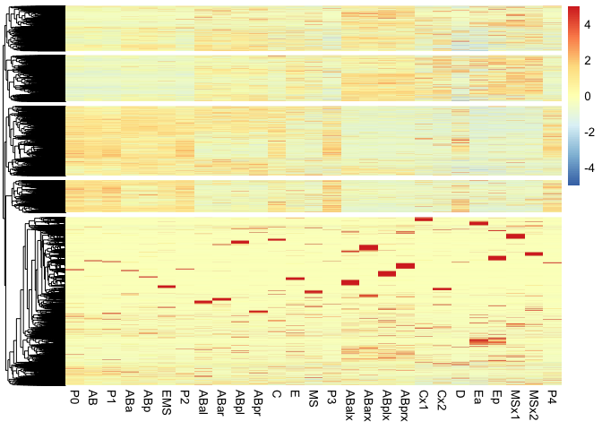
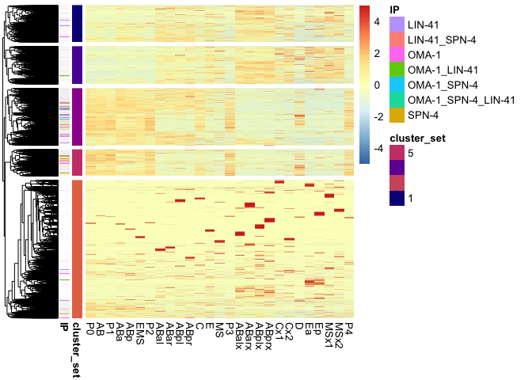
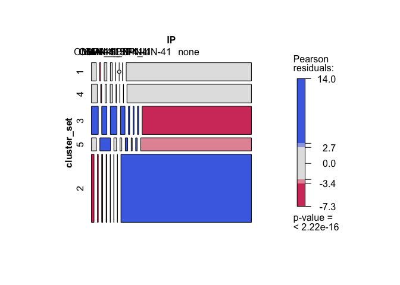
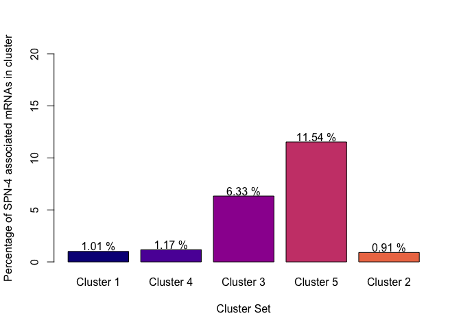
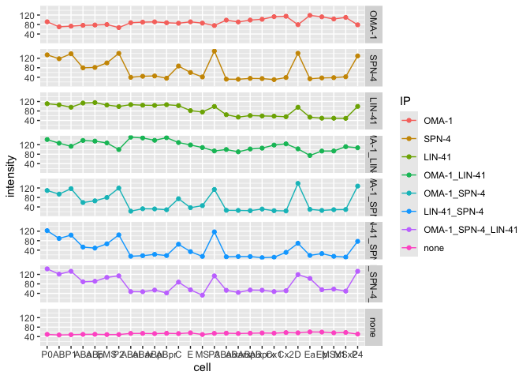

250717_Parsing_scRNA-seq_Tintori
================

- [Transcriptional dynamics of SPN-4 associated mRNAs through early
  embryonic
  development](#transcriptional-dynamics-of-spn-4-associated-mrnas-through-early-embryonic-development)
  - [Load Packages](#load-packages)
  - [Data Import and Munging](#data-import-and-munging)
    - [Import Metadata from Tintori et al
      data](#import-metadata-from-tintori-et-al-data)
    - [Import Tintori et al Normalized RNA-seq
      data](#import-tintori-et-al-normalized-rna-seq-data)
    - [Join the metadata and RNA-seq
      data](#join-the-metadata-and-rna-seq-data)
    - [Filter the data](#filter-the-data)
    - [Import Wormbase identifiers](#import-wormbase-identifiers)
    - [Merge the tintori data with the Wormbase Gene
      identifiers](#merge-the-tintori-data-with-the-wormbase-gene-identifiers)
  - [Heatmaps](#heatmaps)
    - [Import the prefered cell order](#import-the-prefered-cell-order)
    - [Re-organize datasets by preferred cell type
      order](#re-organize-datasets-by-preferred-cell-type-order)
      - [Optimize for preferred heatmap type (not included in
        paper)](#optimize-for-preferred-heatmap-type-not-included-in-paper)
  - [SAVE CLUSTER LISTS - PLOT LINEPLOTS BY CLUSTER
    LIST](#save-cluster-lists---plot-lineplots-by-cluster-list)
- [Save theis plot to annotate the
  heatmap:](#save-theis-plot-to-annotate-the-heatmap)
  - [import the gene lists of SPN-4, OMA-1, and LIN-41
    targets](#import-the-gene-lists-of-spn-4-oma-1-and-lin-41-targets)
    - [Make an annotated heatmap](#make-an-annotated-heatmap)
    - [Save the heatmap](#save-the-heatmap)
    - [Make mosaicplots split by RNA
      cohort](#make-mosaicplots-split-by-rna-cohort)
      - [Save the mosaic plot](#save-the-mosaic-plot)
    - [Lineplots of abundance in the Tintori dataset, split out by RNA
      cohort](#lineplots-of-abundance-in-the-tintori-dataset-split-out-by-rna-cohort)
      - [Save the lineplot](#save-the-lineplot)
  - [Session info](#session-info)

# Transcriptional dynamics of SPN-4 associated mRNAs through early embryonic development

This analysis utilizes a single-cell resolution RNA-seq dataset that
assesses expression patterns through the first five cell divisions in
*C. elegans* (Tintori et al., 2016). The goal of this study is to test
the hypothesis that SPN-4 may be involved in clearing maternal mRNAs out
of early embryos. If this is the case, we would expect to see that SPN-4
associated mRNAs are enriched in clusters of transcripts that undergo
decline in early embryos.

Reference:

[Tintori SC, Osborne Nishimura E, Golden P, Lieb JD, Goldstein B. A
Transcriptional Lineage of the Early C. elegans
Embryo](https://pubmed.ncbi.nlm.nih.gov/27554860). Dev Cell. 2016 Aug
22;38(4):430-44. doi: 10.1016/j.devcel.2016.07.025. PMID: 27554860;
PMCID: PMC4999266.

## Load Packages

The following packages are required:

- corrplot
- RColorBrewer
- pheatmap
- tidyverse
- hrbrthemes
- viridis
- vcd

``` r
library(corrplot)
library(RColorBrewer)
library(pheatmap)
library(tidyverse)
library(hrbrthemes)
library(viridis)
library(vcd)
```

Set Working Directory:

## Data Import and Munging

### Import Metadata from Tintori et al data

This metadata describes each sample in Tintori et al.,

``` r
###########  READ IN THE DATA  #####################

# Set dir
setwd(mywd)

# Import the metadata from Tintori et al.
metadata_tintori <- read.table(file = "01_input/fromTintori/metadata_parsed_50306.txt", header = FALSE, fill = TRUE)

# Annotate & Resort the metadata
colnames(metadata_tintori) <- c("sample", "cellID", "stage", "rep")

# Re-order by sample name
metadata_tintori <- metadata_tintori[order(metadata_tintori$sample),]
dim(metadata_tintori)
```

    ## [1] 219   4

``` r
#head(metadata_tintori)
```

### Import Tintori et al Normalized RNA-seq data

Import the scRNA-seq data from Tintori et al., 2016. This is Table S2 of
that paper.

``` r
# Set dir
setwd(mywd)

# Import the normalized RNA-seq data from Tintori et al.
tintori <- read.table(file = "01_input/fromTintori/TableS2_RPKMs.txt", header = TRUE)
dim(tintori)
```

    ## [1] 31383   220

``` r
# Transform the RNA-seq data long-wise using tidyverse
tintori_long <- pivot_longer(tintori, cols = 2:220, names_to ="sample", values_to = "rpkm")
dim(tintori_long)
```

    ## [1] 6872877       3

``` r
#head(tintori_long)
```

### Join the metadata and RNA-seq data

``` r
# Join the Noramlized RNA-seq data to the metadata into tintori_merged
tintori_merged <- left_join(tintori_long, metadata_tintori)

# Remove tossed cellIDs
dim(tintori_merged)
```

    ## [1] 6872877       6

``` r
#head(tintori_merged)
```

### Filter the data

Remove tossed samples from the dataset

``` r
# How many samples should be tossed?
length(which(metadata_tintori$cellID == "tossed"))
```

    ## [1] 54

``` r
# 54

# How many entries in the merged set?
length(which(tintori_merged$cellID == "tossed"))
```

    ## [1] 1694682

``` r
# 1,694682

# Remove "tossed" entries
tintori_retained_merged <- tintori_merged[which( !tintori_merged$cellID == "tossed"),]
#dim(tintori_retained_merged)
#head(tintori_retained_merged)

# Reduce the data structue down into a nested data frame:
tintori_nest_by_transcript <- tintori_retained_merged |>
  group_by(transcript) |>
  nest() 
```

### Import Wormbase identifiers

These Wormbase identifiers were downloaded from SimpleMine on March 7,
2025 using the following settings:

<figure>

<figcaption aria-hidden="true">SimpleMineSettings</figcaption>
</figure>

``` r
# Set dir
setwd(mywd)

# Import the list that I downloaded from simplemine. There is a screenshot in the same folder that shows what I selected
wormbaseIDs <- read.table(file = "01_input/fromSimpleMine/simplemine_results_WBGene_publicName.txt", header = TRUE, fill = TRUE)
#head(wormbaseIDs)
```

### Merge the tintori data with the Wormbase Gene identifiers

``` r
# Merge the annotation genenames to the tintori nested data frame:          
tintori_nest_by_transcript <- left_join(tintori_nest_by_transcript, wormbaseIDs, join_by( transcript == Public_Name ), keep = TRUE) %>%
  select( c("transcript", "WormBase_Gene_ID", "Public_Name", "data"))
  
dim(tintori_nest_by_transcript)
```

    ## [1] 31383     4

``` r
#head(tintori_nest_by_transcript)
```

------------------------------------------------------------------------

## Heatmaps

    ## [1] 14776     5

#### Import the prefered cell order

This is a file I just typed up with the blastomeres listed by
developmental time and anterior-to-posterior orientation.

### Re-organize datasets by preferred cell type order

    ##  [1] "AB"    "ABa"   "ABal"  "ABalx" "ABar"  "ABarx" "ABp"   "ABpl"  "ABplx"
    ## [10] "ABpr"  "ABprx" "C"     "Cx1"   "Cx2"   "D"     "E"     "EMS"   "Ea"   
    ## [19] "Ep"    "MS"    "MSx1"  "MSx2"  "P0"    "P1"    "P2"    "P3"    "P4"

#### Optimize for preferred heatmap type (not included in paper)

I tested the following settings for heatmaps:

- Complete looks good
- Euclidean also looks good
- “ward.D”, “ward.D2”, “single”, “complete”, “average” (= UPGMA),
  “mcquitty” (= WPGMA), “median” (= WPGMC) or “centroid” (= UPGMC).

Included: Cannaberra complete heatmap

``` r
# Euclidean also looks good
# "ward.D", "ward.D2", "single", "complete", "average" (= UPGMA), "mcquitty" (= WPGMA), "median" (= WPGMC) or "centroid" (= UPGMC).
#wardD - looks good
#wardD2 - looks good
#single- nope

# OF all these, the canberra complete looks the best at separataing out the "decay" group. Euclidean Complete is also very good.

# Here is my favorite heatmap: cannaberra + complete. this one is great for separating out the zygotically transcribed (global) and maternal decay (global) genes:
set.seed(2025)
heatmap_caco5 <- pheatmap(changing_wide_mat, 
         cluster_cols = FALSE,
         scale = "row", 
         show_rownames = FALSE,
         clustering_distance_rows = "canberra", 
         clustering_method = "complete", 
         cutree_rows = 5)
```

<!-- -->

``` r
# I split it into five clusters. I want to annotate the cluster number onto the plot so we can ensure that the cluster numbers match. 
# I want what looks like the 2nd and 3rd clusters as the "maternal transcripts undergoing decay groups"

# obtain the cluster information and add it into the matrix
cluster_set = cutree(heatmap_caco5$tree_row, 5)
clustered_changing_wide_mat <- cbind(changing_wide_mat, 
                     cluster = cluster_set )

# add cluster data into its own data frame
ann = data.frame(cluster_set)
rownames(ann) = rownames(clustered_changing_wide_mat)

#head(ann)
# Colors of the 
vcolors = plasma(7)[1:5]
#vcolors[1]


my_colour = list(cluster_set = c( "1" = vcolors[1], "2" = vcolors[5], "3" = vcolors[3], "4" = vcolors[2], "5" = vcolors[4]))


# Make an annotated heatmap using canaberra + complete:
#set.seed(2025)
heatmap_caco5_ann <- pheatmap(changing_wide_mat, 
         cluster_cols = FALSE,
         scale = "row", 
         annotation_colors = my_colour,
         show_rownames = FALSE,
         clustering_distance_rows = "canberra", 
         clustering_method = "complete", 
         cutree_rows = 5,
         annotation_row=ann)
```

<!-- -->

Save the heatmap to a file:

    ## quartz_off_screen 
    ##                 2

------------------------------------------------------------------------

## SAVE CLUSTER LISTS - PLOT LINEPLOTS BY CLUSTER LIST

Take the clusters generated in heatmap_caco5_ann heatmap and split them
into clusters of gene lists.

For each cluster, generate lineplots of merged transcript abundance
values across cell-type

This will be a supplemental figure

    ##    1    2    3    4    5 
    ## 1591 5958 2463 1627 1144

    ## [1]  5 28

# Save theis plot to annotate the heatmap:

Supplemental Figure

``` r
setwd(mywd)

today <- format(Sys.Date(), "%y%m%d")
filename2 <- paste("03_output/", today, "_cluster_lineplots.pdf", sep = "")
pdf(filename2, width = 6, height = 6)

lineplot_clusters

dev.off()
```

    ## quartz_off_screen 
    ##                 2

## import the gene lists of SPN-4, OMA-1, and LIN-41 targets

The next goal will be to assess which clusters contain SPN-4, OMA-1, and
LIN-41 associated mRNAs and to what degree. The predition is that if
SPN-4 is associated with mRNA decay, then the clusters that are driven
by decay of maternal mRNAs will have a higher propensity of SPN-4
associated mRNAs.

``` r
setwd(mywd)
# import the gene lists
OMA1_1 <- read.table(file = "01_input/lists_from_02/20250711_OMA1_ONLY_list.txt")
SPN4_2 <- read.table(file = "01_input/lists_from_02/20250711_SPN4_ONLY_list.txt")
LIN41_3 <- read.table(file = "01_input/lists_from_02/20250711_LIN41_ONLY_list.txt")
OMA1LIN41_4 <- read.table(file = "01_input/lists_from_02/20250711_OMA1_LIN41_list.txt")
OMA1SPN4_5 <- read.table(file = "01_input/lists_from_02/20250711_OMA1_SPN4_list.txt")
LIN41SPN4_6 <- read.table(file = "01_input/lists_from_02/20250711_LIN41_and_SPN4_list.txt")
ALL_7 <- read.table(file = "01_input/lists_from_02/20250711_OMA1_SPN4_LIN41_list.txt")
```

Merge the datasets

``` r
# eda
#str(OMA1_1)
#str(SPN4_2)
#str(LIN41_3)
#str(OMA1LIN41_4)
#str(OMA1SPN4_5)
#str(LIN41SPN4_6)
#str(ALL_7)

# annotate the dataframes:
OMA1_1 <- OMA1_1 %>% 
  mutate(IP = "OMA-1")

SPN4_2 <- SPN4_2 %>% 
  mutate(IP = "SPN-4")

LIN41_3 <- LIN41_3 %>% 
  mutate(IP = "LIN-41")

OMA1LIN41_4 <- OMA1LIN41_4 %>% 
  mutate(IP = "OMA-1_LIN-41")

OMA1SPN4_5 <- OMA1SPN4_5 %>% 
  mutate(IP = "OMA-1_SPN-4")

LIN41SPN4_6 <- LIN41SPN4_6 %>% 
  mutate(IP = "LIN-41_SPN-4")

ALL_7 <- ALL_7 %>% 
  mutate(IP = "OMA-1_SPN-4_LIN-41")

# merge the gene lists
IP_lookup <- rbind(OMA1_1, SPN4_2, LIN41_3, OMA1LIN41_4, OMA1SPN4_5, LIN41SPN4_6, ALL_7)
colnames(IP_lookup) <- c("WormBase_Gene_ID", "IP") 
#dim(IP_lookup)
#table(IP_lookup$IP)
#head(IP_lookup)

# user wormbaseID dataframe to add transcript names to gene lists
head(wormbaseIDs)
```

    ##       Your_Input WormBase_Gene_ID Public_Name Sequence_Name      Other_Name
    ## 1 WBGene00000001   WBGene00000001       aap-1    Y110A7A.10 CELE_Y110A7A.10
    ## 2 WBGene00000002   WBGene00000002       aat-1       F27C8.1    CELE_F27C8.1
    ## 3 WBGene00000003   WBGene00000003       aat-2       F07C3.7    CELE_F07C3.7
    ## 4 WBGene00000004   WBGene00000004       aat-3       F52H2.2    CELE_F52H2.2
    ## 5 WBGene00000005   WBGene00000005       aat-4     T13A10.10  CELE_T13A10.10
    ## 6 WBGene00000006   WBGene00000006       aat-5       C55C2.5    CELE_C55C2.5

``` r
IP_lookup_annotated <- left_join(IP_lookup, wormbaseIDs)
#head(IP_lookup_annotated)
# merge gene lists with changing_wide_mat

# create an annotated heatmap
changing_wide_df <- rownames_to_column(as.data.frame(changing_wide_mat))
#head(changing_wide_df)

changing_wide_IP <- left_join(changing_wide_df, IP_lookup_annotated, by = c("rowname"="Sequence_Name"))

changing_wide_df_plusIP <- column_to_rownames(changing_wide_IP[,1:30]) 
# Add the column changing_wide_IP$IP to the annotation table and re-map the heatmap 

# add cluster data into its own data frame
#head(ann)
#head(changing_wide_df_plusIP)
table(rownames(ann) == rownames(changing_wide_df_plusIP))
```

    ## 
    ##  TRUE 
    ## 12783

``` r
#changing_wide_df_plusIP
ann2 <- cbind(ann, changing_wide_df_plusIP$IP)
colnames(ann2) <- c("cluster_set", "IP")

ann3 <- ann2
```

#### Make an annotated heatmap

This is the heatmap that will be used in the paper as a supplemental
figure. Tintori et al data plotted as a heatmap, with cell-types sorted
by stage and anterior-to-posterior orientation, colored for the
different clusters, and annotated for the SPN-4, OMA-1, and LIN-41
associated mRNAs.

<!-- -->

#### Save the heatmap

This will be used as a Supplemental Figure.

Note, the .pdf and .jpg output was too big for github. Had to export
things manually.

``` r
# Save the heatmap:

#setwd(mywd)
#today <- format(Sys.Date(), "%y%m%d")
#filename4 <- paste("03_output/", today, "_heatmap_clusters_and_IP.pdf", sep = "")
#pdf(filename4, width = 6, height = 8)

#heatmap_caco5_ip
    
#dev.off()

# This didn't work. Had to use Export -> Export as Jpeg
#filename5 <- paste("03_output/", today, "_heatmap_clusters_and_IP.jpg", sep = "")
#jpeg(filename5, width = 6, height = 8)

#heatmap_caco5_ip

#dev.off()
```

### Make mosaicplots split by RNA cohort

``` r
ann3$cluster_set <- factor(ann3$cluster_set, levels = c(1, 4, 3, 5, 2))

#ann3$cluster_set
ann3[which(is.na(ann3$IP)), 2] <- "none"
ann3$IP <- factor(ann3$IP, levels = c("OMA-1", "SPN-4", "LIN-41", "OMA-1_LIN-41", "OMA-1_SPN-4", "LIN-41_SPN-4", "OMA-1_SPN-4_LIN-41", "none"))

#ann3
#str(ann3)

ann3tabs <- xtabs(~ cluster_set + IP, data = ann3)
mosaicplot1 <- mosaic(ann3tabs, gp = shading_max, 
                      split_horizontal = TRUE)
```

<!-- -->

``` r
mosaic(ann3tabs, gp = shading_max, 
       split_horizontal = TRUE)
```

<!-- -->

``` r
# Create a barplot tabulating the % of SPN-4 associated genes within each cluster
tabs_dataframe <- as.data.frame(mosaicplot1)

# Calculate SPN-4 associated gene as a percentage of each cluster set
SPN4_Percentage_plot <- tabs_dataframe |>
  pivot_wider(names_from = IP, values_from = Freq) |>
  rowwise(cluster_set) |>
  mutate(SPN_percent = sum(c(`SPN-4`, `OMA-1_SPN-4`, `LIN-41_SPN-4`, `OMA-1_SPN-4_LIN-41`))/sum(c_across(`OMA-1`:`none`))*100)

# Label Percentage values
textSPN <- paste(round(SPN4_Percentage_plot$SPN_percent, 2), " %", sep = "")

# Set colors
vcolors = plasma(7)[1:5]
#vcolors[1]

# Barplot 
bp1 <- barplot(SPN4_Percentage_plot$SPN_percent, ylim = c(0, 20),
        names.arg = c("Cluster 1", "Cluster 4", "Cluster 3", "Cluster 5", "Cluster 2"),
        xlab = "Cluster Set", 
        ylab = "Percentage of SPN-4 associated mRNAs in cluster", 
        col = vcolors)
# Add text
text(x = bp1, y = SPN4_Percentage_plot$SPN_percent + 0.5, labels = textSPN)
```

<!-- -->
\#### Save the barplot (% SPN-4 associated mRNAs in each clusteer)

This will be a Supplementary Figure

``` r
today <- format(Sys.Date(), "%y%m%d")
filename4 <- paste("03_output/", today, "_SPN4_percentage_barplot.pdf", sep = "")

#--> Note: this didn't look right. Had to save with Export -> Save As PDF

setwd(mywd)
pdf(filename4, width = 5, height = 5)

bp1 <- barplot(SPN4_Percentage_plot$SPN_percent, ylim = c(0, 20),
        names.arg = c("Cluster 1", "Cluster 4", "Cluster 3", "Cluster 5", "Cluster 2"),
        xlab = "Cluster Set", 
        ylab = "Percentage of SPN-4 associated mRNAs in cluster", 
        col = vcolors)
# Add text
text(x = bp1, y = SPN4_Percentage_plot$SPN_percent + 0.5, labels = textSPN)

dev.off()
```

    ## quartz_off_screen 
    ##                 2

#### Save the mosaic plot

Supplemental Figure.

``` r
today <- format(Sys.Date(), "%y%m%d")
filename3 <- paste("03_output/", today, "_mosaicplot.pdf", sep = "")

#--> Note: this didn't look right. Had to save with Export -> Save As PDF

setwd(mywd)
pdf(filename3, width = 8, height = 8)

mosaic(ann3tabs, gp = shading_max, 
       split_horizontal = TRUE)

dev.off()
```

    ## quartz_off_screen 
    ##                 2

### Lineplots of abundance in the Tintori dataset, split out by RNA cohort

Supplemental Figure

``` r
############ CREATE LINEPLOTS group_by IP #############

# start with clustered_changing_wide_df and annotate with ann2 using left_join
#head(clustered_changing_wide_df)
#head(ann2)

clustered_changing_wide_ann2 <- left_join(rownames_to_column(clustered_changing_wide_df), rownames_to_column(ann3))
clustered_changing_wide_ann2 <- column_to_rownames(clustered_changing_wide_ann2) 
clustered_changing_wide_ann2 <- clustered_changing_wide_ann2 %>%
  select(!(cluster:cluster_set))


#head(clustered_changing_wide_ann2)
# Create a dataframe that is grouped by the cluster and calculate the mean values of each cell ID across the cluster:

mean_by_IP <- clustered_changing_wide_ann2 %>% 
  group_by(IP) %>%
  summarise_all("mean")

# eda 
#dim(mean_by_IP)
#mean_by_IP
mean_by_IP <- as.data.frame(mean_by_IP)

# convert the meanbycluster into longform data to plot using ggplot2:
longer_means_by_IP <- pivot_longer(mean_by_IP, cols = 2:28, names_to = "cell",
                                        values_to = "intensity")

# Set cell ID as an ordered factor
longer_means_by_IP$cell <- factor(longer_means_by_IP$cell, levels = colnames(changing_wide_mat))

# create lineplots of the trend over cell type for each cluster
lineplot_IP <- ggplot(longer_means_by_IP, aes(x=cell, y=intensity, group=IP, colour=IP)) + 
  geom_line()+
  geom_point() +
  facet_grid(rows = vars(IP))

lineplot_IP
```

<!-- -->

#### Save the lineplot

``` r
# Save theis plot to annotate the heatmap:
setwd(mywd)

today <- format(Sys.Date(), "%y%m%d")
filename5 <- paste("03_output/", today, "_IP_lineplots.pdf", sep = "")
pdf(filename5, width = 6, height = 6)

lineplot_IP

dev.off()
```

    ## quartz_off_screen 
    ##                 2

## Session info

``` r
sessionInfo()
```

    ## R version 4.3.1 (2023-06-16)
    ## Platform: x86_64-apple-darwin20 (64-bit)
    ## Running under: macOS 15.4.1
    ## 
    ## Matrix products: default
    ## BLAS:   /Library/Frameworks/R.framework/Versions/4.3-x86_64/Resources/lib/libRblas.0.dylib 
    ## LAPACK: /Library/Frameworks/R.framework/Versions/4.3-x86_64/Resources/lib/libRlapack.dylib;  LAPACK version 3.11.0
    ## 
    ## locale:
    ## [1] en_US.UTF-8/en_US.UTF-8/en_US.UTF-8/C/en_US.UTF-8/en_US.UTF-8
    ## 
    ## time zone: America/Denver
    ## tzcode source: internal
    ## 
    ## attached base packages:
    ## [1] grid      stats     graphics  grDevices utils     datasets  methods  
    ## [8] base     
    ## 
    ## other attached packages:
    ##  [1] vcd_1.4-13         viridis_0.6.5      viridisLite_0.4.2  hrbrthemes_0.8.7  
    ##  [5] lubridate_1.9.4    forcats_1.0.0      stringr_1.5.1      dplyr_1.1.4       
    ##  [9] purrr_1.1.0        readr_2.1.5        tidyr_1.3.1        tibble_3.3.0      
    ## [13] ggplot2_3.5.2      tidyverse_2.0.0    pheatmap_1.0.13    RColorBrewer_1.1-3
    ## [17] corrplot_0.95     
    ## 
    ## loaded via a namespace (and not attached):
    ##  [1] generics_0.1.4          fontLiberation_0.1.0    lattice_0.22-7         
    ##  [4] stringi_1.8.7           extrafontdb_1.0         hms_1.1.3              
    ##  [7] digest_0.6.37           magrittr_2.0.3          evaluate_1.0.4         
    ## [10] timechange_0.3.0        fastmap_1.2.0           gridExtra_2.3          
    ## [13] scales_1.4.0            fontBitstreamVera_0.1.1 cli_3.6.5              
    ## [16] rlang_1.1.6             fontquiver_0.2.1        withr_3.0.2            
    ## [19] yaml_2.3.10             gdtools_0.4.2           tools_4.3.1            
    ## [22] tzdb_0.5.0              colorspace_2.1-1        vctrs_0.6.5            
    ## [25] R6_2.6.1                zoo_1.8-14              lifecycle_1.0.4        
    ## [28] MASS_7.3-60             pkgconfig_2.0.3         pillar_1.11.0          
    ## [31] gtable_0.3.6            glue_1.8.0              Rcpp_1.1.0             
    ## [34] systemfonts_1.2.3       lmtest_0.9-40           xfun_0.52              
    ## [37] tidyselect_1.2.1        rstudioapi_0.17.1       knitr_1.50             
    ## [40] farver_2.1.2            extrafont_0.19          htmltools_0.5.8.1      
    ## [43] labeling_0.4.3          rmarkdown_2.29          Rttf2pt1_1.3.12        
    ## [46] compiler_4.3.1
