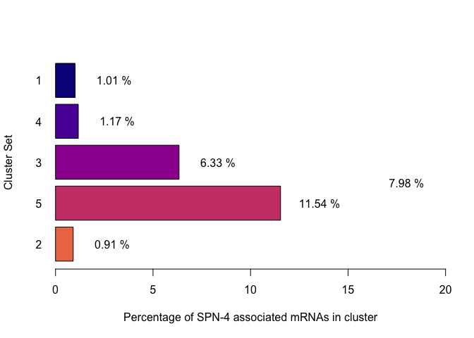
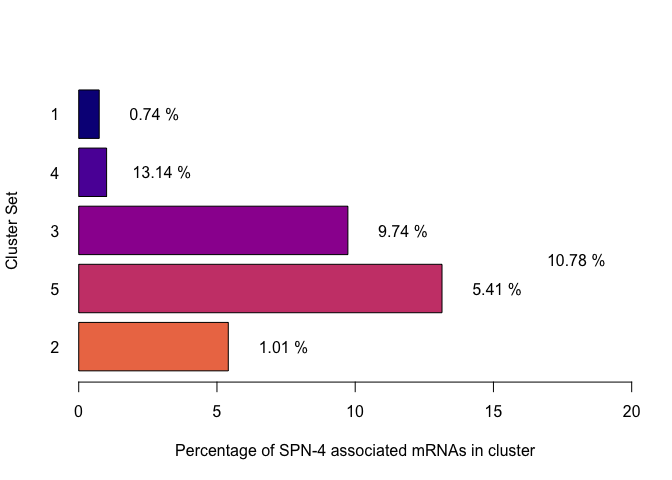
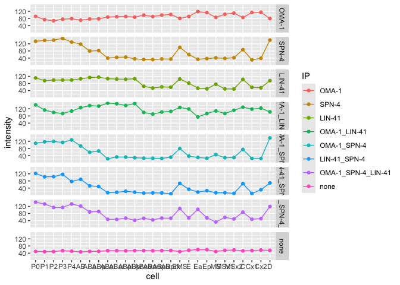
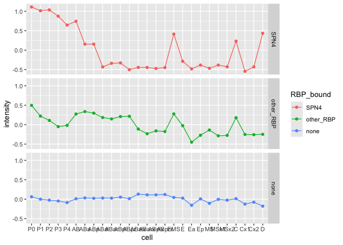
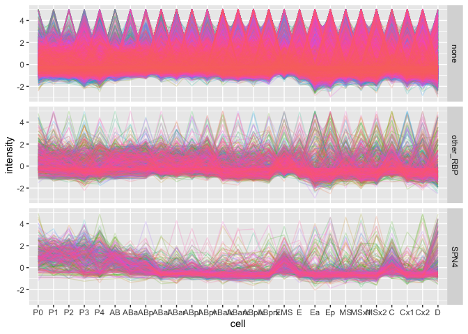

260106_Parsing_scRNA-seq_Tintori
================

- [Transcriptional dynamics of SPN-4 associated mRNAs through early
  embryonic
  development](#transcriptional-dynamics-of-spn-4-associated-mrnas-through-early-embryonic-development)
  - [Load Packages](#load-packages)
  - [Data Import and Munging](#data-import-and-munging)
    - [Import Metadata from Tintori et al
      data](#import-metadata-from-tintori-et-al-data)
    - [Import Tintori et al Normalized RNA-seq
      data](#import-tintori-et-al-normalized-rna-seq-data)
    - [Join the metadata and RNA-seq
      data](#join-the-metadata-and-rna-seq-data)
    - [Filter the data](#filter-the-data)
    - [Import Wormbase identifiers](#import-wormbase-identifiers)
    - [Merge the tintori data with the Wormbase Gene
      identifiers](#merge-the-tintori-data-with-the-wormbase-gene-identifiers)
    - [Import the prefered cell order](#import-the-prefered-cell-order)
  - [Heatmaps](#heatmaps)
    - [Re-organize datasets by preferred cell type
      order](#re-organize-datasets-by-preferred-cell-type-order)
      - [Optimize for preferred heatmap type (not included in
        paper)](#optimize-for-preferred-heatmap-type-not-included-in-paper)
    - [Split genes into clusters based on
      heatmap](#split-genes-into-clusters-based-on-heatmap)
    - [Save lineplot split by
      clusters](#save-lineplot-split-by-clusters)
  - [Quick experimentation into a different ordering of the
    cells](#quick-experimentation-into-a-different-ordering-of-the-cells)
    - [import the gene lists of SPN-4, OMA-1, and LIN-41
      targets](#import-the-gene-lists-of-spn-4-oma-1-and-lin-41-targets)
    - [Make an annotated heatmap](#make-an-annotated-heatmap)
    - [Save the heatmap](#save-the-heatmap)
  - [Mosaic plots](#mosaic-plots)
    - [Save the barplot (% SPN-4 associated mRNAs in each
      clusteer)](#save-the-barplot--spn-4-associated-mrnas-in-each-clusteer)
    - [Save the mosaic plot](#save-the-mosaic-plot)
  - [Lineplots, split by cluster set](#lineplots-split-by-cluster-set)
    - [Save the lineplot](#save-the-lineplot)
  - [Playing around with a different cell
    order](#playing-around-with-a-different-cell-order)
  - [Additional plots](#additional-plots)
    - [Calculate the clusters that are represented in SPN-4-bound versus
      un-bound
      categories](#calculate-the-clusters-that-are-represented-in-spn-4-bound-versus-un-bound-categories)
    - [Save SPN-4 bound v. unbound stacked, proportional
      barplot](#save-spn-4-bound-v-unbound-stacked-proportional-barplot)
    - [What is the variance of gene expression over developmental
      time?](#what-is-the-variance-of-gene-expression-over-developmental-time)
    - [Output the mean by lineage -
      z-scored](#output-the-mean-by-lineage---z-scored)
    - [Agilent-style transparent
      multi-lineplots](#agilent-style-transparent-multi-lineplots)
    - [Export the alpha-tinted
      multi-lineplot](#export-the-alpha-tinted-multi-lineplot)
  - [Session info](#session-info)

# Transcriptional dynamics of SPN-4 associated mRNAs through early embryonic development

This analysis utilizes a single-cell resolution RNA-seq dataset that
assesses expression patterns through the first five cell divisions in
*C. elegans* (Tintori et al., 2016). The goal of this study is to test
the hypothesis that SPN-4 may be involved in clearing maternal mRNAs out
of early embryos. If this is the case, we would expect to see that SPN-4
associated mRNAs are enriched in clusters of maternal transcripts that
undergo decline in early embryos.

Reference:

Tintori SC, Osborne Nishimura E, Golden P, Lieb JD, Goldstein B. [A
Transcriptional Lineage of the Early C. elegans
Embryo](https://pubmed.ncbi.nlm.nih.gov/27554860). Dev Cell. 2016 Aug
22;38(4):430-44. doi: 10.1016/j.devcel.2016.07.025. PMID: 27554860;
PMCID: PMC4999266.

## Load Packages

The following packages are required:

- corrplot
- RColorBrewer
- pheatmap
- tidyverse
- hrbrthemes
- viridis
- vcd

``` r
library(corrplot)
library(RColorBrewer)
library(pheatmap)
library(tidyverse)
library(hrbrthemes)
library(viridis)
library(vcd)
```

Set Working Directory:

    ## [1] "/Users/erinnishimura/Library/CloudStorage/Dropbox/github/SPN4_maternal_mRNA/04_Tintori_et_al_Comparison_Fig_2_S2/02_scripts"

## Data Import and Munging

### Import Metadata from Tintori et al data

This metadata describes each sample in Tintori et al.,

``` r
###########  READ IN THE DATA  #####################

# Import the metadata from Tintori et al.
metadata_tintori <- read.table(file = "../01_input/fromTintori/metadata_parsed_50306.txt", header = FALSE, fill = TRUE)

# Annotate & Resort the metadata
colnames(metadata_tintori) <- c("sample", "cellID", "stage", "rep")

# Re-order by sample name
metadata_tintori <- metadata_tintori[order(metadata_tintori$sample),]
dim(metadata_tintori)
```

    ## [1] 219   4

``` r
#head(metadata_tintori)
```

### Import Tintori et al Normalized RNA-seq data

Import the scRNA-seq data from Tintori et al., 2016. This is Table S2 of
that paper.

``` r
# Import the normalized RNA-seq data from Tintori et al.
tintori <- read.table(file = "../01_input/fromTintori/TableS2_RPKMs.txt", header = TRUE)
dim(tintori)
```

    ## [1] 31383   220

``` r
# Transform the RNA-seq data long-wise using tidyverse
tintori_long <- pivot_longer(tintori, cols = 2:220, names_to ="sample", values_to = "rpkm")
dim(tintori_long)
```

    ## [1] 6872877       3

``` r
head(tintori_long)
```

    ## # A tibble: 6 × 3
    ##   transcript sample  rpkm
    ##   <chr>      <chr>  <dbl>
    ## 1 2L52.1     st411   0   
    ## 2 2L52.1     st413   0   
    ## 3 2L52.1     st415   0   
    ## 4 2L52.1     st441   0   
    ## 5 2L52.1     st449   3.21
    ## 6 2L52.1     st451   0

### Join the metadata and RNA-seq data

``` r
# Join the Noramlized RNA-seq data to the metadata into tintori_merged
tintori_merged <- left_join(tintori_long, metadata_tintori)

# Remove tossed cellIDs
dim(tintori_merged)
```

    ## [1] 6872877       6

``` r
head(tintori_merged)
```

    ## # A tibble: 6 × 6
    ##   transcript sample  rpkm cellID stage  rep  
    ##   <chr>      <chr>  <dbl> <chr>  <chr>  <chr>
    ## 1 2L52.1     st411   0    P0     1-cell r1   
    ## 2 2L52.1     st413   0    P0     1-cell r2   
    ## 3 2L52.1     st415   0    tossed 1-cell r3   
    ## 4 2L52.1     st441   0    P0     1-cell r4   
    ## 5 2L52.1     st449   3.21 P0     1-cell r5   
    ## 6 2L52.1     st451   0    P0     1-cell r6

### Filter the data

Remove tossed samples from the dataset

``` r
# How many samples should be tossed?
length(which(metadata_tintori$cellID == "tossed"))
```

    ## [1] 54

``` r
# 54

# How many entries in the merged set?
length(which(tintori_merged$cellID == "tossed"))
```

    ## [1] 1694682

``` r
# 1,694682

# Remove "tossed" entries
tintori_retained_merged <- tintori_merged[which( !tintori_merged$cellID == "tossed"),]
#dim(tintori_retained_merged)
#head(tintori_retained_merged)

# Reduce the data structue down into a nested data frame:
tintori_nest_by_transcript <- tintori_retained_merged |>
  group_by(transcript) |>
  nest() 
```

### Import Wormbase identifiers

These Wormbase identifiers were downloaded from SimpleMine on March 7,
2025 using the following settings:

<figure>

<figcaption aria-hidden="true">SimpleMineSettings</figcaption>
</figure>

``` r
# Import the list that I downloaded from simplemine. There is a screenshot in the same folder that shows what I selected
wormbaseIDs <- read.table(file = "../01_input/fromSimpleMine/simplemine_results_WBGene_publicName.txt", header = TRUE, fill = TRUE)
#head(wormbaseIDs)
```

### Merge the tintori data with the Wormbase Gene identifiers

``` r
# Merge the annotation genenames to the tintori nested data frame:          
tintori_nest_by_transcript <- left_join(tintori_nest_by_transcript, wormbaseIDs, join_by( transcript == Public_Name ), keep = TRUE) %>%
  select( c("transcript", "WormBase_Gene_ID", "Public_Name", "data"))
  
dim(tintori_nest_by_transcript)
```

    ## [1] 31383     4

``` r
#head(tintori_nest_by_transcript)
```

### Import the prefered cell order

This is a file I just typed up with the blastomeres listed by
developmental time and anterior-to-posterior orientation.

------------------------------------------------------------------------

## Heatmaps

Preprocessing the data for heatmaps by making the pre-processed heatmap
matrix.

- Filter for total RPKM \> 5
- Filter for variance \> 10
- Select only the most relevant columns

<!-- -->

    ## [1] 14776     5

    ## [1] 12783     6

    ## [1] 1993    6

### Re-organize datasets by preferred cell type order

Merge pre-processed, heatmap-ready matrix with the preferred cell order
information.

    ##  [1] "AB"    "ABa"   "ABal"  "ABalx" "ABar"  "ABarx" "ABp"   "ABpl"  "ABplx"
    ## [10] "ABpr"  "ABprx" "C"     "Cx1"   "Cx2"   "D"     "E"     "EMS"   "Ea"   
    ## [19] "Ep"    "MS"    "MSx1"  "MSx2"  "P0"    "P1"    "P2"    "P3"    "P4"

    ##  chr [1:27] "P0" "AB" "P1" "ABa" "ABp" "EMS" "P2" "ABal" "ABar" "ABpl" ...

#### Optimize for preferred heatmap type (not included in paper)

I tested the following settings for heatmaps:

- Complete looks good
- Euclidean also looks good
- “ward.D”, “ward.D2”, “single”, “complete”, “average” (= UPGMA),
  “mcquitty” (= WPGMA), “median” (= WPGMC) or “centroid” (= UPGMC).

Processing:

- Use Canaberra complete to draw a heatmap and to split it into clusters
- Cut the heatmap into 5 clusters
- Annotate the cluster names back onto the original heatmap

``` r
# Canabarra, complete looks best
# Euclidean also looks good
# "ward.D", "ward.D2", "single", "complete", "average" (= UPGMA), "mcquitty" (= WPGMA), "median" (= WPGMC) or "centroid" (= UPGMC).
#wardD - looks good
#wardD2 - looks good
#single- nope

# OF all these, the canberra complete looks the best at separataing out the "decay" group. Euclidean Complete is also very good.

# Here is my favorite heatmap: cannaberra + complete. this one is great for separating out the zygotically transcribed (global) and maternal decay (global) genes:
set.seed(2025)
heatmap_caco5 <- pheatmap(changing_wide_mat, 
         cluster_cols = FALSE,
         scale = "row", 
         show_rownames = FALSE,
         clustering_distance_rows = "canberra", 
         clustering_method = "complete", 
         cutree_rows = 5)
```

<!-- -->

``` r
#heatmap_caco5
# I split it into five clusters. I want to annotate the cluster number onto the plot so we can ensure that the cluster numbers match. 
# I want what looks like the 2nd and 3rd clusters as the "maternal transcripts undergoing decay groups"

# obtain the cluster information and add it into the matrix
cluster_set = cutree(heatmap_caco5$tree_row, 5)
clustered_changing_wide_mat <- cbind(changing_wide_mat, 
                     cluster = cluster_set )

# add cluster data into its own data frame
ann = data.frame(cluster_set)
rownames(ann) = rownames(clustered_changing_wide_mat)

#head(ann)
# Colors of the 
vcolors = plasma(7)[1:5]
#vcolors[1]

my_colour = list(cluster_set = c( "1" = vcolors[1], "2" = vcolors[5], "3" = vcolors[3], "4" = vcolors[2], "5" = vcolors[4]))

# Make an annotated heatmap using canaberra + complete:
#set.seed(2025)
heatmap_caco5_ann <- pheatmap(changing_wide_mat, 
         cluster_cols = FALSE,
         scale = "row", 
         annotation_colors = my_colour,
         show_rownames = FALSE,
         clustering_distance_rows = "canberra", 
         clustering_method = "complete", 
         cutree_rows = 5,
         annotation_row=ann)
```

<!-- -->

``` r
#heatmap_caco5_ann
```

------------------------------------------------------------------------

### Split genes into clusters based on heatmap

Take the clusters generated in heatmap_caco5_ann heatmap and split them
into clusters of gene lists.

For each cluster, generate lineplots of merged transcript abundance
values across cell-type

This will be a supplemental figure

    ##    1    2    3    4    5 
    ## 1591 5958 2463 1627 1144

    ## [1]  5 28

<!-- -->

### Save lineplot split by clusters

Supplemental Figure

``` r
today <- format(Sys.Date(), "%y%m%d")
filename2 <- paste("../03_outputPlots/", today, "_cluster_lineplots.pdf", sep = "")
pdf(filename2, width = 6, height = 6)

lineplot_clusters

dev.off()
```

    ## quartz_off_screen 
    ##                 2

------------------------------------------------------------------------

## Quick experimentation into a different ordering of the cells

``` r
# Try a different ordering of cell
head(meanbycluster)
```

    ##   cluster         P0         AB         P1        ABa       ABp        EMS
    ## 1       1  58.254284  58.408998  52.694567  69.654901  69.46551  62.467795
    ## 2       2   7.359928   5.599532   6.305161   6.256803   6.30786   6.460422
    ## 3       3 116.634707 115.371842 114.346262 111.085353 111.77228 108.549186
    ## 4       4  98.867328  86.827219  93.996396 108.547870 109.59143 107.643115
    ## 5       5 110.626997  97.293502 108.571201  76.028762  77.02434  87.169369
    ##           P2       ABal       ABar       ABpl       ABpr         C          E
    ## 1  53.005779  87.923706  82.662289  82.758969  87.077893  64.12212  77.538435
    ## 2   5.858863   7.000541   7.266835   7.423593   7.124471   7.35365   8.858477
    ## 3 115.334638  87.441951  84.546619  87.471753  88.342119  98.69178  72.365687
    ## 4  95.060229 171.613372 178.658617 165.069684 172.920379 147.24492 200.560820
    ## 5 108.620829  40.277121  44.871388  46.450935  41.424857  85.62389  57.773191
    ##           MS         P3      ABalx      ABarx      ABplx      ABprx       Cx1
    ## 1  68.023288  49.744101  90.673486  89.981106  93.135893  90.097648  68.34862
    ## 2   8.136114   7.971257   8.284367   7.511074   7.858231   7.770515  10.75207
    ## 3  61.961540 109.868852  44.945287  40.929405  41.397314  41.802456  44.07437
    ## 4 181.743453 129.462849 235.515808 232.114549 240.481268 252.286695 247.71028
    ## 5  42.306633 120.684615  26.090820  24.572538  24.302427  23.066108  36.06638
    ##          Cx2          D        Ea        Ep      MSx1       MSx2         P4
    ## 1  72.672988  45.244476  55.56791  69.65401  79.86260  84.282174  55.400993
    ## 2   8.704621   9.857223  27.97222  17.63481  10.37803   9.277815   6.097396
    ## 3  41.774101  88.334934  27.04617  33.17239  35.21143  33.308613 108.779984
    ## 4 271.498133 182.945880 264.40306 271.88463 264.45454 276.412145 121.714814
    ## 5  38.982450 110.088460  26.62203  29.34532  24.83300  30.552340 105.401384

``` r
length(colnames(meanbycluster))
```

    ## [1] 28

``` r
testOrder <- c(1, 2, 4, 8, 16, 28, 3, 5, 6, 9, 10, 11, 12, 17, 18, 19, 20, 7, 14, 24, 25, 15, 26, 27, 13, 21, 22, 23)
length(testOrder)
```

    ## [1] 28

``` r
# re-arrange changing_wide_mat columns by the best order 
meanbycluster_reordered <- meanbycluster[ , testOrder]

# convert the meanbycluster into longform data to plot using ggplot2:
longer_means_by_cluster_reordered <- pivot_longer(meanbycluster_reordered, cols = 2:28, names_to ="cell",
             values_to = "intensity")

# Set cell ID and cluster as ordered factors
longer_means_by_cluster_reordered$cell <- factor(longer_means_by_cluster_reordered$cell, levels = colnames(meanbycluster)[testOrder])
longer_means_by_cluster_reordered$cluster <- factor(longer_means_by_cluster_reordered$cluster, levels = c(1,4,3,5,2))

# create lineplots of the trend over cell type for each cluster
vcolors = plasma(7)[1:5]
#vcolors
lineplot_clusters2 <- ggplot(longer_means_by_cluster_reordered, aes(x=cell, y=intensity, group=cluster, colour=cluster)) + 
  geom_line()+
  geom_point() +
  scale_color_manual(values = vcolors) +
  facet_grid(rows = vars(cluster))

lineplot_clusters2
```

<!-- -->

``` r
# Save plot
today <- format(Sys.Date(), "%y%m%d")
filename2 <- paste("../03_outputPlots/", today, "_cluster_lineplots_test_new_order.pdf", sep = "")
pdf(filename2, width = 6, height = 6)

lineplot_clusters2

dev.off()
```

    ## quartz_off_screen 
    ##                 2

### import the gene lists of SPN-4, OMA-1, and LIN-41 targets

The next goal will be to assess which clusters contain SPN-4, OMA-1, and
LIN-41 associated mRNAs and to what degree. The predition is that if
SPN-4 is associated with mRNA decay, then the clusters that are driven
by decay of maternal mRNAs will have a higher propensity of SPN-4
associated mRNAs.

These lists of sets are from [a previous analysis within this same
github
repository](https://github.com/erinosb/SPN4_maternal_mRNA/tree/main/02_SPN4_LIN41_OMA1_Comparison_Fig_1_S1/04_output_data)

``` r
# import the gene lists
OMA1_1 <- read.table(file = "../01_input/lists_from_02/20250711_OMA1_ONLY_list.txt")
SPN4_2 <- read.table(file = "../01_input/lists_from_02/20250711_SPN4_ONLY_list.txt")
LIN41_3 <- read.table(file = "../01_input/lists_from_02/20250711_LIN41_ONLY_list.txt")
OMA1LIN41_4 <- read.table(file = "../01_input/lists_from_02/20250711_OMA1_LIN41_list.txt")
OMA1SPN4_5 <- read.table(file = "../01_input/lists_from_02/20250711_OMA1_SPN4_list.txt")
LIN41SPN4_6 <- read.table(file = "../01_input/lists_from_02/20250711_LIN41_and_SPN4_list.txt")
ALL_7 <- read.table(file = "../01_input/lists_from_02/20250711_OMA1_SPN4_LIN41_list.txt")
```

Merge the datasets

``` r
# eda
#str(OMA1_1)
#str(SPN4_2)
#str(LIN41_3)
#str(OMA1LIN41_4)
#str(OMA1SPN4_5)
#str(LIN41SPN4_6)
#str(ALL_7)

# Annotate the dataframes:
OMA1_1 <- OMA1_1 %>% 
  mutate(IP = "OMA-1")

SPN4_2 <- SPN4_2 %>% 
  mutate(IP = "SPN-4")

LIN41_3 <- LIN41_3 %>% 
  mutate(IP = "LIN-41")

OMA1LIN41_4 <- OMA1LIN41_4 %>% 
  mutate(IP = "OMA-1_LIN-41")

OMA1SPN4_5 <- OMA1SPN4_5 %>% 
  mutate(IP = "OMA-1_SPN-4")

LIN41SPN4_6 <- LIN41SPN4_6 %>% 
  mutate(IP = "LIN-41_SPN-4")

ALL_7 <- ALL_7 %>% 
  mutate(IP = "OMA-1_SPN-4_LIN-41")

# merge the gene lists
IP_lookup <- rbind(OMA1_1, SPN4_2, LIN41_3, OMA1LIN41_4, OMA1SPN4_5, LIN41SPN4_6, ALL_7)

IP_lookup
```

    ##                  V1                 IP
    ## 1    WBGene00019815              OMA-1
    ## 2    WBGene00021450              OMA-1
    ## 3    WBGene00021449              OMA-1
    ## 4    WBGene00015257              OMA-1
    ## 5    WBGene00044776              OMA-1
    ## 6    WBGene00021736              OMA-1
    ## 7    WBGene00021610              OMA-1
    ## 8    WBGene00001857              OMA-1
    ## 9    WBGene00018052              OMA-1
    ## 10   WBGene00000478              OMA-1
    ## 11   WBGene00020756              OMA-1
    ## 12   WBGene00019967              OMA-1
    ## 13   WBGene00015040              OMA-1
    ## 14   WBGene00003767              OMA-1
    ## 15   WBGene00019564              OMA-1
    ## 16   WBGene00269427              OMA-1
    ## 17   WBGene00019274              OMA-1
    ## 18   WBGene00022528              OMA-1
    ## 19   WBGene00001714              OMA-1
    ## 20   WBGene00004928              OMA-1
    ## 21   WBGene00019841              OMA-1
    ## 22   WBGene00016511              OMA-1
    ## 23   WBGene00015451              OMA-1
    ## 24   WBGene00021731              OMA-1
    ## 25   WBGene00015684              OMA-1
    ## 26   WBGene00017261              OMA-1
    ## 27   WBGene00022589              OMA-1
    ## 28   WBGene00022590              OMA-1
    ## 29   WBGene00015766              OMA-1
    ## 30   WBGene00015765              OMA-1
    ## 31   WBGene00045305              OMA-1
    ## 32   WBGene00019765              OMA-1
    ## 33   WBGene00017931              OMA-1
    ## 34   WBGene00017538              OMA-1
    ## 35   WBGene00019520              OMA-1
    ## 36   WBGene00017431              OMA-1
    ## 37   WBGene00020911              OMA-1
    ## 38   WBGene00020909              OMA-1
    ## 39   WBGene00001073              OMA-1
    ## 40   WBGene00001089              OMA-1
    ## 41   WBGene00020949              OMA-1
    ## 42   WBGene00044699              OMA-1
    ## 43   WBGene00015963              OMA-1
    ## 44   WBGene00017201              OMA-1
    ## 45   WBGene00016150              OMA-1
    ## 46   WBGene00001719              OMA-1
    ## 47   WBGene00022813              OMA-1
    ## 48   WBGene00045277              OMA-1
    ## 49   WBGene00022409              OMA-1
    ## 50   WBGene00017818              OMA-1
    ## 51   WBGene00022398              OMA-1
    ## 52   WBGene00005648              OMA-1
    ## 53   WBGene00017640              OMA-1
    ## 54   WBGene00235325              OMA-1
    ## 55   WBGene00022548              OMA-1
    ## 56   WBGene00017659              OMA-1
    ## 57   WBGene00017660              OMA-1
    ## 58   WBGene00016044              OMA-1
    ## 59   WBGene00017197              OMA-1
    ## 60   WBGene00000766              OMA-1
    ## 61   WBGene00003522              OMA-1
    ## 62   WBGene00008238              OMA-1
    ## 63   WBGene00001915              OMA-1
    ## 64   WBGene00013963              OMA-1
    ## 65   WBGene00013964              OMA-1
    ## 66   WBGene00009580              OMA-1
    ## 67   WBGene00010257              OMA-1
    ## 68   WBGene00006777              OMA-1
    ## 69   WBGene00010177              OMA-1
    ## 70   WBGene00003611              OMA-1
    ## 71   WBGene00050936              OMA-1
    ## 72   WBGene00000722              OMA-1
    ## 73   WBGene00012527              OMA-1
    ## 74   WBGene00003570              OMA-1
    ## 75   WBGene00044016              OMA-1
    ## 76   WBGene00008370              OMA-1
    ## 77   WBGene00007799              OMA-1
    ## 78   WBGene00010239              OMA-1
    ## 79   WBGene00077761              OMA-1
    ## 80   WBGene00008918              OMA-1
    ## 81   WBGene00000064              OMA-1
    ## 82   WBGene00004152              OMA-1
    ## 83   WBGene00011836              OMA-1
    ## 84   WBGene00009831              OMA-1
    ## 85   WBGene00001716              OMA-1
    ## 86   WBGene00010109              OMA-1
    ## 87   WBGene00009534              OMA-1
    ## 88   WBGene00000249              OMA-1
    ## 89   WBGene00010285              OMA-1
    ## 90   WBGene00003235              OMA-1
    ## 91   WBGene00001553              OMA-1
    ## 92   WBGene00000073              OMA-1
    ## 93   WBGene00014125              OMA-1
    ## 94   WBGene00011014              OMA-1
    ## 95   WBGene00009097              OMA-1
    ## 96   WBGene00009095              OMA-1
    ## 97   WBGene00000228              OMA-1
    ## 98   WBGene00012245              OMA-1
    ## 99   WBGene00044198              OMA-1
    ## 100  WBGene00012277              OMA-1
    ## 101  WBGene00007605              OMA-1
    ## 102  WBGene00004150              OMA-1
    ## 103  WBGene00011308              OMA-1
    ## 104  WBGene00007910              OMA-1
    ## 105  WBGene00009337              OMA-1
    ## 106  WBGene00044920              OMA-1
    ## 107  WBGene00004767              OMA-1
    ## 108  WBGene00045406              OMA-1
    ## 109  WBGene00008395              OMA-1
    ## 110  WBGene00007083              OMA-1
    ## 111  WBGene00013026              OMA-1
    ## 112  WBGene00007614              OMA-1
    ## 113  WBGene00000985              OMA-1
    ## 114  WBGene00011253              OMA-1
    ## 115  WBGene00009651              OMA-1
    ## 116  WBGene00006836              OMA-1
    ## 117  WBGene00013046              OMA-1
    ## 118  WBGene00010383              OMA-1
    ## 119  WBGene00044178              OMA-1
    ## 120  WBGene00007234              OMA-1
    ## 121  WBGene00007240              OMA-1
    ## 122  WBGene00012399              OMA-1
    ## 123  WBGene00008822              OMA-1
    ## 124  WBGene00012347              OMA-1
    ## 125  WBGene00012315              OMA-1
    ## 126  WBGene00004248              OMA-1
    ## 127  WBGene00013622              OMA-1
    ## 128  WBGene00194681              OMA-1
    ## 129  WBGene00012405              OMA-1
    ## 130  WBGene00006692              OMA-1
    ## 131  WBGene00007394              OMA-1
    ## 132  WBGene00007851              OMA-1
    ## 133  WBGene00013081              OMA-1
    ## 134  WBGene00004236              OMA-1
    ## 135  WBGene00003685              OMA-1
    ## 136  WBGene00010104              OMA-1
    ## 137  WBGene00012811              OMA-1
    ## 138  WBGene00012829              OMA-1
    ## 139  WBGene00000920              OMA-1
    ## 140  WBGene00012628              OMA-1
    ## 141  WBGene00012850              OMA-1
    ## 142  WBGene00012851              OMA-1
    ## 143  WBGene00012854              OMA-1
    ## 144  WBGene00011393              OMA-1
    ## 145  WBGene00009290              OMA-1
    ## 146  WBGene00009292              OMA-1
    ## 147  WBGene00020083              OMA-1
    ## 148  WBGene00004769              OMA-1
    ## 149  WBGene00219886              OMA-1
    ## 150  WBGene00023401              OMA-1
    ## 151  WBGene00219685              OMA-1
    ## 152  WBGene00017941              OMA-1
    ## 153  WBGene00000460              OMA-1
    ## 154  WBGene00018593              OMA-1
    ## 155  WBGene00020509              OMA-1
    ## 156  WBGene00000797              OMA-1
    ## 157  WBGene00019867              OMA-1
    ## 158  WBGene00018743              OMA-1
    ## 159  WBGene00015171              OMA-1
    ## 160  WBGene00000451              OMA-1
    ## 161  WBGene00015793              OMA-1
    ## 162  WBGene00004124              OMA-1
    ## 163  WBGene00017380              OMA-1
    ## 164  WBGene00000524              OMA-1
    ## 165  WBGene00006952              OMA-1
    ## 166  WBGene00020846              OMA-1
    ## 167  WBGene00020665              OMA-1
    ## 168  WBGene00015823              OMA-1
    ## 169  WBGene00006680              OMA-1
    ## 170  WBGene00017472              OMA-1
    ## 171  WBGene00001082              OMA-1
    ## 172  WBGene00005008              OMA-1
    ## 173  WBGene00003628              OMA-1
    ## 174  WBGene00015560              OMA-1
    ## 175  WBGene00015494              OMA-1
    ## 176  WBGene00017530              OMA-1
    ## 177  WBGene00000066              OMA-1
    ## 178  WBGene00021320              OMA-1
    ## 179  WBGene00002031              OMA-1
    ## 180  WBGene00016136              OMA-1
    ## 181  WBGene00006411              OMA-1
    ## 182  WBGene00006424              OMA-1
    ## 183  WBGene00019160              OMA-1
    ## 184  WBGene00003254              OMA-1
    ## 185  WBGene00020487              OMA-1
    ## 186  WBGene00004370              OMA-1
    ## 187  WBGene00017446              OMA-1
    ## 188  WBGene00015167              OMA-1
    ## 189  WBGene00004987              OMA-1
    ## 190  WBGene00004912              OMA-1
    ## 191  WBGene00000523              OMA-1
    ## 192  WBGene00015295              OMA-1
    ## 193  WBGene00017241              OMA-1
    ## 194  WBGene00019584              OMA-1
    ## 195  WBGene00016916              OMA-1
    ## 196  WBGene00015777              OMA-1
    ## 197  WBGene00017149              OMA-1
    ## 198  WBGene00017582              OMA-1
    ## 199  WBGene00015181              OMA-1
    ## 200  WBGene00011763              OMA-1
    ## 201  WBGene00011077              OMA-1
    ## 202  WBGene00003553              OMA-1
    ## 203  WBGene00008953              OMA-1
    ## 204  WBGene00003368              OMA-1
    ## 205  WBGene00011107              OMA-1
    ## 206  WBGene00008805              OMA-1
    ## 207  WBGene00004749              OMA-1
    ## 208  WBGene00012261              OMA-1
    ## 209  WBGene00012255              OMA-1
    ## 210  WBGene00012256              OMA-1
    ## 211  WBGene00012257              OMA-1
    ## 212  WBGene00044330              OMA-1
    ## 213  WBGene00000752              OMA-1
    ## 214  WBGene00008587              OMA-1
    ## 215  WBGene00008588              OMA-1
    ## 216  WBGene00009930              OMA-1
    ## 217  WBGene00001981              OMA-1
    ## 218  WBGene00044585              OMA-1
    ## 219  WBGene00008210              OMA-1
    ## 220  WBGene00008450              OMA-1
    ## 221  WBGene00000461              OMA-1
    ## 222  WBGene00008958              OMA-1
    ## 223  WBGene00011153              OMA-1
    ## 224  WBGene00011770              OMA-1
    ## 225  WBGene00014294              OMA-1
    ## 226  WBGene00004825              OMA-1
    ## 227  WBGene00206389              OMA-1
    ## 228  WBGene00007287              OMA-1
    ## 229  WBGene00008955              OMA-1
    ## 230  WBGene00010835              OMA-1
    ## 231  WBGene00044137              OMA-1
    ## 232  WBGene00009231              OMA-1
    ## 233  WBGene00006369              OMA-1
    ## 234  WBGene00002151              OMA-1
    ## 235  WBGene00009088              OMA-1
    ## 236  WBGene00010935              OMA-1
    ## 237  WBGene00008353              OMA-1
    ## 238  WBGene00002282              OMA-1
    ## 239  WBGene00006743              OMA-1
    ## 240  WBGene00008808              OMA-1
    ## 241  WBGene00008979              OMA-1
    ## 242  WBGene00011681              OMA-1
    ## 243  WBGene00012444              OMA-1
    ## 244  WBGene00008116              OMA-1
    ## 245  WBGene00006950              OMA-1
    ## 246  WBGene00010009              OMA-1
    ## 247  WBGene00009280              OMA-1
    ## 248  WBGene00020631              OMA-1
    ## 249  WBGene00020630              OMA-1
    ## 250  WBGene00018033              OMA-1
    ## 251  WBGene00016349              OMA-1
    ## 252  WBGene00017378              OMA-1
    ## 253  WBGene00016489              OMA-1
    ## 254  WBGene00235257              OMA-1
    ## 255  WBGene00017929              OMA-1
    ## 256  WBGene00000674              OMA-1
    ## 257  WBGene00003932              OMA-1
    ## 258  WBGene00020650              OMA-1
    ## 259  WBGene00002187              OMA-1
    ## 260  WBGene00018929              OMA-1
    ## 261  WBGene00021945              OMA-1
    ## 262  WBGene00016796              OMA-1
    ## 263  WBGene00022310              OMA-1
    ## 264  WBGene00019368              OMA-1
    ## 265  WBGene00000416              OMA-1
    ## 266  WBGene00021524              OMA-1
    ## 267  WBGene00001186              OMA-1
    ## 268  WBGene00019875              OMA-1
    ## 269  WBGene00219423              OMA-1
    ## 270  WBGene00016918              OMA-1
    ## 271  WBGene00019786              OMA-1
    ## 272  WBGene00021425              OMA-1
    ## 273  WBGene00004367              OMA-1
    ## 274  WBGene00021881              OMA-1
    ## 275  WBGene00021897              OMA-1
    ## 276  WBGene00021892              OMA-1
    ## 277  WBGene00018330              OMA-1
    ## 278  WBGene00015249              OMA-1
    ## 279  WBGene00021376              OMA-1
    ## 280  WBGene00021364              OMA-1
    ## 281  WBGene00006970              OMA-1
    ## 282  WBGene00020979              OMA-1
    ## 283  WBGene00018646              OMA-1
    ## 284  WBGene00001033              OMA-1
    ## 285  WBGene00019534              OMA-1
    ## 286  WBGene00219688              OMA-1
    ## 287  WBGene00017485              OMA-1
    ## 288  WBGene00022681              OMA-1
    ## 289  WBGene00235292              OMA-1
    ## 290  WBGene00017593              OMA-1
    ## 291  WBGene00017921              OMA-1
    ## 292  WBGene00017119              OMA-1
    ## 293  WBGene00020354              OMA-1
    ## 294  WBGene00015326              OMA-1
    ## 295  WBGene00016055              OMA-1
    ## 296  WBGene00020994              OMA-1
    ## 297  WBGene00020993              OMA-1
    ## 298  WBGene00002129              OMA-1
    ## 299  WBGene00044502              OMA-1
    ## 300  WBGene00002245              OMA-1
    ## 301  WBGene00220029              OMA-1
    ## 302  WBGene00019751              OMA-1
    ## 303  WBGene00016764              OMA-1
    ## 304  WBGene00006416              OMA-1
    ## 305  WBGene00022250              OMA-1
    ## 306  WBGene00016610              OMA-1
    ## 307  WBGene00015283              OMA-1
    ## 308  WBGene00020683              OMA-1
    ## 309  WBGene00001862              OMA-1
    ## 310  WBGene00017053              OMA-1
    ## 311  WBGene00001187              OMA-1
    ## 312  WBGene00017999              OMA-1
    ## 313  WBGene00016383              OMA-1
    ## 314  WBGene00016384              OMA-1
    ## 315  WBGene00016958              OMA-1
    ## 316  WBGene00017644              OMA-1
    ## 317  WBGene00249815              OMA-1
    ## 318  WBGene00019021              OMA-1
    ## 319  WBGene00021541              OMA-1
    ## 320  WBGene00018358              OMA-1
    ## 321  WBGene00004979              OMA-1
    ## 322  WBGene00020374              OMA-1
    ## 323  WBGene00018335              OMA-1
    ## 324  WBGene00016767              OMA-1
    ## 325  WBGene00002222              OMA-1
    ## 326  WBGene00001366              OMA-1
    ## 327  WBGene00007761              OMA-1
    ## 328  WBGene00004307              OMA-1
    ## 329  WBGene00000121              OMA-1
    ## 330  WBGene00010149              OMA-1
    ## 331  WBGene00001239              OMA-1
    ## 332  WBGene00014242              OMA-1
    ## 333  WBGene00007796              OMA-1
    ## 334  WBGene00012340              OMA-1
    ## 335  WBGene00010640              OMA-1
    ## 336  WBGene00009320              OMA-1
    ## 337  WBGene00011777              OMA-1
    ## 338  WBGene00011776              OMA-1
    ## 339  WBGene00006638              OMA-1
    ## 340  WBGene00007697              OMA-1
    ## 341  WBGene00000910              OMA-1
    ## 342  WBGene00011224              OMA-1
    ## 343  WBGene00008486              OMA-1
    ## 344  WBGene00001867              OMA-1
    ## 345  WBGene00003568              OMA-1
    ## 346  WBGene00012007              OMA-1
    ## 347  WBGene00012014              OMA-1
    ## 348  WBGene00011484              OMA-1
    ## 349  WBGene00000181              OMA-1
    ## 350  WBGene00003606              OMA-1
    ## 351  WBGene00007114              OMA-1
    ## 352  WBGene00044290              OMA-1
    ## 353  WBGene00001921              OMA-1
    ## 354  WBGene00001939              OMA-1
    ## 355  WBGene00010848              OMA-1
    ## 356  WBGene00004360              OMA-1
    ## 357  WBGene00010234              OMA-1
    ## 358  WBGene00195005              OMA-1
    ## 359  WBGene00001577              OMA-1
    ## 360  WBGene00010918              OMA-1
    ## 361  WBGene00012163              OMA-1
    ## 362  WBGene00044009              OMA-1
    ## 363  WBGene00003736              OMA-1
    ## 364  WBGene00006555              OMA-1
    ## 365  WBGene00006566              OMA-1
    ## 366  WBGene00010670              OMA-1
    ## 367  WBGene00008686              OMA-1
    ## 368  WBGene00000122              OMA-1
    ## 369  WBGene00007089              OMA-1
    ## 370  WBGene00007091              OMA-1
    ## 371  WBGene00003772              OMA-1
    ## 372  WBGene00009437              OMA-1
    ## 373  WBGene00016590              OMA-1
    ## 374  WBGene00008948              OMA-1
    ## 375  WBGene00008580              OMA-1
    ## 376  WBGene00008555              OMA-1
    ## 377  WBGene00009895              OMA-1
    ## 378  WBGene00023421              OMA-1
    ## 379  WBGene00003421              OMA-1
    ## 380  WBGene00013465              OMA-1
    ## 381  WBGene00013378              OMA-1
    ## 382  WBGene00012640              OMA-1
    ## 383  WBGene00045062              OMA-1
    ## 384  WBGene00206493              OMA-1
    ## 385  WBGene00045063              OMA-1
    ## 386  WBGene00008535              OMA-1
    ## 387  WBGene00013456              OMA-1
    ## 388  WBGene00013307              OMA-1
    ## 389  WBGene00012762              OMA-1
    ## 390  WBGene00013535              OMA-1
    ## 391  WBGene00185102              OMA-1
    ## 392  WBGene00007961              OMA-1
    ## 393  WBGene00013418              OMA-1
    ## 394  WBGene00012791              OMA-1
    ## 395  WBGene00014975              OMA-1
    ## 396  WBGene00013804              OMA-1
    ## 397  WBGene00013808              OMA-1
    ## 398  WBGene00008195              OMA-1
    ## 399  WBGene00008197              OMA-1
    ## 400  WBGene00008198              OMA-1
    ## 401  WBGene00008710              OMA-1
    ## 402  WBGene00001240              OMA-1
    ## 403  WBGene00016810              OMA-1
    ## 404  WBGene00001340              OMA-1
    ## 405  WBGene00001391              OMA-1
    ## 406  WBGene00019277              OMA-1
    ## 407  WBGene00004218              OMA-1
    ## 408  WBGene00255736              OMA-1
    ## 409  WBGene00015408              OMA-1
    ## 410  WBGene00016076              OMA-1
    ## 411  WBGene00016071              OMA-1
    ## 412  WBGene00021130              OMA-1
    ## 413  WBGene00020835              OMA-1
    ## 414  WBGene00015646              OMA-1
    ## 415  WBGene00021101              OMA-1
    ## 416  WBGene00021100              OMA-1
    ## 417  WBGene00019925              OMA-1
    ## 418  WBGene00235351              OMA-1
    ## 419  WBGene00019316              OMA-1
    ## 420  WBGene00020473              OMA-1
    ## 421  WBGene00020475              OMA-1
    ## 422  WBGene00018821              OMA-1
    ## 423  WBGene00019209              OMA-1
    ## 424  WBGene00019416              OMA-1
    ## 425  WBGene00015611              OMA-1
    ## 426  WBGene00219707              OMA-1
    ## 427  WBGene00219687              OMA-1
    ## 428  WBGene00019690              OMA-1
    ## 429  WBGene00016576              OMA-1
    ## 430  WBGene00016575              OMA-1
    ## 431  WBGene00020407              OMA-1
    ## 432  WBGene00044372              OMA-1
    ## 433  WBGene00015914              OMA-1
    ## 434  WBGene00017182              OMA-1
    ## 435  WBGene00206522              OMA-1
    ## 436  WBGene00017460              OMA-1
    ## 437  WBGene00017452              OMA-1
    ## 438  WBGene00219758              OMA-1
    ## 439  WBGene00021721              OMA-1
    ## 440  WBGene00219755              OMA-1
    ## 441  WBGene00219756              OMA-1
    ## 442  WBGene00019799              OMA-1
    ## 443  WBGene00017590              OMA-1
    ## 444  WBGene00017407              OMA-1
    ## 445  WBGene00020778              OMA-1
    ## 446  WBGene00002115              OMA-1
    ## 447  WBGene00016778              OMA-1
    ## 448  WBGene00016779              OMA-1
    ## 449  WBGene00018746              OMA-1
    ## 450  WBGene00018756              OMA-1
    ## 451  WBGene00019640              OMA-1
    ## 452  WBGene00006476              OMA-1
    ## 453  WBGene00019858              OMA-1
    ## 454  WBGene00017949              OMA-1
    ## 455  WBGene00015299              OMA-1
    ## 456  WBGene00015300              OMA-1
    ## 457  WBGene00020251              OMA-1
    ## 458  WBGene00050941              OMA-1
    ## 459  WBGene00020867              OMA-1
    ## 460  WBGene00003822              OMA-1
    ## 461  WBGene00001102              OMA-1
    ## 462  WBGene00015457              OMA-1
    ## 463  WBGene00017293              OMA-1
    ## 464  WBGene00000094              OMA-1
    ## 465  WBGene00017133              OMA-1
    ## 466  WBGene00017143              OMA-1
    ## 467  WBGene00017390              OMA-1
    ## 468  WBGene00000383              OMA-1
    ## 469  WBGene00015945              OMA-1
    ## 470  WBGene00015939              OMA-1
    ## 471  WBGene00004267              OMA-1
    ## 472  WBGene00017683              OMA-1
    ## 473  WBGene00016235              OMA-1
    ## 474  WBGene00018252              OMA-1
    ## 475  WBGene00016245              OMA-1
    ## 476  WBGene00219306              OMA-1
    ## 477  WBGene00016316              OMA-1
    ## 478  WBGene00016318              OMA-1
    ## 479  WBGene00017560              OMA-1
    ## 480  WBGene00016965              OMA-1
    ## 481  WBGene00016960              OMA-1
    ## 482  WBGene00001072              OMA-1
    ## 483  WBGene00020502              OMA-1
    ## 484  WBGene00020480              OMA-1
    ## 485  WBGene00000459              OMA-1
    ## 486  WBGene00006605              OMA-1
    ## 487  WBGene00015795              OMA-1
    ## 488  WBGene00020163              OMA-1
    ## 489  WBGene00020168              OMA-1
    ## 490  WBGene00017343              OMA-1
    ## 491  WBGene00000530              OMA-1
    ## 492  WBGene00018474              OMA-1
    ## 493  WBGene00018476              OMA-1
    ## 494  WBGene00006947              OMA-1
    ## 495  WBGene00006956              OMA-1
    ## 496  WBGene00018039              OMA-1
    ## 497  WBGene00003888              OMA-1
    ## 498  WBGene00003044              OMA-1
    ## 499  WBGene00003012              OMA-1
    ## 500  WBGene00011473              OMA-1
    ## 501  WBGene00000652              OMA-1
    ## 502  WBGene00010459              OMA-1
    ## 503  WBGene00009202              OMA-1
    ## 504  WBGene00009204              OMA-1
    ## 505  WBGene00009205              OMA-1
    ## 506  WBGene00000773              OMA-1
    ## 507  WBGene00011923              OMA-1
    ## 508  WBGene00004279              OMA-1
    ## 509  WBGene00011313              OMA-1
    ## 510  WBGene00008563              OMA-1
    ## 511  WBGene00002251              OMA-1
    ## 512  WBGene00007686              OMA-1
    ## 513  WBGene00009717              OMA-1
    ## 514  WBGene00006367              OMA-1
    ## 515  WBGene00014210              OMA-1
    ## 516  WBGene00000170              OMA-1
    ## 517  WBGene00009626              OMA-1
    ## 518  WBGene00008457              OMA-1
    ## 519  WBGene00001952              OMA-1
    ## 520  WBGene00044007              OMA-1
    ## 521  WBGene00001623              OMA-1
    ## 522  WBGene00014673              OMA-1
    ## 523  WBGene00000914              OMA-1
    ## 524  WBGene00006651              OMA-1
    ## 525  WBGene00010015              OMA-1
    ## 526  WBGene00007022              OMA-1
    ## 527  WBGene00005713              OMA-1
    ## 528  WBGene00010910              OMA-1
    ## 529  WBGene00012490              OMA-1
    ## 530  WBGene00010988              OMA-1
    ## 531  WBGene00009729              OMA-1
    ## 532  WBGene00004227              OMA-1
    ## 533  WBGene00008165              OMA-1
    ## 534  WBGene00007193              OMA-1
    ## 535  WBGene00007891              OMA-1
    ## 536  WBGene00007892              OMA-1
    ## 537  WBGene00006444              OMA-1
    ## 538  WBGene00004699              OMA-1
    ## 539  WBGene00010055              OMA-1
    ## 540  WBGene00010051              OMA-1
    ## 541  WBGene00009691              OMA-1
    ## 542  WBGene00009658              OMA-1
    ## 543  WBGene00012221              OMA-1
    ## 544  WBGene00012460              OMA-1
    ## 545  WBGene00004945              OMA-1
    ## 546  WBGene00008838              OMA-1
    ## 547  WBGene00008847              OMA-1
    ## 548  WBGene00012581              OMA-1
    ## 549  WBGene00012920              OMA-1
    ## 550  WBGene00003983              OMA-1
    ## 551  WBGene00012916              OMA-1
    ## 552  WBGene00009311              OMA-1
    ## 553  WBGene00003388              OMA-1
    ## 554  WBGene00045410              OMA-1
    ## 555  WBGene00001763              OMA-1
    ## 556  WBGene00045289              OMA-1
    ## 557  WBGene00007841              OMA-1
    ## 558  WBGene00008578              OMA-1
    ## 559  WBGene00012980              OMA-1
    ## 560  WBGene00000037              OMA-1
    ## 561  WBGene00002996              OMA-1
    ## 562  WBGene00000225              OMA-1
    ## 563  WBGene00013195              OMA-1
    ## 564  WBGene00008443              OMA-1
    ## 565  WBGene00021677              OMA-1
    ## 566  WBGene00021682              OMA-1
    ## 567  WBGene00020087              OMA-1
    ## 568  WBGene00004143              OMA-1
    ## 569  WBGene00022035              OMA-1
    ## 570  WBGene00022036              OMA-1
    ## 571  WBGene00022518              OMA-1
    ## 572  WBGene00022517              OMA-1
    ## 573  WBGene00018786              OMA-1
    ## 574  WBGene00022274              OMA-1
    ## 575  WBGene00004168              OMA-1
    ## 576  WBGene00022159              OMA-1
    ## 577  WBGene00022146              OMA-1
    ## 578  WBGene00219275              OMA-1
    ## 579  WBGene00021272              OMA-1
    ## 580  WBGene00021269              OMA-1
    ## 581  WBGene00022126              OMA-1
    ## 582  WBGene00022129              OMA-1
    ## 583  WBGene00044796              OMA-1
    ## 584  WBGene00022107              OMA-1
    ## 585  WBGene00003258              OMA-1
    ## 586  WBGene00045399              OMA-1
    ## 587  WBGene00044437              OMA-1
    ## 588  WBGene00002135              OMA-1
    ## 589  WBGene00002134              OMA-1
    ## 590  WBGene00016321              OMA-1
    ## 591  WBGene00020188              OMA-1
    ## 592  WBGene00020192              OMA-1
    ## 593  WBGene00020193              OMA-1
    ## 594  WBGene00016836              OMA-1
    ## 595  WBGene00017908              OMA-1
    ## 596  WBGene00017087              OMA-1
    ## 597  WBGene00020030              OMA-1
    ## 598  WBGene00003516              OMA-1
    ## 599  WBGene00016562              OMA-1
    ## 600  WBGene00016567              OMA-1
    ## 601  WBGene00022471              OMA-1
    ## 602  WBGene00004113              OMA-1
    ## 603  WBGene00017002              OMA-1
    ## 604  WBGene00015011              OMA-1
    ## 605  WBGene00206362              OMA-1
    ## 606  WBGene00015692              OMA-1
    ## 607  WBGene00017675              OMA-1
    ## 608  WBGene00022460              OMA-1
    ## 609  WBGene00022462              OMA-1
    ## 610  WBGene00022457              OMA-1
    ## 611  WBGene00016329              OMA-1
    ## 612  WBGene00018511              OMA-1
    ## 613  WBGene00001856              OMA-1
    ## 614  WBGene00003472              OMA-1
    ## 615  WBGene00016422              OMA-1
    ## 616  WBGene00015501              OMA-1
    ## 617  WBGene00045498              OMA-1
    ## 618  WBGene00016749              OMA-1
    ## 619  WBGene00019394              OMA-1
    ## 620  WBGene00004273              OMA-1
    ## 621  WBGene00017066              OMA-1
    ## 622  WBGene00000050              OMA-1
    ## 623  WBGene00020709              OMA-1
    ## 624  WBGene00004883              OMA-1
    ## 625  WBGene00020936              OMA-1
    ## 626  WBGene00016494              OMA-1
    ## 627  WBGene00017098              OMA-1
    ## 628  WBGene00001056              OMA-1
    ## 629  WBGene00010370              OMA-1
    ## 630  WBGene00010369              OMA-1
    ## 631  WBGene00012167              OMA-1
    ## 632  WBGene00001949              OMA-1
    ## 633  WBGene00007257              OMA-1
    ## 634  WBGene00011061              OMA-1
    ## 635  WBGene00003236              OMA-1
    ## 636  WBGene00009917              OMA-1
    ## 637  WBGene00008420              OMA-1
    ## 638  WBGene00009140              OMA-1
    ## 639  WBGene00001595              OMA-1
    ## 640  WBGene00077728              OMA-1
    ## 641  WBGene00014746              OMA-1
    ## 642  WBGene00011231              OMA-1
    ## 643  WBGene00006790              OMA-1
    ## 644  WBGene00011914              OMA-1
    ## 645  WBGene00011376              OMA-1
    ## 646  WBGene00007911              OMA-1
    ## 647  WBGene00007913              OMA-1
    ## 648  WBGene00006976              OMA-1
    ## 649  WBGene00001677              OMA-1
    ## 650  WBGene00011353              OMA-1
    ## 651  WBGene00011037              OMA-1
    ## 652  WBGene00009673              OMA-1
    ## 653  WBGene00009455              OMA-1
    ## 654  WBGene00009252              OMA-1
    ## 655  WBGene00219592              OMA-1
    ## 656  WBGene00219976              OMA-1
    ## 657  WBGene00010421              OMA-1
    ## 658  WBGene00008877              OMA-1
    ## 659  WBGene00219313              OMA-1
    ## 660  WBGene00003904              OMA-1
    ## 661  WBGene00219951              OMA-1
    ## 662  WBGene00195244              OMA-1
    ## 663  WBGene00002142              OMA-1
    ## 664  WBGene00003659              OMA-1
    ## 665  WBGene00007043              OMA-1
    ## 666  WBGene00008886              OMA-1
    ## 667  WBGene00023415              OMA-1
    ## 668  WBGene00007706              OMA-1
    ## 669  WBGene00220261              OMA-1
    ## 670  WBGene00013895              OMA-1
    ## 671  WBGene00189958              OMA-1
    ## 672  WBGene00013725              OMA-1
    ## 673  WBGene00077764              OMA-1
    ## 674  WBGene00009116              OMA-1
    ## 675  WBGene00003083              OMA-1
    ## 676  WBGene00015233              OMA-1
    ## 677  WBGene00001432              OMA-1
    ## 678  WBGene00044413              OMA-1
    ## 679  WBGene00018848              OMA-1
    ## 680  WBGene00018847              OMA-1
    ## 681  WBGene00020859              OMA-1
    ## 682  WBGene00077539              OMA-1
    ## 683  WBGene00009461              OMA-1
    ## 684  WBGene00009318              OMA-1
    ## 685  WBGene00206532              OMA-1
    ## 686  WBGene00001045              OMA-1
    ## 687  WBGene00011060              OMA-1
    ## 688  WBGene00014918              OMA-1
    ## 689  WBGene00010242              OMA-1
    ## 690  WBGene00008157              OMA-1
    ## 691  WBGene00011660              OMA-1
    ## 692  WBGene00012216              OMA-1
    ## 693  WBGene00008216              OMA-1
    ## 694  WBGene00194657              OMA-1
    ## 695  WBGene00195255              OMA-1
    ## 696  WBGene00195253              OMA-1
    ## 697  WBGene00011548              OMA-1
    ## 698  WBGene00010805              OMA-1
    ## 699  WBGene00004915              OMA-1
    ## 700  WBGene00012734              OMA-1
    ## 701  WBGene00012735              OMA-1
    ## 702  WBGene00044260              OMA-1
    ## 703  WBGene00013593              OMA-1
    ## 704  WBGene00012391              OMA-1
    ## 705  WBGene00003581              OMA-1
    ## 706  WBGene00012370              OMA-1
    ## 707  WBGene00012241              OMA-1
    ## 708  WBGene00014947              OMA-1
    ## 709  WBGene00013509              OMA-1
    ## 710  WBGene00009825              OMA-1
    ## 711  WBGene00009823              OMA-1
    ## 712  WBGene00010537              OMA-1
    ## 713  WBGene00001147              OMA-1
    ## 714  WBGene00001334              OMA-1
    ## 715  WBGene00010579              OMA-1
    ## 716  WBGene00001979              OMA-1
    ## 717  WBGene00009553              OMA-1
    ## 718  WBGene00002189              OMA-1
    ## 719  WBGene00019183              OMA-1
    ## 720  WBGene00018793              OMA-1
    ## 721  WBGene00001561              OMA-1
    ## 722  WBGene00019636              OMA-1
    ## 723  WBGene00020703              OMA-1
    ## 724  WBGene00015648              OMA-1
    ## 725  WBGene00016029              OMA-1
    ## 726  WBGene00004212              OMA-1
    ## 727  WBGene00000882              OMA-1
    ## 728  WBGene00044675              OMA-1
    ## 729  WBGene00021244              OMA-1
    ## 730  WBGene00004163              OMA-1
    ## 731  WBGene00001063              OMA-1
    ## 732  WBGene00021867              OMA-1
    ## 733  WBGene00019200              OMA-1
    ## 734  WBGene00004884              OMA-1
    ## 735  WBGene00021850              OMA-1
    ## 736  WBGene00022192              OMA-1
    ## 737  WBGene00002244              OMA-1
    ## 738  WBGene00016635              OMA-1
    ## 739  WBGene00007924              OMA-1
    ## 740  WBGene00010810              OMA-1
    ## 741  WBGene00007859              OMA-1
    ## 742  WBGene00008120              OMA-1
    ## 743  WBGene00006474              OMA-1
    ## 744  WBGene00007576              OMA-1
    ## 745  WBGene00009374              OMA-1
    ## 746  WBGene00044167              OMA-1
    ## 747  WBGene00006575              OMA-1
    ## 748  WBGene00006959              OMA-1
    ## 749  WBGene00011279              OMA-1
    ## 750  WBGene00009647              OMA-1
    ## 751  WBGene00011198              OMA-1
    ## 752  WBGene00011200              OMA-1
    ## 753  WBGene00011205              OMA-1
    ## 754  WBGene00006478              OMA-1
    ## 755  WBGene00000396              OMA-1
    ## 756  WBGene00003915              OMA-1
    ## 757  WBGene00004118              OMA-1
    ## 758  WBGene00011957              OMA-1
    ## 759  WBGene00001036              OMA-1
    ## 760  WBGene00007168              OMA-1
    ## 761  WBGene00003912              OMA-1
    ## 762  WBGene00001437              OMA-1
    ## 763  WBGene00017811              OMA-1
    ## 764  WBGene00017812              OMA-1
    ## 765  WBGene00017828              OMA-1
    ## 766  WBGene00017829              OMA-1
    ## 767  WBGene00016137              OMA-1
    ## 768  WBGene00006543              OMA-1
    ## 769  WBGene00044604              OMA-1
    ## 770  WBGene00020779              OMA-1
    ## 771  WBGene00017027              OMA-1
    ## 772  WBGene00015079              OMA-1
    ## 773  WBGene00000435              OMA-1
    ## 774  WBGene00017164              OMA-1
    ## 775  WBGene00003252              OMA-1
    ## 776  WBGene00003375              OMA-1
    ## 777  WBGene00002201              OMA-1
    ## 778  WBGene00018340              OMA-1
    ## 779  WBGene00020437              OMA-1
    ## 780  WBGene00016983              OMA-1
    ## 781  WBGene00003523              OMA-1
    ## 782  WBGene00020822              OMA-1
    ## 783  WBGene00017755              OMA-1
    ## 784  WBGene00017646              OMA-1
    ## 785  WBGene00004133              OMA-1
    ## 786  WBGene00017951              OMA-1
    ## 787  WBGene00000443              OMA-1
    ## 788  WBGene00019400              OMA-1
    ## 789  WBGene00015159              OMA-1
    ## 790  WBGene00017275              OMA-1
    ## 791  WBGene00017268              OMA-1
    ## 792  WBGene00001974              OMA-1
    ## 793  WBGene00015582              OMA-1
    ## 794  WBGene00000846              OMA-1
    ## 795  WBGene00022793              OMA-1
    ## 796  WBGene00004918              OMA-1
    ## 797  WBGene00022802              OMA-1
    ## 798  WBGene00045246              OMA-1
    ## 799  WBGene00016206              OMA-1
    ## 800  WBGene00019458              OMA-1
    ## 801  WBGene00016803              OMA-1
    ## 802  WBGene00017355              OMA-1
    ## 803  WBGene00018366              OMA-1
    ## 804  WBGene00044443              OMA-1
    ## 805  WBGene00006614              OMA-1
    ## 806  WBGene00015523              OMA-1
    ## 807  WBGene00017698              OMA-1
    ## 808  WBGene00015132              OMA-1
    ## 809  WBGene00003929              OMA-1
    ## 810  WBGene00014022              OMA-1
    ## 811  WBGene00014027              OMA-1
    ## 812  WBGene00014028              OMA-1
    ## 813  WBGene00011298              OMA-1
    ## 814  WBGene00003001              OMA-1
    ## 815  WBGene00013984              OMA-1
    ## 816  WBGene00004933              OMA-1
    ## 817  WBGene00014218              OMA-1
    ## 818  WBGene00014219              OMA-1
    ## 819  WBGene00014226              OMA-1
    ## 820  WBGene00010227              OMA-1
    ## 821  WBGene00006579              OMA-1
    ## 822  WBGene00011216              OMA-1
    ## 823  WBGene00011218              OMA-1
    ## 824  WBGene00014012              OMA-1
    ## 825  WBGene00014013              OMA-1
    ## 826  WBGene00010783              OMA-1
    ## 827  WBGene00007320              OMA-1
    ## 828  WBGene00011805              OMA-1
    ## 829  WBGene00011807              OMA-1
    ## 830  WBGene00011819              OMA-1
    ## 831  WBGene00044072              OMA-1
    ## 832  WBGene00011872              OMA-1
    ## 833  WBGene00010756              OMA-1
    ## 834  WBGene00011558              OMA-1
    ## 835  WBGene00008020              OMA-1
    ## 836  WBGene00012647              OMA-1
    ## 837  WBGene00012657              OMA-1
    ## 838  WBGene00012362              OMA-1
    ## 839  WBGene00010481              OMA-1
    ## 840  WBGene00004233              OMA-1
    ## 841  WBGene00001815              OMA-1
    ## 842  WBGene00012975              OMA-1
    ## 843  WBGene00012930              OMA-1
    ## 844  WBGene00012943              OMA-1
    ## 845  WBGene00195739              OMA-1
    ## 846  WBGene00197877              OMA-1
    ## 847  WBGene00197307              OMA-1
    ## 848  WBGene00199376              OMA-1
    ## 849  WBGene00013433              OMA-1
    ## 850  WBGene00012760              OMA-1
    ## 851  WBGene00003826              OMA-1
    ## 852  WBGene00013227              OMA-1
    ## 853  WBGene00013228              OMA-1
    ## 854  WBGene00220207              OMA-1
    ## 855  WBGene00013040              OMA-1
    ## 856  WBGene00013914              OMA-1
    ## 857  WBGene00012558              OMA-1
    ## 858  WBGene00012712              OMA-1
    ## 859  WBGene00014177              OMA-1
    ## 860  WBGene00164985              OMA-1
    ## 861  WBGene00006798              OMA-1
    ## 862  WBGene00012806              OMA-1
    ## 863  WBGene00009734              OMA-1
    ## 864  WBGene00010958              OMA-1
    ## 865  WBGene00010960              OMA-1
    ## 866  WBGene00000829              OMA-1
    ## 867  WBGene00010963              OMA-1
    ## 868  WBGene00010965              OMA-1
    ## 869  WBGene00010966              OMA-1
    ## 870  WBGene00010967              OMA-1
    ## 871  WBGene00018010              SPN-4
    ## 872  WBGene00000552              SPN-4
    ## 873  WBGene00004266              SPN-4
    ## 874  WBGene00006794              SPN-4
    ## 875  WBGene00021607              SPN-4
    ## 876  WBGene00021305              SPN-4
    ## 877  WBGene00021486              SPN-4
    ## 878  WBGene00017719              SPN-4
    ## 879  WBGene00020696              SPN-4
    ## 880  WBGene00020695              SPN-4
    ## 881  WBGene00004947              SPN-4
    ## 882  WBGene00003994              SPN-4
    ## 883  WBGene00002010              SPN-4
    ## 884  WBGene00006376              SPN-4
    ## 885  WBGene00017770              SPN-4
    ## 886  WBGene00015677              SPN-4
    ## 887  WBGene00017930              SPN-4
    ## 888  WBGene00004373              SPN-4
    ## 889  WBGene00020264              SPN-4
    ## 890  WBGene00020910              SPN-4
    ## 891  WBGene00006722              SPN-4
    ## 892  WBGene00018491              SPN-4
    ## 893  WBGene00020721              SPN-4
    ## 894  WBGene00018483              SPN-4
    ## 895  WBGene00017799              SPN-4
    ## 896  WBGene00018294              SPN-4
    ## 897  WBGene00020553              SPN-4
    ## 898  WBGene00007023              SPN-4
    ## 899  WBGene00011543              SPN-4
    ## 900  WBGene00004405              SPN-4
    ## 901  WBGene00007102              SPN-4
    ## 902  WBGene00000200              SPN-4
    ## 903  WBGene00000144              SPN-4
    ## 904  WBGene00006934              SPN-4
    ## 905  WBGene00005022              SPN-4
    ## 906  WBGene00008919              SPN-4
    ## 907  WBGene00010405              SPN-4
    ## 908  WBGene00007386              SPN-4
    ## 909  WBGene00008330              SPN-4
    ## 910  WBGene00004768              SPN-4
    ## 911  WBGene00010080              SPN-4
    ## 912  WBGene00004258              SPN-4
    ## 913  WBGene00008410              SPN-4
    ## 914  WBGene00004032              SPN-4
    ## 915  WBGene00011087              SPN-4
    ## 916  WBGene00011449              SPN-4
    ## 917  WBGene00012243              SPN-4
    ## 918  WBGene00012276              SPN-4
    ## 919  WBGene00011306              SPN-4
    ## 920  WBGene00002250              SPN-4
    ## 921  WBGene00007150              SPN-4
    ## 922  WBGene00009987              SPN-4
    ## 923  WBGene00010425              SPN-4
    ## 924  WBGene00011195              SPN-4
    ## 925  WBGene00013025              SPN-4
    ## 926  WBGene00001834              SPN-4
    ## 927  WBGene00008266              SPN-4
    ## 928  WBGene00004336              SPN-4
    ## 929  WBGene00011320              SPN-4
    ## 930  WBGene00000879              SPN-4
    ## 931  WBGene00009224              SPN-4
    ## 932  WBGene00011505              SPN-4
    ## 933  WBGene00011688              SPN-4
    ## 934  WBGene00001792              SPN-4
    ## 935  WBGene00013340              SPN-4
    ## 936  WBGene00013354              SPN-4
    ## 937  WBGene00013353              SPN-4
    ## 938  WBGene00012835              SPN-4
    ## 939  WBGene00000499              SPN-4
    ## 940  WBGene00001431              SPN-4
    ## 941  WBGene00017898              SPN-4
    ## 942  WBGene00000899              SPN-4
    ## 943  WBGene00016725              SPN-4
    ## 944  WBGene00016995              SPN-4
    ## 945  WBGene00018689              SPN-4
    ## 946  WBGene00018735              SPN-4
    ## 947  WBGene00018578              SPN-4
    ## 948  WBGene00015955              SPN-4
    ## 949  WBGene00001335              SPN-4
    ## 950  WBGene00022745              SPN-4
    ## 951  WBGene00006921              SPN-4
    ## 952  WBGene00017177              SPN-4
    ## 953  WBGene00021324              SPN-4
    ## 954  WBGene00001006              SPN-4
    ## 955  WBGene00020919              SPN-4
    ## 956  WBGene00020920              SPN-4
    ## 957  WBGene00015800              SPN-4
    ## 958  WBGene00021051              SPN-4
    ## 959  WBGene00018518              SPN-4
    ## 960  WBGene00018606              SPN-4
    ## 961  WBGene00007059              SPN-4
    ## 962  WBGene00004758              SPN-4
    ## 963  WBGene00006962              SPN-4
    ## 964  WBGene00015324              SPN-4
    ## 965  WBGene00015922              SPN-4
    ## 966  WBGene00001425              SPN-4
    ## 967  WBGene00019989              SPN-4
    ## 968  WBGene00018226              SPN-4
    ## 969  WBGene00019871              SPN-4
    ## 970  WBGene00006887              SPN-4
    ## 971  WBGene00001638              SPN-4
    ## 972  WBGene00011645              SPN-4
    ## 973  WBGene00009025              SPN-4
    ## 974  WBGene00007267              SPN-4
    ## 975  WBGene00011440              SPN-4
    ## 976  WBGene00011444              SPN-4
    ## 977  WBGene00011614              SPN-4
    ## 978  WBGene00010221              SPN-4
    ## 979  WBGene00012301              SPN-4
    ## 980  WBGene00011152              SPN-4
    ## 981  WBGene00008691              SPN-4
    ## 982  WBGene00008601              SPN-4
    ## 983  WBGene00011011              SPN-4
    ## 984  WBGene00008526              SPN-4
    ## 985  WBGene00009574              SPN-4
    ## 986  WBGene00001329              SPN-4
    ## 987  WBGene00007771              SPN-4
    ## 988  WBGene00007773              SPN-4
    ## 989  WBGene00009300              SPN-4
    ## 990  WBGene00008975              SPN-4
    ## 991  WBGene00004317              SPN-4
    ## 992  WBGene00011680              SPN-4
    ## 993  WBGene00009552              SPN-4
    ## 994  WBGene00007878              SPN-4
    ## 995  WBGene00001649              SPN-4
    ## 996  WBGene00001130              SPN-4
    ## 997  WBGene00010337              SPN-4
    ## 998  WBGene00010339              SPN-4
    ## 999  WBGene00000803              SPN-4
    ## 1000 WBGene00009069              SPN-4
    ## 1001 WBGene00009067              SPN-4
    ## 1002 WBGene00020770              SPN-4
    ## 1003 WBGene00018187              SPN-4
    ## 1004 WBGene00016490              SPN-4
    ## 1005 WBGene00001165              SPN-4
    ## 1006 WBGene00018925              SPN-4
    ## 1007 WBGene00001154              SPN-4
    ## 1008 WBGene00021934              SPN-4
    ## 1009 WBGene00021933              SPN-4
    ## 1010 WBGene00022425              SPN-4
    ## 1011 WBGene00021427              SPN-4
    ## 1012 WBGene00006708              SPN-4
    ## 1013 WBGene00022059              SPN-4
    ## 1014 WBGene00015658              SPN-4
    ## 1015 WBGene00021363              SPN-4
    ## 1016 WBGene00006869              SPN-4
    ## 1017 WBGene00017482              SPN-4
    ## 1018 WBGene00017920              SPN-4
    ## 1019 WBGene00020679              SPN-4
    ## 1020 WBGene00021200              SPN-4
    ## 1021 WBGene00021199              SPN-4
    ## 1022 WBGene00018317              SPN-4
    ## 1023 WBGene00022775              SPN-4
    ## 1024 WBGene00004374              SPN-4
    ## 1025 WBGene00004243              SPN-4
    ## 1026 WBGene00019296              SPN-4
    ## 1027 WBGene00022233              SPN-4
    ## 1028 WBGene00017480              SPN-4
    ## 1029 WBGene00044503              SPN-4
    ## 1030 WBGene00003043              SPN-4
    ## 1031 WBGene00015555              SPN-4
    ## 1032 WBGene00000585              SPN-4
    ## 1033 WBGene00017990              SPN-4
    ## 1034 WBGene00016842              SPN-4
    ## 1035 WBGene00015510              SPN-4
    ## 1036 WBGene00016792              SPN-4
    ## 1037 WBGene00003656              SPN-4
    ## 1038 WBGene00019504              SPN-4
    ## 1039 WBGene00018073              SPN-4
    ## 1040 WBGene00005019              SPN-4
    ## 1041 WBGene00219908              SPN-4
    ## 1042 WBGene00008968              SPN-4
    ## 1043 WBGene00008364              SPN-4
    ## 1044 WBGene00007223              SPN-4
    ## 1045 WBGene00000374              SPN-4
    ## 1046 WBGene00009878              SPN-4
    ## 1047 WBGene00011860              SPN-4
    ## 1048 WBGene00001607              SPN-4
    ## 1049 WBGene00011746              SPN-4
    ## 1050 WBGene00009322              SPN-4
    ## 1051 WBGene00006699              SPN-4
    ## 1052 WBGene00008149              SPN-4
    ## 1053 WBGene00010677              SPN-4
    ## 1054 WBGene00010678              SPN-4
    ## 1055 WBGene00004091              SPN-4
    ## 1056 WBGene00001669              SPN-4
    ## 1057 WBGene00008733              SPN-4
    ## 1058 WBGene00008750              SPN-4
    ## 1059 WBGene00011480              SPN-4
    ## 1060 WBGene00004985              SPN-4
    ## 1061 WBGene00004199              SPN-4
    ## 1062 WBGene00001019              SPN-4
    ## 1063 WBGene00007105              SPN-4
    ## 1064 WBGene00001020              SPN-4
    ## 1065 WBGene00007106              SPN-4
    ## 1066 WBGene00010351              SPN-4
    ## 1067 WBGene00010354              SPN-4
    ## 1068 WBGene00009035              SPN-4
    ## 1069 WBGene00007513              SPN-4
    ## 1070 WBGene00006491              SPN-4
    ## 1071 WBGene00014087              SPN-4
    ## 1072 WBGene00014080              SPN-4
    ## 1073 WBGene00011739              SPN-4
    ## 1074 WBGene00008687              SPN-4
    ## 1075 WBGene00016589              SPN-4
    ## 1076 WBGene00005153              SPN-4
    ## 1077 WBGene00013381              SPN-4
    ## 1078 WBGene00008122              SPN-4
    ## 1079 WBGene00003086              SPN-4
    ## 1080 WBGene00000192              SPN-4
    ## 1081 WBGene00013311              SPN-4
    ## 1082 WBGene00012765              SPN-4
    ## 1083 WBGene00004357              SPN-4
    ## 1084 WBGene00006405              SPN-4
    ## 1085 WBGene00001606              SPN-4
    ## 1086 WBGene00044067              SPN-4
    ## 1087 WBGene00018586              SPN-4
    ## 1088 WBGene00021131              SPN-4
    ## 1089 WBGene00021093              SPN-4
    ## 1090 WBGene00006924              SPN-4
    ## 1091 WBGene00018819              SPN-4
    ## 1092 WBGene00021781              SPN-4
    ## 1093 WBGene00018433              SPN-4
    ## 1094 WBGene00017713              SPN-4
    ## 1095 WBGene00017245              SPN-4
    ## 1096 WBGene00022447              SPN-4
    ## 1097 WBGene00005020              SPN-4
    ## 1098 WBGene00021292              SPN-4
    ## 1099 WBGene00023427              SPN-4
    ## 1100 WBGene00017587              SPN-4
    ## 1101 WBGene00003390              SPN-4
    ## 1102 WBGene00020461              SPN-4
    ## 1103 WBGene00020219              SPN-4
    ## 1104 WBGene00006626              SPN-4
    ## 1105 WBGene00019890              SPN-4
    ## 1106 WBGene00019893              SPN-4
    ## 1107 WBGene00022762              SPN-4
    ## 1108 WBGene00003580              SPN-4
    ## 1109 WBGene00020866              SPN-4
    ## 1110 WBGene00017285              SPN-4
    ## 1111 WBGene00017290              SPN-4
    ## 1112 WBGene00017283              SPN-4
    ## 1113 WBGene00004034              SPN-4
    ## 1114 WBGene00017217              SPN-4
    ## 1115 WBGene00018959              SPN-4
    ## 1116 WBGene00022673              SPN-4
    ## 1117 WBGene00019121              SPN-4
    ## 1118 WBGene00019120              SPN-4
    ## 1119 WBGene00015943              SPN-4
    ## 1120 WBGene00018872              SPN-4
    ## 1121 WBGene00006933              SPN-4
    ## 1122 WBGene00020026              SPN-4
    ## 1123 WBGene00018249              SPN-4
    ## 1124 WBGene00077732              SPN-4
    ## 1125 WBGene00016311              SPN-4
    ## 1126 WBGene00003009              SPN-4
    ## 1127 WBGene00020501              SPN-4
    ## 1128 WBGene00020481              SPN-4
    ## 1129 WBGene00005025              SPN-4
    ## 1130 WBGene00001812              SPN-4
    ## 1131 WBGene00015567              SPN-4
    ## 1132 WBGene00017549              SPN-4
    ## 1133 WBGene00015515              SPN-4
    ## 1134 WBGene00011350              SPN-4
    ## 1135 WBGene00004208              SPN-4
    ## 1136 WBGene00011507              SPN-4
    ## 1137 WBGene00011511              SPN-4
    ## 1138 WBGene00006739              SPN-4
    ## 1139 WBGene00008052              SPN-4
    ## 1140 WBGene00002066              SPN-4
    ## 1141 WBGene00009404              SPN-4
    ## 1142 WBGene00006562              SPN-4
    ## 1143 WBGene00004241              SPN-4
    ## 1144 WBGene00009783              SPN-4
    ## 1145 WBGene00000378              SPN-4
    ## 1146 WBGene00007683              SPN-4
    ## 1147 WBGene00011967              SPN-4
    ## 1148 WBGene00008403              SPN-4
    ## 1149 WBGene00005026              SPN-4
    ## 1150 WBGene00011276              SPN-4
    ## 1151 WBGene00014166              SPN-4
    ## 1152 WBGene00006918              SPN-4
    ## 1153 WBGene00004134              SPN-4
    ## 1154 WBGene00007352              SPN-4
    ## 1155 WBGene00009701              SPN-4
    ## 1156 WBGene00000472              SPN-4
    ## 1157 WBGene00007499              SPN-4
    ## 1158 WBGene00012203              SPN-4
    ## 1159 WBGene00007145              SPN-4
    ## 1160 WBGene00008546              SPN-4
    ## 1161 WBGene00006617              SPN-4
    ## 1162 WBGene00008740              SPN-4
    ## 1163 WBGene00014151              SPN-4
    ## 1164 WBGene00004271              SPN-4
    ## 1165 WBGene00012466              SPN-4
    ## 1166 WBGene00013270              SPN-4
    ## 1167 WBGene00012900              SPN-4
    ## 1168 WBGene00001793              SPN-4
    ## 1169 WBGene00009390              SPN-4
    ## 1170 WBGene00010264              SPN-4
    ## 1171 WBGene00010263              SPN-4
    ## 1172 WBGene00002264              SPN-4
    ## 1173 WBGene00012983              SPN-4
    ## 1174 WBGene00013212              SPN-4
    ## 1175 WBGene00011050              SPN-4
    ## 1176 WBGene00010194              SPN-4
    ## 1177 WBGene00013193              SPN-4
    ## 1178 WBGene00013158              SPN-4
    ## 1179 WBGene00013164              SPN-4
    ## 1180 WBGene00004274              SPN-4
    ## 1181 WBGene00018955              SPN-4
    ## 1182 WBGene00004246              SPN-4
    ## 1183 WBGene00020091              SPN-4
    ## 1184 WBGene00022034              SPN-4
    ## 1185 WBGene00022027              SPN-4
    ## 1186 WBGene00022372              SPN-4
    ## 1187 WBGene00021763              SPN-4
    ## 1188 WBGene00021475              SPN-4
    ## 1189 WBGene00001404              SPN-4
    ## 1190 WBGene00022114              SPN-4
    ## 1191 WBGene00004049              SPN-4
    ## 1192 WBGene00019697              SPN-4
    ## 1193 WBGene00021832              SPN-4
    ## 1194 WBGene00001481              SPN-4
    ## 1195 WBGene00021035              SPN-4
    ## 1196 WBGene00019362              SPN-4
    ## 1197 WBGene00003040              SPN-4
    ## 1198 WBGene00004217              SPN-4
    ## 1199 WBGene00006751              SPN-4
    ## 1200 WBGene00006833              SPN-4
    ## 1201 WBGene00044423              SPN-4
    ## 1202 WBGene00020629              SPN-4
    ## 1203 WBGene00020652              SPN-4
    ## 1204 WBGene00021628              SPN-4
    ## 1205 WBGene00022830              SPN-4
    ## 1206 WBGene00015312              SPN-4
    ## 1207 WBGene00004087              SPN-4
    ## 1208 WBGene00000474              SPN-4
    ## 1209 WBGene00019710              SPN-4
    ## 1210 WBGene00018508              SPN-4
    ## 1211 WBGene00006776              SPN-4
    ## 1212 WBGene00015176              SPN-4
    ## 1213 WBGene00016333              SPN-4
    ## 1214 WBGene00015505              SPN-4
    ## 1215 WBGene00020383              SPN-4
    ## 1216 WBGene00002073              SPN-4
    ## 1217 WBGene00001599              SPN-4
    ## 1218 WBGene00020412              SPN-4
    ## 1219 WBGene00019001              SPN-4
    ## 1220 WBGene00017239              SPN-4
    ## 1221 WBGene00006740              SPN-4
    ## 1222 WBGene00003622              SPN-4
    ## 1223 WBGene00011063              SPN-4
    ## 1224 WBGene00000496              SPN-4
    ## 1225 WBGene00012031              SPN-4
    ## 1226 WBGene00008415              SPN-4
    ## 1227 WBGene00011975              SPN-4
    ## 1228 WBGene00011970              SPN-4
    ## 1229 WBGene00003818              SPN-4
    ## 1230 WBGene00044094              SPN-4
    ## 1231 WBGene00000467              SPN-4
    ## 1232 WBGene00011827              SPN-4
    ## 1233 WBGene00008384              SPN-4
    ## 1234 WBGene00008387              SPN-4
    ## 1235 WBGene00011352              SPN-4
    ## 1236 WBGene00010621              SPN-4
    ## 1237 WBGene00010622              SPN-4
    ## 1238 WBGene00002035              SPN-4
    ## 1239 WBGene00006503              SPN-4
    ## 1240 WBGene00004298              SPN-4
    ## 1241 WBGene00009126              SPN-4
    ## 1242 WBGene00000147              SPN-4
    ## 1243 WBGene00004268              SPN-4
    ## 1244 WBGene00002070              SPN-4
    ## 1245 WBGene00009159              SPN-4
    ## 1246 WBGene00009937              SPN-4
    ## 1247 WBGene00013695              SPN-4
    ## 1248 WBGene00005023              SPN-4
    ## 1249 WBGene00007054              SPN-4
    ## 1250 WBGene00013709              SPN-4
    ## 1251 WBGene00009113              SPN-4
    ## 1252 WBGene00009119              SPN-4
    ## 1253 WBGene00013131              SPN-4
    ## 1254 WBGene00009220              SPN-4
    ## 1255 WBGene00002232              SPN-4
    ## 1256 WBGene00012037              SPN-4
    ## 1257 WBGene00001746              SPN-4
    ## 1258 WBGene00012274              SPN-4
    ## 1259 WBGene00013594              SPN-4
    ## 1260 WBGene00013599              SPN-4
    ## 1261 WBGene00012386              SPN-4
    ## 1262 WBGene00013513              SPN-4
    ## 1263 WBGene00006565              SPN-4
    ## 1264 WBGene00005078              SPN-4
    ## 1265 WBGene00013669              SPN-4
    ## 1266 WBGene00006715              SPN-4
    ## 1267 WBGene00021753              SPN-4
    ## 1268 WBGene00021751              SPN-4
    ## 1269 WBGene00021756              SPN-4
    ## 1270 WBGene00018364              SPN-4
    ## 1271 WBGene00004922              SPN-4
    ## 1272 WBGene00015267              SPN-4
    ## 1273 WBGene00022347              SPN-4
    ## 1274 WBGene00004088              SPN-4
    ## 1275 WBGene00021847              SPN-4
    ## 1276 WBGene00021854              SPN-4
    ## 1277 WBGene00020103              SPN-4
    ## 1278 WBGene00010815              SPN-4
    ## 1279 WBGene00008118              SPN-4
    ## 1280 WBGene00007573              SPN-4
    ## 1281 WBGene00184990              SPN-4
    ## 1282 WBGene00007580              SPN-4
    ## 1283 WBGene00007965              SPN-4
    ## 1284 WBGene00007966              SPN-4
    ## 1285 WBGene00014202              SPN-4
    ## 1286 WBGene00003423              SPN-4
    ## 1287 WBGene00003401              SPN-4
    ## 1288 WBGene00011115              SPN-4
    ## 1289 WBGene00000465              SPN-4
    ## 1290 WBGene00000223              SPN-4
    ## 1291 WBGene00009445              SPN-4
    ## 1292 WBGene00011953              SPN-4
    ## 1293 WBGene00011409              SPN-4
    ## 1294 WBGene00000418              SPN-4
    ## 1295 WBGene00000204              SPN-4
    ## 1296 WBGene00016674              SPN-4
    ## 1297 WBGene00001262              SPN-4
    ## 1298 WBGene00021315              SPN-4
    ## 1299 WBGene00019833              SPN-4
    ## 1300 WBGene00017031              SPN-4
    ## 1301 WBGene00000420              SPN-4
    ## 1302 WBGene00018827              SPN-4
    ## 1303 WBGene00015083              SPN-4
    ## 1304 WBGene00017775              SPN-4
    ## 1305 WBGene00016014              SPN-4
    ## 1306 WBGene00006516              SPN-4
    ## 1307 WBGene00015734              SPN-4
    ## 1308 WBGene00019811              SPN-4
    ## 1309 WBGene00015102              SPN-4
    ## 1310 WBGene00018150              SPN-4
    ## 1311 WBGene00015161              SPN-4
    ## 1312 WBGene00018948              SPN-4
    ## 1313 WBGene00018954              SPN-4
    ## 1314 WBGene00000479              SPN-4
    ## 1315 WBGene00022817              SPN-4
    ## 1316 WBGene00003559              SPN-4
    ## 1317 WBGene00017321              SPN-4
    ## 1318 WBGene00022702              SPN-4
    ## 1319 WBGene00022703              SPN-4
    ## 1320 WBGene00000414              SPN-4
    ## 1321 WBGene00018833              SPN-4
    ## 1322 WBGene00018421              SPN-4
    ## 1323 WBGene00004269              SPN-4
    ## 1324 WBGene00011299              SPN-4
    ## 1325 WBGene00001284              SPN-4
    ## 1326 WBGene00000268              SPN-4
    ## 1327 WBGene00003067              SPN-4
    ## 1328 WBGene00006755              SPN-4
    ## 1329 WBGene00011503              SPN-4
    ## 1330 WBGene00000567              SPN-4
    ## 1331 WBGene00010780              SPN-4
    ## 1332 WBGene00011806              SPN-4
    ## 1333 WBGene00011812              SPN-4
    ## 1334 WBGene00011815              SPN-4
    ## 1335 WBGene00011867              SPN-4
    ## 1336 WBGene00000231              SPN-4
    ## 1337 WBGene00003898              SPN-4
    ## 1338 WBGene00010922              SPN-4
    ## 1339 WBGene00012973              SPN-4
    ## 1340 WBGene00012929              SPN-4
    ## 1341 WBGene00012934              SPN-4
    ## 1342 WBGene00013442              SPN-4
    ## 1343 WBGene00013727              SPN-4
    ## 1344 WBGene00000203              SPN-4
    ## 1345 WBGene00001630              SPN-4
    ## 1346 WBGene00010139              SPN-4
    ## 1347 WBGene00012803              SPN-4
    ## 1348 WBGene00009732              SPN-4
    ## 1349 WBGene00011734              SPN-4
    ## 1350 WBGene00011731              SPN-4
    ## 1351 WBGene00010665              SPN-4
    ## 1352 WBGene00003722             LIN-41
    ## 1353 WBGene00021750             LIN-41
    ## 1354 WBGene00000387             LIN-41
    ## 1355 WBGene00021563             LIN-41
    ## 1356 WBGene00044526             LIN-41
    ## 1357 WBGene00015903             LIN-41
    ## 1358 WBGene00021561             LIN-41
    ## 1359 WBGene00017981             LIN-41
    ## 1360 WBGene00017986             LIN-41
    ## 1361 WBGene00017843             LIN-41
    ## 1362 WBGene00044537             LIN-41
    ## 1363 WBGene00017766             LIN-41
    ## 1364 WBGene00018424             LIN-41
    ## 1365 WBGene00000980             LIN-41
    ## 1366 WBGene00021391             LIN-41
    ## 1367 WBGene00017535             LIN-41
    ## 1368 WBGene00017430             LIN-41
    ## 1369 WBGene00020274             LIN-41
    ## 1370 WBGene00004984             LIN-41
    ## 1371 WBGene00017316             LIN-41
    ## 1372 WBGene00016495             LIN-41
    ## 1373 WBGene00002632             LIN-41
    ## 1374 WBGene00019481             LIN-41
    ## 1375 WBGene00004078             LIN-41
    ## 1376 WBGene00018479             LIN-41
    ## 1377 WBGene00000003             LIN-41
    ## 1378 WBGene00001842             LIN-41
    ## 1379 WBGene00009584             LIN-41
    ## 1380 WBGene00011576             LIN-41
    ## 1381 WBGene00011890             LIN-41
    ## 1382 WBGene00009336             LIN-41
    ## 1383 WBGene00007391             LIN-41
    ## 1384 WBGene00010284             LIN-41
    ## 1385 WBGene00014124             LIN-41
    ## 1386 WBGene00010093             LIN-41
    ## 1387 WBGene00007609             LIN-41
    ## 1388 WBGene00003719             LIN-41
    ## 1389 WBGene00008221             LIN-41
    ## 1390 WBGene00009138             LIN-41
    ## 1391 WBGene00008224             LIN-41
    ## 1392 WBGene00010281             LIN-41
    ## 1393 WBGene00011625             LIN-41
    ## 1394 WBGene00013877             LIN-41
    ## 1395 WBGene00007615             LIN-41
    ## 1396 WBGene00007616             LIN-41
    ## 1397 WBGene00010976             LIN-41
    ## 1398 WBGene00006795             LIN-41
    ## 1399 WBGene00011318             LIN-41
    ## 1400 WBGene00001423             LIN-41
    ## 1401 WBGene00011323             LIN-41
    ## 1402 WBGene00013569             LIN-41
    ## 1403 WBGene00000868             LIN-41
    ## 1404 WBGene00006446             LIN-41
    ## 1405 WBGene00011513             LIN-41
    ## 1406 WBGene00011689             LIN-41
    ## 1407 WBGene00013344             LIN-41
    ## 1408 WBGene00012698             LIN-41
    ## 1409 WBGene00006639             LIN-41
    ## 1410 WBGene00001987             LIN-41
    ## 1411 WBGene00012832             LIN-41
    ## 1412 WBGene00013359             LIN-41
    ## 1413 WBGene00007124             LIN-41
    ## 1414 WBGene00022502             LIN-41
    ## 1415 WBGene00000195             LIN-41
    ## 1416 WBGene00002062             LIN-41
    ## 1417 WBGene00016872             LIN-41
    ## 1418 WBGene00003965             LIN-41
    ## 1419 WBGene00021044             LIN-41
    ## 1420 WBGene00022724             LIN-41
    ## 1421 WBGene00016486             LIN-41
    ## 1422 WBGene00003968             LIN-41
    ## 1423 WBGene00006496             LIN-41
    ## 1424 WBGene00002210             LIN-41
    ## 1425 WBGene00017891             LIN-41
    ## 1426 WBGene00018238             LIN-41
    ## 1427 WBGene00006431             LIN-41
    ## 1428 WBGene00015822             LIN-41
    ## 1429 WBGene00015824             LIN-41
    ## 1430 WBGene00019827             LIN-41
    ## 1431 WBGene00018037             LIN-41
    ## 1432 WBGene00017463             LIN-41
    ## 1433 WBGene00004245             LIN-41
    ## 1434 WBGene00019938             LIN-41
    ## 1435 WBGene00015801             LIN-41
    ## 1436 WBGene00019656             LIN-41
    ## 1437 WBGene00019987             LIN-41
    ## 1438 WBGene00006472             LIN-41
    ## 1439 WBGene00219699             LIN-41
    ## 1440 WBGene00009380             LIN-41
    ## 1441 WBGene00011642             LIN-41
    ## 1442 WBGene00007651             LIN-41
    ## 1443 WBGene00004375             LIN-41
    ## 1444 WBGene00009793             LIN-41
    ## 1445 WBGene00006896             LIN-41
    ## 1446 WBGene00002029             LIN-41
    ## 1447 WBGene00044702             LIN-41
    ## 1448 WBGene00010028             LIN-41
    ## 1449 WBGene00010504             LIN-41
    ## 1450 WBGene00010493             LIN-41
    ## 1451 WBGene00010492             LIN-41
    ## 1452 WBGene00007906             LIN-41
    ## 1453 WBGene00010606             LIN-41
    ## 1454 WBGene00010555             LIN-41
    ## 1455 WBGene00013370             LIN-41
    ## 1456 WBGene00001583             LIN-41
    ## 1457 WBGene00011981             LIN-41
    ## 1458 WBGene00008094             LIN-41
    ## 1459 WBGene00001325             LIN-41
    ## 1460 WBGene00010059             LIN-41
    ## 1461 WBGene00003149             LIN-41
    ## 1462 WBGene00007772             LIN-41
    ## 1463 WBGene00007666             LIN-41
    ## 1464 WBGene00002203             LIN-41
    ## 1465 WBGene00007260             LIN-41
    ## 1466 WBGene00011228             LIN-41
    ## 1467 WBGene00015676             LIN-41
    ## 1468 WBGene00018713             LIN-41
    ## 1469 WBGene00019576             LIN-41
    ## 1470 WBGene00017339             LIN-41
    ## 1471 WBGene00017939             LIN-41
    ## 1472 WBGene00000897             LIN-41
    ## 1473 WBGene00000913             LIN-41
    ## 1474 WBGene00022044             LIN-41
    ## 1475 WBGene00004047             LIN-41
    ## 1476 WBGene00007476             LIN-41
    ## 1477 WBGene00021510             LIN-41
    ## 1478 WBGene00021410             LIN-41
    ## 1479 WBGene00018680             LIN-41
    ## 1480 WBGene00022297             LIN-41
    ## 1481 WBGene00021884             LIN-41
    ## 1482 WBGene00021869             LIN-41
    ## 1483 WBGene00235356             LIN-41
    ## 1484 WBGene00021369             LIN-41
    ## 1485 WBGene00004385             LIN-41
    ## 1486 WBGene00017934             LIN-41
    ## 1487 WBGene00001060             LIN-41
    ## 1488 WBGene00021180             LIN-41
    ## 1489 WBGene00018118             LIN-41
    ## 1490 WBGene00022773             LIN-41
    ## 1491 WBGene00044499             LIN-41
    ## 1492 WBGene00015540             LIN-41
    ## 1493 WBGene00006974             LIN-41
    ## 1494 WBGene00004169             LIN-41
    ## 1495 WBGene00015310             LIN-41
    ## 1496 WBGene00015282             LIN-41
    ## 1497 WBGene00001858             LIN-41
    ## 1498 WBGene00015554             LIN-41
    ## 1499 WBGene00016402             LIN-41
    ## 1500 WBGene00016404             LIN-41
    ## 1501 WBGene00016400             LIN-41
    ## 1502 WBGene00004822             LIN-41
    ## 1503 WBGene00018901             LIN-41
    ## 1504 WBGene00016702             LIN-41
    ## 1505 WBGene00016378             LIN-41
    ## 1506 WBGene00016380             LIN-41
    ## 1507 WBGene00015507             LIN-41
    ## 1508 WBGene00000242             LIN-41
    ## 1509 WBGene00004371             LIN-41
    ## 1510 WBGene00044001             LIN-41
    ## 1511 WBGene00001051             LIN-41
    ## 1512 WBGene00002043             LIN-41
    ## 1513 WBGene00006483             LIN-41
    ## 1514 WBGene00007902             LIN-41
    ## 1515 WBGene00008110             LIN-41
    ## 1516 WBGene00009186             LIN-41
    ## 1517 WBGene00000301             LIN-41
    ## 1518 WBGene00008147             LIN-41
    ## 1519 WBGene00011773             LIN-41
    ## 1520 WBGene00010558             LIN-41
    ## 1521 WBGene00006568             LIN-41
    ## 1522 WBGene00011597             LIN-41
    ## 1523 WBGene00000865             LIN-41
    ## 1524 WBGene00000866             LIN-41
    ## 1525 WBGene00008774             LIN-41
    ## 1526 WBGene00012385             LIN-41
    ## 1527 WBGene00002214             LIN-41
    ## 1528 WBGene00007113             LIN-41
    ## 1529 WBGene00008723             LIN-41
    ## 1530 WBGene00010233             LIN-41
    ## 1531 WBGene00001320             LIN-41
    ## 1532 WBGene00014097             LIN-41
    ## 1533 WBGene00009435             LIN-41
    ## 1534 WBGene00016583             LIN-41
    ## 1535 WBGene00016586             LIN-41
    ## 1536 WBGene00006767             LIN-41
    ## 1537 WBGene00010828             LIN-41
    ## 1538 WBGene00003150             LIN-41
    ## 1539 WBGene00003037             LIN-41
    ## 1540 WBGene00012868             LIN-41
    ## 1541 WBGene00003582             LIN-41
    ## 1542 WBGene00012879             LIN-41
    ## 1543 WBGene00006580             LIN-41
    ## 1544 WBGene00009924             LIN-41
    ## 1545 WBGene00010483             LIN-41
    ## 1546 WBGene00008536             LIN-41
    ## 1547 WBGene00013323             LIN-41
    ## 1548 WBGene00013998             LIN-41
    ## 1549 WBGene00012128             LIN-41
    ## 1550 WBGene00017746             LIN-41
    ## 1551 WBGene00016812             LIN-41
    ## 1552 WBGene00021546             LIN-41
    ## 1553 WBGene00017038             LIN-41
    ## 1554 WBGene00021132             LIN-41
    ## 1555 WBGene00020171             LIN-41
    ## 1556 WBGene00018665             LIN-41
    ## 1557 WBGene00018666             LIN-41
    ## 1558 WBGene00018667             LIN-41
    ## 1559 WBGene00019140             LIN-41
    ## 1560 WBGene00022438             LIN-41
    ## 1561 WBGene00021730             LIN-41
    ## 1562 WBGene00020290             LIN-41
    ## 1563 WBGene00021716             LIN-41
    ## 1564 WBGene00018749             LIN-41
    ## 1565 WBGene00015819             LIN-41
    ## 1566 WBGene00019221             LIN-41
    ## 1567 WBGene00019217             LIN-41
    ## 1568 WBGene00017837             LIN-41
    ## 1569 WBGene00017385             LIN-41
    ## 1570 WBGene00004221             LIN-41
    ## 1571 WBGene00004701             LIN-41
    ## 1572 WBGene00017134             LIN-41
    ## 1573 WBGene00000548             LIN-41
    ## 1574 WBGene00018961             LIN-41
    ## 1575 WBGene00018960             LIN-41
    ## 1576 WBGene00001511             LIN-41
    ## 1577 WBGene00270322             LIN-41
    ## 1578 WBGene00015915             LIN-41
    ## 1579 WBGene00001486             LIN-41
    ## 1580 WBGene00015005             LIN-41
    ## 1581 WBGene00020783             LIN-41
    ## 1582 WBGene00017437             LIN-41
    ## 1583 WBGene00016315             LIN-41
    ## 1584 WBGene00016970             LIN-41
    ## 1585 WBGene00016964             LIN-41
    ## 1586 WBGene00020578             LIN-41
    ## 1587 WBGene00017954             LIN-41
    ## 1588 WBGene00020167             LIN-41
    ## 1589 WBGene00004244             LIN-41
    ## 1590 WBGene00017548             LIN-41
    ## 1591 WBGene00000517             LIN-41
    ## 1592 WBGene00014066             LIN-41
    ## 1593 WBGene00006996             LIN-41
    ## 1594 WBGene00007434             LIN-41
    ## 1595 WBGene00012175             LIN-41
    ## 1596 WBGene00008428             LIN-41
    ## 1597 WBGene00011887             LIN-41
    ## 1598 WBGene00004752             LIN-41
    ## 1599 WBGene00009627             LIN-41
    ## 1600 WBGene00013086             LIN-41
    ## 1601 WBGene00013139             LIN-41
    ## 1602 WBGene00007412             LIN-41
    ## 1603 WBGene00008480             LIN-41
    ## 1604 WBGene00014058             LIN-41
    ## 1605 WBGene00194952             LIN-41
    ## 1606 WBGene00007488             LIN-41
    ## 1607 WBGene00010911             LIN-41
    ## 1608 WBGene00003979             LIN-41
    ## 1609 WBGene00003015             LIN-41
    ## 1610 WBGene00013257             LIN-41
    ## 1611 WBGene00013254             LIN-41
    ## 1612 WBGene00012897             LIN-41
    ## 1613 WBGene00009644             LIN-41
    ## 1614 WBGene00002275             LIN-41
    ## 1615 WBGene00010720             LIN-41
    ## 1616 WBGene00013219             LIN-41
    ## 1617 WBGene00010550             LIN-41
    ## 1618 WBGene00010195             LIN-41
    ## 1619 WBGene00010198             LIN-41
    ## 1620 WBGene00007244             LIN-41
    ## 1621 WBGene00013156             LIN-41
    ## 1622 WBGene00013160             LIN-41
    ## 1623 WBGene00021597             LIN-41
    ## 1624 WBGene00255594             LIN-41
    ## 1625 WBGene00021664             LIN-41
    ## 1626 WBGene00021667             LIN-41
    ## 1627 WBGene00016905             LIN-41
    ## 1628 WBGene00001309             LIN-41
    ## 1629 WBGene00044438             LIN-41
    ## 1630 WBGene00021353             LIN-41
    ## 1631 WBGene00021467             LIN-41
    ## 1632 WBGene00017733             LIN-41
    ## 1633 WBGene00021279             LIN-41
    ## 1634 WBGene00022115             LIN-41
    ## 1635 WBGene00003836             LIN-41
    ## 1636 WBGene00044894             LIN-41
    ## 1637 WBGene00000413             LIN-41
    ## 1638 WBGene00044436             LIN-41
    ## 1639 WBGene00021648             LIN-41
    ## 1640 WBGene00004147             LIN-41
    ## 1641 WBGene00020466             LIN-41
    ## 1642 WBGene00020628             LIN-41
    ## 1643 WBGene00022831             LIN-41
    ## 1644 WBGene00016564             LIN-41
    ## 1645 WBGene00022473             LIN-41
    ## 1646 WBGene00017003             LIN-41
    ## 1647 WBGene00017007             LIN-41
    ## 1648 WBGene00017005             LIN-41
    ## 1649 WBGene00016652             LIN-41
    ## 1650 WBGene00022466             LIN-41
    ## 1651 WBGene00015008             LIN-41
    ## 1652 WBGene00015009             LIN-41
    ## 1653 WBGene00015691             LIN-41
    ## 1654 WBGene00017888             LIN-41
    ## 1655 WBGene00017887             LIN-41
    ## 1656 WBGene00004094             LIN-41
    ## 1657 WBGene00018909             LIN-41
    ## 1658 WBGene00001022             LIN-41
    ## 1659 WBGene00000150             LIN-41
    ## 1660 WBGene00000761             LIN-41
    ## 1661 WBGene00018513             LIN-41
    ## 1662 WBGene00016156             LIN-41
    ## 1663 WBGene00016158             LIN-41
    ## 1664 WBGene00022749             LIN-41
    ## 1665 WBGene00020379             LIN-41
    ## 1666 WBGene00015690             LIN-41
    ## 1667 WBGene00022586             LIN-41
    ## 1668 WBGene00018156             LIN-41
    ## 1669 WBGene00006607             LIN-41
    ## 1670 WBGene00000236             LIN-41
    ## 1671 WBGene00006773             LIN-41
    ## 1672 WBGene00020403             LIN-41
    ## 1673 WBGene00020404             LIN-41
    ## 1674 WBGene00016265             LIN-41
    ## 1675 WBGene00009050             LIN-41
    ## 1676 WBGene00006394             LIN-41
    ## 1677 WBGene00220019             LIN-41
    ## 1678 WBGene00011062             LIN-41
    ## 1679 WBGene00008765             LIN-41
    ## 1680 WBGene00008767             LIN-41
    ## 1681 WBGene00009918             LIN-41
    ## 1682 WBGene00004178             LIN-41
    ## 1683 WBGene00004508             LIN-41
    ## 1684 WBGene00010291             LIN-41
    ## 1685 WBGene00009276             LIN-41
    ## 1686 WBGene00011915             LIN-41
    ## 1687 WBGene00008314             LIN-41
    ## 1688 WBGene00011035             LIN-41
    ## 1689 WBGene00007979             LIN-41
    ## 1690 WBGene00010137             LIN-41
    ## 1691 WBGene00009480             LIN-41
    ## 1692 WBGene00007855             LIN-41
    ## 1693 WBGene00014120             LIN-41
    ## 1694 WBGene00001590             LIN-41
    ## 1695 WBGene00009499             LIN-41
    ## 1696 WBGene00009174             LIN-41
    ## 1697 WBGene00009177             LIN-41
    ## 1698 WBGene00007643             LIN-41
    ## 1699 WBGene00009262             LIN-41
    ## 1700 WBGene00002276             LIN-41
    ## 1701 WBGene00007620             LIN-41
    ## 1702 WBGene00001582             LIN-41
    ## 1703 WBGene00009162             LIN-41
    ## 1704 WBGene00009164             LIN-41
    ## 1705 WBGene00003652             LIN-41
    ## 1706 WBGene00003396             LIN-41
    ## 1707 WBGene00011945             LIN-41
    ## 1708 WBGene00001483             LIN-41
    ## 1709 WBGene00007709             LIN-41
    ## 1710 WBGene00007710             LIN-41
    ## 1711 WBGene00010323             LIN-41
    ## 1712 WBGene00009121             LIN-41
    ## 1713 WBGene00001228             LIN-41
    ## 1714 WBGene00015021             LIN-41
    ## 1715 WBGene00016453             LIN-41
    ## 1716 WBGene00013123             LIN-41
    ## 1717 WBGene00013126             LIN-41
    ## 1718 WBGene00013127             LIN-41
    ## 1719 WBGene00013128             LIN-41
    ## 1720 WBGene00007640             LIN-41
    ## 1721 WBGene00000415             LIN-41
    ## 1722 WBGene00002240             LIN-41
    ## 1723 WBGene00007602             LIN-41
    ## 1724 WBGene00012106             LIN-41
    ## 1725 WBGene00001008             LIN-41
    ## 1726 WBGene00009361             LIN-41
    ## 1727 WBGene00004895             LIN-41
    ## 1728 WBGene00011434             LIN-41
    ## 1729 WBGene00013596             LIN-41
    ## 1730 WBGene00012390             LIN-41
    ## 1731 WBGene00012236             LIN-41
    ## 1732 WBGene00009366             LIN-41
    ## 1733 WBGene00018239             LIN-41
    ## 1734 WBGene00044319             LIN-41
    ## 1735 WBGene00003917             LIN-41
    ## 1736 WBGene00022348             LIN-41
    ## 1737 WBGene00021443             LIN-41
    ## 1738 WBGene00021853             LIN-41
    ## 1739 WBGene00021820             LIN-41
    ## 1740 WBGene00020102             LIN-41
    ## 1741 WBGene00007922             LIN-41
    ## 1742 WBGene00000137             LIN-41
    ## 1743 WBGene00003930             LIN-41
    ## 1744 WBGene00004392             LIN-41
    ## 1745 WBGene00007788             LIN-41
    ## 1746 WBGene00009441             LIN-41
    ## 1747 WBGene00016138             LIN-41
    ## 1748 WBGene00016169             LIN-41
    ## 1749 WBGene00016170             LIN-41
    ## 1750 WBGene00020094             LIN-41
    ## 1751 WBGene00007015             LIN-41
    ## 1752 WBGene00006590             LIN-41
    ## 1753 WBGene00015468             LIN-41
    ## 1754 WBGene00003918             LIN-41
    ## 1755 WBGene00017169             LIN-41
    ## 1756 WBGene00017165             LIN-41
    ## 1757 WBGene00017159             LIN-41
    ## 1758 WBGene00017777             LIN-41
    ## 1759 WBGene00020443             LIN-41
    ## 1760 WBGene00020441             LIN-41
    ## 1761 WBGene00015488             LIN-41
    ## 1762 WBGene00006498             LIN-41
    ## 1763 WBGene00020316             LIN-41
    ## 1764 WBGene00022737             LIN-41
    ## 1765 WBGene00020109             LIN-41
    ## 1766 WBGene00015164             LIN-41
    ## 1767 WBGene00006542             LIN-41
    ## 1768 WBGene00022787             LIN-41
    ## 1769 WBGene00000508             LIN-41
    ## 1770 WBGene00019677             LIN-41
    ## 1771 WBGene00015353             LIN-41
    ## 1772 WBGene00017357             LIN-41
    ## 1773 WBGene00022862             LIN-41
    ## 1774 WBGene00015336             LIN-41
    ## 1775 WBGene00001078             LIN-41
    ## 1776 WBGene00022721             LIN-41
    ## 1777 WBGene00018423             LIN-41
    ## 1778 WBGene00000863             LIN-41
    ## 1779 WBGene00013850             LIN-41
    ## 1780 WBGene00007187             LIN-41
    ## 1781 WBGene00003504             LIN-41
    ## 1782 WBGene00008172             LIN-41
    ## 1783 WBGene00008173             LIN-41
    ## 1784 WBGene00000932             LIN-41
    ## 1785 WBGene00010542             LIN-41
    ## 1786 WBGene00010546             LIN-41
    ## 1787 WBGene00011809             LIN-41
    ## 1788 WBGene00011871             LIN-41
    ## 1789 WBGene00044069             LIN-41
    ## 1790 WBGene00012650             LIN-41
    ## 1791 WBGene00012651             LIN-41
    ## 1792 WBGene00001087             LIN-41
    ## 1793 WBGene00000475             LIN-41
    ## 1794 WBGene00012931             LIN-41
    ## 1795 WBGene00003975             LIN-41
    ## 1796 WBGene00013436             LIN-41
    ## 1797 WBGene00013435             LIN-41
    ## 1798 WBGene00013432             LIN-41
    ## 1799 WBGene00004705             LIN-41
    ## 1800 WBGene00001636             LIN-41
    ## 1801 WBGene00001946             LIN-41
    ## 1802 WBGene00004086             LIN-41
    ## 1803 WBGene00013030             LIN-41
    ## 1804 WBGene00004027             LIN-41
    ## 1805 WBGene00013737             LIN-41
    ## 1806 WBGene00013739             LIN-41
    ## 1807 WBGene00013742             LIN-41
    ## 1808 WBGene00012560             LIN-41
    ## 1809 WBGene00012546             LIN-41
    ## 1810 WBGene00012718             LIN-41
    ## 1811 WBGene00011399             LIN-41
    ## 1812 WBGene00021309       OMA-1_LIN-41
    ## 1813 WBGene00016695       OMA-1_LIN-41
    ## 1814 WBGene00021080       OMA-1_LIN-41
    ## 1815 WBGene00020855       OMA-1_LIN-41
    ## 1816 WBGene00015899       OMA-1_LIN-41
    ## 1817 WBGene00044530       OMA-1_LIN-41
    ## 1818 WBGene00019357       OMA-1_LIN-41
    ## 1819 WBGene00017263       OMA-1_LIN-41
    ## 1820 WBGene00019806       OMA-1_LIN-41
    ## 1821 WBGene00020948       OMA-1_LIN-41
    ## 1822 WBGene00021960       OMA-1_LIN-41
    ## 1823 WBGene00015462       OMA-1_LIN-41
    ## 1824 WBGene00017365       OMA-1_LIN-41
    ## 1825 WBGene00016823       OMA-1_LIN-41
    ## 1826 WBGene00016824       OMA-1_LIN-41
    ## 1827 WBGene00016501       OMA-1_LIN-41
    ## 1828 WBGene00022394       OMA-1_LIN-41
    ## 1829 WBGene00020941       OMA-1_LIN-41
    ## 1830 WBGene00002132       OMA-1_LIN-41
    ## 1831 WBGene00022788       OMA-1_LIN-41
    ## 1832 WBGene00009103       OMA-1_LIN-41
    ## 1833 WBGene00050947       OMA-1_LIN-41
    ## 1834 WBGene00009238       OMA-1_LIN-41
    ## 1835 WBGene00007553       OMA-1_LIN-41
    ## 1836 WBGene00000982       OMA-1_LIN-41
    ## 1837 WBGene00004384       OMA-1_LIN-41
    ## 1838 WBGene00010096       OMA-1_LIN-41
    ## 1839 WBGene00007589       OMA-1_LIN-41
    ## 1840 WBGene00045418       OMA-1_LIN-41
    ## 1841 WBGene00008343       OMA-1_LIN-41
    ## 1842 WBGene00009976       OMA-1_LIN-41
    ## 1843 WBGene00077439       OMA-1_LIN-41
    ## 1844 WBGene00011193       OMA-1_LIN-41
    ## 1845 WBGene00010260       OMA-1_LIN-41
    ## 1846 WBGene00001864       OMA-1_LIN-41
    ## 1847 WBGene00009606       OMA-1_LIN-41
    ## 1848 WBGene00000877       OMA-1_LIN-41
    ## 1849 WBGene00009223       OMA-1_LIN-41
    ## 1850 WBGene00011691       OMA-1_LIN-41
    ## 1851 WBGene00008823       OMA-1_LIN-41
    ## 1852 WBGene00008824       OMA-1_LIN-41
    ## 1853 WBGene00008825       OMA-1_LIN-41
    ## 1854 WBGene00044758       OMA-1_LIN-41
    ## 1855 WBGene00012570       OMA-1_LIN-41
    ## 1856 WBGene00012675       OMA-1_LIN-41
    ## 1857 WBGene00001629       OMA-1_LIN-41
    ## 1858 WBGene00013360       OMA-1_LIN-41
    ## 1859 WBGene00011611       OMA-1_LIN-41
    ## 1860 WBGene00020510       OMA-1_LIN-41
    ## 1861 WBGene00015789       OMA-1_LIN-41
    ## 1862 WBGene00018878       OMA-1_LIN-41
    ## 1863 WBGene00003056       OMA-1_LIN-41
    ## 1864 WBGene00016937       OMA-1_LIN-41
    ## 1865 WBGene00016939       OMA-1_LIN-41
    ## 1866 WBGene00000526       OMA-1_LIN-41
    ## 1867 WBGene00006063       OMA-1_LIN-41
    ## 1868 WBGene00015776       OMA-1_LIN-41
    ## 1869 WBGene00004774       OMA-1_LIN-41
    ## 1870 WBGene00001854       OMA-1_LIN-41
    ## 1871 WBGene00000884       OMA-1_LIN-41
    ## 1872 WBGene00001516       OMA-1_LIN-41
    ## 1873 WBGene00004786       OMA-1_LIN-41
    ## 1874 WBGene00009820       OMA-1_LIN-41
    ## 1875 WBGene00011615       OMA-1_LIN-41
    ## 1876 WBGene00012300       OMA-1_LIN-41
    ## 1877 WBGene00010689       OMA-1_LIN-41
    ## 1878 WBGene00045291       OMA-1_LIN-41
    ## 1879 WBGene00012442       OMA-1_LIN-41
    ## 1880 WBGene00010981       OMA-1_LIN-41
    ## 1881 WBGene00010726       OMA-1_LIN-41
    ## 1882 WBGene00011229       OMA-1_LIN-41
    ## 1883 WBGene00020725       OMA-1_LIN-41
    ## 1884 WBGene00021406       OMA-1_LIN-41
    ## 1885 WBGene00001492       OMA-1_LIN-41
    ## 1886 WBGene00021395       OMA-1_LIN-41
    ## 1887 WBGene00022046       OMA-1_LIN-41
    ## 1888 WBGene00004913       OMA-1_LIN-41
    ## 1889 WBGene00020208       OMA-1_LIN-41
    ## 1890 WBGene00235102       OMA-1_LIN-41
    ## 1891 WBGene00022060       OMA-1_LIN-41
    ## 1892 WBGene00021087       OMA-1_LIN-41
    ## 1893 WBGene00021082       OMA-1_LIN-41
    ## 1894 WBGene00001999       OMA-1_LIN-41
    ## 1895 WBGene00021375       OMA-1_LIN-41
    ## 1896 WBGene00020006       OMA-1_LIN-41
    ## 1897 WBGene00022776       OMA-1_LIN-41
    ## 1898 WBGene00021153       OMA-1_LIN-41
    ## 1899 WBGene00022236       OMA-1_LIN-41
    ## 1900 WBGene00016129       OMA-1_LIN-41
    ## 1901 WBGene00003961       OMA-1_LIN-41
    ## 1902 WBGene00001566       OMA-1_LIN-41
    ## 1903 WBGene00016766       OMA-1_LIN-41
    ## 1904 WBGene00017238       OMA-1_LIN-41
    ## 1905 WBGene00008362       OMA-1_LIN-41
    ## 1906 WBGene00001413       OMA-1_LIN-41
    ## 1907 WBGene00000120       OMA-1_LIN-41
    ## 1908 WBGene00045078       OMA-1_LIN-41
    ## 1909 WBGene00012432       OMA-1_LIN-41
    ## 1910 WBGene00007887       OMA-1_LIN-41
    ## 1911 WBGene00004319       OMA-1_LIN-41
    ## 1912 WBGene00012795       OMA-1_LIN-41
    ## 1913 WBGene00012496       OMA-1_LIN-41
    ## 1914 WBGene00010444       OMA-1_LIN-41
    ## 1915 WBGene00011741       OMA-1_LIN-41
    ## 1916 WBGene00010666       OMA-1_LIN-41
    ## 1917 WBGene00001044       OMA-1_LIN-41
    ## 1918 WBGene00235128       OMA-1_LIN-41
    ## 1919 WBGene00013382       OMA-1_LIN-41
    ## 1920 WBGene00004029       OMA-1_LIN-41
    ## 1921 WBGene00009926       OMA-1_LIN-41
    ## 1922 WBGene00002117       OMA-1_LIN-41
    ## 1923 WBGene00006606       OMA-1_LIN-41
    ## 1924 WBGene00007058       OMA-1_LIN-41
    ## 1925 WBGene00013319       OMA-1_LIN-41
    ## 1926 WBGene00206491       OMA-1_LIN-41
    ## 1927 WBGene00017742       OMA-1_LIN-41
    ## 1928 WBGene00015183       OMA-1_LIN-41
    ## 1929 WBGene00000778       OMA-1_LIN-41
    ## 1930 WBGene00019924       OMA-1_LIN-41
    ## 1931 WBGene00021966       OMA-1_LIN-41
    ## 1932 WBGene00022564       OMA-1_LIN-41
    ## 1933 WBGene00018446       OMA-1_LIN-41
    ## 1934 WBGene00018659       OMA-1_LIN-41
    ## 1935 WBGene00017708       OMA-1_LIN-41
    ## 1936 WBGene00022446       OMA-1_LIN-41
    ## 1937 WBGene00015910       OMA-1_LIN-41
    ## 1938 WBGene00015843       OMA-1_LIN-41
    ## 1939 WBGene00004750       OMA-1_LIN-41
    ## 1940 WBGene00020777       OMA-1_LIN-41
    ## 1941 WBGene00021192       OMA-1_LIN-41
    ## 1942 WBGene00003017       OMA-1_LIN-41
    ## 1943 WBGene00023318       OMA-1_LIN-41
    ## 1944 WBGene00021795       OMA-1_LIN-41
    ## 1945 WBGene00015136       OMA-1_LIN-41
    ## 1946 WBGene00018270       OMA-1_LIN-41
    ## 1947 WBGene00016352       OMA-1_LIN-41
    ## 1948 WBGene00018014       OMA-1_LIN-41
    ## 1949 WBGene00017140       OMA-1_LIN-41
    ## 1950 WBGene00017135       OMA-1_LIN-41
    ## 1951 WBGene00022669       OMA-1_LIN-41
    ## 1952 WBGene00004702       OMA-1_LIN-41
    ## 1953 WBGene00017563       OMA-1_LIN-41
    ## 1954 WBGene00001026       OMA-1_LIN-41
    ## 1955 WBGene00001064       OMA-1_LIN-41
    ## 1956 WBGene00015512       OMA-1_LIN-41
    ## 1957 WBGene00011638       OMA-1_LIN-41
    ## 1958 WBGene00011349       OMA-1_LIN-41
    ## 1959 WBGene00195142       OMA-1_LIN-41
    ## 1960 WBGene00010913       OMA-1_LIN-41
    ## 1961 WBGene00011761       OMA-1_LIN-41
    ## 1962 WBGene00011312       OMA-1_LIN-41
    ## 1963 WBGene00000220       OMA-1_LIN-41
    ## 1964 WBGene00009505       OMA-1_LIN-41
    ## 1965 WBGene00012324       OMA-1_LIN-41
    ## 1966 WBGene00012033       OMA-1_LIN-41
    ## 1967 WBGene00007225       OMA-1_LIN-41
    ## 1968 WBGene00000289       OMA-1_LIN-41
    ## 1969 WBGene00006520       OMA-1_LIN-41
    ## 1970 WBGene00010943       OMA-1_LIN-41
    ## 1971 WBGene00010947       OMA-1_LIN-41
    ## 1972 WBGene00003100       OMA-1_LIN-41
    ## 1973 WBGene00007332       OMA-1_LIN-41
    ## 1974 WBGene00011272       OMA-1_LIN-41
    ## 1975 WBGene00007417       OMA-1_LIN-41
    ## 1976 WBGene00014061       OMA-1_LIN-41
    ## 1977 WBGene00014064       OMA-1_LIN-41
    ## 1978 WBGene00014041       OMA-1_LIN-41
    ## 1979 WBGene00014044       OMA-1_LIN-41
    ## 1980 WBGene00011303       OMA-1_LIN-41
    ## 1981 WBGene00009575       OMA-1_LIN-41
    ## 1982 WBGene00011529       OMA-1_LIN-41
    ## 1983 WBGene00007342       OMA-1_LIN-41
    ## 1984 WBGene00012157       OMA-1_LIN-41
    ## 1985 WBGene00009661       OMA-1_LIN-41
    ## 1986 WBGene00013268       OMA-1_LIN-41
    ## 1987 WBGene00044323       OMA-1_LIN-41
    ## 1988 WBGene00012988       OMA-1_LIN-41
    ## 1989 WBGene00000901       OMA-1_LIN-41
    ## 1990 WBGene00012984       OMA-1_LIN-41
    ## 1991 WBGene00012982       OMA-1_LIN-41
    ## 1992 WBGene00013218       OMA-1_LIN-41
    ## 1993 WBGene00013196       OMA-1_LIN-41
    ## 1994 WBGene00006593       OMA-1_LIN-41
    ## 1995 WBGene00022043       OMA-1_LIN-41
    ## 1996 WBGene00021332       OMA-1_LIN-41
    ## 1997 WBGene00003111       OMA-1_LIN-41
    ## 1998 WBGene00022150       OMA-1_LIN-41
    ## 1999 WBGene00021766       OMA-1_LIN-41
    ## 2000 WBGene00021765       OMA-1_LIN-41
    ## 2001 WBGene00021352       OMA-1_LIN-41
    ## 2002 WBGene00022111       OMA-1_LIN-41
    ## 2003 WBGene00022124       OMA-1_LIN-41
    ## 2004 WBGene00021827       OMA-1_LIN-41
    ## 2005 WBGene00019254       OMA-1_LIN-41
    ## 2006 WBGene00020034       OMA-1_LIN-41
    ## 2007 WBGene00022836       OMA-1_LIN-41
    ## 2008 WBGene00019770       OMA-1_LIN-41
    ## 2009 WBGene00018797       OMA-1_LIN-41
    ## 2010 WBGene00019009       OMA-1_LIN-41
    ## 2011 WBGene00017674       OMA-1_LIN-41
    ## 2012 WBGene00017673       OMA-1_LIN-41
    ## 2013 WBGene00017886       OMA-1_LIN-41
    ## 2014 WBGene00004900       OMA-1_LIN-41
    ## 2015 WBGene00015635       OMA-1_LIN-41
    ## 2016 WBGene00019082       OMA-1_LIN-41
    ## 2017 WBGene00019693       OMA-1_LIN-41
    ## 2018 WBGene00018009       OMA-1_LIN-41
    ## 2019 WBGene00015001       OMA-1_LIN-41
    ## 2020 WBGene00015687       OMA-1_LIN-41
    ## 2021 WBGene00004068       OMA-1_LIN-41
    ## 2022 WBGene00019399       OMA-1_LIN-41
    ## 2023 WBGene00173303       OMA-1_LIN-41
    ## 2024 WBGene00020710       OMA-1_LIN-41
    ## 2025 WBGene00016746       OMA-1_LIN-41
    ## 2026 WBGene00011065       OMA-1_LIN-41
    ## 2027 WBGene00008419       OMA-1_LIN-41
    ## 2028 WBGene00010568       OMA-1_LIN-41
    ## 2029 WBGene00000431       OMA-1_LIN-41
    ## 2030 WBGene00009665       OMA-1_LIN-41
    ## 2031 WBGene00009563       OMA-1_LIN-41
    ## 2032 WBGene00044614       OMA-1_LIN-41
    ## 2033 WBGene00006618       OMA-1_LIN-41
    ## 2034 WBGene00220246       OMA-1_LIN-41
    ## 2035 WBGene00014118       OMA-1_LIN-41
    ## 2036 WBGene00014119       OMA-1_LIN-41
    ## 2037 WBGene00011490       OMA-1_LIN-41
    ## 2038 WBGene00011497       OMA-1_LIN-41
    ## 2039 WBGene00003564       OMA-1_LIN-41
    ## 2040 WBGene00013719       OMA-1_LIN-41
    ## 2041 WBGene00013726       OMA-1_LIN-41
    ## 2042 WBGene00044251       OMA-1_LIN-41
    ## 2043 WBGene00009120       OMA-1_LIN-41
    ## 2044 WBGene00015022       OMA-1_LIN-41
    ## 2045 WBGene00000912       OMA-1_LIN-41
    ## 2046 WBGene00016460       OMA-1_LIN-41
    ## 2047 WBGene00018625       OMA-1_LIN-41
    ## 2048 WBGene00013122       OMA-1_LIN-41
    ## 2049 WBGene00007637       OMA-1_LIN-41
    ## 2050 WBGene00002004       OMA-1_LIN-41
    ## 2051 WBGene00013137       OMA-1_LIN-41
    ## 2052 WBGene00010244       OMA-1_LIN-41
    ## 2053 WBGene00008132       OMA-1_LIN-41
    ## 2054 WBGene00013018       OMA-1_LIN-41
    ## 2055 WBGene00013603       OMA-1_LIN-41
    ## 2056 WBGene00010767       OMA-1_LIN-41
    ## 2057 WBGene00020762       OMA-1_LIN-41
    ## 2058 WBGene00004905       OMA-1_LIN-41
    ## 2059 WBGene00020104       OMA-1_LIN-41
    ## 2060 WBGene00008288       OMA-1_LIN-41
    ## 2061 WBGene00003619       OMA-1_LIN-41
    ## 2062 WBGene00007136       OMA-1_LIN-41
    ## 2063 WBGene00011956       OMA-1_LIN-41
    ## 2064 WBGene00016446       OMA-1_LIN-41
    ## 2065 WBGene00016439       OMA-1_LIN-41
    ## 2066 WBGene00004400       OMA-1_LIN-41
    ## 2067 WBGene00043156       OMA-1_LIN-41
    ## 2068 WBGene00021314       OMA-1_LIN-41
    ## 2069 WBGene00018828       OMA-1_LIN-41
    ## 2070 WBGene00016195       OMA-1_LIN-41
    ## 2071 WBGene00016192       OMA-1_LIN-41
    ## 2072 WBGene00020438       OMA-1_LIN-41
    ## 2073 WBGene00015807       OMA-1_LIN-41
    ## 2074 WBGene00017752       OMA-1_LIN-41
    ## 2075 WBGene00019381       OMA-1_LIN-41
    ## 2076 WBGene00022734       OMA-1_LIN-41
    ## 2077 WBGene00015099       OMA-1_LIN-41
    ## 2078 WBGene00022791       OMA-1_LIN-41
    ## 2079 WBGene00001743       OMA-1_LIN-41
    ## 2080 WBGene00086546       OMA-1_LIN-41
    ## 2081 WBGene00022697       OMA-1_LIN-41
    ## 2082 WBGene00044588       OMA-1_LIN-41
    ## 2083 WBGene00018371       OMA-1_LIN-41
    ## 2084 WBGene00018836       OMA-1_LIN-41
    ## 2085 WBGene00014031       OMA-1_LIN-41
    ## 2086 WBGene00000388       OMA-1_LIN-41
    ## 2087 WBGene00014034       OMA-1_LIN-41
    ## 2088 WBGene00002081       OMA-1_LIN-41
    ## 2089 WBGene00011366       OMA-1_LIN-41
    ## 2090 WBGene00007185       OMA-1_LIN-41
    ## 2091 WBGene00008170       OMA-1_LIN-41
    ## 2092 WBGene00008171       OMA-1_LIN-41
    ## 2093 WBGene00000189       OMA-1_LIN-41
    ## 2094 WBGene00010781       OMA-1_LIN-41
    ## 2095 WBGene00011221       OMA-1_LIN-41
    ## 2096 WBGene00014228       OMA-1_LIN-41
    ## 2097 WBGene00010757       OMA-1_LIN-41
    ## 2098 WBGene00006395       OMA-1_LIN-41
    ## 2099 WBGene00012861       OMA-1_LIN-41
    ## 2100 WBGene00010479       OMA-1_LIN-41
    ## 2101 WBGene00008078       OMA-1_LIN-41
    ## 2102 WBGene00008080       OMA-1_LIN-41
    ## 2103 WBGene00006552       OMA-1_LIN-41
    ## 2104 WBGene00044233       OMA-1_LIN-41
    ## 2105 WBGene00013543       OMA-1_LIN-41
    ## 2106 WBGene00013039       OMA-1_LIN-41
    ## 2107 WBGene00185001       OMA-1_LIN-41
    ## 2108 WBGene00018208        OMA-1_SPN-4
    ## 2109 WBGene00015073        OMA-1_SPN-4
    ## 2110 WBGene00004206        OMA-1_SPN-4
    ## 2111 WBGene00015463        OMA-1_SPN-4
    ## 2112 WBGene00022410        OMA-1_SPN-4
    ## 2113 WBGene00023209        OMA-1_SPN-4
    ## 2114 WBGene00006443        OMA-1_SPN-4
    ## 2115 WBGene00003509        OMA-1_SPN-4
    ## 2116 WBGene00007907        OMA-1_SPN-4
    ## 2117 WBGene00001813        OMA-1_SPN-4
    ## 2118 WBGene00013355        OMA-1_SPN-4
    ## 2119 WBGene00013765        OMA-1_SPN-4
    ## 2120 WBGene00219451        OMA-1_SPN-4
    ## 2121 WBGene00001484        OMA-1_SPN-4
    ## 2122 WBGene00001994        OMA-1_SPN-4
    ## 2123 WBGene00003410        OMA-1_SPN-4
    ## 2124 WBGene00003239        OMA-1_SPN-4
    ## 2125 WBGene00007290        OMA-1_SPN-4
    ## 2126 WBGene00001995        OMA-1_SPN-4
    ## 2127 WBGene00007846        OMA-1_SPN-4
    ## 2128 WBGene00007847        OMA-1_SPN-4
    ## 2129 WBGene00008880        OMA-1_SPN-4
    ## 2130 WBGene00009301        OMA-1_SPN-4
    ## 2131 WBGene00009302        OMA-1_SPN-4
    ## 2132 WBGene00001148        OMA-1_SPN-4
    ## 2133 WBGene00015547        OMA-1_SPN-4
    ## 2134 WBGene00004270        OMA-1_SPN-4
    ## 2135 WBGene00006561        OMA-1_SPN-4
    ## 2136 WBGene00019540        OMA-1_SPN-4
    ## 2137 WBGene00021506        OMA-1_SPN-4
    ## 2138 WBGene00235346        OMA-1_SPN-4
    ## 2139 WBGene00235348        OMA-1_SPN-4
    ## 2140 WBGene00044651        OMA-1_SPN-4
    ## 2141 WBGene00021890        OMA-1_SPN-4
    ## 2142 WBGene00003082        OMA-1_SPN-4
    ## 2143 WBGene00022244        OMA-1_SPN-4
    ## 2144 WBGene00206380        OMA-1_SPN-4
    ## 2145 WBGene00004044        OMA-1_SPN-4
    ## 2146 WBGene00000923        OMA-1_SPN-4
    ## 2147 WBGene00003864        OMA-1_SPN-4
    ## 2148 WBGene00011858        OMA-1_SPN-4
    ## 2149 WBGene00014004        OMA-1_SPN-4
    ## 2150 WBGene00008503        OMA-1_SPN-4
    ## 2151 WBGene00002335        OMA-1_SPN-4
    ## 2152 WBGene00009551        OMA-1_SPN-4
    ## 2153 WBGene00011742        OMA-1_SPN-4
    ## 2154 WBGene00011740        OMA-1_SPN-4
    ## 2155 WBGene00014139        OMA-1_SPN-4
    ## 2156 WBGene00000417        OMA-1_SPN-4
    ## 2157 WBGene00019795        OMA-1_SPN-4
    ## 2158 WBGene00016163        OMA-1_SPN-4
    ## 2159 WBGene00019127        OMA-1_SPN-4
    ## 2160 WBGene00020498        OMA-1_SPN-4
    ## 2161 WBGene00002008        OMA-1_SPN-4
    ## 2162 WBGene00001571        OMA-1_SPN-4
    ## 2163 WBGene00006059        OMA-1_SPN-4
    ## 2164 WBGene00008431        OMA-1_SPN-4
    ## 2165 WBGene00012000        OMA-1_SPN-4
    ## 2166 WBGene00014250        OMA-1_SPN-4
    ## 2167 WBGene00014258        OMA-1_SPN-4
    ## 2168 WBGene00086566        OMA-1_SPN-4
    ## 2169 WBGene00011271        OMA-1_SPN-4
    ## 2170 WBGene00008136        OMA-1_SPN-4
    ## 2171 WBGene00012472        OMA-1_SPN-4
    ## 2172 WBGene00004242        OMA-1_SPN-4
    ## 2173 WBGene00001998        OMA-1_SPN-4
    ## 2174 WBGene00001371        OMA-1_SPN-4
    ## 2175 WBGene00021658        OMA-1_SPN-4
    ## 2176 WBGene00021689        OMA-1_SPN-4
    ## 2177 WBGene00021649        OMA-1_SPN-4
    ## 2178 WBGene00007001        OMA-1_SPN-4
    ## 2179 WBGene00019077        OMA-1_SPN-4
    ## 2180 WBGene00185086        OMA-1_SPN-4
    ## 2181 WBGene00002783        OMA-1_SPN-4
    ## 2182 WBGene00009919        OMA-1_SPN-4
    ## 2183 WBGene00008887        OMA-1_SPN-4
    ## 2184 WBGene00008531        OMA-1_SPN-4
    ## 2185 WBGene00000777        OMA-1_SPN-4
    ## 2186 WBGene00007978        OMA-1_SPN-4
    ## 2187 WBGene00003172        OMA-1_SPN-4
    ## 2188 WBGene00010731        OMA-1_SPN-4
    ## 2189 WBGene00009940        OMA-1_SPN-4
    ## 2190 WBGene00007705        OMA-1_SPN-4
    ## 2191 WBGene00043056        OMA-1_SPN-4
    ## 2192 WBGene00008856        OMA-1_SPN-4
    ## 2193 WBGene00012484        OMA-1_SPN-4
    ## 2194 WBGene00012343        OMA-1_SPN-4
    ## 2195 WBGene00013601        OMA-1_SPN-4
    ## 2196 WBGene00013683        OMA-1_SPN-4
    ## 2197 WBGene00022172        OMA-1_SPN-4
    ## 2198 WBGene00007626        OMA-1_SPN-4
    ## 2199 WBGene00011206        OMA-1_SPN-4
    ## 2200 WBGene00001499        OMA-1_SPN-4
    ## 2201 WBGene00019628        OMA-1_SPN-4
    ## 2202 WBGene00019907        OMA-1_SPN-4
    ## 2203 WBGene00001628        OMA-1_SPN-4
    ## 2204 WBGene00008041        OMA-1_SPN-4
    ## 2205 WBGene00005021        OMA-1_SPN-4
    ## 2206 WBGene00006785        OMA-1_SPN-4
    ## 2207 WBGene00006546        OMA-1_SPN-4
    ## 2208 WBGene00004010        OMA-1_SPN-4
    ## 2209 WBGene00007681        OMA-1_SPN-4
    ## 2210 WBGene00012716        OMA-1_SPN-4
    ## 2211 WBGene00017534       LIN-41_SPN-4
    ## 2212 WBGene00012117       LIN-41_SPN-4
    ## 2213 WBGene00010408       LIN-41_SPN-4
    ## 2214 WBGene00050970       LIN-41_SPN-4
    ## 2215 WBGene00007720       LIN-41_SPN-4
    ## 2216 WBGene00012020       LIN-41_SPN-4
    ## 2217 WBGene00008442       LIN-41_SPN-4
    ## 2218 WBGene00022203       LIN-41_SPN-4
    ## 2219 WBGene00011612       LIN-41_SPN-4
    ## 2220 WBGene00004350       LIN-41_SPN-4
    ## 2221 WBGene00003661       LIN-41_SPN-4
    ## 2222 WBGene00004276       LIN-41_SPN-4
    ## 2223 WBGene00219609       LIN-41_SPN-4
    ## 2224 WBGene00020817       LIN-41_SPN-4
    ## 2225 WBGene00044789       LIN-41_SPN-4
    ## 2226 WBGene00016987       LIN-41_SPN-4
    ## 2227 WBGene00019726       LIN-41_SPN-4
    ## 2228 WBGene00019719       LIN-41_SPN-4
    ## 2229 WBGene00003216       LIN-41_SPN-4
    ## 2230 WBGene00022257       LIN-41_SPN-4
    ## 2231 WBGene00020447       LIN-41_SPN-4
    ## 2232 WBGene00004046       LIN-41_SPN-4
    ## 2233 WBGene00044325       LIN-41_SPN-4
    ## 2234 WBGene00010353       LIN-41_SPN-4
    ## 2235 WBGene00013380       LIN-41_SPN-4
    ## 2236 WBGene00004239       LIN-41_SPN-4
    ## 2237 WBGene00044258       LIN-41_SPN-4
    ## 2238 WBGene00013106       LIN-41_SPN-4
    ## 2239 WBGene00018572       LIN-41_SPN-4
    ## 2240 WBGene00015301       LIN-41_SPN-4
    ## 2241 WBGene00016162       LIN-41_SPN-4
    ## 2242 WBGene00001101       LIN-41_SPN-4
    ## 2243 WBGene00019125       LIN-41_SPN-4
    ## 2244 WBGene00016966       LIN-41_SPN-4
    ## 2245 WBGene00000894       LIN-41_SPN-4
    ## 2246 WBGene00011886       LIN-41_SPN-4
    ## 2247 WBGene00006510       LIN-41_SPN-4
    ## 2248 WBGene00003107       LIN-41_SPN-4
    ## 2249 WBGene00003783       LIN-41_SPN-4
    ## 2250 WBGene00013250       LIN-41_SPN-4
    ## 2251 WBGene00012908       LIN-41_SPN-4
    ## 2252 WBGene00021596       LIN-41_SPN-4
    ## 2253 WBGene00003229       LIN-41_SPN-4
    ## 2254 WBGene00021238       LIN-41_SPN-4
    ## 2255 WBGene00021636       LIN-41_SPN-4
    ## 2256 WBGene00020035       LIN-41_SPN-4
    ## 2257 WBGene00015698       LIN-41_SPN-4
    ## 2258 WBGene00004959       LIN-41_SPN-4
    ## 2259 WBGene00019712       LIN-41_SPN-4
    ## 2260 WBGene00008780       LIN-41_SPN-4
    ## 2261 WBGene00003026       LIN-41_SPN-4
    ## 2262 WBGene00007644       LIN-41_SPN-4
    ## 2263 WBGene00011986       LIN-41_SPN-4
    ## 2264 WBGene00015238       LIN-41_SPN-4
    ## 2265 WBGene00010770       LIN-41_SPN-4
    ## 2266 WBGene00012209       LIN-41_SPN-4
    ## 2267 WBGene00012210       LIN-41_SPN-4
    ## 2268 WBGene00020314       LIN-41_SPN-4
    ## 2269 WBGene00010307       LIN-41_SPN-4
    ## 2270 WBGene00010036       LIN-41_SPN-4
    ## 2271 WBGene00006604       LIN-41_SPN-4
    ## 2272 WBGene00013551       LIN-41_SPN-4
    ## 2273 WBGene00012804       LIN-41_SPN-4
    ## 2274 WBGene00019244 OMA-1_SPN-4_LIN-41
    ## 2275 WBGene00001632 OMA-1_SPN-4_LIN-41
    ## 2276 WBGene00000168 OMA-1_SPN-4_LIN-41
    ## 2277 WBGene00017985 OMA-1_SPN-4_LIN-41
    ## 2278 WBGene00021626 OMA-1_SPN-4_LIN-41
    ## 2279 WBGene00015074 OMA-1_SPN-4_LIN-41
    ## 2280 WBGene00015769 OMA-1_SPN-4_LIN-41
    ## 2281 WBGene00020425 OMA-1_SPN-4_LIN-41
    ## 2282 WBGene00015746 OMA-1_SPN-4_LIN-41
    ## 2283 WBGene00003865 OMA-1_SPN-4_LIN-41
    ## 2284 WBGene00003395 OMA-1_SPN-4_LIN-41
    ## 2285 WBGene00011898 OMA-1_SPN-4_LIN-41
    ## 2286 WBGene00010418 OMA-1_SPN-4_LIN-41
    ## 2287 WBGene00011324 OMA-1_SPN-4_LIN-41
    ## 2288 WBGene00011342 OMA-1_SPN-4_LIN-41
    ## 2289 WBGene00003830 OMA-1_SPN-4_LIN-41
    ## 2290 WBGene00015474 OMA-1_SPN-4_LIN-41
    ## 2291 WBGene00022508 OMA-1_SPN-4_LIN-41
    ## 2292 WBGene00017532 OMA-1_SPN-4_LIN-41
    ## 2293 WBGene00000591 OMA-1_SPN-4_LIN-41
    ## 2294 WBGene00008206 OMA-1_SPN-4_LIN-41
    ## 2295 WBGene00012514 OMA-1_SPN-4_LIN-41
    ## 2296 WBGene00010553 OMA-1_SPN-4_LIN-41
    ## 2297 WBGene00019211 OMA-1_SPN-4_LIN-41
    ## 2298 WBGene00021394 OMA-1_SPN-4_LIN-41
    ## 2299 WBGene00021123 OMA-1_SPN-4_LIN-41
    ## 2300 WBGene00021888 OMA-1_SPN-4_LIN-41
    ## 2301 WBGene00019295 OMA-1_SPN-4_LIN-41
    ## 2302 WBGene00010232 OMA-1_SPN-4_LIN-41
    ## 2303 WBGene00010667 OMA-1_SPN-4_LIN-41
    ## 2304 WBGene00003010 OMA-1_SPN-4_LIN-41
    ## 2305 WBGene00001635 OMA-1_SPN-4_LIN-41
    ## 2306 WBGene00017712 OMA-1_SPN-4_LIN-41
    ## 2307 WBGene00015912 OMA-1_SPN-4_LIN-41
    ## 2308 WBGene00017450 OMA-1_SPN-4_LIN-41
    ## 2309 WBGene00185089 OMA-1_SPN-4_LIN-41
    ## 2310 WBGene00019892 OMA-1_SPN-4_LIN-41
    ## 2311 WBGene00017397 OMA-1_SPN-4_LIN-41
    ## 2312 WBGene00020896 OMA-1_SPN-4_LIN-41
    ## 2313 WBGene00003784 OMA-1_SPN-4_LIN-41
    ## 2314 WBGene00001950 OMA-1_SPN-4_LIN-41
    ## 2315 WBGene00012002 OMA-1_SPN-4_LIN-41
    ## 2316 WBGene00008404 OMA-1_SPN-4_LIN-41
    ## 2317 WBGene00009946 OMA-1_SPN-4_LIN-41
    ## 2318 WBGene00004334 OMA-1_SPN-4_LIN-41
    ## 2319 WBGene00219803 OMA-1_SPN-4_LIN-41
    ## 2320 WBGene00007556 OMA-1_SPN-4_LIN-41
    ## 2321 WBGene00007189 OMA-1_SPN-4_LIN-41
    ## 2322 WBGene00195248 OMA-1_SPN-4_LIN-41
    ## 2323 WBGene00010048 OMA-1_SPN-4_LIN-41
    ## 2324 WBGene00000870 OMA-1_SPN-4_LIN-41
    ## 2325 WBGene00013095 OMA-1_SPN-4_LIN-41
    ## 2326 WBGene00022033 OMA-1_SPN-4_LIN-41
    ## 2327 WBGene00021841 OMA-1_SPN-4_LIN-41
    ## 2328 WBGene00020190 OMA-1_SPN-4_LIN-41
    ## 2329 WBGene00020036 OMA-1_SPN-4_LIN-41
    ## 2330 WBGene00021629 OMA-1_SPN-4_LIN-41
    ## 2331 WBGene00000896 OMA-1_SPN-4_LIN-41
    ## 2332 WBGene00007914 OMA-1_SPN-4_LIN-41
    ## 2333 WBGene00011033 OMA-1_SPN-4_LIN-41
    ## 2334 WBGene00006377 OMA-1_SPN-4_LIN-41
    ## 2335 WBGene00009173 OMA-1_SPN-4_LIN-41
    ## 2336 WBGene00008061 OMA-1_SPN-4_LIN-41
    ## 2337 WBGene00001405 OMA-1_SPN-4_LIN-41
    ## 2338 WBGene00012317 OMA-1_SPN-4_LIN-41
    ## 2339 WBGene00012104 OMA-1_SPN-4_LIN-41
    ## 2340 WBGene00011435 OMA-1_SPN-4_LIN-41
    ## 2341 WBGene00012240 OMA-1_SPN-4_LIN-41
    ## 2342 WBGene00013409 OMA-1_SPN-4_LIN-41
    ## 2343 WBGene00009556 OMA-1_SPN-4_LIN-41
    ## 2344 WBGene00004677 OMA-1_SPN-4_LIN-41
    ## 2345 WBGene00004381 OMA-1_SPN-4_LIN-41
    ## 2346 WBGene00007045 OMA-1_SPN-4_LIN-41
    ## 2347 WBGene00016208 OMA-1_SPN-4_LIN-41
    ## 2348 WBGene00018408 OMA-1_SPN-4_LIN-41
    ## 2349 WBGene00006977 OMA-1_SPN-4_LIN-41
    ## 2350 WBGene00000770 OMA-1_SPN-4_LIN-41
    ## 2351 WBGene00006802 OMA-1_SPN-4_LIN-41
    ## 2352 WBGene00013239 OMA-1_SPN-4_LIN-41
    ## 2353 WBGene00013740 OMA-1_SPN-4_LIN-41
    ## 2354 WBGene00013576 OMA-1_SPN-4_LIN-41

``` r
dim(IP_lookup)
```

    ## [1] 2354    2

``` r
colnames(IP_lookup) <- c("WormBase_Gene_ID", "IP") 
#dim(IP_lookup)
#table(IP_lookup$IP)
#head(IP_lookup)

# user wormbaseID dataframe to add transcript names to gene lists
#head(wormbaseIDs)
IP_lookup_annotated <- left_join(IP_lookup, wormbaseIDs)
#IP_lookup_annotated
#dim(IP_lookup_annotated)

IP_lookup_right_join <- left_join(wormbaseIDs, IP_lookup)
dim(IP_lookup_right_join)
```

    ## [1] 53088     6

``` r
head(IP_lookup_annotated)
```

    ##   WormBase_Gene_ID    IP     Your_Input Public_Name Sequence_Name    Other_Name
    ## 1   WBGene00019815 OMA-1 WBGene00019815      kin-34       R02C2.2  CELE_R02C2.2
    ## 2   WBGene00021450 OMA-1 WBGene00021450      mltn-6      Y39D8B.2 CELE_Y39D8B.2
    ## 3   WBGene00021449 OMA-1 WBGene00021449      mltn-7      Y39D8B.1 CELE_Y39D8B.1
    ## 4   WBGene00015257 OMA-1 WBGene00015257     B0554.4       B0554.4  CELE_B0554.4
    ## 5   WBGene00044776 OMA-1 WBGene00044776    T02B11.8      T02B11.8 CELE_T02B11.8
    ## 6   WBGene00021736 OMA-1 WBGene00021736       wrb-1      Y50D4A.2     Y50D4A.e,

``` r
# merge gene lists with changing_wide_mat

# create an annotated heatmap
changing_wide_df <- rownames_to_column(as.data.frame(changing_wide_mat))
#head(changing_wide_df)

dim(changing_wide_df)
```

    ## [1] 12783    28

``` r
changing_wide_IP <- left_join(changing_wide_df, IP_lookup_annotated, by = c("rowname"="Sequence_Name"))

changing_wide_df_plusIP <- column_to_rownames(changing_wide_IP[,1:30]) 
# Add the column changing_wide_IP$IP to the annotation table and re-map the heatmap 

# add cluster data into its own data frame
#head(ann)
#head(changing_wide_df_plusIP)
#rownames(ann)
#rownames(changing_wide_df_plusIP)
table(rownames(ann) == rownames(changing_wide_df_plusIP))
```

    ## 
    ##  TRUE 
    ## 12783

``` r
#changing_wide_df_plusIP
ann2 <- cbind(ann, changing_wide_df_plusIP$IP)
colnames(ann2) <- c("cluster_set", "IP")


#IP_lookup_right_join
# Add in the RBP Bound state:
IP_lookup_right_join_plusRBP <- IP_lookup_right_join %>%
  mutate(RBP_assoc = case_when(
    IP == "SPN-4" ~ "SPN4",
    IP == "LIN-41" ~ "other_RBP",
    IP == "OMA-1" ~ "other_RBP",
    IP == "OMA-1_LIN-41" ~ "other_RBP",
    IP == "OMA-1_SPN-4" ~ "SPN4",
    IP == "LIN-41_SPN-4" ~ "SPN4",
    IP == "OMA-1_SPN-4_LIN-41" ~ "SPN4",
    IP == "none" ~ "none"
  ))

# Add in the cluster data 
clustered_changing_wide_df_rn <- rownames_to_column(clustered_changing_wide_df)
head(clustered_changing_wide_df_rn)
```

    ##   rowname     P0      AB     P1     ABa     ABp     EMS     P2    ABal   ABar
    ## 1  2L52.1  0.642   2.716  2.168   2.934   0.810   0.500 22.378   0.072  0.000
    ## 2 2RSSE.1  0.418   3.976  0.624   4.418   0.000   1.712  0.000   0.000  0.000
    ## 3 2RSSE.6  0.000   0.000 16.726   0.000   0.000   0.000  0.000   0.000  0.000
    ## 4   42461 91.402 113.248 96.400 127.334 156.842 132.292 71.118 111.236 59.438
    ## 5   42614 20.698  40.948 22.402  52.396  44.376  29.734 23.880  58.160 28.472
    ## 6  6R55.2  0.000   0.000  0.000   0.000   0.000   0.000  0.000   0.000  0.000
    ##      ABpl   ABpr      C      E     MS     P3  ABalx     ABarx    ABplx    ABprx
    ## 1   0.000  0.210  0.142  0.000 52.306  2.268 10.636  6.147500  0.00000 21.29917
    ## 2   0.000  0.000  0.000  8.626  0.210  6.386  1.551  0.000000  0.00000  0.00000
    ## 3   0.000  0.000  0.000  0.000  0.000  0.000  0.000  0.000000  0.00000  0.00000
    ## 4 104.948 90.356 27.478 34.680 83.206 43.656 19.863 51.653333 70.58636 24.03083
    ## 5  40.006 55.842  3.234 30.658 59.772 23.228 27.975 10.244167 17.07727  2.74250
    ## 6  17.000  0.000  1.228  0.000  0.000  0.000 17.000  4.929167 35.51273 45.19250
    ##      Cx1         Cx2         D      Ea       Ep   MSx1       MSx2         P4
    ## 1  0.000  0.00000000  0.125000  0.0000 31.40833 18.578  0.0000000 33.8900000
    ## 2  0.000  0.00000000  4.538333  0.6550  0.00000  3.612  0.0000000  0.0000000
    ## 3  0.000  0.00000000  0.000000  0.0000  0.00000  0.000  0.0000000  0.0000000
    ## 4 49.968 18.94166667  3.900000 47.3100 82.07667 76.584 22.3242857 44.3083333
    ## 5  0.000  0.04833333 32.975000  0.0375  0.00000  0.000  4.8200000  0.1783333
    ## 6  4.686 22.52500000  0.000000  0.0000  0.00000  8.038  0.4885714  0.0000000
    ##   cluster
    ## 1       1
    ## 2       2
    ## 3       2
    ## 4       3
    ## 5       3
    ## 6       1

``` r
colnames(clustered_changing_wide_df_rn)[1] <- "Sequence_Name"
head(clustered_changing_wide_df_rn[,c(1,29)])
```

    ##   Sequence_Name cluster
    ## 1        2L52.1       1
    ## 2       2RSSE.1       2
    ## 3       2RSSE.6       2
    ## 4         42461       3
    ## 5         42614       3
    ## 6        6R55.2       1

``` r
head(IP_lookup_right_join_plusRBP)
```

    ##       Your_Input WormBase_Gene_ID Public_Name Sequence_Name      Other_Name
    ## 1 WBGene00000001   WBGene00000001       aap-1    Y110A7A.10 CELE_Y110A7A.10
    ## 2 WBGene00000002   WBGene00000002       aat-1       F27C8.1    CELE_F27C8.1
    ## 3 WBGene00000003   WBGene00000003       aat-2       F07C3.7    CELE_F07C3.7
    ## 4 WBGene00000004   WBGene00000004       aat-3       F52H2.2    CELE_F52H2.2
    ## 5 WBGene00000005   WBGene00000005       aat-4     T13A10.10  CELE_T13A10.10
    ## 6 WBGene00000006   WBGene00000006       aat-5       C55C2.5    CELE_C55C2.5
    ##       IP RBP_assoc
    ## 1   <NA>      <NA>
    ## 2   <NA>      <NA>
    ## 3 LIN-41 other_RBP
    ## 4   <NA>      <NA>
    ## 5   <NA>      <NA>
    ## 6   <NA>      <NA>

``` r
annotated_full_set <- left_join(IP_lookup_right_join_plusRBP, clustered_changing_wide_df_rn[ ,c(1,29)])

dim(annotated_full_set)
```

    ## [1] 53088     8

``` r
str(annotated_full_set)
```

    ## 'data.frame':    53088 obs. of  8 variables:
    ##  $ Your_Input      : chr  "WBGene00000001" "WBGene00000002" "WBGene00000003" "WBGene00000004" ...
    ##  $ WormBase_Gene_ID: chr  "WBGene00000001" "WBGene00000002" "WBGene00000003" "WBGene00000004" ...
    ##  $ Public_Name     : chr  "aap-1" "aat-1" "aat-2" "aat-3" ...
    ##  $ Sequence_Name   : chr  "Y110A7A.10" "F27C8.1" "F07C3.7" "F52H2.2" ...
    ##  $ Other_Name      : chr  "CELE_Y110A7A.10" "CELE_F27C8.1" "CELE_F07C3.7" "CELE_F52H2.2" ...
    ##  $ IP              : chr  NA NA "LIN-41" NA ...
    ##  $ RBP_assoc       : chr  NA NA "other_RBP" NA ...
    ##  $ cluster         : Factor w/ 5 levels "1","2","3","4",..: NA NA NA NA NA NA NA NA NA NA ...

``` r
table(annotated_full_set$cluster)
```

    ## 
    ##    1    2    3    4    5 
    ##  839 3838 1370  773  621

``` r
table(annotated_full_set$IP)
```

    ## 
    ##             LIN-41       LIN-41_SPN-4              OMA-1       OMA-1_LIN-41 
    ##                460                 63                867                296 
    ##        OMA-1_SPN-4 OMA-1_SPN-4_LIN-41              SPN-4 
    ##                103                 81                481

``` r
table(annotated_full_set$RBP_assoc)
```

    ## 
    ## other_RBP      SPN4 
    ##      1623       728

``` r
peek <- annotated_full_set %>%
  filter(RBP_assoc == "SPN4" | RBP_assoc == "other_RBP")

peek[1:500, ]
```

    ##         Your_Input WormBase_Gene_ID Public_Name Sequence_Name       Other_Name
    ## 1   WBGene00000003   WBGene00000003       aat-2       F07C3.7     CELE_F07C3.7
    ## 2   WBGene00000037   WBGene00000037       ace-3      Y48B6A.8         cest-21,
    ## 3   WBGene00000050   WBGene00000050      acr-11       D2092.3     CELE_D2092.3
    ## 4   WBGene00000064   WBGene00000064       act-2      T04C12.5            act2,
    ## 5   WBGene00000066   WBGene00000066       act-4       M03F4.2            act4,
    ## 6   WBGene00000073   WBGene00000073       add-2       F57F5.4     CELE_F57F5.4
    ## 7   WBGene00000094   WBGene00000094       agt-2      F09E5.13          cAGT-2,
    ## 8   WBGene00000120   WBGene00000120       aly-1       C01F6.5           ref-1,
    ## 9   WBGene00000121   WBGene00000121       aly-2       F23B2.6           ref-2,
    ## 10  WBGene00000122   WBGene00000122       aly-3         M18.7       CELE_M18.7
    ## 11  WBGene00000137   WBGene00000137       amx-1      R13G10.2    CELE_R13G10.2
    ## 12  WBGene00000144   WBGene00000144      apc-10      F15H10.3    CELE_F15H10.3
    ## 13  WBGene00000147   WBGene00000147       aph-1     VF36H2L.1           pen-1,
    ## 14  WBGene00000150   WBGene00000150       apm-1      F55A12.7         let-612,
    ## 15  WBGene00000168   WBGene00000168       apx-1       K08D9.3     CELE_K08D9.3
    ## 16  WBGene00000170   WBGene00000170       aqp-2       C01G6.1     CELE_C01G6.1
    ## 17  WBGene00000181   WBGene00000181       ard-1       F01G4.2     CELE_F01G4.2
    ## 18  WBGene00000189   WBGene00000189       arl-5       ZK632.8           arl-2,
    ## 19  WBGene00000192   WBGene00000192       arl-8    Y57G11C.13  CELE_Y57G11C.13
    ## 20  WBGene00000195   WBGene00000195       arr-1       F53H8.2     CELE_F53H8.2
    ## 21  WBGene00000200   WBGene00000200       arx-2       K07C5.1           arp-2,
    ## 22  WBGene00000203   WBGene00000203       arx-5      Y37D8A.1    CELE_Y37D8A.1
    ## 23  WBGene00000204   WBGene00000204       arx-6     C35D10.16   CELE_C35D10.16
    ## 24  WBGene00000220   WBGene00000220       atf-2       K08F8.2     CELE_K08F8.2
    ## 25  WBGene00000223   WBGene00000223       atf-7       C07G2.2     CELE_C07G2.2
    ## 26  WBGene00000225   WBGene00000225      atgp-2       C38C6.2           atg-2,
    ## 27  WBGene00000228   WBGene00000228       atn-1       W04D2.1     CELE_W04D2.1
    ## 28  WBGene00000231   WBGene00000231       atx-2       D2045.1     CELE_D2045.1
    ## 29  WBGene00000236   WBGene00000236       bag-1     F57B10.11   CELE_F57B10.11
    ## 30  WBGene00000242   WBGene00000242       bbs-2      F20D12.3    CELE_F20D12.3
    ## 31  WBGene00000249   WBGene00000249       bir-1       T27F2.3     CELE_T27F2.3
    ## 32  WBGene00000268   WBGene00000268       bre-3       B0464.4     CELE_B0464.4
    ## 33  WBGene00000289   WBGene00000289       cam-1       C01G6.8           kin-8,
    ## 34  WBGene00000301   WBGene00000301       cav-1       T13F2.8     CELE_T13F2.8
    ## 35  WBGene00000374   WBGene00000374    cyp-31A1       C01F6.3        ccp-31A1,
    ## 36  WBGene00000378   WBGene00000378       cct-2      T21B10.7    CELE_T21B10.7
    ## 37  WBGene00000383   WBGene00000383      cdc-14      C17G10.4           cdc14,
    ## 38  WBGene00000387   WBGene00000387    cdc-25.2       F16B4.8          emb-29,
    ## 39  WBGene00000388   WBGene00000388    cdc-25.3      ZK637.11    CELE_ZK637.11
    ## 40  WBGene00000396   WBGene00000396       cdh-4       F25F2.2     CELE_F25F2.2
    ## 41  WBGene00000413   WBGene00000413       cdt-1    Y54E10A.15  CELE_Y54E10A.15
    ## 42  WBGene00000414   WBGene00000414       cec-1      ZK1236.2    CELE_ZK1236.2
    ## 43  WBGene00000415   WBGene00000415       ced-1      Y47H9C.4    CELE_Y47H9C.4
    ## 44  WBGene00000416   WBGene00000416       ced-2     Y41D4B.13   CELE_Y41D4B.13
    ## 45  WBGene00000417   WBGene00000417       ced-3       C48D1.2     CELE_C48D1.2
    ## 46  WBGene00000418   WBGene00000418       ced-4      C35D10.9    CELE_C35D10.9
    ## 47  WBGene00000420   WBGene00000420       ced-6       F56D2.7     CELE_F56D2.7
    ## 48  WBGene00000431   WBGene00000431       ceh-6      K02B12.1    CELE_K02B12.1
    ## 49  WBGene00000435   WBGene00000435      ceh-10       W03A3.1          mig-11,
    ## 50  WBGene00000443   WBGene00000443      ceh-20       F31E3.1     CELE_F31E3.1
    ## 51  WBGene00000451   WBGene00000451      ceh-30      C33D12.7    CELE_C33D12.7
    ## 52  WBGene00000459   WBGene00000459      ceh-38       F22D3.1     CELE_F22D3.1
    ## 53  WBGene00000460   WBGene00000460      ceh-39      T26C11.7    CELE_T26C11.7
    ## 54  WBGene00000461   WBGene00000461      ceh-40       F17A2.5     CELE_F17A2.5
    ## 55  WBGene00000465   WBGene00000465       cpg-1       C07G2.1           cej-1,
    ## 56  WBGene00000467   WBGene00000467       cep-1       F52B5.5     CELE_F52B5.5
    ## 57  WBGene00000472   WBGene00000472       cey-1       F33A8.3     CELE_F33A8.3
    ## 58  WBGene00000474   WBGene00000474       cey-3      M01E11.5    CELE_M01E11.5
    ## 59  WBGene00000475   WBGene00000475       cey-4      Y39A1C.3    CELE_Y39A1C.3
    ## 60  WBGene00000478   WBGene00000478       cfz-2      F27E11.3    CELE_F27E11.3
    ## 61  WBGene00000479   WBGene00000479       cgh-1       C07H6.5     CELE_C07H6.5
    ## 62  WBGene00000496   WBGene00000496       chs-1       T25G3.2           chi-1,
    ## 63  WBGene00000499   WBGene00000499       chk-2     Y60A3A.12           cds-1,
    ## 64  WBGene00000508   WBGene00000508     cit-1.2       F44B9.3     CELE_F44B9.3
    ## 65  WBGene00000517   WBGene00000517       cki-2       T05A6.2     CELE_T05A6.2
    ## 66  WBGene00000523   WBGene00000523       clc-2      C01C10.1    CELE_C01C10.1
    ## 67  WBGene00000524   WBGene00000524       clc-3       ZK563.4     CELE_ZK563.4
    ## 68  WBGene00000526   WBGene00000526       clc-5      C01C10.4    CELE_C01C10.4
    ## 69  WBGene00000530   WBGene00000530       clh-3      E04F6.11         ceclc-3,
    ## 70  WBGene00000548   WBGene00000548       clr-1       F56D1.4         F56D1.g,
    ## 71  WBGene00000552   WBGene00000552       cmd-1       T21H3.3     CELE_T21H3.3
    ## 72  WBGene00000567   WBGene00000567       cnx-1       ZK632.6     CELE_ZK632.6
    ## 73  WBGene00000585   WBGene00000585      cogc-2      C06G3.10            cog2,
    ## 74  WBGene00000591   WBGene00000591       coh-1       K08A8.3        rad-21.2,
    ## 75  WBGene00000652   WBGene00000652      col-76        M110.1      CELE_M110.1
    ## 76  WBGene00000674   WBGene00000674      col-99       F29C4.8       Y38C1AA.c,
    ## 77  WBGene00000722   WBGene00000722     col-149       B0024.1     CELE_B0024.1
    ## 78  WBGene00000752   WBGene00000752     col-179       C34F6.3     CELE_C34F6.3
    ## 79  WBGene00000761   WBGene00000761       coq-1      C24A11.9         tag-134,
    ## 80  WBGene00000766   WBGene00000766       coq-6       K07B1.2     CELE_K07B1.2
    ## 81  WBGene00000770   WBGene00000770       cpb-1       C40H1.1     CELE_C40H1.1
    ## 82  WBGene00000773   WBGene00000773       cpf-1       F28C6.3     CELE_F28C6.3
    ## 83  WBGene00000777   WBGene00000777       cpn-1       F43G9.9     CELE_F43G9.9
    ## 84  WBGene00000778   WBGene00000778       cpn-2       D1069.2     CELE_D1069.2
    ## 85  WBGene00000797   WBGene00000797       crn-4         AH9.2       CELE_AH9.2
    ## 86  WBGene00000803   WBGene00000803       csb-1       F53H4.1           Cecsb,
    ## 87  WBGene00000829   WBGene00000829       ctb-1       MTCE.21             CYTB
    ## 88  WBGene00000846   WBGene00000846       cup-5       R13A5.1           muc-1,
    ## 89  WBGene00000863   WBGene00000863       cya-1       ZK507.6     CELE_ZK507.6
    ## 90  WBGene00000865   WBGene00000865       cyb-1       ZC168.4     CELE_ZC168.4
    ## 91  WBGene00000866   WBGene00000866     cyb-2.1     Y43E12A.1   CELE_Y43E12A.1
    ## 92  WBGene00000868   WBGene00000868       cyb-3       T06E6.2           cyb-2,
    ## 93  WBGene00000870   WBGene00000870       cyd-1      Y38F1A.5    CELE_Y38F1A.5
    ## 94  WBGene00000877   WBGene00000877       cyn-1      Y49A3A.5           cyp-1,
    ## 95  WBGene00000879   WBGene00000879       cyn-3     Y75B12B.5           cyp-3,
    ## 96  WBGene00000882   WBGene00000882       cyn-6       F42G9.2           cyp-6,
    ## 97  WBGene00000884   WBGene00000884       cyn-8       D1009.2           cyp-8,
    ## 98  WBGene00000894   WBGene00000894       dab-1        M110.5      CELE_M110.5
    ## 99  WBGene00000896   WBGene00000896       dad-1     F57B10.10   CELE_F57B10.10
    ## 100 WBGene00000897   WBGene00000897       daf-1       F29C4.1     CELE_F29C4.1
    ## 101 WBGene00000899   WBGene00000899       daf-3       F25E2.5     CELE_F25E2.5
    ## 102 WBGene00000901   WBGene00000901       daf-5       W01G7.1     CELE_W01G7.1
    ## 103 WBGene00000910   WBGene00000910      daf-14      F01G10.8    CELE_F01G10.8
    ## 104 WBGene00000912   WBGene00000912      daf-16       R13H8.1          daf-17,
    ## 105 WBGene00000913   WBGene00000913      daf-18       T07A9.6     CELE_T07A9.6
    ## 106 WBGene00000914   WBGene00000914      daf-19       F33H1.1          daf-24,
    ## 107 WBGene00000920   WBGene00000920      daf-28    Y116F11B.1      Y116F11B.b,
    ## 108 WBGene00000923   WBGene00000923      daf-31       K07H8.3     CELE_K07H8.3
    ## 109 WBGene00000932   WBGene00000932       dao-6      T05G5.12    CELE_T05G5.12
    ## 110 WBGene00000980   WBGene00000980      dhs-17       F29G9.6     CELE_F29G9.6
    ## 111 WBGene00000982   WBGene00000982      dhs-19      T11F9.11    CELE_T11F9.11
    ## 112 WBGene00000985   WBGene00000985      dhs-22      C15H11.4    CELE_C15H11.4
    ## 113 WBGene00001006   WBGene00001006       dlg-1       C25F6.2     CELE_C25F6.2
    ## 114 WBGene00001008   WBGene00001008       dlk-1       F33E2.2     CELE_F33E2.2
    ## 115 WBGene00001019   WBGene00001019       dnj-1      B0035.14    CELE_B0035.14
    ## 116 WBGene00001020   WBGene00001020       dnj-2       B0035.2     CELE_B0035.2
    ## 117 WBGene00001022   WBGene00001022       dnj-4       C01G8.4     CELE_C01G8.4
    ## 118 WBGene00001026   WBGene00001026       dnj-8     C56C10.13   CELE_C56C10.13
    ## 119 WBGene00001033   WBGene00001033      dnj-15      K08D10.2    CELE_K08D10.2
    ## 120 WBGene00001036   WBGene00001036      dnj-18       T04A8.9     CELE_T04A8.9
    ## 121 WBGene00001044   WBGene00001044      dnj-26     Y39C12A.8   CELE_Y39C12A.8
    ## 122 WBGene00001045   WBGene00001045      dnj-27      Y47H9C.5    CELE_Y47H9C.5
    ## 123 WBGene00001051   WBGene00001051       cks-1       C09G4.3           dom-6,
    ## 124 WBGene00001056   WBGene00001056       dpf-3       K02F2.1         K02F2.a,
    ## 125 WBGene00001060   WBGene00001060       dpf-7       R11E3.7     CELE_R11E3.7
    ## 126 WBGene00001063   WBGene00001063       dpy-1      M01E10.2    CELE_M01E10.2
    ## 127 WBGene00001064   WBGene00001064       dpy-2       T14B4.6           rol-2,
    ## 128 WBGene00001072   WBGene00001072      dpy-10       T14B4.7           rol-7,
    ## 129 WBGene00001073   WBGene00001073      dpy-11      F46E10.9    CELE_F46E10.9
    ## 130 WBGene00001078   WBGene00001078      dpy-19      F22B7.10    CELE_F22B7.10
    ## 131 WBGene00001082   WBGene00001082      dpy-23        R160.1           apm-2,
    ## 132 WBGene00001087   WBGene00001087      dpy-28      Y39A1B.3    CELE_Y39A1B.3
    ## 133 WBGene00001089   WBGene00001089       dre-1       K04A8.6        F46E10.a,
    ## 134 WBGene00001101   WBGene00001101       dsh-1      C34F11.9           nde-3,
    ## 135 WBGene00001102   WBGene00001102       dsh-2       C27A2.6     CELE_C27A2.6
    ## 136 WBGene00001130   WBGene00001130       dyn-1       C02C6.1            dyn1,
    ## 137 WBGene00001147   WBGene00001147      eat-18     Y105E8A.7      CELE_EAT-18
    ## 138 WBGene00001148   WBGene00001148      eat-20      H30A04.1         eat-20a,
    ## 139 WBGene00001154   WBGene00001154       ech-5       F56B3.5     CELE_F56B3.5
    ## 140 WBGene00001165   WBGene00001165       efn-4      F56A11.3          mab-26,
    ## 141 WBGene00001186   WBGene00001186      egl-18       F55A8.1           pvl-3,
    ## 142 WBGene00001187   WBGene00001187      egl-19       C48A7.1          eat-12,
    ## 143 WBGene00001228   WBGene00001228     eif-3.E      B0511.10    CELE_B0511.10
    ## 144 WBGene00001239   WBGene00001239       elo-1      F56H11.4           pea-1,
    ## 145 WBGene00001240   WBGene00001240       elo-2       F11E6.5     CELE_F11E6.5
    ## 146 WBGene00001262   WBGene00001262       emb-8       K10D2.6          drop-8,
    ## 147 WBGene00001284   WBGene00001284      emb-30       F54C8.3           apc-4,
    ## 148 WBGene00001309   WBGene00001309       emr-1       M01D7.6     CELE_M01D7.6
    ## 149 WBGene00001320   WBGene00001320       ent-1       ZK809.4     CELE_ZK809.4
    ## 150 WBGene00001325   WBGene00001325       eor-2       C44H4.7     CELE_C44H4.7
    ## 151 WBGene00001329   WBGene00001329       epn-1      T04C10.2    CELE_T04C10.2
    ## 152 WBGene00001334   WBGene00001334       ero-1     Y105E8B.8       Y105E8B.l,
    ## 153 WBGene00001335   WBGene00001335     F35A5.8       F35A5.8           erp-1,
    ## 154 WBGene00001340   WBGene00001340       etr-1       T01D1.2     CELE_T01D1.2
    ## 155 WBGene00001366   WBGene00001366       exc-5       C33D9.1           fgd-1,
    ## 156 WBGene00001371   WBGene00001371       exl-1      F26H11.5    CELE_F26H11.5
    ## 157 WBGene00001391   WBGene00001391       far-7       K01A2.2     CELE_K01A2.2
    ## 158 WBGene00001404   WBGene00001404       fbp-1       K07A3.1             fbp,
    ## 159 WBGene00001405   WBGene00001405       fce-1     C04F12.10       Ce-face-1,
    ## 160 WBGene00001413   WBGene00001413       fem-3       C01F6.4     CELE_C01F6.4
    ## 161 WBGene00001423   WBGene00001423       fib-1       T01C3.7     CELE_T01C3.7
    ## 162 WBGene00001425   WBGene00001425       fis-2       F13B9.8     CELE_F13B9.8
    ## 163 WBGene00001431   WBGene00001431       fkb-6       F31D4.3     CELE_F31D4.3
    ## 164 WBGene00001432   WBGene00001432       fkb-7       B0511.1     CELE_B0511.1
    ## 165 WBGene00001437   WBGene00001437       fkh-5       F26A1.2     CELE_F26A1.2
    ## 166 WBGene00001481   WBGene00001481       fog-1     Y54E10A.4           cpb-4,
    ## 167 WBGene00001483   WBGene00001483       fog-3      C03C11.2    CELE_C03C11.2
    ## 168 WBGene00001484   WBGene00001484       fox-1       T07D1.4     CELE_T07D1.4
    ## 169 WBGene00001486   WBGene00001486       frh-1       F59G1.7     CELE_F59G1.7
    ## 170 WBGene00001492   WBGene00001492     frm-5.1     Y38C1AB.8           frm-5,
    ## 171 WBGene00001499   WBGene00001499       fsn-1       C26E6.5     CELE_C26E6.5
    ## 172 WBGene00001511   WBGene00001511       fzy-1       ZK177.6          cdc-20,
    ## 173 WBGene00001516   WBGene00001516       gap-2       ZK899.8     CELE_ZK899.8
    ## 174 WBGene00001553   WBGene00001553      gcy-33       F57F5.2           CeGC4,
    ## 175 WBGene00001561   WBGene00001561       gei-4       W07B3.2         W07B3.a,
    ## 176 WBGene00001566   WBGene00001566     acdh-13      C28C12.9           gei-9,
    ## 177 WBGene00001571   WBGene00001571      gei-14       K01C8.5     CELE_K01C8.5
    ## 178 WBGene00001577   WBGene00001577       gem-4       T12A7.1         tag-121,
    ## 179 WBGene00001582   WBGene00001582       gfi-2      K02A11.1    CELE_K02A11.1
    ## 180 WBGene00001583   WBGene00001583       gfi-3        M163.4           apc-5,
    ## 181 WBGene00001590   WBGene00001590      lipt-1       C45G3.3     CELE_C45G3.3
    ## 182 WBGene00001595   WBGene00001595       gld-1      T23G11.3    CELE_T23G11.3
    ## 183 WBGene00001599   WBGene00001599       glh-2       C55B7.1     CELE_C55B7.1
    ## 184 WBGene00001606   WBGene00001606       gln-5     F26D10.10   CELE_F26D10.10
    ## 185 WBGene00001607   WBGene00001607       gln-6       C28D4.3     CELE_C28D4.3
    ## 186 WBGene00001623   WBGene00001623       glt-5     Y53C12A.2   CELE_Y53C12A.2
    ## 187 WBGene00001628   WBGene00001628       gly-3       ZK688.8     CELE_ZK688.8
    ## 188 WBGene00001629   WBGene00001629       gly-4   Y116F11B.12      Y116F11B.m,
    ## 189 WBGene00001630   WBGene00001630       gly-5     Y39E4B.12   CELE_Y39E4B.12
    ## 190 WBGene00001632   WBGene00001632       gly-7      Y46H3A.6    CELE_Y46H3A.6
    ## 191 WBGene00001635   WBGene00001635      gly-10     Y45F10D.3   CELE_Y45F10D.3
    ## 192 WBGene00001636   WBGene00001636      gly-11      Y75B8A.9         tag-240,
    ## 193 WBGene00001638   WBGene00001638      gly-13       B0416.6     CELE_B0416.6
    ## 194 WBGene00001649   WBGene00001649       gob-1      H13N06.3    CELE_H13N06.3
    ## 195 WBGene00001669   WBGene00001669       gpa-7      R10H10.5    CELE_R10H10.5
    ## 196 WBGene00001677   WBGene00001677      gpa-15       M04C7.1     CELE_M04C7.1
    ## 197 WBGene00001714   WBGene00001714       grl-5      Y47D7A.5        Y47D7A.j,
    ## 198 WBGene00001716   WBGene00001716       grl-7       T02E9.2     CELE_T02E9.2
    ## 199 WBGene00001719   WBGene00001719      grl-10       C26F1.5     CELE_C26F1.5
    ## 200 WBGene00001743   WBGene00001743       grp-1       K06H7.4     CELE_K06H7.4
    ## 201 WBGene00001746   WBGene00001746       gsk-3     Y18D10A.5           sgg-1,
    ## 202 WBGene00001763   WBGene00001763      gst-15       F37B1.4     CELE_F37B1.4
    ## 203 WBGene00001792   WBGene00001792      gst-44      F13A7.10    CELE_F13A7.10
    ## 204 WBGene00001793   WBGene00001793       gsy-1     Y46G5A.31   CELE_Y46G5A.31
    ## 205 WBGene00001812   WBGene00001812       haf-2       F43E2.4     CELE_F43E2.4
    ## 206 WBGene00001813   WBGene00001813       haf-3      F57A10.3    CELE_F57A10.3
    ## 207 WBGene00001815   WBGene00001815       hmt-1       W09D6.6           haf-5,
    ## 208 WBGene00001834   WBGene00001834       hda-1       C53A5.3          gon-10,
    ## 209 WBGene00001842   WBGene00001842       her-1       ZK287.8     CELE_ZK287.8
    ## 210 WBGene00001854   WBGene00001854       hil-3       F22F1.1            H1.3,
    ## 211 WBGene00001856   WBGene00001856       hil-5       B0414.3            H1.5,
    ## 212 WBGene00001857   WBGene00001857       hil-6       F59A7.4            H1.6,
    ## 213 WBGene00001858   WBGene00001858       hil-7      C01B10.5            H1.Q,
    ## 214 WBGene00001862   WBGene00001862       him-3       ZK381.1     CELE_ZK381.1
    ## 215 WBGene00001864   WBGene00001864       him-5       D1086.4     CELE_D1086.4
    ## 216 WBGene00001867   WBGene00001867       him-8     T07G12.12   CELE_T07G12.12
    ## 217 WBGene00001915   WBGene00001915      his-41       C50F4.5     CELE_C50F4.5
    ## 218 WBGene00001921   WBGene00001921      his-47       B0035.7              his
    ## 219 WBGene00001939   WBGene00001939      his-65      H02I12.7    CELE_H02I12.7
    ## 220 WBGene00001946   WBGene00001946      his-72      Y49E10.6    CELE_Y49E10.6
    ## 221 WBGene00001949   WBGene00001949       hlh-2       M05B5.5     CELE_M05B5.5
    ## 222 WBGene00001950   WBGene00001950       hlh-3       T24B8.6     CELE_T24B8.6
    ## 223 WBGene00001952   WBGene00001952       hlh-6       T15H9.3     CELE_T15H9.3
    ## 224 WBGene00001974   WBGene00001974       hmg-4      T20B12.8    CELE_T20B12.8
    ## 225 WBGene00001979   WBGene00001979       hmp-2       K05C4.6           mad-1,
    ## 226 WBGene00001981   WBGene00001981       hnd-1      C44C10.8          hlh-18,
    ## 227 WBGene00001987   WBGene00001987       hot-2     Y39B6A.48   CELE_Y39B6A.48
    ## 228 WBGene00001994   WBGene00001994       hpk-1       F20B6.8     CELE_F20B6.8
    ## 229 WBGene00001995   WBGene00001995       hpl-1       K08H2.6     CELE_K08H2.6
    ## 230 WBGene00001998   WBGene00001998      hpr-17      F32A11.2    CELE_F32A11.2
    ## 231 WBGene00001999   WBGene00001999      hrpa-1       F42A6.7           rbp-1,
    ## 232 WBGene00002004   WBGene00002004       hsf-1    Y53C10A.12  CELE_Y53C10A.12
    ## 233 WBGene00002008   WBGene00002008       hsp-4       F43E2.8        hsp70er2,
    ## 234 WBGene00002010   WBGene00002010       hsp-6       C37H5.8           mot-2,
    ## 235 WBGene00002029   WBGene00002029       hst-2       C34F6.4     CELE_C34F6.4
    ## 236 WBGene00002031   WBGene00002031       hst-6      Y34B4A.3        Y34B4A.e,
    ## 237 WBGene00002035   WBGene00002035       hum-1      F29D10.4    CELE_F29D10.4
    ## 238 WBGene00002043   WBGene00002043       hyl-1       C09G4.1          LAG1-1,
    ## 239 WBGene00002062   WBGene00002062       ife-4       C05D9.5     CELE_C05D9.5
    ## 240 WBGene00002066   WBGene00002066       ifg-1        M110.4      CELE_M110.4
    ## 241 WBGene00002070   WBGene00002070       ile-1       K07A1.8     CELE_K07A1.8
    ## 242 WBGene00002073   WBGene00002073       ima-2       F26B1.3           1G893,
    ## 243 WBGene00002081   WBGene00002081       ina-1       F54G8.3     CELE_F54G8.3
    ## 244 WBGene00002115   WBGene00002115      ins-32       Y8A9A.6     CELE_Y8A9A.6
    ## 245 WBGene00002117   WBGene00002117      ins-34      F52B11.6    CELE_F52B11.6
    ## 246 WBGene00002129   WBGene00002129       inx-7       K02B2.4           opu-7,
    ## 247 WBGene00002132   WBGene00002132      inx-10       T18H9.5          opu-10,
    ## 248 WBGene00002134   WBGene00002134      inx-12       ZK770.3          opu-12,
    ## 249 WBGene00002135   WBGene00002135      inx-13       Y8G1A.2          opu-13,
    ## 250 WBGene00002142   WBGene00002142      inx-20       T23H4.1          opu-20,
    ## 251 WBGene00002151   WBGene00002151       irk-3      K04G11.5    CELE_K04G11.5
    ## 252 WBGene00002187   WBGene00002187       kgb-1       T07A9.3     CELE_T07A9.3
    ## 253 WBGene00002189   WBGene00002189       kin-1       ZK909.2     CELE_ZK909.2
    ## 254 WBGene00002201   WBGene00002201      kin-18       T17E9.1            Sulu,
    ## 255 WBGene00002203   WBGene00002203      kin-20       F46F2.2     CELE_F46F2.2
    ## 256 WBGene00002210   WBGene00002210      kin-29      F58H12.1          sma-11,
    ## 257 WBGene00002214   WBGene00002214       klc-1          M7.2        CELE_M7.2
    ## 258 WBGene00002222   WBGene00002222      klp-11       F20C5.2           krp95,
    ## 259 WBGene00002232   WBGene00002232       kpc-1       F11A6.1     CELE_F11A6.1
    ## 260 WBGene00002240   WBGene00002240       ksr-2       F58D5.4           pex-1,
    ## 261 WBGene00002244   WBGene00002244       laf-1    Y71H2AM.19  CELE_Y71H2AM.19
    ## 262 WBGene00002245   WBGene00002245       lag-1       K08B4.1     CELE_K08B4.1
    ## 263 WBGene00002250   WBGene00002250       lap-2       W07G4.4     CELE_W07G4.4
    ## 264 WBGene00002251   WBGene00002251       lat-1       B0457.1     CELE_B0457.1
    ## 265 WBGene00002264   WBGene00002264       lec-1       W09H1.6     CELE_W09H1.6
    ## 266 WBGene00002275   WBGene00002275       lem-2       W01G7.5        Y39G8C.a,
    ## 267 WBGene00002276   WBGene00002276       lem-3      F42H11.2           rad-1,
    ## 268 WBGene00002282   WBGene00002282       let-4       C44H4.2           sym-5,
    ## 269 WBGene00002335   WBGene00002335      let-60       ZK792.6          lin-34,
    ## 270 WBGene00002632   WBGene00002632     let-413     F26D11.11   CELE_F26D11.11
    ## 271 WBGene00002783   WBGene00002783     let-607      F57B10.1    CELE_F57B10.1
    ## 272 WBGene00002996   WBGene00002996       lin-7    Y54G11A.10  CELE_Y54G11A.10
    ## 273 WBGene00003001   WBGene00003001      lin-12        R107.8      CELE_R107.8
    ## 274 WBGene00003009   WBGene00003009      lin-23       K10B2.1           stu-1,
    ## 275 WBGene00003010   WBGene00003010      lin-24       B0001.1     CELE_B0001.1
    ## 276 WBGene00003012   WBGene00003012      lin-26       F18A1.2     CELE_F18A1.2
    ## 277 WBGene00003015   WBGene00003015      lin-29       W03C9.4          egl-29,
    ## 278 WBGene00003017   WBGene00003017      lin-31       K10G6.1         K10G6.a,
    ## 279 WBGene00003026   WBGene00003026      lin-41       C12C8.3         lin-41A,
    ## 280 WBGene00003037   WBGene00003037      lin-54         JC8.6       CELE_JC8.6
    ## 281 WBGene00003040   WBGene00003040      lin-59       T12F5.4     CELE_T12F5.4
    ## 282 WBGene00003043   WBGene00003043       lip-1      C05B10.1    CELE_C05B10.1
    ## 283 WBGene00003044   WBGene00003044       lir-1       F18A1.3     CELE_F18A1.3
    ## 284 WBGene00003056   WBGene00003056       lon-2       C39E6.1     CELE_C39E6.1
    ## 285 WBGene00003067   WBGene00003067       lrg-1       F55H2.4     CELE_F55H2.4
    ## 286 WBGene00003082   WBGene00003082       lsm-8    Y73B6BL.32  CELE_Y73B6BL.32
    ## 287 WBGene00003083   WBGene00003083       lst-1       T22A3.3     CELE_T22A3.3
    ## 288 WBGene00003086   WBGene00003086       lst-4      Y37A1B.2    CELE_Y37A1B.2
    ## 289 WBGene00003100   WBGene00003100       mab-3     Y53C12B.5   CELE_Y53C12B.5
    ## 290 WBGene00003107   WBGene00003107      mab-10        R166.1      CELE_R166.1
    ## 291 WBGene00003111   WBGene00003111      mab-20    Y71G12B.20  CELE_Y71G12B.20
    ## 292 WBGene00003149   WBGene00003149       mbk-1      T04C10.1    CELE_T04C10.1
    ## 293 WBGene00003150   WBGene00003150       mbk-2      F49E11.1    CELE_F49E11.1
    ## 294 WBGene00003172   WBGene00003172       mec-8       F46A9.6     CELE_F46A9.6
    ## 295 WBGene00003216   WBGene00003216      memi-1      Y17G9B.9          mel-43,
    ## 296 WBGene00003229   WBGene00003229       mex-3      F53G12.5    CELE_F53G12.5
    ## 297 WBGene00003235   WBGene00003235       mif-2       C52E4.2     CELE_C52E4.2
    ## 298 WBGene00003236   WBGene00003236       mif-3       F13G3.9     CELE_F13G3.9
    ## 299 WBGene00003239   WBGene00003239       mig-2       C35C5.4     CELE_C35C5.4
    ## 300 WBGene00003252   WBGene00003252      mig-21      F01F1.13    CELE_F01F1.13
    ## 301 WBGene00003254   WBGene00003254      mig-23       R07E4.4     CELE_R07E4.4
    ## 302 WBGene00003258   WBGene00003258      cogc-1     Y54E10A.2          mig-30,
    ## 303 WBGene00003368   WBGene00003368       mkk-4      F42G10.2    CELE_F42G10.2
    ## 304 WBGene00003375   WBGene00003375       mlp-1       T04C9.4     CELE_T04C9.4
    ## 305 WBGene00003388   WBGene00003388       moe-3      F32A11.6    CELE_F32A11.6
    ## 306 WBGene00003390   WBGene00003390       mog-2      H20J04.8           sap-1,
    ## 307 WBGene00003395   WBGene00003395       mom-2       F38E1.7     CELE_F38E1.7
    ## 308 WBGene00003396   WBGene00003396       mom-4      F52F12.3    CELE_F52F12.3
    ## 309 WBGene00003401   WBGene00003401       mpk-1       F43C1.2           sur-1,
    ## 310 WBGene00003410   WBGene00003410       mrp-4       F21G4.2     CELE_F21G4.2
    ## 311 WBGene00003421   WBGene00003421       msh-5       F09E8.3     CELE_F09E8.3
    ## 312 WBGene00003423   WBGene00003423       msi-1       R10E9.1     CELE_R10E9.1
    ## 313 WBGene00003472   WBGene00003472       mtk-1       B0414.7     CELE_B0414.7
    ## 314 WBGene00003504   WBGene00003504       mut-7      ZK1098.8    CELE_ZK1098.8
    ## 315 WBGene00003509   WBGene00003509       mxl-1     T19B10.11   CELE_T19B10.11
    ## 316 WBGene00003516   WBGene00003516       nab-1      C43E11.6    CELE_C43E11.6
    ## 317 WBGene00003522   WBGene00003522       nas-3       K06A4.1     CELE_K06A4.1
    ## 318 WBGene00003523   WBGene00003523       nas-4      C05D11.6    CELE_C05D11.6
    ## 319 WBGene00003553   WBGene00003553      nas-37       C17G1.6     CELE_C17G1.6
    ## 320 WBGene00003559   WBGene00003559       ncl-1       ZK112.2     CELE_ZK112.2
    ## 321 WBGene00003564   WBGene00003564       ncs-2       F10G8.5     CELE_F10G8.5
    ## 322 WBGene00003568   WBGene00003568       ncx-3       ZC168.1     CELE_ZC168.1
    ## 323 WBGene00003570   WBGene00003570       ncx-5      Y32F6B.2    CELE_Y32F6B.2
    ## 324 WBGene00003580   WBGene00003580       ndx-3       Y38A8.1     CELE_Y38A8.1
    ## 325 WBGene00003581   WBGene00003581       ndx-4      Y37H9A.6           Ap(4)A
    ## 326 WBGene00003582   WBGene00003582      dcap-2       F52G2.1           ndx-5,
    ## 327 WBGene00003606   WBGene00003606       nhr-7       F54D1.4     CELE_F54D1.4
    ## 328 WBGene00003611   WBGene00003611      nhr-12       R04B5.4     CELE_R04B5.4
    ## 329 WBGene00003619   WBGene00003619      nhr-20       F43C1.4     CELE_F43C1.4
    ## 330 WBGene00003622   WBGene00003622      nhr-23       C01H6.5           cnr-3,
    ## 331 WBGene00003628   WBGene00003628      nhr-35      C07A12.3    CELE_C07A12.3
    ## 332 WBGene00003652   WBGene00003652      nhr-62      Y67A6A.2    CELE_Y67A6A.2
    ## 333 WBGene00003656   WBGene00003656      nhr-66      T09A12.4    CELE_T09A12.4
    ## 334 WBGene00003659   WBGene00003659      nhr-69       T23H4.2     CELE_T23H4.2
    ## 335 WBGene00003661   WBGene00003661      nhr-71       K11E4.5     CELE_K11E4.5
    ## 336 WBGene00003685   WBGene00003685      nhr-95     Y39B6A.17        Y39B6B.d,
    ## 337 WBGene00003719   WBGene00003719     nhr-129      C50B6.14    CELE_C50B6.14
    ## 338 WBGene00003722   WBGene00003722     nhr-132      R11G11.1    CELE_R11G11.1
    ## 339 WBGene00003736   WBGene00003736       nhx-9       ZK822.3     CELE_ZK822.3
    ## 340 WBGene00003767   WBGene00003767      nlp-29       B0213.4     CELE_B0213.4
    ## 341 WBGene00003772   WBGene00003772       nlr-1      F20B10.1    CELE_F20B10.1
    ## 342 WBGene00003783   WBGene00003783       nos-1       R03D7.7     CELE_R03D7.7
    ## 343 WBGene00003784   WBGene00003784       nos-2      ZK1127.1    CELE_ZK1127.1
    ## 344 WBGene00003818   WBGene00003818       nsf-1      H15N14.2    CELE_H15N14.2
    ## 345 WBGene00003822   WBGene00003822       nsy-1       F59A6.1           esp-8,
    ## 346 WBGene00003826   WBGene00003826       ntl-3      Y56A3A.1        Y56A3A.a,
    ## 347 WBGene00003830   WBGene00003830       num-1       T03D8.1           cka-1,
    ## 348 WBGene00003836   WBGene00003836       nxt-1     Y71F9AM.5            NXT1,
    ## 349 WBGene00003864   WBGene00003864       oma-1       C09G9.6           moe-1,
    ## 350 WBGene00003865   WBGene00003865       oma-2       ZC513.6           dao-7,
    ## 351 WBGene00003888   WBGene00003888       osm-8       R07G3.6     CELE_R07G3.6
    ## 352 WBGene00003898   WBGene00003898       oxi-1      Y39A1C.2    CELE_Y39A1C.2
    ## 353 WBGene00003904   WBGene00003904      pabp-2       C17E4.5           pab-3,
    ## 354 WBGene00003912   WBGene00003912       pal-1       C38D4.6           ceh-3,
    ## 355 WBGene00003915   WBGene00003915       pan-1         M88.6       CELE_M88.6
    ## 356 WBGene00003917   WBGene00003917       par-2       F58B6.3     CELE_F58B6.3
    ## 357 WBGene00003918   WBGene00003918       par-3       F54E7.3     CELE_F54E7.3
    ## 358 WBGene00003929   WBGene00003929       pat-2       F54F2.1          vab-20,
    ## 359 WBGene00003930   WBGene00003930       pat-3      ZK1058.2        INTB\\/1,
    ## 360 WBGene00003932   WBGene00003932       pat-6      T21D12.4    CELE_T21D12.4
    ## 361 WBGene00003961   WBGene00003961       pct-1       C07G1.3             pct,
    ## 362 WBGene00003965   WBGene00003965       pdk-1      H42K12.1    CELE_H42K12.1
    ## 363 WBGene00003968   WBGene00003968       peb-1       T14F9.4     CELE_T14F9.4
    ## 364 WBGene00003975   WBGene00003975       pen-2       T28D6.9     CELE_T28D6.9
    ## 365 WBGene00003979   WBGene00003979       pes-5      T27D12.4    CELE_T27D12.4
    ## 366 WBGene00003983   WBGene00003983      pes-10     Y46G5A.27   CELE_Y46G5A.27
    ## 367 WBGene00003994   WBGene00003994       pgl-3       C18G1.4         tag-136,
    ## 368 WBGene00004010   WBGene00004010       pha-1      Y48A6C.5            pha1,
    ## 369 WBGene00004027   WBGene00004027       pie-1     Y49E10.14           pic-1,
    ## 370 WBGene00004029   WBGene00004029       pik-1      K09B11.1    CELE_K09B11.1
    ## 371 WBGene00004032   WBGene00004032       pkc-1       F57F5.5          kin-13,
    ## 372 WBGene00004034   WBGene00004034       pkc-3       F09E5.1     CELE_F09E5.1
    ## 373 WBGene00004044   WBGene00004044       plk-3       F55G1.8     CELE_F55G1.8
    ## 374 WBGene00004046   WBGene00004046       plp-1       F45E4.2     CELE_F45E4.2
    ## 375 WBGene00004047   WBGene00004047       plx-1     Y55F3AL.1           cep-2,
    ## 376 WBGene00004049   WBGene00004049      parp-1    Y71F9AL.18           pme-1,
    ## 377 WBGene00004068   WBGene00004068       pnk-1      C10G11.5    CELE_C10G11.5
    ## 378 WBGene00004078   WBGene00004078       pos-1       F52E1.1     CELE_F52E1.1
    ## 379 WBGene00004086   WBGene00004086     pph-4.2      Y49E10.3    CELE_Y49E10.3
    ## 380 WBGene00004087   WBGene00004087       ppk-1      F55A12.3    CELE_F55A12.3
    ## 381 WBGene00004088   WBGene00004088       ppk-2      Y48G9A.8        Y48G9A.h,
    ## 382 WBGene00004091   WBGene00004091       pps-1      T14G10.1    CELE_T14G10.1
    ## 383 WBGene00004094   WBGene00004094       ppw-2    Y110A7A.18          wago-3,
    ## 384 WBGene00004113   WBGene00004113      pqn-24      D1007.14    CELE_D1007.14
    ## 385 WBGene00004118   WBGene00004118      pqn-29       F10F2.9     CELE_F10F2.9
    ## 386 WBGene00004124   WBGene00004124      pqn-37       F40F4.8     CELE_F40F4.8
    ## 387 WBGene00004133   WBGene00004133      abu-13       F57B9.9          pqn-46,
    ## 388 WBGene00004134   WBGene00004134      myrf-1      F59B10.1          pqn-47,
    ## 389 WBGene00004143   WBGene00004143      pqn-59        R119.4           prp-1,
    ## 390 WBGene00004147   WBGene00004147      larp-5       T12F5.5          pqn-64,
    ## 391 WBGene00004150   WBGene00004150      pqn-67       T16G1.1     CELE_T16G1.1
    ## 392 WBGene00004152   WBGene00004152      pqn-70      T19B10.4    CELE_T19B10.4
    ## 393 WBGene00004163   WBGene00004163      pqn-82     Y39A3CR.7   CELE_Y39A3CR.7
    ## 394 WBGene00004168   WBGene00004168      pqn-88    Y71G12B.21  CELE_Y71G12B.21
    ## 395 WBGene00004169   WBGene00004169      pqn-89     Y73B6BR.1       Y73B6BR.a,
    ## 396 WBGene00004178   WBGene00004178       prg-1       D2030.6     CELE_D2030.6
    ## 397 WBGene00004199   WBGene00004199      prx-14       R07H5.1     CELE_R07H5.1
    ## 398 WBGene00004206   WBGene00004206       pst-1       M03F8.2         let-462,
    ## 399 WBGene00004208   WBGene00004208       ptc-1       ZK675.1     CELE_ZK675.1
    ## 400 WBGene00004212   WBGene00004212       ptl-1       F42G9.9           tau-1,
    ## 401 WBGene00004217   WBGene00004217       ptr-2       C32E8.8         let-575,
    ## 402 WBGene00004218   WBGene00004218       ptr-3       C41D7.2     CELE_C41D7.2
    ## 403 WBGene00004221   WBGene00004221       ptr-6      C54A12.1    CELE_C54A12.1
    ## 404 WBGene00004227   WBGene00004227      ptr-13      K07C10.1    CELE_K07C10.1
    ## 405 WBGene00004233   WBGene00004233      ptr-19      Y39A1B.2    CELE_Y39A1B.2
    ## 406 WBGene00004236   WBGene00004236      ptr-22      Y80D3A.7    CELE_Y80D3A.7
    ## 407 WBGene00004239   WBGene00004239       puf-3     Y45F10A.2   CELE_Y45F10A.2
    ## 408 WBGene00004241   WBGene00004241       puf-5       F54C9.8     CELE_F54C9.8
    ## 409 WBGene00004242   WBGene00004242       puf-6      F18A11.1    CELE_F18A11.1
    ## 410 WBGene00004243   WBGene00004243       puf-7       B0273.2     CELE_B0273.2
    ## 411 WBGene00004244   WBGene00004244       puf-8      C30G12.7           teg-2,
    ## 412 WBGene00004245   WBGene00004245       puf-9      W06B11.2    CELE_W06B11.2
    ## 413 WBGene00004246   WBGene00004246      puf-10     Y48G1BL.3   CELE_Y48G1BL.3
    ## 414 WBGene00004248   WBGene00004248       pus-1       W06H3.2     CELE_W06H3.2
    ## 415 WBGene00004258   WBGene00004258       pyc-1       D2023.2     CELE_D2023.2
    ## 416 WBGene00004266   WBGene00004266       rab-1       C39F7.4              Rab
    ## 417 WBGene00004267   WBGene00004267       rab-3       C18A3.6        RAB3\\/A,
    ## 418 WBGene00004268   WBGene00004268       rab-5       F26H9.6     CELE_F26H9.6
    ## 419 WBGene00004269   WBGene00004269     rab-6.1       F59B2.7          P34213,
    ## 420 WBGene00004270   WBGene00004270     rab-6.2      T25G12.4    CELE_T25G12.4
    ## 421 WBGene00004271   WBGene00004271       rab-7       W03C9.3     CELE_W03C9.3
    ## 422 WBGene00004273   WBGene00004273      rab-10       T23H2.5           gum-1,
    ## 423 WBGene00004274   WBGene00004274    rab-11.1      F53G12.1          rab-11,
    ## 424 WBGene00004276   WBGene00004276      rab-14       K09A9.2     CELE_K09A9.2
    ## 425 WBGene00004279   WBGene00004279      rab-21       T01B7.3     CELE_T01B7.3
    ## 426 WBGene00004298   WBGene00004298    rad-54.L       W06D4.6          rad-54,
    ## 427 WBGene00004307   WBGene00004307       rap-1       C27B7.8           rrp-1,
    ## 428 WBGene00004317   WBGene00004317       rbg-1       F20D1.6        Rab3-GAP,
    ## 429 WBGene00004319   WBGene00004319       rbr-2       ZK593.4           rbp-2,
    ## 430 WBGene00004334   WBGene00004334       ref-1       T01E8.2          hlh-24,
    ## 431 WBGene00004336   WBGene00004336       ret-1       W06A7.3             rtn,
    ## 432 WBGene00004350   WBGene00004350       rgs-7       F56B6.2     CELE_F56B6.2
    ## 433 WBGene00004357   WBGene00004357       rho-1      Y51H4A.3            RhoA,
    ## 434 WBGene00004360   WBGene00004360       rib-1       F12F6.3     CELE_F12F6.3
    ## 435 WBGene00004367   WBGene00004367       ric-8     Y69A2AR.2   CELE_Y69A2AR.2
    ## 436 WBGene00004370   WBGene00004370       rig-3       C53B7.1     CELE_C53B7.1
    ## 437 WBGene00004371   WBGene00004371       rig-4      Y42H9B.2        Y42H9B.b,
    ## 438 WBGene00004373   WBGene00004373       rme-1       W06H8.1         W06H8.e,
    ## 439 WBGene00004374   WBGene00004374       rme-2       T11F8.3     CELE_T11F8.3
    ## 440 WBGene00004375   WBGene00004375       rme-4       F46F6.1     CELE_F46F6.1
    ## 441 WBGene00004381   WBGene00004381       rnf-5      C16C10.7    CELE_C16C10.7
    ## 442 WBGene00004384   WBGene00004384       rnp-1       ZK863.7     CELE_ZK863.7
    ## 443 WBGene00004385   WBGene00004385       rnp-2      K08D10.4    CELE_K08D10.4
    ## 444 WBGene00004392   WBGene00004392       rnr-2      C03C10.3    CELE_C03C10.3
    ## 445 WBGene00004400   WBGene00004400       rom-1       F26F4.3     CELE_F26F4.3
    ## 446 WBGene00004405   WBGene00004405       rop-1      C12D8.11            rop1,
    ## 447 WBGene00004508   WBGene00004508       rrf-1       F26A3.8     CELE_F26A3.8
    ## 448 WBGene00004677   WBGene00004677    rrn-3.56      F31C3.10    CELE_F31C3.10
    ## 449 WBGene00004699   WBGene00004699       rsp-2      W02B12.2           srp-4,
    ## 450 WBGene00004701   WBGene00004701       rsp-4       EEED8.7           srp-2,
    ## 451 WBGene00004702   WBGene00004702       rsp-5       T28D9.2           srp-3,
    ## 452 WBGene00004705   WBGene00004705       rsp-8      C18D11.4    CELE_C18D11.4
    ## 453 WBGene00004749   WBGene00004749       sdn-1       F57C7.3     CELE_F57C7.3
    ## 454 WBGene00004750   WBGene00004750       sea-1      F19B10.9          tbx-18,
    ## 455 WBGene00004752   WBGene00004752       sec-5       T23G7.4     CELE_T23G7.4
    ## 456 WBGene00004758   WBGene00004758       sek-1       R03G5.2           esp-2,
    ## 457 WBGene00004767   WBGene00004767      sel-10      F55B12.3          egl-41,
    ## 458 WBGene00004768   WBGene00004768      sel-11      F55A11.3           hrd-1,
    ## 459 WBGene00004769   WBGene00004769      sel-12      F35H12.3           sum-1,
    ## 460 WBGene00004774   WBGene00004774       sem-5       C14F5.5     CELE_C14F5.5
    ## 461 WBGene00004786   WBGene00004786       sex-1       F44A6.2          nhr-24,
    ## 462 WBGene00004822   WBGene00004822      skr-16       C42D4.6     CELE_C42D4.6
    ## 463 WBGene00004825   WBGene00004825      skr-19       R12H7.3     CELE_R12H7.3
    ## 464 WBGene00004883   WBGene00004883       smg-5       W02D3.8          mab-15,
    ## 465 WBGene00004884   WBGene00004884       smg-6    Y54F10AL.2          mab-16,
    ## 466 WBGene00004895   WBGene00004895       smu-1         CC4.3       CELE_CC4.3
    ## 467 WBGene00004900   WBGene00004900       snf-1       W03G9.1     CELE_W03G9.1
    ## 468 WBGene00004905   WBGene00004905       snf-6       M01G5.5     CELE_M01G5.5
    ## 469 WBGene00004912   WBGene00004912       sng-1       T08A9.3            sng1,
    ## 470 WBGene00004913   WBGene00004913       snn-1     Y38C1BA.2             syn,
    ## 471 WBGene00004915   WBGene00004915       snr-2       W08E3.1     CELE_W08E3.1
    ## 472 WBGene00004918   WBGene00004918       snr-5       ZK652.1     CELE_ZK652.1
    ## 473 WBGene00004922   WBGene00004922       snt-2       F42G9.7     CELE_F42G9.7
    ## 474 WBGene00004928   WBGene00004928       soc-1       F41F3.2     CELE_F41F3.2
    ## 475 WBGene00004933   WBGene00004933       sod-4       F55H2.1          SOD4-1,
    ## 476 WBGene00004945   WBGene00004945       sop-2      C50E10.4    CELE_C50E10.4
    ## 477 WBGene00004947   WBGene00004947       sos-1      T28F12.3         let-341,
    ## 478 WBGene00004959   WBGene00004959       spe-5    Y110A7A.12         tag-300,
    ## 479 WBGene00004979   WBGene00004979       sph-1      F42G8.11    CELE_F42G8.11
    ## 480 WBGene00004984   WBGene00004984       spn-4       ZC404.8          gei-20,
    ## 481 WBGene00004985   WBGene00004985      spo-11      T05E11.4    CELE_T05E11.4
    ## 482 WBGene00004987   WBGene00004987       spp-2      T08A9.12    CELE_T08A9.12
    ## 483 WBGene00005008   WBGene00005008       spr-3      C07A12.5    CELE_C07A12.5
    ## 484 WBGene00005019   WBGene00005019       sqv-1       D2096.4     CELE_D2096.4
    ## 485 WBGene00005020   WBGene00005020       sqv-2   Y110A2AL.14 CELE_Y110A2AL.14
    ## 486 WBGene00005021   WBGene00005021       sqv-3      R10E11.4          svh-10,
    ## 487 WBGene00005022   WBGene00005022       sqv-4      F29F11.1    CELE_F29F11.1
    ## 488 WBGene00005023   WBGene00005023       sqv-5       T24D1.1          ChSy-S,
    ## 489 WBGene00005025   WBGene00005025       sqv-7      C52E12.3    CELE_C52E12.3
    ## 490 WBGene00005026   WBGene00005026       sqv-8      ZK1307.5           spe-2,
    ## 491 WBGene00005078   WBGene00005078       src-2       F49B2.5          kin-22,
    ## 492 WBGene00005153   WBGene00005153       srf-3       M02B1.1     CELE_M02B1.1
    ## 493 WBGene00005648   WBGene00005648       srp-7       F20D6.4     CELE_F20D6.4
    ## 494 WBGene00005713   WBGene00005713       srv-2      C14A4.15    CELE_C14A4.15
    ## 495 WBGene00006059   WBGene00006059       stc-1       F54C9.2     CELE_F54C9.2
    ## 496 WBGene00006063   WBGene00006063       sto-1       F08C6.4     CELE_F08C6.4
    ## 497 WBGene00006367   WBGene00006367       sym-2      ZK1067.6    CELE_ZK1067.6
    ## 498 WBGene00006369   WBGene00006369       sym-4       R03E1.1     CELE_R03E1.1
    ## 499 WBGene00006376   WBGene00006376       syp-2       C24G6.1     CELE_C24G6.1
    ## 500 WBGene00006377   WBGene00006377       syp-3       F39H2.4     CELE_F39H2.4
    ##                     IP RBP_assoc cluster
    ## 1               LIN-41 other_RBP    <NA>
    ## 2                OMA-1 other_RBP    <NA>
    ## 3                OMA-1 other_RBP    <NA>
    ## 4                OMA-1 other_RBP    <NA>
    ## 5                OMA-1 other_RBP    <NA>
    ## 6                OMA-1 other_RBP    <NA>
    ## 7                OMA-1 other_RBP    <NA>
    ## 8         OMA-1_LIN-41 other_RBP    <NA>
    ## 9                OMA-1 other_RBP    <NA>
    ## 10               OMA-1 other_RBP    <NA>
    ## 11              LIN-41 other_RBP    <NA>
    ## 12               SPN-4      SPN4    <NA>
    ## 13               SPN-4      SPN4    <NA>
    ## 14              LIN-41 other_RBP    <NA>
    ## 15  OMA-1_SPN-4_LIN-41      SPN4    <NA>
    ## 16               OMA-1 other_RBP    <NA>
    ## 17               OMA-1 other_RBP    <NA>
    ## 18        OMA-1_LIN-41 other_RBP    <NA>
    ## 19               SPN-4      SPN4    <NA>
    ## 20              LIN-41 other_RBP    <NA>
    ## 21               SPN-4      SPN4    <NA>
    ## 22               SPN-4      SPN4    <NA>
    ## 23               SPN-4      SPN4    <NA>
    ## 24        OMA-1_LIN-41 other_RBP    <NA>
    ## 25               SPN-4      SPN4    <NA>
    ## 26               OMA-1 other_RBP    <NA>
    ## 27               OMA-1 other_RBP    <NA>
    ## 28               SPN-4      SPN4    <NA>
    ## 29              LIN-41 other_RBP    <NA>
    ## 30              LIN-41 other_RBP    <NA>
    ## 31               OMA-1 other_RBP    <NA>
    ## 32               SPN-4      SPN4    <NA>
    ## 33        OMA-1_LIN-41 other_RBP    <NA>
    ## 34              LIN-41 other_RBP    <NA>
    ## 35               SPN-4      SPN4    <NA>
    ## 36               SPN-4      SPN4    <NA>
    ## 37               OMA-1 other_RBP    <NA>
    ## 38              LIN-41 other_RBP    <NA>
    ## 39        OMA-1_LIN-41 other_RBP    <NA>
    ## 40               OMA-1 other_RBP    <NA>
    ## 41              LIN-41 other_RBP    <NA>
    ## 42               SPN-4      SPN4    <NA>
    ## 43              LIN-41 other_RBP    <NA>
    ## 44               OMA-1 other_RBP    <NA>
    ## 45         OMA-1_SPN-4      SPN4    <NA>
    ## 46               SPN-4      SPN4    <NA>
    ## 47               SPN-4      SPN4    <NA>
    ## 48        OMA-1_LIN-41 other_RBP    <NA>
    ## 49               OMA-1 other_RBP    <NA>
    ## 50               OMA-1 other_RBP    <NA>
    ## 51               OMA-1 other_RBP    <NA>
    ## 52               OMA-1 other_RBP    <NA>
    ## 53               OMA-1 other_RBP    <NA>
    ## 54               OMA-1 other_RBP    <NA>
    ## 55               SPN-4      SPN4    <NA>
    ## 56               SPN-4      SPN4    <NA>
    ## 57               SPN-4      SPN4    <NA>
    ## 58               SPN-4      SPN4    <NA>
    ## 59              LIN-41 other_RBP    <NA>
    ## 60               OMA-1 other_RBP    <NA>
    ## 61               SPN-4      SPN4    <NA>
    ## 62               SPN-4      SPN4    <NA>
    ## 63               SPN-4      SPN4    <NA>
    ## 64              LIN-41 other_RBP    <NA>
    ## 65              LIN-41 other_RBP    <NA>
    ## 66               OMA-1 other_RBP    <NA>
    ## 67               OMA-1 other_RBP    <NA>
    ## 68        OMA-1_LIN-41 other_RBP    <NA>
    ## 69               OMA-1 other_RBP    <NA>
    ## 70              LIN-41 other_RBP    <NA>
    ## 71               SPN-4      SPN4    <NA>
    ## 72               SPN-4      SPN4    <NA>
    ## 73               SPN-4      SPN4    <NA>
    ## 74  OMA-1_SPN-4_LIN-41      SPN4    <NA>
    ## 75               OMA-1 other_RBP    <NA>
    ## 76               OMA-1 other_RBP    <NA>
    ## 77               OMA-1 other_RBP    <NA>
    ## 78               OMA-1 other_RBP    <NA>
    ## 79              LIN-41 other_RBP    <NA>
    ## 80               OMA-1 other_RBP    <NA>
    ## 81  OMA-1_SPN-4_LIN-41      SPN4    <NA>
    ## 82               OMA-1 other_RBP    <NA>
    ## 83         OMA-1_SPN-4      SPN4    <NA>
    ## 84        OMA-1_LIN-41 other_RBP    <NA>
    ## 85               OMA-1 other_RBP    <NA>
    ## 86               SPN-4      SPN4    <NA>
    ## 87               OMA-1 other_RBP    <NA>
    ## 88               OMA-1 other_RBP    <NA>
    ## 89              LIN-41 other_RBP    <NA>
    ## 90              LIN-41 other_RBP    <NA>
    ## 91              LIN-41 other_RBP    <NA>
    ## 92              LIN-41 other_RBP    <NA>
    ## 93  OMA-1_SPN-4_LIN-41      SPN4    <NA>
    ## 94        OMA-1_LIN-41 other_RBP    <NA>
    ## 95               SPN-4      SPN4    <NA>
    ## 96               OMA-1 other_RBP    <NA>
    ## 97        OMA-1_LIN-41 other_RBP    <NA>
    ## 98        LIN-41_SPN-4      SPN4    <NA>
    ## 99  OMA-1_SPN-4_LIN-41      SPN4    <NA>
    ## 100             LIN-41 other_RBP    <NA>
    ## 101              SPN-4      SPN4    <NA>
    ## 102       OMA-1_LIN-41 other_RBP    <NA>
    ## 103              OMA-1 other_RBP    <NA>
    ## 104       OMA-1_LIN-41 other_RBP    <NA>
    ## 105             LIN-41 other_RBP    <NA>
    ## 106              OMA-1 other_RBP    <NA>
    ## 107              OMA-1 other_RBP    <NA>
    ## 108        OMA-1_SPN-4      SPN4       5
    ## 109             LIN-41 other_RBP    <NA>
    ## 110             LIN-41 other_RBP    <NA>
    ## 111       OMA-1_LIN-41 other_RBP    <NA>
    ## 112              OMA-1 other_RBP    <NA>
    ## 113              SPN-4      SPN4    <NA>
    ## 114             LIN-41 other_RBP    <NA>
    ## 115              SPN-4      SPN4    <NA>
    ## 116              SPN-4      SPN4    <NA>
    ## 117             LIN-41 other_RBP    <NA>
    ## 118       OMA-1_LIN-41 other_RBP    <NA>
    ## 119              OMA-1 other_RBP    <NA>
    ## 120              OMA-1 other_RBP    <NA>
    ## 121       OMA-1_LIN-41 other_RBP    <NA>
    ## 122              OMA-1 other_RBP    <NA>
    ## 123             LIN-41 other_RBP    <NA>
    ## 124              OMA-1 other_RBP    <NA>
    ## 125             LIN-41 other_RBP    <NA>
    ## 126              OMA-1 other_RBP    <NA>
    ## 127       OMA-1_LIN-41 other_RBP    <NA>
    ## 128              OMA-1 other_RBP    <NA>
    ## 129              OMA-1 other_RBP    <NA>
    ## 130             LIN-41 other_RBP    <NA>
    ## 131              OMA-1 other_RBP    <NA>
    ## 132             LIN-41 other_RBP    <NA>
    ## 133              OMA-1 other_RBP    <NA>
    ## 134       LIN-41_SPN-4      SPN4    <NA>
    ## 135              OMA-1 other_RBP    <NA>
    ## 136              SPN-4      SPN4    <NA>
    ## 137              OMA-1 other_RBP    <NA>
    ## 138        OMA-1_SPN-4      SPN4    <NA>
    ## 139              SPN-4      SPN4    <NA>
    ## 140              SPN-4      SPN4    <NA>
    ## 141              OMA-1 other_RBP    <NA>
    ## 142              OMA-1 other_RBP    <NA>
    ## 143             LIN-41 other_RBP    <NA>
    ## 144              OMA-1 other_RBP    <NA>
    ## 145              OMA-1 other_RBP    <NA>
    ## 146              SPN-4      SPN4    <NA>
    ## 147              SPN-4      SPN4    <NA>
    ## 148             LIN-41 other_RBP    <NA>
    ## 149             LIN-41 other_RBP    <NA>
    ## 150             LIN-41 other_RBP    <NA>
    ## 151              SPN-4      SPN4    <NA>
    ## 152              OMA-1 other_RBP    <NA>
    ## 153              SPN-4      SPN4    <NA>
    ## 154              OMA-1 other_RBP    <NA>
    ## 155              OMA-1 other_RBP    <NA>
    ## 156        OMA-1_SPN-4      SPN4    <NA>
    ## 157              OMA-1 other_RBP    <NA>
    ## 158              SPN-4      SPN4    <NA>
    ## 159 OMA-1_SPN-4_LIN-41      SPN4    <NA>
    ## 160       OMA-1_LIN-41 other_RBP    <NA>
    ## 161             LIN-41 other_RBP    <NA>
    ## 162              SPN-4      SPN4    <NA>
    ## 163              SPN-4      SPN4    <NA>
    ## 164              OMA-1 other_RBP    <NA>
    ## 165              OMA-1 other_RBP    <NA>
    ## 166              SPN-4      SPN4    <NA>
    ## 167             LIN-41 other_RBP    <NA>
    ## 168        OMA-1_SPN-4      SPN4    <NA>
    ## 169             LIN-41 other_RBP    <NA>
    ## 170       OMA-1_LIN-41 other_RBP    <NA>
    ## 171        OMA-1_SPN-4      SPN4    <NA>
    ## 172             LIN-41 other_RBP    <NA>
    ## 173       OMA-1_LIN-41 other_RBP    <NA>
    ## 174              OMA-1 other_RBP    <NA>
    ## 175              OMA-1 other_RBP    <NA>
    ## 176       OMA-1_LIN-41 other_RBP    <NA>
    ## 177        OMA-1_SPN-4      SPN4    <NA>
    ## 178              OMA-1 other_RBP    <NA>
    ## 179             LIN-41 other_RBP    <NA>
    ## 180             LIN-41 other_RBP    <NA>
    ## 181             LIN-41 other_RBP    <NA>
    ## 182              OMA-1 other_RBP    <NA>
    ## 183              SPN-4      SPN4    <NA>
    ## 184              SPN-4      SPN4    <NA>
    ## 185              SPN-4      SPN4    <NA>
    ## 186              OMA-1 other_RBP    <NA>
    ## 187        OMA-1_SPN-4      SPN4    <NA>
    ## 188       OMA-1_LIN-41 other_RBP    <NA>
    ## 189              SPN-4      SPN4    <NA>
    ## 190 OMA-1_SPN-4_LIN-41      SPN4    <NA>
    ## 191 OMA-1_SPN-4_LIN-41      SPN4    <NA>
    ## 192             LIN-41 other_RBP    <NA>
    ## 193              SPN-4      SPN4    <NA>
    ## 194              SPN-4      SPN4    <NA>
    ## 195              SPN-4      SPN4    <NA>
    ## 196              OMA-1 other_RBP    <NA>
    ## 197              OMA-1 other_RBP    <NA>
    ## 198              OMA-1 other_RBP    <NA>
    ## 199              OMA-1 other_RBP    <NA>
    ## 200       OMA-1_LIN-41 other_RBP    <NA>
    ## 201              SPN-4      SPN4    <NA>
    ## 202              OMA-1 other_RBP    <NA>
    ## 203              SPN-4      SPN4    <NA>
    ## 204              SPN-4      SPN4    <NA>
    ## 205              SPN-4      SPN4    <NA>
    ## 206        OMA-1_SPN-4      SPN4    <NA>
    ## 207              OMA-1 other_RBP    <NA>
    ## 208              SPN-4      SPN4    <NA>
    ## 209             LIN-41 other_RBP    <NA>
    ## 210       OMA-1_LIN-41 other_RBP    <NA>
    ## 211              OMA-1 other_RBP    <NA>
    ## 212              OMA-1 other_RBP    <NA>
    ## 213             LIN-41 other_RBP    <NA>
    ## 214              OMA-1 other_RBP    <NA>
    ## 215       OMA-1_LIN-41 other_RBP    <NA>
    ## 216              OMA-1 other_RBP    <NA>
    ## 217              OMA-1 other_RBP    <NA>
    ## 218              OMA-1 other_RBP    <NA>
    ## 219              OMA-1 other_RBP    <NA>
    ## 220             LIN-41 other_RBP    <NA>
    ## 221              OMA-1 other_RBP    <NA>
    ## 222 OMA-1_SPN-4_LIN-41      SPN4    <NA>
    ## 223              OMA-1 other_RBP    <NA>
    ## 224              OMA-1 other_RBP    <NA>
    ## 225              OMA-1 other_RBP    <NA>
    ## 226              OMA-1 other_RBP    <NA>
    ## 227             LIN-41 other_RBP    <NA>
    ## 228        OMA-1_SPN-4      SPN4    <NA>
    ## 229        OMA-1_SPN-4      SPN4    <NA>
    ## 230        OMA-1_SPN-4      SPN4    <NA>
    ## 231       OMA-1_LIN-41 other_RBP    <NA>
    ## 232       OMA-1_LIN-41 other_RBP    <NA>
    ## 233        OMA-1_SPN-4      SPN4    <NA>
    ## 234              SPN-4      SPN4    <NA>
    ## 235             LIN-41 other_RBP    <NA>
    ## 236              OMA-1 other_RBP    <NA>
    ## 237              SPN-4      SPN4    <NA>
    ## 238             LIN-41 other_RBP    <NA>
    ## 239             LIN-41 other_RBP    <NA>
    ## 240              SPN-4      SPN4    <NA>
    ## 241              SPN-4      SPN4    <NA>
    ## 242              SPN-4      SPN4    <NA>
    ## 243       OMA-1_LIN-41 other_RBP    <NA>
    ## 244              OMA-1 other_RBP    <NA>
    ## 245       OMA-1_LIN-41 other_RBP    <NA>
    ## 246              OMA-1 other_RBP    <NA>
    ## 247       OMA-1_LIN-41 other_RBP    <NA>
    ## 248              OMA-1 other_RBP    <NA>
    ## 249              OMA-1 other_RBP    <NA>
    ## 250              OMA-1 other_RBP    <NA>
    ## 251              OMA-1 other_RBP    <NA>
    ## 252              OMA-1 other_RBP    <NA>
    ## 253              OMA-1 other_RBP    <NA>
    ## 254              OMA-1 other_RBP    <NA>
    ## 255             LIN-41 other_RBP    <NA>
    ## 256             LIN-41 other_RBP    <NA>
    ## 257             LIN-41 other_RBP    <NA>
    ## 258              OMA-1 other_RBP    <NA>
    ## 259              SPN-4      SPN4    <NA>
    ## 260             LIN-41 other_RBP    <NA>
    ## 261              OMA-1 other_RBP    <NA>
    ## 262              OMA-1 other_RBP    <NA>
    ## 263              SPN-4      SPN4    <NA>
    ## 264              OMA-1 other_RBP    <NA>
    ## 265              SPN-4      SPN4    <NA>
    ## 266             LIN-41 other_RBP    <NA>
    ## 267             LIN-41 other_RBP    <NA>
    ## 268              OMA-1 other_RBP    <NA>
    ## 269        OMA-1_SPN-4      SPN4    <NA>
    ## 270             LIN-41 other_RBP    <NA>
    ## 271        OMA-1_SPN-4      SPN4    <NA>
    ## 272              OMA-1 other_RBP    <NA>
    ## 273              OMA-1 other_RBP    <NA>
    ## 274              SPN-4      SPN4    <NA>
    ## 275 OMA-1_SPN-4_LIN-41      SPN4    <NA>
    ## 276              OMA-1 other_RBP    <NA>
    ## 277             LIN-41 other_RBP    <NA>
    ## 278       OMA-1_LIN-41 other_RBP    <NA>
    ## 279       LIN-41_SPN-4      SPN4    <NA>
    ## 280             LIN-41 other_RBP    <NA>
    ## 281              SPN-4      SPN4    <NA>
    ## 282              SPN-4      SPN4    <NA>
    ## 283              OMA-1 other_RBP    <NA>
    ## 284       OMA-1_LIN-41 other_RBP    <NA>
    ## 285              SPN-4      SPN4    <NA>
    ## 286        OMA-1_SPN-4      SPN4    <NA>
    ## 287              OMA-1 other_RBP    <NA>
    ## 288              SPN-4      SPN4    <NA>
    ## 289       OMA-1_LIN-41 other_RBP    <NA>
    ## 290       LIN-41_SPN-4      SPN4    <NA>
    ## 291       OMA-1_LIN-41 other_RBP    <NA>
    ## 292             LIN-41 other_RBP    <NA>
    ## 293             LIN-41 other_RBP    <NA>
    ## 294        OMA-1_SPN-4      SPN4    <NA>
    ## 295       LIN-41_SPN-4      SPN4       3
    ## 296       LIN-41_SPN-4      SPN4    <NA>
    ## 297              OMA-1 other_RBP    <NA>
    ## 298              OMA-1 other_RBP    <NA>
    ## 299        OMA-1_SPN-4      SPN4    <NA>
    ## 300              OMA-1 other_RBP    <NA>
    ## 301              OMA-1 other_RBP    <NA>
    ## 302              OMA-1 other_RBP    <NA>
    ## 303              OMA-1 other_RBP    <NA>
    ## 304              OMA-1 other_RBP    <NA>
    ## 305              OMA-1 other_RBP    <NA>
    ## 306              SPN-4      SPN4    <NA>
    ## 307 OMA-1_SPN-4_LIN-41      SPN4    <NA>
    ## 308             LIN-41 other_RBP    <NA>
    ## 309              SPN-4      SPN4    <NA>
    ## 310        OMA-1_SPN-4      SPN4    <NA>
    ## 311              OMA-1 other_RBP    <NA>
    ## 312              SPN-4      SPN4    <NA>
    ## 313              OMA-1 other_RBP    <NA>
    ## 314             LIN-41 other_RBP    <NA>
    ## 315        OMA-1_SPN-4      SPN4    <NA>
    ## 316              OMA-1 other_RBP    <NA>
    ## 317              OMA-1 other_RBP    <NA>
    ## 318              OMA-1 other_RBP    <NA>
    ## 319              OMA-1 other_RBP    <NA>
    ## 320              SPN-4      SPN4    <NA>
    ## 321       OMA-1_LIN-41 other_RBP    <NA>
    ## 322              OMA-1 other_RBP    <NA>
    ## 323              OMA-1 other_RBP    <NA>
    ## 324              SPN-4      SPN4    <NA>
    ## 325              OMA-1 other_RBP    <NA>
    ## 326             LIN-41 other_RBP    <NA>
    ## 327              OMA-1 other_RBP    <NA>
    ## 328              OMA-1 other_RBP    <NA>
    ## 329       OMA-1_LIN-41 other_RBP    <NA>
    ## 330              SPN-4      SPN4    <NA>
    ## 331              OMA-1 other_RBP    <NA>
    ## 332             LIN-41 other_RBP    <NA>
    ## 333              SPN-4      SPN4    <NA>
    ## 334              OMA-1 other_RBP    <NA>
    ## 335       LIN-41_SPN-4      SPN4    <NA>
    ## 336              OMA-1 other_RBP    <NA>
    ## 337             LIN-41 other_RBP    <NA>
    ## 338             LIN-41 other_RBP    <NA>
    ## 339              OMA-1 other_RBP    <NA>
    ## 340              OMA-1 other_RBP    <NA>
    ## 341              OMA-1 other_RBP    <NA>
    ## 342       LIN-41_SPN-4      SPN4    <NA>
    ## 343 OMA-1_SPN-4_LIN-41      SPN4    <NA>
    ## 344              SPN-4      SPN4    <NA>
    ## 345              OMA-1 other_RBP    <NA>
    ## 346              OMA-1 other_RBP    <NA>
    ## 347 OMA-1_SPN-4_LIN-41      SPN4    <NA>
    ## 348             LIN-41 other_RBP    <NA>
    ## 349        OMA-1_SPN-4      SPN4    <NA>
    ## 350 OMA-1_SPN-4_LIN-41      SPN4    <NA>
    ## 351              OMA-1 other_RBP    <NA>
    ## 352              SPN-4      SPN4    <NA>
    ## 353              OMA-1 other_RBP    <NA>
    ## 354              OMA-1 other_RBP    <NA>
    ## 355              OMA-1 other_RBP    <NA>
    ## 356             LIN-41 other_RBP    <NA>
    ## 357             LIN-41 other_RBP    <NA>
    ## 358              OMA-1 other_RBP    <NA>
    ## 359             LIN-41 other_RBP    <NA>
    ## 360              OMA-1 other_RBP    <NA>
    ## 361       OMA-1_LIN-41 other_RBP    <NA>
    ## 362             LIN-41 other_RBP    <NA>
    ## 363             LIN-41 other_RBP    <NA>
    ## 364             LIN-41 other_RBP    <NA>
    ## 365             LIN-41 other_RBP    <NA>
    ## 366              OMA-1 other_RBP    <NA>
    ## 367              SPN-4      SPN4    <NA>
    ## 368        OMA-1_SPN-4      SPN4    <NA>
    ## 369             LIN-41 other_RBP    <NA>
    ## 370       OMA-1_LIN-41 other_RBP    <NA>
    ## 371              SPN-4      SPN4    <NA>
    ## 372              SPN-4      SPN4    <NA>
    ## 373        OMA-1_SPN-4      SPN4    <NA>
    ## 374       LIN-41_SPN-4      SPN4    <NA>
    ## 375             LIN-41 other_RBP    <NA>
    ## 376              SPN-4      SPN4    <NA>
    ## 377       OMA-1_LIN-41 other_RBP    <NA>
    ## 378             LIN-41 other_RBP    <NA>
    ## 379             LIN-41 other_RBP    <NA>
    ## 380              SPN-4      SPN4    <NA>
    ## 381              SPN-4      SPN4    <NA>
    ## 382              SPN-4      SPN4    <NA>
    ## 383             LIN-41 other_RBP    <NA>
    ## 384              OMA-1 other_RBP    <NA>
    ## 385              OMA-1 other_RBP    <NA>
    ## 386              OMA-1 other_RBP    <NA>
    ## 387              OMA-1 other_RBP    <NA>
    ## 388              SPN-4      SPN4    <NA>
    ## 389              OMA-1 other_RBP    <NA>
    ## 390             LIN-41 other_RBP    <NA>
    ## 391              OMA-1 other_RBP    <NA>
    ## 392              OMA-1 other_RBP    <NA>
    ## 393              OMA-1 other_RBP    <NA>
    ## 394              OMA-1 other_RBP    <NA>
    ## 395             LIN-41 other_RBP    <NA>
    ## 396             LIN-41 other_RBP    <NA>
    ## 397              SPN-4      SPN4    <NA>
    ## 398        OMA-1_SPN-4      SPN4    <NA>
    ## 399              SPN-4      SPN4    <NA>
    ## 400              OMA-1 other_RBP    <NA>
    ## 401              SPN-4      SPN4    <NA>
    ## 402              OMA-1 other_RBP    <NA>
    ## 403             LIN-41 other_RBP    <NA>
    ## 404              OMA-1 other_RBP    <NA>
    ## 405              OMA-1 other_RBP    <NA>
    ## 406              OMA-1 other_RBP    <NA>
    ## 407       LIN-41_SPN-4      SPN4    <NA>
    ## 408              SPN-4      SPN4    <NA>
    ## 409        OMA-1_SPN-4      SPN4    <NA>
    ## 410              SPN-4      SPN4    <NA>
    ## 411             LIN-41 other_RBP    <NA>
    ## 412             LIN-41 other_RBP    <NA>
    ## 413              SPN-4      SPN4    <NA>
    ## 414              OMA-1 other_RBP    <NA>
    ## 415              SPN-4      SPN4    <NA>
    ## 416              SPN-4      SPN4    <NA>
    ## 417              OMA-1 other_RBP    <NA>
    ## 418              SPN-4      SPN4    <NA>
    ## 419              SPN-4      SPN4    <NA>
    ## 420        OMA-1_SPN-4      SPN4    <NA>
    ## 421              SPN-4      SPN4    <NA>
    ## 422              OMA-1 other_RBP    <NA>
    ## 423              SPN-4      SPN4    <NA>
    ## 424       LIN-41_SPN-4      SPN4    <NA>
    ## 425              OMA-1 other_RBP    <NA>
    ## 426              SPN-4      SPN4    <NA>
    ## 427              OMA-1 other_RBP    <NA>
    ## 428              SPN-4      SPN4    <NA>
    ## 429       OMA-1_LIN-41 other_RBP    <NA>
    ## 430 OMA-1_SPN-4_LIN-41      SPN4    <NA>
    ## 431              SPN-4      SPN4    <NA>
    ## 432       LIN-41_SPN-4      SPN4    <NA>
    ## 433              SPN-4      SPN4    <NA>
    ## 434              OMA-1 other_RBP    <NA>
    ## 435              OMA-1 other_RBP    <NA>
    ## 436              OMA-1 other_RBP    <NA>
    ## 437             LIN-41 other_RBP    <NA>
    ## 438              SPN-4      SPN4    <NA>
    ## 439              SPN-4      SPN4    <NA>
    ## 440             LIN-41 other_RBP    <NA>
    ## 441 OMA-1_SPN-4_LIN-41      SPN4    <NA>
    ## 442       OMA-1_LIN-41 other_RBP    <NA>
    ## 443             LIN-41 other_RBP    <NA>
    ## 444             LIN-41 other_RBP    <NA>
    ## 445       OMA-1_LIN-41 other_RBP    <NA>
    ## 446              SPN-4      SPN4    <NA>
    ## 447             LIN-41 other_RBP    <NA>
    ## 448 OMA-1_SPN-4_LIN-41      SPN4    <NA>
    ## 449              OMA-1 other_RBP    <NA>
    ## 450             LIN-41 other_RBP    <NA>
    ## 451       OMA-1_LIN-41 other_RBP    <NA>
    ## 452             LIN-41 other_RBP    <NA>
    ## 453              OMA-1 other_RBP    <NA>
    ## 454       OMA-1_LIN-41 other_RBP    <NA>
    ## 455             LIN-41 other_RBP    <NA>
    ## 456              SPN-4      SPN4    <NA>
    ## 457              OMA-1 other_RBP    <NA>
    ## 458              SPN-4      SPN4    <NA>
    ## 459              OMA-1 other_RBP    <NA>
    ## 460       OMA-1_LIN-41 other_RBP    <NA>
    ## 461       OMA-1_LIN-41 other_RBP    <NA>
    ## 462             LIN-41 other_RBP    <NA>
    ## 463              OMA-1 other_RBP    <NA>
    ## 464              OMA-1 other_RBP    <NA>
    ## 465              OMA-1 other_RBP    <NA>
    ## 466             LIN-41 other_RBP    <NA>
    ## 467       OMA-1_LIN-41 other_RBP    <NA>
    ## 468       OMA-1_LIN-41 other_RBP    <NA>
    ## 469              OMA-1 other_RBP    <NA>
    ## 470       OMA-1_LIN-41 other_RBP    <NA>
    ## 471              OMA-1 other_RBP    <NA>
    ## 472              OMA-1 other_RBP    <NA>
    ## 473              SPN-4      SPN4    <NA>
    ## 474              OMA-1 other_RBP    <NA>
    ## 475              OMA-1 other_RBP    <NA>
    ## 476              OMA-1 other_RBP    <NA>
    ## 477              SPN-4      SPN4    <NA>
    ## 478       LIN-41_SPN-4      SPN4    <NA>
    ## 479              OMA-1 other_RBP    <NA>
    ## 480             LIN-41 other_RBP    <NA>
    ## 481              SPN-4      SPN4    <NA>
    ## 482              OMA-1 other_RBP    <NA>
    ## 483              OMA-1 other_RBP    <NA>
    ## 484              SPN-4      SPN4    <NA>
    ## 485              SPN-4      SPN4    <NA>
    ## 486        OMA-1_SPN-4      SPN4    <NA>
    ## 487              SPN-4      SPN4    <NA>
    ## 488              SPN-4      SPN4    <NA>
    ## 489              SPN-4      SPN4    <NA>
    ## 490              SPN-4      SPN4    <NA>
    ## 491              SPN-4      SPN4    <NA>
    ## 492              SPN-4      SPN4    <NA>
    ## 493              OMA-1 other_RBP    <NA>
    ## 494              OMA-1 other_RBP    <NA>
    ## 495        OMA-1_SPN-4      SPN4    <NA>
    ## 496       OMA-1_LIN-41 other_RBP    <NA>
    ## 497              OMA-1 other_RBP    <NA>
    ## 498              OMA-1 other_RBP    <NA>
    ## 499              SPN-4      SPN4    <NA>
    ## 500 OMA-1_SPN-4_LIN-41      SPN4    <NA>

``` r
annotated_full_set[1:100,]
```

    ##         Your_Input WormBase_Gene_ID Public_Name Sequence_Name      Other_Name
    ## 1   WBGene00000001   WBGene00000001       aap-1    Y110A7A.10 CELE_Y110A7A.10
    ## 2   WBGene00000002   WBGene00000002       aat-1       F27C8.1    CELE_F27C8.1
    ## 3   WBGene00000003   WBGene00000003       aat-2       F07C3.7    CELE_F07C3.7
    ## 4   WBGene00000004   WBGene00000004       aat-3       F52H2.2    CELE_F52H2.2
    ## 5   WBGene00000005   WBGene00000005       aat-4     T13A10.10  CELE_T13A10.10
    ## 6   WBGene00000006   WBGene00000006       aat-5       C55C2.5    CELE_C55C2.5
    ## 7   WBGene00000007   WBGene00000007       aat-6       T11F9.4    CELE_T11F9.4
    ## 8   WBGene00000008   WBGene00000008       aat-7      F54D12.3       F54D12.f,
    ## 9        F54D12.f,    CELE_F54D12.3                                          
    ## 10  WBGene00000009   WBGene00000009       aat-8       F28F9.4    CELE_F28F9.4
    ## 11  WBGene00000010   WBGene00000010       aat-9      Y53H1C.1   CELE_Y53H1C.1
    ## 12  WBGene00000011   WBGene00000011       abc-1          N.A.            N.A.
    ## 13  WBGene00000012   WBGene00000012       abf-1       C50F2.9    CELE_C50F2.9
    ## 14  WBGene00000013   WBGene00000013       abf-2      C50F2.10        C50F2.e,
    ## 15        C50F2.e,    CELE_C50F2.10                                          
    ## 16  WBGene00000014   WBGene00000014       abf-3       F54B8.5    CELE_F54B8.5
    ## 17  WBGene00000015   WBGene00000015       abf-4     Y38H6C.22  CELE_Y38H6C.22
    ## 18  WBGene00000016   WBGene00000016       abf-5       T22H6.5    CELE_T22H6.5
    ## 19  WBGene00000017   WBGene00000017       abf-6       T22H6.7    CELE_T22H6.7
    ## 20  WBGene00000018   WBGene00000018       abl-1         M79.1      CELE_M79.1
    ## 21  WBGene00000019   WBGene00000019       abt-1       C24F3.5    CELE_C24F3.5
    ## 22  WBGene00000020   WBGene00000020       abt-2       F12B6.1     Y39G10AL.b,
    ## 23     Y39G10AL.b,     CELE_F12B6.1                                          
    ## 24  WBGene00000021   WBGene00000021       abt-3      F55G11.9   CELE_F55G11.9
    ## 25  WBGene00000022   WBGene00000022       abt-4      Y39D8C.1   CELE_Y39D8C.1
    ## 26  WBGene00000023   WBGene00000023       abt-5     Y53C10A.9  CELE_Y53C10A.9
    ## 27  WBGene00000024   WBGene00000024       abu-1         AC3.3          pqn-1,
    ## 28      CELE_AC3.3                                                           
    ## 29  WBGene00000025   WBGene00000025       abu-2      F19G12.7         pqn-30,
    ## 30   CELE_F19G12.7                                                           
    ## 31  WBGene00000026   WBGene00000026       abu-3       F31A3.1    CELE_F31A3.1
    ## 32  WBGene00000027   WBGene00000027       abu-4       Y5H2A.3        Y5H2A.a,
    ## 33        Y5H2A.a,         Y5H2A.c,    Y5H2A.c,  CELE_Y5H2A.3                
    ## 34  WBGene00000028   WBGene00000028       abu-5     Y105C5A.4         pqn-77,
    ## 35  CELE_Y105C5A.4                                                           
    ## 36  WBGene00000029   WBGene00000029       abu-6       C03A7.7          pqn-6,
    ## 37    CELE_C03A7.7                                                           
    ## 38  WBGene00000030   WBGene00000030       abu-7       C03A7.8          pqn-7,
    ## 39    CELE_C03A7.8                                                           
    ## 40  WBGene00000031   WBGene00000031       abu-8      C03A7.14          pqn-4,
    ## 41   CELE_C03A7.14                                                           
    ## 42  WBGene00000032   WBGene00000032       abu-9      R09F10.2         pqn-56,
    ## 43   CELE_R09F10.2                                                           
    ## 44  WBGene00000033   WBGene00000033      abu-10       F35A5.3         pqn-33,
    ## 45    CELE_F35A5.3                                                           
    ## 46  WBGene00000034   WBGene00000034      abu-11       T01D1.6         pqn-61,
    ## 47    CELE_T01D1.6                                                           
    ## 48  WBGene00000035   WBGene00000035       ace-1      W09B12.1           ACE1,
    ## 49        cest-23,    CELE_W09B12.1                                          
    ## 50  WBGene00000036   WBGene00000036       ace-2      Y44E3A.2        cest-20,
    ## 51   CELE_Y44E3A.2                                                           
    ## 52  WBGene00000037   WBGene00000037       ace-3      Y48B6A.8        cest-21,
    ## 53   CELE_Y48B6A.8                                                           
    ## 54  WBGene00000038   WBGene00000038       ace-4      Y48B6A.7        cest-22,
    ## 55   CELE_Y48B6A.7                                                           
    ## 56  WBGene00000039   WBGene00000039       acn-1       C42D8.5    CELE_C42D8.5
    ## 57  WBGene00000040   WBGene00000040       aco-1       ZK455.1         gei-22,
    ## 58    CELE_ZK455.1                                                           
    ## 59  WBGene00000041   WBGene00000041       aco-2      F54H12.1   CELE_F54H12.1
    ## 60  WBGene00000042   WBGene00000042       acr-2      K11G12.2   CELE_K11G12.2
    ## 61  WBGene00000043   WBGene00000043       acr-3      K11G12.7   CELE_K11G12.7
    ## 62  WBGene00000044   WBGene00000044       acr-5       K03F8.2    CELE_K03F8.2
    ## 63  WBGene00000045   WBGene00000045       acr-6       ZK973.5    CELE_ZK973.5
    ## 64  WBGene00000046   WBGene00000046       acr-7       T09A5.3    CELE_T09A5.3
    ## 65  WBGene00000047   WBGene00000047       acr-8       ZC504.2    CELE_ZC504.2
    ## 66  WBGene00000048   WBGene00000048       acr-9       C40C9.2    CELE_C40C9.2
    ## 67  WBGene00000049   WBGene00000049      acr-10      R02E12.8   CELE_R02E12.8
    ## 68  WBGene00000050   WBGene00000050      acr-11       D2092.3    CELE_D2092.3
    ## 69  WBGene00000051   WBGene00000051      acr-12       R01E6.4    CELE_R01E6.4
    ## 70  WBGene00000053   WBGene00000053      acr-14      T05C12.2   CELE_T05C12.2
    ## 71  WBGene00000054   WBGene00000054      acr-15       F25G6.4    CELE_F25G6.4
    ## 72  WBGene00000055   WBGene00000055      acr-16       F25G6.3           Ce21,
    ## 73    CELE_F25G6.3                                                           
    ## 74  WBGene00000056   WBGene00000056      acr-17      F53E10.2   CELE_F53E10.2
    ## 75  WBGene00000057   WBGene00000057      acr-18       F28F8.1    CELE_F28F8.1
    ## 76  WBGene00000058   WBGene00000058      acr-19       C31H5.3    CELE_C31H5.3
    ## 77  WBGene00000059   WBGene00000059      acr-20      R06A4.10   CELE_R06A4.10
    ## 78  WBGene00000060   WBGene00000060      acr-21       F27B3.2    CELE_F27B3.2
    ## 79  WBGene00000061   WBGene00000061      lgc-11       F48E3.7         acr-22,
    ## 80    CELE_F48E3.7                                                           
    ## 81  WBGene00000062   WBGene00000062      acr-23       F59B1.9    CELE_F59B1.9
    ## 82  WBGene00000063   WBGene00000063       act-1      T04C12.6   CELE_T04C12.6
    ## 83  WBGene00000064   WBGene00000064       act-2      T04C12.5           act2,
    ## 84   CELE_T04C12.5                                                           
    ## 85  WBGene00000065   WBGene00000065       act-3      T04C12.4           act1,
    ## 86           act3,    CELE_T04C12.4                                          
    ## 87  WBGene00000066   WBGene00000066       act-4       M03F4.2           act4,
    ## 88    CELE_M03F4.2                                                           
    ## 89  WBGene00000067   WBGene00000067       act-5       T25C8.2    CELE_T25C8.2
    ## 90  WBGene00000068   WBGene00000068       acy-1       F17C8.1          sgs-1,
    ## 91    CELE_F17C8.1                                                           
    ## 92  WBGene00000069   WBGene00000069       acy-2       C10F3.3    CELE_C10F3.3
    ## 93  WBGene00000070   WBGene00000070       acy-3       C44F1.5    CELE_C44F1.5
    ## 94  WBGene00000071   WBGene00000071       acy-4       T01C2.1    CELE_T01C2.1
    ## 95  WBGene00000072   WBGene00000072       add-1      F39C12.2   CELE_F39C12.2
    ## 96  WBGene00000073   WBGene00000073       add-2       F57F5.4    CELE_F57F5.4
    ## 97  WBGene00000074   WBGene00000074       adm-2      C04A11.4   CELE_C04A11.4
    ## 98  WBGene00000075   WBGene00000075       adm-4       ZK154.7    CELE_ZK154.7
    ## 99  WBGene00000076   WBGene00000076       adn-1          N.A.            N.A.
    ## 100 WBGene00000077   WBGene00000077       adn-2          N.A.            N.A.
    ##         IP RBP_assoc cluster
    ## 1     <NA>      <NA>    <NA>
    ## 2     <NA>      <NA>    <NA>
    ## 3   LIN-41 other_RBP    <NA>
    ## 4     <NA>      <NA>    <NA>
    ## 5     <NA>      <NA>    <NA>
    ## 6     <NA>      <NA>    <NA>
    ## 7     <NA>      <NA>    <NA>
    ## 8     <NA>      <NA>    <NA>
    ## 9     <NA>      <NA>    <NA>
    ## 10    <NA>      <NA>    <NA>
    ## 11    <NA>      <NA>    <NA>
    ## 12    <NA>      <NA>    <NA>
    ## 13    <NA>      <NA>    <NA>
    ## 14    <NA>      <NA>    <NA>
    ## 15    <NA>      <NA>    <NA>
    ## 16    <NA>      <NA>    <NA>
    ## 17    <NA>      <NA>    <NA>
    ## 18    <NA>      <NA>    <NA>
    ## 19    <NA>      <NA>    <NA>
    ## 20    <NA>      <NA>    <NA>
    ## 21    <NA>      <NA>    <NA>
    ## 22    <NA>      <NA>    <NA>
    ## 23    <NA>      <NA>    <NA>
    ## 24    <NA>      <NA>    <NA>
    ## 25    <NA>      <NA>    <NA>
    ## 26    <NA>      <NA>    <NA>
    ## 27    <NA>      <NA>    <NA>
    ## 28    <NA>      <NA>    <NA>
    ## 29    <NA>      <NA>    <NA>
    ## 30    <NA>      <NA>    <NA>
    ## 31    <NA>      <NA>    <NA>
    ## 32    <NA>      <NA>    <NA>
    ## 33    <NA>      <NA>    <NA>
    ## 34    <NA>      <NA>    <NA>
    ## 35    <NA>      <NA>    <NA>
    ## 36    <NA>      <NA>    <NA>
    ## 37    <NA>      <NA>    <NA>
    ## 38    <NA>      <NA>    <NA>
    ## 39    <NA>      <NA>    <NA>
    ## 40    <NA>      <NA>    <NA>
    ## 41    <NA>      <NA>    <NA>
    ## 42    <NA>      <NA>    <NA>
    ## 43    <NA>      <NA>    <NA>
    ## 44    <NA>      <NA>    <NA>
    ## 45    <NA>      <NA>    <NA>
    ## 46    <NA>      <NA>    <NA>
    ## 47    <NA>      <NA>    <NA>
    ## 48    <NA>      <NA>    <NA>
    ## 49    <NA>      <NA>    <NA>
    ## 50    <NA>      <NA>    <NA>
    ## 51    <NA>      <NA>    <NA>
    ## 52   OMA-1 other_RBP    <NA>
    ## 53    <NA>      <NA>    <NA>
    ## 54    <NA>      <NA>    <NA>
    ## 55    <NA>      <NA>    <NA>
    ## 56    <NA>      <NA>    <NA>
    ## 57    <NA>      <NA>    <NA>
    ## 58    <NA>      <NA>    <NA>
    ## 59    <NA>      <NA>    <NA>
    ## 60    <NA>      <NA>    <NA>
    ## 61    <NA>      <NA>    <NA>
    ## 62    <NA>      <NA>    <NA>
    ## 63    <NA>      <NA>    <NA>
    ## 64    <NA>      <NA>    <NA>
    ## 65    <NA>      <NA>    <NA>
    ## 66    <NA>      <NA>    <NA>
    ## 67    <NA>      <NA>    <NA>
    ## 68   OMA-1 other_RBP    <NA>
    ## 69    <NA>      <NA>    <NA>
    ## 70    <NA>      <NA>    <NA>
    ## 71    <NA>      <NA>    <NA>
    ## 72    <NA>      <NA>    <NA>
    ## 73    <NA>      <NA>    <NA>
    ## 74    <NA>      <NA>    <NA>
    ## 75    <NA>      <NA>    <NA>
    ## 76    <NA>      <NA>    <NA>
    ## 77    <NA>      <NA>    <NA>
    ## 78    <NA>      <NA>    <NA>
    ## 79    <NA>      <NA>    <NA>
    ## 80    <NA>      <NA>    <NA>
    ## 81    <NA>      <NA>    <NA>
    ## 82    <NA>      <NA>    <NA>
    ## 83   OMA-1 other_RBP    <NA>
    ## 84    <NA>      <NA>    <NA>
    ## 85    <NA>      <NA>    <NA>
    ## 86    <NA>      <NA>    <NA>
    ## 87   OMA-1 other_RBP    <NA>
    ## 88    <NA>      <NA>    <NA>
    ## 89    <NA>      <NA>    <NA>
    ## 90    <NA>      <NA>    <NA>
    ## 91    <NA>      <NA>    <NA>
    ## 92    <NA>      <NA>    <NA>
    ## 93    <NA>      <NA>    <NA>
    ## 94    <NA>      <NA>    <NA>
    ## 95    <NA>      <NA>    <NA>
    ## 96   OMA-1 other_RBP    <NA>
    ## 97    <NA>      <NA>    <NA>
    ## 98    <NA>      <NA>    <NA>
    ## 99    <NA>      <NA>    <NA>
    ## 100   <NA>      <NA>    <NA>

``` r
# Save the dataframe
today <- format(Sys.Date(), "%y%m%d")
filename4 <- paste("../03_outputPlots/", today, "_annotated_IP_and_cluster_info.txt", sep = "")
write.table(annotated_full_set, file = filename4, quote = FALSE, sep = "\t", row.names = FALSE)
```

### Make an annotated heatmap

This is the heatmap that will be used in the paper as a supplemental
figure. Tintori et al data plotted as a heatmap, with cell-types sorted
by stage and anterior-to-posterior orientation, colored for the
different clusters, and annotated for the SPN-4, OMA-1, and LIN-41
associated mRNAs.

<!-- -->

### Save the heatmap

This will be used as a Supplemental Figure.

Note, the .pdf and .jpg output was too big for github. Had to export
things manually.

``` r
# Save the heatmap:
today <- format(Sys.Date(), "%y%m%d")
filename4 <- paste("../03_outputPlots/", today, "_heatmap_clusters_and_IP.pdf", sep = "")
pdf(filename4, width = 6, height = 8)

heatmap_caco5_ip
    
dev.off()
```

    ## quartz_off_screen 
    ##                 2

``` r
# This didn't work. Had to use Export -> Export as Jpeg
#filename5 <- paste("../03_outputPlots/", today, "_heatmap_clusters_and_IP.jpg", sep = "")
#jpeg(filename5, width = 6, height = 8)

#heatmap_caco5_ip

#dev.off()
```

## Mosaic plots

Make mosaicplots split by RNA cohort. These will illustrate whether
there is a relationship between the cluster set category (from Tintori
data: maternal decay pattern, zygotic transcriptional activation, cell
specific transcriptional activation) versus the IP category (from this
paper’s IP-seq: SPN-4 bound, etc).

Next, plot what percentage of the mRNA transcripts in the maternally
decay clusters (Clusters 3 & 5) that are associated with SPN-4 binding?
This will determine what percentage of total maternal decay SPN-4
controls.

Then, try to determine how this percentage changes if the actual
expression level of a given transcript is taken into account. What
percentage of the total transcripts in the transcriptome are associated
with SPN-4?

Please note that the SPN-4 assocation in this case will be independent
of LIN-41 and OMA-1 association.

``` r
# copy the ann2 annotated metadata information into a new dataframe
ann3 <- ann2

# set the cluster column as factors
ann3$cluster_set <- factor(ann3$cluster_set, levels = c(1, 4, 3, 5, 2))
# change "NA" to "none"
ann3[which(is.na(ann3$IP)), 2] <- "none"
# set IP status as a factor
ann3$IP <- factor(ann3$IP, levels = c("OMA-1", "SPN-4", "LIN-41", "OMA-1_LIN-41", "OMA-1_SPN-4", "LIN-41_SPN-4", "OMA-1_SPN-4_LIN-41", "none"))

str(ann3)
```

    ## 'data.frame':    12783 obs. of  2 variables:
    ##  $ cluster_set: Factor w/ 5 levels "1","4","3","5",..: 1 5 5 3 3 1 5 5 2 5 ...
    ##  $ IP         : Factor w/ 8 levels "OMA-1","SPN-4",..: 8 8 8 8 8 8 8 8 1 8 ...

``` r
# create a tabulation of the information in ann3
ann3tabs <- xtabs(~ cluster_set + IP, data = ann3)

# Build a mosaic plot of the tabulation
mosaicplot1 <- mosaic(ann3tabs, gp = shading_max, 
                      split_horizontal = TRUE)
```

<!-- -->

``` r
#########################

# First - ask the question: what percentage of each cluster set is predicted to be associated with SPN-4 (independent of other binding)?
# Create a barplot tabulating the % of SPN-4 associated genes within each cluster
tabs_dataframe <- as.data.frame(mosaicplot1)

# Calculate SPN-4 associated gene as a percentage of each cluster set - without FPKM taken into account
SPN4_Percentage_plot <- tabs_dataframe |>
  pivot_wider(names_from = IP, values_from = Freq) |>
  rowwise(cluster_set) |>
  mutate(SPN_percent = sum(c(`SPN-4`, `OMA-1_SPN-4`, `LIN-41_SPN-4`, `OMA-1_SPN-4_LIN-41`))/sum(c_across(`OMA-1`:`none`))*100)

# Create labels of percentage values
textSPN <- paste(round(SPN4_Percentage_plot$SPN_percent, 2), " %", sep = "")

# Set colors
vcolors = plasma(7)[1:5]
#vcolors[1]

# Create a barplot - what percentages of genes in each cluster category (Tintori data) are associated with SPN-4? This is independent of LIN-41 and OMA-1 binding. This percentage is independent of expression level of the gene. It just reflects how many genes in a category are associated with SPN-4. 
bp1 <- barplot(rev(SPN4_Percentage_plot$SPN_percent), xlim = c(0, 20),
        names.arg = rev(SPN4_Percentage_plot$cluster_set),
        ylab = "Cluster Set", 
        xlab = "Percentage of SPN-4 associated mRNAs in cluster", 
        col = rev(vcolors), 
        horiz = TRUE,
        las = 1)
# Add text
text(x = SPN4_Percentage_plot$SPN_percent + 2, y = rev(bp1), labels = textSPN)

# Calculate the combined percentage of SPN-4 in Cluster 3 and Cluster 5 - 
# tabulate the total number of SPN-4 associated genes per cluster and the total number of genes per cluster  
SPN4_Percentage_plot_2 <- tabs_dataframe |>
  pivot_wider(names_from = IP, values_from = Freq) |>
  rowwise(cluster_set) |>
  mutate(SPN_tot = sum(c(`SPN-4`, `OMA-1_SPN-4`, `LIN-41_SPN-4`, `OMA-1_SPN-4_LIN-41`))) |>
  mutate(all_tot = sum(c(`OMA-1`, `SPN-4`, `LIN-41`, `OMA-1_LIN-41`, `OMA-1_SPN-4`, `LIN-41_SPN-4`, `OMA-1_SPN-4_LIN-41`, `none`)))

# calculate the percentage of SPN-4 genes in Cluster 3 and 5
totalSPN4_3_and_5 <- (SPN4_Percentage_plot_2$SPN_tot[3] + SPN4_Percentage_plot_2$SPN_tot[4]) / (SPN4_Percentage_plot_2$all_tot[3] + SPN4_Percentage_plot_2$all_tot[4] )*100

totalSPN4_3_and_5 <- paste(round(totalSPN4_3_and_5, 2), " %", sep = "")

text(x = 18, y = 2.5, labels = totalSPN4_3_and_5)
```

<!-- -->

``` r
######## FPKM taken into account ###########
# Calculate the percentage of SPN-4 associated transcripts in Cluster 3 and 5 as a percentage of the total mRNA content in the embryo at the time...

ann4 <- cbind(ann, changing_wide_df_plusIP$IP, changing_wide_df_plusIP$P0)
colnames(ann4) <- c("cluster_set", "IP", "P0_fpkm")


# Calculate total fpkm for Cluster 3
ann4_cluster3 <- ann4 %>%
  filter ( cluster_set == 3)
dim(ann4_cluster3)
```

    ## [1] 2463    3

``` r
ann4_cluster3_spn4 <- ann4 %>%
  filter ( cluster_set == 3) %>%
  filter ( IP == "SPN-4" |  IP == "OMA-1_SPN-4_LIN-41" | IP == "OMA-1_SPN-4" | IP == "LIN-41_SPN-4")
dim(ann4_cluster3_spn4)
```

    ## [1] 156   3

``` r
156/2463
```

    ## [1] 0.06333739

``` r
# calculate percentage of total molecules: 
percent_cluster3_adj_fpkm <- (sum(ann4_cluster3_spn4$P0_fpkm) / sum(ann4_cluster3$P0_fpkm)) *100

####################################
# Calculate total fpkm for Cluster 5
ann4_cluster5 <- ann4 %>%
  filter ( cluster_set == 5)
dim(ann4)
```

    ## [1] 12783     3

``` r
dim(ann4_cluster5)
```

    ## [1] 1144    3

``` r
ann4_cluster5_spn4 <- ann4 %>%
  filter ( cluster_set == 5) %>%
  filter ( IP == "SPN-4" |  IP == "OMA-1_SPN-4_LIN-41" | IP == "OMA-1_SPN-4" | IP == "LIN-41_SPN-4")
dim(ann4_cluster5_spn4)
```

    ## [1] 132   3

``` r
132/1144
```

    ## [1] 0.1153846

``` r
# calculate percentage of total molecules: 
percent_cluster3_adj_fpkm <- (sum(ann4_cluster5_spn4$P0_fpkm) / sum(ann4_cluster5$P0_fpkm) ) * 100

ann4_fpkm_sum <- ann4 %>%
  group_by(cluster_set) %>%
  summarise(tot_sum = sum(P0_fpkm))
  
ann4_fpkm_spn4_sum <- ann4 %>%
  filter ( IP == "SPN-4" |  IP == "OMA-1_SPN-4_LIN-41" | IP == "OMA-1_SPN-4" | IP == "LIN-41_SPN-4") %>%
  group_by(cluster_set) %>%
  summarise(spn4_sum = sum(P0_fpkm)) 

merge_fpkm_adj_values <- left_join(ann4_fpkm_sum, ann4_fpkm_spn4_sum)

merge_fpkm_adj_values
```

    ## # A tibble: 5 × 3
    ##   cluster_set tot_sum spn4_sum
    ##         <int>   <dbl>    <dbl>
    ## 1           1  92683.     687.
    ## 2           2  43850.    2372.
    ## 3           3 287271.   27967.
    ## 4           4 160857.    1622.
    ## 5           5 126557.   16629.

``` r
merge_fpkm_adj_values <- merge_fpkm_adj_values %>%
  mutate(percent = (spn4_sum / tot_sum )*100)

# Barplot that takes fpkm into account when calculating what percentage of transcripts within each cluster category (Tintori data) associate with SPN-4
bp2 <- barplot(rev(merge_fpkm_adj_values[c(1,4,3,5,2),]$percent),
        xlim = c(0,20),
        names.arg = rev(c("1", "4", "3", "5", "2")),
        ylab = "Cluster Set", 
        xlab = "Percentage of SPN-4 associated mRNAs in cluster", 
        col = rev(vcolors), 
        horiz = TRUE,
        las = 1)
               

# Add text
textSPN_fpkm <- paste(round(merge_fpkm_adj_values[c(1,4,3,5,2),]$percent, 2), " %", sep = "")
text(x = merge_fpkm_adj_values[c(1,4,3,5,2),]$percent + 2, y = rev(bp2), labels = textSPN_fpkm[c(1,4,3,5,2)])
rev(merge_fpkm_adj_values[c(1,4,3,5,2),]$percent)
```

    ## [1]  5.4095864 13.1398616  9.7354276  1.0084302  0.7408103

``` r
####################################
# Calculate total fpkm for both Cluster 3 & Cluster 5

# Calculate total fpkm for Cluster 3 & 5
ann4_cluster35 <- ann4 %>%
  filter ( cluster_set == 5 | cluster_set == 3)

dim(ann4_cluster35)
```

    ## [1] 3607    3

``` r
# Calculate the total fpkm for SPN-4 associated transcripts within Cluster 3 & 5:
ann4_cluster35_spn4 <- ann4_cluster35 %>%
  filter ( IP == "SPN-4" |  IP == "OMA-1_SPN-4_LIN-41" | IP == "OMA-1_SPN-4" | IP == "LIN-41_SPN-4")
dim(ann4_cluster35_spn4)
```

    ## [1] 288   3

``` r
head(ann4_cluster35_spn4)
```

    ##          cluster_set                 IP P0_fpkm
    ## B0024.13           3              SPN-4 269.388
    ## B0035.3            5              SPN-4 506.012
    ## B0238.10           3 OMA-1_SPN-4_LIN-41 127.546
    ## B0238.9            5        OMA-1_SPN-4 137.706
    ## B0334.15           3 OMA-1_SPN-4_LIN-41  24.458
    ## B0334.5            5              SPN-4  61.036

``` r
288/3607
```

    ## [1] 0.07984475

``` r
# calculate percentage of total molecules:
cluster3_and_5_percentage_by_fpkm <- (sum(ann4_cluster35_spn4$P0_fpkm) / sum(ann4_cluster35$P0_fpkm) ) * 100
text_3_and_5_by_fpkm <- paste(round(cluster3_and_5_percentage_by_fpkm, 2), " %", sep = "")

text(x = 18, y = 2.5, labels = text_3_and_5_by_fpkm)
```

<!-- -->

### Save the barplot (% SPN-4 associated mRNAs in each clusteer)

This will be a Supplementary Figure

``` r
today <- format(Sys.Date(), "%y%m%d")
filename4 <- paste("../03_outputPlots/", today, "_SPN4_percentage_barplot.pdf", sep = "")

#--> Note: this didn't look right. Had to save with Export -> Save As PDF

pdf(filename4, width = 5, height = 5)

bp1 <- barplot(rev(SPN4_Percentage_plot$SPN_percent), xlim = c(0, 20),
        names.arg = rev(SPN4_Percentage_plot$cluster_set),
        xlab = "Cluster Set", 
        ylab = "Percentage of SPN-4 associated mRNAs in cluster", 
        col = rev(vcolors), 
        horiz = TRUE,
        las = 1)
               
# Add text
text(x = SPN4_Percentage_plot$SPN_percent + 2, y = rev(bp1), labels = textSPN)

text(x = 18, y = 2.5, labels = totalSPN4_3_and_5)

dev.off()
```

    ## quartz_off_screen 
    ##                 2

``` r
#### Also save a barplot with the fpkm adjusted percentages:

today <- format(Sys.Date(), "%y%m%d")
filename4 <- paste("../03_outputPlots/", today, "_SPN4_percentage_barplot_fpkmAdj.pdf", sep = "")

#--> Note: this didn't look right. Had to save with Export -> Save As PDF

pdf(filename4, width = 5, height = 5)

bp2 <- barplot(rev(merge_fpkm_adj_values[c(1,4,3,5,2),]$percent),
        xlim = c(0,20),
        names.arg = rev(c("1", "4", "3", "5", "2")),
        ylab = "Cluster Set", 
        xlab = "Percentage of total mRNA molecules in cluster that are SPN-4 associated (fpkm-adjusted)", 
        col = rev(vcolors), 
        horiz = TRUE,
        las = 1)


# Add text
text(x = merge_fpkm_adj_values[c(1,4,3,5,2),]$percent + 2, y = rev(bp2), labels = textSPN_fpkm[c(1,4,3,5,2)])
rev(merge_fpkm_adj_values[c(1,4,3,5,2),]$percent)
```

    ## [1]  5.4095864 13.1398616  9.7354276  1.0084302  0.7408103

``` r
text(x = 18, y = 2.5, labels = text_3_and_5_by_fpkm)

dev.off()
```

    ## quartz_off_screen 
    ##                 2

### Save the mosaic plot

Supplemental Figure.

``` r
today <- format(Sys.Date(), "%y%m%d")
filename3 <- paste("../03_outputPlots/", today, "_mosaicplot.pdf", sep = "")

#--> Note: this didn't look right. Had to save with Export -> Save As PDF

pdf(filename3, width = 8, height = 8)

mosaic(ann3tabs, gp = shading_max, 
       split_horizontal = TRUE)

dev.off()
```

    ## quartz_off_screen 
    ##                 2

## Lineplots, split by cluster set

Create lineplots of abundance in the Tintori dataset, split out by
cluster or by RBP Association

Supplemental Figure

``` r
############ CREATE LINEPLOTS group_by IP #############

# start with clustered_changing_wide_df and annotate with ann2 using left_join
#head(clustered_changing_wide_df)
#head(ann2)

clustered_changing_wide_ann2 <- left_join(rownames_to_column(clustered_changing_wide_df), rownames_to_column(ann3))
clustered_changing_wide_ann2 <- column_to_rownames(clustered_changing_wide_ann2) 
clustered_changing_wide_ann2 <- clustered_changing_wide_ann2 %>%
  select(!(cluster:cluster_set))


#head(clustered_changing_wide_ann2)
# Create a dataframe that is grouped by the cluster and calculate the mean values of each cell ID across the cluster:

mean_by_IP <- clustered_changing_wide_ann2 %>% 
  group_by(IP) %>%
  summarise_all("mean")

# eda 
#dim(mean_by_IP)
#mean_by_IP
mean_by_IP <- as.data.frame(mean_by_IP)

# convert the meanbycluster into longform data to plot using ggplot2:
longer_means_by_IP <- pivot_longer(mean_by_IP, cols = 2:28, names_to = "cell",
                                        values_to = "intensity")

# Set cell ID as an ordered factor
longer_means_by_IP$cell <- factor(longer_means_by_IP$cell, levels = colnames(changing_wide_mat))
longer_means_by_IP
```

    ## # A tibble: 216 × 3
    ##    IP    cell  intensity
    ##    <fct> <fct>     <dbl>
    ##  1 OMA-1 P0         91.5
    ##  2 OMA-1 AB         70.4
    ##  3 OMA-1 P1         73.1
    ##  4 OMA-1 ABa        76.6
    ##  5 OMA-1 ABp        77.9
    ##  6 OMA-1 EMS        80.1
    ##  7 OMA-1 P2         67.1
    ##  8 OMA-1 ABal       87.5
    ##  9 OMA-1 ABar       90.0
    ## 10 OMA-1 ABpl       91.2
    ## # ℹ 206 more rows

``` r
# create lineplots of the trend over cell type for each cluster
lineplot_IP <- ggplot(longer_means_by_IP, aes(x=cell, y=intensity, group=IP, colour=IP)) + 
  geom_line()+
  geom_point() +
  facet_grid(rows = vars(IP))

lineplot_IP
```

<!-- -->

### Save the lineplot

``` r
# Save theis plot to annotate the heatmap:
# 
# today <- format(Sys.Date(), "%y%m%d")
# filename5 <- paste("../03_outputPlots/", today, "_IP_lineplots.pdf", sep = "")
# pdf(filename5, width = 6, height = 6)
# 
# lineplot_IP

dev.off()
```

    ## null device 
    ##           1

------------------------------------------------------------------------

## Playing around with a different cell order

``` r
#clustered_changing_wide_df
#clustered_changing_wide_ann2
#mean_by_IP

lineageOrder <- c("IP", "P0", "P1", "P2", "P3", "P4", "AB", "ABa", "ABp", "ABal", "ABar", "ABpl", "ABpr", "ABalx", "ABarx", "ABplx", "ABprx", "EMS", "E", "Ea", "Ep", "MS", "MSx1", "MSx2", "C", "Cx1", "Cx2", "D")


dim(mean_by_IP)
```

    ## [1]  8 28

``` r
length(lineageOrder)
```

    ## [1] 28

``` r
colnames(mean_by_IP[, testOrder])
```

    ##  [1] "IP"    "P0"    "P1"    "P2"    "P3"    "P4"    "AB"    "ABa"   "ABp"  
    ## [10] "ABal"  "ABar"  "ABpl"  "ABpr"  "ABalx" "ABarx" "ABplx" "ABprx" "EMS"  
    ## [19] "E"     "Ea"    "Ep"    "MS"    "MSx1"  "MSx2"  "C"     "Cx1"   "Cx2"  
    ## [28] "D"

``` r
mean_by_IP[, testOrder]
```

    ##                   IP        P0        P1        P2        P3        P4
    ## 1              OMA-1  91.48303  73.08936  67.11257  75.64001  78.71014
    ## 2              SPN-4 134.32341 138.99940 140.64548 150.42870 129.86195
    ## 3             LIN-41 110.74067  95.83562  98.93042  99.05957  99.35893
    ## 4       OMA-1_LIN-41 141.95835 113.39024  99.70654  93.87796 107.15834
    ## 5        OMA-1_SPN-4 109.21141 117.08170 119.39219 113.82304 127.87160
    ## 6       LIN-41_SPN-4 122.18834 103.49160 104.30463 117.08720  77.21267
    ## 7 OMA-1_SPN-4_LIN-41 143.41583 133.20900 113.88052 113.80813 133.21685
    ## 8               none  49.46925  48.14430  48.70682  53.77862  50.85191
    ##          AB       ABa       ABp      ABal      ABar      ABpl      ABpr
    ## 1  70.41223  76.60982  77.93139  87.50432  89.96099  91.17912  87.44052
    ## 2 117.90661  79.60259  81.30944  39.70586  44.04235  45.36055  35.90160
    ## 3 105.82426 113.44362 115.37028 106.73825 104.36770 103.52514 106.44031
    ## 4 126.30855 138.04536 135.22049 151.82426 148.49546 138.67628 149.64722
    ## 5  94.01759  58.59181  65.66026  22.11926  32.42044  31.70037  28.13204
    ## 6  89.34000  53.04514  48.76463  14.30589  16.71011  22.34400  17.32714
    ## 7 121.16296  88.90752  91.07783  47.49617  47.04074  54.05922  41.96126
    ## 8  46.99053  49.56055  49.84467  53.58314  53.69522  52.71486  54.12528
    ##      ABalx    ABarx     ABplx     ABprx       EMS         E        Ea        Ep
    ## 1 98.52555 90.65111  98.74981 102.14181  80.12726  91.36122 118.60079 112.47172
    ## 2 31.87626 31.42697  35.23897  34.41130 100.35962  60.08798  33.52317  37.11408
    ## 3 64.29204 54.21557  60.65169  59.06981 105.04334  81.49260  53.88465  49.62742
    ## 4 99.77956 90.09484 101.98933 105.64098 127.50376 119.06742  74.67494  93.37866
    ## 5 25.79102 25.33216  24.30424  31.06602  79.79356  36.90581  29.82514  25.27731
    ## 6 11.82651 13.22552  13.10278   8.29969  66.72594  33.79440  17.89850  25.59400
    ## 7 53.04770 44.06987  54.17261  53.39929 107.35583  54.88048 103.16658  55.40188
    ## 8 54.58462 53.28657  54.43200  55.45305  48.67759  56.00913  59.82123  59.18946
    ##          MS      MSx1      MSx2         C       Cx1       Cx2         D
    ## 1  85.83356 103.49068 110.01458  85.31991 113.12301 114.87969  79.21624
    ## 2  41.32786  38.24149  41.90298  87.24864  30.04218  38.82346 141.01171
    ## 3  75.69521  49.45993  49.03136 102.72583  58.14704  55.86804  95.77756
    ## 4 108.16406  93.62190 111.84564 129.12483 118.57861 123.64265 102.58890
    ## 5  45.49833  28.42826  29.06857  74.58648  24.26922  23.16907 139.15367
    ## 6  13.75366  14.04486  10.64939  64.91846  10.11149  30.78576  68.98390
    ## 7  32.62087  58.19274  49.57739  87.56457  47.67778  51.08569 119.17848
    ## 8  48.92920  56.10306  57.44934  52.90193  54.69912  57.03386  56.02930

``` r
# convert the meanbycluster into longform data to plot using ggplot2:
longer_means_by_IP_2 <- pivot_longer(mean_by_IP[ , testOrder], cols = 2:28, names_to = "cell",
                                        values_to = "intensity")


# Set cell ID as an ordered factor
longer_means_by_IP_2$cell <- factor(longer_means_by_IP_2$cell, levels = colnames(mean_by_IP)[testOrder])

# Set colors
vcolors = plasma(7)[1:5]

# create lineplots of the trend over cell type for each cluster
lineplot_IP_2 <- ggplot(longer_means_by_IP_2, aes(x=cell, y=intensity, group=IP, colour=IP)) + 
  geom_line()+
  geom_point() +
  facet_grid(rows = vars(IP))

lineplot_IP_2
```

<!-- -->

``` r
# today <- format(Sys.Date(), "%y%m%d")
# filename5 <- paste("../03_outputPlots/", today, "_IP_lineplots_new_order.pdf", sep = "")
# pdf(filename5, width = 6, height = 6)
# 
# lineplot_IP_2
# 
# dev.off()
```

## Additional plots

These plots were developed as part of the first set of revisions to
address reviewer’s comments.

### Calculate the clusters that are represented in SPN-4-bound versus un-bound categories

``` r
# Start with ann3tabs: Cluster set v. IP status
str(ann3tabs)
```

    ##  'xtabs' int [1:5, 1:8] 56 70 124 42 114 13 11 94 89 35 ...
    ##  - attr(*, "dimnames")=List of 2
    ##   ..$ cluster_set: chr [1:5] "1" "4" "3" "5" ...
    ##   ..$ IP         : chr [1:8] "OMA-1" "SPN-4" "LIN-41" "OMA-1_LIN-41" ...
    ##  - attr(*, "call")= language xtabs(formula = ~cluster_set + IP, data = ann3)

``` r
# Convert to data frame
ann3_tabs_df <- as.data.frame(ann3tabs)

# Compress information down to SPN4-bound vesus un-bound
ann3_tabs_long_spn4bound <- ann3_tabs_df %>%
  mutate(SPN4bound = case_when(
    IP == "SPN-4" ~ TRUE,
    IP == "LIN-41" ~ FALSE,
    IP == "OMA-1" ~ FALSE,
    IP == "OMA-1_LIN-41" ~ FALSE,
    IP == "OMA-1_SPN-4" ~ TRUE,
    IP == "LIN-41_SPN-4" ~ TRUE,
    IP == "OMA-1_SPN-4_LIN-41" ~ TRUE,
    IP == "none" ~ FALSE
  ))


# Set the order of categories
ann3_tabs_long_spn4bound$cluster_set <- factor(ann3_tabs_long_spn4bound$cluster_set, levels = c(1,4,3,5,2))
ann3_tabs_long_spn4bound
```

    ##    cluster_set                 IP Freq SPN4bound
    ## 1            1              OMA-1   56     FALSE
    ## 2            4              OMA-1   70     FALSE
    ## 3            3              OMA-1  124     FALSE
    ## 4            5              OMA-1   42     FALSE
    ## 5            2              OMA-1  114     FALSE
    ## 6            1              SPN-4   13      TRUE
    ## 7            4              SPN-4   11      TRUE
    ## 8            3              SPN-4   94      TRUE
    ## 9            5              SPN-4   89      TRUE
    ## 10           2              SPN-4   35      TRUE
    ## 11           1             LIN-41   32     FALSE
    ## 12           4             LIN-41   20     FALSE
    ## 13           3             LIN-41  121     FALSE
    ## 14           5             LIN-41   23     FALSE
    ## 15           2             LIN-41   44     FALSE
    ## 16           1       OMA-1_LIN-41   22     FALSE
    ## 17           4       OMA-1_LIN-41   29     FALSE
    ## 18           3       OMA-1_LIN-41   83     FALSE
    ## 19           5       OMA-1_LIN-41   15     FALSE
    ## 20           2       OMA-1_LIN-41   29     FALSE
    ## 21           1        OMA-1_SPN-4    1      TRUE
    ## 22           4        OMA-1_SPN-4    4      TRUE
    ## 23           3        OMA-1_SPN-4   22      TRUE
    ## 24           5        OMA-1_SPN-4   21      TRUE
    ## 25           2        OMA-1_SPN-4    6      TRUE
    ## 26           1       LIN-41_SPN-4    0      TRUE
    ## 27           4       LIN-41_SPN-4    2      TRUE
    ## 28           3       LIN-41_SPN-4   17      TRUE
    ## 29           5       LIN-41_SPN-4    9      TRUE
    ## 30           2       LIN-41_SPN-4    7      TRUE
    ## 31           1 OMA-1_SPN-4_LIN-41    2      TRUE
    ## 32           4 OMA-1_SPN-4_LIN-41    2      TRUE
    ## 33           3 OMA-1_SPN-4_LIN-41   23      TRUE
    ## 34           5 OMA-1_SPN-4_LIN-41   13      TRUE
    ## 35           2 OMA-1_SPN-4_LIN-41    6      TRUE
    ## 36           1               none 1465     FALSE
    ## 37           4               none 1489     FALSE
    ## 38           3               none 1979     FALSE
    ## 39           5               none  932     FALSE
    ## 40           2               none 5717     FALSE

``` r
# Set the colors
vcolors = plasma(7)[1:5]

# Plot the stacked proportional barplots:
sbp1 <- ggplot(ann3_tabs_long_spn4bound, aes(fill = cluster_set, y=Freq, x = SPN4bound))+
  geom_bar(position="fill", stat="identity") +
  scale_fill_manual(values = vcolors)

sbp1
```

<!-- -->

``` r
#Check numbers
ann3_tabs_long_spn4bound %>%
  group_by(SPN4bound) %>%
  summarize(sum = sum(Freq))
```

    ## # A tibble: 2 × 2
    ##   SPN4bound   sum
    ##   <lgl>     <int>
    ## 1 FALSE     12406
    ## 2 TRUE        377

### Save SPN-4 bound v. unbound stacked, proportional barplot

    ## quartz_off_screen 
    ##                 2

### What is the variance of gene expression over developmental time?

In response to a reviewer comment that we did not include individual
lineplots for genes or a measure of the data’s spread.

- How can we illustrate the range of the data?
- First pass - try to plot standard deviation. This was tricky because
  the y-coordinates became so large that the trends were not as visible.
  Most of the issue had to do with the fact that some genes are highly
  expressed and some genes were lowly expressed.
  - To improve this plot, we would need to z-scale it, then apply
    standard deviation. It would also be necessary to re-do the
    faceting. Maybe if we reduced the number of plots down from each
    possible IP combination to SPN-4 associated v. SPN-4 unassociated?
- Second pass - try to make a transparent all line plot. This was tricky
  because, again, the range of expression levels was so drastically
  different from gene-to-gene.
  - To improve this plot, we would need to z-scale.

``` r
############ CREATE LINEPLOTS group_by IP #############

# start with clustered_changing_wide_df and annotate with ann2 using left_join
#head(clustered_changing_wide_df)
#head(ann2)

#head(ann3)
#head(clustered_changing_wide_df)

# Merge the annotations of cluster categories to each gene
clustered_changing_wide_ann2 <- left_join(rownames_to_column(clustered_changing_wide_df), rownames_to_column(ann3))
```

    ## Joining with `by = join_by(rowname)`

``` r
# move the gene names into rownames
clustered_changing_wide_ann2 <- column_to_rownames(clustered_changing_wide_ann2) 
#clustered_changing_wide_ann2

# Remove the cluster categories - we don't need those
clustered_changing_wide_ann2 <- clustered_changing_wide_ann2 %>%
  select(!(cluster:cluster_set))
#clustered_changing_wide_ann2

#head(clustered_changing_wide_ann2)
# Create a dataframe that is grouped by the cluster and calculate the mean values of each cell ID across the cluster:
#as.matrix(clustered_changing_wide_ann2)
#str(clustered_changing_wide_ann2)
changing_matrix <- as.matrix(clustered_changing_wide_ann2[,1:27])

# Z-scale and add the annotations back

scaled_changing_mat_inv <- scale(t(changing_matrix))
scaled_changing_matrix <- as.data.frame(t(scaled_changing_mat_inv))

clustered_scaled_wide_ann2 <- cbind(scaled_changing_matrix, IP = clustered_changing_wide_ann2$IP)
#str(clustered_scaled_wide_ann2)

# Split into SPN-4 association:
#clustered_scaled_wide_ann2
# Compress information down to SPN4-bound vesus un-bound
ann3_tabs_long_spn4bound <- clustered_scaled_wide_ann2 %>%
  mutate(RBP_bound = case_when(
    IP == "SPN-4" ~ "SPN4",
    IP == "LIN-41" ~ "other_RBP",
    IP == "OMA-1" ~ "other_RBP",
    IP == "OMA-1_LIN-41" ~ "other_RBP",
    IP == "OMA-1_SPN-4" ~ "SPN4",
    IP == "LIN-41_SPN-4" ~ "SPN4",
    IP == "OMA-1_SPN-4_LIN-41" ~ "SPN4",
    IP == "none" ~ "none"
  )) %>%
  select(!(IP))

#ann3_tabs_long_spn4bound
dim(ann3_tabs_long_spn4bound)
```

    ## [1] 12783    28

``` r
table(ann3_tabs_long_spn4bound$RBP_bound)
```

    ## 
    ##      none other_RBP      SPN4 
    ##     11582       824       377

``` r
table(clustered_scaled_wide_ann2$IP)
```

    ## 
    ##              OMA-1              SPN-4             LIN-41       OMA-1_LIN-41 
    ##                406                242                240                178 
    ##        OMA-1_SPN-4       LIN-41_SPN-4 OMA-1_SPN-4_LIN-41               none 
    ##                 54                 35                 46              11582

``` r
mean_by_RBP <- as.data.frame(ann3_tabs_long_spn4bound) %>%
  group_by(RBP_bound) %>%
  summarise_all(mean)

# convert the meanbycluster into longform data to plot using ggplot2:
mean_by_RBP <- as.data.frame(mean_by_RBP)
longer_means_by_RBP <- pivot_longer(mean_by_RBP, cols = 2:28, names_to = "cell",
                                        values_to = "intensity")

# Set cell ID as an ordered factor; set RBP order
longer_means_by_RBP$cell <- factor(longer_means_by_RBP$cell, levels = lineageOrder[2:28])
longer_means_by_RBP$RBP_bound <- factor(longer_means_by_RBP$RBP_bound , levels = c("SPN4", "other_RBP", "none"))

# create lineplots of the trend over cell type for each cluster
lineplot_RBP <- ggplot(longer_means_by_RBP, aes(x=cell, y=intensity, group=RBP_bound, colour=RBP_bound)) + 
  geom_line()+
  geom_point() +
  facet_grid(rows = vars(RBP_bound))

lineplot_RBP
```

<!-- -->

``` r
# Tabulate the number of genes in each category:
table(ann3_tabs_long_spn4bound$RBP_bound)
```

    ## 
    ##      none other_RBP      SPN4 
    ##     11582       824       377

### Output the mean by lineage - z-scored

    ## quartz_off_screen 
    ##                 2

### Agilent-style transparent multi-lineplots

The reviewer asked to see all the genes mapped to get a sense of the
range of the data. I will create an “Agilent” style plot in which each
gene is represented by a slightly transparent lineplot and all lineplots
are layered on top of one another.

To normalize this type of plot, I will need to

- filter for changing genes
- z-score scale across the row

This normalization approach is typical for gene expression datasets and
is necessary before doing any heatmap or lineplot analysis. The reason
this is necessary is because there is a 5-fold order of magnitude
difference between highly expressed and lowly expressed genes. This
normalization allows you to plot highly expressed and lowly expressed
genes together without the highly expressed genes swamping out the
signal of the lowly expressed genes. This also helps to focus the
analysis onto dynamics by emphasizing the changing genes. If unchanging
genes are included, they will be artifically made into “dynamic” genes
through the z-scoring process and this will introduce an artifactual
dynamic signal.

<!-- -->

### Export the alpha-tinted multi-lineplot

``` r
# Save the lineplot:

today <- format(Sys.Date(), "%y%m%d")
filename5 <- paste("../03_outputPlots/", today, "_multiLineplots_SPN4Only_zscored.pdf", sep = "")
pdf(filename5, width = 6, height = 4)

ggplot(longer_changing_ann2, aes(x = cell, y = intensity, group = gene))+
  geom_line(aes(colour = gene), show.legend = FALSE, alpha = 0.2) +
  facet_grid(rows = vars(RBP_bound))

dev.off()
```

    ## quartz_off_screen 
    ##                 2

## Session info

``` r
sessionInfo()
```

    ## R version 4.3.1 (2023-06-16)
    ## Platform: x86_64-apple-darwin20 (64-bit)
    ## Running under: macOS 26.2
    ## 
    ## Matrix products: default
    ## BLAS:   /Library/Frameworks/R.framework/Versions/4.3-x86_64/Resources/lib/libRblas.0.dylib 
    ## LAPACK: /Library/Frameworks/R.framework/Versions/4.3-x86_64/Resources/lib/libRlapack.dylib;  LAPACK version 3.11.0
    ## 
    ## locale:
    ## [1] en_US.UTF-8/en_US.UTF-8/en_US.UTF-8/C/en_US.UTF-8/en_US.UTF-8
    ## 
    ## time zone: America/Denver
    ## tzcode source: internal
    ## 
    ## attached base packages:
    ## [1] grid      stats     graphics  grDevices utils     datasets  methods  
    ## [8] base     
    ## 
    ## other attached packages:
    ##  [1] vcd_1.4-13         viridis_0.6.5      viridisLite_0.4.2  hrbrthemes_0.8.7  
    ##  [5] lubridate_1.9.4    forcats_1.0.0      stringr_1.5.1      dplyr_1.1.4       
    ##  [9] purrr_1.1.0        readr_2.1.5        tidyr_1.3.1        tibble_3.3.0      
    ## [13] ggplot2_3.5.2      tidyverse_2.0.0    pheatmap_1.0.13    RColorBrewer_1.1-3
    ## [17] corrplot_0.95     
    ## 
    ## loaded via a namespace (and not attached):
    ##  [1] utf8_1.2.6              generics_0.1.4          fontLiberation_0.1.0   
    ##  [4] lattice_0.22-7          stringi_1.8.7           extrafontdb_1.0        
    ##  [7] hms_1.1.3               digest_0.6.37           magrittr_2.0.3         
    ## [10] evaluate_1.0.4          timechange_0.3.0        fastmap_1.2.0          
    ## [13] gridExtra_2.3           scales_1.4.0            fontBitstreamVera_0.1.1
    ## [16] cli_3.6.5               rlang_1.1.6             fontquiver_0.2.1       
    ## [19] withr_3.0.2             yaml_2.3.10             gdtools_0.4.2          
    ## [22] tools_4.3.1             tzdb_0.5.0              colorspace_2.1-1       
    ## [25] vctrs_0.6.5             R6_2.6.1                zoo_1.8-14             
    ## [28] lifecycle_1.0.4         MASS_7.3-60             pkgconfig_2.0.3        
    ## [31] pillar_1.11.0           gtable_0.3.6            glue_1.8.0             
    ## [34] Rcpp_1.1.0              systemfonts_1.2.3       lmtest_0.9-40          
    ## [37] xfun_0.52               tidyselect_1.2.1        rstudioapi_0.17.1      
    ## [40] knitr_1.50              farver_2.1.2            extrafont_0.19         
    ## [43] htmltools_0.5.8.1       labeling_0.4.3          rmarkdown_2.29         
    ## [46] Rttf2pt1_1.3.12         compiler_4.3.1
