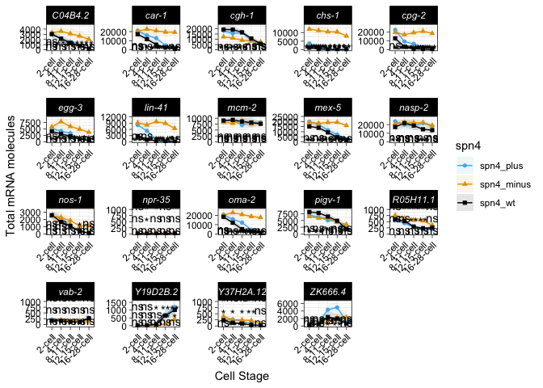
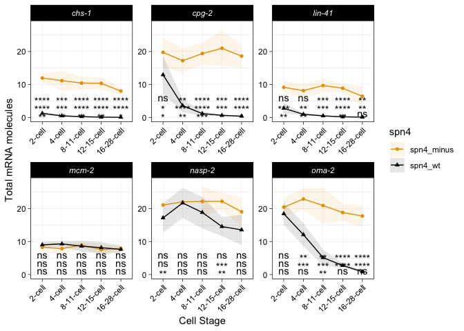
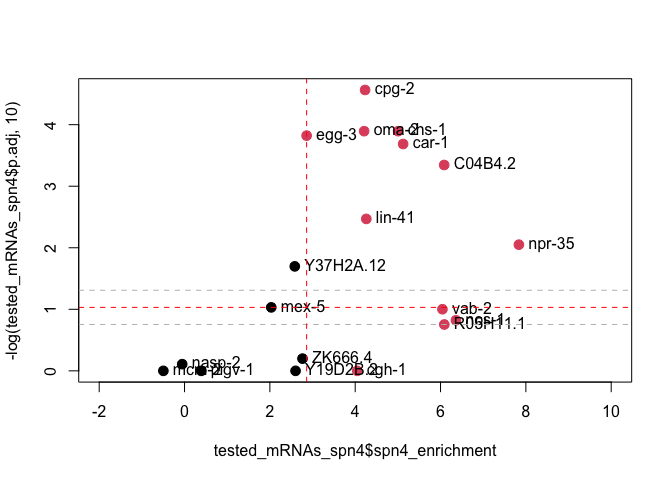
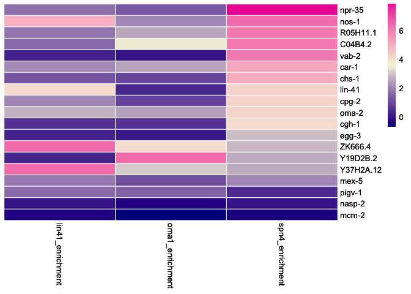
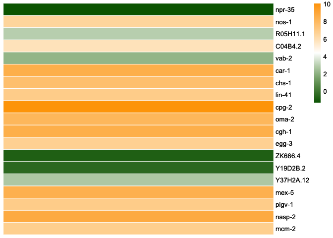
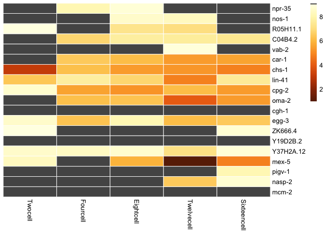

Analyze and plot total RNA counts in spn-4 wild-type v. spn-4 null
strains
================

- [Load Required packages](#load-required-packages)
- [Import the RNA molecule counts from smFISH/smiFISH
  images](#import-the-rna-molecule-counts-from-smfishsmifish-images)
- [Data munging](#data-munging)
- [Calculate Adjusted P-values using T Tests &
  P-Adjust](#calculate-adjusted-p-values-using-t-tests--p-adjust)
  - [Figure S5: Plot all lineplots - all three genotypes +
    p-values](#figure-s5-plot-all-lineplots---all-three-genotypes--p-values)
  - [Figure 3D: Lineplots of select transcripts with just two
    genotypes](#figure-3d-lineplots-of-select-transcripts-with-just-two-genotypes)
- [Figure 3E: Zoom in on 4-cell
  stage](#figure-3e-zoom-in-on-4-cell-stage)
- [Figure 3F: Calculate and plot the 4-cell difference
  values](#figure-3f-calculate-and-plot-the-4-cell-difference-values)
- [Print and Save Figure 3E](#print-and-save-figure-3e)
- [Print and Save Figure 3F](#print-and-save-figure-3f)
- [Figure 4F continued: Create heatmap of smFISH one-tailed test-test
  BH-adjusted
  pvalues](#figure-4f-continued-create-heatmap-of-smfish-one-tailed-test-test-bh-adjusted-pvalues)
- [Export supplemental data table](#export-supplemental-data-table)
- [Capture session and version info](#capture-session-and-version-info)

# Load Required packages

- tidyverse
- dplyr
- ggplot2
- ggthemes
- ggpubr
- rstatix
- pheatmap

<!-- -->

    ## [1] script initiated on

    ## [1] "2026-02-02 16:03:46 MST"

# Import the RNA molecule counts from smFISH/smiFISH images

Import the data. The file is
‘all_spn4_smiFISH_quantification_250902.csv’ and it is included as a
Supplemental Data table.

These quantifications generated from smFISH and smiFISH microscopy
images performed on strain DG5256, a spn-4 balancer strain and on N2,
the standard strain. In this DG5256, embryos that were produced by
spn-4::gfp mothers fluoresce green and are labeled here as spn4_plus. In
DG5256, embryos that were produced from spn-4 null mothers do not
fluoresce green and are labeled here as spn4_minus. Embryos from the
strain N2 are labeled spn4_wt.

``` r
# import the data files
# Note, working directory should be "~/github/SPN4_maternal_mRNA/08_spn4_null/02_scripts"
all_spn4_dataset <- read.table(file = "../01_input/all_spn4_smiFISH_quantification_250902.csv", header = TRUE, sep = ",")

#Set the cell stage and genotypes as ordered factors
all_spn4_dataset$cell_stage <- factor(all_spn4_dataset$cell_stage, levels = c("2-cell", "4-cell", "8-11-cell", "12-15-cell", "16-28-cell"))
all_spn4_dataset$spn4 <- factor(all_spn4_dataset$spn4, levels = c("spn4_plus", "spn4_minus", "spn4_wt"))

#EDA on the spn4 dataset:
dim(all_spn4_dataset)
```

    ## [1] 2301   16

``` r
head(all_spn4_dataset)
```

    ##   row    file   date  imageNo           image multipleEmbNotes        strain
    ## 1   1 C04.csv 211102 Image_08 211102_Image_08             <NA> DG5256_wDMP91
    ## 2   2 C04.csv 211102 Image_11 211102_Image_11             <NA> DG5256_wDMP91
    ## 3   3 C04.csv 211102 Image_18 211102_Image_18             <NA> DG5256_wDMP91
    ## 4   4 C04.csv 211102 Image_19 211102_Image_19             <NA> DG5256_wDMP91
    ## 5   5 C04.csv 211105 Image_11 211105_Image_11             <NA> DG5256_wDMP91
    ## 6   6 C04.csv 211105 Image_12 211105_Image_12             <NA> DG5256_wDMP91
    ##        spn4    condition transcript cell_stage total_no_RNA No_RNA_clusters
    ## 1 spn4_plus Balancer_GFP    C04B4.2     2-cell         2868              17
    ## 2 spn4_plus Balancer_GFP    C04B4.2     2-cell         3471              21
    ## 3 spn4_plus Balancer_GFP    C04B4.2     2-cell         2733              20
    ## 4 spn4_plus Balancer_GFP    C04B4.2     2-cell         2498              18
    ## 5 spn4_plus Balancer_GFP    C04B4.2     2-cell         2371               8
    ## 6 spn4_plus Balancer_GFP    C04B4.2     2-cell         3330              12
    ##   No_RNA_in_clusters fraction_RNA_in_clusters avg_no_RNA_per_cluster
    ## 1                103               0.03591353               6.058824
    ## 2                127               0.03658888               6.047619
    ## 3                112               0.04098061               5.600000
    ## 4                127               0.05084067               7.055556
    ## 5                 45               0.01897933               5.625000
    ## 6                 69               0.02072072               5.750000

# Data munging

Group the data by transcript and cell type and calculate the total
number of RNA molecules (and standard deviation) for each of those
condition combinations.

``` r
# Make quant table: 1) group by genotype & cell stage and 2) calculate mean & sd, optional 
allmRNAs_quantTable <- all_spn4_dataset %>%
  dplyr::group_by(transcript, spn4, cell_stage) %>%
  dplyr::summarise(mean = mean(total_no_RNA), sd = sd(total_no_RNA))

#head(allmRNAs_quantTable)
#str(allmRNAs_quantTable)
```

# Calculate Adjusted P-values using T Tests & P-Adjust

T-tests were used to determine significant differences. I am primarily
interested in contrasting the SPN-4 minus condition versus the SPN-4
wild type to determine how SPN-4 influences mRNA abundance. In addition,
I want to focus in on how SPN-4 plus contrasts from wild-type conditions
to determine how the SPN-4::GFP fusion construct acts as a hypomorph
compared to the wild type SPN-4.

T-tests were performed with setting var.equal = FALSE (default) such
that Welch approximation will be used to take into account variances of
unequal values. Please note that for this analysis, we used the default
of a two-tailed t-test. Later in the script, we switch to using a
one-tailed t-test.

I tested both Bonferonni correction and Benjamini-Hochberg multiple test
corrections. The Bonferroni correction was too severe, but B&H worked
well. I will go with the B&H version here.

``` r
# Use the following dataframe:
# all_spn4_dataset

# Calculate t-test significance. Note - in this instance we are doing a two-tailed t-test.
# Adjust p-values by BH correction
stat.test_BH <- all_spn4_dataset %>%
  group_by(transcript, cell_stage) %>%
  t_test(total_no_RNA ~ spn4) %>%
  adjust_pvalue(method = "BH") %>%
  add_significance("p.adj") %>%
  add_xy_position(x = "cell_stage" , fun = "max", dodge = 0.8 , scales = "free")

# Set some y-values that will be used to plot the adjusted p-values on the plot. In each case, 
# spn-4 minus v. spn-4 plus will be on TOP, spn-4 minus versus N2 will be in the MIDDLE and
# spn4-plus v. N2 will be on the BOTTOM.
stat.test_BH_plus_1000 <- stat.test_BH%>%
  mutate(compare = case_when(group1=="spn4_plus" & group2=="spn4_minus" ~  1000,
                           group1=="spn4_minus" & group2=="spn4_wt" ~ 500,
                           group1=="spn4_plus" & group2=="spn4_wt" ~ 0))

stat.test_BH_plus_10000 <- stat.test_BH %>%
  mutate(compare = case_when(group1=="spn4_plus" & group2=="spn4_minus" ~  10000,
                           group1=="spn4_minus" & group2=="spn4_wt" ~ 5000,
                           group1=="spn4_plus" & group2=="spn4_wt" ~ 0))

head(stat.test_BH_plus_1000)
```

    ## # A tibble: 6 × 18
    ##   transcript cell_stage .y.    group1 group2    n1    n2 statistic    df       p
    ##   <chr>      <fct>      <chr>  <chr>  <chr>  <int> <int>     <dbl> <dbl>   <dbl>
    ## 1 C04B4.2    2-cell     total… spn4_… spn4_…     8     8   -0.578   8.96 5.78e-1
    ## 2 C04B4.2    2-cell     total… spn4_… spn4_…     8     8   -0.170  12.4  8.68e-1
    ## 3 C04B4.2    2-cell     total… spn4_… spn4_…     8     8    0.442  10.9  6.67e-1
    ## 4 C04B4.2    4-cell     total… spn4_… spn4_…     7     9   -4.64   12.3  5.32e-4
    ## 5 C04B4.2    4-cell     total… spn4_… spn4_…     7     9    0.0607 12.7  9.53e-1
    ## 6 C04B4.2    4-cell     total… spn4_… spn4_…     9     9    5.18   15.9  9.21e-5
    ## # ℹ 8 more variables: p.adj <dbl>, p.adj.signif <chr>, y.position <dbl>,
    ## #   groups <named list>, x <dbl>, xmin <dbl>, xmax <dbl>, compare <dbl>

## Figure S5: Plot all lineplots - all three genotypes + p-values

Print the lineplots of all the the smFISH/smiFISH data. BH-adjusted,
Welch approximated t-test adj-p-values will also be printed on top of
the lineplots. Because it was difficult to color these stats, I will
print different versions.

These will be used in Supplemental Figure 5

In each case…

- spn-4 minus v. spn-4 plus will be on TOP,
- spn-4 minus versus N2 will be in the MIDDLE and
- spn4-plus v. N2 will be on the BOTTOM.

<!-- -->

    ## quartz_off_screen 
    ##                 2

    ## quartz_off_screen 
    ##                 2

    ## quartz_off_screen 
    ##                 2

## Figure 3D: Lineplots of select transcripts with just two genotypes

This plot will be for Figure 3. It will just focus on few of the
transcripts and will restrict the lineplots to spn-4 minus and spn-4
wild type.

``` r
# Subset the transcripts - lin-41, chs-1, cpg-2, oma-2, mcm-2, and nasp-2
allmRNAs_quantTable_fig3 <- allmRNAs_quantTable %>%
  filter(transcript == "lin-41" | transcript == "chs-1" | transcript == "cpg-2" |  transcript == "oma-2" | transcript == "mcm-2" | transcript == "nasp-2" ) %>%
  filter(spn4 == "spn4_minus" | spn4 == "spn4_wt" )

# Set the order for the transcripts
unique(allmRNAs_quantTable_fig3$transcript)
```

    ## [1] "chs-1"  "cpg-2"  "lin-41" "mcm-2"  "nasp-2" "oma-2"

``` r
allmRNAs_quantTable_fig3$transcript <- factor(allmRNAs_quantTable_fig3$transcript, levels = c("lin-41", "chs-1", "cpg-2", "oma-2", "mcm-2", "nasp-2"))

# Filter the statistics
stat_test_BH_fig3 <- stat.test_BH %>%
  filter(transcript == "lin-41" | transcript == "chs-1" | transcript == "cpg-2" |  transcript == "oma-2" | transcript == "mcm-2" | transcript == "nasp-2" )

# Add where the p-adj statistics will be placed on the plot 
stat.test_BH_plus_5 <- stat_test_BH_fig3 %>%
  mutate(compare = case_when(group1=="spn4_plus" & group2=="spn4_minus" ~  5,
                           group1=="spn4_minus" & group2=="spn4_wt" ~ 2.5,
                           group1=="spn4_plus" & group2=="spn4_wt" ~ 0.1))

ploty <- ggplot(allmRNAs_quantTable_fig3, aes(x=cell_stage, y=mean/1000, group=spn4, color=spn4, shape = spn4)) + 
  geom_ribbon(aes(ymin=(mean-sd)/1000, ymax=(mean+sd)/1000, fill = spn4), alpha=0.1, linetype = 0) +
  facet_wrap(.~transcript,scales='free') +
  labs(x = "Cell Stage", y = "Total mRNA molecules") +
  geom_line() + geom_point() +
  theme_linedraw() +
  ylim(0, 28) +
  scale_fill_manual(values = c("spn4_minus" = "#E69F00", 
                               "spn4_wt" = "#000000"))+
    scale_color_manual(values = c("spn4_minus" = "#E69F00", 
                               "spn4_wt" = "#000000"))+
  stat_pvalue_manual(stat.test_BH_plus_5, x = "cell_stage", y.position = "compare", hide.ns = FALSE, label = "p.adj.signif", remove.bracket = TRUE) +
  theme(strip.text = element_text(face = "italic"), 
        panel.grid.major = element_line(colour = "grey"), 
        axis.text.x = element_text(angle=45, hjust = 1))

ploty
```

<!-- -->

``` r
# Plot for Figure 3  - 
# BH and Stats
today <- format(Sys.Date(), "%y%m%d")
filename2 <- paste("../03_plots/", today, "_smiFISH_lineplots_2-strains_BH_stats.pdf", sep = "")
pdf(filename2, width = 6, height = 6)

ploty

dev.off()
```

    ## quartz_off_screen 
    ##                 2

# Figure 3E: Zoom in on 4-cell stage

How well do SPN-4 IP enrichment values predict or correlate to smFISH
differences between SPN-4 (wt) and SPN-4::GFP (-) differences

We tested 12 SPN-4 associated RNAs and 7 control RNAs for how their
transcript abundance changed when spn-4 was depleted SPN-4::GFP (-)
conditions versus N2.

As a metric of SPN-4 association we have both categories and enrichment
score.

As a metric of transcript abundance changes, we will use an adjusted
p-value metric. This p-value metric is calculated with the following:

- compare SPN-4::GFP (-) v. SPN-4 wt
- one tailed t-test
- BH adjust
- -log10 transform

I tested what would be the best metric of spn-4’s impact on mRNA
abundance. I tested

- log2 fold change differences at the 4-cell stage between SPN-4 minus /
  SPN-4 wt
- log2 fold change differences at teh 8 to 11-cell stages between SPN-4
  minus / SPN-4 wt
- Area Under the Curve of the difference curves between SPN-4 minus v.
  SPN-4 wt

They all looked very similar. We settled on the 4-cell stage as this was
the most relevant to our early stage interest.

``` r
# Perform a one-tailed t-test that will be specific for testing the hypothesis that loss of spn-4 leads to over-abundance of a given mRNA transcript
stat.test_BH_onetailed <- all_spn4_dataset %>%
  group_by(transcript, cell_stage) %>%
  t_test(total_no_RNA ~ spn4, alternative = "greater") %>%
  adjust_pvalue(method = "BH") %>%
  add_significance("p.adj") %>%
  add_xy_position(x = "cell_stage" , fun = "max", dodge = 0.8 , scales = "free")


# For Figure 3F: Filter on the 4-cell stage and the desired group comparison
filtered_4cell_onetailed_spn4minvwt <- stat.test_BH_onetailed %>% 
  filter(cell_stage == "4-cell") %>%
  filter(group1 == "spn4_minus" & group2 == "spn4_wt")
```

# Figure 3F: Calculate and plot the 4-cell difference values

Focus on the 12 SPN-4 associated mRNAs and 5 control mRNAs. For these
mRNAs, compare the following

- IP results
  - SPN-4 IP metrics
  - OMA-1 IP metrics
  - LIN-41 IP metrics
  - Expression level (in the IP dataset)
- smFISH data
  - Adjusted p-values (one-tailed t-test) between SPN-4::GFP (-) v.
    SPN-4 wt (N2)
  - Compare these for all the cell stages

This will serve to illustrate how the whole dataset behaves and see the
trends across all the data.

``` r
# Calculate the log2 fold change difference between spn-4 minus and spn-4 wild type at the 4-cell stage
Fourcell_foldChange <- allmRNAs_quantTable %>%
  filter(cell_stage == "4-cell") %>%
  select(transcript, cell_stage, spn4, mean) %>%
  group_by(transcript) %>%
  pivot_wider(names_from = spn4, values_from = mean)%>%
  mutate(spn4_difference_4cell = log(spn4_minus/spn4_wt, base = 2)) %>%
  arrange(desc(spn4_difference_4cell))

# Get data from 250226 Plotting Tatsuya Data
filtered_SPN4 <- read.table(file = "../01_input/20250829_smFISH_assayed_transcripts.txt", header = TRUE)
colnames(filtered_SPN4)[2] <- "transcript"

# Merge assayed Genes data frame (RIP-seq) and fold change data frame (smFISH)
joined_filtered <- left_join(Fourcell_foldChange, filtered_SPN4)

# Order by descending 
joined_filtered <- joined_filtered %>%
  arrange(desc(SPN4), desc(spn4_enrichment))

# Save transcript as a rowname
joined_filtered <- as.data.frame(joined_filtered)
rownames(joined_filtered) <- joined_filtered$transcript
#head(joined_filtered)

## Subset for the RBP states
#joined_filtered[,11:13]
#joined_filtered[,20]
joined_filtered_rpm <- joined_filtered[,c(11:13,20)]
#joined_filtered_rpm

# Create an expression mean data frame (for annotations)
joined_filtered_df_mean <- as.data.frame(joined_filtered[,20])
rownames(joined_filtered_df_mean) <- joined_filtered$transcript
colnames(joined_filtered_df_mean) <- "MeanExpressionLevel"

# Merge one-tailed statistics with spn-4 datasets
tested_mRNAs_spn4 <- left_join(joined_filtered, filtered_4cell_onetailed_spn4minvwt)
#tested_mRNAs_spn4
```

# Print and Save Figure 3E

``` r
# Color red or black to indicate if IP predicts "SPN-4 Association (red0 or no SPN-4 associaiton (black)"
color_factor <- factor(tested_mRNAs_spn4$SPN4, levels = c(FALSE, TRUE), labels = c("#df4298", "#2d2d84"))

# Plot padj over spn4 enrichment 
plot(tested_mRNAs_spn4$spn4_enrichment, -log(tested_mRNAs_spn4$p.adj, 10), xlim = c(-2, 10), col = color_factor, pch = 20, cex = 2)
text(tested_mRNAs_spn4$spn4_enrichment, -log(tested_mRNAs_spn4$p.adj, 10), tested_mRNAs_spn4$transcript, pos = 4)
abline(h = -log(9.306122e-02, 10), col = "red", lty = "dashed")
abline(h = -log(1.765487e-01, 10), col = "grey", lty = "dashed")
abline(h = -log(0.04905384, 10), col = "grey", lty = "dashed")
abline(v = 2.86164986, col = "red", lty = "dashed")
```

<!-- -->

``` r
# Save the plot
today <- format(Sys.Date(),"%Y%m%d")
file6 <- paste("../03_plots/", today, "_smFISH_over_IP.pdf", sep = "")

pdf(file6, height = 6, width = 6)

plot(tested_mRNAs_spn4$spn4_enrichment, -log(tested_mRNAs_spn4$p.adj, 10), xlim = c(-2, 10), col = color_factor, pch = 20, cex = 2)
text(tested_mRNAs_spn4$spn4_enrichment, -log(tested_mRNAs_spn4$p.adj, 10), tested_mRNAs_spn4$transcript, pos = 4)
abline(h = -log(9.306122e-02, 10), col = "red", lty = "dashed")
abline(h = -log(1.765487e-01, 10), col = "grey", lty = "dashed")
abline(h = -log(0.04905384, 10), col = "grey", lty = "dashed")
abline(v = 2.86164986, col = "red", lty = "dashed")

dev.off()
```

    ## quartz_off_screen 
    ##                 2

# Print and Save Figure 3F

``` r
# Plot a heatmap of the IP-seq enrichment values for all three RBPs

#joined_filtered_rpm[,c(3,2,1)]

v <- pheatmap(joined_filtered_rpm[,c(3,2,1)], 
              scale="none", 
              color = colorRampPalette(c("blue4", "beige", "maroon2"), space = "Lab")(1000),
              cluster_rows=FALSE, 
              cluster_cols=FALSE, 
              border_color = "white", 
              show_rownames = TRUE
)

v
```

<!-- -->

``` r
# Save plots
# Save the heatmap plot illustrating SPN-4 enrichment:
today <- format(Sys.Date(),"%Y%m%d")
file6 <- paste("../03_plots/", today, "_heatmap_smFISH_selecteGenes_orderedBySPN4.pdf", sep = "")

pdf(file6, height = 9, width = 6)
v
dev.off()
```

    ## quartz_off_screen 
    ##                 2

``` r
# Heatmap plot of expression level
#joined_filtered
#str(joined_filtered)
meanexp_mat <- as.matrix(joined_filtered[,20])
rownames(meanexp_mat) <- rownames(joined_filtered)

w <- pheatmap(meanexp_mat, 
              scale="none", 
              color = colorRampPalette(c("darkgreen", "white", "orange"), space = "Lab")(100),
              cluster_rows=FALSE, 
              cluster_cols=FALSE, 
              border_color = "white",
              show_rownames = TRUE)

w
```

<!-- -->

``` r
# Save the plot 
today <- format(Sys.Date(),"%Y%m%d")
file7 <- paste("../03_plots/", today, "_heatmap_expression_ordered_bySPN4_cat.pdf", sep = "")

pdf(file7, height = 9, width = 6)
w
dev.off()
```

    ## quartz_off_screen 
    ##                 2

# Figure 4F continued: Create heatmap of smFISH one-tailed test-test BH-adjusted pvalues

``` r
# Perofrm a one-tailed t-test for all datasets
stat.test_BH_onetailed <- all_spn4_dataset %>%
  group_by(transcript, cell_stage) %>%
  t_test(total_no_RNA ~ spn4, alternative = "greater") %>%
  adjust_pvalue(method = "BH") %>%
  add_significance("p.adj") %>%
  add_xy_position(x = "cell_stage" , fun = "max", dodge = 0.8 , scales = "free")


# Filter on the desired group comparison
filtered_oneTailed_spn4minvwt <- stat.test_BH_onetailed %>% 
  filter(group1 == "spn4_minus" & group2 == "spn4_wt")

# Munge the data - widen out into a matrix of pvalues
one_tailed_tTest_neglog10_df <-filtered_oneTailed_spn4minvwt %>%
  select(transcript, cell_stage, p.adj) %>%
  pivot_wider(values_from = p.adj, names_from = cell_stage) %>%
  mutate(Twocell = -log(`2-cell`, 10)) %>%
  mutate(Fourcell = -log(`4-cell`, 10)) %>% 
  mutate(Eightcell = -log(`8-11-cell`, 10)) %>% 
  mutate(Twelvecell = -log(`12-15-cell`, 10)) %>% 
  mutate(Sixteencell = -log(`16-28-cell`, 10)) %>%
  arrange(match(transcript, rownames(joined_filtered)))

# add annotations
one_tailed_tTest_neglog10_mat <- as.matrix(one_tailed_tTest_neglog10_df[,7:11])
rownames(one_tailed_tTest_neglog10_mat) <- one_tailed_tTest_neglog10_df$transcript
one_tailed_tTest_neglog10_mat
```

    ##               Twocell  Fourcell Eightcell Twelvecell Sixteencell
    ## npr-35    0.916008058 2.0503051 1.2591889 0.06211352   1.0503051
    ## nos-1     0.003493165 0.8218258 1.5228787 1.78194424   0.7403814
    ## R05H11.1  1.128731726 0.7531355 2.8291518 3.06016685   0.7901899
    ## C04B4.2   0.203252261 3.3447953 2.4254679 2.48692723   2.7230597
    ## vab-2     0.126914869 1.0010871 0.7382797 1.23927264   0.0000000
    ## car-1     0.790189948 3.6859706 3.9522385 4.67985371   4.5641784
    ## chs-1     7.022710906 3.8943621 4.6798537 4.83019703   5.2819137
    ## lin-41    3.742530120 2.4688217 3.3447953 5.28191371   2.5958903
    ## cpg-2     1.453640159 4.5641784 4.8678089 3.96002631   4.6798537
    ## oma-2     0.621033750 3.8943621 3.8047925 6.12136333   4.6798537
    ## cgh-1     0.000000000 0.0000000 0.0000000 0.00000000   0.8952345
    ## egg-3     1.569288820 3.8220515 2.0503051 3.96002631   3.6859706
    ## ZK666.4   1.082274324 0.1983677 0.0000000 0.15785602   1.3554911
    ## Y19D2B.2  0.657336646 0.0000000 0.0000000 0.00000000   0.0000000
    ## Y37H2A.12 1.522878745 1.6974435 1.4830072 3.03746789   1.2805544
    ## mex-5     1.781944239 1.0312312 4.1923297 9.07977229   5.2819137
    ## pigv-1    0.000000000 0.0000000 0.0000000 0.00000000   2.0503051
    ## nasp-2    1.009311418 0.1087210 0.7036612 3.68597064   1.3554911
    ## mcm-2     0.000000000 0.0000000 0.2326957 0.00000000   0.2589489

``` r
# Define a color gradient. Dark grey for insignificant padj values. scaled gradient for other values
YlOrBr <- color("YlOrBr")
col_palette <- YlOrBr(99)
col_palette <- c("#555555", col_palette )


# Any BH- adjusted one-tail p-values that are na, set to grey.  scale the rest
threshold = 1
mybreaks <- seq(max(one_tailed_tTest_neglog10_mat), threshold, length.out = 100)

# plot a heatmap of the pvalues
y <- pheatmap(one_tailed_tTest_neglog10_mat, 
              scale="none", 
              color = col_palette,
              cluster_rows=FALSE, 
              cluster_cols=FALSE, 
              border_color = "white", 
              breaks = mybreaks,
              show_rownames = TRUE
)
```

<!-- -->

``` r
# Save the heatmap

today <- format(Sys.Date(),"%Y%m%d")
file7 <- paste("../03_plots/", today, "_oneTailedTTest_smFISH.pdf", sep = "")

pdf(file7, height = 9, width = 6)
y
dev.off()
```

    ## quartz_off_screen 
    ##                 2

# Export supplemental data table

``` r
file10 <- paste("../04_supplemental_data/", today, "_adj_pvalues_w_and_wo_spn4.txt", sep = "")
write.table(as.data.frame(stat.test_BH_plus_1000[ ,c(1:12)]), file = file10, sep = "\t", row.names = FALSE, quote = FALSE)

file11 <- paste("../04_supplemental_data/", today, "_means_and_sd_totalRNAs_w_and_wo_spn4.txt", sep = "")
write.table(allmRNAs_quantTable, file = file11, sep = "\t", row.names = FALSE, quote = FALSE)
```

# Capture session and version info

``` r
sessionInfo()
```

    ## R version 4.3.1 (2023-06-16)
    ## Platform: x86_64-apple-darwin20 (64-bit)
    ## Running under: macOS 26.2
    ## 
    ## Matrix products: default
    ## BLAS:   /Library/Frameworks/R.framework/Versions/4.3-x86_64/Resources/lib/libRblas.0.dylib 
    ## LAPACK: /Library/Frameworks/R.framework/Versions/4.3-x86_64/Resources/lib/libRlapack.dylib;  LAPACK version 3.11.0
    ## 
    ## locale:
    ## [1] en_US.UTF-8/en_US.UTF-8/en_US.UTF-8/C/en_US.UTF-8/en_US.UTF-8
    ## 
    ## time zone: America/Denver
    ## tzcode source: internal
    ## 
    ## attached base packages:
    ## [1] stats     graphics  grDevices utils     datasets  methods   base     
    ## 
    ## other attached packages:
    ##  [1] khroma_1.16.0   pheatmap_1.0.13 rstatix_0.7.2   ggpubr_0.6.1   
    ##  [5] ggthemes_5.1.0  lubridate_1.9.4 forcats_1.0.0   stringr_1.5.1  
    ##  [9] dplyr_1.1.4     purrr_1.1.0     readr_2.1.5     tidyr_1.3.1    
    ## [13] tibble_3.3.0    ggplot2_3.5.2   tidyverse_2.0.0
    ## 
    ## loaded via a namespace (and not attached):
    ##  [1] utf8_1.2.6         generics_0.1.4     stringi_1.8.7      hms_1.1.3         
    ##  [5] digest_0.6.37      magrittr_2.0.3     evaluate_1.0.4     grid_4.3.1        
    ##  [9] timechange_0.3.0   RColorBrewer_1.1-3 fastmap_1.2.0      backports_1.5.0   
    ## [13] Formula_1.2-5      scales_1.4.0       abind_1.4-8        cli_3.6.5         
    ## [17] rlang_1.1.6        withr_3.0.2        yaml_2.3.10        tools_4.3.1       
    ## [21] tzdb_0.5.0         ggsignif_0.6.4     broom_1.0.9        vctrs_0.6.5       
    ## [25] R6_2.6.1           lifecycle_1.0.4    car_3.1-3          pkgconfig_2.0.3   
    ## [29] pillar_1.11.0      gtable_0.3.6       glue_1.8.0         xfun_0.52         
    ## [33] tidyselect_1.2.1   rstudioapi_0.17.1  knitr_1.50         farver_2.1.2      
    ## [37] htmltools_0.5.8.1  labeling_0.4.3     rmarkdown_2.29     carData_3.0-5     
    ## [41] compiler_4.3.1

``` r
file12 <- paste("../04_supplemental_data/", today, "_sessionInfo.txt", sep = "")
writeLines(capture.output(sessionInfo()), file12)
```
