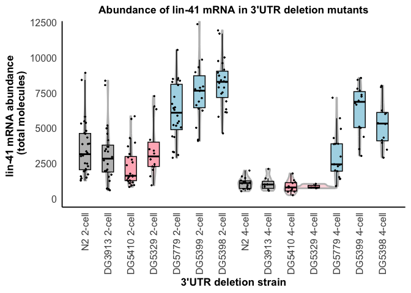

Fig4_lin-41_abundance_3UTR_bashing
================
Naly Torres
2025-08-04

- [1. Read input counts data](#1-read-input-counts-data)
- [2. Plot total mRNA abundance per
  strain](#2-plot-total-mrna-abundance-per-strain)
- [3. Plot mean abundace of groups across cell
  stages](#3-plot-mean-abundace-of-groups-across-cell-stages)
  - [4. Statistical analysis](#4-statistical-analysis)
- [4A. Normally distributed data](#4a-normally-distributed-data)
- [4B. Non-normally distributed data](#4b-non-normally-distributed-data)

``` r
library(knitr)
library(ggplot2)
library(dplyr)
library(rstatix)
```

### 1. Read input counts data

``` r
# Define relative input folder path
input_path <- "../01_input/Fig4_lin-41-3UTR-bashing.csv"

# Read the CSV file
df <- read.csv(input_path, stringsAsFactors = FALSE)

# Check data
#head(df)
#str(df)
knitr::kable(df)
```

| Image.ID | set.3.mRNA.molecules | lin.41.mRNA.molecules | Image_ID                                                    | subdirectory  | Cell_Stage | Strain |
|---------:|---------------------:|----------------------:|:------------------------------------------------------------|:--------------|:-----------|:-------|
|        6 |                  913 |                  8062 | quantification_230514_DG3913_lin-41_spn-4_rep2_2-cell.csv   | 2-cell_DG3913 | 2-cell     | DG3913 |
|        8 |                 1067 |                  8374 | quantification_230514_DG3913_lin-41_spn-4_rep2_2-cell.csv   | 2-cell_DG3913 | 2-cell     | DG3913 |
|       11 |                  875 |                  5200 | quantification_230514_DG3913_lin-41_spn-4_rep2_2-cell.csv   | 2-cell_DG3913 | 2-cell     | DG3913 |
|        2 |                  859 |                  1558 | quantification_230606_DG3913_lin-41_set-3_rep4_2-cell.csv   | 2-cell_DG3913 | 2-cell     | DG3913 |
|        3 |                 1502 |                  3688 | quantification_230606_DG3913_lin-41_set-3_rep4_2-cell.csv   | 2-cell_DG3913 | 2-cell     | DG3913 |
|        5 |                 1142 |                  3383 | quantification_230606_DG3913_lin-41_set-3_rep4_2-cell.csv   | 2-cell_DG3913 | 2-cell     | DG3913 |
|        6 |                  559 |                   674 | quantification_230606_DG3913_lin-41_set-3_rep4_2-cell.csv   | 2-cell_DG3913 | 2-cell     | DG3913 |
|        9 |                  805 |                   597 | quantification_230606_DG3913_lin-41_set-3_rep4_2-cell.csv   | 2-cell_DG3913 | 2-cell     | DG3913 |
|       10 |                 1449 |                  1706 | quantification_230606_DG3913_lin-41_set-3_rep4_2-cell.csv   | 2-cell_DG3913 | 2-cell     | DG3913 |
|       12 |                 1212 |                   716 | quantification_230606_DG3913_lin-41_set-3_rep4_2-cell.csv   | 2-cell_DG3913 | 2-cell     | DG3913 |
|        2 |                 1224 |                  1960 | quantification_230726_DG3913_lin-41_set-3_rep5-2-cell.csv   | 2-cell_DG3913 | 2-cell     | DG3913 |
|        3 |                 1249 |                  1262 | quantification_230726_DG3913_lin-41_set-3_rep5-2-cell.csv   | 2-cell_DG3913 | 2-cell     | DG3913 |
|        4 |                  428 |                  2071 | quantification_230726_DG3913_lin-41_set-3_rep5-2-cell.csv   | 2-cell_DG3913 | 2-cell     | DG3913 |
|        5 |                 1233 |                  3519 | quantification_230726_DG3913_lin-41_set-3_rep5-2-cell.csv   | 2-cell_DG3913 | 2-cell     | DG3913 |
|        8 |                 1148 |                  2015 | quantification_230726_DG3913_lin-41_set-3_rep5-2-cell.csv   | 2-cell_DG3913 | 2-cell     | DG3913 |
|        9 |                 1728 |                  3344 | quantification_230726_DG3913_lin-41_set-3_rep5-2-cell.csv   | 2-cell_DG3913 | 2-cell     | DG3913 |
|       10 |                 1946 |                  3684 | quantification_230726_DG3913_lin-41_set-3_rep5-2-cell.csv   | 2-cell_DG3913 | 2-cell     | DG3913 |
|       11 |                 1827 |                  4996 | quantification_230726_DG3913_lin-41_set-3_rep5-2-cell.csv   | 2-cell_DG3913 | 2-cell     | DG3913 |
|       12 |                 1997 |                  1954 | quantification_230726_DG3913_lin-41_set-3_rep5-2-cell.csv   | 2-cell_DG3913 | 2-cell     | DG3913 |
|       13 |                 2374 |                  2720 | quantification_230726_DG3913_lin-41_set-3_rep5-2-cell.csv   | 2-cell_DG3913 | 2-cell     | DG3913 |
|       14 |                 1981 |                  2962 | quantification_230726_DG3913_lin-41_set-3_rep5-2-cell.csv   | 2-cell_DG3913 | 2-cell     | DG3913 |
|       15 |                 1983 |                  4151 | quantification_230726_DG3913_lin-41_set-3_rep5-2-cell.csv   | 2-cell_DG3913 | 2-cell     | DG3913 |
|       17 |                  866 |                  2459 | quantification_230726_DG3913_lin-41_set-3_rep5-2-cell.csv   | 2-cell_DG3913 | 2-cell     | DG3913 |
|       18 |                 2105 |                  4607 | quantification_230726_DG3913_lin-41_set-3_rep5-2-cell.csv   | 2-cell_DG3913 | 2-cell     | DG3913 |
|        1 |                 1414 |                  6351 | quantification_230517_DG5329_lin-41_set-3_rep1_2-cell.csv   | 2-cell_DG5329 | 2-cell     | DG5329 |
|        2 |                  531 |                  7281 | quantification_230517_DG5329_lin-41_set-3_rep1_2-cell.csv   | 2-cell_DG5329 | 2-cell     | DG5329 |
|        5 |                 1062 |                   949 | quantification_230517_DG5329_lin-41_set-3_rep1_2-cell.csv   | 2-cell_DG5329 | 2-cell     | DG5329 |
|        7 |                 1926 |                  2792 | quantification_230517_DG5329_lin-41_set-3_rep1_2-cell.csv   | 2-cell_DG5329 | 2-cell     | DG5329 |
|        9 |                 1081 |                  2050 | quantification_230517_DG5329_lin-41_set-3_rep1_2-cell.csv   | 2-cell_DG5329 | 2-cell     | DG5329 |
|       10 |                 1315 |                  3511 | quantification_230517_DG5329_lin-41_set-3_rep1_2-cell.csv   | 2-cell_DG5329 | 2-cell     | DG5329 |
|        1 |                  686 |                  2289 | quantification_230607_DG5329_lin-41_set-3_rep3_2-cell.csv   | 2-cell_DG5329 | 2-cell     | DG5329 |
|        2 |                 1506 |                  2286 | quantification_230607_DG5329_lin-41_set-3_rep3_2-cell.csv   | 2-cell_DG5329 | 2-cell     | DG5329 |
|        3 |                 1497 |                  4180 | quantification_230607_DG5329_lin-41_set-3_rep3_2-cell.csv   | 2-cell_DG5329 | 2-cell     | DG5329 |
|        8 |                 1633 |                  2449 | quantification_230607_DG5329_lin-41_set-3_rep3_2-cell.csv   | 2-cell_DG5329 | 2-cell     | DG5329 |
|       13 |                 1190 |                  3410 | quantification_230607_DG5329_lin-41_set-3_rep3_2-cell.csv   | 2-cell_DG5329 | 2-cell     | DG5329 |
|       15 |                 1464 |                  1590 | quantification_230607_DG5329_lin-41_set-3_rep3_2-cell.csv   | 2-cell_DG5329 | 2-cell     | DG5329 |
|       16 |                 1503 |                  6555 | quantification_230607_DG5329_lin-41_set-3_rep3_2-cell.csv   | 2-cell_DG5329 | 2-cell     | DG5329 |
|       17 |                 1089 |                  3209 | quantification_230607_DG5329_lin-41_set-3_rep3_2-cell.csv   | 2-cell_DG5329 | 2-cell     | DG5329 |
|        2 |                 1050 |                  6346 | quantification_230517_DG5398_lin-41_set-3_rep1_2-cell.csv   | 2-cell_DG5398 | 2-cell     | DG5398 |
|        3 |                  982 |                  5815 | quantification_230517_DG5398_lin-41_set-3_rep1_2-cell.csv   | 2-cell_DG5398 | 2-cell     | DG5398 |
|        5 |                  786 |                  7888 | quantification_230517_DG5398_lin-41_set-3_rep1_2-cell.csv   | 2-cell_DG5398 | 2-cell     | DG5398 |
|        6 |                 1064 |                  8732 | quantification_230517_DG5398_lin-41_set-3_rep1_2-cell.csv   | 2-cell_DG5398 | 2-cell     | DG5398 |
|        8 |                 1437 |                  8214 | quantification_230517_DG5398_lin-41_set-3_rep1_2-cell.csv   | 2-cell_DG5398 | 2-cell     | DG5398 |
|        9 |                 1151 |                  6122 | quantification_230517_DG5398_lin-41_set-3_rep1_2-cell.csv   | 2-cell_DG5398 | 2-cell     | DG5398 |
|       10 |                 1463 |                  9158 | quantification_230517_DG5398_lin-41_set-3_rep1_2-cell.csv   | 2-cell_DG5398 | 2-cell     | DG5398 |
|       11 |                 1367 |                  7543 | quantification_230517_DG5398_lin-41_set-3_rep1_2-cell.csv   | 2-cell_DG5398 | 2-cell     | DG5398 |
|        2 |                 1210 |                  8619 | quantification_230521_DG5398_lin-41_set-3_rep2_2-cell.csv   | 2-cell_DG5398 | 2-cell     | DG5398 |
|        3 |                 1482 |                 10024 | quantification_230521_DG5398_lin-41_set-3_rep2_2-cell.csv   | 2-cell_DG5398 | 2-cell     | DG5398 |
|        6 |                  920 |                  7901 | quantification_230521_DG5398_lin-41_set-3_rep2_2-cell.csv   | 2-cell_DG5398 | 2-cell     | DG5398 |
|        8 |                 1476 |                  9616 | quantification_230521_DG5398_lin-41_set-3_rep2_2-cell.csv   | 2-cell_DG5398 | 2-cell     | DG5398 |
|       10 |                 1599 |                  8332 | quantification_230521_DG5398_lin-41_set-3_rep2_2-cell.csv   | 2-cell_DG5398 | 2-cell     | DG5398 |
|       11 |                 1148 |                  7453 | quantification_230521_DG5398_lin-41_set-3_rep2_2-cell.csv   | 2-cell_DG5398 | 2-cell     | DG5398 |
|       12 |                  972 |                  4636 | quantification_230521_DG5398_lin-41_set-3_rep2_2-cell.csv   | 2-cell_DG5398 | 2-cell     | DG5398 |
|        4 |                 1160 |                  8945 | quantification_230607_DG5398_lin-41_set-3_rep3_2-cell.csv   | 2-cell_DG5398 | 2-cell     | DG5398 |
|        5 |                 1180 |                  6909 | quantification_230607_DG5398_lin-41_set-3_rep3_2-cell.csv   | 2-cell_DG5398 | 2-cell     | DG5398 |
|        8 |                  774 |                  9771 | quantification_230607_DG5398_lin-41_set-3_rep3_2-cell.csv   | 2-cell_DG5398 | 2-cell     | DG5398 |
|        9 |                 1524 |                  6143 | quantification_230607_DG5398_lin-41_set-3_rep3_2-cell.csv   | 2-cell_DG5398 | 2-cell     | DG5398 |
|       10 |                 1238 |                  8292 | quantification_230607_DG5398_lin-41_set-3_rep3_2-cell.csv   | 2-cell_DG5398 | 2-cell     | DG5398 |
|       11 |                 1868 |                 11715 | quantification_230607_DG5398_lin-41_set-3_rep3_2-cell.csv   | 2-cell_DG5398 | 2-cell     | DG5398 |
|       12 |                 1429 |                 11943 | quantification_230607_DG5398_lin-41_set-3_rep3_2-cell.csv   | 2-cell_DG5398 | 2-cell     | DG5398 |
|       14 |                 1718 |                  8411 | quantification_230607_DG5398_lin-41_set-3_rep3_2-cell.csv   | 2-cell_DG5398 | 2-cell     | DG5398 |
|        2 |                 1941 |                 13122 | quantification_230505_DG5399_2-cell.csv                     | 2-cell_DG5399 | 2-cell     | DG5399 |
|        4 |                 4787 |                 12386 | quantification_230505_DG5399_2-cell.csv                     | 2-cell_DG5399 | 2-cell     | DG5399 |
|        8 |                 1580 |                  7964 | quantification_230505_DG5399_2-cell.csv                     | 2-cell_DG5399 | 2-cell     | DG5399 |
|       10 |                 1827 |                  9869 | quantification_230505_DG5399_2-cell.csv                     | 2-cell_DG5399 | 2-cell     | DG5399 |
|       11 |                 1700 |                  9326 | quantification_230505_DG5399_2-cell.csv                     | 2-cell_DG5399 | 2-cell     | DG5399 |
|       12 |                 2168 |                  7873 | quantification_230505_DG5399_2-cell.csv                     | 2-cell_DG5399 | 2-cell     | DG5399 |
|       15 |                 1834 |                  8977 | quantification_230505_DG5399_2-cell.csv                     | 2-cell_DG5399 | 2-cell     | DG5399 |
|       17 |                 1518 |                  6639 | quantification_230505_DG5399_2-cell.csv                     | 2-cell_DG5399 | 2-cell     | DG5399 |
|        3 |                  771 |                  7139 | quantification_230514_DG5399_lin-41_spn-4_rep2_2-cell.csv   | 2-cell_DG5399 | 2-cell     | DG5399 |
|        9 |                  975 |                  6253 | quantification_230514_DG5399_lin-41_spn-4_rep2_2-cell.csv   | 2-cell_DG5399 | 2-cell     | DG5399 |
|       12 |                  704 |                  4187 | quantification_230514_DG5399_lin-41_spn-4_rep2_2-cell.csv   | 2-cell_DG5399 | 2-cell     | DG5399 |
|        1 |                  723 |                  7680 | quantification_230606_DG5399-2-cell.csv                     | 2-cell_DG5399 | 2-cell     | DG5399 |
|        3 |                 1386 |                  6394 | quantification_230606_DG5399-2-cell.csv                     | 2-cell_DG5399 | 2-cell     | DG5399 |
|        7 |                  993 |                  4103 | quantification_230606_DG5399-2-cell.csv                     | 2-cell_DG5399 | 2-cell     | DG5399 |
|        8 |                 1190 |                  6895 | quantification_230606_DG5399-2-cell.csv                     | 2-cell_DG5399 | 2-cell     | DG5399 |
|       10 |                 1428 |                  7770 | quantification_230606_DG5399-2-cell.csv                     | 2-cell_DG5399 | 2-cell     | DG5399 |
|       11 |                  828 |                  5032 | quantification_230606_DG5399-2-cell.csv                     | 2-cell_DG5399 | 2-cell     | DG5399 |
|       12 |                 1140 |                  7647 | quantification_230606_DG5399-2-cell.csv                     | 2-cell_DG5399 | 2-cell     | DG5399 |
|        1 |                 1237 |                  5660 | quantification_230521_DG5410_lin-41_set-3_rep1_2-cell.csv   | 2-cell_DG5410 | 2-cell     | DG5410 |
|        2 |                 1371 |                  1105 | quantification_230521_DG5410_lin-41_set-3_rep1_2-cell.csv   | 2-cell_DG5410 | 2-cell     | DG5410 |
|        3 |                 1005 |                  5852 | quantification_230521_DG5410_lin-41_set-3_rep1_2-cell.csv   | 2-cell_DG5410 | 2-cell     | DG5410 |
|        4 |                 1799 |                  2773 | quantification_230521_DG5410_lin-41_set-3_rep1_2-cell.csv   | 2-cell_DG5410 | 2-cell     | DG5410 |
|        5 |                 1541 |                   937 | quantification_230521_DG5410_lin-41_set-3_rep1_2-cell.csv   | 2-cell_DG5410 | 2-cell     | DG5410 |
|        7 |                 1024 |                   834 | quantification_230521_DG5410_lin-41_set-3_rep1_2-cell.csv   | 2-cell_DG5410 | 2-cell     | DG5410 |
|       10 |                 1176 |                  1567 | quantification_230521_DG5410_lin-41_set-3_rep1_2-cell.csv   | 2-cell_DG5410 | 2-cell     | DG5410 |
|       11 |                 1496 |                  4307 | quantification_230521_DG5410_lin-41_set-3_rep1_2-cell.csv   | 2-cell_DG5410 | 2-cell     | DG5410 |
|        1 |                 1013 |                  1458 | quantification_230601_DG5410_lin-41_set-3_rep2_2-cell.csv   | 2-cell_DG5410 | 2-cell     | DG5410 |
|        3 |                 4664 |                  1317 | quantification_230601_DG5410_lin-41_set-3_rep2_2-cell.csv   | 2-cell_DG5410 | 2-cell     | DG5410 |
|        5 |                 1067 |                  1600 | quantification_230601_DG5410_lin-41_set-3_rep2_2-cell.csv   | 2-cell_DG5410 | 2-cell     | DG5410 |
|        7 |                 1099 |                  1242 | quantification_230601_DG5410_lin-41_set-3_rep2_2-cell.csv   | 2-cell_DG5410 | 2-cell     | DG5410 |
|        8 |                  627 |                   962 | quantification_230601_DG5410_lin-41_set-3_rep2_2-cell.csv   | 2-cell_DG5410 | 2-cell     | DG5410 |
|        9 |                 1205 |                  3170 | quantification_230601_DG5410_lin-41_set-3_rep2_2-cell.csv   | 2-cell_DG5410 | 2-cell     | DG5410 |
|       10 |                 1229 |                  1777 | quantification_230601_DG5410_lin-41_set-3_rep2_2-cell.csv   | 2-cell_DG5410 | 2-cell     | DG5410 |
|       11 |                 1574 |                  3976 | quantification_230601_DG5410_lin-41_set-3_rep2_2-cell.csv   | 2-cell_DG5410 | 2-cell     | DG5410 |
|       12 |                 1192 |                  2378 | quantification_230601_DG5410_lin-41_set-3_rep2_2-cell.csv   | 2-cell_DG5410 | 2-cell     | DG5410 |
|       13 |                 1390 |                  1653 | quantification_230601_DG5410_lin-41_set-3_rep2_2-cell.csv   | 2-cell_DG5410 | 2-cell     | DG5410 |
|        5 |                  523 |                  1578 | quantification_230606_Dg5410_lin-41_set-3_rep3_2-cell.csv   | 2-cell_DG5410 | 2-cell     | DG5410 |
|       10 |                  413 |                  1296 | quantification_230606_Dg5410_lin-41_set-3_rep3_2-cell.csv   | 2-cell_DG5410 | 2-cell     | DG5410 |
|       11 |                 1230 |                  3715 | quantification_230606_Dg5410_lin-41_set-3_rep3_2-cell.csv   | 2-cell_DG5410 | 2-cell     | DG5410 |
|       12 |                 2146 |                  2935 | quantification_230606_Dg5410_lin-41_set-3_rep3_2-cell.csv   | 2-cell_DG5410 | 2-cell     | DG5410 |
|       17 |                  402 |                  2578 | quantification_230606_Dg5410_lin-41_set-3_rep3_2-cell.csv   | 2-cell_DG5410 | 2-cell     | DG5410 |
|       18 |                 1305 |                  1160 | quantification_230606_Dg5410_lin-41_set-3_rep3_2-cell.csv   | 2-cell_DG5410 | 2-cell     | DG5410 |
|        1 |                 2043 |                  2904 | quantification_230926_DG5779_lin-41_set-3_rep1 \_2-cell.csv | 2-cell_DG5779 | 2-cell     | DG5779 |
|        2 |                 3068 |                  3298 | quantification_230926_DG5779_lin-41_set-3_rep1 \_2-cell.csv | 2-cell_DG5779 | 2-cell     | DG5779 |
|        3 |                 1198 |                  8373 | quantification_230926_DG5779_lin-41_set-3_rep1 \_2-cell.csv | 2-cell_DG5779 | 2-cell     | DG5779 |
|        4 |                 1317 |                  5058 | quantification_230926_DG5779_lin-41_set-3_rep1 \_2-cell.csv | 2-cell_DG5779 | 2-cell     | DG5779 |
|        6 |                 1191 |                  4377 | quantification_230926_DG5779_lin-41_set-3_rep1 \_2-cell.csv | 2-cell_DG5779 | 2-cell     | DG5779 |
|        8 |                 1159 |                  7231 | quantification_230926_DG5779_lin-41_set-3_rep1 \_2-cell.csv | 2-cell_DG5779 | 2-cell     | DG5779 |
|       10 |                 1452 |                  5228 | quantification_230926_DG5779_lin-41_set-3_rep1 \_2-cell.csv | 2-cell_DG5779 | 2-cell     | DG5779 |
|       11 |                 1691 |                  6729 | quantification_230926_DG5779_lin-41_set-3_rep1 \_2-cell.csv | 2-cell_DG5779 | 2-cell     | DG5779 |
|       13 |                 1269 |                  5891 | quantification_230926_DG5779_lin-41_set-3_rep1 \_2-cell.csv | 2-cell_DG5779 | 2-cell     | DG5779 |
|       17 |                 1372 |                  6308 | quantification_230926_DG5779_lin-41_set-3_rep1 \_2-cell.csv | 2-cell_DG5779 | 2-cell     | DG5779 |
|       21 |                  862 |                  8442 | quantification_230926_DG5779_lin-41_set-3_rep1 \_2-cell.csv | 2-cell_DG5779 | 2-cell     | DG5779 |
|        1 |                  562 |                  5179 | quantification_231013_DG5779_lin-41_set-3_rep2_2-cell.csv   | 2-cell_DG5779 | 2-cell     | DG5779 |
|        2 |                 1512 |                  8501 | quantification_231013_DG5779_lin-41_set-3_rep2_2-cell.csv   | 2-cell_DG5779 | 2-cell     | DG5779 |
|        3 |                 1151 |                  6484 | quantification_231013_DG5779_lin-41_set-3_rep2_2-cell.csv   | 2-cell_DG5779 | 2-cell     | DG5779 |
|        5 |                 1602 |                  8551 | quantification_231013_DG5779_lin-41_set-3_rep2_2-cell.csv   | 2-cell_DG5779 | 2-cell     | DG5779 |
|        6 |                 1174 |                  8287 | quantification_231013_DG5779_lin-41_set-3_rep2_2-cell.csv   | 2-cell_DG5779 | 2-cell     | DG5779 |
|        7 |                 1308 |                  8062 | quantification_231013_DG5779_lin-41_set-3_rep2_2-cell.csv   | 2-cell_DG5779 | 2-cell     | DG5779 |
|        9 |                 2121 |                 10561 | quantification_231013_DG5779_lin-41_set-3_rep2_2-cell.csv   | 2-cell_DG5779 | 2-cell     | DG5779 |
|       10 |                  821 |                  3104 | quantification_231013_DG5779_lin-41_set-3_rep2_2-cell.csv   | 2-cell_DG5779 | 2-cell     | DG5779 |
|       12 |                  983 |                  4423 | quantification_231013_DG5779_lin-41_set-3_rep2_2-cell.csv   | 2-cell_DG5779 | 2-cell     | DG5779 |
|       14 |                 1389 |                  5361 | quantification_231013_DG5779_lin-41_set-3_rep2_2-cell.csv   | 2-cell_DG5779 | 2-cell     | DG5779 |
|        1 |                 4236 |                  6426 | quantification_231027_DG5779_lin-41_set-3_rep3_2-cell.csv   | 2-cell_DG5779 | 2-cell     | DG5779 |
|        3 |                  783 |                  3327 | quantification_231027_DG5779_lin-41_set-3_rep3_2-cell.csv   | 2-cell_DG5779 | 2-cell     | DG5779 |
|        5 |                 1581 |                  5489 | quantification_231027_DG5779_lin-41_set-3_rep3_2-cell.csv   | 2-cell_DG5779 | 2-cell     | DG5779 |
|        1 |                  655 |                  1497 | quantification_230521_N2_lin-41_set-3_rep1_2-cell.csv       | 2-cell_N2     | 2-cell     | N2     |
|        3 |                 1079 |                  2307 | quantification_230521_N2_lin-41_set-3_rep1_2-cell.csv       | 2-cell_N2     | 2-cell     | N2     |
|        4 |                 1260 |                  3883 | quantification_230521_N2_lin-41_set-3_rep1_2-cell.csv       | 2-cell_N2     | 2-cell     | N2     |
|        7 |                  997 |                  2487 | quantification_230521_N2_lin-41_set-3_rep1_2-cell.csv       | 2-cell_N2     | 2-cell     | N2     |
|        9 |                  586 |                  3062 | quantification_230521_N2_lin-41_set-3_rep1_2-cell.csv       | 2-cell_N2     | 2-cell     | N2     |
|       10 |                 1209 |                  1588 | quantification_230521_N2_lin-41_set-3_rep1_2-cell.csv       | 2-cell_N2     | 2-cell     | N2     |
|       12 |                 1397 |                  3021 | quantification_230521_N2_lin-41_set-3_rep1_2-cell.csv       | 2-cell_N2     | 2-cell     | N2     |
|       13 |                 1103 |                  1723 | quantification_230521_N2_lin-41_set-3_rep1_2-cell.csv       | 2-cell_N2     | 2-cell     | N2     |
|        2 |                 1047 |                  5387 | quantification_230601_N2_lin-41_set-3_rep2_2-cell.csv       | 2-cell_N2     | 2-cell     | N2     |
|        6 |                 1407 |                  2012 | quantification_230601_N2_lin-41_set-3_rep2_2-cell.csv       | 2-cell_N2     | 2-cell     | N2     |
|        9 |                 1606 |                  3905 | quantification_230601_N2_lin-41_set-3_rep2_2-cell.csv       | 2-cell_N2     | 2-cell     | N2     |
|       10 |                  599 |                  8427 | quantification_230601_N2_lin-41_set-3_rep2_2-cell.csv       | 2-cell_N2     | 2-cell     | N2     |
|       11 |                 1207 |                  4605 | quantification_230601_N2_lin-41_set-3_rep2_2-cell.csv       | 2-cell_N2     | 2-cell     | N2     |
|       12 |                 1422 |                  3122 | quantification_230601_N2_lin-41_set-3_rep2_2-cell.csv       | 2-cell_N2     | 2-cell     | N2     |
|       13 |                 1063 |                  4655 | quantification_230601_N2_lin-41_set-3_rep2_2-cell.csv       | 2-cell_N2     | 2-cell     | N2     |
|       14 |                 1433 |                  5493 | quantification_230601_N2_lin-41_set-3_rep2_2-cell.csv       | 2-cell_N2     | 2-cell     | N2     |
|       15 |                 1320 |                  4340 | quantification_230601_N2_lin-41_set-3_rep2_2-cell.csv       | 2-cell_N2     | 2-cell     | N2     |
|       16 |                 1071 |                  5818 | quantification_230601_N2_lin-41_set-3_rep2_2-cell.csv       | 2-cell_N2     | 2-cell     | N2     |
|       17 |                 1721 |                  8933 | quantification_230601_N2_lin-41_set-3_rep2_2-cell.csv       | 2-cell_N2     | 2-cell     | N2     |
|        1 |                  584 |                  1449 | quantification_230725_N2_lin-41_set-3_rep3_2-cell.csv       | 2-cell_N2     | 2-cell     | N2     |
|        2 |                  656 |                  2105 | quantification_230725_N2_lin-41_set-3_rep3_2-cell.csv       | 2-cell_N2     | 2-cell     | N2     |
|        3 |                 1519 |                  2516 | quantification_230725_N2_lin-41_set-3_rep3_2-cell.csv       | 2-cell_N2     | 2-cell     | N2     |
|        4 |                 1238 |                  1387 | quantification_230725_N2_lin-41_set-3_rep3_2-cell.csv       | 2-cell_N2     | 2-cell     | N2     |
|        5 |                 1352 |                  5335 | quantification_230725_N2_lin-41_set-3_rep3_2-cell.csv       | 2-cell_N2     | 2-cell     | N2     |
|        6 |                 1154 |                  3245 | quantification_230725_N2_lin-41_set-3_rep3_2-cell.csv       | 2-cell_N2     | 2-cell     | N2     |
|        9 |                 1041 |                  1287 | quantification_230725_N2_lin-41_set-3_rep3_2-cell.csv       | 2-cell_N2     | 2-cell     | N2     |
|       10 |                 1027 |                  3359 | quantification_230725_N2_lin-41_set-3_rep3_2-cell.csv       | 2-cell_N2     | 2-cell     | N2     |
|       11 |                 1320 |                  4817 | quantification_230725_N2_lin-41_set-3_rep3_2-cell.csv       | 2-cell_N2     | 2-cell     | N2     |
|       14 |                  658 |                  3871 | quantification_230725_N2_lin-41_set-3_rep3_2-cell.csv       | 2-cell_N2     | 2-cell     | N2     |
|       17 |                  318 |                  1941 | quantification_230725_N2_lin-41_set-3_rep3_2-cell.csv       | 2-cell_N2     | 2-cell     | N2     |
|       19 |                 1537 |                  3159 | quantification_230725_N2_lin-41_set-3_rep3_2-cell.csv       | 2-cell_N2     | 2-cell     | N2     |
|        7 |                 1106 |                  2110 | quantification_230606_DG3913_lin-41_set-3_rep4_4-cell.csv   | 4-cell_DG3913 | 4-cell     | DG3913 |
|       11 |                 1146 |                  1443 | quantification_230606_DG3913_lin-41_set-3_rep4_4-cell.csv   | 4-cell_DG3913 | 4-cell     | DG3913 |
|        1 |                  498 |                   614 | quantification_230726_DG3913_lin-41_set-3_rep5-4-cell.csv   | 4-cell_DG3913 | 4-cell     | DG3913 |
|        6 |                 1739 |                  1009 | quantification_230726_DG3913_lin-41_set-3_rep5-4-cell.csv   | 4-cell_DG3913 | 4-cell     | DG3913 |
|        7 |                 1797 |                  1018 | quantification_230726_DG3913_lin-41_set-3_rep5-4-cell.csv   | 4-cell_DG3913 | 4-cell     | DG3913 |
|       19 |                 1640 |                   851 | quantification_230726_DG3913_lin-41_set-3_rep5-4-cell.csv   | 4-cell_DG3913 | 4-cell     | DG3913 |
|       20 |                 1663 |                   563 | quantification_230726_DG3913_lin-41_set-3_rep5-4-cell.csv   | 4-cell_DG3913 | 4-cell     | DG3913 |
|        6 |                 1082 |                   940 | quantification_230517_DG5329_lin-41_set-3_rep1_4-cell.csv   | 4-cell_DG5329 | 4-cell     | DG5329 |
|       11 |                 1587 |                   773 | quantification_230517_DG5329_lin-41_set-3_rep1_4-cell.csv   | 4-cell_DG5329 | 4-cell     | DG5329 |
|        6 |                  989 |                   738 | quantification_230607_DG5329_lin-41_set-3_rep3_4-cell.csv   | 4-cell_DG5329 | 4-cell     | DG5329 |
|        7 |                 1436 |                  1053 | quantification_230607_DG5329_lin-41_set-3_rep3_4-cell.csv   | 4-cell_DG5329 | 4-cell     | DG5329 |
|       10 |                  582 |                   790 | quantification_230607_DG5329_lin-41_set-3_rep3_4-cell.csv   | 4-cell_DG5329 | 4-cell     | DG5329 |
|        1 |                 3005 |                  4155 | quantification_230517_DG5398_lin-41_set-3_rep1_4-cell.csv   | 4-cell_DG5398 | 4-cell     | DG5398 |
|        4 |                 1426 |                  6013 | quantification_230517_DG5398_lin-41_set-3_rep1_4-cell.csv   | 4-cell_DG5398 | 4-cell     | DG5398 |
|        1 |                  468 |                  5362 | quantification_230521_DG5398_lin-41_set-3_rep2_4-cell.csv   | 4-cell_DG5398 | 4-cell     | DG5398 |
|        4 |                  729 |                  4332 | quantification_230521_DG5398_lin-41_set-3_rep2_4-cell.csv   | 4-cell_DG5398 | 4-cell     | DG5398 |
|        7 |                 1132 |                  6073 | quantification_230521_DG5398_lin-41_set-3_rep2_4-cell.csv   | 4-cell_DG5398 | 4-cell     | DG5398 |
|        9 |                  327 |                  2912 | quantification_230521_DG5398_lin-41_set-3_rep2_4-cell.csv   | 4-cell_DG5398 | 4-cell     | DG5398 |
|        1 |                  407 |                  3967 | quantification_230607_DG5398_lin-41_set-3_rep3_4-cell.csv   | 4-cell_DG5398 | 4-cell     | DG5398 |
|        2 |                  843 |                  5305 | quantification_230607_DG5398_lin-41_set-3_rep3_4-cell.csv   | 4-cell_DG5398 | 4-cell     | DG5398 |
|        3 |                  773 |                  7923 | quantification_230607_DG5398_lin-41_set-3_rep3_4-cell.csv   | 4-cell_DG5398 | 4-cell     | DG5398 |
|        6 |                 1559 |                  8019 | quantification_230607_DG5398_lin-41_set-3_rep3_4-cell.csv   | 4-cell_DG5398 | 4-cell     | DG5398 |
|        7 |                 1351 |                  6258 | quantification_230607_DG5398_lin-41_set-3_rep3_4-cell.csv   | 4-cell_DG5398 | 4-cell     | DG5398 |
|       13 |                 1156 |                  3479 | quantification_230607_DG5398_lin-41_set-3_rep3_4-cell.csv   | 4-cell_DG5398 | 4-cell     | DG5398 |
|        5 |                  984 |                  3038 | quantification_230505_DG5399_4-cell.csv                     | 4-cell_DG5399 | 4-cell     | DG5399 |
|        6 |                 1179 |                  8436 | quantification_230505_DG5399_4-cell.csv                     | 4-cell_DG5399 | 4-cell     | DG5399 |
|        7 |                  762 |                  7676 | quantification_230505_DG5399_4-cell.csv                     | 4-cell_DG5399 | 4-cell     | DG5399 |
|        9 |                 1873 |                  7373 | quantification_230505_DG5399_4-cell.csv                     | 4-cell_DG5399 | 4-cell     | DG5399 |
|       13 |                 1400 |                  6673 | quantification_230505_DG5399_4-cell.csv                     | 4-cell_DG5399 | 4-cell     | DG5399 |
|        4 |                 9451 |                  7808 | quantification_230514_DG5399_lin-41_spn-4_rep2_4-cell.csv   | 4-cell_DG5399 | 4-cell     | DG5399 |
|        5 |                  662 |                  3521 | quantification_230514_DG5399_lin-41_spn-4_rep2_4-cell.csv   | 4-cell_DG5399 | 4-cell     | DG5399 |
|        8 |                  671 |                  8569 | quantification_230514_DG5399_lin-41_spn-4_rep2_4-cell.csv   | 4-cell_DG5399 | 4-cell     | DG5399 |
|       10 |                  793 |                  5109 | quantification_230514_DG5399_lin-41_spn-4_rep2_4-cell.csv   | 4-cell_DG5399 | 4-cell     | DG5399 |
|       11 |                  706 |                  4390 | quantification_230514_DG5399_lin-41_spn-4_rep2_4-cell.csv   | 4-cell_DG5399 | 4-cell     | DG5399 |
|        2 |                 1174 |                  5024 | quantification_230606_DG5399_4-cell.csv                     | 4-cell_DG5399 | 4-cell     | DG5399 |
|        4 |                 1201 |                  6792 | quantification_230606_DG5399_4-cell.csv                     | 4-cell_DG5399 | 4-cell     | DG5399 |
|        5 |                 1509 |                  7254 | quantification_230606_DG5399_4-cell.csv                     | 4-cell_DG5399 | 4-cell     | DG5399 |
|        6 |                 1195 |                  6954 | quantification_230606_DG5399_4-cell.csv                     | 4-cell_DG5399 | 4-cell     | DG5399 |
|        6 |                 1030 |                   492 | quantification_230521_DG5410_lin-41_set-3_rep1_4-cell.csv   | 4-cell_DG5410 | 4-cell     | DG5410 |
|        8 |                  735 |                   504 | quantification_230521_DG5410_lin-41_set-3_rep1_4-cell.csv   | 4-cell_DG5410 | 4-cell     | DG5410 |
|        2 |                 1401 |                  1791 | quantification_230601_DG5410_lin-41_set-3_rep2_4-cell.csv   | 4-cell_DG5410 | 4-cell     | DG5410 |
|        4 |                  417 |                   249 | quantification_230601_DG5410_lin-41_set-3_rep2_4-cell.csv   | 4-cell_DG5410 | 4-cell     | DG5410 |
|        6 |                  612 |                  1307 | quantification_230601_DG5410_lin-41_set-3_rep2_4-cell.csv   | 4-cell_DG5410 | 4-cell     | DG5410 |
|        1 |                  399 |                  1112 | quantification_230606_Dg5410_lin-41_set-3_rep3_4-cell.csv   | 4-cell_DG5410 | 4-cell     | DG5410 |
|        2 |                 1119 |                  1158 | quantification_230606_Dg5410_lin-41_set-3_rep3_4-cell.csv   | 4-cell_DG5410 | 4-cell     | DG5410 |
|        3 |                  691 |                   798 | quantification_230606_Dg5410_lin-41_set-3_rep3_4-cell.csv   | 4-cell_DG5410 | 4-cell     | DG5410 |
|       13 |                  363 |                   584 | quantification_230606_Dg5410_lin-41_set-3_rep3_4-cell.csv   | 4-cell_DG5410 | 4-cell     | DG5410 |
|       15 |                 1270 |                   881 | quantification_230606_Dg5410_lin-41_set-3_rep3_4-cell.csv   | 4-cell_DG5410 | 4-cell     | DG5410 |
|       16 |                 1241 |                   687 | quantification_230606_Dg5410_lin-41_set-3_rep3_4-cell.csv   | 4-cell_DG5410 | 4-cell     | DG5410 |
|        5 |                 1034 |                   890 | quantification_230926_DG5779_lin-41_set-3_rep1 \_4-cell.csv | 4-cell_DG5779 | 4-cell     | DG5779 |
|        7 |                 1401 |                  2992 | quantification_230926_DG5779_lin-41_set-3_rep1 \_4-cell.csv | 4-cell_DG5779 | 4-cell     | DG5779 |
|        9 |                 1154 |                  3892 | quantification_230926_DG5779_lin-41_set-3_rep1 \_4-cell.csv | 4-cell_DG5779 | 4-cell     | DG5779 |
|       12 |                 1348 |                  1952 | quantification_230926_DG5779_lin-41_set-3_rep1 \_4-cell.csv | 4-cell_DG5779 | 4-cell     | DG5779 |
|       14 |                  786 |                  5710 | quantification_230926_DG5779_lin-41_set-3_rep1 \_4-cell.csv | 4-cell_DG5779 | 4-cell     | DG5779 |
|       15 |                 1074 |                  2009 | quantification_230926_DG5779_lin-41_set-3_rep1 \_4-cell.csv | 4-cell_DG5779 | 4-cell     | DG5779 |
|       16 |                 1495 |                  3896 | quantification_230926_DG5779_lin-41_set-3_rep1 \_4-cell.csv | 4-cell_DG5779 | 4-cell     | DG5779 |
|       18 |                  931 |                  1399 | quantification_230926_DG5779_lin-41_set-3_rep1 \_4-cell.csv | 4-cell_DG5779 | 4-cell     | DG5779 |
|       19 |                 1649 |                  4305 | quantification_230926_DG5779_lin-41_set-3_rep1 \_4-cell.csv | 4-cell_DG5779 | 4-cell     | DG5779 |
|       20 |                  421 |                  7165 | quantification_230926_DG5779_lin-41_set-3_rep1 \_4-cell.csv | 4-cell_DG5779 | 4-cell     | DG5779 |
|        4 |                  940 |                  2441 | quantification_231013_DG5779_lin-41_set-3_rep2_4-cell.csv   | 4-cell_DG5779 | 4-cell     | DG5779 |
|        8 |                 1709 |                  4956 | quantification_231013_DG5779_lin-41_set-3_rep2_4-cell.csv   | 4-cell_DG5779 | 4-cell     | DG5779 |
|       11 |                  702 |                  1535 | quantification_231013_DG5779_lin-41_set-3_rep2_4-cell.csv   | 4-cell_DG5779 | 4-cell     | DG5779 |
|       13 |                  649 |                  1420 | quantification_231013_DG5779_lin-41_set-3_rep2_4-cell.csv   | 4-cell_DG5779 | 4-cell     | DG5779 |
|        2 |                 1327 |                  3876 | quantification_231027_DG5779_lin-41_set-3_rep3_4-cell.csv   | 4-cell_DG5779 | 4-cell     | DG5779 |
|        4 |                 1837 |                  2405 | quantification_231027_DG5779_lin-41_set-3_rep3_4-cell.csv   | 4-cell_DG5779 | 4-cell     | DG5779 |
|        6 |                 1260 |                  2304 | quantification_231027_DG5779_lin-41_set-3_rep3_4-cell.csv   | 4-cell_DG5779 | 4-cell     | DG5779 |
|        5 |                 1191 |                  1177 | quantification_230521_N2_lin-41_set-3_rep1_4-cell.csv       | 4-cell_N2     | 4-cell     | N2     |
|        6 |                  873 |                   531 | quantification_230521_N2_lin-41_set-3_rep1_4-cell.csv       | 4-cell_N2     | 4-cell     | N2     |
|        8 |                 1206 |                  1285 | quantification_230521_N2_lin-41_set-3_rep1_4-cell.csv       | 4-cell_N2     | 4-cell     | N2     |
|       11 |                  904 |                   829 | quantification_230521_N2_lin-41_set-3_rep1_4-cell.csv       | 4-cell_N2     | 4-cell     | N2     |
|        1 |                 1293 |                  1584 | quantification_230601_N2_lin-41_set-3_rep2_4-cell.csv       | 4-cell_N2     | 4-cell     | N2     |
|        3 |                  861 |                   962 | quantification_230601_N2_lin-41_set-3_rep2_4-cell.csv       | 4-cell_N2     | 4-cell     | N2     |
|        4 |                 1153 |                  1210 | quantification_230601_N2_lin-41_set-3_rep2_4-cell.csv       | 4-cell_N2     | 4-cell     | N2     |
|        5 |                 1021 |                   689 | quantification_230601_N2_lin-41_set-3_rep2_4-cell.csv       | 4-cell_N2     | 4-cell     | N2     |
|        7 |                 1109 |                  1083 | quantification_230601_N2_lin-41_set-3_rep2_4-cell.csv       | 4-cell_N2     | 4-cell     | N2     |
|        8 |                 1193 |                   692 | quantification_230601_N2_lin-41_set-3_rep2_4-cell.csv       | 4-cell_N2     | 4-cell     | N2     |
|       13 |                 1364 |                  1997 | quantification_230725_N2_lin-41_set-3_rep3_4-cell.csv       | 4-cell_N2     | 4-cell     | N2     |
|       15 |                  788 |                   687 | quantification_230725_N2_lin-41_set-3_rep3_4-cell.csv       | 4-cell_N2     | 4-cell     | N2     |
|       16 |                 1316 |                  1468 | quantification_230725_N2_lin-41_set-3_rep3_4-cell.csv       | 4-cell_N2     | 4-cell     | N2     |
|       18 |                  757 |                  1130 | quantification_230725_N2_lin-41_set-3_rep3_4-cell.csv       | 4-cell_N2     | 4-cell     | N2     |

### 2. Plot total mRNA abundance per strain

``` r
# Define the custom order
custom_order <- c(
  "2-cell_N2", "2-cell_DG3913", "2-cell_DG5410", "2-cell_DG5329",
  "2-cell_DG5779", "2-cell_DG5399", "2-cell_DG5398",
  "4-cell_N2", "4-cell_DG3913", "4-cell_DG5410", "4-cell_DG5329",
  "4-cell_DG5779", "4-cell_DG5399", "4-cell_DG5398"
)

# Convert subdirectory to factor
df$subdirectory <- factor(df$subdirectory, levels = custom_order)

# Define fill colors
fill_colors <- c(
  "2-cell_N2" = "gray",       "4-cell_N2" = "gray",
  "2-cell_DG5410" = "lightpink", "4-cell_DG5410" = "lightpink",
  "2-cell_DG5398" = "lightblue", "4-cell_DG5398" = "lightblue",
  "2-cell_DG5779" = "lightblue", "4-cell_DG5779" = "lightblue",
  "2-cell_DG5399" = "lightblue", "4-cell_DG5399" = "lightblue",
  "2-cell_DG5329" = "lightpink", "4-cell_DG5329" = "lightpink",
  "2-cell_DG3913" = "gray",      "4-cell_DG3913" = "gray"
)

# Define x-axis labels
x_labels <- c(
  "2-cell_N2" = "N2 2-cell",
  "4-cell_N2" = "N2 4-cell",
  "2-cell_DG5410" = "DG5410 2-cell",
  "4-cell_DG5410" = "DG5410 4-cell",
  "2-cell_DG5398" = "DG5398 2-cell",
  "4-cell_DG5398" = "DG5398 4-cell",
  "2-cell_DG5779" = "DG5779 2-cell",
  "4-cell_DG5779" = "DG5779 4-cell",
  "2-cell_DG5399" = "DG5399 2-cell",
  "4-cell_DG5399" = "DG5399 4-cell",
  "2-cell_DG5329" = "DG5329 2-cell",
  "4-cell_DG5329" = "DG5329 4-cell",
  "2-cell_DG3913" = "DG3913 2-cell",
  "4-cell_DG3913" = "DG3913 4-cell"
)

# Create plot
p <- ggplot(df, aes(x = subdirectory, y = lin.41.mRNA.molecules, fill = subdirectory)) +
  geom_violin(alpha = 0.5, color = "gray", size = 1, width = 2,
              position = position_dodge(width = 0.99)) +
  geom_boxplot(width = 0.5, position = position_dodge(width = 0.99),
             outlier.shape = NA, color = "black", aes(fill = subdirectory)) +
  geom_jitter(height = 0, width = 0.2, color = "black", size = 0.5) +
  labs(
    title = "Abundance of lin-41 mRNA in 3'UTR deletion mutants",
    x = "3'UTR deletion strain",
    y = "lin-41 mRNA abundance \n (total molecules)"
  ) +
  scale_fill_manual(values = fill_colors) +
  scale_x_discrete(drop = FALSE, labels = x_labels) +
  coord_cartesian(ylim = c(0, 12000)) +
  theme_minimal(base_size = 14) +
  theme(
    axis.text.x = element_text(angle = 90, vjust = 0.5, hjust = 1),
    legend.position = "none",
    panel.grid.major = element_blank(),
    panel.grid.minor = element_blank(),
    panel.border = element_blank(),
    axis.line = element_line(color = "black"),
    plot.title = element_text(hjust = 0.5, size = 13, face = "bold"),
    axis.title = element_text(size = 13, face = "bold"),
    axis.text = element_text(size = 12),
    axis.ticks = element_blank()
  )

# Display the plot
print(p)
```

<!-- -->

``` r
# Save the plot as SVG with the date in the filename
ggsave(("../03_output/Fig4_lin-41-3UTR-bashing-abundance-violin-plot.svg"),
       p, width = 10, height = 6)
```

### 3. Plot mean abundace of groups across cell stages

``` r
# Calculate the mean abundance for each combination of cell stage and strain

mean_data <- df %>%
  group_by(Cell_Stage, Strain) %>%
  summarise(mean_abundance = mean(`lin.41.mRNA.molecules`)) %>%
  arrange(Strain)  # Arrange the data by strain for easier segmentation

# Create a line plot
p <- ggplot(mean_data, aes(x = Cell_Stage, y = mean_abundance, color = Strain)) +
  geom_line() +
  geom_point() +
  # Add horizontal segments to connect points of the same strain
  geom_segment(data = mean_data %>% group_by(Strain) %>% slice(1) %>% filter(!is.na(lead(Cell_Stage))),
               aes(x = Cell_Stage, xend = lead(Cell_Stage), y = mean_abundance, yend = mean_abundance, color = Strain)) +
  labs(title = "Mean Abundance of lin-41 mRNA per Cell Stage",
       x = "Cell Stage",
       y = "Mean lin-41 mRNA abundance",
       color = "Strain") +
  theme_minimal() +
  theme(legend.position = "right")

# Display the plot
print(p)
```

<!-- -->

``` r
# Save the plot as SVG with the date in the filename
ggsave(("../03_output/Fig4_lin-41-3UTR-bashing-mean-abundance-line-plot.svg"),
       p, width = 10, height = 6)
```

#### 4. Statistical analysis

### 4A. Normally distributed data

ANOVA: is there a difference amongst the groups? Tukey test: Which
groups are different?

``` r
# Test significantly differences in lin-41 mRNA abundance between each "subdirectory" ( dev. stage + strain)
# Perform ANOVA
anova_result <- aov(`lin.41.mRNA.molecules` ~ subdirectory, data = df)

# Get ANOVA summary as a table
anova_summary <- summary(anova_result)[[1]]

# Convert to data frame
anova_df <- as.data.frame(anova_summary)

# Add row names as a new column (e.g., Factor names)
anova_df$Term <- rownames(anova_df)

# Reorder columns to put Term first
anova_df <- anova_df[, c("Term", setdiff(names(anova_df), "Term"))]

# Save to CSV
output_path_anova <- "../03_output/Fig4_lin-41-3UTR-bashing_anova_summary.csv"
write.csv(anova_df, file = output_path_anova, row.names = FALSE)
knitr::kable(anova_df)
```

|              | Term         |  Df |     Sum Sq |  Mean Sq |  F value | Pr(\>F) |
|:-------------|:-------------|----:|-----------:|---------:|---------:|--------:|
| subdirectory | subdirectory |  13 | 1291984667 | 99383436 | 32.10082 |       0 |
| Residuals    | Residuals    | 224 |  693499112 |  3095978 |       NA |      NA |

``` r
# Perform Tukey's post hoc test
tukey_result <- TukeyHSD(anova_result)

# Extract Tukey results into a data frame
tukey_df <- as.data.frame(tukey_result$subdirectory)

# Add row names as a new column to identify the comparisons
tukey_df$Comparison <- rownames(tukey_df)

# Reorder columns to have 'Comparison' first
tukey_df <- tukey_df[, c("Comparison", setdiff(names(tukey_df), "Comparison"))]

# Save to CSV
output_path <- "../03_output/Fig4_lin-41-3UTR-bashing_tukey_posthoc_results.csv"
write.csv(tukey_df, file = output_path, row.names = FALSE)


knitr::kable(tukey_df)
```

|                             | Comparison                  |         diff |          lwr |         upr |     p adj |
|:----------------------------|:----------------------------|-------------:|-------------:|------------:|----------:|
| 2-cell_DG3913-2-cell_N2     | 2-cell_DG3913-2-cell_N2     |  -419.545699 |  -2041.82882 |  1202.73743 | 0.9998246 |
| 2-cell_DG5410-2-cell_N2     | 2-cell_DG5410-2-cell_N2     | -1245.879032 |  -2868.16216 |   376.40409 | 0.3438035 |
| 2-cell_DG5329-2-cell_N2     | 2-cell_DG5329-2-cell_N2     |   -79.129032 |  -2000.42011 |  1842.16204 | 1.0000000 |
| 2-cell_DG5779-2-cell_N2     | 2-cell_DG5779-2-cell_N2     |  2577.620968 |    955.33784 |  4199.90409 | 0.0000159 |
| 2-cell_DG5399-2-cell_N2     | 2-cell_DG5399-2-cell_N2     |  4164.315412 |   2396.19143 |  5932.43939 | 0.0000000 |
| 2-cell_DG5398-2-cell_N2     | 2-cell_DG5398-2-cell_N2     |  4624.740533 |   2982.69994 |  6266.78112 | 0.0000000 |
| 4-cell_N2-2-cell_N2         | 4-cell_N2-2-cell_N2         | -2477.557604 |  -4398.84868 |  -556.26653 | 0.0015130 |
| 4-cell_DG3913-2-cell_N2     | 4-cell_DG3913-2-cell_N2     | -2485.271889 |  -4982.12909 |    11.58531 | 0.0524119 |
| 4-cell_DG5410-2-cell_N2     | 4-cell_DG5410-2-cell_N2     | -2702.765396 |  -4796.77770 |  -608.75309 | 0.0014885 |
| 4-cell_DG5329-2-cell_N2     | 4-cell_DG5329-2-cell_N2     | -2713.329032 |  -5588.85421 |   162.19615 | 0.0867277 |
| 4-cell_DG5779-2-cell_N2     | 4-cell_DG5779-2-cell_N2     |  -445.834915 |  -2246.55863 |  1354.88880 | 0.9998923 |
| 4-cell_DG5399-2-cell_N2     | 4-cell_DG5399-2-cell_N2     |  2757.656682 |    836.36561 |  4678.94776 | 0.0001824 |
| 4-cell_DG5398-2-cell_N2     | 4-cell_DG5398-2-cell_N2     |  1744.370968 |   -284.22020 |  3772.96214 | 0.1788587 |
| 2-cell_DG5410-2-cell_DG3913 | 2-cell_DG5410-2-cell_DG3913 |  -826.333333 |  -2548.76163 |   896.09496 | 0.9372777 |
| 2-cell_DG5329-2-cell_DG3913 | 2-cell_DG5329-2-cell_DG3913 |   340.416667 |  -1666.15157 |  2346.98490 | 0.9999987 |
| 2-cell_DG5779-2-cell_DG3913 | 2-cell_DG5779-2-cell_DG3913 |  2997.166667 |   1274.73837 |  4719.59496 | 0.0000012 |
| 2-cell_DG5399-2-cell_DG3913 | 2-cell_DG5399-2-cell_DG3913 |  4583.861111 |   2723.42592 |  6444.29630 | 0.0000000 |
| 2-cell_DG5398-2-cell_DG3913 | 2-cell_DG5398-2-cell_DG3913 |  5044.286232 |   3303.23655 |  6785.33591 | 0.0000000 |
| 4-cell_N2-2-cell_DG3913     | 4-cell_N2-2-cell_DG3913     | -2058.011905 |  -4064.58014 |   -51.44367 | 0.0383240 |
| 4-cell_DG3913-2-cell_DG3913 | 4-cell_DG3913-2-cell_DG3913 | -2065.726191 |  -4628.78151 |   497.32913 | 0.2674428 |
| 4-cell_DG5410-2-cell_DG3913 | 4-cell_DG5410-2-cell_DG3913 | -2283.219697 |  -4455.73994 |  -110.69945 | 0.0292039 |
| 4-cell_DG5329-2-cell_DG3913 | 4-cell_DG5329-2-cell_DG3913 | -2293.783333 |  -5226.97302 |   639.40635 | 0.3143383 |
| 4-cell_DG5779-2-cell_DG3913 | 4-cell_DG5779-2-cell_DG3913 |   -26.289216 |  -1917.73379 |  1865.15536 | 1.0000000 |
| 4-cell_DG5399-2-cell_DG3913 | 4-cell_DG5399-2-cell_DG3913 |  3177.202381 |   1170.63414 |  5183.77062 | 0.0000174 |
| 4-cell_DG5398-2-cell_DG3913 | 4-cell_DG5398-2-cell_DG3913 |  2163.916667 |     54.38145 |  4273.45188 | 0.0382669 |
| 2-cell_DG5329-2-cell_DG5410 | 2-cell_DG5329-2-cell_DG5410 |  1166.750000 |   -839.81824 |  3173.31824 | 0.7834433 |
| 2-cell_DG5779-2-cell_DG5410 | 2-cell_DG5779-2-cell_DG5410 |  3823.500000 |   2101.07171 |  5545.92829 | 0.0000000 |
| 2-cell_DG5399-2-cell_DG5410 | 2-cell_DG5399-2-cell_DG5410 |  5410.194444 |   3549.75926 |  7270.62963 | 0.0000000 |
| 2-cell_DG5398-2-cell_DG5410 | 2-cell_DG5398-2-cell_DG5410 |  5870.619565 |   4129.56989 |  7611.66924 | 0.0000000 |
| 4-cell_N2-2-cell_DG5410     | 4-cell_N2-2-cell_DG5410     | -1231.678571 |  -3238.24681 |   774.88966 | 0.7131659 |
| 4-cell_DG3913-2-cell_DG5410 | 4-cell_DG3913-2-cell_DG5410 | -1239.392857 |  -3802.44817 |  1323.66246 | 0.9335340 |
| 4-cell_DG5410-2-cell_DG5410 | 4-cell_DG5410-2-cell_DG5410 | -1456.886364 |  -3629.40661 |   715.63388 | 0.5758649 |
| 4-cell_DG5329-2-cell_DG5410 | 4-cell_DG5329-2-cell_DG5410 | -1467.450000 |  -4400.63969 |  1465.73969 | 0.9152788 |
| 4-cell_DG5779-2-cell_DG5410 | 4-cell_DG5779-2-cell_DG5410 |   800.044118 |  -1091.40046 |  2691.48870 | 0.9768067 |
| 4-cell_DG5399-2-cell_DG5410 | 4-cell_DG5399-2-cell_DG5410 |  4003.535714 |   1996.96748 |  6010.10395 | 0.0000000 |
| 4-cell_DG5398-2-cell_DG5410 | 4-cell_DG5398-2-cell_DG5410 |  2990.250000 |    880.71478 |  5099.78522 | 0.0002388 |
| 2-cell_DG5779-2-cell_DG5329 | 2-cell_DG5779-2-cell_DG5329 |  2656.750000 |    650.18176 |  4663.31824 | 0.0009347 |
| 2-cell_DG5399-2-cell_DG5329 | 2-cell_DG5399-2-cell_DG5329 |  4243.444444 |   2117.23280 |  6369.65609 | 0.0000000 |
| 2-cell_DG5398-2-cell_DG5329 | 2-cell_DG5398-2-cell_DG5329 |  4703.869565 |   2681.29426 |  6726.44487 | 0.0000000 |
| 4-cell_N2-2-cell_DG5329     | 4-cell_N2-2-cell_DG5329     | -2398.428571 |  -4653.61658 |  -143.24056 | 0.0254360 |
| 4-cell_DG3913-2-cell_DG5329 | 4-cell_DG3913-2-cell_DG5329 | -2406.142857 |  -5168.17280 |   355.88709 | 0.1633838 |
| 4-cell_DG5410-2-cell_DG5329 | 4-cell_DG5410-2-cell_DG5329 | -2623.636364 |  -5027.67486 |  -219.59787 | 0.0185890 |
| 4-cell_DG5329-2-cell_DG5329 | 4-cell_DG5329-2-cell_DG5329 | -2634.200000 |  -5742.76214 |   474.36214 | 0.1972393 |
| 4-cell_DG5779-2-cell_DG5329 | 4-cell_DG5779-2-cell_DG5329 |  -366.705882 |  -2520.10307 |  1786.69131 | 0.9999987 |
| 4-cell_DG5399-2-cell_DG5329 | 4-cell_DG5399-2-cell_DG5329 |  2836.785714 |    581.59771 |  5091.97372 | 0.0023271 |
| 4-cell_DG5398-2-cell_DG5329 | 4-cell_DG5398-2-cell_DG5329 |  1823.500000 |   -523.77410 |  4170.77410 | 0.3249924 |
| 2-cell_DG5399-2-cell_DG5779 | 2-cell_DG5399-2-cell_DG5779 |  1586.694444 |   -273.74074 |  3447.12963 | 0.1890466 |
| 2-cell_DG5398-2-cell_DG5779 | 2-cell_DG5398-2-cell_DG5779 |  2047.119565 |    306.06989 |  3788.16924 | 0.0067543 |
| 4-cell_N2-2-cell_DG5779     | 4-cell_N2-2-cell_DG5779     | -5055.178571 |  -7061.74681 | -3048.61034 | 0.0000000 |
| 4-cell_DG3913-2-cell_DG5779 | 4-cell_DG3913-2-cell_DG5779 | -5062.892857 |  -7625.94817 | -2499.83754 | 0.0000000 |
| 4-cell_DG5410-2-cell_DG5779 | 4-cell_DG5410-2-cell_DG5779 | -5280.386364 |  -7452.90661 | -3107.86612 | 0.0000000 |
| 4-cell_DG5329-2-cell_DG5779 | 4-cell_DG5329-2-cell_DG5779 | -5290.950000 |  -8224.13969 | -2357.76031 | 0.0000004 |
| 4-cell_DG5779-2-cell_DG5779 | 4-cell_DG5779-2-cell_DG5779 | -3023.455882 |  -4914.90046 | -1132.01130 | 0.0000135 |
| 4-cell_DG5399-2-cell_DG5779 | 4-cell_DG5399-2-cell_DG5779 |   180.035714 |  -1826.53252 |  2186.60395 | 1.0000000 |
| 4-cell_DG5398-2-cell_DG5779 | 4-cell_DG5398-2-cell_DG5779 |  -833.250000 |  -2942.78522 |  1276.28522 | 0.9871868 |
| 2-cell_DG5398-2-cell_DG5399 | 2-cell_DG5398-2-cell_DG5399 |   460.425121 |  -1417.26331 |  2338.11356 | 0.9999034 |
| 4-cell_N2-2-cell_DG5399     | 4-cell_N2-2-cell_DG5399     | -6641.873016 |  -8768.08466 | -4515.66137 | 0.0000000 |
| 4-cell_DG3913-2-cell_DG5399 | 4-cell_DG3913-2-cell_DG5399 | -6649.587302 |  -9307.35186 | -3991.82275 | 0.0000000 |
| 4-cell_DG5410-2-cell_DG5399 | 4-cell_DG5410-2-cell_DG5399 | -6867.080808 |  -9150.56588 | -4583.59573 | 0.0000000 |
| 4-cell_DG5329-2-cell_DG5399 | 4-cell_DG5329-2-cell_DG5399 | -6877.644444 |  -9893.94377 | -3861.34512 | 0.0000000 |
| 4-cell_DG5779-2-cell_DG5399 | 4-cell_DG5779-2-cell_DG5399 | -4610.150327 |  -6628.07561 | -2592.22504 | 0.0000000 |
| 4-cell_DG5399-2-cell_DG5399 | 4-cell_DG5399-2-cell_DG5399 | -1406.658730 |  -3532.87037 |   719.55291 | 0.5983043 |
| 4-cell_DG5398-2-cell_DG5399 | 4-cell_DG5398-2-cell_DG5399 | -2419.944444 |  -4643.58981 |  -196.29908 | 0.0192524 |
| 4-cell_N2-2-cell_DG5398     | 4-cell_N2-2-cell_DG5398     | -7102.298137 |  -9124.87344 | -5079.72283 | 0.0000000 |
| 4-cell_DG3913-2-cell_DG5398 | 4-cell_DG3913-2-cell_DG5398 | -7110.012422 |  -9685.61863 | -4534.40622 | 0.0000000 |
| 4-cell_DG5410-2-cell_DG5398 | 4-cell_DG5410-2-cell_DG5398 | -7327.505929 |  -9514.81912 | -5140.19274 | 0.0000000 |
| 4-cell_DG5329-2-cell_DG5398 | 4-cell_DG5329-2-cell_DG5398 | -7338.069565 | -10282.23269 | -4393.90644 | 0.0000000 |
| 4-cell_DG5779-2-cell_DG5398 | 4-cell_DG5779-2-cell_DG5398 | -5070.575448 |  -6978.99295 | -3162.15795 | 0.0000000 |
| 4-cell_DG5399-2-cell_DG5398 | 4-cell_DG5399-2-cell_DG5398 | -1867.083851 |  -3889.65915 |   155.49145 | 0.1046331 |
| 4-cell_DG5398-2-cell_DG5398 | 4-cell_DG5398-2-cell_DG5398 | -2880.369565 |  -5005.13628 |  -755.60285 | 0.0005951 |
| 4-cell_DG3913-4-cell_N2     | 4-cell_DG3913-4-cell_N2     |    -7.714286 |  -2769.74423 |  2754.31566 | 1.0000000 |
| 4-cell_DG5410-4-cell_N2     | 4-cell_DG5410-4-cell_N2     |  -225.207792 |  -2629.24629 |  2178.83070 | 1.0000000 |
| 4-cell_DG5329-4-cell_N2     | 4-cell_DG5329-4-cell_N2     |  -235.771429 |  -3344.33357 |  2872.79072 | 1.0000000 |
| 4-cell_DG5779-4-cell_N2     | 4-cell_DG5779-4-cell_N2     |  2031.722689 |   -121.67450 |  4185.11988 | 0.0868068 |
| 4-cell_DG5399-4-cell_N2     | 4-cell_DG5399-4-cell_N2     |  5235.214286 |   2980.02628 |  7490.40229 | 0.0000000 |
| 4-cell_DG5398-4-cell_N2     | 4-cell_DG5398-4-cell_N2     |  4221.928571 |   1874.65447 |  6569.20267 | 0.0000004 |
| 4-cell_DG5410-4-cell_DG3913 | 4-cell_DG5410-4-cell_DG3913 |  -217.493506 |  -3102.33970 |  2667.35269 | 1.0000000 |
| 4-cell_DG5329-4-cell_DG3913 | 4-cell_DG5329-4-cell_DG3913 |  -228.057143 |  -3721.77938 |  3265.66510 | 1.0000000 |
| 4-cell_DG5779-4-cell_DG3913 | 4-cell_DG5779-4-cell_DG3913 |  2039.436975 |   -640.12566 |  4718.99961 | 0.3587294 |
| 4-cell_DG5399-4-cell_DG3913 | 4-cell_DG5399-4-cell_DG3913 |  5242.928571 |   2480.89862 |  8004.95852 | 0.0000001 |
| 4-cell_DG5398-4-cell_DG3913 | 4-cell_DG5398-4-cell_DG3913 |  4229.642857 |   1391.92684 |  7067.35887 | 0.0000777 |
| 4-cell_DG5329-4-cell_DG5410 | 4-cell_DG5329-4-cell_DG5410 |   -10.563636 |  -3228.74429 |  3207.61702 | 1.0000000 |
| 4-cell_DG5779-4-cell_DG5410 | 4-cell_DG5779-4-cell_DG5410 |  2256.930481 |    -51.88904 |  4565.75000 | 0.0626298 |
| 4-cell_DG5399-4-cell_DG5410 | 4-cell_DG5399-4-cell_DG5410 |  5460.422078 |   3056.38358 |  7864.46057 | 0.0000000 |
| 4-cell_DG5398-4-cell_DG5410 | 4-cell_DG5398-4-cell_DG5410 |  4447.136364 |   1956.50917 |  6937.76356 | 0.0000005 |
| 4-cell_DG5779-4-cell_DG5329 | 4-cell_DG5779-4-cell_DG5329 |  2267.494118 |   -768.02974 |  5303.01798 | 0.3903531 |
| 4-cell_DG5399-4-cell_DG5329 | 4-cell_DG5399-4-cell_DG5329 |  5470.985714 |   2362.42357 |  8579.54786 | 0.0000008 |
| 4-cell_DG5398-4-cell_DG5329 | 4-cell_DG5398-4-cell_DG5329 |  4457.700000 |   1281.69916 |  7633.70084 | 0.0002943 |
| 4-cell_DG5399-4-cell_DG5779 | 4-cell_DG5399-4-cell_DG5779 |  3203.491597 |   1050.09441 |  5356.88879 | 0.0000812 |
| 4-cell_DG5398-4-cell_DG5779 | 4-cell_DG5398-4-cell_DG5779 |  2190.205882 |    -59.44791 |  4439.85968 | 0.0651085 |
| 4-cell_DG5398-4-cell_DG5399 | 4-cell_DG5398-4-cell_DG5399 | -1013.285714 |  -3360.55981 |  1333.98838 | 0.9725157 |

The ANOVA results indicate that there are significant differences among
the subdirectories (p \< 0.001). The Tukey’s post hoc results show these
differences:

DG5329 and DG5398 both have significantly higher lin 41 mRNA molecules
compared to N2 (p \< 0.001). DG5779 also has significantly higher lin 41
mRNA molecules compared to N2 (p = 0.006). DG5329 and DG5398 have
significantly higher lin 41 mRNA molecules compared to DG5410 (p \<
0.001). DG5779 has significantly higher lin 41 mRNA molecules compared
to DG5410 (p = 0.006). DG5779 and DG5398 have a significant difference
in lin 41 mRNA molecules (p = 0.017).

### 4B. Non-normally distributed data

Shapiro-Wilk: To check if your data in each group is normally
distributed. If norma you might use ANOVA. Kruskal-Wallis
(non-parametric version of ANOVA): Check if any of the groups are
significantly different from each other. Dunn’s test (non-parametric
post-hoc test): Compare all pairs of groups to find out what groups are
different.

``` r
# Run the Shapiro-Wilk test for normality on each group
shapiro_df <- df %>%
  group_by(subdirectory) %>%
  summarise(shapiro_p = shapiro_test(lin.41.mRNA.molecules)$p.value)

# Save Shapiro-Wilk results
shapiro_path <- "../03_output/Fig4_lin-41-3UTR-bashing_shapiro_results.csv"
write.csv(shapiro_df, shapiro_path, row.names = FALSE)
knitr::kable(shapiro_df)
```

| subdirectory  | shapiro_p |
|:--------------|----------:|
| 2-cell_N2     | 0.0063972 |
| 2-cell_DG3913 | 0.0178612 |
| 2-cell_DG5410 | 0.0020088 |
| 2-cell_DG5329 | 0.0743789 |
| 2-cell_DG5779 | 0.4260819 |
| 2-cell_DG5399 | 0.2514917 |
| 2-cell_DG5398 | 0.8139043 |
| 4-cell_N2     | 0.5777389 |
| 4-cell_DG3913 | 0.2392191 |
| 4-cell_DG5410 | 0.7309845 |
| 4-cell_DG5329 | 0.3004035 |
| 4-cell_DG5779 | 0.1983421 |
| 4-cell_DG5399 | 0.1801574 |
| 4-cell_DG5398 | 0.6018431 |

``` r
# If normality assumptions are violated, use non-parametric tests
# Kruskal-Wallis test
kruskal_test_results <- df %>%
  kruskal_test(lin.41.mRNA.molecules ~ subdirectory)

# Convert kruskal test to data frame for saving
kruskal_df <- as.data.frame(kruskal_test_results)

kruskal_path <- "../03_output/Fig4_lin-41-3UTR-bashing_kruskal_test_results.csv"
write.csv(kruskal_df, kruskal_path, row.names = FALSE)
knitr::kable(kruskal_df)
```

| .y.                   |   n | statistic |  df |   p | method         |
|:----------------------|----:|----------:|----:|----:|:---------------|
| lin.41.mRNA.molecules | 238 |  162.1467 |  13 |   0 | Kruskal-Wallis |

``` r
# Perform Dunn's post-hoc test if Kruskal-Wallis is significant
if (kruskal_test_results$p < 0.05) {
  dunn_df <- df %>%
    dunn_test(lin.41.mRNA.molecules ~ subdirectory, p.adjust.method = "bonferroni")
  
  dunn_path <- "../03_output/Fig4_lin-41-3UTR-bashing_dunn_posthoc_results.csv"
  write.csv(dunn_df, dunn_path, row.names = FALSE)
} else {
  cat("No significant differences among groups based on the Kruskal-Wallis test.\n")
}
knitr::kable(dunn_df)
```

| .y.                   | group1        | group2        |  n1 |  n2 |  statistic |         p |     p.adj | p.adj.signif |
|:----------------------|:--------------|:--------------|----:|----:|-----------:|----------:|----------:|:-------------|
| lin.41.mRNA.molecules | 2-cell_N2     | 2-cell_DG3913 |  31 |  24 | -0.7574737 | 0.4487661 | 1.0000000 | ns           |
| lin.41.mRNA.molecules | 2-cell_N2     | 2-cell_DG5410 |  31 |  24 | -1.9260489 | 0.0540983 | 1.0000000 | ns           |
| lin.41.mRNA.molecules | 2-cell_N2     | 2-cell_DG5329 |  31 |  14 | -0.1236800 | 0.9015687 | 1.0000000 | ns           |
| lin.41.mRNA.molecules | 2-cell_N2     | 2-cell_DG5779 |  31 |  24 |  3.1110667 | 0.0018641 | 0.1696357 | ns           |
| lin.41.mRNA.molecules | 2-cell_N2     | 2-cell_DG5399 |  31 |  18 |  4.0236500 | 0.0000573 | 0.0052146 | \*\*         |
| lin.41.mRNA.molecules | 2-cell_N2     | 2-cell_DG5398 |  31 |  23 |  4.9563768 | 0.0000007 | 0.0000654 | \*\*\*\*     |
| lin.41.mRNA.molecules | 2-cell_N2     | 4-cell_N2     |  31 |  14 | -3.5711288 | 0.0003554 | 0.0323456 | \*           |
| lin.41.mRNA.molecules | 2-cell_N2     | 4-cell_DG3913 |  31 |   7 | -2.7776762 | 0.0054749 | 0.4982173 | ns           |
| lin.41.mRNA.molecules | 2-cell_N2     | 4-cell_DG5410 |  31 |  11 | -3.7046758 | 0.0002117 | 0.0192612 | \*           |
| lin.41.mRNA.molecules | 2-cell_N2     | 4-cell_DG5329 |  31 |   5 | -2.7408311 | 0.0061284 | 0.5576844 | ns           |
| lin.41.mRNA.molecules | 2-cell_N2     | 4-cell_DG5779 |  31 |  17 | -0.6245542 | 0.5322637 | 1.0000000 | ns           |
| lin.41.mRNA.molecules | 2-cell_N2     | 4-cell_DG5399 |  31 |  14 |  2.8243721 | 0.0047373 | 0.4310975 | ns           |
| lin.41.mRNA.molecules | 2-cell_N2     | 4-cell_DG5398 |  31 |  12 |  1.8053039 | 0.0710271 | 1.0000000 | ns           |
| lin.41.mRNA.molecules | 2-cell_DG3913 | 2-cell_DG5410 |  24 |  24 | -1.1006321 | 0.2710568 | 1.0000000 | ns           |
| lin.41.mRNA.molecules | 2-cell_DG3913 | 2-cell_DG5329 |  24 |  14 |  0.4939835 | 0.6213178 | 1.0000000 | ns           |
| lin.41.mRNA.molecules | 2-cell_DG3913 | 2-cell_DG5779 |  24 |  24 |  3.6436163 | 0.0002688 | 0.0244639 | \*           |
| lin.41.mRNA.molecules | 2-cell_DG3913 | 2-cell_DG5399 |  24 |  18 |  4.4845146 | 0.0000073 | 0.0006650 | \*\*\*       |
| lin.41.mRNA.molecules | 2-cell_DG3913 | 2-cell_DG5398 |  24 |  23 |  5.3803224 | 0.0000001 | 0.0000068 | \*\*\*\*     |
| lin.41.mRNA.molecules | 2-cell_DG3913 | 4-cell_N2     |  24 |  14 | -2.8069522 | 0.0050013 | 0.4551152 | ns           |
| lin.41.mRNA.molecules | 2-cell_DG3913 | 4-cell_DG3913 |  24 |   7 | -2.2264927 | 0.0259812 | 1.0000000 | ns           |
| lin.41.mRNA.molecules | 2-cell_DG3913 | 4-cell_DG5410 |  24 |  11 | -3.0051733 | 0.0026543 | 0.2415409 | ns           |
| lin.41.mRNA.molecules | 2-cell_DG3913 | 4-cell_DG5329 |  24 |   5 | -2.2680061 | 0.0233288 | 1.0000000 | ns           |
| lin.41.mRNA.molecules | 2-cell_DG3913 | 4-cell_DG5779 |  24 |  17 |  0.0550834 | 0.9560720 | 1.0000000 | ns           |
| lin.41.mRNA.molecules | 2-cell_DG3913 | 4-cell_DG5399 |  24 |  14 |  3.3167463 | 0.0009107 | 0.0828758 | ns           |
| lin.41.mRNA.molecules | 2-cell_DG3913 | 4-cell_DG5398 |  24 |  12 |  2.3185488 | 0.0204195 | 1.0000000 | ns           |
| lin.41.mRNA.molecules | 2-cell_DG5410 | 2-cell_DG5329 |  24 |  14 |  1.4387606 | 0.1502183 | 1.0000000 | ns           |
| lin.41.mRNA.molecules | 2-cell_DG5410 | 2-cell_DG5779 |  24 |  24 |  4.7442484 | 0.0000021 | 0.0001904 | \*\*\*       |
| lin.41.mRNA.molecules | 2-cell_DG5410 | 2-cell_DG5399 |  24 |  18 |  5.5035019 | 0.0000000 | 0.0000034 | \*\*\*\*     |
| lin.41.mRNA.molecules | 2-cell_DG5410 | 2-cell_DG5398 |  24 |  23 |  6.4691827 | 0.0000000 | 0.0000000 | \*\*\*\*     |
| lin.41.mRNA.molecules | 2-cell_DG5410 | 4-cell_N2     |  24 |  14 | -1.8621751 | 0.0625784 | 1.0000000 | ns           |
| lin.41.mRNA.molecules | 2-cell_DG5410 | 4-cell_DG3913 |  24 |   7 | -1.4868443 | 0.1370559 | 1.0000000 | ns           |
| lin.41.mRNA.molecules | 2-cell_DG5410 | 4-cell_DG5410 |  24 |  11 | -2.1325647 | 0.0329604 | 1.0000000 | ns           |
| lin.41.mRNA.molecules | 2-cell_DG5410 | 4-cell_DG5329 |  24 |   5 | -1.6216927 | 0.1048692 | 1.0000000 | ns           |
| lin.41.mRNA.molecules | 2-cell_DG5410 | 4-cell_DG5779 |  24 |  17 |  1.0573648 | 0.2903451 | 1.0000000 | ns           |
| lin.41.mRNA.molecules | 2-cell_DG5410 | 4-cell_DG5399 |  24 |  14 |  4.2615234 | 0.0000203 | 0.0018476 | \*\*         |
| lin.41.mRNA.molecules | 2-cell_DG5410 | 4-cell_DG5398 |  24 |  12 |  3.2172112 | 0.0012944 | 0.1177934 | ns           |
| lin.41.mRNA.molecules | 2-cell_DG5329 | 2-cell_DG5779 |  14 |  24 |  2.6336788 | 0.0084465 | 0.7686347 | ns           |
| lin.41.mRNA.molecules | 2-cell_DG5329 | 2-cell_DG5399 |  14 |  18 |  3.4577636 | 0.0005447 | 0.0495658 | \*           |
| lin.41.mRNA.molecules | 2-cell_DG5329 | 2-cell_DG5398 |  14 |  23 |  4.1413524 | 0.0000345 | 0.0031419 | \*\*         |
| lin.41.mRNA.molecules | 2-cell_DG5329 | 4-cell_N2     |  14 |  14 | -2.9370291 | 0.0033137 | 0.3015495 | ns           |
| lin.41.mRNA.molecules | 2-cell_DG5329 | 4-cell_DG3913 |  14 |   7 | -2.4249685 | 0.0153097 | 1.0000000 | ns           |
| lin.41.mRNA.molecules | 2-cell_DG5329 | 4-cell_DG5410 |  14 |  11 | -3.1280745 | 0.0017596 | 0.1601196 | ns           |
| lin.41.mRNA.molecules | 2-cell_DG5329 | 4-cell_DG5329 |  14 |   5 | -2.4589194 | 0.0139356 | 1.0000000 | ns           |
| lin.41.mRNA.molecules | 2-cell_DG5329 | 4-cell_DG5779 |  14 |  17 | -0.4119186 | 0.6803991 | 1.0000000 | ns           |
| lin.41.mRNA.molecules | 2-cell_DG5329 | 4-cell_DG5399 |  14 |  14 |  2.5115716 | 0.0120195 | 1.0000000 | ns           |
| lin.41.mRNA.molecules | 2-cell_DG5329 | 4-cell_DG5398 |  14 |  12 |  1.6614373 | 0.0966256 | 1.0000000 | ns           |
| lin.41.mRNA.molecules | 2-cell_DG5779 | 2-cell_DG5399 |  24 |  18 |  1.1111814 | 0.2664903 | 1.0000000 | ns           |
| lin.41.mRNA.molecules | 2-cell_DG5779 | 2-cell_DG5398 |  24 |  23 |  1.7756764 | 0.0757863 | 1.0000000 | ns           |
| lin.41.mRNA.molecules | 2-cell_DG5779 | 4-cell_N2     |  24 |  14 | -5.9346145 | 0.0000000 | 0.0000003 | \*\*\*\*     |
| lin.41.mRNA.molecules | 2-cell_DG5779 | 4-cell_DG3913 |  24 |   7 | -4.6750812 | 0.0000029 | 0.0002674 | \*\*\*       |
| lin.41.mRNA.molecules | 2-cell_DG5779 | 4-cell_DG5410 |  24 |  11 | -5.8939233 | 0.0000000 | 0.0000003 | \*\*\*\*     |
| lin.41.mRNA.molecules | 2-cell_DG5779 | 4-cell_DG5329 |  24 |   5 | -4.4076113 | 0.0000105 | 0.0009511 | \*\*\*       |
| lin.41.mRNA.molecules | 2-cell_DG5779 | 4-cell_DG5779 |  24 |  17 | -3.2629456 | 0.0011026 | 0.1003372 | ns           |
| lin.41.mRNA.molecules | 2-cell_DG5779 | 4-cell_DG5399 |  24 |  14 |  0.1890840 | 0.8500270 | 1.0000000 | ns           |
| lin.41.mRNA.molecules | 2-cell_DG5779 | 4-cell_DG5398 |  24 |  12 | -0.6564514 | 0.5115337 | 1.0000000 | ns           |
| lin.41.mRNA.molecules | 2-cell_DG5399 | 2-cell_DG5398 |  18 |  23 |  0.5454898 | 0.5854167 | 1.0000000 | ns           |
| lin.41.mRNA.molecules | 2-cell_DG5399 | 4-cell_N2     |  18 |  14 | -6.5729534 | 0.0000000 | 0.0000000 | \*\*\*\*     |
| lin.41.mRNA.molecules | 2-cell_DG5399 | 4-cell_DG3913 |  18 |   7 | -5.2863121 | 0.0000001 | 0.0000114 | \*\*\*\*     |
| lin.41.mRNA.molecules | 2-cell_DG5399 | 4-cell_DG5410 |  18 |  11 | -6.5128294 | 0.0000000 | 0.0000000 | \*\*\*\*     |
| lin.41.mRNA.molecules | 2-cell_DG5399 | 4-cell_DG5329 |  18 |   5 | -4.9715361 | 0.0000007 | 0.0000604 | \*\*\*\*     |
| lin.41.mRNA.molecules | 2-cell_DG5399 | 4-cell_DG5779 |  18 |  17 | -4.0828874 | 0.0000445 | 0.0040476 | \*\*         |
| lin.41.mRNA.molecules | 2-cell_DG5399 | 4-cell_DG5399 |  18 |  14 | -0.7938396 | 0.4272888 | 1.0000000 | ns           |
| lin.41.mRNA.molecules | 2-cell_DG5399 | 4-cell_DG5398 |  18 |  12 | -1.5524456 | 0.1205556 | 1.0000000 | ns           |
| lin.41.mRNA.molecules | 2-cell_DG5398 | 4-cell_N2     |  23 |  14 | -7.4161638 | 0.0000000 | 0.0000000 | \*\*\*\*     |
| lin.41.mRNA.molecules | 2-cell_DG5398 | 4-cell_DG3913 |  23 |   7 | -5.8526154 | 0.0000000 | 0.0000004 | \*\*\*\*     |
| lin.41.mRNA.molecules | 2-cell_DG5398 | 4-cell_DG5410 |  23 |  11 | -7.2674588 | 0.0000000 | 0.0000000 | \*\*\*\*     |
| lin.41.mRNA.molecules | 2-cell_DG5398 | 4-cell_DG5329 |  23 |   5 | -5.4412409 | 0.0000001 | 0.0000048 | \*\*\*\*     |
| lin.41.mRNA.molecules | 2-cell_DG5398 | 4-cell_DG5779 |  23 |  17 | -4.8538758 | 0.0000012 | 0.0001102 | \*\*\*       |
| lin.41.mRNA.molecules | 2-cell_DG5398 | 4-cell_DG5399 |  23 |  14 | -1.3409295 | 0.1799433 | 1.0000000 | ns           |
| lin.41.mRNA.molecules | 2-cell_DG5398 | 4-cell_DG5398 |  23 |  12 | -2.1067481 | 0.0351394 | 1.0000000 | ns           |
| lin.41.mRNA.molecules | 4-cell_N2     | 4-cell_DG3913 |  14 |   7 | -0.0268943 | 0.9785440 | 1.0000000 | ns           |
| lin.41.mRNA.molecules | 4-cell_N2     | 4-cell_DG5410 |  14 |  11 | -0.3728970 | 0.7092251 | 1.0000000 | ns           |
| lin.41.mRNA.molecules | 4-cell_N2     | 4-cell_DG5329 |  14 |   5 | -0.3281745 | 0.7427797 | 1.0000000 | ns           |
| lin.41.mRNA.molecules | 4-cell_N2     | 4-cell_DG5779 |  14 |  17 |  2.6639434 | 0.0077231 | 0.7027980 | ns           |
| lin.41.mRNA.molecules | 4-cell_N2     | 4-cell_DG5399 |  14 |  14 |  5.4486007 | 0.0000001 | 0.0000046 | \*\*\*\*     |
| lin.41.mRNA.molecules | 4-cell_N2     | 4-cell_DG5398 |  14 |  12 |  4.4832436 | 0.0000074 | 0.0006690 | \*\*\*       |
| lin.41.mRNA.molecules | 4-cell_DG3913 | 4-cell_DG5410 |   7 |  11 | -0.2849982 | 0.7756455 | 1.0000000 | ns           |
| lin.41.mRNA.molecules | 4-cell_DG3913 | 4-cell_DG5329 |   7 |   5 | -0.2707336 | 0.7865959 | 1.0000000 | ns           |
| lin.41.mRNA.molecules | 4-cell_DG3913 | 4-cell_DG5779 |   7 |  17 |  2.1685670 | 0.0301156 | 1.0000000 | ns           |
| lin.41.mRNA.molecules | 4-cell_DG3913 | 4-cell_DG5399 |   7 |  14 |  4.4756581 | 0.0000076 | 0.0006932 | \*\*\*       |
| lin.41.mRNA.molecules | 4-cell_DG3913 | 4-cell_DG5398 |   7 |  12 |  3.7345824 | 0.0001880 | 0.0171104 | \*           |
| lin.41.mRNA.molecules | 4-cell_DG5410 | 4-cell_DG5329 |  11 |   5 | -0.0384354 | 0.9693405 | 1.0000000 | ns           |
| lin.41.mRNA.molecules | 4-cell_DG5410 | 4-cell_DG5779 |  11 |  17 |  2.8728911 | 0.0040673 | 0.3701282 | ns           |
| lin.41.mRNA.molecules | 4-cell_DG5410 | 4-cell_DG5399 |  11 |  14 |  5.4841375 | 0.0000000 | 0.0000038 | \*\*\*\*     |
| lin.41.mRNA.molecules | 4-cell_DG5410 | 4-cell_DG5398 |  11 |  12 |  4.5851344 | 0.0000045 | 0.0004129 | \*\*\*       |
| lin.41.mRNA.molecules | 4-cell_DG5329 | 4-cell_DG5779 |   5 |  17 |  2.2258693 | 0.0260229 | 1.0000000 | ns           |
| lin.41.mRNA.molecules | 4-cell_DG5329 | 4-cell_DG5399 |   5 |  14 |  4.2810049 | 0.0000186 | 0.0016931 | \*\*         |
| lin.41.mRNA.molecules | 4-cell_DG5329 | 4-cell_DG5398 |   5 |  12 |  3.6346188 | 0.0002784 | 0.0253337 | \*           |
| lin.41.mRNA.molecules | 4-cell_DG5779 | 4-cell_DG5399 |  17 |  14 |  3.0422119 | 0.0023485 | 0.2137103 | ns           |
| lin.41.mRNA.molecules | 4-cell_DG5779 | 4-cell_DG5398 |  17 |  12 |  2.1278266 | 0.0333515 | 1.0000000 | ns           |
| lin.41.mRNA.molecules | 4-cell_DG5399 | 4-cell_DG5398 |  14 |  12 | -0.7516026 | 0.4522901 | 1.0000000 | ns           |

Based Shapiro-Wilk p-value, groups 2-cell_N2, 2-cell_DG3913, and
2-cell_DG5410 are not normal.

kruskal_test_results p \< 0.0001 show statistically significant
difference between the groups in terms of mRNA molecule counts.
