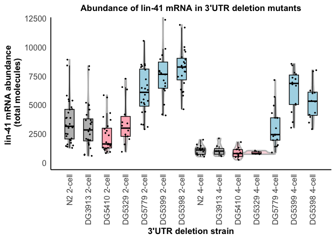
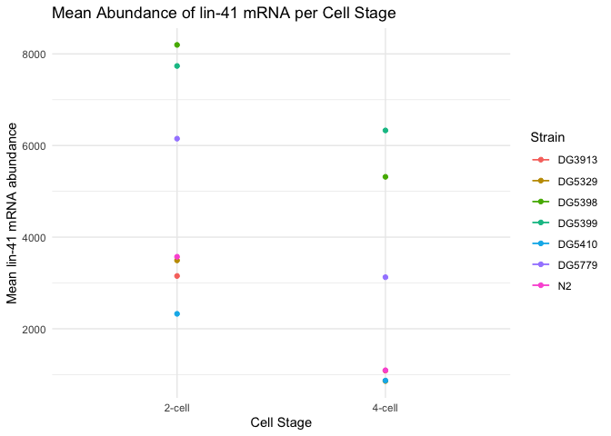

# 06 lin-41 3'UTR bashing analysis
================
Naly Torres
2025-08-04

- [1. Read input counts data](#1-read-input-counts-data)
- [2. Plot total mRNA abundance per
  strain](#2-plot-total-mrna-abundance-per-strain)
- [3. Plot mean abundace of groups across cell
  stages](#3-plot-mean-abundace-of-groups-across-cell-stages)
  - [4. Statistical analysis](#4-statistical-analysis)
- [4A. Normally distributed data](#4a-normally-distributed-data)
- [4B. Non-normally distributed data](#4b-non-normally-distributed-data)

``` r
library(knitr)
library(ggplot2)
library(dplyr)
library(rstatix)
```

### 1. Read input counts data

``` r
# Define relative input folder path
input_path <- "../01_input/Fig4_lin-41-3UTR-bashing.csv"

# Read the CSV file
df <- read.csv(input_path, stringsAsFactors = FALSE)

# Check data
#head(df)
#str(df)
# knitr::kable(df)
```

### 2. Plot total mRNA abundance per strain

``` r
# Define the custom order
custom_order <- c(
  "2-cell_N2", "2-cell_DG3913", "2-cell_DG5410", "2-cell_DG5329",
  "2-cell_DG5779", "2-cell_DG5399", "2-cell_DG5398",
  "4-cell_N2", "4-cell_DG3913", "4-cell_DG5410", "4-cell_DG5329",
  "4-cell_DG5779", "4-cell_DG5399", "4-cell_DG5398"
)

# Convert subdirectory to factor
df$subdirectory <- factor(df$subdirectory, levels = custom_order)

# Define fill colors
fill_colors <- c(
  "2-cell_N2" = "gray",       "4-cell_N2" = "gray",
  "2-cell_DG5410" = "lightpink", "4-cell_DG5410" = "lightpink",
  "2-cell_DG5398" = "lightblue", "4-cell_DG5398" = "lightblue",
  "2-cell_DG5779" = "lightblue", "4-cell_DG5779" = "lightblue",
  "2-cell_DG5399" = "lightblue", "4-cell_DG5399" = "lightblue",
  "2-cell_DG5329" = "lightpink", "4-cell_DG5329" = "lightpink",
  "2-cell_DG3913" = "gray",      "4-cell_DG3913" = "gray"
)

# Define x-axis labels
x_labels <- c(
  "2-cell_N2" = "N2 2-cell",
  "4-cell_N2" = "N2 4-cell",
  "2-cell_DG5410" = "DG5410 2-cell",
  "4-cell_DG5410" = "DG5410 4-cell",
  "2-cell_DG5398" = "DG5398 2-cell",
  "4-cell_DG5398" = "DG5398 4-cell",
  "2-cell_DG5779" = "DG5779 2-cell",
  "4-cell_DG5779" = "DG5779 4-cell",
  "2-cell_DG5399" = "DG5399 2-cell",
  "4-cell_DG5399" = "DG5399 4-cell",
  "2-cell_DG5329" = "DG5329 2-cell",
  "4-cell_DG5329" = "DG5329 4-cell",
  "2-cell_DG3913" = "DG3913 2-cell",
  "4-cell_DG3913" = "DG3913 4-cell"
)

# Create plot
p <- ggplot(df, aes(x = subdirectory, y = lin.41.mRNA.molecules, fill = subdirectory)) +
  geom_violin(alpha = 0.5, color = "gray", size = 1, width = 2,
              position = position_dodge(width = 0.99)) +
  geom_boxplot(width = 0.5, position = position_dodge(width = 0.99),
             outlier.shape = NA, color = "black", aes(fill = subdirectory)) +
  geom_jitter(height = 0, width = 0.2, color = "black", size = 0.5) +
  labs(
    title = "Abundance of lin-41 mRNA in 3'UTR deletion mutants",
    x = "3'UTR deletion strain",
    y = "lin-41 mRNA abundance \n (total molecules)"
  ) +
  scale_fill_manual(values = fill_colors) +
  scale_x_discrete(drop = FALSE, labels = x_labels) +
  coord_cartesian(ylim = c(0, 12000)) +
  theme_minimal(base_size = 14) +
  theme(
    axis.text.x = element_text(angle = 90, vjust = 0.5, hjust = 1),
    legend.position = "none",
    panel.grid.major = element_blank(),
    panel.grid.minor = element_blank(),
    panel.border = element_blank(),
    axis.line = element_line(color = "black"),
    plot.title = element_text(hjust = 0.5, size = 13, face = "bold"),
    axis.title = element_text(size = 13, face = "bold"),
    axis.text = element_text(size = 12),
    axis.ticks = element_blank()
  )

# Display the plot
print(p)
```

<!-- -->

``` r
# Save the plot as SVG with the date in the filename
ggsave(("../03_output/Fig4_lin-41-3UTR-bashing-abundance-violin-plot.svg"),
       p, width = 10, height = 6)
```

### 3. Plot mean abundace of groups across cell stages

``` r
# Calculate the mean abundance for each combination of cell stage and strain

mean_data <- df %>%
  group_by(Cell_Stage, Strain) %>%
  summarise(mean_abundance = mean(`lin.41.mRNA.molecules`)) %>%
  arrange(Strain)  # Arrange the data by strain for easier segmentation

# Create a line plot
p <- ggplot(mean_data, aes(x = Cell_Stage, y = mean_abundance, color = Strain)) +
  geom_line() +
  geom_point() +
  # Add horizontal segments to connect points of the same strain
  geom_segment(data = mean_data %>% group_by(Strain) %>% slice(1) %>% filter(!is.na(lead(Cell_Stage))),
               aes(x = Cell_Stage, xend = lead(Cell_Stage), y = mean_abundance, yend = mean_abundance, color = Strain)) +
  labs(title = "Mean Abundance of lin-41 mRNA per Cell Stage",
       x = "Cell Stage",
       y = "Mean lin-41 mRNA abundance",
       color = "Strain") +
  theme_minimal() +
  theme(legend.position = "right")

# Display the plot
print(p)
```

<!-- -->

``` r
# Save the plot as SVG with the date in the filename
ggsave(("../03_output/Fig4_lin-41-3UTR-bashing-mean-abundance-line-plot.svg"),
       p, width = 10, height = 6)
```

#### 4. Statistical analysis

### 4A. Normally distributed data

ANOVA: is there a difference amongst the groups? Tukey test: Which
groups are different?

``` r
# Test significantly differences in lin-41 mRNA abundance between each "subdirectory" ( dev. stage + strain)
# Perform ANOVA
anova_result <- aov(`lin.41.mRNA.molecules` ~ subdirectory, data = df)

# Get ANOVA summary as a table
anova_summary <- summary(anova_result)[[1]]

# Convert to data frame
anova_df <- as.data.frame(anova_summary)

# Add row names as a new column (e.g., Factor names)
anova_df$Term <- rownames(anova_df)

# Reorder columns to put Term first
anova_df <- anova_df[, c("Term", setdiff(names(anova_df), "Term"))]

# Save to CSV
output_path_anova <- "../03_output/Fig4_lin-41-3UTR-bashing_anova_summary.csv"
write.csv(anova_df, file = output_path_anova, row.names = FALSE)
knitr::kable(anova_df)
```

|              | Term         |  Df |     Sum Sq |  Mean Sq |  F value | Pr(\>F) |
|:-------------|:-------------|----:|-----------:|---------:|---------:|--------:|
| subdirectory | subdirectory |  13 | 1291984667 | 99383436 | 32.10082 |       0 |
| Residuals    | Residuals    | 224 |  693499112 |  3095978 |       NA |      NA |

``` r
# Perform Tukey's post hoc test
tukey_result <- TukeyHSD(anova_result)

# Extract Tukey results into a data frame
tukey_df <- as.data.frame(tukey_result$subdirectory)

# Add row names as a new column to identify the comparisons
tukey_df$Comparison <- rownames(tukey_df)

# Reorder columns to have 'Comparison' first
tukey_df <- tukey_df[, c("Comparison", setdiff(names(tukey_df), "Comparison"))]

# Save to CSV
output_path <- "../03_output/Fig4_lin-41-3UTR-bashing_tukey_posthoc_results.csv"
write.csv(tukey_df, file = output_path, row.names = FALSE)


# knitr::kable(tukey_df)
```

The ANOVA results indicate that there are significant differences among
the subdirectories (p \< 0.001). The Tukey’s post hoc results show these
differences:

DG5329 and DG5398 both have significantly higher lin 41 mRNA molecules
compared to N2 (p \< 0.001). DG5779 also has significantly higher lin 41
mRNA molecules compared to N2 (p = 0.006). DG5329 and DG5398 have
significantly higher lin 41 mRNA molecules compared to DG5410 (p \<
0.001). DG5779 has significantly higher lin 41 mRNA molecules compared
to DG5410 (p = 0.006). DG5779 and DG5398 have a significant difference
in lin 41 mRNA molecules (p = 0.017).

### 4B. Non-normally distributed data

Shapiro-Wilk: To check if your data in each group is normally
distributed. If norma you might use ANOVA. Kruskal-Wallis
(non-parametric version of ANOVA): Check if any of the groups are
significantly different from each other. Dunn’s test (non-parametric
post-hoc test): Compare all pairs of groups to find out what groups are
different.

``` r
# Run the Shapiro-Wilk test for normality on each group
shapiro_df <- df %>%
  group_by(subdirectory) %>%
  summarise(shapiro_p = shapiro_test(lin.41.mRNA.molecules)$p.value)

# Save Shapiro-Wilk results
shapiro_path <- "../03_output/Fig4_lin-41-3UTR-bashing_shapiro_results.csv"
write.csv(shapiro_df, shapiro_path, row.names = FALSE)
knitr::kable(shapiro_df)
```

| subdirectory  | shapiro_p |
|:--------------|----------:|
| 2-cell_N2     | 0.0063972 |
| 2-cell_DG3913 | 0.0178612 |
| 2-cell_DG5410 | 0.0020088 |
| 2-cell_DG5329 | 0.0743789 |
| 2-cell_DG5779 | 0.4260819 |
| 2-cell_DG5399 | 0.2514917 |
| 2-cell_DG5398 | 0.8139043 |
| 4-cell_N2     | 0.5777389 |
| 4-cell_DG3913 | 0.2392191 |
| 4-cell_DG5410 | 0.7309845 |
| 4-cell_DG5329 | 0.3004035 |
| 4-cell_DG5779 | 0.1983421 |
| 4-cell_DG5399 | 0.1801574 |
| 4-cell_DG5398 | 0.6018431 |

``` r
# If normality assumptions are violated, use non-parametric tests
# Kruskal-Wallis test
kruskal_test_results <- df %>%
  kruskal_test(lin.41.mRNA.molecules ~ subdirectory)

# Convert kruskal test to data frame for saving
kruskal_df <- as.data.frame(kruskal_test_results)

kruskal_path <- "../03_output/Fig4_lin-41-3UTR-bashing_kruskal_test_results.csv"
write.csv(kruskal_df, kruskal_path, row.names = FALSE)
knitr::kable(kruskal_df)
```

| .y.                   |   n | statistic |  df |   p | method         |
|:----------------------|----:|----------:|----:|----:|:---------------|
| lin.41.mRNA.molecules | 238 |  162.1467 |  13 |   0 | Kruskal-Wallis |

``` r
# Perform Dunn's post-hoc test if Kruskal-Wallis is significant
if (kruskal_test_results$p < 0.05) {
  dunn_df <- df %>%
    dunn_test(lin.41.mRNA.molecules ~ subdirectory, p.adjust.method = "bonferroni")
  
  dunn_path <- "../03_output/Fig4_lin-41-3UTR-bashing_dunn_posthoc_results.csv"
  write.csv(dunn_df, dunn_path, row.names = FALSE)
} else {
  cat("No significant differences among groups based on the Kruskal-Wallis test.\n")
}

# knitr::kable(dunn_df)
```

Based Shapiro-Wilk p-value, groups 2-cell_N2, 2-cell_DG3913, and
2-cell_DG5410 are not normal.

kruskal_test_results p \< 0.0001 show statistically significant
difference between the groups in terms of mRNA molecule counts.
