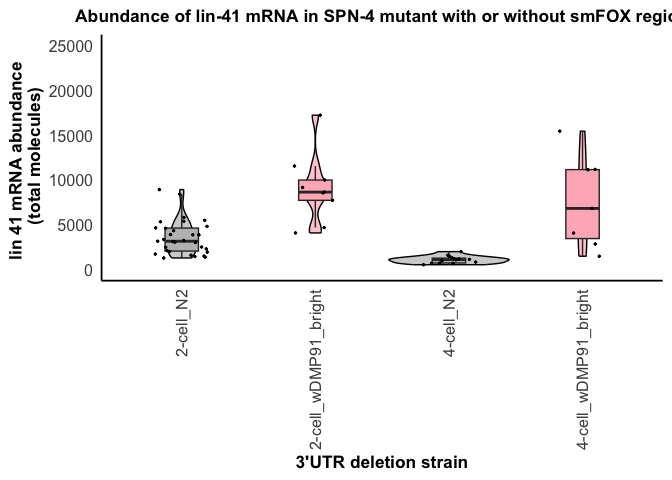
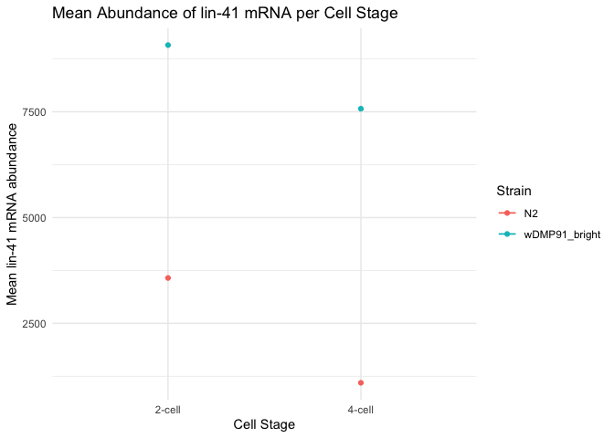
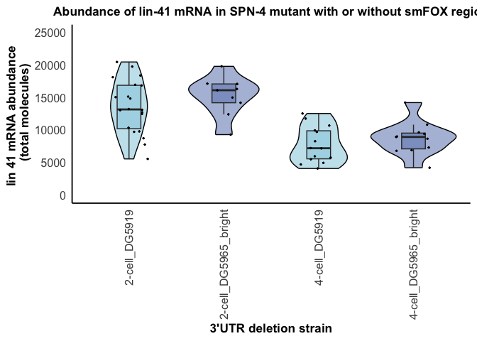
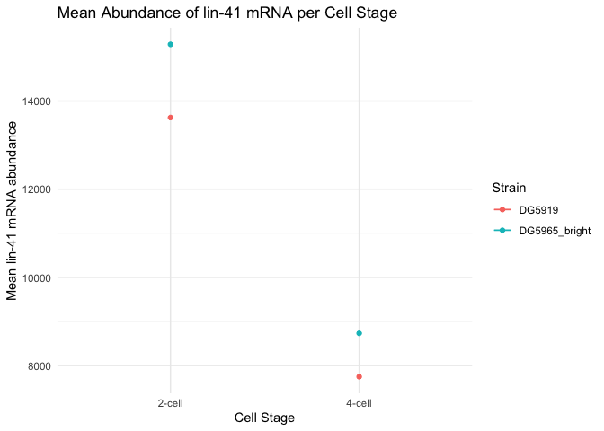

## Fig6_lin-41-abundance-double
================
Naly Torres
2025-08-04

- [1. Read input counts data](#1-read-input-counts-data)
- [2. Plot total mRNA abundance per
  strain](#2-plot-total-mrna-abundance-per-strain)
- [3. Plot mean abundace of groups across cell
  stages](#3-plot-mean-abundace-of-groups-across-cell-stages)
  - [4. Statistical analysis](#4-statistical-analysis)
- [4A. Normally distributed data](#4a-normally-distributed-data)
- [4B. Non-normally distributed data](#4b-non-normally-distributed-data)

``` r
library(knitr)
library(ggplot2)
library(dplyr)
library(rstatix)
```

### 1. Read input counts data

``` r
# Define relative input folder path
input_path <- "../01_input/Fig6_lin-41_abundance-double-mutant.csv"

# Read the CSV file
df <- read.csv(input_path, stringsAsFactors = FALSE)

# Check data
#head(df)
#str(df)
# knitr::kable(df)
```

### 2. Plot total mRNA abundance per strain

``` r
# Define the custom order for subdirectories
custom_order <- c("2-cell_N2", "2-cell_wDMP91_bright", "4-cell_N2", "4-cell_wDMP91_bright")

# Filter to only include desired subdirectories
df <- df[df$subdirectory %in% custom_order, ]

# Convert to factor with custom order
df$subdirectory <- factor(df$subdirectory, levels = custom_order)


fill_colors <- c(
  "2-cell_N2" = "gray", 
  "2-cell_wDMP91_bright" = "lightpink",
  "4-cell_N2" = "gray", 
  "4-cell_wDMP91_bright" = "lightpink"
)


# Create a combined violin and boxplot (flipped vertically)
p <- ggplot(df, aes(x = subdirectory, y = `lin_41_mRNA_molecules`, fill = subdirectory)) +
  geom_violin(alpha = 0.7, color = "black", size = 0.5, position = position_dodge(width = 0.99)) +
  geom_boxplot(width = 0.25, position = position_dodge(width = 0.99), outlier.shape = NA) +
  geom_jitter(height = 0, width = 0.2, color = "black", size = 0.5) +
  geom_vline(xintercept = c(3150, 1100), color = c("black", "red"), linetype = c("dashed", "longdash"), alpha = 0.5, size = 1) +  # Add two vertical lines
  labs(title = "Abundance of lin-41 mRNA in SPN-4 mutant with or without smFOX region",
       x = "3'UTR deletion strain",
       y = "lin 41 mRNA abundance \n (total molecules)",
       fill = "Cell stage") +  # Set the legend title here
  scale_fill_manual(values = fill_colors,
                    breaks = c("2-cell_N2", "4-cell_DG5410"),
                    labels = c("2-cell", "4-cell")) +
  scale_x_discrete(labels = c("2-cell_N2" = "2-cell_N2",
                              "4-cell_N2" = "4-cell_N2",
                              "2-cell_wDMP91_bright", "2-cell_wDMP91_bright",
                              "4-cell_wDMP91_bright", "4-cell_wDMP91_bright")) +
  theme_minimal(base_size = 14) +
  theme(axis.text.x = element_text(angle = 90, vjust = 0.5, hjust=1),  # Rotate labels on x-axis
        legend.position = "none",
        panel.grid.major = element_blank(),
        panel.grid.minor = element_blank(),
        panel.border = element_blank(),
        axis.line = element_line(color = "black"),
        plot.title = element_text(hjust = 0.5, size = 13, face = "bold"),
        plot.subtitle = element_text(size = 14),
        axis.title = element_text(size = 13, face = "bold"),
        axis.text = element_text(size = 12),
        axis.ticks = element_blank(),
        legend.title = element_text(size = 14),
        legend.text = element_text(size = 12)) +
  coord_cartesian(ylim = c(0, 25000)) +
  guides(fill = guide_legend(nrow = 2))  # Limit the legend to two rows

# Display the plot
print(p)
```

<!-- -->

``` r
# Save the plot as SVG with the date in the filename
ggsave(("../03_output/FigS6A_SPN4-mutant-control-violin-plot.svg"),
       p, width = 10, height = 6)
```

### 3. Plot mean abundace of groups across cell stages

``` r
# Calculate the mean abundance for each combination of cell stage and strain
mean_data <- df %>%
  group_by(Cell_Stage, Strain) %>%
  summarise(mean_abundance = mean(`lin_41_mRNA_molecules`)) %>%
  arrange(Strain)  # Arrange the data by strain for easier segmentation

# Create a line plot
p <- ggplot(mean_data, aes(x = Cell_Stage, y = mean_abundance, color = Strain)) +
  geom_line() +
  geom_point() +
  # Add horizontal segments to connect points of the same strain
  geom_segment(data = mean_data %>% group_by(Strain) %>% slice(1) %>% filter(!is.na(lead(Cell_Stage))),
               aes(x = Cell_Stage, xend = lead(Cell_Stage), y = mean_abundance, yend = mean_abundance, color = Strain)) +
  labs(title = "Mean Abundance of lin-41 mRNA per Cell Stage",
       x = "Cell Stage",
       y = "Mean lin-41 mRNA abundance",
       color = "Strain") +
  theme_minimal() +
  theme(legend.position = "right")

# Display the plot
print(p)
```

<!-- -->

``` r
# Save the plot as SVG with the date in the filename
ggsave(paste0("../03_output/FigS6A_SPN4-mutant-control-mean-abundance-line-plot.svg"),
       p, width = 10, height = 6)
```

#### 4. Statistical analysis

### 4A. Normally distributed data

ANOVA: is there a difference amongst the groups? Tukey test: Which
groups are different?

``` r
# Test significantly differences in lin-41 mRNA abundance between each "subdirectory" ( dev. stage + strain)
# Perform ANOVA
anova_result <- aov(`lin_41_mRNA_molecules` ~ subdirectory, data = df)

# Get ANOVA summary as a table
anova_summary <- summary(anova_result)[[1]]

# Convert to data frame
anova_df <- as.data.frame(anova_summary)

# Add row names as a new column (e.g., Factor names)
anova_df$Term <- rownames(anova_df)

# Reorder columns to put Term first
anova_df <- anova_df[, c("Term", setdiff(names(anova_df), "Term"))]

# Save to CSV
output_path_anova <- "../03_output/FigS6A_SPN4-mutant-control_anova_summary.csv"
write.csv(anova_df, file = output_path_anova, row.names = FALSE)
# knitr::kable(anova_df)


# Perform Tukey's post hoc test
tukey_result <- TukeyHSD(anova_result)

# Extract Tukey results into a data frame
tukey_df <- as.data.frame(tukey_result$subdirectory)

# Add row names as a new column to identify the comparisons
tukey_df$Comparison <- rownames(tukey_df)

# Reorder columns to have 'Comparison' first
tukey_df <- tukey_df[, c("Comparison", setdiff(names(tukey_df), "Comparison"))]

# Save to CSV
output_path <- "../03_output/FigS6A_SPN4-mutant-control_tukey_posthoc_results.csv"
write.csv(tukey_df, file = output_path, row.names = FALSE)
# knitr::kable(tukey_df)
```

### 4B. Non-normally distributed data

Shapiro-Wilk: To check if your data in each group is normally
distributed. If norma you might use ANOVA. Kruskal-Wallis
(non-parametric version of ANOVA): Check if any of the groups are
significantly different from each other. Dunn’s test (non-parametric
post-hoc test): Compare all pairs of groups to find out what groups are
different.

``` r
# Run the Shapiro-Wilk test for normality on each group
shapiro_df <- df %>%
  group_by(subdirectory) %>%
  summarise(shapiro_p = shapiro_test(lin_41_mRNA_molecules)$p.value)

# Save Shapiro-Wilk results
shapiro_path <- "../03_output/FigS6A_SPN4-mutant-control_shapiro_results.csv"
write.csv(shapiro_df, shapiro_path, row.names = FALSE)
# knitr::kable(shapiro_df)


# If normality assumptions are violated, use non-parametric tests
# Kruskal-Wallis test
kruskal_test_results <- df %>%
  kruskal_test(lin_41_mRNA_molecules ~ subdirectory)

# Convert kruskal test to data frame for saving
kruskal_df <- as.data.frame(kruskal_test_results)

kruskal_path <- "../03_output/FigS6A_SPN4-mutant-control_kruskal_test_results.csv"
write.csv(kruskal_df, kruskal_path, row.names = FALSE)
# knitr::kable(kruskal_df)


# Perform Dunn's post-hoc test if Kruskal-Wallis is significant
if (kruskal_test_results$p < 0.05) {
  dunn_df <- df %>%
    dunn_test(lin_41_mRNA_molecules ~ subdirectory, p.adjust.method = "bonferroni")
  
  dunn_path <- "../03_output/FigS6A_SPN4-mutant-control_dunn_posthoc_results.csv"
  write.csv(dunn_df, dunn_path, row.names = FALSE)
} else {
  cat("No significant differences among groups based on the Kruskal-Wallis test.\n")
}
# knitr::kable(dunn_df)
```

## FigS6B_lin41_smFOX_SPN4_double_controls
================
Naly Torres
2025-08-04

- [1. Read input counts data](#1-read-input-counts-data)
- [2. Plot total mRNA abundance per
  strain](#2-plot-total-mrna-abundance-per-strain)
- [3. Plot mean abundace of groups across cell
  stages](#3-plot-mean-abundace-of-groups-across-cell-stages)
  - [4. Statistical analysis](#4-statistical-analysis)
- [4A. Normally distributed data](#4a-normally-distributed-data)
- [4B. Non-normally distributed data](#4b-non-normally-distributed-data)

``` r
library(knitr)
library(ggplot2)
library(dplyr)
library(rstatix)
```

### 1. Read input counts data

``` r
# Define relative input folder path
input_path <- "../01_input/Fig6_lin-41_abundance-double-mutant.csv"

# Read the CSV file
df <- read.csv(input_path, stringsAsFactors = FALSE)

# Check data
#head(df)
#str(df)
# knitr::kable(df)
```

### 2. Plot total mRNA abundance per strain

``` r
# Define the custom order for subdirectories
custom_order <- c( "2-cell_DG5919", "2-cell_DG5965_bright", "4-cell_DG5919","4-cell_DG5965_bright")  # Add your actual order

# filter out any rows not in the custom order
df <- df[df$subdirectory %in% custom_order, ]

# Convert subdirectory to a factor with custom order
df$subdirectory <- factor(df$subdirectory, levels = custom_order)

fill_colors <- c(
  "2-cell_DG5919" = "lightblue",
  "4-cell_DG5919" = "lightblue",
  "2-cell_DG5965_bright" = "#8DA0CA", 
  "4-cell_DG5965_bright" = "#8DA0CA"
)


# Create a combined violin and boxplot (flipped vertically)
p <- ggplot(df, aes(x = subdirectory, y = `lin_41_mRNA_molecules`, fill = subdirectory)) +
  geom_violin(alpha = 0.7, color = "black", size = 0.5, position = position_dodge(width = 0.99)) +
  geom_boxplot(width = 0.25, position = position_dodge(width = 0.99), outlier.shape = NA) +
  geom_jitter(height = 0, width = 0.2, color = "black", size = 0.5) +
  geom_vline(xintercept = c(3150, 1100), color = c("black", "red"), linetype = c("dashed", "longdash"), alpha = 0.5, size = 1) +  # Add two vertical lines
  labs(title = "Abundance of lin-41 mRNA in SPN-4 mutant with or without smFOX region",
       x = "3'UTR deletion strain",
       y = "lin 41 mRNA abundance \n (total molecules)",
       fill = "Cell stage") +  # Set the legend title here
  scale_fill_manual(values = fill_colors,
                    breaks = c("2-cell_N2", "4-cell_DG5410"),
                    labels = c("2-cell", "4-cell")) +
  scale_x_discrete(labels = c("2-cell_DG5919" = "2-cell_DG5919",
                              "4-cell_DG5919" = "4-cell_DG5919",
                              "2-cell_DG5965_bright" = "2-cell_DG5965_bright",
                              "4-cell_DG5965_bright" = "4-cell_DG5965_bright")) +
  theme_minimal(base_size = 14) +
  theme(axis.text.x = element_text(angle = 90, vjust = 0.5, hjust=1),  # Rotate labels on x-axis
        legend.position = "none",
        panel.grid.major = element_blank(),
        panel.grid.minor = element_blank(),
        panel.border = element_blank(),
        axis.line = element_line(color = "black"),
        plot.title = element_text(hjust = 0.5, size = 13, face = "bold"),
        plot.subtitle = element_text(size = 14),
        axis.title = element_text(size = 13, face = "bold"),
        axis.text = element_text(size = 12),
        axis.ticks = element_blank(),
        legend.title = element_text(size = 14),
        legend.text = element_text(size = 12)) +
  coord_cartesian(ylim = c(0, 25000))

# Display the plot
print(p)
```

<!-- -->

``` r
# Save the plot as SVG with the date in the filename
ggsave(("../03_output/FigS6B_smFOX_SPN4_double_controls-violin-plot.svg"),
       p, width = 10, height = 6)
```

### 3. Plot mean abundace of groups across cell stages

``` r
# Calculate the mean abundance for each combination of cell stage and strain
mean_data <- df %>%
  group_by(Cell_Stage, Strain) %>%
  summarise(mean_abundance = mean(`lin_41_mRNA_molecules`)) %>%
  arrange(Strain)  # Arrange the data by strain for easier segmentation
# filter out any rows not in the custom order
df <- df[df$subdirectory %in% custom_order, ]
# Create a line plot
p <- ggplot(mean_data, aes(x = Cell_Stage, y = mean_abundance, color = Strain)) +
  geom_line() +
  geom_point() +
  # Add horizontal segments to connect points of the same strain
  geom_segment(data = mean_data %>% group_by(Strain) %>% slice(1) %>% filter(!is.na(lead(Cell_Stage))),
               aes(x = Cell_Stage, xend = lead(Cell_Stage), y = mean_abundance, yend = mean_abundance, color = Strain)) +
  labs(title = "Mean Abundance of lin-41 mRNA per Cell Stage",
       x = "Cell Stage",
       y = "Mean lin-41 mRNA abundance",
       color = "Strain") +
  theme_minimal() +
  theme(legend.position = "right")

# Display the plot
print(p)
```

<!-- -->

``` r
# Save the plot as SVG with the date in the filename
ggsave(("../03_output/FigS6B_smFOX_SPN4_double_controls-mean-abundance-line-plot.svg"),
       p, width = 10, height = 6)
```

#### 4. Statistical analysis

### 4A. Normally distributed data

ANOVA: is there a difference amongst the groups? Tukey test: Which
groups are different?

``` r
# Test significantly differences in lin-41 mRNA abundance between each "subdirectory" ( dev. stage + strain)
# Perform ANOVA
anova_result <- aov(`lin_41_mRNA_molecules` ~ subdirectory, data = df)

# Get ANOVA summary as a table
anova_summary <- summary(anova_result)[[1]]

# Convert to data frame
anova_df <- as.data.frame(anova_summary)

# Add row names as a new column (e.g., Factor names)
anova_df$Term <- rownames(anova_df)

# Reorder columns to put Term first
anova_df <- anova_df[, c("Term", setdiff(names(anova_df), "Term"))]

# Save to CSV
output_path_anova <- "../03_output/FigS6B_smFOX_SPN4_double_controls_anova_summary.csv"
write.csv(anova_df, file = output_path_anova, row.names = FALSE)
knitr::kable(anova_df)
```

|              | Term         |  Df |    Sum Sq |   Mean Sq |  F value | Pr(\>F) |
|:-------------|:-------------|----:|----------:|----------:|---------:|--------:|
| subdirectory | subdirectory |   3 | 500049430 | 166683143 | 14.80288 |   5e-07 |
| Residuals    | Residuals    |  50 | 563009331 |  11260187 |       NA |      NA |

``` r
# Perform Tukey's post hoc test
tukey_result <- TukeyHSD(anova_result)

# Extract Tukey results into a data frame
tukey_df <- as.data.frame(tukey_result$subdirectory)

# Add row names as a new column to identify the comparisons
tukey_df$Comparison <- rownames(tukey_df)

# Reorder columns to have 'Comparison' first
tukey_df <- tukey_df[, c("Comparison", setdiff(names(tukey_df), "Comparison"))]

# Save to CSV
output_path <- "../03_output/FigS6B_smFOX_SPN4_double_controls_tukey_posthoc_results.csv"
write.csv(tukey_df, file = output_path, row.names = FALSE)
# knitr::kable(tukey_df)
```

### 4B. Non-normally distributed data

Shapiro-Wilk: To check if your data in each group is normally
distributed. If norma you might use ANOVA. Kruskal-Wallis
(non-parametric version of ANOVA): Check if any of the groups are
significantly different from each other. Dunn’s test (non-parametric
post-hoc test): Compare all pairs of groups to find out what groups are
different.

``` r
# Run the Shapiro-Wilk test for normality on each group
shapiro_df <- df %>%
  group_by(subdirectory) %>%
  summarise(shapiro_p = shapiro_test(lin_41_mRNA_molecules)$p.value)

# Save Shapiro-Wilk results
shapiro_path <- "../03_output/FigS6B_smFOX_SPN4_double_controls_shapiro_results.csv"
write.csv(shapiro_df, shapiro_path, row.names = FALSE)
# knitr::kable(shapiro_df)


# If normality assumptions are violated, use non-parametric tests
# Kruskal-Wallis test
kruskal_test_results <- df %>%
  kruskal_test(lin_41_mRNA_molecules ~ subdirectory)

# Convert kruskal test to data frame for saving
kruskal_df <- as.data.frame(kruskal_test_results)

kruskal_path <- "../03_output/FigS6B_smFOX_SPN4_double_controls_kruskal_test_results.csv"
write.csv(kruskal_df, kruskal_path, row.names = FALSE)
# knitr::kable(kruskal_df)


# Perform Dunn's post-hoc test if Kruskal-Wallis is significant
if (kruskal_test_results$p < 0.05) {
  dunn_df <- df %>%
    dunn_test(lin_41_mRNA_molecules ~ subdirectory, p.adjust.method = "bonferroni")
  
  dunn_path <- "../03_output/FigS6B_smFOX_SPN4_double_controls_dunn_posthoc_results.csv"
  write.csv(dunn_df, dunn_path, row.names = FALSE)
} else {
  cat("No significant differences among groups based on the Kruskal-Wallis test.\n")
}
# knitr::kable(dunn_df)
```

